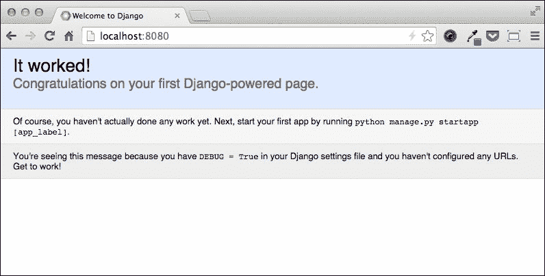
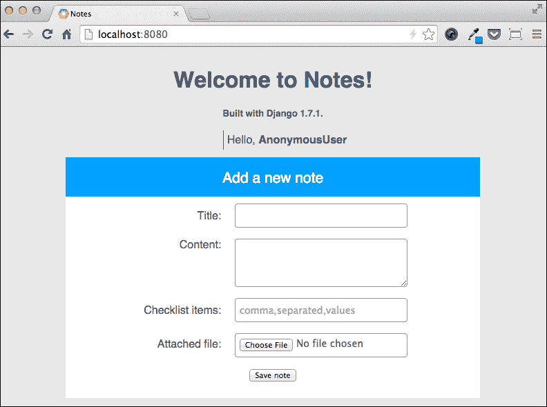
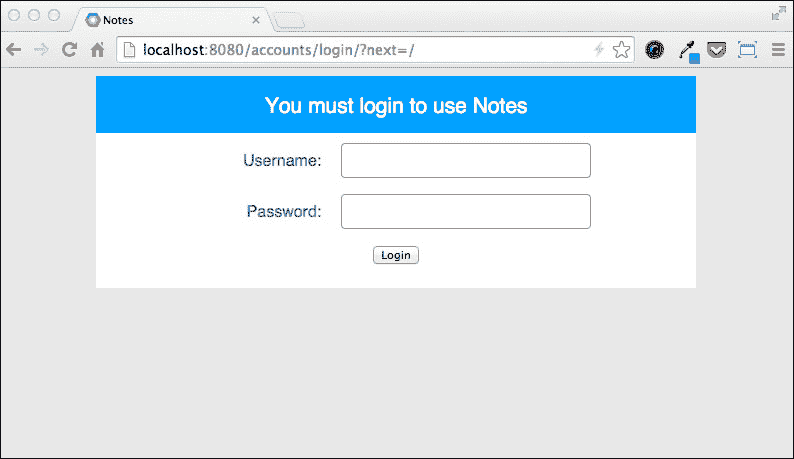

# 第七章. 使用 Django 构建应用程序

**Django**是一个用 Python 编写的开源 Web 应用程序框架，最初由 Adrian Holovaty 和 Simon Willison 于 2003 年编写，旨在快速解决为在线报纸提供基于 Web、数据库驱动的应用程序内容的需求。Django 于 2005 年作为开源项目向公众发布，并迅速获得了强大的支持。凭借来自世界各地成千上万的用户和贡献者，Django 现在是 Python 社区中最受欢迎的 Web 框架之一，由一个独立的非营利性基金会支持，该基金会推广项目并保护其知识产权。

对 Django 成功贡献最大的组件之一是其**对象关系映射**（**ORM**），这是一个数据访问层，它将底层的数据库与用 Python 编写的某些面向对象代码映射起来。起初，被认为是框架的强点的实际上在 App Engine 环境中变成了弱点。事实上，Django 仅支持关系数据库，因此排除了 Datastore 选项。

然而，在 Google Cloud SQL 服务发布之后，事情发生了深刻的变化，现在我们可以在 Google Cloud Platform 上使用 Django 及其 ORM 与关系数据库。在本章中，我们将重新实现原始 Notes 应用程序的几个功能，从头开始使用 Django 而不是 webapp2 框架，展示 App Engine 平台如何成为部署和运行 Django 应用程序的可行解决方案。

在本章中，我们将涵盖以下主题：

+   配置开发环境

+   通过使用内置的认证系统使用 ORM 与 Cloud SQL

+   在 Google Cloud Storage 上上传文件

# 设置本地环境

在撰写本书时，App Engine 为 Python 2.7 运行环境提供了一个第三方库，提供了 Django 版本 1.4 和 1.5。尽管它相当古老（Django 1.4 于 2012 年 3 月发布，1.5 于 2013 年 2 月发布），但 1.4 版本目前是长期支持发行框架，保证直到 2015 年 3 月提供安全补丁和数据丢失修复，而 1.5 版本（因此在 App Engine 上标记为实验性）与 1.4 版本相比，包含了许多新功能和改进。因此，我们可以安全地使用 App Engine 提供的 Django 包之一来构建我们的应用程序，而不用担心产生遗留代码的风险。

然而，如果我们能够放弃 Google 为 Django 1.4 和 1.5 提供的官方支持，我们可以使用目前可用的最新 Django 版本 1.7，唯一的区别是我们将不得不自己处理包的部署，因为我们不会在生产服务器上找到它。

由于使用 Django 1.4 和 1.5 编写的应用程序的部署在官方文档中得到了很好的覆盖，并且我们正在构建一个原型，其唯一目的是学习如何充分利用 Google App Engine，因此我们将使用 Django 1.7 开发我们的 Django Notes 应用程序；让我们看看如何操作。

## 配置虚拟环境

当我们需要使用与操作系统提供的包管理器中提供的版本不同的特定 Python 包版本时，最好使用像 **virtualenv** 这样的工具在单独的环境中隔离此类软件的安装，以避免冲突。

假设我们使用的是 Python 2.7，我们可以使用 `pip` 软件包管理器来安装 virtualenv：

```py
pip install virtualenv

```

现在，我们可以像在 第一章，*入门* 中所做的那样，简单地创建应用程序根文件夹来启动一个新的 App Engine 应用程序：

```py
mkdir django_notes && cd django_notes

```

现在，我们可以在应用程序文件夹内设置一个虚拟环境：

```py
virtualenv .

```

每次我们想在虚拟环境中工作之前，都需要激活它，这样我们就可以透明地使用 Python 和 pip 可执行文件来运行代码和安装包。对于 Linux 和 Mac OS X，我们可以这样激活虚拟环境：

```py
source ./bin/activate

```

对于 Windows，我们可以在 `Scripts` 文件夹中简单地调用激活脚本：

```py
Scripts\activate

```

要取消虚拟环境并停止引用隔离的 Python 安装，我们可以为每个支持的操作系统发出以下命令：

```py
deactivate

```

我们现在需要让本地的 App Engine Python 运行时对虚拟环境可用。如果我们遵循了 第一章，*入门* 中的说明，那么现在我们应该已经将 App Engine 安装在文件系统上的某个路径上，具体取决于我们运行的操作系统。注意这个路径；例如，在 Mac OS X 上，App Engine SDK 被符号链接到 `/usr/local/google_appengine` URL。然后我们创建一个名为 `gae.pth` 的文件，并将其放入虚拟环境的 `site-package` 目录中，路径为 `$VIRTUAL_ENV/lib/python2.7/site-packages/`。

`$VIRTUAL_ENV` 变量是一个环境变量，在虚拟环境激活期间可用，它指向我们本地文件系统上的虚拟环境安装。`.pth` 文件必须包含以下行：

```py
/path/to/appengine/sdk # /usr/local/google_appengine on Mac OS X
import dev_appserver; dev_appserver.fix_sys_path()
```

为了检查一切是否正常工作，我们可以激活环境并尝试导入 App Engine 包。例如，在 Linux 和 Mac OS X 上，我们可以这样做：

```py
source bin/activate
python -c"import google"

```

## 安装依赖项

现在我们已经为我们的应用程序设置了一个虚拟环境，我们可以开始安装运行 Django Notes 应用程序所需的依赖项。当然，我们需要安装的第一个包是 Django：

```py
pip install django -t <app_root>

```

正如我们在第三章“存储和处理用户数据”中所学，我们需要使用`-t`选项安装包，以便在部署过程中将其上传到生产服务器。

由于 Django 也由 App Engine Python SDK 提供，我们需要确保当我们导入`import django`包时，Python 实际上是指向应用程序根文件夹中的 1.7 包。有许多方法可以实现这一点，但我们将以下内容添加到`gae.pth`文件中：

```py
/path/to/appengine/sdk # /usr/local/google_appengine on Mac OS X
import dev_appserver; dev_appserver.fix_sys_path()
import sys; sys.path.insert(1, '/path/to/application/root')
```

由于`fix_sys_path()`函数将所有 App Engine 包和模块添加到 Python 路径的前面，我们需要在添加其他任何内容之前插入 Django 1.7 所在的位置。这就是为什么我们在这里使用`sys.path.insert()`函数。为了确保我们使用的是正确的 Django 版本，一旦虚拟环境工具激活，我们可以在命令行中写下以下内容：

```py
python -c"import django; print django.get_version()"

```

输出应该是类似`1.7.1`的。

只要我们需要，我们就会继续添加包，但我们必须记住每次想要在本地运行项目或部署应用程序，以及每次安装新包时，都要激活虚拟环境，最重要的是每次安装新包时。

# 使用 Django 1.7 重写我们的应用程序

我们已经创建了应用程序根文件夹，也就是我们安装虚拟环境的同一个文件夹。Django 提供了一个名为`project`的脚本，用于构建标准应用程序布局，同时也为配置文件提供了一些默认内容。要在应用程序根目录内启动一个新的项目，我们在命令行中输入以下内容：

```py
django/bin/django-admin.py startproject notes

```

现在，我们应该在我们的应用程序根目录中有一个名为`notes`的文件夹，其中包含一个名为`wsgi.py`的 Python 模块，我们需要注意它，因为我们将在`app.yaml`文件中使用它。

如我们所知，要创建一个新的 App Engine 应用程序，我们需要提供一个`app.yaml`文件。我们可以从之前的章节中选择任何一个`app.yaml`文件作为基础，然后按照以下方式重写它：

```py
application: the_registered_application_ID
version: 2
runtime: python27
api_version: 1
threadsafe: yes

handlers:
- url: /static
  static_dir: static

- url: /.*
  script: notes.wsgi.application
```

我们更改了版本号，这样我们就可以轻松管理在任何时候应该运行在生产服务器上的应用程序：是使用 webapp2 框架构建的旧版本，还是使用 Django 构建的新版本。我们只定义了一个处理器，它将匹配任何 URL 的请求，并使用`wsgi.py`模块中的应用程序实例来提供服务，该模块是由项目文件夹内的`django_admin.py`脚本生成的。

现在，我们可以运行开发服务器，并将浏览器指向`http://localhost:8080` URL。如果 Django 运行正常，我们应该看到如下信息：



正如网页本身所述，我们已经使用 Django 网络框架在 App Engine 上创建了我们的第一个应用程序。现在我们可以继续前进，让我们的应用程序做些更有用的事情。

## 使用 Google Cloud SQL 作为数据库后端

我们已经提到，我们将使用 Google Cloud SQL 作为关系型数据库后端，这样我们就可以运行 Django 框架的每个组件，而无需求助于额外的包或衍生项目。

配置关系型数据库层以使 ORM 工作是我们开发 Django 应用程序时必须采取的第一步之一。实际上，几个关键组件，如用户认证机制，都依赖于一个正常工作的数据库。

Django ORM 默认完全支持 MySQL 数据库，因此我们使用 Google Cloud SQL 所需的额外软件仅仅是 MySQLdb Python 包，我们将使用 `pip` 软件包管理器来安装它，就像我们在第五章中做的那样，*在 Cloud SQL 中存储数据*。以下命令用于安装该包：

```py
pip install MySQL-python

```

要在生产服务器上使用该包，我们必须将以下内容添加到我们的 `app.yaml` 文件中：

```py
libraries:
- name: MySQLdb
  version: "latest"
```

我们已经知道如何配置 Google Cloud SQL，因此我们假设此时我们已经有一个正在运行的实例。我们可以从本地开发环境和 App Engine 应用程序中访问它，并且我们已经为该项目创建了一个数据库。

如果我们打开 Django 项目文件夹内的 `settings.py` 模块，我们会看到它包含以下内容：

```py
DATABASES = {
    'default': {
        'ENGINE': 'django.db.backends.sqlite3',
        'NAME': os.path.join(BASE_DIR, 'db.sqlite3'),
    }
}
```

Django 可以从单个应用程序同时使用和连接到多个关系型数据库，`DATABASES` 字典包含一个 Python 字典，其中包含每个数据库的配置。对于像我们的笔记这样的小型应用程序，我们可以只使用一个数据库——标记为 `default` 的数据库。当从我们的本地开发环境连接到 Cloud SQL 时以及当应用程序在 App Engine 生产服务器上运行时所需的参数略有不同，因此如果我们只想保留一个设置模块的版本，我们需要添加一些逻辑。

首先，我们需要在 `<app_root>/notes/notes` 路径下创建一个 `utils.py` 模块，其中包含来自第五章的 `on_appengine()` 函数，以确定我们的应用程序是否在 App Engine 上运行：

```py
import os

def on_appengine():
    return os.getenv('SERVER_SOFTWARE', '').startswith('Google App Engine')
```

然后，我们编辑 `settings.py` 模块，并使用以下代码更改 `DATABASES` 字典：

```py
# Database
# https://docs.djangoproject.com/en/1.7/ref/settings/#databases

from .utils import on_appengine

DATABASES = {
    'default': {
        'ENGINE': 'django.db.backends.mysql',
        'NAME': 'notes',
        'USER': 'notes',
        'PASSWORD': 'notes_password',
    }
}
if on_appengine():
    DATABASES['default']['HOST'] = '/cloudsql/my-project-id:myfirst'
else:
    DATABASES['default']['HOST'] = '<instance_ip>'
```

当我们从本地开发环境和 App Engine 生产服务器连接时，我们使用相同的 Python 数据库驱动程序。数据库名称和用户凭据也是相同的，但我们需要根据应用程序运行的位置指定不同的 `HOST` 参数，因为在 App Engine 上，连接是通过 Unix 套接字执行的，而在本地连接中，我们使用 TCP 套接字。如果我们想使用本地的 MySQL 安装，我们可以相应地更改 `NAME`、`USER`、`PASSWORD` 和 `HOST` 参数。

在进行配置关系型数据库的最终步骤之前，我们需要介绍**迁移**的概念，这是 Django 1.7 的新特性。由于 ORM 将 Python 对象映射到数据库模式，因此它可能需要根据我们对 Python 代码所做的更改相应地更改模式。Django 将这些更改写入一个或多个位于项目源树中的`migration`文件夹中的迁移文件。我们将在本章后面看到如何处理迁移。目前，我们只需要调用一个名为`migrate`的命令来创建数据库模式的第一版。

### 注意

要调用 Django 命令，我们使用由`django_admin.py`脚本在首次创建项目时生成的`manage.py`脚本。在项目文件夹中，我们可以这样启动命令：

```py
python manage.py <command>
```

要查看可用命令的列表，我们可以不带参数调用`manage.py`脚本：

```py
python manage.py
```

要启动`migrate`命令，我们在命令行中输入以下内容：

```py
python manage.py migrate

```

如果 Cloud SQL 实例配置良好，我们应该看到以下输出：

```py
Operations to perform:
 Apply all migrations: admin, contenttypes, auth, sessions
Running migrations:
 Applying contenttypes.0001_initial... OK
 Applying auth.0001_initial... OK
 Applying admin.0001_initial... OK
 Applying sessions.0001_initial... OK

```

由于用户身份验证系统默认可用，我们可以使用以下命令向系统中添加一个`superuser`用户：

```py
python manage.py createsuperuser

```

命令将提示用户名、电子邮件地址和密码。我们可以提供我们选择的凭据。

## 在 Django 中创建可重用应用程序

当我们提到由`django_admin.py`脚本生成的文件系统布局时，我们已经使用了`project`这个术语。它包含运行我们的名为 Notes 的 Web 应用程序所需的所有代码和资源。Django 项目的核心是其设置文件，它定义了全局环境和配置，我们已经在设置关系型数据库层时看到了如何使用它。

现在是时候介绍“应用程序”这个术语了。在 Django 术语中，一个`application`是一个 Python 包，它提供了一组定义良好的功能，并且可以在不同的 Django 项目中重用。我们不应该混淆 Django 中定义的“应用程序”术语和更通用的“Web 应用程序”术语。尽管 Notes 在广义上实际上是一个应用程序，但它被开发为一个 Django 项目，并包含一些称为 Django 应用程序的功能块。

Django 应用程序通常包含 ORM 模型类、视图函数和类、HTML 模板以及静态资源。可以通过`pip`包管理器安装`application`包，或者与`project`包一起提供。我们需要知道，Django 项目只有在`settings.py`模块中的`INSTALLED_APPS`设置值中列出时，才会使用应用程序。

我们将创建一个名为`core`的 Django 应用程序来实现 Notes 的核心功能。为了在我们的项目中创建一个空的应用程序，我们可以使用`startapp`命令并传递应用程序的名称：

```py
python manage.py startapp core

```

我们可以看到命令如何在我们的项目文件夹中创建了一个名为`core`的 Python 包，正如我们请求的那样。该包包含了一组我们将要实现的标准模块，正如我们稍后将看到的。

如前所述，我们需要在我们的`INSTALLED_APPS`设置中列出我们新创建的应用程序，以便告诉 Django 必须使用它：

```py
INSTALLED_APPS = (
    'django.contrib.admin',
    'django.contrib.auth',
    'django.contrib.contenttypes',
    'django.contrib.sessions',
    'django.contrib.messages',
    'django.contrib.staticfiles',

    'core',
)
```

Django 1.7 提供了一个由`django.apps`包提供的名为`apps`的注册表，它为每个已安装的应用程序存储一个`AppConfig`对象。我们可以使用`AppConfig`对象来检查应用程序的元数据或更改特定应用程序的配置。要查看`apps`注册表的实际操作，我们可以像这样访问 Django shell：

```py
python manage.py shell

```

然后，我们可以测试以下 Python 代码：

```py
>>> from django.apps import apps
>>> apps.get_app_config('core').verbose_name
'Core'
>>> apps.get_app_config('core').path
u'/opt/projects/django_notes/notes/core'

```

## 视图和模板

现在数据后端已经功能正常，我们可以开始实现第一个构建块——为我们的 Notes 网络应用程序提供显示主页的视图。在 Django 的世界里，视图不过是一个接收 HTTP 请求并返回 HTTP 响应的 Python 函数或类，它实现了构建最终发送给客户端的内容所需的任何逻辑。我们将把构建主页的视图实现代码添加到我们在`core`应用程序中创建的`views.py`模块中：

```py
from django.shortcuts import render
from django import get_version

def home(request):
    context = {'django_version': get_version()}
    return render(request, 'core/main.html', context)
```

被称为`home`的视图参数在 webapp2 版本的 Notes 中与`MainHandler`类的`get()`方法执行非常相似的操作。我们创建一个`context`字典，该字典将在渲染过程中传递给模板。然后我们调用`render()`方法，该方法传递我们作为参数接收的相同的`request`对象——一个包含 HTML 模板路径的字符串。它将被用于页面和`context`字典。

在 webapp2 版本的 Notes 中，我们使用了 Jinja2 来渲染我们的页面，但 Django 已经在其框架中集成了自己的模板系统。我们在 HTML 文件中使用的语言与 Jinja2 非常相似，但仍然存在一些主要差异，因此我们必须重写我们的模板。我们在`project`文件夹相对路径的`core/templates/core/main.html`处创建了一个新的 HTML 文件，包含以下代码：

```py
<!DOCTYPE html>
<html>
<head lang="en">
  <meta charset="UTF-8">
  <title>Notes</title>

  <link rel="stylesheet" type="text/css" href="/static/css/notes.css">
</head>
<body>
  <div class="container">

    <h1>Welcome to Notes!</h1>
    <h5>Built with Django {{ django_version }}.</h5>

    <ul class="menu">
      <li>Hello, <b>{{ user }}</b></li>
    </ul>

    <form action="" method="post" enctype="multipart/form-data">
      <legend>Add a new note</legend>
      <div class="form-group">
        <label>Title: <input type="text" id="title" name="title"/>
        </label>
      </div>
      <div class="form-group">
        <label for="content">Content:</label>
        <textarea id="content" name="content"></textarea>
      </div>
      <div class="form-group">
        <label for="checklist_items">Checklist items:</label>
        <input type="text" id="checklist_items" name="checklist_items"
               placeholder="comma,separated,values"/>
      </div>
      <div class="form-group">
        <label for="uploaded_file">Attached file:</label>
        <input type="file" id="uploaded_file" name="uploaded_file">
      </div>
      <div class="form-group">
        <button type="submit">Save note</button>
      </div>
    </form>
  </div>

</body>
</html>
```

注意在模板中我们是如何使用`{{ django_version }}`元素，它输出我们在`context`字典中放置的变量，以及`{{ user }}`元素，这是 Django 认证系统默认提供的。由于我们没有执行登录，当前用户被设置为称为**匿名用户**的特殊实体。

现在我们有一个提供 HTTP 响应和用于渲染 HTML 页面的模板的视图函数，我们需要将我们选择的 URL 映射到该视图，就像我们在 webapp2 中做的那样。Django 有一个名为`urls.py`的 URL 配置器模块（也称为`URLconf`模块），它包含纯 Python 代码，并定义了使用正则表达式描述的 URL 与视图函数或类之间的映射。`django_admin.py`脚本生成一个我们可以用作起点的`urls.py`模块，但映射首页视图的最终版本应该是以下内容：

```py
from django.conf.urls import patterns, include, url

urlpatterns = patterns('',
    url(r'^$', 'core.views.home', name='home'),
)
```

一个`URLconf`模块必须定义一个名为`urlpatterns`的变量，并包含一个`django.conf.urls.url`实例的列表，这些实例将被 Django 按顺序迭代，直到其中一个与请求的 URL 匹配。当发生正则表达式匹配时，Django 停止迭代，并可能执行以下两个操作：

1.  导入并调用作为参数传递的`view`。

1.  处理一个`include`语句，该语句从另一个模块加载一个`urlpattern`对象。

在我们的情况下，我们匹配域的根 URL，并导入我们在`views.py`模块中先前定义的`home`函数视图。

最后，我们将与 webapp2 版本 Notes 相同的 CSS 文件放在相对于 App Engine 应用程序根文件夹的`static/css/notes.css`路径下，我们应该得到以下截图所示的首页结果：



## 使用 Django 验证用户

为了验证我们的用户，我们不会使用 App Engine 用户服务，而是完全依赖 Django。Django 提供了一个内置的用户认证系统，它还提供了授权检查。我们可以验证用户是否是他们所声称的人，并确定他们被允许做什么。认证系统作为 Django 应用程序实现，我们必须确保在尝试使用它之前，它已列在`INSTALLED_APPS`设置中，如下所示：

```py
INSTALLED_APPS = (
    'django.contrib.admin',
    'django.contrib.auth',
    'django.contrib.contenttypes',
    'django.contrib.sessions',
    'django.contrib.messages',
    'django.contrib.staticfiles',

    'core',
)
```

认证系统还负责将`user`变量添加到模板上下文中，这样我们就可以在我们的 HTML 模板中写入`{{ user }}`。

由于我们不会使用 App Engine 用户服务，我们必须自己实现登录和注销页面，而 Django 通过提供两个现成的视图来帮助我们，这些视图分别作为登录和注销页面。首先，我们需要在`URLconf`模块中将登录和注销 URL 映射到这些视图，因此我们在`urls.py`模块中添加以下内容：

```py
from django.contrib.auth import views as auth_views

urlpatterns = patterns('',
    url(r'^$', 'notes.views.home', name='home'),
    url(r'^accounts/login/$', auth_views.login),
    url(r'^accounts/logout/$', auth_views.logout),
)
```

即使登录用户的逻辑是免费的，我们也需要提供一个登录页面的 HTML 模板。我们在`core`应用的`template`文件夹内添加一个名为`registration`的文件夹，并在其中创建一个名为`login.html`的文件，包含以下代码：

```py
<!DOCTYPE html>
<html>
<head lang="en">
  <meta charset="UTF-8">
  <title>Notes</title>

  <link rel="stylesheet" type="text/css" href="/static/css/notes.css">
</head>
<body>
  <div class="container">
    <form action="" method="post">
      
      <legend>You must login to use Notes</legend>
      <div class="form-group">
        <label for="username">Username:</label>
        <input type="text" id="username" name="username"/>
      </div>
      <div class="form-group">
        <label for="password">Password:</label>
        <input type="password" id="password" name="password"/>
      </div>
      <div class="form-group">
        <button type="submit">Login</button>
      </div>
      <input type="hidden" name="next" value="{{ next }}" />
    </form>
  </div>
</body>
</html>
```

我们使用与主页相同的样式表和页面结构来显示登录表单。为了填充表单的 `action` 属性，我们使用 `url` 模板标签，它检索具有给定名称的视图的 URL。在这种情况下，该属性将包含映射到 `django.contrib.auth.views.login` 视图的 URL。然后我们使用 `` 模板标签在表单内创建一个 Django 需要的字段，以防止 **跨站请求伪造** (**CSRF**) 攻击。我们还添加了一个包含我们想要在成功登录后重定向用户的 URL 的隐藏字段。此 URL 由 Django 处理，认证系统负责在模板上下文中填充 `next` 值。

当我们的用户尝试访问受登录保护的 URL 时，他们将被自动重定向到登录页面。为了看到认证系统的工作情况，我们告诉 Django 通过在 `core` 应用程序内的 `views.py` 模块中添加以下代码来保护 `home` 视图：

```py
from django.contrib.auth.decorators import login_required

@login_required()
def home(request):
    context = {'django_version': get_version()}
    return render(request, 'core/main.html', context)
```

现在我们已经将 `login_required()` 函数装饰器添加到了 `home` 视图中，只有登录用户才能看到页面内容，其他人将被重定向到登录页面。如果我们尝试访问 `http://localhost:8080` URL，我们应该看到以下内容：



我们可以登录使用 `superuser` 用户，使用我们在本章前面 `createsuperuser` 命令执行期间提供的相同凭据。

最后，我们必须提供一个指向注销视图的链接，用户可以通过它来终止他们的认证会话。在 `main.html` 模板文件中，我们添加以下代码：

```py
<ul class="menu">
  <li>Hello, <b>{{ user }}</b></li>
  <li>
    <a href="">Logout</a>
  </li>
</ul>
```

我们只需检索映射到注销视图的 URL，Django 就会完成剩下的工作，执行所有必要的操作以使用户注销。

## 使用 ORM 和迁移系统

我们已经熟悉 webapp2 提供的模型类，因为在 第二章 *更复杂的应用* 中，我们使用它们将 Python 对象映射到数据存储实体。Django 使用几乎相同的方法；我们定义从 `django.db.models.Model` 包派生的 Python 类，ORM 组件负责将这些类的实例映射到底层关系数据库中的行和表中。为了看到 ORM 的工作情况，我们在 `core` 应用程序内的 `models.py` 模块中添加以下模型：

```py
from django.db import models
from django.contrib.auth.models import User

class Note(models.Model):
    title = models.CharField(max_length=10)
    content = models.TextField(blank=False)
    date_created = models.DateTimeField(auto_now_add=True)
    owner = models.ForeignKey(User)

class CheckListItem(models.Model):
    title = models.CharField(max_length=100)
    checked = models.BooleanField(default=False)
    note = models.ForeignKey('Note', related_name='checklist_items')
```

我们定义了一个 `Note` 模型类，它包含一个 `title` 属性，包含少量文本（最多十个字符），一个 `content` 属性，包含任意长度的文本，一个 `date_created` 属性，包含日期和时间，以及一个 `owner` 属性，它是一个外键，引用 Django 认证系统中的 `User` 模型的一个实例。由于我们向 `TextField` 模型字段构造函数传递了 `blank=False` 参数，因此 `content` 属性是必需的。

我们随后定义了一个`CheckListItem`模型类，它包含一个`title`属性，该属性包含少量文本（最多一百个字符），一个`checked`属性，该属性包含一个默认为`False`参数的布尔值，如果不指定，以及一个`note`属性，它是一个外键，指向`Note`模型。我们传递给`ForeignKey`模型字段构造函数的`related_name='checklist_items'`参数意味着我们将能够通过在实例本身上访问一个名为`checklist_items`的属性来访问与`Note`实例相关联的清单项集合。

为了将我们的模型转换为映射到关系数据库所需的 SQL 代码，我们需要执行迁移，更确切地说，是初始迁移，因为这是我们第一次为核心应用程序执行此操作：

```py
python manage.py makemigrations core

```

迁移的输出应该是以下内容：

```py
Migrations for 'core':
 0001_initial.py:
 - Create model CheckListItem
 - Create model Note
 - Add field note to checklistitem

```

`makemigrations`命令在`core`应用程序路径内创建一个名为`migration`的文件夹，并包含一个名为`0001_initial.py`的迁移文件。迁移文件包含 ORM 需要执行的操作列表，以便将当前的 Python 代码映射到数据库模式，相应地创建或更改表。

### 备注

迁移文件是代码库的一部分，应该像任何其他 Python 模块一样置于版本控制之下。

要将更改应用到数据库，我们需要使用以下命令执行迁移：

```py
python manage.py migrate core

```

对数据库应用更改的输出应该是以下内容：

```py
Operations to perform:
 Apply all migrations: core
Running migrations:
 Applying core.0001_initial... OK

```

在这一点上，我们已经为我们的核心应用程序创建了数据库模式。如果我们想确认迁移系统产生的确切 SQL 代码，我们可以发出以下命令：

```py
python manage.py sqlmigrate core 0001_initial

```

此命令将在命令行上打印出为我们初始迁移产生的 SQL 代码。

在这一点上，我们可能会注意到我们的`Note`模型有一个`title`字段，它实际上太小，无法包含描述性标题，因此我们在`models.py`中更改它：

```py
class Note(models.Model):
    title = models.CharField(max_length=100)
    content = models.TextField(blank=False)
    date_created = models.DateTimeField(auto_now_add=True)
```

当然，这个更改将改变数据库模式，因此我们需要执行迁移：

```py
python manage.py makemigrations core

```

这次，输出将是以下内容：

```py
Migrations for 'core':
 0002_auto_20141101_1128.py:
 - Alter field title on note

```

在迁移文件夹中添加了一个名为`0002_auto_20141101_1128.py`的文件，其中包含更改数据库模式以反映我们新的 Python 代码所需的 SQL 指令。我们需要采取的最后一步是应用迁移：

```py
python manage.py migrate core

```

## 使用表单 API 处理表单

现在我们已经准备好存储我们的数据，我们可以实现处理主页上显示的表单以创建新笔记所需的代码，Django 的表单 API 将简化并自动化这一工作的很大一部分。特别是，我们将让 Django 负责以下工作：

+   自动从我们的`Note`模型类的内容创建 HTML 表单

+   处理和验证提交的数据

+   提供 CSRF 安全检查

首先，我们实现一个从`django.forms.ModelForm`类派生的类，这将使我们能够定义和处理我们的表单。在`core`应用程序内部，我们创建了一个名为`forms.py`的新 Python 模块，包含以下行：

```py
from django import forms
from .models import Note

class NoteForm(forms.ModelForm):
    class Meta:
        model = Note
        exclude = ['id', 'date_created', 'owner']
```

我们定义了一个 Python 类，实现了一个所谓的 `model` 表单，这是一个 Django `form` 类，它定义并验证来自 Django 模型的数据。我们在 `NoteForm` 类内部定义了另一个名为 `Meta` 的类。它包含表单的元数据，主要是它将要工作的模型名称以及我们不想在 HTML 表单中显示的模型字段列表。

我们将在 `home` 视图中使用 `NoteForm` 类，因此我们在 `views.py` 模块中添加以下内容：

```py
from django.http import HttpResponseRedirect
from django.core.urlresolvers import reverse
from .forms import NoteForm

@login_required()
def home(request):
    user = request.user
    if request.method == "POST":
        f = NoteForm(request.POST)
        if f.is_valid():
            note = f.save(commit=False)
            note.owner = user
            note.save()
            return HttpResponseRedirect(reverse('home'))

    else:
        f = NoteForm()

    context = {
        'django_version': get_version(),
        'form': f,
        'notes': Note.objects.filter(owner=user).order_by('-id'),
    }
    return render(request, 'core/main.html', context)
```

我们最初分配一个包含当前登录用户实例的 `user` 变量。然后我们检查视图是否正在服务一个 HTTP `POST` 请求。如果是这种情况，我们实例化我们的模型表单类，将请求本身传递给构造函数。表单将从请求体中提取所需的数据。然后我们调用 `is_valid()` 方法来检查是否所有需要的字段都已填写了正确的数据，并调用 `save()` 方法传递 `commit=False` 参数，这将创建一个新的 `Note` 实例而不将其保存到数据库中。我们将 `owner` 字段分配给当前登录用户并保存 `Note` 实例，这次使其持久化在数据库中。最后，我们将用户重定向到主页 URL。我们调用 `reverse()` 方法并传递视图名称作为参数。如果请求是 `GET` 类型，我们实例化一个空模型表单。`NoteForm` 实例被添加到上下文中，以便模板可以使用它来渲染 HTML 表单。在这里，我们使用 Django ORM 执行我们的第一次数据库查询。`Note.objects.filter(owner=user).order_by('-id')` 查询返回一个按 `id` 参数逆序排序的笔记对象列表，该列表按当前登录用户作为 `owner` 过滤（注意字段名前的 `-` 字符）。列表被添加到上下文中，以便模板可以渲染它。

我们需要采取的最后一步是修改 `main.html` 模板，以便它可以正确渲染我们刚刚添加到上下文中的新内容。让我们从表单开始，我们可以很容易地使用模型表单实例 `form` 来定义它，而不需要编写太多的 HTML 代码：

```py
<form method="post" action="" enctype="multipart/form-data">
  <legend>Add a new note</legend>

  {# Show visible fields #}
  
  <div class="form-group">
    {{ field.errors }}
    {{ field.label_tag }}
    {{ field }}
  </div>
  

  {# Include hidden fields #}
  
  {{ hidden }}
  

  
  <div class="form-group">
    <button type="submit">Save note</button>
  </div>
</form>
```

我们首先迭代表单的可见字段。请注意，Django 将负责打印正确的标签和标签。在迭代完可见字段后，我们打印隐藏字段，然后打印 CSRF 令牌（就像我们在登录表单中所做的那样），最后提供 `submit` 按钮。在表单定义之后，我们可以添加循环，生成显示当前用户笔记的 HTML 代码：

```py

<div class="note">
  <h4>{{ note.title }}</h4>
  <p class="note-content">{{ note.content }}</p>
  
  <ul>
    
    <li class="checked">
      <a href="#">{{item.title}}</a>
    </li>
    
  </ul>
  
</div>

```

如我们所见，添加`checklist_items`参数的`input`控件缺失。这是因为我们希望提供与在 Notes 的 webapp2 版本中相同的列表——一个以逗号分隔的列表。由于 Note 模型没有提供字段来存储这个列表，模型表单不会显示任何提供此类数据的内容。无论如何，我们可以独立于关联模型的字段手动向模型表单添加任意字段。在我们的`forms.py`模块中，我们在`NoteForm`类中添加以下内容：

```py
class NoteForm(forms.ModelForm):
    cl_items = forms.CharField(required=False,
        label="Checklist Items",
        widget=forms.TextInput(attrs={
            'placeholder': 'comma,separated,values'
        }))

    class Meta:
        model = Note
        exclude = ['id', 'date_created', 'owner']
```

我们添加了一个名为`ci_items`的新字段。它不是必需的，并使用`forms.TextInput`小部件渲染。我们在这里不使用默认小部件，因为我们想为相应的 HTML 标签提供`placeholder`属性。我们可以刷新主页以查看新字段的出现，而无需修改 HTML 模板文件。现在我们需要处理这个新字段，我们在`home`视图中这样做：

```py
@login_required()
def home(request):
    user = request.user
    if request.method == "POST":
        f = NoteForm(request.POST)
        if f.is_valid():
            note = f.save(commit=False)
            note.owner = user
            note.save()
            for item in f.cleaned_data['cl_items'].split(','):
                CheckListItem.objects.create(title=item,
                                             note=note)
            return HttpResponseRedirect(reverse('home'))
```

在保存笔记实例后，我们访问 Django 在表单处理完毕后填充的`cleaned_data`字典中的`cl_items`值。我们使用逗号作为分隔符拆分字符串，为用户通过表单字段传递的每个项目创建一个新的`CheckListItem`实例，并使该实例持久化。

## 上传文件到 Google Cloud Storage

默认情况下，当用户上传文件时，Django 将内容本地存储在服务器上。正如我们所知，App Engine 应用程序在沙盒环境中运行，无法访问服务器文件系统，因此这种方法根本无法工作。无论如何，Django 提供了一个抽象层，即文件存储系统。我们可以使用这个层来自定义上传文件存储的位置和方式。我们将利用这个功能，实现自己的存储后端类，该类将上传的文件存储在 Google Cloud Storage 上。

在开始之前，我们需要安装 GCS 客户端库，就像我们在第三章“存储和处理用户数据”中做的那样，以便轻松与存储后端交互。然后我们在`core`应用程序中创建一个`storage.py`模块，其中包含存储后端类的定义，如下面的代码所示：

```py
class GoogleCloudStorage(Storage):
    def __init__(self):
        try:
            cloudstorage.validate_bucket_name(
                settings.BUCKET_NAME)
        except ValueError:
            raise ImproperlyConfigured(
                "Please specify a valid value for BUCKET_NAME")
        self._bucket = '/' + settings.BUCKET_NAME
```

构造函数必须不带参数调用，因此我们需要从存储后端获取的所有内容都必须从 Django 设置中检索。在这种情况下，我们期望`BUCKET_NAME`设置值中指定了存储桶名称，我们使用 GCS 客户端库的`validate_bucket_name`参数确保它是一个有效的名称。然后我们在类中添加我们必须提供的方法以满足自定义存储后端的要求：

```py
    def _open(self, name, mode='rb'):
        return cloudstorage.open(self.path(name), 'r')

    def _save(self, name, content):
        realname = self.path(name)
        content_t = mimetypes.guess_type(realname)[0]
        with cloudstorage.open(realname, 'w',
                               content_type=content_t,
                               options={
                                   'x-goog-acl': 'public-read'
                               }) as f:
            f.write(content.read())
        return os.path.join(self._bucket, realname)

    def delete(self, name):
        try:
            cloudstorage.delete(self.path(name))
        except cloudstorage.NotFoundError:
            pass

    def exists(self, name):
        try:
            cloudstorage.stat(self.path(name))
            return True
        except cloudstorage.NotFoundError:
            return False

    def listdir(self, name):
        return [], [obj.filename for obj in
                    cloudstorage.listbucket(self.path(name))]

    def size(self, name):
        filestat = cloudstorage.stat(self.path(name))
        return filestat.st_size

    def url(self, name):
        key = blobstore.create_gs_key('/gs' + name)
        return images.get_serving_url(key)
```

代码基本上与我们在第三章中看到的一样，*存储和处理用户数据*，所有类方法都与 GCS 客户端库中的对应方法匹配，因此非常紧凑。注意在`url`参数中，我们告诉 Django 使用 Google CDN 从我们的存储中提供文件。然后我们添加以下可选方法来完成我们的存储后端：

```py
    def path(self, name):
        if not name:
            raise SuspiciousOperation(
                "Attempted access to '%s' denied." % name)
        return os.path.join(self._bucket, os.path.normpath(name))

    def created_time(self, name):
        filestat = cloudstorage.stat(self.path(name))
        creation_date = timezone.datetime.fromtimestamp(
            filestat.st_ctime)
        return timezone.make_aware(creation_date,
            timezone.get_current_timezone())
```

`path()`方法返回文件的完整路径，包括前面的斜杠和存储桶名称。不允许访问`bucket`根目录，在这种情况下我们将引发异常。

现在自定义存储后端已经完成，我们告诉 Django 使用它，因此我们在`settings.py`模块中写下以下代码：

```py
DEFAULT_FILE_STORAGE = 'core.storage.GoogleCloudStorage'
BUCKET_NAME = '<your_bucket_name>'
```

要查看自定义文件存储的实际效果，我们将稍微改变我们笔记应用的某些要求。为了简化，我们将只支持每个笔记附加一个文件，这样我们就可以简单地在我们`models.py`模块中的`Note`模型类中添加几个字段：

```py
class Note(models.Model):
    title = models.CharField(max_length=100)
    content = models.TextField(blank=False)
    date_created = models.DateTimeField(auto_now_add=True)
    owner = models.ForeignKey(User)
    attach = models.FileField(blank=True, null=True)
    thumbnail_url = models.CharField(max_length=255, blank=True, null=True)
```

`attach`字段是`FileField`类型。这意味着 Django 将为我们处理上传和存储过程，使用我们的文件存储。`thumbnail_url`字段将包含一个字符串，其中包含检索附件裁剪版本的 URL，如果它是图像，就像我们在第三章中看到的那样，*存储和处理用户数据*。重要的是要记住，在此更改后，我们必须对我们的`core`应用执行迁移。我们不希望在 HTML 表单中显示`thumbnail_url`字段，因此我们相应地更改`NoteForm`文件中的`Meta`类：

```py
    class Meta:
        model = Note
        exclude = ['id', 'date_created', 'owner', 'thumbnail_url']
```

到目前为止，HTML 表单将显示文件输入字段，但我们需要在我们的`home`视图中处理上传：

```py
from .storage import GoogleCloudStorage
from google.appengine.api import images
from google.appengine.ext import blobstore

@login_required()
def home(request):
    user = request.user
    if request.method == "POST":
        f = NoteForm(request.POST, request.FILES)
        if f.is_valid():
            note = f.save(commit=False)
            note.owner = user
            if f.cleaned_data['attach']:
                try:
                    s = GoogleCloudStorage()
                    path = '/gs' + s.path(f.cleaned_data['attach'].name)
                    key = blobstore.create_gs_key(path)
                    note.thumbnail_url = images.get_serving_url(key, size=150, crop=True)
                except images.TransformationError, images.NotImageError:
                    pass
            note.save()
            for item in f.cleaned_data['cl_items'].split(','):
                CheckListItem.objects.create(title=item, note=note)
            return HttpResponseRedirect(reverse('home'))
```

首先，我们将包含上传数据的`request.FILES`字典传递给表单构造函数，以便它可以处理和验证我们的`attach`字段。然后，如果该字段存在，我们将在可能的情况下生成缩略图 URL，并相应地更新我们的`note`模型实例。在这里，我们使用我们的自定义存储类从云存储中检索文件的路径。通常情况下，自定义存储后端类不应该被开发者直接使用，但在这个案例中，我们可以睁一只眼闭一只眼，避免代码重复。程序的最后一个步骤是在笔记主页面中显示附件，所以我们这样修改`main.html`模板：

```py
<h4>{{ note.title }}</h4>
<p class="note-content">{{ note.content }}</p>

<ul>
  
  <li class="file">
    <a href="{{ note.attach.url }}">
      
    </a>
  </li>
  
  <li class="file">
    <a href="{{ note.attach.url }}">{{ note.attach.name }}</a>
  </li>
  
</ul>

```

即使这个版本的笔记只支持每个笔记一个附件，我们仍然保持与 webapp2 版本相同的 HTML 结构，以避免重写 CSS 规则。如果附件是图像，我们将看到一个缩略图，否则显示文件名。

# 摘要

这是一次穿越 Django 领地的漫长旅程，即使我们没有 Notes 的 webapp2 版本的所有功能，但在这个阶段，我们确实有一个稳固的起点来添加所有缺失的部分。我们已经知道如何处理云平台服务，并且我们可以将迁移作为练习来完成，以提升 Django 编程技能，并对 App Engine 背后的所有技术更加自信。

在本章中，我们学习了如何启动 Django 项目，框架背后的基本概念，以及如何将其顺利集成到 App Engine 应用程序中。使用 Django 1.7 版本，我们还有机会处理全新的迁移系统，并充分利用 Cloud SQL 数据库服务。到目前为止，我们知道如何处理表单，一个简单的例子展示了在 Django 这样的框架帮助下，生活可以多么轻松，它为我们节省了大量重复性工作。我们朝着 Django 和 App Engine 完美融合迈出的另一个重要步骤是集成 Google Cloud Storage 服务，这是一个用于存储用户上传到我们 Notes 应用程序的文件的优秀后端。

在下一章中，我们将回到使用 Notes 的 webapp2 版本，通过 Google Cloud Endpoints 技术实现 REST API。
