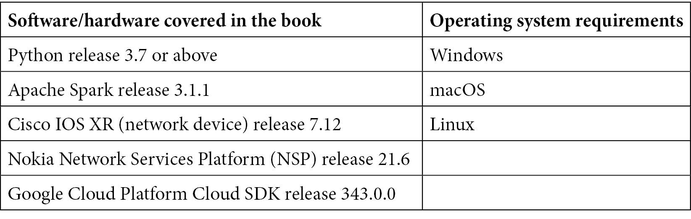

# 前言

Python 是一种多用途语言，可用于解决多个领域中的中等至复杂问题。"Python for Geeks"将教你如何借助专家的技巧和窍门在职业生涯中取得进步。

你将从探索从设计和实现角度优化使用 Python 的不同方法开始。接下来，你将了解大型 Python 项目的生命周期。随着你的进步，你将专注于通过模块化 Python 项目来创建优雅设计的不同方法，并学习使用 Python 的最佳实践和设计模式。你还将发现如何将 Python 扩展到单线程之外，以及如何在 Python 中实现多进程和多线程。此外，你将了解如何不仅使用 Python 在单台机器上部署，还可以在私有环境中以及公共云计算环境中使用集群进行部署。然后，你将探索数据处理技术，关注可重用、可扩展的数据管道，并学习如何使用这些高级技术进行网络自动化、无服务器函数和机器学习。最后，你将专注于使用本书中涵盖的技术和最佳实践来制定 Web 开发设计策略。

在阅读完这本 Python 书籍之后，你将能够为大型复杂项目进行一些严肃的 Python 编程。

# 本书面向对象

本书面向任何领域的中级 Python 开发者，他们希望提升自己的技能以开发和管理大型复杂项目。希望创建可重用模块和 Python 库的开发者以及构建云部署应用的云开发者也会发现本书很有用。具备 Python 经验将帮助你更好地利用本书。

# 本书涵盖内容

*第一章*，*最优 Python 开发生命周期*，帮助你理解典型 Python 项目的生命周期及其各个阶段，并讨论了编写 Python 代码的最佳实践。

*第二章*，*使用模块化处理复杂项目*，专注于理解 Python 中的模块和包的概念。

*第三章*，*高级面向对象 Python 编程*，讨论了如何使用 Python 实现面向编程的高级概念。

*第四章*，*Python 高级编程库*，探讨了迭代器、生成器、错误和异常处理、文件处理和日志记录等高级概念。

*第五章*，*使用 Python 进行测试和自动化*，不仅介绍了单元测试、集成测试和系统测试等不同类型的测试自动化，还讨论了如何使用流行的测试框架来实现单元测试。

*第六章*, *Python 高级技巧和窍门*，讨论了 Python 在数据转换、构建装饰器以及如何使用包括 pandas DataFrames 在内的数据结构进行数据分析的高级特性。

*第七章*, *多进程、多线程和异步编程*，帮助你了解使用 Python 内置库构建多线程或多进程应用程序的不同选项。

*第八章*, *使用集群扩展 Python*，探讨了如何使用 Apache Spark，以及我们如何编写 Python 应用程序用于大型数据处理应用，这些应用可以通过 Apache Spark 集群执行。

*第九章*, *云计算中的 Python 编程*，讨论了如何开发和部署应用程序到云平台，以及如何一般性地使用 Apache Beam，特别是对于 Google Cloud Platform。

*第十章*, *使用 Python 进行 Web 开发和 REST API*，专注于使用 Flask 框架开发 Web 应用程序，与数据库交互，并构建 REST API 或 Web 服务。

*第十一章*, *使用 Python 进行微服务开发*，介绍了微服务以及如何使用 Django 框架构建一个示例微服务并将其与基于 Flask 的微服务集成。

*第十二章*, *使用 Python 构建无服务器函数*，讨论了无服务器函数在云计算中的作用以及如何使用 Python 构建它们。

*第十三章*, *Python 与机器学习*，帮助你了解如何使用 Python 构建、训练和评估机器学习模型，以及如何在云中部署它们。

*第十四章*, *使用 Python 进行网络自动化*，讨论了使用 Python 库从网络设备中获取数据以及**网络管理系统**（NMSes）的使用，以及如何将配置数据推送到设备或 NMSes。

# 为了最大限度地利用这本书

为了真正从这本书中获得益处，你必须具备 Python 知识。你需要在你的系统上安装 Python 3.7 或更高版本。所有代码示例都已使用 Python 3.7 和 Python 3.8 进行测试，并预期与任何未来的 3.x 版本兼容。拥有一个 Google Cloud Platform 账户（免费试用版即可）将有助于在云中部署一些代码示例。



**如果您正在使用这本书的数字版，我们建议您自己输入代码或从书的 GitHub 仓库（下一节中提供链接）获取代码。这样做将帮助您避免与代码的复制和粘贴相关的任何潜在错误。**

# 下载示例代码文件

您可以从 GitHub（[`github.com/PacktPublishing/Python-for-Geeks`](https://github.com/PacktPublishing/Python-for-Geeks)）下载本书的示例代码文件。如果代码有更新，它将在 GitHub 仓库中更新。

我们还有其他来自我们丰富的图书和视频目录的代码包，可在[`github.com/PacktPublishing/`](https://github.com/PacktPublishing/)找到。查看它们吧！

# 下载彩色图像

我们还提供了一个包含本书中使用的截图和图表的彩色图像的 PDF 文件。您可以从这里下载：[`static.packt-cdn.com/downloads/9781801070119_ColorImages.pdf`](https://static.packt-cdn.com/downloads/9781801070119_ColorImages.pdf)。

# 使用的约定

本书使用了多种文本约定。

`文本中的代码`：表示文本中的代码单词、数据库表名、文件夹名、文件名、文件扩展名、路径名、虚拟 URL、用户输入和 Twitter 昵称。以下是一个示例：“将下载的`WebStorm-10*.dmg`磁盘映像文件作为系统中的另一个磁盘挂载。”

代码块设置如下：

```py
resource = {
    "api_key": "AIzaSyDYKmm85kebxddKrGns4z0",
    "id": "0B8TxHW2Ci6dbckVwTRtTl3RUU",
    "fields": "files(name, id, webContentLink)",
}
```

当我们希望您注意代码块中的特定部分时，相关的行或项目将以粗体显示：

```py
#casestudy1.py: Pi calculator
from operator import add
from random import random
from pyspark.sql import SparkSession
spark = SparkSession.builder.
master("spark://192.168.64.2:7077") \
    .appName("Pi claculator app") \
    .getOrCreate()
partitions = 2
n = 10000000 * partitions
def func(_):
    x = random() * 2 - 1
    y = random() * 2 - 1
    return 1 if x ** 2 + y ** 2 <= 1 else 0
count = spark.sparkContext.parallelize(range(1, n + 1),   partitions).map(func).reduce(add)
print("Pi is roughly %f" % (4.0 * count / n))
```

任何命令行输入或输出都按以下方式编写：

```py
Pi is roughly 3.141479 
```

**粗体**：表示新术语、重要单词或屏幕上看到的单词。例如，菜单或对话框中的单词以**粗体**显示。以下是一个示例：“如前所述，Cloud Shell 附带一个编辑器工具，可以通过使用**打开编辑器**按钮启动。”

小贴士或重要提示

看起来像这样。

# 联系我们

我们始终欢迎读者的反馈。

**一般反馈**：如果您对本书的任何方面有疑问，请通过 customercare@packtpub.com 给我们发邮件，并在邮件主题中提及书名。

**勘误**：尽管我们已经尽最大努力确保内容的准确性，但错误仍然可能发生。如果您在这本书中发现了错误，如果您能向我们报告，我们将不胜感激。请访问[www.packtpub.com/support/errata](https://www.packtpub.com/support/errata)并填写表格。

**盗版**：如果您在互联网上以任何形式发现我们作品的非法副本，如果您能提供位置地址或网站名称，我们将不胜感激。请通过[copyright@packt.com](https://copyright@packt.com)与我们联系，并提供材料的链接。

**如果您想成为一名作者**：如果您在某个领域有专业知识，并且对撰写或参与一本书籍感兴趣，请访问 [authors.packtpub.com](https://authors.packtpub.com).


