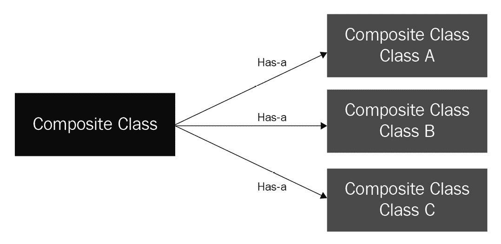

# 第三章：*第三章*：高级面向对象 Python 编程

Python 可以用作类似于 C 的声明性模块化编程语言，也可以用于使用 Java 等编程语言进行命令式编程或完整的**面向对象编程（OOP**）。**声明性编程**是一种范式，其中我们关注我们想要实现的内容，而**命令式编程**是我们描述实现我们想要的内容的确切步骤。Python 适合这两种编程范式。OOP 是一种命令式编程形式，其中我们将现实世界对象的属性和行为捆绑到程序中。此外，OOP 还解决了不同类型现实世界对象之间的关系。

在本章中，我们将探讨如何使用 Python 实现面向对象编程（OOP）的高级概念。我们假设你已经熟悉类、对象和实例等一般概念，并且对对象之间的继承有基本了解。

本章我们将涵盖以下主题：

+   介绍类和对象

+   理解 OOP 原则

+   使用组合作为替代设计方法

+   在 Python 中介绍鸭子类型

+   学习何时在 Python 中不使用 OOP

# 技术要求

这些是本章的技术要求：

+   您需要在您的计算机上安装 Python 3.7 或更高版本。

+   本章的示例代码可以在[`github.com/PacktPublishing/Python-for-Geeks/tree/master/Chapter03`](https://github.com/PacktPublishing/Python-for-Geeks/tree/master/Chapter03)找到。

# 介绍类和对象

类是一个定义如何定义某物的蓝图。它实际上不包含任何数据——它是一个模板，用于根据模板或蓝图中的规范创建实例。

类的对象是一个从类构建的实例，这也是为什么它也被称为类的实例。在本章和本书的其余部分，我们将同义地使用*对象*和*实例*。在 OOP 中，对象有时可以用物理对象如桌子、椅子或书籍来表示。在大多数情况下，软件程序中的对象代表抽象实体，这些实体可能不是物理的，如账户、名称、地址和支付。

为了让我们对类和对象的基本概念有更清晰的认识，我们将通过代码示例来定义这些术语。

## 区分类属性和实例属性

**类属性**是在类定义的一部分中定义的，并且它们的值意味着在从该类创建的所有实例中都是相同的。可以通过类名或实例名来访问类属性，尽管建议使用类名来访问这些属性（用于读取或更新）。对象的状态或数据由**实例属性**提供。

在 Python 中定义一个类很简单，只需使用`class`关键字。如*第一章*中讨论的，*最佳 Python 开发生命周期*，类的名称应该是驼峰式。以下代码片段创建了一个`Car`类：

```py
#carexample1.py
class Car:
    pass
```

这个类没有任何属性和方法。它是一个空类，你可能会认为这个类没有用，直到我们向它添加更多组件。但并非如此！在 Python 中，你可以在运行时动态地添加属性，而无需在类中定义它们。以下是一个有效的代码示例，展示了我们如何在运行时向类实例添加属性：

```py
#carexample1.py
class Car:
    pass
if __name__ == "__main__":
    car = Car ()
    car.color = "blue"
    car.miles = 1000
    print (car.color)
    print (car.miles)
```

在这个扩展示例中，我们创建了一个`Car`类的实例（`car`），然后向这个实例添加了两个属性：`color`和`miles`。请注意，使用这种方法添加的属性是实例属性。

接下来，我们将使用构造方法（`__init__`）添加类属性和实例属性，该方法在对象创建时加载。以下是一个包含两个实例属性（`color`和`miles`）和`init`方法的代码片段：

```py
#carexample2.py
class Car:
    c_mileage_units = "Mi"
    def __init__(self, color, miles):
        self.i_color = color
        self.i_mileage = miles
if __name__ == "__main__":
    car1 = Car ("blue", 1000)
    print (car.i_color)
    print (car.i_mileage)
    print (car.c_mileage_units)
    print (Car.c_mileage_units)
```

在这个程序中，我们做了以下操作：

1.  我们创建了一个具有`c_mileage_units`类属性和两个实例变量`i_color`和`i_mileage`的`Car`类。

1.  我们创建了一个`Car`类的实例（`car`）。

1.  我们使用`car`实例变量打印出了实例属性。

1.  我们使用`car`实例变量以及`Car`类名打印出了类属性。两种情况下的控制台输出是相同的。

    重要提示

    `self`是对正在创建的实例的引用。在 Python 中，`self`的使用很常见，用于在实例方法中访问实例属性和方法，包括`init`方法。`self`不是一个关键字，使用`self`这个词不是强制的。它可以是指`this`或`blah`等任何名称，但必须作为实例方法的第一个参数，但使用`self`作为参数名称的约定非常强烈。

我们可以使用实例变量或类名来更新类属性，但结果可能不同。当我们使用类名更新类属性时，它将更新该类的所有实例。但如果我们使用实例变量更新类属性，它将只更新那个特定的实例。以下代码片段展示了这一点，它使用了`Car`类：

```py
#carexample3.py
#class definition of Class Car is same as in carexample2.py
if __name__ == "__main__":
    car1 = Car ("blue", 1000)
    car2 = Car("red", 2000)
    print("using car1: " + car1.c_mileage_units)
    print("using car2: " + car2.c_mileage_units)
    print("using Class: " + Car.c_mileage_units)
    car1.c_mileage_units = "km"
    print("using car1: " + car1.c_mileage_units)
    print("using car2: " + car2.c_mileage_units)
    print("using Class: " + Car.c_mileage_units)
    Car.c_mileage_units = "NP"
    print("using car1: " + car1.c_mileage_units)
    print("using car2: " + car2.c_mileage_units)
    print("using Class: " + Car.c_mileage_units)
```

这个程序的输出可以通过以下方式进行分析：

1.  第一组`print`语句将输出类属性的默认值，即`Mi`。

1.  在执行了`car1.c_mileage_units = "km"`语句之后，类属性值对于`car2`实例和类级别的属性将是相同的（`Mi`）。

1.  在执行了`Car.c_mileage_units = "NP"`语句之后，`car2`和类级别的属性值将变为`NP`，但对于`car1`来说，由于我们明确设置了它，所以它将保持不变（`km`）。

    重要提示

    属性名以`c`和`i`开头，分别表示它们是类变量和实例变量，而不是常规的局部或全局变量。非公共实例属性的名字必须以单个或双下划线开头，以使它们成为受保护的或私有的。这一点将在本章后面讨论。

## 在类中使用构造函数和析构函数

与任何其他面向对象编程语言一样，Python 也有构造函数和析构函数，但命名约定不同。在类中拥有构造函数的目的是在创建类的实例时初始化或分配类或实例级别的属性（主要是实例属性）。在 Python 中，`__init__`方法被称为构造函数，并且总是在创建新实例时执行。Python 支持三种类型的构造函数，如下所示：

+   如果在类中忘记声明`__init__`方法，那么该类将使用一个默认的空构造函数。构造函数除了初始化类的实例之外，不做任何事情。

+   `Name:` 类：

    ```py
    class Name:
        #non-parameterized constructor
        Name class
    ```

+   `Name`类将更新为带参数的构造函数，如下所示：

    ```py
    class Name:   
        #parameterized constructor
        def __init__(self, first, last):
            self.i_first = first    
            self.i_last = last
    ```

析构函数与构造函数相反——它们在实例被删除或销毁时执行。在 Python 中，析构函数几乎不使用，因为 Python 有一个垃圾回收器，它会处理那些不再被任何其他实例或程序引用的实例的删除。如果我们需要在析构函数方法中添加逻辑，我们可以通过使用特殊的`__del__`方法来实现。当实例的所有引用都被删除时，它会自动调用。下面是如何在 Python 中定义析构函数的语法：

```py
def __del__(self):
print("Object is deleted.")
```

## 区分类方法和实例方法

在 Python 中，我们可以在类中定义三种类型的方法，下面将进行描述：

+   `self`（实例本身）并可以读取和更新实例的状态。`__init__`方法，即构造函数方法，是实例方法的例子。

+   `@classmethod`装饰器。这些方法不需要类实例来执行。对于这个方法，类引用（`cls`是惯例）将自动作为第一个参数发送。

+   `@staticmethod`装饰器。它们没有访问`cls`或`self`对象的能力。静态方法类似于我们定义在模块中的实用函数，它们根据参数的值提供输出——例如，如果我们需要评估某些输入数据或解析数据以进行处理，我们可以编写静态方法来实现这些目标。静态方法的工作方式与我们在模块中定义的常规函数类似，但它们在类的命名空间上下文中可用。

为了说明这些方法如何在 Python 中定义并使用，我们创建了一个简单的程序，下面将展示：

```py
#methodsexample1.py
class Car:
    c_mileage_units = "Mi"
    def __init__(self, color, miles):
        self.i_color = color
        self.i_mileage = miles
    def print_color (self):
        print (f"Color of the car is {self.i_color}")
    @classmethod
    def print_units(cls):
        print (f"mileage unit are {cls.c_mileage_unit}")
        print(f"class name is {cls.__name__}")
    @staticmethod
    def print_hello():
        print ("Hello from a static method")
if __name__ == "__main__":
    car = Car ("blue", 1000)
    car.print_color()
    car.print_units()
    car.print_hello()
    Car.print_color(car);
    Car.print_units();
    Car.print_hello()
```

在这个程序中，我们做了以下几件事情：

1.  我们创建了一个`Car`类，其中包含类属性（`c_mileage_units`）、类方法（`print_units`）、静态方法（`print_hello`）、实例属性（`i_color`和`i_mileage`）、实例方法（`print_color`）和构造方法`(__init__)`。

1.  我们使用构造函数创建了`Car`类的实例，将其命名为`car`。

1.  使用实例变量（在这个例子中是`car`），我们调用了实例方法、类方法和静态方法。

1.  使用类名（在这个例子中是`Car`），我们再次触发了实例方法、类方法和静态方法。请注意，我们可以使用类名来触发实例方法，但我们需要将实例变量作为第一个参数传递（这也解释了为什么每个实例方法都需要`self`参数）。

下面的程序控制台输出如下，仅供参考：

```py
Color of the car is blue
mileage unit are Mi
class name is Car
Hello from a static method
Color of the car is blue
mileage unit are Mi
class name is Car
Hello from a static method
```

## 特殊方法

当我们在 Python 中定义一个类并尝试使用`print`语句打印其实例时，我们将得到一个包含类名和对象实例引用的字符串，即对象的内存地址。实例或对象没有默认的`to string`功能实现。下面展示了这种行为的一个代码片段：

```py
#carexampl4.py
class Car:
    def __init__(self, color, miles):
        self.i_color = color
        self.i_mileage = miles
if __name__ == "__main__":
    car = Car ("blue", 1000)
    print (car)
```

我们将得到类似于以下内容的控制台输出，这不是`print`语句预期的结果：

```py
<__main__.Car object at 0x100caae80>
```

要从`print`语句中获得有意义的内容，我们需要实现一个特殊的`__str__`方法，该方法将返回包含实例信息的字符串，并且可以根据需要自定义。下面是一个代码片段，展示了包含`__str__`方法的`carexample4.py`文件：

```py
#carexample4.py
class Car:
    c_mileage_units = "Mi"
    def __init__(self, color, miles):
        self.i_color = color
        self.i_mileage = miles
    def __str__(self):
        return f"car with color {self.i_color} and \
         mileage {self.i_mileage}"
if __name__ == "__main__":
    car = Car ("blue", 1000)
    print (car)
```

下面展示了`print`语句的控制台输出：

```py
car with color blue and mileage 1000
```

通过适当的`__str__`实现，我们可以使用`print`语句而不需要实现特殊的函数，如`to_string()`。这是 Python 控制字符串转换的 Pythonic 方式。出于类似原因，另一个流行的方法是`__repr__`，它被 Python 解释器用于检查对象。`__repr__`方法主要用于调试目的。

这些方法（以及一些其他方法）被称为特殊方法或**双下划线方法**，因为它们总是以双下划线开始和结束。普通方法不应使用此约定。在某些文献中，这些方法也被称为**魔法方法**，但这不是官方术语。类实现中有几十种特殊方法可供使用。官方 Python 3 文档中提供了特殊方法的完整列表，网址为 https://docs.python.org/3/reference/datamodel.html#specialnames。

在本节中，我们通过代码示例回顾了类和对象。在下一节中，我们将研究 Python 中可用的不同面向对象原则。

# 理解面向对象原则

面向对象编程（OOP）是将属性和行为捆绑到单个实体中的方法，我们称之为对象。为了使这种捆绑更高效和模块化，Python 中有几个原则可用，如下所述：

+   数据封装

+   继承

+   多态

+   抽象

在接下来的小节中，我们将详细研究这些原则。

## 数据封装

封装是面向对象编程中的基本概念，有时也被称为抽象。但在现实中，封装不仅仅是抽象。在面向对象编程中，将数据及其相关动作捆绑到单个单元中称为封装。封装实际上不仅仅是捆绑数据和相关的动作。我们在这里可以列举封装的三个主要目标，如下所示：

+   将数据和相关的动作封装在一个单元中。

+   隐藏对象的内部结构和实现细节。

+   限制对对象某些组件（属性或方法）的访问。

封装简化了对象的使用，无需了解其内部实现的细节，并且还有助于控制对象状态更新的更新。

在接下来的小节中，我们将详细讨论这些目标。

## 封装数据和动作

为了在一个初始化中包含数据和动作，我们在类中定义属性和方法。Python 中的类可以有以下类型的元素：

+   构造函数和析构函数

+   类方法和属性

+   实例方法和属性

+   **嵌套**类

我们已经在上一节中讨论了这些类元素，除了嵌套或**内部**类。我们已经提供了 Python 代码示例来展示构造函数和析构函数的实现。我们已经在上一节中通过实例属性封装了数据在我们的实例或对象中。我们还讨论了类方法、静态方法和类属性，并提供了代码示例。

为了完成这个主题，我们将使用嵌套类的 Python 代码片段进行讨论。让我们以我们的`Car`类及其内部的`Engine`内部类为例。每辆车都需要一个引擎，因此将其作为嵌套或内部类是有意义的：

```py
#carwithinnerexample1.py
class Car:
    """outer class"""
    c_mileage_units = "Mi"
    def __init__(self, color, miles, eng_size):
        self.i_color = color
        self.i_mileage = miles
        self.i_engine = self.Engine(eng_size)
    def __str__(self):
        return f"car with color {self.i_color}, mileage \
        {self.i_mileage} and engine of {self.i_engine}"
    class Engine:
        """inner class"""
        def __init__(self, size):
            self.i_size = size
        def __str__(self):
            return self.i_size
if __name__ == "__main__":
    car = Car ("blue", 1000, "2.5L")
    print(car)
    print(car.i_engine.i_size)
```

在这个例子中，我们在常规的`Car`类内部定义了一个`Engine`内部类。`Engine`类只有一个属性—`i_size`，构造方法（`__init__`）和`__str__`方法。与之前的示例相比，我们对`Car`类进行了以下更新：

+   `__init__`方法包括一个新的引擎尺寸属性，并添加了一行来创建与`Car`实例关联的`Engine`实例的新实例。

+   `Car`类的`__str__`方法包括`i_size`内部类属性。

主程序在`Car`实例上使用`print`语句，并且还有一行用于打印`Engine`类的`i_size`属性值。该程序的控制台输出将类似于以下内容：

```py
car with color blue, mileage 1000 and engine of 2.5L
2.5L
```

主程序的控制台输出显示，我们可以在类实现内部访问内部类，并且我们可以从外部访问内部类的属性。

在下一小节中，我们将讨论如何隐藏一些属性和方法，以便它们在类外部不可访问或不可见。

## 隐藏信息

在我们之前的代码示例中，我们已经看到我们可以无限制地访问所有类级别以及实例级别的属性。这种做法导致我们采用了扁平化设计，类将简单地成为变量和方法的包装器。更好的面向对象设计方法是将一些实例属性隐藏起来，只让必要的属性对外部世界可见。为了讨论在 Python 中如何实现这一点，我们引入了两个术语：**私有**和**保护**。

### 私有变量和方法

可以通过在变量名前使用双下划线作为前缀来定义一个私有变量或属性。在 Python 中，没有像其他编程语言中那样的*private*关键字。类和实例变量都可以标记为私有。

可以通过在方法名前使用双下划线来定义一个私有方法。私有方法只能在类内部调用，且在类外部不可用。

每当我们定义一个属性或方法为私有时，Python 解释器不允许在类定义外部访问这样的属性或方法。这种限制也适用于子类；因此，只有类内部的代码可以访问这些属性和方法。

### 受保护的变量和方法

将`i_color`属性从公共属性更改为保护属性，我们只需将其名称更改为`_i_color`。Python 解释器不会在类或子类内部强制执行这种保护元素的用法。这更多的是为了遵守命名约定，并按照保护变量和方法定义使用或访问属性或方法。

通过使用私有和保护变量和方法，我们可以隐藏对象实现的一些细节。这有助于我们在大型类内部拥有紧密和干净的源代码，而不将一切暴露给外部世界。隐藏属性的另一个原因是为了控制它们可以如何被访问或更新。这是下一小节的主题。为了总结本节，我们将讨论一个带有私有和保护变量以及私有方法的`Car`类的更新版本，如下所示：

```py
#carexample5.py
class Car:
    c_mileage_units = "Mi"
    __max_speed = 200
    def __init__(self, color, miles, model):
        self.i_color = color
        self.i_mileage = miles
        self.__no_doors = 4
        self._model = model
    def __str__(self):
        return f"car with color {self.i_color}, mileage           {self.i_mileage}, model {self._model} and doors             {self.__doors()}"
    def __doors(self):
        return self.__no_doors
if __name__ == "__main__":
    car = Car ("blue", 1000, "Camry")
    print (car)
```

在这个更新的`Car`类中，我们根据之前的示例更新或添加了以下内容：

+   一个具有默认值的私有类变量`__max_speed`

+   在`__init__`构造方法内部有一个默认值的私有实例变量`__no_doors`

+   仅用于说明目的的受保护实例变量`_model`

+   一个用于获取门数的私有实例方法`__doors()`

+   `__str__` 方法已更新，通过使用 `__doors()` 私有方法来获取门

这个程序的控制台输出按预期工作，但如果尝试从主程序访问任何私有方法或私有变量，则不可用，Python 解释器将抛出错误。这是按照设计，因为这些私有变量和私有方法的目的仅限于在类内部使用。

重要提示

Python 并没有真正使变量和方法成为私有的，但它假装使它们成为私有的。Python 实际上通过将类名与变量名混合来打乱变量名，这样它们就不容易在包含它们的类外部可见。

对于 `Car` 类的示例，我们可以访问私有变量和私有方法。Python 通过使用一个以单下划线开头，后跟类名，然后是私有属性名的不同属性名，在类定义之外提供对这些属性和方法访问。同样，我们也可以访问私有方法。

以下代码行是有效的，但不推荐，并且违反了私有和受保护的定义：

```py
print (Car._Car__max_speed)    
print (car._Car__doors())
print (car._model)         
```

如我们所见，`_Car` 被附加到实际的私有变量名之前。这样做是为了最小化与内部类中变量的冲突。

## 保护数据

在我们之前的代码示例中，我们看到了我们可以无限制地访问实例属性。我们还实现了实例方法，对这些方法的使用没有限制。我们模拟定义它们为私有或受保护的，这样可以隐藏数据和行为对外部世界。

但在现实世界的问题中，我们需要以可控和易于维护的方式提供对变量的访问。这在许多面向对象的语言中通过 **访问修饰符**（如获取器和设置器）来实现，这些将在下面定义：

+   **获取器**：这些是用于从类或其实例访问私有属性的方法

+   **设置器**：这些是用于设置类或其实例的私有属性的方法。

获取器和设置器方法也可以用来实现访问或设置属性的额外逻辑，并且在一个地方维护这样的额外逻辑是方便的。实现获取器和设置器方法有两种方式：一种 *传统方式* 和一种 *装饰性方式*。

## 使用传统获取器和设置器

传统上，我们使用 `get` 和 `set` 前缀编写实例方法，后跟下划线和变量名。我们可以将我们的 `Car` 类转换为使用实例属性的获取器和设置器方法，如下所示：

```py
#carexample6.py
class Car:
    __mileage_units = "Mi"
    def __init__(self, col, mil):
        self.__color = col
        self.__mileage = mil
    def __str__(self):
        return f"car with color {self.get_color()} and \
         mileage {self.get_mileage()}"
    def get_color(self):
        return self.__color
    def get_mileage(self):
        return self.__mileage
    def set_mileage (self, new_mil):
            self.__mileage = new_mil
if __name__ == "__main__":
    car = Car ("blue", 1000)
    print (car)
    print (car.get_color())
    print(car.get_mileage())
    car.set_mileage(2000)
    print (car.get_color())
    print(car.get_mileage())
```

在这个更新的 `Car` 类中，我们添加了以下内容：

+   `color` 和 `mileage` 实例属性被添加为私有变量。

+   `color` 和 `mileage` 实例属性的获取器方法。

+   仅针对`mileage`属性设置 setter 方法，因为`color`属性通常在对象创建时设置后不会改变。

+   在主程序中，我们使用 getter 方法获取新创建的类的实例数据。接下来，我们使用 setter 方法更新里程数，然后再次获取`color`和`mileage`属性的数据。

在这个示例中，每个语句的控制台输出都是微不足道的，符合预期。正如提到的，我们没有为每个属性定义 setter，而只为那些有意义的属性和设计要求定义了 setter。在面向对象编程（OOP）中，使用 getter 和 setter 是一种最佳实践，但在 Python 中并不十分流行。Python 开发者的文化（也称为 Pythonic 方式）仍然是直接访问属性。

## 使用属性装饰器

使用**装饰器**来定义 getter 和 setter 是一种现代方法，有助于实现 Python 编程方式。

如果你喜欢使用装饰器，那么 Python 中有一个`@property`装饰器，可以使代码更简洁、更清晰。传统的带有 getter 和 setter 的`Car`类通过装饰器进行了更新，以下是一个代码片段，展示了这一点：

```py
carexample7.py
class Car:
    __mileage_units = "Mi"
    def __init__(self, col, mil):
        self.__color = col
        self.__mileage = mil
    def __str__(self):
        return f"car with color {self.color} and mileage \
         {self.mileage}"
    @property
    def color(self):
        return self.__color
    @property
    def mileage(self):
        return self.__mileage
    @mileage.setter
    def mileage (self, new_mil):
            self.__mileage = new_mil
if __name__ == "__main__":
    car = Car ("blue", 1000)
    print (car)
    print (car.color)
    print(car.mileage)
    car.mileage = 2000
    print (car.color)
    print(car.mileage)
```

在这个更新的类定义中，我们更新或添加了以下内容：

+   实例属性作为私有变量

+   使用属性名作为方法名和`@property`来为`color`和`mileage`设置 getter 方法

+   使用`@mileage.setter`装饰器为`mileage`设置 setter 方法，使方法名与属性名相同

在主脚本中，我们通过使用实例名称后跟一个点和属性名称（Pythonic 方式）来访问颜色和里程数属性。这使得代码语法简洁易读。装饰器的使用也使得方法名称更简单。

总结来说，我们讨论了 Python 中封装的所有方面，包括使用类来捆绑数据和动作，隐藏类外部世界中的不必要信息，以及如何使用 Python 的 getter、setter 和属性特性来保护类中的数据。在下一节中，我们将讨论 Python 中继承的实现方式。

## 使用继承扩展类

面向对象编程（OOP）中的继承概念与现实生活中继承的概念相似，即子女在拥有自己特征的基础上，从父母那里继承了一些特征。

同样，一个类可以继承另一个类的元素。这些元素包括属性和方法。我们从其中继承另一个类的类通常被称为父类、**超类**或**基类**。从另一个类继承的类被称为**派生类**、**子类**或**子类**。以下截图显示了父类和子类之间简单的关系：


图 3.1 – 父类和子类关系

在 Python 中，当一个类从另一个类继承时，它通常会继承构成父类的所有元素，但可以通过使用命名约定（如双下划线）和访问修饰符来控制这一点。

继承可以分为两种类型：**简单**或**多重**。我们将在下一节中讨论这些内容。

## 简单继承

在简单或基本继承中，一个类是从单个父类派生出来的。这是面向对象编程中常用的一种继承形式，更接近人类的家谱。使用简单继承的父类和子类的语法如下所示：

```py
class BaseClass:
    <attributes and methods of the base class >
class ChildClass (BaseClass):
    <attributes and methods of the child class >
```

对于这种简单继承，我们将修改我们的`Car`类示例，使其从`Vehicle`父类派生。我们还将添加一个`Truck`子类来阐述继承的概念。以下是修改后的代码：

```py
#inheritance1.py
class Vehicle:
    def __init__(self, color):
        self.i_color = color
    def print_vehicle_info(self):
        print(f"This is vehicle and I know my color is \
         {self.i_color}")
class Car (Vehicle):
    def __init__(self, color, seats):
        self.i_color = color
        self.i_seats = seats
    def print_me(self):
        print( f"Car with color {self.i_color} and no of \
         seats {self.i_seats}")
class Truck (Vehicle):
    def __init__(self, color, capacity):
        self.i_color = color
        self.i_capacity = capacity
    def print_me(self):
        print( f"Truck with color {self.i_color} and \
         loading capacity {self.i_capacity} tons")
if __name__ == "__main__":
    car = Car ("blue", 5)
    car.print_vehicle_info()
    car.print_me()
    truck = Truck("white", 1000)
    truck.print_vehicle_info()
    truck.print_me()
```

在这个例子中，我们创建了一个具有一个`i_color`属性和一个`print_vehicle_info`方法的`Vehicle`父类。这两个元素都是继承的候选者。接下来，我们创建了两个子类，`Car`和`Truck`。每个子类都有一个额外的属性（`i_seats`和`i_capacity`）和一个额外的属性（`print_me`）。在每个子类的`print_me`方法中，我们访问父类实例属性以及子类实例属性。

这种设计是有意为之，为了阐述从父类继承一些元素并在子类中添加一些元素的想法。在这个例子中，使用两个子类来演示继承在可重用性方面的作用。

在我们的主程序中，我们创建了`Car`和`Truck`实例，并尝试访问父类方法以及实例方法。该程序的控制台输出符合预期，如下所示：

```py
This is vehicle and I know my color is blue
Car with color blue and no of seats 5
This is vehicle and I know my color is white
Truck with color white and loading capacity 1000 tons 
```

## 多重继承

在多重继承中，一个子类可以从多个父类派生。多重继承的概念适用于高级面向对象设计，其中对象与多个对象有关联，但当我们从多个类继承时，我们必须小心，尤其是如果这些类是从一个共同的超类继承的。这可能导致诸如菱形问题等问题。菱形问题是在我们通过从两个类`Y`和`Z`继承来创建一个`X`类的情况下出现的，而`Y`和`Z`类又是从共同的类`A`继承的。`X`类将对其从类`Y`和`Z`继承的`A`类的公共代码产生歧义。由于多重继承可能带来的问题，我们不鼓励使用多重继承。

为了说明这个概念，我们将修改我们的`Vehicle`和`Car`类，并添加一个`Engine`类作为其中一个父类。以下是一个包含类多重继承的完整代码片段：

```py
 #inheritance2.py
class Vehicle:
    def __init__(self, color):
        self.i_color = color
    def print_vehicle_info(self):
        print( f"This is vehicle and I know my color is \
         {self.i_color}")
class Engine:
    def __init__(self, size):
        self.i_size = size
    def print_engine_info(self):
        print(f"This is Engine and I know my size is \
         {self.i_size}")
class Car (Vehicle, Engine):
    def __init__(self, color, size, seat):
        self.i_color = color
        self.i_size = size
        self.i_seat = seat
    def print_car_info(self):
        print(f"This car of color {self.i_color} with \
         seats {self.i_seat} with engine of size \
         {self.i_size}")
if __name__ == "__main__":
    car = Car ("blue", "2.5L", 5 )
    car.print_vehicle_info()
    car.print_engine_info()
    car.print_car_info()
```

在这个多重继承的例子中，我们创建了两个父类作为父类：`Vehicle`和`Engine`。`Vehicle`父类与前面的例子相同。`Engine`类有一个属性（`i_size`）和一个方法（`print_engine_info`）。`Car`类从`Vehicle`和`Engine`继承而来，并添加了一个额外的属性（`i_seats`）和一个额外的方法（`print_car_info`）。在实例方法中，我们可以访问父类的实例属性。

在主程序中，我们创建了`Car`类的一个实例。使用这个实例，我们可以访问父类以及子类的实例方法。以下是主程序的控制台输出，如图所示，符合预期：

```py
This is vehicle and I know my color is blue
Car with color blue and no of seats 5
This is vehicle and I know my color is white
Truck with color white and loading capacity 1000 tons
```

在本节中，我们介绍了继承及其类型，即简单继承和多重继承。接下来，我们将研究 Python 中的多态概念。

# 多态

在其字面意义上，具有多种形式的过程称为多态。在面向对象编程（OOP）中，**多态**是指实例能够以多种方式表现的能力，以及使用具有相同名称和相同参数的相同方法，根据所属的类以不同的方式表现。

多态可以通过两种方式实现：**方法重载**和**方法重写**。我们将在下一小节中分别讨论。

## 方法重载

方法重载是通过拥有多个具有相同名称但具有不同类型或参数数量来达到多态的一种方式。在 Python 中实现方法重载没有干净利落的方法。Python 中两个方法不能有相同的名称。在 Python 中，一切都是对象，包括类和方法。当我们为类编写方法时，实际上它们是从命名空间的角度来看的类的属性，因此不能有相同的名称。如果我们编写两个具有相同名称的方法，将不会出现语法错误，第二个方法将简单地替换第一个方法。

在类内部，可以通过设置参数的默认值来重载方法。这不是实现方法重载的完美方式，但它是可行的。以下是在 Python 类内部实现方法重载的示例：

```py
#methodoverloading1.py
class Car:
    def __init__(self, color, seats):
        self.i_color = color
        self.i_seat = seats
    def print_me(self, i='basic'):
        if(i =='basic'):
            print(f"This car is of color {self.i_color}")
        else:
            print(f"This car is of color {self.i_color} \
             with seats {self.i_seat}")

if __name__ == "__main__":
    car = Car("blue", 5 )
    car.print_me()
    car.print_me('blah')
    car.print_me('detail')
```

在这个例子中，我们添加了一个具有默认值的参数的`print_me`方法。如果没有传递参数，将使用默认值。当没有传递参数给`print_me`方法时，控制台输出将只提供`Car`实例的颜色。当传递参数给此方法（无论值如何）时，我们将有此方法的不同行为，即提供`Car`实例的颜色和座位数。以下是此程序的参考控制台输出：

```py
This car is of color blue
This car is of color blue with seats 5
This car is of color blue with seats 5
```

重要提示

有可用的第三方库（例如，`overload`），可以用来以更干净的方式实现方法重载。

## 方法重写

在子类和父类中拥有相同的方法名称被称为方法重写。父类和子类中方法的实现预期应该是不同的。当我们对一个子类的实例调用重写方法时，Python 解释器会在子类定义中查找该方法，即被重写的方法。解释器会执行子类级别的该方法。如果解释器在子类实例级别找不到方法，它会在父类中查找。如果我们必须使用子类实例来特别执行在子类中被重写的父类方法，我们可以使用`super()`方法来访问父类级别的该方法。这是 Python 中更受欢迎的多态概念之一，因为它与继承紧密相关，并且是实现继承的强大方式之一。

为了说明如何实现方法重写，我们将通过将`print_vehicle_info`方法名称重命名为`print_me`来更新`inhertance1.py`代码片段。正如我们所知，`print_me`方法已经在两个子类中存在，并且有不同的实现。以下是带有更改高亮的更新代码：

```py
#methodoverriding1.py
class Vehicle:
    def __init__(self, color):
        self.i_color = color
    def print_me(self):
        print(f"This is vehicle and I know my color is \
         {self.i_color}")
class Car (Vehicle):
    def __init__(self, color, seats):
        self.i_color = color
        self.i_seats = seats
    def print_me(self):
        print( f"Car with color {self.i_color} and no of \
         seats {self.i_seats}")
class Truck (Vehicle):
    def __init__(self, color, capacity):
        self.i_color = color
        self.i_capacity = capacity
    def print_me(self):
        print( f"Truck with color {self.i_color} and \
         loading capacity {self.i_capacity} tons")
if __name__ == "__main__":
    vehicle = Vehicle("red")
    vehicle.print_me()
    car = Car ("blue", 5)
    car.print_me()
    truck = Truck("white", 1000)
    truck.print_me()
```

在这个例子中，我们在子类中重写了`print_me`方法。当我们创建三个不同实例的`Vehicle`、`Car`和`Truck`类，并执行相同的方法时，我们得到不同的行为。以下是作为参考的控制台输出：

```py
This is vehicle and I know my color is red
Car with color blue and no of seats 5
Truck with color white and loading capacity 1000 tons
```

方法重写在现实世界问题中有许多实际应用——例如，我们可以继承内置的`list`类，并可以重写其方法以添加我们的功能。引入自定义的*排序*方法是一个对`list`对象进行方法重写的例子。我们将在下一章中介绍方法重写的几个示例。

## 抽象

抽象是面向对象编程（OOP）的另一个强大特性，主要与隐藏实现细节和仅展示对象的本质或高级特性相关。一个现实世界的例子是我们通过抽象得到的汽车，作为驾驶员，我们拥有作为驾驶员可用的主要功能，而不需要知道这些功能是如何工作的真实细节以及哪些其他对象参与提供这些功能。

抽象是一个与封装和继承相关的概念，这也是为什么我们将这个主题留到最后的理由，以便首先理解封装和继承。将这个主题作为一个独立主题的另一个原因是强调在 Python 中使用抽象类。

### Python 中的抽象类

抽象类就像其他类的蓝图。抽象类允许你创建一组抽象方法（空方法），这些方法需要子类来实现。简单来说，包含一个或多个抽象方法的类被称为抽象**类**。另一方面，抽象**方法**是指只有声明而没有实现的方法。

抽象类中可以有已经实现的方法，这些方法可以通过继承被子类（*如原样*）利用。抽象类的概念对于实现常见的接口，如**应用程序编程接口**（**API**），以及定义一个可以在子类中重用的公共代码库非常有用。

小贴士

抽象类不能被实例化。

抽象类可以使用 Python 的一个内置模块`abc`包来实现。`abc`包还包括`Abstractmethod`模块，它使用装饰器来声明抽象方法。下面是一个简单的 Python 示例，展示了使用`ABC`模块和`abstractmethod`装饰器的用法：

```py
#abstraction1.py
from abc import ABC, abstractmethod
class Vehicle(ABC):
    def hello(self):
        print(f"Hello from abstract class")
    @abstractmethod
    def print_me(self):
       pass
class Car (Vehicle):
    def __init__(self, color, seats):
        self.i_color = color
        self.i_seats = seats

    """It is must to implemented this method"""
    def print_me(self):
        print( f"Car with color {self.i_color} and no of \
         seats {self.i_seats}")
if __name__ == "__main__":
   # vehicle = Vehicle()    #not possible
   # vehicle.hello()
    car = Car ("blue", 5)
    car.print_me()
    car.hello()
```

在这个例子中，我们做了以下操作：

+   我们通过从`ABC`类继承并声明其中一个方法（`print_me`）为抽象方法，使`Vehicle`类成为抽象类。我们使用`@abstractmethod`装饰器来声明抽象方法。

+   接下来，我们通过在它中实现`print_me`方法并保持其余代码与上一个示例相同，更新了我们著名的`Car`类。

+   在程序的主要部分，我们尝试创建`Vehicle`类的一个实例（如图所示中的注释代码）。我们创建了一个`Car`类的实例并执行了`print_me`和`hello`方法。

当我们尝试创建`Vehicle`类的一个实例时，它会给我们一个如下错误：

```py
Can't instantiate abstract class Vehicle with abstract methods print_me
```

此外，如果我们尝试不在`Car`子类中实现`print_me`方法，我们会得到一个错误。对于`Car`类的一个实例，我们从`print_me`和`hello`方法得到预期的控制台输出。

# 使用组合作为替代的设计方法

组合是面向对象编程中另一个流行的概念，它再次与封装有些相关。简单来说，组合意味着在一个对象内部包含一个或多个对象以形成一个现实世界的对象。包含其他类对象的类被称为**组合类**，而其对象包含在组合类中的类被称为**组件类**。在下面的屏幕截图中，我们展示了一个具有三个组件类对象**A**、**B**和**C**的组合类示例：



图 3.2 – 组合类与其组件类之间的关系

组合被认为是继承的替代方法。这两种设计方法都是为了在对象之间建立关系。在继承的情况下，对象之间是紧密耦合的，因为父类中的任何更改都可能导致子类中的代码出错。另一方面，在组合的情况下，对象之间是松散耦合的，这有助于在一个类中进行更改而不会破坏另一个类中的代码。由于灵活性，组合方法相当受欢迎，但这并不意味着它是每个问题的正确选择。那么，我们如何确定在哪个问题中使用哪个呢？这里有一个经验法则。当我们有对象之间的“是一个”关系时，继承是正确的选择——例如，汽车“是一个”车辆，猫“是一个”动物。在继承的情况下，子类是父类的扩展，具有额外的功能以及重用父类功能的能力。如果对象之间的关系是一个对象“有”另一个对象，那么最好使用组合——例如，汽车“有”一个电池。

我们将使用之前关于`Car`类和`Engine`类的示例。在多重继承的示例代码中，我们将`Car`类实现为`Engine`类的子类，这并不是继承的一个很好的用例。现在是时候通过在`Car`类中实现`Engine`对象来使用组合了。我们还可以有一个`Seat`类，并将其包含在`Car`类中。

我们将在以下示例中进一步阐述这个概念，其中我们将通过在它内部包含`Engine`和`Seat`类来构建`Car`类：

```py
#composition1.py
class Seat:
    def __init__(self, type):
        self.i_type = type
    def __str__(self):
        return f"Seat type: {self.i_type}"
class Engine:
    def __init__(self, size):
        self.i_size = size
    def __str__(self):
        return f"Engine: {self.i_size}"
class Car:
    def __init__(self, color, eng_size, seat_type):
        self.i_color = color
        self.engine = Engine(eng_size)
        self.seat = Seat(seat_type)
    def print_me(self):
        print(f"This car of color {self.i_color} with \
         {self.engine} and {self.seat}")
if __name__ == "__main__":
    car = Car ("blue", "2.5L", "leather" )
    car.print_me()
    print(car.engine)
    print(car.seat)
    print(car.i_color)
    print(car.engine.i_size)
    print(car.seat.i_type)
```

我们可以如下分析这个示例代码：

1.  我们定义了`Engine`和`Seat`类，每个类中有一个属性：`Engine`类的`i_size`和`Seat`类的`i_type`。

1.  之后，我们通过添加`i_color`属性、一个`Engine`实例和一个`Seat`实例来定义了一个`Car`类。`Engine`和`Seat`实例是在创建`Car`实例时创建的。

1.  在这个主程序中，我们创建了一个`Car`实例并执行了以下操作：

    a) `car.print_me`: 这将访问`Car`实例上的`print_me`方法。

    b) `print(car.engine`): 这将执行`Engine`类的`__str__`方法。

    c) `print(car.seat)`: 这将执行`Seat`类的`__str__`方法。

    d) `print(car.i_color)`: 这将访问`Car`实例的`i_color`属性。

    e) `print(car.engine.i_size)`: 这将访问`Car`实例内部的`Engine`实例的`i_size`属性。

    f) `print(car.seat.i_type)`: 这将访问`Car`实例内部的`Seat`实例的`i_type`属性

该程序的控制台输出如下所示：

```py
This car of color blue with Engine: 2.5L and Seat type: leather
Engine: 2.5L
Seat type: leather
blue
2.5L
leather
```

接下来，我们将讨论鸭子类型，它是多态的替代方案。

# 在 Python 中引入鸭子类型

**鸭子类型**，有时也称为**动态类型**，主要在支持动态类型的编程语言中采用，如 Python 和 JavaScript。这个名字“鸭子类型”是基于以下引用借用的：

“如果它看起来像鸭子，游泳像鸭子，呱呱叫像鸭子，那么它可能就是一只鸭子。”

这意味着如果一个鸟儿表现得像一只鸭子，它很可能就是一只鸭子。提到这个引用的目的是，我们可以通过对象的行为来识别对象，这是 Python 中鸭子类型的核心原则。

在鸭子类型中，对象的类类型不如它定义的方法（行为）重要。使用鸭子类型，不会检查对象的类型，但会执行期望的方法。

为了说明这个概念，我们用一个包含三个类`Car`、`Cycle`和`Horse`的简单例子，并尝试在每个类中实现一个`start`方法。在`Horse`类中，我们不是将方法命名为`start`，而是将其命名为`push`。以下是包含所有三个类和末尾主程序的代码片段：

```py
#ducttype1.py
class Car:
    def start(self):
        print ("start engine by ignition /battery")
class Cycle:
    def start(self):
        print ("start by pushing paddles")
class Horse:
    def push(self):
        print ("start by pulling/releasing the reins")
if __name__ == "__main__":
    for obj in Car(), Cycle(), Horse():
        obj.start()
```

在主程序中，我们尝试动态地迭代这些类的实例并调用`start`方法。正如预期的那样，对于`Horse`对象，`obj.start()`这一行失败了，因为该类没有这样的方法。正如我们在这个例子中所看到的，我们可以在一个语句中放入不同的类或实例类型，并执行它们的方法。

如果我们将`Horse`类中的名为`push`的方法改为`start`，主程序将无错误地执行。鸭子类型有许多用例，它可以简化解决方案。在许多对象中使用`len`方法和使用迭代器是一些例子。我们将在下一章详细探讨迭代器。

到目前为止，我们已经回顾了不同的面向对象概念和原则及其好处。在下一节中，我们还将简要讨论何时使用面向对象编程并不非常有益。

# 学习何时在 Python 中不使用面向对象编程

Python 具有使用面向对象语言（如 Java）或使用声明性编程（如 C）来开发程序的灵活性。面向对象编程总是对开发者有吸引力，因为它提供了封装、抽象、继承和多态等强大工具，但这些工具可能并不适合每个场景和用例。当用于构建大型且复杂的应用程序时，特别是涉及**用户界面**（**UIs**）和用户交互的应用程序时，这些工具更有益。

如果你的程序更像是一个需要执行特定任务且不需要保持对象状态的脚本，那么使用面向对象编程就过度了。数据科学应用和密集型数据处理就是那些使用面向对象编程不那么重要，而定义如何按特定顺序执行任务以实现目标更为重要的例子。一个现实世界的例子是为在节点集群上执行数据密集型工作编写客户端程序，例如 Apache Spark 用于并行处理。我们将在后面的章节中介绍这些类型的程序。以下是一些使用面向对象编程不是必要的场景：

+   读取文件、应用逻辑并将结果写回新文件是那种更适合使用模块中的函数而不是面向对象编程来实现的程序类型。

+   使用 Python 配置设备非常流行，这也是另一个可以使用常规函数完成的候选方案。

+   解析和转换数据从一个格式到另一个格式也是可以通过使用声明式编程而不是面向对象编程来编程的用例。

+   将旧代码库移植到使用面向对象编程的新代码库不是一个好主意。我们需要记住，旧代码可能不是使用面向对象设计模式构建的，我们最终可能会得到难以维护和扩展的封装在类和对象中的非面向对象函数。

简而言之，在决定是否使用面向对象编程之前，首先分析问题陈述和需求是很重要的。这也取决于你将与你程序一起使用的第三方库。如果你需要从第三方库扩展类，那么在这种情况下，你将不得不使用面向对象编程。

# 摘要

在本章中，我们学习了 Python 中的类和对象的概念，并讨论了如何构建类以及如何使用它们来创建对象和实例。随后，我们深入探讨了面向对象编程的四个支柱：封装、继承、多态和抽象。我们还通过简单明了的代码示例来帮助读者掌握面向对象编程的概念。这四个支柱是使用 Python 进行面向对象编程的基础。

在后面的章节中，我们还介绍了鸭子类型，这对于阐明其不依赖于类的重要性至关重要，在回顾完何时使用面向对象编程并不显著有益后结束本章。

通过学习本章，你不仅更新了你对面向对象编程主要概念的知识，还学会了如何使用 Python 语法应用这些概念。我们将在下一章回顾一些用于高级编程的 Python 库。

# 问题

1.  什么是类和对象？

1.  什么是双下划线方法（dunder methods）？

1.  Python 是否支持从多个类继承？

1.  我们能否创建一个抽象类的实例？

1.  在鸭子类型中，类的类型很重要：对还是错？

# 进一步阅读

+   *《Python 模块化编程》*，作者 *Erik Westra*

+   *《Python 3 面向对象编程》*，作者 *Dusty Phillips*

+   *《学习面向对象编程》*，作者 *Gaston C. Hillar*

+   *《Python 从入门到实践》第三版*，由 *凯·霍斯特曼* 和 *兰斯·内塞* 著

# 答案

1.  类是一个蓝图或模板，用于告诉 Python 解释器如何定义某个事物。对象是根据类中定义的内容从该类构建的一个实例。

1.  双下划线方法（Dunders）是始终以双下划线开始和结束的特殊方法。每个类都可以实现几十个特殊方法。

1.  是的——Python 支持从多个类中继承一个类。

1.  不可以——我们不能创建一个抽象类的实例。

1.  错误。比类更重要的是方法。
