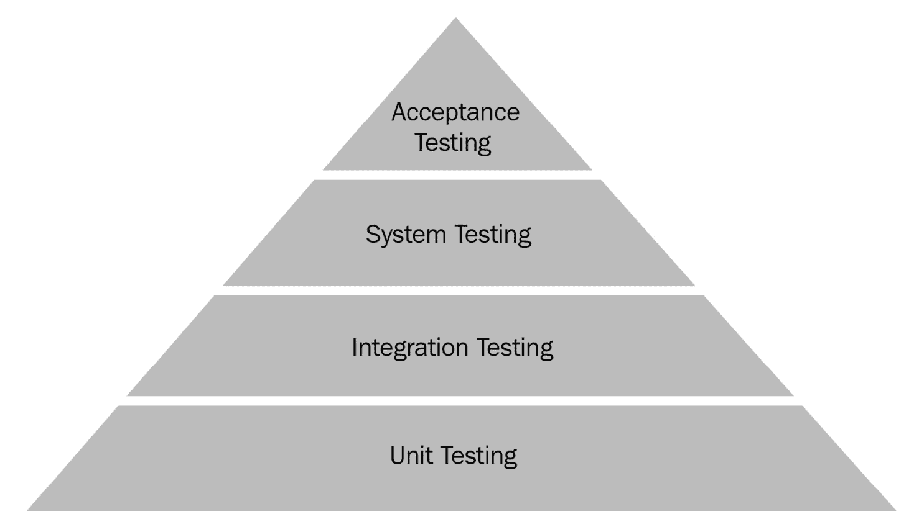
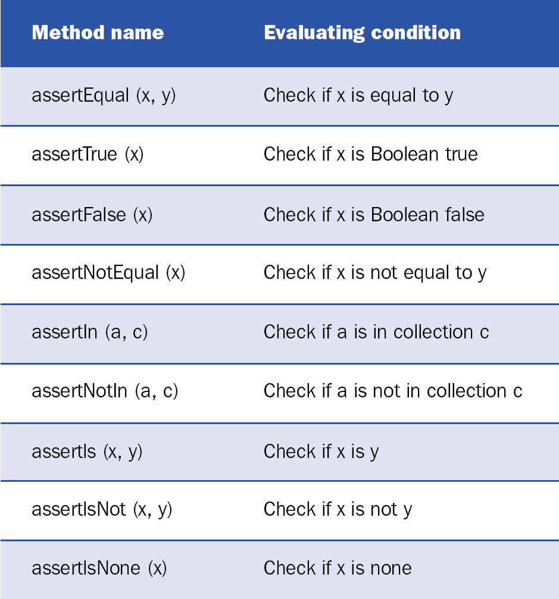
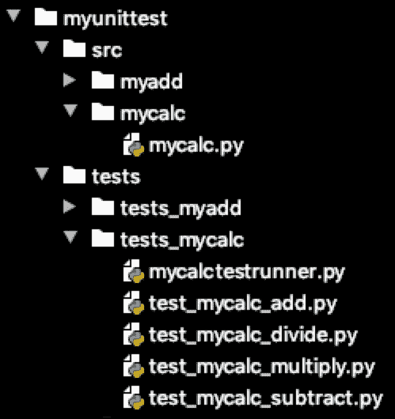
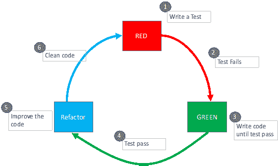
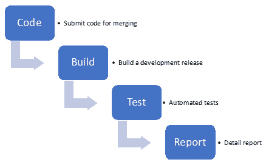

# 第五章：*第五章*：使用 Python 进行测试和自动化

软件测试是根据用户要求或期望的规范验证应用程序或程序的过程，并评估软件的可扩展性和优化目标。以真实用户验证软件需要很长时间，并且不是人力资源的有效利用。此外，测试不仅只进行一次或两次，而是一个作为软件开发一部分的持续过程。为了应对这种情况，建议对所有类型的测试进行自动化。**测试自动化**是一组程序，用于使用不同场景作为输入来验证应用程序的行为。对于专业的软件开发环境，每次将源代码更新（也称为**提交操作**）到中央存储库时，都必须执行自动化测试。

在本章中，我们将研究自动化的不同方法，然后查看适用于 Python 应用程序的测试框架和库的不同类型。然后，我们将专注于单元测试，并探讨在 Python 中实现单元测试的不同方法。接下来，我们将研究**测试驱动开发**（**TDD**）的有用性及其正确的实现方式。最后，我们将专注于自动化的**持续集成**（**CI**），并探讨其稳健和高效实施所面临的挑战。本章将帮助您理解 Python 在各个级别自动化的概念。

本章将涵盖以下主题：

+   理解各种测试级别

+   使用 Python 测试框架

+   执行 TDD

+   介绍自动化 CI

在本章结束时，您不仅将了解不同类型的测试自动化，还将能够使用两个流行的测试框架之一编写单元测试。

# 技术要求

这是本章的技术要求：

+   您需要在您的计算机上安装 Python 3.7 或更高版本。

+   您需要在 Test PyPI 上注册一个账户，并在您的账户下创建一个**应用程序编程接口**（**API**）令牌。

本章的示例代码可在[`github.com/PacktPublishing/Python-for-Geeks/tree/master/Chapter05`](https://github.com/PacktPublishing/Python-for-Geeks/tree/master/Chapter05)找到。

# 理解各种测试级别

根据应用程序类型、其复杂程度以及正在开发该应用程序的团队的角色，在各个级别执行测试。不同的测试级别包括以下内容：

+   单元测试

+   集成测试

+   系统测试

+   接受测试

这些不同的测试级别按照以下顺序应用：



图 5.1 – 软件开发中的不同测试级别

这些测试级别将在下一小节中描述。

## 单元测试

单元测试是一种关注最小可能单元级别的测试类型。一个单元对应于代码中的一个单元，可以是模块中的一个函数或类中的一个方法，也可以是应用程序中的一个模块。单元测试在隔离的情况下执行单个单元的代码，并验证代码是否按预期工作。单元测试是开发者用于在代码开发的早期阶段识别错误，并在开发过程的第一轮迭代中修复它们的技巧。在 Python 中，单元测试主要针对特定的类或模块，而不涉及依赖项。

单元测试是由应用程序开发者开发的，可以在任何时间进行。单元测试是一种`pyunit`（`unittest`）、`pytest`、`doctest`、`nose`以及其他几种测试方式。

## 集成测试

集成测试是关于以组的形式集体测试程序中的单个单元。这种测试背后的理念是将应用程序的不同功能或模块组合在一起进行测试，以验证组件之间的接口和数据交换。

集成测试通常由测试人员而不是开发者执行。这种测试在单元测试过程之后开始，测试的重点是识别当不同的模块或功能一起使用时出现的集成问题。在某些情况下，集成测试可能需要外部资源或数据，这些资源或数据在开发环境中可能无法提供。这种限制可以通过使用模拟测试来管理，模拟测试提供外部或内部依赖的替代模拟对象。模拟对象模拟真实依赖的行为。模拟测试的例子可以是发送电子邮件或使用信用卡进行支付。

集成测试是一种**黑盒测试**。用于集成测试的库和工具与单元测试中使用的几乎相同，区别在于测试的边界被进一步扩展，以包括单个测试中的多个单元。

## 系统测试

系统测试的边界进一步扩展到系统级别，这可能是一个完整的模块或应用程序。这种测试从**端到端**（**E2E**）的角度验证应用程序的功能。

系统测试也是由测试人员开发的，但完成集成测试过程之后。我们可以这样说，集成测试是系统测试的先决条件；否则，在执行系统测试时，将会重复大量的工作。系统测试可以识别潜在的问题，但无法确定问题的具体位置。问题的确切根本原因通常由集成测试甚至通过添加更多的单元测试来确定。

系统测试也是一种黑盒测试，可以利用与集成测试相同的库。

## 接受测试

接受测试是在接受软件用于日常使用之前的最终用户测试。接受测试通常不是自动化测试的候选者，但在应用用户必须通过 API 与产品交互的情况下，使用自动化进行接受测试是值得的。这种测试也称为**用户接受测试**（**UAT**）。这种类型的测试很容易与系统测试混淆，但它不同之处在于它确保了从真实用户的角度来看应用程序的可使用性。还有另外两种接受测试：**工厂接受测试**（**FAT**）和**运营接受测试**（**OAT**）。前者从硬件角度来看更为流行，后者由负责在生产环境中使用产品的运营团队执行。

此外，我们还听说过**alpha**和**beta**测试。这些也是用户级别的测试方法，并不适用于测试自动化。Alpha 测试由开发人员和内部员工执行，以模拟实际用户的行为。Beta 测试由客户或实际用户执行，以便在宣布软件的**通用可用性**（**GA**）之前提供早期反馈。

在软件开发中，我们也使用术语**回归测试**。这基本上是在我们更改源代码或任何内部或外部依赖项更改时执行测试。这种做法确保我们的产品在更改之前以相同的方式运行。由于回归测试会重复多次，因此自动化测试对于这种类型的测试是必须的。

在下一节中，我们将探讨如何使用 Python 中的测试框架构建测试用例。

# 与 Python 测试框架一起工作

Python 提供了用于测试自动化的标准库和第三方库。最流行的框架在此列出：

+   `pytest`

+   `unittest`

+   `doctest`

+   `nose`

这些框架可以用于单元测试，以及集成和系统测试。在本节中，我们将评估这些框架中的两个：`unittest`，它是 Python 标准库的一部分，以及`pytest`，它作为一个外部库可用。评估的重点将在于使用这两个框架构建测试用例（主要是单元测试），尽管也可以使用相同的库和设计模式构建集成和系统测试。

在我们开始编写任何测试用例之前，了解什么是测试用例非常重要。在本章和本书的上下文中，我们可以将测试用例定义为根据预期结果验证编程代码特定行为结果的一种方式。测试用例的开发可以分为以下四个阶段：

1.  **准备**：这是一个为我们的测试用例准备环境的阶段。这不包括任何动作或验证步骤。在测试自动化社区中，这个阶段更常见地被称为准备**测试工具**。

1.  **执行**：这是触发我们想要测试的系统的动作阶段。这个动作阶段导致系统行为发生变化，而系统状态的变化是我们想要评估以进行验证目的的东西。请注意，在这个阶段我们不会验证任何东西。

1.  **断言**：在这个阶段，我们评估*执行*阶段的结果，并将结果与预期结果进行验证。基于这种验证，测试自动化工具将测试用例标记为失败或通过。在大多数工具中，这种验证是通过内置的*断言*函数或语句实现的。

1.  **清理**：在这个阶段，环境被清理以确保其他测试不受*执行*阶段引起的状态变化的影响。

测试用例的核心阶段是*执行*和*断言*。*准备*和*清理*阶段是可选的，但强烈推荐。这两个阶段主要提供软件测试工具。测试工具是一种设备或装置或软件，它提供了一个环境，以一致的方式测试设备或机器或软件。术语*测试工具*在单元测试和集成测试的上下文中使用。

测试框架或库提供了辅助方法或语句，以便方便地实现这些阶段。在下一节中，我们将评估`unittest`和`pytest`框架以下主题：

+   如何构建执行和断言阶段的基线测试用例

+   如何使用测试工具构建测试用例

+   如何构建异常和错误验证的测试用例

+   如何批量运行测试用例

+   如何在执行中包含和排除测试用例

这些主题不仅涵盖了各种测试用例的开发，还包括执行它们的不同方式。我们将从`unittest`框架开始评估。

## 与 unittest 框架一起工作

在开始使用`unittest`框架或库讨论实际示例之前，介绍一些与单元测试和，特别是与`unittest`库相关的术语和传统方法名称是很重要的。这些术语在所有测试框架中或多或少都会使用，下面概述如下：

+   **测试用例**：测试或测试用例或测试方法是一组基于执行应用代码单元后的当前条件与执行后的条件比较的代码指令。

+   **测试套件**：测试套件是一组可能具有共同先决条件、初始化步骤，也许还有相同的清理步骤的测试用例。这促进了测试自动化代码的可重用性并减少了执行时间。

+   **测试运行器**: 这是一个 Python 应用程序，它执行测试（单元测试），验证代码中定义的所有断言，并将结果作为成功或失败返回给我们。

+   **设置**: 这是测试套件中的一个特殊方法，将在每个测试用例之前执行。

+   `setupClass`: 这是测试套件中的一个特殊方法，它将在测试套件中测试执行开始时仅执行一次。

+   `teardown`: 这是测试套件中的另一个特殊方法，在每次测试完成后执行，无论测试是否通过。

+   `teardownClass`: 这是测试套件中的另一个特殊方法，当套件中的所有测试完成后，将仅执行一次。

要使用`unittest`库编写测试用例，我们必须将测试用例实现为从`TestCase`基类继承的类的实例方法。`TestCase`类包含一些方法，可以方便地编写和执行测试用例。这些方法分为三类，将在下面讨论：

+   `setUp`, `tearDown`, `setupClass`, `teardownClass`, `run`, `skipTest`, `skipTestIf`, `subTest`, 和 `debug`。这些测试由测试运行器用于在测试用例之前或之后执行一段代码，运行一组测试用例，运行测试，跳过测试，或作为子测试运行任何代码块。在我们的测试用例实现类中，我们可以重写这些方法。这些方法的详细说明作为 Python 文档的一部分，可在[`docs.python.org/3/library/unittest.html`](https://docs.python.org/3/library/unittest.html)找到。

+   **验证方法**（断言方法）：这些方法用于实现测试用例以检查成功或失败条件，并自动报告测试用例的成功或失败。这些方法的名称通常以`assert`前缀开头。断言方法的列表非常长。我们在此提供一些常用断言方法的示例：

图 5.2 – TestCase 类断言方法的几个示例

+   `failureException`: 此属性提供由测试方法引发的异常。此异常可以用作超类来定义具有附加信息的自定义失败异常。

    b) `longMessage`: 此属性确定如何处理使用`assert`方法传递的自定义消息。如果此属性的值设置为`True`，则消息将附加到标准失败消息。如果此属性设置为`false`，则自定义消息将替换标准消息。

    c) `countTestCases()`: 此方法返回附加到测试对象上的测试数量。

    d) `shortDescription()`: 此方法返回测试方法的描述，如果有任何描述添加，则使用文档字符串。

我们在本节中回顾了`TestCase`类的主要方法。在下一节中，我们将探讨如何使用`unittest`为示例模块或应用程序构建单元测试。

### 使用基类`TestCase`构建测试用例

`unittest`库是一个受 JUnit 框架（Java 社区中流行的测试框架）高度启发的标准 Python 测试框架。单元测试以单独的 Python 文件编写，并建议将这些文件作为主项目的一部分。正如我们在*第二章*，*使用模块化处理复杂项目*中的*构建包*部分所讨论的，**Python 打包权威机构**（**PyPA**）的指南建议在为项目或库构建包时为测试保留一个单独的文件夹。在本节的代码示例中，我们将遵循与这里所示类似的结构：

```py
Project-name
|-- src
|   -- __init__.py
|   -- myadd/myadd.py 
|-- tests
|   -- __init__.py
|   -- tests_myadd/test_myadd1.py 
|   -- tests_myadd/test_myadd2.py
|-- README.md
```

在我们的第一个代码示例中，我们将为`myadd.py`模块中的`add`函数构建一个测试套件，如下所示：

```py
# myadd.py with add two numbers
def add(x, y):
    """This function adds two numbers"""
    return x + y
```

重要的是要理解，对于同一块代码（在我们的例子中是`add`函数）可以有多个测试用例。对于`add`函数，我们通过改变输入参数的值实现了四个测试用例。下面是一个包含四个`add`函数测试用例的代码示例，如下所示：

```py
#test_myadd1.py test suite for myadd function
import unittest
from myunittest.src.myadd.myadd import add
class MyAddTestSuite(unittest.TestCase):
def test_add1(self):
    """ test case to validate two positive numbers"""
    self.assertEqual(15, add(10 , 5), "should be 15")
def test_add2(self):
    """ test case to validate positive and negative \
     numbers"""
    self.assertEqual(5, add(10 , -5), "should be 5")
def test_add3(self):
    """ test case to validate positive and negative \
     numbers"""
    self.assertEqual(-5, add(-10 , 5), "should be -5")
def test_add4(self):
    """ test case to validate two negative numbers"""
    self.assertEqual(-15, add(-10 , -5), "should be -15")
if __name__ == '__main__':
    unittest.main()
```

接下来将讨论前面测试套件的所有关键点，如下所示：

+   要使用`unittest`框架实现单元测试，我们需要导入一个同名的标准库，即`unittest`。

+   我们需要在测试套件中导入我们想要测试的模块或模块。在这种情况下，我们使用相对导入方法从`myadd.py`模块中导入了`add`函数（参见*第二章*，*使用模块化处理复杂项目*中的*导入模块*部分，了解更多详情）。

+   我们将实现一个继承自`unittest.Testcase`基类的测试套件类。测试用例在子类中实现，在这个例子中是`MyAddTestSuite`类。`unittest.Testcase`类的构造函数可以接受一个方法名作为输入，该输入可以用来运行测试用例。默认情况下，已经实现了一个`runTest`方法，该方法是测试运行器用来执行测试的。在大多数情况下，我们不需要提供自己的方法或重新实现`runTest`方法。

+   要实现一个测试用例，我们需要编写一个以`test`前缀开头并跟一个下划线的函数。这有助于测试运行器查找要执行的测试用例。使用这种命名约定，我们向我们的测试套件中添加了四个方法。

+   在每个测试用例方法中，我们使用了一个特殊的`assertEqual`方法，它来自基类。这个方法代表了测试用例的断言阶段，用于决定我们的测试将被宣布为通过或失败。这个方法的第一个参数是单元测试的预期结果，第二个参数是在执行测试代码后得到的值，第三个参数（可选）是在测试失败时报告中的消息。

+   在测试套件结束时，我们添加了`unittest.main`方法来触发测试运行器运行`runTest`方法，这使得在不使用控制台命令的情况下执行测试变得容易。这个`main`方法（底层是一个`TestProgram`类）将首先发现所有要执行的测试，然后执行这些测试。

    重要提示

    可以使用如`Python -m unittest <测试套件或模块>`这样的命令来运行单元测试，但本章提供的代码示例将假设我们正在使用 PyCharm **集成开发环境**（**IDE**）来运行测试用例。

接下来，我们将使用测试固定装置构建下一级的测试用例。

### 使用测试固定装置构建测试用例

我们已经讨论了在执行测试用例前后由测试运行器自动运行的`setUp`和`tearDown`方法。这些方法（以及`setUpClass`和`tearDownClass`方法）提供了测试固定装置，并且对于有效地实现单元测试非常有用。

首先，我们将修改`add`函数的实现。在新实现中，我们将这段代码单元作为`MyAdd`类的一部分。我们还通过在输入参数无效的情况下抛出`TypeError`异常来处理这种情况。下面是包含新`add`方法的完整代码片段：

```py
# myadd2.py is a class with add two numbers method
class MyAdd:
    def add(self, x, y):
        """This function adds two numbers"""
        if (not isinstance(x, (int, float))) | \
                (not isinstance(y, (int, float))) :
            raise TypeError("only numbers are allowed")
        return x + y
```

在上一节中，我们仅使用行为阶段和断言阶段构建了测试用例。在本节中，我们将通过添加`setUp`和`tearDown`方法来修改之前的代码示例。下面是`myAdd`类的测试套件，如下所示：

```py
#test_myadd2.py test suite for myadd2 class method
import unittest
from myunittest.src.myadd.myadd2 import MyAdd
class MyAddTestSuite(unittest.TestCase):
    def setUp(self):
        self.myadd = MyAdd()
    def tearDown(self):
        del (self.myadd)
    def test_add1(self):
       """ test case to validate two positive numbers"""
       self.assertEqual(15, self.myadd.add(10 , 5), \
        "should be 15")
    def test_add2(self):
        """ test case to validate positive and negative           numbers"""
        self.assertEqual(5, self.myadd.add(10 , -5), \
         "should be 5")
#test_add3 and test_add4 are skipped as they are very \
 same as test_add1 and test_add2
```

在这个测试套件中，我们添加或更改了以下内容：

+   我们在`setUp`方法中创建了一个新的`MyAdd`类实例，并将其引用保存为实例属性。这意味着在执行任何测试用例之前，我们将创建一个新的`MyAdd`类实例。这可能不是这个测试套件的理想做法，因为更好的方法可能是使用`setUpClass`方法，为整个测试套件创建一个`MyAdd`类的单个实例，但我们这样实现是为了说明目的。

+   我们还添加了一个`tearDown`方法。为了演示如何实现它，我们简单地调用了在`setUp`方法中创建的`MyAdd`实例的析构函数（使用`del`函数）。与`setUp`方法一样，`tearDown`方法是在每个测试用例之后执行的。如果我们打算使用`setUpClass`方法，有一个等效的`tearDownClass`方法。

在下一节中，我们将展示构建测试用例以处理`TypeError`异常的代码示例。

### 带有错误处理的测试用例构建

在之前的代码示例中，我们只比较了测试用例的结果与预期结果。我们没有考虑任何异常处理，例如如果将错误类型的参数传递给我们的`add`函数，我们的程序会有什么行为。单元测试也必须涵盖编程的这些方面。

在下一个代码示例中，我们将构建测试用例以处理来自代码单元的预期错误或异常。对于这个例子，我们将使用相同的`add`函数，如果参数不是数字，它将抛出`TypeError`异常。测试用例将通过向`add`函数传递非数字参数来构建。下一个代码片段显示了测试用例：

```py
#test_myadd3.py test suite for myadd2 class method to validate errors
import unittest
from myunittest.src.myadd.myadd2 import MyAdd
class MyAddTestSuite(unittest.TestCase):
    def setUp(self):
        self.myadd = MyAdd()
    def test_typeerror1(self):
        """ test case to check if we can handle non \
         number input"""
        self.assertRaises(TypeError, self.myadd.add, \
         'a' , -5)
    def test_typeerror2(self):
        """ test case to check if we can handle non \
         number input"""
        self.assertRaises(TypeError, self.myadd.add, \
         'a' , 'b')
```

在前面的代码片段中，我们在`test_add3.py`模块中添加了两个额外的测试用例。这些测试用例使用`assertRaises`方法来验证是否抛出了特定类型的异常。在我们的测试用例中，我们使用单个字母（`a`）或两个字母（`a`和`b`）作为两个测试用例的参数。在两种情况下，我们都期望抛出预期的异常（`TypeError`）。注意`assertRaises`方法的参数。此方法只期望将方法或函数名称作为第二个参数。方法或函数的参数必须作为`assertRaises`函数的参数单独传递。

到目前为止，我们已经在单个测试套件下执行了多个测试用例。在下一节中，我们将讨论如何同时运行多个测试套件，使用命令行以及程序化方式。

### 执行多个测试套件

随着我们为每个代码单元构建测试用例，测试用例的数量（单元测试用例）会迅速增长。使用测试套件的想法是将模块化引入测试用例的开发中。测试套件也使得在添加更多功能到应用程序时维护和扩展测试用例变得更加容易。接下来我们想到的是如何通过主脚本或工作流程来执行多个测试套件。像 Jenkins 这样的 CI 工具提供了这样的功能。像`unittest`、`nose`或`pytest`这样的测试框架也提供了类似的功能。

在本节中，我们将构建一个简单的计算器应用程序（一个`MyCalc`类），其中包含`add`、`subtract`、`multiply`和`divide`方法。稍后，我们将为这个类中的每个方法添加一个测试套件。这样，我们将为这个计算器应用程序添加四个测试套件。目录结构在实现测试套件和测试用例时非常重要。对于这个应用程序，我们将使用以下目录结构：



图 5.3 – mycalc 应用程序及其相关测试套件的目录结构

Python 代码编写在`mycalc.py`模块中，测试套件文件（`test_mycalc*.py`）将在下面展示。请注意，我们只展示了每个测试套件中的单个测试用例。实际上，每个测试套件中都会有多个测试用例。我们将从`mycalc.py`文件中的计算器函数开始，如下所示：

```py
# mycalc.py with add, subtract, multiply and divide functions
class MyCalc:
    def add(self, x, y):
        """This function adds two numbers"""
        return x + y
    def subtract(self, x, y):
        """This function subtracts two numbers"""
        return x - y
    def multiply(self, x, y):
        """This function subtracts two numbers"""
        return x * y
    def divide(self, x, y):
        """This function subtracts two numbers"""
        return x / y
```

接下来，我们有一个测试套件用于测试`test_mycalc_add.py`文件中的`add`函数，如下面的代码片段所示：

```py
# test_mycalc_add.py test suite for add class method
import unittest
from myunittest.src.mycalc.mycalc import MyCalc
class MyCalcAddTestSuite(unittest.TestCase):
    def setUp(self):
        self.calc = MyCalc()
    def test_add(self):
        """ test case to validate two positive numbers"""
        self.assertEqual(15, self.calc.add(10, 5), \
         "should be 15")
```

接下来，我们有一个测试套件用于测试`test_mycalc_subtract.py`文件中的`subtract`函数，如下面的代码片段所示：

```py
#test_mycalc_subtract.py test suite for subtract class method
import unittest
from myunittest.src.mycalc.mycalc import MyCalc
class MyCalcSubtractTestSuite(unittest.TestCase):
    def setUp(self):
        self.calc = MyCalc()
    def test_subtract(self):
        """ test case to validate two positive numbers"""
        self.assertEqual(5, self.calc.subtract(10,5), \
         "should be 5")
```

接下来，我们有一个测试套件用于测试`test_mycalc_multiply.py`文件中的`multiply`函数，如下面的代码片段所示：

```py
#test_mycalc_multiply.py test suite for multiply class method
import unittest
from myunittest.src.mycalc.mycalc import MyCalc
class MyCalcMultiplyTestSuite(unittest.TestCase):
    def setUp(self):
        self.calc = MyCalc()
    def test_multiply(self):
        """ test case to validate two positive numbers"""
        self.assertEqual(50, self.calc.multiply(10, 5), "should           be 50")
```

接下来，我们有一个测试套件用于测试`test_mycalc_divide.py`文件中的`divide`函数，如下面的代码片段所示：

```py
#test_mycalc_divide.py test suite for divide class method
import unittest
from myunittest.src.mycalc.mycalc import MyCalc
class MyCalcDivideTestSuite(unittest.TestCase):
    def setUp(self):
        self.calc = MyCalc()
    def test_divide(self):
        """ test case to validate two positive numbers"""
        self.assertEqual(2, self.calc.divide(10 , 5), \
         "should be 2")
```

我们已经有了示例应用程序代码和所有四个测试套件的代码。下一个方面是如何一次性执行所有测试套件。一个简单的方法是使用`discover`关键字。在我们的示例案例中，我们将从项目的顶部运行以下命令来发现并执行`tests_mycalc`目录中所有四个测试套件中的所有测试用例：

```py
python -m unittest discover myunittest/tests/tests_mycalc
```

此命令将以递归方式执行，这意味着它还可以发现子目录中的测试用例。其他（可选）参数可以用来选择要执行的测试用例集，具体描述如下：

+   `-v`：使输出详细。

+   `-s`：测试用例发现的起始目录。

+   `-p`：用于搜索测试文件的模式。默认为`test*.py`，但可以通过此参数更改。

+   `-t`：这是项目的顶层目录。如果没有指定，起始目录是顶层目录

尽管运行多个测试套件的命令行选项简单且强大，但我们有时需要控制从不同位置的不同测试套件中运行选定测试的方式。这就是通过 Python 代码加载和执行测试用例变得方便的地方。下面的代码片段是一个示例，展示了如何从类名中加载测试套件，在每个套件中查找测试用例，然后使用`unittest`测试运行器运行它们：

```py
import unittest
from test_mycalc_add import MyCalcAddTestSuite
from test_mycalc_subtract import MyCalcSubtractTestSuite
from test_mycalc_multiply import MyCalcMultiplyTestSuite
from test_mycalc_divide import MyCalcDivideTestSuite
def run_mytests():
    test_classes = [MyCalcAddTestSuite, \
      MyCalcSubtractTestSuite,\
      MyCalcMultiplyTestSuite,MyCalcDivideTestSuite ]
    loader = unittest.TestLoader()
    test_suites = []
    for t_class in test_classes:
        suite = loader.loadTestsFromTestCase(t_class)
        test_suites.append(suite)
    final_suite = unittest.TestSuite(test_suites)
    runner = unittest.TextTestRunner()
    results = runner.run(final_suite)

if __name__ == '__main__':
    run_mytests()
```

在本节中，我们介绍了使用`unittest`库构建测试用例。在下一节中，我们将使用`pytest`库。

## 与 pytest 框架一起工作

使用`unittest`库编写的测试用例更容易阅读和管理，尤其是如果你来自使用 JUnit 或其他类似框架的背景。但对于大规模 Python 应用程序，`pytest`库因其易于实现和使用以及能够扩展以满足复杂测试需求而脱颖而出。在`pytest`库的情况下，没有要求从任何基类扩展单元测试类；实际上，我们可以编写测试用例而不实现任何类。

`pytest`是一个开源框架。与`unittest`框架一样，`pytest`测试框架可以自动发现测试，如果文件名有`test`前缀，并且这种发现格式是可以配置的。`pytest`框架提供的功能与`unittest`框架提供的单元测试功能相同。在本节中，我们将重点讨论`pytest`框架中不同或额外的功能。

### 无基类构建测试用例

为了演示如何使用`pytest`库编写单元测试用例，我们将通过实现没有类的`add`函数来修改我们的`myadd2.py`模块。这个新的`add`函数将添加两个数字，如果*数字*没有作为参数传递，则抛出异常。使用`pytest`框架的测试用例代码如下所示：

```py
# myadd3.py is a class with add two numbers method
def add(self, x, y):
    """This function adds two numbers"""
    if (not isinstance(x, (int, float))) | \
            (not isinstance(y, (int, float))):
        raise TypeError("only numbers are allowed")
    return x + y
```

接下来将展示测试用例的模块，如下所示：

```py
#test_myadd3.py test suite for myadd function
import pytest
from mypytest.src.myadd3 import add
def test_add1():
    """ test case to validate two positive numbers"""
    assert add(10, 5) == 15"
def test_add2():
    """ test case to validate two positive numbers"""
    assert add(10, -5) == 5, "should be 5"
```

我们只为`test_myadd3.py`模块展示了两个测试用例，因为其他测试用例将与前两个测试用例相似。这些额外的测试用例可以在本章的 GitHub 目录下的源代码中找到。以下是对测试用例实现中的一些关键差异进行了概述：

+   没有要求在类下实现测试用例，我们可以实现测试用例作为类方法，而不需要从任何基类继承。这与`unittest`库相比是一个关键差异。

+   `assert`语句可以作为关键字用于验证任何条件，以声明测试是否通过。将`assert`关键字从条件语句中分离出来，使得测试用例中的断言非常灵活和可定制。

还需要提到的是，使用`pytest`框架，控制台输出和报告功能更加强大。例如，使用`test_myadd3.py`模块执行测试用例的控制台输出如下所示：

```py
test_myadd3.py::test_add1 PASSED                         [25%]
test_myadd3.py::test_add2 PASSED                         [50%]
test_myadd3.py::test_add3 PASSED                         [75%]
test_myadd3.py::test_add4 PASSED                         [100%]
===================== 4 passed in 0.03s =======================
```

接下来，我们将探讨如何使用`pytest`库验证预期的错误。

### 使用错误处理构建测试用例

在`pytest`框架中编写用于验证预期抛出异常或错误的测试用例与在`unittest`框架中编写此类测试用例不同。`pytest`框架利用上下文管理器进行异常验证。在我们的`test_myadd3.py`测试模块中，我们已经添加了两个用于异常验证的测试用例。下面是`test_myadd3.py`模块中包含这两个测试用例的代码片段：

```py
def test_typeerror1():
    """ test case to check if we can handle non number \
     input"""
    with pytest.raises(TypeError):
        add('a', 5)
def test_typeerror2():
    """ test case to check if we can handle non number \
      input"""
    with pytest.raises(TypeError, match="only numbers are \
     allowed"):
        add('a', 'b')
```

为了验证异常，我们使用`pytest`库的`raises`函数来指示通过运行某个单元代码（我们第一个测试用例中的`add('a', 5)`）预期的异常类型。在第二个测试用例中，我们使用了`match`参数来验证抛出异常时设置的消息。

接下来，我们将讨论如何使用`pytest`框架中的标记。

### 使用 pytest 标记构建测试用例

`pytest`框架配备了标记，允许我们为我们的测试用例附加元数据或定义不同的类别。这些元数据可用于许多目的，例如包括或排除某些测试用例。标记是通过使用`@pytest.mark`装饰器实现的。

`pytest`框架提供了一些内置标记，下面将描述其中最受欢迎的几个：

+   `skip`：当使用此标记时，测试运行器将无条件地跳过测试用例。

+   `skipif`：此标记用于根据传递给此标记的条件表达式跳过测试。

+   `xfail`：此标记用于忽略测试用例中预期的失败。它是在特定条件下使用的。

+   `parametrize`：此标记用于使用不同的值作为参数对测试用例进行多次调用。

为了演示前三个标记的使用，我们通过为测试用例函数添加标记来重写我们的`test_add3.py`模块。修改后的测试用例模块（`test_add4.py`）如下所示：

```py
@pytest.mark.skip
def test_add1():
    """ test case to validate two positive numbers"""
    assert add(10, 5) == 15
@pytest.mark.skipif(sys.version_info > (3,6),\ 
reason=" skipped for release > than Python 3.6")
def test_add2():
    """ test case to validate two positive numbers"""
    assert add(10, -5) == 5, "should be 5"
@pytest.mark.xfail(sys.platform == "win32", \
reason="ignore exception for windows")
def test_add3():
    """ test case to validate two positive numbers"""
    assert add(-10, 5) == -5
    raise Exception()
```

我们无条件地使用了`skip`标记来忽略第一个测试用例。这将忽略该测试用例。对于第二个测试用例，我们使用了带有条件（Python 版本大于 3.6）的`skipif`标记。对于最后一个测试用例，我们故意抛出一个异常，并使用`xfail`标记来忽略如果系统平台是 Windows 的此类异常。此类标记有助于在预期某些条件（如本例中的操作系统）下忽略测试用例中的错误。

测试用例的执行控制台输出如下所示：

```py
test_myadd4.py::test_add1 SKIPPED (unconditional skip)   [33%]
Skipped: unconditional skip
test_myadd4.py::test_add2 SKIPPED ( skipped for release > than Pytho...)                                                [66%]
Skipped:  skipped for release > than Python 3.6
test_myadd4.py::test_add3 XFAIL (ignore exception for mac)                                                    [100%]
@pytest.mark.xfail(sys.platform == "win32",
                       reason="ignore exception for mac")
============== 2 skipped, 1 xfailed in 0.06s =================
```

接下来，我们将讨论如何使用`pytest`库中的`parametrize`标记。

### 使用参数化构建测试用例

在所有之前的代码示例中，我们构建了没有传递任何参数给它们的测试用例函数或方法。但对于许多测试场景，我们需要通过改变输入数据来运行相同的测试用例。在经典方法中，我们运行多个测试用例，这些测试用例在输入数据方面不同。我们之前的`test_myadd3.py`示例展示了如何使用这种方法实现测试用例。对于此类测试，一个推荐的方法是使用`pytest`，它将根据表或字典中的排列数量执行我们的测试用例。DDT 的一个现实世界示例是使用各种具有有效和无效凭证的用户来验证应用程序登录功能的操作行为。

在`pytest`框架中，可以使用`pytest`标记进行参数化来实现 DDT。通过使用`parametrize`标记，我们可以定义需要传递的输入参数以及需要使用的测试数据集。`pytest`框架将根据`parametrize`标记提供的测试数据条目数量自动多次执行测试用例函数。

为了说明如何使用`parametrize`标记进行数据驱动测试（DDT），我们将修改我们的`myadd4.py`模块以适应`add`函数的测试用例。在修改后的代码中，我们将只有一个测试用例函数，但将使用不同的测试数据作为输入参数，如下面的代码片段所示：

```py
# test_myadd5.py test suite using parameterize marker
import sys
import pytest
from mypytest.src.myadd3 import add
@pytest.mark.parametrize("x,y,ans",
                         [(10,5,15),(10,-5,5),
                          (-10,5,-5),(-10,-5,-15)],
                         ids=["pos-pos","pos-neg",
                              "neg-pos", "neg-neg"])
def test_add(x, y, ans):
    """ test case to validate two positive numbers"""
    assert add(x, y) == ans
```

对于`parametrize`标记，我们使用了三个参数，具体描述如下：

+   **测试用例参数**：我们提供了一个参数列表，这些参数将按照与测试用例函数定义相同的顺序传递给我们的测试函数。此外，我们将在下一个参数中提供的测试数据也将遵循相同的顺序。

+   **数据**：要传递的测试数据将是一系列不同的输入参数集合。测试数据中的条目数量将决定测试用例将执行多少次。

+   `ids`：这是一个可选参数，主要用于为之前参数中提供的不同测试数据集附加一个友好的标签。这些**标识符**（**ID**）标签将在输出报告中用于识别同一测试用例的不同执行。

下面的代码片段显示了此测试用例执行的控制台输出：

```py
test_myadd5.py::test_add[pos-pos] PASSED                 [ 25%]
test_myadd5.py::test_add[pos-neg] PASSED                 [ 50%]
test_myadd5.py::test_add[neg-pos] PASSED                 [ 75%]
test_myadd5.py::test_add[neg-neg] PASSED                 [100%]
=============== 4 passed in 0.04s ================= 
```

这个控制台输出显示了测试用例执行的次数以及使用了哪些测试数据。使用`pytest`标记构建的测试用例简洁且易于实现。这节省了大量时间，并使我们能够在短时间内编写更多的测试用例（仅通过改变数据）。

接下来，我们将讨论`pytest`库的另一个重要特性：固定值（fixtures）。

### 使用 pytest 固定值构建测试用例

在 `pytest` 框架中，测试固定装置是通过 Python 装饰器 `(@pytest.fixture)` 实现的。与其它框架相比，`pytest` 框架中测试固定装置的实现非常强大，以下是一些关键原因：

+   `pytest` 框架中的固定装置提供了高度的扩展性。我们可以定义通用的设置或固定装置（方法），这些可以在函数、类、模块和包之间重用。

+   `pytest` 框架的固定装置实现是模块化的。我们可以为测试用例使用一个或多个固定装置。一个固定装置也可以使用一个或多个其他固定装置，就像我们使用函数调用其他函数一样。

+   测试套件中的每个测试用例都将具有使用相同或不同固定装置集的灵活性。

+   我们可以在 `pytest` 框架中创建固定装置，并为它们设置范围。默认范围是 `function`，这意味着固定装置将在每个函数（测试用例）执行之前执行。其他范围选项有 `module`、`class`、`package` 或 `session`。以下简要定义：

    a) `Function`：固定装置在执行测试用例后将被销毁。

    b) `Module`：固定装置在执行模块中的最后一个测试用例后将被销毁。

    c) `Class`：固定装置在执行类中的最后一个测试用例后将被销毁。

    d) `Package`：固定装置在执行包中的最后一个测试用例后将被销毁。

    e) `Session`：固定装置在执行测试会话中的最后一个测试用例后将被销毁。

`pytest` 框架有一些有用的内置固定装置可以直接使用，例如 `capfd` 用于捕获输出到文件描述符，`capsys` 用于捕获输出到 `stdout` 和 `stderr`，`request` 用于提供关于请求测试函数的信息，以及 `testdir` 用于提供测试执行的临时测试目录。

`pytest` 框架中的固定装置可以在测试用例结束时用于重置或拆卸。我们将在本节稍后讨论这一点。

在下一个代码示例中，我们将使用自定义固定装置为我们的 `MyCalc` 类构建测试用例。`MyCalc` 的示例代码已在 *执行多个测试套件* 部分中分享。固定装置和测试用例的实现如下所示：

```py
# test_mycalc1.py test calc functions using test fixture
import sys
import pytest
from mypytest.src.myadd3 import add
from mypytest.src.mycalc import MyCalc
@pytest.fixture(scope="module")
def my_calc():
    return MyCalc()
@pytest.fixture
def test_data ():
    return {'x':10, 'y':5}
def test_add(my_calc, test_data):
    """ test case to add two numbers"""
    assert my_calc.add(test_data.get('x'),\
      test_data.get('y')) == 15
def test_subtract(my_calc, test_data):
    """ test case to subtract two numbers"""
    assert my_calc.subtract(test_data.get('x'), \
     test_data.get('y'))== 5
```

在这个测试套件示例中，以下是我们讨论的关键点：

+   我们创建了两个固定装置：`my_calc` 和 `test_data`。`my_calc` 固定装置的设置范围设置为 `module`，因为我们希望它只执行一次，以提供一个 `MyCalc` 类的实例。`test_data` 固定装置使用默认范围（`function`），这意味着它将在每个方法执行之前执行。

+   对于测试用例（`test_add` 和 `test_subtract`），我们使用了固定装置作为输入参数。参数的名称必须与固定装置函数名称匹配。`pytest` 框架会自动查找用于测试用例的参数名称对应的固定装置。

我们讨论的代码示例是使用 fixture 作为设置函数。我们可能想要问的问题是：*我们如何通过 pytest fixtures 实现拆卸功能？* 实现拆卸功能有两种方法，接下来将进行讨论。

#### 使用 yield 代替 return 语句

使用这种方法，我们编写一些代码主要是为了设置目的，使用 `yield` 语句而不是 `return`，然后在 `yield` 语句之后编写拆卸目的的代码。如果我们有一个包含许多 fixtures 的测试套件或模块，`pytest` 测试运行器将执行每个 fixture（按照评估的执行顺序），直到遇到 `yield` 语句。一旦测试用例执行完成，`pytest` 测试运行器将触发所有已 `yield` 的 fixtures 的执行，并执行 `yield` 语句之后的代码。基于 yield 的方法在代码易于遵循和维护方面很干净。因此，这是一个推荐的方法。

#### 使用请求 fixture 添加最终化方法

使用这种方法，我们必须考虑三个步骤来编写拆卸方法，概述如下：

+   我们必须在 fixtures 中使用一个 `request` 对象。`request` 对象可以使用具有相同名称的内置 fixture 提供。

+   我们将定义一个 `teardown` 方法，单独或作为 fixture 实现的一部分。

+   我们将使用 `addfinalizer` 方法将 `teardown` 方法作为可调用方法提供给请求对象。

为了通过代码示例说明这两种方法，我们将修改我们之前对 fixtures 的实现。在修改后的代码中，我们将使用 `yield` 方法实现 `my_calc` fixture，并使用 `addfinalizer` 方法实现 `data_set` fixture。以下是修改后的代码示例：

```py
# test_mycalc2.py test calc functions using test fixture
<import statements>
@pytest.fixture(scope="module")
def my_calc():
    my_calc = MyCalc()
    yield my_calc
    del my_calc
@pytest.fixture
def data_set(request):
    dict = {'x':10, 'y':5}
    def delete_dict(obj):
        del obj
    request.addfinalizer(lambda: delete_dict(dict))
    return dict
<rest of the test cases>
```

注意，对于这些示例 fixtures，实际上没有必要进行拆卸功能，但我们添加它们是为了说明目的。

小贴士

使用 `nose` 和 `doctest` 进行测试自动化类似于使用 `unittest` 和 `pytest` 框架。

在下一节中，我们将讨论软件开发的 TDD 方法。

# 执行 TDD

TDD 是软件工程中众所周知的一种实践。这是一种软件开发方法，其中在编写应用程序中所需功能的任何代码之前，首先编写测试用例。以下是 TDD 的三个简单规则：

+   除非你编写一个失败的单元测试，否则不要编写任何功能代码。

+   不要在同一个测试中编写任何超过使测试失败的代码。

+   不要编写任何超过通过失败测试所需的函数代码。

这些 TDD 规则还驱使我们遵循一个著名的软件开发三阶段方法，称为 **红、绿、重构**。这些阶段在 TDD 中持续重复。这三个阶段在 *图 5.4* 中显示，并将在下面进行描述。

## 红色

在这个阶段，第一步是编写一个没有测试代码的测试。在这种情况下，测试显然会失败。我们不会尝试编写一个完整的测试用例，而只是编写足够的代码来使测试失败。

## 绿色

在这个阶段，第一步是编写代码，直到已经编写的测试通过。再次强调，我们只会编写足够的代码来通过测试。我们将运行所有测试以确保之前编写的测试也能通过。

## 重构

在这个阶段，我们应该考虑提高代码质量，这意味着使代码易于阅读和使用优化——例如，任何硬编码的值都必须移除。在重构周期后运行测试也是推荐的。重构阶段的成果是干净的代码。我们可以通过添加更多测试场景并添加代码来使新测试通过来重复这个周期，并且这个周期必须重复，直到开发出功能。

重要的是要理解 TDD 既不是一种测试方法，也不是一种设计方法。它是一种根据首先编写的测试用例来开发软件的方法。

以下图表显示了 TDD 的三个阶段：



图 5.4 – TDD，也称为红、绿、重构

在下一节中，我们将介绍测试自动化在 CI 流程中的作用。

# 引入自动化 CI

CI 是一个结合了自动化测试和版本控制系统优势的过程，以实现完全自动化的集成环境。采用 CI 开发方法，我们频繁地将代码集成到共享仓库中。每次我们将代码添加到仓库中，都期望以下两个过程启动：

+   自动构建过程开始验证新添加的代码在编译或语法方面没有破坏任何东西。

+   自动化测试执行开始验证现有功能以及新功能是否符合定义的测试用例。

以下图表展示了 CI 流程的不同步骤和阶段。虽然我们在流程图中展示了构建阶段，但对于基于 Python 的项目来说，这不是一个必需的阶段，因为我们可以在没有编译代码的情况下执行集成测试：



图 5.5 – CI 测试阶段

要构建一个持续集成（CI）系统，我们需要一个稳定的分布式版本控制系统，以及一个可以用来通过一系列测试套件测试整个应用程序工作流程的工具。市面上有几种商业和开源软件工具提供持续集成和**持续交付（CD**）功能。这些工具旨在易于与源控制系统和测试自动化框架集成。一些流行的 CI 工具包括 *Jenkins*、*Bamboo*、*Buildbot*、*GitLab CI*、*CircleCI* 和 *Buddy*。这些工具的详细信息可以在 *进一步阅读* 部分找到，供那些有兴趣了解更多的人参考。

这种自动化的 CI 的明显好处是能够快速检测错误，并在一开始就方便地修复它们。重要的是要理解，CI 不仅仅是关于错误修复，但它确实有助于轻松识别错误并及时修复。

# 摘要

在本章中，我们介绍了软件应用的不同测试级别。我们还评估了两个可用于 Python 测试自动化的测试框架（`unittest` 和 `pytest`）。我们学习了如何使用这两个框架构建基本和高级测试用例。在章节的后面部分，我们介绍了 TDD 方法及其对软件开发明显的益处。最后，我们简要介绍了 CI，这是使用**敏捷**和**开发运维（devops**）模型交付软件的关键步骤。

这章对任何想要开始为他们的 Python 应用程序编写单元测试的人来说都很有用。提供的代码示例为我们使用任何测试框架编写测试用例提供了一个良好的起点。

在下一章中，我们将探讨在 Python 中开发应用程序的不同技巧和提示。

# 问题

1.  单元测试是白盒测试还是黑盒测试的一种形式？

1.  我们应该在什么时候使用模拟对象？

1.  使用 `unittest` 框架实现测试固定有哪些方法？

1.  TDD 与 CI 有何不同？

1.  我们应该在什么时候使用 DDT？

# 进一步阅读

+   《Python 测试学习》，作者：*Daniel Arbuckle*

+   《Python 测试驱动开发》，作者：*Harry J.W. Percival*

+   《专家 Python 编程》，作者：*Michał Jaworski 和 Tarek Ziadé*

+   *unittest* 框架的详细信息可以在 Python 文档的[`docs.python.org/3/library/unittest.html`](https://docs.python.org/3/library/unittest.html)找到。

# 答案

1.  白盒测试

1.  模拟对象有助于模拟外部或内部依赖的行为。通过使用模拟对象，我们可以专注于编写测试来验证功能行为。

1.  `setUp`、`tearDown`、`setUpClass`、`tearDownClass`

1.  TDD 是一种先编写测试用例再开发软件的方法。CI 是在我们构建新版本时执行所有测试的过程。TDD 和 CI 之间没有直接关系。

1.  当我们需要对输入参数的多种排列进行功能测试时，会使用 DDT。例如，如果我们需要用不同组合的参数测试一个 API 端点，我们可以利用 DDT。
