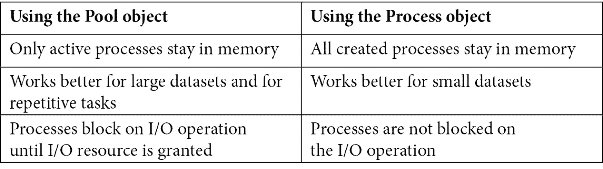
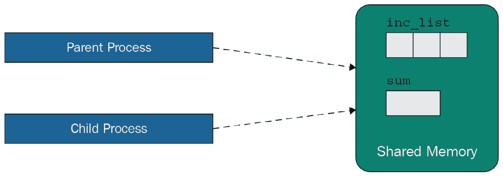
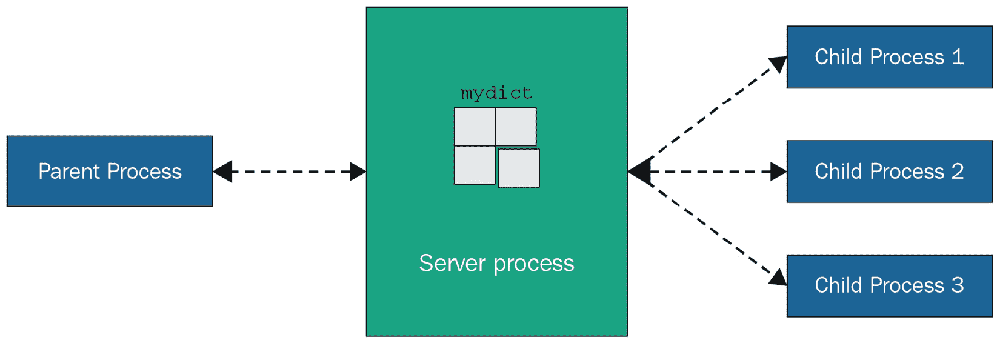

# 第七章：*第七章*：多进程、多线程和异步编程

我们可以编写高效且优化的代码以加快执行时间，但程序运行过程中可用的资源量总是有限的。然而，我们仍然可以通过在相同机器或不同机器上并行执行某些任务来提高应用程序的执行时间。本章将涵盖在单台机器上运行的应用程序的并行处理或并发性。我们将在下一章中介绍使用多台机器进行并行处理。在本章中，我们关注 Python 中用于实现并行处理的内置支持。我们将从 Python 中的多线程开始，然后讨论多进程。之后，我们将讨论如何使用异步编程设计响应式系统。对于每种方法，我们将设计并讨论一个并发应用程序以从 Google Drive 目录下载文件的案例研究。

本章我们将涵盖以下主题：

+   理解 Python 中的多线程及其限制

+   超越单个 CPU – 实现多进程

+   使用异步编程实现响应式系统

完成本章后，您将了解使用内置 Python 库构建多线程或多进程应用程序的不同选项。这些技能将帮助您构建不仅更高效的应用程序，还能构建面向大规模用户的应用程序。

# 技术要求

以下为本章的技术要求：

+   Python 3（3.7 或更高版本）

+   一个 Google Drive 账户

+   为您的 Google Drive 账户启用了 API 密钥

本章的示例代码可在[`github.com/PacktPublishing/Python-for-Geeks/tree/master/Chapter07`](https://github.com/PacktPublishing/Python-for-Geeks/tree/master/Chapter07)找到。

我们将首先从 Python 中的多线程概念开始讨论。

# 理解 Python 中的多线程及其限制

线程是操作系统进程中的一个基本执行单元，它包含自己的程序计数器、一个堆栈和一组寄存器。应用程序进程可以使用多个线程构建，这些线程可以同时运行并共享相同的内存。

对于程序中的多线程，一个进程的所有线程共享公共代码和其他资源，例如数据和系统文件。对于每个线程，所有相关信息均存储在操作系统内核内部的数据结构中，这个数据结构称为**线程控制块（TCB**）。TCB 具有以下主要组件：

+   **程序计数器（PC）**：用于跟踪程序的执行流程。

+   **系统寄存器（REG）**：这些寄存器用于存储变量数据。

+   **堆栈**：堆栈是一个寄存器数组，用于管理执行历史。

线程的解剖结构在 *图 7.1* 中展示，有三个线程。每个线程都有自己的 PC、堆栈和 REG，但与其他线程共享代码和其他资源：

![图 7.1 – 进程中的多个线程

![img/B17189_07_01.jpg]

图 7.1 – 进程中的多个线程

TCB 还包含一个线程标识符、线程状态（例如运行、等待或停止），以及指向它所属进程的指针。多线程是操作系统的一个概念。它是通过系统内核提供的一项功能。操作系统简化了在相同进程上下文中同时执行多个线程，使它们能够共享进程内存。这意味着操作系统完全控制哪个线程将被激活，而不是应用程序。我们需要强调这一点，以便在比较不同并发选项的后续讨论中提及。

当线程在单 CPU 机器上运行时，操作系统实际上会切换 CPU 从一个线程到另一个线程，使得线程看起来是并发运行的。在单 CPU 机器上运行多个线程有什么优势吗？答案是是和否，这取决于应用程序的性质。对于仅使用本地内存运行的应用程序，可能没有优势；实际上，由于在单个 CPU 上切换线程的开销，它可能表现出更低的性能。但对于依赖于其他资源的应用程序，由于 CPU 的更好利用，执行可以更快：当一个线程等待另一个资源时，另一个线程可以利用 CPU。

当在多处理器或多 CPU 核心上执行多个线程时，它们可以并发执行。接下来，我们将讨论 Python 多线程编程的限制。

## 什么是 Python 的盲点？

从编程的角度来看，多线程是同时运行应用程序不同部分的一种方法。Python 使用多个内核线程，可以运行 Python 用户线程。但 Python 实现（*CPython*）允许线程通过一个全局锁访问 Python 对象，这个锁被称为 **全局解释器锁（GIL）**。简单来说，GIL 是一个互斥锁，它允许一次只有一个线程使用 Python 解释器，并阻止所有其他线程。这是必要的，以保护 Python 中每个对象管理的引用计数，防止垃圾回收。如果没有这种保护，如果多个线程同时更新，引用计数可能会被破坏。这种限制的原因是为了保护内部解释器数据结构和不是线程安全的第三方 *C* 代码。

重要提示

这种全局解释器锁（GIL）的限制在 Jython 和 IronPython 中不存在，它们是 Python 的其他实现。

这种 Python 限制可能会给我们一种印象，即编写 Python 多线程程序没有优势。这并不正确。我们仍然可以在 Python 中编写并发或并行运行的代码，我们将在我们的案例研究中看到这一点。在以下情况下，多线程可能是有益的：

+   **I/O 密集型任务**：当与多个 I/O 操作一起工作时，通过使用多个线程运行任务，总是有改进性能的空间。当一个线程正在等待 I/O 资源的响应时，它将释放 GIL 并让其他线程工作。原始线程将在 I/O 资源响应到达时立即唤醒。

+   **响应式 GUI 应用程序**：对于交互式 GUI 应用程序，有必要有一个设计模式来显示在后台运行的任务（例如，下载文件）的进度，并且允许用户在后台运行一个或多个任务的同时，工作在其他 GUI 功能上。所有这些都可以通过使用为用户通过 GUI 发起的操作创建的单独线程来实现。

+   **多用户应用程序**：线程也是构建多用户应用程序的先决条件。Web 服务器和文件服务器是这样的应用程序的例子。一旦此类应用程序的主线程收到新的请求，就会创建一个新的线程来处理请求，而主线程在后台监听新的请求。

在讨论多线程应用程序的案例研究之前，介绍 Python 多线程编程的关键组件是很重要的。

## 学习 Python 多线程编程的关键组件

Python 中的多线程允许我们并发运行程序的不同组件。为了创建应用程序的多个线程，我们将使用 Python 的`threading`模块，接下来将描述该模块的主要组件。

我们将首先讨论 Python 中的`threading`模块。

### 线程模块

`threading`模块是一个标准模块，它提供了简单且易于使用的多线程构建方法。在底层，此模块使用较低级别的`_thread`模块，这在 Python 早期版本中是多线程的一个流行选择。

要创建一个新线程，我们将创建一个`Thread`类的对象，该对象可以接受一个作为`target`属性要执行的功能名称，以及作为`args`属性传递给函数的参数。一个线程可以被赋予一个名称，可以在创建时使用构造函数的`name`参数来设置。

在创建`Thread`类的对象之后，我们需要使用`start`方法启动线程。为了使主程序或线程等待新创建的线程对象完成，我们需要使用`join`方法。`join`方法确保主线程（调用线程）等待被调用`join`方法的线程完成其执行。

为了解释创建、启动和等待线程执行完成的过程，我们将创建一个包含三个线程的简单程序。下面展示了这样一个程序的完整代码示例：

```py
# thread1.py to create simple threads with function
from threading import current_thread, Thread as Thread
from time import sleep
def print_hello():
    sleep(2)
    print("{}: Hello".format(current_thread().name))
def print_message(msg):
    sleep(1)
    print("{}: {}".format(current_thread().name, msg))
# create threads
t1 = Thread(target=print_hello, name="Th 1")
t2 = Thread(target=print_hello, name="Th 2")
t3 = Thread(target=print_message, args=["Good morning"], 
        name="Th 3")
# start the threads
t1.start()
t2.start()
t3.start()
# wait till all are done
t1.join()
t2.join()
t3.join()
```

在这个程序中，我们实现了以下功能：

+   我们创建了两个简单的函数`print_hello`和`print_message`，这些函数将由线程使用。我们在两个函数中都使用了`time`模块中的`sleep`函数，以确保两个函数在不同的时间完成它们的执行时间。

+   我们创建了三个`Thread`对象。其中两个对象将执行一个函数（`print_hello`），以展示线程之间的代码共享，第三个线程对象将使用第二个函数（`print_message`），该函数也接受一个参数。

+   我们使用`start`方法逐个启动所有三个线程。

+   我们通过使用`join`方法等待每个线程完成。

可以将`Thread`对象存储在列表中，以简化使用`for`循环的`start`和`join`操作。该程序的控制台输出将如下所示：

```py
Th 3: Good morning
Th 2: Hello
Th 1: Hello
```

线程 1 和线程 2 的睡眠时间比线程 3 长，因此线程 3 将始终先完成。线程 1 和线程 2 的完成顺序取决于哪个线程首先获得处理器。

重要提示

默认情况下，`join`方法会无限期地阻塞调用线程。但我们可以将超时时间（以秒为单位）作为`join`方法的参数。这将使调用线程仅在超时期间被阻塞。

在讨论更复杂的案例研究之前，我们将回顾几个更多概念。

### 守护线程

在正常的应用程序中，我们的主程序会隐式地等待所有其他线程完成执行。然而，有时我们需要在后台运行一些线程，以便它们可以在不阻塞主程序终止的情况下运行。这些线程被称为**守护线程**。只要主程序（包含非守护线程）在运行，这些线程就会保持活跃状态，一旦非守护线程退出，就可以安全地终止守护线程。在不需要担心线程在执行过程中意外死亡而丢失或损坏数据的情况下，守护线程的使用非常普遍。

可以通过以下两种方法之一将线程声明为守护线程：

+   使用构造函数将`daemon`属性设置为`True`（`daemon = True`）。

+   在线程实例上设置`daemon`属性为`True`（`thread.daemon = True`）。

如果一个线程被设置为守护线程，我们启动线程然后忘记它。当调用它的程序退出时，线程将被自动杀死。

下面的代码展示了同时使用守护线程和非守护线程的使用方法：

```py
#thread2.py to create daemon and non-daemon threads
from threading import current_thread, Thread as Thread
from time import sleep
def daeom_func():
    #print(threading.current_thread().isDaemon())
    sleep(3)
    print("{}: Hello from daemon".format           (current_thread().name))
def nondaeom_func():
    #print(threading.current_thread().isDaemon())
    sleep(1)
    print("{}: Hello from non-daemon".format(        current_thread().name))
#creating threads
t1 = Thread(target=daeom_func, name="Daemon Thread",     daemon=True)
t2 = Thread(target=nondaeom_func, name="Non-Daemon Thread")
# start the threads
t1.start()
t2.start()
print("Exiting the main program")
```

在这个代码示例中，我们创建了一个守护线程和一个非守护线程。守护线程（`daeom_func`）正在执行一个睡眠时间为`3`秒的函数，而非守护线程正在执行一个睡眠时间为 1 秒的函数（`nondaeom_func`）。这两个函数的睡眠时间被设置为确保非守护线程首先完成其执行。该程序的输出控制台如下所示：

```py
Exiting the main program
Non-Daemon Thread: Hello from non-daemon 
```

由于我们没有在任何线程中使用`join`方法，主线程首先退出，然后非守护线程稍后通过打印消息完成。但是守护线程没有打印消息。这是因为非守护线程在非守护线程完成执行后立即终止。如果我们将`nondaeom_func`函数中的睡眠时间改为`5`，控制台输出将如下所示：

```py
Exiting the main program
Daemon Thread: Hello from daemon
Non-Daemon Thread: Hello from non-daemon
```

通过延迟非守护线程的执行，我们确保守护线程完成了其执行，并且不会突然终止。

重要注意事项

如果我们在守护线程上使用`join`，主线程将被迫等待守护线程完成其执行。

接下来，我们将探讨如何在 Python 中同步线程。

### 同步线程

**线程同步**是一种机制，确保两个或更多线程不会同时执行共享代码块。通常访问共享数据或共享资源的代码块也称为**关键部分**。这个概念可以通过以下图示来解释得更清楚：

![图 7.2 – 两个线程访问程序的关键部分

![img/B17189_07_02.jpg]

图 7.2 – 两个线程访问程序的关键部分

同时访问关键部分的多个线程可能会尝试同时访问或更改数据，这可能会导致数据出现不可预测的结果。这种情况称为**竞态条件**。

为了说明竞态条件的概念，我们将实现一个简单的程序，其中包含两个线程，每个线程将共享变量增加 1 百万次。我们选择了一个较高的增加次数，以确保我们可以观察到竞态条件的结果。在较慢的 CPU 上，通过降低增加循环的值也可以观察到竞态条件。在这个程序中，我们将创建两个线程，它们使用相同的函数（在这种情况下是`inc`）作为目标。访问共享变量并将其增加 1 的代码发生在关键部分，并且两个线程都在没有任何保护的情况下访问它。完整的代码示例如下：

```py
# thread3a.py when no thread synchronization used
from threading import Thread as Thread
def inc():
    global x
    for _ in range(1000000):
        x+=1
#global variabale
x = 0
# creating threads
t1 = Thread(target=inc, name="Th 1")
t2 = Thread(target=inc, name="Th 2")
# start the threads
t1.start()
t2.start()
#wait for the threads
t1.join()
t2.join()
print("final value of x :", x)
```

执行结束时 `x` 的预期值是 *2,000,000*，这将在控制台输出中观察不到。每次我们执行这个程序时，我们都会得到一个比 2,000,000 低得多的 `x` 值。这是因为两个线程之间的竞争条件。让我们看看线程 `Th 1` 和 `Th 2` 同时运行临界区 (`x+=1`) 的场景。两个线程都会请求 `x` 的当前值。如果我们假设 `x` 的当前值是 `100`，两个线程都会读取它为 `100` 并将其增加到新的值 `101`。两个线程会将新的值 `101` 写回内存。这是一个一次性增加，实际上，两个线程应该独立于彼此增加变量，`x` 的最终值应该是 `102`。我们如何实现这一点？这就是线程同步发挥作用的地方。

可以通过使用 `threading` 模块中的 `Lock` 类来实现线程同步。`Lock` 类通过提供 `acquire` 和 `release` 两个方法来实现锁，下面将进行描述：

+   使用 `acquire` 方法来获取锁。如果锁是 `unlocked`（未锁定）的，那么锁会被提供给请求的线程以继续执行。在非阻塞获取请求的情况下，线程执行不会被阻塞。如果锁可用（`unlocked`），则将锁提供给（并 `locked`）请求的线程以继续执行，否则请求的线程会得到 `False` 作为响应。

+   使用 `release` 方法来释放锁，这意味着它将锁重置为 `unlocked` 状态。如果有任何线程正在阻塞并等待锁，它将允许其中一个线程继续执行。

`thread3a.py` 代码示例通过在共享变量 `x` 的增量语句周围使用锁进行了修改。在这个修改后的示例中，我们在主线程级别创建了一个锁，并将其传递给 `inc` 函数以获取和释放围绕共享变量的锁。完整的修改后的代码示例如下：

```py
# thread3b.py when thread synchronization is used
from threading import Lock, Thread as Thread
def inc_with_lock (lock):
    global x
    for _ in range(1000000):
        lock.acquire()
        x+=1
        lock.release()
x = 0
mylock = Lock()
# creating threads
t1 = Thread(target= inc_with_lock, args=(mylock,), name="Th     1")
t2 = Thread(target= inc_with_lock, args=(mylock,), name="Th     2")
# start the threads
t1.start()
t2.start()
#wait for the threads
t1.join()
t2.join()
print("final value of x :", x)
```

使用 `Lock` 对象后，`x` 的值总是 `2000000`。`Lock` 对象确保一次只有一个线程增加共享变量。线程同步的优势在于你可以使用系统资源，以增强性能和可预测的结果。

然而，锁必须谨慎使用，因为不当使用锁可能导致死锁情况。假设一个线程在资源 A 上获取了锁并正在等待获取资源 B 的锁。但另一个线程已经持有资源 B 的锁并正在尝试获取资源 A 的锁。这两个线程将等待对方释放锁，但这种情况永远不会发生。为了避免死锁情况，多线程和进程库提供了添加资源持有锁的超时时间等机制，或者使用上下文管理器来获取锁。

### 使用同步队列

Python 中的`Queue`模块实现了多生产者和多消费者队列。在多线程应用程序中，当需要在不同的线程之间安全地交换信息时，队列非常有用。同步队列的美丽之处在于它们自带所有必要的锁定机制，无需使用额外的锁定语义。

`Queue`模块中有三种类型的队列：

+   **FIFO**：在 FIFO 队列中，首先添加的任务首先被检索。

+   **LIFO**：在 LIFO 队列中，最后添加的任务首先被检索。

+   **优先队列**：在此队列中，条目被排序，具有最低值的条目首先被检索。

这些队列使用锁来保护对队列条目的访问，防止来自竞争线程的访问。使用带有多线程程序的队列的最佳示例是代码示例。在下一个示例中，我们将创建一个包含虚拟任务的 FIFO 队列。为了从队列中处理任务，我们将通过继承`Thread`类来实现一个自定义线程类。这是实现线程的另一种方式。

要实现一个自定义线程类，我们需要重写`init`和`run`方法。在`init`方法中，需要调用超类（`Thread`类）的`init`方法。`run`方法是线程类的执行部分。完整的代码示例如下：

```py
# thread5.py with queue and custom Thread class
from queue import Queue
from threading import Thread as Thread
from time import sleep
class MyWorker (Thread):
   def __init__(self, name, q):
      threading.Thread.__init__(self)
      self.name = name
      self.queue = q
   def run(self):
      while True:
          item = self.queue.get()
          sleep(1)
          try:
              print ("{}: {}".format(self.name, item))
          finally:
            self.queue.task_done()
#filling the queue
myqueue = Queue()
for i in range (10):
    myqueue.put("Task {}".format(i+1))
# creating threads
for i in range (5):
    worker = MyWorker("Th {}".format(i+1), myqueue)
    worker.daemon = True
    worker.start()
myqueue.join()
```

在此代码示例中，我们使用自定义线程类（`MyThread`）创建了五个工作线程。这五个工作线程访问队列以从中获取任务项。获取任务项后，线程将休眠 1 秒钟，然后打印线程名称和任务名称。对于队列中每个项目的`get`调用，随后的`task_done()`调用表示已完成任务的处理。

重要的是要注意，我们是在`myqueue`对象上而不是在线程上使用`join`方法。队列上的`join`方法会阻塞主线程，直到队列中的所有项目都已被处理并完成（对它们调用`task_done`）。这是使用队列对象持有线程的任务数据时阻塞主线程的推荐方式。

接下来，我们将实现一个应用程序，使用`Thread`类、`Queue`类和一些第三方库从 Google Drive 下载文件。

## 案例研究 - 一个从 Google Drive 下载文件的多线程应用程序

在前一个章节中，我们讨论了 Python 中的多线程应用程序在处理输入和输出任务时表现突出。这就是为什么我们选择实现一个从 Google Drive 共享目录下载文件的应用程序。为了实现此应用程序，我们需要以下内容：

+   **Google Drive**：一个 Google Drive 账户（一个免费的基本账户即可），其中一个目录被标记为共享。

+   **API 密钥**：要访问 Google API，需要一个 API 密钥。需要启用 API 密钥才能使用 Google Drive 的 Google API。可以通过遵循 Google 开发者网站上的指南启用 API（[`developers.google.com/drive/api/v3/enable-drive-api`](https://developers.google.com/drive/api/v3/enable-drive-api)）。

+   `pip` 工具。

+   也可以使用 `pip` 工具。还有其他库提供相同的功能。我们选择了 `gdown` 库，因为它易于使用。

要使用 `getfilelistpy` 模块，我们需要创建一个资源数据结构。这个数据结构将包括一个文件夹标识符作为 `id`（在我们的情况下，这将是一个 Google Drive 文件夹 ID），用于访问 Google Drive 文件夹的 API 安全密钥（`api_key`），以及当我们获取文件列表时需要获取的文件属性列表（`fields`）。我们按照以下方式构建资源数据结构：

```py
resource = {
    "api_key": "AIzaSyDYKmm85kebxddKrGns4z0",
    "id": "0B8TxHW2Ci6dbckVwTRtTl3RUU",
    "fields": "files(name, id, webContentLink)",
}
'''API key and id used in the examples are not original, so should be replaced as per your account and shared directory id''' 
```

我们将文件属性限制为 `file id`、`name` 和其 `web link`（URL）仅此。接下来，我们需要将每个文件项作为任务添加到队列中，以便线程处理。队列将由多个工人线程用于并行下载文件。

为了使应用程序在工人数量方面更加灵活，我们可以构建一个工人线程池。线程池的大小由一个全局变量控制，该变量在程序开始时设置。我们根据线程池的大小创建了工人线程。池中的每个工人线程都可以访问队列，其中包含文件列表。与之前的代码示例一样，每个工人线程一次从队列中取一个文件项，下载文件，并使用 `task_done` 方法将文件项标记为完成。定义资源数据结构和定义工人线程类的示例代码如下：

```py
#threads_casestudy.py
from queue import Queue
from threading import Thread
import time
from getfilelistpy import getfilelist
import gdown
THREAD_POOL_SIZE = 1
resource = {
    "api_key": "AIzaSyDYKmm85kea2bxddKrGns4z0",
    "id": "0B8TxHW2Ci6dbckVweTRtTl3RUU ",
    "fields": "files(name,id,webContentLink)",
}
class DownlaodWorker(Thread):
    def __init__(self, name, queue):
        Thread.__init__(self)
        self.name = name
        self.queue = queue
    def run(self):
        while True:
            # Get the file id and name from the queue
            item1 = self.queue.get()
            try:
                gdown.download( item1['webContentLink'], 
                    './files/{}'.format(item1['name']), 
                    quiet=False)
            finally:
                self.queue.task_done()
```

我们使用以下方式使用资源数据结构从 Google Drive 目录获取文件的元数据：

```py
def get_files(resource):
        #global files_list
        res = getfilelist.GetFileList(resource)
        files_list = res['fileList'][0]
        return files_list
```

在 `main` 函数中，我们创建一个 `Queue` 对象，将文件元数据插入队列。`Queue` 对象被传递给一组工人线程，用于下载文件。如前所述，工人线程将下载文件。我们使用 `time` 类来测量从 Google Drive 目录下载所有文件所需的时间。`main` 函数的代码如下：

```py
def main():
    start_time = time.monotonic()
    files = get_files(resource)
    #add files info into the queue
    queue = Queue()
    for item in files['files']:
        queue.put(item)
    for i in range (THREAD_POOL_SIZE):
        worker = DownlaodWorker("Thread {}".format(i+1), 
                queue)
        worker.daemon = True
        worker.start()
    queue.join()
    end_time = time.monotonic()
    print('Time taken to download: {} seconds'.
          format( end_time - start_time))
main()
```

对于这个应用程序，我们在 Google Drive 目录中有 10 个文件，大小从 500 KB 到 3 MB 不等。我们使用 1、5 和 10 个工人线程运行了应用程序。使用 1 个线程下载 10 个文件的总时间大约为 20 秒。这几乎等同于不使用任何线程编写代码。实际上，我们已经编写了一个不使用任何线程下载相同文件的代码，并将其作为本书源代码的示例提供。使用非线程应用程序下载 10 个文件的时间大约为 19 秒。

当我们将工作线程的数量更改为 5 时，在我们的 MacBook 机器（Intel Core i5，16 GB RAM）上下载 10 个文件所需的时间显著减少，大约为 6 秒。如果你在你的电脑上运行相同的程序，时间可能会有所不同，但如果我们增加工作线程的数量，肯定会得到改善。使用 10 个线程时，我们观察到执行时间大约为 4 秒。这一观察表明，无论 GIL 限制如何，通过使用多线程来处理 I/O 密集型任务都可以提高执行时间。

这就结束了我们对如何在 Python 中实现线程以及如何使用`Lock`类和`Queue`类来利用不同的锁定机制的讨论。接下来，我们将讨论 Python 中的多进程编程。

# 超越单个 CPU – 实现多进程

我们已经看到了多线程编程的复杂性和其局限性。问题是多线程的复杂性是否值得付出努力。对于 I/O 相关的任务可能值得，但对于通用应用场景则不然，尤其是当存在替代方法时。替代方法是使用多进程，因为独立的 Python 进程不受 GIL（全局解释器锁）的限制，可以并行执行。这在应用程序运行在多核处理器上且涉及密集型 CPU 需求任务时尤其有益。实际上，在 Python 的内置库中，使用多进程是利用多个处理器核心的唯一选项。

**图形处理单元**（**GPU**）比常规 CPU 拥有更多的核心，被认为更适合数据处理任务，尤其是在并行执行时。唯一的缺点是，为了在 GPU 上执行数据处理程序，我们必须将数据从主内存传输到 GPU 内存。当我们处理大型数据集时，这一额外的数据传输步骤将会得到补偿。但如果我们的数据集很小，那么将几乎没有好处。使用 GPU 进行大数据处理，特别是用于训练机器学习模型，正变得越来越受欢迎。NVIDIA 推出了一种用于并行处理的 GPU，称为 CUDA，它通过 Python 的外部库得到了良好的支持。

每个进程在操作系统级别都有一个称为**进程控制块**（**PCB**）的数据结构。像 TCB（线程控制块）一样，PCB 有一个**进程 ID**（**PID**）用于进程识别，存储进程的状态（如运行或等待），并具有程序计数器、CPU 寄存器、CPU 调度信息以及许多其他属性。

在多 CPU 进程的情况下，内存共享不是原生的。这意味着数据损坏的可能性较低。如果两个进程需要共享数据，它们需要使用某种进程间通信机制。Python 通过其原语支持进程间通信。在接下来的小节中，我们将首先讨论在 Python 中创建进程的基本原理，然后讨论如何实现进程间通信。

## 创建多个进程

对于多进程编程，Python 提供了一个与多线程包非常相似的`multiprocessing`包。`multiprocessing`包包括两种实现多进程的方法，即使用`Process`对象和`Pool`对象。我们将逐一讨论这些方法。

### 使用 Process 对象

可以通过创建`Process`对象并使用其`start`方法（类似于启动`Thread`对象的`start`方法）来生成进程。实际上，`Process`对象提供了与`Thread`对象相同的 API。创建多个子进程的简单代码示例如下：

```py
# process1.py to create simple processes with function
import os
from multiprocessing import Process, current_process as cp
from time import sleep
def print_hello():
    sleep(2)
    print("{}-{}: Hello".format(os.getpid(), cp().name))
def print_message(msg):
    sleep(1)
    print("{}-{}: {}".format(os.getpid(), cp().name, msg))
def main():
    processes = []
    # creating process
    processes.append(Process(target=print_hello, name="Process       1"))
    processes.append(Process(target=print_hello, name="Process       2"))
    processes.append(Process(target=print_message,      args=["Good morning"], name="Process 3"))
    # start the process
    for p in processes:
        p.start()
    # wait till all are done
    for p in processes:
        p.join()
    print("Exiting the main process")
if __name__ == '__main__':
    main()
```

如前所述，用于`Process`对象的方法与用于`Thread`对象的方法几乎相同。这个示例的解释与多线程代码示例中的示例代码相同。

### 使用 Pool 对象

`Pool`对象提供了一个方便的方法（使用其`map`方法）来创建进程，将函数分配给每个新进程，并将输入参数分配给各个进程。我们选择了池大小为`3`的代码示例，但提供了五个进程的输入参数。将池大小设置为`3`的原因是确保一次最多只有三个子进程处于活动状态，无论我们通过`Pool`对象的`map`方法传递多少参数。额外的参数将在子进程完成当前执行后立即传递给相同的子进程。以下是一个池大小为`3`的代码示例：

```py
# process2.py to create processes using a pool
import os
from multiprocessing import Process, Pool, current_process     as cp
from time import sleep
def print_message(msg):
    sleep(1)
    print("{}-{}: {}".format(os.getpid(), cp().name, msg))
def main():
    # creating process from a pool
    with Pool(3) as proc:
        proc.map(print_message, ["Orange", "Apple", "Banana",
                                 "Grapes","Pears"])
    print("Exiting the main process")
if __name__ == '__main__':
    main()
```

将输入参数分配给与一组池进程相关联的函数的魔法是通过`map`方法实现的。`map`方法会等待所有函数完成执行，这就是为什么如果使用`Pool`对象创建进程，则不需要使用`join`方法的原因。

使用`Process`对象与使用`Pool`对象之间的一些差异如下表所示：



表 7.1 – 使用 Pool 对象和 Process 对象比较

接下来，我们将讨论如何在进程间交换数据。

## 进程间共享数据

在多进程包中，有两种方法可以在进程间共享数据。这些是**共享内存**和**服务器进程**。下面将进行描述。

### 使用共享 ctype 对象（共享内存）

在这种情况下，创建了一个*共享内存*块，进程可以访问这个共享内存块。当我们在`multiprocessing`包中初始化一个`ctype`数据类型时，就会创建共享内存。数据类型有`Array`和`Value`。`Array`数据类型是一个`ctype`数组，而`Value`数据类型是一个通用的`ctype`对象，两者都是从共享内存中分配的。为了创建一个`ctype`数组，我们将使用如下语句：

```py
mylist = multiprocessing.Array('i', 5)
```

这将创建一个大小为`5`的`integer`数据类型的数组。`i`是类型码之一，代表整数。我们可以使用`d`类型码来表示浮点数据类型。我们还可以通过提供序列作为第二个参数（而不是大小）来初始化数组，如下所示：

```py
mylist = multiprocessing.Array('i', [1,2,3,4,5])
```

要创建一个`Value` `ctype`对象，我们将使用类似以下语句：

```py
obj = multiprocessing.Value('i')
```

这将创建一个`integer`数据类型的对象，因为类型码被设置为`i`。这个对象的价值可以通过使用`value`属性来访问或设置。

这两个`ctype`对象都有一个可选的`Lock`参数，默认设置为`True`。当这个参数设置为`True`时，用于创建一个新的递归锁对象，该对象提供对对象值的同步访问。如果设置为`False`，则没有保护，并且不是一个安全的过程。如果你的进程只用于读取共享内存，可以将`Lock`设置为`False`。我们在接下来的代码示例中保留这个`Lock`参数为默认值（`True`）。

为了说明从共享内存中使用这些`ctype`对象，我们将创建一个包含三个数值的默认列表，一个大小为`3`的`ctype`数组来保存原始数组的增量值，以及一个`ctype`对象来保存增量数组的总和。这些对象将由父进程在共享内存中创建，并由子进程从共享内存中访问和更新。父进程和子进程与共享内存的这种交互在以下图中展示：



图 7.3 – 父进程和子进程使用共享内存

下一个示例展示了使用共享内存的完整代码：

```py
# process3.py to use shared memory ctype objects
import multiprocessing
from multiprocessing import Process, Pool, current_process   as cp
def inc_sum_list(list, inc_list, sum):
    sum.value = 0
    for index, num in enumerate(list):
        inc_list[index] = num + 1
        sum.value = sum.value + inc_list[index]
def main():
    mylist = [2, 5, 7]
    inc_list = multiprocessing.Array('i', 3)
    sum = multiprocessing.Value('i')
    p = Process(target=inc_sum_list,                args=(mylist, inc_list, sum))
    p.start()
    p.join()
    print("incremented list: ", list(inc_list))
    print("sum of inc list: ", sum.value)
    print("Exiting the main process")
if __name__ == '__main__':
    main()
```

共享数据类型（在本例中为`inc_list`和`sum`）被父进程和子进程访问。重要的是要提到，使用共享内存不是一个推荐的选择，因为它在多个进程访问相同的共享内存对象且`Lock`参数设置为`False`时，需要同步和锁定机制（类似于我们为多线程所做的那样）。

在进程之间共享数据的下一个方法是使用服务器进程。

### 使用服务器进程

在这种情况下，一旦 Python 程序启动，就会启动一个服务器进程。这个新进程用于创建和管理父进程请求的新子进程。这个服务器进程可以持有其他进程可以通过代理访问的 Python 对象。

要实现服务器进程并在进程之间共享对象，`multiprocessing` 包提供了一个 `Manager` 对象。`Manager` 对象支持以下数据类型：

+   列表

+   Dictionaries

+   锁

+   Rlocks

+   队列

+   Values

+   Arrays

我们选择的用于说明服务器进程的代码示例使用 `Manager` 对象创建了一个 `dictionary` 对象，然后将字典对象传递给不同的子进程以插入更多数据并打印字典内容。在我们的例子中，我们将创建三个子进程：两个用于向字典对象中插入数据，一个用于将字典内容作为控制台输出。父进程、服务器进程和三个子进程之间的交互在 *图 7.4* 中显示。父进程在执行新进程请求时立即创建服务器进程，使用的是 *Manager* 上下文。子进程由服务器进程创建和管理。共享数据在服务器进程中可用，并且所有进程都可以访问，包括父进程：



Figure 7.4 – 使用服务器进程在进程间共享数据

完整的代码示例如下：

```py
# process4.py to use shared memory using the server process
import multiprocessing
from multiprocessing import Process, Manager
def insert_data (dict1, code, subject):
    dict1[code] =  subject
def output(dict1):
    print("Dictionary data: ", dict1)
def main():
    with multiprocessing.Manager() as mgr:
        # create a dictionary in the server process
        mydict = mgr.dict({100: "Maths", 200: "Science"})
        p1 = Process(target=insert_data, args=(mydict, 300,           "English"))
        p2 = Process(target=insert_data, args=(mydict, 400,           "French"))
        p3 = Process(target=output, args=(mydict,))
        p1.start()
        p2.start()
        p1.join()
        p2.join()
        p3.start()
        p3.join()
    print("Exiting the main process")
if __name__ == '__main__':
    main()
```

服务器进程方法比共享内存方法提供了更多的灵活性，因为它支持大量不同类型的对象。然而，这以比共享内存方法更慢的性能为代价。

在下一节中，我们将探讨进程之间直接通信的选项。

## 进程间交换对象

在上一节中，我们学习了如何通过外部内存块或新进程来在进程之间共享数据。在本节中，我们将探讨使用 Python 对象在进程之间交换数据。`multiprocessing` 模块为此提供了两种选项。这些是使用 `Queue` 对象和 `Pipe` 对象。

### 使用队列对象

`Queue` 对象可以从 `multiprocessing` 包中获得，几乎与我们在多线程中使用的同步队列对象 (`queue.Queue`) 相同。这个 `Queue` 对象是进程安全的，不需要任何额外的保护。下面是一个代码示例，用于说明如何使用多进程 `Queue` 对象进行数据交换：

```py
# process5.py to use queue to exchange data
import multiprocessing
from multiprocessing import Process, Queue
def copy_data (list, myqueue):
    for num in list:
        myqueue.put(num)
def output(myqueue):
    while not myqueue.empty():
        print(myqueue.get())
def main():
    mylist = [2, 5, 7]
    myqueue = Queue()
    p1 = Process(target=copy_data, args=(mylist, myqueue))
    p2 = Process(target=output, args=(myqueue,))
    p1.start()
    p1.join()
    p2.start()
    p2.join()
    print("Queue is empty: ",myqueue.empty())
    print("Exiting the main process")
if __name__ == '__main__':
    main()
```

在这个代码示例中，我们创建了一个标准的`list`对象和一个多进程`Queue`对象。`list`和`Queue`对象被传递给一个新的进程，该进程连接到一个名为`copy_data`的函数。这个函数将从`list`对象复制数据到`Queue`对象。启动了一个新的进程来打印`Queue`对象的内容。请注意，`Queue`对象中的数据由前一个进程设置，并且数据将可供新进程使用。这是一种方便的数据交换方式，无需增加共享内存或服务器进程的复杂性。

### 使用`Pipe`对象

`Pipe`对象就像两个进程之间交换数据的管道。这就是为什么这个对象在需要双向通信时特别有用。当我们创建一个`Pipe`对象时，它提供了两个连接对象，这是`Pipe`对象的两个端点。每个连接对象提供了一个`send`和`recv`方法来发送和接收数据。

为了说明`Pipe`对象的概念和使用，我们将创建两个函数，这两个函数将连接到两个不同的进程：

+   第一个函数是通过`Pipe`对象连接发送消息。我们将发送一些数据消息，并通过一个`BYE`消息完成通信。

+   第二个函数是使用`Pipe`对象的另一个连接对象接收消息。这个函数将运行在一个无限循环中，直到它接收到一个`BYE`消息。

这两个函数（或进程）提供了管道的两个连接对象。完整的代码如下：

```py
# process6.py to use Pipe to exchange data
from multiprocessing import Process, Pipe
def mysender (s_conn):
    s_conn.send({100, "Maths"})
    s_conn.send({200, "Science"})
    s_conn.send("BYE")
def myreceiver(r_conn):
    while True:
        msg = r_conn.recv()
        if msg == "BYE":
            break
        print("Received message : ", msg)
def main():
    sender_conn, receiver_conn= Pipe()
    p1 = Process(target=mysender, args=(sender_conn, ))
    p2 = Process(target=myreceiver, args=(receiver_conn,))
    p1.start()
    p2.start()
    p1.join()
    p2.join()
    print("Exiting the main process")
if __name__ == '__main__':
    main()
```

重要的是要提到，如果两个进程同时尝试使用相同的连接对象从`Pipe`对象中读取或写入数据，那么`Pipe`对象中的数据很容易被损坏。这就是为什么多进程队列是首选选项：因为它们在进程之间提供了适当的同步。

## 进程间的同步

进程间的同步确保两个或多个进程不会同时访问相同的资源或程序代码，这也称为`Lock`对象，类似于我们在多线程情况下使用的情况。

我们使用`Lock`设置为`True`的`queues`和`ctype`数据类型说明了其使用，这是进程安全的。在下一个代码示例中，我们将使用`Lock`对象来确保一次只有一个进程可以访问控制台输出。我们使用`Pool`对象创建了进程，并且为了将相同的`Lock`对象传递给所有进程，我们使用了`Manager`对象中的`Lock`而不是多进程包中的`Lock`。我们还使用了`partial`函数将`Lock`对象绑定到每个进程，以及一个要分配给每个进程函数的列表。以下是完整的代码示例：

```py
# process7.py to show synchronization and locking
from functools import partial
from multiprocessing import Pool, Manager
def printme (lock, msg):
    lock.acquire()
    try:
        print(msg)
    finally:
        lock.release()
def main():
    with Pool(3) as proc:
        lock = Manager().Lock()
        func = partial(printme,lock)
        proc.map(func, ["Orange", "Apple", "Banana",
                                 "Grapes","Pears"])
    print("Exiting the main process")
if __name__ == '__main__':
    main()
```

如果我们不使用`Lock`对象，不同进程的输出可能会混合在一起。

## 案例研究 - 一个多进程应用程序，用于从 Google Drive 下载文件

在本节中，我们将实现与我们在*案例研究 – 从 Google Drive 下载文件的多线程应用程序*部分中实现的相同案例研究，但使用处理器。前提条件和目标与多线程应用程序的案例研究描述相同。

对于这个应用程序，我们使用了为多线程应用程序构建的相同代码，只是我们使用了进程而不是线程。另一个区别是我们使用了`multiprocessing`模块中的`JoinableQueue`对象来实现与从常规`Queue`对象获得的功能相同。定义资源数据结构和从 Google Drive 下载文件的函数的代码如下：

```py
#processes_casestudy.py
import time
from multiprocessing import Process, JoinableQueue
from getfilelistpy import getfilelist
import gdown
PROCESSES_POOL_SIZE = 5
resource = {
    "api_key": "AIzaSyDYKmm85keqnk4bF1Da2bxddKrGns4z0",
    "id": "0B8TxHW2Ci6dbckVwetTlV3RUU",
    "fields": "files(name,id,webContentLink)",
}
def mydownloader( queue):
    while True:
        # Get the file id and name from the queue
        item1 =  queue.get()
        try:
            gdown.download(item1['webContentLink'],
                           './files/{}'.format(item1['name']),
                           quiet=False)
        finally:
            queue.task_done()
```

我们使用以下资源数据结构从 Google Drive 目录获取文件的元数据，例如名称和 HTTP 链接：

```py
def get_files(resource):
    res = getfilelist.GetFileList(resource)
    files_list = res['fileList'][0]
    return files_list
```

在我们的`main`函数中，我们创建一个`JoinableQueue`对象，并将文件的元数据插入队列中。队列将被交给一个进程池以下载文件。进程将下载文件。我们使用了`time`类来测量从 Google Drive 目录下载所有文件所需的时间。`main`函数的代码如下：

```py
def main ():
    files = get_files(resource)
    #add files info into the queue
    myqueue = JoinableQueue()
    for item in files['files']:
        myqueue.put(item)
    processes = []
    for id in range(PROCESSES_POOL_SIZE):
        p = Process(target=mydownloader, args=(myqueue,))
        p.daemon = True
        p.start()
    start_time = time.monotonic()
    myqueue.join()
    total_exec_time = time.monotonic() - start_time
    print(f'Time taken to download: {total_exec_time:.2f}         seconds')
if __name__ == '__main__':
    main()
```

我们通过改变不同的进程数量来运行这个应用程序，例如`3`、`5`、`7`和`10`。我们发现下载相同文件所需的时间（与多线程案例研究的情况相同）略好于多线程应用程序。执行时间会因机器而异，但在我们这台机器上（MacBook Pro：Intel Core i5，16 GB RAM），使用 5 个进程时大约需要 5 秒，使用 10 个进程并行运行时需要 3 秒。与多线程应用程序相比，这种 1 秒的改进与预期结果相符，因为多进程提供了真正的并发性。

# 使用异步编程实现响应式系统

在多进程和多线程编程中，我们主要处理的是同步编程，其中我们请求某事，并在收到响应之前等待，然后才移动到下一块代码。如果应用了上下文切换，则由操作系统提供。Python 中的异步编程主要在以下两个方面有所不同：

+   需要创建的任务用于异步执行。这意味着父调用者不需要等待另一个进程的响应。进程将在执行完成后向调用者做出响应。

+   操作系统不再管理进程和线程之间的上下文切换。异步程序将只在一个进程中获得一个线程，但我们可以用它做很多事情。在这种执行风格中，每个进程或任务在空闲或等待其他资源时都会自愿释放控制权，以确保其他任务有机会。这个概念被称为**协同多任务**。

协作多任务处理是实现应用程序级别并发的一种有效工具。在协作多任务处理中，我们不构建进程或线程，而是构建任务，这包括 `yield`（在恢复之前保持对象堆栈的控制）。

对于基于协作多任务处理的系统，总有一个何时将控制权交还给调度器或事件循环的问题。最常用的逻辑是使用 I/O 操作作为释放控制的事件，因为每次进行 I/O 操作时都涉及等待时间。

但等等，这难道不是我们用于多线程的逻辑吗？我们发现，在处理 I/O 操作时，多线程可以提高应用程序的性能。但这里有一个区别。在多线程的情况下，操作系统正在管理线程之间的上下文切换，并且可以出于任何原因抢占任何正在运行的线程，并将控制权交给另一个线程。但在异步编程或协作多任务处理中，任务或协程对操作系统是不可见的，并且不能被抢占。实际上，协程不能被主事件循环抢占。但这并不意味着操作系统不能抢占整个 Python 进程。主要的 Python 进程仍然在操作系统级别与其他应用程序和进程竞争资源。

在下一节中，我们将讨论 Python 中异步编程的一些构建块，这些构建块由 `asyncio` 模块提供，并以一个综合案例研究结束。

## 理解 asyncio 模块

Python 3.5 或更高版本中的 `asyncio` 模块可用于使用 `async/await` 语法编写并发程序。但建议使用 Python 3.7 或更高版本来构建任何严肃的 `asyncio` 应用程序。该库功能丰富，支持创建和运行 Python 协程，执行网络 I/O 操作，将任务分配到队列中，以及同步并发代码。

我们将从如何编写和执行协程和任务开始。

### 协程和任务

协程是那些需要异步执行的功能。以下是一个使用协程将字符串发送到控制台输出的简单示例：

```py
#asyncio1.py to build a basic coroutine
import asyncio
import time
async def say(delay, msg):
    await asyncio.sleep(delay)
    print(msg)
print("Started at ", time.strftime("%X"))
asyncio.run(say(1,"Good"))
asyncio.run(say(2, "Morning"))
print("Stopped at ", time.strftime("%X"))
```

在此代码示例中，以下事项很重要：

+   协程接受 `delay` 和 `msg` 参数。`delay` 参数用于在将 `msg` 字符串发送到控制台输出之前添加延迟。

+   我们使用 `asyncio.sleep` 函数而不是传统的 `time.sleep` 函数。如果使用 `time.sleep` 函数，则不会将控制权交还给事件循环。这就是为什么使用兼容的 `asyncio.sleep` 函数很重要的原因。

+   通过使用 `run` 方法，协程使用两个不同的 `delay` 参数值执行两次。`run` 方法不会并发执行协程。

这个程序的控制台输出将如下所示。这表明协程是按照添加的总延迟顺序依次执行的，总延迟为 3 秒：

```py
Started at 15:59:55
Good
Morning
Stopped at 15:59:58
```

为了并行运行协程，我们需要使用`asyncio`模块中的`create_task`函数。这个函数创建一个任务，可以用来调度协程以并发运行。

下一个代码示例是`asyncio1.py`的修订版，其中我们使用`create_task`函数将协程（在我们的例子中是`say`）包装成一个任务。在这个修订版中，我们创建了两个任务，它们都包装了`say`协程。我们使用`await`关键字等待两个任务完成：

```py
#asyncio2.py to build and run coroutines in parallel
import asyncio
import time
async def say(delay, msg):
    await asyncio.sleep(delay)
    print(msg)
async def main ():
    task1 = asyncio.create_task( say(1, 'Good'))
    task2 = asyncio.create_task( say(1, 'Morning'))
    print("Started at ", time.strftime("%X"))
    await task1
    await task2
    print("Stopped at ", time.strftime("%X"))
asyncio.run(main())
```

这个程序的输出如下：

```py
Started at 16:04:40
Good
Morning
Stopped at  16:04:41
```

这个控制台输出显示，两个任务在 1 秒内完成，这证明了任务是并行执行的。

### 使用可等待对象

如果我们可以对对象应用`await`语句，则该对象是可等待的。`asyncio`函数和模块的大多数内部设计都是为了与可等待对象一起工作。但大多数 Python 对象和第三方库都不是为异步编程而构建的。在构建异步应用程序时，选择提供可等待对象的兼容库非常重要。

可等待对象主要分为三种类型：协程、任务，`Future`是一个低级对象，类似于用于处理来自`async`/`await`的结果的回调机制。通常不会将`Future`对象暴露给用户级编程。

### 并行运行任务

如果我们必须并行运行多个任务，我们可以像上一个例子中那样使用`await`关键字。但有一种更好的方法，那就是使用`gather`函数。这个函数将按提供的顺序运行可等待对象。如果任何可等待对象是协程，它将被调度为一个任务。我们将在下一节中通过代码示例看到`gather`函数的使用。

## 使用队列分配任务

`asyncio`包中的`Queue`对象类似于`Queue`模块，但它不是线程安全的。`asyncio`模块提供了各种队列实现，例如 FIFO 队列、优先队列和 LIFO 队列。`asyncio`模块中的队列可以用来将工作负载分配给任务。

为了说明队列与任务的使用，我们将编写一个小程序，通过随机休眠一段时间来模拟真实函数的执行时间。随机休眠时间计算了 10 次这样的执行，并由主进程将这些执行时间作为工作项添加到`Queue`对象中。`Queue`对象被传递给三个任务池。池中的每个任务执行分配的协程，按照它可用的队列条目消耗执行时间。完整的代码如下：

```py
#asyncio3.py to distribute work via queue
import asyncio
import random
import time
async def executer(name, queue):
    while True:
        exec_time = await queue.get()
        await asyncio.sleep(exec_time)
        queue.task_done()
        #print(f'{name} has taken  {exec_time:.2f} seconds')
async def main ():
    myqueue = asyncio.Queue()
    calc_exuection_time = 0
    for _ in range(10):
        sleep_for = random.uniform(0.4, 0.8)
        calc_exuection_time += sleep_for
        myqueue.put_nowait(sleep_for)
    tasks = []
    for id in range(3):
        task = asyncio.create_task(executer(f'Task-{id+1}',                 myqueue))
        tasks.append(task)
    start_time = time.monotonic()
    await myqueue.join()
    total_exec_time = time.monotonic() - start_time
    for task in tasks:
        task.cancel()
    await asyncio.gather(*tasks, return_exceptions=True)
    print(f"Calculated execution time         {calc_exuection_time:0.2f}")
    print(f"Actual execution time {total_exec_time:0.2f}")
asyncio.run(main())
```

我们使用了`Queue`对象的`put_no_wait`函数，因为它是一个非阻塞操作。这个程序的输出如下：

```py
Calculated execution time 5.58
Actual execution time 2.05
```

这清楚地表明，任务是以并行方式执行的，执行效率比顺序执行任务提高了三倍。

到目前为止，我们已经介绍了 Python 中`asyncio`包的基本概念。在结束这个主题之前，我们将通过使用`asyncio`任务来实现它来回顾我们在多线程部分所做的案例研究。

## 案例研究 – 使用 asyncio 从 Google Drive 下载文件的应用程序

我们将实现与我们在*案例研究 – 从 Google Drive 下载文件的多线程应用程序*部分所做的相同的案例研究，但使用`asyncio`模块以及`async`、`await`和`async queue`。这个案例研究的先决条件与之前相同，只是我们使用`aiohttp`和`aiofiles`库而不是`gdown`库。原因很简单：`gdown`库不是作为一个异步模块构建的。使用异步编程与之结合没有好处。这是一个在选择用于异步应用程序的库时需要考虑的重要观点。

对于这个应用程序，我们构建了一个协程`mydownloader`，用于使用`aiohttp`和`aiofiles`模块从 Google Drive 下载文件。这在上面的代码中显示，与之前的案例研究不同的代码被突出显示：

```py
#asyncio_casestudy.py
import asyncio
import time
import aiofiles, aiohttp
from getfilelistpy import getfilelist
TASK_POOL_SIZE = 5
resource = {
    "api_key": "AIzaSyDYKmm85keqnk4bF1DpYa2dKrGns4z0",
    "id": "0B8TxHW2Ci6dbckVwetTlV3RUU",
    "fields": "files(name, id, webContentLink)",
}
async def mydownloader(name, queue):
    while True:
        # Get the file id and name from the queue
        item = await queue.get()
        try:
            async with aiohttp.ClientSession() as sess:
                async with sess.get(item['webContentLink']) 
                    as resp:
                    if resp.status == 200:
                       f = await aiofiles.open('./files/{}'                         .format(
                            item['name']), mode='wb')
                        await f.write(await resp.read())
                        await f.close()
        finally:
            print(f"{name}: Download completed for 
                        ",item['name'])
            queue.task_done()
```

从共享 Google Drive 文件夹中获取文件列表的过程与我们之前在多线程和多进程案例研究中使用的方法相同。在本案例研究中，我们基于`mydownloader`协程创建了一个任务池（可配置）。然后，这些任务被安排一起运行，我们的父进程等待所有任务完成执行。以下是一个从 Google Drive 获取文件列表并使用`asyncio`任务下载文件的代码示例：

```py
def get_files(resource):
    res = getfilelist.GetFileList(resource)
    files_list = res['fileList'][0]
    return files_list
async def main ():
    files = get_files(resource)
    #add files info into the queue
    myqueue = asyncio.Queue()
    for item in files['files']:
        myqueue.put_nowait(item)
    tasks = []
    for id in range(TASK_POOL_SIZE):
        task = asyncio.create_task(
            mydownloader(f'Task-{id+1}', myqueue))
        tasks.append(task)
    start_time = time.monotonic()
    await myqueue.join()
    total_exec_time = time.monotonic() - start_time
    for task in tasks:
        task.cancel()
    await asyncio.gather(*tasks, return_exceptions=True)
    print(f'Time taken to download: {total_exec_time:.2f}         seconds')
asyncio.run(main())
```

我们通过改变任务数量来运行这个应用程序，例如 3、5、7 和 10。我们发现，使用`asyncio`任务下载文件所需的时间比我们使用多线程方法或多进程方法下载相同文件的时间要低。多线程方法和多进程方法所需的确切时间细节可以在*案例研究 – 从 Google Drive 下载文件的多线程应用程序*和*案例研究 – 从 Google Drive 下载文件的多进程应用程序*部分中找到。

执行时间可能会因机器而异，但在我们机器上（MacBook Pro：Intel Core i5，16 GB RAM），当有 5 个任务并行运行时，大约需要 4 秒，当有 10 个任务并行运行时，需要 2 秒。与我们在多线程和多进程案例研究中观察到的数字相比，这是一个显著的改进。这与预期结果一致，因为`asyncio`在处理 I/O 相关任务时提供了一个更好的并发框架，但它必须使用正确的编程对象集来实现。

这结束了我们对异步编程的讨论。本节提供了使用 `asyncio` 包构建异步应用程序的所有核心要素。

# 摘要

在本章中，我们讨论了使用 Python 标准库进行并发编程的不同选项。我们从介绍并发编程的核心概念开始，介绍了多线程的挑战，例如 GIL，它允许一次只有一个线程访问 Python 对象。我们通过 Python 代码的实际示例探讨了锁定和同步的概念。我们还通过案例研究讨论了多线程编程更有效的任务类型。

我们研究了如何在 Python 中使用多个进程实现并发。通过多进程编程，我们学习了如何使用共享内存和服务器进程在进程之间共享数据，以及如何使用 `Queue` 对象和 `Pipe` 对象在进程之间安全地交换对象。最后，我们构建了与多线程示例相同的案例研究，但使用进程。然后，我们通过使用异步编程引入了一种完全不同的实现并发的途径。这是一个概念上的完全转变，我们从查看 `async` 和 `await` 关键字的高级概念以及如何使用 `asyncio` 包构建任务或协程开始。我们以与多进程和多线程相同的案例研究结束本章。

本章提供了大量关于如何在 Python 中实现并发应用程序的实战示例。这些知识对于任何想要使用 Python 中的标准库构建多线程或异步应用程序的人来说都很重要。

在下一章中，我们将探讨使用第三方库在 Python 中构建并发应用程序。

# 问题

1.  Python 线程是由什么协调的？是 Python 解释器吗？

1.  Python 中的 GIL 是什么？

1.  你应该在什么情况下使用守护线程？

1.  对于内存有限的系统，我们应该使用 `Process` 对象还是 `Pool` 对象来创建进程？

1.  `asyncio` 包中的 Future 是什么？

1.  异步编程中的事件循环是什么？

1.  你如何在 Python 中编写异步协程或函数？

# 进一步阅读

+   *《Python 并发编程》*，作者 Elliot Forbes

+   *《精通 Python 编程》*，作者 Michal Jaworski 和 Tarek Ziade

+   *《Python 3 面向对象编程》*，第二版，作者 Dusty Phillips

+   *《精通 Python 并发》*，作者 Quan Nguyen

+   *《Python Concurrency with asyncio》*，作者 Mathew Fowler

# 答案

1.  线程和进程由操作系统内核协调。

1.  Python 的 GIL 是 Python 用来允许一次只执行一个线程的锁定机制。

1.  当线程的终止不会成为问题的时候，可以使用守护线程。

1.  `Pool`对象只保留内存中的活动进程，因此它是一个更好的选择。

1.  期货（Futures）就像是一个回调机制，用于处理来自 async/await 调用的结果。

1.  事件循环对象负责跟踪任务，并处理它们之间的控制流。

1.  我们可以通过使用`async def`来编写异步协程。
