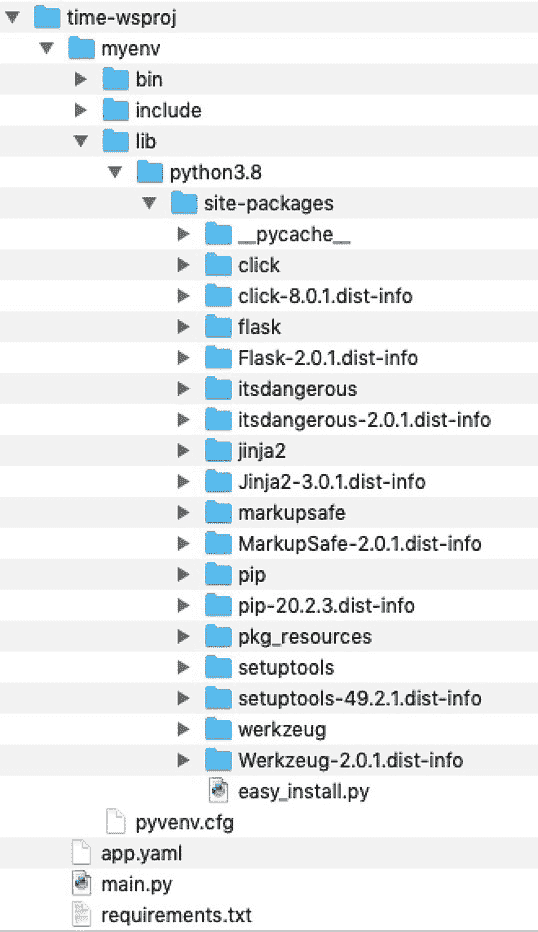
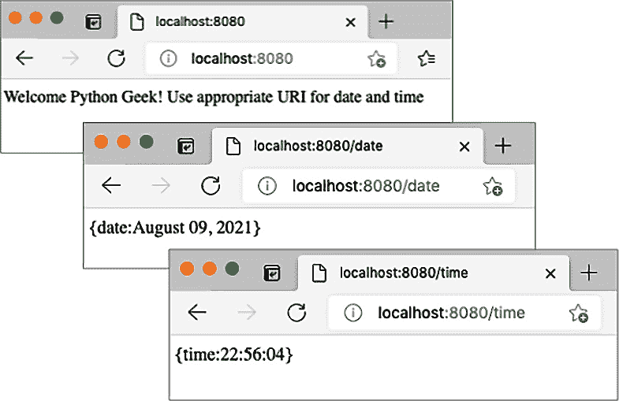
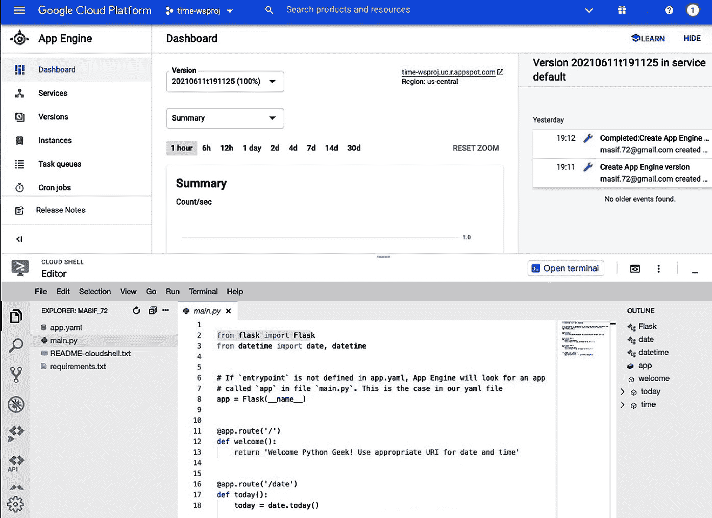
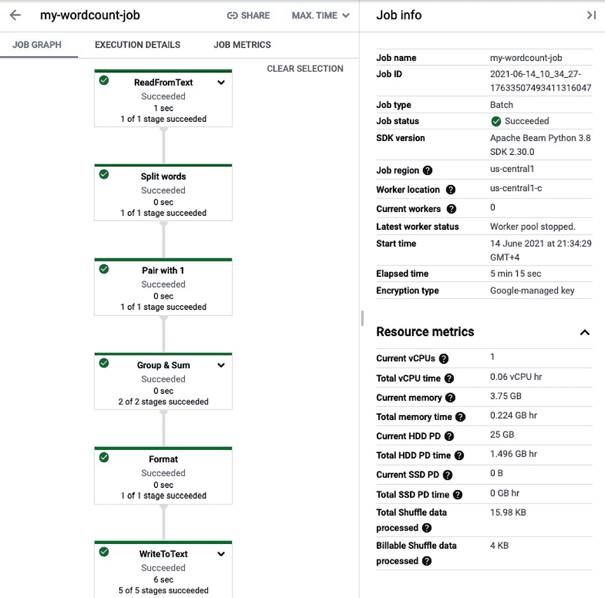

# 第九章：*第九章*：云编程的 Python

云计算是一个广泛的概念，用于各种用例。这些用例包括提供物理或虚拟计算平台、软件开发平台、大数据处理平台、存储、网络功能、软件服务等等。在本章中，我们将从两个相关方面探讨云计算中的 Python。首先，我们将研究使用 Python 为云运行时构建应用程序的选项。然后，我们将从集群扩展到云环境，继续我们关于数据密集型处理的讨论，该讨论始于*第八章*，*使用集群扩展 Python*。本章讨论的重点将主要集中在三个公共云平台；即，**Google Cloud Platform**（**GCP**）、**Amazon Web Services**（**AWS**）和**Microsoft Azure**。

在本章中，我们将涵盖以下主题：

+   了解 Python 应用程序的云选项

+   为云部署构建 Python 网络服务

+   使用 Google Cloud Platform 进行数据处理

到本章结束时，您将了解如何开发和部署应用程序到云平台，以及如何一般性地使用 Apache Beam，特别是对于 Google Cloud Platform。

# 技术要求

以下为本章的技术要求：

+   您需要在您的计算机上安装 Python 3.7 或更高版本。

+   您需要一个 Google Cloud Platform 的服务帐户。免费帐户即可。

+   您需要在您的计算机上安装 Google Cloud SDK。

+   您需要在您的计算机上安装 Apache Beam。

本章的示例代码可在[`github.com/PacktPublishing/Python-for-Geeks/tree/master/Chapter09`](https://github.com/PacktPublishing/Python-for-Geeks/tree/master/Chapter09)找到。

我们将首先探讨可用于为云部署开发应用程序的云选项。

# 了解 Python 应用程序的云选项

云计算现在是程序员的最终前沿。在本节中，我们将研究如何使用云开发环境或使用特定的**软件开发工具包**（**SDK**）进行云部署来开发 Python 应用程序，然后如何在云环境中执行 Python 代码。我们还将研究有关数据密集型处理的选择，例如云上的 Apache Spark。我们将从基于云的开发环境开始。

## 介绍云开发环境中的 Python 开发环境

当涉及到为三种主要公共云之一设置 Python 开发环境时，有两种类型的模型可供选择：

+   云原生**集成开发环境**（**IDE**）

+   带有云集成选项的本地安装 IDE

我们将在接下来讨论这两种模式。

### 云原生 IDE

通常，有几个云原生开发环境可供选择，它们并不特定于三个公共云提供商。这些包括**PythonAnyWhere**、**Repl.it**、**Trinket**和**Codeanywhere**。这些云环境大多数除了付费版本外，还提供免费许可证。这些公共云平台提供了开发环境的工具组合，如这里所述：

+   **AWS**：它提供了一种复杂的云 IDE，形式为**AWS Cloud9**，可以通过网页浏览器访问。这个云 IDE 为开发者提供了一套丰富的功能，并支持多种编程语言，包括 Python。重要的是要理解，AWS Cloud9 是以托管在 Amazon EC2 实例（虚拟机）上的应用程序的形式提供的。使用 AWS Cloud9 没有直接费用，但使用底层的 Amazon EC2 实例和存储空间将产生费用，对于有限的使用来说，这个费用非常微小。AWS 平台还提供用于构建和测试代码以实现**持续集成**（**CI**）和**持续交付**（**CD**）目标的工具。

    **AWS CodeBuild**是另一种可用的服务，它编译我们的源代码，运行测试，并为部署构建软件包。它是一个类似于 Bamboo 的构建服务器。**AWS CodeStar**通常与 AWS Cloud9 一起使用，提供了一个基于项目的平台，以帮助开发、构建和部署软件。AWS CodeStar 提供预定义的项目模板，以定义从代码发布到整个持续交付工具链的整个过程。

+   **Microsoft Azure**：这包括了**Visual Studio**集成开发环境（IDE），如果你是 Azure DevOps 平台的一部分，它可以在网上（基于云）使用。Visual Studio IDE 的在线访问基于付费订阅。Visual Studio IDE 因其丰富的功能和为团队协作提供的环境而闻名。Microsoft Azure 提供**Azure Pipelines**用于构建、测试和将代码部署到任何平台，如 Azure、AWS 和 GCP。Azure Pipelines 支持多种语言，如 Node.js、Python、Java、PHP、Ruby、C/C++和.NET，甚至移动开发工具包。

+   **Google**：Google 提供**Cloud Code**，用于编写、测试和部署代码，这些代码可以通过浏览器（如通过 ASW Cloud9）或使用你选择的本地 IDE 编写。Cloud Code 包含了对最流行的 IDE 的插件，如 IntelliJ IDE、Visual Studio Code 和 JetBrains PyCharm。Google Cloud Code 免费提供，针对容器运行时环境。像 AWS CodeBuild 和 Azure Pipelines 一样，Google 提供了一种等效服务，也称为**Cloud Build**，用于在多个环境中持续构建、测试和部署软件，如虚拟机和容器。Google 还提供 Google **Colaboratory**或**Google Colab**，它提供远程的 Jupyter Notebooks。Google Colab 选项在数据科学家中很受欢迎

    谷歌云也提供了**Tekton**和**Jenkins**服务，用于构建 CI/CD 开发和交付模型。

除了所有这些专用工具和服务之外，这些云平台还提供了在线以及本地安装的 shell 环境。这些 shell 环境也是以有限容量管理代码的快捷方式。

接下来，我们将讨论使用 Python 进行云开发的本地 IDE 选项。

### 本地 IDE 用于云开发

云原生开发环境是一个很好的工具，可以在您的云生态系统中的其他部分实现原生集成选项。这使得即时实例化资源然后部署变得方便，而且不需要任何身份验证令牌。但这也带来了一些注意事项。首先，尽管这些工具大多是免费的，但它们所使用的底层资源并不是。第二个注意事项是，这些云原生工具的离线可用性并不无缝。开发者喜欢在没有在线连接的情况下编写代码，这样他们就可以在任何地方进行，比如在火车上或在公园里。

由于这些注意事项，开发者喜欢在部署到云平台之前，使用本地编辑器或 IDE 进行软件开发和测试，然后再使用额外的工具。例如，微软 Azure 的 IDE（如 Visual Studio 和 Visual Studio Code）适用于本地机器。AWS 和谷歌平台提供自己的 SDK（类似 shell 的环境）和插件，以便与您选择的 IDE 集成。我们将在本章后面探讨这些开发模型。

接下来，我们将讨论公共云上可用的运行时环境。

## 介绍 Python 的云运行时选项

获取 Python 运行时环境的最简单方法是通过获取安装了 Python 的 Linux 虚拟机或容器。一旦我们有了虚拟机或容器，我们也可以安装我们选择的 Python 版本。对于数据密集型工作负载，可以在云的计算节点上设置 Apache Spark 集群。但这要求我们拥有所有平台相关的任务和维护，以防万一出现问题。几乎所有的公共云平台都提供了更优雅的解决方案，以简化开发人员和 IT 管理员的生活。这些云服务提供商提供基于应用程序类型的一个或多个预构建的运行时环境。我们将讨论来自三个公共云提供商（亚马逊 AWS、GCP 和微软 Azure）的一些可用的运行时环境。

什么是运行时环境？

运行时环境是一个运行 Python 代码的执行平台。

### 亚马逊 AWS 提供的运行时选项

亚马逊 AWS 提供了以下运行时选项：

+   **AWS Beanstalk**：这个**平台即服务**（**PaaS**）提供可以用于部署使用 Java、.NET、PHP、Node.js、Python 等开发的应用程序。这项服务还提供了使用 Apache、Nginx、Passenger 或 IIS 作为 Web 服务器的选项。这项服务在管理底层基础设施方面提供了灵活性，这对于部署复杂应用程序有时是必需的。

+   **AWS App Runner**：这项服务可用于运行带有 API 的容器化 Web 应用程序和微服务。这项服务是完全管理的，这意味着您没有管理责任，也没有访问底层基础设施的权限。

+   **AWS Lambda**：这是一个无服务器计算运行时，允许您运行代码而无需担心管理任何底层服务器。这个服务器支持多种语言，包括 Python。尽管 Lambda 代码可以直接从应用程序中执行，但这非常适合在触发其他 AWS 服务的事件时必须运行某些代码的情况。

+   **AWS Batch**：这个选项用于以批处理的形式运行大量计算作业。这是 Amazon 提供的一种云选项，是 Apache Spark 和 Hadoop MapReduce 集群选项的替代品。

+   **AWS Kinesis**：这项服务也是用于数据处理，但针对实时流数据。

### GCP 提供的运行时选项

以下是从 GCP 可用的运行时选项：

+   **应用引擎**：这是 GCP 提供的一种 PaaS 选项，可用于大规模开发和托管 Web 应用程序。应用程序作为容器在应用引擎上部署，但您的源代码由部署工具打包到容器中。这种复杂性对开发者来说是隐藏的。

+   **CloudRun**：这个选项用于托管已构建为容器的任何代码。容器应用程序必须具有 HTTP 端点才能在 CloudRun 上部署。与应用引擎相比，将应用程序打包到容器是开发者的责任。

+   **云函数**：这是一个事件驱动的、无服务器且单一用途的解决方案，用于托管轻量级的 Python 代码。托管代码通常通过监听其他 GCP 服务上的事件或通过直接 HTTP 请求来触发。这类似于 AWS Lambda 服务。

+   **数据流**：这是另一个无服务器选项，但主要用于数据处理，具有最小延迟。通过消除底层处理平台的复杂性，并基于 Apache Beam 提供数据管道模型，这简化了数据科学家的生活。

+   **数据科学**：这项服务提供基于 Apache Spark、Apache Flink、Presto 等众多工具的计算平台。这个平台适合那些有依赖 Spark 或 Hadoop 生态系统的数据处理作业的人。这项服务要求我们手动配置集群。

### 微软 Azure 提供的运行时选项

微软 Azure 提供以下运行环境：

+   **App Service**：这项服务用于大规模构建和部署 Web 应用程序。这个 Web 应用程序可以作为容器部署，或者在 Windows 或 Linux 上运行。

+   **Azure Functions**：这是一个无服务器事件驱动的运行时环境，用于根据特定事件或直接请求执行代码。这与 AWS Lambda 和 GCP CloudRun 相当。

+   **Batch**：正如其名所示，这项服务用于运行需要数百或数千个虚拟机的云规模作业。

+   **Azure Databricks**：微软与 Databricks 合作，提供这个基于 Apache Spark 的平台，用于大规模数据处理。

+   **Azure Data Factory**：这是 Azure 提供的一个无服务器选项，你可以用它来处理流数据并将数据转换为有意义的成果。

正如我们所见，三大云服务提供商提供了基于可用应用程序和工作负载的多种执行环境。以下用例可以在云平台上部署：

+   开发网络服务和 Web 应用程序

+   使用云运行时进行数据处理

+   使用 Python 的基于微服务的应用程序（容器）

+   云服务中的无服务器函数或应用程序

我们将在本章接下来的部分中解决前两个用例。剩余的用例将在接下来的章节中讨论，因为它们需要更广泛的讨论。在下一节中，我们将开始使用 Python 构建一个网络服务，并探讨如何在 GCP App Engine 运行时环境中部署它。

# 为云部署构建 Python 网络服务

为云部署构建应用程序与本地部署略有不同。在开发和部署应用程序到任何云平台时，我们必须考虑以下三个关键要求：

+   **Web 界面**：对于大多数云部署，具有**图形用户界面**（GUI）或**应用程序编程接口**（API）的应用程序是主要候选者。基于命令行界面的应用程序除非部署在专用的虚拟机实例中，否则在云环境中不会获得其可用性。我们可以使用 SSH 或 Telnet 在虚拟机实例上执行它们。这就是为什么我们选择了基于 Web 界面的应用程序进行讨论。

+   **环境设置**：所有公共云平台都支持多种语言，以及单一语言的多个版本。例如，截至 2021 年 6 月，GCP App Engine 支持 Python 3.7、3.8 和 3.9 版本。有时，云服务还允许你部署自己的版本。对于 Web 应用程序，设置一个访问代码和项目级设置的入口点也很重要。这些通常定义在一个单独的文件中（在 GCP App Engine 应用程序的情况下是一个 YAML 文件）。

+   可以手动或使用`PIP freeze`命令来安装`requirements.txt`。还有其他优雅的方法可以解决这个问题，例如，将所有第三方库与应用程序打包成一个文件以进行云部署，例如 Java 网络归档文件（`.war`文件）。另一种方法是捆绑包含应用程序代码和目标执行平台的所有依赖项到一个容器中，并直接在容器托管平台上部署该容器。我们将在*第十一章*中探讨基于容器的部署选项，*使用 Python 进行微服务开发*。

在 GCP App Engine 上部署 Python 网络服务应用程序至少有三种选项，如下所示：

+   通过 CLI 界面使用 Google Cloud SDK

+   使用 GCP 网络控制台（门户）以及 Cloud Shell（CLI 界面）

+   使用第三方 IDE，如 PyCharm

我们将详细讨论第一个选项，并总结我们对其他两个选项的经验。

重要提示

在 AWS 和 Azure 上部署 Python 应用程序，在原则上步骤相同，但具体细节取决于每个云提供商提供的 SDK 和 API 支持。

## 使用 Google Cloud SDK

在本节中，我们将讨论如何使用 Google Cloud SDK（主要是 CLI 界面）创建和部署一个示例应用程序。此示例应用程序将部署在**Google App Engine**（**GAE**）平台上。GAE 是一个 PaaS 平台，非常适合使用各种编程语言部署网络应用程序，包括 Python。

要使用 Google Cloud SDK 进行 Python 应用程序部署，我们必须在本地机器上满足以下先决条件：

+   安装并初始化 Cloud SDK。安装后，您可以通过 CLI 界面访问它，并使用以下命令检查其版本。请注意，几乎所有 Cloud SDK 命令都以`gcloud`开头：

    ```py
    gcloud –version
    ```

+   安装 Cloud SDK 组件以添加 Python 3 的 App Engine 扩展。这可以通过以下命令完成：

    ```py
    gcloud components install app-engine-python
    ```

+   GCP CloudBuild API 必须在 GCP 云项目中启用。

+   即使您使用的是试用账户，也必须通过将 GCP 计费账户与项目关联来启用云项目的云计费。

+   设置新的 App Engine 应用程序和启用 API 服务的 GCP 用户权限应在**所有者**级别完成。

接下来，我们将描述如何设置 GCP 云项目，创建一个示例网络服务应用程序，并将其部署到 GAE。

### 设置 GCP 云项目

GCP 云项目的概念与我们大多数开发 IDE 中看到的概念相同。一个 GCP 云项目由一组项目级设置组成，这些设置管理我们的代码如何与 GCP 服务交互以及跟踪项目使用的资源。一个 GCP 项目必须与一个计费账户关联。这是按项目跟踪消耗了多少 GCP 服务和资源的先决条件。

接下来，我们将解释如何使用 Cloud SDK 设置项目：

1.  使用以下命令登录到 Cloud SDK。这将带您进入网页浏览器，以便您可以登录，如果您尚未这样做的话：

    ```py
    gcloud init
    ```

1.  创建一个名为 `time-wsproj` 的新项目。项目的名称应简短，仅使用字母和数字。为了更好的可读性，允许使用 `-`：

    ```py
    gcloud projects create time-wsproj
    ```

1.  如果您尚未这样做，请使用以下命令将 Cloud SDK 的默认作用域切换到新创建的项目：

    ```py
    gcloud config set project time-wsproj
    ```

    这将使 Cloud SDK 能够将此项目作为任何通过 Cloud SDK CLI 推送命令的默认项目。

1.  通过使用以下命令之一并带有 `project` 属性，在默认项目或任何项目中创建 App Engine 实例：

    ```py
    gcloud app create                   #for default project
    gcloud app create --project=time-wsproj  #for specific project
    ```

    注意，此命令将预留云资源（主要是计算和存储），并将提示您选择一个区域和区域来托管资源。您可以选择离您最近且从受众的角度看更合适的区域和区域：

1.  为当前项目启用 Cloud Build API 服务。正如我们之前讨论的，Google Cloud Build 服务用于在部署到 Google 运行时（如 App Engine）之前构建应用程序。通过 GCP 网页控制台启用 Cloud Build API 服务更容易，因为它只需点击几下。要使用 Cloud SDK 启用它，首先，我们需要知道服务的确切名称。我们可以通过使用 `gcloud services list` 命令来获取可用 GCP 服务的列表。

    此命令将为您提供一系列 GCP 服务，以便您可以查找与 Cloud Build 相关的服务。您还可以使用带有任何命令的 `format` 属性来美化 Cloud SDK 的输出。为了使这更加方便，您可以使用 Linux 的 `grep` 工具（如果您使用的是 Linux 或 macOS）与该命令一起过滤结果，然后使用 `enable` 命令启用服务：

    ```py
    gcloud services list --available | grep cloudbuild
    #output will be like: NAME: cloudbuild.googleapis.com
    #Cloud SDK command to enable this service
    gcloud services enable cloudbuild.googleapis.com
    ```

1.  要为我们的项目启用 Cloud Billing API 服务，首先，我们需要将计费账户与我们的项目关联。Cloud SDK 中尚未通过此处提供的 `beta` 命令实现计费账户的支持：

    ```py
    gcloud beta commands for the first time, you will be prompted to install the beta component. You should go ahead and install it. If you are already using a Cloud SDK version with a billing component included for GA, you can skip using the beta keyword or use the appropriate commands, as per the Cloud SDK release documentation.
    ```

1.  通过遵循我们用于启用 Cloud Build API 的相同步骤，为当前项目启用 Cloud Billing API 服务。首先，我们必须找到 API 服务的名称，然后使用以下 Cloud SDK 命令集启用它：

    ```py
    gcloud services list --available | grep cloudbilling
    #output will be: NAME: cloudbilling.googleapis.com
    #command to enable this service
    gcloud services enable cloudbilling.googleapis.com
    ```

对于经验丰富的云用户来说，设置云项目的步骤非常简单，不会超过几分钟。一旦项目设置完成，我们可以通过运行以下命令来获取项目配置详细信息：

```py
gcloud projects describe time-wsproj
```

此命令的输出将提供项目生命周期的状态、项目名称、项目 ID 和项目编号。以下是一些示例输出：

```py
createTime: '2021-06-05T12:03:31.039Z'
lifecycleState: ACTIVE
name: time-wsproj
projectId: time-wsproj
projectNumber: '539807460484'
```

现在项目已经设置好了，我们可以开始开发我们的 Python Web 应用程序。我们将在下一节中这样做。

### 构建 Python 应用程序

对于云部署，我们可以使用 IDE 或系统编辑器构建一个 Python 应用程序，然后使用 Cloud SDK 和 *app-engine-python 组件* 在本地模拟 App Engine 运行时，这些组件是我们作为先决条件安装的。作为一个例子，我们将构建一个基于 Web 服务的应用程序，通过 REST API 提供日期和时间。该应用程序可以通过 API 客户端或使用网页浏览器触发。我们没有启用任何身份验证，以保持部署简单。

要构建 Python 应用程序，我们将使用 Python 的 `venv` 包设置 Python 虚拟环境。使用 `venv` 包创建的虚拟环境将用于封装 Python 解释器、核心和第三方库和脚本，以保持它们与系统 Python 环境和其他 Python 虚拟环境分离。自 Python 3.3 以来，Python 已经支持使用 `venv` 包创建和管理虚拟环境。还有其他工具可用于创建虚拟环境，例如 `virtualenv` 和 `pipenv`。PyPA 建议使用 `venv` 创建虚拟环境，因此我们选择了它来展示本书中的大多数示例。

作为第一步，我们将创建一个名为 `time-wsproj` 的 Web 应用程序项目目录，其中包含以下文件：

+   `app.yaml`

+   `main.py`

+   `requirements.txt`

我们使用了与创建云项目相同的目录名称，只是为了方便，但这不是必需的。让我们更详细地看看这些文件。

#### YAML 文件

此文件包含 App Engine 应用程序的部署和运行时设置，例如运行时版本号。对于 Python 3，`app.yaml` 文件必须至少有一个运行时参数（`runtime: python38`）。Web 应用程序中的每个服务都可以有自己的 YAML 文件。为了简化，我们将只使用一个 YAML 文件。在我们的情况下，此 YAML 文件将只包含运行时属性。为了说明目的，我们在示例 YAML 文件中添加了一些其他属性：

```py
runtime: python38
```

#### `main.py` Python 文件

我们选择了 `Flask` 库来构建我们的示例应用程序。`Flask` 是一个广为人知的 Web 开发库，主要是因为它提供的强大功能和易用性。我们将在下一章中详细介绍 Flask。

此 `main.py` Python 模块是应用程序的入口点。应用程序的完整代码在此处展示：

```py
from flask import Flask
from datetime import date, datetime
# If 'entrypoint' is not defined in app.yaml, App Engine will look #for an app variable. This is the case in our YAML file
app = Flask(__name__)
@app.route('/')
def welcome():
    return 'Welcome Python Geek! Use appropriate URI for date       and time'
@app.route('/date')
def today():
    today = date.today()
    return "{date:" + today.strftime("%B %d, %Y") + '}'
@app.route('/time')
def time():
    now = datetime.now()
    return "{time:" + now.strftime("%H:%M:%S") + '}'
if __name__ == '__main__':
    # For local testing
    app.run(host='127.0.0.1', port=8080, debug=True)
```

此模块提供了以下关键功能：

+   在此模块中定义了一个默认的入口点 `app`。`app` 变量用于重定向发送到此模块的请求。

+   使用 Flask 的注解，我们已为三个 URL 定义了处理程序：

    a) 根 `/` URL 将触发名为 `welcome` 的函数。`welcome` 函数返回一个字符串形式的问候消息。

    b) `/date` URL 将触发 `today` 函数，该函数将以 JSON 格式返回今天的日期。

    c) `/time` URL 将执行 `time` 函数，该函数将以 JSON 格式返回当前时间。

+   在模块结束时，我们添加了一个 `__main__` 函数来启动 Flask 附带的本地网络服务器，用于测试目的。

#### 需求文件

此文件包含项目依赖项列表，用于第三方库。此文件的内容将被 App Engine 用于使所需的库可供我们的应用程序使用。在我们的案例中，我们需要 Flask 库来构建我们的示例网络应用程序。我们项目的此文件内容如下：

```py
Flask==2.0.1
```

一旦我们创建了项目目录并创建了这些文件，我们必须在项目目录内或外创建一个虚拟环境，并使用 `source` 命令激活它：

```py
python -m venv myenv
source myenv/bin/activate
```

在激活虚拟环境后，我们必须根据 `requirements.txt` 文件安装必要的依赖项。我们将使用位于 `requirements.txt` 文件所在目录的 `pip` 工具：

```py
pip install -r requirements.txt
```

一旦 Flask 库及其依赖项已安装，在我们的 PyCharm IDE 中的目录结构将如下所示：



图 9.1 – 示例网络应用的目录结构

一旦设置好项目文件和依赖项，我们将使用以下命令在本地启动网络服务器：

```py
python main.py
```

服务器将以以下调试消息启动，这清楚地表明此服务器选项仅用于测试目的，而不是用于生产环境：

```py
* Serving Flask app 'main' (lazy loading)
* Environment: production
   WARNING: This is a development server. Do not use it in a      production deployment.
   Use a production WSGI server instead.
* Debug mode: on
* Running on http://127.0.0.1:8080/ (Press CTRL+C to quit)
* Restarting with stat
* Debugger is active!
* Debugger PIN: 668-656-035
```

我们可以使用以下 URI 访问我们的网络服务应用程序：

+   `http://localhost:8080/`

+   `http://localhost:8080/date`

+   `http://localhost:8080/time`

这些 URI 的网页服务器的响应如下所示：



图 9.2 – 来自我们的示例网络服务应用程序的网页浏览器中的响应

在我们进入下一阶段——即将此应用程序部署到 Google App Engine 之前，服务器将被停止。

### 部署到 Google App Engine

要将我们的网络服务应用程序部署到 GAE，我们必须从项目目录中使用以下命令：

```py
gcloud app deploy
```

Cloud SDK 将读取`app.yaml`文件，该文件为创建此应用程序的 App Engine 实例提供输入。在部署期间，使用 Cloud Build 服务创建容器镜像；然后，将此容器镜像上传到 GCP 存储以进行部署。一旦成功部署，我们可以使用以下命令访问 Web 服务：

```py
gcloud app browse
```

此命令将使用您机器上的默认浏览器打开应用程序。托管应用程序的 URL 将根据在应用程序创建期间选择的区域和区域而变化。

重要的是要理解，每次我们执行`deploy`命令时，它都会在 App Engine 中创建我们应用程序的新版本，这意味着将消耗更多资源。我们可以使用以下命令检查已安装的 Web 应用程序的版本：

```py
gcloud app versions list
```

应用程序的老版本仍然可以处于服务状态，只是分配给它们的 URL 略有不同。可以使用`gcloud app versions` Cloud SDK 命令和版本 ID 来停止、启动或删除老版本。可以使用`stop`或`start`命令停止或启动应用程序，如下所示：

```py
gcloud app versions stop <version id>
gcloud app versions start <version id>
gcloud app versions delete <version id>
```

当我们运行`gcloud app versions list`命令时，版本 ID 是可用的。这标志着我们关于构建和部署 Python Web 应用程序到 Google Cloud 的讨论结束。接下来，我们将总结如何利用 GCP 控制台部署相同的应用程序。

## 使用 GCP 网络控制台

GCP 控制台提供了一个易于使用的网络门户，用于访问和管理 GCP 项目，以及 Google **Cloud Shell**的在线版本。控制台还提供可定制的仪表板、查看项目使用的云资源、账单详情、活动日志以及许多其他功能。当涉及到使用 GCP 控制台开发和部署 Web 应用程序时，我们可以利用 Web UI 的一些功能，但大多数步骤将需要使用 Cloud Shell。这是一个通过任何浏览器在线提供的 Cloud SDK。

Cloud Shell 在几个方面都超越了 Cloud SDK：

+   它提供了对`gcloud` CLI 以及`kubectl` CLI 的访问。`kubectl`用于管理 GCP Kubernetes 引擎上的资源。

+   使用 Cloud Shell，我们可以使用**Cloud Shell 编辑器**来开发、调试、构建和部署我们的应用程序。

+   Cloud Shell 还提供了一个在线开发服务器，用于在部署到 App Engine 之前测试应用程序。

+   Cloud Shell 附带工具，可以在 Cloud Shell 平台和您的机器之间上传和下载文件。

+   Cloud Shell 具有在端口 8080 或您选择的端口上预览 Web 应用程序的能力。

设置新项目、构建应用程序和部署到 App Engine 所需的 Cloud Shell 命令与我们之前讨论的 Cloud SDK 中的命令相同。这就是为什么我们将这个步骤留给你，让你按照我们在上一节中描述的相同步骤进行探索。请注意，项目可以使用 GCP 控制台设置。可以通过在顶部菜单栏的右侧使用 Cloud Shell 图标来启用 Cloud Shell 界面。一旦 Cloud Shell 被启用，命令行界面将出现在控制台网页的底部。这在上面的屏幕截图中显示：

![Figure 9.3 – GCP console with Cloud Shell]

![img/B17189_09_03.jpg]

图 9.3 – 带有 Cloud Shell 的 GCP 控制台

如我们之前提到的，Cloud Shell 附带一个编辑器工具，可以通过使用**打开编辑器**按钮启动。以下屏幕截图显示了在**Cloud Shell 编辑器**中打开的 Python 文件：



图 9.4 – 带有 Cloud Shell 编辑器的 GCP 控制台

在构建和部署 Web 应用程序时，另一个选择是使用带有 Google App Engine 插件的第三方 IDE。根据我们的经验，适用于常用 IDE（如 PyCharm 和 Eclipse）的插件大多是为 Python 2 和旧版 Web 应用程序库构建的。直接将 IDE 与 GCP 集成需要更多的工作和演变。在撰写本文时，最佳选择是直接使用您选择的编辑器或 IDE 配合 Cloud SDK 或 Cloud Shell 进行应用程序开发。

在本节中，我们介绍了使用 Python 开发 Web 应用程序并将其部署到 GCP App Engine 平台。Amazon 提供了 AWS Beanstalk 服务用于 Web 应用程序部署。在 AWS Beanstalk 中部署 Web 应用程序的步骤几乎与 GCP App Engine 相同，只是 AWS Beanstalk 不需要设置项目作为先决条件。因此，我们可以在 AWS Beanstalk 中更快地部署应用程序。

要在 AWS Beanstalk 中部署我们的 Web 服务应用程序，我们必须提供以下信息，无论是使用 AWS 控制台还是使用 AWS CLI：

+   应用程序名称

+   平台（Python 版本 3.7 或 3.8，在我们的例子中）

+   源代码版本

+   源代码，以及一个`requirements.txt`文件

我们建议对于依赖于第三方库的 Web 应用程序使用 AWS CLI。我们可以将我们的源代码作为 ZIP 文件或 Web 存档（`WAR`文件）从本地机器上传，或者从**Amazon S3**位置复制。

在 AWS Beanstalk 上部署 Web 应用程序的详细步骤可在 [`docs.aws.amazon.com/elasticbeanstalk/latest/dg/create-deploy-python-flask.html`](https://docs.aws.amazon.com/elasticbeanstalk/latest/dg/create-deploy-python-flask.html) 获取。Azure 提供了 App Service 用于构建和部署 Web 应用程序。您可以在 [`docs.microsoft.com/en-us/azure/app-service/quickstart-python`](https://docs.microsoft.com/en-us/azure/app-service/quickstart-python) 找到在 Azure 上创建和部署 Web 应用程序的步骤。

接下来，我们将探讨使用云平台构建数据处理的驱动程序程序。

# 使用 Google Cloud Platform 进行数据处理

Google Cloud Platform 提供了 Cloud Dataflow 作为数据处理服务，旨在服务于批处理和实时数据流应用程序。此服务旨在为数据科学家和数据分析应用程序开发者提供设置数据处理 **管道** 的能力，以便他们可以进行数据分析。Cloud Dataflow 在底层使用 Apache Beam。**Apache Beam** 起源于 Google，但现在是一个 Apache 下的开源项目。该项目为使用管道构建数据处理提供了一个编程模型。这些管道可以使用 Apache Beam 创建，然后使用 Cloud Dataflow 服务执行。

Google Cloud Dataflow 服务类似于 `Amazon Kinesis`、Apache Storm、`Apache Spark` 和 Facebook Flux。在我们讨论如何使用 Python 进行 Google Dataflow 之前，我们将介绍 Apache Beam 及其管道概念。

## 学习 Apache Beam 的基础知识

在当前时代，数据对于许多组织来说就像一头现金牛。应用程序、设备和人类与系统交互都会产生大量数据。在消费数据之前，处理数据非常重要。在 Apache Beam 的术语中，为数据处理定义的步骤通常被称为管道。换句话说，数据管道是一系列对来自不同来源的原始数据进行操作的动作，然后将这些数据移动到目的地，以便由分析或商业应用程序消费。

Apache Beam 用于将问题分解成可以并行处理的小数据包。Apache Beam 的主要用例之一是 **提取、转换和加载**（**ETL**）应用程序。这三个 ETL 步骤在将数据从原始形式转换为用于消费的精炼形式时是管道的核心。

Apache Beam 的核心概念和组件如下：

+   **管道**：管道是将数据从一种形式转换为另一种形式的方案，作为数据处理的一部分。

+   **PCollection**：PCollection，或并行集合，类似于 Apache Spark 中的 RDD。它是一个包含不可变和无序元素集合的分布式数据集。数据集的大小可以是固定的或有限的，类似于批量处理，我们知道在一个批次中要处理多少个作业。大小也可以根据持续更新和流数据源而灵活或无界。

+   **PTransforms**：这些是在管道中定义以转换数据的操作。这些操作在 PCollection 对象上执行。

+   **SDK**：一种特定于语言的软件开发工具包，可用于 Java、Python 和 Go 来构建管道并将它们提交给运行器执行。

+   默认情况下是异步的 `run (Pipeline)`。一些可用的运行器包括 Apache Flink、Apache Spark 和 Google Cloud Dataflow。

+   `DoFn`，它基于每个元素进行操作。提供的 `DoFn` 实现被封装在一个为并行执行设计的 `ParDo` 对象中。

一个简单的管道看起来如下：


图 9.5 – 具有三个 PTransform 操作的管道流程

设计管道时，我们通常必须考虑三个要素：

1.  首先，我们需要了解数据源。它是存储在文件中、数据库中，还是作为流来？基于此，我们将确定需要实现哪种类型的读取转换操作。作为读取操作的一部分或作为单独的操作，我们还需要了解数据格式或结构。

1.  下一步是定义和设计如何处理这些数据。这是我们主要的转换操作。我们可以以串行方式或并行方式在相同的数据上执行多个转换操作。Apache Beam SDK 提供了几个预构建的转换，可以用于此。它还允许我们使用 ParDo/DoFn 函数编写自己的转换。

1.  最后，我们需要知道我们的管道输出将是什么以及在哪里存储输出结果。这在前面的图中显示为写入转换。

在本节中，我们讨论了一个简单的管道结构来解释与 Apache Beam 和管道相关的不同概念。在实践中，管道可能相对复杂。管道可以有多个输入数据源和多个输出接收器。PTransforms 操作可能导致多个 PCollection 对象，这需要并行执行 PTransform 操作。

在接下来的几节中，我们将学习如何创建一个新的管道以及使用 Apache Beam 运行器或 Cloud Dataflow 运行器执行管道。

## 介绍 Apache Beam 管道

在本节中，我们将讨论如何创建 Apache Beam 管道。正如我们之前所讨论的，管道是一系列旨在实现特定数据处理目标的动作或操作。管道需要一个可以包含内存数据、本地或远程文件或流数据的输入数据源。典型管道的伪代码将如下所示：

```py
[Final PColletcion] = ([Initial Input PCollection] |     [First PTransform] | [Second PTransform] | [Third PTransform])
```

初始 PCollection 被用作第一个 PTransform 操作的输入。第一个 PTransform 的输出 PCollection 将用作第二个 PTransform 的输入，依此类推。最后一个 PTransform 的 PCollection 的最终输出将被捕获为最终 PCollection 对象，并用于将结果导出到目标位置。

为了说明这个概念，我们将构建几个不同复杂程度的示例管道。这些示例旨在展示在构建和执行管道时使用的不同 Apache 组件和库的作用。最后，我们将构建一个用于著名 *词频统计* 应用程序的管道，该应用程序也参考了 Apache Beam 和 GCP Dataflow 文档。重要的是要强调，我们必须使用 `pip` 工具安装 `apache-beam` Python 库，以便在本节的所有代码示例中使用。

### 示例 1 – 使用内存中的字符串数据创建管道

在这个例子中，我们将从一个内存中的字符串集合创建一个输入 PCollection，应用几个转换操作，然后将结果打印到输出控制台。以下是完全的示例代码：

```py
#pipeline1.py: Separate strings from a PCollection
import apache_beam as beam
with beam.Pipeline() as pipeline:
  subjects = (
      pipeline
      | 'Subjects' >> beam.Create([
          'English Maths Science French Arts', ])
      | 'Split subjects' >> beam.FlatMap(str.split)
      | beam.Map(print))
```

对于这个例子，重要的是要强调以下几点：

+   我们使用了 `|` 来在管道中写入不同的 PTransform 操作。这是一个重载的操作符，更像是将 PTransform 应用到 PCollection 上以产生另一个 PCollection。

+   我们使用了 `>>` 操作符为每个 PTransform 操作命名，用于日志记录和跟踪目的。`|` 和 `>>` 之间的字符串用于显示和日志记录目的。

+   我们使用了三个转换操作；它们都是 Apache Beam 库的一部分：

    a) 第一个转换操作用于创建一个 PCollection 对象，它是一个包含五个主题名称的字符串。

    b) 第二个转换操作用于使用内置的 `String` 对象方法（`split`）将字符串数据拆分到一个新的 PCollection 中。

    c) 第三个转换操作用于将 PCollection 中的每个条目打印到控制台输出。

控制台的输出将显示一个主题名称列表，每个名称占一行。

### 示例 2 – 使用内存中的元组数据创建和处理管道

在这个代码示例中，我们将创建一个元组 PCollection。每个元组将有一个与之关联的主题名称和成绩。该管道的核心 PTransform 操作是从数据中分离主题及其成绩。示例代码如下：

```py
#pipeline2.py: Separate subjects with grade from a PCollection
import apache_beam as beam
def my_format(sub, marks):
    yield '{}\t{}'.format(sub,marks)
with beam.Pipeline() as pipeline:
  plants = (
      pipeline
      | 'Subjects' >> beam.Create([
      ('English','A'),
      ('Maths', 'B+'),
      ('Science', 'A-'),
      ('French', 'A'),
      ('Arts', 'A+'),
      ])
      | 'Format subjects with marks' >> beam.FlatMapTuple(my_        format)
      | beam.Map(print))
```

与第一个示例相比，我们使用了`FlatMapTuple`转换操作和自定义函数来格式化元组数据。控制台输出将显示每个主题的名称及其成绩，每行一个。

### 示例 3 – 使用文本文件数据创建管道

在前两个示例中，我们专注于构建一个简单的管道来解析来自大字符串的字符串数据，以及从元组的 PCollection 中拆分元组。在实践中，我们正在处理大量数据，这些数据可能来自文件或存储系统，或者来自流式源。在此示例中，我们将从本地文本文件中读取数据以构建我们的初始 PCollection 对象，并将最终结果输出到输出文件。完整的代码示例如下：

```py
#pipeline3.py: Read data from a file and give results back to another file
import apache_beam as beam
from apache_beam.io import WriteToText, ReadFromText
with beam.Pipeline() as pipeline:
    lines = pipeline | ReadFromText('sample1.txt')
    subjects = (
      lines
      | 'Subjects' >> beam.FlatMap(str.split))
    subjects | WriteToText(file_path_prefix='subjects', 
                           file_name_suffix='.txt',
                           shard_name_template='')
```

在此代码示例中，我们在应用任何数据处理相关的 PTransform 操作之前，先对一个 PTransform 操作进行了应用，以从文件中读取文本数据。最后，我们应用了一个 PTransform 操作将数据写入输出文件。在此代码示例中，我们使用了两个新函数`ReadFromText`和`WriteToText`，如上所述：

+   `ReadFromText`：此函数是 Apache Beam I/O 模块的一部分，用于将数据从文本文件读取到字符串的 PCollection 中。文件路径或文件模式可以作为输入参数提供，以从本地路径读取。我们也可以使用`gs://`来访问 GCS 存储位置中的任何文件。

+   `WriteToText`：此函数用于将 PCollection 数据写入文本文件。至少需要提供`file_path_prefix`参数。我们还可以提供`file_path_suffix`参数来设置文件扩展名。`shard_name_template`设置为空，以使用前缀和后缀参数创建文件名。Apache Beam 支持基于模板定义文件名的分片名称模板。

当此管道在本地执行时，它将创建一个名为`subjects.txt`的文件，其中包含 PTransform 操作捕获的主题名称。

### 示例 4 – 使用参数创建 Apache Beam 运行器的管道

到目前为止，我们已经学习了如何创建一个简单的管道，如何从文本文件构建 PCollection 对象，以及如何将结果写回文件。除了这些核心步骤之外，我们还需要执行一些额外的步骤，以确保我们的驱动程序已准备好将作业提交给 GCP Dataflow 运行器或任何其他云运行器。这些附加步骤如下：

+   在上一个示例中，我们在驱动程序中提供了输入文件和输出文件模式的名称。在实际应用中，我们应该期望这些参数通过命令行参数提供。我们将使用`argparse`库来解析和管理命令行参数。

+   我们将添加扩展参数，例如设置运行器。此参数将用于使用 DirectRunner 或 GCP Dataflow 运行器设置管道的目标运行器。请注意，DirectRunner 是用于您本地机器的管道运行时。它确保这些管道尽可能紧密地遵循 Apache Beam 模型。

+   我们还将实现并使用`ParDo`函数，该函数将利用我们自定义构建的从文本数据中解析字符串的功能。我们可以使用`String`函数来实现这一点，但在此处添加是为了说明如何使用`ParDo`和`DoFn`与 PTransform 一起使用。

这里是步骤：

1.  首先，我们将构建参数解析器并定义我们期望从命令行接收的参数。我们将设置这些参数的默认值，并设置附加的帮助文本，以便在命令行的`help`开关中显示。`dest`属性很重要，因为它用于识别任何在编程语句中使用的参数。我们还将定义`ParDo`函数，该函数将用于执行管道。以下是一些示例代码：

    ```py
    #pipeline4.py(part 1): Using argument for a pipeline
    import re, argparse, apache_beam as beam
    from apache_beam.io import WriteToText, ReadFromText
    from apache_beam.options.pipeline_options import   PipelineOptions
    class WordParsingDoFn(beam.DoFn):
      def process(self, element):
        return re.findall(r'[\w\']+', element, re.UNICODE)
    def run(argv=None):
        parser = argparse.ArgumentParser()
        parser.add_argument(
            '--input',
            dest='input',
            default='sample1.txt',
            help='Input file to process.')
        parser.add_argument(
            '--output',
            dest='output',
            default='subjects',
            help='Output file to write results to.')
        parser.add_argument(
            '--extension',
            dest='ext',
            default='.txt',
            help='Output file extension to use.')
        known_args, pipeline_args = parser.parse_known_      args(argv)
    ```

1.  现在，我们将设置`DirectRunner`作为我们的管道运行时，并命名要执行的任务。此步骤的示例代码如下：

    ```py
    #pipeline4.py(part 2): under the run method
        pipeline_args.extend([
            '--runner=DirectRunner',
            '--job_name=demo-local-job',
        ])
        pipeline_options = PipelineOptions(pipeline_args)
    ```

1.  最后，我们将使用之前步骤中创建的`pipeline_options`对象创建一个管道。该管道将从输入文本文件中读取数据，根据我们的`ParDo`函数转换数据，然后将结果保存为输出：

    ```py
    #sample1.txt) are parsed and are put as one word in one line in the output file. 
    ```

Apache Beam 是一个庞大的主题，如果不写几章关于它的内容，就不可能涵盖其所有功能。然而，我们已经通过提供代码示例来涵盖基础知识，这些示例将使我们能够开始编写简单的管道，我们可以在 GCP Cloud Dataflow 上部署这些管道。我们将在下一节中介绍这一点。

## 构建 Cloud Dataflow 的管道

我们之前讨论的代码示例主要集中在构建简单的管道并使用 DirectRunner 执行它们。在本节中，我们将构建一个驱动程序来在 Google Cloud Dataflow 上部署单词计数数据处理管道。此驱动程序对于 Cloud Dataflow 部署非常重要，因为我们将在此程序内设置所有云相关参数。因此，将无需使用 Cloud SDK 或 Cloud Shell 来执行额外的命令。

单词计数管道将是我们`pipeline4.py`示例的扩展版本。部署单词计数管道所需的附加组件和步骤在此总结：

1.  首先，我们将使用与我们在为 App Engine 部署我们的网络服务应用程序时遵循的步骤类似的步骤创建一个新的 GCP 云项目。我们可以使用 Cloud SDK、Cloud Shell 或 GCP 控制台来完成此任务。

1.  我们将为新项目启用 Dataflow Engine API。

1.  接下来，我们将创建一个存储桶来存储输入和输出文件，并为 Cloud Dataflow 提供临时和存档目录。我们可以通过使用 GCP 控制台、Cloud Shell 或 Cloud SDK 来实现这一点。如果我们使用 Cloud Shell 或 Cloud SDK 创建新存储桶，可以使用以下命令：

    ```py
    gsutil mb gs://<bucket name>
    ```

1.  如果新创建的存储桶不在与数据流管道作业相同的项目下，您可能需要将服务帐户与存储桶关联，并选择 *存储对象管理员* 角色以进行访问控制。

1.  我们必须使用必要的 `gcp` 库安装 Apache Beam。这可以通过使用 `pip` 工具实现，如下所示：

    ```py
    pip install apache-beam[gcp]
    ```

1.  我们必须为用于 GCP 云项目的 GCP 服务帐户创建一个用于身份验证的密钥。如果我们将在 GCP 平台（如 Cloud Shell）上运行驱动程序程序，则不需要这样做。服务帐户密钥必须下载到您的本地机器上。为了使密钥对 Apache Beam SDK 可用，我们需要将密钥文件（一个 JSON 文件）的路径设置为名为 `GOOGLE_APPLICATION_CREDENTIALS` 的环境变量。

在讨论如何在 Cloud Dataflow 上执行管道之前，我们将快速查看此练习的样本词频驱动程序程序。在这个驱动程序程序中，我们将定义与之前代码示例（`pipeline4.py`）中非常相似的命令行参数，除了我们将执行以下操作：

+   为了便于执行和测试，我们不会通过操作系统设置 `GOOGLE_APPLICATION_CREDENTIALS` 环境变量，而是使用我们的驱动程序程序来设置它。

+   我们将上传 `sample.txt` 文件到 Google 存储，在我们的例子中是 `gs//muasif/input` 目录。我们将使用此 Google 存储的路径作为 `input` 参数的默认值。

完整的示例代码如下：

```py
# wordcount.py(part 1): count words in a text file
import argparse, os, re, apache_beam as beam
from apache_beam.io import ReadFromText, WriteToText
from apache_beam.options.pipeline_options import PipelineOptions
from apache_beam.options.pipeline_options import SetupOptions
def run(argv=None, save_main_session=True):
  os.environ["GOOGLE_APPLICATION_CREDENTIALS"] = "some folder/    key.json"
  parser = argparse.ArgumentParser()
  parser.add_argument(
      '--input',
      dest='input',
      default='gs://muasif/input/sample.txt',
      help='Input file to process.')
  parser.add_argument(
      '--output',
      dest='output',
      default='gs://muasif/input/result',
      help='Output file to write results to.')
  known_args, pipeline_args = parser.parse_known_args(argv)
```

在下一步中，我们将设置管道选项的扩展参数，以便在 Cloud Dataflow 运行时上执行我们的管道。这些参数如下：

+   管道执行的运行平台（运行器）（在这种情况下为 DataflowRunner）

+   GCP 云项目 ID

+   GCP 区域

+   存储输入、输出和临时文件的 Google 存储桶路径

+   用于跟踪的作业名称

根据这些参数，我们将创建一个用于管道执行的管道选项对象。这些任务的示例代码如下：

```py
# wordcount.py (part 2): under the run method
  pipeline_args.extend([
      '--runner=DataflowRunner',
      '--project=word-count-316612',
      '--region=us-central1',
      '--staging_location=gs://muasif/staging',
      '--temp_location=gs://muasif/temp',
      '--job_name=my-wordcount-job',
  ])
  pipeline_options = PipelineOptions(pipeline_args)
  pipeline_options.view_as(SetupOptions).\
      save_main_session = save_main_session
```

最后，我们将实现一个管道，其中包含已定义的管道选项，并添加我们的 PTransform 操作。对于此代码示例，我们添加了一个额外的 PTransform 操作来构建每个单词与 `1` 的配对。在后续的 PTransform 操作中，我们将配对分组并应用 `sum` 操作来计算它们的频率。这给出了输入文本文件中每个单词的计数：

```py
# wordcount.py (part 3): under the run method
  with beam.Pipeline(options=pipeline_options) as p:
    lines = p | ReadFromText(known_args.input)
    # Count the occurrences of each word.
    counts = (
        lines
        | 'Split words' >> (
            beam.FlatMap(
                lambda x: re.findall(r'[A-Za-z\']+', x)).
                with_output_types(str))
        | 'Pair with 1' >> beam.Map(lambda x: (x, 1))
        | 'Group & Sum' >> beam.CombinePerKey(sum))
    def format_result(word_count):
      (word, count) = word_count
      return '%s: %s' % (word, count)
    output = counts | 'Format' >> beam.Map(format_result)
    output | WriteToText(known_args.output)
```

我们在驱动程序程序中为每个参数设置了默认值。这意味着我们可以直接使用`python wordcount.py`命令执行程序，或者我们可以使用以下命令通过 CLI 传递参数：

```py
python wordcount.py \
    --project word-count-316612 \
    --region us-central1 \
    --input gs://muasif/input/sample.txt \
    --output gs://muasif/output/results \
    --runner DataflowRunner \
    --temp_location gs://muasif/temp \
    --staging_location gs://muasif/staging
```

输出文件将包含结果，以及文件中每个单词的计数。GCP Cloud Dataflow 为监控提交作业的进度和理解执行作业的资源利用率提供了额外的工具。以下 GCP 控制台的屏幕截图显示了已提交给 Cloud Dataflow 的作业列表。摘要视图显示了它们的状态和一些关键指标：


图 9.6 – 云数据流作业摘要

我们可以导航到详细作业视图（通过点击任何作业名称），如下面的屏幕截图所示。此视图显示右侧的作业和环境详情以及我们为管道定义的不同 PTransforms 的进度摘要。当作业运行时，每个 PTransform 操作的状态会实时更新，如下所示：



图 9.7 – 带流程图和指标的云数据流作业详细视图

一个非常重要的要点是，不同的 PTransform 操作是根据我们使用`>>`操作符时使用的字符串命名的。这有助于方便地可视化操作。这标志着我们对构建和部署 Google Dataflow 管道的讨论结束。与 Apache Spark 相比，Apache Beam 为并行和分布式数据处理提供了更多的灵活性。随着云数据处理选项的可用性，我们可以完全专注于建模管道，并将执行管道的工作留给云服务提供商。

如我们之前提到的，亚马逊提供类似的服务（AWS Kinesis）用于部署和执行管道。AWS Kinesis 更专注于实时数据的数据流。与 AWS Beanstalk 类似，AWS Kinesis 不需要我们作为先决条件设置一个项目。使用 AWS Kinesis 进行数据处理的用户指南可在[`docs.aws.amazon.com/kinesis/`](https://docs.aws.amazon.com/kinesis/)找到。

# 摘要

在本章中，我们讨论了 Python 在开发云部署应用程序中的作用，以及使用 Python 和 Apache Beam 在 Google Cloud Dataflow 上部署数据处理管道的使用。我们通过比较三个主要的公共云提供商在开发、构建和部署不同类型应用程序方面所提供的内容开始本章。我们还比较了每个云提供商提供的运行环境选项。我们了解到，每个云提供商都提供基于应用程序或程序的多种运行引擎。例如，我们有针对经典 Web 应用程序、基于容器的应用程序和无服务器函数的独立运行引擎。为了探索 Python 在云原生 Web 应用程序中的有效性，我们构建了一个示例应用程序，并学习了如何使用 Cloud SDK 在 Google App Engine 上部署此类应用程序。在最后一节中，我们扩展了关于数据处理（管道）的讨论，这是我们在上一章开始的。我们介绍了使用 Apache Beam 的数据处理（管道）的新建模方法。一旦我们通过几个代码示例学习了如何构建管道，我们就将讨论扩展到如何构建用于 Cloud Dataflow 部署的管道。

本章提供了对公共云服务提供的比较分析。随后，我们介绍了构建云应用程序和数据处理应用程序的实战知识。本章包含的代码示例将使您能够开始创建云项目并为 Apache Beam 编写代码。对于任何希望使用基于云的数据处理服务来解决大数据问题的人来说，这种知识非常重要。

在下一章中，我们将探讨使用 Flask 和 Django 框架开发 Web 应用程序的 Python 的强大功能。

# 问题

1.  AWS Beanstalk 与 AWS App Runner 有何不同？

1.  GCP 云函数服务是什么？

1.  GCP 提供哪些数据处理服务？

1.  Apache Beam 管道是什么？

1.  PCollection 在数据处理管道中扮演什么角色？

# 进一步阅读

+   《*Flask Web 开发*》，作者：Miguel Grinberg。

+   《*Python 3 编程高级指南*》，作者：John Hunt。

+   《*Apache Beam: A Complete Guide*》，作者：Gerardus Blokdyk。

+   《*Google Cloud Platform for Developers*》，作者：Ted Hunter, Steven Porter。

+   《*Google Cloud Dataflow 文档*》可在[`cloud.google.com/dataflow/docs`](https://cloud.google.com/dataflow/docs)找到。

+   《*AWS Elastic Beanstalk 文档*》可在[`docs.aws.amazon.com/elastic-beanstalk`](https://docs.aws.amazon.com/elastic-beanstalk)找到。

+   《*Azure App Service 文档*》可在[`docs.microsoft.com/en-us/azure/app-service/`](https://docs.microsoft.com/en-us/azure/app-service/)找到。

+   《*AWS Kinesis 文档*》可在[`docs.aws.amazon.com/kinesis/`](https://docs.aws.amazon.com/kinesis/)找到。

# 答案

1.  AWS Beanstalk 是一种通用的 PaaS 服务，用于部署 Web 应用程序，而 AWS App Runner 是一种完全托管的服务，用于部署基于容器的 Web 应用程序。

1.  GCP Cloud Function 是一种无服务器、事件驱动的服务，用于执行程序。指定的事件可以由另一个 GCP 服务触发，或者通过 HTTP 请求触发。

1.  Cloud Dataflow 和 Cloud Dataproc 是 GCP 提供的两种流行的数据处理服务。

1.  Apache Beam 管道是一组定义好的操作，用于加载数据、将数据从一种形式转换成另一种形式，并将数据写入目的地。

1.  PCollection 类似于 Apache Spark 中的 RDD，用于存储数据元素。在管道数据处理中，典型的 PTransform 操作以一个或多个 PCollection 对象作为输入，并以一个或多个 PCollection 对象的形式产生结果。
