# 第二章：布局管理

在本章中，我们将探讨如何在控件内排列控件以创建 Python GUI。了解 GUI 布局设计的基本原理将使我们能够创建外观出色的 GUI。有一些技术将帮助我们实现这种布局设计。

网格布局管理器是我们将要使用的重要布局工具之一，它内置在`tkinter`中。我们可以非常容易地创建菜单栏、标签控件（即 Notebooks）以及许多其他控件。

通过完成本章，你将学习如何排列你的控件，使你的 GUI 看起来真正出色！了解布局管理对于 GUI 设计至关重要，即使你使用其他编程语言——但 Python 确实很棒！

以下截图提供了本章将使用的 Python 模块的概述：

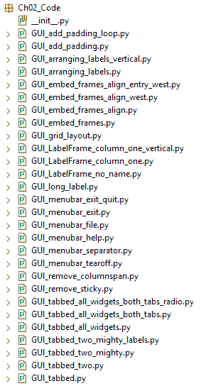

在本章中，我们将使用 Python 3.7 及以上版本来布局我们的 GUI。我们将提供以下菜谱：

+   在标签框架控件内排列多个标签

+   使用填充在控件周围添加空间

+   控件如何动态扩展 GUI

+   通过在框架内嵌入框架来对齐 GUI 控件

+   创建菜单栏

+   创建标签控件

+   使用网格布局管理

# 在标签框架控件内排列多个标签

`LabelFrame`控件允许我们以有组织的方式设计我们的 GUI。我们仍然使用网格布局管理器作为我们的主要布局设计工具，但通过使用`LabelFrame`控件，我们可以对我们的 GUI 设计有更多的控制。

# 准备工作

我们将首先向我们的 GUI 添加更多控件。我们将在后续的菜谱中使 GUI 完全功能化。在这里，我们将开始使用`LabelFrame`控件。我们将重用第一章中“向循环添加多个控件”菜谱的 GUI。

# 如何做到这一点...

1.  从第一章的“创建 GUI 表单和添加控件”部分打开`GUI_adding_widgets_in_loop.py`，并将其模块保存为`GUI_LabelFrame_column_one.py`。

1.  创建一个`ttk.LabelFrame`并将其放置在网格中：

```py
buttons_frame = ttk.LabelFrame(win, text=' Labels in a Frame ')
buttons_frame.grid(column=0, row=7)
# button_frame.grid(column=1, row=7) 
```

1.  创建三个`ttk`标签，设置它们的文本属性，并将它们放置在网格中：

```py
ttk.Label(buttons_frame, text="Label1").grid(column=0, row=0, sticky=tk.W)
ttk.Label(buttons_frame, text="Label2").grid(column=1, row=0, sticky=tk.W)
ttk.Label(buttons_frame, text="Label3").grid(column=2, row=0, sticky=tk.W)
```

上述指令将生成`GUI_LabelFrame_column_one.py`文件中的以下代码：


1.  运行代码。它将产生以下 GUI：

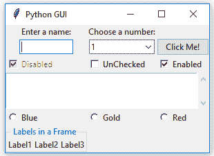

取消注释第 111 行并注意`LabelFrame`的不同对齐方式。

此外，我们可以通过更改代码轻松地垂直对齐标签。为此，请执行以下步骤：

1.  打开`GUI_LabelFrame_column_one.py`并将其模块保存为`GUI_LabelFrame_column_one_vertical.py`。

1.  按照以下方式更改列和行值：

```py
ttk.Label(button_frame, text="Label1").grid(column=0, row=0)
ttk.Label(button_frame, text="Label2").grid(column=0, row=1)
ttk.Label(button_frame, text="Label3").grid(column=0, row=2)
```

我们唯一需要更改的是列和行编号。

1.  运行 `GUI_LabelFrame_column_one_vertical.py` 文件。现在 GUI 标签框架将如下所示：

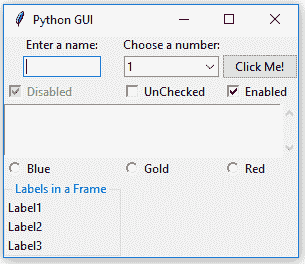

现在，让我们幕后了解代码，以便更好地理解。

# 它是如何工作的...

在第 109 行，我们创建了第一个 `ttk LabelFrame` 小部件，并将结果实例分配给 `buttons_frame` 变量。父容器是 `win`，即我们的主窗口。

在第 114 到 116 行，我们创建了标签并将它们放置到 `LabelFrame` 中。`buttons_frame` 是标签的父容器。我们使用重要的网格布局工具在 `LabelFrame` 内排列标签。这个布局管理器的列和行属性赋予我们控制 GUI 布局的能力。

我们标签的父容器是 `LabelFrame` 的 `buttons_frame` 实例变量，而不是主窗口的 `win` 实例变量。我们可以看到布局层次结构的开始。

我们可以看到，通过列和行属性，改变我们的布局是多么容易。注意我们如何将列设置为 0，以及我们如何通过按顺序编号行值来垂直堆叠我们的标签。

**ttk** 的名字代表 **主题化的 tk**。Tk 主题小部件集是在 Tk 8.5 中引入的。

我们已经成功地学习了如何在 `LableFrame` 小部件内排列几个标签。

# 参见...

在 *通过在框架内嵌入框架对齐 GUI 小部件* 菜谱中，我们将 `LabelFrame` 小部件嵌入到 `LabelFrame` 小部件中，嵌套它们以控制我们的 GUI 布局。

现在，让我们继续下一个菜谱。

# 使用填充在小部件周围添加空间

我们的 GUI 进行得很顺利。接下来，我们将通过在小部件周围添加一些空间来改善小部件的视觉外观，以便它们可以呼吸。

# 准备工作

虽然 `tkinter` 可能一直以创建不太美观的 GUI 而闻名，但自 8.5 版本以来，这一情况发生了戏剧性的变化。

为了更好地理解 Tk 的主要改进，以下是从官方网站摘录的一段话；您可以在以下链接中找到它：[`tkdocs.com/tutorial/onepage.html`](https://tkdocs.com/tutorial/onepage.html)：

"*本教程旨在帮助人们快速掌握使用 Tk 构建主流桌面图形用户界面，特别是 Tk 8.5 和 8.6。Tk 8.5 是一个具有里程碑意义的重大版本发布，与大多数人所知和认可的 Tk 旧版本有显著的不同。*"

您只需知道如何使用可用的工具和技术。这就是我们接下来要做的。

`tkinter` 版本 8.6 与 Python 3.7 一起发布。为了使用它，除了 Python 之外，无需安装任何其他东西。

首先展示一种在小部件周围添加间距的简单方法，然后我们将使用循环以更好的方式实现相同的效果。

我们的 `LabelFrame` 在向底部融入主窗口时看起来有点紧凑。现在让我们修复这个问题。

# 如何做到这一点...

按照以下步骤在小部件周围添加填充：

1.  打开 `GUI_LabelFrame_column_one.py` 并将其保存为 `GUI_add_padding.py`。

1.  将`padx`和`pady`添加到网格方法中：

```py
buttons_frame.grid(column=0, row=7, padx=20, pady=40)               # padx, pady
```

1.  运行代码。现在我们的`LabelFrame`周围有一些空间。这可以在下面的屏幕截图中看到：

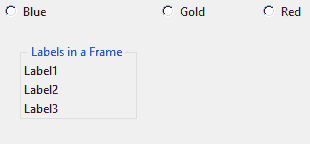

我们可以使用循环来添加`LabelFrame`内包含的标签周围的空间。按照以下步骤操作：

1.  打开`GUI_add_padding.py`并将其保存为`GUI_add_padding_loop.py`。

1.  在创建三个标签之后添加以下循环：

```py
for child in buttons_frame.winfo_children(): 
    child.grid_configure(padx=8, pady=4) 
```

上述指令生成以下代码：

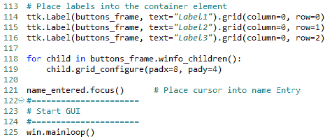

1.  运行`GUI_add_padding_loop.py`文件代码。现在`LabelFrame`小部件周围的标签也有了一些空间：


为了更好地看到这个效果，让我们做以下操作：

1.  打开`GUI_add_padding_loop.py`并将其保存为`GUI_long_label.py`。

1.  改变`Label1`的文本，如下所示：

```py
ttk.Label(buttons_frame, text="Label1 -- sooooo much 
 loooonger...").grid(column=0, row=0)
```

1.  运行代码。这将生成以下屏幕截图所示的内容，显示了我们的 GUI。注意现在在长标签旁边有空间，紧挨着点。最后一个点没有接触到`LabelFrame`，如果没有添加空间，它本会这样接触：


我们还可以移除`LabelFrame`的名称来查看`padx`对我们标签位置的影响。让我们开始吧：

1.  打开`GUI_add_padding_loop.py`并将其保存为`GUI_LabelFrame_no_name.py`。

1.  在创建按钮时，将文本属性设置为空字符串：

```py
buttons_frame = ttk.LabelFrame(win, text='')         # no LabelFrame name
```

1.  运行代码。通过将`text`属性设置为空字符串，我们移除了之前显示在`LabelFrame`上的名称。这可以在下面的屏幕截图中看到：

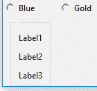

现在，让我们幕后了解代码。

# 它是如何工作的...

在`tkinter`中，通过使用内置的`padx`和`pady`属性来水平垂直添加空间。这些属性可以用来在许多小部件周围添加空间，分别改善水平和垂直对齐。我们将`20`像素的空间硬编码到`LabelFrame`的左右两侧，并在框架的上下两侧添加了`40`像素的空间。现在我们的`LabelFrame`比之前更加突出。

`grid_configure()`函数允许我们在主循环显示 UI 元素之前修改 UI 元素。因此，当我们首次创建小部件时，我们不必硬编码值，我们可以先处理布局，然后在文件末尾，在创建 GUI 之前安排间距。这是一个值得了解的技巧。

`winfo_children()`函数返回属于`buttons_frame`变量的所有子元素的列表。这允许我们遍历它们并将填充分配给每个标签。

注意到的一点是，标签右侧的间距实际上并不明显。这是因为`LabelFrame`的标题比标签的名称长。我们建议您通过使标签名称更长来实验一下。

我们已经成功学习了如何使用填充在控件周围添加空间。现在让我们继续下一个菜谱。

# 使用小部件动态扩展 GUI

你可能已经注意到，从之前的截图和运行前面的代码中，小部件可以扩展自己，以占据它们需要的空间来视觉上显示它们的文本。

Java 引入了动态 GUI 布局管理的概念。相比之下，像 VS.NET 这样的可视化开发 IDE 以可视化的方式布局 GUI，并且基本上硬编码了 UI 元素的 x 和 y 坐标。

使用`tkinter`，这种动态能力既带来了一些优势，也带来了一点挑战，因为有时我们希望 GUI 不这么动态扩展时，它却会动态扩展！嗯，我们是动态的 Python 程序员，所以我们可以找出如何充分利用这种出色的行为！

# 准备工作

在上一个菜谱的开始部分，*使用填充在控件周围添加空间*，我们添加了一个`LabelFrame`小部件。这将一些控件移动到了列`0`的中心。我们可能不希望我们的 GUI 布局有这种修改。我们将在这个菜谱中探讨一些解决方法。

首先，让我们仔细观察一下我们的 GUI 布局中正在进行的微妙细节，以便更好地理解它。

我们正在使用`grid`布局管理器小部件，它将我们的小部件放置在一个基于零的网格中。这非常类似于 Excel 电子表格或数据库表。

以下是一个具有两行和三列的网格布局管理器示例：

| 行 0；列 0 | 行 0；列 1 | 行 0；列 2 |
| --- | --- | --- |
| 行 1；列 0 | 行 1；列 1 | 行 1；列 2 |

使用网格布局管理器，任何给定列的宽度由该列中最长名称或小部件决定。这反过来又影响所有行。

通过添加我们的`LabelFrame`小部件并给它一个比硬编码大小小部件更长的标题，我们动态地将这些小部件移动到列 0 的中心。这样做，我们在这些小部件的左右两侧添加了空间。

顺便说一下，因为我们使用了`Checkbutton`和`ScrolledText`小部件的粘性属性，所以它们仍然附着在框架的左侧。

让我们更详细地看看本章第一个菜谱*在标签框架小部件内排列几个标签*的截图。

由于`LabelFrame`的文本属性（作为`LabelFrame`的标题显示），比我们的`输入一个名字：`标签和下面的文本框输入都要长，因此这两个小部件在新的列 0 宽度内动态居中，如下面的截图所示：


注意，下面的标签和输入框不再位于左侧，而是已经移动到网格列的中心。

我们向 `GUI_LabelFrame_no_name.py` 添加了以下代码以创建一个 `LabelFrame`，然后在这个框架中放置标签以拉伸 `Label` 框架及其包含的小部件：

```py
buttons_frame = ttk.LabelFrame(win, text='Labels in a Frame')
buttons_frame.grid(column=0, row=7)
```

在创建这些小部件时，我们使用了 `sticky=tk.W` 属性，因此列 `0` 中的 `Checkbutton` 和 `Radiobutton` 小部件没有居中。

对于 `ScrolledText` 小部件，我们也使用了 `sticky=tk.WE`，这将小部件绑定到框架的西边（左边）和东边（右边）。

`sticky` 属性在 `tkinter` 中可用，并在 `grid` 控制中定位小部件。

# 如何做到这一点...

执行以下步骤以完成此配方：

1.  打开 `GUI_arranging_labels.py` 并将其保存为 `GUI_remove_sticky.py`。

1.  从 `ScrolledText` 小部件中移除 `sticky` 属性并观察这种变化带来的效果。

上述指令生成以下代码。注意原始的 `src.grid(...)` 现在已被注释掉，新的 `src.grid(...)` 不再具有 `sticky` 属性：


1.  运行代码。现在我们的 GUI 在 `ScrolledText` 小部件的左右两侧都出现了一个新的空间。因为我们使用了 `columnspan=3` 属性，所以 `ScrolledText` 小部件仍然跨越了所有三个列。这在下图中可以显示：


使用 `columnspan` 是为了以我们期望的方式排列我们的 GUI。

让我们看看不使用 `columnspan` 属性会如何通过以下修改破坏我们漂亮的 GUI 设计：

1.  打开 `GUI_remove_sticky.py` 并将其保存为 `GUI_remove_columnspan.py`。

1.  如果我们移除 `columnspan=3`，我们将得到下图中显示的 GUI，这不是我们想要的。现在 `ScrolledText` 只占用列 0，并且由于其大小，拉伸了布局。

1.  运行 `GUI_remove_columnspan.py` 文件并观察输出：

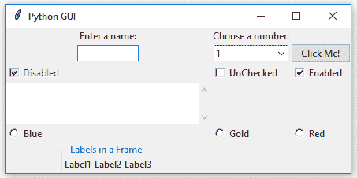

将布局恢复到添加 `LabelFrame` 之前的一种方法是通过调整网格列位置。让我们开始吧：

1.  打开 `GUI_remove_columnspan.py` 并将其保存为 `GUI_LabelFrame_column_one.py`。

1.  将列值从 `0` 更改为 `1`：

```py
buttons_frame.frid(column=1, row=7)     # now in col 1
```

1.  运行代码。现在我们的 GUI 将如下所示：

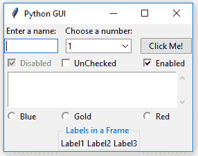

让我们深入了解代码，以更好地理解。

# 它是如何工作的...

由于我们仍在使用单个小部件，我们的布局可能会变得混乱。通过将 `LabelFrame` 的列值从 `0` 更改为 `1`，我们能够将控件恢复到它们原来的位置，以及我们希望它们所在的位置。最左边的标签、文本、`Checkbutton`、`ScrolledText` 和 `Radiobutton` 小部件现在位于我们打算它们所在的位置。第二个标签和位于列 `1` 的 `Entry` 文本自动对齐到框架内 `Labels in a Frame` 小部件长度的中心，所以我们基本上将我们的对齐挑战向右移动了一列。现在它不太明显，因为 **Choose a number:** 标签的大小几乎与 **Labels in a Frame** 标题的大小相同，因此列的宽度已经接近由 `LabelFrame` 生成的新的宽度。

# 还有更多...

在下一个菜谱中，*通过在框架内嵌入框架对齐 GUI 小部件*，我们将嵌入框架以避免在本菜谱中刚刚经历的意外小部件错位。

我们已经成功学习了如何使用小部件动态扩展 GUI。现在让我们继续下一个菜谱。

# 通过在框架内嵌入框架来对齐 GUI 小部件

如果我们在框架内嵌入框架，我们将更好地控制我们的 GUI 布局。这正是本菜谱中我们将要做的。

# 准备工作

当我们想要使我们的 GUI 真的看起来像我们想要的样子时，Python 的动态行为及其 GUI 模块可能会带来挑战。在本菜谱中，我们将嵌入框架以获得更多对布局的控制。这将在不同 UI 元素之间建立更强的层次结构，使视觉外观更容易实现。

我们将继续使用在前一个菜谱中创建的 GUI，*使用小部件动态扩展 GUI*。

在这里，我们将创建一个顶层框架，它将包含其他框架和小部件。这将帮助我们获得我们想要的 GUI 布局。

要做到这一点，我们必须在名为 `ttk.LabelFrame` 的中央框架中嵌入我们的当前控件。这个框架，`ttk.LabelFrame`，是主父窗口的子框架，所有的控件都将成为这个 `ttk.LabelFrame` 的子框架。

到目前为止，我们已直接将所有小部件分配给我们的主 GUI 框架。现在，我们只将 `LabelFrame` 分配给我们的主窗口。之后，我们将使这个 `LabelFrame` 成为所有小部件的父容器。

这就在我们的 GUI 布局中创建了以下层次结构：


在前面的图中，`win` 是一个变量，它保存着我们主 GUI `tkinter` 窗口框架的引用，`mighty` 是一个变量，它保存着我们 `LabelFrame` 的引用，并且是主窗口框架（`win`）的子框架，而 `Label` 和所有其他小部件现在都放置在 `LabelFrame` 容器（`mighty`）中。

# 如何做到这一点...

执行以下步骤以完成本菜谱：

1.  打开 `GUI_LabelFrame_column_one.py` 并将其保存为 `GUI_embed_frames.py`。

1.  在我们的 Python 模块顶部添加以下代码：

```py
mighty = ttk.LabelFrame(win, text=' Mighty Python ')
mighty.grid(column=0, row=0, padx=8, pady=4)
```

接下来，我们将修改以下控件以使用 `mighty` 作为父级，替换 `win`。

1.  将标签的父级从 `win` 更改为 `mighty`：

```py
a_label = ttk.Label(mighty, text="Enter a name:")
a_label.grid(column=0, row=0)
```

1.  运行 `GUI_embed_frames.py` 文件。这将在以下屏幕截图中显示 GUI：

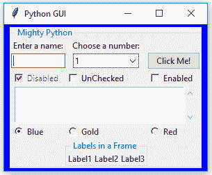

注意现在所有小部件都包含在 **Mighty Python** 的 `LabelFrame` 中，它用几乎看不见的细线包围了它们。接下来，我们可以将 **Frame 中的标签** 小部件重置为左对齐，而不会破坏我们的 GUI 布局：

1.  打开 `GUI_embed_frames.py` 并将其保存为 `GUI_embed_frames_align.py`。

1.  将 `column` 更改为 `0`：

```py
buttons_frame = ttk.LabelFrame(mighty, text=' Labels in a Frame ')
buttons_frame.grid(column=0, row=7) 
```

1.  运行 `GUI_embed_frames_align.py` 文件。这将在以下屏幕截图中显示 GUI：

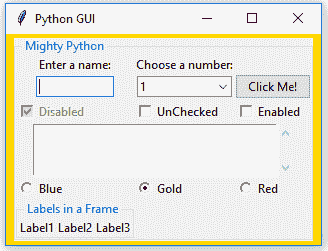

哎呀——可能不是这样。虽然我们的框架内的框架向左对齐得很好，但它将我们的顶部小部件推到了中心（默认设置）。

为了将它们左对齐，我们必须通过使用 `sticky` 属性强制我们的 GUI 布局。通过将其分配为 `'W'`（西），我们可以强制小部件左对齐。执行以下步骤：

1.  打开 `GUI_embed_frames_align.py` 并将其保存为 `GUI_embed_frames_align_west.py`。

1.  为标签添加 `sticky` 属性：

```py
a_label = ttk.Label(mighty, text="Enter a name:")
a_label.grid(column=0, row=0, sticky='W')
```

1.  运行代码。这给我们以下 GUI：


让我们将 `Entry` 小部件在列 `0` 中左对齐：

1.  打开 `GUI_embed_frames_align_west.py` 并将其保存为 `GUI_embed_frames_align_entry_west.py`。

1.  使用 `sticky` 属性将输入框左对齐：

```py
name = tk.StringVar()
name_entered = ttk.Entry(mighty, width=12, textvariable=name)
name_entered.grid(column=0, row=1, sticky=tk.W)                 # align left/West
```

1.  运行 `GUI_embed_frames_align_entry_west.py` 文件。现在标签和输入框都向西方（左侧）对齐：

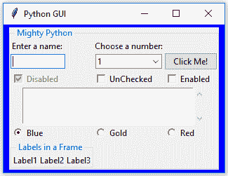

现在，让我们幕后了解代码以更好地理解。

# 它是如何工作的…

注意我们是如何对齐标签，但没有对下面的文本框进行对齐。我们必须对所有想要左对齐的控件使用 `sticky` 属性。我们可以通过使用 `winfo_children()` 和 `grid_configure(sticky='W')` 属性在循环中做到这一点，就像我们在本章的 *使用填充在控件周围添加空间* 菜单中做的那样。

`winfo_children()` 函数返回属于父级的所有子项的列表。这允许我们遍历所有小部件并更改它们的属性。

使用 `tkinter` 强制将命名设置为左、右、上或下，这与 Java 的 West、East、North 和 South 非常相似，它们被缩写为 `'W'`、`'E'` 等等。我们也可以使用 `tk.W` 而不是 `'W'`。这要求我们导入别名为 `tk` 的 `tkinter` 模块。

在之前的菜谱中，我们将 `'W'` 和 `'E'` 结合起来，使我们的 `ScrolledText` 小部件同时附着到其容器的左侧和右侧。将 `'W'` 和 `'E'` 结合的结果是 `'WE'`。我们还可以添加更多的组合：`'NSE'` 将使我们的小部件扩展到顶部、底部和右侧。如果我们表单中只有一个小部件，例如一个按钮，我们可以使用所有选项使其填充整个框架，即 `'NSWE'`。我们还可以使用元组语法：`sticky=(tk.N, tk.S, tk.W, tk.E)`。

为了消除我们框架中的 **标签** `LabelFrame` 的长度对我们 GUI 布局其余部分的影响，我们不得将此 `LabelFrame` 放入与其他小部件相同的 `LabelFrame` 中。相反，我们需要将其直接分配给主 GUI 表单 (`win`)。

我们已经成功学习了如何通过嵌套框架来对齐 GUI 小部件。现在让我们继续进行下一个菜谱。

# 创建菜单栏

在本菜谱中，我们将向主窗口添加菜单栏，向菜单栏添加菜单，然后向菜单添加菜单项。

# 准备工作

我们将首先学习如何添加菜单栏、几个菜单和几个菜单项。一开始，点击菜单项不会有任何效果。我们将在稍后为菜单项添加功能，例如，当点击退出菜单项时关闭主窗口，并显示帮助 | 关于对话框。

我们将继续扩展我们在上一个菜谱中创建的 GUI，即 *通过在框架内嵌套框架对齐 GUI 小部件*。

# 如何做到这一点...

要创建菜单栏，请按照以下步骤操作：

1.  打开 `GUI_embed_frames_align_entry_west.py` 并将其保存为 `GUI_menubar_file.py`。

1.  从 `tkinter` 导入 `Menu` 类：

```py
import tkinter as tk
from tkinter import ttk
from tkinter import scrolledtext
from tkinter import Menu
```

1.  接下来，我们将创建菜单栏。在模块底部，在创建主事件循环之前添加以下代码：

```py
# Creating a Menu Bar
menu_bar = Menu(win)
win.config(menu=menu_bar)

# Create menu and add menu items
file_menu = Menu(menu_bar) # create File menu 
file_menu.add_command(label="New") # add File menu item
```

上述指令从 `GUI_menubar_file.py` 文件生成了以下代码：


在第 119 行，我们调用导入的 `Menu` 模块类的构造函数，并传入我们的主 GUI 实例 `win`。我们将 `Menu` 对象的实例保存在 `menu_bar` 变量中。在第 120 行，我们配置我们的 GUI 使用我们新创建的 `Menu` 作为 GUI 的菜单。

要使其工作，我们还需要将菜单添加到菜单栏，并给它一个标签。

1.  菜单项已经被添加到菜单中，但我们仍然需要将菜单添加到菜单栏中：

```py
menu_bar.add_cascade(label="File", menu=file_menu)  # add File menu to menu bar and give it a label
```

1.  运行上述代码添加了一个带有菜单项的菜单栏。这在上面的屏幕截图中有显示：


如果这个 `tkinter` 菜单栏语法看起来有点复杂，不要担心。这只是 `tkinter` 创建菜单栏的语法。它并不非常 Pythonic。

接下来，我们将向第一个菜单添加第二个菜单项，该菜单已添加到菜单栏中。可以通过以下步骤完成：

1.  打开 `GUI_menubar_file.py` 并将其保存为 `GUI_menubar_exit.py`。

1.  添加退出菜单项：

```py
file_menu.add_command(label="Exit")
```

1.  运行前面的代码会产生以下结果，即`GUI_menubar_exit.py`：


我们可以通过在现有菜单项之间添加一行代码来在菜单项之间添加分隔线。这可以通过以下步骤完成：

1.  打开`GUI_menubar_exit.py`并将其保存为`GUI_menubar_separator.py`。

1.  添加一个分隔线，如下所示：

```py
file_menu.add_separator()
```

1.  运行前面的代码。在以下屏幕截图中，我们可以看到在两个菜单项之间添加了一条分隔线：

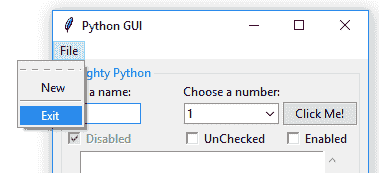

通过将`tearoff`属性传递给菜单的构造函数，我们可以移除默认情况下出现在菜单第一个菜单项上方的第一条虚线。这可以通过以下步骤完成：

1.  打开`GUI_menubar_separator.py`并将其保存为`GUI_menubar_tearoff.py`。

1.  将`tearoff`属性设置为`0`：

```py
file_menu = Menu(menu_bar, tearoff=0)
```

1.  运行前面的代码。在以下屏幕截图中，虚线不再出现，我们的 GUI 看起来好多了：

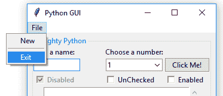

接下来，我们将添加第二个菜单，名为`Help`，它将水平放置在第一个菜单的右侧。我们将给它一个名为`About`的菜单项，并将这个第二个菜单添加到菜单栏中。

**文件**和**帮助 | 关于**是我们都非常熟悉的常见 Windows GUI 布局，我们可以使用 Python 和`tkinter`创建相同的菜单：

1.  打开`GUI_menubar_tearoff.py`并将其保存为`GUI_menubar_help.py`。

1.  添加一个带有菜单项的第二个菜单：

```py
help_menu = Menu(menu_bar, tearoff=0)
menu_bar.add_cascade(label="Help", menu=help_menu)
help_menu.add_command(label="About")
```

前面的说明会产生以下代码，该代码可以在`GUI_menubar_help.py`文件中找到：

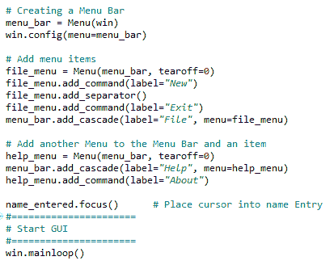

1.  运行前面的代码。如图所示，我们有一个带有菜单栏的第二个菜单项：

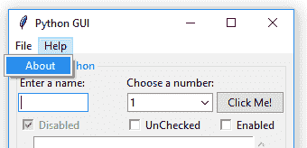

到目前为止，我们的 GUI 有一个菜单栏和两个包含一些菜单项的菜单。点击它们并不会做太多，直到我们添加一些命令。这就是我们接下来要做的。在创建菜单栏的代码上方执行以下操作：

1.  打开`GUI_menubar_help.py`并将其保存为`GUI_menubar_exit_quit.py`。

1.  创建一个`quit`函数：

```py
def _quit():
    win.quit()
    win.destroy()
    exit() 
```

1.  接下来，我们将通过向菜单项添加以下命令将`File | Exit`菜单项绑定到该函数：

```py
file_menu.add_command(label="Exit", command=_quit)
```

前面的说明会产生以下代码，该代码可以在`GUI_menubar_exit_quit.py`文件中找到：

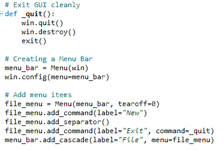

1.  运行代码并点击退出菜单项。以下 GUI 显示了我们所运行代码的输出：


当我们点击**退出**菜单项时，我们的应用程序确实会退出。

现在，让我们深入了解代码，以更好地理解它。

# 它是如何工作的…

首先，我们调用`Menu`类的`tkinter`构造函数。然后，我们将新创建的菜单分配给我们的主 GUI 窗口。实际上，这变成了菜单栏。我们将其引用保存在名为`menu_bar`的实例变量中。

接下来，我们创建一个菜单并添加两个菜单项到菜单中。`add_cascade()`方法将菜单项一个接一个地排列，形成一个垂直布局。

然后，我们在两个菜单项之间添加一条分隔线。这通常用于将相关的菜单项分组（因此得名）。

最后，我们禁用`tearoff`虚线，使我们的菜单看起来更好。

在不禁用此默认功能的情况下，用户可以撕下菜单从主窗口。我发现这个功能价值不大。您可以自由地通过双击虚线（在禁用此功能之前）来尝试它。如果您使用的是 Mac，这个功能可能没有被启用；如果是这样，您不必担心。

我们接着在菜单栏中添加第二个菜单。我们可以继续使用这种技术添加菜单。

接下来，我们创建一个函数来干净地退出我们的 GUI 应用程序。如何退出正在运行的 Python 应用程序是推荐的方式来结束主事件循环。

我们将我们创建的函数绑定到菜单项上，这是将函数绑定到菜单项的标准方式，使用`tkinter`的`command`属性。每次我们想让我们的菜单项真正做些什么时，我们必须将它们中的每一个绑定到一个函数上。

我们遵循推荐的 Python 命名约定，在退出函数前加一个单下划线，这表示这是一个私有函数，不能被我们的代码客户端调用。

# 更多内容...

我们将在第三章中添加**帮助 | 关于**功能，*外观定制*，它介绍了消息框以及更多内容。

我们已经成功地学习了如何创建菜单栏。现在让我们继续到下一个菜谱。

# 创建标签式小部件

在这个菜谱中，我们将创建标签式小部件来进一步组织我们用`tkinter`编写的扩展 GUI。

# 准备工作

为了改进我们的 Python GUI 使用标签，我们将从最基础开始，尽可能少地使用代码。在这个菜谱中，我们将创建一个简单的 GUI，然后从之前的菜谱中添加小部件，将它们放置在这个新的标签布局中。

# 如何做到这一点...

按照以下步骤创建*标签*控件，在`tkinter`中称为`Notebook`：

1.  创建一个新的 Python 模块，并将其命名为`GUI_tabbed.py`。

1.  在模块顶部，导入`tkinter`：

```py
import tkinter as tk
from tkinter import ttk
```

1.  创建`Tk`类的实例：

```py
win = tk.Tk()
```

1.  通过`title`属性添加标题：

```py
win.title ("Python GUI")
```

1.  使用`ttk`的`Notebook`创建`tabControl`：

```py
tabControl = ttk.Notebook(win)
```

1.  将标签添加到`tabControl`：

```py
tabControl.add(tab1, text-'Tab 1')
```

1.  使用`pack`使控件在 GUI 中可见：

```py
tabControl.pack(expand=1, fill="both")
```

上述指令生成以下代码，可以在`GUI_tabbed.py`文件中找到：

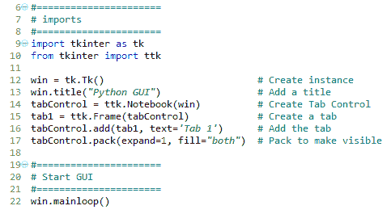

1.  运行上述代码。以下截图显示了运行代码后的 GUI：


此小部件为我们 GUI 设计工具包添加了另一个非常强大的工具。它带有自己的限制，所有这些限制都可以在本菜谱中看到（例如，我们无法重新定位 GUI，它也不显示整个 GUI 标题）。

虽然我们在前面的菜谱中使用了网格布局管理器来简化 GUI，但我们可以使用一个更简单的布局管理器：`pack` 就是其中之一。

在前面的代码中，我们将 `tabControl` 和 `ttk.Notebook` 小部件打包到主 GUI 表单中，将笔记本标签式控制扩展到填充所有侧面。我们可以通过以下步骤向我们的控制中添加第二个标签页并在这两者之间点击：

1.  打开 `GUI_tabbed.py` 并将其保存为 `GUI_tabbed_two.py`。

1.  添加第二个标签：

```py
tab2 = ttk.Frame(tabControl) # Add a second tab
tabControl.add(tab2, text='Tab 2') # Add second tab
```

1.  运行前面的代码。在下面的屏幕截图中，我们有两个标签页。点击标签 2 以使其获得焦点：


我们非常希望看到窗口的标题；为此，我们必须向我们的标签之一添加一个小部件。这个小部件必须足够宽，以便动态扩展我们的 GUI 以显示窗口标题。按照以下步骤操作：

1.  打开 `GUI_tabbed_two.py` 并将其保存为 `GUI_tabbed_two_mighty.py`。

1.  添加一个 `LabelFrame` 和一个 `Label`：

```py
# LabelFrame using tab1 as the parent
mighty = ttk.LabelFrame(tab1, text=' Mighty Python ')
mighty.grid(column=0, row=0, padx=8, pady=4)

# Label using mighty as the parent 
a_label = ttk.Label(mighty, text="Enter a name:")
a_label.grid(column=0, row=0, sticky='W')
```

1.  运行前面的代码。如以下屏幕截图所示，我们在**标签 1**内看到 **Mighty Python**。这扩展了我们的 GUI，但添加的小部件不够大，无法使 GUI 标题可见：

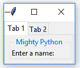

在添加第二个标签以及它们周围的一些间距后，我们将布局拉伸足够长，以便再次看到我们的 GUI 标题：

1.  打开 `GUI_tabbed_two_mighty.py` 并将其保存为 `GUI_tabbed_two_mighty_labels.py`。

1.  通过循环添加第二个标签和一些间距：

```py
# Add another label
ttk.Label(mighty, text="Choose a number:").grid(column=1, row=0)

# Add some space around each label
for child in mighty.winfo_children(): 
    child.grid_configure(padx=8)
```

1.  运行前面的代码。下面的屏幕截图显示了运行此代码的输出，该输出也可以在 `GUI_tabbed_two_mighty_labels.py` 文件中找到：


我们可以将迄今为止创建的所有小部件都放置到我们新创建的标签页控制中。

您可以从 [`github.com/PacktPublishing/Python-GUI-Programming-Cookbook-Third-Edition`](https://github.com/PacktPublishing/Python-GUI-Programming-Cookbook-Third-Edition) 下载代码。尝试自己创建标签式 GUI。我们在前面的菜谱中创建并排列了所有小部件，但尚未将它们放置在两个不同的标签页上。

查看以下 `GUI_tabbed_all_widgets.py` 文件：


如您所见，所有小部件都位于**标签 1**内。让我们将其中一些移动到**标签 2**：

1.  创建第二个 `LabelFrame`，它将成为我们将要重新定位到**标签 2**的小部件的容器：

```py
mighty2 = ttk.LabelFrame(tab2, text=' The Snake ')
mighty2.grid(column=0, row=0, padx=8, pady=4)
```

1.  接下来，我们将`Check`和`Radio`按钮移动到**标签 2**，通过指定新的父容器，即我们命名为`mighty2`的新变量。以下是我们将应用于所有移动到标签 2 的控制的一个示例：

```py
chVarDis = tk.IntVar()
check 1 = tk.Checkbutton(mighty2, text="Disabled", variable=chVarDis, 
                         state='disabled')
```

1.  运行`GUI_tabbed_all_widgets_both_tabs.py`文件。下面的截图显示了运行前面代码后的输出：

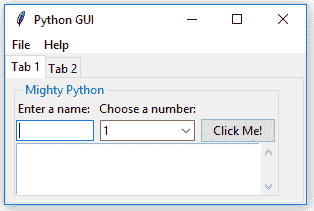

我们现在可以点击标签 2 并看到我们重新定位的小部件：

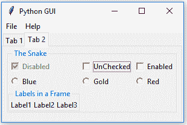

在运行前面的代码后，我们的 GUI 看起来不同。标签 1 比之前包含所有之前创建的小部件时少。

点击重新定位的`Radiobutton`不再有任何效果，因此我们将它们的动作更改为重命名文本属性，从`LabelFrame`小部件的标题更改为`Radiobuttons`显示的名称。当我们点击**金色**`Radiobutton`时，我们不再将框架的背景设置为金色。相反，我们替换`LabelFrame`的文本标题。Python 的**蛇**现在变为**金色**：

```py
def radCall():
    radSel=radVar.get()
    if radSel == 0: mighty2.configure(text ='Blue')
    if radSel == 1: mighty2.configure(text ='Gold')
    if radSel == 0: mighty2.configure(text ='Red')
```

1.  现在选择任何`RadioButton`小部件都会更改`LabelFrame`的名称。

1.  运行`GUI_tabbed_all_widgets_both_tabs_radio.py`文件。下面的截图显示了运行此文件中代码的输出：

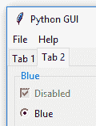

注意标签框架现在被命名为蓝色。点击金色单选按钮会将标题更改为金色，如下面的截图所示：


现在，让我们深入了解代码以更好地理解它。

# 它是如何工作的…

在执行创建标签 1 的代码时，它被创建，但没有包含任何信息。然后我们创建了一个第二个标签，标签 2。在创建第二个标签后，我们将原本位于**标签 1**中的某些小部件移动到了**标签 2**。添加标签是组织我们不断增加的 GUI 的另一种绝佳方式。这是一种处理 GUI 设计复杂性的好方法。我们可以将小部件分组排列，使它们自然地属于一组，并通过使用标签来让用户摆脱杂乱。

在`tkinter`中，创建标签是通过`Notebook`小部件完成的，这是允许我们添加标签控制的工具。与许多其他小部件一样，`tkinter notebook`小部件附带了一些额外的属性，我们可以使用和配置。探索我们可用的`tkinter`小部件的额外功能的一个绝佳起点是官方网站：[`docs.python.org/3.1/library/tkinter.ttk.html#notebook`](https://docs.python.org/3.1/library/tkinter.ttk.html#notebook)。

我们已经成功学习了如何创建标签小部件。现在让我们继续下一个菜谱。

# 使用网格布局管理器

网格布局管理器是我们可用的最有用的布局工具之一。虽然`pack`等布局工具简单易用，但`grid`为我们提供了对布局的更多控制——尤其是在我们将`grid`与嵌入式`frames`结合使用时。

我们已经在许多菜谱中使用了它，例如，因为它真的很强大。

# 准备工作…

在这个菜谱中，我们将回顾一些网格布局管理器技术。我们已经在使用它们，但我们将在这里更详细地探讨它们。

# 如何做到这一点…

在本章中，我们创建了行和列，这是 GUI 设计的数据库方法（MS Excel 也这样做）。我们硬编码了第一行。然而，如果我们忘记指定下一行应该在哪里，`tkinter`会自动填充，甚至我们都没有注意到。

为了观察这一点，让我们从我们之前工作过的菜谱中取代码：

1.  打开`GUI_tabbed_all_widgets_both_tabs_radio.py`。

1.  将`scr.grid`行注释掉，如下所示：


`tkinter`会自动将缺失的行添加到我们没有指定任何特定行的位置。

1.  运行代码并注意我们的单选按钮突然出现在文本小部件的中间！

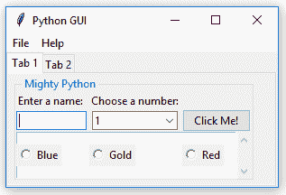

现在，让我们幕后了解代码，以便更好地理解。

# 它是如何工作的…

我们在行 1 上布局了`Entry`小部件。然而，我们忘记指定我们的`ScrolledText`小部件所在的行，我们通过`scr`变量引用它。然后，我们添加了想要布局在行`3`的`Radiobutton`小部件。

这很好，因为`tkinter`自动增加了我们的`ScrolledText`小部件的行位置，使其使用下一个最高的行号，即行`2`。

看着我们的代码，没有意识到我们忘记明确地将我们的`ScrolledText`小部件定位到行`2`，我们可能会认为那里没有任何内容。

由于这个原因，我们可能会尝试以下方法。如果我们将`curRad`变量设置为使用行`2`，我们可能会在菜谱的*如何做到这一点…*部分的最终截图中获得一个不愉快的惊喜。

现在，让我们幕后了解代码，以便更好地理解。

注意我们的`RadioButton`(s)行突然出现在我们的`ScrolledText`小部件的中间！这绝对不是我们想要我们的 GUI 看起来像的！

如果我们忘记明确指定行号，默认情况下，`tkinter`将使用下一个可用的行。

我们还使用了`columnspan`属性来确保我们的小部件不会仅限于一个列，如下面的截图所示：


上述截图展示了我们如何确保我们的`ScrolledText`小部件横跨 GUI 中的所有列。
