# 第七章：通过我们的 GUI 将数据存储在我们的 MySQL 数据库中

在本章中，我们将学习如何安装和使用 MySQL 数据库，并将其连接到我们的 GUI。

MySQL 是一个完整的 **结构化查询语言**（**SQL**）数据库服务器，并自带一个非常好的 GUI，以便我们可以查看和使用数据。我们将创建一个数据库，将数据插入到我们的数据库中，然后看看我们如何修改、读取和删除数据。

对于用 Python 编写的软件程序，数据存储在 SQL 数据库中是必不可少的。我们目前的所有数据都仅存在于内存中，我们希望使其持久化，这样我们关闭正在运行的 Python 程序时就不会丢失数据。

在这里，您将学习如何通过将 SQL 添加到您的编程工具箱中来提高您的编程技能。

本章的第一个菜谱将向您展示如何安装免费的 MySQL Community Edition。

在成功连接到我们的 MySQL 服务器的一个运行实例之后，我们将设计和创建一个数据库，该数据库将接受一个书名，这可能是我们的个人日记或我们在互联网上找到的引言。我们将需要一个页码，对于书籍来说，这可能为空白（在 SQL 术语中为 `NULL`），然后我们将使用我们的 GUI（使用 Python 3.7 或更高版本构建）将我们从书籍、期刊、网站或朋友那里喜欢的引言`插入`到我们的 MySQL 数据库中。

我们将通过我们的 Python GUI 发出这些 SQL 命令并显示数据，来插入、修改、删除和显示我们最喜欢的引言。

**CRUD** 是您可能之前遇到过的数据库术语，它是四个基本 SQL 命令的缩写，即 **创建**、**读取**、**更新**和**删除**。

这里是本章 Python 模块的概述：

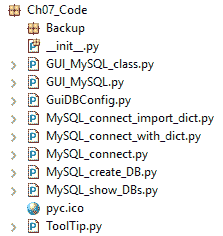

在本章中，我们将通过将 GUI 连接到 MySQL 数据库来增强我们的 Python GUI。我们将涵盖以下菜谱：

+   从 Python 安装并连接到 MySQL 服务器

+   配置 MySQL 数据库连接

+   设计 Python GUI 数据库

+   使用 SQL INSERT 命令

+   使用 SQL UPDATE 命令

+   使用 SQL DELETE 命令

+   从我们的 MySQL 数据库存储和检索数据

+   使用 MySQL Workbench

# 从 Python 安装并连接到 MySQL 服务器

在我们能够连接到 MySQL 数据库之前，我们必须连接到 *MySQL 服务器*。为了做到这一点，我们需要知道 MySQL 服务器的 IP 地址以及它监听的端口。

我们还必须是一个注册用户，并有一个密码，以便能够被 MySQL 服务器**认证**。

# 准备工作

您需要能够访问一个正在运行的 MySQL 服务器实例，并且拥有创建数据库和表的管理员权限。

# 如何做到这一点…

让我们看看如何从 Python 安装和连接到 MySQL 服务器：

1.  下载 MySQL 安装程序。

官方的 MySQL 网站上有一个免费的 MySQL 社区版。你可以从 [`dev.mysql.com/downloads/windows/installer/`](http://dev.mysql.com/downloads/windows/installer/) 下载并安装到你的本地 PC 上。

1.  运行安装程序：


1.  为 `root` 用户选择一个密码，并且可选地添加更多用户：

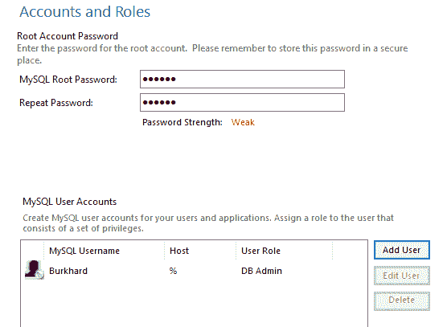

1.  验证你是否拥有 `\Python37\Lib\site-packages\mysql\connector` 文件夹：

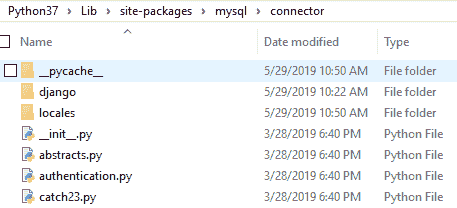

1.  打开 `mysqlsh.exe` 可执行文件，双击它以运行：

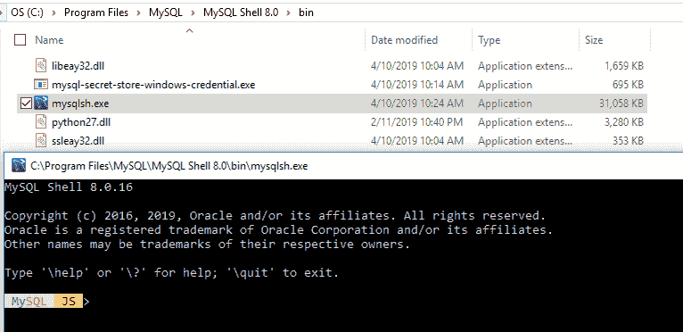

1.  在提示符中输入 `\sql` 以进入 `SQL` 模式。

1.  在 `MySql>` 提示符中，输入 `SHOW DATABASES`。然后，按 *Enter*：

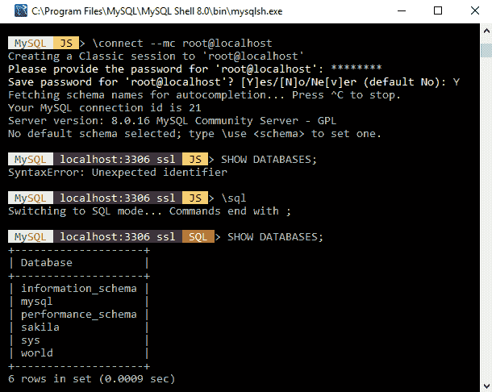

1.  创建一个新的 Python 模块并将其保存为 `MySQL_connect.py`：

```py
import mysql 
conn = mysql.connector.connect(user=<adminUser>, password=<adminPwd>, host='127.0.0.1') 
print(conn) 
conn.close()
```

1.  如果运行前面的代码产生以下输出，那么我们就已成功连接：


让我们深入了解代码，以便更好地理解它。

# 它是如何工作的…

首先，我们下载并安装了与我们的操作系统匹配的 MySQL 版本。

在安装过程中，你将为 `root` 用户选择一个密码，你也可以添加更多用户。我建议你添加自己作为 DB Admin 并选择一个密码。

在本章中，我们使用的是最新的 MySQL 社区服务器版本，即 8.0.16。

**SQL** 代表 **结构化查询语言**，有时发音为 **sequel**。它使用 **集合** 数学方法，该方法基于数学和 **集合理论**。你可以在 [`en.wikipedia.org/wiki/Set_theory`](https://en.wikipedia.org/wiki/Set_theory) 上了解更多信息。

为了连接到 MySQL，我们可能需要安装一个特殊的 Python 连接器驱动程序。这个驱动程序将允许我们从 Python 与 MySQL 服务器通信。MySQL 网站上有一个免费可用的驱动程序 ([`dev.mysql.com/doc/connector-python/en/index.html`](http://dev.mysql.com/doc/connector-python/en/index.html))，并且它附带了一个非常好的在线教程。

当我安装最新版本的 MySQL 的新安装时，Python 连接器会自动安装。因此，你可能根本不需要安装它。不过，了解这一点是好的，以防你遇到任何问题并需要自己安装它。

验证我们已经安装了正确的驱动程序，并且它能让 Python 与 MySQL 通信的一种方法是查看 Python 的 `site-packages` 目录。如果你的 `site-packages` 目录中有一个新的**`MySQL`**文件夹，其中包含一个 `connector` 子文件夹，则安装成功。我们在 *步骤 4* 中做了这件事。

在 *步骤 5* 中，我们通过使用 MySQL Shell*.* 验证了我们的 MySQL 服务器安装实际上是否工作。

你的路径可能不同，尤其是如果你使用的是 macOS 或 Linux：`<path to>\Program Files\MySQL\MySQL Shell 8.0\bin`。

然后，我们验证了我们可以使用 Python 3.7 实现相同的结果。

将占位符括号中的名称，即`<adminUser>`和`<adminPwd>`，替换为您在 MySQL 安装中使用的真实凭据。

我们必须能够连接到 MySQL 服务器。默认情况下，我们处于 JavaScript `JS` 模式。我们可以通过在提示符中键入 `\sql` 来切换到 `SQL` 模式。现在，我们可以使用 `SQL` 命令。我们在*步骤 6*和*步骤 7*中这样做过。

如果您无法通过*命令行*或 Python 的 `mysqlclient` 连接到 MySQL 服务器，那么在安装过程中可能出了些问题。如果是这种情况，请尝试卸载 MySQL，重新启动您的 PC，然后再次运行安装程序。

为了将我们的 GUI 连接到 MySQL 服务器，我们需要能够以管理员权限连接到服务器。如果我们想创建自己的数据库，我们也需要这样做。如果数据库已经存在，那么我们只需要连接、插入、更新和删除数据的授权权限。我们将在下一个配方中在 MySQL 服务器上创建一个新的数据库。

# 配置 MySQL 数据库连接

在上一个配方中，我们使用了连接到 MySQL 服务器的最短方式，即通过在 `connect` 方法中硬编码认证所需的凭据。虽然这是一种早期开发中快速的方法，但我们绝对不希望将我们的 MySQL 服务器凭据暴露给任何人。相反，我们希望*授权*特定用户，以便他们可以访问数据库、表、视图和相关数据库命令。

通过将凭据存储在配置文件中来由 MySQL 服务器进行认证是一种更安全的方法，这正是我们在本配方中要做的。我们将使用我们的配置文件来连接到 MySQL 服务器，然后在 MySQL 服务器上创建自己的数据库。

我们将在本章的所有配方中使用此数据库。

# 准备工作

运行本配方中所示代码需要具有管理员权限的运行 MySQL 服务器访问权限。

前一个配方展示了如何安装 MySQL 服务器的免费 *社区版*。管理员权限将允许您实施此配方。

# 如何做…

让我们看看如何执行此配方：

1.  首先，我们将在与 `MySQL_connect.py` 代码相同的模块中创建一个字典。然后，我们将按顺序执行以下操作：

    1.  打开 `MySQL_connect.py` 并将其保存为 `MySQL_connect_with_dict.py`。

    1.  向模块中添加以下代码：

```py
# create dictionary to hold connection info 
dbConfig = { 
    'user': <adminName>,      # use your admin name
    'password': <adminPwd>,   # use your real password 
    'host': '127.0.0.1',      # IP address of localhost 
}
```

1.  在 `dbConfig` 下方写下以下代码：

```py
import mysql.connector 
# unpack dictionary credentials
conn = mysql.connector.connect(**dbConfig) 
print(conn)
```

1.  运行代码以确保其正常工作。

1.  创建一个新的模块，`GuiDBConfig.py`，并将以下代码放入其中：

```py
# create dictionary to hold connection info
dbConfig = {
            'user': <adminUser>,       # your user name
            'password': <adminPwd>,    # your password
            'host': '127.0.0.1',       # IP address
 }
```

1.  现在，打开 `MySQL_connect_with_dict.py` 并将其保存为 `MySQL_connect_import_dict.py`。

1.  导入 `GuiDBConfig` 并解包字典，如下所示：

```py
import GuiDBConfig as guiConf 
# unpack dictionary credentials
conn = mysql.connector.connect(**guiConf.dbConfig) 
print(conn)
```

1.  创建一个新的 Python 模块并将其保存为 `MySQL_create_DB.py`。接下来，添加以下代码：

```py
import mysql.connector 
import Ch07_Code.GuiDBConfig as guiConf 

GUIDB = 'GuiDB' 

# unpack dictionary credentials
conn = mysql.connector.connect(**guiConf.dbConfig) 

cursor = conn.cursor() 

try: 
    cursor.execute("CREATE DATABASE {} 
                    DEFAULT CHARACTER SET 'utf8'".format(GUIDB)) 
except mysql.connector.Error as err: 
    print("Failed to create DB: {}".format(err)) 

conn.close()
```

1.  执行 `MySQL_create_DB.py` 两次：


1.  创建一个新的 Python 模块并将其保存为`MySQL_show_DBs.py`。然后，添加以下代码：

```py
import mysql.connector 
import GuiDBConfig as guiConf 

# unpack dictionary credentials
conn = mysql.connector.connect(**guiConf.dbConfig) 

cursor = conn.cursor() 

cursor.execute("SHOW DATABASES") 
print(cursor.fetchall()) 

conn.close()
```

1.  运行前面的代码会给我们以下输出：


让我们深入了解代码以更好地理解它。

# 它是如何工作的...

首先，我们创建了一个字典，并将连接凭据保存在 Python 字典中。

接下来，在`connect`方法中，我们解包了字典值。看看以下代码：

```py
mysql.connector.connect('user': <adminName>, 'password': <adminPwd>, 'host': '127.0.0.1')
```

我们不是使用此代码，而是使用`(**dbConfig)`，它达到相同的效果但更简洁。

这导致与 MySQL 服务器成功建立相同的连接，但不同之处在于连接方法不再暴露任何关键任务信息。

数据库服务器对你的任务至关重要。一旦你失去了宝贵的资料，而且找不到任何最近的备份，你就会意识到这一点！

请注意，将相同的用户名、密码、数据库等放入同一 Python 模块的字典中并不能消除凭据被任何查看代码的人看到的危险。

为了提高数据库安全性，我们必须将字典移动到它自己的 Python 模块中。我们称新的 Python 模块为`GuiDBConfig.py`。

然后，我们导入了此模块，并解包了凭据，就像我们之前做的那样。

一旦我们将此模块放置在安全的地方，与代码的其他部分分离，我们就为我们的 MySQL 数据实现了更高的安全级别。

现在我们知道了如何连接到 MySQL 并拥有管理员权限，我们可以通过发出 SQL 命令来创建自己的数据库。

为了执行对 MySQL 的命令，我们从一个连接对象中创建了一个游标对象。

光标通常是指向数据库表中特定行的指针，我们可以将其在表中上下移动，但在这里，我们用它来创建数据库本身。我们将 Python 代码封装在`try...except`块中，并使用 MySQL 的内置错误代码来告诉我们是否发生了错误。

我们可以通过执行两次数据库创建代码来验证此块是否工作。第一次，它将在 MySQL 中创建一个新的数据库，第二次，它将打印出一个错误消息，指出该数据库已存在。

我们可以通过使用相同的游标对象语法执行`SHOW DATABASES`命令来验证哪些数据库存在。我们不是发出`CREATE DATABASE`命令，而是创建一个游标并使用它来执行`SHOW DATABASES`命令，然后将结果检索并打印到控制台输出。

我们通过在游标对象上调用`fetchall`方法来检索结果。

运行`MySQL_show_DBs.py`代码显示我们 MySQL 服务器实例中当前存在的数据库。正如我们从输出中看到的那样，MySQL 自带了几个内置数据库，例如`information_schema`。我们成功创建了我们的`guidb`数据库，如输出所示。所有其他展示的数据库都是 MySQL 自带。

注意，尽管我们在创建时将其指定为混合大小写的 GuiDB，但 `SHOW DATABASES` 命令显示 MySQL 中所有现有数据库均为小写，并显示我们的数据库为 `guidb`。

物理 MySQL 文件根据 `my.ini` 文件存储在硬盘上，在 Windows 10 安装中，可能位于 `C:\ProgramData\MySQL\MySQL Server 8.0`。在此 `.ini` 文件中，您可以找到以下指向 `Data` 文件夹的配置路径：

`# 数据库根路径`

`datadir=C:/ProgramData/MySQL/MySQL Server 8.0/Data`

让我们继续到下一个菜谱。

# 设计 Python GUI 数据库

在我们开始创建表并将数据插入其中之前，我们必须设计数据库。与更改本地 Python 变量名不同，一旦创建并加载了数据，更改数据库 `schema` 就不是那么容易了。

我们将不得不 `DROP` 表，这意味着我们会丢失表中所有的数据。因此，在删除表之前，我们必须提取数据，将数据保存到临时表或其他数据格式中，然后 `DROP` 表，重新创建它，并最终重新导入原始数据。

希望您已经明白了这可能会多么繁琐。

设计我们的 GUI MySQL 数据库意味着我们需要考虑我们的 Python 应用程序将如何使用它，然后为我们的表选择符合预期目的的名称。

# 准备工作

我们将使用在前一个菜谱中创建的 MySQL 数据库，*配置 MySQL 数据库连接*。需要一个正在运行的 MySQL 实例，前两个菜谱展示了如何安装 MySQL、所有必要的附加驱动程序以及如何创建本章中使用的数据库。

# 如何操作…

在这个菜谱中，我们从上一章的 `GUI_TCP_IP.py` 文件开始。我们将把我们的 Python GUI 中的小部件从上一个菜谱中创建的两个标签页之间移动，以便组织我们的 Python GUI，使其能够连接到 MySQL 数据库。让我们看看如何完成这个菜谱：

1.  打开 `GUI_TCP_IP.py` 并将其保存为 `GUI_MySQL.py`。

1.  从 Packt 网站下载完整代码。

1.  使用 WinMerge 等工具比较两个版本的 GUI：

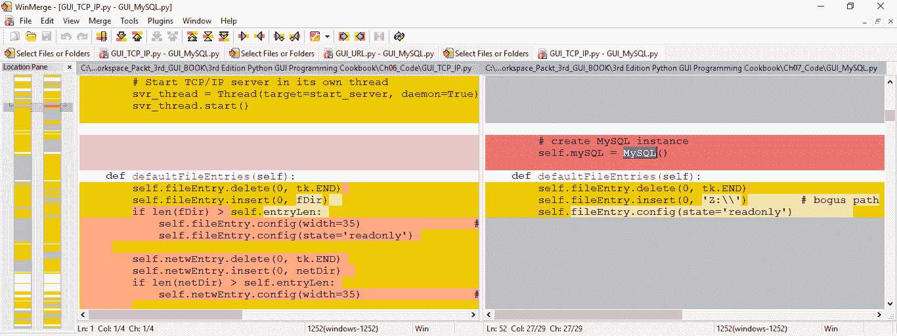

1.  运行位于 `GUI_MySQL.py` 中的代码。您将观察到以下输出：


+   1.  现在，打开 `MySQL_create_DB.py` 并将其保存为 `MySQL_show_DB.py`。

    1.  将 `try...catch` 块替换为以下代码：

```py
# unpack dictionary credentials
conn = mysql.connect(**guiConf.dbConfig) 
# create cursor
cursor = conn.cursor() 
# execute command 
cursor.execute("SHOW TABLES FROM guidb") 
print(cursor.fetchall()) 

# close connection to MySQL 
conn.close()
```

1.  运行代码并观察输出：

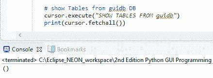

+   1.  创建一个类似于 `GUI_MySQL_class.py` 的模块。

    1.  添加并运行以下代码：

```py
# connect by unpacking dictionary credentials 
conn = mysql.connect(**guiConf.dbConfig) 

# create cursor
cursor = conn.cursor() 

# select DB 
cursor.execute("USE guidb") 

# create Table inside DB 
cursor.execute("CREATE TABLE Books (
      Book_ID INT NOT NULL AUTO_INCREMENT,
      Book_Title VARCHAR(25) NOT NULL,
      Book_Page INT NOT NULL,
      PRIMARY KEY (Book_ID)
    ) ENGINE=InnoDB") 

# close connection to MySQL 
conn.close()
```

1.  运行以下代码，该代码位于 `GUI_MySQL_class.py` 中：


1.  打开命令提示符并导航到 `mysql.exe`：


1.  运行 `mysql.exe`：


1.  输入`SHOW COLUMNS FROM books;`命令：

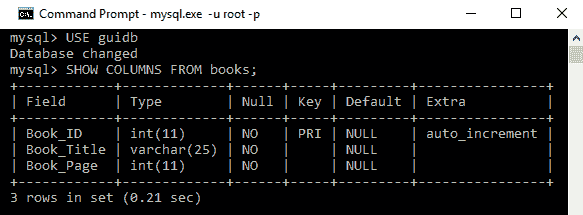

1.  通过运行以下代码创建第二个表：

```py
# select DB 
cursor.execute("USE guidb") 

# create second Table inside DB 
cursor.execute("CREATE TABLE Quotations (
        Quote_ID INT,
        Quotation VARCHAR(250),
        Books_Book_ID INT,
        FOREIGN KEY (Books_Book_ID)
        REFERENCES Books(Book_ID)
        ON DELETE CASCADE
    ) ENGINE=InnoDB")
```

1.  执行`SHOW TABLES`命令：

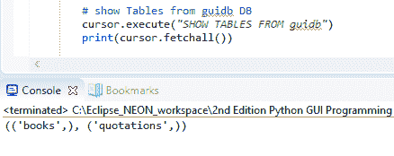

1.  执行`SHOW COLUMNS`命令：


1.  再次执行`SHOW COLUMNS`命令：

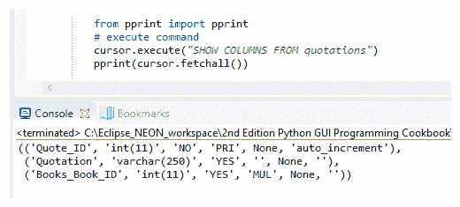

让我们深入了解代码，以更好地理解它。

# 它是如何工作的...

我们从上一章的`GUI_TCP_IP.py`文件开始，重新组织了小部件。

我们重命名了几个小部件，并将访问 MySQL 数据的代码分离到之前命名为**Tab 1**的部分，并将无关的小部件移动到之前命名为**Tab 2**的部分。我们还调整了一些内部 Python 变量名，以便我们更好地理解我们的代码。

代码可读性是一种编程美德，而不是浪费时间。

重构的模块接近 400 行 Python 代码，在这里展示整个代码会占用太多页面。在 Windows 上，我们可以使用一个名为**WinMerge**的工具来比较不同的 Python 代码模块。我确信 macOS 和 Linux 也有类似的工具。

WinMerge 是一个在 Windows 上比较不同 Python（和其他）代码模块的出色工具。我们可以用它来查看代码模块之间的差异。您可以从[`sourceforge.net/projects/winmerge`](https://sourceforge.net/projects/winmerge/)免费下载它。

我们重构的 Python GUI 现在看起来如下：


我们将第一个标签重命名为 MySQL，并创建了两个`LabelFrame`小部件。我们称顶部的为`Python Database`，它包含两个标签和六个`tkinter` Entry 小部件，以及三个按钮，我们使用`tkinter`网格布局管理器将它们排列成四行三列。我们将输入书名和页数到 Entry 小部件中。点击按钮将导致插入、检索或修改书籍引用。底部的`LabelFrame`小部件的标签为“Book Quotation”，而这个框架中的`ScrolledText`小部件将显示我们的书籍和引用。

然后，我们创建了两个 SQL 表来存储我们的数据。第一个将存储书名和书页数据，然后将与第二个表连接，该表将存储书籍引用。我们将通过*主键到外键关系*将两个表链接在一起。

现在，让我们创建第一个数据库表。在我们这样做之前，让我们验证一下我们的数据库确实没有表。根据在线 MySQL 文档，查看数据库中存在的表的命令如下：

```py
13.7.6.37 SHOW TABLES Syntax
SHOW [FULL] TABLES [{FROM | IN} db_name] 
 [LIKE 'pattern' | WHERE expr]
```

重要的是要注意，在前面的语法中，方括号中的参数，如`FULL`，是可选的，而花括号中的参数，如`FROM`，对于`SHOW TABLES`命令是必需的。`FROM`和`IN`之间的管道符号表示 MySQL 语法要求使用其中一个或另一个。

当我们在`MySQL_show_DB.py`中执行 SQL 命令时，我们得到预期的结果，即一个空元组，显示我们的数据库目前没有表。

我们也可以通过执行`USE <DB>`命令来选择数据库。通过这样做，我们不需要将它传递给`SHOW TABLES`命令，因为我们已经选择了我们想要与之通信的数据库。

所有的 SQL 代码都位于`GUI_MySQL_class.py`中，我们将它导入到`GUI_MySQL.py`中。

既然我们已经知道如何验证我们的数据库中没有表，我们就创建一些。在创建两个表之后，我们使用之前的相同命令来验证它们确实已经进入我们的数据库。

通过这样做，我们创建了第一个表，命名为`Books`。

我们可以通过执行`cursor.execute("SHOW TABLES FROM guidb")`命令来验证表是否已经创建在我们的数据库中。

结果不再是空元组，而是一个包含元组的元组，显示了刚刚创建的`books`表。

我们可以使用 MySQL 命令行客户端查看我们表中的列。为了做到这一点，我们必须以*root*用户登录。我们还需要在命令的末尾添加一个**分号**。

在 Windows 上，你只需双击 MySQL 命令行客户端快捷方式，该快捷方式在 MySQL 安装期间自动安装。

如果你桌面上没有快捷方式，你可以找到典型默认安装的可执行文件在以下路径：

```py
C:\Program Files\MySQL\MySQL Server 8.0\bin\mysql.exe
```

没有运行 MySQL 客户端的快捷方式，你必须传递给它一些参数：

+   `C:\Program Files\MySQL\MySQL Server 8.0\bin\mysql.exe`

+   `-u root`

+   `-p`

如果双击创建错误，请确保你使用`-u`和`-p`选项。

要启动 MySQL 命令行客户端，无论是通过双击快捷方式还是使用带有完整路径的可执行文件的命令行并传递所需参数，都会提示你输入 root 用户的密码。

如果你记得你在安装期间为 root 用户分配的密码，那么你可以运行`SHOW COLUMNS FROM books;`命令。这将显示我们`guidb`数据库中`books`表的列。

在 MySQL 客户端中执行命令时，语法不是 Python 式的，因为它需要一个尾随的分号来完成语句。

接下来，我们创建了第二个表，它将存储书籍和期刊引用。我们通过编写与创建第一个表时类似的代码来创建它。通过运行相同的 SQL 命令，我们验证了我们现在有两个表。

我们可以通过使用 Python 执行 SQL 命令来查看列：

```py
cursor.execute("SHOW COLUMNS FROM quotations")
```

使用 MySQL 客户端可能比命令提示符更好地显示数据格式。我们还可以使用 Python 的 pretty print (`pprint`)功能来完成此操作。

MySQL 客户端仍然以更清晰的格式显示我们的列，您可以在运行此客户端时看到这一点。

我们设计了我们的 Python GUI 数据库，并重构了我们的 GUI，为使用新的数据库做准备。然后，我们创建了一个 MySQL 数据库，并在其中创建了两个表。

我们通过使用 Python 和 MySQL 服务器附带 MySQL 客户端，验证了表已成功添加到我们的数据库中。

在下一个菜谱中，我们将向我们的表中插入数据。

# 使用 SQL INSERT 命令

这个菜谱展示了整个 Python 代码，展示了如何创建和删除 MySQL 数据库和表，以及如何显示 MySQL 实例的现有数据库、表、列和数据。

在创建数据库和表之后，我们将向本章中创建的两个表中插入数据。

我们使用主键到外键的关系来连接两个表的数据。

我们将在接下来的两个菜谱中详细介绍这是如何工作的，我们将修改和删除 MySQL 数据库中的数据。

# 准备工作

这个菜谱基于我们在上一个菜谱中创建的 MySQL 数据库，*设计 Python GUI 数据库*，并展示了如何删除和重新创建 GuiDB。

删除数据库当然会删除数据库表中所有的数据，因此我们将向您展示如何重新插入这些数据。

# 如何做...

`GUI_MySQL_class.py`模块中的所有代码都位于本章的代码文件夹中，您可以从[`github.com/PacktPublishing/Python-GUI-Programming-Cookbook-Third-Edition`](https://github.com/PacktPublishing/Python-GUI-Programming-Cookbook-Third-Edition)下载。让我们按顺序进行这些步骤：

1.  下载本章的代码。

1.  打开`GUI_MySQL_class.py`并查看类方法：

```py
import mysql.connector
import Ch07_Code.GuiDBConfig as guiConf

class MySQL(): 
    # class variable 
    GUIDB  = 'GuiDB'
    #------------------------------------------------------ 
    def connect(self): 
        # connect by unpacking dictionary credentials 
        # create cursor
    #------------------------------------------------------ 
    def close(self, cursor, conn): 
        # close cursor 
    #------------------------------------------------------ 
    def showDBs(self): 
        # connect to MySQL 
    #------------------------------------------------------ 
    def createGuiDB(self): 
        # connect to MySQL 
    #------------------------------------------------------ 
    def dropGuiDB(self): 
        # connect to MySQL 
    #------------------------------------------------------ 
    def useGuiDB(self, cursor): 
        '''Expects open connection.''' 
        # select DB 
    #------------------------------------------------------ 
    def createTables(self): 
        # connect to MySQL 
        # create Table inside DB 
    #------------------------------------------------------ 
    def dropTables(self): 
        # connect to MySQL 
    #------------------------------------------------------ 
    def showTables(self): 
        # connect to MySQL 
    #------------------------------------------------------ 
    def insertBooks(self, title, page, bookQuote): 
        # connect to MySQL 
        # insert data 
    #------------------------------------------------------ 
    def insertBooksExample(self): 
        # connect to MySQL 
        # insert hard-coded data 
    #------------------------------------------------------ 
    def showBooks(self): 
        # connect to MySQL 
    #------------------------------------------------------ 
    def showColumns(self): 
        # connect to MySQL 
    #------------------------------------------------------ 
    def showData(self): 
        # connect to MySQL
#------------------------------------------------------ 
if __name__ == '__main__':
    # Create class instance 
    mySQL = MySQL()
```

1.  运行前面的代码（包括代码的完整实现）将在我们创建的数据库中创建以下表和数据。

1.  打开命令提示符并执行两个`SELECT *`语句：

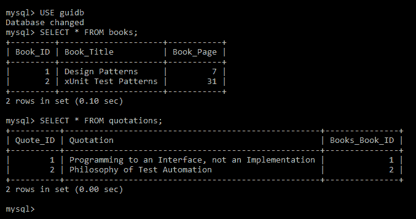

让我们深入了解代码，以更好地理解它。

# 工作原理...

`GUI_MySQL_class.py`代码创建数据库，向其中添加表，然后向两个我们创建的表中插入数据。

在这里，我们概述了代码，而没有展示所有实现细节，以节省空间，因为展示整个代码需要太多页面。

我们创建了一个 MySQL 数据库，连接到它，然后创建了两个表，用于存储喜欢的书籍或期刊引文的数据。

我们在两个表中分配了数据，因为引文往往相当长，而书名和书页码非常短。通过这样做，我们可以提高数据库的效率。

在 SQL 数据库语言中，将数据分离到单独的表中称为*规范化*。在使用 SQL 数据库时，你需要做的最重要的事情之一是将数据分离到相关的表中，也称为**关系**。

让我们继续到下一个菜谱。

# 使用 SQL 的`UPDATE`命令

这个菜谱将使用上一个菜谱中的代码，即*使用 SQL 的`INSERT`命令*，更详细地解释它，然后扩展代码以更新数据。

为了更新我们之前插入到 MySQL 数据库表中的数据，我们需要使用 SQL 的`UPDATE`命令。

# 准备工作

这个菜谱建立在之前的菜谱*使用 SQL 的`INSERT`命令*的基础上，所以请阅读并学习之前的菜谱，以便跟随这个菜谱中的代码，我们将修改现有数据。

# 如何做到这一点...

让我们看看我们如何使用`SQL UPDATE`命令：

1.  首先，我们将通过运行以下 Python 到 MySQL 命令来显示要修改的数据。然后，我们按顺序执行以下步骤：

    1.  打开`GUI_MySQL_class.py`。

    1.  看看`showData`方法：

```py
import mysql.connector 
import Ch07_Code.GuiDBConfig as guiConf 

class MySQL(): 
    # class variable 
    GUIDB  = 'GuiDB' 
    #------------------------------------------------------ 
    def showData(self): 
        # connect to MySQL 
        conn, cursor = self.connect()

        self.useGuiDB(cursor)

        # execute command 
        cursor.execute("SELECT * FROM books") 
        print(cursor.fetchall()) 

        cursor.execute("SELECT * FROM quotations") 
        print(cursor.fetchall()) 

        # close cursor and connection 
        self.close(cursor, conn) 
#========================================================== 
if __name__ == '__main__':
    # Create class instance 
    mySQL = MySQL() 
    mySQL.showData()
```

1.  运行前面的代码给出了以下输出：


1.  看看`updateGOF`方法：

```py
#------------------------------------------------------ 
def updateGOF(self): 
    # connect to MySQL 
    conn, cursor = self.connect()    
    self.useGuiDB(cursor)       
    # execute command 
    cursor.execute("SELECT Book_ID FROM books WHERE Book_Title = 
    'Design Patterns'") 
    primKey = cursor.fetchall()[0][0] 
    print("Primary key=" + str(primKey)) 
    cursor.execute("SELECT * FROM quotations WHERE Books_Book_ID = 
    (%s)", (primKey,)) 
    print(cursor.fetchall()) 
    # close cursor and connection 
        self.close(cursor, conn)  
#========================================================== 
if __name__ == '__main__':  
    mySQL = MySQL()          # Create class instance 
    mySQL.updateGOF()
```

1.  运行位于`GUI_MySQL_class.py`中的方法：

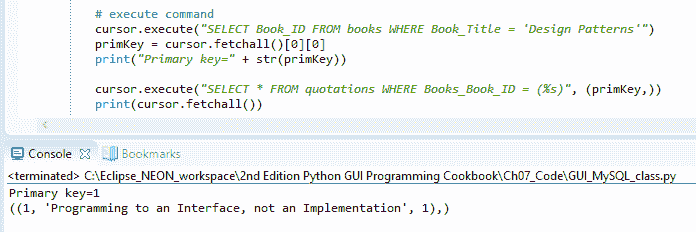

1.  添加以下代码并运行：

```py
#------------------------------------------------------ 
def showDataWithReturn(self): 
    # connect to MySQL 
    conn, cursor = self.connect()    

    self.useGuiDB(cursor)       

    # execute command 
    cursor.execute("SELECT Book_ID FROM books WHERE Book_Title = 
    'Design Patterns'") 
    primKey = cursor.fetchall()[0][0] 
    print(primKey) 

    cursor.execute("SELECT * FROM quotations WHERE Books_Book_ID = 
    (%s)", (primKey,)) 
    print(cursor.fetchall()) 

    cursor.execute("UPDATE quotations SET Quotation = 
    (%s) WHERE Books_Book_ID = (%s)",  
    ("Pythonic Duck Typing: If it walks like a duck and 
    talks like a duck it probably is a duck...", 
    primKey)) 

    # commit transaction 
    conn.commit () 

    cursor.execute("SELECT * FROM quotations WHERE Books_Book_ID = 
    (%s)", (primKey,)) 
    print(cursor.fetchall()) 

    # close cursor and connection 
    self.close(cursor, conn) 

#========================================================== 
if __name__ == '__main__':  
    # Create class instance 
    mySQL = MySQL() 
    #------------------------ 
    mySQL.updateGOF() 
    book, quote = mySQL.showDataWithReturn()     
    print(book, quote)
```

1.  打开 MySQL 客户端窗口并运行`SELECT *`语句：

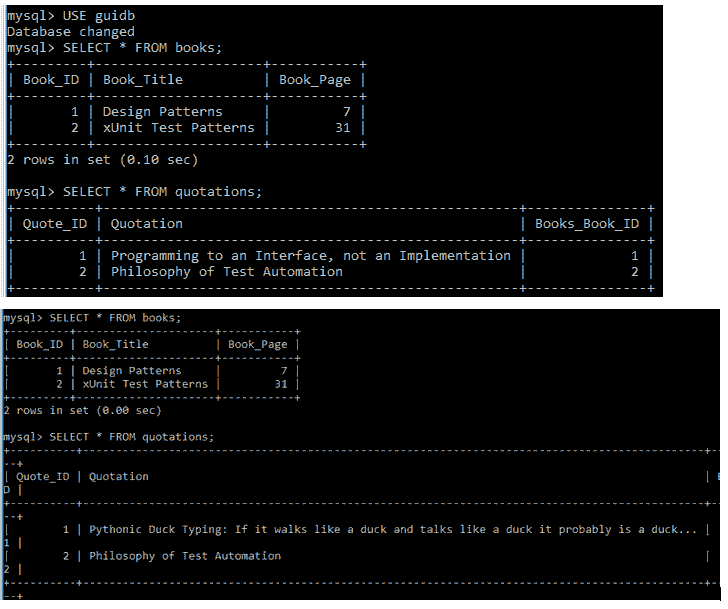

让我们深入了解代码以更好地理解它。

# 它是如何工作的...

首先，我们打开了`GUI_MySQL_class.py`文件或者在我们自己的模块中输入显示的代码并运行它。

我们可能不同意**四人帮**的观点，所以让我们改变他们著名的编程名言。

四人帮是四位创建了世界著名的《设计模式》这本书的作者，这本书强烈影响了我们整个软件行业，使我们认识到、思考和用软件*设计模式*进行编码。

我们通过更新我们最喜欢的引言数据库来做到这一点。首先，我们通过搜索书名来检索主键值。然后，我们将该值传递到我们的引言搜索中。

现在我们知道了引言的主键，我们可以通过执行 SQL 的`UPDATE`命令来更新引言。

在运行代码之前，我们的`Book_ID = 1`的标题通过一个*主键*与引言表中的`Books_Book_ID`列的*外键*关系相关联。这是来自*设计模式*书的原始引言。

在*步骤 5*中，我们通过 SQL 的`UPDATE`命令更新了与该 ID 相关的引言。

没有 ID 发生变化，但现在与`Book_ID = 1`关联的引言已经改变，如第二个 MySQL 客户端窗口所示。

在这个菜谱中，我们从数据库中检索了我们之前菜谱中创建的数据库表中的现有数据。我们使用 SQL 的`UPDATE`命令向表中插入数据并更新我们的数据。

让我们继续到下一个菜谱。

# 使用 SQL DELETE 命令

在这个菜谱中，我们将使用 SQL `DELETE`命令来删除之前在*使用 SQL UPDATE 命令*中创建的数据。

打开`GUI_MySQL_class.py`并查看`def createTables(self): ...`：

它是如何工作的…

# 虽然删除数据一开始可能看起来很简单，但一旦我们在生产环境中有一个相当大的数据库设计，事情可能就不会那么简单了。

这个菜谱使用了 MySQL 数据库、表以及之前菜谱中插入到这些表中的数据，*使用 SQL UPDATE 命令*。为了演示如何创建孤立记录，我们不得不更改我们数据库中的一个表的设计。

故意将设计改为糟糕的设计只是为了演示目的，并不是设计数据库的推荐方式。

# 如何操作…

在将数据插入到`books`和`quotations`表之后，如果我们执行一个`DELETE`语句，我们只删除了`Book_ID = 1`的书籍，而与之相关的`Books_Book_ID = 1`的引文却被留下了。

1.  让我们深入了解代码以更好地理解它。

```py
# create second Table inside DB --  
# No FOREIGN KEY relation to Books Table 
cursor.execute("CREATE TABLE Quotations (  
    Quote_ID INT AUTO_INCREMENT,       
    Quotation VARCHAR(250),            
    Books_Book_ID INT,                 
    PRIMARY KEY (Quote_ID)             
) ENGINE=InnoDB")
```

1.  执行以下 SQL 命令：

```py
cursor.execute("DELETE FROM books WHERE Book_ID = 1")
```

1.  执行以下两个`SELECT *`命令：

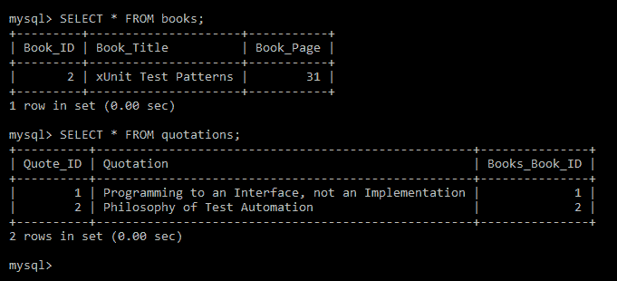

1.  因为我们通过将两个表通过*主键到外键关系*关联起来设计了我们的 GUI 数据库，当我们删除某些数据时，我们不会得到孤立记录，因为这种数据库设计会处理*级联删除*。

```py
# create second Table inside DB 
cursor.execute("CREATE TABLE Quotations (  
    Quote_ID INT AUTO_INCREMENT,       
    Quotation VARCHAR(250),            
    Books_Book_ID INT,                 
    PRIMARY KEY (Quote_ID),            
    FOREIGN KEY (Books_Book_ID)        
    REFERENCES Books(Book_ID)      
    ON DELETE CASCADE              
) ENGINE=InnoDB")

#========================================================== 
if __name__ == '__main__':  
    # Create class instance 
    mySQL = MySQL() 
    mySQL.showData()
```

1.  执行`showData()`方法：


1.  执行`deleteRecord()`方法，然后执行`showData()`方法：

```py
import mysql.connector
import Ch07_Code.GuiDBConfig as guiConf 

class MySQL(): 
    #------------------------------------------------------ 
    def deleteRecord(self): 
        # connect to MySQL 
        conn, cursor = self.connect()    

        self.useGuiDB(cursor)       

        # execute command 
        cursor.execute("SELECT Book_ID FROM books WHERE Book_Title = 
        'Design Patterns'") 
        primKey = cursor.fetchall()[0][0] 
        # print(primKey) 

        cursor.execute("DELETE FROM books WHERE Book_ID = (%s)",
        (primKey,)) 

        # commit transaction 
        conn.commit () 

        # close cursor and connection 
        self.close(cursor, conn)     
#========================================================== 
if __name__ == '__main__':  
    # Create class instance 
    mySQL = MySQL() 
    #------------------------ 
    mySQL.deleteRecord() 
    mySQL.showData()
```

1.  上述代码将产生以下输出：


我们通过仅使用两个数据库表来保持我们的数据库设计简单。

# 如果我们不将`quotations`表与`books`表建立外键关系，我们可能会得到孤立记录。请看以下步骤：

准备工作

当我们删除数据时，虽然这看起来很简单，但如果我们有一个相当大的数据库设计在生产环境中，事情可能不会那么简单。

打开`GUI_MySQL_class.py`并查看`def createTablesNoFK(self): ...`：

这是一个 **孤立的记录**。一本`Book_ID`为`1`的书籍记录已不再存在。

这种情况可能会导致 **数据损坏**，我们可以通过使用 **级联** 删除来避免这种情况。

我们在创建表时通过添加某些数据库 **约束** 来防止这种情况。当我们创建之前菜谱中保存引文的`quotations`表时，我们创建了一个带有 **外键** **约束** 的`quotations`表，该约束明确引用了书籍表的 **主键**，将两者联系起来。

`FOREIGN KEY`关系包括`ON DELETE CASCADE`属性，这基本上告诉我们的 MySQL 服务器，当与这个外键相关的记录被删除时，要删除此表中的相关记录。

由于这种设计，不会留下任何*孤立的*记录，这正是我们想要的。

在 MySQL 中，我们必须在相关的两个表中指定`ENGINE=InnoDB`，才能使用*主键*与*外键*关系。

`showData()`方法显示我们有两条记录，它们通过*主键*与*外键*关系相关联。

当我们现在在`books`表中删除一条记录时，我们期望`quotations`表中的相关记录也会通过级联删除被删除。

执行删除和显示记录的命令后，我们得到了新的结果。

我们最喜欢的引言数据库中的著名设计模式已经消失了。这只是一个玩笑——我个人非常重视著名的设计模式。然而，Python 的*鸭子类型*确实是一个非常酷的特性！

通过通过设计我们的数据库，通过*主键*到*外键*关系以及*级联删除*，我们在这个菜谱中触发了*级联*删除。

这保持了我们的数据健全和完整。

在下一个菜谱中，我们将使用我们的 Python GUI 中的`GUI_MySQL_class.py`模块的代码。

# 从我们的 MySQL 数据库存储和检索数据

我们将使用我们的 Python GUI 将数据插入到我们的 MySQL 数据库表中。我们已经重构了在之前的菜谱中构建的 GUI，为连接和使用数据库做准备。

我们将使用两个文本框输入控件，我们可以在这里输入书籍或期刊的标题和页码。我们还将使用一个`ScrolledText`控件来输入我们喜欢的书籍引言，然后将其存储在我们的 MySQL 数据库中。

# 准备工作

这个菜谱将基于我们在本章前面的菜谱中创建的 MySQL 数据库和表。

# 如何做…

我们将使用我们的 Python GUI 插入、检索和修改我们最喜欢的引言。我们重构了 GUI 的 MySQL 标签，为连接和使用数据库做准备。让我们看看我们如何处理这个问题：

1.  打开`GUI_MySQL.py`。

1.  运行此文件中的代码显示我们的 GUI：

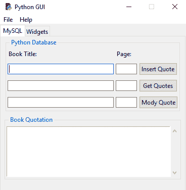

1.  打开`GUI_MySQL.py`。

1.  注意这里显示的`insertQuote()`方法：

```py
    # Adding a Button 
    self.action = ttk.Button(self.mySQL, text="Insert Quote", 
    command=self.insertQuote)    
    self.action.grid(column=2, row=1) 

# Button callback 
def insertQuote(self): 
    title = self.bookTitle.get() 
    page = self.pageNumber.get() 
    quote = self.quote.get(1.0, tk.END) 
    print(title) 
    print(quote) 
    self.mySQL.insertBooks(title, page, quote)
```

1.  运行`GUI_MySQL.py`，输入一个引言，然后点击插入引言按钮：


1.  点击获取引言：

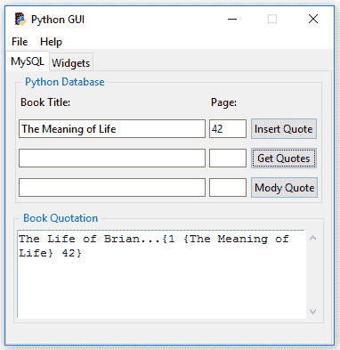

1.  打开`GUI_MySQL.py`并查看`getQuote`方法和按钮：

```py
# Adding a Button 
    self.action1 = ttk.Button(self.mySQL, text="Get Quotes", 
    command=self.getQuote)    
    self.action1.grid(column=2, row=2) 

# Button callback 
def getQuote(self): 
    allBooks = self.mySQL.showBooks()   
    print(allBooks) 
    self.quote.insert(tk.INSERT, allBooks)
```

1.  打开`GUI_MySQL.py`并查看`self.mySQL`和`showBooks()`：

```py
from Ch07_Code.GUI_MySQL_class import MySQL
class OOP(): 
    def __init__(self): 
        # create MySQL instance 
        self.mySQL = MySQL() 

class MySQL(): 
    #------------------------------------------------------ 
    def showBooks(self): 
        # connect to MySQL 
        conn, cursor = self.connect()     

        self.useGuiDB(cursor)     

        # print results 
        cursor.execute("SELECT * FROM Books") 
        allBooks = cursor.fetchall() 
        print(allBooks) 

        # close cursor and connection 
        self.close(cursor, conn)    

        return allBooks
```

让我们回顾一下这个菜谱是如何工作的。

# 它是如何工作的…

为了让`GUI_MySQL.py`中的按钮执行某些操作，我们将它们连接到*回调函数*，就像我们在本书中多次做的那样。我们在按钮下方显示`ScrolledText`控件中的数据。

为了做到这一点，我们导入了 `GUI_MySQL_class.py` 模块。与我们的 MySQL 服务器实例和数据库通信的所有代码都驻留在该模块中，这是一种在**面向对象编程**（**OOP**）精神中**封装**代码的形式。

我们将“插入引文”按钮连接到 `insertQuote()` 方法回调。

当我们运行我们的代码时，我们可以将我们的 Python GUI 中的数据插入到我们的 MySQL 数据库中。

在输入书名、书页以及书中的引文后，我们通过点击“插入引文”按钮将数据*插入*到我们的数据库中。

我们当前的设计允许标题、页码和引文。我们还可以插入我们喜欢的电影引文。虽然电影没有页码，但我们可以使用页码列来插入引文在电影中发生的大致时间。

在插入数据后，我们通过点击“获取引文”按钮来验证它是否已进入我们的两个 MySQL 表，然后显示了我们在两个 MySQL 数据库表中插入的数据，如*步骤 6*中的截图所示。

点击“获取引文”按钮将调用我们与按钮点击事件关联的回调方法。这为我们提供了我们在 `ScrolledText` 小部件中显示的数据。

我们使用 `self.mySQL` 类实例属性来调用 `showBooks()` 方法，这是我们在导入的 `MySQL` 类中的一部分。

在这个食谱中，我们导入了我们编写的 Python 模块，其中包含我们连接到 MySQL 数据库所需的全部编码逻辑。它也知道如何插入、更新和删除数据。

现在，我们已经将我们的 Python GUI 连接到这个 SQL 逻辑。

让我们继续下一个食谱。

# 使用 MySQL Workbench

MySQL 提供了一个非常棒的免费 GUI，我们可以下载。它被称为**MySQL Workbench**。

在这个食谱中，我们将成功安装 Workbench，然后使用它来运行针对我们在之前的食谱中创建的 GuiDB 的 SQL 查询。

# 准备工作

为了使用这个食谱，你需要我们在之前的食谱中开发的 MySQL 数据库。你还需要一个正在运行的 MySQL 服务器。

# 如何操作…

我们可以从官方 MySQL 网站下载 MySQL Workbench：[`dev.mysql.com/downloads/workbench/`](https://dev.mysql.com/downloads/workbench/).

让我们看看我们如何执行这个食谱：

1.  下载 MySQL Workbench 安装程序。

1.  点击“下载”按钮：


1.  运行安装：

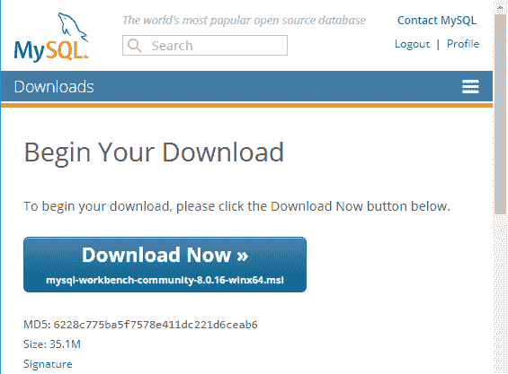

1.  点击“下一步 >”直到安装完成：


1.  打开 MySQL Workbench：


1.  选择我们的 `guidb`：

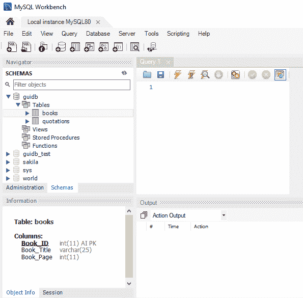

1.  编写并执行一些 SQL 命令：

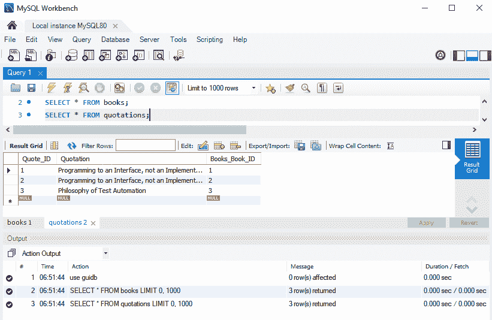

让我们深入了解代码以更好地理解它。

# 它是如何工作的…

当您安装 MySQL 时，如果您已经在您的 PC 上安装了所需的组件，您可能已经安装了 MySQL Workbench。如果您没有安装 Workbench，*步骤 1* 到 *3* 将向您展示如何安装 MySQL Workbench。

MySQL Workbench 本身就是一个图形用户界面，与我们在前面的菜谱中开发的非常相似。它确实包含了一些特定于与 MySQL 一起工作的附加功能。安装窗口中的 `8.0 CE` 是版本 **8.0 社区版** 的缩写。

当您启动 MySQL Workbench 时，它将提示您连接。使用您为其创建的 **root** 用户和密码。MySQL Workbench 足够智能，能够识别您正在运行 MySQL 服务器以及它监听的端口。

一旦成功登录到您的 MySQL 服务器实例，您可以选择我们创建的 `guidb`。

我们可以在 **SCHEMAS** 标签下找到我们的 `guidb`。

在某些文献和产品中，数据库通常被称为 **SCHEMAS**。图示指的是数据库的结构和布局。我个人来自 Microsoft SQL Server，习惯于简单地称它们为 **数据库**。

我们可以在查询编辑器中输入 SQL 命令，并通过点击闪电图标来执行我们的命令。它位于右上角，如以下截图所示：


我们可以在结果网格中看到结果。我们可以点击不同的选项卡来查看不同的结果。

现在，我们可以通过 MySQL Workbench 图形用户界面连接到我们的 MySQL 数据库。我们可以执行之前发出的相同 SQL 命令，并获得与我们在 Python 图形用户界面中执行它们时相同的结果。

# 还有更多...

通过在本章和前几章的菜谱中获得的全部知识，我们现在已经准备好创建自己的 Python 编写的 GUI，所有这些 GUI 都可以连接并与 MySQL 数据库进行通信。
