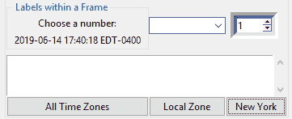

# 第八章：国际化和测试

在本章中，我们将通过在标签、按钮、标签页和其他小部件上显示不同语言的文本来国际化我们的 GUI。我们将从简单开始，然后探讨我们如何在设计层面为国际化准备我们的 GUI。

我们还将*本地化*GUI，这与国际化略有不同。

由于这些单词很长，它们已经被缩写为使用单词的第一个字母，然后是第一个和最后一个字母之间的总字符数，最后是单词的最后一个字母。因此，**国际化**变为**I18N**，**本地化**变为**L10N**。

我们还将测试我们的 GUI 代码，编写单元测试，并探索单元测试在我们开发努力中的价值，这将引导我们到重构代码的最佳实践。

没有额外的 Python 包需要安装。我们用 Python 编写自己的代码，单元测试框架是 Python 自带的，所以我们可以简单地导入它。

了解如何国际化并测试我们的代码是每个程序员都需要掌握的基本技能。

在本章中，你将获得测试、重构和国际化等宝贵技能。

下面是本章 Python 模块的概述：


我们将国际化并测试我们的 Python GUI，涵盖以下菜谱：

+   在不同语言中显示小部件文本

+   一次性更改整个 GUI 语言

+   本地化 GUI

+   为国际化准备 GUI

+   如何以敏捷的方式设计 GUI

+   我们是否需要测试 GUI 代码？

+   设置调试监视器

+   配置不同的调试输出级别

+   使用 Python 的`__main__`部分创建自测试代码

+   使用单元测试创建健壮的 GUI

+   如何使用 Eclipse PyDev **集成开发环境**（**IDE**）编写单元测试

# 在不同语言中显示小部件文本

在 Python 中将文本字符串国际化最简单的方法是将它们移动到单独的 Python 模块中，然后通过传递一个参数给这个模块来选择 GUI 中要显示的语言。

根据在线搜索结果，这种方法并不特别推荐，但根据你正在开发的应用程序的具体要求，它可能仍然是实现起来最实用和最快的方法。

# 准备工作

我们将重用我们在第七章，“通过我们的 GUI 将数据存储到我们的 MySQL 数据库中”中创建的 Python GUI。我们将注释掉一行创建 MySQL 标签的 Python 代码，因为我们在这个章节中不与 MySQL 数据库交互。

# 如何操作...

在这个菜谱中，我们将通过更改窗口标题为其他语言来开始我们 GUI 的 I18N。

由于 *GUI* 在其他语言中名称相同，我们将首先扩展名称，以便我们可以看到我们更改的视觉效果。现在让我们详细查看步骤：

1.  打开上一章（第七章，*通过我们的 GUI 在我们的 MySQL 数据库中存储数据*）中的 `GUI_MySQL.py` 并将其保存为 `GUI.py`。

以下是我们之前的代码行：

```py
self.win.title("Python GUI")
```

1.  让我们将此更改为以下代码。同时，注释掉创建 MySQL 标签的代码：

```py
self.win.title("Python Graphical User Interface")     # new window title 
# self.mySQL = MySQL()                                # comment this line out
```

1.  前面的代码更改导致我们的 GUI 程序的以下标题：


请注意，在本章中，我们将使用英语和德语来举例说明国际化我们的 Python GUI 的原则。

1.  让我们创建一个新的 Python 模块，并将其命名为 `LanguageResources.py`。接下来，我们将我们的 GUI 标题的英文字符串移动到这个模块中，并创建一个德语版本。

1.  添加以下代码：

```py
class I18N(): 
    '''Internationalization''' 
    def __init__(self, language): 
        if    language == 'en': self.resourceLanguageEnglish() 
        elif  language == 'de': self.resourceLanguageGerman() 
        else: raise NotImplementedError('Unsupported language.') 

    def resourceLanguageEnglish(self): 
        self.title = "Python Graphical User Interface" 

    def resourceLanguageGerman(self): 
        self.title = 'Python Grafische Benutzeroberflaeche'
```

1.  导入 `I18N` 类并将语言更改为 `'de'`：

```py
from Ch08_Code.LanguageResources import I18N 
class OOP(): 
    def __init__(self, language='en'):  
        self.win = tk.Tk()                # Create instance 
        self.i18n = I18N('de')            # Select different language 
        self.win.title(self.i18n.title)   # Add a title using self.i18n
```

1.  运行前面的代码，我们现在得到以下国际化结果：


现在，让我们幕后了解代码，以便更好地理解。

# 它是如何工作的…

从第 4 步开始，我们将 GUI 中作为其一部分的硬编码字符串分离到它们自己的单独模块 `LanguageResources.py` 中。在类的 `__init__()` 方法中，我们根据传入的语言参数选择 GUI 将显示哪种语言。然后我们将 `LanguageResources.py` 模块导入到我们的面向对象类模块中。

我们将默认语言设置为 `'en'`，这意味着英语。

在 `GUI.py` 中，我们正在创建 `I18N` 类的一个实例。这个类位于 `LanguageResources.py` 中，因此我们类的名称更短，与 Python 模块的名称不同。我们将选定的语言保存在类的实例属性 `self.i18n` 中，并使用它来显示标题。我们正在将 GUI 与其显示的语言分离，这是一个面向对象的设计原则。

我们可以通过将国际化字符串分离到单独的文件中进一步模块化我们的代码，这些文件可能是 XML 或其他格式。我们也可以从 MySQL 数据库中读取它们。

这是一个 **关注点分离**（**SoC**）的编码方法，这是面向对象编程的核心。

# 一次性更改整个 GUI 语言

在这个示例中，我们将通过重构所有之前硬编码的英文字符串到一个单独的 Python 模块中，然后国际化这些字符串，一次性更改所有 GUI 显示名称。

这个示例表明，避免硬编码任何字符串，这些字符串是我们 GUI 显示的，将 GUI 代码与 GUI 显示的文本分离，是一个好的设计原则。

以模块化方式设计我们的 GUI 使得国际化它变得容易得多。

# 准备工作

我们将继续使用之前菜谱中的 GUI，即`GUI.py`。在那个菜谱中，我们已经国际化了 GUI 的标题。我们还将增强之前菜谱中的`LanguageResources.py`模块，通过添加更多的国际化字符串。

# 如何做到这一点...

为了国际化所有 GUI 小部件中显示的文本，我们必须将所有硬编码的字符串移动到一个单独的 Python 模块中，这就是我们接下来要做的：

1.  打开`LanguageResources.py`模块。

1.  为英文国际化字符串添加以下代码：

```py
class I18N(): 
'''Internationalization''' 
    def __init__(self, language): 
        if   language == 'en': self.resourceLanguageEnglish() 
        elif language == 'de': self.resourceLanguageGerman() 
        else: raiseNotImplementedError('Unsupported language.') 

    def resourceLanguageEnglish(self): 
        self.title = "Python Graphical User Interface" 

        self.file  = "File" 
        self.new   = "New" 
        self.exit  = "Exit" 
        self.help  = "Help" 
        self.about = "About" 

        self.WIDGET_LABEL = ' Widgets Frame ' 

        self.disabled  = "Disabled" 
        self.unChecked = "UnChecked" 
        self.toggle    = "Toggle" 

        # Radiobutton list 
        self.colors   = ["Blue", "Gold", "Red"] 
        self.colorsIn = ["in Blue", "in Gold", "in Red"] 

        self.labelsFrame  = ' Labels within a Frame ' 
        self.chooseNumber = "Choose a number:" 
        self.label2       = "Label 2" 

        self.mgrFiles = ' Manage Files ' 

        self.browseTo = "Browse to File..." 
        self.copyTo   = "Copy File To :   "
```

1.  在 Python 的`GUI.py`模块中，将所有硬编码的字符串替换为我们的新`I18N`类的一个实例，例如，`self.i18n.colorsIn`：

```py
from Ch08_Code.LanguageResources import I18N
class OOP(): 
    def __init__(self, language='en'):  
        self.win = tk.Tk()              # Create instance 
        self.i18n = I18N('de')          # Select language 
        self.win.title(self.i18n.title) # Add a title 

    # Radiobutton callback function 
    def radCall(self): 
        radSel = self.radVar.get() 
        if   radSel == 0: self.widgetFrame.configure(text=
                          self.i18n.WIDGET_LABEL + 
                          self.i18n.colorsIn[0]) 
        elif radSel == 1: self.widgetFrame.configure(text=
                          self.i18n.WIDGET_LABEL + 
                          self.i18n.colorsIn[1]) 
        elif radSel == 2: self.widgetFrame.configure(text=
                          self.i18n.WIDGET_LABEL + 
                          self.i18n.colorsIn[2])
```

我们现在可以通过简单地填写相应的单词来变量名来实现对德语的翻译。

1.  将以下代码添加到`LanguageResources.py`：

```py
class I18N(): 
    '''Internationalization''' 
    def __init__(self, language):       
        if   language == 'en': self.resourceLanguageEnglish() 
        elif language == 'de': self.resourceLanguageGerman() 
        else: raise NotImplementedError('Unsupported language.') 

    def resourceLanguageGerman(self): 
        self.file  = "Datei" 
        self.new   = "Neu" 
        self.exit  = "Schliessen" 
        self.help  = "Hilfe" 
        self.about = "Ueber" 

        self.WIDGET_LABEL = ' Widgets Rahmen ' 

        self.disabled  = "Deaktiviert" 
        self.unChecked = "Nicht Markiert" 
        self.toggle    = "Markieren" 

        # Radiobutton list 
        self.colors   = ["Blau", "Gold", "Rot"]     
        self.colorsIn = ["in Blau", "in Gold", "in Rot"]   

        self.labelsFrame  = ' Etiketten im Rahmen ' 
        self.chooseNumber = "Waehle eine Nummer:" 
        self.label2       = "Etikette 2" 

        self.mgrFiles = ' Dateien Organisieren ' 

        self.browseTo = "Waehle eine Datei... " 
        self.copyTo   = "Kopiere Datei zu :   "
```

1.  在我们的 GUI 代码中，我们现在可以用一行 Python 代码更改整个 GUI 显示的语言：

```py
classOOP(): 
    def __init__(self, language='en'):  
        self.win = tk.Tk()        # Create instance 
        self.i18n = I18N('de')    # Pass in language
```

1.  运行前面的代码创建以下国际化的 GUI：


现在我们来看看这个菜谱是如何工作的！

# 它是如何工作的...

为了国际化我们的图形用户界面（GUI），我们将硬编码的字符串重构到一个单独的模块中，然后通过将字符串传递给我们的`I18N`类的初始化器，使用相同的类实例属性来国际化我们的 GUI，从而有效地控制 GUI 显示的语言。

注意，之前所有硬编码的英文字符串都已被替换为对新的`I18N`类实例的调用。一个例子是`self.win.title(self.i18n.title)`。

这为我们提供了国际化 GUI 的能力。我们只需使用相同的变量名，并通过传递参数来组合它们，以选择我们希望显示的语言。

我们可以在 GUI 中动态更改语言，或者我们可以读取本地 PC 设置，并根据这些设置决定我们的 GUI 文本应该显示哪种语言。如何读取本地设置的示例将在下一个菜谱中介绍，*本地化 GUI*。

之前，每个小部件的每一行字符串，包括我们 GUI 的标题、标签控件名称等，都是硬编码的，并且与创建 GUI 的代码混合在一起。

在我们的 GUI 软件开发过程的设计阶段考虑如何最好地国际化我们的 GUI 是一个好主意。

在这个菜谱中，我们国际化了 GUI 小部件中显示的所有字符串。我们不会国际化输入到 GUI 中的文本，因为这取决于您 PC 上的本地设置。

# 本地化 GUI

在我们的 GUI 国际化第一步之后，下一步是*本地化*它。我们为什么要这样做呢？

嗯，在这里的美国，我们都是牛仔，我们生活在不同的时区。

当我们国际化到美国时，我们的马匹在不同的时区醒来（并且确实期望根据自己的内在马时区时间表被喂食）。

这就是*本地化*的作用。

# 准备工作

我们通过本地化扩展了我们之前开发的 GUI。

# 如何操作...

让我们看看如何执行这个食谱：

1.  我们首先使用`pip`安装 Python 的`pytz`时区模块。

1.  接下来，打开命令提示符并输入以下命令：

```py
pip install pytz
```

1.  安装成功后，我们得到以下结果：


1.  接下来，我们在`GUI.py`中添加一个新的`Button`小部件。我们可以通过运行以下代码列出所有现有时区，该代码将时区添加到我们的`ScrolledText`小部件中，如下所示：

```py
import pytz 
class OOP():  
    # TZ Button callback 
    def allTimeZones(self): 
        for tz in pytz.all_timezones: 
            self.scr.insert(tk.INSERT, tz + '\n') 

    def createWidgets(self): 
        # Adding a TZ Button 
        self.allTZs = ttk.Button(self.widgetFrame,  
                                 text=self.i18n.timeZones,  
                                 command=self.allTimeZones) 
        self.allTZs.grid(column=0, row=9, sticky='WE')
```

1.  点击我们新的`Button`小部件，结果如下输出：


1.  使用`pip`安装`tzlocal` Python 模块，然后我们可以通过添加`localZone`方法并将其连接到新的`Button`命令来显示我们的当前区域设置：

```py
# TZ Local Button callback 
def localZone(self):    
    from tzlocal import get_localzone 
    self.scr.insert(tk.INSERT, get_localzone()) 

def createWidgets(self): 
    # Adding local TZ Button 
    self.localTZ = ttk.Button(self.widgetFrame, 
    text=self.i18n.localZone, command=self.localZone 
    self.localTZ.grid(column=1, row=9, sticky='WE')
```

我们在`LanguageResources.py`中国际化了我们两个新按钮的字符串。

英文版本如下：

```py
self.timeZones = "All Time Zones" 
self.localZone = "Local Zone"
```

德语版本如下：

```py
self.timeZones = "Alle Zeitzonen" 
self.localZone = "Lokale Zone"
```

点击我们新的按钮现在告诉我们我们所在的时区（嘿，我们不知道这个，对吧…）：


1.  我们现在可以通过首先将其转换为**协调世界时**（**UTC**）然后应用导入的`pytz`模块中的时区函数来将本地时间更改为美国东部标准时间（US EST）。接下来，将以下代码添加到`GUI.py`中：

```py
import pytz 
class OOP(): 
    # Format local US time with TimeZone info 
    def getDateTime(self): 
        fmtStrZone = "%Y-%m-%d %H:%M:%S %Z%z" 
        # Get Coordinated Universal Time 
        utc = datetime.now(timezone('UTC')) 
        print(utc.strftime(fmtStrZone)) 

        # Convert UTC datetime object to Los Angeles TimeZone 
        la = utc.astimezone(timezone('America/Los_Angeles')) 
        print(la.strftime(fmtStrZone)) 

        # Convert UTC datetime object to New York TimeZone 
        ny = utc.astimezone(timezone('America/New_York')) 
        print(ny.strftime(fmtStrZone)) 

        # update GUI label with NY Time and Zone 
        self.lbl2.set(ny.strftime(fmtStrZone))        # <-- set Label 2
```

1.  点击现在重命名为纽约的按钮，结果在 GUI 左上角的标签 2 中如下输出：



1.  注意控制台中的以下输出：


让我们在下一节学习这个食谱。

# 它是如何工作的…

首先，我们使用`pip`安装了 Python 的`pytz`模块。

在这本书中，我们使用的是内置`pip`模块的 Python 3.7。如果您使用的是较旧版本的 Python，那么您可能首先需要安装`pip`模块。

第 2 步的截图显示`pip`命令下载了`.whl`格式。如果您尚未这样做，您可能还需要安装 Python 的 wheel 模块。

这将 Python 的`pytz`模块安装到`site-packages`文件夹中，因此现在我们可以从我们的 Python GUI 代码中导入此模块。

为了本地化日期和时间信息，我们首先需要将本地时间转换为 UTC 时间。然后应用时区信息，并使用从导入的`pytz` Python 时区模块中的`astimezone`函数将时间转换为全球任何时区！

我们使用`pip`安装了 Python 的`tzlocal`模块，现在我们可以将本地时间转换为不同的时区。我们以美国东部标准时间（US EST）为例。

在第 8 步中，我们将美国西海岸的本地时间转换为 UTC，然后在 GUI 的标签 2（`self.lbl2`）中显示美国东部时间。

同时，我们正在将洛杉矶和纽约的 UTC 时间及其相应的时间区域转换相对于 UTC 时间打印到控制台，使用的是美国日期格式字符串。

UTC 从不观察**夏令时**（**DST**）。在**东部夏令时**（**EDT**）期间，UTC 比本地时间快四小时，而在标准时间（**EST**）期间，UTC 比本地时间快五小时。

# 准备 GUI 进行国际化

在这个配方中，我们将通过实现以下事实来为我们的 GUI 进行国际化准备：当将英语翻译成外语时，并非所有事情都像预期的那样简单。

我们仍然有一个问题要解决，那就是如何正确显示来自外语的非英语 Unicode 字符。

你可能会期望显示德语的ä、ö和ü Unicode 重音字符会由 Python 3.7 自动处理，但这并不是事实。

# 准备就绪

我们将继续使用我们在最近章节中开发的 Python GUI。首先，我们将更改 `GUI.py` 初始化代码中的默认语言为德语。

这个配方可能特定于 Eclipse PyDev IDE，但将其视为一个例子是很好的。

# 如何做到这一点...

在深入配方之前，我们应该知道，当我们使用重音符号将单词 "Ueber" 更改为正确的德语单词 "Űber" 时，Eclipse PyDev 插件并不太高兴。

让我们现在按顺序查看这个配方的步骤：

1.  打开 `GUI.py`。

1.  取消注释行 `self.i18n = I18N('de')` 以使用德语。

1.  运行 `GUI.py`:


1.  我们得到一个错误消息，这有点令人困惑，因为当我们从 Eclipse PyDev 控制台运行相同的代码行时，我们得到预期的结果：


1.  当我们请求 Python 默认编码时，我们得到预期的结果，即 utf-8：


1.  使用 Windows 内置字符映射表，我们可以找到重音字符的 Unicode 表示，对于大写 **U** 带有重音的是 **U+00DC**：


1.  虽然这个解决方案确实很丑陋，但它确实有效。我们不必输入字面字符 **Ü**，而是可以传递 **U+00DC** 的 Unicode 来正确地在我们的 GUI 中显示这个字符：


1.  我们也可以接受使用 Eclipse PyDev 将默认编码从 Cp1252 更改为 UTF-8 的改变，但我们可能不会总是得到提示去做。

相反，我们可能会看到以下错误消息显示：


1.  解决这个问题的方法是更改 PyDev 项目的文本文件编码设置到 UTF-8：


1.  在更改 PyDev 默认编码后，我们现在可以显示那些德语的重音字符。我们还更新了标题，使用正确的德语ä字符，`GUI_.py`：


让我们现在幕后了解代码。

# 它是如何工作的…

国际化和处理外文 Unicode 字符通常不像我们希望的那样简单直接。

有时候，我们需要找到解决方案，通过 Python 使用`\u`前缀直接表示 Unicode 字符可以解决这个问题。

Windows 内置字符映射表显示“`U+00DC`”，我们将其转换为 Python 中的`"\u00DC"`。

我们总是可以求助于 Unicode 的直接表示。

在其他时候，我们只需要找到我们的开发环境的设置来调整。我们看到了如何使用 Eclipse IDE 来完成这个任务的例子。

# 如何以敏捷的方式设计 GUI

现代敏捷软件开发的设计和编码方法源于软件专业人士的经验教训。这种方法适用于 GUI，也适用于任何其他代码。敏捷软件开发的一个主要关键是持续进行的重构过程。

代码重构如何帮助我们进行软件开发工作的一个实际例子是首先通过函数实现一些简单的功能。

随着我们的代码复杂性增加，我们可能希望将我们的函数重构为类的成员方法。这种方法将使我们能够删除全局变量，并且可以在类内部更灵活地放置方法。

虽然我们的代码的功能没有改变，但其结构已经改变了。

在这个过程中，我们编写代码、测试、重构，然后再测试。我们在短周期内这样做，通常从实现某些功能所需的最小代码开始。

测试驱动软件开发是敏捷开发方法中的一种特定风格。

虽然我们的 GUI 运行得很好，但我们的主要`GUI.py`代码的复杂性一直在增加，开始变得有点难以对代码有一个全面的了解。这意味着我们需要重构我们的代码。

# 准备工作

我们将重构在前几章中创建的 GUI。我们将使用 GUI 的英文版本。

# 如何操作…

在上一个菜谱中，当我们国际化 GUI 时，我们已经将 GUI 显示的所有名称都提取出来了。这是重构我们代码的一个很好的开始：

1.  让我们将`GUI.py`文件重命名为`GUI_Refactored.py`。

1.  按照以下方式分组`import`语句：

```py
#====================== 
# imports 
#====================== 
import tkinter as tk 
from tkinter import ttk, scrolledtext, Menu, Spinbox, filedialog as fd, messagebox as mBox
from queue import Queue 
from os import path  
from Ch08_Code.ToolTip import ToolTip 
from Ch08_Code.LanguageResources import I18N
from Ch08_Code.Logger import Logger, LogLevel 

# Module level GLOBALS 
GLOBAL_CONST = 42
```

我们可以通过将回调方法分离到它们自己的模块中来进一步重构我们的代码。

1.  创建一个新的模块，`Callbacks_Refactored.py`。

1.  在`GUI_Refactored.py`中导入`Callbacks`类。

1.  在`Callbacks_Refactored.py`中添加`self.callBacks = Callbacks(self)`：

```py
#====================== 
# imports 
#====================== 
import tkinter as tk 
from tkinter import ttk, scrolledtext, Menu, Spinbox, 
                    filedialog as fd, messagebox as mBox 
from queue import Queue 
from os import path  
import Ch08_Code.ToolTip as tt 
from Ch08_Code.LanguageResources import I18N 
from Ch08_Code.Logger import Logger, LogLevel
from Ch08_Code.Callbacks_Refactored import Callbacks     # <-- import the class

# Module level GLOBALS 
GLOBAL_CONST = 42 

class OOP(): 
    def __init__(self):  
        # Callback methods now in different module 
        self.callBacks = Callbacks(self)                 # <-- pass in self
```

1.  将以下代码添加到`Callbacks`类中：

```py
#====================== 
# imports 
#====================== 
import tkinter as tk 
from time import sleep 
from threading import Thread 
from pytz import all_timezones, timezone 
from datetime import datetime 

class Callbacks(): 
    def __init__(self, oop): 
        self.oop = oop 

    def defaultFileEntries(self):  
        self.oop.fileEntry.delete(0, tk.END) 
        self.oop.fileEntry.insert(0, 'Z:')          # bogus path 
        self.oop.fileEntry.config(state='readonly')          
        self.oop.netwEntry.delete(0, tk.END) 
        self.oop.netwEntry.insert(0, 'Z:Backup')    # bogus path 

    # Combobox callback  
    def _combo(self, val=0): 
        value = self.oop.combo.get() 
        self.oop.scr.insert(tk.INSERT, value + '\n')

    ...
```

让我们现在看看这个菜谱是如何工作的！

# 如何工作…

我们首先通过分组相关的`import`语句来提高了代码的可读性。

通过简单地分组相关的导入，我们可以减少代码行数，这提高了我们导入的可读性，使它们看起来不那么令人压倒。

我们接下来将回调方法分离到它们自己的类和模块中，即`Callbacks_Refactored.py`，以进一步降低代码的复杂性。

在我们新类初始化器中，传入的 GUI 实例被保存为`self.oop`名称，并在整个新的 Python 类模块中使用。

运行重构后的 GUI 代码仍然像以前一样工作。我们只是提高了其可读性，并降低了代码的复杂性，为后续的开发工作做准备。

我们已经通过将`ToolTip`类放在自己的模块中，并在之前的菜谱中国际化所有 GUI 字符串，采用了相同的面向对象（OOP）方法。在这个菜谱中，我们通过将我们的实例传递给我们的 GUI 所依赖的回调方法类，进一步进行了重构。这使得我们能够使用所有的 GUI 小部件。

现在我们更好地理解了模块化软件开发方法的价值，我们很可能会在未来的软件设计中从这种方法开始。

重构是改进现有代码结构、可读性和可维护性的过程。我们并没有添加新的功能。

# 我们需要测试 GUI 代码吗？

在编码阶段以及发布服务包或错误修复时，测试我们的软件是一项重要的活动。

存在不同的测试级别。第一级是开发者测试，通常从编译器或解释器不允许我们运行有错误的代码开始，迫使我们测试代码的各个方法级别的小部分。

这是第一层防御。

防御性编码的第二层是当我们的源代码控制系统告诉我们有一些冲突需要解决，并且不允许我们检查修改后的代码。

当我们在一个由开发者组成的团队中专业工作时，这非常有用且绝对必要。源代码控制系统是我们的朋友，它会指出已经提交到特定分支或树顶部的更改，无论是我们自己还是我们的其他开发者，并告诉我们我们的本地代码版本已经过时，并且在我们将代码提交到仓库之前需要解决一些冲突。

这部分假设你使用源代码控制系统来管理和存储你的代码。例如，Git、Mercurial、SVN 以及几个其他系统。Git 是一个非常流行的源代码控制系统。

第三个级别是 API 级别，我们通过只允许通过发布的接口与我们的代码进行交互，来封装我们代码的潜在未来更改。

另一个测试级别是集成测试，当我们所建造的桥梁的一半遇到其他开发团队创建的另一半，并且两者不在同一高度（比如说，一半最终比另一半高出两米或码…）。

然后，是最终用户测试。虽然我们构建了他们指定的内容，但这并不是他们真正想要的。

所有的前述例子都是我们需要在设计阶段和实现阶段测试代码的有效理由。

# 准备工作

我们将测试最近配方和章节中创建的 GUI。我们还将展示一些简单的例子，说明可能会出错的原因，以及为什么我们需要持续测试我们的代码和通过 API 调用的代码。

# 如何做到这一点...

让我们详细检查这个配方。

在 Python GUI 编程中，可能出错的第一件事是遗漏导入所需的模块。

这里有一个简单的例子：

1.  打开 `GUI.py` 并取消注释 `import` 语句，`# import tkinter as tk`。

1.  运行代码并观察以下输出：


1.  在顶部添加 `import` 语句以解决此错误，如下所示：

```py
#====================== 
# imports 
#====================== 
import tkinter as tk
```

使用来自 第七章，*通过我们的 GUI 将数据存储在我们的 MySQL 数据库中* 的示例，假设我们点击获取报价按钮，这成功了，但我们从未点击过修改报价按钮。

1.  从 第七章，*通过我们的 GUI 将数据存储在我们的 MySQL 数据库中* 的 `GUI_MySQL.py` 打开，并点击获取报价按钮：


1.  接下来，点击修改报价按钮，这将产生以下结果：


1.  另一个潜在的错误区域是当一个函数或方法突然不再返回预期的结果。假设我们正在调用以下函数，它返回预期的结果：


1.  然后，有人犯了一个错误，我们不再得到之前的结果。

将 `(num * num)` 改为 `(num ** num)` 并运行代码：


现在，让我们深入幕后，更好地理解代码。

# 它是如何工作的...

首先，在 *步骤 1* 和 *步骤 2* 中，我们正在尝试创建 `tkinter` 类的实例，但事情并没有按预期进行。

嗯，我们只是忘记导入模块并将其别名为 `tk`，我们可以在类创建上方添加一行 Python 代码来修复这个问题，其中 `import` 语句位于那里。

这是一个例子，我们的开发环境为我们进行测试。我们只需要进行调试和代码修复。

另一个与开发者测试更相关的例子是，当我们编写条件语句时，在常规开发过程中，我们没有测试所有逻辑分支。

为了演示这一点，在 *步骤 4* 和 *步骤 5* 中，我们使用来自 第七章，*通过我们的 GUI 将数据存储在我们的 MySQL 数据库中* 的示例。我们点击获取报价按钮，这成功了，但我们从未点击过修改报价按钮。第一个按钮点击创建了所需的结果，但第二个抛出了异常（因为我们还没有实现这段代码，可能完全忘记了它）。

在下一个示例中，在*步骤 6*和*步骤 7*中，我们不是进行乘法运算，而是通过传入数字的幂进行指数级提升，结果不再是之前的样子。

在软件测试中，这种类型的错误被称为**回归**。

无论我们的代码中发生什么问题，我们都需要调试它。进行此操作的第一步是设置断点，然后逐行或逐方法地逐步通过我们的代码。

逐步进入和退出我们的代码是我们日常活动的一部分，直到代码运行顺畅。

在这个菜谱中，我们通过展示代码可能出错并引入软件缺陷（也称为错误）的几个示例，强调了在软件开发生命周期的几个阶段进行软件测试的重要性。

# 设置调试监视器

在现代 IDE 中，例如 Eclipse 中的 PyDev 插件或其他 IDE，如 NetBeans，我们可以在代码执行期间设置调试监视器来监控我们的 GUI 状态。

这与微软的 Visual Studio 和更近版本的 Visual Studio .NET 的 IDE 非常相似。

设置调试监视器是一种非常方便的方式来帮助我们开发工作。

# 准备工作

在这个菜谱中，我们将重用我们在早期菜谱中开发的 Python GUI。我们将逐步通过我们之前开发的代码，并设置调试监视器。

# 如何做…

尽管这个菜谱适用于基于 Java 的 Eclipse IDE 中的 PyDev 插件，但其原则也适用于许多现代 IDE。

让我们现在看看我们如何可以按顺序进行这个菜谱：

1.  打开 `GUI.py` 并在带有 `mainloop` 的行上放置一个断点：


1.  按以下步骤开始调试会话：


让我们在名为 `getDateTime` 的纽约按钮回调方法上放置一个断点。

1.  打开 `Callbacks_Refactored.py` 并在 `getDateTime` 方法上放置一个断点。

1.  逐步通过代码：


让我们现在幕后了解代码，以便更好地理解它。

# 它是如何工作的…

我们可能希望放置断点的第一个位置是在我们通过调用 `tkinter` 主事件循环使我们的 GUI 可见的地方。我们在*步骤 1*中这样做。

左侧的绿色气球符号是 PyDev/Eclipse 中的断点。当我们以调试模式执行代码时，一旦执行达到断点，代码的执行将被中断。此时，我们可以看到当前作用域内所有变量的值。我们还可以在调试器窗口中输入表达式，这些表达式将被执行，并显示结果。如果结果是我们要的，我们可能会决定使用我们刚刚学到的东西来更改我们的代码。

我们通常通过点击 IDE 工具栏中的一个图标或使用键盘快捷键（例如按 *F5* 进入代码，*F6* 跳过，*F7* 从当前方法中退出）来逐步通过代码。

将断点放置在之前的位置，然后逐步进入这段代码，结果是我们最终进入了一些我们目前并不想调试的低级`tkinter`代码。我们可以通过点击步骤退出工具栏图标（位于项目菜单下方右侧的第三个黄色箭头）或按*F7*（假设我们在使用 Eclipse 中的 PyDev）来退出这种低级`tkinter`代码。

一个更好的主意是将断点放置得更靠近我们自己的代码，以便观察我们自己的 Python 变量的值。在现代 GUI 的事件驱动世界中，我们必须将断点放置在事件期间被调用的代码中，例如，按钮点击。我们在*步骤 3*和*步骤 4*中这样做。

目前，我们的一项主要功能位于一个按钮点击事件中。当我们点击标记为纽约的按钮时，我们创建了一个事件，然后导致我们的 GUI 中发生某些事情。

如果你对学习如何安装带有 PyDev 插件的 Eclipse 以用于 Python 感兴趣，有一个很好的教程，它将帮助你安装所有必要的免费软件，然后通过创建一个简单、有效的 Python 程序来介绍 Eclipse 中的 PyDev：[`www.vogella.com/tutorials/Python/article.html`](http://www.vogella.com/tutorials/Python/article.html)。

我们在 21 世纪使用现代 IDE，这些 IDE 是免费提供的，帮助我们创建坚实的代码。

这个菜谱展示了如何设置调试监视器，这是每个开发者技能集中的基本工具。即使不是在寻找错误，逐步执行我们自己的代码也能确保我们理解我们的代码，并且这可以通过重构来改进我们的代码。

调试监视器帮助我们创建坚实的代码，这并不是浪费时间。

# 配置不同的调试输出级别

在这个菜谱中，我们将配置不同的调试级别，我们可以在运行时选择和更改它们。这允许我们在调试代码时控制我们想要深入挖掘代码的程度。

我们将创建两个新的 Python 类，并将它们都放在同一个模块中。

我们将使用四个不同的日志级别，并将我们的调试输出写入我们将创建的日志文件。如果日志文件夹不存在，我们将自动创建它。

日志文件的名称是执行脚本的名称，即我们重构后的`GUI_Refactored.py`。我们也可以通过传递`Logger`类初始化器的完整路径来为我们的日志文件选择其他名称。

# 准备工作

我们将继续使用之前菜谱中重构的`GUI_Refactored.py`代码。

# 如何操作...

让我们看看我们将如何进行这个菜谱：

1.  首先，我们创建一个新的 Python 模块，并将两个新的类放入其中。第一个类非常简单，定义了日志级别。这基本上是一个枚举。

1.  创建一个新的模块，并将其命名为`Logger.py`。

1.  添加如下代码：

```py
class LogLevel: 
'''Define logging levels.''' 
    OFF     = 0 
    MINIMUM = 1 
    NORMAL  = 2 
    DEBUG   = 3
```

1.  将第二个类添加到同一个模块中，`Logger.py`：

```py
import os, time
from datetime import datetime
class Logger:    
    ''' Create a test log and write to it. '''      
    #------------------------------------------------------- 
    def __init__(self, fullTestName, loglevel=LogLevel.DEBUG): 
        testName = os.path.splitext(os.path.basename(fullTestName))[0] 
        logName  = testName  + '.log'     

        logsFolder = 'logs'           
        if not os.path.exists(logsFolder):                      
            os.makedirs(logsFolder, exist_ok = True) 

        self.log = os.path.join(logsFolder, logName)            
        self.createLog() 

        self.loggingLevel = loglevel 
        self.startTime    = time.perf_counter() 

    #------------------------------------------------------ 
    def createLog(self):     
        with open(self.log, mode='w', encoding='utf-8') as logFile: 
            logFile.write(self.getDateTime() +  
                          '\t\t*** Starting Test ***\n') 
        logFile.close()
```

1.  添加以下`writeToLog`方法：

```py
#------------------------------------------------------ 
def writeToLog(self, msg='', loglevel=LogLevel.DEBUG):  
    # control how much gets logged 
    if loglevel > self.loggingLevel: 
        return 

    # open log file in append mode  
    with open(self.log, mode='a', encoding='utf-8') as logFile: 
        msg = str(msg) 
        if msg.startswith('\n'): 
            msg = msg[1:] 
        logFile.write(self.getDateTime() + '\t\t' + msg + '\n') 

    logFile.close()
```

1.  打开 `GUI_Refactored.py` 并添加以下代码：

```py
from os import path  
from Ch08_Code.Logger import Logger 
class OOP(): 
    def __init__(self):  
        # create Logger instance 
        fullPath = path.realpath(__file__) 
        self.log = Logger(fullPath) 
        print(self.log)
```

1.  运行代码并观察输出：


上一张截图显示我们创建了一个新的 `Logger` 类的实例，下一张截图显示日志文件夹以及日志都已创建：


1.  最后，打开日志文件：


让我们现在幕后了解代码，以便更好地理解。

# 它是如何工作的...

我们首先创建了一个新的模块，并使用一个简单的类作为枚举。

第二个类通过使用传递的文件名完整路径创建日志文件，并将其放置在日志文件夹中。在第一次运行时，日志文件夹可能不存在，因此代码会自动创建文件夹。

为了将内容写入我们的日志文件，我们使用 `writeToLog` 方法。在方法内部，我们首先检查消息的日志级别是否高于我们为期望的日志输出设置的极限。如果消息的级别较低，我们将其丢弃并立即从方法返回。

如果消息具有我们想要显示的日志级别，我们接下来检查它是否以换行符开头，如果是，我们通过使用 Python 的切片操作符（`msg = msg[1:]`）从索引 1 开始切片来丢弃换行符。

然后我们向日志文件写入一行，包括当前日期时间戳、两个制表符、我们的消息，并以换行符结束。

我们现在可以导入我们的新 Python 模块，并在我们的 GUI 代码的 `__init__` 部分创建 `Logger` 类的一个实例。

我们通过 `path.realpath(__file__)` 获取我们正在运行的 GUI 脚本的完整路径，并将其传递给 `Logger` 类的初始化器。如果日志文件夹不存在，我们的 Python 代码将自动创建它。

我们接下来验证日志和文件夹是否已创建。

在这个菜谱中，我们创建了自己的日志类。虽然 Python 附带了日志模块，但创建自己的日志模块非常简单，这使我们能够完全控制我们的日志格式。当我们将自己的日志输出与 MS Excel 或 `Matplotlib` 结合使用时，这非常有用，这在上一章的菜谱中已经探讨过。

在下一个菜谱中，我们将使用 Python 的内置 `__main__` 功能来使用我们刚刚创建的四个不同的日志级别。

# 使用 Python 的 __main__ 部分创建自我测试代码

Python 具有一个非常棒的功能，它使每个模块都能够自我测试。利用这个功能是确保我们的代码更改不会破坏现有代码的绝佳方式，此外，`__main__` 自我测试部分还可以作为每个模块如何工作的文档。

几个月或几年后，我们有时会忘记我们的代码在做什么，所以代码本身有解释确实非常有好处。

总是在可能的情况下给每个 Python 模块添加一个自我测试部分是一个好主意。有时可能做不到，但在大多数模块中，这样做是可能的。

# 准备工作

我们将扩展之前的菜谱，因此为了理解这个菜谱中的代码在做什么，我们首先需要阅读和理解之前菜谱中的代码。

# 如何做到这一点...

让我们详细看看这个菜谱的步骤：

1.  首先，我们将通过将这个自我测试部分添加到我们的`LanguageResources.py`模块来探索 Python `__main__`自我测试部分的力量。

1.  接下来，将以下代码添加到`LanguageResources.py`：

```py
if __name__ == '__main__': 
    language = 'en' 
    inst = I18N(language) 
    print(inst.title) 

    language = 'de' 
    inst = I18N(language) 
    print(inst.title)
```

1.  运行代码并观察输出：


1.  在`GUI_Refactored.py`模块中添加一个`__main__`自我测试部分并运行代码以查看以下输出：


1.  接下来，在`GUI_Refactored.py`模块中，添加`oop.log.writeToLog('Test message')`：

```py
if __name__ == '__main__': 
#====================== 
# Start GUI 
#====================== 
    oop = OOP() 
    print(oop.log) 
    oop.log.writeToLog('Test message') 
    oop.win.mainloop()
```

这将被写入我们的日志文件，如下面的日志截图所示：


1.  在`GUI_Refactored.py`中，从我们的`Logger`模块导入这两个新类：

```py
from Ch08_Code.Logger import Logger, LogLevel
```

1.  接下来，创建这些类的本地实例：

```py
# create Logger instance 
fullPath = path.realpath(__file__) 
self.log = Logger(fullPath) 

# create Log Level instance 
self.level = LogLevel()
```

1.  通过`self.oop.level`使用不同的日志级别：

```py
# Format local US time with TimeZone info 
def getDateTime(self): 
    fmtStrZone = "%Y-%m-%d %H:%M:%S %Z%z" 
    # Get Coordinated Universal Time 
    utc = datetime.now(timezone('UTC')) 
    self.oop.log.writeToLog(utc.strftime(fmtStrZone),  
    self.oop.level.MINIMUM) 

    # Convert UTC datetime object to Los Angeles TimeZone 
    la = utc.astimezone(timezone('America/Los_Angeles')) 
    self.oop.log.writeToLog(la.strftime(fmtStrZone),  
    self.oop.level.NORMAL) 

    # Convert UTC datetime object to New York TimeZone 
    ny = utc.astimezone(timezone('America/New_York')) 
    self.oop.log.writeToLog(ny.strftime(fmtStrZone),  
    self.oop.level.DEBUG) 

    # update GUI label with NY Time and Zone 
    self.oop.lbl2.set(ny.strftime(fmtStrZone))
```

1.  运行代码并打开日志：


注意`Logger`类的`setLoggingLevel`方法：

```py
#------------------------------------------------------------------ 
def setLoggingLevel(self, level):   
    '''change logging level in the middle of a test.'''  
    self.loggingLevel = level
```

1.  在我们的 GUI 的`__main__`部分，将日志级别更改为`MINIMUM`：

```py
if __name__ == '__main__': 
#====================== 
# Start GUI 
#====================== 
oop = OOP() 
    oop.log.setLoggingLevel(oop.level.MINIMUM) 
    oop.log.writeToLog('Test message') 
    oop.win.mainloop()
```

1.  打开日志文件：


现在，让我们深入幕后更好地理解代码。

# 它是如何工作的...

我们首先在`LanguageResources.py`中添加一个`__main__`自我测试部分。

每当我们运行一个包含位于模块底部的这个自我测试部分的模块时，当模块独立执行时，这段代码将会运行。

当模块被其他模块导入和使用时，`__main__`自我测试部分的代码将不会执行。

我们首先传递英语作为 GUI 中要显示的语言，然后传递德语作为 GUI 将显示的语言。

我们打印出 GUI 的标题，以表明我们的 Python 模块按预期工作。

下一步是使用我们在之前的菜谱中创建的日志功能。

我们在`GUI_Refactored.py`中添加一个`__main__`自我测试部分，然后验证我们是否创建了一个`Logger`类的实例。

接下来，我们通过使用显示的命令将信息写入我们的日志文件。我们已经设计好我们的日志级别默认为记录每条消息，即`DEBUG`级别，因此我们不需要做任何改变。我们只需将需要记录的消息传递给`writeToLog`方法。

现在，我们可以通过添加日志级别到我们的日志语句并设置我们希望输出的级别来控制日志。我们在`Callbacks_Refactored.py`模块的 New York 按钮回调方法中添加了这个功能，即`getDateTime`方法。

我们将之前的打印语句更改为使用不同调试级别的日志语句。

由于我们将 GUI 类的实例传递给`Callbacks_Refactored.py`初始化器，我们可以使用我们创建的`LogLevel`类的日志级别约束。

当我们现在点击纽约按钮时，根据选择的日志级别，我们将不同的输出写入日志文件。默认的日志级别是`DEBUG`，这意味着所有内容都会写入日志。

当我们更改日志级别时，我们控制写入日志的内容。我们通过调用`Logger`类的`setLoggingLevel`方法来完成此操作。

将级别设置为`MINIMUM`会导致写入日志文件的输出减少。

现在，我们的日志文件不再显示测试消息，只显示符合设置日志级别的消息。

在这个菜谱中，我们很好地使用了 Python 的内置`__main__`自我测试部分。我们引入了自己的日志文件，同时学习了如何创建不同的日志级别。通过这样做，我们完全控制了写入日志文件的内容。

# 使用单元测试创建健壮的 GUI

Python 自带了一个单元测试框架，在这个菜谱中，我们将开始使用这个框架来测试我们的 Python GUI 代码。

在我们开始编写单元测试之前，我们想要设计我们的测试策略。我们可以很容易地将单元测试与它们正在测试的代码混合，但更好的策略是将应用程序代码与单元测试代码分开。

`PyUnit`是根据所有其他 xUnit 测试框架的原则设计的。

# 准备中

我们将测试本章中较早创建的国际化 GUI。

# 如何做到…

为了使用 Python 的内置单元测试框架，我们导入 Python 的`unittest`模块。现在让我们看看下一步：

1.  创建一个新的模块，并将其命名为`UnitTestsMinimum.py`。

1.  添加以下代码：

```py
import unittest 

class GuiUnitTests(unittest.TestCase): 
    pass 

if __name__ == '__main__': 
    unittest.main()
```

1.  运行`UnitTestsMinimum.py`并观察以下输出：


1.  创建一个新的模块，命名为`UnitTests_One.py`，然后添加以下代码：

```py
import unittest 
from Ch08_Code.LanguageResources import I18N 

class GuiUnitTests(unittest.TestCase): 

    def test_TitleIsEnglish(self): 
        i18n = I18N('en') 
        self.assertEqual(i18n.title, 
        "Python Graphical User Interface")
```

1.  运行`UnitTests_One.py`：


1.  将模块保存为`UnitTestsFail.py`，然后复制、粘贴并修改代码：

```py
import unittest 
from Ch08_Code.LanguageResources import I18N 

class GuiUnitTests(unittest.TestCase): 

    def test_TitleIsEnglish(self): 
        i18n = I18N('en') 
        self.assertEqual(i18n.title, "Python Graphical User 
        Interface") 

    def test_TitleIsGerman(self): 
        i18n = I18N('en')            
        self.assertEqual(i18n.title,  
        'Python Grafische Benutzeroberfl' + "u00E4" + 'che')
```

1.  运行`UnitTestsFail.py`：


1.  通过传递`'de'`到`I18N`来纠正这个错误：

```py
def test_TitleIsGerman(self): 
    # i18n = I18N('en')           # <= Bug in Unit Test 
    i18n = I18N('de')  
    self.assertEqual(i18n.title, 'Python Grafische Benutzeroberfl' 
    + "u00E4" + 'che')
```

1.  重新运行`UnitTestsFail.py`，修正错误并观察输出：


让我们现在幕后了解代码，以便更好地理解。

# 它是如何工作的…

我们首先导入`unittest`模块，然后创建我们自己的类，并在该类中继承并扩展`unittest.TestCase`类。我们使用最少的代码来开始。目前的代码还没有做很多事情，但是当我们运行它时，我们没有得到任何错误，这是一个好兆头。

我们实际上确实在控制台上写入了输出，表明我们成功运行了零个测试。

那个输出有点误导，因为我们到目前为止只是创建了一个不包含实际测试方法的类。

我们添加了测试方法，通过遵循所有测试方法以单词**test**开头的默认命名来执行实际的单元测试。这是一个可以更改的选项，但遵循这个*命名约定*要容易和清晰得多。

我们随后添加了一个测试方法来测试我们的 GUI 标题。这将验证通过传递预期的参数，我们是否得到了预期的结果。

我们从`LanguageResources.py`模块导入我们的`I18N`类，将英语作为在 GUI 中显示的语言。由于这是我们第一个单元测试，我们将打印出标题结果，以确保我们知道我们得到了什么。接下来，我们使用`unittest assertEqual`方法来验证我们的标题是否正确。

运行这段代码给我们一个 OK，这意味着单元测试通过了。

单元测试运行并成功，这由一个点和单词 OK 表示。如果它失败了或者出现了错误，我们不会得到点，而是得到输出中的*F*或*E*。

然后，我们通过验证 GUI 德语版本的标题来进行相同的自动化单元测试检查。我们在两种语言中测试了我们的国际化 GUI 标题。

我们运行了两个单元测试，但得到的不是 OK，而是失败。发生了什么？

我们的断言对于 GUI 的德语版本失败了。

在调试我们的代码时，我们发现，在我们的单元测试代码的复制、粘贴和修改方法中，我们忘记传递德语作为语言。

在纠正了失败之后，我们重新运行了我们的单元测试，并且所有测试都通过了预期的结果。

单元测试代码也是代码，也可能有错误。

虽然编写单元测试的目的是真正测试我们的应用程序代码，但我们必须确保我们的测试被正确编写。**测试驱动开发**（**TDD**）方法的一个方法可能有助于我们。

在 TDD 中，我们在实际编写应用程序代码之前就开发单元测试。现在，如果一个测试对于一个甚至不存在的函数通过了，那么就有问题。下一步是创建一个不存在的函数并确保它将失败。然后，我们可以编写必要的最小代码来使单元测试通过。

在这个菜谱中，我们开始测试我们的 Python GUI，并编写 Python 单元测试。我们看到了 Python 单元测试代码只是代码，也可能包含需要修正的错误。在下一个菜谱中，我们将扩展这个菜谱的代码，并使用 Eclipse IDE 的 PyDev 插件提供的图形单元测试运行器。

# 如何使用 Eclipse PyDev IDE 编写单元测试

在上一个菜谱中，我们开始使用 Python 的单元测试功能，在这个菜谱中，我们将通过进一步使用这个功能来确保我们的 GUI 代码的质量。

我们将单元测试我们的 GUI，以确保 GUI 显示的国际化字符串符合预期。

在之前的菜谱中，我们在单元测试代码中遇到了一些错误，但通常，我们的单元测试会发现由修改现有应用程序代码而不是单元测试代码引起的回归错误。一旦我们验证了我们的单元测试代码是正确的，我们通常不会更改它。

我们的单元测试还充当了我们期望代码如何操作的文档。

默认情况下，Python 的单元测试是通过文本单元测试运行器执行的，我们可以在 Eclipse IDE 中的 PyDev 插件中运行它。我们也可以从控制台窗口运行完全相同的单元测试。

除了本菜谱中的文本运行器，我们还将探索 PyDev 的图形单元测试功能，这可以在 Eclipse IDE 中使用。

# 准备工作

我们将扩展之前的菜谱，其中我们开始使用 Python 单元测试。Python 单元测试框架附带了一些称为 **测试用例** 的功能。

请参考以下网址以了解测试用例的描述：

+   [`docs.python.org/3.7/library/unittest.html`](https://docs.python.org/3.7/library/unittest.html)

+   [`en.wikipedia.org/wiki/Test_fixture`](https://en.wikipedia.org/wiki/Test_fixture)

+   [`www.boost.org/doc/libs/1_51_0/libs/test/doc/html/utf/user-guide/fixture.html`](http://www.boost.org/doc/libs/1_51_0/libs/test/doc/html/utf/user-guide/fixture.html)

这意味着我们可以创建 `setup` 和 `teardown` 单元测试方法，以便在执行任何单个测试之前调用 `setup` 方法，并且在每个单元测试结束时调用 `teardown` 方法。

这种测试用例功能为我们提供了一个非常受控的环境，我们可以在这个环境中运行我们的单元测试。

# 如何操作...

现在，让我们看看如何执行这个菜谱：

1.  首先，让我们设置我们的单元测试环境。我们将创建一个新的测试类，专注于上述代码的正确性。

1.  创建一个新的模块，`UnitTestsEnglish.py`。

1.  添加以下代码：

```py
import unittest
from Ch08_Code.LanguageResources import I18N
from Ch08_Code.GUI_Refactored import OOP as GUI

class GuiUnitTests(unittest.TestCase):
    def test_TitleIsEnglish(self):
        i18n = I18N('en')
        self.assertEqual(i18n.title, 
        "Python Graphical User Interface")

    def test_TitleIsGerman(self):
        # i18n = I18N('en') # <= Bug in Unit Test
        i18n = I18N('de') 
        self.assertEqual(i18n.title, 
        'Python Grafische Benutzeroberfl' + "u00E4" + 'che')

class WidgetsTestsEnglish(unittest.TestCase):
    def setUp(self):
        self.gui = GUI('en')

    def tearDown(self):
        self.gui = None

    def test_WidgetLabels(self):
        self.assertEqual(self.gui.i18n.file, "File")
        self.assertEqual(self.gui.i18n.mgrFiles, ' Manage Files ')
        self.assertEqual(self.gui.i18n.browseTo, 
        "Browse to File...")

#========================== 
if __name__ == '__main__':
 unittest.main()
```

1.  运行代码并观察输出：


1.  打开 `UnitTestsEnglish.py` 并将其保存为 `UnitTests.py`。

1.  将以下代码添加到模块中：

```py
class WidgetsTestsGerman(unittest.TestCase): 
    def setUp(self): 
        self.gui = GUI('de') 

    def test_WidgetLabels(self): 
        self.assertEqual(self.gui.i18n.file, "Datei") 
        self.assertEqual(self.gui.i18n.mgrFiles, ' Dateien Organisieren ') 
        self.assertEqual(self.gui.i18n.browseTo, "Waehle eine Datei... ")                               

    def test_LabelFrameText(self): 
        labelFrameText = self.gui.widgetFrame['text'] 
        self.assertEqual(labelFrameText, " Widgets Rahmen ") 
        self.gui.radVar.set(1) 
        self.gui.callBacks.radCall() 
        labelFrameText = self.gui.widgetFrame['text'] 
        self.assertEqual(labelFrameText, " Widgets Rahmen in Gold")

    ...
```

1.  运行 `UnitTests.py`：


1.  从命令提示符运行代码并观察以下输出：


1.  使用 Eclipse，我们还可以选择将我们的单元测试作为 Python 单元测试脚本运行，而不是简单的 Python 脚本，这会给我们一些彩色的输出：


让我们在下一节中了解这些步骤。

# 它是如何工作的...

首先，我们创建了三个测试方法。

`unittest.main()` 运行任何以 `test` 前缀开始的任何方法，无论我们在给定的 Python 模块中创建了多少个类。

单元测试代码显示我们可以创建几个单元测试类，并且它们都可以通过调用 `unittest.main()` 在同一个模块中运行。

它还显示，在单元测试报告的输出中，`setup` 方法不被算作一个测试（测试数量为三个），同时，它也完成了预期的任务，因为我们现在可以从单元测试方法中访问我们的 `self.gui` 类实例变量。

我们对测试所有标签的正确性感兴趣，尤其是在我们更改代码时捕捉到错误。

如果我们将应用程序代码中的字符串复制粘贴到测试代码中，它将通过点击单元测试框架按钮捕捉到任何意外的更改。

我们还希望测试调用任何语言中的任何单选按钮小部件都会导致 `LabelFrame` 小部件文本更新的事实。为了自动测试这一点，我们必须做两件事。

首先，我们必须检索 `LabelFrame` 小部件的值，并将其分配给一个我们命名为 `labelFrameText` 的变量。我们必须使用以下语法，因为此小部件的属性是通过字典数据类型传递和检索的：

```py
self.gui.widgetFrame['text']
```

我们现在可以验证默认文本，然后点击其中一个单选按钮小部件后验证国际化版本。

在验证默认 `labelFrameText` 后，我们程序化地将单选按钮设置为 `索引 1`，然后调用单选按钮的回调方法：

```py
self.gui.radVar.set(1) 
self.gui.callBacks.radCall()
```

这基本上与在 GUI 中点击单选按钮相同，但我们通过代码在单元测试中执行此按钮点击事件。

然后，我们验证我们的 `LabelFrame` 小部件中的文本是否按预期更改。

如果你遇到 `ModuleNotFoundError`，只需将你的 Python 代码所在的目录添加到 Windows 的 `PYTHONPATH` 环境变量中，如下面的截图所示：

如下所示，遇到错误：


如果遇到错误，解决方案如下所示：


例如，`C:\Eclipse_Oxygen_workspace_Packt_3rd_GUI_BOOK\3rd Edition Python GUI Programming Cookbook`：


这将识别 `Ch08_Code` 文件夹为 Python 包，代码将运行。

当我们从 Eclipse 的图形运行器中运行单元测试时，结果栏是绿色的，这意味着我们所有的单元测试都通过了。

我们通过测试标签、程序化调用 `Radiobutton` 并在单元测试中验证 `LabelFrame` 小部件的相应文本属性是否按预期更改来扩展我们的单元测试代码。我们测试了两种不同的语言。然后，我们继续使用内置的 Eclipse/PyDev 图形单元测试运行器。
