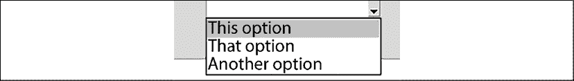
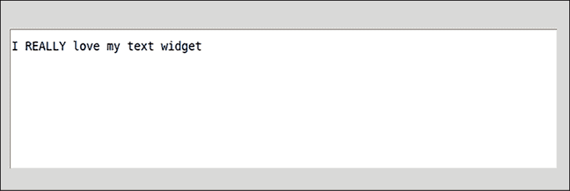
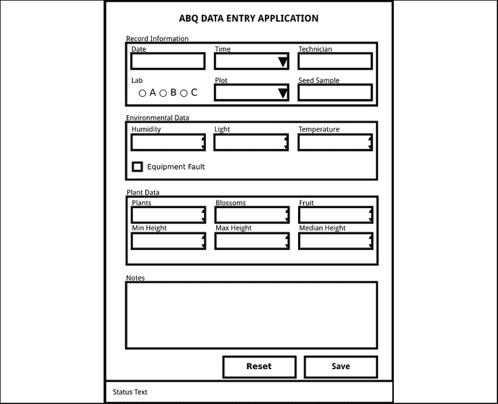
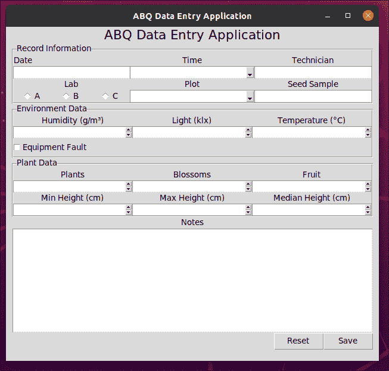

# 第三章：使用 Tkinter 和 Ttk 小部件创建基本表单

好消息！您的设计方案已经经过审查并获得总监批准。现在是时候开始实施了！在本章中，我们将创建一个非常简单的应用程序，它提供了规范的核心功能，而其他功能则很少。这被称为 **最小可行产品** 或 **MVP**。MVP 不会是生产就绪的，但它将给我们一些东西向用户展示，并帮助我们更好地理解问题和我们所工作的技术。以下是我们将要讨论的主题：

+   在 *Ttk 小部件集* 中，我们将了解一个更好的 Tkinter 小部件集，即 Ttk。

+   在 *实现应用程序* 中，我们将使用 Python、Tkinter 和 Ttk 来构建我们的表单设计。

让我们开始编码！

# Ttk 小部件集

在 *第一章*，*Tkinter 简介* 中，我们使用默认的 Tkinter 小部件创建了一个调查应用程序。这些小部件功能齐全，并且仍然被许多 Tkinter 应用程序使用，但现代 Tkinter 应用程序往往更喜欢一个改进的小部件集，称为 **Ttk**。Ttk 是 Tkinter 的一个子模块，它提供了许多（但不是所有）Tkinter 小部件的主题版本。这些小部件与传统的类似，但提供了旨在使它们在 Windows、macOS 和 Linux 上看起来更现代和自然的先进样式选项。

在每个平台上，Ttk 包含模仿平台原生小部件的平台特定主题。此外，Ttk 还添加了一些额外的提供默认库中找不到的功能的小部件。

虽然本章将涵盖 Ttk 小部件的基本用法，但关于 Ttk 小部件的字体、颜色和其他样式定制的完整覆盖可以在 *第九章*，*通过样式和主题改进外观* 中找到。

Ttk 已经作为 Tkinter 的一部分包含在内，因此我们不需要安装任何额外的东西。要在我们的 Tkinter 应用程序中使用 Ttk 小部件，我们需要像这样导入 `ttk`：

```py
from tkinter import ttk 
```

在本节中，我们将更深入地了解将在我们的应用程序中非常有用的小部件。记住，从我们的设计中我们知道我们需要以下类型的小部件：

+   标签

+   日期输入

+   文本输入

+   数字输入

+   复选框

+   单选按钮

+   选择列表

+   长文本输入

+   按钮

+   带标题的框式框架

让我们看看我们可以用来满足这些需求的小部件。

## 标签小部件

在 *第一章*，*Tkinter 简介* 中，我们很好地使用了 Tkinter `Label` 小部件，Ttk 版本本质上相同。我们可以这样创建一个：

```py
mylabel = ttk.Label(root, text='This is a label') 
```

这将产生一个看起来像这样的标签：


图 3.1：一个 Ttk 标签小部件

Ttk `Label` 小部件与 Tk 版本具有大多数相同的选项，其中最常见的是以下列出的：

| 参数 | 值 | 描述 |
| --- | --- | --- |
| `text` | 字符串 | 标签的文本内容 |
| `textvariable` | `StringVar` | 绑定到标签内容的变量 |
| `anchor` | 方向 | 文本相对于内边距的位置 |
| `justify` | `left`, `right`, 或 `center` | 文本行相对于彼此的对齐方式 |
| `foreground` | 颜色字符串 | 文本的颜色 |
| `wraplength` | 整数 | 文本换行前的像素数 |
| `underline` | 整数 | `text` 中字符的下划线索引 |
| `font` | 字体字符串或元组 | 要使用的字体 |

注意，标签的文本可以通过 `text` 直接指定，或者绑定到 `StringVar`，允许动态标签文本。`underline` 参数允许在标签文本中下划线一个字符；这有助于指示用户的快捷键，例如，激活由标签命名的控制小部件。此参数实际上不会创建快捷键；它仅具有装饰性。我们将在 *第十章*，*维护跨平台兼容性* 中学习如何创建快捷键。

## Entry 小部件

`ttk.Entry` 小部件是一个简单的单行文本输入，就像 Tkinter 版本一样。它看起来是这样的：


图 3.2：Ttk Entry 小部件

我们可以使用以下代码创建一个 `Entry` 小部件：

```py
myentry = ttk.Entry(root, textvariable=my_string_var, width=20) 
```

Ttk 的 `Entry` 小部件与我们之前看到的 Tkinter `Entry` 小部件非常相似，并支持许多相同的参数。以下是更常见的 `Entry` 选项的选取：

| 参数 | 值 | 描述 |
| --- | --- | --- |
| `textvariable` | `StringVar` | Tkinter 控制变量绑定。 |
| `show` | 字符串 | 用户输入时显示的字符或字符串。例如，对于密码字段很有用。 |
| `justify` | `left`, `right`, 或 `center` | 输入框中文字的对齐方式。`left` 为默认值。 |
| `foreground` | 颜色字符串 | 文本的颜色。 |

在未来章节中深入探讨 Ttk 小部件的功能时，我们将学习更多关于 `Entry` 的选项。`Entry` 将用于我们所有的文本输入字段，以及我们的 `Date` 字段。Ttk 没有专门的 `date` 小部件，但在 *第五章*，*通过验证和自动化减少用户错误* 中，我们将学习如何将我们的 `Entry` 转换为 `date` 字段。

## Spinbox 小部件

与 Tkinter 版本一样，Ttk 的 `Spinbox` 在标准的 `Entry` 小部件中添加了增加和减少按钮，使其适合数值数据。

这里展示了 Ttk 的 `Spinbox`：


图 3.3：Ttk Spinbox 小部件

我们可以创建一个如下所示：

```py
myspinbox = ttk.Spinbox(
  root,
  from_=0, to=100, increment=.01,
  textvariable=my_int_var,
  command=my_callback
) 
```

如此代码所示，Ttk 的 `Spinbox` 接受多个参数来控制其箭头按钮的行为，列于下表：

| 参数 | 值 | 描述 |
| --- | --- | --- |
| `from_` | 浮点数或整数 | 箭头减少到的最小值。 |
| `to` | 浮点数或整数 | 箭头增加到的最大值。 |
| `increment` | 浮点数或整数 | 由箭头添加或减去的值。 |
| `command` | Python 函数 | 当任意按钮被按下时执行的回调函数。 |
| `textvariable` | 控制变量（任何类型） | 绑定到字段值的变量。 |
| `values` | 字符串或数字列表 | 按钮将滚动浏览的选项集。覆盖`from_`和`to`值。 |

注意，这些参数并不限制输入到`Spinbox`中的内容；它们仅影响箭头的行为。此外，请注意，如果你只指定了`from_`或`to`中的一个，另一个将自动默认为`0`。这可能会导致意外的行为；例如，如果你设置了`from_=1`但没有指定`to`，那么`to`将默认为`0`，你的箭头将只在`1`和`0`之间切换。要显式设置无限制，可以使用`from_='-infinity'`和`to='infinity'`。

`Spinbox`小部件不仅用于数字，尽管我们主要会这样使用它。正如你所见，它还可以接受`values`参数，这是一个字符串或数字列表，可以通过箭头按钮滚动浏览。因此，`Spinbox`可以绑定到任何类型的控制变量，而不仅仅是`IntVar`或`DoubleVar`变量。

记住，这些参数实际上并没有限制可以输入到`Spinbox`小部件中的内容。它实际上只是一个带有按钮的`Entry`小部件，你可以输入不仅限于有效范围内的数值，还可以输入字母和符号。这样做可能会导致异常，如果你将小部件绑定到非字符串变量。在*第五章*，*通过验证和自动化减少用户错误*中，我们将学习如何使`Spinbox`小部件仅允许输入有效的数字字符。

## 复选框小部件

Ttk `Checkbutton`小部件是一个带标签的复选框，非常适合输入布尔数据。它可以创建如下：

```py
mycheckbutton = ttk.Checkbutton(
  root,
  variable=my_bool_var,
  textvariable=my_string_var,
  command=my_callback
) 
```

除了上面列出的参数外，`Checkbutton`小部件还可以接受其他参数，如下表所示：

| 参数 | 值 | 描述 |
| --- | --- | --- |
| `variable` | 控制变量 | 复选框选中/未选中状态所绑定的变量 |
| `text` | String | 标签文本 |
| `textvariable` | `StringVar` | 标签文本所绑定的变量 |
| `command` | Python 函数 | 当复选框选中或未选中时执行的回调函数 |
| `onvalue` | Any | 当复选框选中时设置`variable`的值 |
| `offvalue` | Any | 当复选框未选中时设置`variable`的值 |
| `underline` | Integer | `text`中字符的下划线索引 |

`Checkbutton`中的标签可以直接使用`text`参数设置，或者可以使用`textvariable`将其绑定到控制变量。这允许对小部件进行动态标签化，这在许多情况下都很有用。

虽然复选框非常适合布尔数据，并且默认将其绑定的变量设置为`True`或`False`，但我们可以使用`onvalue`和`offvalue`参数来覆盖此行为，使其可以与任何类型的控制变量一起使用。

例如，我们可以用它与`DoubleVar`一起使用，如下所示：

```py
mycheckbutton2 = ttk.Checkbutton(
  root,
  variable=my_dbl_var,
  text='Would you like Pi?',
  onvalue=3.14159,
  offvalue=0,
  underline=15
) 
```

Ttk `Checkbutton`将标签放置在框的右侧，如以下截图所示：


图 3.4：带有内置标签的 Ttk Checkbutton 小部件

## Radiobutton 小部件

与其 Tkinter 对应物一样，Ttk `Radiobutton`小部件用于在一组相互排斥的选项中进行选择。单个`Radiobutton`本身不是一个非常有用的小部件；相反，它们通常作为一个组创建，如下所示：


图 3.5：一对 Ttk Radiobutton 小部件

以下代码显示了如何创建这些按钮：

```py
buttons = tk.Frame(root)
r1 = ttk.Radiobutton(
  buttons,
  variable=my_int_var,
  value=1,
  text='One'
)
r2 = ttk.Radiobutton(
  buttons,
  variable=my_int_var,
  value=2,
  text='Two'
) 
```

要分组`Radiobutton`小部件，您只需将它们都分配给相同的控制变量，然后为每个按钮添加一个不同的`value`。在我们的例子中，我们还将它们分组在同一个父小部件上，但这只是为了视觉原因，并不是严格必要的。

此表显示了您可以与`Radiobutton`一起使用的各种参数：

| 参数 | 值 | 描述 |
| --- | --- | --- |
| `variable` | 控制变量 | 绑定到按钮选中状态的变量 |
| `value` | 任何 | 当按钮被选中时设置变量的值 |
| `command` | Python 函数 | 当按钮被点击时执行的回调函数 |
| `text` | 字符串 | 连接到单选按钮的标签 |
| `textvariable` | `StringVar` | 绑定到按钮标签文本的变量 |
| `underline` | 整数 | `text`中要下划线的字符索引 |

## Combobox 小部件

在*第一章*，*Tkinter 简介*中，我们学习了提供不同选项之间选择的一两种方法：`Listbox`和`OptionMenu`小部件。Ttk 为此目的提供了一个新小部件，`Combobox`。`Combobox`小部件是一个带有下拉列表框的`Entry`小部件。它不仅允许鼠标选择，还允许键盘输入。尽管在某些方面`OptionMenu`可能更适合我们的应用程序，但我们将利用`Combobox`小部件的键盘功能来构建一个更高级的下拉小部件。

我们可以这样创建一个`Combobox`小部件：

```py
mycombo = ttk.Combobox(
  root, textvariable=my_string_var,
  values=['This option', 'That option', 'Another option']
) 
```

运行此代码将给我们一个看起来像这样的组合框：



图 3.6：一个 Ttk Combobox 小部件

注意，虽然我们可以指定一个可能的值列表来填充下拉列表框，但`Combobox`小部件并不限于这些值。用户可以在框中输入任何他们想要的文本，并且绑定的变量将相应地更新。默认情况下，`Combobox`不适合必须保持约束在固定列表中的值列表；然而，在*第五章*，*通过验证和自动化减少用户错误*中，我们将学习如何解决这个问题。

此表显示了与`Combobox`一起使用的常见参数：

| 参数 | 值 | 描述 |
| --- | --- | --- |
| `textvariable` | `StringVar` | 绑定到`Combobox`内容的变量 |
| `values` | 字符串列表 | 填充下拉`listbox`的值 |
| `postcommand` | Python 函数 | 在`listbox`显示之前运行的回调函数 |
| `justify` | `left`、`right`或`center` | 框中文本的对齐方式 |

## Text 小部件

我们已经在*第一章*，*Tkinter 简介*中遇到过的`Text`小部件是我们将使用的唯一没有 Ttk 版本的小部件。虽然这个小部件最常用于多行文本输入，但它实际上提供了更多功能。`Text`小部件可以用来显示或编辑包含图像、多色文本、超链接样式可点击文本等的文本。

我们可以这样向一个应用程序添加一个：

```py
mytext = tk.Text(
  root,
  undo=True, maxundo=100,
  spacing1=10, spacing2=2, spacing3=5,
  height=5, wrap='char'
) 
```

上述代码将生成类似以下的内容：



图 3.7：Tk Text 小部件

`Text`小部件有大量我们可以指定的参数来控制其外观和行为。其中一些更有用的参数列在这个表中：

| 参数 | 值 | 描述 |
| --- | --- | --- |
| `height` | 整数 | 小部件的高度，以文本行数表示。 |
| `width` | 整数 | 小部件的宽度，以字符数表示。对于可变宽度字体，使用“0”字符的宽度来计算宽度。 |
| `undo` | 布尔值 | 激活或停用撤销功能。撤销和重做操作使用平台默认快捷键激活。 |
| `maxundo` | 整数 | 将存储的撤销操作的最大数量。 |
| `wrap` | `none`、`char`或`word` | 指定当文本行超出小部件宽度时，文本行将如何断开和换行。 |
| `spacing1` | 整数 | 在每行文本上方填充的像素数。 |
| `spacing2` | 整数 | 在显示的换行文本行之间填充的像素数。 |
| `spacing3` | 整数 | 在每行文本下方填充的像素数。 |

使用**标签**实现`Text`小部件的更高级视觉配置。我们将在*第九章*，*使用样式和主题改进外观*中讨论标签。

### Text 小部件索引

记住，`Text`小部件不能绑定到控制变量；要访问、设置或清除其内容，我们需要分别使用其`get()`、`insert()`和`delete()`方法。

当使用这些方法读取或修改时，您需要传递一个或两个**索引值**来选择您正在操作的字符或字符范围。这些索引值是字符串，可以采用以下任何一种格式：

+   行号和字符号由点分隔。行从 1 开始编号，字符从 0 开始，因此第一行的第一个字符是`1.0`，而第四行的第十二个字符是`4.11`。请注意，*行*由换行符的存在确定；换行文本行在索引目的上仍然只被认为是一行。

+   字符串字面量`end`，或 Tkinter 常量`END`，表示文本的末尾。

+   一个数值索引加上单词`linestart`、`lineend`、`wordstart`或`wordend`之一，表示相对于数值索引的行或单词的开始或结束。例如：

    +   `6.2 wordstart`将是包含第 6 行第三个字符的单词的开始

    +   `2.0 lineend`将是第 2 行的末尾

+   任何前面的内容，一个加号或减号运算符，以及一定数量的字符或行。例如：

    +   `2.5 wordend - 1 chars`将是包含第 2 行第 6 个字符的单词结束前的字符

以下示例展示了这些索引的实际应用：

```py
# insert a string at the beginning
mytext.insert('1.0', "I love my text widget!")
# insert a string into the current text
mytext.insert('1.2', 'REALLY ')
# get the whole string
mytext.get('1.0', tk.END)
# delete the last character.
mytext.delete('end - 2 chars') 
```

注意在最后一个例子中，我们删除了两个字符以删除最后一个字符。`Text`小部件会自动在其文本内容末尾添加一个换行符，因此我们始终需要记住在处理索引或提取的文本时考虑到这个额外的字符。

记住，这些索引应该是**字符串**，而不是浮点值！由于隐式类型转换，浮点值有时可能工作，但不要依赖这种行为。

## 按钮小部件

Ttk 的`Button`是一个简单的可点击的按钮，可以激活回调函数。它看起来像这样：


图 3.8：一个 Ttk 按钮小部件

我们可以创建一个如下所示：

```py
mybutton = ttk.Button(
  root,
  command=my_callback,
  text='Click Me!',
  default='active'
) 
```

按钮是一个相当直观的小部件，但它有一些可以用来配置它的选项。这些选项在下表中展示：

| 参数 | 值 | 描述 |
| --- | --- | --- |
| `text` | 字符串 | 按钮上的标签文本。 |
| `textvariable` | `StringVar` | 绑定到按钮标签文本的变量。 |
| `command` | Python 函数 | 当按钮被点击时执行的回调。 |
| `default` | `normal`，`active`，`disabled` | 如果按钮在按下`Enter`键时执行。`active`表示它将在响应`Enter`时执行，`normal`表示只有在首先选中时才会执行，`disabled`表示它不会响应`Enter`。 |
| `underline` | 整数 | `text`中要下划线的字符索引。 |

按钮也可以配置为显示图像而不是文本。我们将在**第九章**，**使用样式和主题改进外观**中了解更多。

## LabelFrame 小部件

在**第一章**，**Tkinter 简介**中，我们使用了`Frame`小部件来组合我们的小部件。Ttk 为我们提供了一个更强大的选项`LabelFrame`，它提供了一个带有边框和标签的框架。这是一个非常实用的工具，可以为我们 GUI 中的小部件提供视觉分组。

这段代码展示了`LabelFrame`的一个示例：

```py
mylabelframe = ttk.LabelFrame(
  root,
  text='Button frame'
)
b1 = ttk.Button(
  mylabelframe,
  text='Button 1'
)
b2 = ttk.Button(
  mylabelframe,
  text='Button 2'
)
b1.pack()
b2.pack() 
```

生成的 GUI 将看起来像这样：


图 3.9：一个 Ttk LabelFrame 小部件

`LabelFrame`小部件为我们提供了一些配置参数，如下所示：

| 参数 | 值 | 描述 |
| --- | --- | --- |
| `text` | 字符串 | 要显示的标签文本。 |
| `labelanchor` | 基本方向 | 文本标签的锚点位置。 |
| `labelwidget` | `ttk.Label`对象 | 用于标签的标签小部件。覆盖`text`。 |
| `underline` | 整数 | `text`中要下划线的字符索引。 |

如您所见，我们可以通过指定`text`参数或创建一个`Label`小部件并使用`labelwidget`参数来配置`LabelFrame`的标签。如果我们想利用`Label`小部件的一些高级功能，例如将其`textvariable`绑定，后者可能更可取。如果我们使用它，它将覆盖`text`参数。

Tkinter 和 Ttk 包含许多更多的小部件，其中一些我们将在本书的后面遇到。Python 还附带了一个名为`tix`的小部件库，其中包含几十个小部件。然而，`tix`非常过时，我们不会在本书中介绍它。尽管如此，你应该知道它的存在。

# 应用实现

到目前为止，我们已经学习了 Tkinter 的基本知识，研究了用户的需求，设计了我们的应用，并确定了哪些 Ttk 小部件将在我们的应用中有用。现在是时候将这些整合起来，并实际编写 ABQ 数据输入应用的第一版。回想一下我们的设计，来自*第二章*，*设计 GUI 应用*，如下所示：



图 3.10：ABQ 数据输入应用布局

花点时间回顾我们需要创建的小部件，然后我们将开始编码。

## 第一步

在您的编辑器中打开一个名为`data_entry_app.py`的新文件，让我们从这里开始：

```py
# data_entry_app.py
"""The ABQ Data Entry application"""
import tkinter as tk
from tkinter import ttk
from datetime import datetime
from pathlib import Path
import csv 
```

我们的脚本以一个**文档字符串**开始，就像所有 Python 脚本应该做的那样。这个字符串至少应该给出文件所属的应用程序的名称，也可以包括有关使用、作者或其他未来维护者需要了解的项目。

接下来，我们将导入我们将在本应用中需要的 Python 模块；这些是：

+   当然，`tkinter`和`ttk`用于我们的 GUI 元素

+   来自`datetime`模块的`datetime`类，我们将用它来生成文件名的日期字符串

+   来自`pathlib`模块的`Path`类，用于我们在保存例程中的某些文件操作

+   我们将使用的`csv`模块，用于与 CSV 文件交互

接下来，让我们创建一些全局变量，应用将使用这些变量来跟踪信息：

```py
variables = dict()
records_saved = 0 
```

`variables`字典将保存所有表单的控制变量。将它们保存在字典中将使管理它们变得更容易，并将我们的全局命名空间保持精简和整洁。`records_saved`变量将存储用户自打开应用以来保存的记录数。

现在是时候创建和配置根窗口了：

```py
root = tk.Tk()
root.title('ABQ Data Entry Application')
root.columnconfigure(0, weight=1) 
```

我们已设置应用程序的窗口标题并配置了其布局网格，以便允许第一列扩展。根窗口将只有一个列，但通过设置这一点，它将允许表单在窗口扩展时保持居中。如果没有它，当窗口扩展时，表单将固定在窗口的左侧。

现在我们将为应用添加一个标题：

```py
ttk.Label(
  root, text="ABQ Data Entry Application",
  font=("TkDefaultFont", 16)
).grid() 
```

由于我们不需要再次引用这个小部件，我们不会费心将其分配给变量。这也允许我们在同一行上调用`Label`上的`grid()`，使我们的代码更加简洁，命名空间更加清晰。我们将为应用程序中的大多数小部件这样做，除非我们有理由可能在代码的其他地方与之交互。

注意，我们使用了`TkDefaultFont`作为这个标签小部件的字体家族值。这是 Tkinter 中定义的一个别名，指向平台上的默认窗口字体。我们将在*第九章*，*通过样式和主题改进外观*中了解更多关于字体信息。

## 构建数据记录表

在设置好初始应用程序窗口后，让我们开始构建实际的数据输入表单。我们将创建一个框架来包含整个数据记录表，称为`drf`：

```py
drf = ttk.Frame(root)
drf.grid(padx=10, sticky=(tk.E + tk.W))
drf.columnconfigure(0, weight=1) 
```

`drf`框架以一点水平填充添加到主窗口中，`sticky`参数确保它在包含列拉伸时也会拉伸。我们还将配置其网格以扩展第一列。

对于使用网格布局的窗口或框架，如果你想在父级拉伸时使子小部件拉伸，你需要确保容器将扩展（在父级上使用`columnconfigure`和`rowconfigure`），*并且*子小部件将与容器一起扩展（在调用子小部件上的`grid()`时使用`sticky`）。

### 记录信息部分

我们表单的第一部分是`记录信息`部分。让我们创建并配置一个`LabelFrame`来存储它：

```py
r_info = ttk.LabelFrame(drf, text='Record Information')
r_info.grid(sticky=(tk.W + tk.E))
for i in range(3):
  r_info.columnconfigure(i, weight=1) 
```

我们首先创建一个 Ttk `LabelFrame`小部件，将其数据记录表作为其父级。我们将其添加到父级的网格中，设置`sticky`参数，以便在窗口大小调整时它将扩展。这个表单的每一部分都将有三列输入小部件，我们希望每一列均匀扩展以填充框架的宽度。因此，我们使用了一个`for`循环来设置每一列的`weight`属性为`1`。

现在，我们可以开始创建框架的内容，从第一个输入小部件，即`日期`字段开始：

```py
variables['Date'] = tk.StringVar()
ttk.Label(r_info, text='Date').grid(row=0, column=0)
ttk.Entry(
  r_info, textvariable=variables['Date']
).grid(row=1, column=0, sticky=(tk.W + tk.E)) 
```

首先，我们创建了一个控制变量并将其放入`variables`字典中。然后我们为`日期`字段创建了我们的`Label`小部件，并将其添加到`LabelFrame`小部件的网格中。即使不是严格必要的，我们也将使用显式的`row`和`column`值，因为我们将要放置一些稍微偏离顺序的对象。没有显式坐标，事情可能会变得混乱。

最后，我们创建了一个`Entry`小部件，传递了控制变量。请注意，如果我们可以使用变量来存储值，我们不会保存我们小部件的任何引用。这将使代码更加简洁。我们已经将我们的小部件添加到网格中，通过指定下一行的第一列将其放置在其标签的下方。对于`Entry`和`Label`，我们使用了`sticky`参数来确保小部件在 GUI 扩展时拉伸。

现在让我们添加第一行的其余部分，`Time`和`Technician`字段：

```py
time_values = ['8:00', '12:00', '16:00', '20:00']
variables['Time'] = tk.StringVar()
ttk.Label(r_info, text='Time').grid(row=0, column=1)
ttk.Combobox(
  r_info, textvariable=variables['Time'], values=time_values
).grid(row=1, column=1, sticky=(tk.W + tk.E))
variables['Technician'] = tk.StringVar()
ttk.Label(r_info, text='Technician').grid(row=0, column=2)
ttk.Entry(
  r_info, textvariable=variables['Technician']
).grid(row=1, column=2, sticky=(tk.W + tk.E)) 
```

再次，我们为每个项目创建一个变量和输入小部件。回想一下，`Combobox`小部件使用字符串列表作为其`values`参数，这将填充小部件的下拉部分。这样就处理了第一行。

在第二行，我们将从`Lab`输入开始：

```py
variables['Lab'] = tk.StringVar()
ttk.Label(r_info, text='Lab').grid(row=2, column=0)
labframe = ttk.Frame(r_info)
for lab in ('A', 'B', 'C'):
  ttk.Radiobutton(
    labframe, value=lab, text=lab, variable=variables['Lab']
).pack(side=tk.LEFT, expand=True)
labframe.grid(row=3, column=0, sticky=(tk.W + tk.E)) 
```

就像之前一样，我们创建了控制变量和`Label`，但对于输入小部件，我们创建了一个`Frame`来容纳三个`Radiobutton`小部件。我们还在使用`for`循环创建`Radiobutton`小部件，以使代码更简洁和一致。

`pack()`几何管理器在这里很有用，因为我们可以从左到右填充，而无需显式管理列号。`expand`参数使得小部件在窗口大小调整时使用额外空间；这将帮助我们的按钮利用可用空间，而不会挤到窗口的左侧。

现在让我们完成第二行的剩余部分，`Plot`和`Seed Sample`字段：

```py
variables['Plot'] = tk.IntVar()
ttk.Label(r_info, text='Plot').grid(row=2, column=1)
ttk.Combobox(
  r_info,
  textvariable=variables['Plot'],
  values=list(range(1, 21))
).grid(row=3, column=1, sticky=(tk.W + tk.E))
variables['Seed Sample'] = tk.StringVar()
ttk.Label(r_info, text='Seed Sample').grid(row=2, column=2)
ttk.Entry(
  r_info,
  textvariable=variables['Seed Sample']
).grid(row=3, column=2, sticky=(tk.W + tk.E)) 
```

这里发生的事情与之前相同：创建一个变量，创建一个`Label`，创建输入小部件。注意，对于`Plot`值，我们使用`range()`生成一个列表，以使代码更简洁。

### 这是环境数据部分

表单的下一部分是`Environment Data`框架。让我们开始这个部分如下：

```py
e_info = ttk.LabelFrame(drf, text="Environment Data")
e_info.grid(sticky=(tk.W + tk.E))
for i in range(3):
  e_info.columnconfigure(i, weight=1) 
```

这正是我们为最后一个`LabelFrame`所做的事情，只是名称有所更新。让我们开始用`Humidity`、`Light`和`Temperature`小部件填充它：

```py
variables['Humidity'] = tk.DoubleVar()
ttk.Label(e_info, text="Humidity (g/m³)").grid(row=0, column=0)
ttk.Spinbox(
  e_info, textvariable=variables['Humidity'],
  from_=0.5, to=52.0, increment=0.01,
).grid(row=1, column=0, sticky=(tk.W + tk.E))
variables['Light'] = tk.DoubleVar()
ttk.Label(e_info, text='Light (klx)').grid(row=0, column=1)
ttk.Spinbox(
  e_info, textvariable=variables['Light'],
  from_=0, to=100, increment=0.01
).grid(row=1, column=1, sticky=(tk.W + tk.E))
variables['Temperature'] = tk.DoubleVar()
ttk.Label(e_info, text='Temperature (°C)').grid(row=0, column=2)
ttk.Spinbox(
  e_info, textvariable=variables['Temperature'],
  from_=4, to=40, increment=.01
).grid(row=1, column=2, sticky=(tk.W + tk.E)) 
```

好的！现在，对于本节第二行，我们只需要添加`Equipment Fault`复选框：

```py
variables['Equipment Fault'] = tk.BooleanVar(value=False)
ttk.Checkbutton(
  e_info, variable=variables['Equipment Fault'],
  text='Equipment Fault'
).grid(row=2, column=0, sticky=tk.W, pady=5) 
```

前三个值都是浮点数，所以我们使用`DoubleVar`控制变量和`Spinbox`小部件进行输入。别忘了为`Spinbox`小部件填充`from_`、`to`和`increment`值，以便箭头能够正确地工作。我们的`Checkbutton`使用`BooleanVar`控制变量，由于它内置了标签，所以不需要`Label`小部件。注意，因为我们开始了一个新的框架，我们的网格行和列从零开始。这是将表单拆分成更小框架的好处：我们不必跟踪不断增长的行或列号。

### 这是植物数据部分

我们将创建下一个框架，`Plant Data`，就像其他两个一样：

```py
p_info = ttk.LabelFrame(drf, text="Plant Data")
p_info.grid(sticky=(tk.W + tk.E))
for i in range(3):
  p_info.columnconfigure(i, weight=1) 
```

现在，创建并配置了框架后，让我们添加第一行的输入项，`Plants`、`Blossoms`和`Fruit`：

```py
variables['Plants'] = tk.IntVar()
ttk.Label(p_info, text='Plants').grid(row=0, column=0)
ttk.Spinbox(
  p_info, textvariable=variables['Plants'],
  from_=0, to=20, increment=1
).grid(row=1, column=0, sticky=(tk.W + tk.E))
variables['Blossoms'] = tk.IntVar()
ttk.Label(p_info, text='Blossoms').grid(row=0, column=1)
ttk.Spinbox(
  p_info, textvariable=variables['Blossoms'],
  from_=0, to=1000, increment=1
).grid(row=1, column=1, sticky=(tk.W + tk.E))
variables['Fruit'] = tk.IntVar()
ttk.Label(p_info, text='Fruit').grid(row=0, column=2)
ttk.Spinbox(
  p_info, textvariable=variables['Fruit'],
  from_=0, to=1000, increment=1
).grid(row=1, column=2, sticky=(tk.W + tk.E)) 
```

这里没有什么真正新的东西，只是因为我们使用`IntVar`控制变量，我们将`Spinbox`的增量设置为`1`。这并不能真正阻止任何人输入小数（或任何任意的字符串），但至少按钮不会误导用户。在*第五章*，*通过验证和自动化减少用户错误*中，我们将看到如何更彻底地执行`increment`。

现在最后的一行输入项，`Min Height`、`Max Height`和`Med Height`：

```py
variables['Min Height'] = tk.DoubleVar()
ttk.Label(p_info, text='Min Height (cm)').grid(row=2, column=0)
ttk.Spinbox(
  p_info, textvariable=variables['Min Height'],
  from_=0, to=1000, increment=0.01
).grid(row=3, column=0, sticky=(tk.W + tk.E))
variables['Max Height'] = tk.DoubleVar()
ttk.Label(p_info, text='Max Height (cm)').grid(row=2, column=1)
ttk.Spinbox(
  p_info, textvariable=variables['Max Height'],
  from_=0, to=1000, increment=0.01
).grid(row=3, column=1, sticky=(tk.W + tk.E))
variables['Med Height'] = tk.DoubleVar()
ttk.Label(p_info, text='Median Height (cm)').grid(row=2, column=2)
ttk.Spinbox(
  p_info, textvariable=variables['Med Height'],
  from_=0, to=1000, increment=0.01
).grid(row=3, column=2, sticky=(tk.W + tk.E)) 
```

我们创建了三个更多的`DoubleVar`对象，三个更多的标签和三个更多的`Spinbox`小部件。如果这感觉有点重复，不要感到惊讶；GUI 代码往往会有点重复。在*第四章*，*使用类组织我们的代码*中，我们将找到减少这种重复性的方法。

### 完成 GUI

这样就完成了我们的三个信息部分；现在我们需要添加“笔记”输入。我们将它直接添加到`drf`框架中，并添加一个标签，如下所示：

```py
ttk.Label(drf, text="Notes").grid()
notes_inp = tk.Text(drf, width=75, height=10)
notes_inp.grid(sticky=(tk.W + tk.E)) 
```

由于我们无法将控制变量与`Text`小部件关联，我们需要保留一个常规变量引用。

当你需要保存小部件的引用时，不要忘记在单独的语句中调用`grid()`！由于`grid()`（和其他几何管理方法）返回`None`，如果你在一个语句中创建并定位小部件，你保存的小部件引用将只是`None`。

我们几乎完成了表单！我们只需要添加一些按钮：

```py
buttons = tk.Frame(drf)
buttons.grid(sticky=tk.E + tk.W)
save_button = ttk.Button(buttons, text='Save')
save_button.pack(side=tk.RIGHT)
reset_button = ttk.Button(buttons, text='Reset')
reset_button.pack(side=tk.RIGHT) 
```

为了使表单的网格布局更简单，我们将两个按钮打包到一个子框架中，使用`pack()`函数的`side`参数将它们保持在右侧。

这样就完成了数据记录表单；为了完成应用程序的 GUI，我们只需要添加一个带有相关变量的状态栏，如下所示：

```py
status_variable = tk.StringVar()
ttk.Label(
  root, textvariable=status_variable
).grid(sticky=tk.W + tk.E, row=99, padx=10) 
```

状态栏只是一个`Label`小部件，我们将其放置在`root`窗口的网格的第`99`行，以确保在应用程序未来添加任何内容时它保持在底部。请注意，我们没有将状态变量添加到`variables`字典中；该字典保留用于存储用户输入的变量。这个变量只是用来向用户显示消息。

## 编写回调函数

现在我们已经完成了布局，让我们着手创建应用程序的功能。我们的表单有两个需要回调函数的按钮：“重置”和“保存”。

### 重置函数

重置函数的职责是将整个表单恢复到空白状态，以便用户可以输入更多数据。我们不仅需要这个函数作为“重置”按钮的回调，还需要在用户保存记录后为下一个记录准备表单。否则，用户将不得不手动删除并覆盖每个字段的每个新记录中的数据。

由于我们需要从保存回调中调用重置回调，我们需要先编写重置函数。在`data_entry_app.py`的末尾，开始一个新的函数，如下所示：

```py
# data_entry_app.py
def on_reset():
  """Called when reset button is clicked, or after save""" 
```

函数被命名为`on_reset()`。回想一下*第一章*，*Tkinter 入门*，按照惯例，回调函数通常命名为`on_<事件名>`，其中`事件名`指的是触发该事件的事件。由于这将由点击“重置”按钮触发，我们将它命名为`on_reset()`。

在函数内部，我们需要将所有小部件重置为空值。但是等等！我们没有保存任何小部件的引用，除了“笔记”输入。我们需要做什么？

简单来说，我们将所有**变量**重置为空字符串，如下所示：

```py
 for variable in variables.values():
    if isinstance(variable, tk.BooleanVar):
      variable.set(False)
    else:
      variable.set('')
  notes_inp.delete('1.0', tk.END) 
```

`StringVar`、`DoubleVar` 和 `IntVar` 对象可以设置为空字符串，这将导致任何绑定到它们的部件变为空白。如果尝试这样做，`BooleanVar` 变量将引发异常，因此我们将使用 Python 的内置 `isinstance()` 函数检查我们的变量是否是 `BooleanVar`。如果是，我们只需将其设置为 `False`。

对于 `Notes` 输入，我们可以使用 `Text` 小部件的 `delete()` 方法来清除其内容。此方法接受一个起始位置和结束位置，就像 `get()` 方法一样。值 `1.0` 和 `tk.END` 表示小部件的全部内容。回顾我们之前对 `Text` 小部件的讨论，此索引是 *字符串* `1.0`，*不是* 浮点值。

这就是我们在重置回调函数中需要做的所有事情。要将它绑定到按钮，请使用按钮的 `configure()` 方法：

```py
reset_button.configure(command=on_reset) 
```

`configure()` 方法可以在任何 Tkinter 小部件上调用以更改其属性。它接受与部件构造函数相同的关键字参数。

### 保存回调

我们最后一点功能，也是最重要的，是 `Save` 回调。回顾我们的程序规范，我们的应用程序需要将输入的数据追加到名为 `abq_data_record_CURRENTDATE.csv` 的 **CSV** （**逗号分隔值**） 文件中，其中 `CURRENTDATE` 是 ISO 格式的日期（年-月-日）。如果文件不存在，则应创建该文件并将列标题写入第一行。因此，此函数需要执行以下操作：

+   确定当前日期并生成文件名

+   确定文件是否存在，如果不存在，则创建它并写入标题行

+   从表单中提取数据并执行任何必要的清理

+   将数据行追加到文件中

+   增加记录已保存的数量，并通知用户记录已保存

+   为下一条记录重置表单

让我们从以下方式开始这个函数：

```py
def on_save():
  """Handle save button clicks"""
  global records_saved 
```

再次，我们使用了 `on_<eventname>` 命名约定。我们首先声明 `records_saved` 为一个全局变量。如果我们不这样做，Python 将将名称 `records_saved` 解释为局部变量，我们将无法更新它。

修改全局变量通常是不好的做法，但 Tkinter 在这里实际上并没有给我们太多选择：我们无法使用返回值来更新变量，因为这是一个在响应事件时调用的回调函数，而不是我们代码中的任何地方，我们都有直接访问 `records_saved` 的权限。在 *第四章*，*使用类组织我们的代码* 中，我们将学习一种更好的方法来实现此功能而不使用全局变量；然而，现在我们仍然被困在这里。

接下来，让我们确定文件名的细节以及它是否存在：

```py
 datestring = datetime.today().strftime("%Y-%m-%d")
  filename = f"abq_data_record_{datestring}.csv"
  newfile = not Path(filename).exists() 
```

`datetime.today()`函数返回一个表示当前日期的`Date`对象，其`strftime()`方法允许我们将日期格式化为任何我们指定的字符串。`strftime()`的语法起源于 C 编程，所以在某些情况下可能相当晦涩；但希望它足够清晰，`%Y`表示年份，`%m`表示月份，`%d`表示日期。这将返回 ISO 格式的日期；例如，2021-10-31 代表 2021 年 10 月 31 日。

拥有`datestring`后，我们可以用它来构建当天 CSV 文件的文件名。在下一行中，`Path(filename).exists()`告诉我们文件是否在当前工作目录中存在。它是通过使用文件名构造一个`Path`对象，然后调用其`exists()`方法来检查文件是否已经在文件系统中。我们将这个信息保存到一个名为`newfile`的变量中。

现在是时候从表单中获取数据了：

```py
 data = dict()
  fault = variables['Equipment Fault'].get()
  for key, variable in variables.items():
    if fault and key in ('Light', 'Humidity', 'Temperature'):
      data[key] = ''
    else:
      try:
        data[key] = variable.get()
      except tk.TclError:
        status_variable.set(
          f'Error in field: {key}.  Data was not saved!'
        )
        return
  # get the Text widget contents separately
  data['Notes'] = notes_inp.get('1.0', tk.END) 
```

我们将数据存储在一个名为`data`的新字典对象中。为此，我们将遍历我们的`variables`字典，对每个变量调用`get()`。当然，如果有设备故障，我们想要跳过`Light`、`Humidity`和`Temperature`字段的值，所以我们首先获取`Equipment Fault`的值并检查它，然后再检索这些字段值。如果我们确实需要从变量中检索值，我们将在`try`块中这样做。记住，如果变量中有无效值时调用`get()`方法，变量将引发`TclError`，因此我们需要处理这个异常。在这种情况下，我们将通知用户该特定字段存在问题并立即退出函数。

最后，我们需要使用`get()`方法从`Notes`字段获取数据。

现在我们有了数据，我们需要将其写入 CSV 文件。接下来添加以下代码：

```py
 with open(filename, 'a', newline='') as fh:
    csvwriter = csv.DictWriter(fh, fieldnames=data.keys())
    if newfile:
      csvwriter.writeheader()
    csvwriter.writerow(data) 
```

首先，我们使用上下文管理器（`with`关键字）打开文件。这样做可以确保当我们退出缩进的块时文件将被关闭。我们以*追加*模式打开（由`open`函数的`a`参数指示），这意味着我们写入的任何数据都将简单地添加到现有内容的末尾。注意`newline`参数，我们将其设置为空字符串。这是为了解决 CSV 模块在 Windows 上的一个 bug，该 bug 会在每条记录之间出现额外的空行。在其他平台上这不会造成任何伤害。

在这个块内部，我们需要创建一个名为**CSV Writer 对象**的东西。标准库`csv`模块包含几种不同类型的对象，可以将数据写入 CSV 文件。`DictWriter`类很方便，因为它可以接受任何顺序的值字典，并将它们写入 CSV 的正确字段，前提是第一行包含列名。我们可以通过传递`data.keys()`来告诉`DictWriter`那些标题值应该是什么，这包含了我们数据值的所有名称。

追加模式将在文件不存在时创建文件，但不会自动写入标题行。因此，我们需要检查文件是否是新的文件（使用我们之前找到的`newfile`值），如果是，我们将写入标题行。`DictWriter`对象有一个用于此目的的方法，它将导致它只写入包含所有字段名称的单行。

最后，我们可以使用`DictWriter`对象的`writerow()`方法将我们的数据字典传递给要写入的文件。当我们退出缩进块时，Python 会关闭文件并将其保存到磁盘。

这就留下了`on_save()`函数中的最后几行：

```py
 records_saved += 1
  status_variable.set(
    f"{records_saved} records saved this session"
  )
  on_reset() 
```

首先，我们将增加`records_saved`变量，然后在状态栏中通知用户到目前为止已保存了多少条记录。这是良好的反馈，有助于用户知道他们的操作是成功的。最后，我们调用`on_reset()`来为输入下一条记录准备表单。

保存方法实现后，让我们将其绑定到我们的按钮上：

```py
save_button.configure(command=on_save) 
```

最后，让我们重置表单并启动主事件循环：

```py
on_reset()
root.mainloop() 
```

就这样，您的第一个 ABQ 应用程序已经完成并准备好发布了！

## 完成并测试

在我们将应用程序发送到世界之前，让我们先启动它并进行测试：



图 3.11：我们的第一个 ABQ 数据录入应用程序

看起来不错！而且它也真的能工作。请继续输入一些测试数据并保存它。当然，这并不是终点——我们还没有完全解决程序规格说明中的所有问题，一旦用户接触到应用程序，无疑会开始提出功能请求。但就目前而言，我们可以庆祝一个工作 MVP 的胜利。

# 概述

嗯，在这一章中，我们已经走了很长的路！您将设计从规格说明和一些图纸变成了一个运行中的最小可行产品（MVP），该产品已经涵盖了您所需的基本功能。您学习了关于基本 Ttk 小部件，如`Entry`、`Spinbox`、`Combobox`、`Radiobutton`和`Checkbutton`，以及 Tkinter 的`Text`小部件。您学习了如何使用嵌套的`LabelFrame`小部件将这些小部件组装成一个复杂但有序的 GUI，以及如何使用回调方法保存文件。

在下一章中，我们将利用类和面向对象编程技术来清理我们的代码并扩展小部件的功能。
