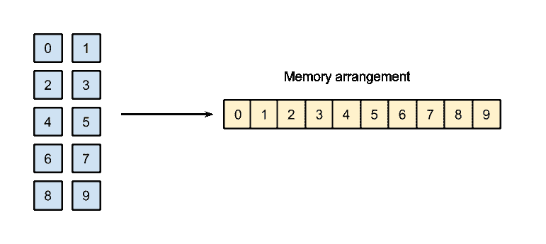
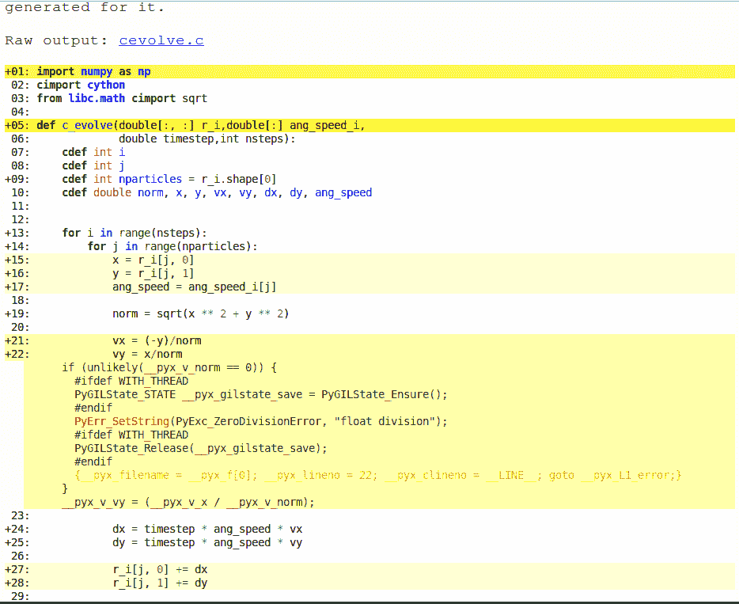
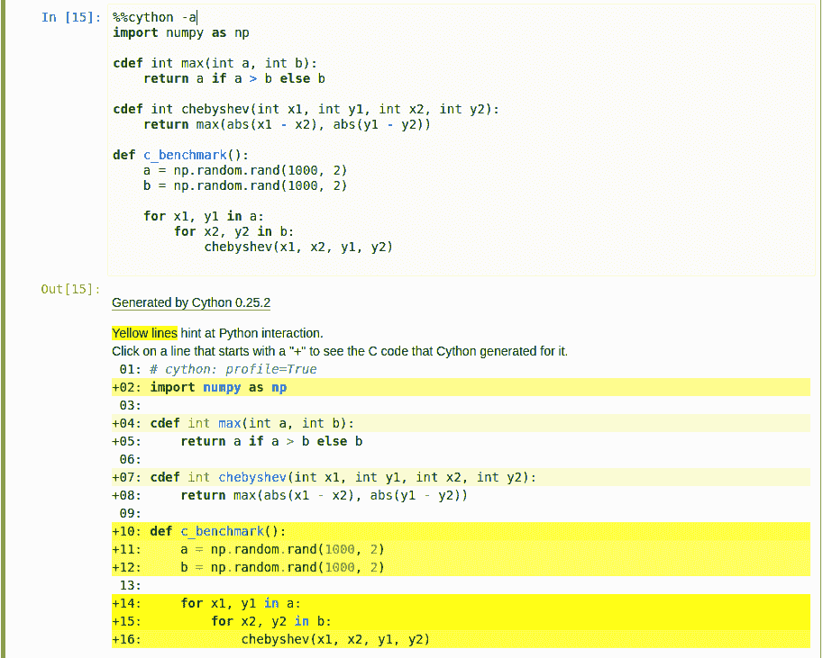
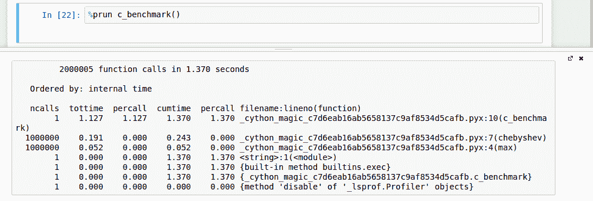

# 第四章：使用 Cython 的 C 性能

Cython 是一种通过支持函数、变量和类的类型声明来扩展 Python 的语言。这些类型声明使 Cython 能够将 Python 脚本编译成高效的 C 代码。Cython 还可以作为 Python 和 C 之间的桥梁，因为它提供了易于使用的结构来编写对外部 C 和 C++ 例程的接口。

在本章中，我们将学习以下内容：

+   Cython 语法基础

+   如何编译 Cython 程序

+   如何使用 **静态类型** 生成快速代码

+   如何使用类型化的 **内存视图** 高效地操作数组

+   优化示例粒子模拟器

+   在 Jupyter 笔记本中使用 Cython 的技巧

+   可用于 Cython 的分析工具

虽然对 C 的基本了解有帮助，但本章仅关注 Python 优化背景下的 Cython。因此，它不需要任何 C 背景。

# 编译 Cython 扩展

Cython 语法设计上是一个 Python 的超集。Cython 可以编译大多数 Python 模块，只有少数例外，而无需任何更改。Cython 源文件具有 `.pyx` 扩展名，可以使用 `cython` 命令编译成 C 文件。

我们的第一个 Cython 脚本将包含一个简单的函数，该函数将打印输出 `Hello, World!`。创建一个新的 `hello.pyx` 文件，包含以下代码：

```py
    def hello(): 
      print('Hello, World!') 

```

`cython` 命令将读取 `hello.pyx` 并生成 `hello.c` 文件：

```py
$ cython hello.pyx

```

要将 `hello.c` 编译成 Python 扩展模块，我们将使用 GCC 编译器。我们需要添加一些依赖于操作系统的特定于 Python 的编译选项。指定包含头文件的目录很重要；在以下示例中，目录是 `/usr/include/python3.5/`：

```py
$ gcc -shared -pthread -fPIC -fwrapv -O2 -Wall -fno-strict-aliasing -lm -I/usr/include/python3.5/ -o hello.so hello.c

```

要找到您的 Python 包含目录，您可以使用 `distutils` 工具：`sysconfig.get_python_inc`。要执行它，您可以简单地发出以下命令 `python -c "from distutils import sysconfig; print(sysconfig.get_python_inc())"`。

这将生成一个名为 `hello.so` 的文件，这是一个可以直接导入 Python 会话的 C 扩展模块：

```py
    >>> import hello 
    >>> hello.hello() 
    Hello, World!

```

Cython 接受 Python 2 和 Python 3 作为输入和输出语言。换句话说，您可以使用 `-3` 选项编译 Python 3 脚本 `hello.pyx` 文件：

```py
$ cython -3 hello.pyx

```

生成的 `hello.c` 可以通过包含相应的头文件并使用 `-I` 选项来编译，以便在 Python 2 和 Python 3 中使用，如下所示：

```py
$ gcc -I/usr/include/python3.5 # ... other options
$ gcc -I/usr/include/python2.7 # ... other options

```

使用 `distutils`，Python 的标准打包工具，可以更直接地编译 Cython 程序。通过编写一个 `setup.py` 脚本，我们可以直接将 `.pyx` 文件编译成扩展模块。为了编译我们的 `hello.pyx` 示例，我们可以编写一个包含以下代码的最小 `setup.py`：

```py
    from distutils.core import setup 
    from Cython.Build import cythonize 

    setup( 
      name='Hello',
      ext_modules = cythonize('hello.pyx')
    ) 

```

在前面的代码的前两行中，我们导入了 `setup` 函数和 `cythonize` 辅助函数。`setup` 函数包含一些键值对，指定了应用程序的名称和需要构建的扩展。

`cythonize` 辅助函数接受一个字符串或一个包含我们想要编译的 Cython 模块的字符串列表。您也可以使用以下代码使用 glob 模式：

```py
    cythonize(['hello.pyx', 'world.pyx', '*.pyx']) 

```

要使用 `distutils` 编译我们的扩展模块，您可以执行以下代码的 `setup.py` 脚本：

```py
$ python setup.py build_ext --inplace

```

`build_ext` 选项告诉脚本构建 `ext_modules` 中指示的扩展模块，而 `--inplace` 选项告诉脚本将 `hello.so` 输出文件放置在源文件相同的目录中（而不是构建目录）。

Cython 模块也可以通过 `pyximport` 自动编译。您只需要在脚本开头调用 `pyximport.install()`（或者您需要在解释器中发出该命令）。完成此操作后，您可以直接导入 `.pyx` 文件，`pyximport` 将透明地编译相应的 Cython 模块：

```py
    >>> import pyximport 
    >>> pyximport.install() 
    >>> import hello # This will compile hello.pyx 

```

不幸的是，`pyximport` 并不适用于所有类型的配置（例如，当它们涉及 C 和 Cython 文件的组合时），但它对于测试简单的脚本来说很方便。

自 0.13 版本以来，IPython 包含了 `cythonmagic` 扩展，可以交互式地编写和测试一系列 Cython 语句。您可以使用 `load_ext` 在 IPython 壳中加载扩展：

```py
    %load_ext cythonmagic 

```

一旦加载了扩展，您就可以使用 `%%cython` 单元魔法来编写多行 Cython 片段。在以下示例中，我们定义了一个 `hello_snippet` 函数，该函数将被编译并添加到 IPython 会话命名空间中：

```py
    %%cython 
    def hello_snippet(): 
        print("Hello, Cython!") 

    hello_snippet()
    Hello,  Cython! 

```

# 添加静态类型

在 Python 中，变量在程序执行过程中可以与不同类型的对象关联。虽然这个特性使得语言更加灵活和动态，但它也给解释器带来了显著的开销，因为解释器需要在运行时查找变量的类型和方法，这使得进行各种优化变得困难。Cython 通过扩展 Python 语言，增加了显式的类型声明，以便通过编译生成高效的 C 扩展。

在 Cython 中声明数据类型的主要方式是通过 `cdef` 语句。`cdef` 关键字可以在多个上下文中使用，例如变量、函数和扩展类型（静态类型类）。

# 变量

在 Cython 中，您可以通过在变量前加上 `cdef` 和相应的类型来声明变量的类型。例如，我们可以以下这种方式声明 `i` 变量为 16 位整数：

```py
    cdef int i 

```

`cdef` 语句支持在同一行上使用多个变量名，以及可选的初始化，如下所示：

```py
    cdef double a, b = 2.0, c = 3.0 

```

与常规变量相比，类型化变量被处理得不同。在 Python 中，变量通常被描述为指向内存中对象的 *标签*。例如，我们可以在程序的任何位置将值 `'hello'` 赋予 `a` 变量，而不会受到限制：

```py
    a = 'hello' 

```

`a`变量持有对`'hello'`字符串的引用。我们还可以在代码的稍后部分自由地将另一个值（例如，整数`1`）赋给同一个变量：

```py
    a = 1 

```

Python 将没有任何问题地将整数`1`赋值给`a`变量。

带类型的变量表现得很不同，通常被描述为*数据容器*：我们只能存储适合由其数据类型确定的容器中的值。例如，如果我们将`a`变量声明为`int`，然后我们尝试将其赋值给`double`，Cython 将触发一个错误，如下面的代码所示：

```py
    %%cython 
    cdef int i 
    i = 3.0 

    # Output has been cut 
    ...cf4b.pyx:2:4 Cannot assign type 'double' to 'int' 

```

静态类型使编译器能够执行有用的优化。例如，如果我们声明循环索引为`int`，Cython 将重写循环为纯 C，而无需进入 Python 解释器。类型声明保证了索引的类型始终是`int`，并且在运行时不能被覆盖，这样编译器就可以自由地进行优化，而不会损害程序的正确性。

我们可以通过一个小测试用例来评估这种情况下的速度提升。在下面的示例中，我们实现了一个简单的循环，该循环将一个变量增加 100 次。使用 Cython，`example`函数可以编写如下：

```py
    %%cython 
    def example(): 
       cdef int i, j=0 
       for i in range(100):
           j += 1 
       return j 

    example() 
    # Result:
    # 100 

```

我们可以比较一个类似的无类型、纯 Python 循环的速度：

```py
    def example_python(): 
        j=0 
        for i in range(100):
            j += 1 
        return j 

    %timeit example() 
    10000000 loops, best of 3: 25 ns per loop 
    %timeit example_python() 
    100000 loops, best of 3: 2.74 us per loop 

```

通过实现这种简单的类型声明获得的加速效果是惊人的 100 倍！这是因为 Cython 循环首先被转换为纯 C，然后转换为高效的机器代码，而 Python 循环仍然依赖于慢速的解释器。

在 Cython 中，可以声明变量为任何标准 C 类型，也可以使用经典的 C 构造，如`struct`、`enum`和`typedef`来定义自定义类型。

一个有趣的例子是，如果我们声明一个变量为`object`类型，该变量将接受任何类型的 Python 对象：

```py
    cdef object a_py 
    # both 'hello' and 1 are Python objects 
    a_py = 'hello' 
    a_py = 1 

```

注意，将变量声明为`object`没有性能优势，因为访问和操作该对象仍然需要解释器查找变量的底层类型及其属性和方法。

有时，某些数据类型（例如`float`和`int`数字）在某种意义上是兼容的，即它们可以被相互转换。在 Cython 中，可以通过在尖括号中包围目标类型来在类型之间进行转换（*cast*），如下面的代码片段所示：

```py
    cdef int a = 0 
    cdef double b 
    b = <double> a 

```

# 函数

您可以通过在每个参数名称前指定类型来向 Python 函数的参数添加类型信息。以这种方式指定的函数将像常规 Python 函数一样工作并执行，但它们的参数将进行类型检查。我们可以编写一个`max_python`函数，它返回两个整数之间的较大值：

```py
    def max_python(int a, int b):
        return a if a > b else b 

```

以这种方式指定的函数将执行类型检查并将参数视为类型化变量，就像在`cdef`定义中一样。然而，该函数仍然是一个 Python 函数，多次调用它仍然需要切换回解释器。为了允许 Cython 进行函数调用优化，我们应该使用`cdef`语句声明返回类型的类型：

```py
    cdef int max_cython(int a, int b): 
        return a if a > b else b 

```

以这种方式声明的函数将被转换为本地 C 函数，与 Python 函数相比，它们的开销要小得多。一个显著的缺点是它们不能从 Python 中使用，而只能从 Cython 中使用，并且它们的范围限制在同一个 Cython 文件中，除非它们在定义文件中公开（参考*共享声明*部分）。

幸运的是，Cython 允许你定义既可以从 Python 调用也可以转换为高性能 C 函数的函数。如果你使用`cpdef`语句声明一个函数，Cython 将生成该函数的两个版本：一个可供解释器使用的 Python 版本，以及一个从 Cython 可用的快速 C 函数。`cpdef`语法与`cdef`相同，如下所示：

```py
    cpdef int max_hybrid(int a, int b): 
        return a if a > b else b 

```

有时，即使有 C 函数，调用开销也可能成为性能问题，尤其是在关键循环中多次调用同一个函数时。当函数体很小的时候，在函数定义前添加`inline`关键字是很方便的；函数调用将被函数体本身替换。我们的`max`函数是进行内联的好候选：

```py
    cdef inline int max_inline(int a, int b): 
        return a if a > b else b 

```

# 类

我们可以使用`cdef class`语句定义扩展类型，并在类体中声明其属性。例如，我们可以创建一个扩展类型--`Point`--如下面的代码所示，它存储两个`double`类型的坐标（*x*，*y*）：

```py
    cdef class Point
        cdef double x 
        cdef double y
        def __init__(self, double x, double y): 
            self.x = x 
            self.y = y 

```

在类方法中访问声明的属性允许 Cython 通过直接访问底层 C `struct`中的给定字段来绕过昂贵的 Python 属性查找。因此，类型化类中的属性访问是一个极快的操作。

在你的代码中使用`cdef class`，需要在编译时明确声明你打算使用的变量类型。你可以在任何你将使用标准类型（如`double`、`float`和`int`）的上下文中使用扩展类型名（如`Point`）。例如，如果我们想创建一个 Cython 函数来计算从原点（在示例中，该函数名为`norm`）到`Point`的距离，我们必须将输入变量声明为`Point`，如下面的代码所示：

```py
    cdef double norm(Point p): 
        return (p.x**2 + p.y**2)**0.5 

```

就像类型化函数一样，类型化类也有一些限制。如果你尝试从 Python 访问扩展类型属性，你会得到一个`AttributeError`，如下所示：

```py
    >>> a = Point(0.0, 0.0) 
    >>> a.x 
    AttributeError: 'Point' object has no attribute 'x' 

```

为了从 Python 代码中访问属性，你必须使用`public`（用于读写访问）或`readonly`指定符在属性声明中，如下面的代码所示：

```py
    cdef class Point: 
        cdef public double x 

```

此外，可以使用 `cpdef` 语句声明方法，就像常规函数一样。

扩展类型不支持在运行时添加额外的属性。为了做到这一点，一种解决方案是定义一个 Python 类，它是类型类的子类，并在纯 Python 中扩展其属性和方法。

# 分享声明

当编写您的 Cython 模块时，您可能希望将最常用的函数和类声明重新组织到一个单独的文件中，以便它们可以在不同的模块中重用。Cython 允许您将这些组件放入一个 *定义文件* 中，并通过 `cimport` 语句访问它们*.*

假设我们有一个包含 `max` 和 `min` 函数的模块，并且我们想在多个 Cython 程序中重用这些函数。如果我们简单地在 `.pyx` 文件中编写一些函数，声明将仅限于同一文件。

定义文件也用于将 Cython 与外部 C 代码接口。想法是将定义文件中的类型和函数原型复制（或更准确地说，翻译）到外部 C 代码中，该代码将在单独的步骤中编译和链接。

要共享 `max` 和 `min` 函数，我们需要编写一个具有 `.pxd` 扩展名的定义文件。此类文件仅包含我们想要与其他模块共享的类型和函数原型--一个 *公共* 接口。我们可以在名为 `mathlib.pxd` 的文件中声明 `max` 和 `min` 函数的原型，如下所示：

```py
    cdef int max(int a, int b) 
    cdef int min(int a, int b) 

```

如您所见，我们只编写了函数名称和参数，而没有实现函数体。

函数实现将放入具有相同基本名称但具有 `.pyx` 扩展名的实现文件中--`mathlib.pyx`：

```py
    cdef int max(int a, int b): 
      return a if a > b else b 

    cdef int min(int a, int b): 
      return a if a < b else b 

```

`mathlib` 模块现在可以从另一个 Cython 模块导入。

为了测试我们新的 Cython 模块，我们将创建一个名为 `distance.pyx` 的文件，其中包含一个名为 `chebyshev` 的函数。该函数将计算两点之间的 Chebyshev 距离，如下面的代码所示。两点坐标--`(x1, y1)` 和 `(x2, y2)` 之间的 Chebyshev 距离定义为每个坐标之间差异的最大值：

```py
    max(abs(x1 - x2), abs(y1 - y2)) 

```

要实现 `chebyshev` 函数，我们将使用通过 `cimport` 语句导入的 `mathlib.pxd` 中声明的 `max` 函数，如下面的代码片段所示：

```py
    from mathlib cimport max 

    def chebyshev(int x1, int y1, int x2, int y2): 
        return max(abs(x1 - x2), abs(y1 - y2)) 

```

`cimport` 语句将读取 `hello.pxd`，并使用 `max` 定义来生成 `distance.c` 文件。

# 与数组一起工作

数值和高性能计算通常使用数组。Cython 提供了一种直接使用低级 C 数组或更通用的 *类型内存视图* 与它们交互的简单方法。

# C 数组和指针

C 数组是一系列相同类型的项的集合，在内存中连续存储。在深入了解细节之前，了解（或复习）C 中内存的管理方式是有帮助的。

C 中的变量就像容器。当创建变量时，会在内存中预留空间以存储其值。例如，如果我们创建一个包含 64 位浮点数（`double`）的变量，程序将分配 64 位（16 字节）的内存。可以通过该内存位置的地址访问这部分内存。

要获取变量的地址，我们可以使用表示为`&`符号的*地址操作符*。我们还可以使用`printf`函数，如下所示，它可在`libc.stdio` Cython 模块中找到，以打印该变量的地址：

```py
    %%cython 
    cdef double a 
    from libc.stdio cimport printf 
    printf("%p", &a)
    # Output:
    # 0x7fc8bb611210 

```

内存地址可以存储在特殊的变量中，称为*指针*，可以通过在变量名前加上`*`前缀来声明，如下所示：

```py
    from libc.stdio cimport printf 
    cdef double a 
    cdef double *a_pointer 
    a_pointer = &a # a_pointer and &a are of the same type 

```

如果我们有一个指针，并且我们想获取它所指向的地址中的值，我们可以使用表示为`*`符号的*解引用操作符*。请注意，在此上下文中使用的`*`与在变量声明中使用的`*`有不同的含义：

```py
    cdef double a 
    cdef double *a_pointer 
    a_pointer = &a 

    a = 3.0 
    print(*a_pointer) # prints 3.0 

```

当声明 C 数组时，程序会分配足够的空间来容纳请求的所有元素。例如，要创建一个包含 10 个`double`值（每个 16 字节）的数组，程序将在内存中预留*16 * 10 = 160*字节的连续空间。在 Cython 中，我们可以使用以下语法声明此类数组：

```py
    cdef double arr[10]

```

我们还可以使用以下语法声明多维数组，例如具有`5`行和`2`列的数组：

```py
    cdef double arr[5][2] 

```

内存将在单个内存块中分配，一行接一行。这种顺序通常被称为*行主序*，如下面的图中所示。数组也可以按*列主序*排序，正如 FORTRAN 编程语言的情况：



数组排序有重要的后果。当我们遍历 C 数组的最后一个维度时，我们访问连续的内存块（在我们的例子中，0, 1, 2, 3 ...），而当我们遍历第一个维度时，我们会跳过一些位置（0, 2, 4, 6, 8, 1 ...）。你应该始终尝试顺序访问内存，因为这优化了缓存和内存使用。

我们可以使用标准索引来存储和检索数组中的元素；C 数组不支持复杂索引或切片：

```py
    arr[0] = 1.0 

```

C 数组具有许多与指针相同的行为。实际上，`arr`变量指向数组的第一个元素的内存位置。我们可以使用解引用操作符来验证数组第一个元素的地址与`arr`变量中包含的地址相同，如下所示：

```py
    %%cython 
    from libc.stdio cimport printf 
    cdef double arr[10] 
    printf("%pn", arr) 
    printf("%pn", &arr[0]) 

    # Output
    # 0x7ff6de204220 
    # 0x7ff6de204220 

```

当与现有的 C 库接口或需要精细控制内存时（此外，它们性能非常出色），你应该使用 C 数组和指针。这种精细控制水平也容易出错，因为它不能阻止你访问错误的内存位置。对于更常见的用例和改进的安全性，你可以使用 NumPy 数组或类型化内存视图。

# NumPy 数组

在 Cython 中，可以使用 NumPy 数组作为常规 Python 对象，利用它们已经优化的广播操作。然而，Cython 提供了一个更好的直接迭代支持的 `numpy` 模块。

当我们通常访问 NumPy 数组的一个元素时，解释器级别会发生一些其他操作，造成主要开销。Cython 可以通过直接在 NumPy 数组使用的底层内存区域上操作来绕过这些操作和检查，从而获得令人印象深刻的性能提升。

NumPy 数组可以声明为 `ndarray` 数据类型。为了在我们的代码中使用该数据类型，我们首先需要 `cimport` `numpy` Cython 模块（它与 Python NumPy 模块不同）。我们将该模块绑定到 `c_np` 变量，以使与 Python `numpy` 模块的差异更加明确：

```py
    cimport numpy as c_np
    import numpy as np

```

现在，我们可以通过指定类型和方括号内的维度数（这称为 *缓冲区语法*）来声明 NumPy 数组。要声明一个类型为 `double` 的二维数组，我们可以使用以下代码：

```py
    cdef c_np.ndarray[double, ndim=2] arr 

```

对此数组的访问将通过直接操作底层内存区域来完成；操作将避免进入解释器，从而给我们带来巨大的速度提升。

在下一个示例中，我们将展示使用类型化 numpy 数组的方法，并将它们与常规 Python 版本进行比较。

我们首先编写 `numpy_bench_py` 函数，该函数递增 `py_arr` 的每个元素。我们声明 `i` 索引为整数，以避免 for 循环的开销：

```py
    %%cython 
    import numpy as np 
    def numpy_bench_py(): 
        py_arr = np.random.rand(1000) 
        cdef int i 
        for i in range(1000): 
            py_arr[i] += 1 

```

然后，我们使用 `ndarray` 类型编写相同的函数。请注意，在定义 `c_arr` 变量使用 `c_np.ndarray` 之后，我们可以从 `numpy` Python 模块给它赋值一个数组：

```py
    %%cython 
    import numpy as np 
    cimport numpy as c_np 

    def numpy_bench_c(): 
        cdef c_np.ndarray[double, ndim=1] c_arr 
        c_arr = np.random.rand(1000) 
        cdef int i

        for i in range(1000): 
           c_arr[i] += 1 

```

我们可以使用 `timeit` 来计时结果，并看到类型化版本的速度快了 50 倍：

```py
    %timeit numpy_bench_c() 
    100000 loops, best of 3: 11.5 us per loop 
    %timeit numpy_bench_py() 
    1000 loops, best of 3: 603 us per loop 

```

# 类型化内存视图

C 和 NumPy 数组以及内置的 `bytes`、`bytearray` 和 `array.array` 对象在某种程度上是相似的，因为它们都在连续的内存区域（也称为内存 *缓冲区*）上操作。Cython 提供了一个统一的接口——*类型化内存视图*，它统一并简化了对所有这些数据类型的访问。

**memoryview** 是一个保持对特定内存区域的引用的对象。它实际上并不拥有内存，但它可以读取和更改其内容；换句话说，它是对底层数据的视图。内存视图可以使用特殊语法定义。例如，我们可以以下这种方式定义 `int` 类型的内存视图和一个二维 `double` 类型的内存视图：

```py
    cdef int[:] a 
    cdef double[:, :] b 

```

相同的语法也适用于变量、函数定义、类属性等任何类型的声明。任何暴露缓冲区接口的对象（例如，NumPy 数组、`bytes` 和 `array.array` 对象）都将自动绑定到 `memoryview`。例如，我们可以通过简单的变量赋值将 `memoryview` 绑定到 NumPy 数组：

```py
    import numpy as np 

    cdef int[:] arr 
    arr_np = np.zeros(10, dtype='int32') 
    arr = arr_np # We bind the array to the memoryview 

```

重要的是要注意，memoryview 并不“拥有”数据，它只提供了一种访问和更改其绑定数据的途径；在这种情况下，所有权留给了 NumPy 数组。正如您在以下示例中可以看到的，通过 memoryview 进行的更改将作用于底层内存区域，并将反映在原始 NumPy 结构中（反之亦然）：

```py
    arr[2] = 1 # Changing memoryview 
    print(arr_np) 
    # [0 0 1 0 0 0 0 0 0 0] 

```

在某种意义上，memoryviews 背后的机制与我们在 第三章 *使用 NumPy 和 Pandas 进行快速数组操作* 中看到的 NumPy 切片时 NumPy 产生的机制相似。正如我们所见，切片 NumPy 数组不会复制数据，而是返回对相同内存区域的视图，对视图的更改将反映在原始数组上。

Memoryviews 也支持使用标准的 NumPy 语法进行数组切片：

```py
    cdef int[:, :, :] a 
    arr[0, :, :] # Is a 2-dimensional memoryview 
    arr[0, 0, :] # Is a 1-dimensional memoryview 
    arr[0, 0, 0] # Is an int 

```

要在两个 memoryview 之间复制数据，您可以使用类似于切片赋值的语法，如下面的代码所示：

```py
    import numpy as np 

    cdef double[:, :] b 
    cdef double[:] r 
    b = np.random.rand(10, 3) 
    r = np.zeros(3, dtype='float64') 

    b[0, :] = r # Copy the value of r in the first row of b 

```

在下一节中，我们将使用类型化的 memoryviews 为粒子模拟器中的数组声明类型。

# Cython 中的粒子模拟器

现在我们已经对 Cython 的工作原理有了基本的了解，我们可以重写 `ParticleSimulator.evolve` 方法。多亏了 Cython，我们可以将我们的循环转换为 C 语言，从而消除由 Python 解释器引入的开销。

在 第三章 *使用 NumPy 和 Pandas 进行快速数组操作* 中，我们使用 NumPy 编写了一个相当高效的 `evolve` 方法版本。我们可以将旧版本重命名为 `evolve_numpy` 以区分新旧版本：

```py
    def evolve_numpy(self, dt): 
        timestep = 0.00001 
        nsteps = int(dt/timestep) 

        r_i = np.array([[p.x, p.y] for p in self.particles])     
        ang_speed_i = np.array([p.ang_speed for p in self.particles]) 
        v_i = np.empty_like(r_i) 

        for i in range(nsteps): 
            norm_i = np.sqrt((r_i ** 2).sum(axis=1)) 

            v_i = r_i[:, [1, 0]] 
            v_i[:, 0] *= -1 
            v_i /= norm_i[:, np.newaxis]         

            d_i = timestep * ang_speed_i[:, np.newaxis] * v_i 

            r_i += d_i 

        for i, p in enumerate(self.particles): 
            p.x, p.y = r_i[i] 

```

我们希望将此代码转换为 Cython。我们的策略将是利用快速的索引操作，通过移除 NumPy 数组广播，从而回到基于索引的算法。由于 Cython 生成高效的 C 代码，我们可以自由地使用尽可能多的循环，而不会产生任何性能惩罚。

作为设计选择，我们可以决定将循环封装在一个函数中，我们将用 Cython 模块 `cevolve.pyx` 重新编写这个函数。该模块将包含一个单一的 Python 函数 `c_evolve`，它将接受粒子位置、角速度、时间步长和步数作为输入。

起初，我们不添加类型信息；我们只想隔离函数并确保我们可以无错误地编译我们的模块：

```py
    # file: simul.py 
    def evolve_cython(self, dt): 
        timestep = 0.00001 
        nsteps = int(dt/timestep) 

        r_i = np.array([[p.x, p.y] for p in self.particles])     
        ang_speed_i = np.array([p.ang_speed for p in self.particles]) 

        c_evolve(r_i, ang_speed_i, timestep, nsteps) 

        for i, p in enumerate(self.particles): 
            p.x, p.y = r_i[i] 

    # file: cevolve.pyx 
    import numpy as np 

    def c_evolve(r_i, ang_speed_i, timestep, nsteps): 
        v_i = np.empty_like(r_i) 

        for i in range(nsteps): 
            norm_i = np.sqrt((r_i ** 2).sum(axis=1)) 

            v_i = r_i[:, [1, 0]] 
            v_i[:, 0] *= -1 
            v_i /= norm_i[:, np.newaxis]         

            d_i = timestep * ang_speed_i[:, np.newaxis] * v_i 

            r_i += d_i 

```

注意，我们不需要为 `c_evolve` 提供返回值，因为值是在 `r_i` 数组中就地更新的。我们可以通过稍微更改我们的基准函数来对无类型的 Cython 版本与旧的 NumPy 版本进行基准测试，如下所示：

```py
    def benchmark(npart=100, method='python'): 
        particles = [Particle(uniform(-1.0, 1.0),
                              uniform(-1.0, 1.0),
                              uniform(-1.0, 1.0)) 
                              for i in range(npart)] 
        simulator = ParticleSimulator(particles) 
        if method=='python': 
            simulator.evolve_python(0.1)
        elif method == 'cython': 
            simulator.evolve_cython(0.1) 
        elif method == 'numpy': 
            simulator.evolve_numpy(0.1) 

```

我们可以在 IPython 壳中计时不同的版本：

```py
    %timeit benchmark(100, 'cython') 
    1 loops, best of 3: 401 ms per loop 
    %timeit benchmark(100, 'numpy') 
    1 loops, best of 3: 413 ms per loop 

```

这两个版本的速度相同。编译不带静态类型的 Cython 模块与纯 Python 没有任何优势。下一步是声明所有重要变量的类型，以便 Cython 可以执行其优化。

我们可以开始向函数参数添加类型，看看性能如何变化。我们可以声明数组为包含 `double` 值的 typed memoryviews。值得一提的是，如果我们传递一个 `int` 或 `float32` 类型的数组，转换不会自动发生，我们将得到一个错误：

```py
    def c_evolve(double[:, :] r_i,
                 double[:] ang_speed_i,
                 double timestep,
                 int nsteps): 

```

到目前为止，我们可以重写遍历粒子和时间步的循环。我们可以声明 `i` 和 `j` 迭代索引以及 `nparticles` 粒子数量为 `int`：

```py
    cdef int i, j 
    cdef int nparticles = r_i.shape[0] 

```

该算法与纯 Python 版本非常相似；我们遍历粒子和时间步，并使用以下代码计算每个粒子坐标的速度和位移向量：

```py
      for i in range(nsteps): 
          for j in range(nparticles): 
              x = r_i[j, 0] 
              y = r_i[j, 1] 
              ang_speed = ang_speed_i[j] 

              norm = sqrt(x ** 2 + y ** 2) 

              vx = (-y)/norm 
              vy = x/norm 

              dx = timestep * ang_speed * vx 
              dy = timestep * ang_speed * vy 

              r_i[j, 0] += dx 
              r_i[j, 1] += dy 

```

在前面的代码中，我们添加了 `x`、`y`、`ang_speed`、`norm`、`vx`、`vy`、`dx` 和 `dy` 变量。为了避免 Python 解释器的开销，我们不得不在函数开始时声明它们对应的类型，如下所示：

```py
    cdef double norm, x, y, vx, vy, dx, dy, ang_speed 

```

我们还使用了一个名为 `sqrt` 的函数来计算范数。如果我们使用 `math` 模块或 `numpy` 中的 `sqrt`，我们将在我们的关键循环中再次包含一个慢速的 Python 函数，从而降低我们的性能。标准 C 库中有一个快速的 `sqrt`，已经包含在 `libc.math` Cython 模块中：

```py
    from libc.math cimport sqrt 

```

我们可以重新运行我们的基准测试来评估我们的改进，如下所示：

```py
    In [4]: %timeit benchmark(100, 'cython') 
    100 loops, best of 3: 13.4 ms per loop 
    In [5]: %timeit benchmark(100, 'numpy') 
    1 loops, best of 3: 429 ms per loop 

```

对于小的粒子数量，速度提升非常巨大，我们获得了比上一个版本高 40 倍的性能。然而，我们也应该尝试用更多的粒子数量来测试性能缩放：

```py
    In [2]: %timeit benchmark(1000, 'cython') 
    10 loops, best of 3: 134 ms per loop 
    In [3]: %timeit benchmark(1000, 'numpy') 
    1 loops, best of 3: 877 ms per loop

```

随着粒子数量的增加，两个版本的速度越来越接近。通过将粒子大小增加到 1000，我们已经将速度提升降低到更适度的 6 倍。这可能是由于随着粒子数量的增加，Python for 循环的开销与其他操作速度相比变得越来越不显著。

# 分析 Cython

Cython 提供了一个名为 *annotated view* 的功能，有助于找到在 Python 解释器中执行的哪些行，以及哪些是后续优化的良好候选。我们可以通过使用 `-a` 选项编译 Cython 文件来启用此功能。这样，Cython 将生成一个包含我们代码的 HTML 文件，并附有一些有用的信息。使用 `-a` 选项的方法如下：

```py
$ cython -a cevolve.pyx
$ firefox cevolve.html

```

下面的截图显示的 HTML 文件逐行显示了我们的 Cython 文件：



源代码中的每一行都可能以不同的黄色阴影出现。颜色越深，与解释器相关的调用就越多，而白色行则被转换为常规的 C 代码。由于解释器调用会显著减慢执行速度，目标是将函数体尽可能地变为白色。通过单击任何一行，我们可以检查 Cython 编译器生成的代码。例如，`v_y = x/norm` 行检查 norm 是否不是 `0`，如果条件未验证，则抛出 `ZeroDivisionError`。`x = r_i[j, 0]` 行显示 Cython 检查索引是否在数组的边界内。您可能会注意到最后一行颜色非常深；通过检查代码，我们可以看到这实际上是一个错误；代码引用了与函数结束相关的样板代码。

Cython 可以关闭检查，例如除以零，以便它可以移除那些额外的解释器相关调用；这通常是通过编译器指令完成的。有几种不同的方法可以添加编译器指令：

+   使用装饰器或上下文管理器

+   在文件开头使用注释

+   使用 Cython 命令行选项

要获取 Cython 编译器指令的完整列表，您可以参考官方文档[`docs.cython.org/src/reference/compilation.html#compiler-directives`](http://docs.cython.org/src/reference/compilation.html#compiler-directives)。

例如，要禁用数组边界检查，只需用 `cython.boundscheck` 装饰一个函数，如下所示：

```py
    cimport cython 

    @cython.boundscheck(False) 
    def myfunction(): 
        # Code here 

```

或者，我们可以使用 `cython.boundscheck` 将代码块包装成上下文管理器，如下所示：

```py
    with cython.boundscheck(False): 
        # Code here 

```

如果我们想禁用整个模块的边界检查，我们可以在文件开头添加以下代码行：

```py
    # cython: boundscheck=False 

```

要使用命令行选项更改指令，您可以使用 `-X` 选项，如下所示：

```py
$ cython -X boundscheck=True

```

要禁用 `c_evolve` 函数中的额外检查，我们可以禁用 `boundscheck` 指令并启用 `cdivision`（这防止了 `ZeroDivisionError` 的检查），如下面的代码所示：

```py
    cimport cython 

    @cython.boundscheck(False) 
    @cython.cdivision(True) 
    def c_evolve(double[:, :] r_i,
                 double[:] ang_speed_i,
                 double timestep,
                 int nsteps): 

```

如果我们再次查看注释视图，循环体已经完全变成白色——我们移除了内循环中所有解释器的痕迹。为了重新编译，只需再次输入 `python setup.py build_ext --inplace`。然而，通过运行基准测试，我们注意到我们没有获得性能提升，这表明这些检查不是瓶颈的一部分：

```py
    In [3]: %timeit benchmark(100, 'cython') 
    100 loops, best of 3: 13.4 ms per loop 

```

另一种对 Cython 代码进行性能分析的方法是通过使用 `cProfile` 模块。例如，我们可以编写一个简单的函数来计算坐标数组之间的 Chebyshev 距离。创建一个 `cheb.py` 文件：

```py
    import numpy as np 
    from distance import chebyshev 

    def benchmark(): 
        a = np.random.rand(100, 2) 
        b = np.random.rand(100, 2) 
        for x1, y1 in a: 
            for x2, y2 in b: 
                chebyshev(x1, x2, y1, y2) 

```

如果我们尝试以当前状态分析此脚本，我们将无法获取关于我们在 Cython 中实现的函数的任何统计信息。如果我们想收集 `max` 和 `min` 函数的配置文件信息，我们需要将 `profile=True` 选项添加到 `mathlib.pyx` 文件中，如下面的代码所示：

```py
    # cython: profile=True 

    cdef int max(int a, int b): 
        # Code here 

```

我们现在可以使用 IPython 的 `%prun` 来配置文件分析我们的脚本，如下所示：

```py
    import cheb 
    %prun cheb.benchmark() 

# Output:
2000005 function calls in 2.066 seconds 

 Ordered by: internal time 

 ncalls tottime percall cumtime percall filename:lineno(function) 
 1   1.664   1.664   2.066   2.066 cheb.py:4(benchmark) 
 1000000   0.351   0.000   0.401   0.000 {distance.chebyshev} 
 1000000   0.050   0.000   0.050   0.000 mathlib.pyx:2(max) 
 2   0.000   0.000   0.000   0.000 {method 'rand' of        'mtrand.RandomState' objects} 
 1   0.000   0.000   2.066   2.066 <string>:1(<module>) 
 1   0.000   0.000   0.000   0.000 {method 'disable' of        '_lsprof.Profiler' objects} 

```

从输出中，我们可以看到 `max` 函数存在并且不是瓶颈。大部分时间似乎花在了 `benchmark` 函数中，这意味着瓶颈很可能是纯 Python 的 for 循环。在这种情况下，最佳策略将是用 NumPy 重写循环或将代码移植到 Cython。

# 使用 Cython 与 Jupyter

优化 Cython 代码需要大量的试验和错误。幸运的是，Cython 工具可以通过 Jupyter 笔记本方便地访问，以获得更流畅和集成的体验。

您可以通过在命令行中键入 `jupyter notebook` 来启动笔记本会话，并且可以在一个单元中键入 `%load_ext cython` 来加载 Cython 魔法。

如前所述，可以使用 `%%cython` 魔法在当前会话中编译和加载 Cython 代码。例如，我们可以将 `cheb.py` 的内容复制到一个笔记本单元中：

```py
    %%cython
    import numpy as np

    cdef int max(int a, int b):
        return a if a > b else b

    cdef int chebyshev(int x1, int y1, int x2, int y2):
        return max(abs(x1 - x2), abs(y1 - y2))

    def c_benchmark():
        a = np.random.rand(1000, 2)
        b = np.random.rand(1000, 2)

        for x1, y1 in a:
           for x2, y2 in b:
               chebyshev(x1, x2, y1, y2)

```

`%%cython` 魔法的有用功能是 `-a` 选项，它将编译代码并直接在笔记本中生成源代码的注释视图（就像命令行 `-a` 选项一样），如下面的截图所示：



这允许您快速测试代码的不同版本，并使用 Jupyter 中可用的其他集成工具。例如，我们可以使用 `%prun` 和 `%timeit` 等工具在同一个会话中计时和配置文件分析代码（前提是在单元中激活配置文件指令）。例如，我们可以通过利用 `%prun` 魔法来检查配置文件结果，如下面的截图所示：



还可以直接在笔记本中使用我们在第一章基准测试和配置文件分析中讨论的 `line_profiler` 工具。为了支持行注释，必须执行以下操作：

+   启用 `linetrace=True` 和 `binding=True` 编译器指令

+   在编译时启用 `CYTHON_TRACE=1` 标志

这可以通过向 `%%cython` 魔法添加相应的参数以及设置编译器指令轻松实现，如下面的代码所示：

```py
 %%cython -a -f -c=-DCYTHON_TRACE=1
 # cython: linetrace=True
 # cython: binding=True

    import numpy as np

    cdef int max(int a, int b):
        return a if a > b else b

    def chebyshev(int x1, int y1, int x2, int y2):
        return max(abs(x1 - x2), abs(y1 - y2))

    def c_benchmark():
        a = np.random.rand(1000, 2)
        b = np.random.rand(1000, 2)

        for x1, y1 in a:
            for x2, y2 in b:
                chebyshev(x1, x2, y1, y2)

```

一旦代码被配置，我们可以使用 `%lprun` 魔法进行配置文件分析：

```py
%lprun -f c_benchmark c_benchmark()
# Output:
Timer unit: 1e-06 s

Total time: 2.322 s
File: /home/gabriele/.cache/ipython/cython/_cython_magic_18ad8204e9d29650f3b09feb48ab0f44.pyx
Function: c_benchmark at line 11

Line #      Hits         Time  Per Hit   % Time  Line Contents
==============================================================
 11                                           def c_benchmark():
 12         1          226    226.0      0.0      a = np.random.rand...
 13         1           67     67.0      0.0      b = np.random.rand... 
 14 
 15      1001         1715      1.7      0.1      for x1, y1 in a:
 16   1001000      1299792      1.3     56.0          for x2, y2 in b:
 17   1000000      1020203      1.0     43.9              chebyshev...

```

如您所见，大部分时间实际上花在了第 16 行，这是一个纯 Python 循环，是进一步优化的良好候选者。

Jupyter 笔记本中可用的工具允许快速编辑-编译-测试周期，以便您可以快速原型设计并在测试不同解决方案时节省时间。

# 摘要

Cython 是一种工具，它将 Python 的便利性与 C 的速度相结合。与 C 绑定相比，Cython 程序由于与 Python 的紧密集成和兼容性，以及优秀工具的可用性，维护和调试要容易得多。

在本章中，我们介绍了 Cython 语言的基础知识，以及如何通过给变量和函数添加静态类型来使我们的程序运行更快。我们还学习了如何与 C 数组、NumPy 数组和内存视图一起工作。

我们通过重写关键的 `evolve` 函数优化了我们的粒子模拟器，获得了巨大的速度提升。最后，我们学会了如何使用注释视图来查找难以发现的与解释器相关的调用，以及如何在 Cython 中启用 `cProfile` 支持。此外，我们还学会了如何利用 Jupyter 笔记本来进行 Cython 代码的集成分析和性能分析。

在下一章中，我们将探讨其他可以在不预先将我们的代码编译为 C 的情况下即时生成快速机器代码的工具。
