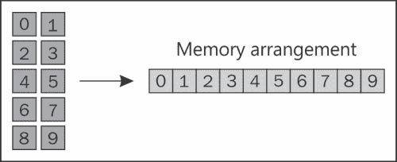
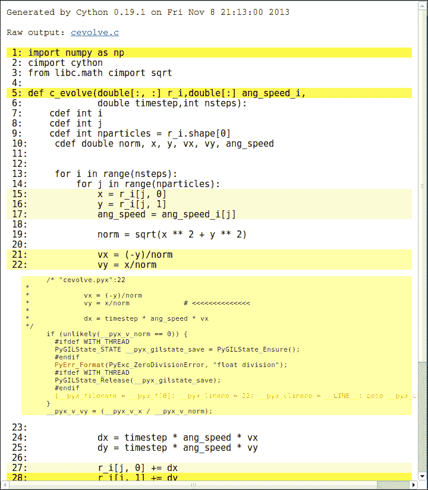

# 第三章。使用 Cython 的 C 性能

Cython 是一种通过向函数、变量和类添加静态类型来扩展 Python 的语言。Cython 结合了 Python 的简洁性和 C 语言的效率。在将脚本重写为 Cython 之后，您可以编译它们为 C 或 C++，以简单直接的方式生成高效代码。

Cython 还充当 Python 和 C 之间的桥梁，因为它可以用来创建对外部 C 代码的接口。通过创建绑定，您可以在脚本中重用快速的 C 例程，有效地使用 Python 作为粘合语言。

在本章中，我们将学习：

+   Cython 语法基础

+   如何编译 Cython 程序

+   如何使用 **静态类型** 生成快速代码

+   如何通过使用类型化的 **memoryviews** 高效地操作数组。

最后，我们将应用我们新的 Cython 技能来分析和优化粒子模拟器。

虽然对 C 语言有最小了解有帮助，但本章仅关注在 Python 优化背景下使用 Cython。因此，它不需要任何 C 语言背景知识。

# 编译 Cython 扩展

按照设计，Cython 语法是 Python 的超集。Cython 通常可以编译 Python 模块而不需要任何更改。Cython 源文件具有 `.pyx` 扩展名，并且可以使用 `cython` 命令编译为 C 语言。

我们的第一篇 Cython 脚本将包含一个简单的函数，该函数将 *Hello, World!* 打印到输出。创建一个名为 `hello.pyx` 的新文件，包含以下代码：

```py
def hello():
  print('Hello, World!')
```

`cython` 命令将读取 `hello.pyx` 并生成 `hello.c` 文件：

```py
$ cython hello.pyx

```

要将 `hello.c` 编译为 Python 扩展模块，我们将使用 gcc 编译器。我们需要添加一些依赖于操作系统的特定于 Python 的编译选项。在 Ubuntu 13.10 上，使用默认的 Python 安装，您可以使用以下选项进行编译：

```py
$ gcc -shared -pthread -fPIC -fwrapv -O2 -Wall -fno-strict-aliasing -lm -I/usr/include/python3.3/ -o hello.so hello.c

```

这将生成一个名为 `hello.so` 的文件：一个可以从 Python 导入的 C 扩展模块。

```py
>>> import hello
>>> hello.hello()
Hello, World!
```

### 注意

Cython 既可以接受 Python 2，也可以接受 Python 3 作为输入和输出语言。换句话说，您可以使用 `-3` 选项编译 Python 3 的 `hello.pyx` 文件：

```py
$ cython -3 hello.pyx

```

生成的 `hello.c` 可以通过在 gcc 中包含相应的头文件（使用 `-I` 选项）而不做任何更改地编译为 Python 2 和 Python 3：

```py
$ gcc -I/usr/include/python3.3 # ... other options
$ gcc -I/usr/include/python2.7 # ... other options

```

通过使用 `distutils`（标准的 Python 打包工具），Cython 程序可以以更直接的方式编译。通过编写 `setup.py` 脚本，我们可以直接将 `.pyx` 文件编译为扩展模块。为了编译我们的 `hello.pyx` 示例，我们需要编写一个包含以下代码的 `setup.py`：

```py
from distutils.core import setup
from Cython.Build import cythonize

setup(
  name='Hello',ext_modules = cythonize('hello.pyx'),)
```

在前面代码的前两行中，我们导入了 `setup` 函数和 `cythonize` 辅助函数。`setup` 函数包含一些键值对，告诉 `distutils` 应用程序的名称以及需要构建哪些扩展。

`cythonize` 辅助函数接受一个字符串或包含我们想要编译的 Cython 模块的字符串列表。您还可以使用以下代码使用 glob 模式：

```py
cythonize(['hello.pyx', 'world.pyx', '*.pyx'])
```

要使用 `distutils` 编译我们的扩展模块，您可以执行以下代码的 `setup.py` 脚本：

```py
$ python setup.py build_ext --inplace

```

`build_ext` 选项指示脚本构建 `ext_modules` 中指定的扩展模块，而 `--inplace` 选项将输出文件 `hello.so` 放置在源文件相同的目录中（而不是构建目录）。

Cython 模块可以自动使用 `pyximport` 编译。通过在脚本开头添加 `pyximport.install()`（或在解释器中发出该命令），您可以直接导入 `.pyx` 文件；`pyximport` 将透明地编译相应的 Cython 模块。

```py
>>> import pyximport
>>> pyximport.install()
>>> import hello # This will compile hello.pyx
```

不幸的是，`pyximport` 并不适用于所有类型的配置（例如涉及 C 和 Cython 文件组合的情况），但它对于测试简单的脚本来说很有用。

自 0.13 版本以来，IPython 包含了 `cythonmagic` 扩展，可以交互式地编写和测试一系列 Cython 语句。您可以使用 `load_ext` 在 IPython 壳中加载扩展：

```py
In [1]: %load_ext cythonmagic
```

一旦加载了扩展，您就可以使用 `%%cython` *单元格魔法* 来编写多行 Cython 片段。在以下示例中，我们定义了一个 `hello_snippet` 函数，该函数将被编译并添加到 `session` 命名空间中：

```py
In [2]: %%cython
  ....:  def hello_snippet():
   ....:    print("Hello, Cython!")
  ....:
In [3]:  hello_snippet()
Hello,  Cython!
```

# 添加静态类型

在 Python 中，变量有一个关联的类型，该类型在执行过程中可以改变。虽然这个特性是可取的，因为它使语言更加灵活，但解释器需要进行类型检查和方法查找来正确处理变量之间的操作——这是一个引入了显著开销的额外步骤。Cython 通过静态类型声明扩展了 Python 语言；这样，它可以通过避免 Python 解释器来生成高效的 C 代码。

在 Cython 中声明数据类型的主要方式是通过使用 `cdef` 语句。`cdef` 关键字可以在多个上下文中使用：声明变量、函数和扩展类型（`cdef` 类）。

## 变量

在 Cython 中，您可以通过在变量前加上 `cdef` 和相应的类型来声明变量的类型。例如，我们可以以下这种方式声明变量 `i` 为 16 位整数：

```py
cdef int i
```

`cdef` 语句支持在同一行上使用多个变量名，以及可选的初始化值，如下面的代码行所示：

```py
cdef double a, b = 2.0, c = 3.0
```

与标准变量相比，类型化变量被处理得不同。在 Python 中，变量通常被视为 *标签*，指代内存中的对象。在任何程序点，我们都可以将一个字符串赋给变量，如下所示：

```py
a = 'hello'
```

字符串 *hello* 将绑定到变量 `a`。在程序的不同位置，我们可以将另一个值赋给相同的变量，例如一个整数：

```py
a = 1
```

Python 会将整数对象 *1* 赋给变量 `a` 而不会出现任何问题。

带有类型的变量可以被认为是更类似于 *数据容器*；我们在变量中 *存储* 值，并且只有相同类型的值被允许进入。例如，如果我们将变量 `a` 声明为 `int` 类型的变量，然后我们尝试将其赋值为 `double`，Cython 将触发错误，如下面的代码所示：

```py
In [4]: %%cython
  ....: cdef int i
  ....: i = 3.0
  ....:
# Output has been cut
...cf4b.pyx:2:4 Cannot assign type 'double' to 'int'

```

静态类型允许有用的优化。如果我们声明在循环中使用的索引为整数，Cython 将将循环重写为纯 C，而无需进入 Python 解释器。在下面的示例中，我们迭代 100 次，每次都递增 `int` 变量 `j`：

```py
In [5]: %%cython
  ....: def example():
  ....:   cdef int i, j=0
  ....:   for i in range(100):....:      j += 1
  ....:   return j
  ....:
In [6]: example()
Out[6]: 100
```

为了了解改进有多大，我们将将其速度与类似的纯 Python 循环进行比较：

```py
In [7]: def example_python():
  ....:    j=0
  ....:    for i in range(100):....:      j += 1
  ....:    return j
  ....:
In [8]: %timeit example()
10000000 loops, best of 3: 25 ns per loop
In [9]: %timeit example_python()
100000 loops, best of 3: 2.74 us per loop
```

通过编写带有类型信息的循环获得的加速效果高达 100 倍！这是因为 Cython 循环首先被转换为纯 C，然后转换为高效的机器代码，而 Python 循环仍然依赖于慢速的解释器。

我们可以声明任何可用的 C 类型的变量，我们也可以通过使用 C 结构体、枚举和 `typedef` 来定义自定义类型。一个有趣的例子是，如果我们声明一个变量为 `object` 类型，该变量将接受任何类型的 Python 对象：

```py
cdef object a_py
# both 'hello' and 1 are Python objects
a_py = 'hello'
a_py = 1
```

有时，某些类型的变量是兼容的（例如 `float` 和 `int` 数字），但并不完全相同。在 Cython 中，可以通过将目标类型用 `<` 和 `>` 括号包围来在类型之间进行转换（*cast*），如下面的代码片段所示：

```py
cdef int a = 0
cdef double b
b = <double> a

```

## 函数

你可以通过在参数名称前指定类型来向 Python 函数的参数添加类型信息。这样的函数将像常规 Python 函数一样工作并执行，但其参数将进行类型检查。我们可以编写一个 `max_python` 函数，以下是这样返回两个整数之间较大值的示例：

```py
def max_python(int a, int b):
  return a if a > b else b
```

那个函数除了类型检查外没有提供太多好处。为了利用 Cython 优化，我们必须使用 `cdef` 语句和可选的返回类型来声明该函数，如下面的代码所示：

```py
cdef int max_cython(int a, int b):
  return a if a > b else b
```

以这种方式声明的函数会被转换为原生 C 函数，这些函数不能从 Python 中调用。与 Python 函数相比，它们的开销要小得多，使用它们会导致性能显著提升。它们的范围限制在相同的 Cython 文件中，除非它们在定义文件中公开（参考 *共享声明* 部分）。

Cython 允许你定义既可以从 Python 调用也可以转换为原生 C 函数的函数。如果你使用关键字 `cpdef` 声明一个函数，Cython 将生成该函数的两个版本——一个可供解释器使用的 Python 版本和一个可从 Cython 使用的快速 C 函数，从而实现便利性和速度。`cpdef` 语法与 `cdef` 相当，如下所示：

```py
cpdef int max_hybrid(int a, int b):
  return a if a > b else b
```

有时，即使有 C 函数，调用开销也可能成为性能问题，尤其是在关键循环中多次调用同一函数时。当函数体较小时，在函数定义前添加 `inline` 关键字是很方便的；函数调用将被移除并替换为函数体。例如，我们下面的 `max` 函数是 *内联* 的一个很好的候选：

```py
cdef inline int max_inline(int a, int b):
  return a if a > b else b
```

## 类

`cdef` 关键字也可以放在类定义的前面来创建一个 *扩展类型*。扩展类型类似于 Python 类，但其属性必须具有类型，并且存储在高效的 C *结构体* 中。

我们可以使用 `cdef class` 语句定义扩展类型，并在类体中声明其属性。例如，我们可以创建一个扩展类型 `Point`，如下面的代码所示，它存储两个坐标（x，y）的类型为 `double`：

```py
cdef class Point:
 cdef double x
 cdef double y

  def __init__(self, double x,double y):
    self.x = x
    self.y = y
```

在类方法中访问声明的属性允许 Cython 通过将其替换为直接访问 `struct` 字段来避免 Python 属性查找。这样，属性访问就变得非常快速。

为了利用 `struct` 访问，Cython 需要知道在编译时变量是一个扩展类型。你可以在任何可以使用标准类型（如 `double`、`float`、`int`）的地方使用扩展类型名称（如 `Point`）。例如，如果我们想编写一个计算 `Point` 的 `norm` 的 Cython 函数，我们必须将输入变量声明为 `Point`，如下面的代码所示：

```py
cdef double norm(Point p):
  return p.x**2 + p.y**2
```

默认情况下，对属性的访问限制在 Cython 代码中。如果你尝试从 Python 访问扩展类型属性，你会得到一个 `AttributeError`，如下所示：

```py
>>> a = Point(0.0, 0.0)
>>> a.x
AttributeError: 'Point' object has no attribute 'x'

```

为了从 Python 代码中访问属性，你必须使用属性声明中的 `public`（用于读写访问）或 `readonly` 说明符，如下面的代码所示：

```py
cdef class Point:
  cdef public double x
```

扩展类型不支持添加额外的属性。对于这个问题的一个解决方案是子类化扩展类型，创建一个派生的 Python 类。

# 分享声明

当编写你的 Cython 模块时，你可能希望在一个单独的文件中封装通用的函数和类型。Cython 允许你通过编写 *定义文件* 来使用 `cimport` 语句重用这些组件。

假设我们有一个包含 `max` 和 `min` 函数的模块，并且我们想在多个 Cython 程序中重用这些函数。如果我们简单地编写一个 `.pyx` 文件——也称为 *实现文件*——声明的函数将局限于同一模块中。

### 注意

定义文件也用于将 Cython 与外部 C 代码接口。其思路是将定义文件中的类型和函数原型复制过来，并将实现留给外部 C 代码。

要共享这些函数，我们需要编写一个定义文件，具有`.pxd`扩展名。这样的文件只包含我们想要与其他模块共享的类型和函数原型——一个*公共*接口。我们可以在名为`mathlib.pxd`的文件中编写我们的`max`和`min`函数的原型，如下所示：

```py
cdef int max(int a, int b)
cdef int min(int a, int b)
```

如您所见，我们只编写了函数名和参数，而没有实现函数体。

函数实现将放入具有相同基本名称但`.pyx`扩展名的实现文件中——`mathlib.pyx`：

```py
cdef int max(int a, int b):
  return a if a > b else b

cdef int min(int a, int b):
  return a if a < b else b
```

`mathlib`模块现在可以从另一个 Cython 模块导入。

要测试我们的 Cython 模块，我们将创建一个名为`distance.pyx`的文件，其中包含一个名为`chebyshev`的函数。该函数将计算两点之间的 Chebyshev 距离，如下面的代码所示。两点坐标（x1, y1）和（x2, y2）之间的 Chebyshev 距离定义为每个坐标之间差异的最大值。

```py
max(abs(x1 – x2), abs(y1 – y2))
```

要实现`chebyshev`函数，我们将使用`max`函数，它在`mathlib.pxd`中声明，通过使用`cimport`语句导入，如下面的代码片段所示：

```py
from mathlib cimport max

def chebyshev(int x1,int y1,int x2,int y2):
  return max(abs(x1 - x2), abs(y1 - y2))
```

`cimport`语句将读取`hello.pxd`，并将`max`定义用于生成`distance.c`文件。

# 使用数组

数值和高性能计算通常使用数组。Cython 提供了一种简单的方法来与之交互，从 C 数组的底层方法到更通用的*类型化内存视图*。

## C 数组和指针

C 数组是一系列大小相同的项，在内存中连续存储。在深入了解细节之前，了解（或复习）C 语言中内存的管理方式是有帮助的。

C 语言中的变量就像容器。当创建一个变量时，会在内存中预留一个空间来存储其值。例如，如果我们创建一个包含 64 位浮点数（`double`）的变量，程序将分配 64 位（16 字节）的内存。这部分内存可以通过该内存位置的地址来访问。

要获取变量的地址，我们可以使用*地址运算符*，用`&`符号表示。我们还可以使用`printf`函数，如下所示，在`libc.stdio` Cython 模块中可用，以打印该变量的地址：

```py
In [1]: %%cython
  ...: cdef double a
  ...: from libc.stdio cimport printf
  ...: printf("%p", &a)
  ...:
0x7fc8bb611210
```

内存地址可以存储在特殊的变量中——*指针*，通过在变量名前放置`*`前缀来声明，如下所示：

```py
from libc.stdio cimport printf
cdef double a
cdef double *a_pointer
a_pointer = &a # They are of the same data type
```

如果我们有一个指针，并且想要获取它所指向的地址中的值，我们可以使用*解引用运算符*，用`*`符号表示，如下面的代码所示。请注意，在此上下文中使用的`*`与在变量声明中使用的`*`有不同的含义。

```py
cdef double a
cdef double *a_pointer
a_pointer = &a
a = 3.0
print(*a_pointer) # prints 3.0

```

当声明一个 C 数组时，程序会分配足够的空间来包含指定大小的多个元素。例如，要创建一个包含 10 个`double`值（每个 8 字节）的数组，程序将在内存中保留*8 * 10 = 80*字节的连续空间。在 Cython 中，我们可以使用以下语法声明这样的数组：

```py
cdef double arr[10]
```

我们也可以使用以下语法声明一个多维数组，例如一个有 5 行 2 列的数组：

```py
cdef double arr[5][2]
```

内存将在一个单独的内存块中分配，一行接一行。这种顺序通常被称为*行主序*，如下图中所示。数组也可以按*列主序*排序，正如在 FORTRAN 编程语言中发生的那样。



### 小贴士

数组排序有重要的影响。当我们对 C 数组的最后一个维度进行迭代时，我们访问连续的内存块（在我们的例子中是 0, 1, 2, 3 …），而当我们对第一个维度进行迭代时，我们会跳过一些位置（0, 2, 4, 6, 8, 1 …）。你应该始终尝试连续访问内存，因为这优化了缓存的使用。

我们可以通过使用标准索引来存储和检索数组中的元素，C 数组不支持花哨的索引或切片：

```py
arr[0] = 1.0
```

C 数组也可以用作指针。实际上，`arr`变量是一个指向数组第一个元素的指针。我们可以验证数组第一个元素的地址与变量`arr`中包含的地址相同：

```py
In [1]: %%cython
  ...: from libc.stdio cimport printf
  ...: cdef double arr[10]
  ...: printf("%p\n", arr)
  ...: printf("%p\n", &arr[0])
  ...:
0x7ff6de204220
0x7ff6de204220
```

当与现有的 C 库接口或需要精细控制内存时，应使用 C 数组和指针。对于更常见的用例，可以使用 NumPy 数组或类型化内存视图。

## NumPy 数组

NumPy 数组可以作为常规 Python 对象在 Cython 中使用，通过使用它们的已优化的广播操作。

当我们想要高效地遍历数组时，问题就出现了。当我们对 NumPy 数组进行索引操作时，解释器级别会发生一些其他操作，导致大量开销。Cython 可以通过直接作用于 NumPy 数组使用的底层内存区域来优化这些索引操作，使我们能够像 C 数组一样处理它们。

NumPy 数组支持以`ndarray`数据类型的形式提供。我们首先必须`cimport` `numpy`模块。我们将其分配给名称`c_np`以区分它和常规的`numpy` Python 模块，如下所示：

```py
cimport numpy as c_np
```

我们现在可以通过指定数组元素的类型和维度数，使用一种称为*缓冲区语法*的特殊语法来声明 NumPy 数组。要声明一个类型为`double`的两维数组，我们可以使用以下代码：

```py
cdef c_np.ndarray[double, ndim=2] arr
```

以这种方式定义的数组将通过直接作用于底层内存区域来进行索引；这种操作将避免 Python 解释器给我们带来巨大的速度提升。

在下一个示例中，我们将展示缓冲区语法的用法，并将其与常规 Python 版本进行比较。

我们首先编写了 `numpy_bench_py` 函数，该函数将 `py_arr` 的每个元素增加 1000。我们将索引 `i` 声明为整数，以避免 `for` 循环的开销：

```py
In [1]:  %%cython
  ...:  import numpy as np
  ...:  def numpy_bench_py():...:    py_arr = np.random.rand(1000)
  ...:    cdef int i
  ...:    for i in range(1000):
  ...:       py_arr[i] += 1
```

然后，我们使用缓冲区语法编写相同的函数。注意，在定义 `c_arr` 变量使用 `c_np.ndarray` 之后，我们可以从 `numpy` Python 模块给它分配一个数组：

```py
In [2]:  %%cython
  ...:  import numpy as np
  ...:  cimport numpy as c_np
  ...:  def numpy_bench_c():
  ...:    cdef c_np.ndarray[double, ndim=1] c_arr
  ...:    c_arr = np.random.rand(1000)
  ...:    cdef int i
  ...:
  ...:    for i in range(1000):
  ...:       c_arr[i] += 1
```

我们可以使用 `timeit` 来计时结果，获得令人印象深刻的 50 倍速度提升：

```py
In [10]: %timeit numpy_bench_c()
100000 loops, best of 3: 11.5 us per loop
In [11]: %timeit numpy_bench_py()
1000 loops, best of
 3: 603 us per loop
```

## 类型化内存视图

C 和 NumPy 数组都是作用于内存区域的对象。Cython 提供了一个通用的对象——*类型化内存视图*——以访问数组和其他暴露所谓 *缓冲区接口* 的数据结构，例如内置的 `bytes`、`bytearray` 和 `array.array`。

**内存视图**是一个维护对某个内存区域的引用的对象。它实际上并不拥有内存，但它可以读取和更改其内容（它是一个 *视图*）。通过使用类型化内存视图，我们可以以相同的方式与 C 和 NumPy 数组进行交互。

内存视图可以使用特殊语法定义。我们可以以下这种方式定义一个 `int` 类型的内存视图和一个 2D `double` 类型的内存视图：

```py
cdef int[:] a
cdef double[:, :] b
```

相同的语法适用于函数定义、类属性等。任何暴露缓冲区接口的对象都将自动绑定到内存视图。我们可以通过以下简单的赋值来绑定内存视图到数组：

```py
import numpy as np

cdef int[:] arr
arr_np = np.zeros(10, dtype='int32')
arr = arr_np # We bind the array to the memoryview
```

新的内存视图将与 NumPy 数组共享数据。数组元素的变化将在两个数据结构之间共享：

```py
arr[2] = 1 # Changing memoryview
print(arr_np)
# [0 0 1 0 0 0 0 0 0 0]
```

在某种意义上，内存视图是 NumPy 数组的一种推广。正如我们在第二章中看到的，“使用 NumPy 的快速数组操作”，切片 NumPy 数组不会复制数据，而是返回对同一内存区域的视图。

内存视图还支持以下标准 NumPy 语法进行数组切片：

```py
cdef int[:, :, :] a
arr[0, :, :] # Is a 2-dimensional memoryview
arr[0, 0, :] # Is a 1-dimensional memoryview
arr[0, 0, 0] # Is an int
```

要在内存视图和另一个对象之间复制数据，你可以使用类似于切片赋值的语法，如下面的代码所示：

```py
import numpy as np

cdef double[:, :] b
cdef double[:] r
b = np.random.rand(10, 3)
r = np.zeros(3, dtype='float64')

b[0, :] = r # Copy the value of r in the first row of b
```

在下一节中，我们将使用类型化内存视图来处理我们的粒子模拟器应用程序中的数组。

# Cython 中的粒子模拟器

现在我们对 Cython 的工作原理有了基本的了解，我们可以重写 `ParticleSimulator.evolve` 方法。多亏了 Cython，我们可以将我们的循环转换为 C，从而消除由 Python 解释器引入的开销。

在第二章中，我们编写了一个相当高效的 `evolve` 方法版本，使用 NumPy。我们可以将旧版本重命名为 `evolve_numpy` 以区分新旧版本：

```py
  def evolve_numpy(self, dt):
    timestep = 0.00001
    nsteps = int(dt/timestep)

    r_i = np.array([[p.x, p.y] for p in self.particles])    
    ang_speed_i = np.array([p.ang_speed for pin self.particles])
    v_i = np.empty_like(r_i)

    for i in range(nsteps):
      norm_i = np.sqrt((r_i ** 2).sum(axis=1))

      v_i = r_i[:, [1, 0]]
      v_i[:, 0] *= -1
      v_i /= norm_i[:, np.newaxis]        

      d_i = timestep * ang_speed_i[:, np.newaxis] * v_i

      r_i += d_i

    for i, p in enumerate(self.particles):
      p.x, p.y = r_i[i]
```

我们希望将此代码转换为 Cython。我们的策略将是利用快速索引操作，通过删除 NumPy 数组广播，从而回到基于索引的算法。由于 Cython 生成高效的 C 代码，我们可以自由地使用尽可能多的循环，而不会产生任何性能惩罚。

作为设计选择，我们可以决定将循环封装在一个函数中，我们将用名为 `cevolve.pyx` 的 Cython 模块重写这个函数。该模块将包含一个单一的 Python 函数 `c_evolve`，它将接受粒子位置、角速度、时间步长和步数作为输入。

起初，我们并没有添加类型信息；我们只是想隔离函数并确保我们可以无错误地编译我们的模块。

```py
# file: simul.py
# ... other code
  def evolve_cython(self, dt):
    timestep = 0.00001
    nsteps = int(dt/timestep)

    r_i = np.array([[p.x, p.y] for p in self.particles])    
    ang_speed_i = np.array([p.ang_speed forp in self.particles])

    c_evolve(r_i, ang_speed_i, timestep, nsteps)

    for i, p in enumerate(self.particles):
      p.x, p.y = r_i[i]

# file: cevolve.pyx
import numpy as np

def c_evolve(r_i, ang_speed_i, timestep, nsteps):
  v_i = np.empty_like(r_i)

  for i in range(nsteps):
    norm_i = np.sqrt((r_i ** 2).sum(axis=1))

    v_i = r_i[:, [1, 0]]
    v_i[:, 0] *= -1
    v_i /= norm_i[:, np.newaxis]        

    d_i = timestep * ang_speed_i[:, np.newaxis] * v_i

    r_i += d_i
```

注意，我们不需要为 `c_evolve` 返回值，因为值是在 `r_i` 数组中就地更新的。我们可以通过稍微改变我们的基准函数，将无类型的 Cython 版本与旧的 NumPy 版本进行基准测试，如下所示：

```py
def benchmark(npart=100, method='python'):
  particles = [Particle(uniform(-1.0, 1.0),uniform(-1.0, 1.0),uniform(-1.0, 1.0))for i in range(npart)]

  simulator = ParticleSimulator(particles)
  if method=='python':
    simulator.evolve_python(0.1)

 if method == 'cython':
 simulator.evolve_cython(0.1)

  elif method == 'numpy':
 simulator.evolve_numpy(0.1)

```

我们可以在 IPython 壳中计时不同的版本：

```py
In [4]: %timeit benchmark(100, 'cython')
1 loops, best of 3: 401 ms per loop
In [5]: %timeit benchmark(100, 'numpy')
1 loops, best of 3: 413 ms per loop
```

这两个版本的速度相同。编译不带静态类型的 Cython 模块并不比纯 Python 有任何优势。下一步，是声明所有重要变量的类型，以便 Cython 可以执行其优化。

我们可以先从添加函数参数的类型开始。我们将声明数组为包含 `double` 值的已类型化内存视图。值得一提的是，如果我们传递一个 `int` 或 `float32` 类型的数组，转换不会自动发生，我们会得到一个错误。

```py
def c_evolve(double[:, :] r_i, double[:] ang_speed_i,double timestep, int nsteps):
```

在这一点上，我们想要重写粒子和时间步的循环。我们可以将迭代变量 `i`、`j` 和粒子数 `nparticles` 声明为 `int`：

```py
  cdef int i, j
  cdef int nparticles = r_i.shape[0]
```

在这一点上，算法与纯 Python 版本非常相似；我们遍历粒子和时间步，并计算每个粒子坐标的速度和位移向量，如下所示：

```py
  for i in range(nsteps):
    for j in range(nparticles):
      x = r_i[j, 0]
      y = r_i[j, 1]
      ang_speed = ang_speed_i[j]

      norm = sqrt(x ** 2 + y ** 2)

      vx = (-y)/norm
      vy = x/norm

      dx = timestep * ang_speed * vx
      dy = timestep * ang_speed * vy

      r_i[j, 0] += dx
      r_i[j, 1] += dy
```

在之前的代码中，我们添加了 `x`、`y`、`ang_speed`、`norm`、`vx`、`vy`、`dx` 和 `dy` 变量。为了避免 Python 解释器的开销，我们必须在函数开始时声明它们对应的类型，如下所示：

```py
cdef double norm, x, y, vx, vy, dx, dy, ang_speed
```

我们还使用了一个名为 `sqrt` 的函数来计算范数。如果我们使用 `math` 模块或 `numpy` 中的 `sqrt`，我们又会将一个慢速的 Python 函数包含在我们的关键循环中，从而降低我们的性能。标准 C 库中有一个快速的 `sqrt`，已经包含在 `libc.math` Cython 模块中：

```py
from libc.math cimport sqrt
```

重新编译后，我们可以重新运行我们的基准测试来评估我们的改进，如下所示：

```py
In [4]: %timeit benchmark(100, 'cython')
100 loops, best of 3: 13.4 ms per loop
In [5]: %timeit benchmark(100, 'numpy')
1 loops, best of 3: 429 ms per loop
```

对于小的粒子数，速度提升非常巨大，我们获得了比上一个版本 40 倍的性能提升。然而，我们也应该尝试使用更多的粒子来测试性能缩放，如下面的代码所示：

```py
In [2]: %timeit benchmark(1000, 'cython')
10 loops, best of 3: 134 ms per loop
In [3]: %timeit benchmark(1000, 'numpy')
1 loops, best of 3: 877 ms per loop
```

随着粒子数的增加，两个版本的速度越来越接近。通过将粒子大小增加到 1000，我们已经将速度提升降低到更适度的 6 倍。这很可能是由于随着粒子数的增加，Python for 循环的开销与其它操作的速度相比变得越来越不显著。

# 分析 Cython

Cython 给我们一个很棒的工具，可以快速找到由于 Python 解释器引起的缓慢区域——一个称为 *注释视图* 的功能。我们可以通过使用 `-a` 选项编译 Cython 文件来打开此功能，使用以下命令行。Cython 将生成一个包含我们代码的 HTML 文件，并附有有用的注释：

```py
$ cython -a cevolve.pyx
$ google-chrome cevolve.html

```

下面的截图显示的 HTML 文件显示了我们的 Cython 文件逐行内容：



每一行都有不同深浅的黄色背景色；深色表示代码有很多与解释器相关的调用，而白色行则被转换为纯 C 代码。由于解释器调用通常较慢，目标是使函数体尽可能为白色。通过点击任何一行，我们可以看到 Cython 编译器生成的 C 代码。例如，行 `v_y = x/norm` 检查 norm 是否为 0，否则引发 `ZeroDivisionError`。行 `x = r_i[j, 0]` 显示 Cython 检查索引是否在数组的边界内。您可能会注意到最后一行颜色非常强烈，通过检查代码我们可以看到这实际上是一个错误；代码引用了与函数结束相关的样板代码。

Cython 可以通过其编译器指令关闭这些检查以提高速度。有三种不同的方式来添加编译器指令：

+   使用装饰器或上下文管理器

+   在文件开头使用注释

+   使用 Cython 命令行选项

    ### 注意

    您可以在官方文档中找到 Cython 编译器指令的完整列表，链接为 [`docs.cython.org/src/reference/compilation.html#compiler-directives`](http://docs.cython.org/src/reference/compilation.html#compiler-directives)

例如，要禁用数组的 "bounds" 检查，只需以下方式装饰一个函数 `cython.boundscheck`：

```py
cimport cython

@cython.boundscheck(False)
def myfunction:
  # Code here
```

我们可以使用 `cython.boundscheck` 将代码块包装到上下文管理器中，如下所示：

```py
with cython.boundscheck(False):
  # Code here
```

如果我们想要禁用整个模块的边界检查，我们可以在文件开头添加以下代码行：

```py
# cython: boundscheck=False
```

要使用命令行选项更改指令，您可以使用 `-X` 如下所示：

```py
$ cython -X boundscheck=True

```

我们现在可以尝试通过禁用 `boundscheck` 指令并启用 `cdivision`（这将禁用 `ZeroDivisionError` 的检查）来避免函数中的额外检查，如下面的代码所示：

```py
cimport cython

@cython.boundscheck(False)
@cython.cdivision(True)
def c_evolve(double[:, :] r_i,double[:] ang_speed_i,double timestep,int nsteps):
```

如果我们再次查看注释视图，循环体完全为白色；我们从循环中移除了所有解释器的痕迹。然而，在以下情况下，我们没有获得性能提升：

```py
In [3]: %timeit benchmark(100, 'cython')
100 loops, best of 3: 13.4 ms per loop
```

我们可以通过在文件中包含 `profile=True` 指令来使用 `cProfile` 对 Cython 代码进行性能分析。为了展示其用法，我们可以编写一个函数来计算两个坐标数组之间的 Chebyshev 距离。创建一个名为 `cheb.py` 的文件：

```py
import numpy as np
from distance import chebyshev

def benchmark():
  a = np.random.rand(100, 2)
  b = np.random.rand(100, 2)
  for x1, y1 in a:
    for x2, y2 in b:
      chebyshev(x1, x2, y1, y2)
```

如果我们尝试以当前状态分析此脚本，我们将不会得到关于我们在 Cython 中实现的函数的任何统计信息。如果我们想了解`max`和`min`函数的配置文件指标，我们必须将`profile=True`选项添加到`mathlib.pyx`文件中，如下所示：

```py
# cython: profile=True

cdef int max(int a, int b):
  # Code here
```

现在，我们可以使用 IPython 中的`%prun`来分析我们的脚本，如下所示：

```py
In [2]: import cheb
In [3]: %prun cheb.benchmark()
     2000005 function calls in 2.066 seconds

  Ordered by: internal time

  ncalls tottime percall cumtime percall filename:lineno(function)
    1  1.664  1.664  2.066  2.066 cheb.py:4(benchmark)
 1000000  0.351  0.000  0.401  0.000 {distance.chebyshev}
 1000000  0.050  0.000  0.050  0.000 mathlib.pyx:2(max)
    2  0.000  0.000  0.000  0.000 {method 'rand' of 'mtrand.RandomState' objects}
    1  0.000  0.000  2.066  2.066 <string>:1(<module>)
    1  0.000  0.000  0.000  0.000 {method 'disable' of '_lsprof.Profiler' objects}
```

从输出中，我们可以看到`max`函数存在并且不是瓶颈。问题似乎出在`benchmark`函数上；问题很可能是 Python 循环的开销。在这种情况下，最佳策略是将循环重写为 NumPy 或移植代码到 Cython。

# 摘要

Cython 将把您程序的运行速度提升到另一个层次。与 C 语言相比，Cython 程序更容易维护，这得益于与 Python 的紧密集成以及可用性分析工具。

在本章中，我们介绍了 Cython 语言的基础知识以及如何通过添加静态类型来使我们的程序更快。我们还学习了如何处理 C 数组、NumPy 数组和内存视图。

我们通过重写关键的`evolve`函数优化了我们的粒子模拟器，获得了巨大的速度提升。最后，我们学会了如何使用注释视图快速定位与解释器相关的调用，以及如何为 Cython 脚本启用`cProfile`。

在下一章中，我们将学习并行处理的基础知识，并了解如何编写利用多个处理器的 Python 程序，以便您可以编写更快的程序并解决更大的问题。
