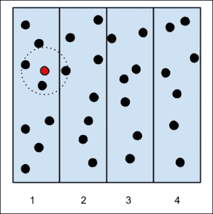
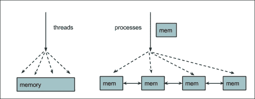
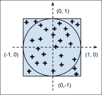
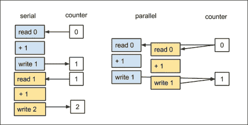

# 第四章 并行处理

使用并行处理，你可以在不使用更快的处理器的情况下，在给定时间内增加程序可以完成的计算量。主要思想是将任务划分为许多子单元，并使用多个处理器独立解决它们。

包含多个核心（2、4、6、8、...）的 CPU 已成为技术界的普遍趋势。提高单个处理器的速度成本高昂且问题重重；而利用价格更低的多个核心处理器的并行能力是提高性能的可行途径。

并行处理让你能够处理大规模问题。科学家和工程师通常在超级计算机上运行并行代码——由大量标准处理器组成的庞大网络——以模拟庞大的系统。并行技术还可以利用图形芯片（一种针对并行化优化的硬件）。

Python 可以用于所有这些领域，使我们能够以简单和优雅的方式将并行处理应用于各种问题，开启无限可能的大门。

在本章中，我们将：

+   简要介绍并行处理的基本原理

+   使用 multiprocessing Python 库说明如何并行化简单问题

+   学习如何使用**IPython parallel**框架编写程序

+   使用 Cython 和 OpenMP 进一步优化我们的程序

# 并行编程简介

为了并行化一个程序，我们需要将问题划分为可以独立（或几乎独立）运行的子单元。

当子单元之间完全独立时，这样的问题被称为**令人尴尬的并行**。数组上的元素级操作是一个典型例子——操作只需要知道它当前处理的元素。另一个例子是我们的粒子模拟器——由于没有相互作用，每个粒子可以独立于其他粒子在时间上进化。令人尴尬的并行问题很容易实现，并且在并行架构上表现最优。

其他问题可能可以划分为子单元，但必须共享一些数据以执行它们的计算。在这些情况下，实现方式不太直接，并且由于通信成本可能导致性能问题。

我们将通过一个例子来说明这个概念。想象你有一个粒子模拟器，但这次粒子在特定距离内会吸引其他粒子（如图所示）。为了并行化这个问题，我们将模拟区域划分为区域，并将每个区域分配给不同的处理器。如果我们对系统进行一步进化，一些粒子将与相邻区域的粒子相互作用。为了执行下一次迭代，需要相邻区域的新粒子位置：



进程间的通信成本高昂，可能会严重阻碍并行程序的性能。在并行程序中处理数据通信存在两种主要方法：

+   **共享内存**

+   **分布式内存**

在共享内存中，子单元可以访问相同的内存空间。这种方法的优点是，你不需要显式地处理通信，因为从共享内存中写入或读取就足够了。然而，当多个进程同时尝试访问和更改相同的内存位置时，就会出现问题。应小心使用同步技术来避免此类冲突。

在分布式内存模型中，每个进程与其他进程完全分离，并拥有自己的内存空间。在这种情况下，进程间的通信是显式处理的。与共享内存相比，通信开销通常更昂贵，因为数据可能需要通过网络接口传输。

在共享内存模型中实现并行性的一个常见方法是 **线程**。线程是从进程派生出来的独立子任务，并共享资源，如内存。

Python 可以创建和处理线程，但由于 Python 解释器的设计，它们不能用来提高性能——一次只能允许一个 Python 指令运行。这种机制被称为 **全局解释器锁**（**GIL**）。其工作原理是，每次线程执行 Python 语句时，都会获取一个锁，这阻止了其他线程在锁释放之前运行。GIL 避免了线程之间的冲突，简化了 **CPython** 解释器的实现。尽管存在这种限制，但在可以释放锁的情况，例如耗时的 I/O 操作或 C 扩展中，线程仍然可以用来提供并发性。

可以通过使用进程而不是线程来完全避免 GIL。进程不共享相同的内存区域，彼此独立——每个进程都有自己的解释器。通过使用进程，我们将几乎没有缺点：进程间通信比共享内存效率低，但它更灵活且更明确。



# 多进程模块

标准的 `multiprocessing` 模块可以通过创建多个进程来快速并行化简单任务。它的接口易于使用，并包括一些用于处理任务提交和同步的实用工具。

## 进程和池类

你可以通过继承 `multiprocessing.Process` 来创建一个独立运行的进程。你可以扩展 `__init__` 方法来初始化资源，并且可以通过实现 `Process.run` 方法来编写分配给子进程的代码部分。在以下代码中，我们定义了一个将等待一秒并打印其分配的 `id` 的进程：

```py
import multiprocessing
import time

class Process(multiprocessing.Process):
    def __init__(self, id):
        super(Process, self).__init__()
        self.id = id

    def run(self):
        time.sleep(1)
        print("I'm the process with id: {}".format(self.id))
```

要创建进程，我们必须初始化我们的 `Process` 对象并调用 `Process.start` 方法。请注意，您不会直接调用 `Process.run`：调用 `Process.start` 将创建一个新的进程，并依次调用 `Process.run` 方法。我们可以在脚本末尾添加以下行来初始化并启动新进程：

```py
if __name__ == '__main__':
    p = Process(0)
    p.start()

```

在 `Process.start` 之后的指令将立即执行，而不需要等待进程 `p` 完成。要等待任务完成，您可以使用 `Process.join` 方法，如下所示：

```py
 if __name__ == '__main__':
    p = Process(0)
    p.start()
    p.join()

```

我们可以用相同的方式启动四个不同的进程，它们将并行运行。在一个串行程序中，总共需要四秒钟。由于我们并行运行，每个进程将同时运行，从而实现 1 秒的墙钟时间。在以下代码中，我们创建了四个进程并并行启动它们：

```py
if __name__ == '__main__':
    processes = Process(1), Process(2), Process(3), Process(4)
    [p.start() for p in processes]
```

注意，并行进程的执行顺序是不可预测的，它最终取决于操作系统如何调度进程执行。您可以通过多次运行程序来验证此行为——每次运行的顺序都会不同。

`multiprocessing` 模块提供了一个方便的接口，使得将任务分配和分发到一组进程变得容易，`multiprocessing.Pool` 类。

`multiprocessing.Pool` 类创建了一组进程——称为 **工作者**——并允许通过 `apply`/`apply_async` 和 `map`/`map_async` 方法提交任务。

`Pool.map` 方法将函数应用于列表中的每个元素，并返回结果列表。它的用法与内置（串行）`map` 相当。

要使用并行映射，您首先需要初始化一个 `multiprocessing.Pool` 对象。它将工作进程的数量作为其第一个参数；如果没有提供，则该数量将与系统中的核心数相等。您可以通过以下方式初始化一个 `multiprocessing.Pool` 对象：

```py
pool = multiprocessing.Pool()
pool = multiprocessing.Pool(processes=4)
```

让我们看看 `Pool.map` 的实际应用。如果您有一个计算数字平方的函数，您可以通过调用 `Pool.map` 并传递函数及其输入列表作为参数，将该函数映射到列表上，如下所示：

```py
def square(x):
    return x * x

inputs = [0, 1, 2, 3, 4]
outputs = pool.map(square, inputs)

```

`Pool.map_async` 方法与 `Pool.map` 类似，但返回一个 `AsyncResult` 对象而不是实际的结果。当我们调用正常的 `map` 时，主程序的执行将停止，直到所有工作进程完成处理结果。使用 `map_async`，`AsyncResult` 对象将立即返回，而不会阻塞主程序，计算将在后台进行。然后我们可以通过使用 `AsyncResult.get` 方法在任何时候检索结果，如下所示：

```py
outputs_async = pool.map_async(square, inputs)
outputs = outputs_async.get()

```

`Pool.apply_async` 将由单个函数组成的任务分配给一个工作进程。它接受函数及其参数，并返回一个 `AsyncResult` 对象。我们可以通过使用 `apply_async` 来获得类似于 `map` 的效果，如下所示：

```py
results_async = [pool.apply_async(square, i) for i in range(100))]
results = [r.get() for r in results_async]
```

作为例子，我们将实现一个典型的、令人尴尬的并行程序：**蒙特卡洛法估算π**。

## 蒙特卡洛法估算π

想象我们有一个边长为 2 个单位的正方形；其面积将是 4 个单位。现在，我们在正方形内画一个半径为 1 个单位的圆，圆的面积将是 `π * r²`。通过将 `r` 的值代入前面的方程，我们得到圆的面积数值为 `π * (1)² = π`。你可以参考以下图示进行图形表示。

如果我们在该图形上随机射击很多点，一些点将落在圆内——我们将它们称为**命中**——而剩余的点——**未命中**——将位于圆外。蒙特卡洛方法的思想是圆的面积将与命中的数量成正比，而正方形的面积将与射击的总数成正比。为了得到π的值，只需将圆的面积（等于π）除以正方形的面积（等于 4）并解出π：

```py
hits/total = area_circle/area_square = pi/4
pi = 4 * hits/total
```



我们程序中将采用的战略是：

+   在范围（-1，1）内生成大量的样本（*x*，*y*）数字

+   通过检查 `x**2 + y**2 == 1` 来测试这些数字是否位于圆内

我们首先编写一个串行版本并检查它是否工作。然后，我们可以编写并行版本。串行程序的实现如下：

```py
import random

samples = 1000000
hits = 0

for i in range(samples):
    x = random.uniform(-1.0, 1.0)
    y = random.uniform(-1.0, 1.0)

    if x**2 + y**2 <= 1:
        hits += 1

pi = 4.0 * hits/samples
```

随着样本数量的增加，我们的近似精度将提高。你可以注意到每个循环迭代都是独立的——这个问题是令人尴尬的并行。

为了并行化此代码，我们可以编写一个名为 `sample` 的函数，它对应于单个命中-未命中检查。如果样本击中圆，则函数返回 `1`；否则返回 `0`。通过多次运行 `sample` 并汇总结果，我们将得到总命中数。我们可以通过 `apply_async` 在多个处理器上运行 `sample` 并以下列方式获取结果：

```py
def sample():
    x = random.uniform(-1.0, 1.0)
    y = random.uniform(-1.0, 1.0)

    if x**2 + y**2 <= 1:
        return 1
    else:
        return 0

pool = multiprocessing.Pool()
results_async = [pool.apply_async(sample) for i in range(samples)]
hits = sum(r.get() for r in results_async)
```

我们可以将这两个版本封装在函数 `pi_serial` 和 `pi_apply_async` 中（你可以在 `pi.py` 文件中找到它们的实现）并按如下方式基准测试执行速度：

```py
$ time python -c 'import pi; pi.pi_serial()'
real    0m0.734s
user    0m0.731s
sys    0m0.004s
$ time python -c 'import pi; pi.pi_apply_async()'
real    1m36.989s
user    1m55.984s
sys    0m50.386

```

如前基准测试所示，我们的第一个并行版本实际上削弱了我们的代码。原因是实际计算所需的时间与发送和分配任务到工作者的开销相比非常小。

为了解决这个问题，我们必须使开销与计算时间相比可以忽略不计。例如，我们可以要求每个工作者一次处理多个样本，从而减少任务通信开销。我们可以编写一个名为 `sample_multiple` 的函数，通过将问题分解为 10 个更密集的任务来修改我们的并行版本，如下面的代码所示：

```py
def sample_multiple(samples_partial):
 return sum(sample() for i in range(samples_partial))

ntasks = 10
chunk_size = int(samples/ntasks)
pool = multiprocessing.Pool()
results_async = [pool.apply_async(sample_multiple, chunk_size)
 for i in range(ntasks)]
hits = sum(r.get() for r in results_async)
```

我们可以将这个功能封装在一个名为 `pi_apply_async_chunked` 的函数中，并按如下方式运行：

```py
$ time python -c 'import pi; pi.pi_apply_async_chunked()'
real    0m0.325s
user    0m0.816s
sys    0m0.008s

```

结果要好得多；我们使程序的速度提高了不止一倍。你还可以注意到`user`指标大于`real`：总 CPU 时间大于总时间，因为同时使用了多个 CPU。如果你增加样本数量，你会注意到通信与计算的比率降低，从而提供更好的加速。

在处理令人尴尬的并行问题时，一切都很简单。但有时，你必须在进程之间共享数据。

## 同步和锁

即使`multiprocessing`使用进程（它们有自己独立的内存），它也允许你定义某些变量和数组作为共享内存。你可以通过使用`multiprocessing.Value`并将数据类型作为字符串传递（`i`表示整数，`d`表示双精度，`f`表示浮点数等）来定义一个共享变量。你可以通过`value`属性更新变量的内容，如下面的代码片段所示：

```py
shared_variable = multiprocessing.Value('f')
shared_variable.value = 0
```

当使用共享内存时，你应该意识到并发访问。想象你有一个共享的整数变量，每个进程多次增加它的值。你可以定义一个进程类如下：

```py
class Process(multiprocessing.Process):

    def __init__(self, counter):
        super(Process, self).__init__()
        self.counter = counter

    def run(self):
        for i in range(1000):
            self.counter.value += 1

```

你可以在主程序中初始化共享变量，并将其传递给`4`个进程，如下面的代码所示：

```py
def main():
    counter = multiprocessing.Value('i', lock=True)
    counter.value = 0

    processes = [Process(counter) for i in range(4)]
    [p.start() for p in processes]
    [p.join() for p in processes] # processes are done
    print(counter.value)
main()
```

如果你运行这个程序（代码目录中的`shared.py`），你会注意到`counter`的最终值不是 4000，而是有随机值（在我的机器上它们在 2000 到 2500 之间）。如果我们假设算术是正确的，我们可以得出结论，并行化存在问题。

发生的情况是多个进程同时尝试访问相同的共享变量。这种情况最好通过以下图示来解释。在串行执行中，第一个进程读取（数字`0`），增加它，并写入新值（`1`）；第二个进程读取新值（`1`），增加它，并再次写入（`2`）。在并行执行中，两个进程同时读取值（`0`），增加它，并写入它（`1`），导致错误的结果。



为了解决这个问题，我们需要同步对这个变量的访问，以确保一次只有一个进程可以访问、增加并在共享变量上写入值。这个功能由`multiprocessing.Lock`类提供。锁可以通过`acquire`和`release`方法获取和释放，或者通过将锁用作上下文管理器来使用。当一个进程获取锁时，其他进程将无法获取它，直到锁被释放。

我们可以定义一个全局锁，并使用它作为上下文管理器来限制对计数器的访问，如下面的代码片段所示：

```py
lock = multiprocessing.Lock()

class Process(multiprocessing.Process):

    def __init__(self, counter):
        super(Process, self).__init__()
        self.counter = counter

    def run(self):
        for i in range(1000):
            with lock: # acquire the lock
 self.counter.value += 1
 # release the lock

```

同步原语，如锁，对于解决许多问题是必不可少的，但你应该避免过度使用它们，因为它们可能会降低你程序的性能。

### 注意

`multiprocessing` 包含其他通信和同步工具，你可以参考官方文档以获取完整的参考信息：

[`docs.python.org/3/library/multiprocessing.html`](http://docs.python.org/3/library/multiprocessing.html)

# IPython parallel

IPython 的强大之处不仅限于其高级壳。它的 `parallel` 包包括一个框架，用于在单核和多核机器上以及连接到网络的多个节点上设置和运行计算。IPython 很棒，因为它为并行计算增添了交互式特性，并为不同的通信协议提供了一个统一的接口。

要使用 `IPython.parallel`，你必须启动一组由 **Controller**（一个在客户端和引擎之间进行通信调度的实体）管理的 **Engines**（引擎）。这种方法与多进程完全不同；你将单独启动工作进程，它们将无限期地等待，监听来自客户端的命令。

要启动控制器和一组引擎（默认情况下，每个处理单元一个引擎），你可以使用 `ipcluster` 壳命令，如下所示：

```py
$ ipcluster start

```

使用 `ipcluster`，你还可以通过编写自定义配置文件来设置多个节点，以在网络中分配你的计算。你可以参考以下网站上的官方文档以获取具体说明：

[`ipython.org/ipython-doc/dev/parallel/parallel_process.html`](http://ipython.org/ipython-doc/dev/parallel/parallel_process.html)

在启动控制器和引擎后，我们可以使用 IPython 壳来并行执行计算。IPython 提供了两个基本接口（或视图）：**直接**和**基于任务的**。

## 直接接口

直接接口允许你明确地向每个计算单元发送命令。该接口直观、灵活且易于使用，尤其是在交互式会话中使用时。

在启动引擎后，你必须在单独的壳中启动 IPython 会话来与之交互。通过创建一个客户端，你可以建立与控制器的连接。在以下代码中，我们导入 `Client` 类并创建一个实例：

```py
In [1]: from IPython.parallel import Client
In [2]: rc = Client()
```

属性 `Client.ids` 将会给你一个表示可用引擎的整数列表，如下代码片段所示：

```py
In [3]: rc.ids
Out[4]: [0, 1, 2, 3]
```

我们可以通过获取一个 `DirectView` 实例来向引擎发送命令。你可以通过索引 `Client` 实例或调用 `DirectView.direct_view` 方法来获取一个 `DirectView` 实例。以下代码展示了从先前创建的 `Client` 中获取 `DirectView` 实例的不同方法：

```py
In [5]: dview = rc[0] # Select the first engine
In [6]: dview = rc[::2] # Select every other engine
In [7]: dview = rc[:] # Selects all the engines
In [8]: dview = rc.direct_view('all') # Alternative
```

你可以将引擎视为新的 IPython 会话。在最细粒度上，你可以通过使用 `DirectView.execute` 方法远程执行命令：

```py
In [9]: dview.execute('a = 1')
```

命令将由每个引擎单独发送和执行。返回值将是一个 `AsyncResult` 对象，实际返回值可以通过 `get` 方法检索。

如以下代码所示，你可以使用`DirectView.pull`方法检索远程变量中的数据，并使用`DirectView.push`方法将数据发送到远程变量。`DirectView`类还支持方便的类似字典的接口：

```py
In [10]: dview.pull('a').get() # equivalent: dview['a']
Out[10]: [1, 1, 1, 1]
In [11]: dview.push({'a': 2}) # equivalent: dview['a'] = 2
```

可以使用`pickle`模块发送和检索所有可序列化的对象。除此之外，还专门处理了如**NumPy**数组等数据结构以提高效率。

如果你发出一个会导致异常的语句，你将收到每个引擎中异常的摘要：

```py
In [12]: res = dview.execute('a = *__*') # Invalid
In [13]: res.get()
[0:execute]:
  File "<ipython-input-3-945a473d5cbb>", line 1
    a = *__*
        ^
SyntaxError: invalid syntax

[1:execute]:
  File "<ipython-input-3-945a473d5cbb>", line 1
    a = *__*
        ^
SyntaxError: invalid syntax
[2: execute]:
...
```

应将引擎视为独立的 IPython 会话，并且必须通过网络同步导入和自定义函数。要导入一些库，包括本地和引擎中，可以使用`DirectView.sync_imports`上下文管理器：

```py
with dview.sync_imports():
    import numpy
# The syntax import _ as _ is not supported
```

要将计算提交给引擎，`DirectView`提供了一些用于常见用例的实用工具，例如 map 和 apply。`DirectView.map`方法的工作方式类似于`Pool.map_async`，如下面的代码片段所示。你将函数映射到序列，返回一个`AsyncResult`对象。

```py
In [14]: a = range(100)
In [15]: def square(x): return x * x
In [16]: result_async = dview.map(square, a)
In [17]: result = result_async.get()
```

IPython 通过`DirectView.parallel`装饰器提供了一个更方便的 map 实现。如果你在函数上应用装饰器，该函数现在将具有一个可以应用于序列的`map`方法。在以下代码中，我们将并行装饰器应用于`square`函数并将其映射到一系列数字上：

```py
In [18]: @dview.parallel()
    ...: def square(x):
    ...:     return x * x
In [19]: square.map(range(100))
```

### 小贴士

要获取`map`的非阻塞版本，你可以使用`DirectView.map_sync`方法，或者将`block=True`选项传递给`DirectView.parallel`装饰器。

`DirectView.apply`方法的行为与`Pool.apply_async`不同。函数将在每个引擎上执行。例如，如果我们选择了四个引擎并应用`square`函数，该函数在每个引擎上执行一次，并返回四个结果，如下面的代码片段所示：

```py
In [20]: def square(x):
            return x * x
In [21]: result_async = dview.apply(square, 2)
In [22]: result_async.get()
Out[22]: [4, 4, 4, 4]
```

`DirectiView.remote`装饰器允许你创建一个将在每个引擎上直接运行的函数。其用法如下：

```py
In [23]: @dview.remote()
    ...: def square(x):
    ...:     return x * x
    ...:
In [24]: square(2)
Out[24]: [4, 4, 4, 4]
```

`DirectView`还提供了两种其他类型的通信方案：**scatter**和**gather**。

Scatter 将输入列表分配给引擎。想象一下你有四个输入和四个引擎；你可以使用`DirectView.scatter`在远程变量中分配这些输入，如下所示：

```py
In [25]: dview.scatter('a', [0, 1, 2, 3])
In [26]: dview['a']
Out[26]: [[0], [1], [2], [3]]
```

Scatter 会尽可能均匀地分配输入，即使输入的数量不是引擎数量的倍数。以下代码展示了如何将 11 个计算处理成三个每批三个项目的批次和一个每批两个项目的批次：

```py
In [13]: dview.scatter('a', [0, 1, 2, 3, 4, 5, 6, 7, 8, 9, 10])
In [14]: dview['a']
Out[14]: [[0, 1, 2], [3, 4, 5], [6, 7, 8], [9, 10]]
```

`gather`函数简单地检索分散的值并将它们合并。在以下代码片段中，我们将分散的结果合并回来：

```py
In [17]: dview.gather('a').get()
Out[17]: [0, 1, 2, 3, 4, 5, 6, 7, 8, 9, 10]
```

我们可以使用 `scatter` 和 `gather` 函数来并行化我们的模拟之一。在我们的系统中，每个粒子与其他粒子是独立的，因此我们可以使用 `scatter` 和 `gather` 将粒子平均分配到可用的引擎之间，演化它们，并从引擎中获取粒子。

首先，我们必须设置引擎。`ParticleSimulator` 类应该对所有引擎可用。

请记住，引擎是在一个单独的进程中启动的，`simul` 模块应该可以被它们导入。你可以通过两种方式实现这一点：

+   通过在 `simul.py` 所在目录中启动 `ipcluster`

+   通过将那个目录添加到 `PYTHONPATH`

如果你正在使用代码示例，别忘了使用 `setup.py` 编译 Cython 扩展。

在以下代码中，我们创建粒子并获取一个 `DirectView` 实例：

```py
from random import uniform
from simul import Particle
from IPython.parallel import Client

particles = [Particle(uniform(-1.0, 1.0),
                      uniform(-1.0, 1.0),
                      uniform(-1.0, 1.0)) for i in range(10000)]
rc = Client()
dview = rc[:]
```

现在，我们可以将粒子散射到远程变量 `particle_chunk`，使用 `DirectView.execute` 执行粒子演化并检索粒子。我们使用 `scatter`、`execute` 和 `gather` 来完成这项工作，如下面的代码所示：

```py
dview.scatter('particle_chunk', particles, block=True)

dview.execute('from simul import ParticleSimulator')
dview.execute('simulator = ParticleSimulator(particle_chunk)')
dview.execute('simulator.evolve_cython(0.1)')

particles = dview.gather('particle_chunk', block=True)
```

我们现在可以封装并行版本，并将其与串行版本（参考文件 `simul_parallel.py`）进行基准测试，如下所示：

```py
In [1]: from simul import benchmark
In [2]: from simul_parallel import scatter_gather
In [5]: %timeit benchmark(10000, 'cython')
1 loops, best of 3: 1.34 s per loop
In [6]: %timeit scatter_gather(10000)
1 loops, best of 3: 720 ms per loop
```

代码非常简单，给我们带来了 2 倍的速度提升，并且可以在任何数量的引擎上进行扩展。

## 基于任务的接口

IPython 有一个可以智能处理计算任务的接口。虽然这从用户的角度来看意味着一个不太灵活的接口，但它可以通过平衡引擎的负载和重新提交失败的作业来提高性能。在本节中，我们将介绍基于任务的接口中的 `map` 和 `apply` 函数。

任务接口由 `LoadBalancedView` 类提供，可以通过客户端使用 `load_balanced_view` 方法获得，如下所示：

```py
In [1]: from IPython.parallel import Client
In [2]: rc = Client()
In [3]: tview = rc.load_balanced_view()
```

在这一点上，我们可以使用 `map` 和 `apply` 运行一些任务。`LoadBalancedView` 类与 `multiprocessing.Pool` 类似，任务由调度器提交和处理；在 `LoadBalancedView` 的情况下，任务分配基于特定时间引擎上的负载量，确保所有引擎都在工作，没有停机时间。

解释 `DirectView` 中的 `apply` 和 `LoadBalancedView` 之间的一个重要区别是有帮助的。对 `DirectView.apply` 的调用将在 *每个* 选定的引擎上运行，而对 `LoadBalancedView.apply` 的调用将调度一个 *单个* 任务到某个引擎。在前一种情况下，结果将是一个列表，在后一种情况下，它将是一个单个值，如下面的代码片段所示：

```py
In [4]: dview = rc[:]
In [5]: tview = rc.load_balanced_view()
In [6]: def square(x):
   ...:     return x * x
   ...:
In [7]: dview.apply(square, 2).get()
Out[7]: [4, 4, 4, 4]
In [8]: tview.apply(square, 2).get()
Out[8]: 4
```

`LoadBalancedView` 也能够处理失败，并在满足某些条件时在引擎上运行任务。这个功能是通过一个依赖系统提供的。我们不会在本书中涵盖这个方面，但感兴趣的读者可以参考以下链接中的官方文档：

[`ipython.org/ipython-doc/rel-1.1.0/parallel/parallel_task.html`](http://ipython.org/ipython-doc/rel-1.1.0/parallel/parallel_task.html)

# 基于 OpenMP 的并行 Cython

Cython 提供了一个方便的接口，通过**OpenMP**执行共享内存并行处理。这使得你可以在 Cython 中直接编写非常高效的并行代码，而无需创建 C 包装器。

OpenMP 是一个用于编写多线程程序的规范，包括一系列 C 预处理器指令来管理线程；这些包括通信模式、负载均衡和同步功能。几个 C/C++和 Fortran 编译器（包括 GCC）实现了 OpenMP API。

让我们用一个小的例子来介绍 Cython 的并行功能。Cython 在`cython.parallel`模块中提供了一个基于 OpenMP 的简单 API。最简单的结构是`prange`：一个自动在多个线程中分配循环操作的构造。

首先，我们可以在`hello_parallel.pyx`文件中编写一个计算 NumPy 数组每个元素平方的程序。我们得到一个缓冲区作为输入，并通过填充输入数组元素的平方来创建一个输出数组。

以下代码片段显示了串行版本`square_serial`：

```py
import numpy as np

def square_serial(double[:] inp):
    cdef int i, size
    cdef double[:] out
    size = inp.shape[0]
    out_np = np.empty(size, 'double')
    out = out_np

    for i in range(size):
        out[i] = inp[i]*inp[i]

    return out_np  
```

现在，我们可以通过将范围调用替换为`prange`来更改并行版本中的循环。有一个注意事项，你需要确保循环体中没有解释器。正如已经解释的，为了使用线程，我们需要释放 GIL，因为解释器调用会获取和释放 GIL，所以我们应避免它们。这样做失败会导致编译错误。

在 Cython 中，你可以使用`nogil`来释放 GIL，如下所示：

```py
with nogil:
    for i in prange(size):
        out[i] = inp[i]*inp[i]
```

或者，你可以使用`prange`的方便选项`nogil=True`，这将自动将循环包装在`nogil`块中：

```py
for i in prange(size, nogil=True):
    out[i] = inp[i]*inp[i]
```

### 注意

在`prange`块中尝试调用 Python 代码会导致错误。这包括赋值操作、函数调用、对象初始化等。要在`prange`块中包含此类操作（你可能想这样做以进行调试），你必须使用`with gil`语句重新启用 GIL：

```py
for i in prange(size, nogil=True):
    out[i] = inp[i]*inp[i]
    with gil: 
 x = 0 # Python assignment

```

在这一点上，我们需要重新编译我们的扩展。我们需要更改`setup.py`以启用 OpenMP 支持。你必须使用`distutils`中的`Extension`类指定 GCC 选项`-fopenmp`，并将其传递给`cythonize`函数。以下代码显示了完整的`setup.py`文件：

```py
from distutils.core import setup
from distutils.extension import Extension
from Cython.Build import cythonize

hello_parallel = Extension('hello_parallel',
 ['hello_parallel.pyx'],
 extra_compile_args=['-fopenmp'],
 extra_link_args=['-fopenmp'])

setup(
   name='Hello',
   ext_modules = cythonize(['cevolve.pyx', hello_parallel]),
)
```

现在我们知道了如何使用`prange`，我们可以快速并行化我们的`ParticleSimulator`的 Cython 版本。

在下面的代码中，我们可以查看 Cython 模块`cevolve.pyx`中包含的`c_evolve`函数，这是我们第二章“使用 NumPy 进行快速数组操作”中编写的：

```py
def c_evolve(double[:, :] r_i,double[:] ang_speed_i,
             double timestep,int nsteps):

    # cdef declarations

    for i in range(nsteps):
        for j in range(nparticles):
            # loop body
```

我们首先要做的是反转循环的顺序；我们希望最外层的循环是并行循环，其中每个迭代都是独立的。由于粒子之间没有相互作用，我们可以安全地改变迭代的顺序，如下面的代码片段所示：

```py
  for j in range(nparticles):
        for i in range(nsteps):

            # loop body
```

在这一点上，我们可以使用 `prange` 并行化循环，因为我们添加静态类型时已经移除了与解释器相关的调用，所以可以安全地应用 `nogil` 块，如下所示：

```py
for j in prange(nparticles, nogil=True)

```

现在，我们可以将两个不同的版本封装成单独的函数，并对其进行计时，如下所示：

```py
In [3]: %timeit benchmark(10000, 'openmp')
1 loops, best of 3: 599 ms per loop
In [4]: %timeit benchmark(10000, 'cython')
1 loops, best of 3: 1.35 s per loop
```

使用 OpenMP，我们能够通过更改一行代码与串行 Cython 版本相比获得显著的加速。

# 摘要

并行处理是提高程序速度或处理大量数据的有效方法。令人尴尬的并行问题是非常好的并行化候选者，并且导致实现简单和最佳扩展。

在本章中，我们介绍了 Python 并行编程的基础。我们学习了如何使用 Python 中已包含的工具轻松并行化程序。另一个更强大的并行处理工具是 IPython parallel。这个包允许你交互式地原型设计并行程序并有效地管理计算节点网络。最后，我们探讨了 Cython 和 OpenMP 的易于使用的多线程功能。

在本书的整个过程中，我们学习了设计、基准测试、分析和优化 Python 应用程序的最有效技术。NumPy 可以优雅地重写 Python 循环，如果还不够，你可以使用 Cython 生成高效的 C 代码。在最后阶段，你可以使用本章中介绍的工具轻松地并行化你的程序。
