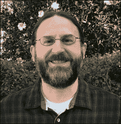

# 第五章。道格·赫尔曼

道格·赫尔曼是一位美国软件开发者和作家。他是 Python 软件基金会（PSF）的成员，并担任了近两年的通讯总监。道格曾是 Python 杂志的专栏作家，后来成为主编。他还创建并维持了流行的 Python 模块每周一讲博客，该博客被汇编并出版在他的书籍《通过示例学习 Python 3 标准库》中。道格在红帽公司担任高级首席软件工程师，专注于社区领导和 OpenStack 的长期可持续性。

> **讨论主题：OpenStack、virtualenvwrapper、v2.7/v3.x。**
> 
> **在这里与道格·赫尔曼保持联系：@doughellman**

**迈克·德里斯科尔：道格，你为什么成为程序员？**

**道格·赫尔曼：我在很小的时候就对计算机产生了兴趣，那是在我所在的地方学校系统举办的一些夏季项目中。我喜欢编程，也喜欢了解计算机是如何工作的，所以我决定在大学里攻读计算机科学学位。我们在学校里做的工作真的让我坚信编程是我可以享受并以此为生的事情。**

**德里斯科尔：为什么是 Python？是什么让 Python 对你来说如此特别？**

**赫尔曼：我第一次接触 Python 是在 1997 年左右，当时我在一家名为 ERDAS 的 GIS 软件公司的工具和构建管理小组工作。**

我们需要构建一些工具来帮助管理几个 UNIX 平台上的构建，以及 Windows NT 和 95。我们有很多 Makefile 和 shell 脚本，但它们并不特别便携。我越使用 Python，就越能找到新的使用方法。

> **道格·赫尔曼：“我越使用 Python，就越能找到新的使用方法。”**

在最初学习 Python 之后，我记得当时既高兴地发现了一种如此易于使用的全新工具语言，又难过地发现当时我所工作的公司不允许我们用它来“真正”工作！

**德里斯科尔：道格，你后来成为了 Python 杂志的技术编辑，我以前真的很喜欢它。我一直很好奇 Python 杂志是如何开始的……以及为什么后来停止了？**

**赫尔曼：Python 杂志始于布莱恩·琼斯担任首任主编。**

布莱恩向 MTA（出版商）提出了这个想法。他们一直专注于 PHP 社区，但同意 Python 社区也可能支持一本杂志。

那是个正确的决定吗？嗯，我们一度做得不错，但我认为对于一本新的付费印刷出版物来说，时机并不合适。如今，电子杂志可能效果会更好，但这是一个艰难的行业。

**德里斯科尔：道格，是什么让你也开始启动了非常成功的“Python 模块每周一讲”系列？是什么驱使你坚持写 PyMOTW 超过十年？**

**Hellmann**： 是的，已经超过十年了。我在 2007 年开始写 PyMOTW 博客系列（[`pymotw.com`](https://pymotw.com)），作为一种强迫自己定期写作的方式。我决定设定一个主题会更容易找到要写的话题，每周写一次似乎是一个不错的目标。

随着时间的推移，来自社区其他成员的兴趣逐渐增长，但反馈大多是积极的。我相信，如果不是因为每个人都给予我的所有反馈和支持，我早就停止了。

**Driscoll**： Doug，你的书是如何产生的？

**Hellmann**： 在项目进行两年后的一个 PyCon 上，Mark Ramm 介绍我认识了 Pearson 的编辑 Debra Williams Cauley。我提出了整理博客文章并将系列变成一本书的想法。Debra 帮助我确定如何结构化它以适应那种格式。与 Pearson 的整个团队合作都非常愉快。

> **Doug Hellmann**： “Python 3 标准库包含数百个模块，用于与操作系统、解释器和互联网交互。”

**Driscoll**： 你的书对 Python 开发者来说非常有帮助。那么，你认为新学习的 Python 程序员在掌握了基础知识之后应该做什么？

**Hellmann**： 我鼓励大家通过选择一个他们想要自己解决的问题来设定一个目标。这为他们提供了一个学习框架，比如如何将一个项目分解成可以逐个实现的部分，这反过来又帮助他们一次专注于学习一项技能。

在 PyOhio 2015 上，我以我的一个项目为例，讨论了这一点。当然，并非所有项目都需要像 Smiley 示例那样复杂：

[`doughellmann.com/blog/2015/08/02/pyohio-talk-on-smiley-and-iterative-development/`](https://doughellmann.com/blog/2015/08/02/pyohio-talk-on-smiley-and-iterative-development/)

每个程序员都会构建一些小的可丢弃的工具脚本以及更复杂的可重用项目，所有这些都是学习新东西的机会。

> **Doug Hellmann**： “每个程序员都会构建一些小的可丢弃的工具脚本以及更复杂的可重用项目，所有这些都是学习新东西的机会。”

另一种很好的学习方法是通过参加当地的活动，与其他程序员交谈。亚特兰大 Python 活动小组试图保持初学者和更高级讨论的良好混合，以帮助鼓励具有各种技能的人参加我们的会议。有时，晚上最有信息量的部分是在演讲后的问答环节，或者在休息期间的讨论，那时你有机会要求更多细节或澄清。

**Driscoll**： Doug，你现在参与哪些活跃的项目？

**Hellmann**： 在过去的五年里，我一直致力于 OpenStack 的各个方面。除了云管理软件本身，我们还开发了一些有趣的工具，如 pbr 库，以帮助打包。

**Driscoll**: 那么，你是如何开始成为 OpenStack 开发者的？

**Hellmann**: 我在 DreamHost 开始了 OpenStack 的工作。我在亚特兰大 Python 线下聚会中认识了 Jonathan LaCour，工程副总裁，已经有一段时间了，当他需要人手时，时机正好，我也想换工作。我们在亚特兰大地区有一个小团队，我们互相帮助，进入了 OpenStack 社区。

> **Doug Hellmann: '我在亚特兰大 Python 线下聚会中认识了 Jonathan LaCour，工程副总裁，已经有一段时间了...'**

**Driscoll**: 所以，聚会的力量在这里真正发挥了作用！目前你对 OpenStack 有什么目标？

**Hellmann**: 我从 Red Hat 那里得到了一个非常灵活的授权，去从事保持 OpenStack 社区健康所需的工作。

我在技术委员会任职，这是我们选出的管理机构。我们试图引导项目，并在我们做出重大决策时，帮助将庞大的贡献者基础达到某种程度的共识。

> **Doug Hellmann: '我从 Red Hat 那里得到了一个非常灵活的授权，去从事保持 OpenStack 社区健康所需的工作.'**

我还担任了 Oslo 团队的团队领导，该团队管理着 OpenStack 各个服务之间共享的一组通用库。我们试图构建尽可能可重用的库，但有时我们需要在 OpenStack 内部共享对其他人可能不太有用的代码。

我还参与了发布工具的开发，扩展了流水线，使发布过程从为五个项目进行高度手动操作，转变为支持约 350 个不同交付成果的高度自动化过程。我建立了一些工具，比如 `reno`，我们的发布笔记管理程序，并在需要帮助的其他项目中参与其中。

**Driscoll**: 那么，关于你创建的一些工具，你创建 `virtualenvwrapper` 的灵感是什么？

**Hellmann**: 当我作为技术编辑和后来成为 Python 杂志的主编时，我发现自己需要管理很多不同的 `virtualenv`。每位作者都提供了安装他们文章中使用的工具的说明，我想能够测试代码。

我开始编写一些别名来轻松管理环境，项目从这里自然地发展起来。自从我专注于 OpenStack 以来，我的工作流程发生了显著变化，所以我并没有像以前那样多地为 `virtualenvwrapper` 做贡献。我很高兴 Jason Myers 现在接管了项目的首席维护者角色。

**Driscoll**: 那么，在你创建 `virtualenvwrapper` 的过程中，你能告诉我们你学到了什么吗？

**Hellmann**: 当然，我实际上能想到我在创建 `virtualenvwrapper` 时学到的三件事。

首先，我了解到贡献可能来自意想不到的方向。道格·拉托内尔提供了支持 ksh 的原始补丁。我完全没有想到有人会对支持 ksh 感兴趣，所以我并没有考虑超过 Bash。不过，我想他在那个时候可能在一个 AIX 系统上使用`virtualenvwrapper`，而且一旦合并，他的补丁很容易集成和支持。

我学到的第二点是，保持乐趣很重要。例如，我创建了以下网站，仅仅是因为亚历克斯·盖诺的一个推文：

[`bitbucket.org/dhellmann/virtualenvwrapper.alex`](https://bitbucket.org/dhellmann/virtualenvwrapper.alex)

"`virtualenvwrapper.alex`为与常见`virtualenvwrapper`命令相关的错误安装别名。真的。它存在是因为亚历克斯·盖诺礼貌地请求。"

我必须提供的第三个学习点是，你不可能总是取悦所有人。因此，`virtualenvwrapper`支持插件，以便人们可以共享他们的扩展，但现在有一个全新的类似工具类别，如`pyenv`、`vex`和其他，它们的运营模式非常不同。这很好！正如我所说，我的工作流程已经改变了很多，以至于我现在不再那么依赖`virtualenv wrapper`了。

**Driscoll**: 如果你可以从头开始创建`virtualenvwrapper`，你会做些什么不同？

**Hellmann**: 我现在会基于 Python 3 的`venv`而不是`virtualenv`来构建它，今天我会设计它为一个包含子命令的单个主要命令。

**Driscoll**: 你在 Python 中最兴奋的是什么？

**Hellmann**: 我一直对充满活力的社区感到非常兴奋。随着越来越多的人发现 Python，或者将其应用于新的领域，这个社区一直在扩大。

**Mike Driscoll**: 你对 Python 2.7 的长期寿命有什么看法？

**Hellmann**: Python 2.7 的长期生命周期承认了这样一个现实：基于不兼容的上游更改重写功能软件并不是大多数公司的首要任务。

我鼓励人们使用他们部署平台上可用的最新 Python 3 版本来启动所有新项目。我还建议他们仔细重新考虑现在将剩余的遗留应用程序迁移到 Python 3，因为大多数积极维护的库都支持 Python 3。

**Driscoll**: 你希望在未来 Python 版本中看到哪些变化？

**Hellmann**: 我目前最感兴趣的是与打包相关的工作。这些变化不会进入 Python 本身，而是进入像`setuptools`、`twine`、`wheel`、`pip`和`warehouse`这样的工具中。简化 Python 包的打包和分发过程将有助于我们所有的用户。

**Driscoll**: 感谢，道格·赫尔曼。
