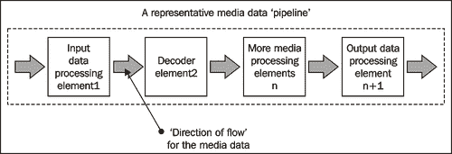
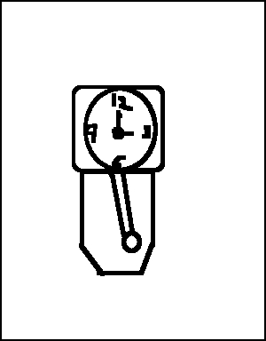
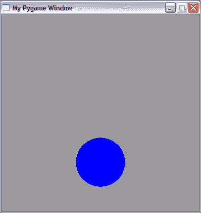
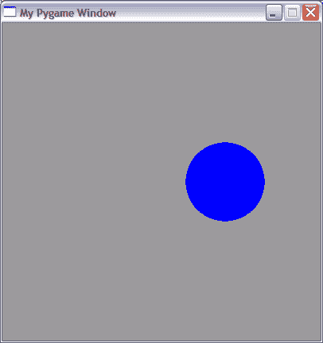
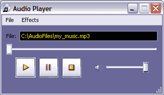
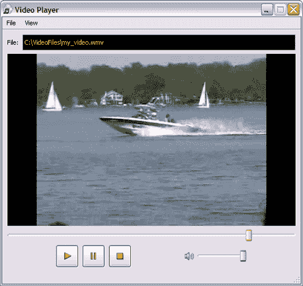

# 第一章。Python 和多媒体

> 自从 1989 年问世以来，Python 作为一种通用编程语言，越来越受欢迎。它是一种高级、面向对象的编程语言，拥有全面的标准库。该语言的特点，如自动内存管理和易于阅读性，吸引了广泛的开发者社区的注意。通常，与其他一些语言相比，人们可以用 Python 非常快速地开发复杂的应用程序。它被用于多个开源以及商业科学建模和可视化软件包中。它已经在动画和游戏开发工作室等行业中获得了流行，这些行业专注于多媒体应用开发。本书全部关于使用 Python 进行多媒体处理。

在本章的介绍中，我们将：

+   了解多媒体和多媒体处理

+   使用 Python 讨论几个流行的多媒体处理框架

+   使用 PyGame 开发一个简单的交互式应用程序

那么，让我们开始吧。

# 多媒体

我们在日常生活中使用多媒体应用程序。我们在看电影、听歌或玩视频游戏时处理的就是多媒体。多媒体应用在众多领域都有广泛应用。在广告和娱乐行业中，多媒体扮演着至关重要的角色。最常见的用途之一就是给电影添加音频和视频效果。例如，飞行或驾驶模拟器等教育软件包使用多媒体以交互式的方式教授各种主题。

那么，多媒体究竟是什么呢？一般来说，任何利用不同数字媒体来源的应用程序都被称作**数字多媒体**。例如，一个视频就是不同来源或内容的组合。这些内容可能包括音频轨道、视频轨道和字幕轨道。当这样的视频播放时，所有这些媒体来源都会一起呈现，以达到预期的效果。

一个多声道音频可以包含背景音乐轨道和歌词轨道。甚至可能包括各种音频效果。通过快速连续显示一系列数字图像，可以创建动画。这些都是多媒体的不同例子。

在计算机或视频游戏的情况下，应用程序增加了一个维度，即用户交互。这通常被称为交互式多媒体。在这里，用户决定了多媒体内容呈现的方式。借助键盘、鼠标、轨迹球、操纵杆等设备，用户可以交互式地控制游戏。

# 多媒体处理

我们讨论了一些多媒体被广泛使用的应用领域。本书的重点将放在多媒体处理上，通过使用它，将开发各种多媒体应用程序。

## 图像处理

使用数码相机拍照后，我们经常出于各种原因对原始数码图像进行调整。最常见的原因之一是去除图像上的瑕疵，例如去除“红眼”或如果照片是在光线不足的情况下拍摄的，则增加亮度级别等。这样做另一个原因是添加特殊效果，使图像看起来更令人愉悦。例如，将家庭照片变为黑白，并在照片周围数字添加边框，使其具有怀旧效果。下一张插图显示了增强前后的图像。有时，修改原始图像只是为了让你理解图像所呈现的重要信息。假设图片代表了一个复杂的组件组装。可以通过添加特殊效果来使图像中仅边缘被突出显示。然后，可以使用这些信息来检测，例如，组件之间的干扰。因此，我们进一步对图像进行数字处理，直到得到所需的输出图像。

使用数码相机拍照后，我们经常出于各种原因对原始数码图像进行调整。最常见的原因之一是去除图像上的瑕疵，例如去除“红眼”或如果照片是在光线不足的情况下拍摄的，则增加亮度级别等。这样做另一个原因是添加特殊效果，使图像看起来更令人愉悦。例如，将家庭照片变为黑白，并在照片周围数字添加边框，使其具有怀旧效果。下一张插图显示了增强前后的图像。有时，修改原始图像只是为了让你理解图像所呈现的重要信息。假设图片代表了一个复杂的组件组装。可以通过添加特殊效果来使图像中仅边缘被突出显示。然后，可以使用这些信息来检测，例如，组件之间的干扰。因此，我们进一步对图像进行数字处理，直到得到所需的输出图像。

在以下示例中，我们可以看到如何给图片添加边框以改变其外观：


数字图像处理可以看作是在图像数据上应用各种算法/滤波器。其中一个例子是图像平滑滤波器。**图像平滑**意味着减少图像中的噪声。图像数据中亮度和颜色级别的随机变化通常被称为图像**噪声**。平滑算法修改输入图像数据，使得在最终图像中这种噪声被减少。

另一个常见的图像处理操作是**混合**。正如其名所示，混合意味着将两个兼容的图像混合以创建一个新的图像。通常，使用恒定的 alpha 值对两个输入图像的数据进行插值，以产生最终的图像。下一幅插图显示了两个输入图像和混合后的结果图像。在接下来的章节中，我们将学习几种这样的数字图像处理技术。

桥梁和飞翔的鸟的图片是在不同的地点拍摄的。使用图像处理技术，这两张图片可以被融合在一起，看起来像一张单独的图片：


## 音频和视频处理

当你在电脑上听音乐时，你的音乐播放器在后台执行几个操作。它处理数字媒体数据，以便将其转换为输出媒体设备（如音频扬声器）所需的可播放格式。媒体数据流经多个相互连接的媒体处理组件，然后到达媒体输出设备或写入的媒体文件。这将在下一幅插图显示。

以下图像显示了媒体数据处理流程：



音频和视频处理包括许多内容。其中一些在本节中简要讨论。在这本书中，我们将学习使用 GStreamer 多媒体框架的 Python 绑定来实现的多种音频-视频处理技术。

### 压缩

如果你用摄像机录制视频，然后将其传输到电脑上，它将占用大量空间。为了将这些时刻保存在 VCD 或 DVD 上，你几乎总是需要压缩音频-视频数据，以便它占用更少的空间。有两种类型的音频和视频压缩；*有损*和*无损*。有损压缩非常常见。在这里，假设一些数据是不必要的，并且不会保留在压缩媒体中。例如，在有损视频压缩中，即使一些原始数据丢失，对视频整体质量的影响也较小。另一方面，在无损压缩中，压缩的音频或视频数据与原始数据完美匹配。然而，压缩比非常低。随着我们的进展，我们将编写音频-视频数据转换实用程序来压缩媒体数据。

### 混合

**混合**是一种使用多个媒体源创建复合媒体的方法。在音频混合的情况下，来自不同来源的音频数据被组合成一个或多个音频通道。例如，它可以用来添加音频效果，以便同步单独的音乐和歌词轨道。在接下来的章节中，我们将学习更多关于使用 Python 的媒体混合技术。

### 编辑

媒体混音可以被视为一种媒体编辑类型。媒体编辑可以大致分为线性编辑和非线性编辑。在**线性编辑**中，程序员不控制媒体展示的方式。而在**非线性编辑**中，编辑是交互式进行的。本书将涵盖媒体编辑的基础知识。例如，我们将学习如何通过组合不同音频文件的部分来创建新的音频轨道。

## 动画

一个**动画**可以被视为通过依次显示一系列图像帧来创建的运动视觉错觉。这些图像帧中的每一个都与之前显示的略有不同。下一张插图显示了“祖父的钟”的动画帧：



如您所见，时钟动画中有四个图像帧。这些帧快速依次显示，以达到所需的动画效果。每个图像将显示 0.25 秒。因此，它模拟了一秒钟的钟摆振荡。

卡通动画是动画的经典例子。自从 20 世纪初首次亮相以来，动画已经成为一个突出的娱乐行业。本书的重点将放在使用 Python 构建的 2D 卡通动画上。在第四章中，我们将学习一些构建此类动画的技术。创建一个卡通角色并将其“赋予生命”是一项繁重的工作。直到 20 世纪 70 年代末，大多数动画和效果都是没有使用计算机创建的。在当今这个时代，大部分图像创作工作都是数字生成的。最先进的技术使这个过程变得更快。例如，可以应用图像变换来显示或移动图像的一部分，从而避免在下一帧中创建整个卡通图像的需要。

# 内置的多媒体支持

Python 为应用程序开发提供了一些内置的多媒体模块。我们将简要介绍其中的一些模块。

## winsound

`winsound`模块在 Windows 平台上可用。它提供了一个接口，可以用于在应用程序中实现基本的音频播放元素。可以通过调用`PlaySound(sound, flags)`来播放声音。在这里，参数 sound 用于指定音频文件的路径。如果此参数指定为`None`，则停止当前正在播放的音频（如果有）。第二个参数指定要播放的文件是声音文件还是系统声音。以下代码片段展示了如何使用`winsound`模块播放波形格式的音频文件。

```py
from winsound import PlaySound, SND_FILENAME
PlaySound("C:/AudioFiles/my_music.wav", SND_FILENAME )

```

这个函数`PlaySound`的第一个参数指定了要播放的声音文件。第二个参数`SND_FILENAME`表示第一个参数是一个音频文件。如果标志设置为`SND_ALIAS`，则表示第一个参数的值来自注册表中的系统声音。

## audioop

此模块用于操作原始音频数据。可以对声音片段执行多个有用的操作。例如，它可以找到声音片段中所有样本的最小值和最大值。

## wave

`wave`模块提供了一个接口，用于读取和写入`WAV`格式的音频文件。以下代码行打开了一个 wav 文件。

```py
import wave
fil = wave.open('horn.wav', 'r')

```

`open`方法的第一参数指定了波文件路径的位置。第二个参数'r'返回一个`Wave_read`对象。这是打开音频文件的模式，'r'或'rb'为只读模式，'w'或'wb'为只写模式。

# 外部多媒体库和框架

有几个开源的多媒体框架可用于多媒体应用程序开发。其中大多数的 Python 绑定都很容易获得。在这里，我们将讨论一些最受欢迎的多媒体框架。在接下来的章节中，我们将使用这些库中的许多来创建一些有用的多媒体应用程序。

## Python 图像库

Python 图像库为 Python 提供了图像处理功能。它支持多种图像格式。在本书的后续章节中，将详细讨论使用 PIL 的多种图像处理技术。我们将学习诸如图像格式转换以及使用 Python 图像库的各种图像操作和增强技术。

## PyMedia

PyMedia 是一个流行的开源媒体库，支持多种多媒体格式的音频/视频操作。

## GStreamer

此框架使多媒体操作成为可能。它是一个可以在此基础上开发多媒体应用程序的框架。它提供的丰富库集使得开发具有复杂音频/视频处理能力的应用程序变得更加容易。GStreamer 是用 C 编程语言编写的，并为包括 Python 在内的其他一些编程语言提供了绑定。许多开源项目使用 GStreamer 框架来开发自己的多媒体应用程序。GStreamer 项目网站上有详细的文档。GStreamer 应用程序开发手册是一个非常好的起点。在此组中，此框架将被广泛用于开发音频和视频应用程序。

## Pyglet

对动画和游戏应用感兴趣吗？Pyglet 就在这里帮助你。Pyglet 提供了一个用于使用 Python 开发多媒体应用的 API。它是一个基于 OpenGL 的库，可以在多个平台上运行。它是用于游戏和其他图形密集型应用开发的流行多媒体框架之一。它支持游戏应用开发通常需要的多显示器配置。在本书的后续部分，我们将广泛使用这个 Pyglet 框架来创建动画。

## PyGame

PyGame ([www.pygame.org](http://www.pygame.org))是另一个非常流行的开源框架，它为游戏应用开发需求提供了一个 API。它提供了一套丰富的图形和声音库。本书中我们不会使用 PyGame。但由于它是一个突出的多媒体框架，我们将简要讨论其一些最重要的模块，并给出一个简单的示例。PyGame 网站提供了大量关于使用此框架进行动画和游戏编程的资源。

### 精灵

`Sprite`模块包含几个类；在这些类中，`Sprite`和`Group`是最重要的。`Sprite`是所有可见游戏对象的超类。`Group`对象是 Sprite 的几个实例的容器。

### 显示

如其名所示，`Display`模块具有处理显示的功能。它用于创建用于显示 Pygame 窗口的 Surface 实例。该模块的一些重要方法包括`flip`和`update`。前者用于确保所有绘制的内容都正确地显示在屏幕上。而后者用于你只想更新屏幕的一部分时。

### 表面

此模块用于显示图像。`Surface`的实例代表一个图像。以下代码行创建了一个这样的实例。

```py
surf = pygame.display.set_mode((800,600))

```

API 方法`display.set_mode`用于创建此实例。窗口的宽度和高度作为此方法的参数指定。

### 绘制

使用`Draw`模块，可以在`Surface`内渲染多个基本形状。例如包括圆形、矩形、线条等。

### 事件

这是 PyGame 的另一个重要模块。当用户点击鼠标按钮或按下一个键等事件发生时，我们说发生了事件。事件信息用于指导程序以某种方式执行。

### 图像

`Image`模块用于处理不同文件格式的图像。加载的图像由一个表面表示。

### 音乐

`Pygame.mixer.music`提供了控制播放的便捷方法，如播放、倒放、停止等。

以下是一个简单的程序，它突出了动画和游戏编程的一些基本概念。它展示了如何在应用程序窗口中显示对象，然后交互式地修改它们的位置。我们将使用 PyGame 来完成这个任务。在本书的后续部分，我们将使用不同的多媒体框架 Pyglet 来创建动画。

# 使用 PyGame 的简单应用程序行动时间

此示例将使用我们刚刚讨论的模块。为了使此应用程序正常工作，您需要安装 PyGame。PyGame 的二进制和源代码分发可以在 PyGame 网站上找到。

1.  创建一个新的 Python 源文件，并在其中写入以下代码。

    ```py
    1 import pygame
    2 import sys
    3
    4 pygame.init()
    5 bgcolor = (200, 200, 100)
    6 surf = pygame.display.set_mode((400,400))
    7
    8 circle_color = (0, 255, 255)
    9 x, y = 200, 300
    10 circle_rad = 50
    11
    12 pygame.display.set_caption("My Pygame Window")
    13
    14 while True:
    15 for event in pygame.event.get():
    16 if event.type == pygame.QUIT:
    17 sys.exit()
    18 elif event.type == pygame.KEYDOWN:
    19 if event.key == pygame.K_UP:
    20 y -= 10
    21 elif event.key == pygame.K_DOWN:
    22 y += 10
    23 elif event.key == pygame.K_RIGHT:
    24 x += 10
    25 elif event.key == pygame.K_LEFT:
    26 x -= 10
    27
    28 circle_pos = (x, y)
    29
    30 surf.fill(bgcolor)
    31 pygame.draw.circle(surf, circle_color ,
    32 circle_pos , circle_rad)
    33 pygame.display.flip()

    ```

1.  第一行导入`pygame`包。在第 4 行，初始化此`pygame`包内的模块。使用`display.set_mode`方法创建`Surface`类的实例。这是 PyGame 窗口中的主窗口，图像将在其中绘制。为了确保此窗口始终显示在屏幕上，我们需要添加一个将永远运行的`while`循环，直到用户关闭窗口。在这个简单的应用程序中，我们需要的所有内容都放置在`while`循环内。在第 30 行设置了表示 PyGame 窗口背景颜色的对象`surf`。

1.  在 PyGame 表面上，通过第 31 行的代码绘制了一个圆形。`draw.circle`函数的参数是`(Surface, color, position, radius)`。这将在由参数`circle_pos`指定的位置创建一个圆形。将`Surface`类的实例作为第一个参数传递给此方法。

1.  代码块 16-26 捕获某些事件。例如，当鼠标按钮或按键被按下时，就会发生事件。在这个例子中，我们指示程序在按下箭头键时执行某些操作。当按下`RIGHT`箭头键时，圆形将在`x`坐标上偏移 10 像素到上一个位置绘制。因此，每次按下`RIGHT`箭头键时，圆形看起来就像向右移动。当 PyGame 窗口关闭时，将发生`pygame.QUIT`事件。在这里，我们简单地通过调用`sys.exit()`（如第 17 行所示）退出应用程序。

1.  最后，我们需要确保在`Surface`上绘制的所有内容都可见。这是通过第 31 行的代码实现的。如果您禁用此行，屏幕上可能会出现未完全绘制的图像。

1.  从终端窗口执行程序。它将显示一个包含圆形的新图形窗口。如果您按下键盘上的箭头键，圆形将沿着箭头键指示的方向移动。下一张插图显示了原始圆形位置（左侧）和当使用`UP`和`RIGHT`箭头键移动时的情况。

    一个简单的 PyGame 应用程序，在 Surface（窗口）内绘制圆形。右侧的图像是使用箭头键调整圆形位置后拍摄的截图：

    

## 刚才发生了什么？

我们使用 PyGame 创建了一个简单的用户交互式应用。本例的目的是介绍动画和游戏编程背后的基本概念。这只是对接下来内容的预览！在本书的后续部分，我们将使用 Pyglet 框架创建一些有趣的 2D 动画。

## QT Phonon

当人们想到媒体播放器时，它几乎总是与图形用户界面联系在一起。当然，可以使用命令行多媒体播放器。但具有 GUI 的媒体播放器是一个明显的赢家，因为它提供了一个易于使用、直观的用户界面来流式传输媒体和控制其播放。下一张截图展示了使用 QT Phonon 开发的音频播放器的用户界面。

使用 QT Phonon 开发的音频播放器应用：



QT 是一个开源的 GUI 框架。'Phonon' 是 QT 中的一个多媒体包，支持音频和视频播放。请注意，Phonon 主要用于简单的媒体播放器功能。对于复杂的音频/视频播放器功能，您应使用 GStreamer 等多媒体框架。Phonon 依赖于特定平台的媒体处理后端。例如，在 Windows 平台上，后端框架是 DirectShow。支持的功能可能因平台而异。

要开发媒体处理应用，需要在 Phonon 中创建一个媒体图。这个媒体图包含各种相互连接的媒体节点。每个媒体节点执行部分媒体处理。例如，一个效果节点将为媒体添加音频效果，如回声。另一个节点将负责从音频或视频设备输出媒体，等等。在第八章中，我们将使用 Phonon 框架开发音频和视频播放器应用。下一张插图展示了一个使用 QT Phonon 开发的视频播放器正在流式传输视频。我们将在这个第八章中开发这个应用。

使用 QT Phonon 的各种内置模块，创建基于 GUI 的音频和视频播放器非常容易。本例展示了视频播放器的实际应用：



## 其他多媒体库

在各种平台上，有多个其他多媒体库的 Python 绑定可用。以下是一些流行的库。

### Snack 音频工具包

Snack 是一个音频工具包，用于创建跨平台的音频应用。它包括音频分析和输入/输出功能，并且支持音频可视化。Snack 音频工具包的官方网站是 [`www.speech.kth.se/snack/`](http://www.speech.kth.se/snack/)。

### PyAudiere

PyAudiere ([`pyaudiere.org/`](http://pyaudiere.org/)) 是一个开源音频库。它提供了一个 API，可以轻松地在各种应用中实现音频功能。它基于 Audiere 音频库。

# 摘要

本章作为使用 Python 进行多媒体处理的入门介绍。

具体来说，在本章中我们涵盖了：

+   多媒体处理概述。它向我们介绍了数字图像、音频和视频处理。

+   我们了解了一些可以用于多媒体处理的免费多媒体框架。

现在我们已经知道了有哪些多媒体库和框架，我们准备去探索这些来开发令人兴奋的多媒体应用！
