# 第二章。处理图像

> 在本章中，我们将学习使用 Python 图像处理库的基本图像转换和操作技术。本章以一个令人兴奋的项目结束，我们将创建一个图像处理应用程序。

在本章中，我们将：

+   学习使用**Python 图像处理库**（PIL）进行各种图像 I/O 操作以读取和写入图像

+   通过几个示例和代码片段的帮助，对图像进行一些基本操作，如调整大小、旋转/翻转、裁剪、粘贴等。

+   利用 PIL 编写图像处理应用程序

+   使用 QT 库作为此应用程序的前端（GUI）

那么，让我们开始吧！

# 安装前提条件

在我们跳入主要内容之前，安装以下包是必要的。

## Python

在本书中，我们将使用 Python 版本 2.6，或者更具体地说，版本 2.6.4。它可以从以下位置下载：[`python.org/download/releases/`](http://python.org/download/releases/)

### Windows 平台

对于 Windows 用户，只需下载并安装 Python 2.6.4 的平台特定二进制发行版。

### 其他平台

对于其他平台，例如 Linux，Python 可能已经安装在了您的机器上。如果安装的版本不是 2.6，请从源代码发行版构建和安装它。如果您在 Linux 系统上使用包管理器，请搜索 Python 2.6。您很可能在那里找到 Python 发行版。然后，例如，Ubuntu 用户可以从命令提示符安装 Python，如下所示：

```py
$sudo apt-get python2.6

```

注意，为此，您必须在安装 Python 的机器上拥有管理员权限。

## Python 图像处理库（PIL）

在本章中，我们将通过广泛使用 Python 图像处理库（PIL）来学习图像处理技术。正如第一章中提到的，PIL 是一个开源库。您可以从[`www.pythonware.com/products/pil/`](http://www.pythonware.com/products/pil/)下载它。请安装 PIL 版本 1.1.6 或更高版本。

### Windows 平台

对于 Windows 用户，安装很简单，使用 Python 2.6 的二进制发行版 PIL 1.1.6。

### 其他平台

对于其他平台，从源代码安装 PIL 1.1.6。仔细阅读源代码发行版中的 README 文件，以获取特定平台的说明。以下表格中列出的库在安装 PIL 之前必须安装。对于某些平台，如 Linux，操作系统提供的库应该可以正常工作。但是，如果这些库不起作用，请安装预构建的"libraryName-devel"版本的库。例如，对于 JPEG 支持，名称将包含"jpeg-devel-"，其他类似。这通常适用于基于 rpm 的发行版。对于像 Ubuntu 这样的 Linux 版本，您可以在 shell 窗口中使用以下命令。

```py
$sudo apt-get install python-imaging.

```

然而，您应该确保安装的版本为 1.1.6 或更高版本。检查 PIL 文档以获取更多特定平台的安装说明。对于 Mac OSX，查看是否可以使用 `fink` 安装这些库。有关更多详细信息，请参阅 [`www.finkproject.org/`](http://www.finkproject.org/)。您还可以检查网站 [`pythonmac.org`](http://pythonmac.org) 或 Darwin ports 网站 [`darwinports.com/`](http://darwinports.com/)，以查看是否提供二进制包安装程序。如果任何库都没有提供预编译版本，则从源代码安装。

从源代码安装 PIL 的 PIL 预先条件列在下面的表格中：

| 库 | URL | 版本 | 安装选项(a) 或 (b) |
| --- | --- | --- | --- |
| `libjpeg`(JPEG 支持) | [`www.ijg.org/files`](http://www.ijg.org/files) | 7 或 6a 或 6b | (a) 预编译版本。例如：`jpeg-devel-7` 检查是否可以执行：`sudo apt-install libjpeg`（在某些 Linux 发行版上有效）(b) 源代码包。例如：`jpegsrc.v7.tar.gz` |
| `zlib`(PNG 支持) | [`www.gzip.org/zlib/`](http://www.gzip.org/zlib/) | 1.2.3 或更高版本 | (a) 预编译版本。例如：`zlib-devel-1.2.3`。(b) 从源代码安装。 |
| `freetype2`(OpenType/TrueType 支持) | [`www.freetype.org`](http://www.freetype.org) | 2.1.3 或更高版本 | (a) 预编译版本。例如：`freetype2-devel-2.1.3`。(b) 从源代码安装。 |

## PyQt4

此包为 Qt 库提供 Python 绑定。我们将使用 PyQt4 为本章后面将要开发的图像处理应用程序生成 GUI。GPL 版本可在：[`www.riverbankcomputing.co.uk/software/pyqt/download`](http://www.riverbankcomputing.co.uk/software/pyqt/download) 获取。

### Windows 平台

下载并安装与 Python 2.6 相关的二进制发行版。例如，可执行文件的名称可能是 'PyQt-Py2.6-gpl-4.6.2-2.exe'。除了 Python 之外，它还包括使用 PyQt 进行 GUI 开发所需的所有内容。

### 其他平台

在构建 PyQt 之前，您必须安装 SIP Python 绑定生成器。有关更多详细信息，请参阅 SIP 主页：[`www.riverbankcomputing.com/software/sip/`](http://www.riverbankcomputing.com/software/sip/)。

安装 SIP 后，从源代码包下载并安装 PyQt 4.6.2 或更高版本。对于 Linux/Unix 源代码，文件名将以 `PyQt-x11-gpl-` 开头，而对于 Mac OS X，则以 `PyQt-mac-gpl-..` 开头。Linux 用户还应检查 PyQt4 是否已通过包管理器提供。

## 安装先决条件摘要

| 包 | 下载位置 | 版本 | Windows 平台 | Linux/Unix/OS X 平台 |
| --- | --- | --- | --- | --- |
| Python | [`python.org/download/releases/`](http://python.org/download/releases/) | 2.6.4（或任何 2.6.x 版本） | 使用二进制发行版安装 | (a) 从二进制安装；还安装额外的开发包（例如，在 rpm 系统中，包名中包含`python-devel`）或者(b) 从源 tarball 构建和安装。(c) MAC 用户也可以检查类似[`darwinports.com/`](http://darwinports.com/)或[`pythonmac.org/`](http://pythonmac.org/)的网站。 |
| PIL | [www.pythonware.com/products/pil/](http://www.pythonware.com/products/pil/) | 1.1.6 或更高版本 | 为 Python 2.6 安装 PIL 1.1.6（二进制版） | (a) 如有必要，安装先决条件。参考表#1 和 PIL 源代码包中的 README 文件。(b) 从源代码安装 PIL。(c) MAC 用户也可以检查类似[`darwinports.com/`](http://darwinports.com/)或[`pythonmac.org/`](http://pythonmac.org/)的网站。 |
| PyQt4 | [`www.riverbankcomputing.co.uk/software/pyqt/download`](http://www.riverbankcomputing.co.uk/software/pyqt/download) | 4.6.2 或更高版本 | 使用针对 Python 2.6 的二进制安装 | (a) 首先安装 SIP 4.9 或更高版本。(b) 然后安装 PyQt4。 |

# 读取和写入图像

要操作现有图片，我们必须首先打开它进行编辑，并在更改后需要能够以合适的文件格式保存图片。PIL 中的`Image`模块提供了在指定图像文件格式中读取和写入图像的方法。它支持广泛的文件格式。

要打开图像，请使用`Image.open`方法。启动 Python 解释器并编写以下代码。您应该在系统上指定一个适当的路径作为`Image.open`方法的参数。

```py
>>>import Image
>>>inputImage = Image.open("C:\\PythonTest\\image1.jpg")

```

这将打开名为`image1.jpg`的图像文件。如果文件无法打开，将引发`IOError`，否则，它将返回`Image`类的一个实例。

要保存图片，请使用`Image`类的`save`方法。确保您将以下字符串替换为适当的`/path/to/your/image/file`。

```py
>>>inputImage.save("C:\\PythonTest\\outputImage.jpg")

```

您可以使用`Image`类的`show`方法查看刚刚保存的图片。

```py
>>>outputImage = Image.open("C:\\PythonTest\\outputImage.jpg")
>>>outputImage.show()

```

这里，它与输入图片基本相同，因为我们没有对输出图片进行任何更改。

# 实践时间 - 图像文件转换器

在获得这些基本信息后，让我们构建一个简单的图像文件转换器。此实用程序将批量处理图像文件，并以用户指定的文件格式保存它们。

要开始使用，请从 Packt 网站下载文件`ImageFileConverter.py`，[www.packtpub.com](http://www.packtpub.com)。此文件可以从命令行运行，如下所示：

```py
python ImageConverter.py [arguments]

```

这里，`[arguments]`包括：

+   `--input_dir:` 存放图像文件的目录路径。

+   `--input_format:` 要转换的图像文件格式。例如，`jpg`。

+   `--output_dir:` 您希望保存转换后图片的位置。

+   `--output_format:` 输出图片格式。例如，`jpg, png, bmp`等。

以下截图显示了在 Windows XP 上运行的图像转换实用工具的效果，即从命令行运行图像转换器。

在这里，它将批量处理 `C:\PythonTest\images` 目录下所有的 `.jpg` 图像，并将它们以 `png` 格式保存在 `C:\PythonTest\images\OUTPUT_IMAGES` 目录中。

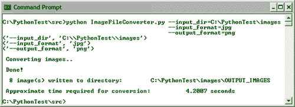

该文件定义了 `class ImageConverter`。我们将讨论这个类中最重要的方法。

+   `def processArgs:` 这个方法处理前面列出的所有命令行参数。它使用 Python 的内置模块 `getopts` 来处理这些参数。建议读者查看本书代码包中 `ImageConverter.py` 文件中的代码，以获取有关如何处理这些参数的更多详细信息。

+   `def convertImage:` 这是图像转换实用工具的工作马方法。

    ```py
    1 def convertImage(self):
    2 pattern = "*." + self.inputFormat
    3 filetype = os.path.join(self.inputDir, pattern)
    4 fileList = glob.glob(filetype)
    5 inputFileList = filter(imageFileExists, fileList)
    6
    7 if not len(inputFileList):
    8 print "\n No image files with extension %s located \
    9 in dir %s"%(self.outputFormat, self.inputDir)
    10 return
    11 else:
    12 # Record time before beginning image conversion
    13 starttime = time.clock()
    14 print "\n Converting images.."
    15
    16 # Save image into specified file format.
    17 for imagePath in inputFileList:
    18 inputImage = Image.open(imagePath)
    19 dir, fil = os.path.split(imagePath)
    20 fil, ext = os.path.splitext(fil)
    21 outPath = os.path.join(self.outputDir,
    22 fil + "." + self.outputFormat)
    23 inputImage.save(outPath)
    24
    25 endtime = time.clock()
    26 print "\n Done!"
    27 print "\n %d image(s) written to directory:\
    28 %s" %(len(inputFileList), self.outputDir)
    29 print "\n Approximate time required for conversion: \
    30 %.4f seconds" % (endtime starttime)

    ```

现在我们来回顾一下前面的代码。

1.  我们的首要任务是获取所有要保存为不同格式的图像文件的列表。这是通过使用 Python 的 `glob` 模块来实现的。代码片段中的第 4 行找到所有与局部变量 `fileType` 指定的模式匹配的文件路径名称。在第 5 行，我们检查 `fileList` 中的图像文件是否存在。这个操作可以使用 Python 内置的 `filter` 功能在整个列表上高效地执行。

1.  第 7 行到 14 行之间的代码块确保存在一个或多个图像。如果存在，它将记录开始图像转换之前的时间。

1.  下一个代码块（第 17-23 行）执行图像文件转换。在第 18 行，我们使用 `Image.open` 打开图像文件。第 18 行创建了一个 `Image` 对象。然后推导出适当的输出路径，最后使用 `Image` 模块的 `save` 方法保存输出图像。

## 刚才发生了什么？

在这个简单的例子中，我们学习了如何以指定的图像格式打开和保存图像文件。我们通过编写一个图像文件转换器来实现这一点，该转换器批量处理指定的图像文件。我们使用了 PIL 的 `Image.open` 和 `Image.save` 功能以及 Python 的内置模块，如 `glob` 和 `filter`。

现在我们将讨论与图像读取和写入相关的其他关键方面。

## 从头创建图像

到目前为止，我们已经看到了如何打开现有的图像。如果我们想创建自己的图像怎么办？例如，如果你想创建作为图像的精美文本，我们现在要讨论的功能就派上用场了。在本书的后面部分，我们将学习如何使用包含一些文本的此类图像嵌入到另一个图像中。创建新图像的基本语法是：

```py
foo = Image.new(mode, size, color)

```

其中，`new`是`Image`类的一个内置方法。`Image.new`接受三个参数，即`mode, size`和`color`。`mode`参数是一个字符串，它提供了有关图像波段数量和名称的信息。以下是最常见的`mode`参数值：`L`（灰度）和`RGB`（真彩色）。`size`是一个指定图像像素尺寸的`tuple`，而`color`是一个可选参数。如果它是一个多波段图像，可以分配一个 RGB 值（一个`3-tuple`）。如果没有指定，图像将填充为黑色。

# 行动时间 - 创建包含一些文本的新图像

如前所述，生成只包含一些文本或常见形状的图像通常很有用。这样的图像可以粘贴到另一个图像上，并定位在所需的角度和位置。现在我们将创建一个包含以下文本的图像：“这并不是一个花哨的文本！”

1.  在一个 Python 源文件中编写以下代码：

    ```py
    1 import Image
    2 import ImageDraw
    3 txt = "Not really a fancy text!"
    4 size = (150, 50)
    5 color = (0, 100, 0)
    6 img = Image.new('RGB', size, color)
    7 imgDrawer = ImageDraw.Draw(img)
    8 imgDrawer.text((5, 20), txt) 9 img.show()

    ```

1.  让我们逐行分析代码。前两行从 PIL 中导入必要的模块。变量`txt`是我们想要包含在图像中的文本。在第 7 行，使用`Image.new`创建新的图像。这里我们指定了`mode`和`size`参数。可选的`color`参数指定为一个包含 RGB 值的`tuple`，与“深绿色”颜色相关。

1.  PIL 中的`ImageDraw`模块为`Image`对象提供图形支持。函数`ImageDraw.Draw`接受一个图像对象作为参数以创建一个`Draw`实例。在输出代码中，它被称为`imgDrawer`，如第 7 行所示。这个`Draw`实例允许在给定的图像中绘制各种东西。

1.  在第 8 行，我们调用 Draw 实例的文本方法，并提供了位置（一个`tuple`）和文本（存储在字符串`txt`中）作为参数。

1.  最后，可以使用`img.show()`调用查看图像。你可以选择使用`Image.save`方法保存图像。以下截图显示了结果图像。

## 刚才发生了什么？

我们刚刚学习了如何从头创建图像。使用`Image.new`方法创建了一个空图像。然后，我们使用 PIL 中的`ImageDraw`模块向该图像添加文本。

## 从归档中读取图像

如果图像是归档容器的一部分，例如，一个 TAR 归档，我们可以使用 PIL 中的`TarIO`模块来打开它，然后调用`Image.open`将这个`TarIO`实例作为参数传递。

# 行动时间 - 从归档中读取图像

假设有一个包含图像文件`image1.jpg`的归档文件`images.tar`。以下代码片段显示了如何从归档中读取`image1.jpg`。

```py
>>>import TarIO
>>>import Images
>>>fil = TarIO.TarIO("images.tar", "images/image1.jpg")
>>>img = Image.open(fil)
>>>img.show()

```

## 刚才发生了什么？

我们学习了如何从归档容器中读取图像。

## 英雄尝试者向图像文件转换器添加新功能

修改图像转换代码，使其支持以下新功能，即：

1.  以包含图像的 ZIP 文件作为输入

1.  创建转换图像的 TAR 归档

# 基本图像操作

现在我们已经了解了如何打开和保存图像，让我们学习一些基本的图像操作技术。PIL 支持各种几何操作，例如调整图像大小、旋转角度、上下翻转或左右翻转，等等。它还便于执行裁剪、剪切和粘贴图像片段等操作。

## 调整大小

改变图像的尺寸是使用最频繁的图像操作之一。使用 PIL 中的 `Image.resize` 实现图像调整大小。以下代码行解释了它是如何实现的。

```py
foo = img.resize(size, filter)

```

在这里，`img` 是一个图像（`Image` 类的实例）和调整大小操作的结果存储在 `foo`（另一个 `Image` 类的实例）中。`size` 参数是一个 `tuple`（宽度，高度）。请注意，`size` 是以像素为单位的。因此，调整图像大小意味着修改图像中的像素数量。这也被称为 **图像重采样**。`Image.resize` 方法还接受 `filter` 作为可选参数。`filter` 是在重采样给定图像时使用的插值算法。它处理重采样过程中像素的删除或添加，当调整大小操作旨在使图像变大或变小时分别处理。有四种滤波器可用。按质量递增的顺序，调整大小滤波器是 `NEAREST, BILINEAR, BICUBIC` 和 `ANTIALIAS`。默认滤波器选项是 `NEAREST`。

# 行动时间 - 调整大小

现在我们通过修改像素尺寸并应用各种滤波器进行重采样来调整图像大小。

1.  从 Packt 网站下载文件 `ImageResizeExample.bmp`。我们将使用此作为参考文件来创建缩放图像。`ImageResizeExample.bmp` 的原始尺寸是 `200 x 212` 像素。

1.  将以下代码写入文件或 Python 解释器中。将 `inPath` 和 `outPath` 字符串替换为机器上适当的图像路径。

    ```py
    1 import Image
    2 inPath = "C:\\images\\ImageResizeExample.jpg"
    3 img = Image.open(inPath)
    4 width , height = (160, 160)
    5 size = (width, height)
    6 foo = img.resize(size)
    7 foo.show()
    8 outPath = "C:\\images\\foo.jpg"
    9 foo.save(outPath)

    ```

1.  由 `inPath` 指定的图像将被调整大小并保存为 `outPath` 指定的图像。代码片段中的第 6 行执行调整大小任务，并在第 9 行最终保存新图像。你可以通过调用 `foo.show()` 来查看调整大小后的图像外观。

1.  现在我们指定 `filter` 参数。在以下代码的第 14 行，`filterOpt` 参数在 `resize` 方法中指定。有效的 `filter` 选项作为字典 `filterDict` 中的值指定。`filterDict` 的键用作输出图像的文件名。下一幅插图将比较这四个图像。你可以清楚地注意到 `ANTIALIAS` 图像与其他图像之间的区别（尤其是，看看这些图像中的花瓣）。当处理时间不是问题时，选择 `ANTIALIAS` 滤波器选项，因为它可以提供最佳质量的图像。

    ```py
    1 import Image
    2 inPath = "C:\\images\\ImageResizeExample.jpg"
    3 img = Image.open(inPath)
    4 width , height = (160, 160)
    5 size = (width, height)
    6 filterDict = {'NEAREST':Image.NEAREST,
    7 'BILINEAR':Image.BILINEAR,
    8 'BICUBIC':Image.BICUBIC,
    9 'ANTIALIAS':Image.ANTIALIAS }
    10
    11 for k in filterDict.keys():
    12 outPath= "C:\\images\\" + k + ".jpg"
    13 filterOpt = filterDict[k]
    14 foo = img.resize(size, filterOpt)
    15 foo.save(outPath)

    ```

1.  不同过滤器选项调整大小的图像如下所示。从左到右顺时针，Image.NEAREST、Image.BILINEAR、Image.BICUBIC 和 Image.ANTIALIAS: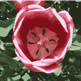

1.  然而，这里展示的 `resize` 功能不能保持结果图像的宽高比。如果与另一个维度相比，一个维度被拉伸更多或更少，图像将出现扭曲。PIL 的 `Image` 模块提供了一个内置的另一种方法来解决这个问题。它将覆盖两个维度中较大的一个，这样就可以保持图像的宽高比。

    ```py
    import Image
    inPath = "C:\\images\\ResizeImageExample.jpg"
    img = Image.open(inPath)
    width , height = (100, 50)
    size = (width, height)
    outPath = "C:\\images\\foo.jpg"
    img.thumbnail(size, Image.ANTIALIAS)
    img.save(outPath)

    ```

1.  此代码将覆盖程序员指定的最大像素维度值（在本例中为宽度）并替换为保持图像宽高比的价值。在这种情况下，我们有一个像素维度为（47，50）的图像。以下插图显示了结果图像的比较。

    这显示了使用 Image.thumbnail 和 Image.resize 方法输出图像的比较。

    

## 刚才发生了什么？

我们刚刚学习了如何使用 PIL 的 `Image` 模块通过编写几行代码来实现图像缩放。我们还学习了在图像缩放（重采样）中使用的不同类型的过滤器。最后，我们还看到了如何使用 `Image.thumbnail` 方法在不扭曲的情况下调整图像大小（即，保持宽高比不变）。

## 旋转

与图像缩放类似，围绕图像中心旋转图像是另一种常见的变换。例如，在一个合成图像中，在将其嵌入到另一个图像之前，可能需要将文本旋转一定角度。对于这种需求，PIL 的 `Image` 模块中提供了 `rotate` 和 `transpose` 等方法。使用 `Image.rotate` 旋转图像的基本语法如下：

```py
foo = img.rotate(angle, filter)

```

其中，`angle` 以度为单位提供，`filter` 是可选参数，是图像重采样过滤器。有效的 `filter` 值可以是 `NEAREST`、`BILINEAR` 或 `BICUBIC`。您可以使用 `Image.transpose` 仅在 90 度、180 度和 270 度旋转角度下旋转图像。

# 执行动作 - 旋转

1.  从 Packt 网站下载文件 `Rotate.png`。或者，您可以使用任何您选择的受支持图像文件。

1.  在 Python 解释器或 Python 文件中编写以下代码。像往常一样，为 `inPath` 和 `outPath` 变量指定适当的路径字符串。

    ```py
    1 import Image
    2 inPath = "C:\\images\\Rotate.png"
    3 img = Image.open(inPath)
    4 deg = 45
    5 filterOpt = Image.BICUBIC
    6 outPath = "C:\\images\\Rotate_out.png"
    7 foo = img.rotate(deg, filterOpt)
    8 foo.save(outPath)

    ```

1.  运行此代码后，旋转 45 度的输出图像被保存到`outPath`。过滤器选项`Image.BICUBIC`确保了最高的质量。下一张插图显示了原始图像以及旋转 45 度和 180 度的图像。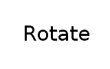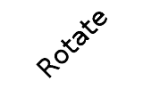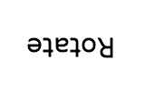

1.  使用`Image.transpose`功能还可以通过另一种方式实现特定角度的旋转。以下代码实现了 270 度的旋转。其他有效的旋转选项还有`Image.ROTATE_90`和`Image.ROTATE_180`。

    ```py
    import Image
    inPath = "C:\\images\\Rotate.png"
    img = Image.open(inPath)
    outPath = "C:\\images\\Rotate_out.png"
    foo = img.transpose(Image.ROTATE_270)
    foo.save(outPath)

    ```

## 刚才发生了什么？

在前面的章节中，我们使用了`Image.rotate`来实现按所需角度旋转图像。图像过滤器`Image.BICUBIC`用于在旋转后获得更好的输出图像质量。我们还看到了如何使用`Image.transpose`按特定角度旋转图像。

## 翻转

在 PIL 中，有多种方法可以水平或垂直翻转图像。一种实现方式是使用`Image.transpose`方法。另一种选择是使用`ImageOps`模块的功能。这个模块通过一些现成的方法使图像处理工作变得更加容易。然而，请注意，PIL 版本 1.1.6 的文档中提到`ImageOps`仍然是一个实验性模块。

# 执行动作 - 翻转

想象一下，你正在使用一些基本形状构建一个对称的图像。为了创建这样的图像，一个可以翻转（或镜像）图像的操作将非常有用。那么，让我们看看图像翻转是如何实现的。

1.  在 Python 源文件中编写以下代码。

    ```py
    1 import Image
    2 inPath = "C:\\images\\Flip.png"
    3 img = Image.open(inPath)
    4 outPath = "C:\\images\\Flip_out.png"
    5 foo = img.transpose(Image.FLIP_LEFT_RIGHT)
    6 foo.save(outPath)

    ```

1.  在此代码中，通过调用`transpose`方法水平翻转图像。要垂直翻转图像，将代码中的第 5 行替换为以下内容：

    ```py
    foo = img.transpose(Image.FLIP_TOP_BOTTOM)

    ```

1.  以下插图显示了当图像水平翻转和垂直翻转时，前面代码的输出。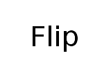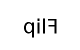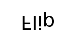

1.  使用`ImageOps`模块也可以达到相同的效果。要水平翻转图像，使用`ImageOps.mirror`，要垂直翻转图像，使用`ImageOps.flip`。

    ```py
    import ImageOps
    # Flip image horizontally
    foo1 = ImageOps.mirror(img)
    # Flip image vertically
    foo2 = ImageOps.flip(img)

    ```

## 刚才发生了什么？

通过示例，我们学习了如何使用`Image.transpose`和`ImageOps`类中的方法水平或垂直翻转图像。此操作将在本书的后续部分用于进一步的图像处理，如准备合成图像。

## 截图

你如何使用 Python 捕获桌面屏幕或其一部分？PIL 中有`ImageGrab`模块。这一行简单的代码就可以捕获整个屏幕。

```py
img = ImageGrab.grab()

```

其中，`img`是`Image`类的一个实例。

然而，请注意，在 PIL 版本 1.1.6 中，`ImageGrab`模块仅支持 Windows 平台的屏幕截图。

# 执行动作 - 定时截图

想象你正在开发一个应用程序，在某个时间间隔后，程序需要自动捕获整个屏幕或屏幕的一部分。让我们编写实现这一点的代码。

1.  在 Python 源文件中编写以下代码。当代码执行时，它将在每两秒后捕获屏幕的一部分。代码将运行大约三秒。

    ```py
    1 import ImageGrab
    2 import time
    3 startTime = time.clock()
    4 print "\n The start time is %s sec" % startTime
    5 # Define the four corners of the bounding box.
    6 # (in pixels)
    7 left = 150
    8 upper = 200
    9 right = 900
    10 lower = 700
    11 bbox = (left, upper, right, lower)
    12
    13 while time.clock() < 3:
    14 print " \n Capturing screen at time %.4f sec" \
    15 %time.clock()
    16 screenShot = ImageGrab.grab(bbox)
    17 name = str("%.2f"%time.clock())+ "sec.png"
    18 screenShot.save("C:\\images\\output\\" + name)
    19 time.sleep(2)

    ```

1.  我们现在将回顾此代码的重要方面。首先，导入必要的模块。`time.clock()`跟踪花费的时间。在第 11 行，定义了一个边界框。它是一个`4-tuple`，定义了一个矩形区域的边界。此`tuple`中的元素以像素为单位指定。在 PIL 中，原点（0, 0）被定义为图像的左上角。下一图示是图像裁剪的边界框表示；看看如何指定左、上、右和下为矩形的对角线端点。

    用于图像裁剪的边界框示例。

    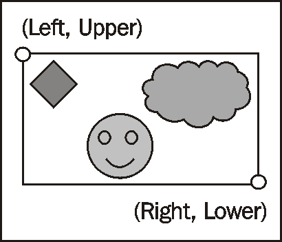

1.  `while`循环运行直到`time.clock()`达到三秒。在循环内部，屏幕上`bbox`内的部分被捕获（见第 16 行），然后图像在第 18 行被保存。图像名称对应于它被捕获的时间。

1.  `time.sleep(2)`调用暂停应用程序的执行两秒。这确保了它每两秒捕获一次屏幕。循环重复直到达到给定的时间。

1.  在这个例子中，它将捕获两个屏幕截图，一个是在它第一次进入循环时，另一个是在两秒的时间间隔后。在下图所示中，展示了代码捕获的两个图像。注意这些图像中的时间和控制台打印。

    前面的截图是在 00:02:15 时拍摄的，如对话框所示。下一个截图是在 2 秒后，即墙上的时间 00:02:17。

    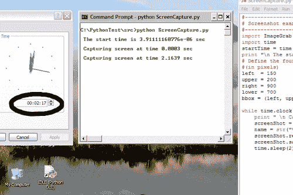

## 刚才发生了什么？

在前面的例子中，我们编写了一个简单的应用程序，它以固定的时间间隔捕获屏幕。这帮助我们学习了如何使用`ImageGrab`捕获屏幕区域。

## 裁剪

在前面的章节中，我们学习了如何使用`ImageGrab`捕获屏幕的一部分。裁剪是对图像执行的一个非常类似的操作。它允许你修改图像内的一个区域。

# 执行动作 - 裁剪图像

这个简单的代码片段裁剪了一个图像并对裁剪的部分进行了某些更改。

1.  从 Packt 网站下载文件`Crop.png`。此图像的大小为`400 x 400`像素。你也可以使用你自己的图像文件。

1.  在 Python 源文件中编写以下代码。将图像文件的路径修改为适当的路径。

    ```py
    import Image
    img = Image.open("C:\\images\\Crop.png")
    left = 0
    upper = 0
    right = 180
    lower = 215
    bbox = (left, upper, right, lower)
    img = img.crop(bbox)
    img.show()

    ```

1.  这将裁剪出由`bbox`定义的图像区域。边界框的指定与我们之前在*捕获屏幕截图*部分看到的是相同的。此示例的输出如下所示。

    原始图像（左）及其裁剪区域（右）。

    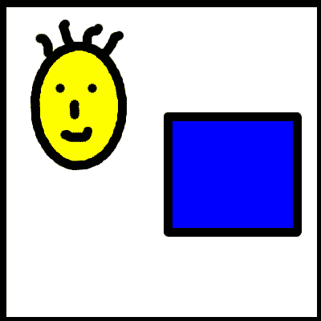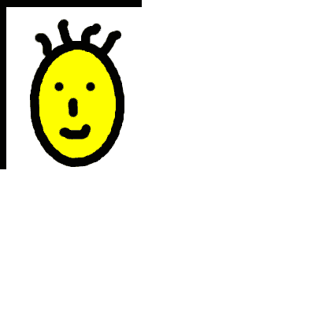

## 刚才发生了什么？

在上一节中，我们使用了`Image.crop`功能来裁剪图像中的某个区域并保存结果图像。在下一节中，我们将应用这一功能将图像的一个区域粘贴到另一个图像上。

## 粘贴

在处理图像时，将复制的或剪切的图像粘贴到另一个图像上是一个常见的操作。以下是将一个图像粘贴到另一个图像上的最简单语法。

```py
img = img.paste(image, box)

```

在这里，`image`是`Image`类的一个实例，而`box`是一个矩形边界框，它定义了`img`的区域，其中`image`将被粘贴。`box`参数可以是`4-tuple`或`2-tuple`。如果指定了`4-tuple`边界框，粘贴的图像大小必须与区域大小相同。否则，PIL 将抛出一个错误，错误信息为`ValueError: images do not match`。另一方面，`2-tuple`提供了要粘贴的区域左上角的像素坐标。

现在看看以下代码行。这是一次对图像的复制操作。

```py
img2 = img.copy(image)

```

复制操作可以看作是将整个图像粘贴到新图像上。当例如你想保持原始图像不变而只对图像的副本进行修改时，这个操作非常有用。

# 行动时间 - 粘贴：镜像笑脸！

考虑到之前章节中我们裁剪图像的例子。裁剪区域包含了一个笑脸。让我们修改原始图像，使其有一个笑脸的“反射”。

1.  如果还没有的话，请从 Packt 网站下载文件`Crop.png`。

1.  通过将文件路径替换为您系统上的适当路径来编写此代码。

    ```py
    1 import Image
    2 img = Image.open("C:\\images\\Crop.png")
    3 # Define the elements of a 4-tuple that represents
    4 # a bounding box ( region to be cropped)
    5 left = 0
    6 upper = 25
    7 right = 180
    8 lower = 210
    9 bbox = (left, upper, right, lower)
    10 # Crop the smiley face from the image
    11 smiley = img.crop(bbox_1)
    12 # Flip the image horizontally
    13 smiley = smiley.transpose(Image.FLIP_TOP_BOTTOM)
    14 # Define the box as a 2-tuple.
    15 bbox_2 = (0, 210)
    16 # Finally paste the 'smiley' on to the image.
    17 img.paste(smiley, bbox_2)
    18 img.save("C:\\images\\Pasted.png")
    19 img.show()

    ```

1.  首先，我们打开一个图像并将其裁剪以提取包含笑脸的区域。这已经在`Error: Reference source not found'Cropping'`部分完成了。您唯一会注意到的细微差别是元组元素`upper`的值。它故意保持为顶部 25 像素，以确保裁剪图像的大小可以适应原始笑脸下方的空白区域。

1.  然后使用代码在第 13 行水平翻转裁剪后的图像。

1.  现在我们定义一个矩形框，`bbox_2`，用于将裁剪的笑脸重新粘贴到原始图像上。应该粘贴在哪里？我们的意图是制作原始笑脸的“反射”。因此，粘贴图像右上角的坐标应该大于或等于裁剪区域的底部 y 坐标，由“lower”变量（见第 8 行）指示。边界框在第 15 行定义，作为一个表示笑脸左上坐标的`2-tuple`。

1.  最后，在第 17 行，执行粘贴操作，将笑脸粘贴到原始图像上。然后以不同的名称保存生成的图像。

1.  下一个图例显示了粘贴操作后的原始图像和输出图像。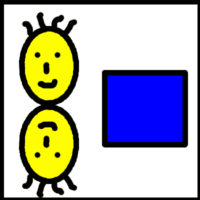

图例显示了粘贴操作后原始图像和结果图像的比较。

## 刚才发生了什么？

通过结合使用`Image.crop`和`Image.paste`，我们完成了裁剪一个区域、进行一些修改，然后将该区域粘贴回图像。

# 项目：缩略图制作器

现在我们开始一个项目。我们将应用本章学到的某些操作来创建一个简单的缩略图制作工具。这个应用程序将接受一个图像作为输入，并将创建该图像的缩放版本。虽然我们称之为缩略图制作器，但它是一个多功能的工具，实现了某些基本的图像处理功能。

在继续之前，请确保你已经安装了本章开头讨论的所有包。缩略图制作器对话框的截图如下所示。

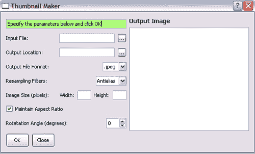

缩略图制作器 GUI 有两个组件：

1.  左侧面板是一个“控制区域”，你可以在这里指定某些图像参数，以及输入和输出路径的选项。

1.  右侧有一个图形区域，你可以在这里查看生成的图像。

    简而言之，这是它的工作原理：

1.  应用程序接受一个图像文件作为输入。

1.  它接受用户输入的图像参数，如像素尺寸、重采样滤波器和旋转角度（以度为单位）。

1.  当用户在对话框中点击**确定**按钮时，图像将被处理并保存到用户指定的输出图像格式位置。

# 行动时间 - 玩转缩略图制作器应用程序

首先，我们将以最终用户身份运行缩略图制作器应用程序。这个预热练习旨在让我们更好地理解应用程序的工作原理。这将反过来帮助我们快速开发/学习相关的代码。所以，准备行动吧！

1.  从 Packt 网站下载文件`ThumbnailMaker.py, ThumbnailMakeDialog.py`和`Ui_ThumbnailMakerDialog.py`。将这些文件放置在某个目录中。

1.  从命令提示符中，切换到这个目录位置，并输入以下命令：

    ```py
    python ThumbnailMakerDialog.py

    ```

    +   弹出的 Thumbnail Maker 对话框在之前的截图中已经显示。接下来，我们将指定输入输出路径和各种图像参数。你可以打开任何你选择的图像文件。在这里，将使用之前某些部分中显示的花朵图像作为输入图像。要指定输入图像，点击带有三个点的按钮……它将打开一个文件对话框。以下插图显示了已指定所有参数的对话框。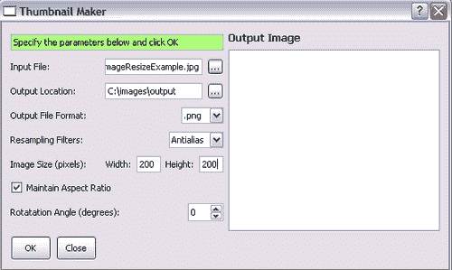

1.  如果勾选了**保持纵横比**复选框，它将内部调整图像尺寸，以确保输出图像的纵横比保持不变。当点击**确定**按钮时，结果图像将保存在**输出位置**字段指定的位置，并且保存的图像将在对话框的右侧面板中显示。以下截图显示了点击**确定**按钮后的对话框。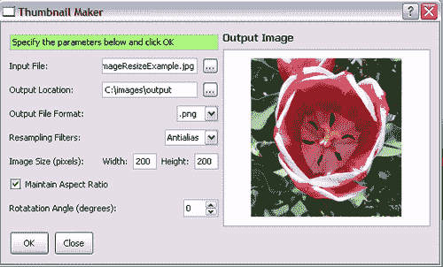

1.  你现在可以尝试修改不同的参数，例如输出图像格式或旋转角度，并保存结果图像。

1.  看看当**保持纵横比**复选框未勾选时会发生什么。结果图像的纵横比将不会保留，如果宽度和高度尺寸没有正确指定，图像可能会出现变形。

1.  尝试不同的重采样过滤器；你可以注意到结果图像和早期图像之间的质量差异。

1.  这个基本实用程序有一定的局限性。需要在对话框中为所有参数字段指定合理的值。如果任何参数未指定，程序将打印错误。

## 刚才发生了什么？

我们熟悉了 Thumbnail Maker 对话框的用户界面，并看到了它是如何处理不同尺寸和质量的图像的。这些知识将使理解 Thumbnail Maker 代码更容易。

## 生成 UI 代码

Thumbnail Maker GUI 是用 PyQt4 编写的（Qt4 GUI 框架的 Python 绑定）。关于如何生成 GUI 以及 GUI 元素如何连接到主功能的详细讨论超出了本书的范围。然而，我们将介绍这个 GUI 的某些主要方面，以便你开始使用。这个应用程序中的 GUI 相关代码可以“直接使用”，如果你对此感兴趣，可以继续实验！在本节中，我们将简要讨论如何使用 PyQt4 生成 UI 代码。

# 操作时间 - 生成 UI 代码

PyQt4 自带一个名为 QT Designer 的应用程序。它是一个基于 QT 的应用程序 GUI 设计器，提供了一种快速开发包含一些基本小部件的图形用户界面的方法。现在，让我们看看在 QT Designer 中 Thumbnail Maker 对话框的样式，然后运行一个命令从`.ui`文件生成 Python 源代码。

1.  从 Packt 网站下载 `thumbnailMaker.ui` 文件。

1.  启动 PyQt4 安装中附带 QT 设计器应用程序。

1.  在 QT 设计器中打开 `thumbnailMaker.ui` 文件。注意对话框中 UI 元素周围的红色边框。这些边框表示一个布局，其中小部件被排列。如果没有布局，当您运行应用程序时，UI 元素可能会变形，例如调整对话框的大小。使用了三种类型的 `QLayouts`，即 `Horizontal`、`Vertical` 和 `Grid` 布局。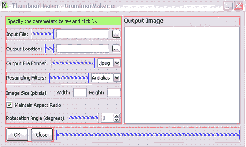

1.  您可以通过从 QT 设计器的“小部件框”拖放来添加新的 UI 元素，例如 `QCheckbox` 或 `QLabel`。它默认位于左侧面板中。

1.  点击“输入文件”旁边的字段。在 QT 设计器的右侧面板中，有一个属性编辑器，它显示所选小部件（在这种情况下是 `QLineEdit`）的属性。这在上面的插图中有展示。属性编辑器允许我们为小部件的各种属性分配值，例如 `objectName`、`width` 和 `height` 等。

    Qt 设计器在属性编辑器中显示所选小部件的详细信息。

    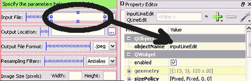

1.  QT 设计器以 `.ui` 扩展名保存文件。要将此转换为 Python 源代码，PyQt4 提供了一个名为 `pyuic4` 的转换工具。在 Windows XP 上，对于标准的 Python 安装，它位于以下位置 `C:\Python26\Lib\site-packages\PyQt4\pyuic4.bat`。将此路径添加到您的环境变量中。或者，每次您想要将 `ui` 文件转换为 Python 源文件时，指定整个路径。转换工具可以从命令提示符中运行，如下所示：

1.  此脚本将生成包含所有 GUI 元素的 `Ui_ThumbnailMakerDialog.py` 文件。您可以进一步审查此文件以了解 UI 元素是如何定义的。

    ```py
    pyuic4 thumbnailMaker.ui -o Ui_ThumbnailMakerDialog.py

    ```

## 刚才发生了什么？

我们学习了如何从 Qt 设计器文件自动生成定义 Thumbnail Maker 对话框 UI 元素的 Python 源代码。

## 英雄尝试调整 Thumbnail Maker 对话框的 UI

在 QT 设计器中修改 `thumbnailMaker.ui` 文件，并在 Thumbnail Maker 对话框中实现以下列表中的内容。

1.  将左侧面板中所有行编辑的颜色更改为浅黄色。

1.  调整默认文件扩展名在 **输出文件格式** 组合框中显示，使第一个选项为 `.png` 而不是 `.jpeg`

    ### 小贴士

    双击此组合框以编辑它。

1.  将新的选项 `.tiff` 添加到输出格式组合框中。

1.  将 **OK** 和 **Cancel** 按钮对齐到右下角。

1.  将旋转角度的范围设置为 0 到 360 度，而不是当前的 -180 到 +180 度。

    ### 小贴士

    您需要断开布局，移动空格，并重新创建布局。

    然后，通过运行 `pyuic4` 脚本创建 `Ui_ThumbnailMakerDialog.py`，然后运行 Thumbnail Maker 应用程序。

## 连接小部件

在前面的部分，表示 UI 的 Python 源代码是使用`pyuic4`脚本自动生成的。然而，这仅仅定义了小部件并将它们放置在一个漂亮的布局中。我们需要教这些小部件在发生特定事件时应该做什么。为此，我们将使用 QT 的槽和信号。当特定的 GUI 事件发生时，会发出一个信号。例如，当用户点击**OK**按钮时，内部会发出一个`clicked()`信号。槽是一个在特定信号发出时被调用的函数。因此，在这个例子中，它将在**OK**按钮被点击时调用一个指定的方法。请参阅 PyQt4 文档以获取各种小部件可用的完整信号列表。

# 行动时间 - 连接小部件

你会在对话框中注意到几个不同的小部件。例如，接受输入图像路径或输出目录路径的字段是`QLineEdit`。指定图像格式的控件是`QCombobox`。按照类似的逻辑，**OK**和**Cancel**按钮是`QPushButton`。作为一个练习，你可以打开`thumbnailMaker.ui`文件并点击每个元素，以查看属性编辑器中关联的 QT 类。

现在，让我们学习小部件是如何连接的。

1.  打开文件`ThumbnailMakerDialog.py`。类`ThumbnailMakerDialog`的`_connect`方法被复制。该方法在这个类的构造函数中被调用。

    ```py
    def _connect(self):
    """
    Connect slots with signals.
    """
    self.connect(self._dialog.inputFileDialogButton,
    SIGNAL("clicked()"), self._openFileDialog)
    self.connect(self._dialog.outputLocationDialogButton,
    SIGNAL("clicked()"), self._outputLocationPath)
    self.connect(self._dialog.okPushButton,
    SIGNAL("clicked()"), self._processImage)
    self.connect(self._dialog.closePushButton,
    SIGNAL("clicked()"), self.close)
    self.connect(self._dialog.aspectRatioCheckBox,
    SIGNAL('stateChanged(int)'),
    self._aspectRatioOptionChanged)

    ```

1.  `self._dialog`是类`Ui_ThumbnailMakerDialog`的一个实例。`self.connect`是 Qt 类`QDialog`继承的方法。在这里，它接受以下参数（QObject，`signal，callable`），其中`QObject`是任何小部件类型（所有都继承自`QObject`），`signal`是 QT 的`SIGNAL`，它告诉我们发生了什么事件，而`callable`是处理此事件的任何方法。

1.  例如，考虑代码片段中高亮显示的行。它们将**OK**按钮连接到处理图像的方法。第一个参数`self._dialog.okPushButton`指的是在类`Ui_ThumbnailMakerDialog`中定义的按钮小部件。参考`QPushButton`文档，你会发现它有一个可以发出的“clicked()”信号。第二个参数`SIGNAL("clicked()")`告诉 Qt 我们希望在用户点击该按钮时知道。第三个参数是当这个信号发出时被调用的方法`self._processImage`。

1.  同样，你可以回顾这个方法中的其他连接。这些连接中的每一个都将一个小部件连接到类`ThumbnailMakerDialog`的方法。

## 刚才发生了什么？

我们回顾了`ThumbnailMakerDialog._connect()`方法，以了解 UI 元素是如何连接到各种内部方法的。前两个部分帮助我们学习了使用 QT 进行 GUI 编程的一些初步概念。

## 开发图像处理代码

前几节旨在让我们作为最终用户熟悉应用程序，并了解应用程序中 GUI 元素的一些基本方面。所有必要的部分都准备好了，让我们将注意力集中在执行应用程序中所有主要图像处理的类上。

`ThumbnailMaker`类处理纯图像处理代码。它定义了各种方法来实现这一点。例如，类方法如`_rotateImage`、`_makeThumbnail`和`_resizeImage`分别用于旋转、生成缩略图和调整大小。该类接受来自`ThumbnailMakerDialog`的输入。因此，这里不需要 QT 相关的 UI 代码。如果您想使用其他 GUI 框架来处理输入，可以轻松做到。只需确保实现`ThumbnailMakerDialog`中定义的公共 API 方法，因为`ThumbnailMaker`类使用这些方法。

# 行动时间 - 开发图像处理代码

因此，有了`ThumbnailMakerDialog`，您可以在`ThumbnailMaker`类中从头开始编写自己的代码。只需确保实现`processImage`方法，因为这是`ThumbnailMakerDialog`调用的唯一方法。

让我们开发一些`ThumbnailMaker`类的重要方法。

1.  编写`ThumbnailMaker`类的构造函数。它以`dialog`作为参数。在构造函数中，我们只初始化`self._dialog`，它是`ThumbnailMakerDialog`类的一个实例。以下是代码。

    ```py
    def __init__(self, dialog):
    """
    Constructor for class ThumbnailMaker.
    """
    # This dialog can be an instance of
    # ThumbnailMakerDialog class. Alternatively, if
    # you have some other way to process input,

    ```

    ```py
    # it will be that class. Just make sure to implement
    # the public API methods defined in
    # ThumbnailMakerDialog class!
    self._dialog = dialog

    ```

1.  接下来，在`ThumbnailMaker`类中编写`processImage`方法。代码如下：

    ### 小贴士

    注意：您可以从 Packt 网站下载`ThumbnailMaker.py`文件。编写的代码来自此文件。唯一的区别是这里删除了一些代码注释。

    ```py
    1 def processImage(self):
    2 filePath = self._dialog.getInputImagePath()
    3 imageFile = Image.open(filePath)
    4
    5 if self._dialog.maintainAspectRatio:
    6 resizedImage = self._makeThumbnail(imageFile)
    7 else:
    8 resizedImage = self._resizeImage(imageFile)
    9
    10 rotatedImage = self._rotateImage(resizedImage)
    11
    12 fullPath = self._dialog.getOutImagePath()
    13
    14 # Finally save the image.
    15 rotatedImage.save(fullPath)

    ```

1.  在第 2 行，它获取输入图像文件的完整路径。请注意，它依赖于`self._dialog`提供此信息。

1.  然后按照常规方式打开图像文件。在第 4 行，它检查一个标志以决定是否通过保持宽高比来处理图像。相应地，调用`_makeThumbnail`或`_resizeImage`方法。

1.  在第 10 行，它使用`_rotateImage`方法旋转之前调整大小的图像。

1.  最后，在第 15 行，处理后的图像被保存在`ThumbnailMakerDialog`类的`getOutImagePath`方法获得的路径上。

1.  我们现在将编写`_makeThumbnail`方法。

    ```py
    1 def _makeThumbnail(self, imageFile):
    2 foo = imageFile.copy()
    3 size = self._dialog.getSize()
    4 imageFilter = self._getImageFilter()
    5 foo.thumbnail(size, imageFilter)
    6 return foo

    ```

1.  首先，创建原始图像的一个副本。我们将操作这个副本，并将方法返回以进行进一步处理。

1.  然后从`self._dialog`和`_getImageFilter`分别获取必要的参数，例如图像尺寸和用于重采样的过滤器。

1.  最后，在第 5 行创建缩略图，然后方法返回此图像实例。

1.  我们已经讨论了如何调整和旋转图像。相关的代码编写简单，建议读者将其作为练习来编写。您需要从文件`ThumbnailMakerDialog.py`中审查代码以获取适当的参数。编写剩余的例程，即`_resizeImage, _rotateImage`和`_getImageFilter`。

1.  一旦所有方法都到位，就可以从命令行运行代码：

1.  应显示我们的应用程序对话框。玩一玩，确保一切正常！

    ```py
    python Thumbnailmaker.py

    ```

## 刚才发生了什么？

在上一节中，我们完成了一个令人兴奋的项目。本章中学到的许多内容，如图像 I/O、调整大小等，都应用于该项目。我们开发了一个 GUI 应用程序，其中实现了一些基本的图像处理功能，例如创建缩略图。这个项目还帮助我们了解了使用 QT 进行 GUI 编程的各个方面。

## 尝试增强 ThumbnailMaker 应用程序

想要在缩略图制作器上做更多的事情吗？这里就是！随着您向此应用程序添加更多功能，您首先需要做的是至少更改弹出对话框的标题！在 QT 设计师中编辑`thumbnailMaker.ui`文件，将其名称更改为类似“图像处理器”的内容，并重新创建相应的`.py`文件。接下来，向此应用程序添加以下功能。

### 小贴士

如果您不想处理任何 UI 代码，那也行！您可以编写一个类似于`ThumbnailMakerDialog`的类。以您自己的方式处理输入参数。这个`ThumbnailMaker`类只需要在这个新类中实现某些公共方法，以获取各种输入参数。

1.  接受用户输入的输出文件名。目前，它给出与输入文件相同的名称。

    编辑`.ui`文件。您需要在添加`QLineEdit`及其`QLabel`之前打破布局，然后重新创建布局。

1.  如果输出目录中存在先前创建的输出图像文件，则单击**确定**将简单地覆盖该文件。添加一个复选框，内容为“覆盖现有文件（如果有）”。如果复选框未选中，则应弹出警告对话框并退出。

    对于后面部分，在`ThumbnailMakerDialog._processImage`中有一个被注释掉的代码块。只需启用该代码即可。

1.  添加一个功能，可以在输出图像的左下角添加指定的文本。

1.  使用此文本创建一个图像，并通过组合裁剪和粘贴来达到所需的效果。对于用户输入，您需要在`ThumbnailMakerDialog._connect`中添加一个新的`QLineEdit`以接受文本输入，然后连接信号与可调用的方法。

# 摘要

在本章中，我们学习了大量的基本图像处理技巧。

具体来说，我们涵盖了图像输入输出操作，这些操作可以读取和写入图像，以及从头创建图像。

在众多示例和代码片段的帮助下，我们学习了几个图像处理操作。其中一些是：

+   如何调整图像大小，是否保持纵横比

+   旋转或翻转图像

+   裁剪图像，使用本章早期学到的技术对其进行操作，然后将其粘贴到原始图像上

+   创建带有文本的图像

+   我们开发了一个小应用程序，它会在固定的时间间隔内捕获您的屏幕区域

+   我们创建了一个有趣的项目，实现了本章学到的某些图像处理功能

在掌握了基本的图像处理知识后，我们就可以学习如何给图像添加一些酷炫的效果了。在下一章中，我们将看到如何增强图像。
