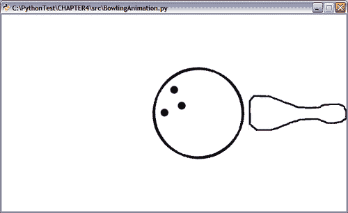

# 第四章.动画乐趣

> 卡通一直吸引着年轻人和老年人。*动画*是想象中的生物变得生动，带我们进入一个完全不同的世界。
> 
> 动画是一系列快速连续显示的帧。这创造了一种视觉错觉，例如，物体似乎在移动。本章将介绍使用 Python 和 Pyglet 多媒体应用程序开发框架开发动画的基础知识。Pyglet 旨在执行 3D 操作，但在这本书中，我们将用它来开发非常简单的 2D 动画。

在本章中，我们将：

+   学习 Pyglet 框架的基础知识。这将用于开发创建或播放动画的代码。

+   学习如何播放现有的动画文件，并使用一系列图像创建动画。

+   在“保龄球动画”项目中工作，其中可以使用键盘输入来控制动画。

+   使用单个图像的不同区域开发创建动画的代码。

+   从事一个令人兴奋的项目，该项目将展示一辆汽车在雷雨中移动的动画。这个项目将涵盖本章中涵盖的许多重要内容。

那么，让我们开始吧。

# 安装先决条件

本节将介绍安装 Pyglet 的先决条件。

## Pyglet

Pyglet 提供了一个用于使用 Python 进行多媒体应用程序开发的 API。它是一个基于 OpenGL 的库，支持多个平台。它主要用于开发游戏应用程序和其他图形丰富的应用程序。可以从[`www.pyglet.org/download.html`](http://www.pyglet.org/download.html)下载 Pyglet。安装 Pyglet 版本 1.1.4 或更高版本。Pyglet 的安装相当简单。

### Windows 平台

对于 Windows 用户，Pyglet 的安装很简单，使用二进制分发`Pyglet 1.1.4.msi`或更高版本。

### 注意

您应该安装 Python 2.6。对于 Python 2.4，还有一些额外的依赖项。我们不会在本书中讨论它们，因为我们使用 Python 2.6 来构建多媒体应用程序。

如果您从源代码安装 Pyglet，请参阅下一小节*其他平台*下的说明。

### 其他平台

Pyglet 网站为 Mac OS X 提供了二进制分发文件。下载并安装`pyglet-1.1.4.dmg`或更高版本。

在 Linux 上，如果您的操作系统软件仓库中有 Pyglet 1.1.4 或更高版本，则安装它。否则，可以从源 tarball 安装，如下所示：

+   下载并解压缩`pyglet-1.1.4.tar.gz`或更高版本的 tarball。

+   确保在 shell 中`python`是一个可识别的命令。否则，将`PYTHONPATH`环境变量设置为正确的 Python 可执行路径。

+   在 shell 窗口中，切换到提到的提取目录，然后运行以下命令：

```py
python setup.py install

```

+   使用 Pyglet 源 tarball 中的 readme/install 指令文件审查后续的安装说明。

### 小贴士

如果您已安装`setuptools`包（http://pypi.python.org/pypi/setuptools），则 Pyglet 的安装应该非常简单。然而，为此，您将需要一个 Pyglet 的运行时`egg`文件。但是，Pyglet 的`egg`文件在[`pypi.python.org`](http://pypi.python.org)上不可用。如果您能获取到 Pyglet 的`egg`文件，可以通过在 Linux 或 Mac OS X 上运行以下命令来安装它。您需要管理员权限来安装此包：

`$sudo easy_install -U pyglet`

## 安装需求概述

以下表格展示了根据版本和平台的不同，安装需求。

| 包名 | 下载位置 | 版本 | Windows 平台 | Linux/Unix/OS X 平台 |
| --- | --- | --- | --- | --- |
| Python | [`python.org/download/releases/`](http://python.org/download/releases/) | 2.6.4（或任何 2.6.x 版本） | 使用二进制分发安装 | 从二进制安装；也可以安装额外的开发包（例如，在基于 rpm 的 Linux 发行版中，包名中包含`python-devel`）。从源 tarball 构建和安装。 |
| Pyglet | [`www.pyglet.org/download.html`](http://www.pyglet.org/download.html) | 1.1.4 或更高版本 | 使用二进制分发（`.msi`文件）安装 | **Mac:** 使用磁盘映像文件（`.dmg`文件）安装。**Linux:** 使用源 tarball 构建和安装。 |

## 测试安装

在继续之前，请确保 Pyglet 已正确安装。为了测试这一点，只需从命令行启动 Python 并输入以下命令：

```py
>>>import pyglet

```

如果这个导入成功，我们就准备就绪了！

# Pyglet 入门

Pyglet 提供了一个使用 Python 进行多媒体应用程序开发的 API。它是一个基于 OpenGL 的库，可以在多个平台上运行。它主要用于开发游戏和其他图形丰富的应用程序。我们将介绍 Pyglet 框架的一些重要方面。

## 重要组件

我们将简要讨论我们将使用的 Pyglet 的一些重要模块和包。请注意，这仅仅是 Pyglet 框架的一小部分。请查阅 Pyglet 文档以了解更多关于其功能的信息，因为这超出了本书的范围。

### 窗口

`pyglet.window.Window`模块提供了用户界面。它用于创建具有 OpenGL 上下文的窗口。`Window`类有 API 方法来处理各种事件，如鼠标和键盘事件。窗口可以以正常或全屏模式查看。以下是一个创建`Window`实例的简单示例。您可以通过在构造函数中指定`width`和`height`参数来定义大小。

```py
win = pyglet.window.Window()

```

使用 OpenGL 调用`glClearColor`可以设置图像的背景颜色，如下所示：

```py
pyglet.gl.glClearColor(1, 1, 1, 1)

```

这将设置白色背景颜色。前三个参数是红色、绿色和蓝色颜色值。而最后一个值代表 alpha。以下代码将设置灰色背景颜色。

```py
pyglet.gl.glClearColor(0.5, 0.5, 0.5, 1)

```

The following illustration shows a screenshot of an empty window with a gray background color.


### 图像

The `pyglet.image` module enables the drawing of images on the screen. The following code snippet shows a way to create an image and display it at a specified position within the Pyglet window.

```py
img = pyglet.image.load('my_image.bmp')
x, y, z = 0, 0, 0
img.blit(x, y, z)

```

后续部分将介绍`pyglet.image`模块支持的一些重要操作。

### 精灵

这是一个另一个重要的模块。它用于在之前讨论的 Pyglet 窗口中显示图像或动画帧。它是一个图像实例，允许我们在 Pyglet 窗口的任何位置定位图像。精灵也可以旋转和缩放。可以创建多个相同图像的精灵并将它们放置在窗口的不同位置和不同的方向上。

### 动画

`Animation`模块是`pyglet.image`包的一部分。正如其名所示，`pyglet.image.Animation`用于从一个或多个图像帧创建动画。有不同方式来创建动画。例如，可以从一系列图像或使用`AnimationFrame`对象创建。我们将在本章后面学习这些技术。可以在 Pyglet 窗口中创建并显示动画精灵。

### AnimationFrame

这从给定的图像创建一个动画的单帧。可以从这样的`AnimationFrame`对象创建动画。以下代码行显示了一个示例。

```py
animation = pyglet.image.Animation(anim_frames)

```

`anim_frames`是一个包含`AnimationFrame`实例的列表。

### 时钟

在许多其他功能中，此模块用于安排在指定时间调用函数。例如，以下代码每秒调用`moveObjects`方法十次。

```py
pyglet.clock.schedule_interval(moveObjects, 1.0/10)

```

## 显示图像

在*图像*子部分中，我们学习了如何使用`image.blit`加载图像。然而，图像*块拷贝*是一种效率较低的绘图方式。通过创建`Sprite`实例，有更好的和推荐的方式来显示图像。可以为绘制相同图像创建多个`Sprite`对象。例如，相同的图像可能需要在窗口的多个位置显示。每个这样的图像都应该由单独的`Sprite`实例表示。以下简单的程序仅加载一个图像并在屏幕上显示代表此图像的`Sprite`实例。

```py
1 import pyglet
2
3 car_img= pyglet.image.load('images/car.png')
4 carSprite = pyglet.sprite.Sprite(car_img)
5 window = pyglet.window.Window()
6 pyglet.gl.glClearColor(1, 1, 1, 1)
7
8 @window.event
9 def on_draw():
10 window.clear()
11 carSprite.draw()
12
13 pyglet.app.run()

```

在第 3 行，使用`pyglet.image.load`调用打开图像。在第 4 行创建与该图像对应的`Sprite`实例。第 6 行的代码为窗口设置白色背景。`on_draw`是一个 API 方法，当窗口需要重绘时会被调用。在这里，图像精灵被绘制到屏幕上。下一图显示了 Pyglet 窗口中的加载图像。

### 提示

在本章和其他章节的各个示例中，文件路径字符串是硬编码的。我们使用了正斜杠作为文件路径。尽管这在 Windows 平台上有效，但惯例是使用反斜杠。例如，`images/car.png` 表示为 `images\car.png`。此外，您还可以使用 Python 中的 `os.path.join` 方法指定文件的完整路径。无论您使用什么斜杠，`os.path.normpath` 都会确保它修改斜杠以适应平台。以下代码片段展示了 `os.path.normpath` 的使用：

`import os`

`original_path = 'C:/images/car.png'`

`new_path = os.path.normpath(original_path)`


前面的图像展示了 Pyglet 窗口显示的静态图像。

## 鼠标和键盘控制

Pyglet 的 `Window` 模块实现了一些 API 方法，这些方法允许用户在播放动画时输入。API 方法如 `on_mouse_press` 和 `on_key_press` 用于在动画期间捕获鼠标和键盘事件。这些方法可以被覆盖以执行特定操作。

## 添加音效

Pyglet 的 `media` 模块支持音频和视频播放。以下代码加载一个媒体文件并在动画期间播放它。

```py
1 background_sound = pyglet.media.load(
2 'C:/AudioFiles/background.mp3',
3 streaming=False)
4 background_sound.play()

```

在第 3 行提供的第二个可选参数在加载媒体时将媒体文件完全解码到内存中。如果媒体在动画期间需要播放多次，这很重要。API 方法 `play()` 开始流式传输指定的媒体文件。

# 使用 Pyglet 的动画

Pyglet 框架提供了一系列开发动画所需的模块。其中许多在早期章节中已简要讨论。现在让我们学习使用 Pyglet 创建 2D 动画的技术。

## 查看现有动画

如果您已经有一个动画，例如，`.gif` 文件格式，它可以直接使用 Pyglet 加载和显示。这里要使用的 API 方法是 `pyglet.image.load_animation`。

# 查看现有动画的行动时间

这将是一个简短的练习。本节的目标是培养对使用 Pyglet 查看动画的初步理解。那么，让我们开始吧。

1.  从 Packt 网站下载文件 `SimpleAnimation.py`。同时下载文件 `SimpleAnimation.gif` 并将其放置在子目录 `images` 中。代码如下所示：

    ```py
    1 import pyglet
    2
    3 animation = pyglet.image.load_animation(
    4 "images/SimpleAnimation.gif")
    5
    6 # Create a sprite object as an instance of this animation.
    7 animSprite = pyglet.sprite.Sprite(animation)
    8
    9 # The main pyglet window with OpenGL context
    10 w = animSprite.width
    11 h = animSprite.height
    12 win = pyglet.window.Window(width=w, height=h)
    13
    14 # r,g b, color values and transparency for the background
    15 r, g, b, alpha = 0.5, 0.5, 0.8, 0.5
    16
    17 # OpenGL method for setting the background.
    18 pyglet.gl.glClearColor(r, g, b, alpha)
    19
    20 # Draw the sprite in the API method on_draw of
    21 # pyglet.Window
    22 @win.event
    23 def on_draw():
    24 win.clear()
    25 animSprite.draw()
    26
    27 pyglet.app.run()

    ```

1.  代码是自我解释的。在第 3 行，API 方法 image.load_animation 使用指定的动画文件创建了一个 image.Animation 类的实例。对于这个动画，在第 7 行创建了一个 Sprite 对象。第 12 行创建的 Pyglet 窗口将用于显示动画。这个窗口的大小由 animSprite 的高度和宽度指定。使用 OpenGL 调用 glClearColor 设置窗口的背景颜色。

1.  接下来，我们需要将这个动画精灵绘制到 Pyglet 窗口中。`pyglet.window` 定义了一个 API 方法 `on_draw`，当发生事件时会被调用。在 25 行调用了动画 `Sprite` 的 `draw()` 方法，以在屏幕上渲染动画。第 22 行的代码很重要。装饰器 `@win.event` 允许我们在事件发生时修改 `pyglet.window.Window` 的 `on_draw` API 方法。最后，第 27 行运行了这个应用程序。

    ### 小贴士

    你可以使用像 GIMP 这样的免费图像编辑软件包创建自己的动画文件，例如 `SimpleAnimation.gif`。这个动画文件是使用 GIMP 2.6.7 创建的，通过在每个单独的图层上绘制每个角色，然后使用 **滤镜** | **动画** | **混合** 将所有图层混合在一起。

1.  将文件 `SimpleAnimation.py` 与动画文件 `SimpleAnimation.gif` 放在同一目录下，然后按照以下方式运行程序：

    ```py
    $python SimpleAnimation.py

    ```

    +   这将在 Pyglet 窗口中显示动画。你可以使用除 SimpleAnimation.gif 之外的动画文件。只需修改此文件中相关的代码，或者添加代码以接受任何 GIF 文件作为此程序的命令行参数。下一幅插图显示了该动画在不同时间间隔的一些帧。

    

    上一幅图像是不同时间间隔运行动画的屏幕截图。

## 刚才发生了什么？

我们通过一个示例演示了如何使用 Pyglet 加载并查看已创建的动画文件。这个简短的练习让我们了解了使用 Pyglet 查看动画的一些初步知识。例如，我们学习了如何创建 Pyglet 窗口并使用 `pyglet.Sprite` 对象加载动画。这些基础知识将在本章中用到。

## 使用一系列图像进行动画

API 方法 `Animation.from_image_sequence` 允许使用一系列连续的图像创建动画。每个图像都作为动画中的一帧显示，依次排列。可以在创建动画对象时指定每帧显示的时间，也可以在动画实例创建后设置。

# 动作时间 - 使用一系列图像进行动画

让我们开发一个工具，可以创建动画并在屏幕上显示。这个工具将使用给定的图像文件创建并显示动画。每个图像文件都将作为动画中的一帧显示，持续指定的时间。这将是一个有趣的动画，展示了一个带有摆锤的祖父钟。我们将使用其他东西来动画化摆锤的振荡，包括使表盘保持静止。这个动画只有三个图像帧；其中两个显示了摆锤在相反的极端位置。这些图像的顺序如图所示。


动画的时间图像帧出现在前面的图像中。

1.  从 Packt 网站下载文件`ImageSequenceAnimation.py`。

1.  该文件中的代码如下所示。

    ```py
    1 import pyglet
    2
    3 image_frames = ('images/clock1.png',
    4 'images/clock2.png',
    5 'images/clock3.png')
    6
    7 # Create the list of pyglet images
    8 images = map(lambda img: pyglet.image.load(img),
    9 image_frames)
    10
    11 # Each of the image frames will be displayed for 0.33
    12 # seconds
    13 # 0.33 seconds chosen so that the 'pendulam in the clock
    14 # animation completes one oscillation in ~ 1 second !
    15
    16 animation = pyglet.image.Animation.from_image_sequence(
    17 images, 0.33)
    18 # Create a sprite instance.
    19 animSprite = pyglet.sprite.Sprite(animation)
    20
    21 # The main pyglet window with OpenGL context
    22 w = animSprite.width
    23 h = animSprite.height
    24 win = pyglet.window.Window(width=w, height=h)
    25
    26 # Set window background color to white.
    27 pyglet.gl.glClearColor(1, 1, 1, 1)
    28
    29 # The @win.event is a decorator that helps modify the API
    30 # methods such as
    31 # on_draw called when draw event occurs.
    32 @win.event
    33 def on_draw():
    34 win.clear()
    35 animSprite.draw()
    36
    37 pyglet.app.run()

    ```

1.  元组`image_frames`包含图像的路径。第 8 行的`map`函数调用为每个图像路径创建 pyglet.image 对象，并将结果图像存储在列表中。在第 16 行，使用 API 方法`Animation.from_image_sequence`创建动画。此方法将图像对象列表作为参数。另一个可选参数是每帧显示的秒数。我们将此时间设置为每张图像 0.33 秒，以便整个动画循环的总时间接近 1 秒。因此，在动画中，摆锤的一次完整振荡将在大约一秒内完成。我们已经在早期部分讨论了其余的代码。

    ```py
    $python ImageSequenceAnimation.py

    ```

1.  将图像文件放置在包含文件`ImageSequenceAnimation.py`的目录下的子目录`images`中。然后使用以下命令运行程序：

    +   你将在窗口中看到一个带有摆动摆锤的时钟。动画将循环进行，关闭窗口将结束动画。

## 刚才发生了什么？

通过快速显示静态图像，我们刚刚创建了一个类似“翻页书”的卡通！我们开发了一个简单的实用工具，它接受一系列图像作为输入，并使用 Pyglet 创建动画。为了完成这个任务，我们使用了`Animation.from_image_sequence`来创建动画，并重新使用了*查看现有动画*部分的大部分框架。

## 单个图像动画

想象一下你正在制作一部卡通电影，你想要动画化箭头或子弹击中目标的动作。在这种情况下，通常只有一个图像。所需的动画效果是通过执行适当的平移或旋转图像来实现的。

# 动作时间 - 弹跳球动画

让我们创建一个简单的“弹跳球”动画。我们将使用单个图像文件，`ball.png`，可以从 Packt 网站下载。此图像的像素尺寸为 200x200，是在透明背景上创建的。以下截图显示了在 GIMP 图像编辑器中打开的此图像。球上的三个点标识了其侧面。我们将看到为什么这是必要的。想象这是一个用于保龄球的球。


在 GIMP 中打开的球图像如图所示。球的像素大小为 200x200。

1.  从 Packt 网站下载文件 `SingleImageAnimation.py` 和 `ball.png`。将 `ball.png` 文件放置在 `SingleImageAnimation.py` 所在目录的子目录 'images' 中。

1.  以下代码片段显示了代码的整体结构。

    ```py
    1 import pyglet
    2 import time
    3
    4 class SingleImageAnimation(pyglet.window.Window):
    5 def __init__(self, width=600, height=600):
    6 pass
    7 def createDrawableObjects(self):
    8 pass
    9 def adjustWindowSize(self):
    10 pass
    11 def moveObjects(self, t):
    12 pass
    13 def on_draw(self):
    14 pass
    15 win = SingleImageAnimation()
    16 # Set window background color to gray.
    17 pyglet.gl.glClearColor(0.5, 0.5, 0.5, 1)
    18
    19 pyglet.clock.schedule_interval(win.moveObjects, 1.0/20)
    20
    21 pyglet.app.run()

    ```

1.  虽然这不是必需的，但我们将将事件处理和其他功能封装在 `SingleImageAnimation` 类中。要开发的应用程序很短，但通常，这是一种良好的编码实践。这也将有利于代码的任何未来扩展。在第 14 行创建了一个 `SingleImageAnimation` 实例。这个类是从 `pyglet.window.Window` 继承的。它封装了我们这里需要的功能。类重写了 API 方法 `on_draw`。当窗口需要重绘时调用 `on_draw`。请注意，我们不再需要在 `on_draw` 方法上方使用如 `@win.event` 这样的装饰器语句，因为窗口 API 方法只是通过这个继承类被重写。

1.  `SingleImageAnimation` 类的构造函数如下：

    ```py
    1 def __init__(self, width=None, height=None):
    2 pyglet.window.Window.__init__(self,
    3 width=width,
    4 height=height,
    5 resizable = True)
    6 self.drawableObjects = []
    7 self.rising = False
    8 self.ballSprite = None
    9 self.createDrawableObjects()
    10 self.adjustWindowSize()

    ```

1.  如前所述，`SingleImageAnimation` 类继承自 `pyglet.window.Window`。然而，其构造函数并不接受其超类支持的所有参数。这是因为我们不需要更改大多数默认参数值。如果你想进一步扩展此应用程序并需要这些参数，你可以通过将它们作为 `__init__` 参数添加来实现。构造函数初始化一些实例变量，然后调用方法创建动画精灵和调整窗口大小。

1.  `createDrawableObjects` 方法使用 `ball.png` 图像创建一个精灵实例。

    ```py
    1 def createDrawableObjects(self):
    2 """
    3 Create sprite objects that will be drawn within the
    4 window.
    5 """
    6 ball_img= pyglet.image.load('images/ball.png')
    7 ball_img.anchor_x = ball_img.width / 2
    8 ball_img.anchor_y = ball_img.height / 2
    9
    10 self.ballSprite = pyglet.sprite.Sprite(ball_img)
    11 self.ballSprite.position = (
    12 self.ballSprite.width + 100,
    13 self.ballSprite.height*2 - 50)
    14 self.drawableObjects.append(self.ballSprite)

    ```

1.  图像实例的 `anchor_x` 和 `anchor_y` 属性被设置为图像有一个锚点正好在其中心。这在稍后旋转图像时将很有用。在第 10 行，创建了精灵实例 `self.ballSprite`。稍后，我们将设置 Pyglet 窗口的宽度和高度为精灵宽度的两倍和高度的三倍。图像在窗口中的位置在第 11 行设置。初始位置选择如图所示。在这种情况下，只有一个 Sprite 实例。然而，为了使程序更通用，维护了一个名为 `self.drawableObjects` 的可绘制对象列表。

1.  为了继续上一步的讨论，我们现在将回顾 `on_draw` 方法。

    ```py
    def on_draw(self):
    self.clear()
    for d in self.drawableObjects:
    d.draw()

    ```

1.  如前所述，on_draw 函数是 pyglet.window.Window 类的 API 方法，当窗口需要重绘时被调用。这里重写了这个方法。self.clear()调用清除了窗口中之前绘制的所有内容。然后，在 for 循环中绘制列表 self.drawableObjects 中的所有 Sprite 对象。

    +   前面的图片展示了动画中球的初始位置。

1.  方法`adjustWindowSize`设置了 Pyglet 窗口的`width`和`height`参数。代码是自我解释的：

    ```py
    def adjustWindowSize(self):
    w = self.ballSprite.width * 3
    h = self.ballSprite.height * 3
    self.width = w
    self.height = h

    ```

1.  到目前为止，我们已经为动画的播放设置了所有必要的东西。现在轮到有趣的部分了。我们将改变代表图片的精灵的位置，以实现动画效果。在动画过程中，图片也会被旋转，以使其看起来像是一个自然弹跳的球。

    ```py
    1 def moveObjects(self, t):
    2 if self.ballSprite.y - 100 < 0:
    3 self.rising = True
    4 elif self.ballSprite.y > self.ballSprite.height*2 - 50:
    5 self.rising = False
    6
    7 if not self.rising:
    8 self.ballSprite.y -= 5
    9 self.ballSprite.rotation -= 6
    10 else:
    11 self.ballSprite.y += 5
    12 self.ballSprite.rotation += 5

    ```

1.  这个方法计划在程序中以每秒 20 次的频率被调用。

    ```py
    pyglet.clock.schedule_interval(win.moveObjects, 1.0/20)

    ```

    +   首先，球被放置在顶部附近。动画应该逐渐下落，碰到底部后弹起。之后，它继续向上运动，在顶部附近的一个边界处碰撞，然后再次开始向下运动。从第 2 行到第 5 行的代码块检查 self.ballSprite 的当前 y 位置。如果它触碰到上限，self.rising 标志被设置为 False。同样，当触碰到下限，标志被设置为 True。这个标志随后被下一个代码片段用来增加或减少 self.ballSprite 的 y 位置。

1.  高亮显示的代码行旋转`Sprite`实例。当前的旋转角度根据给定值增加或减少。这就是为什么我们将图像锚点`anchor_x`和`anchor_y`设置在图像中心的原因。`Sprite`对象尊重这些图像锚点。如果锚点没有这样设置，球在最终动画中看起来会摇摆不定。

1.  一旦所有部件都到位，可以从命令行运行程序：

    ```py
    $python SingleImageAnimation.py

    ```

    +   这将弹出一个窗口，播放弹跳球动画。接下来的插图显示了动画中球下落时的几个中间帧。

## 刚才发生了什么？

我们学习了如何仅使用一张图片来创建动画。一个球的形象由一个精灵实例表示。然后这个精灵在屏幕上被平移和旋转，以实现弹跳球的动画。整个功能，包括事件处理，都被封装在类`SingleImageAnimation`中。

## 项目：一个简单的保龄球动画

是时候进行一个小项目了。我们将重用 *Single Image Animation* 部分的大部分代码和一些其他内容，以创建一个动画，其中滚动的球在保龄球游戏中击中球柱。尽管本章涵盖了动画，但这个项目将让你初步了解如何将动画转变为游戏。这并不是一个真正的游戏，但它将涉及一些用户交互来控制动画。


保龄球动画的起始位置，显示了球和球图片。

# 动作时间 - 一个简单的保龄球动画

让我们开发这个应用程序的代码。如前所述，大部分代码来自 *Single Image Animation* 部分。因此，我们只讨论创建保龄球动画所需的新和修改的方法。

1.  从 Packt 网站下载 Python 源文件 `BowlingAnimation.py`。整体类设计与在 *Single Image Animation* 部分开发的设计相同。我们只讨论新的和修改的方法。你可以从该文件中查看其余的代码。

1.  此外，下载本项目中使用的图像文件。这些文件是 `ball.png` 和 `pin.png`。将这些文件放置在子目录 `images` 中。`images` 目录应放置在上述 Python 源文件所在的目录中。

1.  类的 `__init__` 方法与 `SingleImageAnimation` 类的 `__init__` 方法相同。这里唯一的改变是初始化以下标志：

    ```py
    self.paused = False
    self.pinHorizontal = False

    ```

1.  后续使用 self.pinHorizontal 标志来检查球是否将球撞倒。而 self.paused 用于根据其值暂停或恢复动画。

1.  `createDrawable` 对象方法被修改为为球图片创建精灵实例。同时，调整球和球精灵的位置以适应我们的动画需求。代码如下所示：

    ```py
    1 def createDrawableObjects(self):
    2 ball_img= pyglet.image.load('images/ball.png')
    3 ball_img.anchor_x = ball_img.width / 2
    4 ball_img.anchor_y = ball_img.height / 2
    5
    6 pin_img = pyglet.image.load('images/pin.png')
    7 pin_img.anchor_x = pin_img.width / 2
    8 pin_img.anchor_y = pin_img.height / 2
    9
    10 self.ballSprite = pyglet.sprite.Sprite(ball_img)
    11 self.ballSprite.position = (0 + 100,
    12 self.ballSprite.height)
    13
    14 self.pinSprite = pyglet.sprite.Sprite(pin_img)
    15 self.pinSprite.position = (
    16 (self.ballSprite.width*2 + 100,
    17 self.ballSprite.height) )
    18
    19 # Add these sprites to the list of drawables
    20 self.drawableObjects.append(self.ballSprite)
    21 self.drawableObjects.append(self.pinSprite)

    ```

1.  代码块 6-8 创建了一个代表球图片的图像实例，并将其图像锚点设置在其中心。代表球和球图片的 Sprite 实例分别在 10 行和 14 行创建。它们的设置位置使得初始位置看起来与前面的插图所示相同。最后，将这些精灵添加到在 on_draw 方法中绘制的可绘制对象列表中。

1.  接下来，让我们回顾 `moveObjects` 方法。与之前一样，这个方法每 `0.05` 秒被调用一次。

    ```py
    1 def moveObjects(self, t):
    2 if self.pinHorizontal:
    3 self.ballSprite.x = 100
    4 self.pinSprite.x -= 100
    5
    6 if self.ballSprite.x < self.ballSprite.width*2:
    7 if self.ballSprite.x == 100:
    8 time.sleep(1)
    9 self.pinSprite.rotation = 0
    10 self.pinHorizontal = False
    11
    12 self.ballSprite.x += 5
    13 self.ballSprite.rotation += 5
    14
    15 if self.ballSprite.x >= self.ballSprite.width*2:
    16 self.pinSprite.rotation = 90
    17 self.pinSprite.x += 100
    18 self.pinHorizontal = True

    ```

1.  当球精灵的 x 位置在 100 像素到 self.ballSprite 宽度的两倍之间时，会调用从第 6 行到第 13 行的 if 块。在第 12 行，self.ballSprite 的 x 位置增加了 5 像素。此外，精灵旋转了 5 度。这两个变换的组合产生了一种效果，我们在 Pyglet 窗口中看到球从左到右水平滚动。如前所述，球心的位置在 x = self.ballSprite.width*2 + 100 和 y = self.ballSprite.height。

    从第 15 行到第 18 行的 if 块是球似乎击中柱子的地方。也就是说，球精灵中心的 x 坐标大约离柱子中心 100 像素。选择 100 像素值是为了考虑到球的半径。因此，一旦球击中柱子，柱子图像在第 16 行旋转了 90 度。这产生了一种视觉效果，看起来球把柱子撞倒了。柱子的 x 坐标增加了 100 像素，这样在柱子旋转后，球和柱子图像不会重叠。你还可以在这里做一些改进。将柱子精灵的 y 位置进一步向下移动，这样柱子看起来就像躺在地面上。在这个 if 块中，我们还设置了标志 self.pinHorizontal 为 True。下次调用 moveObjects 方法时，首先检查柱子是垂直还是水平。如果柱子是水平的，代码在第 2 行到第 4 行将恢复球和柱子的原始位置。这是为下一个动画循环做准备。在第 9 行，柱子被旋转回 0 度，而在第 10 行，标志 self.pinHorizontal 被重置为 False。

1.  使用我们迄今为止开发的代码，以及来自 `SingleImageAnimation` 类的其余代码，如果你运行程序，它将显示保龄球动画。现在让我们为此动画添加一些控制。在构造函数中初始化了一个标志 `self.paused`。它将在这里使用。就像 `on_draw` 一样，`on_key_press` 是 `pyglet.window.Window` 的另一个 API 方法。它在这里被重写以实现暂停和恢复控制。

    ```py
    1 def on_key_press(self, key, modifiers):
    2 if key == pyglet.window.key.P and not self.paused:
    3 pyglet.clock.unschedule(self.moveObjects)
    4 self.paused = True
    5 elif key == pyglet.window.key.R and self.paused:
    6 pyglet.clock.schedule_interval(
    7 self.moveObjects, 1.0/20)
    8 self.paused = False

    ```

1.  关键参数是用户按下的键盘键。从第 2 行到第 4 行的 if 块在按下 P 键时暂停动画。self.moveObjects 方法每 0.05 秒被调度一次。使用 pyglet.clock.unschedule 方法取消对该方法的调度。要恢复动画，在第 6 行调用 schedule_interval 方法。self.paused 标志确保多次按键不会对动画产生任何不良影响。例如，如果你多次按下 R 键，代码将仅忽略随后的按键事件。

1.  请参阅文件 `BowlingAnimation.py` 以查看或开发其余代码，然后从命令行运行程序，如下所示：

    ```py
    $python BowlingAnimation.py

    ```

    +   这将在窗口中播放动画。按键盘上的 P 键暂停动画。要恢复暂停的动画，按 R 键。下一张插图显示了该动画中的几个中间帧。

        保龄球动画的中间帧如图所示。

## 刚才发生了什么？

我们完成了一个简单但令人兴奋的项目，其中开发了一个碗击打钉子的动画。这是通过在屏幕上移动和旋转图像精灵来实现的。我们重新使用了 `SingleImageAnimation` 类中的几个方法。此外，我们还学习了如何通过重写 `on_key_press` API 方法来控制动画。

## 使用不同图像区域的动画

使用单个图像的不同区域来创建动画是可能的。这些区域中的每一个都可以被视为一个单独的动画帧。为了达到预期的动画效果，正确创建带有区域的图像非常重要。在下面的示例中，动画将使用这些区域来创建。我们还将使用该图像内每个区域默认的位置参数。因此，本节的主要任务仅仅是使用这些区域的原貌，并从中创建动画帧。我们首先看看图像的外观。下面的插图显示了这张图像。


上一张图片中显示了一个带有想象中的 '网格' 的单个图像。

覆盖在这个图像上的水平虚线表示一个想象中的图像网格如何将图像分割成不同的区域。这里我们有四行和一列。因此，在动画过程中，这些图像区域将作为单个动画帧显示。注意雨滴图像是如何绘制的。在第一行，四个雨滴被绘制在顶部。然后在下一行，这些图像相对于第一行的雨滴稍微向西南方向偏移。这种偏移在第三行和第四行进一步增加。

# 动作时间 - 雨滴动画

让我们通过使用单个图像的不同区域来创建下落雨滴的动画。

1.  从 Packt 网站下载 Python 源文件 `RainDropsAnimation.py` 和图像文件 `droplet.png`。与之前一样，将图像文件放置在子目录 `images` 中。`images` 目录应位于 Python 源文件所在的目录中。

1.  类 `RainDropsAnimation` 的 `__init__` 方法被展示出来。

    ```py
    1 def __init__(self, width=None, height=None):
    2 pyglet.window.Window.__init__(self,
    3 width=width,
    4 height=height)
    5 self.drawableObjects = []
    6 self.createDrawableObjects()

    ```

1.  代码是自我解释的。类 `RainDropsAnimation` 继承自 `pyglet.window.Window`。类的构造函数调用创建用于在屏幕上显示动画的 `Sprite` 实例的方法。

1.  让我们回顾一下 `createDrawableObjects` 方法。

    ```py
    1 def createDrawableObjects(self):
    2 num_rows = 4
    3 num_columns = 1
    4 droplet = 'images/droplet.png'
    5 animation = self.setup_animation(droplet,
    6 num_rows,
    7 num_columns)
    8
    9 self.dropletSprite = pyglet.sprite.Sprite(animation)
    10 self.dropletSprite.position = (0,0)
    11
    12 # Add these sprites to the list of drawables
    13 self.drawableObjects.append(self.dropletSprite)

    ```

1.  在第 5 行，通过调用 `setup_animation` 方法创建了 `pyglet.image.Animation` 实例。在第 9 行，为这个动画对象创建了 `Sprite` 实例。

1.  `setup_animation` 方法是主要的工作方法，它使用图像文件内的区域来创建单个动画帧。

    ```py
    1 def setup_animation(self, img, num_rows, num_columns):
    2 base_image = pyglet.image.load(img)
    3 animation_grid = pyglet.image.ImageGrid(base_image,
    4 num_rows,
    5 num_columns)
    6 image_frames = []
    7
    8 for i in range(num_rows*num_columns, 0, -1):
    9 frame = animation_grid[i-1]
    10 animation_frame = (
    11 pyglet.image.AnimationFrame(frame,
    12 0.2))
    13 image_frames.append(animation_frame)
    14
    15 animation = pyglet.image.Animation(image_frames)
    16 return animation

    ```

1.  首先，在第二行创建了图像实例。ImageGrid 是在水滴图像上放置的一个想象中的网格。在这个图像网格中的每个'单元格'或'图像区域'都可以被视为动画中的一个单独图像帧。ImageGrid 实例是通过提供图像对象和行数和列数作为参数来构建的。在这种情况下，行数是 4，只有一列。因此，在动画中将有四个这样的图像帧，对应于 ImageGrid 中的每一行。在第十行创建了 AnimationFrame 对象。第八行的代码将 i 的值从最大区域或单元格递减到最小。第九行获取特定的图像区域，然后用于创建 pyglet.image.AnimationFrame 实例，就像我们在第十行所做的那样。第二个参数是每个帧将在屏幕上显示的时间。在这里，我们显示每个帧 0.2 秒。所有这样的动画帧都存储在 image_frames 列表中，然后使用此列表创建 pyglet.image.Animation 实例。

1.  请参考文件`RainDropsAnimation.py`来查看剩余的代码，然后从命令行运行程序，如下所示：

    ```py
    $python RainDropsAnimation.py

    ```

    +   此动画显示了一个单一图像的四个图像区域，依次展示。下一幅插图显示了这四个图像。

        在上一幅插图显示的四个图像帧展示了单一图像的不同区域。这四个图像帧在动画循环中重复出现。

## 刚才发生了什么？

我们使用单一图像的不同区域创建了一个动画。这些区域中的每一个都被当作一个单独的动画帧来处理。在此动画中使用的图像创建过程进行了简要讨论。在众多其他事情中，我们学习了如何创建和使用 Pyglet 类，例如`ImageGrid`和`AnimationFrame`。

# 项目：雨天驾驶！

本项目基本上是对本章到目前为止所学内容的总结。此外，它还将涵盖一些其他内容，例如为动画添加音效，在播放动画时显示或隐藏某些图像精灵等。在这个动画中，将有一个静止的云图像。我们将重新使用*雨滴动画*部分的代码来动画化下落的雨。将有一个图像精灵来动画化闪电效果。最后，一辆卡通车将从左到右穿过这场大雨。以下快照是捕捉所有这些组成部分图像的动画帧。


在前一幅图像中展示了动画*雨天驾驶*的组成部分图像。

# 行动时间 - 雨天驾驶！

是时候编写这个动画的代码了。

1.  下载 Python 源文件 `RainyDayAnimation.py`。我们将讨论此文件中的一些重要方法。你可以阅读此文件中的其余代码。

1.  从 Packt 网站下载图像文件，`droplet.png, cloud.png, car.png` 和 `lightening.png`。将这些图像文件放置在名为 `images` 的子目录中。`images` 目录应放置在 Python 源文件所在的目录中。

1.  类的构造函数编写如下：

    ```py
    1 def __init__(self, width=None, height=None):
    2 pyglet.window.Window.__init__(self,
    3 width=width,
    4 height=height,
    5 resizable=True)
    6 self.drawableObjects = []
    7 self.paused = False
    8
    9
    10 self.createDrawableObjects()
    11 self.adjustWindowSize()
    12 # Make sure to replace the following media path to
    13 # with an appropriate path on your computer.
    14 self.horn_sound = (
    15 pyglet.media.load('C:/AudioFiles/horn.wav',
    16 streaming=False) )

    ```

1.  代码与雨滴动画中开发的代码相同。媒体文件 horn.wav 在第 14 行被解码。streaming 标志设置为 False，以便在动画期间可以多次播放媒体。确保在第 15 行指定计算机上的适当音频文件路径。

1.  让我们回顾一下 `createDrawableObjects` 方法：

    ```py
    1 def createDrawableObjects(self):
    2
    3 num_rows = 4
    4 num_columns = 1
    5 droplet = 'images/droplet.png'
    6 animation = self.setup_animation(droplet,
    7 num_rows,
    8 num_columns)
    9
    10 self.dropletSprite = pyglet.sprite.Sprite(animation)
    11 self.dropletSprite.position = (0,200)
    12
    13 cloud = pyglet.image.load('images/cloud.png')
    14 self.cloudSprite = pyglet.sprite.Sprite(cloud)
    15 self.cloudSprite.y = 100
    16
    17 lightening = pyglet.image.load('images/lightening.png')
    18 self.lSprite = pyglet.sprite.Sprite(lightening)
    19 self.lSprite.y = 200
    20
    21 car = pyglet.image.load('images/car.png')
    22 self.carSprite = pyglet.sprite.Sprite(car, -500, 0)
    23
    24 # Add these sprites to the list of drawables
    25 self.drawableObjects.append(self.cloudSprite)
    26 self.drawableObjects.append(self.lSprite)
    27 self.drawableObjects.append(self.dropletSprite)
    28 self.drawableObjects.append(self.carSprite)

    ```

1.  从第 3 行到第 10 行的代码块与雨滴动画中开发的那一个相同。self.dropletSprite 图像放置在适当的位置。接下来，我们只需在 Pyglet 窗口中创建精灵来加载云、闪电和汽车图像。这些精灵被放置在窗口内的适当位置。例如，汽车的起始位置在屏幕外。它在 x = -500 和 y = 0 的位置锚定。从第 24 行到第 28 行的代码块将所有 Sprite 实例添加到 self.drawableObjects 中。在 on_draw 方法中调用这些实例的 draw() 方法。

1.  为了达到预期的动画效果，我们必须在动画过程中移动各种精灵。这是通过安排一些方法在指定的时间间隔被调用来完成的。这些方法在 Pyglet 窗口重绘时更新精灵的坐标或切换其可见性。代码如下所示：

    ```py
    # Schedule the method RainyDayAnimation.moveObjects to be
    # called every 0.05 seconds.
    pyglet.clock.schedule_interval(win.moveObjects, 1.0/20)
    # Show the lightening every 1 second
    pyglet.clock.schedule_interval(win.show_lightening, 1.0)

    ```

1.  我们已经在早期部分看到了 moveObjects 方法的例子。在这个项目中，我们安排了另一个方法，RainyDayAnimation.show_lightening，每秒被调用一次。该方法创建了一个动画效果，闪电每秒在不同的位置击中。

1.  我们现在将回顾 `show_lightening` 方法。

    ```py
    1 def show_lightening(self, t):
    2 if self.lSprite.visible:
    3 self.lSprite.visible = False
    4 else:
    5 if(self.lSprite.x == 100):
    6 self.lSprite.x += 200
    7 else:
    8 self.lSprite.x = 100
    9
    10 self.lSprite.visible = True

    ```

1.  self.lSprite 是代表闪电图像的精灵。我们的目标是创建一个动画效果，闪电闪现一下然后消失。这可以通过切换 Sprite.visible 属性来实现。当此属性设置为 False 时，闪电不会显示。当它设置为 True 时，执行 else 块 4-10。self.lSprite 的位置被改变，以便闪电在下次调用此方法时出现在不同的位置。

1.  `moveObjects` 方法被安排每 `0.05` 秒调用一次。

    ```py
    1 def moveObjects(self, t):
    2 if self.carSprite.x <= self.cloudSprite.width:
    3 self.carSprite.x += 10
    4 else:
    5 self.carSprite.x = -500
    6 self.horn_sound.play()

    ```

1.  每次调用时，它都会将代表汽车的精灵在 x 轴正方向上移动 10 个像素。然而，如果 self.carSprite 的 x 坐标超过了其宽度，汽车将重置到原始位置。此外，在汽车的起始位置，会播放喇叭声。

1.  检查`RainyDayAnimation.py`文件中的其余代码。确保将`self.horn_sound`的音频文件路径替换为您的计算机上的适当文件路径。一切设置妥当后，从命令行运行程序，如下所示：

    ```py
    $python RainyDayAnimation.py

    ```

+   这将弹出一个窗口，播放一个有趣的汽车在雷雨中巡航的动画。下一张插图显示了动画的一些中间帧。


+   在前面的图像中显示了汽车在雨天行驶的动画的中间帧。

## 刚才发生了什么？

本项目中开发的动画使用了四张不同的图像。我们学习了如何在动画中添加音效和更改图像精灵的可见性。一些图像被翻译或间歇性地显示，以实现所需的动画效果。单个图像的不同区域被用来动画化雨滴。总的来说，这个有趣的项目涵盖了本书中学到的许多内容。

## 尝试添加更多效果的英雄

1.  在动画中，每当闪电出现时，都会播放雷雨声效。

1.  在前面展示的代码中，闪电图像的位置在两个固定位置之间切换。使用 Python 的 random 模块获取 0 到`self.cloudSprite.width`之间的随机坐标，并将其用作`self.lSprite`的 x 坐标。

1.  添加键盘控制以改变汽车的速度、闪电的频率等。

# 概述

在本章中，我们学习了使用 Pyglet 在 Python 中创建 2D 动画的很多知识。具体来说，我们：

+   学习了 Pyglet 框架创建动画的一些基本组件。例如，讨论了`Window, Image, Animation, Sprite, AnimationFrame, ImageGrid`等模块。

+   编写代码以使用一系列图像创建动画或播放预创建的动画。

+   学习了如何修改 Pyglet 精灵的位置，添加键盘和鼠标控制以及为动画添加音效。

+   在“雨天驾驶”的卡通动画项目中工作。在这里，我们应用了本章中学到的多种技术。
