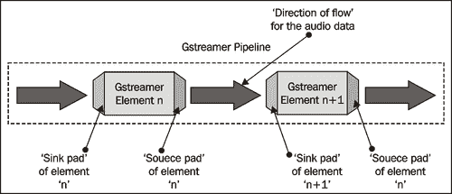
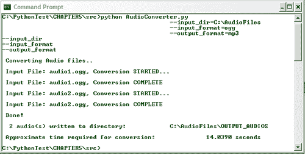

# 第五章. 音频处理

> 几十年前，无声电影照亮了银幕，但后来，是音频效果让它们变得生动。在播放 CD 曲目、录制自己的声音或将歌曲转换为不同的音频格式时，我们经常处理数字音频处理。有许多库或多媒体框架可用于音频处理。本章将使用名为 GStreamer 的流行多媒体框架的 Python 绑定介绍一些常见的数字音频处理技术。

在本章中，我们将：

+   学习 GStreamer 多媒体框架背后的基本概念

+   使用 GStreamer API 进行音频处理

+   开发一些简单的音频处理工具用于“日常使用”。我们将开发能够批量转换音频文件格式、录制音频和播放音频文件的工具

那么，让我们开始吧！

# 安装必备条件

由于我们将使用外部多媒体框架，因此有必要安装本节中提到的软件包。

## GStreamer

GStreamer 是一个流行的开源多媒体框架，支持广泛的多媒体格式的音频/视频操作。它用 C 编程语言编写，并为包括 Python 在内的其他编程语言提供了绑定。许多开源项目使用 GStreamer 框架来开发自己的多媒体应用程序。在本章中，我们将使用 GStreamer 框架进行音频处理。为了与 Python 一起使用，我们需要安装 GStreamer 及其 Python 绑定。

### Windows 平台

GStreamer 的二进制发行版在项目网站[`www.gstreamer.net/`](http://www.gstreamer.net/)上未提供。从源代码安装可能需要 Windows 用户付出相当大的努力。幸运的是，*GStreamer WinBuilds*项目提供了预编译的二进制发行版。以下是项目网站的 URL：[`www.gstreamer-winbuild.ylatuya.es`](http://www.gstreamer-winbuild.ylatuya.es)

GStreamer 的二进制发行版以及其 Python 绑定（Python 2.6）可在网站上的**下载**区域找到：[`www.gstreamer-winbuild.ylatuya.es/doku.php?id=download`](http://www.gstreamer-winbuild.ylatuya.es/doku.php?id=download)

您需要安装两个软件包。首先，安装 GStreamer，然后安装 GStreamer 的 Python 绑定。从 GStreamer WinBuilds 项目网站下载并安装 GStreamer 的 GPL 发行版。GStreamer 可执行文件名为`GStreamerWinBuild-0.10.5.1.exe`。版本应为 0.10.5 或更高。默认情况下，此安装将在您的机器上创建一个文件夹[C:\gstreamer](http://C:%5Cgstreamer)。该文件夹中的`bin`目录包含使用 GStreamer 时所需的运行时库。

接下来，安装 GStreamer 的 Python 绑定。二进制分发可在同一网站上找到。使用适用于 Python 2.6 的可执行文件 `Pygst-0.10.15.1-Python2.6.exe`。版本应为 0.10.15 或更高。

### 注意

GStreamer WinBuilds 似乎是一个独立的项目。它基于 OSSBuild 开发套件。有关更多信息，请访问 [`code.google.com/p/ossbuild/`](http://code.google.com/p/ossbuild/)。可能发生的情况是，使用 Python 2.6 构建的 GStreamer 二进制文件在您阅读此书时可能不再在提到的网站上可用。因此，建议您联系 OSSBuild 的开发者社区。也许他们可以帮助您解决问题！

或者，您可以在 Windows 平台上从源代码构建 GStreamer，使用类似 Linux 的 Windows 环境，如 Cygwin（http://www.cygwin.com/）。在此环境中，您可以首先安装依赖软件包，如 Python 2.6、gcc 编译器等。从 GStreamer 网站 [`www.gstreamer.net/`](http://www.gstreamer.net/) 下载 `gst-python-0.10.17.2.tar.gz` 软件包。然后提取此软件包，并使用 Cygwin 环境从源代码安装它。此软件包内的 `INSTALL` 文件将包含安装说明。

### 其他平台

许多 Linux 发行版都提供 GStreamer 软件包。您可以在软件包仓库中搜索适当的 `gst-python` 发行版（针对 Python 2.6）。如果此类软件包不可用，可以从源代码安装 `gst-python`，如前文所述的 *Windows 平台* 部分所述。

如果您是 Mac OS X 用户，请访问 [`py26-gst-python.darwinports.com/`](http://py26-gst-python.darwinports.com/)。它提供了关于如何下载和安装 `Py26-gst-python 版本 0.10.17`（或更高版本）的详细说明。

### 注意

Mac OS X 10.5.x（Leopard）自带 Python 2.5 发行版。如果您使用的是使用此默认 Python 版本的软件包，可以在 darwinports 网站上找到使用 Python 2.5 的 GStreamer Python 绑定：[`gst-python.darwinports.com/`](http://gst-python.darwinports.com/)

## PyGobject

有一个名为 'GLib' 的免费多平台软件库。它提供诸如哈希表、链表等数据结构。它还支持线程的创建。GLib 的 '对象系统' 被称为 **GObject**。在这里，我们需要安装 GObject 的 Python 绑定。Python 绑定可在 PyGTK 网站上找到：[`www.pygtk.org/downloads.html`](http://www.pygtk.org/downloads.html)。

### Windows 平台

二进制安装程序可在 PyGTK 网站上找到。完整的网址是：[`ftp.acc.umu.se/pub/GNOME/binaries/win32/pygobject/2.20/`](http://ftp.acc.umu.se/pub/GNOME/binaries/win32/pygobject/2.20/)。下载并安装 Python 2.6 的 2.20 版本。

### 其他平台

对于 Linux 系统，源代码 tar 包可以在 PyGTK 网站上找到。甚至可能存在于您 Linux 操作系统的软件包仓库中的二进制发行版。PyGObject 版本 2.21（源代码 tar 包）的直接链接是：[`ftp.gnome.org/pub/GNOME/sources/pygobject/2.21/`](http://ftp.gnome.org/pub/GNOME/sources/pygobject/2.21/).

如果您是 Mac 用户并且已安装 Python 2.6，PyGObject 的发行版可在[`py26-gobject.darwinports.com/`](http://py26-gobject.darwinports.com/)找到。安装 2.14 或更高版本。

## 安装前提条件摘要

以下表格总结了本章所需的软件包。

| 软件包 | 下载位置 | 版本 | Windows 平台 | Linux/Unix/OS X 平台 |
| --- | --- | --- | --- | --- |
| GStreamer | [`www.gstreamer.net/`](http://www.gstreamer.net/) | 0.10.5 或更高版本 | 使用 Gstreamer WinBuild 网站上的二进制发行版进行安装：[`www.gstreamer-winbuild.ylatuya.es/doku.php?id=download`](http://www.gstreamer-winbuild.ylatuya.es/doku.php?id=download) 使用`GStreamerWinBuild-0.10.5.1.exe`（或更高版本，如果可用）。 | Linux：使用软件包仓库中的 GStreamer 发行版。Mac OS X：按照网站上的说明下载和安装：[`gstreamer.darwinports.com/`](http://gstreamer.darwinports.com/). |
| GStreamer 的 Python 绑定 | [`www.gstreamer.net/`](http://www.gstreamer.net/) | Python 2.6 的 0.10.15 或更高版本 | 使用 GStreamer WinBuild 项目提供的二进制文件。有关 Python 2.6 的详细信息，请参阅[`www.gstreamer-winbuild.ylatuya.es`](http://www.gstreamer-winbuild.ylatuya.es)。 | Linux：使用软件包仓库中的 gst-python 发行版。Mac OS X：如果您使用 Python 2.6，请使用此软件包。[`py26-gst-python.darwinports.com/`](http://py26-gst-python.darwinports.com/)有关详细信息。 |
| GObject 的 Python 绑定“PyGObject” | 源代码发行版：[`www.pygtk.org/downloads.html`](http://www.pygtk.org/downloads.html) | Python 2.6 的 2.14 或更高版本 | 使用`pygobject-2.20.0.win32-py2.6.exe`的二进制软件包。 | Linux：如果软件包仓库中没有 pygobject，则从源代码安装。Mac：如果您使用 Python 2.6，请使用此软件包在 darwinports 上。[`py26-gobject.darwinports.com/`](http://py26-gobject.darwinports.com/)有关详细信息。 |

## 安装测试

确保 GStreamer 及其 Python 绑定已正确安装。测试这一点很简单。只需从命令行启动 Python，并输入以下内容：

```py
>>>import pygst

```

如果没有错误，则表示 Python 绑定已正确安装。

接下来，输入以下内容：

```py
>>>pygst.require("0.10")
>>>import gst

```

如果此导入成功，那么我们就准备好使用 GStreamer 处理音频和视频了！

如果 `import gst` 失败，它可能会抱怨它无法工作一些所需的 DLL/共享对象。在这种情况下，检查您的环境变量，并确保 PATH 变量包含 `gstreamer/bin` 目录的正确路径。以下 Python 解释器中的代码行显示了 Windows 平台上 `pygst` 和 `gst` 模块的典型位置。

```py
>>> import pygst
>>> pygst
<module 'pygst' from 'C:\Python26\lib\site-packages\pygst.pyc'>
>>> pygst.require('0.10')
>>> import gst
>>> gst
<module 'gst' from 'C:\Python26\lib\site-packages\gst-0.10\gst\__init__.pyc'>

```

接下来，测试 PyGObject 是否成功安装。启动 Python 解释器并尝试导入 `gobject` 模块。

```py
>>import gobject

```

如果这成功了，我们就一切准备就绪了！

# GStreamer 入门

在本章中，我们将广泛使用 GStreamer 多媒体框架。在我们学习各种音频处理技术之前，了解 GStreamer 的基础知识是必要的。

那么 GStreamer 是什么呢？它是一个框架，可以在其上开发多媒体应用程序。它提供的丰富库集使得开发具有复杂音频/视频处理能力的应用程序变得更加容易。GStreamer 的基本组件将在接下来的小节中简要解释。

GStreamer 项目网站上有全面的文档。GStreamer 应用程序开发手册是一个非常好的起点。在本节中，我们将简要介绍 GStreamer 的一些重要方面。为了进一步阅读，建议您访问 GStreamer 项目网站：[`www.gstreamer.net/documentation/`](http://www.gstreamer.net/documentation/)

## gst-inspect 和 gst-launch

我们将首先学习两个重要的 GStreamer 命令。GStreamer 可以通过命令行运行，通过调用 `gst-launch-0.10.exe`（Windows 上）或 `gst-launch-0.10`（其他平台）。以下命令展示了 Linux 上 GStreamer 的典型执行。我们将在下一小节中看到 `pipeline` 的含义。

```py
$gst-launch-0.10 pipeline_description

```

GStreamer 具有插件架构。它支持大量的插件。要查看 GStreamer 安装中任何插件的更多详细信息，请使用命令 `gst-inspect-0.10`（Windows 上的 `gst-inspect-0.10.exe`）。我们将经常使用此命令。此命令的使用在此处展示。

```py
$gst-inspect-0.10 decodebin

```

在这里，`decodebin` 是一个插件。执行前面的命令后，它将打印有关插件 `decodebin` 的详细信息。

## 元素和管道

在 GStreamer 中，数据在管道中流动。各种元素连接在一起形成一个管道，使得前一个元素的输出成为下一个元素的输入。

管道可以逻辑上表示如下：

```py
Element1 ! Element2 ! Element3 ! Element4 ! Element5

```

在这里，从 `Element1` 到 `Element5` 是通过符号 `!` 连接起来的元素对象。每个元素执行特定的任务。其中一个元素对象负责读取输入数据，如音频或视频。另一个元素解码第一个元素读取的文件，而另一个元素则负责将数据转换为其他格式并保存输出。如前所述，以适当的方式链接这些元素对象创建了一个管道。

管道的概念与 Unix 中使用的类似。以下是一个 Unix 管道的示例。在这里，垂直分隔符 `|` 定义了管道。

```py
$ls -la | more

```

在这里，`ls -la` 列出了目录中的所有文件。然而，有时这个列表太长，无法在 shell 窗口中显示。因此，添加 `| more` 允许用户导航数据。

现在让我们看看从命令提示符运行 GStreamer 的现实示例。

```py
$ gst-launch-0.10 -v filesrc location=path/to/file.ogg ! decodebin ! audioconvert ! fakesink

```

对于 Windows 用户，`gst` 命令名称将是 `gst-launch-0.10.exe`。管道是通过指定不同的元素来构建的。`!symbol` 链接相邻的元素，从而形成整个数据流管道。对于 GStreamer 的 Python 绑定，管道元素的抽象基类是 `gst.Element`，而 `gst.Pipeline` 类可以用来创建管道实例。在管道中，数据被发送到一个单独的线程进行处理，直到它到达末端或发送了终止信号。

## 插件

GStreamer 是一个基于插件的框架。有多个插件可用。插件用于封装一个或多个 GStreamer 元素的功能。因此，我们可以有一个插件，其中多个元素协同工作以生成所需的输出。然后，该插件本身可以用作 GStreamer 管道中的抽象元素。例如，`decodebin`。我们将在接下来的章节中学习它。GStreamer 网站上提供了可用的插件的综合列表 [`gstreamer.freedesktop.org`](http://gstreamer.freedesktop.org)。在这本书中，我们将使用其中的一些来开发音频/视频处理应用程序。例如，将使用 `Playbin` 插件进行音频播放。在几乎所有将要开发的应用程序中，都将使用 `decodebin` 插件。对于音频处理，将使用如 `gnonlin`、`audioecho`、`monoscope`、`interleave` 等插件提供的功能。

## 槽位

在 GStreamer 中，bin 是一个管理添加到其中的元素对象的容器。可以使用 `gst.Bin` 类创建 bin 实例。它继承自 `gst.Element` 并可以作为表示其中的一组元素的抽象元素。GStreamer 插件 decodebin 是一个很好的 bin 示例。decodebin 包含解码器元素。它自动连接解码器以创建解码管道。

## 面板

每个元素都有某种类型的**连接点**来处理数据输入和输出。GStreamer 称它们为**垫**。因此，一个元素对象可以有一个或多个称为**接收垫**的“接收器垫”，它接受来自管道中前一个元素的数据。同样，还有从元素中取出数据作为管道中下一个元素（如果有的话）输入的**源垫**。以下是一个非常简单的示例，展示了如何指定源和接收垫。

```py
>gst-launch-0.10.exe fakesrc num-bufferes=1 ! fakesink

```

`fakesrc`是管道中的第一个元素。因此，它只有一个源垫。它将数据传输到下一个`linkedelement`，即`fakesink`，它只有一个接收垫来接受元素。请注意，在这种情况下，由于这些是`fakesrc`和`fakesink`，只是交换了空缓冲区。垫是由`gst.Pad`类定义的。垫可以通过`gst.Element.add_pad()`方法附加到元素对象上。

以下是一个带有垫的 GStreamer 元素的示意图。它说明了管道内的两个 GStreamer 元素，它们有一个单独的源垫和接收垫。



现在我们已经了解了垫的工作方式，让我们讨论一些特殊类型的垫。在示例中，我们假设元素的垫总是“在那里”。然而，在某些情况下，元素并不总是有可用的垫。这些元素在运行时请求它们需要的垫。这种垫被称为动态垫。另一种类型的垫称为幽灵垫。这些类型在本节中讨论。

### 动态垫

一些对象，例如`decodebin`，在创建时并没有定义垫（pads）。这些元素决定了在运行时使用哪种类型的垫。例如，根据正在处理的媒体文件输入，`decodebin`将创建一个垫。这通常被称为**动态垫**，有时也称为**可用垫**，因为它并不总是在像`decodebin`这样的元素中可用。

### 幽灵垫

如在*Bin*部分所述，**bin**对象可以充当一个抽象元素。它是如何实现的？为了做到这一点，bin 使用“幽灵垫”或“伪链接垫”。bin 的幽灵垫用于连接其内部适当的位置。幽灵垫可以使用`gst.GhostPad`类创建。

## Caps

元素对象通过垫发送和接收数据。元素对象将处理哪种类型的媒体数据由**caps**（**能力**的简称）决定。它是一个描述元素支持的媒体格式的结构。caps 是由`gst.Caps`类定义的。

## Bus

`bus`指的是传递 GStreamer 生成消息的对象。消息是一个`gst.Message`对象，它通知应用程序有关管道中的事件。消息是通过`gst.Bus.gst_bus_post()`方法放在总线上的。以下代码展示了`bus`的一个示例用法。

```py
1 bus = pipeline.get_bus()
2 bus.add_signal_watch()
3 bus.connect("message", message_handler)

```

代码中的第一行创建了一个 `gst.Bus` 实例。在这里，管道是 `gst.PipeLine` 的一个实例。在下一行，我们添加了一个信号监视器，以便总线发布该总线上的所有消息。第 3 行将信号连接到一个 Python 方法。在这个例子中，消息是信号字符串，它调用的方法是 `message_handler`。

## Playbin/Playbin2

Playbin 是一个 GStreamer 插件，它提供了一个高级音频/视频播放器。它可以处理许多事情，例如自动检测输入媒体文件格式、自动确定解码器、音频可视化以及音量控制等。以下代码行创建了一个 `playbin` 元素。

```py
playbin = gst.element_factory_make("playbin")

```

它定义了一个名为 `uri` 的属性。**URI**（统一资源标识符）应该是您计算机或网络上文件的绝对路径。根据 GStreamer 文档，Playbin2 是最新的不稳定版本，但一旦稳定，它将取代 Playbin。

可以像创建 Playbin 实例一样创建 Playbin2 实例。

```py
gst-inspect-0.10 playbin2

```

在有了这个基本理解之后，让我们学习使用 GStreamer 和 Python 的各种音频处理技术。

# 播放音乐

给定一个音频文件，你首先要做的事情就是播放这个音频文件，对吧？在 GStreamer 中，我们需要哪些基本元素来播放音频？以下列出了必需的元素。

+   我们首先需要打开一个音频文件进行读取

+   接下来，我们需要一个解码器来转换编码信息

+   然后，需要一个元素来转换音频格式，使其成为音频设备（如扬声器）所需的“可播放”格式。

+   最后，一个将启用实际播放音频文件的元素

你将如何使用 GStreamer 的命令行版本播放音频文件？一种使用命令行执行的方法如下：

```py
$gstlaunch-0.10 filesrc location=/path/to/audio.mp3 ! decodebin ! audioconvert ! autoaudiosink

```

### 注意

`autoaudiosink` 会自动检测您计算机上正确的音频设备来播放音频。这已在装有 Windows XP 的机器上测试过，效果良好。如果在播放音频时出现任何错误，请检查您计算机上的音频设备是否正常工作。您还可以尝试使用输出到声卡的元素 `sdlaudiosink`，通过 `SDLAUDIO` 。如果这也不起作用，并且您想在此安装 `audiosink` 插件，以下是一些 GStreamer 插件的列表：[`www.gstreamer.net/data/doc/gstreamer/head/gst-plugins-good-plugins/html/`](http://www.gstreamer.net/data/doc/gstreamer/head/gst-plugins-good-plugins/html/)

Mac OS X 用户可以尝试安装 `osxaudiosink`，如果默认的 `autoaudiosink` 不起作用。

音频文件应该使用此命令开始播放，除非有任何插件缺失。

# 行动时间 - 播放音频：方法 1

使用 Python 和 GStreamer 播放音频有多种方法。让我们从一个简单的例子开始。在本节中，我们将使用一个命令字符串，类似于您使用 GStreamer 命令行版本所指定的方式。这个字符串将用于在 Python 程序中构建一个 `gst.Pipeline` 实例。

所以，从这里开始吧！

1.  首先，在 Python 源文件中创建一个 `AudioPlayer` 类。只需定义以下代码片段中所示的空方法。我们将在后续步骤中扩展这些方法。

    ```py
    1 import thread
    2 import gobject
    3 import pygst
    4 pygst.require("0.10")
    5 import gst
    6
    7 class AudioPlayer:
    8 def __init__(self):
    9 pass
    10 def constructPipeline(self):
    11 pass
    12 def connectSignals(self):
    13 pass
    14 def play(self):
    15 pass
    16 def message_handler(self):
    17 pass
    18
    19 # Now run the program
    20 player = AudioPlayer()
    21 thread.start_new_thread(player.play, ())
    22 gobject.threads_init()
    23 evt_loop = gobject.MainLoop()
    24 evt_loop.run()

    ```

1.  代码的第 1 到 5 行导入了必要的模块。如安装先决条件部分所述，首先导入 pygst 包。然后我们调用 pygst.require 以启用 gst 模块的导入。

1.  现在关注第 19 到 24 行之间的代码块。这是主要的执行代码。它使程序运行直到音乐播放完毕。我们将在这本书的整个过程中使用此代码或类似代码来运行我们的音频应用程序。

    在第 21 行，使用线程模块创建一个新的线程来播放音频。将 `AudioPlayer.play` 方法发送到这个线程。`thread.start_new_thread` 的第二个参数是要传递给 `play` 方法的参数列表。在这个例子中，我们不支持任何命令行参数。因此，传递了一个空元组。Python 在操作系统线程之上添加了自己的线程管理功能。当这样的线程调用外部函数（如 C 函数）时，它会将 '全局解释器锁' 放在其他线程上，直到例如 C 函数返回一个值。

    `gobject.threads_init()` 是一个初始化函数，用于在 gobject 模块中方便地使用 Python 线程。它可以在调用 C 函数时启用或禁用线程。我们在运行主事件循环之前调用它。执行此程序的主事件循环是在第 23 行使用 gobject 创建的，并且通过调用 `evt_loop.run()` 启动此循环。

1.  接下来，填充 `AudioPlayer` 类的方法代码。首先，编写类的构造函数。

    ```py
    1 def __init__(self):
    2 self.constructPipeline()
    3 self.is_playing = False
    4 self.connectSignals()

    ```

1.  管道是通过第 2 行的调用方法构建的。`self.is_playing` 标志初始化为 False。它将用于确定正在播放的音频是否已到达流的末尾。在第 4 行，调用 `self.connectSignals` 方法，以捕获在总线上发布的消息。我们将在下一节讨论这两个方法。

1.  播放声音的主要驱动程序是以下 `gst` 命令：

    ```py
    "filesrc location=C:/AudioFiles/my_music.mp3 "\
    "! decodebin ! audioconvert ! autoaudiosink"

    ```

    +   前面的字符串由四个元素组成，这些元素之间用符号 ! 分隔。这些元素代表我们之前简要讨论过的组件。

1.  第一个元素 `filesrc location=C:/AudioFiles/my_music.mp3` 定义了源元素，它从给定位置加载音频文件。在这个字符串中，只需将表示 `location` 的音频文件路径替换为您计算机上的适当文件路径。您也可以指定一个磁盘驱动器上的文件。

    ### 注意

    如果文件名包含命名空间，请确保您指定路径时使用引号。例如，如果文件名是 my sound.mp3，请按照以下方式指定：`filesrc location =\"C:/AudioFiles/my sound.mp3\"`

1.  下一个元素是加载文件。此元素连接到一个`decodebin`。如前所述，`decodebin`是 GStreamer 的一个插件，它继承自`gst.Bin`。根据输入音频格式，它确定要使用的正确类型的解码器元素。

    第三个元素是 audioconvert。它将解码的音频数据转换为音频设备可播放的格式。

    最后一个元素 autoaudiosink 是一个插件；它自动检测音频输出设备。

    现在我们有足够的信息来创建一个 gst.Pipeline 实例。编写以下方法。

    ```py
    1 def constructPipeline(self):
    2 myPipelineString = \
    3 "filesrc location=C:/AudioFiles/my_music.mp3 "\
    4 "! decodebin ! audioconvert ! autoaudiosink"
    5 self.player = gst.parse_launch(myPipelineString)

    ```

    在第 5 行使用 gst.parse_launch 方法创建了一个 gst.Pipeline 实例。

1.  现在编写类`AudioPlayer`的以下方法。

    ```py
    1 def connectSignals(self):
    2 # In this case, we only capture the messages
    3 # put on the bus.
    4 bus = self.player.get_bus()
    5 bus.add_signal_watch()
    6 bus.connect("message", self.message_handler)

    ```

    在第 4 行，创建了一个 gst.Bus 实例。在 GStreamer 的介绍部分，我们已经学习了第 4 到 6 行之间的代码做了什么。这个总线负责从流线程中传递它上面的消息。add_signal_watch 调用使得总线为每个发布的消息发出消息信号。这个信号被 message_handler 方法用来采取适当的行动。

    编写以下方法：

    ```py
    1 def play(self):
    2 self.is_playing = True
    3 self.player.set_state(gst.STATE_PLAYING)
    4 while self.is_playing:
    5 time.sleep(1)
    6 evt_loop.quit()

    ```

    在第 2 行，我们将 gst 管道的状态设置为 gst.STATE_PLAYING 以启动音频流。self.is_playing 标志控制第 4 行的 while 循环。这个循环确保在音频流结束之前主事件循环不会被终止。在循环中，time.sleep 的调用只是为音频流的完成争取了一些时间。标志的值在监视总线消息的方法 message_handler 中改变。在第 6 行，主事件循环被终止。这会在发出流结束消息或播放音频时发生错误时被调用。

1.  接下来，开发方法`AudioPlayer.message_handler`。此方法设置适当的标志以终止主循环，并负责更改管道的播放状态。

    ```py
    1 def message_handler(self, bus, message):
    2 # Capture the messages on the bus and
    3 # set the appropriate flag.
    4 msgType = message.type
    5 if msgType == gst.MESSAGE_ERROR:
    6 self.player.set_state(gst.STATE_NULL)
    7 self.is_playing = False
    8 print "\n Unable to play audio. Error: ", \
    9 message.parse_error()
    10 elif msgType == gst.MESSAGE_EOS:
    11 self.player.set_state(gst.STATE_NULL)
    12 self.is_playing = False

    ```

1.  在这个方法中，我们只检查两件事：总线上的消息是否表示流音频已到达其末尾（gst.MESSAGE_EOS）或播放音频流时是否发生了错误（gst.MESSAGE_ERROR）。对于这两个消息，gst 管道的状态从 gst.STATE_PLAYING 更改为 gst.STATE_NULL。self.is_playing 标志被更新以指示程序终止主事件循环。

    我们已经定义了所有必要的代码来播放音频。将文件保存为 PlayingAudio.py，然后按照以下命令从命令行运行应用程序：

    ```py
    $python PlayingAudio.py

    ```

+   这将开始播放输入音频文件。一旦播放完毕，程序将被终止。您可以在 Windows 或 Linux 上按 Ctrl + C 来中断音频文件的播放。它将终止程序。

## 刚才发生了什么？

我们开发了一个非常简单的音频播放器，它可以播放输入的音频文件。我们编写的代码涵盖了 GStreamer 的一些最重要的组件。这些组件将在本章中非常有用。程序的核心组件是一个 GStreamer 管道，其中包含播放给定音频文件的指令。此外，我们还学习了如何创建一个线程，然后启动一个`gobject`事件循环，以确保音频文件播放到结束。

## 尝试英雄播放播放列表中的音频

我们开发了一个非常简单的音频播放器，它只能播放单个音频文件，其路径在构建的 GStreamer 管道中是硬编码的。修改此程序，使其能够播放“播放列表”中的音频。在这种情况下，播放列表应定义您想要依次播放的音频文件的完整路径。例如，您可以将文件路径指定为该应用程序的参数，或从文本文件中加载路径，或从目录中加载所有音频文件。提示：在后面的章节中，我们将开发一个音频文件转换实用程序。看看您是否可以使用其中的一些代码。

## 从元素构建管道

在上一节中，`gst.parse_launch`方法为我们自动构建了一个`gst.Pipeline`。它所需的所有只是一个合适的命令字符串，类似于运行 GStreamer 命令行版本时指定的命令字符串。元素的创建和链接由该方法内部处理。在本节中，我们将看到如何通过添加和链接单个元素对象来构建管道。'GStreamer Pipeline'构建是我们将在本章以及与其他音频和视频处理相关的章节中使用的根本技术。

# 行动时间 - 播放音频：方法 2

我们已经编写了播放音频的代码。现在让我们调整`AudioPlayer.constructPipeline`方法，使用不同的元素对象构建`gst.Pipeline`。

1.  将`constructPipeline`方法重写如下。您还可以从 Packt 网站下载`PlayingAudio.py`文件以供参考。此文件包含我们在本节和前几节中讨论的所有代码。

    ```py
    1 def constructPipeline(self):
    2 self.player = gst.Pipeline()
    3 self.filesrc = gst.element_factory_make("filesrc")
    4 self.filesrc.set_property("location",
    5 "C:/AudioFiles/my_music.mp3")
    6
    7 self.decodebin = gst.element_factory_make("decodebin",
    8 "decodebin")
    9 # Connect decodebin signal with a method.
    10 # You can move this call to self.connectSignals)
    11 self.decodebin.connect("pad_added",
    12 self.decodebin_pad_added)
    13
    14 self.audioconvert = \
    15 gst.element_factory_make("audioconvert",
    16 "audioconvert")
    17
    18 self.audiosink = \
    19 gst.element_factory_make("autoaudiosink",
    20 "a_a_sink")
    21
    22 # Construct the pipeline
    23 self.player.add(self.filesrc, self.decodebin,
    24 self.audioconvert, self.audiosink)
    25 # Link elements in the pipeline.
    26 gst.element_link_many(self.filesrc, self.decodebin)
    27 gst.element_link_many(self.audioconvert,self.audiosink)

    ```

1.  我们首先创建`gst.Pipeline`类的一个实例。

1.  接下来，在第 2 行，我们创建用于加载音频文件的元素。任何新的`gst`元素都可以使用 API 方法`gst.element_factory_make`创建。该方法需要一个元素名称（字符串）作为参数。例如，在第 3 行，此参数指定为`"filesrc"`，以便创建`GstFileSrc`元素的实例。每个元素都将有一组属性。输入音频文件的路径存储在`self.filesrc`元素的属性`location`中。此属性在第 4 行设置。将文件路径字符串替换为适当的音频文件路径。

    ### 小贴士

    您可以通过在控制窗口中运行`'gst-inspect-0.10'`命令来获取所有属性的列表。有关**GSreamer**的更多详细信息，请参阅简介部分。

1.  第二个可选参数用作创建的对象的定制名称。例如，在第 20 行，`autoaudiosink` 对象的名称指定为 `a_a_sink`。以此类推，我们创建了构建管道所需的所有基本元素。

1.  在代码的第 23 行，通过调用 `gst.Pipeline.add` 方法将所有元素放入管道中。

1.  方法 `gst.element_link_many` 建立了两个或更多元素之间的连接，以便音频数据可以在它们之间流动。这些元素通过第 26 行和第 27 行的代码相互连接。然而，请注意，我们没有将元素 `self.decodebin` 和 `self.audioconvert` 连接在一起。为什么？答案将在下文中揭晓。

1.  我们不能在创建管道时将 `decodebin` 元素与 `audioconvert` 元素连接起来。这是因为 `decodebin` 使用动态垫。当管道创建时，这些垫不可用于与 `audioconvert` 元素连接。根据输入数据，它将创建一个垫。因此，我们需要注意当 `decodebin` 添加垫时发出的信号！我们如何做到这一点？这是通过上面代码片段中的第 11 行代码完成的。“pad-added”信号与 `decodebin_pad_added` 方法连接。每当 `decodebin` 添加一个动态垫时，此方法就会被调用。

1.  因此，我们所需做的就是手动在 `decodebin` 和 `audioconvert` 元素之间建立连接，在 `decodebin_pad_added` 方法中编写以下方法。

    ```py
    1 def decodebin_pad_added(self, decodebin, pad ):
    2 caps = pad.get_caps()
    3 compatible_pad = \
    4 self.audioconvert.get_compatible_pad(pad, caps)
    5
    6 pad.link(compatible_pad)

    ```

1.  该方法接受元素（在这种情况下是 self.decodebin）和垫作为参数。垫是 decodebin 元素的新垫。我们需要将这个垫与 self.audioconvert 上的适当垫连接起来。

1.  在此代码片段的第 2 行，我们找到了垫处理哪种类型的媒体数据。一旦知道了能力（caps），我们就将此信息传递给 `self.audioconvert` 对象的 `get_compatible_pad` 方法。此方法返回一个兼容的垫，然后与第 6 行的 `pad` 连接。

1.  代码的其余部分与前面章节中展示的代码相同。你可以按照前面描述的方式运行此程序。

## 刚才发生了什么？

我们学习了 GStreamer 框架的一些非常关键组件。以简单的音频播放器为例，我们通过创建各种元素对象并将它们连接起来，从头开始创建了一个 GStreamer 管道。我们还学习了如何通过“手动”连接它们的垫来连接两个元素，以及为什么这对于 `self.decodebin` 元素是必需的。

## 突击测验 - 元素连接

在前面的例子中，管道中的大多数元素在 `AudioPlayer.constructPipeline` 方法中使用 `gst.element_link_many` 连接。然而，我们在构建管道时没有将 `self.decodebin` 和 `self.audioconvert` 元素连接起来。为什么？从以下选项中选择正确答案。

1.  我们只是尝试了手动连接这些元素的不同技术。

1.  `Decodebin`使用在运行时创建的动态垫。当管道创建时，这个垫不可用。

1.  我们不需要在管道中链接这些元素。媒体数据会以某种方式找到自己的路径。

1.  你在说什么？无论你尝试什么，都无法连接`decodebin`和`audioconvert`元素。

## 从网站上播放音频

如果网站上某个地方有你想播放的音频，我们基本上可以使用之前开发的相同的 AudioPlayer 类。在本节中，我们将说明如何使用 gst.Playbin2 通过指定 URL 来播放音频。下面的代码片段显示了修改后的 AudioPlayer.constructPipeline 方法。这个方法的名字应该更改，因为它创建的是 playbin 对象。

```py
1 def constructPipeline(self):
2 file_url = "http://path/to/audiofile.wav"
3 buf_size = 1024000
4 self.player = gst.element_factory_make("playbin2")
5 self.player.set_property("uri", file_url)
6 self.player.set_property("buffer-size", buf_size)
7 self.is_playing = False
8 self.connectSignals()

```

在第 4 行，使用`gst.element_factory_make`方法创建了 gst.Playbin2 元素。这个方法的参数是一个描述要创建的元素的字符串。在这种情况下是"playbin2"。你也可以通过向这个方法提供一个可选的第二个参数来为这个对象定义一个自定义名称。接下来，在第 5 行和第 6 行，我们为 uri 和 buffer-size 属性赋值。将 uri 属性设置为适当的 URL，即你想播放的音频文件的完整路径。

### 小贴士

注意：当你执行这个程序时，Python 应用程序会尝试访问互联网。你电脑上安装的杀毒软件可能会阻止程序执行。在这种情况下，你需要允许这个程序访问互联网。同时，你也需要小心黑客。如果你从不可信的来源获取了`fil_url`，请执行安全检查，例如`assert not re.match("file://", file_url)`。

## 英雄尝试使用'playbin'播放本地音频

在最后几个部分，我们学习了使用 Python 和 GStreamer 播放音频文件的不同方法。在前一个部分，你可能已经注意到了另一种实现这一点的简单方法，即使用 playbin 或 playbin2 对象来播放音频。在前一个部分，我们学习了如何从 URL 播放音频文件。修改这段代码，使这个程序现在可以播放位于你电脑驱动器上的音频文件。提示：你需要使用正确的"uri"路径。使用 Python 的模块`urllib.pathname2url`转换文件路径，然后将其附加到字符串："file://`"。

# 转换音频文件格式

假设你有一大批 wav 格式的歌曲想要加载到手机上。但你发现手机内存卡没有足够的空间来存储所有这些。你会怎么做？你可能试图减小歌曲文件的大小，对吧？将文件转换为 mp3 格式会减小文件大小。当然，你可以使用某些媒体播放器来完成这个转换操作。让我们学习如何使用 Python 和 GStreamer 执行这个转换操作。稍后我们将开发一个简单的命令行工具，可以用于对所需的所有文件进行批量转换。

1.  就像在之前的示例中一样，让我们首先列出我们需要完成文件转换的重要构建块。前三个元素保持不变。

1.  就像之前一样，我们首先需要加载一个音频文件进行读取。

1.  接下来，我们需要一个解码器来转换编码信息。

1.  然后，需要有一个元素将原始音频缓冲区转换为适当的格式。

1.  需要一个编码器，它将原始音频数据编码为适当的文件格式以写入。

1.  需要一个元素，将编码的数据流式传输到其中。在这种情况下，它是我们的输出音频文件。

好的，接下来是什么？在跳入代码之前，首先检查你是否可以使用 GStreamer 的命令行版本实现你想要的功能。

```py
$gstlaunch-0.10.exe filesrc location=/path/to/input.wav ! decodebin ! audioconvert ! lame ! Filesink location=/path/to/output.mp3

```

指定正确的输入和输出文件路径，并运行此命令将波形文件转换为 mp3。如果它工作，我们就准备好继续了。否则，检查是否有缺少的插件。

你应该参考 GStreamer API 文档来了解上述各种元素的性质。相信我，`gst-inspect-0.10`（或 Windows 用户的`gst-inspect-0.10.exe`）命令是一个非常实用的工具，它将帮助你理解 GStreamer 插件的组件。关于运行此工具的说明已经在本章前面讨论过了。

# 行动时间 - 音频文件格式转换器

让我们编写一个简单的音频文件转换器。这个实用程序将批量处理输入音频文件，并将它们保存为用户指定的文件格式。要开始，请从 Packt 网站下载文件 AudioConverter.py。此文件可以从命令行运行，如下所示：

```py
python AudioConverter.py [options]

```

其中，`[options]` 如下：

+   `--input_dir` : 从中读取要转换的输入音频文件（们）的目录。

+   `--input_format:` 输入文件的音频格式。格式应该在一个支持的格式列表中。支持的格式有 "mp3"、"ogg" 和 "wav"。如果没有指定格式，它将使用默认格式 ".wav"。

+   `--output_dir` : 转换文件将被保存的输出目录。如果没有指定输出目录，它将在输入目录中创建一个名为 `OUTPUT_AUDIOS` 的文件夹。

+   `--output_format:` 输出文件的音频格式。支持的输出格式有 "wav" 和 "mp3"。

    现在让我们写下这段代码。

1.  首先，导入必要的模块。

    ```py
    import os, sys, time
    import thread
    import getopt, glob
    import gobject
    import pygst
    pygst.require("0.10")
    import gst

    ```

1.  现在声明以下类和实用函数。你会注意到，其中许多方法与之前的方法名称相同。这些方法的底层功能将与我们已经讨论过的类似。在本节中，我们将仅回顾这个类中最重要的方法。你可以参考文件`AudioConverter.py`中的其他方法或自行开发这些方法。

    ```py
    def audioFileExists(fil):
    return os.path.isfile(fil)
    class AudioConverter:
    def __init__(self):
    pass
    def constructPipeline(self):
    pass
    def connectSignals(self):
    pass
    def decodebin_pad_added(self, decodebin, pad):
    pass
    def processArgs(self):
    pass
    def convert(self):
    pass
    def convert_single_audio(self, inPath, outPath):
    pass
    def message_handler(self, bus, message):
    pass
    def printUsage(self):
    pass
    def printFinalStatus(self, inputFileList,
    starttime, endtime):
    pass
    # Run the converter
    converter = AudioConverter()
    thread.start_new_thread(converter.convert, ())
    gobject.threads_init()
    evt_loop = gobject.MainLoop()
    evt_loop.run()

    ```

1.  看看上面代码的最后几行。这正是我们在播放音乐部分使用的相同代码。唯一的区别是类的名称和在`thread.start_new_thread`调用中放在线程上的方法名称。一开始，声明了`audioFileExists()`函数。它将被用来检查指定的路径是否是一个有效的文件路径。

1.  现在编写类的构造函数。在这里，我们初始化各种变量。

    ```py
    def __init__(self):
    # Initialize various attrs
    self.inputDir = os.getcwd()
    self.inputFormat = "wav"
    self.outputDir = ""
    self.outputFormat = ""
    self.error_message = ""
    self.encoders = {"mp3":"lame",
    "wav": "wavenc"}
    self.supportedOutputFormats = self.encoders.keys()
    self.supportedInputFormats = ("ogg", "mp3", "wav")
    self.pipeline = None
    self.is_playing = False
    self.processArgs()
    self.constructPipeline()
    self.connectSignals()

    ```

1.  `self.supportedOutputFormats`是一个元组，用于存储支持的输出格式。`self.supportedInputFormats`是从`self.encoders`的键中获取的列表，用于存储支持的输入格式。这些对象在`self.processArguments`中用于进行必要的检查。字典`self.encoders`提供了用于创建 GStreamer 管道的编码器元素对象的正确类型的编码器字符串。正如其名所示，调用`self.constructPipeline()`构建了一个`gst.Pipeline`实例，并且使用`self.connectSignals()`连接了各种信号。

1.  接下来，准备一个 GStreamer 管道。

    ```py
    def constructPipeline(self):
    self.pipeline = gst.Pipeline("pipeline")
    self.filesrc = gst.element_factory_make("filesrc")
    self.decodebin = gst.element_factory_make("decodebin")
    self.audioconvert = gst.element_factory_make(
    "audioconvert")
    self.filesink = gst.element_factory_make("filesink")
    encoder_str = self.encoders[self.outputFormat]
    self.encoder= gst.element_factory_make(encoder_str)
    self.pipeline.add( self.filesrc, self.decodebin,
    self.audioconvert, self.encoder,
    self.filesink)
    gst.element_link_many(self.filesrc, self.decodebin)
    gst.element_link_many(self.audioconvert, self.encoder,
    self.filesink)

    ```

1.  这段代码与我们之前在*播放音乐*子节中开发的代码类似。然而，有一些明显的不同。在音频播放器示例中，我们使用了`autoaudiosink`插件作为最后一个元素。在音频转换器中，我们用`self.encoder`和`self.filesink`元素替换了它。前者将`self.audioconvert`输出的音频数据进行编码。编码器将被连接到接收器元素。在这种情况下，它是一个`filesink`。`self.filesink`是将音频数据写入由`location`属性指定的文件的地方。

1.  编码器字符串`encoder_str`决定了要创建的编码器元素的类型。例如，如果输出格式指定为"mp3"，则相应的编码器是"lame" mp3 编码器。您可以通过运行 gst-inspect-0.10 命令来了解更多关于`lame` mp3 编码器的信息。以下命令可以在 Linux 的 shell 上运行。

    ```py
    $gst-inspect-0.10 lame

    ```

1.  元素被添加到管道中，然后相互连接。和之前一样，在这个方法中，`self.decodebin`和`self.audioconvert`没有连接，因为`decodebin`插件使用动态垫。`self.decodebin`的`pad_added`信号在`self.connectSignals()`方法中被连接。

1.  另一个明显的改变是我们没有为`self.filesrc`和`self.filesink`两个属性设置`location`属性。这些属性将在运行时设置。由于这个工具是一个批处理工具，输入和输出文件的存储位置会不断变化。

1.  让我们编写控制转换过程的主方法。

    ```py
    1 def convert(self):
    2 pattern = "*." + self.inputFormat
    3 filetype = os.path.join(self.inputDir, pattern)
    4 fileList = glob.glob(filetype)
    5 inputFileList = filter(audioFileExists, fileList)
    6
    7 if not inputFileList:
    8 print "\n No audio files with extension %s "\
    9 "located in dir %s"%(
    10 self.outputFormat, self.inputDir)
    11 return
    12 else:
    13 # Record time before beginning audio conversion
    14 starttime = time.clock()
    15 print "\n Converting Audio files.."
    16
    17 # Save the audio into specified file format.
    18 # Do it in a for loop If the audio by that name already
    19 # exists, do not overwrite it
    20 for inPath in inputFileList:
    21 dir, fil = os.path.split(inPath)
    22 fil, ext = os.path.splitext(fil)
    23 outPath = os.path.join(
    24 self.outputDir,
    25 fil + "." + self.outputFormat)
    26
    27
    28 print "\n Input File: %s%s, Conversion STARTED..."\
    29 % (fil, ext)
    30 self.convert_single_audio(inPath, outPath)
    31 if self.error_message:
    32 print "\n Input File: %s%s, ERROR OCCURED" \
    33 % (fil, ext)
    34 print self.error_message
    35 else:
    36 print "\nInput File: %s%s,Conversion COMPLETE"\
    37 % (fil, ext)
    38
    39 endtime = time.clock()
    40
    41 self.printFinalStatus(inputFileList, starttime,
    42 endtime)
    43 evt_loop.quit()

    ```

1.  第 2 行到 26 行之间的代码与本书中图像文件转换实用程序中开发的代码类似。请参阅第二章处理图像的“读取和写入图像”部分，了解该代码的功能。所有输入音频文件都由第 2 行到 6 行之间的代码收集到列表 `inputFileList` 中。然后，我们遍历这些文件中的每一个。首先，根据用户输入推导出输出文件路径，然后是输入文件路径。

1.  突出的代码行是工作马力的方法，`AudioConverter.convert_single_audio`，它实际上执行了转换输入音频的工作。我们将在下一节讨论该方法。在第 43 行，终止了主事件循环。`convert` 方法中的其余代码是自我解释的。

1.  方法 `convert_single_audio` 中的代码如下所示。

    ```py
    1 def convert_single_audio(self, inPath, outPath):
    2 inPth = repr(inPath)
    3 outPth = repr(outPath)
    4
    5 # Set the location property for file source and sink
    6 self.filesrc.set_property("location", inPth[1:-1])
    7 self.filesink.set_property("location", outPth[1:-1])
    8
    9 self.is_playing = True
    10 self.pipeline.set_state(gst.STATE_PLAYING)
    11 while self.is_playing:
    12 time.sleep(1)

    ```

1.  如上一步所述，`convert_single_audio` 方法在 `self.convert()` 中的 for 循环中被调用。for 循环遍历包含输入音频文件路径的列表。输入和输出文件路径作为参数传递给此方法。第 8-12 行之间的代码看起来与 *播放音频* 部分中展示的 `AudioPlayer.play()` 方法大致相似。唯一的区别是此方法中没有终止主事件循环。之前我们没有为文件源和汇设置位置属性。这些属性分别在第 6 行和第 7 行设置。

1.  现在关于第 2 行和第 3 行的代码是什么情况？调用 `repr(inPath)` 返回字符串 `inPath` 的可打印表示。`inPath` 是从 'for 循环' 中获得的。`os.path.normpath` 不适用于这个字符串。在 Windows 上，如果你直接使用 `inPath`，GStreamer 在处理这样的路径字符串时会抛出错误。处理这个问题的一种方法是用 `repr(string)`，这将返回包括引号在内的整个字符串。例如：如果 `inPath` 是 "C:/AudioFiles/my_music.mp3"，那么 `repr(inPath)` 将返回 `"'C:\\\\AudioFiles\\\\my_music.mp3'"`。注意，它有两个单引号。我们需要通过切片字符串为 `inPth[1:-1]` 来去除开头和结尾的额外单引号。可能还有其他更好的方法。你可以想出一个，然后只需使用那个代码作为路径字符串即可！

1.  让我们快速浏览几个更多的方法。记下来：

    ```py
    def connectSignals(self):
    # Connect the signals.
    # Catch the messages on the bus
    bus = self.pipeline.get_bus()
    bus.add_signal_watch()
    bus.connect("message", self.message_handler)
    # Connect the decodebin "pad_added" signal.
    self.decodebin.connect("pad_added",
    self.decodebin_pad_added)
    def decodebin_pad_added(self, decodebin, pad):
    caps = pad.get_caps()
    compatible_pad=\
    self.audioconvert.get_compatible_pad(pad, caps)
    pad.link(compatible_pad)

    ```

1.  `connectSignal` 方法与 *播放音乐* 部分中讨论的方法相同，不同之处在于我们还连接了 `decodebin` 信号与 `decodebin_pad_added` 方法。在 `decodebin_pad_added` 中添加一个打印语句以检查何时被调用。这将帮助你理解动态垫的工作方式！程序从处理第一个音频文件开始。调用 `convert_single_audio` 方法。在这里，我们设置了必要的文件路径。之后，它开始播放音频文件。此时，生成 `pad_added` 信号。因此，根据输入文件数据，`decodebin` 将创建垫。

1.  其余的方法，如`processArgs, printUsage`和`message_handler`都是不言自明的。您可以从`AudioConverter.py`文件中查看这些方法。

1.  现在音频转换器应该已经准备好使用了！请确保所有方法都已正确定义，然后通过指定适当的输入参数来运行代码。以下截图显示了在 Windows XP 上音频转换实用程序的示例运行。在这里，它将批量处理目录`C:\AudioFiles`中所有扩展名为`.ogg`的音频文件，并将它们转换为 mp3 文件格式。结果 mp3 文件将创建在目录`C:\AudioFiles\OUTPUT_AUDIOS`中。

## 刚才发生了什么？

在上一节中开发了一个基本的音频转换实用程序。此实用程序可以将 ogg 或 mp3 或 wav 格式的音频文件批量转换为用户指定的输出格式（其中支持的格式是 wav 和 mp3）。我们学习了如何指定编码器和 filesink 元素，并在 GStreamer 管道中链接它们。为了完成此任务，我们还应用了之前章节中获得的有关创建 GStreamer 管道、捕获总线消息、运行主事件循环等方面的知识。

## 让英雄尝试使用音频转换器做更多的事情

我们编写的音频转换器相当简单。它值得升级。

扩展此应用程序以支持更多音频输出格式，例如`ogg, flac`等。以下管道展示了将输入音频文件转换为 ogg 文件格式的一种方法。

```py
filesrc location=input.mp3 ! decodebin ! audioconvert ! vorbisenc ! oggmux ! filesink location=output.ogg

```

注意，我们有一个音频复用器，oggmux，需要与编码器 vorbisenc 链接。同样，要创建 MP4 音频文件，它将需要{ faac ! mp4mux}作为编码器和音频复用器。最简单的事情之一是定义适当的元素（如编码器和复用器），而不是从单个元素构建管道，而是使用我们之前学习过的`gst.parse_launch`方法，并让它自动使用命令字符串创建和链接元素。每次音频转换被调用时，您都可以创建一个管道实例。但在这个情况下，您还需要在每次创建管道时连接信号。另一种更好、更简单的方法是在`AudioConverter.constructPipeline`方法中链接音频复用器。您只需根据您使用的编码器插件类型检查是否需要它。在这种情况下，代码将是：

```py
gst.element_link_many(self.audioconvert, self.encoder,
self.audiomuxer, self.filesink)

```

本例中展示的音频转换器仅接受单一音频文件格式的输入文件。这可以轻松扩展以接受所有支持的音频文件格式（除了由`--output_format`选项指定的类型）。`decodebin`应负责解码给定的输入数据。扩展音频转换器以支持此功能。您需要修改`AudioConverter.convert()`方法中的代码，其中确定了输入文件列表。

# 提取音频的一部分

假设你已经记录了你最喜欢的音乐家或歌手的现场音乐会。你将这些内容保存到一个 MP3 格式的单个文件中，但现在你希望将这个文件分割成小块。使用 Python 和 GStreamer 有多种方法可以实现这一点。我们将使用最简单且可能是最有效的方法从音频轨道中切割一小部分。它利用了一个优秀的 GStreamer 插件，称为 Gnonlin。

## Gnonlin 插件

多媒体编辑可以分为线性或非线性。非线性多媒体编辑允许以交互式方式控制媒体进度。例如，它允许你控制源应该执行的顺序。同时，它还允许修改媒体轨道中的位置。在进行所有这些操作时，请注意原始源（如音频文件）保持不变。因此，编辑是非破坏性的。Gnonlin 或（G-Non-Linear）为多媒体的非线性编辑提供了基本元素。它有五个主要元素，即`gnlfilesource, gnlurisource, gnlcomposition, gnloperation`和`gnlsource`。要了解更多关于它们属性的信息，请在每个元素上运行`gst-inspect-0.10`命令。

在这里，我们只关注元素 gnlfilesource 及其一些属性。这实际上是一个 GStreamer bin 元素。像 decodebin 一样，它在运行时确定使用哪些垫。正如其名所示，它处理输入媒体文件。你需要指定的只是它需要处理的输入媒体源。媒体文件格式可以是任何支持的媒体格式。gnlfilesource 定义了多个属性。要提取音频的一部分，我们只需要考虑其中三个：

+   `media-start:` 输入媒体文件中的位置，它将成为提取媒体的开始位置。这也以纳秒为单位指定。

+   `media-duration:` 提取媒体文件的总体时长（从`media-start`开始）。这以纳秒为单位指定。

+   `uri:` 输入媒体文件的完整路径。例如，如果它位于你的本地硬盘上，`uri`将类似于`file:///C:/AudioFiles/my_music.mp3`。如果文件位于网站上，那么`uri`将类似于这种形式：`http://path/to/file.mp3`。

gnlfilesource 内部执行诸如加载和解码文件、定位到指定的位置等操作。这使得我们的工作变得简单。我们只需要创建一些基本元素来处理 gnlfilesource 提供的信息，以创建一个输出音频文件。现在我们已经了解了 gnlfilesource 的基础知识，让我们尝试构建一个 GStreamer 管道，该管道可以从输入音频文件中切割一部分。

+   首先，gnlfilesource 元素执行至关重要的任务，包括加载、解码文件、定位到正确的起始位置，最后向我们展示代表要提取的轨道部分的音频数据。

+   一个`audioconvert`元素，将此数据转换成适当的音频格式。

+   一个编码器，将此数据进一步编码成我们想要的最终音频格式。

+   一个输出数据被丢弃的容器。这指定了输出音频文件。

尝试从命令提示符运行以下命令，用你电脑上的适当文件路径替换 uri 和位置路径。

```py
$gst-launch-0.10.exe gnlfilesource uri=file:///C:/my_music.mp3
media-start=0 media-duration=15000000000 !
audioconvert !
lame !
filesink location=C:/my_chunk.mp3

```

这应该创建一个时长为 15 秒的提取音频文件，从原始文件上的初始位置开始。请注意，media-start 和 media-duration 属性以纳秒为单位接收输入。这正是我们接下来要做的本质。

# 行动时间 - MP3 切割器！

在本节中，我们将开发一个工具，它将从一个 MP3 格式的音频中提取一部分并保存为单独的文件。

1.  请将文件`AudioCutter.py`放在手边。你可以从 Packt 网站下载它。在这里，我们只讨论重要的方法。这里未讨论的方法与早期示例中的类似。请查看包含运行此应用程序所需所有源代码的文件`AudioCutter.py`。

1.  按照常规方式开始。进行必要的导入并编写以下骨架代码。

    ```py
    import os, sys, time
    import thread
    import gobject
    import pygst
    pygst.require("0.10")
    import gst
    class AudioCutter:
    def __init__(self):
    pass
    def constructPipeline(self):
    pass
    def gnonlin_pad_added(self, gnonlin_elem, pad):
    pass
    def connectSignals(self):
    pass
    def run(self):
    pass
    def printFinalStatus(self):
    pass
    def message_handler(self, bus, message):
    pass
    #Run the program
    audioCutter = AudioCutter()
    thread.start_new_thread(audioCutter.run, ())
    gobject.threads_init()
    evt_loop = gobject.MainLoop()
    evt_loop.run()

    ```

1.  整体代码布局看起来很熟悉，不是吗？代码与我们本章早期开发的代码非常相似。关键是适当选择文件源元素并将其与管道的其余部分连接起来！代码的最后几行创建了一个线程，并运行了之前看到的主事件循环。

1.  现在填写类的构造函数。这次我们将保持简单。我们需要的东西将硬编码在`class AudioCutter`的构造函数中。实现一个`processArgs()`方法非常简单，就像之前多次做的那样。将代码片段中的输入和输出文件位置替换为电脑上的正确音频文件路径。

    ```py
    def __init__(self):
    self.is_playing = False
    # Flag used for printing purpose only.
    self.error_msg = ''
    self.media_start_time = 100
    self.media_duration = 30
    self.inFileLocation = "C:\AudioFiles\my_music.mp3"
    self.outFileLocation = "C:\AudioFiles\my_music_chunk.mp3"
    self.constructPipeline()
    self.connectSignals()

    ```

1.  `self.media_start_time` 是 mp3 文件的新起始位置（以秒为单位）。这是提取输出音频的新起始位置。`self.duration` 变量存储提取的音频的总时长。因此，如果你有一个总时长为 5 分钟的音频文件，提取的音频将对应于原始轨道上的 1 分钟，40 秒。此输出文件的总时长将是 30 秒，即结束时间将对应于原始轨道上的 2 分钟，10 秒。此方法最后两行代码构建了一个管道并将信号与类方法连接起来。

1.  接下来，构建 GStreamer 管道。

    ```py
    1 def constructPipeline(self):
    2 self.pipeline = gst.Pipeline()
    3 self.filesrc = gst.element_factory_make(
    4 "gnlfilesource")
    5
    6 # Set properties of filesrc element
    7 # Note: the gnlfilesource signal will be connected
    8 # in self.connectSignals()
    9 self.filesrc.set_property("uri",
    10 "file:///" + self.inFileLocation)
    11 self.filesrc.set_property("media-start",
    12 self.media_start_time*gst.SECOND)
    13 self.filesrc.set_property("media-duration",
    14 self.media_duration*gst.SECOND)
    15
    16 self.audioconvert = \
    17 gst.element_factory_make("audioconvert")
    18
    19 self.encoder = \
    20 gst.element_factory_make("lame", "mp3_encoder")
    21
    22 self.filesink = \
    23 gst.element_factory_make("filesink")
    24
    25 self.filesink.set_property("location",
    26 self.outFileLocation)
    27
    28 #Add elements to the pipeline
    29 self.pipeline.add(self.filesrc, self.audioconvert,
    30 self.encoder, self.filesink)
    31 # Link elements
    32 gst.element_link_many(self.audioconvert,self.encoder,
    33 self.filesink)

    ```

1.  突出的代码行（第 3 行）创建了 gnlfilesource。我们将其称为 self.filesrc。如前所述，它负责加载和解码音频数据，并仅提供我们需要的音频数据部分。它为主管道提供了更高层次抽象。 

1.  第 9 行到第 13 行之间的代码设置了`gnlfilesource`的三个属性：`uri`、`media-start`和`media-duration`。`media-start`和`media-duration`以纳秒为单位指定。因此，我们将参数值（以秒为单位）乘以`gst.SECOND`，以处理单位。

1.  其余的代码看起来与音频转换器示例非常相似。在这种情况下，我们只支持以 mp3 音频格式保存文件。编码器元素在第 19 行定义。`self.filesink`确定输出文件将保存的位置。通过`self.pipeline.add`调用将元素添加到管道中，并在第 32 行将它们连接起来。请注意，在构建管道时，`gnlfilesource`元素`self.filesrc`没有与`self.audioconvert`连接。像`decodebin`一样，`gnlfilesource`实现了动态垫。因此，垫在构建管道时不可用。它根据指定的输入音频格式在运行时创建。`gnlfilesource`的`pad_added`信号与`self.gnonlin_pad_added`方法连接起来。

1.  现在编写`connectSignals`和`gnonlin_pad_added`方法。

    ```py
    def connectSignals(self):
    # capture the messages put on the bus.
    bus = self.pipeline.get_bus()
    bus.add_signal_watch()
    bus.connect("message", self.message_handler)
    # gnlsource plugin uses dynamic pads.
    # Capture the pad_added signal.
    self.filesrc.connect("pad-added",self.gnonlin_pad_added)
    def gnonlin_pad_added(self, gnonlin_elem, pad):
    pad.get_caps()
    compatible_pad = \
    self.audioconvert.get_compatible_pad(pad, caps)
    pad.link(compatible_pad)

    ```

1.  在`connectSignals`方法中高亮的代码行将`gnlfilesource`的`pad_added`信号与`gnonlin_pad_added`方法连接起来。`gnonlin_pad_added`方法与之前开发的`AudioConverter`类的`decodebin_pad_added`方法相同。每当`gnlfilesource`在运行时创建一个垫时，此方法就会被调用，在这里，我们手动将`gnlfilesource`的垫与`self.audioconvert`上的兼容垫连接起来。

1.  其余的代码与*播放音频*部分中开发的代码非常相似。例如，`AudioCutter.run`方法相当于`AudioPlayer.play`等等。你可以从`AudioCutter.py`文件中查看剩余方法的代码。

1.  一切准备就绪后，从命令行运行程序，如下所示：

1.  这应该会创建一个新的 MP3 文件，它只是原始音频文件的一个特定部分。

    ```py
    $python AudioCutter.py

    ```

## 刚才发生了什么？

我们完成了创建一个可以切割 MP3 音频文件的一部分（同时保持原始文件不变）的实用程序。这个音频片段被保存为一个单独的 MP3 文件。我们了解了一个非常实用的插件，称为 Gnonlin，用于非线性多媒体编辑。我们学习了此插件中`gnlfilesource`元素的一些基本属性，用于提取音频文件。

## 尝试扩展 MP3 切割器

+   修改此程序，以便将如`media_start_time`之类的参数作为参数传递给程序。你需要一个像`processArguments()`这样的方法。你可以使用`getopt`或`OptionParser`模块来解析参数。

+   添加对其他文件格式的支持。例如，扩展此代码，使其能够从 wav 格式的音频中提取一段并保存为 MP3 音频文件。输入部分将由 `gnlfilesource` 处理。根据输出文件格式类型，你可能需要一个特定的编码器，可能还需要一个音频多路复用器元素。然后添加并链接这些元素到主 GStreamer 管道中。

# 录制

在学习如何从我们最喜欢的音乐曲目中剪裁片段之后，接下来令人兴奋的事情将是一个“自产”的音频录制器。然后你可以按你喜欢的方式用它来录制音乐、模仿或简单的讲话！

还记得我们用来播放音频的管道吗？播放音频的管道元素包括 `filesrc ! decodebin ! audioconvert ! autoaudiosink`。autoaudiosink 执行自动检测计算机上的输出音频设备的工作。

对于录制目的，音频源将来自连接到你的计算机的麦克风。因此，将不会有任何 `filesrc` 元素。我们将用自动检测输入音频设备的 GStreamer 插件来替换它。按照类似的思路，你可能还想将录音保存到文件中。因此，`autoaudiosink` 元素将被替换为 `filesink` 元素。

autoaudiosrc 是一个我们可以用来检测输入音频源的元素。然而，在 Windows XP 上测试这个程序时，autoaudiosrc 由于未知原因无法检测音频源。因此，我们将使用名为 dshowaudiosrc 的 `Directshow` 音频捕获源插件来完成录制任务。运行 `gst-inspect-0.10 dshowaudiosrc` 命令以确保它已安装，并了解此元素的各种属性。将此插件放入管道在 Windows XP 上运行良好。`dshowaudiosrc` 与 audioconvert 相连接。

使用这个信息，让我们尝试使用 GStreamer 的命令行版本。确保你的计算机连接了麦克风或内置了麦克风。为了改变一下，我们将输出文件保存为 `ogg` 格式。

```py
gst-launch-0.10.exe dshowaudiosrc num-buffers=1000 !
audioconvert ! audioresample !
vorbisenc ! oggmux !
filesink location=C:/my_voice.ogg

```

audioresample 使用不同的采样率重新采样原始音频数据。然后编码元素对其进行编码。如果存在，多路复用器或 mux 将编码数据放入单个通道。录制的音频文件将写入由 filesink 元素指定的位置。

# 行动时间 - 录制

好的，现在是时候编写一些代码来为我们进行音频录制了。

1.  下载文件 `RecordingAudio.py` 并查看代码。你会注意到唯一重要的任务是为音频录制设置一个合适的管道。在内容上，其他代码与我们之前在章节中学到的非常相似。它将有一些小的差异，例如方法名称和打印语句。在本节中，我们将仅讨论 `class AudioRecorder` 中的重要方法。

1.  编写构造函数。

    ```py
    def __init__(self):
    self.is_playing = False
    self.num_buffers = -1
    self.error_message = ""
    self.processArgs()
    self.constructPipeline()
    self.connectSignals()

    ```

1.  这与`AudioPlayer.__init__()`类似，但我们添加了对`processArgs()`的调用，并初始化了错误报告变量`self.error_message`以及表示录音总时长的变量。

1.  通过编写`constructPipeline`方法来构建 GStreamer 管道。

    ```py
    1 def constructPipeline(self):
    2 # Create the pipeline instance
    3 self.recorder = gst.Pipeline()
    4
    5 # Define pipeline elements
    6 self.audiosrc = \
    7 gst.element_factory_make("dshowaudiosrc")
    8
    9 self.audiosrc.set_property("num-buffers",
    10 self.num_buffers)
    11
    12 self.audioconvert = \
    13 gst.element_factory_make("audioconvert")
    14
    15 self.audioresample = \
    16 gst.element_factory_make("audioresample")
    17
    18 self.encoder = \
    19 gst.element_factory_make("lame")
    20
    21 self.filesink = \
    22 gst.element_factory_make("filesink")
    23
    24 self.filesink.set_property("location",
    25 self.outFileLocation)
    26
    27 # Add elements to the pipeline
    28 self.recorder.add(self.audiosrc, self.audioconvert,
    29 self.audioresample,
    30 self.encoder, self.filesink)
    31
    32 # Link elements in the pipeline.
    33 gst.element_link_many(self.audiosrc,self.audioconvert,
    34 self.audioresample,
    35 self.encoder,self.filesink)

    ```

1.  我们使用`dshowaudiosrc`（Directshow audiosrc）插件作为音频源元素。它找出输入音频源，例如，来自麦克风的音频输入。

1.  在第 9 行，我们将缓冲区数量属性设置为`self.num_buffers`指定的值。默认值为`-1`，表示没有缓冲区数量的限制。例如，如果你将其指定为`500`，它将在发送**流结束**消息以结束程序运行之前输出`500`个缓冲区（5 秒时长）。

1.  在第 15 行，创建了一个名为'audioresample'的元素实例。该元素从`self.audioconvert`获取原始音频缓冲区，并将其重新采样到不同的采样率。编码器元素随后将音频数据编码成合适的格式，并将录音文件写入由`self.filesink`指定的位置。

1.  第 28 行到 35 行之间的代码向管道添加了各种元素并将它们连接起来。

1.  查看文件`RecordingAudio.py`中的代码以添加剩余的代码。然后运行程序以录制你的声音或任何你想录制的可听声音！以下是一些示例命令行参数。此程序将录制 5 秒钟的音频。

    ```py
    $python RecordingAudio.py -num_buffers=500
    - out_file=C:/my_voice.mp3

    ```

## 刚才发生了什么？

我们学习了如何使用 Python 和 GStreamer 录制音频。我们开发了一个简单的音频录制工具来完成这项任务。GStreamer 插件 dshowaudiosrc 为我们捕获了音频输入。我们通过添加这个和其他元素创建了主要的 GStreamer 管道，并用于音频录制程序。

# 概述

本章让我们对使用 Python 和 GStreamer 多媒体框架进行音频处理的基础有了更深入的了解。我们使用了 GStreamer 的几个重要组件来开发一些常用的音频处理工具。本章的主要学习要点可以总结如下：

+   GStreamer 安装：我们学习了如何在各种平台上安装 GStreamer 及其依赖包。这为学习音频处理技术搭建了舞台，也将对下一章的音频/视频处理章节有所帮助。

+   GStreamer 入门：快速入门 GStreamer 帮助我们理解了媒体处理所需的重要元素。

+   使用 GStreamer API 开发音频工具：我们学习了如何使用 GStreamer API 进行通用音频处理。这帮助我们开发了音频播放器、文件格式转换器、MP3 切割器和音频录制器等工具。

现在我们已经学习了使用 GStreamer 进行基本音频处理，我们准备给音频添加一些“风味”。在下一章中，我们将学习一些技巧，这些技巧将帮助我们为音频添加特殊效果。
