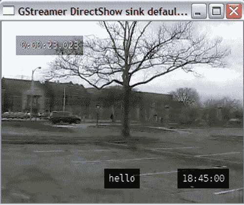

# 第七章. 处理视频

> 照片捕捉瞬间，但视频帮助我们重温那一刻！视频已成为我们生活的重要组成部分。我们通过在摄像机上记录家庭假期来保存我们的记忆。当涉及到数字保存这些记录的记忆时，数字视频处理起着重要作用。在前一章中，为了学习各种音频处理技术，我们使用了 GStreamer 多媒体框架。我们将继续使用 GStreamer 来学习视频处理的基础知识。

在本章中，我们将：

+   开发一个简单的命令行视频播放器

+   执行基本的视频操作，如裁剪、调整大小以及调整亮度、对比度和饱和度等参数。

+   在视频流上添加文本字符串

+   学习如何在不同视频格式之间转换视频

+   编写一个实用程序，从输入视频文件中分离音频和视频轨道

+   将音频和视频轨道混合以创建单个视频文件

+   将一个或多个视频帧保存为静态图像

那么，让我们开始吧。

# 安装先决条件

我们将使用 GStreamer 多媒体框架的 Python 绑定来处理视频数据。请参阅第五章，“处理音频”中的安装说明，以安装 GStreamer 和其他依赖项。

对于视频处理，我们将使用一些之前未介绍过的 GStreamer 插件。请确保这些插件在您的 GStreamer 安装中可用，通过从控制台运行`gst-inspect-0.10`命令（Windows XP 用户为 gst-inspect-0.10.exe）。否则，您需要安装这些插件或使用可用的替代方案。

以下是我们将在本章中使用的附加插件列表：

+   `autoconvert:` 根据能力确定合适的转换器。它将在本章中广泛使用。

+   `autovideosink:` 自动选择视频输出设备以显示流媒体视频。

+   `ffmpegcolorspace:` 将颜色空间转换为视频输出设备可以显示的颜色空间格式。

+   `capsfilter:` 是用于限制流向下传递的媒体数据类型的特性过滤器，在本章中进行了详细讨论。

+   `textoverlay:` 在流媒体视频上叠加文本字符串。用于“在视频流中添加文本和时间”部分。

+   `timeoverlay:` 在视频缓冲区顶部添加时间戳。

+   `clockoverlay:` 在流媒体视频上显示当前时钟时间。

+   `videobalance:` 用于调整图像的亮度、对比度和饱和度。它在“视频操作和效果”部分中使用。

+   `videobox:` 通过指定像素数裁剪视频帧，用于“裁剪”部分。

+   `ffmux_mp4:` 为 MP4 视频复用提供`muxer`元素。

+   `ffenc_mpeg4:` 将数据编码为 MPEG4 格式。

+   `ffenc_png:` 将数据编码为 PNG 格式，用于“将视频帧保存为图像”部分。

# 播放视频

之前，我们看到了如何播放音频。与音频一样，视频流式传输有不同的方法。这些方法中最简单的是使用`playbin`插件。另一种方法是遵循基本原理，即创建传统的管道并创建和连接所需的管道元素。如果我们只想播放视频文件的“视频”轨道，那么后一种技术与音频播放中展示的方法非常相似。然而，几乎总是，人们还希望听到正在流式传输的视频的音频轨道。为此需要额外的工作。以下图是代表 GStreamer 管道的图，展示了视频播放时数据是如何流动的。


在这个说明中，`decodebin`使用适当的解码器从源元素解码媒体数据。根据数据类型（音频或视频），它随后通过`queue`元素进一步流式传输到音频或视频处理元素。两个`queue`元素，`queue1`和`queue2`，分别作为音频和视频数据的媒体数据缓冲区。当队列元素在管道中添加并连接时，GStreamer 会内部处理管道中的线程创建。

# 行动时间 - 视频播放器！

让我们编写一个简单的视频播放器实用工具。在这里，我们不会使用`playbin`插件。`playbin`的使用将在后面的子节中说明。我们将通过构建 GStreamer 管道来开发这个实用工具。关键在于使用队列作为数据缓冲区。音频和视频数据需要被引导，以便分别通过管道的音频或视频处理部分进行“流动”。

1.  从 Packt 网站下载文件`PlayingVidio.py`。该文件包含此视频播放器实用工具的源代码。

1.  以下代码概述了视频播放器类及其方法。

    ```py
    import time
    import thread
    import gobject
    import pygst
    pygst.require("0.10")
    import gst
    import os
    class VideoPlayer:
    def __init__(self):
    pass
    def constructPipeline(self):
    pass
    def connectSignals(self):
    pass
    def decodebin_pad_added(self, decodebin, pad):
    pass
    def play(self):
    pass
    def message_handler(self, bus, message):
    pass
    # Run the program
    player = VideoPlayer()
    thread.start_new_thread(player.play, ())
    gobject.threads_init()
    evt_loop = gobject.MainLoop()
    evt_loop.run()

    ```

1.  如您所见，代码的整体结构和主要程序执行代码与音频处理示例中的相同。线程模块用于创建一个新线程来播放视频。VideoPlayer.play 方法被发送到这个线程。gobject.threads_init()是一个初始化函数，用于促进在 gobject 模块中使用 Python 线程。创建用于执行此程序的主要事件循环使用 gobject，并通过调用 evt_loop.run()启动此循环。

    ### 小贴士

    除了使用`thread`模块外，您还可以使用`threading`模块。使用它的代码将类似于：

1.  `import threading`

1.  `threading.Thread(target=player.play).start()`

    您需要将早期代码片段中的`thread.start_new_thread(player.play, ())`行替换为这个笔记中代码片段中展示的第 2 行。自己试试看！

1.  现在，让我们讨论一些重要的方法，从`self.contructPipeline:`开始。

    ```py
    1 def constructPipeline(self):
    2 # Create the pipeline instance
    3 self.player = gst.Pipeline()
    4
    5 # Define pipeline elements
    6 self.filesrc = gst.element_factory_make("filesrc")
    7 self.filesrc.set_property("location",
    8 self.inFileLocation)
    9 self.decodebin = gst.element_factory_make("decodebin")
    10
    11 # audioconvert for audio processing pipeline
    12 self.audioconvert = gst.element_factory_make(
    13 "audioconvert")
    14 # Autoconvert element for video processing
    15 self.autoconvert = gst.element_factory_make(
    16 "autoconvert")
    17 self.audiosink = gst.element_factory_make(
    18 "autoaudiosink")
    19
    20 self.videosink = gst.element_factory_make(
    21 "autovideosink")
    22
    23 # As a precaution add videio capability filter
    24 # in the video processing pipeline.
    25 videocap = gst.Caps("video/x-raw-yuv")
    26 self.filter = gst.element_factory_make("capsfilter")
    27 self.filter.set_property("caps", videocap)
    28 # Converts the video from one colorspace to another
    29 self.colorSpace = gst.element_factory_make(
    30 "ffmpegcolorspace")
    31
    32 self.videoQueue = gst.element_factory_make("queue")
    33 self.audioQueue = gst.element_factory_make("queue")
    34
    35 # Add elements to the pipeline
    36 self.player.add(self.filesrc,
    37 self.decodebin,
    38 self.autoconvert,
    39 self.audioconvert,
    40 self.videoQueue,
    41 self.audioQueue,
    42 self.filter,
    43 self.colorSpace,
    44 self.audiosink,
    45 self.videosink)
    46
    47 # Link elements in the pipeline.
    48 gst.element_link_many(self.filesrc, self.decodebin)
    49
    50 gst.element_link_many(self.videoQueue, self.autoconvert,
    51 self.filter, self.colorSpace,
    52 self.videosink)
    53
    54 gst.element_link_many(self.audioQueue,self.audioconvert,
    55 self.audiosink)

    ```

1.  在各种音频处理应用中，我们已经使用了在此方法中定义的几个元素。首先，创建管道对象`self.player`。`self.filesrc`元素指定了输入视频文件。此元素连接到`decodebin`。

1.  在第 15 行，创建了`autoconvert`元素。它是一个 GStreamer `bin`，能够根据能力（caps）自动选择转换器。它将`decodebin`输出的解码数据转换成视频设备可播放的格式。请注意，在到达视频输出端之前，这些数据会通过一个`capsfilter`和`ffmpegcolorspace`转换器。`capsfilter`元素在第 26 行定义。它是一个限制允许能力的过滤器，即将通过它的媒体数据类型。在这种情况下，第 25 行定义的`videoCap`对象指示过滤器只允许`video-xraw-yuv`能力。

1.  `ffmpegcolorspace`是一个可以将视频帧转换为不同颜色空间格式的插件。此时，有必要解释一下什么是颜色空间。通过使用基本颜色，可以创建各种颜色。这些颜色形成我们所说的**颜色空间**。一个常见的例子是 rgb 颜色空间，其中可以通过红色、绿色和蓝色颜色的组合创建一系列颜色。颜色空间转换是将视频帧或图像从一个颜色空间转换到另一个颜色空间的过程。转换是以一种方式进行的，即转换后的视频帧或图像是原始帧或图像的更接近的表示。

    ### 小贴士

    即使不使用`capsfilter`和`ffmpegcolorspace`的组合，也可以进行视频流传输。然而，视频可能会出现扭曲。因此，建议使用`capsfilter`和`ffmpegcolorspace`转换器。尝试直接将`autoconvert`元素链接到`autovideosink`，看看是否有所改变。

1.  注意，我们已经创建了两个输出端，一个用于音频输出，另一个用于视频。两个`queue`元素是在第 32 行和第 33 行创建的。如前所述，这些元素作为媒体数据缓冲区，用于将数据发送到 GStreamer 管道的音频和视频处理部分。代码块 35-45 向管道添加了所有必需的元素。

1.  接下来，将管道中的各个元素进行链接。正如我们已经知道的，`decodebin`是一个插件，用于确定使用正确的解码器类型。此元素使用动态垫。在开发音频处理工具时，我们将`decodebin`的`pad-added`信号连接到了`decodebin_pad_added`方法。我们在这里也将做同样的事情；然而，这个方法的内容将会有所不同。我们将在稍后讨论这一点。

1.  在第 50-52 行，管道的视频处理部分被链接。`self.videoQueue`从`decodebin`接收视频数据。它与之前讨论过的`autoconvert`元素相连接。`capsfilter`只允许`video-xraw-yuv`数据进一步流式传输。`capsfilter`连接到`ffmpegcolorspace`元素，该元素将数据转换为不同的颜色空间。最后，数据被流式传输到`videosink`，在这种情况下，是一个`autovideosink`元素。这使您可以“查看”输入视频。管道的音频处理部分与早期章节中使用的方法非常相似。

1.  现在我们将回顾`decodebin_pad_added`方法。

    ```py
    1 def decodebin_pad_added(self, decodebin, pad):
    2 compatible_pad = None
    3 caps = pad.get_caps()
    4 name = caps[0].get_name()
    5 print "\n cap name is =%s"%name
    6 if name[:5] == 'video':
    7 compatible_pad = (
    8 self.videoQueue.get_compatible_pad(pad, caps) )
    9 elif name[:5] == 'audio':
    10 compatible_pad = (
    11 self.audioQueue.get_compatible_pad(pad, caps) )
    12
    13 if compatible_pad:
    14 pad.link(compatible_pad)

    ```

1.  此方法捕获当`decodebin`创建一个动态垫时发出的`pad-added`信号。在早期章节中，我们只是将`decodebin`垫与`autoaudioconvert`元素上的兼容垫相连接。我们可以这样做，因为正在流式传输的`caps`或媒体数据类型始终是音频数据。然而，在这里，媒体数据可以代表音频或视频数据。因此，当在`decodebin`上创建一个动态垫时，我们必须检查这个`pad`有什么`caps`。`caps`对象的`get_name`方法的名称返回处理媒体数据类型。例如，名称可以是`video/x-raw-rgb`的形式，当它是视频数据时，或者对于音频数据是`audio/x-raw-int`。我们只检查前五个字符以查看它是否是视频或音频媒体类型。这是通过代码片段中的代码块 4-11 完成的。具有视频媒体类型的`decodebin pad`与`self.videoQueue`元素上的兼容垫相连接。同样，具有音频`caps`的`pad`与`self.audioQueue`上的一个相连接。

1.  从`PlayingVideo.py`中查看其余的代码。确保为变量`self.inFileLocation`指定一个合适的视频文件路径，然后从命令提示符运行此程序，如下所示：

    ```py
    $python PlayingVideo.py

    ```

    +   这应该会打开一个 GUI 窗口，视频将在其中进行流式传输。音频输出将与播放的视频同步。

## 刚才发生了什么？

我们创建了一个命令行视频播放器实用程序。我们学习了如何创建一个可以播放同步音频和视频流的 GStreamer 管道。它解释了如何使用`queue`元素在管道中处理音频和视频数据。在这个例子中，展示了如何使用 GStreamer 插件，如`capsfilter`和`ffmpegcolorspace`。本节中获得的知识将在本章后续部分的应用中体现。

## 尝试添加播放控制

在第六章中，我们学习了不同的技术来控制音频的播放。开发命令行实用程序，允许您暂停视频或直接跳转到视频轨道上的指定位置。

## 使用`playbin`播放视频

上一节的目标是向您介绍处理输入视频流的基本方法。我们将在未来的讨论中以某种方式使用该方法。如果您只想进行视频播放，那么最简单的方法是通过`playbin`插件来实现。只需将文件`PlayingVideo.py`中的`VideoPlayer.constructPipeline`方法替换为以下代码即可播放视频。在这里，`self.player`是一个`playbin`元素。`playbin`的`uri`属性被设置为输入视频文件路径。

上一节的目标是向您介绍处理输入视频流的基本方法。我们将在未来的讨论中以某种方式使用该方法。如果您只想进行视频播放，那么最简单的方法是通过`playbin`插件来实现。只需将文件`PlayingVideo.py`中的`VideoPlayer.constructPipeline`方法替换为以下代码即可播放视频。在这里，`self.player`是一个`playbin`元素。`playbin`的`uri`属性被设置为输入视频文件路径。

```py
def constructPipeline(self):
self.player = gst.element_factory_make("playbin")
self.player.set_property("uri",
"file:///" + self.inFileLocation)

```

# 视频格式转换

将视频保存为不同的文件格式是经常执行的任务之一，例如，将摄像机上录制的视频转换为 DVD 播放器可播放的格式。因此，让我们列出在管道中执行视频格式转换所需的元素。

+   一个`filesrc`元素用于流式传输视频文件，一个`decodebin`用于解码编码的输入媒体数据。

+   接下来，管道中的音频处理元素，例如`audioconvert`，这是一个编码器，用于将原始音频数据编码成适当的音频格式以便写入。

+   管道中的视频处理元素，例如一个视频编码器元素，用于编码视频数据。

+   一个复用器或**复用器**，它将编码的音频和视频数据流合并到一个单独的通道中。

+   需要一个元素，根据媒体类型，可以将媒体数据发送到适当的处理单元。这是通过`queue`元素实现的，它们充当数据缓冲区。根据是音频还是视频数据，它将被流式传输到音频或视频处理元素。队列还需要将编码数据从音频管道流式传输到复用器。

+   最后，一个`filesink`元素用于保存转换后的视频文件（包含音频和视频轨道）。

# 行动时间 - 视频格式转换器

我们将创建一个视频转换实用程序，该实用程序将输入视频文件转换为用户指定的格式。您需要从 Packt 网站下载的文件是`VideoConverter.py`。此文件可以从命令行运行，如下所示：

```py
python VideoConverter.py [options]

```

其中，选项如下：

+   `--input_path:` 我们希望转换的视频文件的完整路径。输入文件的视频格式。格式应在一个支持的格式列表中。支持的输入格式有 MP4、OGG、AVI 和 MOV。

+   `--output_path:` 输出视频文件的完整路径。如果没有指定，它将在输入目录中创建一个名为 `OUTPUT_VIDEOS` 的文件夹，并将文件以相同的名称保存在那里。

+   `--output_format:` 输出文件的音频格式。支持的输出格式有 OGG 和 MP4。

    ### 提示

    由于我们将使用 `decodebin` 元素进行输入媒体数据的解码；实际上，这个实用程序可以处理更广泛的输入格式。修改 `VideoPlayer.processArguments` 中的代码或向字典 `VideoPlayer.supportedInputFormats` 中添加更多格式。

1.  如果尚未完成，请从 Packt 网站下载文件 `VideoConverter.py`。

1.  代码的整体结构如下：

    ```py
    import os, sys, time
    import thread
    import getopt, glob
    import gobject
    import pygst
    pygst.require("0.10")
    import gst
    class VideoConverter:
    def __init__(self):
    pass
    def constructPipeline(self):
    pass
    def connectSignals(self):
    pass
    def decodebin_pad_added(self, decodebin, pad):
    pass
    def processArgs(self):
    pass
    def printUsage(self):
    pass
    def printFinalStatus(self, starttime, endtime):
    pass
    def convert(self):
    pass
    def message_handler(self, bus, message):
    pass
    # Run the converter
    converter = VideoConverter()
    thread.start_new_thread(converter.convert, ())
    gobject.threads_init()
    evt_loop = gobject.MainLoop()

    ```

    ```py
    evt_loop.run()

    ```

    通过调用 `thread.start_new_thread` 创建一个新线程来运行应用程序。将 `VideoConverter.convert` 方法发送到这个线程。这与之前讨论的 `VideoPlayer.play` 方法类似。让我们回顾一下 `VideoConverter` 类的一些关键方法。

1.  `__init__` 方法包含初始化代码。它还调用方法处理命令行参数，然后构建管道。代码如下所示：

    ```py
    1 def __init__(self):
    2 # Initialize various attrs
    3 self.inFileLocation = ""
    4 self.outFileLocation = ""
    5 self.inputFormat = "ogg"
    6 self.outputFormat = ""
    7 self.error_message = ""
    8 # Create dictionary objects for
    9 # Audio / Video encoders for supported
    10 # file format
    11 self.audioEncoders = {"mp4":"lame",
    12 "ogg": "vorbisenc"}
    13
    14 self.videoEncoders={"mp4":"ffenc_mpeg4",
    15 "ogg": "theoraenc"}
    16
    17 self.muxers = {"mp4":"ffmux_mp4",
    18 "ogg":"oggmux" }
    19
    20 self.supportedOutputFormats = self.audioEncoders.keys()
    21
    22 self.supportedInputFormats = ("ogg", "mp4",
    23 "avi", "mov")
    24
    25 self.pipeline = None
    26 self.is_playing = False
    27
    28 self.processArgs()
    29 self.constructPipeline()
    30 self.connectSignals()

    ```

1.  要处理视频文件，我们需要音频和视频编码器。这个实用程序将只支持转换为 MP4 和 OGG 文件格式。通过添加适当的编码器和复用器插件，可以轻松扩展以包括更多格式。self.audioEncoders 和 self.videoEncoders 字典对象的值分别指定用于流式传输音频和视频数据的编码器。因此，为了将视频数据存储为 MP4 格式，我们使用 ffenc_mp4 编码器。代码片段中显示的编码器应该是您计算机上 GStreamer 安装的一部分。如果不是，请访问 GStreamer 网站，了解如何安装这些插件。self.muxers 字典的值表示在特定输出格式中使用的复用器。

1.  `constructPipeline` 方法执行主要的转换工作。它构建所需的管道，然后在 `convert` 方法中将管道设置为播放状态。

    ```py
    1 def constructPipeline(self):
    2 self.pipeline = gst.Pipeline("pipeline")
    3
    4 self.filesrc = gst.element_factory_make("filesrc")
    5 self.filesrc.set_property("location",
    6 self.inFileLocation)
    7
    8 self.filesink = gst.element_factory_make("filesink")
    9 self.filesink.set_property("location",
    10 self.outFileLocation)
    11
    12 self.decodebin = gst.element_factory_make("decodebin")
    13 self.audioconvert = gst.element_factory_make(
    14 "audioconvert")
    15
    16 audio_encoder = self.audioEncoders[self.outputFormat]
    17 muxer_str = self.muxers[self.outputFormat]
    18 video_encoder = self.videoEncoders[self.outputFormat]
    19
    20 self.audio_encoder= gst.element_factory_make(
    21 audio_encoder)
    22 self.muxer = gst.element_factory_make(muxer_str)
    23 self.video_encoder = gst.element_factory_make(
    24 video_encoder)
    25
    26 self.videoQueue = gst.element_factory_make("queue")
    27 self.audioQueue = gst.element_factory_make("queue")
    28 self.queue3 = gst.element_factory_make("queue")
    29
    30 self.pipeline.add( self.filesrc,
    31 self.decodebin,
    32 self.video_encoder,
    33 self.muxer,
    34 self.videoQueue,
    35 self.audioQueue,
    36 self.queue3,
    37 self.audioconvert,
    38 self.audio_encoder,
    39 self.filesink)
    40
    41 gst.element_link_many(self.filesrc, self.decodebin)
    42
    43 gst.element_link_many(self.videoQueue,
    44 self.video_encoder, self.muxer, self.filesink)
    45
    46 gst.element_link_many(self.audioQueue,self.audioconvert,
    47 self.audio_encoder, self.queue3,
    48 self.muxer)

    ```

1.  在前面的部分，我们介绍了之前管道中使用的几个元素。第 43 到 48 行的代码为音频和视频处理元素建立了连接。在第 44 行，复用器 self.muxer 与视频编码器元素连接。它将流的不同部分（在这种情况下，视频和音频数据）放入一个单独的文件中。音频编码器 self.audio_encoder 输出的数据通过队列元素 self.queue3 流向复用器。然后，来自 self.muxer 的复用数据流到 self.filesink。

1.  快速回顾一下 `VideoConverter.convert` 方法。

    ```py
    1 def convert(self):
    2 # Record time before beginning Video conversion
    3 starttime = time.clock()
    4
    5 print "\n Converting Video file.."
    6 print "\n Input File: %s, Conversion STARTED..." %
    7 self.inFileLocation
    8
    9 self.is_playing = True
    10 self.pipeline.set_state(gst.STATE_PLAYING)
    11 while self.is_playing:
    12 time.sleep(1)
    13
    14 if self.error_message:
    15 print "\n Input File: %s, ERROR OCCURED." %
    16 self.inFileLocation
    17 print self.error_message
    18 else:
    19 print "\n Input File: %s, Conversion COMPLETE " %
    20 self.inFileLocation
    21
    22 endtime = time.clock()
    23 self.printFinalStatus(starttime, endtime)
    24 evt_loop.quit()

    ```

1.  在第 10 行，之前构建的 GStreamer 管道被设置为播放。当转换完成后，它将生成流的结束（EOS）消息。在`self.message_handler`方法中修改了`self.is_playing`标志。第 11 行的 while 循环执行，直到 EOS 消息在总线上发布或发生某些错误。最后，在第 24 行，主执行循环被终止。

    ### 小贴士

    在第 3 行，我们调用了`time.clock()`。这实际上给出了该进程所消耗的 CPU 时间。

1.  其他方法，如`VideoConverter.decodebin_pad_added`与*播放视频*部分中开发的方法相同。请回顾`VideoConverter.py`文件中的剩余方法，然后通过指定适当的命令行参数运行此实用工具。以下截图显示了从控制台窗口运行程序时的示例输出消息。

    +   这是视频转换实用工具从控制台运行的示例运行。

## 刚才发生了什么？

我们创建了一个另一个有用的实用工具，可以将视频文件从一种格式转换为另一种格式。我们学习了如何将音频和视频数据编码成所需的输出格式，然后使用复用器将这些两个数据流放入一个单独的文件中。

## 尝试批量转换视频文件

在前面的章节中开发的视频转换器一次只能转换一个视频文件。你能将其制作成一个批量处理实用工具吗？请参考*处理音频*章节中开发的音频转换器代码。整体结构将非常相似。然而，由于使用了队列元素，转换多个视频文件可能会遇到挑战。例如，当第一个文件转换完成时，当我们开始转换其他文件时，队列中的数据可能不会被刷新。一种粗略的解决方法是在每个音频文件上重建整个管道并连接信号。然而，将会有一个更有效的方法来做这件事。想想看！

# 视频操作和效果

假设你有一个需要以调整后的默认亮度级别保存的视频文件。或者，你可能想保存另一个具有不同宽高比的视频。在本节中，我们将学习一些视频的基本且最常执行的操作。我们将使用 Python 和 GStreamer 开发代码，以执行诸如调整视频大小或调整其对比度级别等任务。

## 调整大小

可以通过一个元素上 pad 的能力（caps）来描述通过该元素的数据。如果一个 decodebin 元素正在解码视频数据，其动态 pad 的能力将被描述为，例如，`video/x-raw-yuv`。使用 GStreamer 多媒体框架调整视频大小可以通过使用具有指定 `width` 和 `height` 参数的 `capsfilter` 元素来实现。如前所述，`capsfilter` 元素限制了两个元素之间可以传输的媒体数据类型。例如，由字符串描述的 `cap` 对象，`video/x-raw-yuv, width=800, height=600` 将将视频宽度设置为 800 像素，高度设置为 600 像素。

# 行动时间 - 调整视频大小

现在我们将看到如何使用由 GStreamer `cap` 对象描述的 `width` 和 `height` 参数来调整流视频的大小。

1.  从 Packt 网站下载文件 `VideoManipulations.py`。整体类设计与在 *播放视频* 部分研究的设计相同。

1.  `self.constructAudioPipeline()` 和 `self.constructVideoPipeline()` 方法分别定义和链接与主管道对象 `self.player` 的音频和视频部分相关的元素。由于我们已经在前面章节中讨论了大多数音频/视频处理元素，我们在这里只回顾 `constructVideoPipeline` 方法。

    ```py
    1 def constructVideoPipeline(self):
    2 # Autoconvert element for video processing
    3 self.autoconvert = gst.element_factory_make(
    4 "autoconvert")
    5 self.videosink = gst.element_factory_make(
    6 "autovideosink")
    7
    8 # Set the capsfilter
    9 if self.video_width and self.video_height:
    10 videocap = gst.Caps(
    11 "video/x-raw-yuv," "width=%d, height=%d"%
    12 (self.video_width,self.video_height))
    13 else:
    14 videocap = gst.Caps("video/x-raw-yuv")
    15
    16 self.capsFilter = gst.element_factory_make(
    17 "capsfilter")
    18 self.capsFilter.set_property("caps", videocap)
    19
    20 # Converts the video from one colorspace to another
    21 self.colorSpace = gst.element_factory_make(
    22 "ffmpegcolorspace")
    23
    24 self.videoQueue = gst.element_factory_make("queue")
    25
    26 self.player.add(self.videoQueue,
    27 self.autoconvert,
    28 self.capsFilter,
    29 self.colorSpace,
    30 self.videosink)
    31
    32 gst.element_link_many(self.videoQueue,
    33 self.autoconvert,
    34 self.capsFilter,
    35 self.colorSpace,
    36 self.videosink)

    ```

1.  capsfilter 元素在第 16 行定义。它是一个限制将通过它的媒体数据类型的过滤器。videocap 是在第 10 行创建的 GStreamer cap 对象。此 cap 指定了流视频的宽度和高度参数。它被设置为 capsfilter 的属性，self.capsFilter。它指示过滤器只流式传输由 videocap 对象指定的宽度和高度的视频-xraw-yuv 数据。

    ### 小贴士

    在源文件中，你会看到在管道中链接了一个额外的元素 `self.videobox`。在上面的代码片段中省略了它。我们将在下一节中看到这个元素的作用。

1.  代码的其余部分很简单。我们已经在之前的讨论中介绍了类似的方法。通过回顾文件 `VideoManipulations.py` 来开发代码的其余部分。确保为变量 `self.inFileLocation` 指定一个合适的视频文件路径。然后从命令提示符运行此程序，如下所示：

    ```py
    $python VideoManipulations.py

    ```

    +   这应该会打开一个 GUI 窗口，视频将在其中流式传输。此窗口的默认大小将由代码中指定的 `self.video_width` 和 `self.video_height` 参数控制。

## 刚才发生了什么？

我们之前开发的命令行视频播放器在刚刚开发的示例中得到了扩展。我们使用了 `capsfilter` 插件来指定流视频的 `width` 和 `height` 参数，从而调整视频大小。

## 裁剪

假设你有一个视频在底部有较大的“空白空间”或者你想要裁剪掉的一侧的不需要的部分。`videobox` GStreamer 插件可以方便地从左侧、右侧、顶部或底部裁剪视频。

# 是时候行动起来 - 裁剪视频

让我们给之前开发的命令行视频播放器添加另一个视频处理功能。

1.  我们需要的文件是前面章节中使用的文件，即`VideoManipulations.py`。

1.  再次强调，我们将关注`VideoPlayer`类中的`constructVideoPipeline`方法。以下代码片段来自此方法。此方法中的其余代码与前面章节中审查的代码相同。

    ```py
    1 self.videobox = gst.element_factory_make("videobox")
    2 self.videobox.set_property("bottom", self.crop_bottom )
    3 self.videobox.set_property("top", self.crop_top )
    4 self.videobox.set_property("left", self.crop_left )
    5 self.videobox.set_property("right", self.crop_right )
    6
    7 self.player.add(self.videoQueue,
    8 self.autoconvert,
    9 self.videobox,
    10 self.capsFilter,
    11 self.colorSpace,
    12 self.videosink)
    13
    14 gst.element_link_many(self.videoQueue,
    15 self.autoconvert,
    16 self.videobox,
    17 self.capsFilter,
    18 self.colorSpace,
    19 self.videosink)

    ```

1.  代码是自解释的。`videobox`元素在第 1 行创建。用于裁剪流媒体视频的`videobox`属性在第 2-5 行设置。它从`autoconvert`元素接收媒体数据。`videobox`的源端连接到`capsfilter`的接收端或直接连接到`ffmpegcolorspace`元素。

1.  通过审查文件`VideoManipulations.py`来开发剩余的代码。确保为变量`self.inFileLocation`指定一个合适的视频文件路径。然后从命令提示符运行此程序，如下所示：

    ```py
    $python VideoManipulations.py

    ```

    这应该会打开一个 GUI 窗口，视频将通过该窗口进行流式传输。视频将从左侧、右侧、底部和顶部通过`self.crop_left`、`self.crop_right`、`self.crop_bottom`和`self.crop_top`参数分别进行裁剪。

## 刚才发生了什么？

我们进一步扩展了视频播放器应用程序，添加了一个可以裁剪视频帧的 GStreamer 元素。我们使用了`videobox`插件来完成这个任务。

## 尝试给视频添加边框

1.  在上一节中，我们使用了`videobox`元素从视频两侧进行裁剪。同一个插件也可以用来给视频添加边框。如果你为`videobox`属性设置负值，例如底部、顶部、左侧和右侧，那么不是裁剪视频，而是在视频周围添加黑色边框。将`self.crop_left`等参数设置为负值来查看这个效果。

1.  可以通过使用`videocrop`插件来完成视频裁剪。它与`videobox`插件类似，但不支持给视频帧添加边框。修改代码并使用此插件来裁剪视频。

## 调整亮度和对比度

我们在第三章*增强图像*中看到了如何调整亮度和对比度级别。如果您有一个在光线条件不佳的情况下录制的家庭视频，您可能会调整其亮度级别。对比度级别强调每个视频帧的颜色和亮度级别之间的差异。`videobalance`插件可用于调整亮度、对比度、色调和饱和度。以下代码片段创建此元素并设置亮度和对比度属性。亮度属性可以接受`-1`到`1`范围内的值，默认（原始）亮度级别为`0`。对比度可以具有`0`到`2`范围内的值，默认值为`1`。

```py
self.videobalance = gst.element_factory_make("videobalance")
self.videobalance.set_property("brightness", 0.5)
self.videobalance.set_property("contrast", 0.5)

```

然后，`videobalance`在 GStreamer 管道中链接如下：

```py
gst.element_link_many(self.videoQueue,
self.autoconvert,
self.videobalance,
self.capsFilter,
self.colorSpace,
self.videosink)

```

查看文件`VideoEffects.py`中的其余代码。

## 创建灰度视频

通过调整`videobalance`插件的饱和度属性，可以将视频渲染为灰度。饱和度可以具有`0`到`2`范围内的值。默认值是`1`。将此值设置为`0.0`将图像转换为灰度。代码如下所示：

```py
self.videobalance.set_property("saturation", 0.0)

```

您可以参考文件`VideoEffects.py`，它展示了如何使用`videobalance`插件调整饱和度和其他在前面章节中讨论的参数。

# 在视频流中添加文本和时间

在处理视频时，将文本字符串或字幕轨道添加到视频的能力是另一个需要的特性。GStreamer 插件`textoverlay`允许在视频流上叠加信息性文本字符串，例如文件名。其他有用的插件，如`timeoverlay`和`clockoverlay`，提供了一种将视频缓冲区时间戳和 CPU 时钟时间放在流视频顶部的方法。

# 行动时间 - 在视频轨道上叠加文本

让我们看看如何在视频轨道上添加文本字符串。我们将编写一个简单的实用工具，其代码结构本质上与我们之前在*播放视频*部分开发的结构相同。此工具还将添加缓冲区时间戳和当前 CPU 时钟时间到视频顶部。对于本节，重要的是您在 GStreamer 安装中拥有`textoverlay`、`timeoverlay`和`clockoverlay`插件。否则，您需要安装这些插件或使用其他插件，如可用的`cairotextoverlay`。

1.  从 Packt 网站下载文件`VideoTextOverlay.py`。

1.  类`VideoPlayer`的`constructVideoPipeline`方法在以下代码片段中展示：

    ```py
    1 def constructVideoPipeline(self):
    2 # Autoconvert element for video processing
    3 self.autoconvert = gst.element_factory_make(
    4 "autoconvert")
    5 self.videosink = gst.element_factory_make(
    6 "autovideosink")
    7
    8 # Set the capsfilter
    9 videocap = gst.Caps("video/x-raw-yuv")
    10 self.capsFilter = gst.element_factory_make(
    11 "capsfilter")
    12 self.capsFilter.set_property("caps", videocap)
    13
    14 # Converts the video from one colorspace to another
    15 self.colorSpace = gst.element_factory_make(
    16 "ffmpegcolorspace")
    17
    18 self.videoQueue = gst.element_factory_make("queue")
    19
    20 self.textOverlay = gst.element_factory_make(
    21 "textoverlay")
    22 self.textOverlay.set_property("text", "hello")
    23 self.textOverlay.set_property("shaded-background",
    24 True)
    25
    26 self.timeOverlay = gst.element_factory_make(
    27 "timeoverlay")
    28 self.timeOverlay.set_property("valign", "top")
    29 self.timeOverlay.set_property("shaded-background",
    30 True)
    31
    32 self.clockOverlay = gst.element_factory_make(
    33 "clockoverlay")
    34 self.clockOverlay.set_property("valign", "bottom")
    35 self.clockOverlay.set_property("halign", "right")
    36 self.clockOverlay.set_property("shaded-background",
    37 True)
    38
    39 self.player.add(self.videoQueue,
    40 self.autoconvert,
    41 self.textOverlay,
    42 self.timeOverlay,
    43 self.clockOverlay,
    44 self.capsFilter,
    45 self.colorSpace,
    46 self.videosink)
    47
    48 gst.element_link_many(self.videoQueue,
    49 self.autoconvert,
    50 self.capsFilter,
    51 self.textOverlay,
    52 self.timeOverlay,
    53 self.clockOverlay,
    54 self.colorSpace,
    55 self.videosink)

    ```

1.  如你所见，用于叠加文本、时间或时钟的元素可以像其他元素一样简单地添加并连接到 GStreamer 流程中。现在让我们讨论这些元素的各个属性。在第 20-23 行，定义了 `textoverlay` 元素。文本属性设置了在流式视频上出现的文本字符串。为了确保文本字符串在视频中清晰可见，我们为此文本添加了背景对比。这是通过在第 23 行将带阴影的背景属性设置为 True 来实现的。此插件的其他属性有助于在视频中固定文本位置。运行 `gst-inspect-0.10` 在 `textoverlay` 插件上，以查看这些属性。

1.  接下来，在 25-36 行，定义了时间和时钟叠加元素。它们的属性与 `textoverlay` 插件中可用的属性类似。时钟时间将出现在流式视频的左下角。这是通过设置 `valign` 和 `halign` 属性来实现的。这三个元素随后在 GStreamer 流程中连接。它们连接的内部顺序并不重要。

1.  通过查阅文件 `VideoTextOverlay.py` 开发剩余的代码。确保为变量 `self.inFileLocation` 指定适当的视频文件路径。然后从命令提示符运行此程序：

    ```py
    $python VideoTextOverlay.py

    ```

    +   这应该会打开一个 GUI 窗口，视频将在其中流式传输。视频将显示文本字符串 "hello"，以及运行时间和时钟时间。这可以通过以下视频帧的快照来展示。

    

    截图展示了包含文本、时间和时钟叠加的视频帧。

## 刚才发生了什么？

我们学习了如何在 GStreamer 流程中使用 `textoverlay`、`timeoverlay` 和 `clockoverlay` 等元素，分别在上面的视频缓冲区上添加文本字符串、时间戳和时钟。`textoverlay` 元素还可以进一步用来给视频文件添加字幕轨道。

## 尝试英雄添加视频轨道字幕！

将我们刚刚开发的代码扩展以向视频文件添加字幕轨道。要添加字幕轨道，你需要 `subparse` 插件。请注意，此插件在 GStreamer-WinBuilds 二进制文件安装的 GStreamer Windows 版本中默认不可用。因此，Windows 用户可能需要单独安装此插件。查阅 `subparse` 插件参考以了解如何完成此任务。以下代码片段展示了如何创建 `subparse` 元素。

```py
self.subtitlesrc = gst.element_factory_make("filesrc")
self.subtitlesrc.set_property("location",
"/path/to/subtitles/file")
self.subparse = gst.element_factory_make("subparse")

```

# 分离音频和视频轨道

有时候，你可能想要分离音频和视频轨道。想象一下，你有一系列你最喜欢的视频歌曲。你将进行长途驾驶，而你车上的老式 CD 播放器只能播放特定格式的音频文件。让我们编写一个可以将音频从视频文件中分离出来的实用程序！

# 行动时间 - 音频和视频轨道

我们将开发代码，该代码以视频文件作为输入，然后创建两个输出文件，一个仅包含原始文件的音频轨道，另一个包含视频部分。

1.  从 Packt 网站下载文件`SeparatingAudio.py`。类`AudioSeparator`的结构与在*播放视频*部分看到的结构相似。我们将回顾这个类的两个方法，`constructPipeline`和`decodebin_pad_added`。

1.  让我们从`constructPipeline`方法中的代码开始。

    ```py
    1 def constructPipeline(self):
    2 # Create the pipeline instance
    3 self.player = gst.Pipeline()
    4
    5 # Define pipeline elements
    6 self.filesrc = gst.element_factory_make("filesrc")
    7
    8 self.filesrc.set_property("location",
    9 self.inFileLocation)
    10
    11 self.decodebin = gst.element_factory_make("decodebin")
    12
    13 self.autoconvert = gst.element_factory_make(
    14 "autoconvert")
    15
    16 self.audioconvert = gst.element_factory_make(
    17 "audioconvert")
    18
    19 self.audio_encoder = gst.element_factory_make("lame")
    20
    21 self.audiosink = gst.element_factory_make("filesink")
    22 self.audiosink.set_property("location",
    23 self.audioOutLocation)
    24
    25 self.video_encoder = gst.element_factory_make("
    26 ffenc_mpeg4")
    27 self.muxer = gst.element_factory_make("ffmux_mp4")
    28
    29 self.videosink = gst.element_factory_make("filesink")
    30 self.videosink.set_property("location",
    31 self.videoOutLocation)
    32
    33 self.videoQueue = gst.element_factory_make("queue")
    34 self.audioQueue = gst.element_factory_make("queue")
    35 # Add elements to the pipeline
    36 self.player.add(self.filesrc,
    37 self.decodebin,
    38 self.videoQueue,
    39 self.autoconvert,
    40 self.video_encoder,
    41 self.muxer,
    42 self.videosink,
    43 self.audioQueue,
    44 self.audioconvert,
    45 self.audio_encoder,
    46 self.audiosink)
    47
    49 # Link elements in the pipeline.
    50 gst.element_link_many(self.filesrc, self.decodebin)
    51
    52 gst.element_link_many(self. videoQueue,
    53 self.autoconvert,
    54 self.video_encoder,
    55 self.muxer,
    56 self.videosink)
    57
    58 gst.element_link_many(self.audioQueue,
    59 self.audioconvert,
    60 self.audio_encoder,
    61 self.audiosink)

    ```

1.  我们已经在各种示例中使用了所有必要的元素。关键是正确地将它们连接起来。self.audiosink 和 self.videoSink 元素是 filesink 元素，分别定义音频和视频输出文件的位置。请注意，在这个例子中，我们将输出音频保存为 MP3 格式，视频保存为 MP4 格式。因此，我们使用 lame 编码器进行音频文件，而使用编码器 ffenc_mpeg4 和 multiplexer ffmux_mp4 进行视频输出。请注意，我们没有使用 ffmpegcolorspace 元素。它只是帮助为视频 sink（在这种情况下，输出视频文件）获取适当的颜色空间格式。在这种情况下，它是不需要的。如果输出文件没有适当地显示视频帧，您始终可以在管道中将其链接。由 self.decodebin 解码的媒体数据需要通过队列元素作为数据缓冲区流式传输到管道的音频和视频部分。

1.  `decodebin`创建动态 pad 以解码输入音频和视频数据。`decodebin_pad_added`方法需要检查`decodebin`动态 pad 上的功能（caps）。

    ```py
    1 def decodebin_pad_added(self, decodebin, pad):
    2 compatible_pad = None
    3 caps = pad.get_caps()
    4 name = caps[0].get_name()
    5 print "\n cap name is = ", name
    6 if name[:5] == 'video':
    7 compatible_pad = (
    8 self.videoQueue.get_compatible_pad(pad, caps) )
    9 elif name[:5] == 'audio':
    10 compatible_pad = (
    11 self. audioQueue.get_compatible_pad(pad,caps) )
    12
    13 if compatible_pad:
    14 pad.link(compatible_pad)

    ```

1.  这个检查是通过代码块 6-12 完成的。如果功能表明它是音频数据，则`decodebin pad`连接到`self.audioQueue`上的兼容 pad。同样，当`caps`表明它是视频数据时，在`self.videoQueue`和`self.decodebin`之间创建一个链接。

1.  您可以处理文件`SeparatingAudio.py`中剩余的代码。将`self.inFileLocation`、`self.audioOutLocation`和`self.videoOutLocation`表示的路径替换为您计算机上的适当路径，然后以以下方式运行此实用程序：

    ```py
    $python SeparatingAudio.py

    ```

    +   这应该会创建两个输出文件，一个包含输入文件中仅有的音频轨道的 MP3 格式的文件，另一个包含视频轨道的 MP4 格式的文件。

## 刚才发生了什么？

我们构建了一个 GStreamer 管道，从输入视频文件中分离音频和视频轨道。我们之前在多个示例中学习到的几个 GStreamer 元素被用于开发此实用程序。我们还学习了如何使用`decodebin`动态 pad 上的功能（caps）在`decodebin`和`queue`元素之间建立适当的链接。

# 混合音频和视频轨道

假设你用摄像机记录了你朋友的婚礼。对于一些特定的时刻，你希望静音所有其他声音，并用背景音乐替换它们。为了完成这个任务，首先你需要将视频轨道（不含音频）保存为单独的文件。我们刚刚学习了这项技术。然后你需要将这个视频轨道与包含你希望播放的背景音乐的音频轨道合并。现在让我们学习如何将音频和视频轨道混合成一个单独的视频文件。

# 行动时间 - 音频/视频轨道混合器

我们将开发一个程序，通过混合音频和视频轨道来生成视频输出文件。思考一下，与之前开发的音频/视频轨道分离实用程序相比，我们需要整合哪些变化。在那个应用程序中，需要两个`filesink`元素，因为创建了两个输出文件。在这里，我们需要相反的。我们需要两个包含音频和视频数据的`filesrc`元素，以及一个包含音频和视频轨道的单个`filesink`元素。

1.  从 Packt 网站下载文件`AudioVideoMixing.py`。我们将回顾`AudioVideoMixer`类的一些重要方法。

1.  与往常一样，`constructPipeline`方法构建了包含所有必要元素的 GStreamer 管道。

    ```py
    1 def constructPipeline(self):
    2 self.pipeline = gst.Pipeline("pipeline")
    3
    4 self.audiosrc = gst.element_factory_make("filesrc")
    5 self.audiosrc.set_property("location",
    6 self.audioInLocation)
    7
    8 self.videosrc = gst.element_factory_make("filesrc")
    9 self.videosrc.set_property("location",
    10 self.videoInLocation)
    11
    12 self.filesink = gst.element_factory_make("filesink")
    13 self.filesink.set_property("location",
    14 self.outFileLocation)
    15
    16 self.audio_decodebin = gst.element_factory_make(
    17 "decodebin")
    18 self.video_decodebin= gst.element_factory_make(
    19 "decodebin")
    20
    21 self.audioconvert = gst.element_factory_make(
    22 "audioconvert")
    23 self.audio_encoder= gst.element_factory_make("lame")
    24
    25 self.video_encoder = (
    26 gst.element_factory_make("ffenc_mpeg4") )
    27 self.muxer = gst.element_factory_make("ffmux_mp4")
    28 self.queue = gst.element_factory_make("queue")
    29
    audio-video track mixerdeveloping30
    31 videocap = gst.Caps("video/x-raw-yuv")
    32 self.capsFilter = gst.element_factory_make(
    33 "capsfilter")
    34 self.capsFilter.set_property("caps", videocap)
    35 # Converts the video from one colorspace to another
    36 self.colorSpace = gst.element_factory_make(
    37 "ffmpegcolorspace")
    38
    39 self.pipeline.add( self.videosrc,
    40 self. video_decodebin,
    41 self.capsFilter,
    42 self.colorSpace,
    43 self.video_encoder,
    44 self.muxer,
    45 self.filesink)
    46
    47 self.pipeline.add(self.audiosrc,
    48 self.audio_decodebin,
    49 self.audioconvert,
    50 self.audio_encoder,
    51 self.queue)
    52
    53 # Link audio elements
    54 gst.element_link_many(self.audiosrc,
    55 self.audio_decodebin)
    56 gst.element_link_many( self.audioconvert,
    57 self.audio_encoder,
    58 self.queue, self.muxer)
    59 #Link video elements
    60 gst.element_link_many(self.videosrc,
    61 self.video_decodebin)
    62 gst.element_link_many(self.capsFilter,
    63 self.colorSpace,
    64 self.video_encoder,
    65 self.muxer,
    66 self.filesink)

    ```

1.  音频和视频文件源分别由元素`self.audiosrc`和`self.videosrc`定义。它们连接到两个单独的`decodebins`（见第 54 行和第 59 行）。`self.audio_decodebin`和`self.video_decodebin`的`pad-added`信号在`connectSignals`方法中连接。

    音频和视频数据随后分别通过音频和视频处理元素的链。数据由各自的编码器进行编码。编码后的数据流被合并，使得输出视频文件包含音频和视频轨道。这项工作由多路复用器 self.muxer 完成。它与视频编码器元素相连接。音频数据通过队列元素（第 57 行）流到多路复用器。数据被‘多路复用’并输入到 filesink 元素 self.filesink。请注意，ffmpegcolorspace 元素和 capsfilter，self.capsfiter 实际上并不是必需的。在这种情况下，输出视频应该具有正确的显示格式。你可以尝试移除这两个元素来运行此应用程序，看看是否会有任何区别。

1.  在`decodebin_pad_added`方法中，我们在链接动态垫片之前会检查一些额外的事项。

    ```py
    1 def decodebin_pad_added(self, decodebin, pad):
    2 compatible_pad = None
    3 caps = pad.get_caps()
    4 name = caps[0].get_name()
    5 print "\n cap name is =%s"%name
    6 if ( name[:5] == 'video' and
    7 (decodebin is self.video_decodebin) ):
    8 compatible_pad = (
    9 self.capsFilter.get_compatible_pad(pad, caps) )
    10 elif ( name[:5] == 'audio' and
    11 (decodebin is self.audio_decodebin) ):
    12 compatible_pad = (
    13 self.audioconvert.get_compatible_pad(pad, caps) )
    14
    15 if compatible_pad:
    16 pad.link(compatible_pad)

    ```

1.  可能会发生每个输入文件都包含音频和视频数据的情况。例如，self.audiosrc 和 self.videosrc 代表不同的视频文件，这些文件都包含音频和视频数据。self.audiosrc 文件连接到 self.audio_decodebin。因此，我们应该确保当 self.audio_decodebin 生成垫片添加信号时，只有当其 caps 包含音频数据时才将其动态垫片连接。按照类似的方式，只有当 caps 代表视频数据时，self.video_decodebin 上的垫片才被连接。这是通过代码块 6 13 确保的。

1.  通过审查文件`AudioVideoMixer.py`来开发其余的代码。将表示为`self.audioInLocation`、`self.videoInLocation`和`self.outFileLocation`的路径替换为您的计算机上的适当路径，然后运行此实用程序：

    ```py
    $python AudioVideoMixer.py

    ```

    +   这应该会创建一个包含指定输入文件中的音频和视频轨道的 MP4 格式的输出视频文件！

## 刚才发生了什么？

我们开发了一个工具，它可以将输入音频和视频轨道混合，并将它们存储到一个单独的输出文件中。为了完成这个任务，我们使用了在视频转换工具中使用的几乎所有音频/视频处理元素。我们学习了如何根据`decodebin`的`caps`表示的流数据链接其动态垫片。使用了多路复用插件`ffmux_mp4`元素来将音频和视频数据组合在一起。

# 将视频帧保存为图像

想象一下，你有一个野生动物视频，它记录了一个非常特别的时刻。你想要保存这张图片。让我们学习如何使用 GStreamer 框架实现这一点。

# 行动时间 - 将视频帧保存为图像

此文件可以从命令行运行：

```py
python ImagesFromVideo.py [options]

```

这里`[options]`是：

+   `--input_file:` 需要从其中捕获一个或多个帧并保存为图像的输入视频文件的完整路径。

+   `--start_time:` 视频轨道上的位置（以秒为单位）。这将是捕获一个或多个视频帧作为静态图像的起始位置。第一张快照总是在`start_time`。

+   `--duration:` 从`start_time`开始的视频轨道的持续时间（以秒为单位）。从`start_time`开始将捕获`N`个帧。

+   `--num_of_captures:` 从`start_time`（包括它）到`end_time= start_time + duration`（但不包括`end_time`处的静态图像）需要捕获的总帧数。

1.  如果尚未完成，请从 Packt 网站下载文件`ImagesFromVideo.py`。以下是保存视频帧的代码概述。

    ```py
    import os, sys, time
    import thread
    import gobject
    import pygst
    pygst.require("0.10")
    import gst
    from optparse import OptionParser
    class ImageCapture:
    def __init__(self):
    pass
    def connectSignals(self):
    pass
    def constructPipeline(self):
    pass
    def gnonlin_pad_added(self, gnonlin_elem, pad):
    pass
    def captureImage(self):
    pass
    def capture_single_image(self, media_start_time):
    pass
    def message_handler(self, bus, message):
    pass
    def printUsage(self):
    pass
    def printFinalStatus(self, starttime, endtime):
    pass
    # Run the program
    imgCapture = ImageCapture()
    thread.start_new_thread(imgCapture.captureImage, ())
    gobject.threads_init()
    evt_loop = gobject.MainLoop()
    evt_loop.run()

    ```

1.  程序执行从调用`captureImage`方法开始。在音频处理章节中讨论的 gnlfilesource 元素将在这里用于在流视频上查找特定帧。`capture_single_image`执行将单个帧保存为图像的主要工作。我们将在下面讨论这些方法中的一些。

1.  让我们从`constructPipeline`方法开始，该方法定义并链接了捕获视频帧所需的各种元素。

    ```py
    1 def constructPipeline(self):
    2 self.pipeline = gst.Pipeline()
    3 self.gnlfilesrc = (
    4 gst.element_factory_make("gnlfilesource") )
    5
    6 self.gnlfilesrc.set_property("uri",
    7 "file:///" + self.inFileLocation)
    8 self.colorSpace = gst.element_factory_make(
    9 "ffmpegcolorspace")
    10
    11 self.encoder= gst.element_factory_make("ffenc_png")
    12
    13 self.filesink = gst.element_factory_make("filesink")
    14
    15 self.pipeline.add(self.gnlfilesrc,
    16 self.colorSpace,
    17 self.encoder,
    18 self.filesink)
    19
    20 gst.element_link_many(self.colorSpace,
    21 self.encoder,
    22 self.filesink)

    ```

1.  我们已经知道如何创建和连接 `gnlfilesource` 元素（称为 `self.gnlfilesrc`）。在迄今为止的示例中，GStreamer 管道中使用的编码器元素将流媒体数据编码为音频或视频格式。在第 11 行，我们定义了一个新的编码器元素，它允许将流视频中的特定帧保存为图像。在这个例子中，我们使用编码器 `ffenc_png` 将视频帧保存为 PNG 格式的图像文件。此插件应默认在您的 GStreamer 安装中可用。如果不适用，您将需要安装它。有类似的插件可用于保存不同文件格式的图像。例如，使用 `jpegenc` 插件将其保存为 JPEG 图像等。

    `self.gnlfilesrc` 使用动态垫，该垫连接到之前讨论的 `ffmpegcolorspace` 的适当垫。`self.colorspace` 元素转换颜色空间，然后此视频数据由 `ffenc_png` 元素编码。`self.filesink` 定义了保存特定视频帧为图像的位置。

1.  `captureImage` 是主要的控制方法。整体结构非常类似于第五章（Chapter 5）中音频转换实用工具的开发者，*Working with Audios*。此方法运行程序参数指定的顶层控制循环以捕获帧。

    ```py
    1 def captureImage(self):
    2 # Record start time
    3 starttime = time.clock()
    4
    5 # Note: all times are in nano-seconds
    6 media_end = self.media_start_time + self.media_duration
    7 start = self.media_start_time
    8 while start < media_end:
    9 self.capture_single_image(start)
    10 start += self.deltaTime
    11
    12 endtime = time.clock()
    13 self.printFinalStatus(starttime, endtime)
    14 evt_loop.quit()

    ```

1.  `capture_single_image` 方法负责保存这些帧中的每一个。`self.media_start_time` 定义了从哪个位置开始，这个实用工具应该开始保存视频帧作为图像。这作为命令行参数指定给这个实用工具。`media_end` 变量定义了视频轨道上程序应该“停止”捕获静态图像（视频帧）的位置。`self.media_start_time` 是第一个视频帧将被保存为图像的时间。这是分配给局部变量 `start` 的初始值，然后在循环中递增。

    当前行号 8-10 的 `while` 循环为我们要保存为图像的每个视频帧调用 `capture_single_image` 方法。`self.deltaTime` 变量定义了捕获视频帧的增量时间步。其值在构造函数中如下确定：

    ```py
    self.deltaTime = int(self.media_duration / self.numberOfCaptures)

    ```

1.  在这里，`self.numberOfCaptures` 被指定为一个参数。如果没有指定此参数，它将只保存一个帧作为图像。它用于递增变量 `start`。

1.  现在，让我们看看 `ImageCapture.capture_single_image` 做了什么。正如其名所示，其任务是保存与流视频中 `media_start_time` 对应的单个图像。

    ```py
    1 def capture_single_image(self, media_start_time):
    2 # Set media_duration as int as
    3 # gnlfilesrc takes it as integer argument
    4 media_duration = int(0.01*gst.SECOND)
    5
    6 self.gnlfilesrc.set_property("media-start",
    7 media_start_time)
    8 self.gnlfilesrc.set_property("media-duration",
    9 media_duration)
    10
    11 # time stamp in seconds, added to the name of the
    12 # image to be saved.
    13 time_stamp = float(media_start_time)/gst.SECOND
    14 outFile = os.path.join(self.outputDirPath,
    15 "still_%.4f.png"%time_stamp )
    16 print "\n outfile = ", outFile
    17 self.filesink.set_property("location", outFile)
    18 self.is_playing = True
    19 self.pipeline.set_state(gst.STATE_PLAYING)
    20 while self.is_playing:
    21 time.sleep(1)

    ```

1.  媒体持续时间被设置为非常小的值（0.01 秒），仅足够在 media_start_time 处播放视频帧。media_start_time 和 media_duration 用于设置 self.gnlfilesrc 表示的 gnlfilesource 的属性。在第 14 行指定了输出图像文件的位置。请注意，文件名附加了一个时间戳，它代表了在流媒体视频时间线上这个快照被捕获的时间。在设置必要的参数后，在第 20 行“启动”管道，并将播放直到在总线上发布 EOS 消息，即完成输出 PNG 文件的写入。

    回顾文件 ImagesFromVideo.py 中剩余的方法，然后通过指定适当的命令行参数运行此实用程序。以下截图显示了从控制台窗口运行程序时的示例输出消息。

    

## 刚才发生了什么？

我们开发了一个非常有用的应用程序，可以将流媒体视频中的指定帧保存为图像文件。为了实现这一点，我们重新使用了之前研究过的几个 GStreamer 元素/插件。例如，使用`gnlfilesource, ffmpegcolorspace`等元素来构建 GStreamer 管道。此外，我们还使用了一个图像编码器将视频数据保存为图像格式。

# 摘要

在之前的音频处理章节中，我们学习了 GStreamer API 的基础知识。

在本章中，我们进一步开发了一些有用的视频处理实用程序，使用 Python 和 GStreamer。为了完成这个任务，我们学习了几个新的 GStreamer 插件，这些插件是处理视频所必需的。

具体来说，我们涵盖了：

+   处理音频和视频的管道：我们学习了如何构建一个 GStreamer 管道，它可以处理输入视频文件中的音频和视频轨道。这被用来“播放”视频文件，也是本章中开发的一些视频处理工具的基本管道。

+   分离音频/视频：通过示例，我们学习了如何将视频文件的音频/视频轨道保存到两个不同的文件中。

+   音频/视频混合：我们编写了一个程序，可以将音频和视频流混合到一个单独的视频文件中。

+   视频效果：如何调整流媒体视频的亮度、对比度和饱和度等属性。

+   文本叠加：我们开发了一个实用程序，可以在流媒体视频上添加文本、时间戳和时钟字符串。

+   视频中的静态图像：我们学习了如何将流媒体视频的帧保存为图像。

这就结束了我们关于使用 Python 和 GStreamer 进行视频处理的讨论。对于音频和视频处理，我们主要开发了各种命令行工具。这让我们对多媒体框架底层组件的使用有了很好的理解。在我们的讨论中没有涉及用户界面组件。默认的 GUI 只会在播放视频时出现。

下一章的重点将集中在基于图形用户界面的音频和视频应用上。
