# 第八章。使用 QT Phonon 的基于 GUI 的媒体播放器

> 早期章节主要关注开发音频和视频处理工具。我们故意将**图形用户界面**（GUI）放在一边，以便我们可以使用 GStreamer 框架学习“纯”多媒体处理技术。然而，仅仅“播放”音频或视频，我们总是更喜欢具有用户界面、提供简单控制播放、调整音量等功能的应用程序。

在本章中，我们将：

+   使用 QT 开发音频和视频播放器的 GUI

+   学习 Phonon 框架的基本组件，例如`MediaObject, MediaSource, AudioOutput`等，以构建媒体图

+   学习如何使用 QT Phonon 框架创建具有图形用户界面的媒体播放器

让我们开始吧。

# 安装先决条件

我们将在本节中介绍安装 QT Python 的先决条件。

## PyQt4

此软件包为 QT 库提供 Python 绑定。我们将使用 PyQt4 为本章稍后开发的图像处理应用程序生成 GUI。GPL 版本可在以下位置获取：

[`www.riverbankcomputing.co.uk/software/pyqt/download`](http://www.riverbankcomputing.co.uk/software/pyqt/download)

注意，您应该为 Python 2.6 版本安装 PyQt4 二进制文件。对于 Python 2.5 或更早版本，PyQt4 可能不支持 Phonon 模块。请查阅 PyQt4 文档以获取更多信息。PyQt4 的安装说明已在第二章“处理图像”中讨论。请参阅该章节以获取更多详细信息。以下表格总结了安装先决条件。

## 安装先决条件总结

| 软件包 | 下载位置 | 版本 | Windows 平台 | Linux/Unix/OS X 平台 |
| --- | --- | --- | --- | --- |
| Python | [`python.org/download/releases/`](http://python.org/download/releases/) | 2.6.4（或任何 2.6.x 版本） | 使用二进制发行版进行安装 | 从二进制文件安装。还必须安装额外的开发包（例如，对于基于 rpm 的 Linux 发行版，在软件包名称中包含 python-devel）。从源 tarball 构建和安装。 |
| PyQt4 | [`www.riverbankcomputing.co.uk/software/pyqt/download`](http://www.riverbankcomputing.co.uk/software/pyqt/download) | 4.6.2 或更高版本 | 使用针对 Python2.6 的二进制文件进行安装 | 首先安装 SIP 4.9 或更高版本。然后安装 PyQt4。 |

# QT Phonon 简介

在早期关于音频和视频处理的章节中，我们广泛使用了 GStreamer 多媒体框架。**Phonon**是 QT 用于提供音频/视频播放的多媒体框架。在掌握 GStreamer API 知识的基础上，应该很容易理解 Phonon 多媒体框架背后的基本概念。

## 主要组件

让我们简要讨论 Phonon 架构背后的基本组件和概念。

### 媒体图

这类似于 GStreamer 的 `pipeline`。媒体图指定了处理媒体流的各个 *节点*（类似于 GStreamer 元素）。例如，*输出端* 节点提供媒体数据作为输出。要在 `Graph` 中开始流式传输媒体数据，我们调用 `MediaObject` 模块的 `play()` 方法。

### 媒体对象

此对象用于媒体播放。它类似于 GStreamer 管道中处理输入媒体数据的部分。用于此目的的 `MediaObject` 类实例。它提供了控制播放的方法，例如播放、暂停和停止流媒体。

### 输出端

就像在 GStreamer 中一样，Phonon 有一个媒体 `Sink`。例如，音频输出设备用于输出音频。

### 路径

`Path` 对象用于在 Phonon 的媒体图中连接节点。例如，`MediaObject` 节点连接到 `AudioOutput` 节点以流式传输音频。

### 效果

要操作流媒体，我们需要在 `Graph` 中插入 `Effects` 节点，在源（MediaObject）和 `Sink` 节点之间。这些节点也称为处理器。Phonon 框架的 `Effect` 类简化了向流媒体添加各种效果的过程。

## 后端

这是一个 `backend`，在 Phonon 中执行繁重的工作，即处理媒体流。在 Windows 平台上，后端框架是 *DirectShow*。如果您使用 Linux，Phonon 的后端框架是 GStreamer，如果您使用 Mac OS X，则是 *QuickTime*。支持的功能（例如，支持的媒体格式）可能因平台而异。

命名空间 `Phonon.BackendCapabilities` 包含提供有关 Phonon 后端能够做什么的信息的函数。例如，函数 `BackendCapabilities.availableMimeTypes()` 返回后端能够解码的所有 MIME 类型的列表。此外，它还提供了有关可用音频输出设备和可用效果的信息。

## 模块

Qt Phonon 包含几个模块，有助于快速开发音频和视频播放的应用程序。我们将简要讨论几个重要的模块。

### 媒体节点

这是 Phonon 媒体图中所有节点的超类。因此，它被 `MediaObject`、`Effect` 和 `AudioOutput` 等模块继承，这些模块将在下面讨论。

### 媒体源

如其名称所示，这是用于输入媒体源。`MediaObject` 使用它提供的媒体数据。以下代码行显示了这是如何实现的。

```py
self.mediaObj.setCurrentSource(self.mediaSource)

```

`MediaObject` 类的 API 方法 `setCurrentSource` 用于指定从其中获取媒体数据的 `MediaSource` 对象。

### MediaObject

如前所述，`MediaObject` 模块定义了一个用于管理播放的 API。`play()`、`pause()` 和 `stop()` 等方法提供了播放控制。

### 路径

`Path`类将图中的节点链接起来。它可以使用 API 方法`Phonon.createPath`创建。以下代码片段显示了示例用法：

```py
self.audioPath = Phonon.createPath(self.mediaObj, self.audioSink)

```

在这里，`self.audioPath`是`Path`类的实例。它将`MediaObject`的实例与`self.audioSink`（`AudioOutPut`类的实例）链接起来。可以通过使用`Path.insertEffect`添加更多节点到图中。

### AudioOutput

这个类的实例在 Phonon 媒体图中提供了一个音频输出节点。输出设备通常是声卡。`AudioOutput`通过我们刚才讨论的`Path`对象连接到`MediaObject`（以及`Effect`实例）。属性`AudioOutput.outputDevice()`包含有关输出设备的信息。

### Effect

类`Effect`的实例可以作为节点插入到媒体图中。`Path.insertEffect`可以实现这种效果，而`Path.removeEffect`则有助于从图中移除该节点。此对象修改流媒体数据。例如，回声效果将为音频添加回声。使用`BackendCapabilities.availableAudioEffects`可以找出 Phonon 后端支持哪些效果。

### VideoPlayer

这个类提供了一种重要的功能。它具有几个内置特性，可以消除显式创建节点（如`MediaObject`）的需求。我们将在开发视频播放器应用程序时详细讨论这一点。

### SeekSlider

`SeekSlider`是一个 GUI 小部件。这个类提供了一个滑块来定位流媒体中的特定位置。它内部处理所有必要的更新和信号连接。它只需要媒体对象实例。

### volumeSlider

这个类提供了一个用于控制音量的小部件。它通过内部连接信号使程序员的任务变得简单。以下代码行设置了音量滑块的音频输出设备。

```py
volumeSlider.setAudioOutput(self.audioSink)

```

在这里，`volumeSlider`将控制`self.audioSink`的音频输出设备的音量。

# 项目：基于 GUI 的音乐播放器

让我们直接进入正题。我们将使用 QT Phonon 开发一个简单的基于 GUI 的音乐播放器。这个项目的目标是学习如何组合之前讨论过的 Phonon 框架的重要组件。这将帮助我们熟悉整个 Phonon 框架。在第二个项目中，我们将学习一种更简单的方法来完成同样的任务。

在这里开发的应用程序将播放打开的音频文件。它将具有 GUI 小部件来控制播放并添加各种效果到流媒体音频。音乐播放器应用程序的截图如下所示，展示了其图形用户界面：

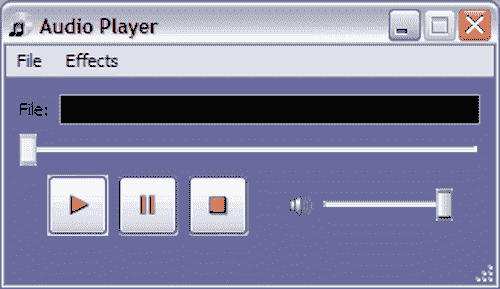

## 音乐播放器中的 GUI 元素

所示的音乐播放器应用程序使用了以下 QT 小部件。

+   `QMainWindow`：这个类提供了主应用程序窗口。在这个窗口中，其他元素（如按钮和菜单）被添加到布局中。

+   `QToolButton:` 使用`QToolButton`类创建播放、暂停和停止按钮。这些`QToolButton`的外观可以通过多个属性进行调整；例如，调用`QToolButtoon.setAutoRaise(True):`移除凸起按钮效果。在鼠标悬停时，按钮将被突出显示并出现在表面之上。

+   `VolumeSlider:` 如前所述，音量滑块小部件用于控制输出音频设备的音量。

+   `SeekSlider:` 用于在流媒体中定位位置。当音乐播放时，其位置会自动更新。您可以使用鼠标拖动滑块来跳转到曲目上的不同位置。

+   `QLineEdit:` 此小部件用于显示当前正在播放的媒体文件的完整路径。

+   `QMenubar:` 这是位于`QLineEdit`上方的菜单栏。在这里，我们添加了不同的菜单，如**文件**和**效果**。

+   `QAction:` 将各种音频效果选项添加到**效果**菜单中，作为`QAction`实例。

以下是对音乐播放器应用程序显示的各种 QT 小部件的说明图中指出了一些刚才讨论的这些 QT 元素：

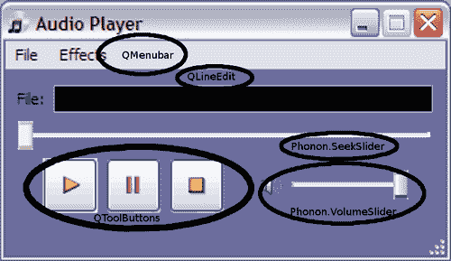

## 生成 UI 代码

使用 QT Designer 应用程序构建所需的 GUI。这应包含在 PyQT4 的二进制安装程序中。QT Designer 提供了一种快速设计和发展用户界面代码的方法。它支持许多常用 QT 小部件。可以将这些小部件交互式地添加到布局中。此工具也非常有用，可以增强应用程序的美观。例如，可以使用 QT Designer 中提供的各种功能轻松更改小部件颜色和其他属性。

# 生成 UI 代码的时间

此应用程序所需的 UI 文件已经为您创建。本节的目的不是向您展示如何从头开始生成 UI。它只是将说明使用 QT Designer 开发此应用程序的一些重要方面。然后您可以进一步实验，向音乐播放器应用程序添加新小部件。我们在第二章“处理图像”中开发“缩略图制作器”应用程序时使用了 QT Designer。我们将在本节中也介绍一些这些内容。

1.  从 Packt 网站下载文件`Ui_AudioPlayerDialog.ui`。

1.  启动 PyQt4 安装中包含的 QT Designer 应用程序。

1.  在 QT Designer 中打开此文件。点击此音频播放器对话框中的每个小部件元素。与所选小部件关联的 QT 类将在 QT Designer 的**属性编辑器**面板中显示。

1.  注意对话框中各种 UI 小部件周围的红色边界。这些边界指示了一个“布局”，其中小部件被排列。布局是通过`QLayout`类及其各种子类创建的。它是使用 QT 进行用户界面设计的临界组件。如果没有布局，当运行应用程序并例如调整对话框大小时，UI 元素可能会出现扭曲。

    以下插图显示了在 QT Designer 中打开时的对话框外观，即音乐播放器对话框（.ui 文件）。

    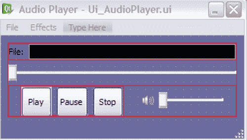

    +   仔细观察围绕小部件的边界，这些边界指示了布局的存在。你会注意到有多个边界。这表明我们已经在多个布局中放置了小部件。例如，播放、暂停和停止按钮被排列在水平布局 QHBoxLayout 中。这些按钮进一步排列在另一个包含 volumeSlider 元素的横向布局中。有关如何在布局中排列小部件的信息，请参阅 QT4 和 QT Designer 文档。

1.  如果你点击菜单栏中的**在此处输入**占位符，它就会变为可编辑状态。有了这个，你可以在菜单栏中添加一个新的菜单。同样，你可以通过打开这些菜单并点击**在此处输入**菜单项来向**文件**和**效果**菜单添加菜单项。**文件**菜单有两个菜单项：**打开**和**退出**。请注意，**效果**菜单是空的。我们将在稍后向此菜单添加菜单项。在接下来的几个步骤中，我们将对这个对话框进行一些小的修改，以便了解 QT Designer。

1.  我们现在将添加一个可以显示数字的小部件。这个小部件可以用来更新流媒体播放时间信息。左侧面板显示了一组可以鼠标拖放到音频播放器对话框窗口内部的小部件。以下截图说明了这一点：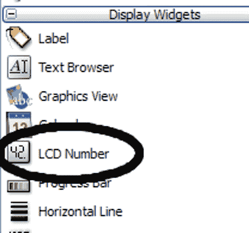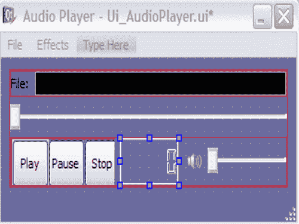

    +   你可以看到 QT Designer 的显示小部件面板和插入到对话框中的 LCD 数字小部件。

        右侧的截图显示了插入的 LCD 数字小部件被选中。它被插入到一个布局中，该布局以横向方式排列 QToolButtons 和 volumeSlider 小部件。此外，请注意插入的 LCD 数字小部件有一个默认大小。这个大小需要调整，以便其他小部件能够获得它们的空间份额。可以使用 QT Designer 中的属性编辑面板调整此小部件的各种参数。在这里，我们调整了最大尺寸值，如下面的截图所示。

    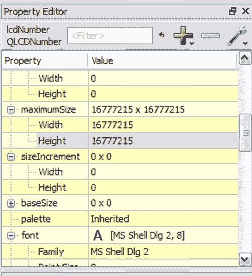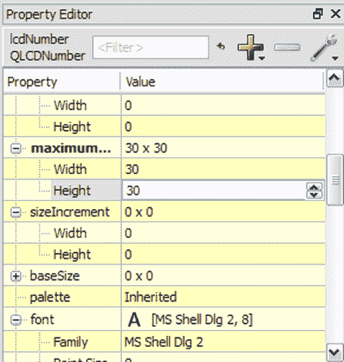

    +   LCD 数字小部件的属性编辑器，右侧的截图显示了编辑后的尺寸参数。

        一旦调整了最大宽度和高度参数，LCD 数字小部件就可以很好地适应水平布局。下一个插图显示了结果对话框。

    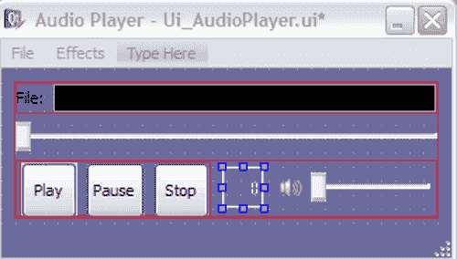

    +   就这样！你可以暂时将这个 LCD 数字小部件保留在对话框中。项目完成后，你可以使用它来添加显示流媒体时间信息的功能。请注意，LCD 数字小部件不是显示播放时间的唯一选项。你甚至可以使用 QTextLabel 并更新标签字符串来显示时间。

1.  如章节中所述，第二章，*处理图像*，QT 设计器使用扩展名 `.ui` 保存用户界面文件。要将此转换为 Python 源代码，PyQt4 提供了一个名为 `pyuic4` 的转换工具。在 Windows XP 上，对于标准的 Python 安装，此工具的路径为 `C:\Python26\Lib\site-packages\PyQt4\pyuic4.bat`。将此路径添加到环境变量中。或者，每次你想将 `.ui` 文件转换为 Python 源文件时，指定整个路径。可以从命令提示符运行转换工具，如下所示：

    ```py
    pyuic4 UI_AudioPlayerDialog.ui -o Ui_AudioPlayerDialog.py

    ```

    +   此脚本将从输入的 .ui 文件创建一个 Python 源文件，名为 `Ui_AudioPlayerDialog.py`。你可以进一步审查此文件以了解 UI 代码是如何设置的。我们将直接使用此文件进行后续讨论。

    ### 小贴士

    修改自动生成的 Python 源文件 `Ui_AudioPlayerDialog.py` 并不是一个好主意；如果你对 QT 设计器的相应 `.ui` 文件进行了更改并再次运行 `pyuic4` 脚本，它将 *覆盖* 之前的 Python 源文件 `Ui_AudioPlayerDialog.py`，前提是我们使用相同的文件名。相反，你可以使用自动生成的文件作为基类，并创建一个子类来以编程方式添加自定义 UI 元素。

## 刚才发生了什么？

本节让我们对使用 QT 设计器调整用户界面有了实际了解。为了体验用户界面编辑，我们在音频播放器对话框中添加了一个 LCD 数字小部件。我们学习了如何从使用 QT 设计器创建的 `.ui` 文件自动生成 Python 源代码。

## 连接小部件

命令行工具`pyuic4`（Windows 用户的 pyuic4.bat）可以将 QT-Designer 创建的用户界面转换为 Python 源文件。然而，这个 UI 中的各种小部件需要响应用户操作。例如，当**播放**按钮被点击时，它必须开始流式传输媒体文件。因此，我们需要添加必要的代码来指示这些小部件在特定事件发生时应该做什么。这是通过槽和信号实现的。当特定的 GUI`事件`发生时，会发出一个`signal`。例如，当用户点击**暂停**按钮时，会发出一个`"clicked()"`信号。`slot`是调用此`signal`的方法。这与我们在早期章节中将`pad-added`信号通过`decodebin`元素连接到`decodebin_pad_added`方法的方式非常相似。请参阅 PyQt4/QT4 文档，其中包含各种小部件可用的`signals`的完整列表。

# 行动时间 - 连接小部件

让我们学习如何使小部件对特定的用户操作做出响应，例如按钮点击。

1.  从 Packt 网站下载文件`AudioPlayerDialog.py`。它定义了`AudioPlayerDialog`类。

1.  我们现在将回顾将类方法与发出的信号连接的方法。这些信号在特定“事件”发生时生成。

    ```py
    1 def _connect(self):
    2 """
    3 Connect slots with signals.
    4 """
    5 self.connect(self._dialog.fileOpenAction,
    6 SIGNAL("triggered()"),
    7 self._openFileDialog)
    8
    9 self.connect(self._dialog.fileExitAction,
    10 SIGNAL("triggered()"),
    11 self.close)
    12
    13 self.connect(self._dialog.menuAudioEffects,
    14 SIGNAL("triggered(QAction*)"),
    15 self._changeAudioEffects)
    16
    17 self.connect(self._dialog.playToolButton,
    18 SIGNAL("clicked()"),
    19 self._playMedia)
    20
    21 self.connect(self._dialog.stopToolButton,
    22 SIGNAL("clicked()"),
    23 self._stopMedia)
    24
    25 self.connect(self._dialog.pauseToolButton,
    26 SIGNAL("clicked()"),
    27 self._pauseMedia)

    ```

1.  在这里，self._dialog 是`Ui_AudioPlayerDialog`类的一个实例。请注意，self.connect 是 QT 类 QMainWindow 继承的方法。它接受以下参数（QObject，SIGNAL，callable）。QObject 是任何小部件类型；SIGNAL 是在特定事件发生时生成的。Callable 是处理此事件的方法。AudioPlayer._connect 方法将所有必要的信号与类方法连接起来。

1.  音频播放器对话框中的文件菜单包含两个`QActions`，即`fileOpenAction`和`fileExitAction`。当选择文件->打开时，为`QAction`生成一个“触发”信号。我们需要注意这个信号，然后调用一个将执行打开文件任务的方法。这个信号通过第 5-7 行之间的代码连接。因此，当“triggered()”信号被发出时，对于`fileopenAction`，会调用一个名为`AudioPlayer._openFileDialog`的方法，该方法包含打开音频文件所需的代码。

1.  让我们回顾第 9-12 行的代码。这段代码将 `QMenu` 内的所有 `QActions` 连接到 `AudioPlayer` 类的方法。第一个参数 `self._dialog.menuAudioEffects` 是菜单栏中的效果菜单。这是一个 `QMenu`。第二个参数 `SIGNAL("triggered(QAction*)")` 告诉 QT 我们想要捕获 **效果** 菜单内任何 `QActions` 的触发信号。这最好用一个例子来解释。想象一下音频 **效果** 菜单有菜单项（`QActions`），如回声和失真。当用户选择 **效果** | **回声** 或 **效果** | **失真** 时，会发出 `triggered(QAction*)` 信号。`QAction*` 参数只是一个指向该 `QAction` 的指针。第三个参数是接收方法，`self._changeAudioEffects`，当此信号发出时会被调用。

    +   当点击 QToolButton，例如播放、暂停或停止按钮时，会发出 clicked() 信号。此信号通过代码块 13-23 连接到 AudioPlayer 类的适当方法。

1.  注意我们没有连接 `SeekSlider` 和 `VolumeSlider`。这些小部件的信号是内部连接的。您需要做的只是分别为这些小部件设置 `MediaObject` 和 `AudioOutput`。我们将在下一节中学习如何做到这一点。

## 刚才发生了什么？

我们回顾了 `AudioPlayerDialog._connect()` 方法，以了解 Audio Player 对话框内各种小部件是如何连接到内部方法的。这帮助我们学习了使用 QT 进行 GUI 编程的一些初步概念。

## 开发音频播放器代码

到目前为止的讨论一直集中在图形用户界面。我们学习了如何使用 QT Designer 创建用户界面，然后生成代表此 UI 的 Python 源文件。我们还回顾了将应用程序的前端与后端（类方法）连接的代码。现在，是时候回顾负责播放音频、控制播放和添加音频效果等操作的音频处理代码了。

# 操作时间 - 开发音频播放器代码

在前面的部分中使用的源文件 `AudioPlayerDialog.py` 也将在这里使用。`AudioPlayerDialog` 类继承自 `QMainWindow`。

1.  如果您还没有这样做，请下载 Python 源文件 `AudioPlayerDialog.py`。

1.  让我们从类的构造函数 `AudioPlayerDialog` 开始。

    ```py
    1 def __init__(self):
    2 QMainWindow.__init__(self)
    3 self.mediaSource = None
    4 self.audioPath = ''
    5 self.addedEffects = {}
    6 self.effectsDict = {}
    7
    8 # Initialize some other variables.
    9 self._filePath = ''
    10 self._dirPath = ''
    11 self._dialog = None
    12 # Create media object , audio sink and path
    13 self.mediaObj = phonon.Phonon.MediaObject(self)
    14 self.audioSink = Phonon.AudioOutput(
    15 Phonon.MusicCategory,
    16 self)
    17 self.audioPath = Phonon.createPath(self.mediaObj,
    18 self.audioSink)
    19
    20 # Create self._dialog instance and call
    21 # necessary methods to create a user interface
    22 self._createUI()
    23
    24 # Connect slots with signals.
    25 self._connect()
    26
    27 # Show the Audio player.
    28 self.show()

    ```

1.  从第 2 行到第 6 行的代码块初始化了一些实例变量，这些变量将在以后使用。字典对象 self.effectsDict 将用于存储有关可用音频效果的信息。而 self.addedEffects 用于检查音频效果是否已添加到流媒体中。

    在第 13 行，创建了 Phonon.MediaObject 的实例。它将被用于控制 MediaSource 的播放。

    在 Phonon 媒体图中，通过第 14-16 行的代码创建了一个音频输出节点。我们将称之为 self.audioSink，这是在早期章节中使用的术语。AudioOutput 的第一个参数用于指定类别。它是一个 Phonon.Category 类的对象。由于这是一个音乐播放器应用程序，我们定义类别为 Phonon.MusicCategory。查看 QT 文档以了解更多关于类别的信息。第二个参数用作此音频接收器的父级。

    Phonon.Path 类将媒体图中的节点链接起来。此对象是通过 API 方法 Phonon.createPath 创建的。在第 17 行，Path self.audioPath 将媒体对象 self.mediaObject 与音频输出 self.audioSink 链接起来。

    `_createUI`方法的调用处理用户界面的定义。我们已经学习了前端如何通过在`_connect`方法中设置的联系与后端通信。

    最后，在第 28 行，API 方法 QMainWindow.show()显示音频播放器。

1.  `_createUI`方法将大部分 GUI 创建委托给`UI_AudioPlayerDialog`类。该方法还包括进一步修改 GUI 的代码。

    ```py
    1 def _createUI(self):
    2 # Define the instance to access the the UI elements
    3 defined in class Ui_AudioPlayerDialog.
    4 self._dialog = Ui_AudioPlayerDialog()
    5 self._dialog.setupUi(self)
    6 self._dialog.retranslateUi(self)
    7 playIcon= QIcon("play.png")
    8 pauseIcon= QIcon("pause.png")
    9 stopIcon= QIcon("stop.png")
    10 musicIcon= QIcon("music.png")
    11
    12 self._dialog.playToolButton.setIcon(playIcon)
    13 self._dialog.pauseToolButton.setIcon(pauseIcon)
    14 self._dialog.stopToolButton.setIcon(stopIcon)
    15 self.setWindowIcon(musicIcon)
    16 self._setupEffectsMenu()
    17 self._dialog.seekSlider.setMediaObject(self.mediaObj)
    18 self._dialog.volumeSlider.setAudioOutput(
    19 self.audioSink)

    ```

1.  在第 4 行创建了`UI_AudioPlayerDialog`类的实例。`setupUI`和`retranslateUI`是自动生成的方法。这些方法是在将包含 UI 的 QT Designer 文件转换为 Python 源文件时生成的。AudioPlayerDialog 实例作为参数传递给这两个方法。

    代码块 7 到 14 设置了三个 QToolButton 实例的图标。setIcon API 方法接受 QIcon 实例作为参数。音乐播放器图标在标题（对话框的左上角）是通过第 15 行的代码创建的。如前所述，Phonon.SeekSlider 信号是内部连接的。我们只需要告诉它将处理哪个 MediaObject。这是在第 17 行完成的。同样，在第 18 行，volumeSlider 的 setAudioOutput 方法设置了 self.audiosink 作为此 volumeSlider 的音频输出。在设置 UI 设计时，我们没有向效果菜单中添加任何菜单项。现在，通过在第 16 行调用`_setupEffectsMenu`方法来完成这项工作。

1.  让我们回顾一下`_setupEffectsMenu`方法。它将 Phonon 框架中可用的各种音频效果作为菜单项添加到**效果**菜单中。

    ```py
    1 def _setupEffectsMenu(self):
    2 availableEffects = (
    3 Phonon.BackendCapabilities.availableAudioEffects())
    4 for e in availableEffects:
    5 effectName = e.name()
    6 self.effectsDict[effectName] = e
    7 action = QAction(effectName,
    8 self._dialog.menuAudioEffects)
    9 action.setCheckable(True)
    10 self._dialog.menuAudioEffects.addAction(action)

    ```

1.  命名空间 Phonon.BackendCapabilities 包含提供有关 Phonon 后端功能信息的函数。`BackendCapabilities.availableAudioeffects()` 返回一个列表，其中包含在特定平台上由 Phonon 支持的所有音频效果。列表 `availableEffects` 包含 `Phonon.EffectDescription` 类的对象。`self.effectsDict` 存储了效果名称和 `EffectDescription` 对象作为键值对。这个字典将在以后使用。效果菜单 `menuAudioEffects` 用对应于每个可用音频效果的 `QAction` 实例填充。`QAction` 在第 6 行创建。`QAction` 的 `setCheckable` 属性通过鼠标点击切换动作的选中状态。以下截图显示了 Windows XP 上的效果菜单项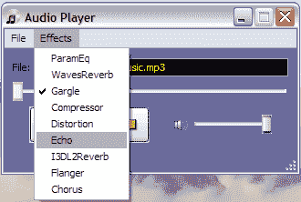

1.  当从音乐播放器点击**文件** | **打开**时，会调用 `_openFileDialog` 方法。

    ```py
    1 def _openFileDialog(self):
    2
    3 self._filePath = ''
    4
    5 self._filePath = (
    6 str(QFileDialog.getOpenFileName(
    7 self,
    8 "Open Audio File",
    9 "",
    10 "MP3 file (*.mp3);;wav(*.wav);;All Files
    11 (*.*);;")) )
    12 if self._filePath:
    13 self._filePath = os.path.normpath(self._filePath)
    14 self._dialog.fileLineEdit.setText(self._filePath)
    15 self._loadNewMedia()

    ```

1.  这会弹出一个 `QFileDialog`，其文件类型过滤器与第 10 行指定的过滤器相同。要了解支持的媒体格式，可以使用以下代码行中的 `Phonon.BackEndCapabilities`。

    ```py
    types = Phonon.BackendCapabilities.availableMimeTypes()

    ```

1.  其中，`types` 是可用 MIME 类型的列表。

    然后将用户指定的文件路径存储在变量 `self._filePath` 中。此路径在对话框的文件 `LineEdit` 字段中显示。在第 15 行，调用了 `_loadNewMedia` 方法。我们将在下一节中回顾它。

1.  `_loadNewMedia` 方法为 `MediaObject` 设置媒体源。

    ```py
    1 def _loadNewMedia(self):
    2 # This is required so that the player can play another
    3 # file, if loaded while first one is still playing.
    4 if self.mediaSource:
    5 self._stopMedia()
    6 del self.mediaSource
    7 self.mediaSource = phonon.Phonon.MediaSource(
    8 self._filePath)
    9 self.mediaObj.setCurrentSource(self.mediaSource)

    ```

1.  第 4 行的 `if` 块确保在将新媒体源设置为播放状态之前，由媒体对象停止当前流式传输的音频（如果有的话）。尽管这不是必需的，但第 6 行的代码会清理 `MediaSource` 对象占用的内存。第 8 行创建 `MediaSource` 类的新实例。使用该类的 `MediaObject` 的 `setCurrentSource` API 方法指定提供媒体数据的 `MediaSource`。这样，我们的媒体播放器就设置好了以流式传输音频文件。

1.  当你在音乐播放器中点击**播放**按钮时，会调用 `AudioPlayerDialog._playMedia` 方法。

    ```py
    1 def _playMedia(self):
    2 if not self._okToPlayPauseStop():
    3 return
    4
    5 if self.mediaObj is None:
    6 print "Error playing Audio"
    7 return
    8
    9 self.mediaObj.play()

    ```

1.  首先，程序执行一些基本检查以确保媒体可播放，然后调用 `Phonon.MediaObject` 的 `play()` 方法，开始流式传输音频。`AudioPlayerDialog` 类的 `_pauseMedia` 和 `_stopMedia` 方法包含类似的代码。

    我们刚刚学习了如何设置媒体图、流式传输媒体和控制其播放。现在让我们看看如何向这个流式媒体添加音频效果。如果效果菜单中的任何项被点击，会调用 `AudioPlayerDialog._changeAudioEffects` 方法：

    ```py
    1 def _changeAudioEffects(self, action):
    2 effectName = action.text()
    3
    4 if action.isChecked():
    5 effectDescription = self.effectsDict[effectName]
    6 effect = Phonon.Effect(effectDescription)
    7 self.addedEffects[effectName] = effect
    8 self.audioPath.insertEffect(effect)
    9 else:
    10 effect = self.addedEffects[effectName]
    11 self.audioPath.removeEffect(effect)
    12 del self.addedEffects[effectName]

    ```

1.  前面的代码片段中的 if 和 else 块分别向媒体图中添加和删除效果节点。当 Effects 菜单中的动作被选中时执行 if 块。当已选中的动作被切换时，程序执行 else 块。在 if 块中，在第 6 行创建了一个 Phonon.Effect 实例。这个实例需要一个 EffectDescription 对象作为参数。如 _setupEffectsMenu 方法中所示，self.effectsDict 将 EffectDescription 对象存储为字典值。在第 8 行，此效果被插入为媒体图中的一个节点。self.audioPath 将媒体图中的所有节点链接起来。

    字典 self.addedEffects 跟踪媒体图中插入的所有音频效果。else 块移除已添加的效果。

    在第 11 行，通过调用 Phonon.Path 的 removeEffect API 方法移除了一个附加效果。在第 12 行，也删除了 self.addedEffects 中对应的键值对。这也确保了没有内存泄漏。

    ### 小贴士

    QT Phonon 允许多次添加相同的音频效果。例如，您可以使用`Path.insertEffect`在媒体图中创建多个“合唱”效果节点。每个添加的效果都将有自己的贡献。然而，在我们的应用程序中，我们只支持添加一个效果。您可以扩展此功能以支持多次添加相同的效果。为此，您需要调整**效果**菜单 UI，并在代码中进行一些其他更改以跟踪添加的效果。

1.  如果在播放音频文件时关闭 GUI 窗口，应用程序将无法正确终止。为了安全地终止应用程序而不产生内存泄漏，`AudioPlayerDialog`重写了`QMainWindow.closeEvent`。在关闭窗口之前，我们进行必要的清理以避免内存泄漏。下面的代码展示了这一过程。

    ```py
    1 def closeEvent(self, evt):
    2 print "\n in close event"
    3 if self.mediaObj:
    4 self.mediaObj.stop()
    5
    6 self.mediaObj = None
    7 self._clearEffectsObjects()
    8 QMainWindow.closeEvent(self, evt)

    ```

1.  如果有流媒体，首先会停止。调用 _clearEffectsObject 会删除所有 Phonon.Effect 和 Phonon.EffectDescription 对象（如果存在）。_clearEffectsObject 方法名本身就说明了其功能。

1.  以下代码创建了一个`QApplication`实例并执行此程序。

    ```py
    1 app = QApplication(sys.argv)
    2 musicPlayer = AudioPlayerDialog()
    3 app.exec_()

    ```

1.  检查文件`AudioPlayerDialog.py`中的其余代码，然后按照以下方式运行音乐播放器：

    ```py
    $python AudioPlayerDialog.py

    ```

    +   这应该会显示音乐播放器 GUI 窗口。使用文件 | 打开来指定音乐文件，然后点击播放按钮来享受音乐！

## 刚才发生了什么？

我们刚刚创建了自己的音乐播放器！我们使用 QT Phonon 多媒体框架开发了此音乐播放器的前端。我们详细讨论了 QT Phonon 中各种模块的使用。我们学习了如何通过使用`MediaObject, AudioOutput, Path`等模块在媒体图中设置音频控制和效果。我们还通过 QT 获得了对 GUI 编程方面的一些高级理解。

## 尝试为音频播放器添加更多功能

在**生成 UI 代码**部分，我们向音乐播放器 GUI 窗口添加了一个小部件。这是一个可以显示帧数的 LCD 数字小部件。将其连接到音频播放器后端，以便它可以显示当前媒体时间。以下插图显示了用于流式音频文件的此 LCD 数字小部件的工作情况。

+   扩展这个音乐播放器应用程序，使其能够依次播放目录或 CD 中的所有歌曲。创建用于显示文件的用户界面有多种方法。例如，你可以尝试使用`QDirectoryView`、`QTreeView`或`QTableWidget`等小部件。

    音乐播放器在 LCD 数字小部件中显示帧数（时间）：

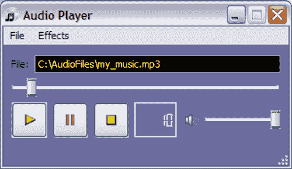

# 项目：基于 GUI 的视频播放器

在第一个项目中，我们学习了 QT Phonon 框架的基础知识。在本项目中，我们将通过开发视频播放器来进一步扩展这些知识。音频播放器是通过构建媒体图来开发的。通过创建`Phonon.Path`，将各种节点如`MediaObject`、`AudioOutput`和`Effects`链接在一起。如果目标仅仅是开发一个简单的音频或视频播放器，那么工作会更加简单。Phonon 有一个名为`VideoPlayer`的模块，它提供了一种抽象的方式来播放音频或视频，无需显式创建`MediaObject`、`AudioOutput`和其他一些对象。它只需要一个`MediaSource`。也可以通过添加各种音频效果节点来创建自定义媒体图。我们将在稍后看到如何做到这一点。现在，让我们使用 QT Phonon 编写一个简单的视频播放器应用程序。以下插图显示了视频播放器的工作情况。

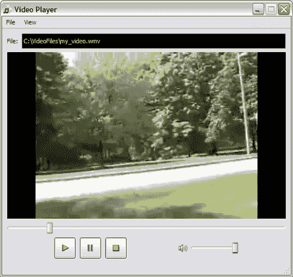

## 生成 UI 代码

QT Designer 是一个交互式生成用户界面的优秀资源。正如我们所见，本项目的大部分用户界面都是使用 QT Designer 构建的。此外，还介绍了使用 QT 进行用户界面设计的一些重要要点。本节将指导您使用 QT Designer 和`pyuic4`生成此应用程序的用户界面。

# 动手实践 - 生成 UI 代码

`.ui`文件已经创建。在以下讨论中，我们将简单地使用此文件，并介绍一些此应用程序所需的 GUI 元素。

1.  从 Packt 网站下载文件`Ui_VideoPlayerDialog.ui`。

1.  在 QT Designer 中打开此文件。点击每个小部件元素。与所选小部件关联的 QT 类将在右侧的**属性编辑器**面板中显示。这里使用的多数小部件与早期项目中使用的相同。唯一不同的小部件是`Phonon.VideoPlayer`。以下插图显示了在 QT Designer 中打开时的对话框外观。它还指出了对话框中使用的各种 Phonon 小部件。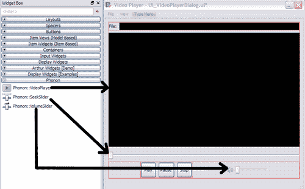

    +   QT Designer 中的视频播放器小部件看起来如前一张截图所示。

1.  点击前面插图所示的`VideoPlayer`小部件。**属性编辑器**将显示其属性。请注意这个小部件的大小是如何定义的。此视频播放器将支持在`全屏`模式下查看视频的功能。因此，`VideoPlayer`小部件的最大尺寸参数被设置为较高的值，如下一张截图所示。实际上，我们正在使用 QT 默认值作为最大尺寸属性。唯一修改的属性是小部件的最小尺寸。这个最小尺寸将是视频播放器小部件的默认尺寸。

    视频播放器小部件的属性编辑器：

    

1.  其余的小部件与之前项目中使用的相同。您可以添加 LCD **数字**小部件或一个简单的文本标签来显示流媒体当前时间。有关添加此类小部件的说明，请参阅最后一个项目。

1.  接下来，使用`pyuic4`转换工具将`.ui`文件转换为`.py`。转换工具可以从命令提示符运行，如下所示：

    ```py
    pyuic4 UI_VideoPlayerDialog.ui -o Ui_VideoPlayerDialog.py

    ```

    +   此脚本将从输入的.ui 文件创建一个 Python 源文件，名为 Ui_VideoPlayerDialog.py。我们将直接使用此文件进行后续讨论。

## 刚才发生了什么？

之前的讨论作为使用 QT Designer 生成此项目所需的大部分用户界面元素的复习。使用了`pyuic4`转换工具将`.ui`文件转换为 Python 源文件。

## 连接小部件

在之前的项目中使用的多数小部件在此处被重新使用。因此，这将是一个简短的讨论。在这个项目中，我们没有包含**效果**菜单。因此，`VideoPlayerDialog._connect`方法有细微的变化。此方法如下所示：

```py
def _connect(self):
self.connect(self._dialog.fileOpenAction,
SIGNAL("triggered()"),
self._openFileDialog)
self.connect(self._dialog.fileExitAction,
SIGNAL("triggered()"),
self.close)
self.connect(self._dialog.fullScreenAction,
SIGNAL("toggled(bool)"),
self._toggleFullScreen)
self.connect(self._dialog.playToolButton,
SIGNAL("clicked()"),
self._playMedia)
self.connect(self._dialog.stopToolButton,
SIGNAL("clicked()"),
self._stopMedia)
self.connect(self._dialog.pauseToolButton,
SIGNAL("clicked()"),
self._pauseMedia)

```

突出的代码行是一个新的小部件连接。其余的连接与之前项目中讨论的相同。当选择**视图** | **全屏**时，`fullScreenAction`的`toggled(bool)`信号被触发。当发生这种情况时，会调用`slot`方法`self._toggleFullScreen`。下一节将详细介绍此方法。

## 开发视频播放器代码

生成的前端连接到后端以处理媒体。在本节中，我们将回顾实际流式传输媒体和控制播放和音量的视频播放器后端。在这里我们的工作会更容易。我们在早期项目中做的许多好工作将在此处重新使用。将有一些小的修改，因为我们将使用`Phonon.VideoPlayer`进行视频处理，而不是显式创建如`MediaObject`之类的对象。

# 行动时间 - 开发视频播放器代码

让我们开发视频播放器后端的其余部分。我们将从 `AudioPlayerDialog` 类中重用几个方法，并进行一些小的修改。本节将只涵盖重要的方法。

1.  从 Packt 网站下载文件 `VideoPlayerDialog.py`。

1.  类的构造函数如下所示。

    ```py
    1 def __init__(self):
    2 QMainWindow.__init__(self)
    3 self.mediaSource = None
    4 self.audioPath = ''
    5
    6 # Initialize some other variables.
    7 self._filePath = ''
    8 self._dialog = None
    9
    10 # Create self._dialog instance and call
    11 # necessary methods to create a user interface
    12 self._createUI()
    13
    14 self.mediaObj = self._dialog.videoPlayer.mediaObject()
    15 self.audioSink = self._dialog.videoPlayer.audioOutput()
    16
    17 self._dialog.seekSlider.setMediaObject(self.mediaObj)
    18 self._dialog.volumeSlider.setAudioOutput(
    19 self.audioSink)
    20
    21 # Connect slots with signals.
    22 self._connect()
    23
    24 # Show the Audio player.
    25 self.show()

    ```

1.  self._dialog 创建了 Phonon.VideoPlayer 类的实例。一旦指定了媒体源，self._dialog.videoPlayer 就能够流式传输媒体。因此，对于媒体流本身，我们不需要显式创建 MediaObject 和 AudioOutput 节点；Phonon.VideoPlayer 内部构建媒体图。然而，MediaObject 和 AudioOutput 分别需要用于 seekSlider 和 volumeControl 小部件。在第 14 和 15 行，这些对象从 self._dialog.videoPlayer 获取。

1.  `_createUI` 方法几乎与 `AudioPlayerDialog` 中的相应方法相同，只是没有与 **效果** 菜单相关的代码。

1.  接着，要审查的方法是 `_playMedia:`

    ```py
    1 def _playMedia(self):
    2 if not self._okToPlayPauseStop():
    3 return
    4 self._dialog.videoPlayer.play(self.mediaSource)

    ```

1.  代码是自我解释的。在 `VideoPlayerDialog._loadNewMedia` 中设置了 self.mediaSource。这个 MediaSource 实例作为参数传递给 API 方法 VideoPlayer.play。然后视频播放器内部构建媒体图并播放指定的媒体文件。

1.  这个简单的视频播放器支持全屏模式查看流媒体视频的选项。`QMainWindow` 类提供了一个简单的方法来在全屏和正常观看模式之间切换视图。这是通过 `_toggleFullScreen` 方法实现的。

    ```py
    def _toggleFullScreen(self, val):
    """
    Change between normal and full screen mode.
    """
    # Note: The program starts in Normal viewing mode
    # by default.
    if val:
    self.showFullScreen()
    else:

    ```

    ```py
    self.showNormal()

    ```

    +   方法 self.showFullScreen() 是从 QMainWindow 类继承的。如果视图菜单（视图 | 全屏）中的 QAction 被选中，视频播放器窗口将设置为全屏。QMainWindow.showNormal() 将视频播放器切换回正常观看模式。以下截图显示了全屏模式下的视频播放器。注意，在全屏模式下，窗口标题栏被隐藏。

        下一个图像展示了全屏模式下的视频播放器：

    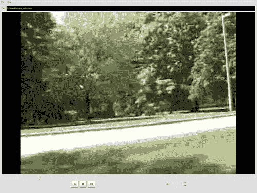

1.  审查来自文件 `VideoPlayerDialog.py` 的其余代码。将此文件与 `Ui_VideoPlayerDialog.py` 放在同一目录下，然后从命令行运行程序，如下所示：

1.  视频播放器 GUI 窗口将出现。打开任何支持的音频或视频文件，然后点击 **播放** 按钮开始播放。

    ```py
    $python VideoPlayerDialog.py

    ```

## 刚才发生了什么？

我们编写了自己的视频播放器。这个视频播放器能够播放支持格式的视频和音频文件。在这里使用了 `Phonon.VideoPlayer` 模块，它使媒体播放和控制成为可能。我们还学习了如何使用 QMainWindow 类的 API 方法在全屏和正常观看模式之间切换视图。

## 尝试使用视频播放器做更多的事情

1.  这里有一个简单的增强。全屏模式显示播放控制按钮、快进和音量滑块等小部件。当检查 **视图** | **全屏** 动作时，隐藏这些小部件。此外，添加一个键盘快捷键来在正常和全屏视图模式之间切换。

1.  向视频播放器 GUI 添加音频效果。我们已经在第一个项目中学习了如何向媒体图添加音频效果。你可以在这里重用那段代码。然而，你需要一个合适的 `Phonon.Path` 对象，`effects` 节点需要添加到这个对象中。在上一个项目中，我们使用了 `Phonon.createPath`，但我们不能创建一个新的路径，因为它是由 VideoPlayer 内部创建的。相反，你可以使用 API 方法 `MediaObject.outputPaths()` 来获取路径。下面是一个示例代码行。

    ```py
    self.audioPath = self.mediaObj.outputPaths()[0]

    ```

1.  然而，要注意内存泄漏问题。如果你添加了音频效果，然后退出应用程序，程序可能会冻结。这可能是因为效果节点没有被从原始音频路径中删除。或者，你可以从基本原理构建视频播放器。也就是说，不要使用 Phonon.VideoPlayer。相反，构建一个自定义的媒体图，就像我们在音频播放器项目中做的那样。在这种情况下，你需要使用诸如 Phonon.VideoWidget 这样的模块。

# 摘要

本章教会了我们关于使用 QT 开发 GUI 多媒体应用程序的几个要点。我们完成了两个令人兴奋的项目，其中开发了使用 QT Phonon 框架的音频和视频播放器。为了完成这些任务，我们：

+   使用 QT Designer 生成 UI 源代码

+   通过将槽（类方法）与信号连接来处理 QT 生成的事件

+   使用 Phonon 框架设置音频和视频流媒体图的媒体图
