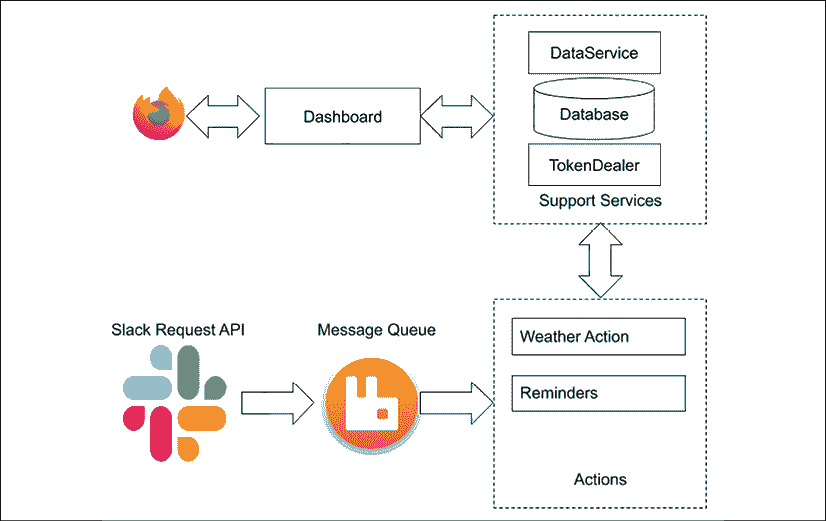

# 第八章：制作仪表板

到目前为止，大部分工作都集中在构建微服务和使它们相互交互上。现在是时候将人类纳入方程，通过**用户界面**（**UI**）让我们的最终用户能够通过浏览器使用系统，并更改可能通过 Slack 进行操作显得尴尬或不智的设置。

现代 Web 应用在很大程度上依赖于客户端 JavaScript（JS，也称为 ECMAScript）。一些 JS 框架在提供完整的**模型-视图-控制器**（**MVC**）系统方面做到了极致，该系统在浏览器中运行并操作**文档对象模型**（**DOM**），这是在浏览器中渲染的网页的结构化表示。

Web 开发范式已经从在服务器端渲染一切转变为在客户端渲染一切，客户端根据需要从服务器收集数据。原因是现代 Web 应用动态地更改已加载网页的部分，而不是调用服务器进行完整渲染。这更快，需要的网络带宽更少，并提供了更丰富的用户体验。几秒钟的延迟可能导致用户离开你的页面，除非他们有强烈的访问需求，比如更具体地说，有购物或阅读的需求。这一客户端转变的最大例子之一是 Gmail 应用，它在大约 2004 年开创了这些技术。

类似于 Facebook 的**ReactJS**([`facebook.github.io/react/`](https://facebook.github.io/react/))这样的工具提供了高级 API，以避免直接操作 DOM，并提供了一种抽象级别，使得客户端 Web 开发如同构建 Quart 应用一样舒适。

话虽如此，每两周似乎都会出现一个新的 JS 框架，而且往往很难决定使用哪一个。**AngularJS**([`angularjs.org/`](https://angularjs.org/))曾经是最酷的玩具，但现在许多开发者已经转向使用 ReactJS 来实现他们的大部分应用 UI。还有一些新的语言，例如**Elm**([`elm-lang.org`](https://elm-lang.org))，它提供了一种编译到 JavaScript 的函数式编程语言，允许在编译时检测许多常见的编程错误，同时其运行时也能与任何浏览器兼容。毫无疑问，未来还将有新的参与者变得流行。

这种波动性根本不是什么坏信号。它仅仅意味着在 JavaScript 和浏览器生态系统中发生了大量的创新。例如，服务工作者（service workers）功能允许开发者以原生方式在后台运行 JS 代码：[`developer.mozilla.org/en/docs/Web/API/Service_Worker_API`](https://developer.mozilla.org/en/docs/Web/API/Service_Worker_API)。

`WebAssembly`([`webassembly.org/`](https://webassembly.org/))，一个极快且安全的沙箱环境，允许开发者创建资源密集型的工具，如 3D 渲染环境，所有这些都在 Web 浏览器中运行。

如果你将 UI 与系统其他部分进行了清晰的分离，从一种 JS 框架迁移到另一种应该不会太难。这意味着你不应该改变你的微服务发布数据的方式，使其特定于 JS 框架。

对于我们的目的，我们将使用 ReactJS 来构建我们的小型仪表板，并将其包装在一个专门的 Quart 应用程序中，该应用程序将其与系统其他部分连接起来。我们还将看到该应用程序如何与所有我们的微服务交互。我们选择这种方法是因为 ReactJS 当前的流行，尽管你也会在其他任何流行的环境中获得优秀的结果。

本章由以下三个部分组成：

+   构建 ReactJS 仪表板——ReactJS 简介及示例

+   如何在 Quart 应用程序中嵌入 ReactJS 并构建应用程序结构

+   身份验证和授权

到本章结束时，你应该对如何使用 Quart 构建 Web UI 有很好的理解，并了解如何使其与微服务交互——无论你是否选择使用 ReactJS。

# 构建 ReactJS 仪表板

ReactJS 框架实现了对 DOM 的抽象，并提供快速高效的机制来支持动态事件。创建 ReactJS UI 涉及创建具有一些标准方法的类，这些方法将在事件发生时被调用，例如 DOM 准备就绪、React 类已加载或用户输入发生。

类似于 nginx 这样的网络服务器，处理所有困难和常见的网络流量部分，让你专注于端点的逻辑，ReactJS 允许你专注于方法实现，而不是担心 DOM 和浏览器状态。React 的类可以通过纯 JavaScript 实现，或者使用一个名为 JSX 的扩展。我们将在下一节讨论 JSX。

## JSX 语法

在编程语言中表示 XML 标记可能是一项艰巨的工作。一种看似简单的方法可能是将所有标记视为字符串，并将内容格式化为模板，但这种方法意味着你的代码并不理解所有这些标记的含义。另一种极端的做法是创建每个标记元素作为对象，并将它们全部渲染为文本表示。

相反，有一个更好的混合模型，使用转换器——一种生成不同形式源代码而不是可执行程序的编译器。JSX 语法扩展（[`facebook.github.io/jsx/`](https://facebook.github.io/jsx/））向 JavaScript 添加 XML 标签，并可以转换为纯 JavaScript，无论是在浏览器中还是在之前。JSX 被 ReactJS 社区推广为编写 React 应用程序的最佳方式。

在下面的示例中，一个`<script>`部分包含一个`greeting`变量，其值是一个表示`div`的 XML 结构；这种语法是有效的 JSX。从那里，`ReactDOM.render()`函数可以在你指定的`id`处将`greeting`变量渲染到 DOM 中：

```py
 <!DOCTYPE html>
    <html>

    <head lang="en">
        <meta charset="UTF-8">
    </head>

    <body>
        <div id="content"></div>
        <script src="img/react.development.js" crossorigin></script>
        <script src="img/react-dom.development.js" crossorigin></script>
        <script src="img/babel.min.js" crossorigin></script>
        <script type="text/babel">
            var greeting = (
                <div>
                    Hello World
                </div>)
            ReactDOM.render(greeting, document.getElementById('content'));
        </script>
    </body>
    </html> 
```

这两个 ReactJS 脚本都是 React 分发的部分，在这里我们使用的是开发版本，它们在编写代码时将提供更有帮助的错误信息。较小的、编码过的版本——称为压缩版本——在生产使用中更受欢迎，因为它们使用更少的网络带宽和缓存存储空间。`babel.min.js`文件是 Babel 分发的部分，需要在浏览器遇到任何 JSX 语法之前加载。

Babel（`https://babeljs.io/`）是一个转换器，可以将 JSX 即时转换为 JS，以及其他可用的转换。要使用它，你只需将脚本标记为`text/babel`类型。

JSX 语法是了解 React 的唯一特定语法差异，因为其他所有操作都是使用常见的 JavaScript 完成的。从那里，构建 ReactJS 应用程序涉及创建类来渲染标记并响应用户事件，这些类将被用来渲染网页。

现在我们来看看 ReactJS 的核心——组件。

## React 组件

ReactJS 基于这样的想法：网页可以从基本组件构建，这些组件被调用以渲染显示的不同部分并响应用户事件，如键入、点击和新数据的出现。

例如，如果你想显示人员列表，你可以创建一个`Person`类，该类负责根据其值渲染单个人员的详细信息，以及一个`People`类，它遍历人员列表并调用`Person`类来渲染每个项目。

每个类都是通过`React.createClass()`函数创建的，该函数接收一个包含未来类方法的映射。`createClass()`函数生成一个新的类，并设置一个`props`属性来存储一些属性以及提供的方法。在下面的示例中，在一个新的 JavaScript 文件中，我们定义了一个具有`render()`函数的`Person`类，该函数返回一个`<div>`标签，以及一个`People`类，它组装`Person`实例：

```py
class Person extends React.Component {
    render() {
        return (
            <div>{this.props.name} ({this.props.email})</div>
        );
    }
}
class People extends React.Component {
    render() {
        var peopleNodes = this.props.data.map(function (person) {
            return (
                <Person
                    key={person.email}
                    name={person.name}
                    email={person.email}
                />
            );
        });
        return (
            <div>
                {peopleNodes}
            </div>
        );
    }
} 
```

`Person`类返回一个`div`——一个部分或分区——通过引用实例中的`props`属性来包含关于该人的详细信息。更新这些属性将更新对象，从而更新显示。

当创建`Person`实例时，`props`数组会被填充；这就是在`People`类的`render()`方法中发生的事情。`peopleNodes`变量遍历`People.props.data`列表，其中包含我们要展示的人的列表。每个`Person`类还提供了一个唯一的键，以便在需要时可以引用。

剩下的工作就是实例化一个 `People` 类，并将要由 React 显示的人员列表放入其 `props.data` 列表中。在我们的 Jeeves 应用中，这个列表可以由适当的微服务提供——存储信息的数据服务，或者如果我们是从第三方获取数据，则可能是另一个服务。我们可以使用内置的 fetch 方法，或者另一个辅助库，通过异步 JavaScript 和 XML（**AJAX**）模式加载数据。

以下代码中的 `loadPeopleFromServer()` 方法就是这种情况，它基于前面的示例——将其添加到同一个 `jsx` 文件中。代码在列出所有用户的端点上调用我们的数据服务，使用 `GET` 请求并期望得到一些 JSON 响应。然后，它使用结果设置 React 组件的属性，这些属性会向下传播到其他类：

```py
class PeopleBox extends React.Component {
    constructor(props) {
        super(props);
        this.state = { data: [] };
    }
    loadPeopleFromServer() {
        fetch('http://localhost:5000/api/users')
            .then(response => response.json())
            .then(data => {
                console.log(data);
                this.setState({
                    data: data,
                });
                console.log(this.state);
            })
            .catch(function (error) {
                console.log(error);
            });
    }
    componentDidMount() {
        this.loadPeopleFromServer();
    }
        render() {
            return (
                <div>
                    <h2>People</h2>
                    <People data={this.state.data} />
                </div>
            );
        }

    }

    const domContainer = document.querySelector('#people_list');
    ReactDOM.render(React.createElement(PeopleBox), domContainer); 
```

当状态发生变化时，一个事件会被传递给 `React` 类以更新 DOM 中的新数据。框架调用 `render()` 方法，该方法显示包含 `People` 的 `<div>`。反过来，`People` 实例将数据逐级传递给每个 `Person` 实例。

要触发 `loadPeopleFromServer()` 方法，类实现了 `componentDidMount()` 方法，该方法在类实例在 React 中创建并挂载后调用，准备显示。最后但同样重要的是，类的构造函数提供了一个空的数据集，这样在数据加载之前，显示就不会中断。

这个分解和链式的过程一开始可能看起来很复杂，但一旦实施，它就非常强大且易于使用：它允许你专注于渲染每个组件，并让 React 处理如何在浏览器中以最有效的方式完成它。

每个组件都有一个状态，当某个东西发生变化时，React 首先更新其自身对 DOM 的内部表示——虚拟 DOM。一旦虚拟 DOM 发生变化，React 就可以在实际的 DOM 上高效地应用所需的更改。

我们在本节中看到的所有 JSX 代码都可以保存到一个 JSX 文件中——它是静态内容，所以让我们将其放在一个名为 `static` 的目录中——并在以下方式中用于 HTML 页面。还有一个小的辅助微服务，用于在代码示例中提供这些文件，请参阅 [`github.com/PacktPublishing/Python-Microservices-Development-2nd-Edition/tree/main/CodeSamples`](https://github.com/PacktPublishing/Python-Microservices-Development-2nd-Edition/tree/main/CodeSample)。

```py
 <!DOCTYPE html>
    <html>

    <head lang="en">
        <meta charset="UTF-8">
    </head>

    <body>
        <div class="container">
            <h1>Jeeves Dashboard</h1>
            <br>
            <div id="people_list"></div>
        </div>

        <script src="img/react.development.js" crossorigin></script>
        <script src="img/react-dom.development.js" crossorigin></script>
        <script src="img/babel.min.js" crossorigin></script>
        <script src="img/people.jsx" type="text/babel"></script>
        <script type="text/babel">

        </script>

    </body>

    </html> 
```

在这个演示中，`PeopleBox` 类使用 `/api/users` URL 实例化，一旦网页加载并处理完毕，`componentDidMount` 方法就会被触发，React 调用该 URL，并期望返回一个人员列表，然后将其传递给组件链。

注意，我们在最后两行中也设置了组件的渲染位置：首先，我们找到 HTML 中具有正确标识符的元素，然后告诉 React 在其中渲染一个类。

在浏览器中直接使用转译是不必要的，因为它可以在构建和发布应用程序时完成，正如我们将在下一节中看到的。

本节描述了 ReactJS 库的非常基本的用法，并没有深入探讨其所有可能性。如果您想了解更多关于 React 的信息，应该尝试在 [`reactjs.org/tutorial/tutorial.html`](https://reactjs.org/tutorial/tutorial.html) 上的教程，这是您的第一步。这个教程展示了您的 React 组件如何通过事件与用户交互，这是您在了解如何进行基本渲染之后的下一步。

## 预处理 JSX

到目前为止，我们一直依赖网络浏览器为我们转换 JSX 文件。然而，我们仍然可以这样做，但这将是每个访问我们网站的浏览器所做的工作。相反，我们可以处理自己的 JSX 文件，并向访问我们网站的人提供纯 JavaScript。为此，我们必须安装一些工具。

首先，我们需要一个 JavaScript 包管理器。最重要的一个是要使用 `npm` ([`www.npmjs.com/`](https://www.npmjs.com/))。`npm` 包管理器通过 `Node.js` 安装。在 macOS 上，`brew install node` 命令可以完成这项工作，或者您可以访问 **Node.js** 主页 ([`nodejs.org/en/`](https://nodejs.org/en/)) 并将其下载到系统中。一旦安装了 Node.js 和 `npm`，您应该能够在 shell 中调用 `npm` 命令，如下所示：

```py
$ npm -v 
7.7.6 
```

将我们的 JSX 文件转换过来很简单。将我们从 `static/` 创建的 `.jsx` 文件移动到一个名为 `js-src` 的新目录中。我们的目录结构现在应该看起来像这样：

+   `mymicroservice/`

    +   `templates/` – 我们所有的 `html` 文件

    +   `js-src/` – 我们的 `jsx` 源代码

    +   `static/` – 转译后的 JavaScript 结果

我们可以使用以下命令安装我们需要的工具：

```py
$ npm install --save-dev @babel/core @babel/cli @babel/preset-env @babel/preset-react 
```

然后，为了我们的开发，我们可以启动一个命令，该命令将连续监视我们的 `js-src` 目录中的任何文件更改，并自动更新它们，这与 Quart 的开发版本自动重新加载 Python 文件的方式非常相似。在一个新的终端中，输入：

```py
$ npx babel --watch js-src/ --out-dir static/  --presets @babel/preset-react 
```

我们可以看到它为您创建了 `.js` 文件，并且每次您在 `js-src/` 中的 JSX 文件上保存更改时，它都会这样做。

要部署我们的应用程序，我们可以生成 JavaScript 文件并将它们提交到仓库，或者作为 CI 流程的一部分生成它们。在两种情况下，处理文件一次的命令都非常相似——我们只是不监视目录，并使用生产预设：

```py
$ npx babel js-src/ --out-dir static/ --presets @babel/preset-react 
```

在所有更改完成后，最终的 `index.html` 文件只需要进行一个小改动，使用 `.js` 文件而不是 `.jsx` 文件：

```py
 <script src="img/people.js"></script> 
```

现在我们有了构建基于 React 的 UI 的基本布局，让我们看看我们如何将其嵌入到我们的 Quart 世界中。

# ReactJS 和 Quart

从服务器的角度来看，JavaScript 代码是一个静态文件，因此使用 Quart 提供 React 应用程序根本不是问题。HTML 页面可以使用 Jinja2 渲染，并且可以将其与转换后的 JSX 文件一起作为静态内容提供，就像您为纯 JavaScript 文件所做的那样。我们还可以获取 React 分发版并提供服务这些文件，或者依赖 **内容分发网络**（**CDN**）来提供它们。

在许多情况下，CDN 是更好的选择，因为检索文件将更快，浏览器随后可以选择识别它已经下载了这些文件，并可以使用缓存的副本来节省时间和带宽。让我们将我们的 Quart 应用程序命名为 `dashboard`，并从以下简单结构开始：

+   `setup.py`

+   `dashboard/`

    +   `__init__.py`

    +   `app.py`

    +   `templates/`

    +   `index.html`

    +   `static/`

    +   `people.jsx`

基本的 Quart 应用程序，用于服务独特的 HTML 文件，将看起来像这样：

```py
 from quart import Quart, render_template 
    app = Quart(__name__) 

    @app.route('/') 
    def index(): 
        return render_template('index.html') 

    if __name__ == '__main__': 
        app.run() 
```

多亏了 Quart 对静态资源的约定，所有包含在 `static/` 目录中的文件都将在 `/static` URL 下提供服务。`index.html` 模板看起来就像前一个章节中描述的那样，并且以后可以发展成为 Quart 特有的模板。这就是我们通过 Quart 提供基于 ReactJS 的应用程序所需的所有内容。

在本节中，我们一直假设 React 选择的 JSON 数据是由同一个 Quart 应用程序提供的。在同一域上进行 AJAX 调用不是问题，但如果你需要调用属于另一个域的微服务，服务器和客户端都需要进行一些更改。

## 跨源资源共享

允许客户端 JavaScript 执行跨域请求是一个潜在的安全风险。如果执行在您的域客户端页面上的 JS 代码试图请求您不拥有的另一个域的资源，它可能会执行恶意 JS 代码并损害您的用户。这就是为什么所有浏览器在发起请求时都使用 W3C 标准（[`www.w3.org/TR/2020/SPSD-cors-20200602/`](https://www.w3.org/TR/2020/SPSD-cors-20200602/)）进行跨源资源。它们确保请求只能发送到为我们提供页面的域。

除了安全之外，这也是防止某人使用您的带宽来运行他们的 Web 应用程序的好方法。例如，如果您在网站上提供了一些字体文件，您可能不希望其他网站在他们的页面上使用它们，并且在不加控制的情况下使用您的带宽。然而，有一些合法的理由想要与其他域共享您的资源，并且您可以在您的服务上设置规则以允许其他域访问您的资源。

这就是**跨源资源共享**（**CORS**）的全部内容。当浏览器向你的服务发送请求时，会添加一个`Origin`头，你可以控制它是否在授权域的列表中。如果不是，CORS 协议要求你发送一些包含允许域的头信息。还有一个`preflight`机制，浏览器通过`OPTIONS`调用询问端点，以了解它想要发出的请求是否被授权以及服务器有哪些可用功能。在客户端，你不必担心设置这些机制。浏览器会根据你的请求为你做出决定。

在服务器端，然而，你需要确保你的端点能够响应`OPTIONS`调用，并且你需要决定哪些域可以访问你的资源。如果你的服务是公开的，你可以使用通配符授权所有域。然而，对于一个基于微服务的应用程序，其中你控制客户端，你应该限制域。**Quart-CORS** ([`gitlab.com/pgjones/quart-cors/`](https://gitlab.com/pgjones/quart-cors/)) 项目允许我们非常简单地添加对此的支持：

```py
 # quart_cors_example.py
    from quart import Quart
    from quart_cors import cors
    app = Quart(__name__)
    app = cors(app, allow_origin="https://quart.com")
    @app.route("/api")
    async def my_microservice():
        return {"Hello": "World!"} 
```

当运行此应用程序并使用`curl`进行`GET`请求时，我们可以在`Access-Control-Allow-Origin: *`头中看到结果：

```py
$ curl -H "Origin: https://quart.com" -vvv http://127.0.0.1:5000/api
*   Trying 127.0.0.1...
* TCP_NODELAY set
* Connected to 127.0.0.1 (127.0.0.1) port 5200 (#0)
> GET /api HTTP/1.1
> Host: 127.0.0.1:5000
> User-Agent: curl/7.64.1
> Accept: */*
> Origin: https://quart.com
>
< HTTP/1.1 200
< content-type: application/json
< content-length: 18
< access-control-allow-origin: quart.com
< access-control-expose-headers:
< vary: Origin
< date: Sat, 10 Apr 2021 18:20:32 GMT
< server: hypercorn-h11
<
* Connection #0 to host 127.0.0.1 left intact
{"Hello":"World!"}* Closing connection 0 
```

Quart-CORS 允许更细粒度的权限，使用装饰器可以保护单个资源或蓝图，而不是整个应用程序，或者限制方法为`GET`、`POST`或其他。还可以使用环境变量设置配置，这有助于应用程序保持灵活性，并在运行时获得正确的设置。

要深入了解 CORS，MDN 页面是一个很好的资源，可以在以下链接找到：[`developer.mozilla.org/en-US/docs/Web/HTTP/CORS`](https://developer.mozilla.org/en-US/docs/Web/HTTP/CORS)。在本节中，我们探讨了如何在我们的服务中设置 CORS 头以允许跨域调用，这在 JS 应用程序中非常有用。要使我们的 JS 应用程序完全功能，我们还需要认证和授权。

# 认证和授权

React 仪表板需要能够验证其用户并在某些微服务上执行授权调用。它还需要允许用户授权访问我们支持的任何第三方网站，例如 Strava 或 GitHub。

我们假设仪表板只有在用户认证的情况下才能工作，并且有两种用户：新用户和回访用户。以下是新用户的用户故事：

> 作为一名新用户，当我访问仪表板时，有一个“登录”链接。当我点击它时，仪表板将我重定向到 Slack 以授权我的资源。Slack 然后把我重定向回仪表板，我就连接上了。然后仪表板开始填充我的数据。

如描述所述，我们的 Quart 应用与 Slack 进行 OAuth2 会话以验证用户——我们知道，由于我们正在设置 Slack 机器人，人们应该已经在那里有账户了。连接到 Slack 还意味着我们需要在用户配置文件中存储访问令牌，以便我们可以在以后使用它来获取数据。

在进一步讨论之前，我们需要做出一个设计决策：我们希望仪表板与数据服务合并，还是希望有两个独立的应用？

## 关于微前端的一些说明

现在我们正在讨论使用 Web 前端验证我们的用户，这就引出了一个问题：我们应该把相应的代码放在哪里。前端架构中的一个近期趋势是微前端的概念。面对与后端相同的许多扩展性和互操作性难题，一些组织正在转向小型、自包含的用户界面组件，这些组件可以包含在一个更大的网站上。

让我们想象一个购物网站。当你访问首页时，会有几个不同的部分，包括：

+   购物类别

+   网站范围内的新闻和活动，例如即将到来的销售

+   销售的突出和推广商品，包括定制推荐

+   你最近查看的商品列表

+   一个允许你登录或注册账户的小部件，以及其他管理工具

如果我们开发一个单独的网页来处理所有这些元素，它很快就会变得庞大而复杂，尤其是如果我们需要在网站上的不同页面上重复元素的话。在许多网站上，这些不同的功能通过分离锚定它们的`<div>`标签来保持独立，并将代码保存在单独的 JavaScript 文件中——无论这些文件在加载到网页时是否是分开的，因为它们很可能已经被编译和压缩。

这种方法引入了一些与单体后端相同的复杂性。对后端或其用户界面的任何更改都意味着更新微服务及其查询的用户界面元素，而这些可能位于不同的源代码控制存储库中，或者由不同的团队管理。可能需要引入对旧方法和新方法的支持，以便进行管理的迁移，或者需要通过不同的部署机制进行谨慎的时间安排。

通过使用微前端架构，这些 UI 功能都可以由不同的团队和服务负责。如果“推荐”功能突然需要新的后端或不同的 JavaScript 框架，这是可能的，因为主站只知道它是一个要包含的自包含功能。任何更改也可以是自包含的，因为推荐引擎的微前端 UI 组件将位于同一个存储库中，并由同一个服务提供。只要包含微前端组件的技术不改变，主用户界面就不需要改变；更改可以通过它所依赖的微服务完全控制。

这也解放了每个组件的工作人员，因为他们可以在自己的时间表上发布新功能和错误修复，而无需进行大量跨团队协调来部署多个区域的新功能。团队只需确保他们的 UI 以一致的方式包含在内，接受相同的数据，例如客户标识符，并返回所需大小的 UI 元素。

让我们以 Packt 网站为例。当加载主网页时，我们可以看到顶部有一条横幅，包含我们通常期望的选项，下面有一条横幅用于显示当前促销和活动，然后是最近添加的库存列表，以引起读者的注意：


图 8.1：Packt 主页及其组成部分

如果我们设计这个页面，我们可以构建至少三个不同的微前端：一个处理会话和登录的认证组件，一个可以显示和响应对即将到来的会议和促销的事件组件，以及一个可以显示当前库存的库存组件。这种方法并不适用于所有情况；在许多情况下，用户界面需要与其他元素紧密交互，或者组织内部的知识传播可能不允许以这种方式产生许多小的用户界面组件。

值得注意的是，这种架构不需要很多不同的 URL。同一个 nginx 负载均衡器可以被配置为将不同的 URL 路由到不同的后端服务，而客户端对此一无所知——这可能会为迁移到这种架构提供一种有用的方法，因为它降低了你需要更新端点 URL 的可能性。

话虽如此，微前端模型仍然相对较新，许多最佳实践甚至术语都还在变化之中。因此，我们将关注这种方法的简化版本，并让认证服务提供自己的 HTML 以登录用户并创建账户，如果需要，可以将其包含在另一个页面中的 iframe 中。

## 获取 Slack 令牌

Slack 提供了一个典型的三脚 OAuth2 实现，使用一组简单的 HTTP `GET`请求。实现交换是通过将用户重定向到 Slack 并暴露一个用户浏览器在访问权限被授予后会被重定向到的端点来完成的。

如果我们请求特殊的身份识别范围，那么我们从 Slack 获得的就是用户身份的确认和唯一的 Slack ID 字符串。我们可以将所有这些信息存储在 Quart 会话中，用作我们的登录机制，并在需要时将电子邮件和令牌值传递给`DataService`用于其他组件。

正如我们在*第四章*，*设计 Jeeves*中所做的那样，让我们实现一个生成要发送给用户的 URL 的函数，结合 Slack 需要的其他信息，这些信息在[`api.slack.com/legacy/oauth`](https://api.slack.com/legacy/oauth)上有文档说明：

```py
 @login.route("/login/slack")
    async def slack_login():
        query = {
            "client_id": current_app.config["JEEVES_CLIENT_ID"],
            "scope": "identify",
            "redirect_uri": current_app.config["SLACK_REDIRECT_URI"],
        }
        url = f"https://slack.com/oauth/authorize?{urlencode(query)}"
        return redirect(url) 
```

在这里，我们正在使用 Let's Encrypt 证书在 nginx 后面运行我们的 Quart 应用程序，正如我们在*第四章*，*设计 Jeeves*中设置的那样。这就是为什么我们使用配置中的回调 URL 而不是尝试动态处理它，因为这个 URL 与 nginx 相关联。

该函数使用在 Slack 中生成的 Jeeves 应用程序的`client_id`，并返回一个我们可以向用户展示的重定向 URL。仪表板视图可以根据需要更改，以便将此 URL 传递给模板。

```py
 @login.route("/")
    async def index():
        return await render_template("index.html", user=session.get("user")) 
```

如果会话中存储了任何`user`变量，我们也会传递一个`user`变量。模板可以使用 Strava URL 来显示登录/注销链接，如下所示：

```py
 
    <a href="{{url_for('login.slack_login')}}">Login via Slack</a>
    
    Hi {{user}}!
    <a href="/logout">Logout</a>
     
```

当用户点击`登录`链接时，他们会被重定向到 Strava，然后返回到我们定义的`SLACK_REDIRECT_URI`端点的我们的应用程序。该视图的实现可能如下所示：

```py
 @login.route("/slack/callback")
    async def slack_callback():
        query = {
            "code": request.args.get("code"),
            "client_id": current_app.config["JEEVES_CLIENT_ID"],
            "client_secret": current_app.config["JEEVES_CLIENT_SECRET"],
            "redirect_uri": current_app.config["SLACK_REDIRECT_URI"],
        }
        url = "https://slack.com/api/oauth.access"
        response = requests.get(url, params=query)
        response_data = response.json()
        session["user"] = response_data["user_id"]
        return redirect(url_for("login.index")) 
```

使用我们从 Slack 的 OAuth2 服务获得的响应，我们将收到的临时代码放入查询中，将其转换为真实的访问令牌。然后我们可以将令牌存储在会话中或将其发送到数据服务。

我们不详细说明`仪表板`如何与`TokenDealer`交互，因为我们已经在*第七章*，*保护您的服务*中展示了这一点。过程是类似的——`仪表板`应用程序从`TokenDealer`获取令牌，并使用它来访问`DataService`。

身份验证的最后部分在 ReactJS 代码中，我们将在下一节中看到。

## JavaScript 身份验证

当`仪表板`应用程序与 Slack 执行 OAuth2 交换时，它在会话中存储用户信息，这对于在仪表板上进行身份验证的用户来说是一个很好的方法。然而，当 ReactJS UI 调用`DataService`微服务来显示用户跑步时，我们需要提供一个身份验证头。以下有两种处理此问题的方法：

+   通过仪表板 Web 应用程序使用现有的会话信息代理所有对微服务的调用。

+   为最终用户生成一个 JWT 令牌，该令牌可以存储并用于另一个微服务。

代理解决方案看起来最简单，因为它消除了为访问 `DataService` 而为每个用户生成一个令牌的需求，尽管这也意味着如果我们想追踪一个交易回一个个人用户，我们必须将 `DataService` 事件连接到前端事件列表中。

代理允许我们隐藏 `DataService` 的公共视图。将所有内容隐藏在仪表板后面意味着我们在保持 UI 兼容性的同时有更多的灵活性来更改内部结构。问题在于我们正在强制所有流量通过 `Dashboard` 服务，即使它不是必需的。对最终用户来说，我们的公开 API 和 `Dashboard` 看起来有通往数据的不同路由，这可能会引起混淆。这也意味着如果 `DataService` 发生故障，那么 `Dashboard` 也会受到影响，可能停止对试图查看页面的人做出响应。如果 JavaScript 直接联系 `DataService`，那么 `Dashboard` 将继续运行，并且可以发布通知让人们知道正在发生问题。

这强烈地引导我们走向第二个解决方案，为最终用户生成一个用于 React 前端的令牌。如果我们已经将令牌处理给其他微服务，那么网络用户界面只是客户端之一。然而，这也意味着客户端有一个第二个身份验证循环，因为它必须首先使用 OAuth2 进行身份验证，然后获取 JWT 令牌用于内部服务。

正如我们在上一章中讨论的，一旦我们进行了身份验证，我们就可以生成一个 JWT 令牌，然后使用它来与其他受我们控制的服务进行通信。工作流程完全相同——它只是从 JavaScript 中调用。

# 摘要

在本章中，我们探讨了使用 Quart 应用程序提供的 ReactJS UI 仪表板的构建基础。ReactJS 是在浏览器中构建现代交互式 UI 的绝佳方式，因为它引入了一种名为 JSX 的新语法，这可以加快 JS 执行速度。我们还探讨了如何使用基于 `npm` 和 `Babel` 的工具链来管理 JS 依赖项并将 JSX 文件转换为纯 JavaScript。

仪表板应用程序使用 Slack 的 OAuth2 API 连接用户，并使用我们的服务进行身份验证。我们做出了将 `Dashboard` 应用程序与 `DataService` 分离的设计决策，因此令牌被发送到 `DataService` 微服务进行存储。该令牌然后可以被周期性工作进程以及 Jeeves 动作使用，代表用户执行任务。

最后，构建仪表板对不同的服务进行的调用是独立于仪表板进行的，这使得我们能够专注于在各个组件中做好一件事。我们的授权服务处理所有令牌生成，而我们的仪表板可以专注于对观众做出响应。

*图 8.2* 包含了新架构的图表，其中包括 `Dashboard` 应用程序：



图 8.2：完整的 Jeeves 微服务架构

您可以在 GitHub 上 PythonMicroservices 组织找到`Dashboard`的完整代码，链接为[`github.com/PacktPublishing/Python-Microservices-Development-2nd-Edition/`](https://github.com/PacktPublishing/Python-Microservices-Development-2nd-Edition/).

由于它由几个不同的 Quart 应用组成，当您是一名开发者时，开发一个像 Jeeves 这样的应用程序可能是一个挑战。在下一章中，我们将探讨如何打包和运行应用程序，以便维护和升级变得更加容易。
