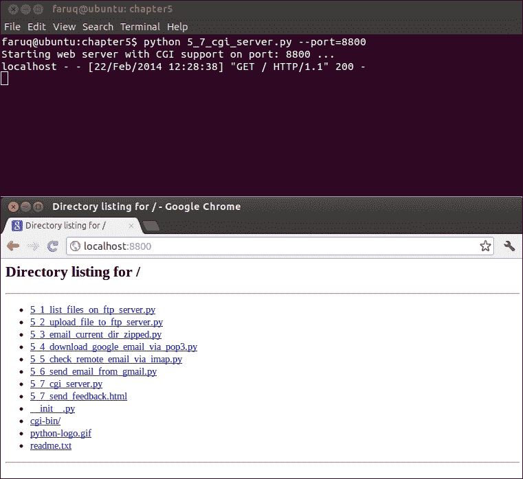
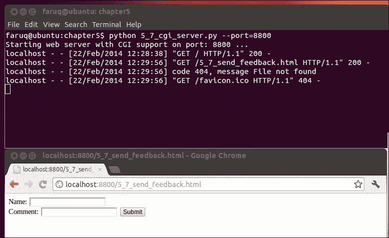
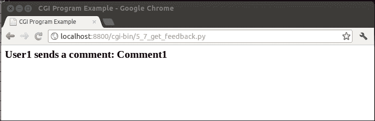

# 第五章：电子邮件协议、FTP 和 CGI 编程

在本章中，我们将介绍以下配方：

+   在远程 FTP 服务器上列出文件

+   将本地文件上传到远程 FTP 服务器

+   将当前工作目录作为压缩 ZIP 文件发送电子邮件

+   使用 POP3 下载您的 Google 电子邮件

+   使用 IMAP 检查您的远程电子邮件

+   通过 Gmail SMTP 服务器发送带附件的电子邮件

+   使用 CGI 为您的（基于 Python 的）Web 服务器编写留言簿

# 简介

本章通过 Python 配方探讨了 FTP、电子邮件和 CGI 通信协议。Python 是一种非常高效且友好的语言。使用 Python，您可以轻松编写简单的 FTP 操作，如文件下载和上传。

本章中有些有趣的配方，例如使用 Python 脚本操作您的 Google 电子邮件，也称为 Gmail 账户。您可以使用这些配方通过 IMAP、POP3 和 SMTP 协议检查、下载和发送电子邮件。在另一个配方中，带有 CGI 的 Web 服务器还演示了基本 CGI 操作，例如在您的 Web 应用程序中编写访客留言表单。

# 在远程 FTP 服务器上列出文件

您想列出官方 Linux 内核 FTP 站点 [ftp.kernel.org](http://ftp.kernel.org) 上可用的文件。您可以选择任何其他 FTP 站点来尝试此配方。

## 准备工作

如果您在一个具有用户账户的真实 FTP 站点上工作，您需要一个用户名和密码。然而，在这种情况下，您不需要用户名（和密码），因为您可以使用 Linux 内核的 FTP 站点匿名登录。

## 如何做...

我们可以使用 `ftplib` 库从我们选择的 FTP 站点获取文件。有关此库的详细文档，请参阅 [`docs.python.org/2/library/ftplib.html`](http://docs.python.org/2/library/ftplib.html)。

让我们看看如何使用 `ftplib` 获取一些文件。

列表 5.1 提供了一个简单的 FTP 连接测试，如下所示：

```py
#!/usr/bin/env python
# Python Network Programming Cookbook -- Chapter - 5
# This program is optimized for Python 2.7.
# It may run on any other version with/without modifications.

FTP_SERVER_URL = 'ftp.kernel.org'

import ftplib
def test_ftp_connection(path, username, email):
    #Open ftp connection
    ftp = ftplib.FTP(path, username, email)

   #List the files in the /pub directory
    ftp.cwd("/pub")
    print "File list at %s:" %path
    files = ftp.dir()
    print files

    ftp.quit()
if __name__ == '__main__':
    test_ftp_connection(path=FTP_SERVER_URL, username='anonymous',
                        email='nobody@nourl.com', 
                        )
```

此配方将列出 FTP 路径 `ftp.kernel.org/pub` 中存在的文件和文件夹。如果您运行此脚本，您将看到以下输出：

```py
$ python 5_1_list_files_on_ftp_server.py
File list at ftp.kernel.org:
drwxrwxr-x    6 ftp      ftp          4096 Dec 01  2011 dist
drwxr-xr-x   13 ftp      ftp          4096 Nov 16  2011 linux
drwxrwxr-x    3 ftp      ftp          4096 Sep 23  2008 media
drwxr-xr-x   17 ftp      ftp          4096 Jun 06  2012 scm
drwxrwxr-x    2 ftp      ftp          4096 Dec 01  2011 site
drwxr-xr-x   13 ftp      ftp          4096 Nov 27  2011 software
drwxr-xr-x    3 ftp      ftp          4096 Apr 30  2008 tools

```

## 它是如何工作的...

此配方使用 `ftplib` 创建与 [ftp.kernel.org](http://ftp.kernel.org) 的 FTP 客户端会话。`test_ftp_connection()` 函数接受 FTP 路径、用户名和电子邮件地址以连接到 FTP 服务器。

可以通过调用 `ftplib` 的 `FTP()` 函数并使用前面的连接凭证来创建 FTP 客户端会话。这返回一个客户端句柄，然后可以使用它来运行常用的 ftp 命令，例如更改工作目录的命令或 `cwd()`。`dir()` 方法返回目录列表。

调用 `ftp.quit()` 退出 FTP 会话是个好主意。

# 将本地文件上传到远程 FTP 服务器

您想将文件上传到 FTP 服务器。

## 准备工作

让我们设置一个本地 FTP 服务器。在 Unix/Linux 中，您可以使用以下命令安装 **wu-ftpd** 软件包：

```py
$ sudo apt-get install wu-ftpd

```

在 Windows 机器上，您可以安装 FileZilla FTP 服务器，可以从[`filezilla-project.org/download.php?type=server`](https://filezilla-project.org/download.php?type=server)下载。

您应该根据 FTP 服务器包的用户手册创建一个 FTP 用户账户。

您还希望将文件上传到 FTP 服务器。您可以将服务器地址、登录凭证和文件名作为脚本输入参数指定。您应该创建一个名为`readme.txt`的本地文件，并在其中输入任何文本。

## 如何操作...

使用以下脚本，让我们设置一个本地 FTP 服务器。在 Unix/Linux 系统中，您可以安装 wu-ftpd 包。然后，您可以上传文件到已登录用户的家目录。您可以将服务器地址、登录凭证和文件名作为脚本输入参数指定。

列表 5.2 给出了 FTP 上传示例，如下所示：

```py
#!/usr/bin/env python
# Python Network Programming Cookbook -- Chapter - 5
# This program is optimized for Python 2.7.
# It may run on any other version with/without modifications.

import os
import argparse
import ftplib

import getpass 
LOCAL_FTP_SERVER = 'localhost'
LOCAL_FILE = 'readme.txt'
def ftp_upload(ftp_server, username, password, file_name):
    print "Connecting to FTP server: %s" %ftp_server
    ftp = ftplib.FTP(ftp_server)
    print "Login to FTP server: user=%s" %username
    ftp.login(username, password)
    ext = os.path.splitext(file_name)[1]
    if ext in (".txt", ".htm", ".html"):
        ftp.storlines("STOR " + file_name, open(file_name))
    else:
        ftp.storbinary("STOR " + file_name, open(file_name, "rb"), 1024)
    print "Uploaded file: %s" %file_name

if __name__ == '__main__':
    parser = argparse.ArgumentParser(description='FTP Server Upload Example')
    parser.add_argument('--ftp-server', action="store", dest="ftp_server", default=LOCAL_FTP_SERVER)
    parser.add_argument('--file-name', action="store", dest="file_name", default=LOCAL_FILE)
    parser.add_argument('--username', action="store", dest="username", default=getpass.getuser())
    given_args = parser.parse_args() 
    ftp_server, file_name, username = given_args.ftp_server, given_args.file_name, given_args.username
    password = getpass.getpass(prompt="Enter you FTP password: ")
    ftp_upload(ftp_server, username, password, file_name)
```

如果您设置了一个本地 FTP 服务器并运行以下脚本，此脚本将登录到 FTP 服务器，然后上传文件。如果没有从命令行默认提供文件名参数，它将上传`readme.txt`文件。

```py
$ python 5_2_upload_file_to_ftp_server.py 
Enter your FTP password: 
Connecting to FTP server: localhost
Login to FTP server: user=faruq
Uploaded file: readme.txt

$ cat /home/faruq/readme.txt 
This file describes what to do with the .bz2 files you see elsewhere
on this site (ftp.kernel.org).

```

## 它是如何工作的...

在这个菜谱中，我们假设本地 FTP 服务器正在运行。或者，您也可以连接到远程 FTP 服务器。`ftp_upload()`方法使用 Python 的`ftplib`模块的`FTP()`函数创建 FTP 连接对象。使用`login()`方法，它将登录到服务器。

登录成功后，`ftp`对象使用`storlines()`或`storbinary()`方法发送 STOR 命令。第一种方法用于发送 ASCII 文本文件，如 HTML 或文本文件。后者方法用于二进制数据，如压缩存档。

将这些 FTP 方法包装在`try-catch`错误处理块中是一个好主意，这里为了简洁没有展示。

# 将当前工作目录作为压缩的 ZIP 文件发送电子邮件

将当前工作目录的内容作为压缩的 ZIP 存档发送可能很有趣。您可以使用这个方法快速与您的朋友分享文件。

## 准备工作

如果您的机器上没有安装任何邮件服务器，您需要安装一个本地邮件服务器，如`postfix`。在 Debian/Ubuntu 系统中，可以使用`apt-get`默认设置安装，如下所示：

```py
$ sudo apt-get install postfix

```

## 如何操作...

让我们先压缩当前目录，然后创建一个电子邮件消息。我们可以通过外部 SMTP 主机发送电子邮件消息，或者我们可以使用本地电子邮件服务器来完成这个任务。像其他菜谱一样，让我们从解析命令行输入中获取发件人和收件人信息。

列表 5.3 展示了如何将电子邮件文件夹转换为压缩的 ZIP 文件，如下所示：

```py
#!/usr/bin/env python
# Python Network Programming Cookbook -- Chapter - 5
# This program is optimized for Python 2.7.
# It may run on any other version with/without modifications.

import os
import argparse
import smtplib
import zipfile
import tempfile
from email import encoders
from email.mime.base import MIMEBase
from email.mime.multipart import MIMEMultipart    
def email_dir_zipped(sender, recipient):
    zf = tempfile.TemporaryFile(prefix='mail', suffix='.zip')
    zip = zipfile.ZipFile(zf, 'w')
    print "Zipping current dir: %s" %os.getcwd()
    for file_name in os.listdir(os.getcwd()):
        zip.write(file_name)
    zip.close()
    zf.seek(0)
    # Create the message
    print "Creating email message..."
    email_msg = MIMEMultipart()
    email_msg['Subject'] = 'File from path %s' %os.getcwd()
    email_msg['To'] = ', '.join(recipient)
    email_msg['From'] = sender
    email_msg.preamble = 'Testing email from Python.\n'
    msg = MIMEBase('application', 'zip')
    msg.set_payload(zf.read())
    encoders.encode_base64(msg)
    msg.add_header('Content-Disposition', 'attachment', 
                   filename=os.getcwd()[-1] + '.zip')
    email_msg.attach(msg)
    email_msg = email_msg.as_string()

    # send the message
    print "Sending email message..."
    smtp = None
    try:
        smtp = smtplib.SMTP('localhost')
        smtp.set_debuglevel(1)
        smtp.sendmail(sender, recipient, email_msg)
    except Exception, e:
        print "Error: %s" %str(e)
    finally:
        if smtp:
           smtp.close()

if __name__ == '__main__':
    parser = argparse.ArgumentParser(description='Email Example')
    parser.add_argument('--sender', action="store", dest="sender", default='you@you.com')
    parser.add_argument('--recipient', action="store", dest="recipient")
    given_args = parser.parse_args()
    email_dir_zipped(given_args.sender, given_args.recipient)
```

运行此菜谱将显示以下输出。额外的输出显示是因为我们启用了电子邮件调试级别。

```py
$ python 5_3_email_current_dir_zipped.py --recipient=faruq@localhost
Zipping current dir: /home/faruq/Dropbox/PacktPub/pynet-cookbook/pynetcookbook_code/chapter5
Creating email message...
Sending email message...
send: 'ehlo [127.0.0.1]\r\n'
reply: '250-debian6.debian2013.com\r\n'
reply: '250-PIPELINING\r\n'
reply: '250-SIZE 10240000\r\n'
reply: '250-VRFY\r\n'
reply: '250-ETRN\r\n'
reply: '250-STARTTLS\r\n'
reply: '250-ENHANCEDSTATUSCODES\r\n'
reply: '250-8BITMIME\r\n'
reply: '250 DSN\r\n'
reply: retcode (250); Msg: debian6.debian2013.com
PIPELINING
SIZE 10240000
VRFY
ETRN
STARTTLS
ENHANCEDSTATUSCODES
8BITMIME
DSN
send: 'mail FROM:<you@you.com> size=9141\r\n'
reply: '250 2.1.0 Ok\r\n'
reply: retcode (250); Msg: 2.1.0 Ok
send: 'rcpt TO:<faruq@localhost>\r\n'
reply: '250 2.1.5 Ok\r\n'
reply: retcode (250); Msg: 2.1.5 Ok
send: 'data\r\n'
reply: '354 End data with <CR><LF>.<CR><LF>\r\n'
reply: retcode (354); Msg: End data with <CR><LF>.<CR><LF>
data: (354, 'End data with <CR><LF>.<CR><LF>')
send: 'Content-Type: multipart/mixed; boundary="===============0388489101==...[TRUNCATED]
reply: '250 2.0.0 Ok: queued as 42D2F34A996\r\n'
reply: retcode (250); Msg: 2.0.0 Ok: queued as 42D2F34A996
data: (250, '2.0.0 Ok: queued as 42D2F34A996')

```

## 它是如何工作的...

我们使用了 Python 的`zipfile`、`smtplib`和`email`模块，通过`email_dir_zipped()`方法实现了将文件夹作为压缩存档发送电子邮件的目标。此方法接受两个参数：发件人和收件人的电子邮件地址以创建电子邮件消息。

要创建 ZIP 存档，我们使用`tempfile`模块的`TemporaryFile()`类创建一个临时文件。我们提供一个文件名前缀`mail`和后缀`.zip`。然后，我们通过传递临时文件作为参数，使用`ZipFile()`类初始化 ZIP 存档对象。稍后，我们使用 ZIP 对象的`write()`方法调用添加当前目录下的文件。

要发送电子邮件，我们使用`email.mime.multipart`模块中的`MIMEMultipart()`类创建一个多部分 MIME 消息。像我们通常的电子邮件消息一样，主题、收件人和发件人信息被添加到电子邮件头中。

我们使用`MIMEBase()`方法创建电子邮件附件。在这里，我们首先指定 application/ZIP 头信息，并在该消息对象上调用`set_payload()`。然后，为了正确编码消息，使用编码器模块中的`encode_base64()`方法。使用`add_header()`方法构建附件头信息也是很有帮助的。现在，我们的附件已经准备好通过`attach()`方法调用包含在主电子邮件消息中。

发送电子邮件需要您调用`smtplib`的`SMTP()`类实例。有一个`sendmail()`方法将利用操作系统提供的例程正确地发送电子邮件消息。其细节隐藏在幕后。然而，您可以通过启用调试选项来查看详细的交互，如本菜谱所示。

## 参考信息

+   关于 Python 库的更多信息可以在以下 URL 找到：[`docs.python.org/2/library/smtplib.html`](http://docs.python.org/2/library/smtplib.html)

# 使用 POP3 下载您的谷歌电子邮件

您希望通过 POP3 协议下载您的谷歌（或几乎任何其他电子邮件提供商的）电子邮件。

## 准备工作

要运行此菜谱，您应该有一个谷歌或任何其他服务提供商的电子邮件账户。

## 如何操作...

在这里，我们尝试从用户的谷歌电子邮件账户中下载第一封电子邮件。用户名从命令行提供，但密码是保密的，不会通过命令行传递。而是在脚本运行时输入，并保持从显示中隐藏。

列表 5.4 展示了如何通过`POP3`下载我们的谷歌电子邮件，如下所示：

```py
#!/usr/bin/env python
# Python Network Programming Cookbook -- Chapter - 5
# This program is optimized for Python 2.7.
# It may run on any other version with/without modifications.

import argparse
import getpass
import poplib
GOOGLE_POP3_SERVER = 'pop.googlemail.com'

def download_email(username): 
    mailbox = poplib.POP3_SSL(GOOGLE_POP3_SERVER, '995') 
    mailbox.user(username)
    password = getpass.getpass(prompt="Enter you Google password: ") 
    mailbox.pass_(password) 
    num_messages = len(mailbox.list()[1])
    print "Total emails: %s" %num_messages
    print "Getting last message" 
    for msg in mailbox.retr(num_messages)[1]:
        print msg
    mailbox.quit()

if __name__ == '__main__':
    parser = argparse.ArgumentParser(description='Email Download Example')
    parser.add_argument('--username', action="store", dest="username", default=getpass.getuser())
    given_args = parser.parse_args() 
    username = given_args.username
    download_email(username)
```

如果您运行此脚本，您将看到类似以下的一个输出。出于隐私考虑，消息已被截断。

```py
$ python 5_4_download_google_email_via_pop3.py --username=<USERNAME>
Enter your Google password: 
Total emails: 333
Getting last message
...[TRUNCATED]

```

## 工作原理...

此配方通过 POP3 下载用户的第一封 Google 邮件。`download_email()` 方法使用 Python 和 `poplib` 的 `POP3_SSL()` 类创建一个 `mailbox` 对象。我们将 Google POP3 服务器和端口号传递给类构造函数。然后，`mailbox` 对象通过调用 `user()` 方法设置用户账户。密码通过使用 `getpass` 模块的 `getpass()` 方法安全地从用户那里收集，然后传递给 `mailbox` 对象。`mailbox` 的 `list()` 方法以 Python 列表的形式给出电子邮件。

此脚本首先显示邮箱中存储的电子邮件数量，并使用 `retr()` 方法调用检索第一封消息。最后，在邮箱上调用 `quit()` 方法来清理连接是安全的。

# 使用 IMAP 检查您的远程电子邮件

除了使用 POP3，您还可以使用 IMAP 从您的 Google 账户检索电子邮件消息。在这种情况下，检索后消息不会被删除。

## 准备工作

要运行此配方，您应该有一个 Google 或其他服务提供商的电子邮件账户。

## 如何做到这一点...

让我们连接到您的 Google 电子邮件账户并读取第一封电子邮件消息。如果您不删除它，第一封电子邮件消息将是 Google 的欢迎消息。

列表 5.5 展示了如何使用 IMAP 检查 Google 邮件的方法：

```py
#!/usr/bin/env python
# Python Network Programming Cookbook -- Chapter – 5
# This program is optimized for Python 2.7.
# It may run on any other version with/without modifications.

import argparse
import getpass
import imaplib
GOOGLE_IMAP_SERVER = 'imap.googlemail.com'
def check_email(username): 
    mailbox = imaplib.IMAP4_SSL(GOOGLE_IMAP_SERVER, '993') 
    password = getpass.getpass(prompt="Enter you Google password: ") 
    mailbox.login(username, password)
    mailbox.select('Inbox')
    typ, data = mailbox.search(None, 'ALL')
    for num in data[0].split():
        typ, data = mailbox.fetch(num, '(RFC822)')

        print 'Message %s\n%s\n' % (num, data[0][1])
        break
    mailbox.close()
    mailbox.logout()
if __name__ == '__main__':
    parser = argparse.ArgumentParser(description='Email Download Example')
    parser.add_argument('--username', action="store", dest="username", default=getpass.getuser())
    given_args = parser.parse_args() 
    username = given_args.username
    check_email(username)
```

如果您运行此脚本，这将显示以下输出。为了移除数据的私人部分，我们截断了一些用户数据。

```py
$$ python 5_5_check_remote_email_via_imap.py --username=<USER_NAME>
Enter your Google password: 
Message 1
Received: by 10.140.142.16; Sat, 17 Nov 2007 09:26:31 -0800 (PST)
Message-ID: <...>@mail.gmail.com>
Date: Sat, 17 Nov 2007 09:26:31 -0800
From: "Gmail Team" <mail-noreply@google.com>
To: "<User Full Name>" <USER_NAME>@gmail.com>
Subject: Gmail is different. Here's what you need to know.
MIME-Version: 1.0
Content-Type: multipart/alternative; 
 boundary="----=_Part_7453_30339499.1195320391988"

------=_Part_7453_30339499.1195320391988
Content-Type: text/plain; charset=ISO-8859-1
Content-Transfer-Encoding: 7bit
Content-Disposition: inline

Messages that are easy to find, an inbox that organizes itself, great
spam-fighting tools and built-in chat. Sound cool? Welcome to Gmail.

To get started, you may want to:
[TRUNCATED]

```

## 它是如何工作的...

前面的脚本从命令行获取 Google 用户名并调用 `check_email()` 函数。此函数使用 `imaplib` 的 `IMAP4_SSL()` 类创建一个 IMAP 邮箱，该类使用 Google 的 IMAP 服务器和默认端口进行初始化。

然后，此函数使用 `getpass` 模块的 `getpass()` 方法捕获的密码登录邮箱。通过在 `mailbox` 对象上调用 `select()` 方法选择收件箱文件夹。

`mailbox` 对象有许多有用的方法。其中两个是 `search()` 和 `fetch()`，它们用于获取第一封电子邮件。最后，在 `mailbox` 对象上调用 `close()` 和 `logout()` 方法来结束 IMAP 连接会更安全。

# 通过 Gmail SMTP 服务器发送带附件的电子邮件

您想从您的 Google 电子邮件账户向另一个账户发送电子邮件。您还需要将文件附加到这条消息上。

## 准备工作

要运行此配方，您应该有一个 Google 或其他服务提供商的电子邮件账户。

## 如何做到这一点...

我们可以创建一个电子邮件消息，并将 Python 的 `python-logo.gif` 文件附加到电子邮件消息中。然后，这条消息从一个 Google 账户发送到另一个账户。

列表 4.6 展示了如何从您的 Google 账户发送电子邮件的方法：

```py
#!/usr/bin/env python
# Python Network Programming Cookbook -- Chapter - 5
# This program is optimized for Python 2.7.
# It may run on any other version with/without modifications.

import argparse
import os
import getpass
import re
import sys
import smtplib

from email.mime.image import MIMEImage
from email.mime.multipart import MIMEMultipart
from email.mime.text import MIMEText

SMTP_SERVER = 'smtp.gmail.com'
SMTP_PORT = 587

def send_email(sender, recipient):
    """ Send email message """
    msg = MIMEMultipart()
    msg['Subject'] = 'Python Email Test'
    msg['To'] = recipient
    msg['From'] = sender
    subject = 'Python email Test'
    message = 'Images attached.'
    # attach image files
    files = os.listdir(os.getcwd())
    gifsearch = re.compile(".gif", re.IGNORECASE)
    files = filter(gifsearch.search, files)
    for filename in files:
        path = os.path.join(os.getcwd(), filename)
        if not os.path.isfile(path):
            continue
        img = MIMEImage(open(path, 'rb').read(), _subtype="gif")

        img.add_header('Content-Disposition', 'attachment', filename=filename)
        msg.attach(img)

    part = MIMEText('text', "plain")
    part.set_payload(message)
    msg.attach(part)

    # create smtp session
    session = smtplib.SMTP(SMTP_SERVER, SMTP_PORT)
    session.ehlo()
    session.starttls()
    session.ehlo
    password = getpass.getpass(prompt="Enter you Google password: ") 
    session.login(sender, password)
    session.sendmail(sender, recipient, msg.as_string())
    print "Email sent."
    session.quit()

if __name__ == '__main__':
    parser = argparse.ArgumentParser(description='Email Sending Example')
    parser.add_argument('--sender', action="store", dest="sender")
    parser.add_argument('--recipient', action="store", dest="recipient")
    given_args = parser.parse_args()
    send_email(given_args.sender, given_args.recipient)
```

运行以下脚本，如果你正确提供了你的 Google 账户详细信息，将输出发送电子邮件到任何电子邮件地址的成功信息。运行此脚本后，你可以检查收件人的电子邮件账户以验证电子邮件是否已实际发送。

```py
$ python 5_6_send_email_from_gmail.py --sender=<USERNAME>@gmail.com –recipient=<USER>@<ANOTHER_COMPANY.com>
Enter you Google password: 
Email sent.

```

## 它是如何工作的...

在这个食谱中，在 `send_email()` 函数中创建了一个电子邮件消息。此函数提供了一个 Google 账户，电子邮件消息将从该账户发送。通过调用 `MIMEMultipart()` 类创建消息头对象 `msg`，然后在其上添加主题、收件人和发件人信息。

Python 的正则表达式处理模块用于过滤当前路径上的 `.gif` 图像。然后，使用 `email.mime.image` 模块的 `MIMEImage()` 方法创建图像附件对象 `img`。向此对象添加正确的图像头，最后，使用之前创建的 `msg` 对象将图像附加。我们可以在 `for` 循环中附加多个图像文件，如本食谱所示。我们也可以以类似的方式附加纯文本附件。

要发送电子邮件消息，我们创建一个 SMTP 会话。我们在这个会话对象上调用一些测试方法，例如 `ehlo()` 或 `starttls()`。然后，使用用户名和密码登录到 Google SMTP 服务器，并调用 `sendmail()` 方法发送电子邮件。

# 为你的（基于 Python 的）Web 服务器编写 CGI guestbook

**通用网关接口** (**CGI**) 是 Web 编程中的一个标准，通过它可以使用自定义脚本生成 Web 服务器输出。你希望捕获用户浏览器中的 HTML 表单输入，将其重定向到另一个页面，并确认用户操作。

## 如何操作...

我们首先需要运行一个支持 CGI 脚本的 Web 服务器。我们将我们的 Python CGI 脚本放在一个 `cgi-bin/` 子目录中，然后访问包含反馈表单的 HTML 页面。提交此表单后，我们的 Web 服务器将表单数据发送到 CGI 脚本，我们将看到该脚本产生的输出。

列表 5.7 显示了 Python Web 服务器如何支持 CGI：

```py
#!/usr/bin/env python
# Python Network Programming Cookbook -- Chapter - 5
# This program is optimized for Python 2.7.
# It may run on any other version with/without modifications.

import os
import cgi
import argparse
import BaseHTTPServer
import CGIHTTPServer
import cgitb 
cgitb.enable()  ## enable CGI error reporting
def web_server(port):
    server = BaseHTTPServer.HTTPServer
    handler = CGIHTTPServer.CGIHTTPRequestHandler #RequestsHandler
    server_address = ("", port)
    handler.cgi_directories = ["/cgi-bin", ]
    httpd = server(server_address, handler)
    print "Starting web server with CGI support on port: %s ..." %port
    httpd.serve_forever()
if __name__ == '__main__':
    parser = argparse.ArgumentParser(description='CGI Server Example')
    parser.add_argument('--port', action="store", dest="port", type=int, required=True)
    given_args = parser.parse_args()
    web_server(given_args.port)
```

以下截图显示了启用 CGI 的 Web 服务器正在提供内容：



如果你运行这个食谱，你将看到以下输出：

```py
$ python 5_7_cgi_server.py --port=8800
Starting web server with CGI support on port: 8800 ...
localhost - - [19/May/2013 18:40:22] "GET / HTTP/1.1" 200 -

```

现在，你需要从你的浏览器访问 `http://localhost:8800/5_7_send_feedback.html`。

你将看到一个输入表单。我们假设你向此表单提供以下输入：

```py
Name:  User1
Comment: Comment1

```

以下截图显示了在 Web 表单中输入的用户评论：



然后，你的浏览器将被重定向到 `http://localhost:8800/cgi-bin/5_7_get_feedback.py`，在那里你可以看到以下输出：

```py
User1 sends a comment: Comment1

```

用户评论在浏览器中显示：



## 它是如何工作的...

我们使用了一个基本的 HTTP 服务器设置，它可以处理 CGI 请求。Python 在 `BaseHTTPServer` 和 `CGIHTTPserver` 模块中提供了这些接口。

处理器配置为使用 `/cgi-bin` 路径来启动 CGI 脚本。不能使用其他路径来运行 CGI 脚本。

位于 `5_7_send_feedback.html` 的 HTML 反馈表单显示了一个非常基础的 HTML 表单，其中包含以下代码：

```py
<html>
   <body>
         <form action="/cgi-bin/5_7_get_feedback.py" method="post">
                Name: <input type="text" name="Name">  <br />
                Comment: <input type="text" name="Comment" />
                <input type="submit" value="Submit" />
         </form>
   </body>
</html>
```

注意，表单方法为 `POST`，并且操作设置为 `/cgi-bin/5_7_get_feedback.py` 文件。该文件的内容如下：

```py
#!/usr/bin/env python
# Python Network Programming Cookbook -- Chapter - 5
# This program requires Python 2.7 or any later version
import cgi
import cgitb 
# Create instance of FieldStorage 
form = cgi.FieldStorage() 
# Get data from fields
name = form.getvalue('Name')
comment  = form.getvalue('Comment')
print "Content-type:text/html\r\n\r\n"
print "<html>"
print "<head>"
print "<title>CGI Program Example </title>"
print "</head>"
print "<body>"
print "<h2> %s sends a comment: %s</h2>" % (name, comment)
print "</body>"
print "</html>"

```

在这个 CGI 脚本中，从 `cgilib` 调用了 `FieldStorage()` 方法。这返回一个表单对象以处理 HTML 表单输入。这里解析了两个输入（`name` 和 `comment`），使用的是 `getvalue()` 方法。最后，脚本通过回显一行信息来确认用户输入，表示用户 *x* 已发送评论。
