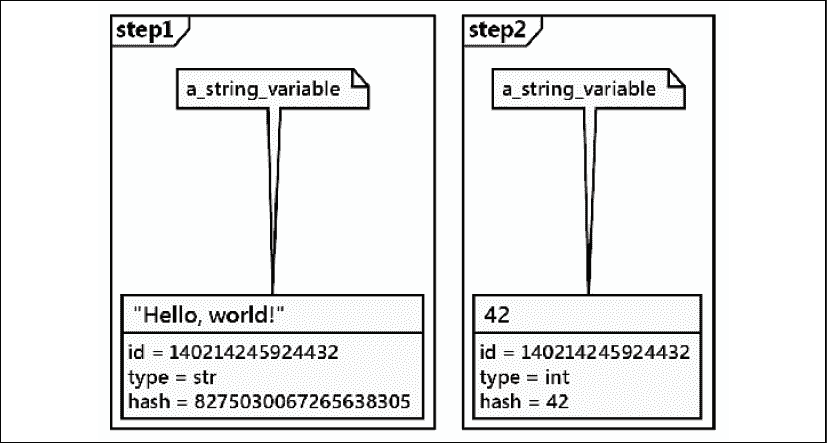
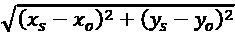
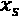
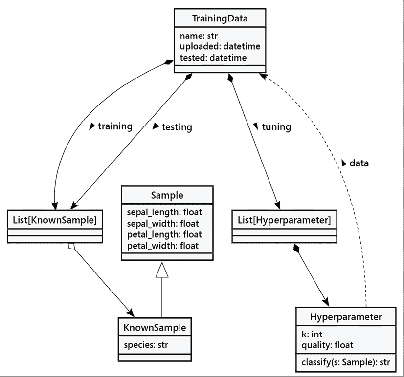
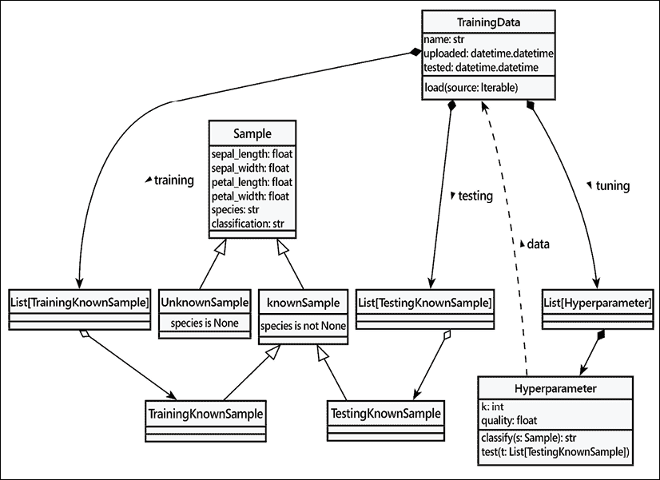

# 第二章：Python 中的对象

我们手头有一个设计方案，并准备好将其转化为一个可工作的程序！当然，事情通常不会这么顺利。本书中我们将看到关于良好软件设计的例子和提示，但我们的重点是面向对象编程。因此，让我们来看看允许我们创建面向对象软件的 Python 语法。

完成本章后，我们将了解以下内容：

+   Python 的类型提示

+   在 Python 中创建类和实例化对象

+   将课程组织成包和模块

+   如何建议人们不要破坏对象的数据，从而破坏内部状态

+   使用来自 Python 包索引 PyPI 的第三方包

本章将继续我们的案例研究，转向一些类的设计。

# 介绍类型提示

在我们深入探讨创建类之前，我们需要稍微谈谈什么是类以及我们如何确保正确地使用它。这里的中心思想是，Python 中的万物皆对象。

当我们编写像 `"Hello, world!"` 或 `42` 这样的字面值时，我们实际上是在创建内置类的实例。我们可以启动交互式 Python，并使用定义这些对象属性的类上的内置 `type()` 函数：

```py
>>> type("Hello, world!")
<class 'str'>
>>> type(42)
<class 'int'> 
```

面向对象编程的目的是通过对象的交互来解决一个问题。当我们编写 `6*7` 时，这两个对象的乘法操作是由内置的 `int` 类的方法处理的。对于更复杂的行为，我们通常会需要编写独特的新类。

这里是 Python 对象工作原理的前两条核心规则：

+   Python 中的一切都是对象

+   每个对象都通过至少属于一个类来定义

这些规则有许多有趣的后果。我们使用`class`语句编写的类定义创建了一个新的`type`类对象。当我们创建一个类的**实例**时，类对象将用于创建和初始化实例对象。

类和类型之间的区别是什么？`class`语句让我们能够定义新的类型。因为`class`语句是我们所使用的，所以我们将它们在整个文本中称为类。参见 Eli Bendersky 的*Python 对象、类型、类和实例 - 术语表*：[`eli.thegreenplace.net/2012/03/30/python-objects-types-classes-and-instances-a-glossary`](https://eli.thegreenplace.net/2012/03/30/python-objects-types-classes-and-instances-a-glossary)中的这段有用引言：

> “类”和“类型”这两个术语是两个指代同一概念的名称的例子。

我们将遵循常规用法，并将这些注释称为**类型提示**。

这里还有另一个重要的规则：

+   变量是对一个对象的引用。想象一下一张黄色的便利贴，上面写着名字，贴在某个东西上。

这看起来似乎并不惊天动地，但实际上相当酷。这意味着类型信息——一个对象是什么——是由与该对象关联的类（们）定义的。这种类型信息以任何方式都不附加到*变量*上。这导致以下代码虽然有效但非常令人困惑的 Python 代码：

```py
>>> a_string_variable = "Hello, world!"
>>> type(a_string_variable)
<class 'str'>
>>> a_string_variable = 42
>>> type(a_string_variable)
<class 'int'> 
```

我们使用内置类`str`创建了一个对象，并将一个长名称`a_string_variable`分配给该对象。然后，我们使用另一个内置类`int`创建了一个对象，并将相同的名称分配给这个对象。（之前的字符串对象不再有任何引用，因此不再存在。）

这里展示了两个步骤，并排显示，说明了变量是如何从一个对象移动到另一个对象的：



图 2.1：变量名和对象

各种属性都是对象的一部分，而不是变量的。当我们使用 `type()` 函数检查变量的类型时，我们看到的是变量当前引用的对象的类型。变量本身并没有类型；它不过是一个名字。同样地，请求一个变量的 `id()` 会显示变量所引用的对象的 ID。因此，如果我们把名字分配给一个整数对象，那么名字 `a_string_variable` 就有点误导了。

## 类型检查

让我们将对象与类型之间的关系再向前推进一步，并看看这些规则的一些更多后果。下面是一个函数定义：

```py
>>> def odd(n):
...     return n % 2 != 0
>>> odd(3)
True
>>> odd(4)
False 
```

此函数对一个参数变量`n`进行少量计算。它计算除法后的余数，即模数。如果我们用 2 除以一个奇数，我们会剩下 1。如果我们用 2 除以一个偶数，我们会剩下 0。此函数对所有奇数返回一个真值。

当我们未能提供一个数字时会发生什么？嗯，让我们试一试看看（这是学习 Python 的一种常见方法！）在交互式提示符中输入代码，我们会得到类似以下的内容：

```py
>>> odd("Hello, world!")
Traceback (most recent call last):
  File "<doctestexamples.md[9]>", line 1, in <module>
odd("Hello, world!")
  File "<doctestexamples.md[6]>", line 2, in odd
    return n % 2 != 0
TypeError: not all arguments converted during string formatting 
```

这是由 Python 的超级灵活规则产生的一个重要后果：没有任何东西阻止我们做些愚蠢的事情，这可能会引发异常。这是一个重要的提示：

Python 并不允许我们尝试使用对象不存在的函数。

在我们的例子中，`str` 类提供的 `%` 操作符与 `int` 类提供的 `%` 操作符工作方式不同，会引发异常。对于字符串，`%` 操作符并不常用，但它可以进行插值：`"a=%d" % 113` 计算出的字符串是 `'a=113'`；如果左侧没有像 `%d` 这样的格式指定符，则异常是 `TypeError`。对于整数，它是除法的余数：`355 % 113` 返回一个整数，`16`。

这种灵活性反映了一种明确的权衡，即为了方便使用而牺牲了复杂地预防潜在问题的能力。这使得一个人在使用变量名时几乎无需动用太多心智资源。

Python 的内部运算符会检查操作数是否符合运算符的要求。然而，我们编写的函数定义中并不包括任何运行时类型检查。我们也不想添加运行时类型检查的代码。相反，我们使用工具作为测试的一部分来检查代码。我们可以提供称为 **类型提示** 的注释，并使用工具检查我们的代码在类型提示之间的一致性。

首先，我们将查看注释。在几种情况下，我们可以在变量名后面跟一个冒号 `:`, 然后是一个类型名。我们可以在函数（和方法）的参数中这样做。我们也可以在赋值语句中这样做。此外，我们还可以在函数（或类方法）定义中添加 `->` 语法来解释预期的返回类型。

这就是类型提示的样式：

```py
>>> def odd(n: int) -> bool:
...     return n % 2 != 0 
```

我们为我们的`odd()`小函数定义添加了两个类型提示。我们指定了`n`参数的值应该是整数。我们还指定了结果将是布尔类型两个值之一。

虽然这些提示会消耗一些存储空间，但它们对运行时没有影响。Python 会礼貌地忽略这些提示；这意味着它们是可选的。然而，阅读你代码的人却会非常高兴看到它们。它们是向读者传达你意图的绝佳方式。在你学习时可以省略它们，但当你回头扩展之前所写的内容时，你会非常喜爱它们。

**mypy** 工具通常用于检查提示的一致性。它不是 Python 的内置工具，需要单独下载和安装。我们将在本章的 *第三方库* 部分后面讨论虚拟环境和工具的安装。目前，如果您使用 **conda 工具**，可以使用 `python -m pip install mypy` 或 `conda install mypy`。

假设我们有一个文件，名为 `bad_hints.py`，位于 `src` 目录中，其中包含这两个函数和一些调用 `main()` 函数的代码行：

```py
def odd(n: int) -> bool:
    return n % 2 != 0
def main():
    print(odd("Hello, world!"))
if __name__ == "__main__":
    main() 
```

当我们在操作系统的终端提示符下运行`mypy`命令时：

```py
% mypy –strict src/bad_hints.py 
```

**mypy** 工具将发现一系列潜在问题，包括至少以下这些：

```py
src/bad_hints.py:12: error: Function is missing a return type annotation
src/bad_hints.py:12: note: Use "-> None" if function does not return a value
src/bad_hints.py:13: error: Argument 1 to "odd" has incompatible type "str"; expected "int" 
```

`def main():`语句位于我们示例的**第 12 行**，因为我们的文件中有一堆未在上文显示的注释。对于你的版本，错误可能出现在**第 1 行**。以下是两个问题：

+   `main()` 函数没有返回类型；**mypy** 建议包含 `-> None` 以使返回值的缺失完全明确。

+   更重要的是*第 13 行*：代码将尝试使用一个`str`值来评估`odd()`函数。这与`odd()`函数的类型提示不匹配，并表明了另一个可能存在的错误。

本书中的大多数示例都将包含类型提示。我们认为它们总是有帮助的，尤其是在教学环境中，即使它们是可选的。因为大多数 Python 代码在类型方面是通用的，所以有一些情况下，Python 的行为难以通过简洁、富有表现力的提示来描述。在这本书中，我们将避免这些边缘情况。

Python 增强提案（PEP）585 涵盖了某些新的语言特性，以使类型提示变得更加简单。我们使用**mypy**版本 0.812 来测试本书中的所有示例。任何较旧版本都将遇到一些较新语法和注解技术的兼容性问题。

现在我们已经讨论了如何使用类型提示来描述参数和属性，接下来让我们实际构建一些类。

# 创建 Python 类

我们不需要写很多 Python 代码就能意识到 Python 是一种非常*简洁*的语言。当我们想要做某事时，我们只需去做，无需设置一大堆先决代码。你可能已经看到的 Python 中无处不在的*hello world*，仅有一行代码。

同样地，Python 3 中最简单的类看起来是这样的：

```py
class MyFirstClass: 
    pass 
```

这就是我们的第一个面向对象程序！类的定义从`class`关键字开始。之后是一个名称（由我们选择），用于标识这个类，并以冒号结束。

类名必须遵循标准的 Python 变量命名规则（它必须以字母或下划线开头，并且只能由字母、下划线或数字组成）。此外，Python 风格指南（在网络上搜索 *PEP 8*）建议使用 PEP 8 所称的 **CapWords** 语法来命名类（以大写字母开头；任何后续单词也应以大写字母开头）。

类定义行后面跟着类的内容，缩进。与其他 Python 构造一样，缩进用于界定类，而不是大括号、关键字或括号，正如许多其他语言所使用的。此外，根据样式指南，除非有充分的理由不这样做（例如，与使用制表符缩进的他人的代码兼容），否则请使用四个空格进行缩进。

由于我们的第一节课实际上并没有添加任何数据或行为，所以我们只需在第二行使用`pass`关键字作为占位符，以表明不需要采取任何进一步的操作。

我们可能会认为对于这个最基本的类，我们能够做的事情并不多，但它确实允许我们实例化该类的对象。我们可以将这个类加载到 Python 3 解释器中，这样我们就可以与之进行交互式操作。为此，将前面提到的类定义保存到一个名为 `first_class.py` 的文件中，然后运行 `python -i first_class.py` 命令。`-i` 参数告诉 Python 在运行代码后进入交互式解释器。以下解释器会话展示了与这个类的基本交互：

```py
>>> a = MyFirstClass()
>>> b = MyFirstClass()
>>> print(a)
<__main__.MyFirstClass object at 0xb7b7faec>
>>> print(b)
<__main__.MyFirstClass object at 0xb7b7fbac> 
```

这段代码从新类中实例化了两个对象，将对象变量命名为`a`和`b`。创建类的实例只需输入类名，然后跟上一对括号。这看起来很像函数调用；**调用**一个类将创建一个新的对象。当打印时，这两个对象会告诉我们它们属于哪个类以及它们居住在哪个内存地址。在 Python 代码中，内存地址并不常用，但在这里，它们展示了涉及的是两个不同的对象。

我们可以通过使用`is`运算符来看到它们是不同的对象：

```py
>>> a is b
False 
```

这有助于在我们创建了一堆对象并为这些对象分配了不同的变量名时减少混淆。

## 添加属性

现在，我们有一个基本的类，但它相当无用。它不包含任何数据，也不做任何事情。我们该如何给一个特定的对象分配属性？

事实上，在类定义中我们不需要做任何特殊操作就能添加属性。我们可以使用点符号在实例化的对象上设置任意属性。以下是一个示例：

```py
class Point: 
    pass 
p1 = Point() 
p2 = Point() 
p1.x = 5 
p1.y = 4 
p2.x = 3 
p2.y = 6 
print(p1.x, p1.y) 
print(p2.x, p2.y) 
```

如果我们运行这段代码，最后的两个`print`语句会告诉我们两个对象上的新属性值：

```py
5 4
3 6 
```

这段代码创建了一个空的`Point`类，没有数据或行为。然后，它创建了该类的两个实例，并将每个实例的`x`和`y`坐标分配给它们，以标识二维空间中的一个点。要为一个对象的属性赋值，我们只需使用`<object>.<attribute> = <value>`语法。这有时被称为**点符号**。值可以是任何东西：Python 原语、内置数据类型或另一个对象。甚至可以是一个函数或另一个类！

创建这样的属性会让 **mypy** 工具感到困惑。在 `Point` 类定义中包含提示信息并没有简单的方法。我们可以在赋值语句中包含提示，例如：`p1.x: float = 5`。一般来说，在类型提示和属性方面有一个好得多的方法，我们将在本章后面的 *初始化对象* 部分进行探讨。不过，首先，我们将向我们的类定义中添加行为。

## 让它做些事情

现在，拥有具有属性的实体是很好的，但面向对象编程真正关注的是实体之间的交互。我们感兴趣的是调用那些导致属性发生变化的行为。我们有了数据；现在是为我们的类添加行为的时候了。

让我们在`Point`类上模拟几个动作。我们可以从一个名为`reset`的方法开始，该方法将点移动到原点（原点是`x`和`y`都为零的位置）。这是一个很好的入门动作，因为它不需要任何参数：

```py
class Point: 
    def reset(self): 
        self.x = 0 
        self.y = 0 
p = Point() 
p.reset() 
print(p.x, p.y) 
```

这个`print`语句显示了属性上的两个零：

```py
0 0 
```

在 Python 中，方法与函数的格式相同。它以`def`关键字开头，后面跟一个空格，然后是方法名。接着是一组括号，包含参数列表（我们将在稍后讨论这个`self`参数，有时也称为实例变量），并以冒号结束。下一行缩进以包含方法内的语句。这些语句可以是任意操作对象本身和任何传入参数的 Python 代码，正如方法所适合的那样。

我们在`reset()`方法中省略了类型提示，因为这并不是最常用于提示的地方。我们将在*初始化对象*部分探讨最佳提示位置。首先，我们将更详细地看看这些实例变量，以及`self`变量是如何工作的。

### 与自己对话

在类外部的类方法和函数在语法上的一个区别是，方法有一个必需的参数。这个参数传统上被命名为 `self`；我从未见过有 Python 程序员为这个变量使用其他名称（惯例是非常强大的东西）。然而，技术上并没有阻止你将其命名为 `this` 或甚至 `Martha`，但最好还是承认 Python 社区在 PEP 8 中编码的社会压力，并坚持使用 `self`。

方法中的`self`参数是对正在调用该方法的对象的引用。该对象是类的实例，这有时被称为实例变量。

我们可以通过这个变量访问那个对象的属性和方法。这正是我们在`reset`方法内部设置`self`对象的`x`和`y`属性时所做的事情。

在这次讨论中请注意区分**类**和**对象**的区别。我们可以把**方法**看作是附加到类上的一个函数。`self`参数指的是类的特定实例。当你对两个不同的对象调用方法时，你实际上是两次调用相同的方法，但传递了两个不同的**对象**作为`self`参数。

注意到当我们调用`p.reset()`方法时，我们并没有显式地将`self`参数传递给它。Python 会自动为我们处理这部分。它知道我们正在调用`p`对象上的方法，因此它会自动将那个对象`p`传递给`Point`类的方法。

对于一些人来说，可以将一种方法想象成一个恰好是某个类一部分的函数。我们不必在对象上调用该方法，而可以像在类中定义的那样调用该函数，明确地将我们的对象作为`self`参数传递：

```py
>>> p = Point() 
>>> Point.reset(p) 
>>> print(p.x, p.y) 
```

输出与上一个示例相同，因为内部发生的是完全相同的过程。这并不是一个好的编程实践，但它可以帮助你巩固对`self`参数的理解。

如果我们在类定义中忘记包含`self`参数会发生什么？Python 会抛出一个错误信息，如下所示：

```py
>>> class Point:
...     def reset():
...         pass
...
>>> p = Point()
>>> p.reset()
Traceback (most recent call last):
  File "<stdin>", line 1, in <module>
TypeError: reset() takes 0 positional arguments but 1 was given 
```

错误信息不如它本可以那么清晰（“嘿，傻瓜，你忘记在方法定义中使用`self`参数了”可以提供更多信息）。只需记住，当你看到指示缺少参数的错误信息时，首先要检查的是是否在方法定义中忘记了`self`参数。

### 更多论点

我们如何向一个方法传递多个参数？让我们添加一个新的方法，允许我们将一个点移动到任意位置，而不仅仅是原点。我们还可以包括一个方法，该方法接受另一个`Point`对象作为输入，并返回它们之间的距离：

```py
import math
class Point:
    def move(self, x: float, y: float) -> None:
        self.x = x
        self.y = y
    def reset(self) -> None:
        self.move(0, 0)
    def calculate_distance(self, other: "Point") -> float:
        return math.hypot(self.x - other.x, self.y - other.y) 
```

我们定义了一个具有两个属性`x`和`y`以及三个独立方法`move()`、`reset()`和`calculate_distance()`的类。

`move()` 方法接受两个参数，`x` 和 `y`，并将这些值设置在 `self` 对象上。`reset()` 方法调用 `move()` 方法，因为重置实际上是将对象移动到特定的已知位置。

`calculate_distance()` 方法计算两点之间的欧几里得距离。（还有许多其他看待距离的方法。在 *第三章*，*当物体相似时* 的案例研究中，我们将探讨一些替代方案。）目前，我们希望你能理解数学原理。定义是 ，即 `math.hypot()` 函数。在 Python 中我们使用 `self.x`，但数学家们通常更喜欢写成 。

这里是一个使用此类定义的示例。这展示了如何带参数调用一个方法：将参数放在括号内，并使用相同的点符号来访问实例中的方法名。我们只是随机选取了一些位置来测试这些方法。测试代码会调用每个方法，并将结果打印到控制台：

```py
>>> point1 = Point()
>>> point2 = Point()
>>> point1.reset()
>>> point2.move(5, 0)
>>> print(point2.calculate_distance(point1))
5.0
>>> assert point2.calculate_distance(point1) == point1.calculate_distance(
...    point2
... )
>>> point1.move(3, 4)
>>> print(point1.calculate_distance(point2))
4.47213595499958
>>> print(point1.calculate_distance(point1))
0.0 
```

`assert`语句是一个出色的测试工具；如果`assert`后面的表达式评估为`False`（或零、空或`None`），程序将退出。在这种情况下，我们使用它来确保无论哪个点调用另一个点的`calculate_distance()`方法，距离都是相同的。在*第十三章*，*面向对象程序的测试*中，我们将看到更多`assert`的使用，我们将编写更严格的测试。

## 初始化对象

如果我们没有明确设置我们的`Point`对象的`x`和`y`位置，无论是使用`move`方法还是直接访问它们，我们将得到一个没有实际位置的损坏的`Point`对象。当我们尝试访问它时会发生什么？

好吧，让我们试一试看看。*试一试看看*是 Python 学习中的一个极其有用的工具。打开你的交互式解释器并开始输入。毕竟，使用交互式提示符是我们用来编写这本书的工具之一。

以下交互式会话展示了如果我们尝试访问一个缺失的属性会发生什么。如果您将前面的示例保存为文件或正在使用书中提供的示例，您可以使用`python -i more_arguments.py`命令将其加载到 Python 解释器中：

```py
>>> point = Point()
>>> point.x = 5
>>> print(point.x)
5
>>> print(point.y)
Traceback (most recent call last):
  File "<stdin>", line 1, in <module>
AttributeError: 'Point' object has no attribute 'y' 
```

好吧，至少它抛出了一个有用的异常。我们将在*第四章*，*预料之外*中详细讲解异常。你可能之前见过它们（尤其是无处不在的`SyntaxError`，这意味着你输入了错误的内容！）。在这个阶段，只需意识到这意味着出了点问题。

输出对于调试很有用。在交互式解释器中，它告诉我们错误发生在*第 1 行*，这在某种程度上是正确的（在交互会话中，每次只执行一条语句）。如果我们在一个文件中运行脚本，它将告诉我们确切的行号，这使得找到有问题的代码变得容易。此外，它还告诉我们错误是`AttributeError`，并给出有用的信息，告诉我们这个错误意味着什么。

我们可以捕捉并从这种错误中恢复，但在这个情况下，感觉我们应该指定某种默认值。也许每个新对象都应该默认调用`reset()`，或者如果我们能强制用户在创建对象时告诉我们那些位置应该是什么，那会更好。

有趣的是，**mypy** 无法确定 `y` 是否应该是 `Point` 对象的属性。属性按定义是动态的，因此不存在一个简单的列表是类定义的一部分。然而，Python 有一些广泛遵循的约定，可以帮助命名预期的属性集。

大多数面向对象的编程语言都有**构造函数**的概念，这是一种在对象创建时创建和初始化对象的特殊方法。Python 稍有不同；它有一个构造函数和一个初始化器。构造函数方法 `__new__()` 通常很少使用，除非你在做非常特殊的事情。因此，我们将从更常见的初始化方法 `__init__()` 开始我们的讨论。

Python 的初始化方法与任何其他方法相同，只是它有一个特殊的名称，`__init__`。前后的双下划线表示这是一个特殊的方法，Python 解释器会将其视为特殊情况。

永远不要用前后双下划线命名你自己的方法。这可能在今天的 Python 中没有任何意义，但总有这样的可能性，即 Python 的设计者将来会添加一个具有特殊目的的函数，其名称与你的方法相同。当他们这样做的时候，你的代码将会出错。

让我们在`Point`类中添加一个初始化函数，该函数要求用户在实例化`Point`对象时提供`x`和`y`坐标：

```py
class Point:
    def __init__(self, x: float, y: float) -> None:
        self.move(x, y)
    def move(self, x: float, y: float) -> None:
        self.x = x
        self.y = y
    def reset(self) -> None:
        self.move(0, 0)
    def calculate_distance(self, other: "Point") -> float:
        return math.hypot(self.x - other.x, self.y - other.y) 
```

构建一个 `Point` 实例现在看起来是这样的：

```py
point = Point(3, 5) 
print(point.x, point.y) 
```

现在，我们的`Point`对象绝不能没有`x`和`y`坐标！如果我们尝试构建一个没有包含适当初始化参数的`Point`实例，它将失败并显示一个类似于我们之前忘记在方法定义中包含`self`参数时收到的`not enough arguments`错误。

大多数情况下，我们将初始化语句放在一个`__init__()`函数中。确保所有属性在`__init__()`方法中初始化非常重要。这样做有助于**mypy**工具，因为它在一个明显的地方提供了所有属性。这也帮助了阅读你代码的人；它节省了他们阅读整个应用程序以找到在类定义外部设置的神秘属性的时间。

虽然它们是可选的，但通常在方法参数和结果值上包含类型注解是有帮助的。在每个参数名称之后，我们都包括了每个值的预期类型。在定义的末尾，我们包括了两个字符的`->`运算符和由方法返回的类型。

## 类型提示和默认值

如我们之前多次提到的，提示（hints）是可选的。它们在运行时不会做任何事情。然而，有一些工具可以检查提示以确保一致性。**mypy**工具被广泛用于检查类型提示。

如果我们不想提供所需的两个参数，可以使用 Python 函数提供默认参数时使用的相同语法。关键字参数语法在每个变量名后附加一个等号。如果调用对象没有提供此参数，则使用默认参数。这些变量仍然可用于函数，但它们将具有在参数列表中指定的值。以下是一个示例：

```py
class Point:
    def __init__(self, x: float = 0, y: float = 0) -> None:
        self.move(x, y) 
```

单个参数的定义可能会变得很长，从而导致代码行数非常多。在一些示例中，你会看到这条单独的逻辑代码行被扩展成多个物理行。这依赖于 Python 将物理行组合起来匹配括号`()`的方式。当行变得很长时，我们可能会这样写：

```py
class Point:
    def __init__(
        self, 
        x: float = 0, 
        y: float = 0
    ) -> None:
        self.move(x, y) 
```

这种样式并不常用，但它有效，并且可以使行距更短，更容易阅读。

类型提示和默认值非常方便，但当我们遇到新的需求时，我们还可以做更多来提供一个易于使用且易于扩展的类。我们将添加文档形式的 docstrings。

## 使用文档字符串进行自我解释

Python 可以是一种极其易于阅读的编程语言；有些人可能会说它是自文档化的。然而，在进行面向对象编程时，编写清晰总结每个对象和方法功能的 API 文档非常重要。保持文档更新是困难的；最好的方法是将文档直接写入我们的代码中。

Python 通过使用 **docstrings** 来支持这一点。每个类、函数或方法头都可以有一个标准的 Python 字符串作为定义内部的第一行缩进（以冒号结束的行）。

Docstrings 是 Python 中用单引号 (`'`) 或双引号 (`"`) 包围的字符串。通常，文档字符串相当长，跨越多行（风格指南建议行长度不应超过 80 个字符），可以格式化为多行字符串，用匹配的三重单引号 (`'''`) 或三重双引号 (`"""`) 包围。

一个文档字符串应该清晰地简洁地总结所描述的类或方法的目的。它应该解释任何使用不明显的参数，并且也是包含 API 使用短示例的好地方。还应注明 API 用户应该注意的任何警告或问题。

在文档字符串中包含一个具体的例子是其中最好的做法之一。像**doctest**这样的工具可以定位并确认这些例子是否正确。本书中的所有例子都经过 doctest 工具的检查。

为了说明文档字符串的使用，我们将以我们完全文档化的`Point`类结束本节：

```py
class Point:
    """
    Represents a point in two-dimensional geometric coordinates
    >>> p_0 = Point()
    >>> p_1 = Point(3, 4)
    >>> p_0.calculate_distance(p_1)
    5.0
    """
    def __init__(self, x: float = 0, y: float = 0) -> None:
        """
        Initialize the position of a new point. The x and y
        coordinates can be specified. If they are not, the
        point defaults to the origin.
        :param x: float x-coordinate
        :param y: float x-coordinate
        """
        self.move(x, y)
    def move(self, x: float, y: float) -> None:
        """
        Move the point to a new location in 2D space.
        :param x: float x-coordinate
        :param y: float x-coordinate
        """
        self.x = x
        self.y = y
    def reset(self) -> None:
        """
        Reset the point back to the geometric origin: 0, 0
        """
        self.move(0, 0)
    def calculate_distance(self, other: "Point") -> float:
        """
        Calculate the Euclidean distance from this point 
        to a second point passed as a parameter.
        :param other: Point instance
        :return: float distance
        """
        return math.hypot(self.x - other.x, self.y - other.y) 
```

尝试在交互式解释器中输入或加载（记住，是`python -i point.py`）此文件。然后，在 Python 提示符下输入`help(Point)<enter>`。

你应该看到格式良好的类文档，如下所示输出：

```py
Help on class Point in module point_2:
class Point(builtins.object)
 |  Point(x: float = 0, y: float = 0) -> None
 |  
 |  Represents a point in two-dimensional geometric coordinates
 |  
 |  >>> p_0 = Point()
 |  >>> p_1 = Point(3, 4)
 |  >>> p_0.calculate_distance(p_1)
 |  5.0
 |  
 |  Methods defined here:
 |  
 |  __init__(self, x: float = 0, y: float = 0) -> None
 |      Initialize the position of a new point. The x and y
 |      coordinates can be specified. If they are not, the
 |      point defaults to the origin.
 |      
 |      :param x: float x-coordinate
 |      :param y: float x-coordinate
 |  
 |  calculate_distance(self, other: 'Point') -> float
 |      Calculate the Euclidean distance from this point
 |      to a second point passed as a parameter.
 |      
 |      :param other: Point instance
 |      :return: float distance
 |  
 |  move(self, x: float, y: float) -> None
 |      Move the point to a new location in 2D space.
 |      
 |      :param x: float x-coordinate
 |      :param y: float x-coordinate
 |  
 |  reset(self) -> None
 |      Reset the point back to the geometric origin: 0, 0
 |  
 |  ----------------------------------------------------------------
 |  Data descriptors defined here:
 |  
 |  __dict__
 |      dictionary for instance variables (if defined)
 |  
 |  __weakref__
 |      list of weak references to the object (if defined) 
```

我们的文档不仅与内置函数的文档一样精致，而且我们可以通过运行`python -m doctest point_2.py`来确认文档字符串中显示的示例。

此外，我们还可以运行 **mypy** 来检查类型提示，同样。使用 `mypy –-strict src/*.py` 来检查 `src` 文件夹中的所有文件。如果没有问题，**mypy** 应用程序不会产生任何输出。（记住，**mypy** 不是标准安装的一部分，所以你需要将其添加。请参阅前言以获取有关需要安装的额外包的信息。）

# 模块和包

现在我们已经知道了如何创建类和实例化对象。在你开始失去对这些类的跟踪之前，你不需要编写太多的类（或者更不用说非面向对象的代码了）。对于小型程序，我们通常将所有类放入一个文件中，并在文件末尾添加一个小脚本以启动它们之间的交互。然而，随着我们的项目增长，在定义的众多类中找到需要编辑的那个类可能会变得困难。这就是**模块**发挥作用的地方。模块就是 Python 文件，没有更多。我们小型程序中的单个文件就是一个模块。两个 Python 文件就是两个模块。如果我们有同一文件夹中的两个文件，我们就可以从一个模块中加载一个类，用于另一个模块。

Python 模块的名称是文件的*基础名*；即不带`.py`后缀的名称。一个名为`model.py`的文件是一个名为`model`的模块。模块文件通过搜索包括本地目录和已安装包的路径来找到。

`import` 语句用于导入模块或从模块中导入特定的类或函数。我们已经在上一节中通过我们的 `Point` 类看到了这个例子。我们使用 `import` 语句来获取 Python 的内置 `math` 模块，并在 `distance` 计算中使用其 `hypot()` 函数。让我们从一个新的例子开始。

如果我们正在构建一个电子商务系统，我们很可能会在数据库中存储大量数据。我们可以将所有与数据库访问相关的类和函数放入一个单独的文件中（我们可以称它为有意义的名称：`database.py`）。然后，我们的其他模块（例如，客户模型、产品信息和库存）可以导入`database`模块中的类，以便访问数据库。

让我们从名为 `database` 的模块开始。它是一个文件，`database.py`，包含一个名为 `Database` 的类。另一个名为 `products` 的模块负责与产品相关的查询。`products` 模块中的类需要从 `database` 模块实例化 `Database` 类，这样它们才能在数据库中的产品表上执行查询。

`import` 语句的语法有多种变体，可以用来访问 `Database` 类。一种变体是将整个模块导入：

```py
>>> import database
>>> db = database.Database("path/to/data") 
```

此版本导入`database`模块，创建一个`database`命名空间。`database`模块中的任何类或函数都可以使用`database.<something>`的表示法进行访问。

或者，我们可以使用`from...import`语法只导入所需的那个类：

```py
>>> from database import Database
>>> db = Database("path/to/data") 
```

这个版本只从`database`模块导入了`Database`类。当我们从几个模块中导入少量项目时，这可以是一个有用的简化，以避免使用较长的完全限定名称，如`database.Database`。当我们从多个不同的模块中导入大量项目时，如果我们省略了限定词，这可能会成为混淆的潜在来源。

如果由于某种原因，`products` 已经有一个名为 `Database` 的类，而我们又不想这两个名称混淆，我们可以在 `products` 模块内部使用时重命名该类：

```py
>>> from database import Database as DB
>>> db = DB("path/to/data") 
```

我们也可以在一个语句中导入多个项目。如果我们`database`模块也包含一个`Query`类，我们可以使用以下代码同时导入这两个类：

```py
from database import Database, Query 
```

我们可以使用这种语法从`database`模块导入所有类和函数：

```py
from database import * 
```

**不要这样做**。大多数经验丰富的 Python 程序员会告诉你永远不应该使用这种语法（有些人会告诉你有一些非常具体的情况下它是有用的，但我们可以有不同的看法）。学习为什么要避免这种语法的一种方法就是使用它，然后尝试在两年后理解你的代码。现在快速解释一下，我们可以节省一些时间和避免两年糟糕的代码！

我们避免这样做有几个原因：

+   当我们使用 `from database import Database` 在文件顶部显式导入 `database` 类时，我们可以轻松地看到 `Database` 类的来源。我们可能在文件中 400 行后使用 `db = Database()`，然后可以快速查看导入以确定那个 `Database` 类的来源。然后，如果我们需要关于如何使用 `Database` 类的澄清，我们可以访问原始文件（或在交互式解释器中导入模块并使用 `help(database.Database)` 命令）。然而，如果我们使用 `from database import *` 语法，找到那个类所在位置的时间会大大增加。代码维护变得如同噩梦一般。

+   如果存在冲突的名称，我们就注定要失败了。假设我们有两个模块，它们都提供了一个名为`Database`的类。使用`from module_1 import *`和`from module_2 import *`意味着第二个导入语句会覆盖第一个导入创建的`Database`名称。如果我们使用`import module_1`和`import module_2`，我们会使用模块名称作为限定符来区分`module_1.Database`和`module_2.Database`。

+   此外，大多数代码编辑器都能够提供额外的功能，例如可靠的代码补全、跳转到类定义的能力，或者内联文档，如果使用正常的导入语句的话。`import *` 语法可能会妨碍它们可靠地执行这些功能。

+   最后，使用 `import *` 语法可能会将意外的对象引入我们的局部命名空间。当然，它将导入从导入的模块中定义的所有类和函数，但除非模块中提供了特殊的 `__all__` 列表，否则这个 `import` 也会导入任何自身被导入到该文件中的类或模块！

在模块中使用的每个名称都应该来自一个明确指定的位置，无论是定义在该模块中，还是明确从另一个模块导入。不应该存在看似凭空出现的魔法变量。我们应当始终能够立即识别出我们当前命名空间中名称的来源。我们承诺，如果你使用这种邪恶的语法，你总有一天会经历极其令人沮丧的时刻，比如“这个类究竟是从哪里冒出来的？”

为了娱乐，试着在你的交互式解释器中输入`import this`。它会打印一首优美的诗（包含一些内部玩笑），总结了一些 Python 程序员倾向于使用的惯用语。具体到这次讨论，请注意这句“明确优于隐晦。”明确地将名称导入你的命名空间，比隐式的`from module import *`语法使你的代码更容易导航。

## 组织模块

随着项目逐渐发展成为一个包含越来越多模块的集合，我们可能会发现我们想要添加另一个抽象层级，在我们的模块层级上某种嵌套的层次结构。然而，我们不能在模块中嵌套模块；毕竟，一个文件只能包含一个文件，而模块只是文件。

然而，文件可以放入文件夹中，模块也是如此。一个**包**是一个文件夹中模块的集合。包的名称就是文件夹的名称。我们需要告诉 Python 一个文件夹是一个包，以便将其与其他目录中的文件夹区分开来。为此，在文件夹中放置一个名为`__init__.py`的（通常是空的）文件。如果我们忘记了这个文件，我们就无法从这个文件夹中导入模块。

让我们把我们的模块放在工作文件夹内的`ecommerce`包中，这个包也将包含一个`main.py`文件以启动程序。另外，我们还在`ecommerce`包内添加了一个包，用于各种支付选项。

在创建深度嵌套的包时，我们需要保持一定的谨慎。Python 社区的一般建议是“扁平优于嵌套”。在这个例子中，我们需要创建一个嵌套包，因为所有各种支付替代方案都有一些共同特性。

文件夹层次结构将如下所示，根目录位于项目文件夹中的一个目录下，通常命名为 `src`：

```py
src/
 +-- main.py
 +-- ecommerce/
     +-- __init__.py
     +-- database.py
     +-- products.py
     +-- payments/
     |   +-- __init__.py
     |   +-- common.py
     |   +-- square.py
     |   +-- stripe.py
     +-- contact/
         +-- __init__.py
         +-- email.py 
```

`src` 目录将作为整体项目目录的一部分。除了 `src`，项目通常还会有名为 `docs` 和 `tests` 等的目录。项目父目录通常还会包含为 **mypy** 等工具的配置文件。我们将在 *第十三章*，*面向对象程序的测试* 中回到这一点。

当在包之间导入模块或类时，我们必须谨慎对待我们包的结构。在 Python 3 中，有两种导入模块的方式：绝对导入和相对导入。我们将分别探讨每一种。

### 绝对导入

**绝对导入**指定了我们想要导入的模块、函数或类的完整路径。如果我们需要访问`products`模块内的`Product`类，我们可以使用以下任何一种语法来进行绝对导入：

```py
>>> import ecommerce.products
>>> product = ecommerce.products.Product("name1") 
```

或者，我们可以在包内从模块中具体导入一个类定义：

```py
>>> from ecommerce.products import Product 
>>> product = Product("name2") 
```

或者，我们可以从包含的包中导入整个模块：

```py
>>> from ecommerce import products 
>>> product = products.Product("name3") 
```

`import`语句使用点操作符来分隔包或模块。包是一个包含模块名称的命名空间，就像对象是一个包含属性名称的命名空间一样。

这些语句可以在任何模块中工作。我们可以在`main.py`文件中的`database`模块，或者两个支付模块中的任何一个中使用这种语法实例化一个`Product`类。实际上，假设这些包对 Python 可用，它将能够导入它们。例如，这些包也可以安装到 Python 的`site-packages`文件夹中，或者可以将`PYTHONPATH`环境变量设置为告诉 Python 搜索哪些文件夹以查找它将要导入的包和模块。

在这些选择中，我们该选择哪种语法？这取决于你的受众和当前的应用。如果我们想使用`products`模块中的几十个类和函数，我们通常会使用`from ecommerce import products`语法来导入模块名称，然后使用`products.Product`来访问单个类。如果我们只需要`products`模块中的一个或两个类，我们可以直接使用`from ecommerce.products import Product`语法来导入。重要的是要编写使代码对他人来说最容易阅读和扩展的内容。

### 相对导入

当在深度嵌套的包内部处理相关模块时，指定完整路径似乎有些多余；我们知道我们的父模块叫什么名字。这就是相对导入发挥作用的地方。相对导入根据相对于当前模块的位置来识别类、函数或模块。它们仅在模块文件中才有意义，而且更进一步，它们仅在存在复杂包结构的地方才有意义。

例如，如果我们正在`products`模块中工作，并且想要从相邻的`database`模块导入`Database`类，我们可以使用相对导入：

```py
from .database import Database 
```

在`database`前的时期表示*使用当前包内的数据库模块*。在这种情况下，当前包是我们正在编辑的`products.py`文件所在的包，即`ecommerce`包。

如果我们要编辑位于`ecommerce.payments`包内的`stripe`模块，例如，我们可能希望*使用父包内的数据库包*。这可以通过使用两个点轻松实现，如下所示：

```py
from ..database import Database 
```

我们可以使用更多的点来进入更高级别的层次，但到了某个阶段，我们必须承认我们拥有太多的包。当然，我们也可以沿着一边向下，然后再从另一边向上。如果我们想将`send_mail`函数导入到我们的`payments.stripe`模块中，以下将是从`ecommerce.contact`包中导入的有效导入，其中包含一个`email`模块：

```py
from ..contact.email import send_mail 
```

这个导入使用了两个点来表示*`payments.stripe`包的父包*，然后使用正常的`package.module`语法向下进入`contact`包，以命名`email`模块。

相对导入并不像看起来那么有用。如前所述，*Python 之禅*（当你运行`import this`时可以阅读）建议“扁平优于嵌套”。Python 的标准库相对扁平，包含的包很少，嵌套的包更少。如果你熟悉 Java，包会深层次嵌套，这是 Python 社区喜欢避免的。相对导入是为了解决模块名称在包之间重复使用时的特定问题。在某些情况下它们可能会有所帮助。需要超过两个点来定位共同的父父包表明设计应该被扁平化。

### 作为整体的包

我们可以导入看起来直接来自一个包的代码，而不是包内部的模块。正如我们将看到的，这里确实涉及一个模块，但它有一个特殊的名称，因此是隐藏的。在这个例子中，我们有一个名为`ecommerce`的包，包含两个模块文件，分别命名为`database.py`和`products.py`。`database`模块包含一个`db`变量，它被许多地方访问。如果我们可以将其导入为`from ecommerce import db`而不是`from ecommerce.database import db`，那岂不是更方便？

记得那个定义目录为包的`__init__.py`文件吗？这个文件可以包含我们喜欢的任何变量或类声明，它们将作为包的一部分可用。在我们的例子中，如果`ecommerce/__init__.py`文件包含以下行：

```py
from .database import db 
```

我们可以随后从`main.py`或任何其他文件中通过以下导入访问`db`属性：

```py
from ecommerce import db 
```

将`ecommerce/__init__.py`文件想象成`ecommerce.py`文件可能会有所帮助。它让我们可以将`ecommerce`包视为具有模块协议和包协议。如果你将所有代码放在一个模块中，后来又决定将其拆分成模块包，这也会很有用。新包的`__init__.py`文件仍然可以是使用它的其他模块的主要接触点，但代码可以在内部组织成几个不同的模块或子包。

我们建议不要在`__init__.py`文件中放置太多代码。程序员不会期望在这个文件中发生实际逻辑，而且就像`from x import *`一样，如果他们在寻找特定代码的声明却找不到，这可能会让他们感到困惑，直到他们检查`__init__.py`文件。

在总体查看模块之后，让我们深入探讨一个模块内部应该包含的内容。这些规则是灵活的（与其他语言不同）。如果你熟悉 Java，你会看到 Python 给你一些自由，以有意义和富有信息性的方式打包事物。

## 将我们的代码组织成模块

Python 模块是一个重要的焦点。每个应用程序或网络服务至少有一个模块。即使是看似“简单”的 Python 脚本也是一个模块。在任何一个模块内部，我们都可以指定变量、类或函数。它们可以是一种方便的方式来存储全局状态，同时避免命名空间冲突。例如，我们一直在将`Database`类导入到各个模块中，然后实例化它，但可能更合理的是，从`database`模块全局地只提供一个`database`对象。`database`模块可能看起来像这样：

```py
class Database:
    """The Database Implementation"""
    def __init__(self, connection: Optional[str] = None) -> None:
        """Create a connection to a database."""
        pass
database = Database("path/to/data") 
```

然后，我们可以使用我们讨论过的任何导入方法来访问`数据库`对象，例如：

```py
from ecommerce.database import database 
```

前一个类的问题在于，当模块首次导入时就会立即创建`数据库`对象，这通常发生在程序启动时。这并不总是理想的，因为连接到数据库可能需要一段时间，从而减慢启动速度，或者数据库连接信息可能尚未可用，因为我们需要读取配置文件。我们可以通过调用一个`initialize_database()`函数来创建模块级别的变量，从而延迟创建数据库，直到实际需要时：

```py
db: Optional[Database] = None
def initialize_database(connection: Optional[str] = None) -> None:
    global db
    db = Database(connection) 
```

`Optional[Database]` 类型提示向 **mypy** 工具表明这可能为 `None`，或者它可能包含 `Database` 类的实例。`Optional` 提示在 `typing` 模块中定义。这种提示在我们的应用程序的其他地方很有用，以确保我们确认 `database` 变量的值不是 `None`。

`global` 关键字告诉 Python，`initialize_database()` 函数内部的数据库变量是模块级别的变量，位于函数外部。如果我们没有将变量指定为全局变量，Python 将会创建一个新的局部变量，该变量在函数退出时会被丢弃，从而不会改变模块级别的值。

我们需要做一项额外的修改。我们需要整体导入`database`模块。我们不能从模块内部导入`db`对象；它可能尚未初始化。我们需要确保在`db`具有有意义的值之前调用`database.initialize_database()`。如果我们想直接访问数据库对象，我们会使用`database.db`。

常见的替代方案是一个返回当前数据库对象的函数。我们可以在需要访问数据库的任何地方导入这个函数：

```py
def get_database(connection: Optional[str] = None) -> Database:
    global db
    if not db:
        db = Database(connection) 
    return db 
```

如这些示例所示，所有模块级别的代码都是在导入时立即执行的。`class`和`def`语句创建将在函数调用时执行的代码对象。这对于执行操作的脚本来说可能是一个棘手的问题，比如我们电子商务示例中的主脚本。有时，我们编写一个做些有用事情的程序，然后后来发现我们想要将那个模块中的函数或类导入到不同的程序中。然而，一旦我们导入它，模块级别的任何代码都会立即执行。如果我们不小心，我们可能会在实际上只想访问该模块内部的一些函数时运行第一个程序。

为了解决这个问题，我们应该始终将启动代码放在一个函数中（通常称为`main()`）并且只有在我们知道我们正在以脚本方式运行该模块时才执行该函数，而不是当我们的代码被从不同的脚本导入时。我们可以通过在条件语句中**保护**对`main`的调用来实现这一点，如下所示：

```py
class Point:
    """
    Represents a point in two-dimensional geometric coordinates.
    """
    pass
def main() -> None:
    """
    Does the useful work.
    >>> main()
    p1.calculate_distance(p2)=5.0
    """
    p1 = Point()
    p2 = Point(3, 4)
    print(f"{p1.calculate_distance(p2)=}")
if __name__ == "__main__":
    main() 
```

`Point` 类（以及 `main()` 函数）可以放心地重复使用。我们可以导入此模块的内容，而无需担心任何意外的处理。然而，当我们将其作为主程序运行时，它将执行 `main()` 函数。

这之所以有效，是因为每个模块都有一个名为 `__name__` 的特殊变量（记住，Python 使用双下划线表示特殊变量，例如类的 `__init__` 方法），它在模块被导入时指定了模块的名称。当模块直接通过 `python module.py` 执行时，它永远不会被导入，因此 `__name__` 被任意设置为字符串 `"__main__"`。

将将所有脚本包裹在`if __name__ == "__main__"`测试中作为一个政策，以防万一你将来编写一个可能希望被其他代码导入的函数。

因此，方法属于类，类属于模块，模块属于包。这就是全部了吗？

实际上，不是这样的。这是在 Python 程序中事物典型的顺序，但并非唯一的布局。类可以在任何地方定义。它们通常在模块级别定义，但也可以在函数或方法内部定义，如下所示：

```py
from typing import Optional
class Formatter:
    def format(self, string: str) -> str:
        pass
def format_string(string: str, formatter: Optional[Formatter] = None) -> str:
    """
    Format a string using the formatter object, which
    is expected to have a format() method that accepts
    a string.
    """
    **class DefaultFormatter(Formatter):**
        **"""Format a string in title case."""**
        **def format(self, string: str) -> str:**
            **return str(string).title()**
    if not formatter:
        formatter = DefaultFormatter()
    return formatter.format(string) 
```

我们定义了一个`Formatter`类作为抽象，来解释一个格式化类需要具备哪些功能。我们尚未使用抽象基类（abc）的定义（我们将在*第六章*，*抽象基类和运算符重载*中详细探讨这些内容）。相反，我们为该方法提供了一个没有实际内容的空实现。它包含了一套完整的类型提示，以确保**mypy**有我们意图的正式定义。

在`format_string()`函数中，我们创建了一个内部类，它是`Formatter`类的扩展。这正式化了我们的类在函数内部具有特定方法集的预期。这种在`Formatter`类的定义、`formatter`参数和`DefaultFormatter`类的具体定义之间的联系确保我们没有意外遗漏或添加任何内容。

我们可以像这样执行这个函数：

```py
>>> hello_string = "hello world, how are you today?"
>>> print(f" input: {hello_string}")
 input: hello world, how are you today?
>>> print(f"output: {format_string(hello_string)}")
output: Hello World, How Are You Today? 
```

`format_string` 函数接受一个字符串和可选的 `Formatter` 对象，然后将格式化器应用于该字符串。如果没有提供 `Formatter` 实例，它将创建一个本地类作为自己的格式化器并实例化它。由于它是在函数的作用域内创建的，因此这个类不能从该函数外部访问。同样，函数也可以在其它函数内部定义；一般来说，任何 Python 语句都可以在任何时候执行。

这些内部类和函数偶尔用于一次性项目，这些项目在模块级别不需要或不应拥有自己的作用域，或者仅在单个方法内部有意义。然而，很少看到频繁使用这种技术的 Python 代码。

我们已经了解了如何创建类和模块。有了这些核心技术，我们可以开始思考编写有用的、有帮助的软件来解决问题。然而，当应用程序或服务变得庞大时，我们常常会遇到边界问题。我们需要确保对象尊重彼此的隐私，并避免造成复杂软件成为错综复杂的关系网，就像意大利面一样。我们更希望每个类都能成为一个封装良好的意大利面饼。让我们来看看组织我们的软件以创建良好设计的另一个方面。

# 谁可以访问我的数据？

大多数面向对象编程语言都有一个**访问控制**的概念。这与抽象有关。一个对象上的某些属性和方法被标记为私有，意味着只有那个对象可以访问它们。其他被标记为保护，意味着只有那个类及其任何子类可以访问。其余的是公共的，意味着任何其他对象都可以访问它们。

Python 不会这样做。Python 并不真正相信强制执行可能有一天会阻碍你的法律。相反，它提供了未强制执行的指南和最佳实践。技术上讲，类上的所有方法和属性都是公开可用的。如果我们想建议一个方法不应该公开使用，我们可以在文档字符串中注明该方法仅用于内部使用（最好附上对面向公众的 API 如何工作的解释！）

我们经常用“我们都是成年人”这样的话来提醒彼此。当我们都能看到源代码时，没有必要将变量声明为私有。

按照惯例，我们通常在内部属性或方法前加上一个下划线字符，`_`。Python 程序员会理解以下划线开头的名称意味着**这是一个内部变量，在直接访问之前请三思**。但是，如果他们认为这样做对他们最有利，解释器内部并没有什么可以阻止他们访问它。因为，如果他们这样认为，我们为什么要阻止他们呢？我们可能根本不知道我们的类将来可能被用于什么目的，而且它们可能在未来的版本中被移除。这是一个非常明显的警告标志，表明应避免使用它。

还有一个方法可以强烈建议外部对象不要访问一个属性或方法：在它前面加上双下划线`__`。这将对该属性执行**名称混淆**。本质上，名称混淆意味着如果外部对象真的想这样做，它们仍然可以调用该方法，但这需要额外的工作，并且是一个强烈的信号，表明你要求你的属性保持**私有**。

当我们使用双下划线时，属性会以`_<classname>`作为前缀。当类内部的方法访问这个变量时，它们会自动进行解混淆。当外部类希望访问它时，它们必须自己进行名称混淆。因此，名称混淆并不能保证隐私；它只是强烈建议这样做。这种情况很少使用，并且当使用时常常会引起混淆。

不要在你的代码中创建新的双下划线命名，这只会带来痛苦和心碎。考虑将其保留给 Python 内部定义的特殊名称。

重要的是，封装——作为一种设计原则——确保了类的方法定义了属性的状态变化。属性（或方法）是否为私有并不会改变封装带来的基本良好设计。

封装原则适用于单个类以及包含多个类的模块。它同样适用于包含多个模块的包。作为面向对象的 Python 的设计者，我们正在隔离职责并清晰地封装特性。

当然，我们正在使用 Python 来解决问题。结果发现，有一个庞大的标准库可供我们使用，帮助我们创建有用的软件。庞大的标准库正是我们为什么将 Python 描述为“内置电池”语言的原因。直接从盒子里出来，你几乎拥有你需要的一切，无需跑到商店去购买电池。

在标准库之外，还有一个更大的第三方包的宇宙。在下一节中，我们将探讨如何通过更多现成的优点来扩展我们的 Python 安装。

# 第三方库

Python 自带一个可爱的标准库，这是一个包含各种包和模块的集合，可在运行 Python 的每台机器上使用。然而，你很快会发现它并不包含你需要的一切。当这种情况发生时，你有两个选择：

+   自己编写一个支持包

+   使用别人的代码

我们不会详细介绍如何将你的包转换为库，但如果你有需要解决的问题而你又不想编写代码（最好的程序员都非常懒惰，更愿意重用现有的、经过验证的代码，而不是自己编写），你可能在[`pypi.python.org/`](http://pypi.python.org/)上的**Python 包索引**（**PyPI**）上找到你想要的库。一旦你确定了一个想要安装的包，你可以使用名为`pip`的工具来安装它。

您可以使用以下操作系统的命令来安装软件包：

```py
% python -m pip install mypy 
```

如果你尝试此操作而不做任何准备，你可能会直接将第三方库安装到你的系统 Python 目录中，或者更有可能的是，你会遇到一个错误，提示你没有权限更新系统 Python。

Python 社区的普遍共识是不要触碰操作系统中的任何 Python。较老的 Mac OS X 版本中预装了 Python 2.7。这实际上对最终用户来说并不可用。最好将其视为操作系统的一部分；忽略它，并且始终安装一个全新的 Python。

Python 自带一个名为`venv`的工具，这是一个实用程序，它会在你的工作目录中为你提供一个名为**虚拟环境**的 Python 安装。当你激活这个环境时，与 Python 相关的命令将使用你的虚拟环境的 Python 而不是系统 Python。因此，当你运行`pip`或`python`时，它根本不会触及系统 Python。以下是使用它的方法：

```py
cd project_directory
python -m venv env
source env/bin/activate    # on Linux or macOS
env/Scripts/activate.bat   # on Windows 
```

（对于其他操作系统，请参阅[`docs.python.org/3/library/venv.html`](https://docs.python.org/3/library/venv.html)，其中包含激活环境所需的所有变体。）

一旦激活虚拟环境，你可以确保 `python -m pip` 将新包安装到虚拟环境中，而不会影响到任何操作系统中的 Python。现在你可以使用 `python -m pip install mypy` 命令将 **mypy** 工具添加到当前的虚拟环境中。

在家用电脑上——您有权访问特权文件的地方——有时您可以安装并使用单个集中式的系统级 Python。在企业计算环境中，由于系统级目录需要特殊权限，因此需要使用虚拟环境。因为虚拟环境方法总是有效，而集中式系统级方法并不总是有效，所以通常最好的做法是创建并使用虚拟环境。

对于每个 Python 项目创建一个不同的虚拟环境是很常见的。你可以将虚拟环境存储在任何位置，但一个好的做法是将它们保存在与项目文件相同的目录中。当使用像**Git**这样的版本控制工具时，`.gitignore`文件可以确保你的虚拟环境不会被提交到 Git 仓库中。

当开始新事物时，我们通常会创建一个目录，然后使用`cd`命令进入该目录。接着，我们将运行`python -m venv env`命令来创建一个虚拟环境，通常使用简单的名称如`env`，有时也会使用更复杂的名称如`CaseStudy39`。

最后，我们可以使用前面代码中的最后两行之一（根据注释中所示，取决于操作系统）来激活环境。

每次我们在项目上进行工作时，都可以使用`cd`命令进入目录，并执行`source`（或`activate.bat`）命令来使用特定的虚拟环境。当切换项目时，使用`deactivate`命令可以撤销环境设置。

虚拟环境对于将第三方依赖项与 Python 标准库分离至关重要。通常，不同的项目可能依赖于特定库的不同版本（例如，一个较老的网站可能运行在 Django 1.8 上，而新版本则运行在 Django 2.1 上）。将每个项目放在独立的虚拟环境中，可以轻松地在 Django 的任一版本中工作。此外，如果你尝试使用不同的工具安装相同的包，这还可以防止系统安装的包和`pip`安装的包之间的冲突。最后，它绕过了围绕操作系统 Python 的任何 OS 权限限制。

管理虚拟环境的有效工具有很多第三方工具。其中一些包括 `virtualenv`、`pyenv`、`virtualenvwrapper` 和 `conda`。如果你在一个数据科学环境中工作，你可能需要使用 `conda` 来安装更复杂的包。有许多特性导致了在解决管理庞大的第三方 Python 包生态系统问题时，出现了许多不同的方法。

# 案例研究

本节扩展了我们现实例子的面向对象设计。我们将从使用**统一建模语言**（**UML**）创建的图表开始，以帮助描述和总结我们将要构建的软件。

我们将描述构成 Python 类定义实现的各个方面考虑因素。我们将从回顾描述将要定义的类的图开始。

## 逻辑视图

这里是我们需要构建的课程的概述。这（除了一个新方法外）是上一章的模型：



图 2.2：逻辑视图图

定义我们核心数据模型的有三个类，以及一些通用列表类的用法。我们使用`List`的类型提示来展示它。以下是四个核心类：

+   `TrainingData` 类是一个包含两个数据样本列表的容器，一个列表用于训练我们的模型，另一个列表用于测试我们的模型。这两个列表都是由 `KnownSample` 实例组成的。此外，我们还将有一个包含替代 `Hyperparameter` 值的列表。一般来说，这些是调整值，它们会改变模型的行为。想法是通过使用不同的超参数来测试，以找到最高质量的模型。

    我们还为这个类分配了一点点元数据：我们正在处理的数据的名称，我们第一次上传数据的日期时间，以及我们对模型进行测试的日期时间。

+   `Sample`类的每个实例是工作数据的核心部分。在我们的例子中，这些是萼片长度和宽度以及花瓣长度和宽度的测量数据。手稳的植物学研究生们仔细测量了大量的花朵以收集这些数据。我们希望他们在工作时有时间停下来闻一闻玫瑰的芬芳。

+   `KnownSample` 对象是一个扩展的 `Sample`。这部分设计预示了第三章 *当对象相似时* 的重点。`KnownSample` 是一个带有额外属性（指定的物种）的 `Sample`。这些信息来自有经验的植物学家，他们已经对一些我们可以用于训练和测试的数据进行了分类。

+   `Hyperparameter` 类使用了 *k* 来定义需要考虑的最近邻的数量。它还包含使用这个 *k* 值的测试总结。质量指标告诉我们有多少测试样本被正确分类。我们预计较小的 *k* 值（如 1 或 3）分类效果不佳。我们预计中等大小的 *k* 值会有更好的表现，而非常大的 *k* 值则可能表现不佳。

图表上的`KnownSample`类可能不需要是一个独立的类定义。随着我们深入探讨细节，我们将查看这些类中每个的替代设计方案。

我们将从`Sample`（以及`KnownSample`）类开始。Python 提供了定义新类的三个基本路径：

+   一个`类`定义；我们将从这一点开始关注。

+   一个 `@dataclass` 定义。这提供了一系列内置功能。虽然很方便，但对于刚开始接触 Python 的程序员来说并不理想，因为它可能会掩盖一些实现细节。我们将这个内容留到 *第七章*，*Python 数据结构* 中讨论。

+   `typing.NamedTuple` 类的扩展。这个定义最显著的特点将是对象的状态是不可变的；属性值不能被更改。不变的属性对于确保应用程序中的错误不会干扰训练数据来说是一个有用的特性。我们也将这一点放在**第七章**中讨论。

我们的第一项设计决策是使用 Python 的 `class` 语句来编写 `Sample` 类及其子类 `KnownSample` 的类定义。这在未来（即，*第七章*）可能会被使用数据类以及 `NamedTuple` 的替代方案所取代。

## 样本及其状态

图 2.2 中的图表展示了`Sample`类及其扩展，即`KnownSample`类。这似乎并不是对各种样本类型的完整分解。当我们回顾用户故事和流程视图时，似乎存在一个差距：具体来说，用户提出的“进行分类请求”需要未知样本。这个未知样本与`Sample`具有相同的测量属性，但没有`KnownSample`所具有的指定物种属性。此外，没有状态变化来添加属性值。未知样本永远不会被植物学家正式分类；它将由我们的算法进行分类，但那只是一个 AI，而不是植物学家。

我们可以为`Sample`的两个不同子类进行论证：

+   `UnknownSample`: 这个类包含初始的四个`Sample`属性。用户提供这些对象以获取它们的分类。

+   `已知样本`: 这个类具有`样本`属性以及分类结果，即物种名称。我们使用这些信息进行模型的训练和测试。

通常，我们认为类定义是一种封装状态和行为的方式。用户提供的`UnknownSample`实例最初没有任何物种。然后，在分类器算法计算出物种之后，`Sample`的状态会改变，由算法分配一个物种。

我们在定义类时必须始终提出的问题是：

**状态变化时，行为是否会有所改变？**

在这种情况下，似乎没有发生任何新或不同的事情。也许这可以作为一个具有一些可选属性的单一类来实现。

我们还有另一个可能的状态变更担忧。目前，没有哪个类负责将`Sample`对象划分到训练集或测试集。这也算是一种状态变更。

这引出了第二个重要问题：

**哪个班级负责进行这种状态改变？**

在这种情况下，看起来`TrainingData`类应该拥有测试数据和训练数据之间的区分权。

帮助我们仔细审视课程设计的一种方法就是列举所有个体样本的各种状态。这种技术有助于揭示在类中需要属性的需求。它还有助于确定对类对象进行状态变更的方法。

## 样本状态转换

让我们来看看`Sample`对象的生命周期。一个对象的生命周期始于对象的创建，然后是状态的变化，以及在没有任何引用指向它时（在某些情况下）其处理生命的结束。我们有三种场景：

1.  **初始加载**：我们需要一个`load()`方法，从原始数据源填充`TrainingData`对象。我们可以预览一下*第九章*，*字符串、序列化和文件路径*中的部分内容，通过说读取 CSV 文件通常会生成一系列字典。我们可以想象一个使用 CSV 读取器的`load()`方法，用来创建具有物种值的`Sample`对象，使它们成为`KnownSample`对象。`load()`方法将`KnownSample`对象分割成训练和测试列表，这对于`TrainingData`对象来说是一个重要的状态变化。

1.  **超参数测试**：我们需要在`Hyperparameter`类中实现一个`test()`方法。`test()`方法的主体与关联的`TrainingData`对象中的测试样本一起工作。对于每个样本，它应用分类器并计算 Botanist 分配的物种与我们的 AI 算法的最佳猜测之间的匹配数。这指出了需要一个用于单个样本的`classify()`方法，该方法由`test()`方法用于一批样本。`test()`方法将通过设置质量分数来更新`Hyperparameter`对象的状态。

1.  **用户启动的分类**：一个 RESTful 网络应用通常被分解为单独的视图函数来处理请求。当处理对分类未知样本的请求时，视图函数将有一个用于分类的`Hyperparameter`对象；这将由 Botanist 选择以产生最佳结果。用户输入将是一个`UnknownSample`实例。视图函数将应用`Hyperparameter.classify()`方法来向用户创建一个响应，说明鸢尾花被分类为哪种物种。AI 在分类`UnknownSample`时发生的状态变化真的重要吗？这里有两种视图：

    +   每个 `UnknownSample` 都可以有一个 `classified` 属性。设置这个属性是 `Sample` 状态的改变。不清楚这个状态改变是否与任何行为变化相关。

    +   分类结果根本不属于`样本`的一部分。它是在视图函数中的一个局部变量。这个函数中的状态变化用于响应用户，但在`样本`对象内部没有生命力。

这些替代方案的详细分解背后有一个关键概念：

**没有“正确”的答案**。

一些设计决策基于非功能性和非技术性考虑。这些可能包括应用程序的寿命、未来的用例、可能被吸引的额外用户、当前的日程和预算、教育价值、技术风险、知识产权的创造，以及演示在电话会议中看起来有多酷。

在*第一章*，*面向对象设计*中，我们暗示了该应用程序是消费者产品推荐器的先驱。我们指出：“用户最终想要处理复杂的消费者产品，但认识到解决一个难题并不是学习如何构建这类应用的好方法。从某种可管理的复杂度开始，然后逐步改进和扩展，直到它满足他们的所有需求，这样做会更好。”

由于这个原因，我们将把从 `UnknownSample` 到 `ClassifiedSample` 的状态变化视为非常重要。`Sample` 对象将存在于数据库中，用于额外的营销活动或在新产品可用和训练数据发生变化时进行可能的重新分类。

我们将决定将分类和物种数据保留在`UnknownSample`类中。

这项分析表明我们可以将所有各种`样本`细节合并为以下设计：



图 2.3：更新后的 UML 图

这种视图使用开放箭头来展示`Sample`的多个子类。我们不会直接将这些作为子类实现。我们包括箭头是为了表明我们对这些对象有一些独特的使用场景。具体来说，`KnownSample`的框中有一个条件**species is not None**，用于总结这些`Sample`对象独特之处。同样，`UnknownSample`也有一个条件，**species is None**，用于阐明我们对具有`None`属性值的`Sample`对象的意图。

在这些 UML 图中，我们通常避免显示 Python 的“特殊”方法。这有助于最小化视觉杂乱。在某些情况下，一个特殊方法可能是绝对必要的，并且值得在图中展示。几乎任何实现都需要有一个 `__init__()` 方法。

另有一种特别的方法可以真正帮助到您：`__repr__()` 方法用于创建对象的表示形式。这种表示形式是一个字符串，通常具有 Python 表达式的语法，以便重建对象。对于简单的数字，它就是数字本身。对于简单的字符串，它将包括引号。对于更复杂的对象，它将包含所有必要的 Python 标点符号，包括对象的类和状态的所有细节。我们通常会使用 f-string 结合类名和属性值。

这里是一个名为`Sample`的类开始的示例，它似乎捕捉到了单个样本的所有特征：

```py
class Sample:
    def __init__(
        self,
        sepal_length: float,
        sepal_width: float,
        petal_length: float,
        petal_width: float,
        species: Optional[str] = None,
    ) -> None:
        self.sepal_length = sepal_length
        self.sepal_width = sepal_width
        self.petal_length = petal_length
        self.petal_width = petal_width
        self.species = species
        self.classification: Optional[str] = None
    def __repr__(self) -> str:
        if self.species is None:
            known_unknown = "UnknownSample"
        else:
            known_unknown = "KnownSample"
        if self.classification is None:
            classification = ""
        else:
            classification = f", {self.classification}"
        return (
            f"{known_unknown}("
            f"sepal_length={self.sepal_length}, "
            f"sepal_width={self.sepal_width}, "
            f"petal_length={self.petal_length}, "
            f"petal_width={self.petal_width}, "
            f"species={self.species!r}"
            f"{classification}"
            f")"
        ) 
```

`__repr__()` 方法反映了这个 `Sample` 对象相当复杂的内部状态。物种的存在（或不存在）以及分类的存在（或不存在）所暗示的状态导致了微小的行为变化。到目前为止，任何对象行为的变化都仅限于用于显示对象当前状态的 `__repr__()` 方法。

重要的是，状态变化确实导致了（微小的）行为变化。

我们为`Sample`类提供了两种特定应用的方法。这些方法将在下一段代码片段中展示：

```py
 def classify(self, classification: str) -> None:
        self.classification = classification
    def matches(self) -> bool:
        return self.species == self.classification 
```

`classify()` 方法定义了从未分类到已分类的状态变化。`matches()` 方法将分类结果与植物学家指定的物种进行比较。这用于测试。

这里是一个展示这些状态变化如何呈现的例子：

```py
>>> from model import Sample
>>> s2 = Sample(
...     sepal_length=5.1, sepal_width=3.5, petal_length=1.4, petal_width=0.2, species="Iris-setosa")
>>> s2
KnownSample(sepal_length=5.1, sepal_width=3.5, petal_length=1.4, petal_width=0.2, species='Iris-setosa')
>>> s2.classification = "wrong"
>>> s2
KnownSample(sepal_length=5.1, sepal_width=3.5, petal_length=1.4, petal_width=0.2, species='Iris-setosa', classification='wrong') 
```

我们有一个可操作的`Sample`类定义。`__repr__()`方法相当复杂，这表明可能有一些改进的空间。

它可以帮助定义每个类的职责。这可以是一个对属性和方法的聚焦总结，并附带一些额外的理由来将它们联系起来。

## 班级责任

哪个类负责实际执行测试？`Training`类是否在测试集中对每个`KnownSample`调用分类器？或者，也许它将测试集提供给`Hyperparameter`类，将测试任务委托给`Hyperparameter`类？由于`Hyperparameter`类负责*k*值，以及定位*k*-最近邻的算法，因此让`Hyperparameter`类使用它自己的*k*值和提供给它的`KnownSample`实例列表来运行测试似乎是合理的。

似乎也很明显，`TrainingData` 类是一个记录各种 `Hyperparameter` 尝试的合适位置。这意味着 `TrainingData` 类可以识别哪个 `Hyperparameter` 实例的 *k* 值能够以最高的准确率对鸢尾花进行分类。

这里存在多个相关的状态变化。在这种情况下，`Hyperparameter`（超参数）和`TrainingData`（训练数据）类都将完成部分工作。整个系统——作为一个整体——会随着各个元素的单独状态变化而改变状态。这有时被描述为**涌现行为**。我们不是编写一个做很多事情的巨无霸类，而是编写了更小的类，它们协作以实现预期的目标。

`TrainingData` 类的 `test()` 方法是我们没有在 UML 图中展示的内容。我们将 `test()` 方法包含在了 `Hyperparameter` 类中，但在当时，似乎没有必要将其添加到 `TrainingData` 类中。

这里是类定义的开始：

```py
class Hyperparameter:
    """A hyperparameter value and the overall quality of the classification."""
    def __init__(self, k: int, training: "TrainingData") -> None:
        self.k = k
        self.data: weakref.ReferenceType["TrainingData"] = weakref.ref(training)
        self.quality: float 
```

注意我们是如何为尚未定义的类编写类型提示的。当一个类在文件中稍后定义时，对尚未定义的类的任何引用都是一个*前向引用*。对尚未定义的`TrainingData`类的引用是以字符串形式提供的，而不是简单的类名。当**mypy**分析代码时，它会将字符串解析为正确的类名。

测试是通过以下方法定义的：

```py
 def test(self) -> None:
        """Run the entire test suite."""
        training_data: Optional["TrainingData"] = self.data()
        if not training_data:
            raise RuntimeError("Broken Weak Reference")
        pass_count, fail_count = 0, 0
        for sample in training_data.testing:
            sample.classification = self.classify(sample)
            if sample.matches():
                pass_count += 1
            else:
                fail_count += 1
        self.quality = pass_count / (pass_count + fail_count) 
```

我们首先解析对训练数据的弱引用。如果存在问题，这将引发异常。对于每个测试样本，我们对其进行分类，设置样本的`classification`属性。`matches`方法告诉我们模型的分类是否与已知的物种匹配。最后，通过通过测试的比例来衡量整体质量。我们可以使用整数计数，或者通过测试总数中通过测试的比例来表示。

我们在本章中不会探讨分类方法；我们将把这部分内容留到*第十章，迭代器模式*。相反，我们将通过查看`TrainingData`类来完善这个模型，该类结合了迄今为止所看到的元素。

## TrainingData 类

`TrainingData` 类包含两个 `Sample` 对象子类的列表。`KnownSample` 和 `UnknownSample` 可以作为对公共父类 `Sample` 的扩展来实现。

我们将在**第七章**从多个角度来探讨这个问题。`TrainingData`类还有一个包含`Hyperparameter`实例的列表。这个类可以简单地直接引用之前定义过的类。

这个类有两个启动处理的方法：

+   `load()`方法读取原始数据并将其划分为训练数据和测试数据。这两个本质上都是具有不同目的的`KnownSample`实例。训练子集用于评估*k*-NN 算法；测试子集用于确定*k*超参数的工作效果。

+   `test()` 方法使用一个 `Hyperparameter` 对象，执行测试，并保存结果。

回顾到*第一章*的上下文图，我们看到有三个故事：*提供训练数据*、*设置参数并测试分类器*和*发起分类请求*。添加一个使用给定的`Hyperparameter`实例进行分类的方法似乎是有帮助的。这将向`TrainingData`类添加一个`classify()`方法。再次强调，这在我们设计工作的开始时并不是一个明确的需求，但现在看起来是个不错的想法。

这里是类定义的开始：

```py
class TrainingData:
    """A set of training data and testing data with methods to load and test the samples."""
    def __init__(self, name: str) -> None:
        self.name = name
        self.uploaded: datetime.datetime
        self.tested: datetime.datetime
        self.training: List[Sample] = []
        self.testing: List[Sample] = []
        self.tuning: List[Hyperparameter] = [] 
```

我们已经定义了一系列属性来追踪这个类变更的历史。例如，上传时间和测试时间提供了一些历史信息。`training`、`testing`和`tuning`属性包含`Sample`对象和`Hyperparameter`对象。

我们不会编写设置所有这些的方法。这是 Python，直接访问属性对于复杂应用来说是一种巨大的简化。责任被封装在这个类中，但我们通常不会编写很多获取/设置方法。

在*第五章*，*何时使用面向对象编程*中，我们将探讨一些巧妙的技术，例如 Python 的属性定义，以及处理这些属性的其他方法。

`load()`方法被设计用来处理另一个对象提供的数据。我们本来可以设计`load()`方法来打开和读取文件，但那样的话，我们就将`TrainingData`绑定到了特定的文件格式和逻辑布局上。似乎将文件格式的细节与训练数据管理的细节隔离开来会更好。在*第五章*中，我们将仔细研究读取和验证输入。在*第九章*，*字符串、序列化和文件路径*中，我们将重新审视文件格式的问题。

目前，我们将使用以下大纲来获取训练数据：

```py
 def load(
            self, 
            raw_data_source: Iterable[dict[str, str]]
    ) -> None:
        """Load and partition the raw data"""
        for n, row in enumerate(raw_data_source):
            ... filter and extract subsets (See Chapter 6)
            ... Create self.training and self.testing subsets 
        self.uploaded = datetime.datetime.now(tz=datetime.timezone.utc) 
```

我们将依赖于一个数据源。我们使用类型提示描述了该数据源的特性，`Iterable[dict[str, str]]`。`Iterable` 表示该方法的结果可以被 `for` 循环语句或 `list` 函数使用。这适用于列表和文件等集合。对于生成器函数，也就是第十章*迭代器模式*的主题，也是如此。

这个迭代器的结果需要是映射字符串到字符串的字典。这是一个非常通用的结构，它允许我们要求一个看起来像这样的字典：

```py
{
    "sepal_length": 5.1, 
    "sepal_width": 3.5, 
    "petal_length": 1.4, 
    "petal_width": 0.2, 
    "species": "Iris-setosa"
} 
```

这种所需的结构似乎足够灵活，我们可以构建一些能够产生它的对象。我们将在*第九章*中查看细节。

剩余的方法将大部分工作委托给`Hyperparameter`类。这个类不是直接进行分类工作，而是依赖于另一个类来完成这项工作：

```py
def test(
        self, 
        parameter: Hyperparameter) -> None:
    """Test this Hyperparameter value."""
    parameter.test()
    self.tuning.append(parameter)
    self.tested = datetime.datetime.now(tz=datetime.timezone.utc)
def classify(
        self, 
        parameter: Hyperparameter, 
        sample: Sample) -> Sample:
    """Classify this Sample."""
    classification = parameter.classify(sample)
    sample.classify(classification)
    return sample 
```

在这两种情况下，都提供了一个特定的`超参数`对象作为参数。对于测试来说，这样做是有意义的，因为每个测试都应该有一个独特的值。然而，对于分类来说，应该使用“最佳”的`超参数`对象来进行分类。

本案例研究部分为`Sample`、`KnownSample`、`TrainingData`和`Hyperparameter`构建了类定义。这些类捕获了整体应用的部分内容。当然，这并不完整；我们省略了一些重要的算法。从清晰的事物开始，识别行为和状态变化，并定义责任是很好的。接下来的设计阶段可以在此基础上填充细节。

# 回忆

本章的一些关键点：

+   Python 提供了可选的类型提示，以帮助描述数据对象之间的关系以及方法和函数的参数应该是什么。

+   我们使用`class`语句创建 Python 类。我们应该在特殊的`__init__()`方法中初始化属性。

+   模块和包被用作类的更高层次分组。

+   我们需要规划模块内容的组织结构。虽然普遍的建议是“扁平结构优于嵌套结构”，但在某些情况下，拥有嵌套的包可能会有所帮助。

+   Python 没有“私有”数据的概念。我们常说“我们都是成年人”；我们可以看到源代码，私有声明并不很有帮助。这并不会改变我们的设计；它只是消除了需要一些关键字的需求。

+   我们可以使用 PIP 工具安装第三方包。例如，我们可以使用 `venv` 创建一个虚拟环境。

# 练习

编写一些面向对象的代码。目标是使用你在本章中学到的原则和语法来确保你理解我们已经涵盖的主题。如果你一直在进行一个 Python 项目，回顾一下它，看看是否可以创建一些对象并为它们添加属性或方法。如果项目很大，尝试将其划分为几个模块甚至包，并尝试不同的语法。虽然一个“简单”的脚本在重构为类时可能会扩展，但通常会有灵活性和可扩展性的提升。

如果你没有这样的项目，尝试启动一个新的项目。它不一定要是你打算完成的；只需草拟一些基本的设计部分。你不需要完全实现所有内容；通常，只需要一个`print("这个方法将执行某些操作")`就足以将整体设计定位好。这被称为**自顶向下设计**，在这种设计中，你先确定不同的交互方式，并描述它们应该如何工作，然后再实际实现它们的功能。相反的，**自底向上设计**则是先实现细节，然后再将它们全部整合在一起。这两种模式在不同的时间都很实用，但为了理解面向对象的原则，自顶向下的工作流程更为合适。

如果你正苦于想不出点子，试着编写一个待办事项应用。它可以追踪你每天想要做的事情。项目可以从未完成状态变为完成状态。你可能还需要考虑那些处于开始但尚未完成的中途状态的项目。

现在尝试设计一个更大的项目。创建一个用于模拟玩牌的类集合可以是一个有趣的挑战。牌有几项特性，但规则有很多变体。当添加牌时，手牌类会有一些有趣的状态变化。找到你喜欢的游戏，并创建类来模拟牌、手牌和玩法。（不要尝试创建获胜策略；那可能很困难。）

类似于克里比奇（Cribbage）这样的游戏有一个有趣的状态变化，即每个玩家手中的两张牌被用来创建一种第三手牌，称为“crib”。确保你尝试使用包和模块导入语法。在各个模块中添加一些函数，并尝试从其他模块和包中导入它们。使用相对和绝对导入。看看区别，并尝试想象你想要使用每种导入方式的场景。

# 摘要

在本章中，我们学习了在 Python 中创建类以及分配属性和方法是多么简单。与许多语言不同，Python 区分了构造函数和初始化器。它在访问控制方面持宽松态度。存在许多不同的作用域级别，包括包、模块、类和函数。我们理解了相对导入和绝对导入之间的区别，以及如何管理不随 Python 一起提供的第三方包。

在下一章，我们将学习更多关于使用继承进行共享实现的内容。
