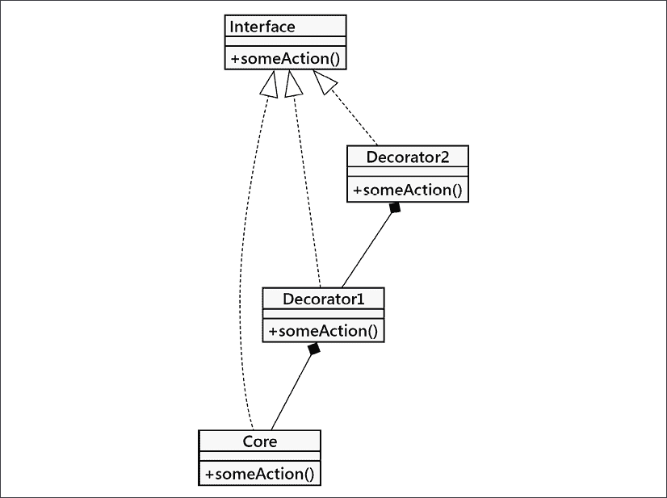
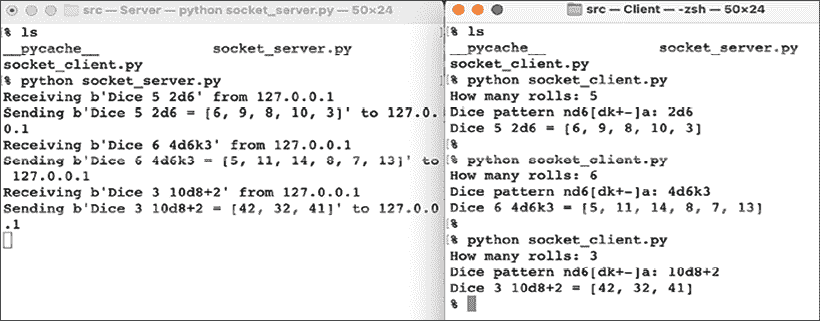
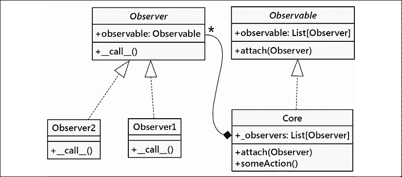
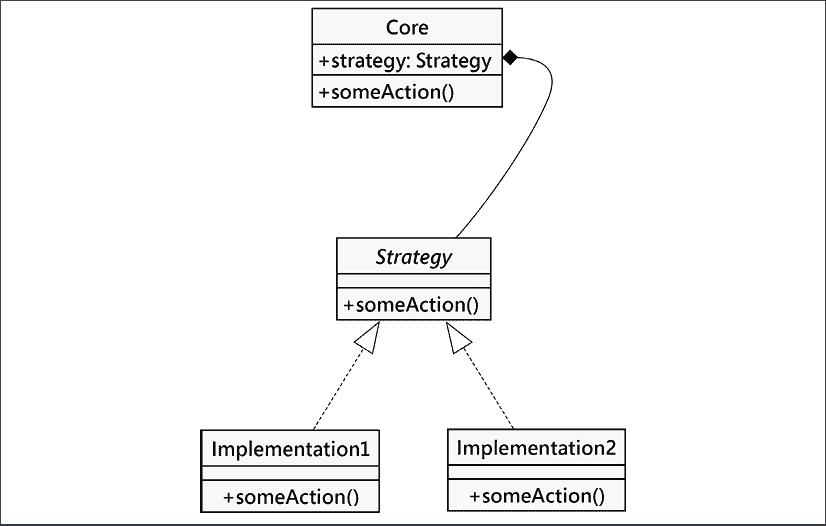
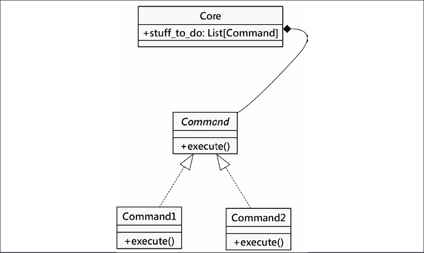
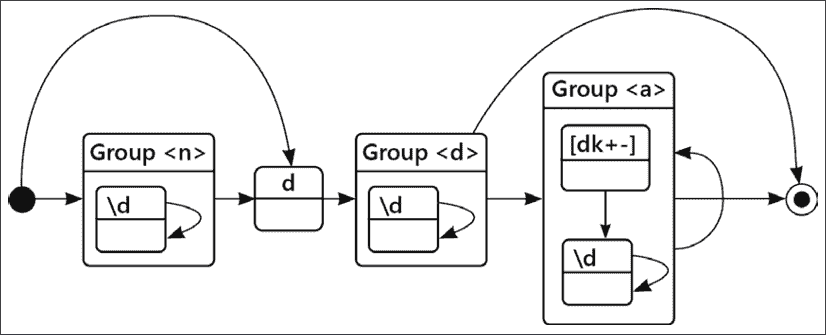
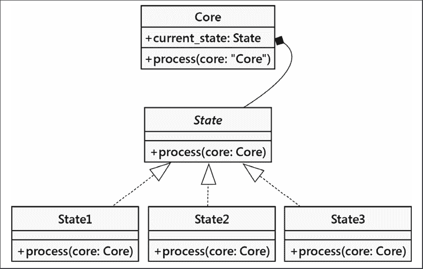
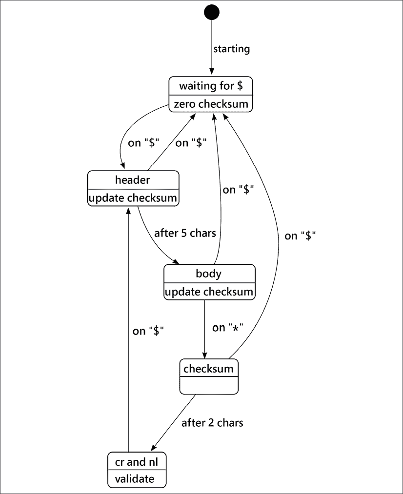
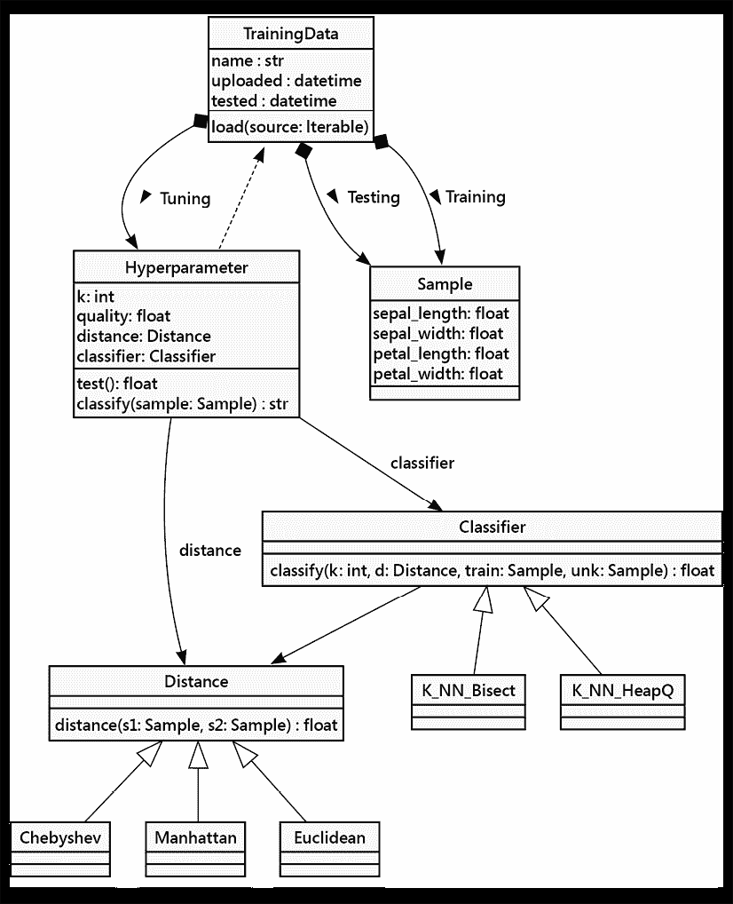

# 第十一章：常见设计模式

在上一章中，我们简要介绍了设计模式，并涵盖了迭代器模式，这是一个如此有用且常见的模式，以至于它被抽象成了编程语言的核心。在本章中，我们将回顾其他常见模式以及它们在 Python 中的实现方式。与迭代一样，Python 经常提供一种替代语法来简化这类问题的处理。我们将涵盖这些模式的**传统**设计和 Python 版本。

在本章中，我们将看到：

+   装饰者模式

+   观察者模式

+   策略模式

+   命令模式

+   状态模式

+   单例模式

本章的案例研究将强调距离计算是如何成为策略设计模式的一个例子，以及我们如何利用抽象基类来设计各种距离计算方法，这些方法可以进行比较，以确定哪种方法产生的结果最有用。

与《设计模式：可复用面向对象软件元素》中的实践一致，我们将首字母大写模式名称。这有助于它们在普通英语用法中脱颖而出。

我们将从装饰者模式开始。这种模式用于将不同种类的功能组合成一个单一的结果对象。

# 装饰者模式

装饰器模式允许我们用其他对象来**包装**一个提供核心功能的对象，从而改变这个功能。任何使用装饰对象的对象都将与它以完全相同的方式交互，就像它没有被装饰一样（也就是说，装饰对象的外界接口与核心对象相同）。

装饰者模式主要有两种用途：

+   提高组件在向第二个组件发送数据时的响应能力

+   支持多种可选行为

第二种选择通常是多重继承的一个合适替代方案。我们可以构建一个核心对象，然后创建一个装饰器来包装这个核心。由于装饰器对象与核心对象具有相同的接口，我们甚至可以在新对象上再包装其他装饰器。下面是它在 UML 图中的样子：



图 11.1：UML 中的装饰器模式

在这里，**核心**及其所有装饰器实现了一个特定的**接口**。虚线表示“实现”或“实现”。装饰器通过组合维护对该**接口**核心实例的引用。当被调用时，装饰器在其包装的接口调用前后执行一些额外的处理。包装的对象可能是另一个装饰器，或者是核心功能。虽然多个装饰器可以相互包装，但所有这些装饰器链末尾的对象提供了核心功能。

每个这些都必须提供一个公共功能的实现。目的是提供从各种装饰器中组合的处理步骤，应用于核心。通常装饰器很小，通常是一个没有状态的函数定义。

在 Python 中，由于鸭子类型，我们不需要通过官方的抽象接口定义来正式化这些关系。确保类有匹配的方法就足够了。在某些情况下，我们可能定义一个`typing.Protocol`作为类型提示，以帮助**mypy**推理这些关系。

## 装饰器示例

让我们来看一个网络编程的例子。我们想要构建一个小型服务器，它提供一些数据，并且有一个客户端与之交互。服务器将模拟掷出复杂的一把把骰子。客户端将请求一把骰子并等待包含一些随机数的回答。

这个例子中有两个进程通过 TCP 套接字进行交互，这是一种在计算机系统之间传输字节的方式。套接字是由一个监听连接的服务器创建的。当客户端尝试连接到套接字时，服务器必须接受新的连接，然后两个进程就可以相互传递字节；在这个例子中，将会有客户端向服务器发送请求和服务器向客户端发送响应。TCP 套接字是 HTTP 的基础部分，整个万维网都是围绕它构建的。

客户端和服务器进程将使用 `socket.send()` 方法通过套接字传输一串字节。他们还将使用 `socket.recv()` 来接收字节。我们将从一个交互式服务器开始，该服务器等待来自客户端的连接，然后响应用户请求。我们将把这个模块命名为 `socket_server.py`。以下是总体概述：

```py
import contextlib
import socket
def main_1() -> None:
    server = socket.socket(socket.AF_INET, socket.SOCK_STREAM)
    server.bind(("localhost", 2401))
    server.listen(1)
    with contextlib.closing(server):
        while True:
            client, addr = server.accept()
            dice_response(client)
            client.close() 
```

服务器绑定到“公共”套接字，使用大约随机的端口号`2401`。这就是服务器监听连接请求的地方。当客户端尝试连接到这个套接字时，会创建一个子套接字，以便客户端和服务器可以进行通信，同时保持公共套接字为更多连接做好准备。一个网络服务器通常会使用多个线程来允许大量并发会话。我们并没有使用线程，第二个客户端必须等待服务器完成与第一个客户端的通信。这就像是一家只有一个咖啡师制作浓缩咖啡的咖啡馆队列。

（请注意，TCP/IP 套接字既有主机地址也有端口号。端口号必须大于`1023`。端口号`1023`以下是被保留的，并且需要特殊的操作系统权限。我们选择端口号`2401`，因为它似乎没有被用于其他任何事情。）

`dice_response()` 函数执行了我们服务的大部分实际工作。它接受一个 `socket` 参数，以便能够响应用户。它读取客户端请求的字节，创建响应，然后发送。为了优雅地处理异常，`dice_response()` 函数看起来是这样的：

```py
def dice_response(client: socket.socket) -> None:
    request = client.recv(1024)
    try:
        response = dice.dice_roller(request)
    except (ValueError, KeyError) as ex:
        response = repr(ex).encode("utf-8")
    client.send(response) 
```

我们将另一个函数`dice_roller()`封装在异常处理程序中。这是一种常见的模式，用于将错误处理和其他开销与计算骰子滚动并响应客户端以提供他们角色扮演游戏的有用数字的实际工作分离：

```py
import random
def dice_roller(request: bytes) -> bytes:
    request_text = request.decode("utf-8")
    numbers = [random.randint(1, 6) for _ in range(6)]
    response = f"{request_text} = {numbers}"
    return response.encode("utf-8") 
```

这并不复杂。我们将在本章后面的*命令模式*部分对此进行扩展。然而，目前它将提供一个随机数的序列。

注意，我们实际上并没有对来自客户端的`request`对象做任何操作。在最初的几个例子中，我们将读取这些字节并忽略它们。`request`是一个占位符，用于描述一个更复杂的请求，包括需要掷多少个骰子和掷多少次。

我们可以利用装饰器设计模式来添加功能。装饰器将包装核心的`dice_response()`函数，该函数接收一个`socket`对象，它可以读取和写入。为了利用设计模式，重要的是要利用这个函数在添加功能时依赖的`socket.send()`和`socket.recv()`方法。在添加装饰时，我们需要保留接口定义。

为了测试服务器，我们可以编写一个非常简单的客户端，该客户端连接到相同的端口并在退出前输出响应：

```py
import socket
def main() -> None:
    server = socket.socket(socket.AF_INET, socket.SOCK_STREAM)
    server.connect(("localhost", 2401))
    count = input("How many rolls: ") or "1"
    pattern = input("Dice pattern nd6[dk+-]a: ") or "d6"
    command = f"Dice {count} {pattern}"
    server.send(command.encode("utf8"))
    response = server.recv(1024)
    print(response.decode("utf-8"))
    server.close()
if __name__ == "__main__":
    main() 
```

这个客户端提出了两个问题并创建了一个看起来相当复杂的字符串，`command`，其中包含一个计数和掷骰子模式。目前，服务器还没有使用这个命令。这是一个更高级掷骰子器的预告。

要使用这两个独立的应用程序，请按照以下步骤操作：

1.  打开两个并排的终端窗口。（将窗口标题更改为“客户端”和“服务器”可能会有帮助。macOS 终端用户可以在**shell**菜单中使用**更改标题**项。Windows 用户可以使用`title`命令。）

1.  在服务器窗口中，启动服务器应用程序：

    ```py
    python src/socket_server.py 
    ```

1.  在客户端窗口中，启动客户端应用程序：

    ```py
    python src/socket_client.py 
    ```

1.  在客户端窗口中输入您的响应。例如：

    ```py
    How many rolls: 2
    Dice pattern nd6[dk+-]a: d6 
    ```

1.  客户端将发送命令，读取响应，将其打印到控制台，然后退出。你可以多次运行客户端以获取一系列骰子滚动结果。

结果看起来可能像这样：



图 11.2：服务器和客户端

在左侧是服务器。我们启动了应用程序，它开始监听端口`2401`以接收客户端连接。在右侧是客户端。每次运行客户端时，它都会连接到公共套接字；连接操作会创建一个子套接字，该套接字可以用于后续的交互。客户端发送一个命令，服务器响应该命令，然后客户端将其打印出来。

现在，回顾我们的服务器代码，我们看到有两个部分。`dice_response()` 函数读取数据并通过一个 `socket` 对象将数据发送回客户端。剩余的脚本负责创建那个 `socket` 对象。我们将创建一对装饰器，以自定义 `socket` 的行为，而无需扩展或修改 `socket` 本身。

让我们从**日志**装饰器开始。这个对象在将数据发送到客户端之前，将其输出到服务器的控制台：

```py
class LogSocket:
    def __init__(self, socket: socket.socket) -> None:
        self.socket = socket
    def recv(self, count: int = 0) -> bytes:
        data = self.socket.recv(count)
        print(
            f"Receiving {data!r} from {self.socket.getpeername()[0]}"
        )
        return data
    def send(self, data: bytes) -> None:
        print(f"Sending {data!r} to {self.socket.getpeername()[0]}")
        self.socket.send(data)
    def close(self) -> None:
        self.socket.close() 
```

这个类装饰了一个`socket`对象，并为使用它的客户端提供了`send()`、`recv()`和`close()`接口。一个更好的装饰器可以正确实现`send`函数的所有参数（实际上它接受一个可选的标志参数），但让我们保持示例简单。每当在`LogSocket`类的实例上调用`send()`时，它会在使用原始套接字向客户端发送数据之前将输出记录到屏幕上。同样，对于`recv()`，它读取并记录接收到的数据。

我们只需在我们的原始代码中更改一行即可使用这个装饰器。而不是用原始客户端套接字调用`dice_response()`函数，我们用装饰过的套接字来调用它：

```py
def main_2() -> None:
    server = socket.socket(socket.AF_INET, socket.SOCK_STREAM)
    server.bind(("localhost", 2401))
    server.listen(1)
    with contextlib.closing(server):
        while True:
            client, addr = server.accept()
            logging_socket = cast(socket.socket, LogSocket(client))
            dice_response(logging_socket)
            client.close() 
```

我们已经用`LogSocket`装饰了核心`socket`。`LogSocket`不仅会将信息打印到控制台，还会调用它所装饰的`socket`对象的方法。`dice_response()`函数中的基本处理没有改变，因为`LogSocket`实例的行为就像底层的`socket`对象一样。

注意，我们需要使用显式的 `cast()` 来告诉 **mypy**，`LogSocket` 实例将提供一个类似于普通 `socket` 的接口。对于这样一个简单的例子，我们不得不问自己，为什么我们不去扩展 `socket` 类并重写 `send` 方法。子类可以在记录之后调用 `super().send()` 和 `super().recv()` 来执行实际的发送操作。装饰器比继承提供了一种优势：装饰器可以在不同的类层次结构中的各种类之间重用。在这个具体的例子中，类似 `socket` 的对象并不多，因此重用的可能性有限。

如果我们将焦点转向比`socket`更通用的东西，我们可以创建潜在的可重用装饰器。处理字符串或字节似乎比处理`socket`更常见。改变结构可以给我们带来一些期望的灵活性，同时也有重用的潜力。最初，我们将处理分解为一个`dice_response()`函数，该函数处理 socket 的读写操作，与一个`dice_roller()`函数分开，后者与字节一起工作。因为`dice_roller()`函数消耗请求字节并生成响应字节，所以它可能更容易扩展并添加功能。

我们可以有一个相关的装饰器家族。我们可以装饰已经装饰过的对象。这个想法是通过组合来赋予我们灵活性。让我们重新设计日志装饰器，使其专注于字节请求和响应，而不是`socket`对象。以下应该与之前的示例类似，但部分代码已移动到单个`__call__()`方法中：

```py
Address = Tuple[str, int]
class LogRoller:
    def __init__(
            self, 
            dice: Callable[[bytes], bytes], 
            remote_addr: Address
    ) -> None:
        self.dice_roller = dice
        self.remote_addr = remote_addr
    def __call__(self, request: bytes) -> bytes:
        print(f"Receiving {request!r} from {self.remote_addr}")
        dice_roller = self.dice_roller
        response = dice_roller(request)
        print(f"Sending {response!r} to {self.remote_addr}")
        return response 
```

这里是一个使用`gzip`压缩对结果字节进行压缩的第二个装饰器：

```py
import gzip
import io
class ZipRoller:
    def __init__(self, dice: Callable[[bytes], bytes]) -> None:
        self.dice_roller = dice
    def __call__(self, request: bytes) -> bytes:
        dice_roller = self.dice_roller
        response = dice_roller(request)
        buffer = io.BytesIO()
        with gzip.GzipFile(fileobj=buffer, mode="w") as zipfile:
            zipfile.write(response)
        return buffer.getvalue() 
```

此装饰器在将数据发送到客户端之前对其进行压缩。它装饰了一个底层的`dice_roller`对象，该对象用于计算对请求的响应。

现在我们有了这两个装饰器，我们可以编写代码，将一个装饰器堆叠在另一个装饰器之上：

```py
def dice_response(client: socket.socket) -> None:
    request = client.recv(1024)
    try:
        remote_addr = client.getpeername()
        roller_1 = ZipRoller(dice.dice_roller)
        roller_2 = LogRoller(roller_1, remote_addr=remote_addr)
        response = roller_2(request)
    except (ValueError, KeyError) as ex:
        response = repr(ex).encode("utf-8")
    client.send(response) 
```

此处的目的是将此应用的三个方面分开：

+   压缩生成的文档

+   编写日志

+   进行底层计算

我们可以将压缩或日志记录应用于任何处理接收和发送字节的类似应用程序。如果我们愿意，还可以将压缩操作作为一个动态选择。我们可能有一个单独的配置文件来启用或禁用 GZip 功能。这意味着类似于以下内容：

```py
if config.zip_feature:
    roller_1 = ZipRoller(dice.dice_roller)
else:
    roller_1 = dice.dice_roller 
```

我们有一套动态的装饰。试着用多重继承混入（mixin）来实现这个功能，看看它会变得多么混乱！

## Python 中的装饰器

装饰器模式在 Python 中很有用，但还有其他选择。例如，我们可以使用猴子补丁（在运行时更改类定义）来达到类似的效果。例如，`socket.socket.send = log_send` 将改变内置 socket 的工作方式。有时会有一些令人惊讶的实现细节，这可能会使事情变得不愉快地复杂。单继承，其中*可选*的计算在一个大方法中通过一系列`if`语句完成，可能是一个选择。多重继承不应该因为之前看到的特定示例不适合而被放弃。

在 Python 中，在函数上使用这种模式非常常见。正如我们在前一章中看到的，函数也是对象。实际上，函数装饰如此普遍，以至于 Python 提供了一种特殊的语法，以便于将这样的装饰器应用于函数。

例如，我们可以更一般性地看待日志记录的例子。除了只在套接字上记录发送调用之外，我们可能会发现记录对某些函数或方法的全部调用是有帮助的。以下示例实现了一个装饰器，它正是这样做的：

```py
from functools import wraps
def log_args(function: Callable[..., Any]) -> Callable[..., Any]:
    @wraps(function)
    def wrapped_function(*args: Any, **kwargs: Any) -> Any:
        print(f"Calling {function.__name__}(*{args}, **{kwargs})")
        result = function(*args, **kwargs)
        return result
    return wrapped_function 
```

这个装饰器函数与我们之前探讨的例子非常相似；在之前的例子中，装饰器接受一个类似于套接字的对象并创建一个类似的套接字对象。这次，我们的装饰器接受一个函数对象并返回一个新的函数对象。我们提供了类型提示`Callable[..., Any]`来表明任何函数都可以在这里使用。这段代码包含三个独立任务：

+   一个接受另一个函数`function`作为参数值的函数，`log_args()`。

+   此函数（内部）定义了一个新函数，命名为`wrapped_function`，在调用原始函数并返回原始函数的结果之前，它会做一些额外的工作。

+   新的内联函数，`wrapped_function()`，由装饰器函数返回。

因为我们在使用 `@wraps(function)`，新的函数将拥有原始函数的名称和原始函数的文档字符串。这避免了所有我们装饰的函数最终都命名为 `wrapped_function`。

这里有一个示例函数来展示装饰器的使用：

```py
def test1(a: int, b: int, c: int) -> float:
    return sum(range(a, b + 1)) / c
test1 = log_args(test1) 
```

此函数可以被装饰并这样使用：

```py
>>> test1(1, 9, 2)
Calling test1(*(1, 9, 2), **{})
22.5 
```

这种语法使我们能够动态地构建装饰过的函数对象，就像我们在套接字示例中所做的那样。如果我们不使用赋值来将新对象分配给旧名称，我们甚至可以保留装饰过的和非装饰过的版本以适应不同的情况。我们可以使用类似 `test1_log = log_args(test1)` 的语句来创建 `test1()` 函数的第二个装饰版本，命名为 `test1_log()`。

通常，这些装饰器是对不同函数进行永久性修改的通用修改。在这种情况下，Python 支持一种特殊的语法，可以在定义函数时应用装饰器。我们已经在几个地方看到了这种语法；现在，让我们了解它是如何工作的。

我们可以在方法定义之后应用装饰器函数，也可以使用`@decorator`语法一次性完成：

```py
@log_args
def test1(a: int, b: int, c: int) -> float:
    return sum(range(a, b + 1)) / c 
```

这种语法的首要好处是，每次我们阅读函数定义时，都能轻松地看到函数已经被装饰了。如果装饰器是在之后应用的，阅读代码的人可能会错过函数已经被修改的事实。回答像“为什么我的程序会将函数调用记录到控制台？”这样的问题可能会变得困难得多！然而，这种语法只能应用于我们定义的函数，因为我们没有访问其他模块源代码的权限。如果我们需要装饰属于他人第三方库中的函数，我们必须使用早期的语法。

Python 的装饰器也允许参数。标准库中最有用的装饰器之一是`functools.lru_cache`。缓存的想法是将函数的计算结果保存下来，以避免重新计算。我们不必保存所有参数和结果，可以通过丢弃**最近最少使用**（**LRU**）的值来保持缓存的大小。例如，以下是一个涉及可能昂贵的计算的功能：

```py
>>> from math import factorial
>>> def binom(n: int, k: int) -> int:
...     return factorial(n) // (factorial(k) * factorial(n-k))
>>> f"6-card deals: {binom(52, 6):,d}"
'6-card deals: 20,358,520' 
```

我们可以使用`lru_cache`装饰器来避免在已知答案后重复进行此计算。这里需要做的微小改动是：

```py
>>> from math import factorial
>>> from functools import lru_cache
>>> @lru_cache(64)
... def binom(n: int, k: int) -> int:
...     return factorial(n) // (factorial(k) * factorial(n-k)) 
```

参数化装饰器 `@lru_cache(64)` 用于创建 `binom()` 函数的第二个版本，意味着它会保存最近的 64 个结果以避免在值已经被计算过一次时重新计算。在应用程序的其他地方不需要做任何更改。有时，这种小改动带来的加速效果可能是显著的。当然，我们可以根据数据和正在进行的计算数量来微调缓存的大小。

像这样的参数化装饰器涉及两步舞。首先，我们使用参数自定义装饰器，然后我们将这个自定义装饰器应用到函数定义上。这两个独立的步骤与通过`__init__()`方法初始化可调用对象的方式相平行，并且可以通过它们的`__call__()`方法像函数一样被调用。

这里是一个可配置的日志装饰器的示例，`NamedLogger`：

```py
class NamedLogger:
    def __init__(self, logger_name: str) -> None:
        self.logger = logging.getLogger(logger_name)
    def __call__(
           self, 
           function: Callable[..., Any]
    ) -> Callable[..., Any]:
        @wraps(function)
        def wrapped_function(*args: Any, **kwargs: Any) -> Any:
            start = time.perf_counter()
            try:
                result = function(*args, **kwargs)
                μs = (time.perf_counter() - start) * 1_000_000
                self.logger.info(
                    f"{function.__name__}, { μs:.1f}μs")
                return result
            except Exception as ex:
                μs = (time.perf_counter() - start) * 1_000_000
                self.logger.error(
                    f"{ex}, {function.__name__}, { μs:.1f}μs")
                raise
        return wrapped_function 
```

`__init__()` 方法确保我们可以使用类似 `NamedLogger("log4")` 的代码来创建一个装饰器；这个装饰器将确保随后的函数使用特定的记录器。

`__call__()` 方法遵循上述模式。我们定义一个新的函数，`wrapped_function()`，来完成这项工作，并返回这个新创建的函数。我们可以这样使用它：

```py
>>> @NamedLogger("log4")
... def test4(median: float, sample: float) -> float:
...     return abs(sample-median) 
```

我们已经创建了一个`NamedLogger`类的实例。然后我们将这个实例应用于`test4()`函数定义。调用`__call__()`方法，将创建一个新的函数，即`test4()`函数的装饰版本。

装饰器语法还有一些其他的使用场景。例如，当一个装饰器是类的一个方法时，它还可以保存关于被装饰函数的信息，创建一个被装饰函数的注册表。此外，类也可以被装饰；在这种情况下，装饰器返回一个新的类而不是一个新的函数。在所有这些更高级的案例中，我们使用的是普通的面向对象设计，但语法看起来更简单，即使用`@decorator`。

# 观察者模式

观察者模式适用于状态监控和事件处理场景。此模式允许一个特定对象被一个未知且动态的观察者对象组监控。被观察的核心对象需要实现一个接口，使其成为*可观察的*。

当核心对象上的值发生变化时，它会通过调用一个宣布状态发生改变的方法，让所有观察者对象知道已发生改变。这在 GUI 中得到了广泛应用，以确保底层模型中的任何状态变化都能反映在模型的视图中。通常会有详细视图和摘要视图；对详细信息的更改也必须更新显示详细信息的控件，并更新显示的任何摘要。有时模式的大幅变化可能导致多个项目被更改。例如，点击一个“锁定”图标可能会改变多个显示项目，以反映它们被锁定的状态。这可以通过将多个观察者附加到可观察的显示控件来实现。

在 Python 中，观察者可以通过`__call__()`方法被通知，使得每个观察者表现得像一个函数或其他可调用对象。每当核心对象发生变化时，每个观察者可能负责不同的任务；核心对象不知道或关心那些任务是什么，观察者通常也不知道或关心其他观察者在做什么。

这通过将状态变化对响应的影响与变化本身解耦，提供了极大的灵活性。

这里是 UML 中观察者设计模式的表示：



图 11.3：UML 中的观察者模式

我们已经展示了`Core`对象包含一系列观察者对象。为了可观察，`Core`类必须遵循对可观察性的共同理解；具体来说，它必须提供一个观察者列表以及一种附加新观察者的方法。

我们已经展示了`Observer`子类具有`__call__()`方法。这个方法将由可观察对象用来通知每个观察者状态的变化。与装饰器模式一样，我们不需要通过正式定义的抽象超类来正式化这些关系。在大多数情况下，我们可以依赖鸭子类型规则；只要观察者具有正确的接口，它们就可以在这个模式中定义的角色中使用。如果它们缺少适当的接口，**mypy**可能会捕捉到冲突，并且单元测试应该能够捕捉到这个问题。

## 一个观察者示例

在图形用户界面之外，观察者模式对于保存对象的中继状态很有用。在需要严格审计变更的系统中使用观察者对象可能很方便。在混乱盛行且组件不可靠的系统中也同样方便。

复杂的基于云的应用可能因为不可靠的连接而出现混乱问题。我们可以使用观察者来记录状态变化，从而使恢复和重启更加容易。

对于这个例子，我们将定义一个核心对象来维护一组重要值，然后让一个或多个观察者创建该对象的序列化副本。这些副本可能存储在数据库中、远程主机上或本地文件中，例如。由于我们可以有多个观察者，因此很容易修改设计以使用不同的数据缓存。在这个例子中，我们想到了一个名为 Zonk 或 Zilch 或 Ten Thousand 的掷骰子游戏，玩家将掷六个骰子，为三倍和连跑得分，并可能再次掷骰，从而产生一系列骰子。（规则比这个简单的总结要复杂一些。）

我们将首先简要介绍一些内容，以便使我们的意图更加明确：

```py
from __future__ import annotations
from typing import Protocol
class Observer(Protocol):
    def __call__(self) -> None:
        ...
class Observable:
    def __init__(self) -> None:
        self._observers: list[Observer] = []
    def attach(self, observer: Observer) -> None:
        self._observers.append(observer)
    def detach(self, observer: Observer) -> None:
        self._observers.remove(observer)
    def _notify_observers(self) -> None:
        for observer in self._observers:
            observer() 
```

`Observer`类是一个协议，是我们观察者的抽象超类。我们没有将其正式化为`abc.ABC`抽象类；我们不依赖于`abc`模块提供的运行时错误。在定义`Protocol`时，我们依赖**mypy**来确认所有观察者实际上实现了所需的方法。

`Observable` 类定义了 `_observers` 实例变量和三个纯粹属于此协议定义的方法。一个可观察对象可以添加观察者、移除观察者，以及——最重要的是——通知所有观察者状态变化。核心类需要做的唯一特殊或不同的事情是在状态变化时调用 `_notify_observers()` 方法。适当的通知是可观察对象设计中的重要组成部分。

这是我们在意的 Zonk 游戏的一部分。这个类保存玩家的手：

```py
from typing import List
Hand = List[int]
class ZonkHandHistory(Observable):
    def __init__(self, player: str, dice_set: Dice) -> None:
        super().__init__()
        self.player = player
        self.dice_set = dice_set
        self.rolls: list[Hand]
    def start(self) -> Hand:
        self.dice_set.roll()
        self.rolls = [self.dice_set.dice]
        self._notify_observers()  # State change
        return self.dice_set.dice
    def roll(self) -> Hand:
        self.dice_set.roll()
        self.rolls.append(self.dice_set.dice)
        self._notify_observers()  # State change
        return self.dice_set.dice 
```

这个类在重要的状态变化时调用 `self._notify_observers()`。这将通知所有观察者实例。观察者可能会缓存手部的副本，通过网络发送详细信息，更新 GUI 上的小部件——任何数量的事情。从 `Observable` 继承的 `_notify_observers()` 方法会遍历任何已注册的观察者，并让每个观察者知道手部的状态已发生变化。

现在我们来实现一个简单的观察者对象；这个对象将会将一些状态打印到控制台：

```py
class SaveZonkHand(Observer):
    def __init__(self, hand: ZonkHandHistory) -> None:
        self.hand = hand
        self.count = 0
    def __call__(self) -> None:
        self.count += 1
        message = {
            "player": self.hand.player,
            "sequence": self.count,
            "hands": json.dumps(self.hand.rolls),
            "time": time.time(),
        }
        print(f"SaveZonkHand {message}") 
```

这里没有什么特别激动人心的东西；观察到的对象是在初始化器中设置的，当调用观察者时，我们做了一些事情，在这个例子中，是打印一行。请注意，这里的超类`Observer`实际上并不需要。这个类被使用的上下文足以让**mypy**确认这个类符合所需的`Observer`协议。虽然我们不需要声明它是一个`Observer`，但这可以帮助读者看到这个类实现了`Observer`协议。

我们可以在交互式控制台中测试`SaveZonkHand`观察者：

```py
>>> d = Dice.from_text("6d6")
>>> player = ZonkHandHistory("Bo", d)
>>> save_history = SaveZonkHand(player)
>>> player.attach(save_history)
>>> r1 = player.start()
SaveZonkHand {'player': 'Bo', 'sequence': 1, 'hands': '[[1, 1, 2, 3, 6, 6]]', 'time': 1609619907.52109}
>>> r1
[1, 1, 2, 3, 6, 6]
>>> r2 = player.roll()
SaveZonkHand {'player': 'Bo', 'sequence': 2, 'hands': '[[1, 1, 2, 3, 6, 6], [1, 2, 2, 6, 6, 6]]', 'time': ...} 
```

将观察者附加到`Inventory`对象后，每当改变两个被观察属性中的任何一个时，都会调用观察者并执行其动作。请注意，我们的观察者跟踪一个序列号并包含一个时间戳。这些是在游戏定义之外，并且通过成为`SaveZonkHand`观察者类的一部分，与核心游戏处理保持分离。

我们可以添加多个不同类别的观察者。让我们添加一个第二个观察者，它有一个有限的任务，即检查三对并宣布它：

```py
class ThreePairZonkHand:
    """Observer of ZonkHandHistory"""
    def __init__(self, hand: ZonkHandHistory) -> None:
        self.hand = hand
        self.zonked = False
    def __call__(self) -> None:
        last_roll = self.hand.rolls[-1]
        distinct_values = set(last_roll)
        self.zonked = len(distinct_values) == 3 and all(
            last_roll.count(v) == 2 for v in distinct_values
        )
        if self.zonked:
            print("3 Pair Zonk!") 
```

对于这个例子，我们省略了将`Observer`命名为超类。我们可以信任**mypy**工具来记录这个类是如何被使用以及它必须实现哪些协议。引入这个新的`ThreePairZonkHand`观察者意味着，当我们改变手的状态时，可能会有两组输出，每组对应一个观察者。这里的关键思想是，我们可以轻松地添加完全不同类型的观察者来完成不同种类的事情，在这种情况下，就是复制数据以及检查数据中的特殊情况。

观察者模式将正在被观察的代码与执行观察的代码分离。如果我们没有使用这种模式，我们就不得不在`ZonkHandHistory`类中放置代码来处理可能出现的不同情况：记录到控制台、更新数据库或文件、检查特殊情况等等。每个这些任务的代码都会与核心类定义混合在一起。维护它将是一场噩梦，并且在以后日期添加新的监控功能将会很痛苦。

# 策略模式

策略模式是面向对象编程中抽象的常见示例。该模式实现了对单个问题的不同解决方案，每个解决方案都在不同的对象中。核心类可以在运行时动态地选择最合适的实现。

通常，不同的算法有不同的权衡；一个可能比另一个更快，但会使用更多的内存，而第三个算法可能在存在多个 CPU 或提供了分布式系统时最为合适。

这里是 UML 中的策略模式：



图 11.4：UML 中的策略模式

连接到**策略**抽象的**核心**代码只需知道它正在处理某种符合特定操作策略接口的类。每个实现都应该执行相同的任务，但以不同的方式。实现接口需要完全相同，并且利用抽象基类来确保实现的一致性通常是有帮助的。

这种插件策略的想法也是观察者模式的一个方面。实际上，策略对象的想法是本章涵盖的许多模式的一个重要方面。常见的想法是使用一个单独的对象来隔离条件性或可替换的处理，并将工作委托给这个单独的对象。这对于可观察对象、装饰以及——正如我们将看到的——命令和状态也是适用的。

## 策略示例

策略模式的一个常见例子是排序程序；多年来，已经发明了多种算法来对一组对象进行排序。快速排序、归并排序和堆排序都是具有不同特性的算法，每个算法在其自身适用的范围内都是有用的，这取决于输入的大小和类型、它们的顺序如何以及系统的要求。

如果我们的客户端代码需要对一个集合进行排序，我们可以将其传递给一个具有`sort()`方法的对象。这个对象可能是一个`QuickSorter`或`MergeSorter`对象，但无论哪种情况，结果都将相同：一个排序后的列表。用于排序的策略从调用代码中抽象出来，使其模块化且可替换。

当然，在 Python 中，我们通常只是调用`sorted()`函数或`list.sort()`方法，并相信它将足够快地完成排序，以至于 TimSort 算法的细节并不真正重要。有关 TimSort 如何惊人的快速的信息，请参阅[`bugs.python.org/file4451/timsort.txt`](https://bugs.python.org/file4451/timsort.txt)。虽然排序是一个有用的概念，但它并不是最实用的例子，所以让我们看看其他的东西。

作为策略设计模式的简单示例，可以考虑桌面壁纸管理器。当图像显示在桌面背景上时，它可以以不同的方式调整到屏幕大小。例如，假设图像小于屏幕，它可以平铺在整个屏幕上，居中显示，或者缩放到适合。还可以使用其他更复杂的策略，例如缩放到最大高度或宽度，将其与纯色、半透明或渐变背景颜色结合，或者进行其他操作。虽然我们可能希望在以后添加这些策略，但让我们先从几个基本策略开始。

您需要安装`pillow`模块。如果您使用**conda**来管理您的虚拟环境，请使用`conda install pillow`来安装 Pillow 项目的`PIL`实现。如果您不使用**conda**，请使用`python -m pip install pillow`。

我们的策略对象需要接受两个输入：要显示的图像，以及屏幕宽度和高度的元组。它们各自返回一个与屏幕大小相同的新图像，并根据给定的策略对图像进行操作以适应。

这里是一些初步的定义，包括所有策略变体的抽象超类：

```py
import abc
from pathlib import Path
from PIL import Image  # type: ignore [import]
from typing import Tuple
Size = Tuple[int, int]
class FillAlgorithm(abc.ABC):
    @abc.abstractmethod
    def make_background(
            self, 
            img_file: Path, 
            desktop_size: Size
    ) -> Image:
        pass 
```

这个抽象是否必要？这正处在过于简单以至于不需要抽象和足够复杂以至于超类有帮助之间的边缘。函数签名相当复杂，有一个特殊的类型提示来描述大小元组。因此，抽象可以帮助检查每个实现，以确保所有类型匹配。

注意，我们需要包含特殊的`# type: ignore [import]`注释，以确保**mypy**不会因为 PIL 模块中缺少注释而感到困惑。

这是我们的第一个具体策略；这是一个填充算法，用于铺贴图像：

```py
class TiledStrategy(FillAlgorithm):
    def make_background(
            self, 
            img_file: Path, 
            desktop_size: Size
    ) -> Image:
        in_img = Image.open(img_file)
        out_img = Image.new("RGB", desktop_size)
        num_tiles = [
            o // i + 1 for o, i in zip(out_img.size, in_img.size)]
        for x in range(num_tiles[0]):
            for y in range(num_tiles[1]):
                out_img.paste(
                    in_img,
                    (
                        in_img.size[0] * x,
                        in_img.size[1] * y,
                        in_img.size[0] * (x + 1),
                        in_img.size[1] * (y + 1),
                    ),
                )
        return out_img 
```

这是通过将输出高度和宽度除以输入图像的高度和宽度来实现的。`num_tiles`序列是一种对宽度和高度进行相同计算的方法。它是一个通过列表推导计算的两个元组，以确保宽度和高度以相同的方式进行处理。

这里有一个填充算法，可以在不重新缩放图像的情况下将其居中：

```py
class CenteredStrategy(FillAlgorithm):
    def make_background(
            self, 
            img_file: Path, 
            desktop_size: Size
    ) -> Image:
        in_img = Image.open(img_file)
        out_img = Image.new("RGB", desktop_size)
        left = (out_img.size[0] - in_img.size[0]) // 2
        top = (out_img.size[1] - in_img.size[1]) // 2
        out_img.paste(
            in_img,
            (left, top, left + in_img.size[0], top + in_img.size[1]),
        )
        return out_img 
```

最后，这是一个填充算法，可以将图像放大以填充整个屏幕：

```py
class ScaledStrategy(FillAlgorithm):
    def make_background(
            self, 
            img_file: Path, 
            desktop_size: Size
    ) -> Image:
        in_img = Image.open(img_file)
        out_img = in_img.resize(desktop_size)
        return out_img 
```

在这里，我们有三个策略子类，每个子类都使用`PIL.Image`来执行其任务。所有策略实现都有一个`make_background()`方法，它接受相同的参数集。一旦选择，适当的策略对象可以被调用以创建桌面图像的正确尺寸版本。`TiledStrategy`计算输入图像块的数量，这些块可以适合显示屏幕的宽度和高度，并将图像复制到每个块位置，重复进行，而不进行缩放，因此可能无法填满整个空间。`CenteredStrategy`确定需要在图像的四个边缘留下多少空间以使其居中。`ScaledStrategy`强制将图像调整到输出大小，而不保留原始的宽高比。

这里有一个用于调整大小的整体对象，使用这些策略类之一。当创建一个`Resizer`实例时，`algorithm`实例变量会被填充：

```py
class Resizer:
    def __init__(self, algorithm: FillAlgorithm) -> None:
        self.algorithm = algorithm
    def resize(self, image_file: Path, size: Size) -> Image:
        result = self.algorithm.make_background(image_file, size)
        return result 
```

以下是构建`Resizer`类实例并应用可用策略类之一的`main`函数：

```py
def main() -> None:
    image_file = Path.cwd() / "boat.png"
    tiled_desktop = Resizer(TiledStrategy())
    tiled_image = tiled_desktop.resize(image_file, (1920, 1080))
    tiled_image.show() 
```

重要的是策略实例的绑定尽可能在处理过程中晚些时候发生。决策可以在处理的任何时刻做出（和撤销），因为任何可用的策略对象都可以在任何时候插入到`Resizer`对象中。

考虑一下在没有策略模式的情况下如何实现这些选项之间的切换。我们需要将所有代码放入一个巨大的方法中，并使用一个尴尬的`if`语句来选择期望的那个。每次我们想要添加一个新的策略时，我们都需要让这个方法变得更加笨拙。

## Python 中的策略

Strategy 模式的先前标准实现，虽然在大多数面向对象的库中非常常见，但在 Python 中并不理想。它涉及一些并非真正必要的开销。

这些策略类每个都定义了只提供单个方法的对象。我们完全可以将其函数命名为 `__call__` 并直接使对象可调用。由于与对象关联的数据没有其他，我们只需创建一组顶级函数并将它们作为我们的策略传递即可。

与抽象类带来的开销相比，我们可以用以下类型提示来总结这些策略：

```py
FillAlgorithm = Callable[[Image, Size], Image] 
```

当我们这样做时，我们可以在类定义中消除所有对`FillAlgorithm`的引用；我们将`class CenteredStrategy(FillAlgorithm):`更改为`class CenteredStrategy``:`。

由于我们可以在抽象类和类型提示之间进行选择，策略设计模式似乎显得多余。这导致了一场奇怪的对话，开始于 *"因为 Python 有第一类函数，策略模式是不必要的。"* 事实上，Python 的第一类函数使我们能够以更直接的方式实现策略模式，而不需要类定义的开销。模式不仅仅是实现细节。了解模式可以帮助我们为我们的程序选择一个好的设计，并使用最易读的语法来实现它。当我们需要允许客户端代码或最终用户在运行时从同一接口的多个实现中选择时，无论是类还是顶级函数，都应该使用策略模式。

在混入类定义和插件策略对象之间存在一条清晰的界限。正如我们在*第六章*，*抽象基类和运算符重载*中看到的，混入类定义是在源代码中创建的，并且不能在运行时轻易修改。然而，插件策略对象是在运行时填充的，允许策略的后期绑定。它们的代码通常非常相似，为每个类提供清晰的文档字符串来解释各种类如何相互配合是很有帮助的。

# 命令模式

当我们思考类职责时，有时可以区分出“被动”类，这些类持有对象并维护内部状态，但很少主动发起操作，以及“主动”类，这些类会扩展到其他对象以采取行动和执行任务。这种区分并不是非常清晰，但它可以帮助区分相对被动的观察者（Observer）和更活跃的命令（Command）设计模式。观察者会在有变化时被通知。另一方面，指挥者（Commander）将是主动的，在其他对象中做出状态改变。我们可以结合这两个方面，这就是通过描述适用于类或类之间关系的各种模式来讨论软件架构之美的一部分。

命令模式通常涉及一个类层次结构，每个类都执行某些操作。一个核心类可以创建一个命令（或一系列命令）来执行动作。

从某种意义上说，它是一种元编程：通过创建包含大量语句的命令对象，设计具有命令对象的更高层次“语言”。

这里是一个展示**核心**对象和一组**命令**的 UML 图：



图 11.5：UML 中的命令模式

这看起来与策略模式和观察者模式的图示相似，因为所有这些模式都依赖于将工作从**核心**对象委托给插件对象。在这种情况下，一系列代表执行一系列命令的单独插件对象。

## 命令示例

例如，我们将查看本章前面提到的装饰器模式示例中省略的复杂骰子滚动。在先前的示例中，我们有一个函数，`dice_roller()`，它计算了一系列随机数：

```py
def dice_roller(request: bytes) -> bytes:
    request_text = request.decode("utf-8")
    numbers = [random.randint(1, 6) for _ in range(6)]
    response = f"{request_text} = {numbers}"
    return response.encode("utf-8") 
```

这并不是很聪明；我们更愿意处理一些更复杂的东西。我们希望能够写出像 `3d6` 这样的字符串来表示三个六面骰子，`3d6+2` 来表示三个六面骰子加上两个额外的奖励，以及像 `4d6d1` 这样稍微有点晦涩的字符串来表示“掷四个六面骰子并丢弃一个最低的骰子。”我们可能还想将这两者结合起来，写出 `4d6d1+2`，以便同时丢弃最低的骰子并给结果加二。

结尾处的这些`d1`和`+2`选项可以被视为一系列命令。常见的有四种类型：“删除”、“保留”、“添加”和“减去”。当然，还可以有更多，以反映广泛的游戏机制和所需的统计分布，但我们将探讨四种可以修改一批骰子的命令。

这里是我们将要实现的正则表达式：

```py
dice_pattern = re.compile(r"(?P<n>\d*)d(?P<d>\d+)(?P<a>[dk+-]\d+)*") 
```

这个正则表达式可能有点令人望而生畏。有些人发现[`www.debuggex.com`](https://www.debuggex.com)上的铁路图示很有帮助。这里有一个作为 UML 状态图的表示：



图 11.6：骰子解析正则表达式

此模式包含四个部分：

1.  第一组，`(?P<n>\d*)`，捕获了一组数字，用于表示骰子的数量，并将其保存为名为 `n` 的组。这是可选的，因此我们可以写作 `d6` 而不是 `1d6`。

1.  必须存在的字母 "d"，但并未被捕捉到。

1.  下一个分组 `(?P<d>\d+)` 捕获每个骰子上的数字，将其保存为名为 `d` 的分组。如果我们非常挑剔，可能会尝试将其限制为 `(4|6|8|10|12|20|100)` 以定义一个可接受的规则多面骰子列表（以及两个常见的非规则多面体）。我们没有提供这个简短的列表；相反，我们将接受任何数字序列。

1.  最后的分组 `(?P<a>[dk+-]\d+)*` 定义了一系列重复的调整。每一个调整都有一个前缀和一系列数字，例如，`d1` 或 `k3` 或 `+1` 或 `-2`。我们将捕获整个调整序列作为分组 `a`，并分别分解各个部分。这些部分中的每一个都将变成一个命令，遵循命令设计模式。

我们可以将掷骰子的每一部分视为一个独立的命令。一个命令用于掷骰子，随后的一系列命令则调整骰子的数值。例如，`3d6+2` 表示掷三个骰子（例如，，，）并将 2 加到总数上，得到 13。整个类看起来是这样的：

```py
class Dice:
    def __init__(self, n: int, d: int, *adj: Adjustment) -> None:
        self.adjustments = [cast(Adjustment, Roll(n, d))] + list(adj)
        self.dice: list[int]
        self.modifier: int
    def roll(self) -> int:
        for a in self.adjustments:
            a.apply(self)
        return sum(self.dice) + self.modifier 
```

当我们想要掷一个新的骰子时，一个`Dice`对象会应用单个`Adjustment`对象来创建一个新的掷骰结果。我们可以在`__init__()`方法中看到一种`Adjustment`对象的例子：一个`Roll`对象。这个对象首先被放入一系列调整中；之后，任何额外的调整都会按顺序处理。每个调整都是另一种命令。

这里是各种调整命令，它们可以改变`Dice`对象的状态：

```py
class Adjustment(abc.ABC):
    def __init__(self, amount: int) -> None:
        self.amount = amount
    @abc.abstractmethod
    def apply(self, dice: "Dice") -> None:
        ...
class Roll(Adjustment):
    def __init__(self, n: int, d: int) -> None:
        self.n = n
        self.d = d
    def apply(self, dice: "Dice") -> None:
        dice.dice = sorted(
            random.randint(1, self.d) for _ in range(self.n))
        dice.modifier = 0
class Drop(Adjustment):
    def apply(self, dice: "Dice") -> None:
        dice.dice = dice.dice[self.amount :]
class Keep(Adjustment):
    def apply(self, dice: "Dice") -> None:
        dice.dice = dice.dice[: self.amount]
class Plus(Adjustment):
    def apply(self, dice: "Dice") -> None:
        dice.modifier += self.amount
class Minus(Adjustment):
    def apply(self, dice: "Dice") -> None:
        dice.modifier -= self.amount 
```

`Roll()` 类的一个实例设置了骰子的值和 `Dice` 实例的修饰符属性。其他 `Adjustment` 对象要么移除一些骰子，要么改变修饰符。这些操作依赖于骰子的排序。这使得通过切片操作丢弃最差的或保留最好的变得容易。因为每个调整都相当于一种命令，它们对掷出的骰子的整体状态进行了调整。

缺少的部分是将字符串骰子表达式转换为一系列`Adjustment`对象。我们将其作为`Dice`类的`@classmethod`实现。这使得我们可以使用`Dice.from_text()`来创建一个新的`Dice`实例。同时，它还提供了子类作为第一个参数值`cls`，确保每个子类都创建适当的自身实例，而不是这个父类实例。下面是这个方法的定义：

```py
@classmethod
def from_text(cls, dice_text: str) -> "Dice":
    dice_pattern = re.compile(
        r"(?P<n>\d*)d(?P<d>\d+)(?P<a>[dk+-]\d+)*")
    adjustment_pattern = re.compile(r"([dk+-])(\d+)")
    adj_class: dict[str, Type[Adjustment]] = {
        "d": Drop,
        "k": Keep,
        "+": Plus,
        "-": Minus,
    }
    if (dice_match := dice_pattern.match(dice_text)) is None:
        raise ValueError(f"Error in {dice_text!r}")
    n = int(dice_match.group("n")) if dice_match.group("n") else 1
    d = int(dice_match.group("d"))
    adjustment_matches = adjustment_pattern.finditer(
        dice_match.group("a") or "")
    adjustments = 
        adj_class[a.group(1))) 
        for a in adjustment_matches
    ]
    return cls(n, d, *adjustments) 
```

首先应用整体`dice_pattern`，并将结果赋值给`dice_match`变量。如果结果是`None`对象，则表示模式不匹配，我们无法做更多的事情，只能抛出一个`ValueError`异常并放弃。`adjustment_pattern`用于分解掷骰表达式后缀中的调整字符串。使用列表推导式从`Adjustment`类定义创建一个对象列表。

每个调整类都是一个独立的命令。`Dice` 类将注入一个特殊的命令，`Roll`，它通过模拟掷骰子的动作来启动处理过程。然后，调整命令可以对其初始掷骰结果应用各自的更改。

此设计使我们能够手动创建一个类似实例：

```py
 dice.Dice(4, dice.D6, dice.Keep(3)) 
```

前两个参数定义了特殊的`Roll`命令。剩余的参数可以包括任意数量的进一步调整。在这种情况下，只有一个，即`Keep(3)`命令。另一种方法是解析文本，如下所示：`dice.Dice.from_text("4d6k3")`。这将构建`Roll`命令和其他`Adjustment`命令。每次我们想要一个新的骰子投掷时，都会执行命令序列，先投掷骰子，然后将该投掷调整以给出最终结果。

# 状态模式

状态模式在结构上与策略模式相似，但其意图和目的是非常不同的。状态模式的目标是表示状态转换系统：在这种系统中，一个对象的行为受到其所在状态的约束，并且存在明确定义的转换到其他状态的过程。

要使这可行，我们需要一个管理器或上下文类，它提供了一个用于切换状态的接口。内部，这个类包含了一个指向当前状态的指针。每个状态都知道它可以处于哪些其他状态，并且会根据对其调用的动作转换到那些状态。

这就是它在 UML 中的样子：



图 11.7：UML 中的状态模式

状态模式将问题分解为两种类型的类：**核心**类和多个**状态**类。**核心**类维护当前状态，并将动作转发给当前状态对象。**状态**对象通常对调用**核心**对象的任何其他对象都是隐藏的；它像一个内部执行状态管理的黑盒。

## 国家示例

最令人信服的特定状态处理示例之一是解析文本。当我们编写一个正则表达式时，我们正在详细描述一系列用于匹配样本文本中模式的替代状态变化。在更高层次上，解析编程语言或标记语言的文本也是高度状态化的工作。像 XML、HTML、YAML、TOML 这样的标记语言，甚至 reStructuredText 和 Markdown 都有关于接下来允许什么和不允许什么的状态化规则。

我们将探讨在解决**物联网**（**IoT**）问题时出现的一种相对简单的语言。GPS 接收器的数据流是一个有趣的问题。在这种语言中解析语句是状态设计模式的一个例子。这种语言是美国国家海洋电子协会的 NMEA 0183 语言。

GPS 天线的输出是一串字节流，形成了一系列“句子”。每个句子以 `$` 开头，包含 ASCII 编码的可打印字符，并以回车符和换行符结束。GPS 设备的输出包括多种不同类型的句子，包括以下几种：

+   GPRMC – 推荐的最小数据

+   GPGGA – 全球定位

+   GPGLL – 纬度和经度

+   GPGSV – 可见卫星

+   GPGSA – 活跃卫星

可用的消息非常多，而且它们从天线设备中以令人困惑的速度输出。然而，它们都遵循一个共同的格式，这使得我们能够轻松地验证和筛选，以便使用对我们特定应用有用的消息，并忽略那些不提供有用信息的消息。

一条典型的消息看起来像这样：

```py
$GPGLL,3723.2475,N,12158.3416,W,161229.487,A,A*41 
```

这句话具有以下结构：

| `$` | 开始句子 |
| --- | --- |
| `GPGLL` | “说话者”，GP，以及消息类型，GLL |
| `3723.2475` | 纬度，37°23.2475 |
| `N` | 赤道以北 |
| `12158.3416` | 经度，121°58.3416 |
| `W` | 0°子午线以西 |
| `161229.487` | UTC 时区的时间戳：16:12:29.487 |
| `A` | 状态，`A`=有效，`V`=无效 |
| `A` | 模式，`A`=自主，`D`=差分 GPS，`E`=DR |
| `*` | 结束句子，开始校验和 |
| `41` | 文本的十六进制校验和（不包括 `$` 和 `*` 字符） |

除了少数例外，GPS 发送的所有信息都将具有相似的格式。异常信息将以`!`开头，我们的设计将安全地忽略它们。

当构建物联网设备时，我们需要注意两个复杂因素：

1.  事物并不十分可靠，这意味着我们的软件必须为处理损坏或不完整的消息做好准备。

1.  这些设备非常小巧，一些在大型通用笔记本电脑上运行良好的常见 Python 技术，在只有 32K 内存的微型 Circuit Playground Express 芯片上可能不会很好地工作。

那么，我们需要做的是在字节到达时读取和验证消息。这有助于在处理数据时节省时间（和内存）。因为这些 GPS 消息有一个定义的上限，即 82 字节，因此我们可以使用 Python 的`bytearray`结构来处理消息的字节。

阅读消息的过程包含多个不同的状态。以下状态转换图显示了可用的状态变化：



图 11.8：解析 NMEA 语句的状态转换

我们开始处于等待下一个`$`的状态。我们假设物联网设备存在松散的电线和电源问题。（有些人焊接技术非常好，因此对他们来说，不可靠性可能不像对作者那样普遍。）

一旦我们收到`$`，我们将过渡到读取五个字符头部的状态。如果在任何时候我们再次收到`$`，这意味着我们在某处丢失了一些字节，我们需要重新开始。一旦我们有了包含消息名称的五个字符，我们就可以过渡到读取消息主体。这将有多达 73 个字节。当我们收到`*`时，它告诉我们我们已经到达了主体的末尾。同样，如果在过程中我们看到`$`，这意味着出了些问题，我们应该重新启动。

最后两个字节（`*`之后）代表一个十六进制值，该值应等于前一条消息（头部和主体）计算出的校验和。如果校验和正确，则消息可以被应用程序使用。消息的末尾将有一个或多个“空白”字符——通常是回车和换行符。

我们可以将这些状态想象为以下类的一个扩展：

```py
class NMEA_State:
    def __init__(self, message: "Message") -> None:
        self.message = message
    def feed_byte(self, input: int) -> "NMEA_State":
        return self
    def valid(self) -> bool:
        return False
    def __repr__(self) -> str:
        return f"{self.__class__.__name__}({self.message})" 
```

我们已经定义了每个状态都与一个`Message`对象协同工作。某个读取对象会将一个字节喂给当前状态，该状态会对这个字节进行一些操作（通常是将它保存）并返回下一个状态。确切的行为取决于接收到的字节；例如，大多数状态在接收到`$`时会将消息缓冲区重置为空并转换到`Header`状态。大多数状态在`valid()`函数中会返回`False`。然而，有一个状态会验证一条完整的消息，如果校验和正确，它可能会为`valid()`函数返回`True`。

对于纯粹主义者来说，类名并不完全遵循 PEP-8 规范。在包含缩写或首字母缩略词的同时保持正确的驼峰命名格式是一项挑战。看起来`NmeaState`并不那么清晰。虽然妥协的类名可能是`NMEAState`，但缩写和类名之间的冲突似乎很令人困惑。在这种情况下，我们更喜欢引用“*愚蠢的一致性是小智者的恶魔……*”。保持类层次结构内部的一致性比完全遵循 PEP-8 级别的一致性更重要。

`Message` 对象是围绕两个 `bytearray` 结构的包装，其中我们累积消息的内容：

```py
class Message:
    def __init__(self) -> None:
        self.body = bytearray(80)
        self.checksum_source = bytearray(2)
        self.body_len = 0
        self.checksum_len = 0
        self.checksum_computed = 0
    def reset(self) -> None:
        self.body_len = 0
        self.checksum_len = 0
        self.checksum_computed = 0
    def body_append(self, input: int) -> int:
        self.body[self.body_len] = input
        self.body_len += 1
        self.checksum_computed ^= input
        return self.body_len
    def checksum_append(self, input: int) -> int:
        self.checksum_source[self.checksum_len] = input
        self.checksum_len += 1
        return self.checksum_len
    @property
    def valid(self) -> bool:
        return (
            self.checksum_len == 2
            and int(self.checksum_source, 16) == self.checksum_computed
        ) 
```

这个`Message`类的定义封装了来自 GPS 设备每个句子的重要信息。我们定义了一个方法`body_append()`，用于在主体中累积字节，并累积这些字节的校验和。在这种情况下，使用`^`运算符来计算校验和。这是一个真正的 Python 运算符；它是位异或。异或意味着“一个或另一个，但不是两者”。您可以通过类似`bin(ord(b'a') ^ ord(b'z'))`的表达式看到它的作用。`b'a'`中的位是`0b1100001`。`b'z'`中的位是`0b1111010`。将“一个或另一个，但不是两者”应用于这些位，异或的结果是`0b0011011`。

这里是这样一个读者，它通过接收字节时经历多个状态变化来构建有效的`Message`对象：

```py
class Reader:
    def __init__(self) -> None:
        self.buffer = Message()
        self.state: NMEA_State = Waiting(self.buffer)
    def read(self, source: Iterable[bytes]) -> Iterator[Message]:
        for byte in source:
            self.state = self.state.feed_byte(cast(int, byte))
            if self.buffer.valid:
                yield self.buffer
                self.buffer = Message()
                self.state = Waiting(self.buffer) 
```

初始状态是`Waiting`类的一个实例，它是`NMEA_State`的子类。`read()`方法从输入中消耗一个字节，并将其传递给当前的`NMEA_State`对象进行处理。状态对象可能会保存该字节或丢弃它，状态对象可能会转换到另一个状态，或者它可能会返回当前状态。如果状态对象的`valid()`方法返回`True`，则消息完整，我们可以将其提供给应用程序进行进一步处理。

注意，我们会在对象`Message`的 byte arrays 完整且有效之前重复使用它们。这样做可以避免在嘈杂的线路上忽略不完整消息的同时，分配和释放大量对象。这在大型计算机上的 Python 程序中并不典型。在某些应用中，我们不需要保存原始消息，而只需要保存几个字段的值，从而进一步减少使用的内存量。

为了重用`Message`对象中的缓冲区，我们需要确保它不是任何特定`State`对象的一部分。我们已经将当前的`Message`对象纳入整体的`Reader`中，并将工作的`Message`对象作为参数值提供给每个`State`。

现在我们已经了解了上下文，以下是实现不完整消息各种状态的类。我们将从等待初始`$`以开始消息的状态开始。当看到`$`时，解析器转换到新的状态，`Header`：

```py
class Waiting(NMEA_State):
    def feed_byte(self, input: int) -> NMEA_State:
        if input == ord(b"$"):
            return Header(self.message)
        return self 
```

当我们处于`Header`状态时，我们已经看到了`$`符号，并且正在等待识别说话者（"GP"）和句子类型（例如，"GLL"）的五个字符。我们将累积字节，直到我们得到这五个字符，然后过渡到`Body`状态：

```py
class Header(NMEA_State):
    def __init__(self, message: "Message") -> None:
        self.message = message
        self.message.reset()
    def feed_byte(self, input: int) -> NMEA_State:
        if input == ord(b"$"):
            return Header(self.message)
        size = self.message.body_append(input)
        if size == 5:
            return Body(self.message)
        return self 
```

`Body` 状态是我们累积大部分消息的地方。对于某些应用，当我们收到不想要的报文类型时，我们可能希望在头部应用额外的处理，并转回到等待头部状态。这可以在处理产生大量数据的设备时节省一点处理时间。

当`*`到达时，主体部分已经完整，接下来的两个字节必须是校验和的一部分。这意味着需要转换到`校验和`状态：

```py
class Body(NMEA_State):
    def feed_byte(self, input: int) -> NMEA_State:
        if input == ord(b"$"):
            return Header(self.message)
        if input == ord(b"*"):
            return Checksum(self.message)
        self.message.body_append(input)
        return self 
```

`校验和`状态类似于在`头部`状态中累积字节：我们正在等待特定数量的输入字节。在计算校验和之后，大多数消息后面都跟着 ASCII 字符`\r`和`\n`。如果我们收到这两个字符中的任何一个，我们就过渡到`结束`状态，在那里我们可以优雅地忽略这些多余的字符：

```py
class Checksum(NMEA_State):
    def feed_byte(self, input: int) -> NMEA_State:
        if input == ord(b"$"):
            return Header(self.message)
        if input in {ord(b"\n"), ord(b"\r")}:
            # Incomplete checksum... Will be invalid.
            return End(self.message)
        size = self.message.checksum_append(input)
        if size == 2:
            return End(self.message)
        return self 
```

`End` 状态具有一个额外特性：它覆盖了默认的 `valid()` 方法。对于所有其他状态，`valid()` 方法返回 `False`。一旦我们收到一条完整的消息，此状态的类定义会改变有效性规则：我们现在依赖于 `Message` 类来比较计算出的校验和与最终的校验和字节，以告诉我们消息是否有效：

```py
class End(NMEA_State):
    def feed_byte(self, input: int) -> NMEA_State:
        if input == ord(b"$"):
            return Header(self.message)
        elif input not in {ord(b"\n"), ord(b"\r")}:
            return Waiting(self.message)
        return self
    def valid(self) -> bool:
        return self.message.valid 
```

这种以状态为导向的行为改变是使用此设计模式的最主要原因之一。我们不再使用一组复杂的`if`条件来判断我们是否收到了一个完整的消息，并且它是否包含所有正确的部分和标点符号，而是将这种复杂性重构为多个单独的状态以及状态之间转换的规则。这使我们只有在收到`$`符号、五个字符、一个正文、`*`符号、再两个字符，并确认校验和正确时，才检查其有效性。

这是一个测试案例，用于展示其工作原理：

```py
>>> message = b'''
... $GPGGA,161229.487,3723.2475,N,12158.3416,W,1,07,1.0,9.0,M,,,,0000*18
... $GPGLL,3723.2475,N,12158.3416,W,161229.487,A,A*41
... '''
>>> rdr = Reader()
>>> result = list(rdr.read(message))
[Message(bytearray(b'GPGGA,161229.487,3723.2475,N,12158.3416,W,1,07,1.0,9.0,M,,,,0000'), bytearray(b'18'), computed=18), Message(bytearray(b'GPGLL,3723.2475,N,12158.3416,W,161229.487,A,A'), bytearray(b'41'), computed=41)] 
```

我们已从 SiRF NMEA 参考手册，修订版 1.3 中复制了两个示例消息，以确保我们的解析是正确的。有关 GPS IoT 设备的更多信息，请参阅 [`www.sparkfun.com/products/13750`](https://www.sparkfun.com/products/13750)。有关更多示例和详细信息，请参阅 [`aprs.gids.nl/nmea/`](http://aprs.gids.nl/nmea/)。

在解析复杂消息时，使用状态转换通常很有帮助，因为我们可以将验证重构为单独的状态定义和状态转换规则。

## 国家与战略

状态模式看起来与策略模式非常相似；实际上，这两个模式的 UML 图是相同的。实现方式也完全相同。我们甚至可以将我们的状态写成一等函数，而不是像本章前面关于策略模式部分所建议的那样将它们封装在对象中。

这两种模式相似，因为它们都将工作委托给其他对象。这把复杂问题分解为几个密切相关但更简单的问题。

策略模式用于在运行时选择一个算法；通常情况下，对于特定的用例，只会选择这些算法中的一个。这里的想法是在设计过程尽可能晚的时候提供实现选择。策略类定义很少意识到其他实现；每个策略通常都是独立的。

与此相反，状态模式旨在允许在某个过程演变时动态地在不同状态之间切换。在我们的例子中，状态随着字节的消耗和满足的逐渐变化的验证条件而改变。状态定义通常被定义为具有在各个状态对象之间切换能力的一组。

在一定程度上，用于解析 NMEA 消息的`End`状态既具有状态模式（State pattern）特征，也具有策略模式（Strategy pattern）特征。因为`valid()`方法的实现与其他状态不同，这反映了确定句子有效性的不同策略。

# 单例模式

单例模式引起了一些争议；许多人指责它是一种**反模式**，一种应该避免而不是推广的模式。在 Python 中，如果有人使用单例模式，他们几乎肯定是在做错事，可能是因为他们来自一种更加限制性的编程语言。

那么，为什么要讨论它呢？单例模式在过度面向对象的编程语言中很有用，并且是传统面向对象编程的重要组成部分。更有意义的是，单例模式背后的思想是有用的，即使我们在 Python 中以完全不同的方式实现这个概念。

单例模式背后的基本思想是确保某个特定对象恰好只有一个实例存在。通常，这类对象是一种管理类，就像我们在*第五章*，*何时使用面向对象编程*中讨论过的那些。这类管理对象通常需要被各种其他对象引用；将管理对象的引用传递给需要它们的各个方法和构造函数，可能会使代码难以阅读。

相反，当使用单例时，单独的对象会从类中请求管理对象的单个实例。UML 图并没有完全描述它，但为了完整性，这里提供了它：


图 11.9：UML 中的单例模式

在大多数编程环境中，单例模式是通过将构造函数设为私有（这样就没有人可以创建它的额外实例）来实现的，然后提供一个静态方法来获取这个单例实例。该方法在第一次被调用时创建一个新的实例，之后的所有调用都返回同一个实例。

## 单例实现

Python 没有私有构造函数，但为了这个目的，我们可以使用`__new__()`类方法来确保始终只创建一个实例：

```py
>>> class OneOnly: 
...     _singleton = None 
...     def __new__(cls, *args, **kwargs): 
...         if not cls._singleton: 
...             cls._singleton = super().__new__(cls, *args, **kwargs) 
...         return cls._singleton 
```

当调用 `__new__()` 方法时，它通常构建请求的类的新实例。当我们重写它时，我们首先检查我们的单例实例是否已经被创建；如果没有，我们使用 `super` 调用来创建它。因此，无论何时我们在 `OneOnly` 上调用构造函数，我们总是得到完全相同的实例：

```py
>>> o1 = OneOnly()
>>> o2 = OneOnly()
>>> o1 == o2
True
>>> id(o1) == id(o2)
True
>>> o1
<__main__.OneOnly object at 0x7fd9c49ef2b0>
>>> o2
<__main__.OneOnly object at 0x7fd9c49ef2b0> 
```

这两个对象相等且位于相同的地址；因此，它们是同一个对象。这种特定的实现并不十分透明，因为使用特殊方法创建单例对象并不明显。

我们实际上并不需要这个。Python 提供了两个内置的单例模式供我们利用。与其发明一些难以阅读的东西，有两个选择：

+   Python 模块*是*单例的。一次`import`操作将创建一个模块。所有后续尝试导入该模块的操作都将返回该模块的唯一单例实例。在需要全局配置文件或缓存的地方，将这部分作为独立模块的一部分。像`logging`、`random`甚至`re`这样的库模块都有模块级别的单例缓存。我们将在下面看看如何使用模块级别的变量。

+   Python 类定义也可以被用作单例模式。在给定的命名空间中，一个类只能被创建一次。考虑使用具有类级别属性的类作为单例对象。这意味着需要使用 `@staticmethod` 装饰器来定义方法，因为永远不会创建实例，也没有 `self` 变量。

要使用模块级变量而不是复杂的单例模式，我们会在定义它之后实例化该类。我们可以改进之前的状态模式实现，为每个状态使用单例对象。而不是每次改变状态时都创建一个新的对象，我们可以创建一个包含模块级变量的集合，这些变量始终可访问。

我们还将进行一个小但非常重要的设计变更。在上面的示例中，每个状态都有一个对正在累积的`Message`对象的引用。这要求我们在构建一个新的`NMEA_State`对象时提供`Message`对象；我们使用了类似`return Body(self.message)`的代码来切换到新的状态`Body`，同时处理同一个`Message`实例。

如果我们不想创建（并重新创建）状态对象，我们需要将`Message`作为参数传递给相关方法。

这里是修改后的 `NMEA_State` 类：

```py
class NMEA_State:
    def enter(self, message: "Message") -> "NMEA_State":
        return self
    def feed_byte(
            self, 
            message: "Message", 
            input: int
    ) -> "NMEA_State":
        return self
    def valid(self, message: "Message") -> bool:
        return False
    def __repr__(self) -> str:
        return f"{self.__class__.__name__}()" 
```

这个 `NMEA_State` 类的变体没有任何实例变量。所有的方法都使用客户端传入的参数值。以下是各个状态的定义：

```py
class Waiting(NMEA_State):
    def feed_byte(
            self, 
            message: "Message", 
            input: int
    ) -> "NMEA_State":
        return self
        if input == ord(b"$"):
            return HEADER
        return self
class Header(NMEA_State):
    def enter(self, message: "Message") -> "NMEA_State":
        message.reset()
        return self
    def feed_byte(
            self, 
            message: "Message", 
            input: int
    ) -> "NMEA_State":
        return self
        if input == ord(b"$"):
            return HEADER
        size = message.body_append(input)
        if size == 5:
            return BODY
        return self
class Body(NMEA_State):
    def feed_byte(
            self, 
            message: "Message", 
            input: int
    ) -> "NMEA_State":
        return self
        if input == ord(b"$"):
            return HEADER
        if input == ord(b"*"):
            return CHECKSUM
        size = message.body_append(input)
        return self
class Checksum(NMEA_State):
    def feed_byte(
            self, 
            message: "Message", 
            input: int
    ) -> "NMEA_State":
        return self
        if input == ord(b"$"):
            return HEADER
        if input in {ord(b"\n"), ord(b"\r")}:
            # Incomplete checksum... Will be invalid.
            return END
        size = message.checksum_append(input)
        if size == 2:
            return END
        return self
class End(NMEA_State):
    def feed_byte(
            self, 
            message: "Message", 
            input: int
    ) -> "NMEA_State":
        return self
        if input == ord(b"$"):
            return HEADER
        elif input not in {ord(b"\n"), ord(b"\r")}:
            return WAITING
        return self
    def valid(self, message: "Message") -> bool:
        return message.valid 
```

这里是从每个`NMEA_State`类实例创建的模块级变量。

```py
WAITING = Waiting()
HEADER = Header()
BODY = Body()
CHECKSUM = Checksum()
END = End() 
```

在这些类中的每一个，我们可以引用这五个全局变量来改变解析状态。一开始，引用在类**之后**定义的全局变量的能力可能显得有些神秘。这是因为 Python 变量名直到运行时才会解析为对象。当每个类正在构建时，像`CHECKSUM`这样的名字不过是一串字母。当评估`Body.feed_byte()`方法并且需要返回`CHECKSUM`的值时，这个名称就会被解析为`Checksum()`类的单例实例：

注意到`Header`类是如何重构的。在版本中，每个状态都有一个`__init__()`，我们可以在进入`Header`状态时明确评估`Message.reset()`。由于在这个设计中我们不创建新的状态对象，我们需要一种方法来处理进入新状态的特殊情况，并且只执行一次`enter()`方法来进行初始化或设置。这个需求导致了对`Reader`类的一小处改动：

```py
class Reader:
    def __init__(self) -> None:
        self.buffer = Message()
        self.state: NMEA_State = WAITING
    def read(self, source: Iterable[bytes]) -> Iterator[Message]:
        for byte in source:
            new_state = self.state.feed_byte(
            self.buffer, cast(int, byte)
            )
            if self.buffer.valid:
                yield self.buffer
                self.buffer = Message()
                new_state = WAITING
            if new_state != self.state:
                new_state.enter(self.buffer)
                self.state = new_state 
```

我们不会简单地用`self.state.feed_byte()`评估的结果替换`self.state`实例变量的值。相反，我们比较`self.state`的前一个值与下一个值`new_state`，以查看是否发生了状态变化。如果发生了变化，那么我们需要在新状态下评估`enter()`，以便状态变化能够执行所需的任何一次性初始化。

在这个例子中，我们并没有浪费内存去创建每个状态对象的新实例，这些实例最终必须被垃圾回收。相反，我们为每条进入的数据流重用单个状态对象。即使同时运行多个解析器，也只需要使用这些状态对象。状态消息数据在每个状态对象中与状态处理规则分开保存。

我们结合了两种模式，每种模式都有不同的目的。状态模式涵盖了处理过程是如何完成的。单例模式涵盖了对象实例是如何管理的。许多软件设计都涉及了众多重叠和互补的模式。

# 案例研究

我们将回顾我们在*第三章*，*当物体相似时*中留出的一部分案例研究。我们讨论了计算距离的各种方法，但将部分设计留待以后完成。现在我们已经看到了一些基本的设计模式，我们可以将其中的一些应用到我们不断发展的案例研究中。

具体来说，我们需要将各种距离计算方法放入`超参数`类的定义中。在*第三章*中，我们介绍了距离计算并非单一定义的想法。有超过 50 种常用的距离计算方法，有些简单，有些则相当复杂。在*第三章*中，我们展示了一些常见的方法，包括欧几里得距离、曼哈顿距离、切比雪夫距离，甚至看起来复杂的索伦森距离。每种方法对邻居的“邻近度”赋予的权重略有不同。

这使我们把`超参数`类看作包含三个重要组成部分：

+   对基础`TrainingData`的引用。这用于找到所有邻居，从中选择最近的。

+   用于确定将检查多少个邻居的*k*值。

+   距离算法。我们希望能够在这里插入任何算法。我们的研究揭示了大量的竞争性选择。这表明实现一个或两个算法不太能适应现实世界的需求。

将距离算法嵌入是一个对**策略**设计模式的良好应用。对于一个给定的`Hyperparameter`对象`h`，`h.distance`对象有一个`distance()`方法，用于执行计算距离的工作。我们可以嵌入`Distance`的任何子类来完成这项工作。

这意味着`Hyperparameter`类的`classify()`方法将使用策略的`self.distance.distance()`来计算距离。我们可以利用这一点来提供替代的`distance`对象以及替代的*k*值，以找到提供最佳质量未知样本分类的组合。

我们可以使用如下类似的 UML 图来总结这些关系：



图 11.10：带有超参数和距离类的 UML 图

此图重点展示了几个类：

+   `Hyperparameter`类的实例将引用一个`Distance`类。这种使用策略设计模式的方法使我们能够根据文献中找到的任何算法创建任意数量的`Distance`子类。

+   `Distance`类的实例将计算两个样本之间的距离。研究人员已经设计了 54 种实现方式。我们将坚持使用*第三章*中展示的几个简单示例：

    +   切比雪夫使用 `max()` 函数将每个维度上的四个距离缩减为单个最大值。

    +   Euclidean 使用 `math.hypot()` 函数。

    +   曼哈顿是四个维度上每个距离的总和。

+   `Hyperparameter`类的实例也将引用一个*k*最近邻`Classifier`函数。这种使用策略设计模式的方法使我们能够使用任意数量的优化分类算法。

+   一个`TrainingData`对象包含原始的`Sample`对象，这些对象被`Hyperparameter`对象所共享。

这里是`Distance`类定义的示例，定义了距离计算的总体协议和`Euclidean`实现：

```py
from typing import Protocol
from math import hypot
class Distance(Protocol):
    def distance(
            self, 
            s1: TrainingKnownSample, 
            s2: AnySample
    ) -> float:
        ...
class Euclidean(Distance):
    def distance(self, s1: TrainingKnownSample, s2: AnySample) -> float:
      return hypot(
        (s1.sample.sample.sepal_length - s2.sample.sepal_length)**2,
        (s1.sample.sample.sepal_width - s2.sample.sepal_width)**2,
        (s1.sample.sample.petal_length - s2.sample.petal_length)**2,
        (s1.sample.sample.petal_width - s2.sample.petal_width)**2,
      ) 
```

我们定义了一个`Distance`协议，以便像**mypy**这样的工具能够识别执行距离计算的类。`distance()`函数的主体是 Python 令牌`...`。这确实是三个点；在这里，这不是书中的占位符，而是我们像在*第六章*中学到的那样，用于抽象方法主体的令牌。

曼哈顿距离和切比雪夫距离彼此相似。曼哈顿距离是特征之间变化的总和，而切比雪夫距离是特征之间的最大变化：

```py
class Manhattan(Distance):
    def distance(self, s1: TrainingKnownSample, s2: AnySample) -> float:
        return sum(
            [
                abs(s1.sample.sample.sepal_length - s2.sample.sepal_length),
                abs(s1.sample.sample.sepal_width - s2.sample.sepal_width),
                abs(s1.sample.sample.petal_length - s2.sample.petal_length),
                abs(s1.sample.sample.petal_width - s2.sample.petal_width),
            ]
        )
class Chebyshev(Distance):
    def distance(self, s1: TrainingKnownSample, s2: AnySample) -> float:
        return max(
            [
                abs(s1.sample.sample.sepal_length - s2.sample.sepal_length),
                abs(s1.sample.sample.sepal_width - s2.sample.sepal_width),
                abs(s1.sample.sample.petal_length - s2.sample.petal_length),
                abs(s1.sample.sample.petal_width - s2.sample.petal_width),
            ]
        ) 
```

类似地，*k*-最近邻分类也可以定义为一个具有替代实现策略的层次结构。正如我们在*第十章*，*迭代器模式*中看到的，执行此算法也有多种方式。我们可以使用一个简单的排序列表方法，或者使用一个更复杂的方法，其中我们使用堆队列，或者使用`bisect`模块作为减少大量邻居开销的一种方式。我们在这里不会重复所有*第十章*的定义。这些都是定义为函数的，这是最简单的一种版本，它累积并排序所有距离计算，寻找最近的*k*个样本：

```py
From collections import Counter
def k_nn_1(
        k: int, 
        dist: DistanceFunc, 
        training_data: TrainingList, 
        unknown: AnySample
) -> str:
    distances = sorted(
        map(lambda t: Measured(dist(t, unknown), t), training_data))
    k_nearest = distances[:k]
    k_frequencies: Counter[str] = Counter(
        s.sample.sample.species for s in k_nearest
    )
    mode, fq = k_frequencies.most_common(1)[0]
    return mode 
```

给定这两类距离函数和整体分类器算法，我们可以定义一个`超参数`类，该类依赖于两个插件策略对象。由于细节已经被分解到可以按需扩展的单独类层次结构中，因此类定义变得相当小：

```py
class Hyperparameter(NamedTuple):
    k: int
    distance: Distance
    training_data: TrainingList
    classifier: Classifier
    def classify(self, unknown: AnySample) -> str:
        classifier = self.classifier
        distance = self.distance
        return classifier(
            self.k, distance.distance, self.training_data, unknown) 
```

这就是如何创建和使用一个`超参数`实例。这展示了策略对象是如何提供给`超参数`对象的：

```py
>>> data = [
...     KnownSample(sample=Sample(1, 2, 3, 4), species="a"),
...     KnownSample(sample=Sample(2, 3, 4, 5), species="b"),
...     KnownSample(sample=Sample(3, 4, 5, 6), species="c"),
...     KnownSample(sample=Sample(4, 5, 6, 7), species="d"),
... ]
>>> manhattan = Manhattan().distance
>>> training_data = [TrainingKnownSample(s) for s in data]
>>> h = Hyperparameter(1, manhattan, training_data, k_nn_1)
>>> h.classify(UnknownSample(Sample(2, 3, 4, 5)))
'b' 
```

我们创建了一个`Manhattan`类的实例，并将该对象的`distance()`方法（方法对象，而非计算出的距离值）提供给`Hyperparameter`实例。我们为最近邻分类提供了`k_nn_1()`函数。训练数据是一系列四个`KnownSample`对象。

我们在距离函数和分类器算法之间有一个细微的区分，距离函数对分类效果有直接影响，而分类器算法则是一种微小的性能优化。我们可以争论说，这些并不是真正的同级，也许我们已经在某一类中堆积了过多的特征。我们实际上并不需要测试分类器算法的质量；相反，我们只需要测试其性能。

这个微小的例子确实正确地定位了给定未知样本的最近邻。作为一个实际问题，我们需要一个更复杂的测试能力来检查测试数据集的所有样本。

我们可以将以下方法添加到上面定义的`Hyperparameter`类中：

```py
def test(self, testing: TestingList) -> float:
    classifier = self.classifier
    distance = self.distance
    test_results = (
        ClassifiedKnownSample(
            t.sample,
            classifier(
                self.k, distance.distance, 
                self.training_data, t.sample),
        )
        for t in testing
    )
    pass_fail = map(
        lambda t: (1 if t.sample.species == t.classification else 0), 
        test_results
    )
    return sum(pass_fail) / len(testing) 
```

对于给定的`Hyperparameter`，这个`test()`方法可以将`classify()`方法应用于测试集中所有的样本。正确分类的测试样本数与总测试数的比例是衡量这种特定参数组合整体质量的一种方式。

存在许多超参数的组合，可以使用命令模式（Command design pattern）来创建多个测试命令。每个这些命令实例都会包含创建和测试一个独特的`Hyperparameter`对象所需的所有值。我们可以创建一个包含这些命令的大集合，以执行全面的超参数调整。

当执行基本命令时，会创建一个`Timing`对象。`Timing`对象是对测试结果的总结，其外观如下：

```py
class Timing(NamedTuple):
    k: int
    distance_name: str
    classifier_name: str
    quality: float
    time: float  # Milliseconds 
```

测试命令接受一个`超参数`和测试数据的引用。这可以在之后实际收集调整结果时使用。使用命令设计模式使得将创建命令与执行命令分离成为可能。这种分离有助于理解正在发生的事情。当存在一次性设置处理，而我们不想在比较各种算法的性能时测量它时，这也可能是必要的。

这里是我们的`TestCommand`类定义：

```py
import time
class TestCommand:
    def __init__(
        self,
        hyper_param: Hyperparameter,
        testing: TestingList,
    ) -> None:
        self.hyperparameter = hyper_param
        self.testing_samples = testing
    def test(self) -> Timing:
        start = time.perf_counter()
        recall_score = self.hyperparameter.test(self.testing_samples)
        end = time.perf_counter()
        timing = Timing(
            k=self.hyperparameter.k,
            distance_name=
                self.hyperparameter.distance.__class__.__name__,
            classifier_name=
                self.hyperparameter.classifier.__name__,
            quality=recall_score,
            time=round((end - start) * 1000.0, 3),
        )
        return timing 
```

构造函数保存了`超参数`和测试样本列表。当`test()`方法被评估时，会运行测试，并创建一个`Timing`对象。对于这个非常小的数据集，测试运行得非常快。对于更大和更复杂的数据集，超参数调整可能需要数小时。

这里有一个函数用于构建并执行一系列`TestCommand`实例。

```py
def tuning(source: Path) -> None:
    train, test = load(source)
    scenarios = [
        TestCommand(Hyperparameter(k, df, train, cl), test)
        for k in range(3, 33, 2)
        for df in (euclidean, manhattan, chebyshev)
        for cl in (k_nn_1, k_nn_b, k_nn_q)
    ]
    timings = [s.test() for s in scenarios]
    for t in timings:
        if t.quality >= 1.0:
            print(t) 
```

此函数加载原始数据并将数据分区。此代码基本上是*第九章*，*字符串、序列化和文件路径*的主题。它为许多组合的*k*、距离和分类函数创建多个`TestCommand`对象，并将这些对象保存在`scenarios`列表中。

在所有命令实例创建完毕后，它将执行所有对象，并将结果保存在`timings`列表中。这些结果会被显示出来，以帮助我们找到最优的超参数集。

我们在构建调谐函数时使用了策略模式和命令模式。三个距离计算类是 Singleton 类似类设计的良好候选者：我们只需要每个这些对象的一个实例。通过设计模式来描述设计，可以使得向其他开发者描述设计变得更加容易。

# 回忆

软件设计的领域充满了好主意。真正的好主意会被重复并形成可重复的模式。了解并使用这些软件设计模式可以帮助开发者避免在试图重新发明已经被开发出来的东西时消耗大量的脑力。在本章中，我们探讨了几个最常见的模式：

+   装饰器模式在 Python 语言中被用于向函数或类添加功能。我们可以定义装饰器函数并直接应用它们，或者使用`@`语法将装饰器应用于另一个函数。

+   观察者模式可以简化编写 GUI 应用程序。它也可以用于非 GUI 应用程序，以形式化状态改变的对象与显示或总结或以其他方式使用状态信息的对象之间的关系。

+   策略模式在许多面向对象编程中起着核心作用。我们可以将大问题分解为包含数据和策略对象的容器，这些对象有助于处理数据。策略对象是另一种对象的“插件”。这为我们提供了适应、扩展和改进处理方式的方法，而无需在我们进行更改时破坏我们编写的所有代码。

+   命令模式是一种方便的方式来总结应用于其他对象的一系列更改。在来自网络客户端的外部命令到达的 Web 服务环境中，它非常有帮助。

+   状态模式是一种定义处理方式，其中存在状态变化和行为变化。我们通常可以将独特或特殊情况的处理推入特定状态的对象中，利用策略模式来插入特定状态的行为。

+   单例模式用于那些需要确保只有一个特定类型的对象存在的情况。例如，通常会将应用程序限制为仅与中央数据库建立一个连接。

这些设计模式帮助我们组织复杂的对象集合。了解多种模式可以帮助开发者可视化一组协作的类，并分配它们的职责。这也有助于开发者讨论设计：当他们都阅读过关于设计模式的同一本书时，他们可以通过名称引用模式并跳过冗长的描述。

# 练习

在编写本章的示例时，作者们发现提出应该使用特定设计模式的优秀示例可能非常困难，但同时也极具教育意义。与其像我们在前几章建议的那样，通过查看现有或旧项目来确定可以应用这些模式的地方，不如思考这些模式和可能出现的不同情况。尝试跳出自己的经验思考。如果你的当前项目在银行业务领域，考虑一下你如何在零售或销售点应用这些设计模式。如果你通常编写 Web 应用程序，那么在编写编译器时考虑使用设计模式吧。

研究装饰器模式，并想出一些何时应用它的好例子。关注模式本身，而不是我们讨论过的 Python 语法。这比实际模式要通用一些。然而，装饰器的特殊语法也是你可能希望在现有项目中寻找应用的地方。

使用观察者模式有哪些好的应用领域？为什么？不仅要考虑如何应用这个模式，还要思考在不使用观察者模式的情况下如何实现同样的任务。选择使用观察者模式，你得到了什么，又失去了什么？

考虑策略模式与状态模式之间的区别。在实现上，它们看起来非常相似，但它们有不同的目的。你能想到哪些情况下这些模式可以互换使用吗？将基于状态的系统重新设计为使用策略模式，或者相反，是否合理？实际上，设计会有多大的不同呢？

在掷骰子示例中，我们解析了一个简单的表达式来创建几个命令。还有更多可选的选项。请参阅[`help.roll20.net/hc/en-us/articles/360037773133-Dice-Reference#DiceReference-Roll20DiceSpecif`](https://help.roll20.net/hc/en-us/articles/360037773133-Dice-Reference#DiceReference-Roll20DiceSpecif)以获取一些用于描述骰子和骰子游戏的复杂语法。为了实现这一点，需要进行两项更改。首先，设计所有这些选项的命令层次结构。之后，编写一个正则表达式来解析更复杂的掷骰子表达式并执行所有现有的命令。

我们已经注意到可以使用 Python 模块变量来构建单例对象。有时比较两种不同的 NMEA 消息处理器的性能是有帮助的。如果你没有带 USB 接口的 GPS 芯片，你可以在互联网上搜索解析 NMEA 示例消息。[`aprs.gids.nl/nmea/`](http://aprs.gids.nl/nmea/) 是一个很好的示例来源。模块变量可能引起的混淆与应用性能之间有一个权衡问题。拥有支持你所学课程的数据是有帮助的。

# 摘要

本章详细讨论了几种常见的设计模式，包括示例、UML 图和 Python 与静态类型面向对象语言之间差异的讨论。装饰者模式通常使用 Python 更通用的装饰器语法来实现。观察者模式是一种将事件与其在事件上采取的操作解耦的有用方法。策略模式允许选择不同的算法来完成相同的任务。命令模式帮助我们设计具有公共接口但执行不同操作的主动类。状态模式看起来与策略模式相似，但用于表示可以使用定义良好的操作在不同状态之间移动的系统。在有些静态类型语言中流行的单例模式，在 Python 中几乎总是反模式。

在下一章，我们将结束对设计模式的讨论。
