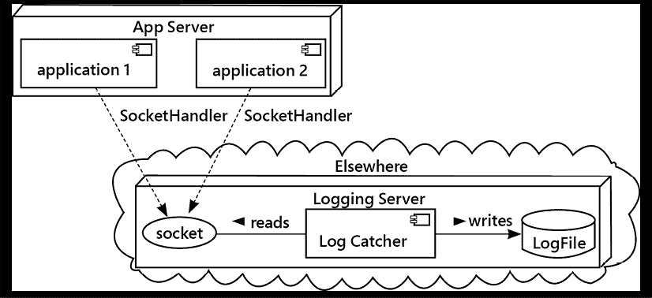
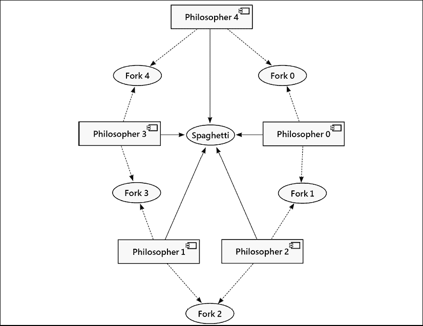
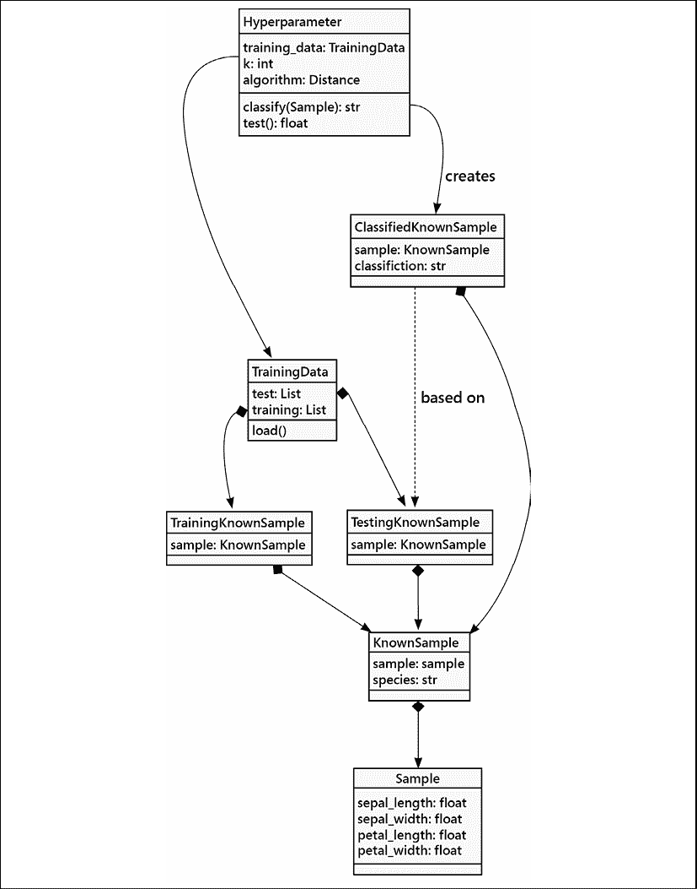

# 第十四章：并发

并发是让计算机同时（或看似同时）做多项工作的艺术。从历史上看，这意味着邀请处理器每秒在多个任务之间切换多次。在现代系统中，这也可以字面意义上理解为在单独的处理器核心上同时做两件或多件事。

并发本身并不是一个面向对象的课题，但 Python 的并发系统提供了面向对象的接口，正如我们在整本书中所述。本章将向您介绍以下主题：

+   线程

+   Multiprocessing

+   Futures

+   AsyncIO

+   餐饮哲学家基准

本章的案例研究将探讨我们如何加快模型测试和超参数调整的方法。我们无法消除计算，但我们可以利用现代的多核计算机来缩短完成时间。

并发进程可能会变得复杂。基本概念相当简单，但当状态变化序列不可预测时，可能出现的错误却难以追踪。然而，对于许多项目来说，并发是获得所需性能的唯一途径。想象一下，如果网络服务器不能在另一个用户的请求完成之前响应用户的请求会怎样！我们将探讨如何在 Python 中实现并发，以及一些需要避免的常见陷阱。

Python 语言明确地按顺序执行语句。为了考虑语句的并发执行，我们需要暂时离开 Python。

## 并发处理背景

从概念上讲，可以通过想象一群彼此看不见的人正在尝试协作完成一项任务来理解并发处理。或许他们的视力受损或被屏幕阻挡，或者他们的工作空间有难以看穿的尴尬门道。然而，这些人可以互相传递代币、笔记和正在进行中的工作。

想象一下在美国大西洋沿岸的一个古老海滨度假城市里的一家小熟食店，其柜台布局有些尴尬。两位三明治厨师彼此看不见也听不见对方。虽然店主可以支付得起两位优秀的厨师，但他却负担不起超过一个服务托盘的费用。由于古老建筑的尴尬复杂性，厨师们实际上也看不到托盘。他们被迫低头到柜台下面去确认服务托盘是否放置妥当。然后，确认托盘在位后，他们小心翼翼地将他们的艺术品——包括泡菜和一些薯片——放置到托盘上。（他们看不到托盘，但他们是非常出色的厨师，能够完美地放置三明治、泡菜和薯片。）

然而，店主可以看见厨师们。确实，过路人可以观看厨师们的工作。这是一场精彩的表演。店主通常严格按照交替的方式将订单票分发到每位厨师手中。而且通常，唯一的服务托盘可以放置得恰到好处，使得三明治能够以优雅的姿态送达餐桌。正如我们所说，厨师们必须等待，直到他们的下一件作品温暖了某人的味蕾。

然后，有一天，其中一位厨师（我们暂且称他为迈克尔，但他的朋友们叫他莫）几乎完成了订单，但不得不跑到冷却器那里去拿更多大家喜欢的酸黄瓜。这延误了莫的准备时间，店主看到另一位厨师康斯坦丁似乎会比莫早完成几秒钟。尽管莫已经拿回了酸黄瓜，并且准备好了三明治，但店主却做了件令人尴尬的事。规则很明确：先检查，然后放置三明治。店里每个人都清楚这一点。当店主把托盘从莫的工作站下面的开口移到康斯坦丁工作站下面的开口时，莫就把他们的作品——本应是一个加了额外泡菜的令人愉悦的鲁本三明治——放入本应放置托盘的空位，结果它溅到了熟食店的地上，让所有人都感到尴尬。

那个检查托盘、然后放置三明治的万无一失的方法怎么会失灵呢？它已经经受住了许多忙碌午餐时间的考验，然而，在常规事件顺序中的一次小小的干扰，就引发了一团糟。在检查托盘和放置三明治之间的时间间隔，是主人进行状态改变的机会。

老板和厨师之间有一场竞争。防止意外状态变化是并发编程的基本设计问题。

一种解决方案可能是使用一个信号量——一个标志——来防止对托盘的意外更改。这是一种共享锁。每位厨师在装盘前都必须抓住这个标志；一旦他们拿到标志，他们就可以确信主人不会移动托盘，直到他们把标志放回厨师站之间的那个小标志架上。

并发工作需要一种方法来同步对共享资源的访问。大型现代计算机的一个基本功能是通过操作系统特性来管理并发，这些特性统称为内核。

较老且体积较小的计算机，在单个 CPU 中只有一个核心，必须交错处理所有任务。巧妙的协调使得它们看起来像是在同一时间工作。较新的多核计算机（以及大型多处理器计算机）实际上可以并发执行操作，这使得工作调度变得更加复杂。

我们有几种方法来实现并发处理：

+   操作系统允许我们同时运行多个程序。Python 的 `subprocess` 模块为我们提供了对这些功能的便捷访问。`multiprocessing` 模块提供了一系列方便的工作方式。这相对容易启动，但每个程序都会被仔细隔离，与其他所有程序分开。它们如何共享数据呢？

+   一些巧妙的软件库允许一个程序拥有多个并发操作线程。Python 的 `threading` 模块为我们提供了多线程的访问权限。这需要更复杂的入门步骤，并且每个线程都可以完全访问所有其他线程中的数据。我们如何协调对共享数据结构的更新呢？

此外，`concurrent.futures` 和 `asyncio` 提供了对底层库更易于使用的包装器。我们将从本章开始，通过查看 Python 使用 `threading` 库来允许在单个操作系统进程中并发执行许多事情。这很简单，但在处理共享数据结构时有一些挑战。

# 线程

线程是一系列可能被中断和恢复的 Python 字节码指令。其理念是创建独立的、并发的线程，以便在程序等待 I/O 操作完成时，计算可以继续进行。

例如，服务器可以在等待前一个请求的数据到达的同时开始处理一个新的网络请求。或者，一个交互式程序可能在等待用户按下键时渲染动画或执行计算。记住，虽然一个人每分钟可以输入超过 500 个字符，但计算机每秒可以执行数十亿条指令。因此，在快速输入时，即使在单个按键之间，也可能发生大量的处理。

从理论上讲，在程序内部管理所有这些活动之间的切换是可能的，但实际上要完全正确地做到这一点几乎是不可能的。相反，我们可以依赖 Python 和操作系统来处理那些棘手的切换部分，而我们在创建看起来可以独立但同时又同时运行的对象。这些对象被称为**线程**。让我们来看一个基本的例子。我们将从线程处理的本质定义开始，如下面的类所示：

```py
class Chef(Thread):
    def __init__(self, name: str) -> None:
        super().__init__(name=name)
        self.total = 0
    def get_order(self) -> None:
        self.order = THE_ORDERS.pop(0)
    def prepare(self) -> None:
        """Simulate doing a lot of work with a BIG computation"""
        start = time.monotonic()
        target = start + 1 + random.random()
        for i in range(1_000_000_000):
            self.total += math.factorial(i)
            if time.monotonic() >= target:
                break
        print(
            f"{time.monotonic():.3f} {self.name} made {self.order}")
    def run(self) -> None:
        while True:
            try:
                self.get_order()
                self.prepare()
            except IndexError:
                break  # No more orders 
```

我们运行中的应用程序中的线程必须扩展`Thread`类并实现`run`方法。由`run`方法执行的任何代码都是一个独立的处理线程，独立调度。我们的线程依赖于一个全局变量`THE_ORDERS`，它是一个共享对象：

```py
import math
import random
from threading import Thread, Lock
import time
THE_ORDERS = [
    "Reuben",
    "Ham and Cheese",
    "Monte Cristo",
    "Tuna Melt",
    "Cuban",
    "Grilled Cheese",
    "French Dip",
    "BLT",
] 
```

在这个例子中，我们定义了订单为一个简单的、固定的值列表。在一个更大的应用中，我们可能会从套接字或队列对象中读取这些值。下面是启动程序运行的顶层程序：

```py
Mo = Chef("Michael")
Constantine = Chef("Constantine")
if __name__ == "__main__":
    random.seed(42)
    Mo.start()
    Constantine.start() 
```

这将创建两个线程。新的线程不会开始运行，直到我们在对象上调用`start()`方法。当两个线程开始运行后，它们都会从订单列表中弹出一个值，然后开始执行大量计算，并最终报告它们的状态。

输出看起来像这样：

```py
1.076 Constantine made Ham and Cheese
1.676 Michael made Reuben
2.351 Constantine made Monte Cristo
2.899 Michael made Tuna Melt
4.094 Constantine made Cuban
4.576 Michael made Grilled Cheese
5.664 Michael made BLT
5.987 Constantine made French Dip 
```

注意，三明治并不是按照`THE_ORDERS`列表中呈现的顺序完成的。每位厨师都以自己的（随机化）速度工作。改变种子值将改变时间，并可能略微调整顺序。

这个例子中重要的是线程正在共享数据结构，而并发性是由线程的巧妙调度所创造的，这种调度使得两个厨师线程的工作得以交错进行，从而产生并发的错觉。

在这个小例子中，对共享数据结构的唯一更新是从列表中弹出。如果我们创建自己的类并实现更复杂的状态变化，我们可能会发现使用线程时存在许多有趣且令人困惑的问题。

## 线程的许多问题

如果适当注意管理共享内存，线程可能是有用的，但现代的 Python 程序员由于几个原因往往避免使用它们。正如我们将看到的，还有其他方法可以编写并发编程，这些方法正在获得 Python 社区的更多关注。在转向多线程应用程序的替代方案之前，让我们先讨论一些潜在的问题。

### 共享内存

线程的主要问题也是它们的最大优势。线程可以访问所有进程内存以及所有变量。对共享状态的忽视也容易导致不一致性。

你是否遇到过一间房里只有一个开关，但有两个不同的人同时去打开它的情景？每个人（线程）都期望他们的行为能够将灯（一个变量）打开，但最终的结果（灯的状态）是关闭的，这与他们的期望不符。现在想象一下，如果这两个线程正在处理银行账户之间的资金转移或者管理车辆的巡航控制。

在线程编程中，解决这个问题的方法是**同步**对任何读取或（尤其是）写入共享变量的代码的访问。Python 的`threading`库提供了`Lock`类，可以通过`with`语句来创建一个上下文，在这个上下文中，单个线程可以访问更新共享对象。

同步解决方案在一般情况下是有效的，但很容易忘记将其应用于特定应用程序中的共享数据。更糟糕的是，由于不当使用同步而导致的错误很难追踪，因为线程执行操作的顺序是不一致的。我们无法轻易地重现错误。通常，最安全的方法是强制线程之间通过使用已经适当使用锁的轻量级数据结构来进行通信。Python 提供了 `queue.Queue` 类来实现这一点；多个线程可以写入队列，而单个线程则消费结果。这为我们提供了一个整洁、可重用、经过验证的技术，用于多个线程共享数据结构。`multiprocessing.Queue` 类几乎相同；我们将在本章的 *多进程* 部分讨论这一点。

在某些情况下，这些缺点可能被允许共享内存的一个优点所抵消：它速度快。如果多个线程需要访问一个巨大的数据结构，共享内存可以快速提供这种访问。然而，在 Python 中，两个在不同的 CPU 核心上运行的线程同时进行计算是不可能的，这一点通常抵消了这一优势。这把我们带到了我们关于线程的第二个问题。

### 全局解释器锁

为了高效管理内存、垃圾回收以及在本地库中对机器代码的调用，Python 有一个**全局解释器锁**，或称为**GIL**。这个锁无法关闭，并且意味着线程调度受到 GIL 的限制，防止任何两个线程同时进行计算；工作被人为地交错。当一个线程发起操作系统请求——例如，访问磁盘或网络——一旦线程开始等待操作系统请求完成，GIL 就会被释放。

GIL（全局解释器锁）常受到批评，主要是一些不了解其是什么或其对 Python 带来的好处的人。虽然它可能会干扰多线程计算密集型编程，但对于其他类型的工作负载的影响通常很小。当面对计算密集型算法时，切换到使用`dask`包来管理处理可能会有所帮助。有关此替代方案的更多信息，请参阅[`dask.org`](https://dask.org)。这本书《使用 Dask 在 Python 中进行可扩展数据分析》也可能很有参考价值。

虽然 GIL 可能是大多数人使用的 Python 参考实现中的一个问题，但在 IronPython 中可以选择性禁用。有关如何在 IronPython 中释放 GIL 以进行计算密集型处理的详细信息，请参阅 *《IronPython 烹饪书》*。

### 线程开销

与我们稍后将要讨论的其他异步方法相比，线程的一个额外限制是维护每个线程的成本。每个线程都需要占用一定量的内存（在 Python 进程和操作系统内核中）来记录该线程的状态。在各个线程之间切换也会消耗（少量）CPU 时间。这项工作在没有额外编码的情况下无缝进行（我们只需调用`start()`，其余的都会被处理），但这项工作仍然需要在某个地方发生。

这些成本可以通过重用线程来执行多个任务，从而在更大的工作量中摊销。Python 提供了 `ThreadPool` 功能来处理这个问题。它的行为与我们将很快讨论的 `ProcessPool` 完全相同，所以让我们将这次讨论推迟到本章的后面部分。

在下一节中，我们将探讨多线程的主要替代方案。`multiprocessing`模块使我们能够与操作系统级别的子进程进行工作。

# 多进程

在单个操作系统进程中存在线程；这就是它们可以共享访问公共对象的原因。我们也可以在进程级别进行并发计算。与线程不同，单独的进程不能直接访问其他进程设置的变量。这种独立性是有帮助的，因为每个进程都有自己的全局解释器锁（GIL）和自己的私有资源池。在现代的多核处理器上，一个进程可能有它自己的核心，允许与其他核心进行并发工作。

`multiprocessing` API 最初是为了模仿`threading` API 而设计的。然而，`multiprocessing`接口已经发展演变，在 Python 的最近版本中，它更稳健地支持更多功能。`multiprocessing`库是为了在需要并行执行 CPU 密集型任务且可用多个核心时设计的。当进程的大部分时间都在等待 I/O（例如，网络、磁盘、数据库或键盘）时，`multiprocessing`并不那么有用，但对于并行计算来说，这是可行的方法。

`multiprocessing`模块会启动新的操作系统进程来完成工作。这意味着每个进程都会运行一个独立的 Python 解释器副本。让我们尝试使用与`threading` API 提供的类似构造来并行化一个计算密集型操作，如下所示：

```py
from multiprocessing import Process, cpu_count
import time
import os
class MuchCPU(Process):
    def run(self) -> None:
        print(f"OS PID {os.getpid()}")
        s = sum(
            2*i+1 for i in range(100_000_000)
        )
if __name__ == "__main__":
    workers = [MuchCPU() for f in range(cpu_count())]
    t = time.perf_counter()
    for p in workers:
        p.start()
    for p in workers:
        p.join()
    print(f"work took {time.perf_counter() - t:.3f} seconds") 
```

这个例子只是让 CPU 计算一亿个奇数的总和。你可能不会认为这是一项有用的工作，但它可以在寒冷的日子里为你的笔记本电脑预热！

API 应该是熟悉的；我们实现了一个 `Process` 的子类（而不是 `Thread`），并实现了一个 `run` 方法。这个方法在执行一些激烈（尽管可能是错误的）工作之前，会打印出操作系统的 **进程 ID**（**PID**），这是分配给机器上每个进程的唯一数字。

请特别注意模块级代码周围的 `if __name__ == "__main__":` 保护措施，这可以防止在模块被导入时运行，而不是作为程序运行。这通常是一种良好的实践，但在使用 `multiprocessing` 模块时，这一点至关重要。在幕后，`multiprocessing` 模块可能需要在每个新进程中重新导入我们的应用程序模块，以便创建类并执行 `run()` 方法。如果我们允许整个模块在那个时刻执行，它将开始递归地创建新进程，直到操作系统耗尽资源，导致您的计算机崩溃。

这个演示为我们的机器上的每个处理器核心构建一个进程，然后启动并加入每个进程。在 2020 年的 2 GHz 四核英特尔酷睿 i5 的 MacBook Pro 上，输出如下：

```py
% python src/processes_1.py
OS PID 15492
OS PID 15493
OS PID 15494
OS PID 15495
OS PID 15497
OS PID 15496
OS PID 15498
OS PID 15499
work took 20.711 seconds 
```

前八行是打印在每个 `MuchCPU` 实例内部的进程 ID。最后一行显示，一亿次的求和运算大约需要 20 秒。在这 20 秒内，所有八个核心都运行在 100% 的负载，风扇嗡嗡作响，试图散发热量。

如果在`MuchCPU`中我们使用`threading.Thread`而不是`multiprocessing.Process`，输出将如下所示：

```py
% python src/processes_1.py
OS PID 15772
OS PID 15772
OS PID 15772
OS PID 15772
OS PID 15772
OS PID 15772
OS PID 15772
OS PID 15772
work took 69.316 seconds 
```

这次，线程是在同一个操作系统进程中运行的，运行时间长达三倍。显示结果显示没有哪个核心特别繁忙，这表明工作正在各个核心之间被转移。总体上的减速是 GIL（全局解释器锁）在处理密集型计算时的开销。

我们可能预计单进程版本至少是八进程版本的八倍长。缺乏一个简单的乘数表明，在 Python 处理低级指令、操作系统调度程序以及硬件本身的过程中涉及了多个因素。这表明预测是困难的，最好计划运行多个性能测试，使用多种软件架构。

启动和停止单个`进程`实例涉及很多开销。最常见的情况是拥有一个工作者池并将任务分配给它们。我们将在下一部分探讨这个问题。

## 多进程池

因为操作系统会细致地将每个进程分开，所以进程间通信变得非常重要。我们需要在这些分开的进程之间传递数据。一个真正常见的例子是有一个进程写入一个文件，另一个进程可以读取这个文件。当两个进程同时读写文件时，我们必须确保读取者正在等待写入者生成数据。操作系统的*管道*结构可以完成这个任务。在 shell 中，我们可以写`ps -ef | grep python`并将`ps`命令的输出传递给`grep`命令。这两个命令是并发运行的。对于 Windows PowerShell 用户，有类似类型的管道处理，使用不同的命令名称。（有关示例，请参阅[`docs.microsoft.com/en-us/powershell/scripting/learn/ps101/04-pipelines?view=powershell-7.1`](https://docs.microsoft.com/en-us/powershell/scripting/learn/ps101/04-pipelines?view=powershell-7.1)）

`multiprocessing` 包提供了一些实现进程间通信的额外方法。池可以无缝地隐藏数据在进程间移动的方式。使用池看起来就像是一个函数调用：你将数据传递给一个函数，它在另一个或多个进程中执行，当工作完成时，返回一个值。理解支持这一功能的工作量是很重要的：一个进程中的对象被序列化并通过操作系统进程管道传递。然后，另一个进程从管道中检索数据并反序列化它。所需的工作在子进程中完成，并产生一个结果。结果被序列化并通过管道传递回来。最终，原始进程反序列化并返回它。总的来说，我们将这种序列化、传输和反序列化称为数据的*序列化*。有关更多信息，请参阅*第九章*，*字符串、序列化和文件路径*。

进程间通信的序列化需要时间和内存。我们希望以最小的序列化成本完成尽可能多的有用计算。理想的混合比例取决于交换的对象的大小和复杂性，这意味着不同的数据结构设计将具有不同的性能水平。

性能预测很难进行。确保并发设计有效，对分析应用程序至关重要。

拥有这些知识，让所有这些机器运作的代码竟然出奇地简单。让我们来看一下计算一组随机数的所有质因数的问题。这是各种密码学算法的常见部分（更不用说对这些算法的攻击了！）。

因数分解某些加密算法使用的 232 位数字需要数月甚至数年的处理能力。以下实现虽然可读，但效率极低；即使因数分解一个 100 位的数字也需要数年。这没关系，因为我们想看到它在因数分解 9 位数字时消耗大量的 CPU 时间：

```py
from __future__ import annotations
from math import sqrt, ceil
import random
from multiprocessing.pool import Pool
def prime_factors(value: int) -> list[int]:
    if value in {2, 3}:
        return [value]
    factors: list[int] = []
    for divisor in range(2, ceil(sqrt(value)) + 1):
        quotient, remainder = divmod(value, divisor)
        if not remainder:
            factors.extend(prime_factors(divisor))
            factors.extend(prime_factors(quotient))
            break
    else:
        factors = [value]
    return factors
if __name__ == "__main__":
    to_factor = [
        random.randint(100_000_000, 1_000_000_000)
        for i in range(40_960)
    ]
    with Pool() as pool:
        results = pool.map(prime_factors, to_factor)
    primes = [
        value
        for value, factor_list in zip(to_factor, results)
            if len(factor_list) == 1
    ]
    print(f"9-digit primes {primes}") 
```

让我们专注于并行处理方面，因为计算因子的暴力递归算法已经很清晰了。我们创建了一个包含 40,960 个单独数字的`to_factor`列表。然后我们构建了一个多进程`pool`实例。

默认情况下，此池为运行在其上的机器中的每个 CPU 核心创建一个单独的进程。

pool 的 `map()` 方法接受一个函数和一个可迭代对象。池将可迭代对象中的每个值序列化，并将其传递给池中可用的工作进程，该进程在该值上执行函数。当该进程完成其工作后，它将结果的因子列表序列化，并将其传递回池。然后，如果池中还有更多工作可用，工作进程将承担下一项工作。

一旦池中的所有工作者完成处理（这可能需要一些时间），`results` 列表将被返回到原始进程，该进程一直在耐心地等待所有这些工作完成。`map()` 的结果将与请求的顺序相同。这使得使用 `zip()` 来匹配原始值与计算出的质因数变得合理。

通常使用类似的 `map_async()` 方法更为有用，即使进程仍在运行，该方法也会立即返回。在这种情况下，`results` 变量不会是一个值的列表，而是一个在未来客户端调用 `results.get()` 时返回值列表的合约（或协议或义务）。这个未来对象还具有如 `ready()` 和 `wait()` 等方法，允许我们检查是否所有结果都已就绪。这适用于完成时间高度可变的过程处理。

或者，如果我们事先不知道所有想要得到结果的值，我们可以使用`apply_async()`方法来排队一个单独的任务。如果池中有一个进程尚未工作，它将立即启动；否则，它将保留该任务，直到有可用的空闲工作进程。

池也可以被`关闭`；它们拒绝接受任何进一步的任务，但会继续处理队列中当前的所有任务。它们还可以被`终止`，这比关闭更进一步，拒绝启动队列中仍然存在的任何任务，尽管当前正在运行的任务仍然被允许完成。

对工人数量的限制有很多，包括以下内容：

+   只有`cpu_count()`个进程可以同时进行计算；任何数量的进程都可以等待。如果工作负载是 CPU 密集型的，那么增加工作者池的大小并不会使计算更快。然而，如果工作负载涉及大量的输入/输出，那么一个较大的工作者池可能会提高完成工作的速度。

+   对于非常大的数据结构，可能需要减少池中的工作者数量，以确保内存得到有效利用。

+   进程间的通信代价高昂；易于序列化的数据是最好的策略。

+   创建新的流程需要一定的时间；一个固定大小的池子有助于最小化这种成本的影响。

多进程池为我们提供了巨大的计算能力，而我们只需做相对较少的工作。我们需要定义一个可以执行并行计算的函数，并且需要使用`multiprocessing.Pool`类的实例将参数映射到该函数上。

在许多应用中，我们需要做的不仅仅是将参数值映射到复杂的结果。对于这些应用，简单的 `poll.map()` 可能就不够用了。对于更复杂的数据流，我们可以利用显式的待处理工作和计算结果队列。接下来，我们将探讨如何创建队列网络。

## 队列

如果我们需要对进程间的通信有更多控制，`queue`.`Queue` 数据结构非常有用。它提供了从一个进程向一个或多个其他进程发送消息的几种变体。任何可序列化的对象都可以发送到`Queue`中，但请记住，序列化可能是一个昂贵的操作，因此请保持这些对象小巧。为了说明队列，让我们构建一个小型的文本内容搜索引擎，该搜索引擎将所有相关条目存储在内存中。

这个特定的搜索引擎会并行扫描当前目录下的所有文件。为 CPU 上的每个核心构建一个进程。每个进程被指示将一些文件加载到内存中。让我们看看执行加载和搜索功能的函数：

```py
from __future__ import annotations
from pathlib import Path
from typing import List, Iterator, Optional, Union, TYPE_CHECKING
if TYPE_CHECKING:
    Query_Q = Queue[Union[str, None]]
    Result_Q = Queue[List[str]]
def search(
        paths: list[Path], 
        query_q: Query_Q, 
        results_q: Result_Q
) -> None:
    print(f"PID: {os.getpid()}, paths {len(paths)}")
    lines: List[str] = []
    for path in paths:
        lines.extend(
            l.rstrip() for l in path.read_text().splitlines())
    while True:
        if (query_text := query_q.get()) is None:
            break
        results = [l for l in lines if query_text in l]
        results_q.put(results) 
```

记住，`search()` 函数是在一个单独的进程中运行的（实际上，它是在 `cpu_count()` 个单独的进程中运行的），与创建队列的主进程是分开的。每个这些进程都是以一个 `pathlib.Path` 对象列表和一个 `multiprocessing.Queue` 对象列表启动的，一个用于接收查询，另一个用于发送输出结果。这些队列会自动将队列中的数据序列化，并通过管道传递给子进程。这两个队列在主进程中设置，并通过管道传递到子进程中的搜索函数内部。

类型提示反映了**mypy**希望了解每个队列中数据结构的方式。当`TYPE_CHECKING`为`True`时，意味着**mypy**正在运行，并且需要足够的细节来确保应用程序中的对象与每个队列中对象的描述相匹配。当`TYPE_CHECKING`为`False`时，这是应用程序的普通运行时，无法提供队列消息的结构细节。

`search()` 函数执行两个不同的操作：

1.  当它启动时，它会打开并读取列表中的所有`Path`对象所提供的文件。这些文件中的每一行文本都会累积到`lines`列表中。这种准备相对昂贵，但它只执行一次。

1.  `while`循环语句是搜索的主要事件处理循环。它使用`query_q.get()`从其队列中获取一个请求。它搜索行。它使用`results_q.put()`将响应放入结果队列。

`while`循环语句具有基于队列处理的典型设计模式。该过程将从待执行工作的队列中获取一个值，执行工作，然后将结果放入另一个队列。我们可以将非常庞大和复杂的问题分解为处理步骤和队列，以便工作可以并行执行，从而在更短的时间内产生更多结果。这种技术还允许我们调整处理步骤和工人的数量，以最大限度地利用处理器。

应用程序的主要部分构建了这个工作者和他们的队列的池。我们将遵循**外观**设计模式（更多信息请参阅*第十二章*，*高级设计模式*）。这里的想法是定义一个类，`DirectorySearch`，将队列和工作进程池封装成一个单一的对象。

此对象可以设置队列和工作者，然后应用程序可以通过发布查询和消费回复与它们交互。

```py
from __future__ import annotations
from fnmatch import fnmatch
import os
class DirectorySearch:
    def __init__(self) -> None:
        self.query_queues: List[Query_Q]
        self.results_queue: Result_Q
        self.search_workers: List[Process]
    def setup_search(
        self, paths: List[Path], cpus: Optional[int] = None) -> None:
        if cpus is None:
            cpus = cpu_count()
        worker_paths = [paths[i::cpus] for i in range(cpus)]
        self.query_queues = [Queue() for p in range(cpus)]
        self.results_queue = Queue()
        self.search_workers = [
            Process(
                target=search, args=(paths, q, self.results_queue))
            for paths, q in zip(worker_paths, self.query_queues)
        ]
        for proc in self.search_workers:
            proc.start()
    def teardown_search(self) -> None:
        # Signal process termination
        for q in self.query_queues:
            q.put(None)
        for proc in self.search_workers:
            proc.join()
    def search(self, target: str) -> Iterator[str]:
        for q in self.query_queues:
            q.put(target)
        for i in range(len(self.query_queues)):
            for match in self.results_queue.get():
                yield match 
```

`setup_search()` 方法准备工作子进程。`[i::cpus]` 切片操作使我们能够将这个列表分成若干个大小相等的部分。如果 CPU 的数量是 8，步长将是 8，我们将使用从 0 到 7 的 8 个不同的偏移值。我们还构建了一个 `Queue` 对象列表，用于将数据发送到每个工作进程。最后，我们构建了一个 **单个** 的结果队列。这个队列被传递给所有的工作子进程。每个子进程都可以将数据放入队列，它将在主进程中汇总。

一旦创建了队列并启动了工作者，`search()` 方法会一次性将目标提供给所有工作者。然后他们可以开始检查各自的数据集合以发出答案。

由于我们需要搜索相当多的目录，我们使用生成器函数`all_source()`来定位给定`base`目录下所有的`*.py` `Path`对象。下面是查找所有源文件的函数：

```py
def all_source(path: Path, pattern: str) -> Iterator[Path]:
    for root, dirs, files in os.walk(path):
        for skip in {".tox", ".mypy_cache", "__pycache__", ".idea"}:
            if skip in dirs:
                dirs.remove(skip)
        yield from (
            Path(root) / f for f in files if fnmatch(f, pattern)) 
```

`all_source()` 函数使用 `os.walk()` 函数来检查目录树，拒绝包含我们不希望查看的文件的目录。此函数使用 `fnmatch` 模块将文件名与 Linux shell 使用的通配符模式进行匹配。例如，我们可以使用模式参数 `'*.py'` 来查找所有以 `.py` 结尾的文件。这为 `DirectorySearch` 类的 `setup_search()` 方法提供了种子。

`DirectorySearch` 类的 `teardown_search()` 方法将一个特殊的终止值放入每个队列中。记住，每个工作进程是一个独立的过程，它在 `search()` 函数内部执行 `while` 语句并从请求队列中读取。当它读取到一个 `None` 对象时，它将退出 `while` 语句并退出函数。然后我们可以使用 `join()` 来收集所有子进程，礼貌地清理。（如果我们不执行 `join()`，一些 Linux 发行版可能会留下“僵尸进程”——因为父进程崩溃而没有正确重新连接到父进程的子进程；这些进程消耗系统资源，通常需要重启。）

现在让我们看看实现搜索功能的具体代码：

```py
if __name__ == "__main__":
    ds = DirectorySearch()
    base = Path.cwd().parent
    all_paths = list(all_source(base, "*.py"))
    ds.setup_search(all_paths)
    for target in ("import", "class", "def"):
        start = time.perf_counter()
        count = 0
        for line in ds.search(target):
            **# print(line)**
            count += 1
        milliseconds = 1000*(time.perf_counter()-start)
        print(
            f"Found {count} {target!r} in {len(all_paths)} files "
            f"in {milliseconds:.3f}ms"
        )
    ds.teardown_search() 
```

此代码创建了一个`DirectorySearch`对象，命名为`ds`，并通过`base = Path.cwd().parent`从当前工作目录的父目录开始提供所有源路径。一旦工作者准备就绪，`ds`对象将执行对几个常见字符串的搜索，包括`"import"`、`"class"`和`"def"`。请注意，我们已注释掉显示有用结果的`print(line)`语句。目前，我们关注的是性能。初始文件读取只需几分之一秒即可开始。然而，一旦所有文件都读取完毕，搜索所需的时间将显著增加。在一台装有 134 个源代码文件的 MacBook Pro 上，输出看起来如下：

```py
python src/directory_search.py
PID: 36566, paths 17
PID: 36567, paths 17
PID: 36570, paths 17
PID: 36571, paths 17
PID: 36569, paths 17
PID: 36568, paths 17
PID: 36572, paths 16
PID: 36573, paths 16
Found 579 'import' in 134 files in 111.561ms
Found 838 'class' in 134 files in 1.010ms
Found 1138 'def' in 134 files in 1.224ms 
```

搜索 `"import"` 花了大约 111 毫秒（0.111 秒）。为什么这个搜索速度比其他两个搜索慢这么多？这是因为当第一个请求被放入队列时，`search()` 函数仍在读取文件。第一个请求的性能反映了将文件内容加载到内存中的一次性启动成本。接下来的两个请求每个大约运行 1 毫秒。这太令人惊讶了！在只有几行 Python 代码的笔记本电脑上，几乎可以达到每秒 1,000 次搜索。

这个在工作者之间传递数据的队列示例是一个单主机版本的分布式系统可能成为的样子。想象一下，搜索请求被发送到多个主机计算机，然后重新组合。现在，假设你能够访问谷歌数据中心中的计算机集群，你可能就会明白为什么它们能够如此快速地返回搜索结果了！

我们在这里不会讨论它，但`multiprocessing`模块包含一个管理类，可以移除前面代码中的许多样板代码。甚至有一个版本的`multiprocessing.Manager`可以管理远程系统上的子进程，以构建一个基本的分布式应用程序。如果你对此感兴趣并想进一步了解，请查看 Python 的`multiprocessing`文档。

## 多进程的问题

与线程一样，多进程也有问题，其中一些我们已经讨论过了。进程间共享数据是昂贵的。正如我们讨论过的，所有进程间的通信，无论是通过队列、操作系统管道，甚至是共享内存，都需要序列化对象。过度的序列化可能会主导处理时间。通过限制序列化到共享内存的初始设置，共享内存对象可以有所帮助。当需要在进程间传递相对较小的对象，并且每个对象都需要完成大量工作时，多进程工作得最好。

使用共享内存可以避免重复序列化和反序列化的成本。可以共享的 Python 对象类型存在许多限制。共享内存有助于提高性能，但也可能导致 Python 对象看起来更加复杂。

多进程的另一个主要问题是，就像线程一样，很难确定变量或方法是在哪个进程中访问的。在多进程中，工作进程会从父进程继承大量数据。这不是共享的，而是一次性复制。子进程可以被赋予一个映射或列表的副本，并修改对象。父进程将看不到子进程修改的效果。

多进程的一个大优点是进程之间的绝对独立性。我们不需要仔细管理锁，因为数据不共享。此外，内部操作系统对打开文件数量的限制是在进程级别分配的；我们可以拥有大量资源密集型进程。

当设计并发应用程序时，重点是最大化 CPU 的使用，尽可能在尽可能短的时间内完成更多工作。在如此多的选择面前，我们总是需要检查问题，以确定众多可用解决方案中哪一个最适合该问题。

并行处理的概念过于宽泛，以至于没有一种正确的方式来执行它。每个独特的问题都有一个最佳解决方案。编写代码时，重要的是要使其能够调整、微调和优化。

我们已经探讨了 Python 中并行的两种主要工具：线程和进程。线程存在于单个操作系统进程中，共享内存和其他资源。进程之间是独立的，这使得进程间通信成为必要的开销。这两种方法都适用于概念上有一组并发的工作者等待工作并在未来的某个不可预测的时间提供结果。这种结果在未来可用的抽象正是塑造了 `concurrent.futures` 模块的基础。我们接下来将探讨这一点。

# 期货

让我们开始探讨一种更异步的实现并发的方式。一个“未来”或“承诺”的概念是描述并发工作的一个便捷的抽象。一个**未来**对象封装了一个函数调用。这个函数调用在*后台*，在一个线程或一个单独的进程中运行。`future`对象有方法来检查计算是否完成以及获取结果。我们可以将其视为一个结果将在未来到达的计算，同时我们可以等待结果的过程中做其他事情。

查看更多背景信息，请访问[`hub.packtpub.com/asynchronous-programming-futures-and-promises/`](https://hub.packtpub.com/asynchronous-programming-futures-and-promises/)。

在 Python 中，`concurrent.futures`模块根据我们需要哪种并发性来封装`multiprocessing`或`threading`。一个未来（future）并不能完全解决意外改变共享状态的问题，但使用未来（future）允许我们以这样的方式结构化我们的代码，使得在出现问题时更容易追踪问题的原因。

期货可以帮助管理不同线程或进程之间的边界。类似于多进程池，它们对于**调用和响应**类型的交互非常有用，在这种交互中，处理可以在另一个线程（或进程）中进行，然后在未来的某个时刻（毕竟，它们的名字很贴切），你可以请求结果。它是对多进程池和线程池的封装，但它提供了一个更干净的 API，并鼓励编写更好的代码。

让我们看看另一个更复杂的文件搜索和分析示例。在上一个部分，我们实现了一个 Linux `grep`命令的版本。这次，我们将创建一个简单的`find`命令版本，其中包含对 Python 源代码的巧妙分析。我们将从分析部分开始，因为它是我们需要同时完成的工作的核心：

```py
class ImportResult(NamedTuple):
    path: Path
    imports: Set[str]
    @property
    def focus(self) -> bool:
        return "typing" in self.imports
class ImportVisitor(ast.NodeVisitor):
    def __init__(self) -> None:
        self.imports: Set[str] = set()
    def visit_Import(self, node: ast.Import) -> None:
        for alias in node.names:
            self.imports.add(alias.name)
    def visit_ImportFrom(self, node: ast.ImportFrom) -> None:
        if node.module:
            self.imports.add(node.module)
def find_imports(path: Path) -> ImportResult:
    tree = ast.parse(path.read_text())
    iv = ImportVisitor()
    iv.visit(tree)
    return ImportResult(path, iv.imports) 
```

我们在这里定义了一些东西。我们从一个命名元组开始，`ImportResult`，它将一个`Path`对象和一组字符串绑定在一起。它有一个属性，`focus`，用于在字符串集中查找特定的字符串，`"typing"`。我们很快就会看到这个字符串为什么如此重要。

`ImportVisitor` 类是使用标准库中的 `ast` 模块构建的。**抽象语法树**（**AST**）是解析后的源代码，通常来自一种正式的编程语言。毕竟，Python 代码只是一堆字符；Python 代码的 AST 将文本分组为有意义的语句和表达式、变量名和运算符，这些都是语言的语法组成部分。访问者有一个方法来检查解析后的代码。我们为 `NodeVisitor` 类的两个方法提供了覆盖，因此我们只会访问两种导入语句：`import x` 和 `from x import y`。每个 `node` 数据结构的工作细节略超出了这个示例的范围，但标准库中的 `ast` 模块文档描述了每个 Python 语言结构的独特结构。

`find_imports()` 函数读取一些源代码，解析 Python 代码，遍历 `import` 语句，然后返回一个包含原始 `Path` 和由访问者找到的名称集合的 `ImportResult`。这在许多方面——都比简单的 `"import"` 模式匹配要好得多。例如，使用 `ast.NodeVisitor` 将会跳过注释并忽略字符字符串字面量内的文本，这两项任务用正则表达式来做是比较困难的。

`find_imports()` 函数并没有什么特别之处，但请注意它并没有访问任何全局变量。所有与外部环境的交互都是传递给函数或从函数返回的。这并不是一个技术要求，但这是在用 futures 编程时保持你的大脑在头骨内的最佳方式。

我们虽然想要处理成百上千个文件，分布在几十个目录中。最佳的方法是同时运行大量这样的任务，让我们的 CPU 核心被大量的计算所堵塞。

```py
def main() -> None:
    start = time.perf_counter()
    base = Path.cwd().parent
    with futures.ThreadPoolExecutor(24) as pool:
        analyzers = [
           pool.submit(find_imports, path) 
           for path in all_source(base, "*.py")
        ]
        analyzed = (
            worker.result() 
            for worker in futures.as_completed(analyzers)
        )
    for example in sorted(analyzed):
        print(
            f"{'->' if example.focus else '':2s} " 
            f"{example.path.relative_to(base)} {example.imports}"
        )
    end = time.perf_counter()
    rate = 1000 * (end - start) / len(analyzers)
    print(f"Searched {len(analyzers)} files at {rate:.3f}ms/file") 
```

我们正在利用本章前面“队列”部分展示的相同`all_source()`函数；这需要一个起始搜索的基础目录，以及一个模式，例如`"*.py"`，以找到所有具有`.py`扩展名的文件。我们创建了一个`ThreadPoolExecutor`，分配给`pool`变量，包含二十多个工作线程，都在等待任务。我们在`analyzers`对象中创建了一个`Future`对象列表。这个列表是通过列表推导式应用`pool.submit()`方法到我们的搜索函数`find_imports()`以及`all_source()`的输出中的`Path`创建的。

池中的线程将立即开始处理提交的任务列表。随着每个线程完成工作，它会在`Future`对象中保存结果，并继续取一些工作来做。

同时，在前景中，应用程序使用生成器表达式来评估每个 `Future` 对象的 `result()` 方法。请注意，这些 `Future` 对象是通过 `futures.as_completed()` 生成器进行访问的。该函数开始提供完整的 `Future` 对象，一旦它们可用。这意味着结果可能不会按照最初提交的顺序出现。还有其他访问 `Future` 对象的方法；例如，我们可以等待所有对象都完成，然后再按照提交的顺序访问它们，如果这是重要的。

我们从每个 `Future` 中提取结果。从类型提示中，我们可以看到这将是一个带有 `Path` 和一系列字符串的 `ImportResult` 对象；这些是导入模块的名称。我们可以对结果进行排序，这样文件就会以某种合理的顺序显示。

在 MacBook Pro 上，处理每个文件大约需要 1.689 毫秒（0.001689 秒）。24 个独立的线程可以轻松地在一个进程中运行，而不会对操作系统造成压力。增加线程数量对运行时间的影响并不显著，这表明任何剩余的瓶颈不是并发计算，而是对目录树进行初始扫描和创建线程池的过程。

`ImportResult` 类的 `focus` 功能是什么？为什么 `typing` 模块是特殊的？在本书的开发过程中，每当 **mypy** 发布新版本时，我们需要回顾每一章的类型提示。将模块分为那些需要仔细检查的和那些不需要修订的是很有帮助的。

这就是开发基于未来的 I/O 密集型应用所需的所有内容。在底层，它使用的是我们之前已经讨论过的相同线程或进程 API，但它提供了一个更易于理解的接口，并使得查看并发运行函数之间的边界变得更加容易（只是不要尝试在 future 内部访问全局变量！）。

在没有适当同步的情况下访问外部变量可能会导致一个称为**竞态条件**的问题。例如，想象有两个并发写入尝试增加一个整数计数器。它们同时开始，并且两个线程都读取共享变量的当前值为 5。一个线程在竞争中先到达；它增加值并写入 6。另一个线程随后到达；它增加变量原来的值，也写入 6。但如果两个进程都在尝试增加一个变量，预期的结果应该是它增加 2，所以结果应该是 7。

现代智慧认为，避免这样做最简单的方法是尽可能将状态保持为私有，并通过已知安全的结构，如队列或未来对象，来共享它们。

对于许多应用，`concurrent.futures`模块是设计 Python 代码时的起点。对于非常复杂的情况，较低级别的`threading`和`multiprocessing`模块提供了一些额外的结构。

使用 `run_in_executor()` 允许应用程序利用 `concurrent.futures` 模块的 `ProcessPoolExecutor` 或 `ThreadPoolExecutor` 类将工作分配给多个进程或多个线程。这为整洁、人性化的 API 提供了很大的灵活性。

在某些情况下，我们并不真的需要并发进程。在某些情况下，我们只需要能够来回切换，在等待数据时进行等待，当数据可用时进行计算。Python 的 `async` 特性，包括 `asyncio` 模块，可以在单个线程内交错处理。我们将在下一节中探讨并发主题的这种变体。

# 异步 IO

AsyncIO 是 Python 并发编程的当前最佳实践。它结合了未来（futures）和事件循环（event loop）的概念与协程（coroutines）。结果是尽可能优雅且易于理解，尤其是在编写响应式应用程序时，这些应用程序似乎不会浪费时间等待输入。

为了使用 Python 的 `async` 功能，一个 *协程* 是一个等待事件发生的函数，同时也可以为其他协程提供事件。在 Python 中，我们使用 `async def` 来实现协程。带有 `async` 的函数必须在 **事件循环** 的上下文中工作，该循环在等待事件的协程之间切换控制。我们将看到一些使用 `await` 表达式的 Python 构造，以展示事件循环可以切换到另一个 `async` 函数的情况。

认识到`异步`操作是交错进行的，而不是通常意义上的并行，这一点至关重要。最多只有一个协程处于控制状态并进行处理，而其他所有协程都在等待事件发生。交错的概念被描述为**协作多任务处理**：一个应用程序可以在处理数据的同时等待下一个请求消息的到来。当数据可用时，事件循环可以将控制权传递给其中一个等待的协程。

AsyncIO 偏向于网络 I/O。大多数网络应用程序，尤其是在服务器端，花费大量时间等待从网络中接收数据。AsyncIO 可以比单独为每个客户端处理一个线程更高效；这样一些线程可以工作，而其他线程则等待。问题是这些线程会消耗内存和其他资源。当数据可用时，AsyncIO 使用协程来交错处理周期。

线程调度依赖于操作系统请求的线程（以及在某种程度上，全局解释器锁（GIL）对线程的交织）。进程调度依赖于操作系统的整体调度器。线程和进程调度都是**抢占式**的——线程（或进程）可以被中断，以便允许不同优先级的线程或进程控制 CPU。这意味着线程调度是不可预测的，如果多个线程将要更新共享资源，那么锁就很重要。在操作系统层面，如果两个进程想要更新共享的操作系统资源，如文件，则需要共享锁。与线程和进程不同，AsyncIO 协程是**非抢占式**的；它们在处理过程中的特定点明确地将控制权交给对方，从而消除了对共享资源显式锁定的需要。

`asyncio` 库提供了一个内置的 *事件循环*：这是处理运行协程之间交错控制的循环。然而，事件循环也有其代价。当我们在一个事件循环上的 `async` 任务中运行代码时，该代码 *必须* 立即返回，既不能阻塞 I/O，也不能阻塞长时间的计算。在编写我们自己的代码时，这算是一件小事，但这意味着任何阻塞 I/O 的标准库或第三方函数都必须用可以礼貌等待的 `async def` 函数包装。

当使用 `asyncio` 时，我们将以一组协程的形式编写我们的应用程序，这些协程使用 `async` 和 `await` 语法通过事件循环来交错控制。因此，顶层“main”程序的任务简化为运行事件循环，这样协程就可以来回传递控制权，交错等待和工作。

## AsyncIO 实战

阻塞函数的一个典型例子是`time.sleep()`调用。我们不能直接调用`time`模块的`sleep()`函数，因为它会夺取控制权，使事件循环停滞。我们将使用`asyncio`模块中的`sleep()`版本。在`await`表达式中使用时，事件循环可以在等待`sleep()`完成的同时，交错执行另一个协程。以下我们将使用这个调用的异步版本来展示 AsyncIO 事件循环的基本原理，具体如下：

```py
import asyncio
import random
async def random_sleep(counter: float) -> None:
    delay = random.random() * 5
    print(f"{counter} sleeps for {delay:.2f} seconds")
    await asyncio.sleep(delay)
    print(f"{counter} awakens, refreshed")
async def sleepers(how_many: int = 5) -> None:
    print(f"Creating {how_many} tasks")
    tasks = [
        asyncio.create_task(random_sleep(i)) 
        for i in range(how_many)]
    print(f"Waiting for {how_many} tasks")
    await asyncio.gather(*tasks)
if __name__ == "__main__":
    asyncio.run(sleepers(5))
    print("Done with the sleepers") 
```

本例涵盖了 AsyncIO 编程的几个特性。整体处理过程由 `asyncio.run()` 函数启动。这启动了事件循环，执行 `sleepers()` 协程。在 `sleepers()` 协程中，我们创建了一些单独的任务；这些是带有给定参数值的 `random_sleep()` 协程的实例。`random_sleep()` 使用 `asyncio.sleep()` 来模拟长时间运行请求。

因为这是使用 `async def` 函数和围绕 `asyncio.sleep()` 的 `await` 表达式构建的，所以 `random_sleep()` 函数的执行和整个 `sleepers()` 函数的执行是交织在一起的。虽然 `random_sleep()` 请求是按照它们的 `counter` 参数值顺序启动的，但它们完成时的顺序却完全不同。以下是一个例子：

```py
python src/async_1.py 
Creating 5 tasks
Waiting for 5 tasks
0 sleeps for 4.69 seconds
1 sleeps for 1.59 seconds
2 sleeps for 4.57 seconds
3 sleeps for 3.45 seconds
4 sleeps for 0.77 seconds
4 awakens, refreshed
1 awakens, refreshed
3 awakens, refreshed
2 awakens, refreshed
0 awakens, refreshed
Done with the sleepers 
```

我们可以看到，`random_sleep()` 函数在 `counter` 值为 `4` 时具有最短的睡眠时间，并且在完成 `await asyncio.sleep()` 表达式后首先获得控制权。唤醒的顺序严格基于随机睡眠间隔，以及事件循环从协程到协程传递控制的能力。

作为异步程序员，我们不需要过多了解`run()`函数内部发生的事情，但要注意，有很多操作正在进行，以追踪哪些协程正在等待，以及哪些协程在当前时刻应该拥有控制权。

在这个语境中，一个任务是一个`asyncio`知道如何在事件循环中安排的对象。这包括以下内容：

+   使用 `async def` 语句定义的协程。

+   `asyncio.Future` 对象。这些与上一节中你看到的 `concurrent.futures` 几乎相同，但用于 `asyncio`。

+   任何可等待的对象，即具有`__await__()`函数的对象。

在这个例子中，所有任务都是协程；我们将在后续的例子中看到其他一些。

仔细观察一下那个 `sleepers()` 协程。它首先构建了 `random_sleep()` 协程的实例。这些实例每个都被 `asyncio.create_task()` 调用所包装，这会将它们作为未来任务添加到循环的任务队列中，以便它们可以在控制权返回到循环时立即执行并启动。

每当我们调用 `await` 时，控制权都会返回到事件循环。在这种情况下，我们调用 `await asyncio.gather()` 以将控制权交予其他协程，直到所有任务完成。

每个 `random_sleep()` 协程都会打印一条启动信息，然后通过自己的 `await` 调用将控制权返回给事件循环一段时间。当睡眠完成时，事件循环将控制权返回给相应的 `random_sleep()` 任务，该任务在返回之前会打印一条唤醒信息。

`async` 关键字充当文档说明，通知 Python 解释器（和程序员）协程包含 `await` 调用。它还做一些工作来准备协程在事件循环上运行。它的行为很像一个装饰器；实际上，在 Python 3.4 之前，它曾经被实现为一个 `@asyncio.coroutine` 装饰器。

## 阅读 AsyncIO 未来

AsyncIO 协程按顺序执行每行代码，直到遇到 `await` 表达式，此时它将控制权交还给事件循环。事件循环随后执行任何其他准备就绪的任务，包括原始协程所等待的任务。每当那个子任务完成时，事件循环将结果发送回协程，以便它可以继续执行，直到遇到另一个 `await` 表达式或返回。

这使得我们能够编写同步执行的代码，直到我们明确需要等待某事发生。因此，线程没有非确定性行为，所以我们不必如此担心共享状态。

限制共享状态是个好主意：一种*无共享*的哲学可以防止许多由有时难以想象的交错操作时间线引发的困难 bug。

将操作系统调度器想象成故意且邪恶的；它们会恶意地（以某种方式）在进程、线程或协程中找到最糟糕的操作序列。

AsyncIO 的真正价值在于它允许我们将代码的逻辑部分集合在一个单独的协程中，即使我们在等待其他地方的工作。作为一个具体的例子，尽管在 `random_sleep()` 协程中调用的 `await asyncio.sleep` 允许在事件循环中发生大量的事情，但协程本身看起来像是在有序地进行所有操作。这种无需担心等待任务完成的机制就能阅读相关异步代码的能力，是 AsyncIO 模块的主要优势。

## 异步 IO 网络编程

我们将重写那个示例，创建一个基于 `asyncio` 的服务器，能够处理来自（大量）客户端的请求。它可以通过拥有许多协程来实现，所有协程都在等待日志记录的到来。当记录到达时，一个协程可以保存记录，进行一些计算，而其他协程则等待。

在*第十三章*中，我们感兴趣的是编写一个测试，用于将日志捕获过程与独立的日志编写客户端应用程序过程进行集成。以下是涉及关系的说明：



图 14.1：天空中日志捕捉器

日志捕获进程创建一个套接字服务器以等待来自所有客户端应用程序的连接。每个客户端应用程序都使用`logging.SocketHandler`将日志消息直接发送到等待的服务器。服务器收集这些消息并将它们写入一个单独的、集中的日志文件。

这次测试基于*第十二章*中的一个示例，该示例的实现较弱。为了使该章节内容简单，日志服务器当时只能同时与一个应用程序客户端协同工作。我们希望重新审视收集日志消息的服务器这一想法。这种改进的实现将能够处理非常大量的并发客户端，因为它使用了 AsyncIO 技术。

本设计的核心部分是一个协程，它从套接字中读取日志条目。这涉及到等待构成头部的字节，然后解码头部以计算有效负载的大小。协程可以读取日志消息有效负载所需的正确数量的字节，然后使用另一个协程来处理有效负载。下面是`log_catcher()`函数：

```py
SIZE_FORMAT = ">L"
SIZE_BYTES = struct.calcsize(SIZE_FORMAT)
async def log_catcher(
    reader: asyncio.StreamReader, writer: asyncio.StreamWriter
) -> None:
    count = 0
    client_socket = writer.get_extra_info("socket")
    size_header = await reader.read(SIZE_BYTES)
    while size_header:
        payload_size = struct.unpack(SIZE_FORMAT, size_header)
        bytes_payload = await reader.read(payload_size[0])
        await log_writer(bytes_payload)
        count += 1
        size_header = await reader.read(SIZE_BYTES)
    print(f"From {client_socket.getpeername()}: {count} lines") 
```

这个 `log_catcher()` 函数实现了 `logging` 模块的 `SocketHandler` 类所使用的协议。每个日志条目都是一个我们可以分解为头部和有效负载的字节块。我们需要读取存储在 `size_header` 中的前几个字节，以获取随后消息的大小。一旦我们有了大小，我们就可以等待有效负载字节到达。由于这两个读取操作都是 `await` 表达式，因此当这个函数等待头部和有效负载字节到达时，其他协程可以工作。

`log_catcher()` 函数由一个提供 `StreamReader` 和 `StreamWriter` 的服务器调用。这两个对象封装了由 TCP/IP 协议创建的套接字对。流读取器（以及写入器）是适当的异步感知对象，我们可以在等待从客户端读取字节时使用 `await`。

这个 `log_catcher()` 函数等待套接字数据，然后将数据提供给另一个协程 `log_writer()` 进行转换和写入。`log_catcher()` 函数的工作是进行大量的等待，然后将数据从读取器传输到写入器；它还进行内部计算以统计来自客户端的消息。增加计数器并不是什么大事，但这是在等待数据到达时可以完成的工作。

这里有一个函数`serialize()`和一个协程`log_writer()`，用于将日志条目转换为 JSON 表示法并将其写入文件：

```py
TARGET: TextIO
LINE_COUNT = 0
def serialize(bytes_payload: bytes) -> str:
    object_payload = pickle.loads(bytes_payload)
    text_message = json.dumps(object_payload)
    TARGET.write(text_message)
    TARGET.write("\n")
    return text_message
async def log_writer(bytes_payload: bytes) -> None:
    global LINE_COUNT
    LINE_COUNT += 1
    text_message = await asyncio.to_thread(serialize, bytes_payload) 
```

`serialize()` 函数需要一个已打开的文件，名为 `TARGET`，日志消息将被写入该文件。文件的打开（和关闭）需要在应用程序的其他地方处理；我们将在下面查看这些操作。`serialize()` 函数被 `log_writer()` 协程使用。因为 `log_writer()` 是一个 `async` 协程，其他协程将等待读取和解码输入消息，而在此协程写入它们时。

`serialize()` 函数实际上执行了相当多的计算。它还隐藏着一个深刻的问题。文件写入操作可能会被阻塞，也就是说，它会卡在等待操作系统完成工作的状态。向磁盘写入意味着将工作交给磁盘设备，并等待设备响应写入操作已完成。虽然写入包含 1,000 个字符的行数据可能只需要微秒级的时间，但对于 CPU 来说却是永恒的。这意味着所有文件操作都会阻塞它们的线程，等待操作完成。为了与主线程中的其他协程礼貌地协作，我们将这项阻塞工作分配给一个单独的线程。这就是为什么`log_writer()`协程使用`asyncio.to_thread()`将这项工作分配给一个单独的线程的原因。

因为`log_writer()`协程在这个单独的线程上使用了`await`，所以在等待写入完成时，它将控制权交回事件循环。这种礼貌的`await`允许其他协程在`log_writer()`协程等待`serialize()`完成时继续工作。

我们已经将两种工作传递给了单独的线程：

+   一个计算密集型操作。这些是`pickle.loads()`和`json.dumps()`操作。

+   一个阻塞的操作系统操作。这是 `TARGET.write()`。这些阻塞操作包括大多数操作系统请求，包括文件操作。它们不包括已经是 `asyncio` 模块一部分的各种网络流。正如我们在上面的 `log_catcher()` 函数中看到的，流已经是事件循环的礼貌用户。

将工作传递给线程的这种技术是我们确保事件循环尽可能多地花费时间等待的方法。如果所有协程都在等待事件，那么接下来发生的事情将会尽可能快地得到响应。众多等待者的这一原则是响应式服务的秘密。

全局变量 `LINE_COUNT` 可能会让人感到惊讶。回想一下前面的章节，我们曾对多个线程同时更新共享变量的后果发出过严重警告。在 `asyncio` 中，线程之间没有抢占。因为每个协程都通过事件循环使用显式的 `await` 请求将控制权交给其他协程，所以我们可以在 `log_writer()` 协程中更新这个变量，知道状态变化将有效地对所有协程是原子的——不可分割的更新。

为了使这个示例完整，以下是所需的导入：

```py
from __future__ import annotations
import asyncio
import asyncio.exceptions
import json
from pathlib import Path
from typing import TextIO
import pickle
import signal
import struct
import sys 
```

这是启动此服务的顶层调度器：

```py
server: asyncio.AbstractServer
async def main(host: str, port: int) -> None:
    global server
    server = await asyncio.start_server(
        log_catcher,
        host=host,
        port=port,
    )
    if sys.platform != "win32":
        loop = asyncio.get_running_loop()
        loop.add_signal_handler(signal.SIGTERM, server.close)
    if server.sockets:
        addr = server.sockets[0].getsockname()
        print(f"Serving on {addr}")
    else:
        raise ValueError("Failed to create server")
    async with server:
        await server.serve_forever() 
```

`main()` 函数包含了一种优雅的方法来自动为每个网络连接创建新的 `asyncio.Task` 对象。`asyncio.start_server()` 函数在指定的主机地址和端口号上监听传入的套接字连接。对于每个连接，它使用 `log_catcher()` 协程创建一个新的 `Task` 实例；这个实例被添加到事件循环的协程集合中。一旦服务器启动，`main()` 函数就让它通过服务器的 `serve_forever()` 方法永久提供服务。

循环中的 `add_signal_handler()` 方法值得一些解释。对于非 Windows 操作系统，进程是通过操作系统发出的信号来终止的。信号有小的数字标识符和符号名称。例如，终止信号有一个数字代码 15，名称为 `signal.SIGTERM`。当一个父进程终止子进程时，会发送这个信号。如果我们不做任何特殊处理，这个信号将简单地停止 Python 解释器。当我们使用键盘上的 Ctrl + C 序列时，这会变成一个 `SIGINT` 信号，导致 Python 抛出 `KeyboardInterrupt` 异常。

loop 中的`add_signal_handler()`方法允许我们检查传入的信号并将它们作为我们 AsyncIO 处理循环的一部分来处理。我们不想仅仅因为未处理的异常而停止。我们希望完成各种协程，并允许任何执行`serialize()`函数的写线程正常完成。为了实现这一点，我们将信号连接到`server.close()`方法。这干净地结束了`serve_forever()`进程，让所有协程完成。

对于 Windows 系统，我们不得不在 AsyncIO 处理循环之外工作。这段额外的代码是必需的，以便将低级信号连接到将干净关闭服务器的函数。

```py
if sys.platform == "win32":
    from types import FrameType
    def close_server(signum: int, frame: FrameType) -> None:
        # print(f"Signal {signum}")
        server.close()
    signal.signal(signal.SIGINT, close_server)
    signal.signal(signal.SIGTERM, close_server)
    signal.signal(signal.SIGABRT, close_server)
    signal.signal(signal.SIGBREAK, close_server) 
```

我们已定义了三个标准信号，`SIGINT`、`SIGTERM` 和 `SIGABRT`，以及一个针对 Windows 的特定信号 `SIGBREAK`。这些信号都将关闭服务器，结束请求的处理并关闭处理循环，当所有挂起的协程都完成后。

正如我们在之前的 AsyncIO 示例中看到的，主程序也是一种简洁启动事件循环的方式：

```py
if __name__ == "__main__":
    # These often have command-line or environment overrides
    HOST, PORT = "localhost", 18842
    with Path("one.log").open("w") as TARGET:
        try:
            if sys.platform == "win32":
                # https://github.com/encode/httpx/issues/914
                loop = asyncio.get_event_loop()
                loop.run_until_complete(main(HOST, PORT))
                loop.run_until_complete(asyncio.sleep(1))
                loop.close()
            else:
                asyncio.run(main(HOST, PORT))
        except (
                asyncio.exceptions.CancelledError, 
                KeyboardInterrupt):
            ending = {"lines_collected": LINE_COUNT}
            print(ending)
            TARGET.write(json.dumps(ending) + "\n") 
```

这将打开一个文件，设置由 `serialize()` 函数使用的全局 `TARGET` 变量。它使用 `main()` 函数创建等待连接的服务器。当 `serve_forever()` 任务因 `CancelledError` 或 `KeyboardInterrupt` 异常被取消时，我们可以在日志文件中添加一条最终总结行。这一行确认了事情正常完成，使我们能够验证没有丢失任何行。

对于 Windows 系统，我们需要使用`run_until_complete()`方法，而不是更全面的`run()`方法。同时，我们还需要在事件循环中添加一个额外的协程`asyncio.sleep()`，以便等待其他任何协程的最终处理。

从实用主义的角度来看，我们可能希望使用`argparse`模块来解析命令行参数。我们可能希望在`log_writer()`函数中使用更复杂的文件处理机制，以便我们可以限制日志文件的大小。

### 设计考虑因素

让我们来看看这个设计的一些特性。首先，`log_writer()` 协程将字节传递到运行 `serialize()` 函数的外部线程中，并从中传出。这比在主线程中的协程中解码 JSON 更好，因为（相对昂贵的）解码可以在不停止主线程的事件循环的情况下进行。

调用 `serialize()` 的行为实际上是一个未来。在本章前面的 *Futures* 部分，我们看到了使用 `concurrent.futures` 时有一些样板代码。然而，当我们使用与 AsyncIO 一起的 futures 时，几乎没有任何样板代码！当我们使用 `await asyncio.to_thread()` 时，`log_writer()` 协程将函数调用包装在一个 future 中，并将其提交到内部线程池执行器。然后我们的代码可以返回到事件循环，直到 future 完成，允许主线程处理其他连接、任务或 futures。将阻塞 I/O 请求放入单独的线程尤为重要。当 future 完成，`log_writer()` 协程可以结束等待并进行任何后续处理。

`main()` 协程使用了 `start_server()`；服务器监听连接请求。它将为每个创建的任务提供客户端特定的 AsyncIO 读写流，以处理不同的连接；任务将包装 `log_catcher()` 协程。使用 AsyncIO 流，从流中读取是一个可能阻塞的调用，因此我们可以使用 `await` 来调用它。这意味着礼貌地返回到事件循环，直到字节开始到达。

考虑一下在这个服务器内部工作负载是如何增长的。最初，`main()` 函数是唯一的协程。它创建了 `server`，现在 `main()` 和 `server` 都在事件循环等待协程的集合中。当一个连接建立时，服务器创建一个新的任务，事件循环现在包含 `main()`、`server` 和一个 `log_catcher()` 协程的实例。大多数时候，所有这些协程都在等待做某事：要么是服务器的新连接，要么是 `log_catcher()` 的消息。当消息到达时，它会被解码并交给 `log_writer()`，这时又有一个协程可用。无论接下来发生什么，应用程序都准备好做出响应。等待协程的数量受可用内存的限制，所以很多单独的协程可以耐心地等待工作来做。

接下来，我们将快速浏览一个使用此日志捕获器的日志编写应用程序。该应用程序并没有什么实际用途，但它可以在很长的一段时间内占用大量的核心。这将展示异步 IO 应用程序的响应能力。

## 日志编写演示

为了展示这种日志捕获的工作原理，这个客户端应用程序写入了一大批消息，并进行了大量的计算。为了查看日志捕获器的响应速度，我们可以启动这个应用程序的多个副本以对日志捕获器进行压力测试。

这个客户端没有使用 `asyncio`；这是一个计算密集型工作与少量围绕其的 I/O 请求的虚构示例。在这个例子中，使用协程来与计算同时执行 I/O 请求——按设计——是无用的。

我们编写了一个应用程序，它将 bogosort 算法的变体应用于一些随机数据。以下是关于这个排序算法的一些信息：[`rosettacode.org/wiki/Sorting_algorithms/Bogosort`](https://rosettacode.org/wiki/Sorting_algorithms/Bogosort)。这不是一个实用的算法，但它很简单：它枚举所有可能的排序方式，寻找一个符合期望的升序排列。以下是导入和抽象超类`Sorter`，用于排序算法：

```py
from __future__ import annotations
import abc
from itertools import permutations
import logging
import logging.handlers
import os
import random
import time
import sys
from typing import Iterable
logger = logging.getLogger(f"app_{os.getpid()}")
class Sorter(abc.ABC):
    def __init__(self) -> None:
        id = os.getpid()
        self.logger = logging.getLogger(            f"app_{id}.{self.__class__.__name__}")
    @abc.abstractmethod
    def sort(self, data: list[float]) -> list[float]:
        ... 
```

接下来，我们将定义一个抽象`Sorter`类的具体实现：

```py
class BogoSort(Sorter):
    @staticmethod
    def is_ordered(data: tuple[float, ...]) -> bool:
        pairs: Iterable[Tuple[float, float]] = zip(data, data[1:])
        return all(a <= b for a, b in pairs)
    def sort(self, data: list[float]) -> list[float]:
        self.logger.info("Sorting %d", len(data))
        start = time.perf_counter()
        ordering: Tuple[float, ...] = tuple(data[:])
        permute_iter = permutations(data)
        steps = 0
        while not BogoSort.is_ordered(ordering):
            ordering = next(permute_iter)
            steps += 1
        duration = 1000 * (time.perf_counter() - start)
        self.logger.info(
            "Sorted %d items in %d steps, %.3f ms", 
            len(data), steps, duration)
        return list(ordering) 
```

`BogoSort` 类的 `is_ordered()` 方法用于检查对象列表是否已正确排序。`sort()` 方法生成数据的所有排列，寻找一个满足由 `is_sorted()` 定义的约束条件的排列。

注意，一组 *n* 个值的排列组合有 *n!* 种，因此这是一个效率极低的排序算法。13 个值的排列组合超过六十亿种；在大多数计算机上，这个算法可能需要数年才能将 13 个元素排序。

一个 `main()` 函数处理排序并写入一些日志消息。它进行大量的计算，占用 CPU 资源却做些特别无用的工作。以下是我们可以在效率低下的排序消耗处理时间时使用的 `main` 程序来发起日志请求：

```py
def main(workload: int, sorter: Sorter = BogoSort()) -> int:
    total = 0
    for i in range(workload):
        samples = random.randint(3, 10)
        data = [random.random() for _ in range(samples)]
        ordered = sorter.sort(data)
        total += samples
    return total
if __name__ == "__main__":
    LOG_HOST, LOG_PORT = "localhost", 18842
    socket_handler = logging.handlers.SocketHandler(
        LOG_HOST, LOG_PORT)
    stream_handler = logging.StreamHandler(sys.stderr)
    logging.basicConfig(
        handlers=[socket_handler, stream_handler], 
        level=logging.INFO)
    start = time.perf_counter()
    workload = random.randint(10, 20)
    logger.info("sorting %d collections", workload)
    samples = main(workload, BogoSort())
    end = time.perf_counter()
    logger.info(
        "sorted %d collections, taking %f s", workload, end - start)
    logging.shutdown() 
```

顶层脚本首先创建一个 `SocketHandler` 实例；这会将日志消息写入上面显示的日志捕获服务。一个 `StreamHandler` 实例将消息写入控制台。这两个都作为处理程序提供给所有定义的日志记录器。一旦配置了日志记录，就会以随机的工作负载调用 `main()` 函数。

在一台 8 核心的 MacBook Pro 上，这次测试使用了 128 个工作者，他们都在低效地对随机数字进行排序。内部操作系统`time`命令描述的工作负载使用了核心的 700%；也就是说，八个核心中有七个完全被占用。然而，仍然有足够的时间来处理日志消息、编辑这份文档以及在后台播放音乐。使用更快的排序算法后，我们启动了 256 个工作者，在大约 4.4 秒内生成了 5,632 条日志消息。这是每秒 1,280 次交易，而我们只使用了可用的 800%中的 628%。您的性能可能会有所不同。对于网络密集型工作负载，AsyncIO 似乎在为有工作要做的事件循环分配宝贵的 CPU 时间方面做得非常出色，并且最小化了线程因等待要做的事情而被阻塞的时间。

重要的是要注意，AsyncIO 在网络上资源方面有很强的倾向性，包括套接字、队列和操作系统管道。文件系统不是`asyncio`模块的一级部分，因此我们需要使用相关的线程池来处理那些将被操作系统阻塞直到完成的过程。

我们将偏离主题，来探讨如何使用 AsyncIO 编写客户端应用程序。在这种情况下，我们不会创建服务器，而是利用事件循环来确保客户端能够非常快速地处理数据。

## 异步 IO 客户端

由于它能够处理数千个同时连接，AsyncIO 在实现服务器方面非常常见。然而，它是一个通用的网络库，同时也为客户端进程提供全面支持。这一点非常重要，因为许多微服务充当其他服务器的客户端。

客户端可以比服务器简单得多，因为它们不需要设置成等待传入的连接。我们可以利用`await`和`asyncio.gather()`函数来分配大量工作，并在它们完成时等待处理结果。这可以很好地与`asyncio.to_thread()`一起工作，该函数将阻塞请求分配到单独的线程，允许主线程在协程之间交错工作。

我们还可以创建可以由事件循环交错处理的单个任务。这允许实现任务的协程协同安排读取数据，同时计算读取到的数据。

对于这个例子，我们将使用`httpx`库来提供一个适用于 AsyncIO 的 HTTP 请求。这个附加包需要使用`conda install https`（如果你使用*conda*作为虚拟环境管理器）或`python -m pip install httpx`来安装。

这是一个用于向美国气象服务发送请求的应用程序，使用`asyncio`实现。我们将重点关注对切萨皮克湾地区的航海者有用的预报区域。我们将从一些定义开始：

```py
import asyncio
import httpx
import re
import time
from urllib.request import urlopen
from typing import Optional, NamedTuple
class Zone(NamedTuple):
    zone_name: str
    zone_code: str
    same_code: str  # Special Area Messaging Encoder
    @property
    def forecast_url(self) -> str:
        return (
            f"https://tgftp.nws.noaa.gov/data/forecasts"
            f"/marine/coastal/an/{self.zone_code.lower()}.txt"
        ) 
```

给定名为 `Zone` 的元组，我们可以分析海洋预报产品的目录，并创建一个以如下方式开始的 `Zone` 实例列表：

```py
ZONES = [
    Zone("Chesapeake Bay from Pooles Island to Sandy Point, MD", 
        "ANZ531", "073531"),
    Zone("Chesapeake Bay from Sandy Point to North Beach, MD",      
       "ANZ532", "073532"),
. . . 
] 
```

根据你打算去哪里航行，你可能需要额外的或不同的区域。

我们需要一个`MarineWX`类来描述需要完成的工作。这是一个**命令**模式的例子，其中每个实例都是我们希望执行的其他事情。这个类有一个`run()`方法，用于从气象服务中收集数据：

```py
class MarineWX:
    advisory_pat = re.compile(r"\n\.\.\.(.*?)\.\.\.\n", re.M | re.S)
    def __init__(self, zone: Zone) -> None:
        super().__init__()
        self.zone = zone
        self.doc = ""
    async def run(self) -> None:
        async with httpx.AsyncClient() as client:
            response = await client.get(self.zone.forecast_url)
        self.doc = response.text
    @property
    def advisory(self) -> str:
        if (match := self.advisory_pat.search(self.doc)):
            return match.group(1).replace("\n", " ")
        return ""
    def __repr__(self) -> str:
        return f"{self.zone.zone_name} {self.advisory}" 
```

在这个例子中，`run()` 方法通过 `httpx` 模块的 `AsyncClient` 类的实例从气象服务下载文本文档。一个单独的属性 `advisory()` 解析文本，寻找标记海洋气象警告的模式。气象服务文档的各部分确实是通过三个句点、一段文本和三个句点来标记的。海洋预报系统旨在提供一种易于处理的格式，同时文档大小非常小。

到目前为止，这并不独特或引人注目。我们已经定义了一个区域信息的存储库，以及一个用于收集区域数据的类。这里的关键部分是一个`main()`函数，它使用 AsyncIO 任务尽可能快地收集尽可能多的数据。

```py
async def task_main() -> None:
    start = time.perf_counter()
    forecasts = [MarineWX(z) for z in ZONES]
    await asyncio.gather(
        *(asyncio.create_task(f.run()) for f in forecasts))
    for f in forecasts:
        print(f)
    print(
        f"Got {len(forecasts)} forecasts "
        f"in {time.perf_counter() - start:.3f} seconds"
    )
if __name__ == "__main__":
    asyncio.run(main()) 
```

`main()` 函数在 `asyncio` 事件循环中运行时，将启动多个任务，每个任务都在执行不同区域的 `MarineWX.run()` 方法。`gather()` 函数会等待所有任务完成，然后返回未来对象的列表。

在这种情况下，我们并不真正想要从创建的线程中获取未来的结果；我们想要的是对所有的`MarineWX`实例所做的状态变更。这将是一个包含`Zone`对象和预报详情的集合。这个客户端运行得相当快——我们大约在 300 毫秒内获取了所有十三项预报。

`httpx` 项目支持将获取原始数据和将数据处理成单独的协程进行分解。这允许等待数据与处理相互交织。

我们在本节中已经涵盖了 AsyncIO 的多数要点，并且本章还涉及了许多其他的并发原语。并发是一个难以解决的问题，没有一种解决方案适用于所有用例。设计一个并发系统最重要的部分是决定在可用的工具中选择哪一个是解决该问题的正确工具。我们已经看到了几个并发系统的优缺点，并且现在对哪些是满足不同类型需求更好的选择有了一些见解。

下一个主题涉及到如何衡量一个并发框架或包的“表达能力”。我们将看到`asyncio`如何通过一个简洁、外观干净的应用程序来解决经典的计算机科学问题。

# 餐饮哲学家基准

在一个古老的滨海度假城市（位于美国大西洋沿岸）的哲学学院，教师们有一个长期的传统，那就是每周日晚上一起聚餐。食物由 Mo's Deli 提供，但总是——总是——一大碗意大利面。没有人记得为什么，但 Mo 的厨艺一流，每周的意大利面都是一次独特的体验。

哲学系规模较小，仅有五位终身教职员工。他们经济拮据，只能负担得起五把叉子。因为就餐的哲学家们每人需要两把叉子来享用他们的意大利面，所以他们围坐在一张圆形餐桌旁，这样每位哲学家都能接触到附近的两把叉子。

两个叉子吃饭的需求导致了一个有趣的资源竞争问题，如下图中所示：



图 14.2：就餐的哲学家

理想情况下，一位哲学家，比如说哲学家 4，作为系主任，以及一位本体论者，将获得所需的两个最接近的叉子，即叉子 4 和叉子 0，以便用餐。一旦他们用餐完毕，他们就会释放叉子，以便有时间从事哲学研究。

有一个问题亟待解决。如果每位哲学家都是右撇子，他们会伸手去拿右边的叉子，然后——由于无法再拿另一个叉子——他们就被阻止了。这个系统处于**僵局**状态，因为没有任何一位哲学家能够获得进食所需的资源。

一种可能的解决方案是通过使用超时来打破僵局：如果哲学家在几秒钟内无法获得第二个叉子，他们就会放下第一个叉子，等待几秒钟，然后再次尝试。如果他们都以相同的节奏进行，这将导致每个哲学家都获得一个叉子，等待几秒钟，放下他们的叉子，然后再次尝试。有趣，但并不令人满意。

一个更好的解决方案是每次只允许四位哲学家坐在桌旁。这确保至少有一位哲学家能够拿到两个叉子并开始用餐。当这位哲学家在思考哲学问题时，叉子现在就可供其两个邻居使用。此外，第一个完成哲学思考的人可以离开桌子，这样第五位哲学家就可以坐下并加入对话。

这在代码中看起来如何？这里定义了哲学家，作为一个协程：

```py
FORKS: List[asyncio.Lock]
async def philosopher(
        id: int,
        footman: asyncio.Semaphore
) -> tuple[int, float, float]:
    async with footman:
        async with FORKS[id], FORKS[(id + 1) % len(FORKS)]:
            eat_time = 1 + random.random()
            print(f"{id} eating")
            await asyncio.sleep(eat_time)
        think_time = 1 + random.random()
        print(f"{id} philosophizing")
        await asyncio.sleep(think_time)
    return id, eat_time, think_time 
```

每位哲学家都需要了解一些事情：

+   他们的唯一标识符。这指引他们到他们被允许使用的两个相邻分支。

+   一个`信号员`——也就是仆人——负责为他们安排座位。仆人的职责是限制可以坐下的客人数，从而避免死锁。

+   由一系列 `Lock` 实例表示的全球集合，这些实例将被哲学家们共享。

哲学家的用餐时间是通过获取和使用资源来描述的。这是通过使用`async with`语句来实现的。事件的顺序看起来是这样的：

1.  哲学家从仆人那里获得一个座位，这个仆人被称为“信号员”。我们可以把仆人想象成手持一个银色托盘，上面有四个“你可以吃”的标记。哲学家必须拥有一个标记才能坐下。离开餐桌时，哲学家会将他们的标记扔到托盘上。第五位哲学家正焦急地等待着第一个吃完的哲学家扔下标记。

1.  哲学家用他们的 ID 号码和下一个更高编号的叉子来领取。模运算符确保“下一个”的计数会绕回到零；（4+1）%5 等于 0。

1.  在餐桌旁坐下，拿起两把叉子，哲学家就可以享用他们的意大利面了。莫经常使用卡拉马塔橄榄和腌制洋蓟心；这非常美味。每个月可能有一次会有一些沙丁鱼或羊乳酪。

1.  饭后，一位哲学家释放了两个叉子资源。然而，他们并没有结束晚餐。一旦他们放下叉子，他们便开始花时间对生活、宇宙以及一切进行哲学思考。

1.  最后，他们放弃在餐桌上的座位，将他们的“你可以吃”的令牌归还给仆人，以防另一位哲学家正在等待。

查看一下`philosopher()`函数，我们可以看到叉子是一个全局资源，但信号量是一个参数。没有令人信服的技术理由来区分用全局的`Lock`对象集合来表示叉子和将`Semaphore`作为参数。我们展示了这两种方法来阐述为协程提供数据的两种常见选择。

这里是该代码的导入语句：

```py
from __future__ import annotations
import asyncio
import collections
import random
from typing import List, Tuple, DefaultDict, Iterator 
```

整个餐厅的布局如下：

```py
async def main(faculty: int = 5, servings: int = 5) -> None:
    global FORKS
    FORKS = [asyncio.Lock() for i in range(faculty)]
    footman = asyncio.BoundedSemaphore(faculty - 1)
    for serving in range(servings):
        department = (
            philosopher(p, footman) for p in range(faculty))
        results = await asyncio.gather(*department)
        print(results)
if __name__ == "__main__":
    asyncio.run(main()) 
```

`main()` 协程创建了分叉集合；这些分叉被建模为哲学家可以获取的 `Lock` 对象。仆人是一个 `BoundedSemaphore` 对象，其限制比学院规模少一个；这避免了死锁。对于每一次服务，部门由一组 `philosopher()` 协程来代表。`asyncio.gather()` 等待部门的所有协程完成它们的工作——进食和思考。

这个基准问题的美在于展示了在给定的编程语言和库中，处理过程可以表述得多么出色。使用`asyncio`包，代码极其优雅，看起来是对该问题解决方案的一个简洁且富有表现力的表达。

`concurrent.futures` 库可以利用显式的 `ThreadPool`。它可以达到这种清晰度，但涉及一点更多的技术开销。

`threading` 和 `multiprocessing` 库也可以直接用来提供类似的实现。使用这两个库中的任何一个都比 `concurrent.futures` 库涉及更多的技术开销。如果吃饭或哲学思考涉及真正的计算工作——而不仅仅是睡眠——我们会看到 `multiprocessing` 版本会最快完成，因为计算可以分散到几个核心上。如果吃饭或哲学思考主要是等待 I/O 完成，那么它会更像这里展示的实现，使用 `asyncio` 或使用线程池的 `concurrent.futures` 会工作得很好。

# 案例研究

经常困扰在机器学习应用中工作的数据科学家的问题之一是“训练”模型所需的时间。在我们具体的*k*最近邻实现示例中，训练意味着执行超参数调整以找到*k*的最佳值和正确的距离算法。在我们案例研究的上一章中，我们默认假设将存在一个最佳的超参数集。在这一章中，我们将探讨一种定位最佳参数的方法。

在更复杂且定义不明确的问题中，训练模型所需的时间可能会相当长。如果数据量巨大，那么构建和训练模型需要非常昂贵的计算和存储资源。

作为更复杂模型的一个例子，看看 MNIST 数据集。请参阅[`yann.lecun.com/exdb/mnist/`](http://yann.lecun.com/exdb/mnist/)获取该数据集的源数据以及已进行的某些分析。与我们的小型 Iris 分类问题相比，这个问题需要更多的时间来定位最优超参数。

在我们的案例研究中，超参数调整是一个计算密集型应用的例子。这里的 I/O 非常少；如果我们使用共享内存，就没有 I/O。这意味着需要一个进程池来允许并行计算是必不可少的。我们可以将进程池包裹在 AsyncIO 协程中，但对于这种计算密集型的例子，额外的`async`和`await`语法似乎并不有帮助。相反，我们将使用`concurrent.futures`模块来构建我们的超参数调整函数。`concurrent.futures`的设计模式是利用处理池将各种测试计算分配给多个工作者，并收集结果以确定哪种组合是最优的。进程池意味着每个工作者可以占用一个单独的核心，最大化计算时间。我们将尽可能同时运行尽可能多的`Hyperparameter`实例的测试。

在前面的章节中，我们探讨了定义训练数据和超参数调整值的好几种方法。在本案例研究中，我们将使用来自*第七章*，*Python 数据结构*的一些模型类。从这一章开始，我们将使用`TrainingKnownSample`和`TestingKnownSample`类定义。我们需要将这些保存在一个`TrainingData`实例中。而且，最重要的是，我们需要`Hyperparameter`实例。

我们可以这样总结模型：



图 14.3：超参数模型

我们想强调`KnownTestingSample`和`KnownTrainingSample`类。我们正在关注测试，不会对`UnknownSample`实例做任何事情。

我们的调优策略可以描述为**网格搜索**。我们可以想象一个网格，其顶部是*k*的备选值，而侧面是不同的距离算法。我们将填充网格的每个单元格以得到一个结果：

```py
for k in range(1, 41, 2):
    for algo in ED(), MD(), CD(), SD():
        h = Hyperparameter(k, algo, td)
        print(h.test()) 
```

这使我们能够比较一系列的*k*值和距离算法，以查看哪种组合最佳。然而，我们并不真的想打印出结果。我们希望将它们保存在一个列表中，对它们进行排序以找到最佳质量的结果，并将其用作分类未知样本的首选`超参数`配置。

(剧透警告：对于这个 Iris 数据集，它们都相当不错。)

每次测试运行都是完全独立的。因此，我们可以同时进行所有测试。

为了展示我们将要并行运行的内容，以下是`Hyperparameter`类的测试方法：

```py
def test(self) -> "Hyperparameter":
    """Run the entire test suite."""
    pass_count, fail_count = 0, 0
    for sample in self.data.testing:
        sample.classification = self.classify(sample)
        if sample.matches():
            pass_count += 1
        else:
            fail_count += 1
    self.quality = pass_count / (pass_count + fail_count)
    return self 
```

我们将使用每个测试样本，执行分类算法。如果已知结果与`classify()`算法分配的物种匹配，我们将将其计为通过。如果分类算法与已知结果不匹配，我们将将其计为失败。正确匹配的百分比是衡量分类质量的一种方法。

这是一个整体的测试函数，`load_and_tune()`。该函数将从`bezdekiris.data`文件中将原始数据加载到内存中，该文件可在本书的代码仓库中找到。该函数包括使用`ProcessPoolExecutor`来并发运行多个工作者的功能：

```py
def grid_search_1() -> None:
    td = TrainingData("Iris")
    source_path = Path.cwd().parent / "bezdekiris.data"
    reader = CSVIrisReader(source_path)
    td.load(reader.data_iter())
    tuning_results: List[Hyperparameter] = []
    with futures.ProcessPoolExecutor(8) as workers:
        test_runs: List[futures.Future[Hyperparameter]] = []
        for k in range(1, 41, 2):
            for algo in ED(), MD(), CD(), SD():
                h = Hyperparameter(k, algo, td)
                test_runs.append(workers.submit(h.test))
        for f in futures.as_completed(test_runs):
            tuning_results.append(f.result())
    for result in tuning_results:
        print(
            f"{result.k:2d} {result.algorithm.__class__.__name__:2s}"
            f" {result.quality:.3f}"
        ) 
```

我们使用了 `workers.submit()` 来提供一个函数，即 `Hyperparameter` 实例 `h` 的 `test()` 方法，提交给工作池。结果是具有 `Hyperparameter` 作为结果的 `Future[Hyperparameter]`，最终将拥有一个 `Hyperparameter`。每个提交的未来，由 `ProcessPoolExecutor` 管理，将评估这个函数，并将产生的 `Hyperparameter` 对象作为未来的结果保存。

使用`ProcessPoolExecutor`这种方式是否最优？因为我们数据池很小，看起来效果不错。每次提交时序列化训练数据的开销很小。对于更大的一组训练和测试样本，我们在序列化所有数据时将会遇到性能问题。由于样本是字符串和浮点对象，我们可以更改数据结构以使用共享内存。这是一个需要利用*第十二章，高级设计模式*中的 Flyweight 设计模式的彻底重构。

我们使用了`Future[Hyperparameter]`类型提示来提醒**mypy**工具，我们期望`test()`方法返回一个`Hyperparameter`结果。确保期望的结果类型与实际提供给`submit()`函数的函数返回的结果类型相匹配是很重要的。

当我们检查`Future[超参数]`对象时，`result`函数将提供在工作线程中处理过的`超参数`。我们可以收集这些信息以定位最优的超参数集。

有趣的是，它们都相当不错，准确率在 97%到 100%之间。下面是输出结果的简要片段：

```py
 5 ED 0.967
 5 MD 0.967
 5 CD 0.967
 5 SD 0.967
 7 ED 0.967
 7 MD 0.967
 7 CD 1.000
 7 SD 0.967
 9 ED 0.967
 9 MD 0.967
 9 CD 1.000
 9 SD 0.967 
```

为什么质量始终如一地保持高水平？原因有很多：

+   原始数据是由原始研究论文的作者精心整理和准备的。

+   每个样本只有四个特征。分类并不复杂，而且近似的分类机会也不多。

+   在这四个特征中，有两个与产生的物种非常强烈相关。另外两个特征与物种之间的相关性较弱。

选择这个例子其中一个原因是因为数据使我们能够享受成功，而不必应对设计糟糕的问题的复杂性，难以处理的数据，或者高水平的噪声，这些噪声会淹没数据中隐藏的重要信号。

查看`iris.names`文件，第八部分，我们看到以下摘要统计信息：

```py
Summary Statistics:
                 Min  Max   Mean    SD    Class Correlation
   sepal length: 4.3  7.9   5.84  0.83    0.7826   
    sepal width: 2.0  4.4   3.05  0.43   -0.4194
   petal length: 1.0  6.9   3.76  1.76    0.9490  (high!)
    petal width: 0.1  2.5   1.20  0.76    0.9565  (high!) 
```

这些统计数据表明，仅使用两个特征可能比使用所有四个特征更好。实际上，忽略花瓣宽度可能会提供更好的结果。

进入更复杂的问题将带来新的挑战。基本的 Python 编程不应再成为问题的一部分。它应该有助于制定可行的解决方案。

# 回忆

我们已经仔细研究了与 Python 并发处理相关的各种主题：

+   线程在许多情况下具有简单性的优势。这必须与全局解释锁（GIL）对计算密集型多线程的干扰相平衡。

+   多进程的优势在于充分利用处理器的所有核心。这必须与进程间通信的成本相平衡。如果使用共享内存，则存在对共享对象进行编码和访问的复杂性。

+   `concurrent.futures` 模块定义了一个抽象——未来（future），它可以最小化用于访问线程或进程的应用程序编程中的差异。这使得切换起来变得容易，并可以看到哪种方法最快。

+   Python 语言的`async`/`await`特性由 AsyncIO 包支持。因为这些是协程，所以没有真正的并行处理；协程之间的控制切换允许单个线程在等待 I/O 和计算之间交错。

+   餐厅哲学家基准测试可以用来比较不同类型的并发语言特性和库。这是一个相对简单的问题，但也有一些有趣的复杂性。

+   可能最重要的观察是缺乏一个简单的、适用于所有情况的并发处理解决方案。创建并衡量各种解决方案以确定一个能够最大限度地利用计算硬件的设计是至关重要的。

# 练习

我们在本章中介绍了几个不同的并发范式，但仍未对何时使用每个范式有一个清晰的认识。在案例研究中，我们暗示通常最好在确定一个比其他方案明显更好的方案之前，先开发几个不同的策略。最终的选择必须基于对多线程和多处理解决方案性能的测量。

并发是一个非常大的主题。作为你的第一个练习，我们鼓励你上网搜索，了解被认为是最新 Python 并发最佳实践的内容。研究非 Python 特定的材料，以了解操作系统原语，如信号量、锁和队列，可能会有所帮助。

如果你最近的应用程序中使用了线程，请查看代码，看看如何通过使用未来（futures）来使其更易于阅读且更少出现错误。比较线程和进程池中的未来（multiprocessing futures），看看通过使用多个 CPU 是否可以获得任何优势。

尝试实现一个用于基本 HTTP 请求的 AsyncIO 服务。如果你能将其做到让网页浏览器能够渲染一个简单的 GET 请求，那么你对 AsyncIO 网络传输和协议就会有很好的理解。

确保你理解在访问共享数据时线程中发生的竞态条件。尝试编写一个使用多个线程以使数据故意变得损坏或无效的方式来设置共享值的程序。

在*第八章*，*面向对象与函数式编程的交汇处*中，我们查看了一个使用`subprocess.run()`在目录内执行多个`python -m doctest`命令的示例。回顾那个示例，并重写代码以使用`futures.ProcessPoolExecutor`并行运行每个子进程。

回顾到*第十二章，高级设计模式*，有一个示例是运行外部命令来为每一章创建图表。这依赖于外部应用程序`java`，它在运行时往往会消耗大量的 CPU 资源。并发处理对这个示例有帮助吗？运行多个并发的 Java 程序似乎是一个巨大的负担。这是否意味着进程池大小的默认值设置得过大？

在查看案例研究时，一个重要的替代方案是使用共享内存，以便多个并发进程可以共享一组公共的原始数据。使用共享内存意味着共享字节或共享一个简单对象的列表。对于 NumPy 这样的包，共享字节工作得很好，但对我们 Python 类定义来说效果不佳。这表明我们可以创建一个包含所有样本值的`SharedList`对象。我们将需要应用 Flyweight 设计模式，从共享内存中的列表中提取具有有用名称的属性。然后，一个单独的`FlyweightSample`将提取四个测量值和一个物种分配。一旦数据准备就绪，并发进程和进程内的线程之间的性能差异是什么？为了在需要时才加载测试和训练样本，需要对`TrainingData`类进行哪些更改？

# 摘要

本章以一个不太面向对象的课题结束了我们对面向对象编程的探索。并发是一个难题，我们只是触及了表面。虽然底层操作系统的进程和线程抽象并没有提供一个接近面向对象的 API，但 Python 围绕它们提供了一些真正优秀的面向对象抽象。线程和进程池包都提供了对底层机制的面向对象接口。未来对象能够将许多杂乱的细节封装成一个单一的对象。AsyncIO 使用协程对象使我们的代码看起来像是在同步运行，同时在非常简单的循环抽象背后隐藏了丑陋和复杂的实现细节。

感谢您阅读《Python 面向对象编程》，第四版。我们希望您已经享受了这次旅程，并且渴望开始在您未来的所有项目中实施面向对象的软件！


[packt.com](http://packt.com)

订阅我们的在线数字图书馆，即可全面访问超过 7,000 本书籍和视频，以及行业领先的工具，助您规划个人发展并推进职业生涯。如需更多信息，请访问我们的网站。

# 为什么订阅？

+   使用来自超过 4,000 位行业专业人士的实用电子书和视频，花更少的时间学习，更多的时间编码

+   使用专为您定制的技能计划学习更佳

+   每月免费获得一本电子书或视频

+   完全可搜索，便于轻松获取关键信息

+   复制粘贴、打印和收藏内容

你知道吗，Packt 提供每本书的电子书版本，包括 PDF 和 ePub 文件可供下载？您可以在 [www.Packt.com](http://www.Packt.com) 升级到电子书版本，并且作为印刷版书籍的顾客，您有权获得电子书副本的折扣。如需了解更多详情，请联系我们 [customercare@packtpub.com](http://customercare@packtpub.com)。

在[www.Packt.com](http://www.Packt.com)，您还可以阅读一系列免费的技术文章，注册多种免费通讯，并接收 Packt 书籍和电子书的独家折扣和优惠。
