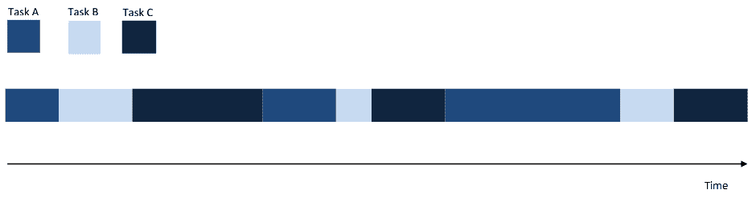
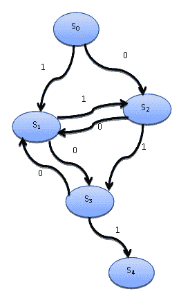

# 第五章：异步编程

除了顺序和并行执行模型之外，还有一个基本重要的第三模型，与事件编程的概念一起：*异步模型*。

异步任务的执行模型可以通过单个主控制流实现，无论是在单处理器系统还是在多处理器系统中。在并发异步执行模型中，各种任务的执行在时间线上相互交叉，所有事情都在单一控制流的作用下发生（单线程）。一旦开始，任务的执行可以被暂停，然后在一段时间后恢复，与当前其他任务的执行交替进行。

异步模型的代码开发与多线程编程的代码开发完全不同。并发多线程并行模型与单线程并发异步模型之间的重要区别在于，在前一种情况下，操作系统决定在暂停一个线程的活动并启动另一个线程的时间线。

这一点超出了程序员的控制范围，与异步模型不同。任务的执行或终止会持续进行，只要它被明确地需要。

这种类型编程最重要的特性是代码不是在多个线程上执行，就像在经典并发编程中那样，而是在单个线程上执行。因此，两个任务同时执行的说法完全不正确，但根据这种方法，它们几乎是同时执行的。

尤其是我们将描述在 Python 3.4 中引入的`asyncio`Python 模块。这使我们能够使用协程和未来来简化异步代码的编写，并使其更具可读性。

在本章中，我们将介绍以下食谱：

+   使用`concurrent.futures` Python 模块

+   使用`asyncio`管理事件循环

+   使用`asyncio`处理协程

+   使用`asyncio`操作任务

+   处理`asyncio`和未来

# 使用`concurrent.futures` Python 模块

`concurrent.futures`模块是 Python 标准库的一部分，通过将线程建模为异步函数，提供了对线程的抽象层次。

此模块由两个主要类构建：

+   `concurrent.futures.Executor`：这是一个抽象类，提供了执行异步调用的方法。

+   `concurrent.futures.Future`：这封装了可调用函数的异步执行。`Future`对象通过将任务（具有可选参数的函数）提交给`Executors`来实例化。

这里是该模块的一些主要方法：

+   `submit(function,argument)`：这安排在参数上调用可调用函数的执行。

+   **`map(function,argument)`**：这以异步模式执行参数的函数。

+   `shutdown(Wait=True)`：这向执行器发出信号，释放任何资源。

通过其子类访问执行器：`ThreadPoolExecutor` 或 `ProcessPoolExecutor`。因为线程和进程的实例化是一个资源密集型任务，所以最好将这些资源池化，并将它们用作可重复的启动器或执行器（因此有 `Executors` 概念），用于并行或并发任务。

我们在这里采取的方法是使用池执行器。我们将提交资产到池（线程和进程）并获取未来，这些是将来将对我们可用的结果。当然，我们可以等待所有未来成为真实的结果。

线程池或进程池（也称为 *pooling*）表示正在使用的管理软件，用于优化和简化程序中线程和/或进程的使用。通过池化，您可以提交任务（或多个任务）以便将它们执行到池中。

池配备了待处理任务的内部队列和执行它们的几个线程 *或* 进程。在池化中的一个常见概念是重用：在生命周期中，线程（或进程）被多次用于不同的任务。这减少了创建新线程或进程的开销，并提高了程序的性能。

重用 *不是规则*，但它是一个主要的原因，导致编码者在他们的应用程序中使用池化。

# 准备工作

`concurrent.futures` 模块提供了 `Executor` 类的两个子类，它们异步地操作线程池和进程池。这两个子类如下：

+   `concurrent.futures.ThreadPoolExecutor(max_workers)`

+   `concurrent.futures.ProcessPoolExecutor(max_workers)`

`max_workers` 参数标识异步执行调用时的工作者最大数量。

# 如何操作...

这里是一个线程和进程池使用的示例，我们将比较执行时间与顺序执行所需的时间。

要执行的任务如下：我们有一个包含 10 个元素的列表。列表的每个元素都被设置为计数到 100,000,000（只是为了浪费时间），然后最后一个数字乘以列表的 *i-th* 元素。特别是，我们正在评估以下情况：

+   **顺序执行**

+   **具有五个工作者的线程池**

+   **具有五个工作者的进程池**

现在，让我们看看如何操作：

1.  导入相关库：

```py
import concurrent.futures
import time
```

1.  定义从 `1` 到 `10` 的数字列表：

```py
number_list = list(range(1, 11))
```

1.  `count(number)` 函数从 `1` 计数到 `100000000`，然后返回 `number` × 100,000,000 的乘积：

```py
def count(number):
    for i in range(0,100000000):
        i += 1
    return i*number
```

1.  `evaluate(item)` 函数在 `item` 参数上评估 `count` 函数。它打印出 `item` 的值和 `count(item)` 的结果：

```py
def evaluate(item):
    result_item = count(item)
    print('Item %s, result %s' % (item, result_item))
```

1.  在 `__main__` 中，执行顺序执行、线程池和进程池：

```py
if __name__ == '__main__':
```

1.  对于顺序执行，`evaluate` 函数对 `number_list` 的每个项目执行。然后，打印出执行时间：

```py
    start_time = time.clock()
    for item in number_list:
        evaluate(item)
    print('Sequential Execution in %s seconds' % (time.clock() -\ 
        start_time))
```

1.  关于线程和进程池执行，使用相同的工人数量（`max_workers=5`）。当然，对于两个池，都会显示执行时间：

```py
    start_time = time.clock()
    with concurrent.futures.ThreadPoolExecutor(max_workers=5) as\ 
    executor:
        for item in number_list:
            executor.submit(evaluate, item)
    print('Thread Pool Execution in %s seconds' % (time.clock() -\ 
        start_time))
    start_time = time.clock()
    with concurrent.futures.ProcessPoolExecutor(max_workers=5) as\ 
    executor:
        for item in number_list:
            executor.submit(evaluate, item)
    print('Process Pool Execution in %s seconds' % (time.clock() -\ 
        start_time))
```

# 它是如何工作的...

我们构建了一个存储在`number_list`中的数字列表：

```py
number_list = list(range(1, 11))
```

对于列表中的每个元素，我们执行计数过程，直到达到`100000000`次迭代，然后乘以`100000000`的结果值：

```py
def count(number) : 
    for i in range(0, 100000000):
        i=i+1
    return i*number

def evaluate_item(x):
    result_item = count(x)
```

在`main`程序中，我们以顺序模式执行相同的任务：

```py
if __name__ == "__main__":
   for item in number_list:
       evaluate_item(item)
```

然后，在并行模式下，使用`concurrent.futures`的线程池功能：

```py
with concurrent.futures.ThreadPoolExecutor(max_workers=5) as executor:
    for item in number_list:
        executor.submit(evaluate, item)
```

对于进程池也做同样的操作：

```py
with concurrent.futures.ProcessPoolExecutor(max_workers=5) as executor:
    for item in number_list:
        executor.submit(evaluate, item)
```

注意，线程池和进程池都设置了`max_workers=5`；此外，如果`max_workers`等于`None`，它将默认为机器上的处理器数量。

要运行此示例，打开命令提示符，并在包含示例的同一文件夹中，输入以下内容：

```py
> python concurrent_futures_pooling.py
```

通过执行前面的示例，我们可以看到三种执行模型的相对时间：

```py
Item 1, result 10000000
Item 2, result 20000000
Item 3, result 30000000
Item 4, result 40000000
Item 5, result 50000000
Item 6, result 60000000
Item 7, result 70000000
Item 8, result 80000000
Item 9, result 90000000
Item 10, result 100000000
Sequential Execution in 6.8109448 seconds
Item 2, result 20000000
Item 1, result 10000000
Item 4, result 40000000
Item 5, result 50000000
Item 3, result 30000000
Item 8, result 80000000
Item 7, result 70000000
Item 6, result 60000000
Item 10, result 100000000
Item 9, result 90000000
Thread Pool Execution in 6.805766899999999 seconds
Item 1, result 10000000
Item 4, result 40000000
Item 2, result 20000000
Item 3, result 30000000
Item 5, result 50000000
Item 6, result 60000000
Item 7, result 70000000
Item 9, result 90000000
Item 8, result 80000000
Item 10, result 100000000
Process Pool Execution in 4.166398899999999 seconds
```

应该注意的是，尽管示例在计算上并不昂贵，但顺序和线程池执行在时间上是可以比较的。使用进程池给我们提供了最快的执行时间。

然后，池将进程（在这种情况下，五个进程）在可用的核心之间（对于本例，使用了一个具有四个核心的机器）以**FIFO**（即**先进先出**）模式分配。

因此，对于每个核心，分配的进程按顺序运行。只有在执行 I/O 操作之后，池才会安排另一个进程的执行。当然，如果你使用线程池，执行机制也是相同的。

计算时间在进程池的情况下较低，这必须追溯到 I/O 操作并不重要的原因。这使得进程池可以更快，因为，与线程不同，它们不需要任何同步机制（如第一章中所述，*使用 Python 进行并行计算入门*，在*介绍并行编程*食谱中）。

# 更多内容...

池技术被广泛应用于服务器应用程序中，因为需要管理来自任意数量客户端的多个同时请求。

然而，许多其他应用程序要求每个活动都立即执行，或者你需要对运行它的线程有更多的控制：在这种情况下，池不是最佳选择。

# 参见

可以在这里找到一个关于`concurrent.futures`的有趣教程：[`masnun.com/2016/03/29/python-a-quick-introduction-to-the-concurrent-futures-module.html`](http://masnun.com/2016/03/29/python-a-quick-introduction-to-the-concurrent-futures-module.html)。

# 使用 asyncio 管理事件循环

`asyncio` Python 模块提供了管理事件、协程、任务以及线程的设施，以及编写并发代码的同步原语。

此模块的主要组件如下：

+   **事件循环**：`asyncio`模块允许每个进程有一个事件循环。这是处理管理和分配不同任务执行的实体。特别是，它注册任务并通过在任务之间切换控制流来管理它们。

+   **协程**：这是子程序概念的推广。此外，协程可以在执行过程中暂停以等待外部处理（某些 I/O 中的例程）并从外部处理完成后返回到停止的位置。

+   **期货**：这定义了`Future`对象，与`concurrent.futures`模块中的定义完全相同。它表示一个尚未完成的计算。

+   **任务**：这是`asyncio`的一个子类，用于在并行模式下封装和管理协程。

在这个菜谱中，重点是软件程序中事件和事件管理（即事件循环）的概念。

# 理解事件循环

在计算机科学中，*事件*是程序可以管理的程序拦截的动作。例如，一个事件可以是用户与图形界面交互时虚拟按键的压力、物理键盘上的按键压力、外部中断信号，或者更抽象地说，通过网络接收数据。但更普遍地，任何其他形式的事件，只要可以以某种方式检测和管理，都可以被视为事件。

在一个系统中，能够生成事件的实体被称为*事件源*，而处理发生事件的实体被称为事件处理器。

*事件循环*编程结构实现了在程序中管理事件的功能。更确切地说，事件循环在整个程序执行期间循环运行，跟踪在数据结构中发生的事件，并将它们排队，然后逐个调用事件处理器来处理，如果主线程空闲的话。

事件循环管理器的伪代码如下所示：

```py
while (1) {
    events = getEvents()
    for (e in events)
        processEvent(e)
}
```

所有输入到`while`循环的事件都被捕获，然后由事件处理器处理。处理事件的处理器是系统中唯一的活动。当处理器结束时，控制权传递到下一个计划的事件。

`asyncio`提供了以下方法来管理事件循环：

+   `loop = get_event_loop()`: 这获取当前上下文的事件循环。

+   `loop.call_later(time_delay,callback,argument)`: 这安排在给定的`time_delay`（以秒为单位）后调用回调。

+   `loop.call_soon(callback, argument)`: 这安排在尽可能早的时候调用回调。回调在`call_soon()`返回后调用，当控制返回到事件循环时。

+   `loop.time()`: 这返回事件循环内部时钟的当前时间作为`float`值 ([`docs.python.org/3/library/functions.html`](https://docs.python.org/3/library/functions.html))。

+   `asyncio.set_event_loop()`: 这将当前上下文的事件循环设置为循环。

+   `asyncio.new_event_loop()`: 根据此策略的规则创建并返回一个新的事件循环对象。

+   `loop.run_forever()`: 这将一直运行，直到调用`stop()` ([`docs.python.org/3/library/asyncio-eventloop.html`](https://docs.python.org/3/library/asyncio-eventloop.html))。

# 如何做到这一点...

在这个例子中，我们看看如何使用`asyncio`库提供的事件循环语句，以构建一个异步模式工作的应用程序。

在这个例子中，我们定义了三个任务。每个任务的执行时间由一个随机时间参数确定。一旦执行完成，**任务 A**调用**任务 B**，**任务 B**调用**任务 C**，而**任务 C**调用**任务 A**。

事件循环将继续，直到满足终止条件。正如我们可以想象的那样，这个例子遵循以下异步模式：



异步编程模型

让我们看看以下步骤：

1.  让我们先导入实现所需的库：

```py
import asyncio
import time
import random
```

1.  然后，我们定义`task_A`，其执行时间随机确定，可以从`1`秒到`5`秒不等。在执行结束时，如果未满足终止条件，则计算转到`task_B`：

```py
def task_A(end_time, loop):
    print ("task_A called")
    time.sleep(random.randint(0, 5))
    if (loop.time() + 1.0) < end_time:
        loop.call_later(1, task_B, end_time, loop)
    else:
        loop.stop()
```

1.  这里，定义了`task_B`。其执行时间随机确定，可以从`4`秒到`7`秒不等。在执行结束时，如果未满足终止条件，则计算转到`task_B`：

```py
def task_B(end_time, loop):
    print ("task_B called ")
    time.sleep(random.randint(3, 7))
    if (loop.time() + 1.0) < end_time:
        loop.call_later(1, task_C, end_time, loop)
    else:
        loop.stop()
```

1.  然后，实现`task_C`。其执行时间随机确定，可以从`6`秒到`10`秒不等。在执行结束时，如果未满足终止条件，则计算回到`task_A`：

```py
def task_C(end_time, loop):
    print ("task_C called")
    time.sleep(random.randint(5, 10))
    if (loop.time() + 1.0) < end_time:
        loop.call_later(1, task_A, end_time, loop)
    else:
        loop.stop()
```

1.  下一个语句定义了`loop`参数，它简单地获取当前事件循环：

```py
loop = asyncio.get_event_loop()
```

1.  `end_loop`值定义了终止条件。此示例代码的执行必须持续`60`秒：

```py
end_loop = loop.time() + 60
```

1.  然后，让我们请求执行`task_A`：

```py
loop.call_soon(task_A, end_loop, loop)
```

1.  现在，我们设置一个长时间周期，它会持续响应事件，直到被停止：

```py
loop.run_forever()
```

1.  现在，关闭事件循环：

```py
loop.close()
```

# 它是如何工作的...

为了管理`task_A`、`task_B`和`task_C`三个任务的执行，我们需要捕获事件循环：

```py
loop = asyncio.get_event_loop()
```

然后，我们使用`call_soon`构造函数安排对`task_A`的第一个调用：

```py
end_loop = loop.time() + 60
loop.call_soon(function_1, end_loop, loop)
```

让我们记录`task_A`的定义：

```py
def task_A(end_time, loop):
    print ("task_A called")
    time.sleep(random.randint(0, 5))
    if (loop.time() + 1.0) < end_time:
        loop.call_later(1, task_B, end_time, loop)
    else:
        loop.stop()
```

应用程序的非同步行为由以下参数确定：

+   `time.sleep(random.randint(0, 5))`: 这定义了任务执行的持续时间。

+   `end_time`: 这定义了`task_A`中的上限时间限制，并通过`call_later`方法调用`task_B`。

+   `loop`：这是之前使用 `get_event_loop()` 方法捕获的事件循环。

执行任务后，`loop.time` 与 `end_time` 进行比较。如果执行时间在最大时间（60 秒）内，则通过调用 `task_B` 继续计算，否则计算结束，关闭事件循环：

```py
 if (loop.time() + 1.0) < end_time:
        loop.call_later(1, task_B, end_time, loop)
    else:
        loop.stop()
```

对于其他两个任务，操作实际上相同，但只有执行时间和对下一个任务的调用不同。

现在，让我总结一下情况：

1.  `task_A` 使用随机执行时间在 1 到 5 秒之间调用 `task_B`。

1.  `task_B` 使用随机执行时间在 4 到 7 秒之间调用 `task_C`。

1.  `task_C` 使用随机执行时间在 6 到 10 秒之间调用 `task_A`。

当运行时间到期时，事件循环必须结束：

```py
loop.run_forever()
loop.close()
```

本例的可能输出如下：

```py
task_A called
task_B called 
task_C called
task_A called
task_B called 
task_C called
task_A called
task_B called 
task_C called
task_A called
task_B called 
task_C called
task_A called
task_B called 
task_C called
```

# 更多...

异步事件编程取代了一种并发编程类型，其中程序的不同部分由不同的线程同时执行，这些线程可以访问内存中的相同数据，从而引发临界区问题。同时，能够利用现代 CPU 的不同核心已成为必要，因为在某些领域，使用单核处理器已无法达到后者提供的性能。

# 参见

这里是 `asyncio` 的一个很好的介绍：[`hackernoon.com/a-simple-introduction-to-pythons-asyncio-595d9c9ecf8c`](https://hackernoon.com/a-simple-introduction-to-pythons-asyncio-595d9c9ecf8c)。

# 使用 asyncio 处理协程

在展示的各种示例中，我们看到当程序变得非常长且复杂时，将其划分为子程序是很方便的，每个子程序实现一个特定的任务。然而，子程序不能独立执行，只能由主程序请求执行，主程序负责协调子程序的使用。

在本节中，我们介绍了子程序概念的推广，称为协程：就像子程序一样，协程计算单个计算步骤，但与子程序不同，没有 `main` 程序来协调结果。协程将自己链接起来形成一个没有负责以特定顺序调用它们的监督函数的管道。

在协程中，执行点可以被挂起并在稍后恢复，因为协程跟踪执行状态。拥有协程池，可以交错计算：第一个运行直到它 *交出控制权*，然后第二个运行并继续下去。

交错由事件循环管理，这在 *使用 asyncio 管理事件循环* 的配方中已有描述。它跟踪所有协程并安排它们的执行时间。

协程的其他重要方面如下：

+   协程允许有多个入口点，可以多次产生值。

+   协程可以将执行权传递给任何其他协程。

在这里，术语*yield*用于描述协程暂停并将控制流传递给另一个协程。

# 准备工作

我们将使用以下符号来处理协程：

```py
import asyncio 

@asyncio.coroutine
def coroutine_function(function_arguments):
    ............
    DO_SOMETHING
    ............   
```

协程使用 PEP 380 中引入的`yield from`语法来停止当前计算的执行并挂起协程的内部状态。

特别是，在`yield from future`的情况下，协程将在`future`完成之前挂起，然后`future`的结果将被传播（或引发异常）；在`yield from coroutine`的情况下，协程将等待另一个协程产生一个将被传播（或引发异常）的结果。

在下一个例子中，我们将看到如何使用协程模拟有限状态机，我们将使用`yield from coroutine`符号。

更多关于`asyncio`的协程信息，请参阅[`docs.python.org/3.5/library/asyncio-task.html`](https://docs.python.org/3.5/library/asyncio-task.html)。

# 如何做到这一点...

在这个例子中，我们看到了如何使用协程模拟具有五个状态的状态机。

**有限状态机**或**有限状态自动机**是一个在工程学科中广泛使用的数学模型，但也在数学和计算机科学等科学中得到应用。

我们想要使用协程模拟其行为的自动机如下：



有限状态机

系统的状态是**S0**、**S1**、**S2**、**S3**和**S4**，**0**和**1**是状态机可以从一个状态转换到下一个状态（这个操作称为*转换*）的值。例如，状态**S0**可以转换到状态**S1**，但仅对于值**1**，而**S0**可以转换到状态**S2**，但仅对于值**0**。

以下 Python 代码模拟了自动机从状态**S0**（起始状态）到状态**S4**（结束状态）的转换：

1.  第一步显然是导入相关库：

```py
import asyncio
import time
from random import randint
```

1.  然后，我们相对于`start_state`定义协程。`input_value`参数随机评估；它可以是`0`或`1`。如果是`0`，则控制流转到协程`state2`；否则，它变为协程`state1`：

```py
@asyncio.coroutine
def start_state():
    print('Start State called\n')
    input_value = randint(0, 1)
    time.sleep(1)
    if input_value == 0:
        result = yield from state2(input_value)
    else:
        result = yield from state1(input_value)
    print('Resume of the Transition:\nStart State calling'+ result)
```

1.  这里是`state1`的协程。`input_value`参数随机评估；它可以是`0`或`1`。如果是`0`，则控制流转到`state2`；否则，它变为`state1`：

```py
@asyncio.coroutine
def state1(transition_value):
    output_value ='State 1 with transition value = %s\n'% \
                                             transition_value
    input_value = randint(0, 1)
    time.sleep(1)
    print('...evaluating...')
    if input_value == 0:
        result = yield from state3(input_value)
    else:
        result = yield from state2(input_value)
    return output_value + 'State 1 calling %s' % result
```

1.  `state1`的协程有一个允许状态通过的`transition_value`参数。此外，在这种情况下，`input_value`是随机评估的。如果是`0`，则状态转换到`state3`；否则，控制流变为`state2`：

```py
@asyncio.coroutine
def state2(transition_value):
    output_value = 'State 2 with transition value = %s\n' %\
                                             transition_value
    input_value = randint(0, 1)
    time.sleep(1)
    print('...evaluating...')
    if input_value == 0:
        result = yield from state1(input_value)
    else:
        result = yield from state3(input_value)
    return output_value + 'State 2 calling %s' % result
```

1.  `state3` 的协程具有允许状态转换的 `transition_value` 参数。`input_value` 是随机评估的。如果是 `0`，则状态转换到 `state1`；否则，控制权转移到 `end_state`：

```py
@asyncio.coroutine
def state3(transition_value):
    output_value = 'State 3 with transition value = %s\n' %\
                                                 transition_value
    input_value = randint(0, 1)
    time.sleep(1)
    print('...evaluating...')
    if input_value == 0:
        result = yield from state1(input_value)
    else:
        result = yield from end_state(input_value)
    return output_value + 'State 3 calling %s' % result
```

1.  `end_state` 打印出允许状态转换的 `transition_value` 参数，然后停止计算：

```py
@asyncio.coroutine
def end_state(transition_value):
    output_value = 'End State with transition value = %s\n'%\
                                                transition_value
    print('...stop computation...')
    return output_value
```

1.  在 `__main__` 函数中，获取事件循环，然后我们开始模拟有限状态机的仿真，调用自动机的 `start_state`：

```py
if __name__ == '__main__':
    print('Finite State Machine simulation with Asyncio Coroutine')
    loop = asyncio.get_event_loop()
    loop.run_until_complete(start_state())
```

# 它是如何工作的...

自动机的每个状态都是通过使用装饰器定义的：

```py
 @asyncio.coroutine
```

例如，状态 **S0** 在这里定义：

```py
@asyncio.coroutine
def StartState():
    print ("Start State called \n")
    input_value = randint(0,1)
    time.sleep(1)
    if (input_value == 0):
        result = yield from State2(input_value)
    else :
        result = yield from State1(input_value)
```

下一个状态的转换是由 `input_value` 决定的，它由 Python 的 `random` 模块的 `randint (0,1)` 函数定义。此函数随机提供 `0` 或 `1` 的值。

以这种方式，`randint` 随机确定有限状态机将要转换到的状态：

```py
input_value = randint(0,1)
```

确定传递的值之后，协程使用 `yield from` 命令调用下一个协程：

```py
if (input_value == 0):
        result = yield from State2(input_value)
    else :
        result = yield from State1(input_value)
```

`result` 变量是每个协程返回的值。它是一个字符串，在计算结束时，我们可以从自动机的初始状态 `start_state` 重建到 `end_state` 的转换。

`main` 程序在事件循环内部开始评估：

```py
if __name__ == "__main__":
    print("Finite State Machine simulation with Asyncio Coroutine")
    loop = asyncio.get_event_loop()
    loop.run_until_complete(StartState())
```

运行代码，我们得到如下输出：

```py
Finite State Machine simulation with Asyncio Coroutine
Start State called
...evaluating...
...evaluating...
...evaluating...
...evaluating...
...stop computation...
Resume of the Transition : 
Start State calling State 1 with transition value = 1
State 1 calling State 2 with transition value = 1
State 2 calling State 1 with transition value = 0
State 1 calling State 3 with transition value = 0
State 3 calling End State with transition value = 1
```

# 更多内容...

在 Python 3.5 发布之前，`asyncio` 模块使用生成器来模拟异步调用，因此其语法与 Python 3.5 的当前版本不同。

Python 3.5 引入了 `async` 和 `await` 关键字。注意 `await func()` 调用周围没有括号。

以下是一个使用 Python 3.5+ 引入的新语法的 `"Hello, world!"` 示例，使用 `asyncio`：

```py
import asyncio

async def main():
    print(await func())

async def func():
    # Do time intensive stuff...
    return "Hello, world!"

if __name__ == "__main__":
    loop = asyncio.get_event_loop()
    loop.run_until_complete(main())
```

# 参见

Python 中的协程在这里有很好的描述：[`www.geeksforgeeks.org/coroutine-in-python/`](https://www.geeksforgeeks.org/coroutine-in-python/)。

# 使用 asyncio 操作任务

`asyncio` 模块旨在处理事件循环上的异步过程和并发任务执行。它还提供了 `asyncio.Task()` 类，用于将协程包装在任务中（[`docs.python.org/3/library/asyncio-task.html`](https://docs.python.org/3/library/asyncio-task.html)）。它的用途是允许独立运行的任务在相同的事件循环上与其他任务并发运行。

当协程被任务包装时，它将 `Task` 连接到事件循环，并在循环启动时自动运行，从而提供了一种自动驱动协程的机制。

`asyncio` 模块提供了 `asyncio.Task(coroutine)` 方法来处理带有任务的计算；此外，`asyncio.Task(coroutine)` 调度协程的执行（[`docs.python.org/3/library/asyncio-task.html`](https://docs.python.org/3/library/asyncio-task.html)）。

任务负责在 *事件循环* 中执行协程对象。

如果包装的协程使用了如 *Handling coroutines with asyncio* 部分所述的 `yields from future` 符号，那么任务将暂停包装协程的执行并等待未来的完成。

当未来完成时，包装协程的执行将使用未来的结果或异常重新启动。此外，我们必须注意，事件循环一次只运行一个任务。如果其他线程中运行着其他事件循环，其他任务可能并行运行。

当一个任务等待未来的完成时，事件循环将执行一个新的任务。

# 如何做...

在这个例子中，我们展示了如何通过 `asyncio.Task()` 语句并发执行三个数学函数：

1.  当然，让我们先导入 `asyncio` 库：

```py
import asyncio
```

1.  在第一个协程中，定义了 `factorial` 函数：

```py
@asyncio.coroutine
def factorial(number):
    f = 1
    for i in range(2, number + 1):
        print("Asyncio.Task: Compute factorial(%s)" % (i))
        yield from asyncio.sleep(1)
        f *= i
    print("Asyncio.Task - factorial(%s) = %s" % (number, f))
```

1.  之后，定义第二个函数——`fibonacci` 函数：

```py
@asyncio.coroutine
def fibonacci(number):
    a, b = 0, 1
    for i in range(number):
        print("Asyncio.Task: Compute fibonacci (%s)" % (i))
        yield from asyncio.sleep(1)
        a, b = b, a + b
    print("Asyncio.Task - fibonacci(%s) = %s" % (number, a))
```

1.  最后要并发执行的功能是二项式系数：

```py
@asyncio.coroutine
def binomial_coefficient(n, k):
    result = 1
    for i in range(1, k + 1):
        result = result * (n - i + 1) / i
        print("Asyncio.Task: Compute binomial_coefficient (%s)" % 
            (i))
        yield from asyncio.sleep(1)
    print("Asyncio.Task - binomial_coefficient(%s , %s) = %s" % 
        (n,k,result))
```

1.  在 `__main__` 函数中，`task_list` 包含必须使用 `asyncio.Task` 函数并行执行的功能：

```py
if __name__ == '__main__':
    task_list = [asyncio.Task(factorial(10)),
                 asyncio.Task(fibonacci(10)),
                 asyncio.Task(binomial_coefficient(20, 10))]
```

1.  最后，我们获取事件循环并开始计算：

```py
    loop = asyncio.get_event_loop()
    loop.run_until_complete(asyncio.wait(task_list))
    loop.close()
```

# 它是如何工作的...

每个协程由 `@asyncio.coroutine` 注解定义（称为 *装饰器*）：

```py
@asyncio.coroutine
def function (args):
    do something
```

为了并行运行，每个函数都是 `asyncio.Task` 模块的参数，因此它们被包含在 `task_list` 中：

```py
if __name__ == '__main__':
    task_list = [asyncio.Task(factorial(10)),
                 asyncio.Task(fibonacci(10)),
                 asyncio.Task(binomial_coefficient(20, 10))]
```

然后，我们获取事件循环：

```py
    loop = asyncio.get_event_loop()
```

最后，我们将 `task_list` 的执行添加到事件循环中：

```py
    loop.run_until_complete(asyncio.wait(task_list))
    loop.close()
```

注意，`asyncio.wait(task_list)` 语句等待给定的协程完成。

上述代码的输出如下：

```py
Asyncio.Task: Compute factorial(2)
Asyncio.Task: Compute fibonacci(0)
Asyncio.Task: Compute binomial_coefficient(1)
Asyncio.Task: Compute factorial(3)
Asyncio.Task: Compute fibonacci(1)
Asyncio.Task: Compute binomial_coefficient(2)
Asyncio.Task: Compute factorial(4)
Asyncio.Task: Compute fibonacci(2)
Asyncio.Task: Compute binomial_coefficient(3)
Asyncio.Task: Compute factorial(5)
Asyncio.Task: Compute fibonacci(3)
Asyncio.Task: Compute binomial_coefficient(4)
Asyncio.Task: Compute factorial(6)
Asyncio.Task: Compute fibonacci(4)
Asyncio.Task: Compute binomial_coefficient(5)
Asyncio.Task: Compute factorial(7)
Asyncio.Task: Compute fibonacci(5)
Asyncio.Task: Compute binomial_coefficient(6)
Asyncio.Task: Compute factorial(8)
Asyncio.Task: Compute fibonacci(6)
Asyncio.Task: Compute binomial_coefficient(7)
Asyncio.Task: Compute factorial(9)
Asyncio.Task: Compute fibonacci(7)
Asyncio.Task: Compute binomial_coefficient(8)
Asyncio.Task: Compute factorial(10)
Asyncio.Task: Compute fibonacci(8)
Asyncio.Task: Compute binomial_coefficient(9)
Asyncio.Task - factorial(10) = 3628800
Asyncio.Task: Compute fibonacci(9)
Asyncio.Task: Compute binomial_coefficient(10)
Asyncio.Task - fibonacci(10) = 55
Asyncio.Task - binomial_coefficient(20, 10) = 184756.0
```

# 更多内容...

`asyncio` 提供了其他方法来使用 `ensure_future()` 或 `AbstractEventLoop.create_task()` 方法调度任务，这两个方法都接受一个协程对象。

# 参见

更多关于 `asyncio` 和任务的信息可以在这里找到：[`tutorialedge.net/python/concurrency/asyncio-tasks-tutorial/`](https://tutorialedge.net/python/concurrency/asyncio-tasks-tutorial/)。

# 处理 asyncio 和未来

`asyncio` 模块的另一个关键组件是 `asyncio.Future` 类。它与 `concurrent.Futures` 非常相似，但当然，它是针对 `asyncio` 的主要机制——事件循环——进行了适配。

`asyncio.Future` 类表示一个尚未可用的结果（但也可以是异常）。

因此，它代表了一个尚未实现的事物的抽象。必须处理任何结果的回调实际上被添加到这个类的实例中。

# 准备工作

要定义一个 `future` 对象，必须使用以下语法：

```py
future = asyncio.Future
```

管理此对象的主要方法如下：

+   `cancel()`：这个方法取消 `future` 对象并安排回调。

+   `result()`：这个方法返回这个 `future` 表示的结果。

+   `exception()`：这个方法返回设置在此 `future` 上的异常。

+   `add_done_callback(fn)`: 这将在`future`完成时添加一个要运行的回调。

+   `remove_done_callback(fn)`: 这将在完成时从调用中移除所有回调实例。

+   `set_result(result)`: 这将`future`标记为完成并设置其结果。

+   `set_exception(exception)`: 这将`future`标记为完成并设置一个异常。

# 如何做到...

以下示例展示了如何使用`asyncio.Future`类来管理两个协程：`first_coroutine`和`second_coroutine`，它们执行以下任务。`first_coroutine`执行前*N*个整数的求和，而`second_coroutine`执行 N 的阶乘：

1.  现在，让我们导入相关的库：

```py
import asyncio
import sys
```

1.  `first_coroutine`实现了前*N*个整数的`sum`函数：

```py
@asyncio.coroutine
def first_coroutine(future, num):
    count = 0
    for i in range(1, num + 1):
        count += i
    yield from asyncio.sleep(1)
    future.set_result('First coroutine (sum of N integers)\
                      result = %s' % count)
```

1.  在`second_coroutine`中，我们仍然实现了`factorial`函数：

```py
@asyncio.coroutine
def second_coroutine(future, num):
    count = 1
    for i in range(2, num + 1):
        count *= i
    yield from asyncio.sleep(2)
    future.set_result('Second coroutine (factorial) result = %s' %\ 
                      count)
```

1.  使用`got_result`函数，我们打印计算的输出：

```py
def got_result(future):
    print(future.result())
```

1.  在`main`函数中，`num1`和`num2`参数必须由用户设置。它们将被用作第一个和第二个协程实现的功能的参数：

```py
if __name__ == "__main__":
    num1 = int(sys.argv[1])
    num2 = int(sys.argv[2])
```

1.  现在，让我们来看事件循环：

```py
    loop = asyncio.get_event_loop()
```

1.  这里，未来对象是通过`asyncio.future`函数定义的：

```py
    future1 = asyncio.Future()
    future2 = asyncio.Future()
```

1.  包含在`tasks`列表中的两个协程——`first_couroutine`和`second_couroutine`——具有`future1`和`future2`未来对象、用户定义的参数以及`num1`和`num2`参数：

```py
tasks = [first_coroutine(future1, num1),
        second_coroutine(future2, num2)]
```

1.  未来对象添加了一个回调：

```py
    future1.add_done_callback(got_result)
    future2.add_done_callback(got_result)
```

1.  然后，将`tasks`列表添加到事件循环中，以便开始计算：

```py
    loop.run_until_complete(asyncio.wait(tasks))
    loop.close()
```

# 它是如何工作的...

在`main`程序中，我们使用`asyncio.Future()`指令分别定义了`future`对象`future1`和`future2`：

```py
if __name__ == "__main__":
        future1 = asyncio.Future()
        future2 = asyncio.Future()
```

在定义任务时，我们将`future`对象作为两个协程`first_couroutine`和`second_couroutine`的参数传递：

```py
tasks = [first_coroutine(future1,num1), 
         second_coroutine(future2,num2)]
```

最后，我们添加一个在`future`完成时要运行的回调：

```py
future1.add_done_callback(got_result)
future2.add_done_callback(got_result)
```

这里，`got_result`是一个打印`future`结果的函数：

```py
def got_result(future):
    print(future.result())
```

在协程中，我们将`future`对象作为参数传递。计算完成后，我们为第一个协程设置 3 秒的睡眠时间，为第二个协程设置 4 秒的睡眠时间：

```py
yield from asyncio.sleep(sleep_time)
```

执行命令时，根据不同的值可以获得以下输出：

```py
> python asyncio_and_futures.py 1 1
First coroutine (sum of N integers) result = 1
Second coroutine (factorial) result = 1

> python asyncio_and_futures.py 2 2
First coroutine (sum of N integers) result = 2 Second coroutine (factorial) result = 2

> python asyncio_and_futures.py 3 3
First coroutine (sum of N integers) result = 6
Second coroutine (factorial) result = 6

> python asyncio_and_futures.py 5 5
First coroutine (sum of N integers) result = 15
Second coroutine (factorial) result = 120
 > python asyncio_and_futures.py 50 50
First coroutine (sum of N integers) result = 1275
Second coroutine (factorial) result = 30414093201713378043612608166064768844377641568960512000000000000 
First coroutine (sum of N integers) result = 1275 
```

# 还有更多...

我们可以反转输出结果，即先输出`second_coroutine`的结果，只需简单地交换两个协程之间的睡眠时间：在`first_coroutine`定义中使用`yield from asyncio.sleep(2)`，在`second_coroutine`定义中使用`yield from asyncio.sleep(1)`。这可以通过以下示例展示：

```py
> python asyncio_and_future.py 1 10
second coroutine (factorial) result = 3628800
first coroutine (sum of N integers) result = 1
```

# 参见

更多关于`asyncio`和未来的示例可以在[`www.programcreek.com/python/example/102763/asyncio.futures`](https://www.programcreek.com/python/example/102763/asyncio.futures)找到。
