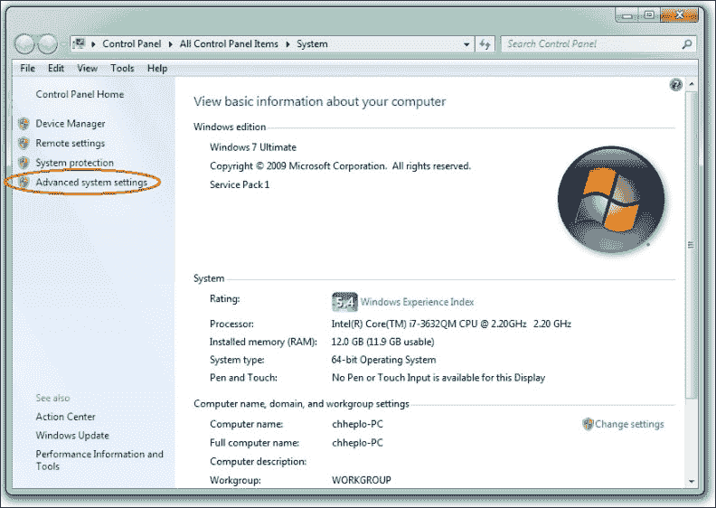
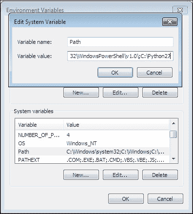
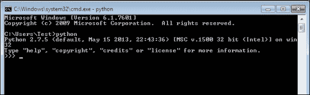
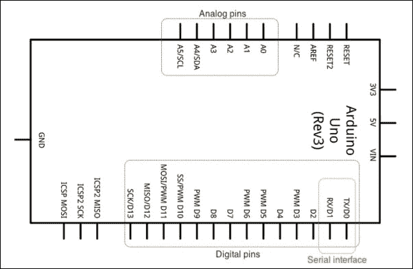
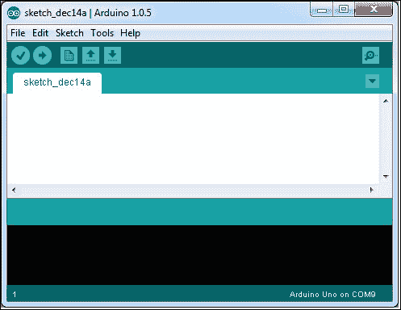
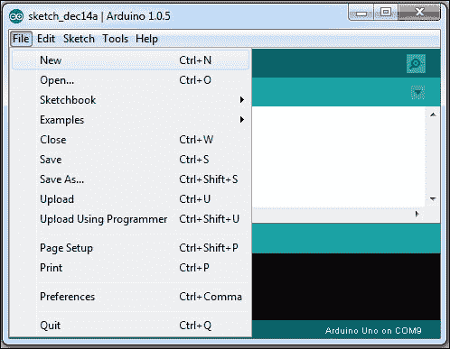
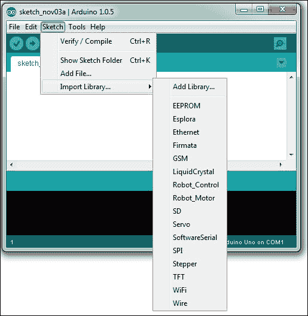
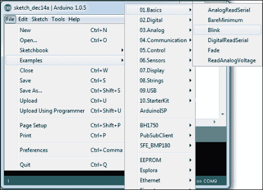
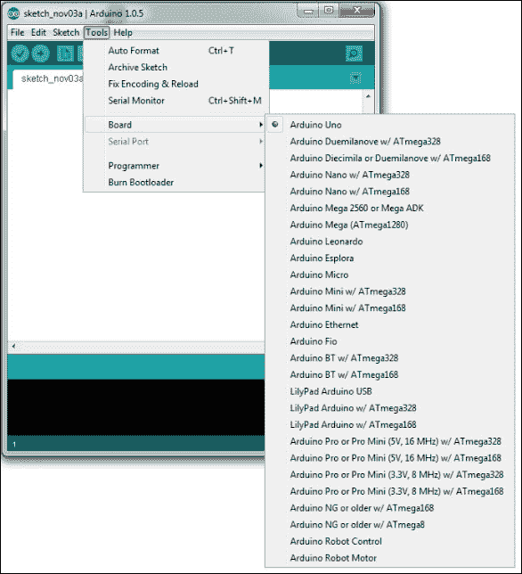

# 第一章. Python 和 Arduino 入门

本章介绍了 Python 编程语言和开源电子原型平台 Arduino。本章的第一部分专注于 Python，并简要描述了 Python 的优势以及安装和配置步骤。本章的其余部分描述了 Arduino 及其开发环境。

在本章结束时，你将为你的操作系统配置好用于 Python 和 Arduino 的编程环境。如果你是这两个平台（即 Python 和 Arduino）的初学者，建议你遵循本章中给出的步骤，因为后续章节将假设你已经拥有了这里描述的精确配置。如果你有在这些平台上工作的经验，你可以跳到下一章。

# Python 简介

自 1991 年由 Guido van Rossum 引入以来，Python 已经发展成为最广泛使用的通用、高级编程语言之一，并得到了最大的开源开发者社区的支持。Python 是一种开源编程语言，包括大量的支持库。这些库是 Python 的最好特性，使其成为最可扩展的平台之一。Python 是一种动态编程语言，它使用解释器在运行时执行代码，而不是使用编译器编译和创建可执行的字节码。

Python 开发背后的哲学是创建灵活、可读和清晰的代码，以便轻松表达概念。强调以独特的方式使用空白缩进区分 Python 与其他流行的面向高级语言。Python 支持函数式、命令式和面向对象编程，具有自动内存管理功能。

## 我们为什么使用 Python

Python 被认为是最容易学习的编程语言之一，对于初学者来说。与其他流行的面向对象语言如 C++和 Java 相比，Python 对程序员有以下主要优势：

+   它易于阅读和理解

+   它能够实现快速原型设计并减少开发时间

+   它拥有大量的免费库包

Python 拥有一个庞大的开源社区，推动着 Python 作为编程语言的持续改进。Python 社区还负责开发大量开源库包，这些库包可以用来构建从动态网站到复杂数据分析应用的应用程序，以及开发基于简单 GUI 的应用程序来绘制复杂数学函数的图表。Python 大多数库包都系统地维护了从社区获得的代码，并定期更新。索引 Python 包数量最多的默认仓库是 PyPI ([`pypi.python.org`](http://pypi.python.org))。PyPI 还提供了简单的方法来在您的操作系统上安装各种包，这将在下一节中介绍。

在与硬件平台一起工作时，有必要在硬件和您用于开发的计算机之间建立某种通信方式。在常见的计算机与硬件接口方法中，基于串口的通信是最受欢迎的，尤其是在 Arduino 平台上，它非常简单易建立。Python 提供了一个名为 `pySerial` 的库，它非常易于使用，并且快速实现串口接口。使用类似的库和 Python 的交互式编程能力，可以快速测试和实现您的项目想法。

现在，复杂的 **物联网**（**IoT**）应用程序不仅需要串行通信支持，还需要操作系统的高级功能，如 **图形用户界面**（**GUIs**），远程访问的 Web 接口，数据可视化的图表，数据分析工具，数据存储接口等。使用任何其他编程语言，如 C++ 或 Java，由于支持工具的分布式和无组织性，开发这些功能将需要大量的编程工作。幸运的是，Python 多年来在为这些类型的应用程序提供支持方面非常成功。Python 有多个库支持开发这里提到的每个功能，这些库通过 PyPI 提供。这些库是开源的，易于使用，并且得到了社区的广泛支持。这使得 Python 成为物联网应用程序的首选语言。此外，Python 还支持创建和分发您自定义构建的应用程序作为库，以便其他人也可以在他们的项目中使用它们。如果您正在为您的硬件产品开发自定义协议、API 或算法，这是一个非常有用的功能。

## 我们何时使用其他语言

那么，我们什么时候不应该使用 Python 来开发我们的项目呢？如前所述，Python 是一种动态语言，可以减少开发时间，但与 C、C++和 Java 等其他静态高级语言相比，它也会使您的代码执行速度变慢。这些静态语言使用编译器编译代码并创建在运行时执行的二进制文件，从而提高运行时性能。当代码的性能比更长的开发时间和更高的成本更重要时，您应该考虑这些静态语言。Python 的一些其他缺点包括内存占用大、没有适当的线程支持以及缺乏数据保护功能。简而言之，我们可以这样说，尽管 Python 提供了快速原型设计的快捷方式，但在我们完成原型测试并准备发布产品后，我们应该考虑使用其他静态高级语言进行开发。如今，这种状况正在迅速变化，公司已经开始利用 Python 来开发他们的工业产品。

### 注意

您可以从官方网站[`www.python.org`](http://www.python.org)获取更多与 Python 相关的信息。

# 安装 Python 和 Setuptools

Python 有两种版本：Python v2.x 和 Python v3.x。（在这里，x 代表适当的版本号。）虽然 Python v2.x 是一个遗留分支，并且具有更好的库支持，但 Python v3.x 是 Python 的未来。大多数 Linux 发行版和 Mac OS X 操作系统都配备了 Python，它们将 v2.x 作为首选和默认的 Python 版本。由于以下原因，本书将使用 Python v2.7 作为 Python 的默认版本：

+   这是 Python v2.x 分支的最新版本

+   它拥有庞大的社区支持，并且可以通过支持论坛获取其已知问题的解决方案

+   它被大多数主要的 Python 库支持

尽管本书提供的代码示例、练习和项目应该能在任何 Python 2.7.x 变体中运行，但拥有最新版本会更好。

## 安装 Python

您对操作系统的喜爱是由多种因素决定的，您永远不能忽视某人对特定操作系统的偏见。因此，本书提供了三个最受欢迎的操作系统（Linux、Mac OS X 和 Windows）的安装和配置指南。让我们首先为 Linux 计算机配置 Python。

## Linux

大多数 Linux 发行版都预装了 Python。要检查已安装 Python 的最新版本，请在终端窗口中使用以下命令：

```py
$ python -V

```

确保你在执行前一个命令时使用的是大写字母 `V` 作为选项。一旦你在终端上执行它，它将打印出你当前 Python 安装的完整版本号。如果版本是 2.7.x，那么你可以继续，你的 Linux 已经更新到了为这本书所需的 Python 的最新版本。然而，如果你有任何低于或等于 2.6.x 的版本，你将需要首先将 Python 升级到最新版本。这个过程将需要 root 权限，因为 Python 将作为一个系统组件被安装，以替换之前的版本。

### Ubuntu

如果你正在使用 Ubuntu 11.10 或更高版本，你的机器上应该已经安装了 Python v2.7.x。你可以使用以下命令将 Python 升级到 v2.7.x 的最新版本：

```py
$ sudo apt-get update && sudo apt-get --only-upgrade install python

```

如果你正在运行较旧的 Ubuntu 版本（如 10.04 或更早版本），你应该有 2.6 作为默认版本。在这种情况下，你需要运行以下一系列命令来安装版本 2.7：

```py
$ sudo add-apt-repository ppa:fkrull/deadsnakes
$ sudo apt-get update
$ sudo apt-get install python2.7

```

第一个命令将添加一个外部 Ubuntu 仓库，这将允许你安装任何版本的 Python。下一个命令将更新和索引可用的软件包列表。最后一个命令将安装 Python 2.7 的最新版本。

### Fedora 和 Red Hat

Fedora 和 Red Hat Linux 也自带了 Python 作为内置包。如果你想将 Python 的版本升级到最新版本，请在终端运行以下命令：

```py
$ sudo yum upgrade python

```

### 小贴士

**下载示例代码**

你可以从你购买的所有 Packt 出版物书籍的账户中下载示例代码文件 [`www.packtpub.com`](http://www.packtpub.com)。如果你在其他地方购买了这本书，你可以访问 [`www.packtpub.com/support`](http://www.packtpub.com/support) 并注册，以便将文件直接通过电子邮件发送给你。

## Windows

在 Windows 上安装和配置 Python 不像在 Linux 上那么简单。首先，你需要从 [`www.python.org/getit`](http://www.python.org/getit) 下载 Python 的副本。

你需要小心你正在下载的 Python 版本。从你的 Windows 操作系统系统属性中检查操作系统是 32 位还是 64 位。在本书编写时，Python 的最新版本是 2.7.6。因此，下载 Python 的最新可用版本，但请确保它是 2.7.x 而不是 3.x。

对于许多第三方 Python 库，Windows 的安装二进制文件是为 32 位版本编译的。由于这个原因，我们建议你在 Windows 操作系统上安装 32 位版本的 Python。

如果您非常熟悉 Python 并且知道如何安装库，您可以安装 64 位版本的 Python。选择并运行下载的文件来安装 Python。尽管您可以将其安装到任何自定义位置，但建议使用默认安装位置，因为即将进行的配置步骤使用的是默认位置。安装完成后，您可以从**开始**菜单中找到 Python 命令行工具和 IDLE（Python GUI）。

尽管您可以从**开始**菜单打开这些工具进行基本脚本编写，但我们将修改 Windows 系统参数，以便通过 Windows 命令提示符访问 Python。为此，我们必须在环境变量中设置`PATH`，以便指向 Python 安装目录的位置。让我们通过右键单击**我的电脑**并选择**属性**来打开**系统属性**。否则，您也可以通过导航到**开始** | **控制面板** | **系统和安全** | **系统**来找到它。

您将能够看到一个类似于以下截图所示的窗口。**系统**窗口显示了您计算机的基本信息，包括您使用的 Windows 操作系统类型（例如 32 位或 64 位版本）：



在**系统**窗口中，点击左侧导航栏中的**高级系统设置**以打开一个名为**系统属性**的窗口。在**系统属性**窗口中，点击位于窗口底部的**环境变量…**按钮，这将打开一个类似于以下截图所示的界面。在**环境变量**中，您需要更新**PATH**系统变量，以便将 Python 添加到默认操作系统的路径中。

点击以下截图显示的**PATH**选项，这将弹出一个**编辑系统变量**窗口。在您的现有**PATH**变量末尾添加`C:\Python27`或您自定义 Python 安装目录的完整路径。在 Python 安装路径之前必须放置一个分号（`;`）。如果您已经在**路径**变量中看到了 Python 的位置，那么您的系统已经为 Python 设置了，您不需要进行任何更改：



将 Python 添加到环境变量的主要好处是能够从命令提示符访问 Python 解释器。如果您不知道，可以通过导航到**开始** | **程序** | **附件** | **命令提示符**来访问 Windows 命令提示符。

## Mac OS X

Mac OS X 预装了 Python，但由于操作系统的长期发布周期，默认 Python 应用程序的更新频率较慢。最新的 Mac OS X 版本，即 10.9 Maverick，配备了 Python 2.7.5，这是最新的版本：

```py
Tests-Mac:~ test$ python
Python 2.7.5 (default, Aug 25 2013, 00:04:04)
[GCC 4.2.1 Compatible Apple LLVM 5.0 (clang-500.0.68)] on darwin
Type "help", "copyright", "credits" or "license" for more information.
>>>

```

之前的版本，如 Mac OS X 10.8 Mountain Lion 和 Mac OS X 10.7 Lion 分别包含了 Python 2.7.2 和 Python 2.7.1，这些也是本书的兼容版本。如果你是一位经验丰富的 Python 用户或者想要使用 Python 最新版本的人，你可以从 [`www.python.org/getit`](http://www.python.org/getit) 下载最新版本。

旧版本的 Mac OS X，如 Snow Leopard 及更高版本，它们附带了一个较旧的 Python 版本，可以通过从 [`www.python.org/getit`](http://www.python.org/getit) 下载和安装来更新到最新版本。

## 安装 Setuptools

Setuptools 是一个包含构建和分发 Python 包的实用工具集合的库。这个集合中最重要的工具被称为 `easy_install`。它允许用户查看我们之前提到的 PyPI，即 Python 包仓库，并提供一个简单的接口通过名称安装任何包。`easy_install` 实用工具会自动下载、构建、安装和管理用户所需的包。这个实用工具在本书的后期部分被用来安装 Python 和 Arduino 即将到来的项目所需的必要包。尽管 `easy_install` 被用作安装 Python 包的简单方式，但它缺少了一些有用的功能，如跟踪操作、支持卸载和支持其他版本控制系统。近年来，Python 社区开始采用另一个名为 `pip` 的工具来替代 `easy_install`，它支持这些功能。由于 `easy_install` 和 `pip` 都使用相同的 PyPI 仓库，因此从现在开始，你可以使用这些实用工具中的任何一个来安装所需的 Python 包。

为了缩小范围，我们将专注于安装 Setuptools 以及与之一起安装的默认实用工具，即 `easy_install`。在本节稍后，我们还将安装 `pip`，以防你也需要使用它。让我们首先从为各种操作系统安装 Setuptools 开始。

### Linux

在 Ubuntu 中，Setuptools 可在默认仓库中找到，可以使用以下命令进行安装：

```py
$ sudo apt-get install python-setuptools

```

对于 Fedora，可以使用默认的软件管理器 `yum` 进行安装：

```py
$ sudo yum install python-setuptools

```

对于其他 Linux 发行版，可以使用以下单行脚本下载和构建：

```py
$ wget https://bitbucket.org/pypa/setuptools/raw/bootstrap/ez_setup.py -O - | sudo python

```

一旦在你的 Linux 发行版上安装了 Setuptools，`easy_install` 可以直接从终端作为内置命令访问。

### Windows

与 Linux 相比，Setuptools 的安装对 Windows 来说并不那么直接。它要求用户从 [`pypi.python.org/pypi/setuptools`](https://pypi.python.org/pypi/setuptools) 的 Windows 部分下载 `ez_setup.py` 文件。

下载完成后，在下载 `ez_setup.py` 文件的文件夹中按住 *Shift* 键并右键点击。选择 **在此处打开命令窗口** 并执行以下命令：

```py
> python ez_setup.py

```

这将在您的默认 Python 安装文件夹的`Scripts`文件夹中安装 Setuptools。使用我们添加 Python 到**环境变量**时使用的方法，现在通过将`C:\Python27\Scripts`添加到**PATH**，后面跟着分号（;）来包含 Setuptools。

这将使您能够使用`easy_install`将各种 Python 包安装到名为`Libs`的 Python 包文件夹中。一旦您将包管理器添加到环境变量中，您需要关闭并重新打开命令提示符以使这些更改生效。

### Mac OS X

Setuptools 可以使用以下任何一种方法在 Mac OS X 中安装。对于初学者来说，建议使用第一种方法，因为第二种方法需要外部包管理器 Homebrew。

如果您之前从未使用过 Homebrew，您需要按照以下步骤在您的 Mac 上安装 Setuptools：

1.  从[`pypi.python.org/pypi/setuptools`](https://pypi.python.org/pypi/setuptools)的 Unix/Mac 部分下载`ez_setup.py`。

1.  打开终端并导航到您下载此文件的目录。对于大多数浏览器，文件会被保存在`下载`文件夹中。

1.  在终端中运行以下命令以构建和设置 Setuptools：

    ```py
    $ sudo python ez_setup.py

    ```

如果您熟悉基于 Homebrew 的软件安装，只需按照以下快速步骤安装 Setuptools：

1.  首先，如果您还没有安装`wget`，请从 Homebrew 安装它：

    ```py
    $ brew install wget

    ```

1.  一旦您安装了`wget`，请在终端中运行以下命令：

    ```py
    $ wget https://bitbucket.org/pypa/setuptools/raw/bootstrap/ez_setup.py -O - | python

    ```

    ### 注意

    更多关于 Homebrew 实用工具的信息可以从[`brew.sh`](http://brew.sh)获取。

    您可以通过在终端中运行以下简单脚本来在您的 Mac 上安装 Homebrew：

    ```py
    ruby -e "$(curl -fsSL https://raw.githubusercontent.com/Homebrew/install/master/install)"

    ```

## 安装 pip

由于您已成功安装 Setuptools，让我们使用它来安装`pip`。对于 Linux 或 Mac OS X，您可以在终端中运行以下命令来安装`pip`：

```py
$ sudo easy_install pip

```

对于 Windows，打开命令提示符并执行以下命令：

```py
> easy_install.exe pip

```

如果您已经在您的计算机上安装了`pip`，请确保您将其升级到最新版本以克服与升级相关的一些错误。您可以在终端使用以下命令升级`pip`：

```py
$ sudo easy_install --upgrade pip

```

由于您已经使用`easy_install`安装了一个 Python 包，让我们更熟悉 Python 包管理。

## 安装 Python 包

安装`pip`后，您有两个不同的选项来安装 PyPi 存储库上列出的任何第三方 Python 包([`pypi.python.org`](http://pypi.python.org))。以下是需要了解的用于处理 Python 包安装的各种程序。在以下示例中，术语`PackageName`是一个用于您想要与之工作的 Python 包的伪名称。对于您选择的包，从 PyPi 网站识别适当的包名并将其名称放在`PackageName`的位置。在某些情况下，您需要 root（超级用户）权限来安装或卸载包。在这种情况下，您可以使用`sudo`后跟适当的命令。

要安装 Python 包，请在终端中执行以下命令：

```py
$ easy_install PackageName

```

否则，您还可以执行以下命令：

```py
$ pip install PackageName

```

如果您想安装特定版本的包，可以使用以下命令：

```py
$ easy_install "PackageName==version"

```

如果您不知道确切的版本号，您也可以使用比较运算符，如`>`、`<`、`>=`或`<=`来指定版本号的范围。`easy_install`和`pip`都会从存储库中选择最佳匹配的包版本并安装：

```py
$ easy_install "PackageName > version"

```

同时，对于`pip`，您可以使用以下相同的命令执行类似操作：

```py
$ pip install PackageName==version
$ pip install "PackageName>=version"

```

例如，如果您想安装 1.0 到 3.0 之间的版本，您需要使用以下命令：

```py
$ pip install "PackageName>=0.1,<=0.3"

```

使用`easy_install`或`pip`升级包非常简单。两者使用的命令选项也非常相似：

```py
$ easy_install --upgrade PackageName
$ pip install --upgrade PackageName

```

虽然`easy_install`不支持包的干净卸载，但您可以使用以下命令确保 Python 停止搜索指定的包。之后，请从安装目录中仔细删除包文件：

```py
$ easy_install -mxN PackageName

```

清理卸载大多数包的更好方法是使用`pip`而不是`easy_install`：

```py
$ pip uninstall PackageName

```

在 PyPI 网站[`pypi.python.org/`](https://pypi.python.org/)上可以找到 Setuptools 支持的 Python 包的详细列表。

# Python 编程的基础知识

如果您有使用其他任何编程语言的经验，Python 入门非常容易。如果您以前从未编程过，本节将带您了解 Python 的一些基础知识。如果您已经使用过 Python，您应该跳过本节，继续下一节。

假设设置说明正确无误，让我们通过在终端或命令提示符中执行 Python 命令来打开 Python 解释器。您应该得到以下截图显示的类似结果。如果您是从网站上下载设置文件安装的 Python，那么您也应该已经安装了 Python **集成开发环境**（**IDLE**）。您也可以通过打开其安装位置处的 IDLE 来启动 Python 解释器。

正如您所看到的，在打印一些系统信息后，解释器打开了一个带有三个大于号（`>>>`）的提示符，这也被称为主要提示符。现在解释器处于交互模式，并准备好从提示符执行脚本。



要关闭 Python 解释器的交互模式，请在主要提示符下运行`exit()`或`quit()`，或者使用键盘快捷键*Ctrl* + *D*。

### 注意

注意，Python 的内置函数是区分大小写的。这意味着以下情况：

exit() ≠ EXIT() ≠ Exit()

官方 Python 网站为初学者提供了全面的教程，帮助他们开始 Python 编程。如果您正在寻找详细编程教程，而不是即将到来的简要概述，强烈建议您访问官方 Python 教程[`docs.python.org/2/tutorial/index.html`](https://docs.python.org/2/tutorial/index.html)。

# Python 运算符和内置类型

现在您对 Python 提示符有了初步的了解，让我们让您熟悉一些基本的 Python 命令。对于这些练习，我们将使用 Python IDLE，它也以 Python 交互提示符打开。在编写大型和复杂代码时，您需要一种方法来描述代码段、任务和注释。在所有编程语言中，不可执行的内容被称为注释，在 Python 中，它们以井号字符（`#`）开头。像注释一样，您将经常需要通过在提示符中使用 print 命令来检查输出：

```py
>>> # Fundamental of Python
>>> # My first comment
>>> name = "John" # This is my name
>>> print name
John

```

### 注意

除了 IDLE，您还可以从终端访问 Python 交互式提示符。当从终端使用 Python 时，请确保您正确处理缩进。

## 运算符

Python 支持直接从解释器使用基本数学运算符，如+、-、*和/。使用这些运算符，您可以在提示符中执行基本计算，如下面的示例所示。尝试在您的提示符中执行这些操作，以便开始使用 Python 解释器作为计算器：

```py
>>> 2 + 2
4
>>> (2*3) + 1
7
>>> (2*3) / 5
1

```

### 注意

当使用 Python 解释器时，建议您遵循 Python 代码风格指南，这通常也被称为 PEP-8 或 pep8。有关 PEP-8 的更多信息，请访问[`www.python.org/dev/peps/pep-0008/`](https://www.python.org/dev/peps/pep-0008/)。

## 内置类型

Python 是一种动态类型语言，这意味着在初始化变量时，您不必显式声明变量的类型。当您给变量赋值时，Python 解释器会自动推断数据类型。例如，让我们在解释器的交互模式下声明以下变量：

```py
>>> weight = height = 5
>>> weight * height
25
>>> type(weight)
<type 'int'>

```

在将值赋给 `weight` 变量时，我们没有指定数据类型，但 Python 解释器将其赋值为整型，`int`。解释器将 `int` 类型分配的原因是数值不包含任何小数点。现在让我们声明一个包含小数点的值的变量。可以使用 `type()` 内置函数来找出指定变量的数据类型：

```py
>>> length = 6.0
>>> weight * height * length
150.0
>>> type(length)
<type 'float'>

```

如你所见，解释器将数据类型分配为 `float`。解释器还可以推断复数的类型，如下面的示例所示。你可以使用点（`.`）运算符后跟 `real` 和 `imag` 来访问复数的实部和虚部：

```py
>>> val = 2.0 + 3.9j
>>> val.real
2.0
>>> val.imag
3.9

```

为了更好地与复数进行交互，让我们尝试以下示例中的 `abs()` 和 `round()` 函数。它们是用于获取绝对值和四舍五入数字的内置 Python 函数：

```py
>>> abs(val)
4.382921400162225
>>> round(val.imag)
4.0

```

像数字一样，Python 解释器也可以自动识别字符串数据类型的声明。在 Python 中，字符串值使用单引号或双引号包围的值来赋值。当解释器看到任何用引号包围的值时，它将其视为字符串。Python 支持使用 `+` 运算符来连接字符串：

```py
>>> s1 = "Hello"
>>> s2 = "World!"
>>> s1 + s2
'HelloWorld!'
>>> s1 + " " + s2
'Hello World!'

```

字符类型是大小为 1 的字符串，字符串的各个字符可以通过使用索引数字来访问。字符串的第一个字符索引为 0。通过以下脚本进行实验，以了解 Python 中的索引（下标）：

```py
>>> s1[0]
'H'
>>> s1[:2]
'He'
>>> s1 + s2[5:]
'Hello!'

```

### 注意

与默认符号 `>>>` 的主提示符类似，Python 交互式解释器在从终端使用时也有一个二级提示符，使用三个点（…）。当你使用二级提示符时，在 IDLE 中你将看不到这三个点。二级提示符用于多行结构，需要连续的行。通过手动在解释器中输入以下命令来执行，并且不要忘记在 `if` 语句之后用制表符缩进下一行：

```py
>>> age = 14
>>> if age > 10 or age < 20:
...  print "teen"

teen

```

### 数据结构

Python 支持四种主要数据结构（`list`、`tuple`、`set` 和 `dictionary`），并且围绕这些数据结构有许多重要的内置方法。

### 列表

列表用于将单个或多个数据类型的值组合在一起。`list` 结构可以通过在方括号中声明值并使用逗号（,）作为分隔符来赋值：

```py
>>> myList = ['a', 2, 'b', 12.0, 5, 2]
>>> myList
['a', 2, 'b', 12.0, 5, 2]

```

像字符串一样，列表中的值可以使用索引数字来访问，索引从 0 开始。Python 使用冒号运算符的切片功能来获取数据结构中的特定子集或元素。在标准格式中，切片可以使用 `myList[start:end:increment]` 语法指定。以下是一些示例，以更好地理解切片的概念：

+   你可以如下访问列表中的一个元素：

    ```py
    >>> myList[0]
    'a'

    ```

+   你可以通过使用空起始和结束值来访问列表中的所有元素：

    ```py
    >>> myList[:]
    ['a', 2, 'b', 12.0, 5, 2]

    ```

+   您可以提供起始和结束索引值以获取列表的特定子集：

    ```py
    >>> myList[1:5]
    [2, 'b', 12.0, 5]

    ```

+   使用减号和索引数字的组合告诉解释器使用该索引数字的反向。在以下示例中，`-1` 反向实际上代表索引数字 `5`：

    ```py
    >>> myList[1:-1]
    [2, 'b', 12.0, 5]

    ```

+   您可以通过提供起始值和结束值来获取列表的每个其他元素：

    ```py
    >>> myList[0:5:2]
    ['a', 'b', 5]

    ```

+   您可以使用 `len()` 方法检查列表变量的长度。此方法在即将到来的项目中将非常有用：

    ```py
    >>> len(myList)
    6

    ```

+   您还可以执行各种操作以在现有列表中添加或删除元素。例如，如果您想在列表末尾添加一个元素，请使用列表上的 `append()` 方法：

    ```py
    >>> myList.append(10)
    >>> myList
    ['a', 2, 'b', 12.0, 5, 2, 10]

    ```

+   要在特定位置添加元素，您可以使用 `insert(i, x)` 方法，其中 `i` 表示索引值，而 `x` 是您想要添加到列表的实际值：

    ```py
    >>> myList.insert(5,'hello')
    >>> myList
    ['a', 2, 'b', 12.0, 5, 'hello', 2, 10]

    ```

+   同样，您可以使用 `pop()` 从列表中删除元素。简单的 `pop()` 函数将删除列表的最后一个元素，而使用 `pop(i)` 可以删除特定位置的元素，其中 `i` 是索引数字：

    ```py
    >>> myList.pop()
    10
    >>> myList
    ['a', 2, 'b', 12.0, 5, 'hello', 2]
    >>> myList.pop(5)
    'hello'
    >>> myList
    ['a', 2, 'b', 12.0, 5, 2]

    ```

### 元组

元组是 Python 支持的不可变数据结构（与列表的可变结构不同）。不可变数据结构意味着您不能从元组数据结构中添加或删除元素。由于它们的不可变属性，元组比列表访问更快，通常用于存储一组不变的值，这些值永远不会改变。

`tuple` 数据结构声明方式与 `list` 相同，但使用括号或没有任何括号：

```py
>>> tupleA = 1, 2, 3
>>> tupleA
(1, 2, 3)
>>> tupleB = (1, 'a', 3)
>>> tupleB
(1, 'a', 3)

```

就像在 `list` 数据结构中一样，`tuple` 中的值可以使用索引数字访问：

```py
>>> tupleB[1]
'a'

```

由于元组是不可变的，因此列表操作方法（如 `append()`、`insert()` 和 `pop()`）不适用于元组。

### 集合

Python 中的 `set` 数据结构实现用于支持数学集合操作。`set` 数据结构包括一个无序的元素集合，没有重复项。由于其数学用例，此数据结构主要用于在列表中查找重复项，因为使用 `set()` 函数将列表转换为集合会从列表中删除重复项：

```py
>>> listA = [1, 2, 3, 1, 5, 2]
>>> setA = set(listA)
>>> setA
set([1, 2, 3, 5])

```

### 字典

`dict` 数据结构用于通过键索引存储键值对，在其他语言中也被称为关联数组、散列或哈希表。与其他数据结构不同，`dict` 的值可以通过关联键提取：

```py
>>> boards = {'uno':328,'mega':2560,'lily':'128'}
>>> boards['lily']
'128'
>>> boards.keys()
['lily', 'mega', 'uno']

```

### 注意

您可以在 [`docs.python.org/2/tutorial/datastructures.html`](https://docs.python.org/2/tutorial/datastructures.html) 了解更多关于 Python 数据结构和相关方法的信息。

## 控制程序流程

就像任何其他语言一样，Python 支持使用复合语句控制程序流程。在本节中，我们将简要介绍这些语句。您可以从官方 Python 文档[`docs.python.org/2/reference/compound_stmts.html`](https://docs.python.org/2/reference/compound_stmts.html)中获取有关它们的详细信息。

### `if`语句

`if`语句是最基本和最标准的语句，用于设置条件流程。为了更好地理解`if`语句，请在 Python 解释器中执行以下代码，并使用不同的`age`变量值：

```py
>>> age = 14
>>> if age < 18 and age > 12:
 print "Teen"
elif age < 13:
 print "Child"
else:
 print "Adult"

```

这将在解释器上打印出`Teen`。

### `for`语句

Python 的`for`语句按照序列中元素的顺序遍历任何序列的元素：

```py
>>> celsius = [13, 21, 23, 8]
>>> for c in celsius:
 print " Fahrenheit: "+ str((c * 1.8) + 32)

```

这将导致 Python 解释器生成以下输出，显示从给定的摄氏值计算出的华氏值：

```py
Fahrenheit: 55.4
Fahrenheit: 69.8
Fahrenheit: 73.4
Fahrenheit: 46.4

```

### `while`语句

`while`语句用于在 Python 程序中创建连续循环。`while`循环会持续迭代代码块，直到条件被证明为真：

```py
>>> count = 5
>>> while (count > 0):
 print count
 count = count - 1

```

`while`语句将不断迭代并打印变量`count`的值，同时将其值减 1，直到条件（即`count > 0`）为真。一旦`count`的值低于或等于 0，`while`循环将退出代码块并停止迭代。

Python 支持的其他复合语句是`try/catch`和`with`。这些语句将在接下来的章节中详细介绍。Python 还提供了循环控制语句，如`break`、`continue`和`pass`，可以在使用前面提到的复合语句执行循环时使用。您可以从[`docs.python.org/2/tutorial/controlflow.html`](https://docs.python.org/2/tutorial/controlflow.html)了解更多有关这些 Python 特性的信息。

## 内置函数

Python 支持许多有用的内置函数，这些函数不需要导入任何外部库。我们已经根据它们的函数特性将这些函数描述为各自类别的集合。

### 转换

转换方法，如`int()`、`float()`和`str()`可以将其他数据类型分别转换为整数、浮点型或字符串数据类型：

```py
>>> a = 'a'
>>> int(a,base=16)
10
>>> i = 1
>>> str(i)
'1'

```

类似地，可以使用`list()`、`set()`和`tuple()`将一种数据结构转换为另一种数据结构。

#### 数学运算

Python 还支持内置的数学函数，可以从列表中找到最小值和/或最大值。查看以下示例，并尝试不同的数据结构来理解这些方法：

```py
>>> list = [1.12, 2, 2.34, 4.78]
>>> min(list)
1.12
>>> max(list)
4.78

```

`pow(x,y)`函数返回`x`的`y`次幂：

```py
>>> pow(3.14159, 2)
9.869587728099999

```

#### 字符串操作

Python 通过内置函数提供对字符串操作的简单访问，这些函数针对性能进行了优化。让我们看看以下示例：

+   用于替换字符串或子字符串出现的代码：

    ```py
    >>> str = "Hello World!"
    >>> str.replace("World", "Universe")
    'Hello Universe!'

    ```

+   用于使用分隔字符分割字符串的代码，其中默认字符是空格：

    ```py
    >>> str = "Hello World!"
    >>> str.split()
    ['Hello', 'World!']

    ```

+   用于使用任何其他分隔字符分割字符串的代码：

    ```py
    >>> str2 = "John, Merry, Tom"
    >>> str2.split(",")
    ['John', ' Merry', ' Tom']

    ```

+   用于将整个字符串值转换为大写或小写的代码：

    ```py
    >>> str = "Hello World!"
    >>> str.upper()
    'HELLO WORLD!'
    >>> str.lower()
    'hello world!'

    ```

    ### 注意

    官方网站上的 Python 文档详细介绍了每个内置函数及其示例。为了更好地理解 Python 编程，请访问 [`docs.python.org/2/library/functions.html`](https://docs.python.org/2/library/functions.html)。

# Arduino 简介

任何需要计算或与其他计算机接口的电子产品，首先需要使用简单工具快速原型化其概念。Arduino 是一个围绕流行的微控制器系列设计的开源硬件原型平台，它包括一个简单的软件开发环境。除了原型化之外，你还可以使用 Arduino 来开发自己的**自己动手做**（**DIY**）项目。Arduino 通过让你简单地将传感器和执行器与计算机连接起来，将计算世界与物理世界连接起来。基本上，你可以通过使用 Arduino 的输入/输出引脚和微控制器来编写代码，监控和控制你日常生活中的各种电子组件。这些组件的例子包括电机、恒温器、灯光、开关等等。

## 历史

2005 年，Arduino 的意大利联合创始人 Massimo Banzi 为他在**互动设计学院伊夫雷亚**（**IDII**）的学生开发了这项技术。从那时起，Arduino 已经发展成为最大的开源硬件平台之一。Arduino 设计的所有软件组件和原理图都是开源的，你可以以非常低的价格购买硬件——大约 30 美元——或者你也可以自己制作它。

## 为什么选择 Arduino？

Arduino 社区的主要目标是持续改进 Arduino 平台，以下是一些考虑的目标：

+   Arduino 平台应该是一个经济实惠的平台

+   它应该易于使用和编码

+   它应该是一个开源和可扩展的软件平台

+   它应该是一个开源和可扩展的硬件平台

+   它应该有社区支持的 DIY 项目

这些简单但强大的目标使 Arduino 成为一种流行的广泛使用的原型平台。Arduino 使用基于流行的 AVR 硬件架构的 Atmel ATmega 系列微控制器。对 AVR 架构的巨大支持也使 Arduino 成为首选的硬件平台。以下图像显示了 Arduino 板的基本版本，称为 Arduino Uno（在意大利语中，Uno 意味着“一个”）： 


## Arduino 变体

任何项目，硬件需求都是由项目规格决定的。如果你正在开发一个需要与大量外部组件接口的项目，你需要一个具有足够数量的**输入/输出**（**I/O**）引脚的实验平台来进行接口。如果你正在从事一个需要进行大量复杂计算的项目，你需要一个计算能力更强的平台。

幸运的是，Arduino 板有 16 种不同的官方版本，每个版本的 Arduino 在形态、计算能力、I/O 引脚和其他板载功能方面与其他版本不同。Arduino Uno 是基本且最受欢迎的版本，对于简单的 DIY 项目来说已经足够。对于本书中的大多数练习，我们将使用 Arduino Uno 板。你也可以使用另一个流行的变体，即 Arduino Mega，这是一个更大的板，具有额外的引脚和强大的微控制器。以下表格显示了 Arduino 板一些更受欢迎和活跃的变体的比较：

| 名称 | 处理器 | 处理器频率 | 数字 I/O | 数字 I/O（带 PWM） | 模拟 I/O |
| --- | --- | --- | --- | --- | --- |
| Arduino Uno | ATmega328 | 16 MHz | 14 | 6 | 6 |
| Arduino Leonardo | ATmega32u4 | 16 MHz | 14 | 6 | 12 |
| Arduino Mega | ATmega2560 | 16 MHz | 54 | 14 | 16 |
| Arduino Nano | ATmega328 | 16 MHz | 14 | 6 | 8 |
| Arduino Due | AT91SAM3X8E | 84 MHz | 54 | 12 | 12 |
| LilyPad Arduino | ATmega168v 或 ATmega328v | 8 MHz | 14 | 6 | 6 |

这些任何一种变体都可以使用一个称为**Arduino IDE**的通用集成开发环境进行编程，这将在下一节中描述。你可以根据项目需求选择这些 Arduino 板中的任何一个，Arduino IDE 应该能够编译并将程序下载到板子上。

## Arduino Uno 板

由于 Arduino Uno 将是本书中大多数项目的实际板，让我们熟悉一下该板。Uno 板最新版本基于 Atmel 的 ATmega328 微控制器。该板将微控制器的 I/O 引脚扩展到外围，然后可以通过电线利用这些引脚来接口组件。该板共有 20 个引脚用于接口，其中 14 个是数字 I/O 引脚，6 个是模拟输入引脚。在 14 个数字 I/O 引脚中，6 个引脚也支持**脉冲宽度调制**（**PWM**），这支持对连接组件的功率进行控制性传输。

该板在 5V 电压下工作。数字 I/O 引脚的最大电流额定值为 40 mA，足以驱动大多数 DIY 电子元件，但不包括对高电流有要求的电机。

尽管前面的图像提供了 Uno 板的概述，但以下图表描述了 Uno 板上的引脚。如图所示，数字引脚位于板的一侧，而模拟引脚位于另一侧。板子上还有几个电源引脚，可以用来为外部组件提供 5V 和 3.3V 的电源。板子的两侧也有地线引脚。我们将广泛使用 5V 的电源和地线引脚来完成我们的项目。数字引脚 **D0** 和 **D1** 分别通过 **Tx**（**传输**）和 **Rx**（**接收器**）接口支持串行接口。板上的 USB 端口可以用来将 Arduino 连接到计算机。



既然我们已经熟悉了 Arduino 硬件，让我们继续学习如何编程 Arduino 板。

## 安装 Arduino IDE

开始熟悉 Arduino 的第一步是安装 Arduino **集成开发环境**（**IDE**）。根据 Python 安装部分开始时选择的操作系统，遵循适当的子部分来安装正确的 IDE。

### Linux

在 Ubuntu 上安装 Arduino IDE 非常简单。Ubuntu 仓库已经包含了带有所需依赖项的 Arduino IDE。

对于 Ubuntu 12.04 或更新的版本，请在终端中执行以下命令来安装 Arduino：

```py
$ sudo apt-get update && sudo apt-get install arduino arduino-core

```

Ubuntu 仓库中 Arduino IDE 的最新版本是 1.0.3。有关其他 Ubuntu 相关问题的更多信息，请参阅[`playground.arduino.cc/Linux/Ubuntu`](http://playground.arduino.cc/Linux/Ubuntu)。

对于 Fedora 17 或更新的 Red Hat Linux 版本，请在终端中执行以下脚本：

```py
$ sudo yum install arduino

```

可以在[`playground.arduino.cc/Linux/Fedora`](http://playground.arduino.cc/Linux/Fedora)获取 Fedora 的附加安装问题的答案。

### Mac OS X

要在 Mac OS X（10.7 或更高版本）上安装 Arduino IDE，请执行以下步骤：

1.  从[`arduino.cc/en/Main/Software`](http://arduino.cc/en/Main/Software)下载适用于 Mac OS X 的最新版本的 Arduino IDE，当本书编写时，版本是 1.0.5。

1.  解压并将 Arduino 拖到应用程序文件夹中。

Arduino IDE 是用 Java 编写的，需要您的计算机配备适当的 Java 版本。从您的应用程序中打开 IDE。如果您在 Mac 上没有安装 Java，程序将弹出一个窗口并要求您安装 Java SE 6 运行时。按照要求安装 Java（因为 OS X 会自动为您安装）。

### Windows

Windows 上 Arduino 的安装非常简单。从[`arduino.cc/en/Main/Software`](http://arduino.cc/en/Main/Software)下载设置文件。选择 Arduino IDE 的最新版本，即 1.0.x 或更新的版本。

确保根据您的操作系统下载适当的 Arduino IDE 版本，即 32 位或 64 位。按照安装向导中指定的默认位置安装 IDE。安装完成后，您可以通过导航到**开始** | **程序**来打开 IDE。

# 开始使用 Arduino IDE

Arduino IDE 是一个使用 Java 开发的跨平台应用程序，可以用来开发、编译和上传程序到 Arduino 板。启动 Arduino IDE 后，您将看到一个类似于以下截图所示的界面。IDE 包含一个用于编码的文本编辑器、一个菜单栏以访问 IDE 组件、一个工具栏以方便访问最常用的功能，以及一个文本控制台以检查编译器的输出。底部状态栏显示所选的 Arduino 板及其连接的端口号，如下所示：



## 什么是 Arduino 草图？

使用 IDE 开发的 Arduino 程序称为**草图**。草图是用 Arduino 语言编写的，该语言基于 C/C++的定制版本。一旦您在内置文本编辑器中编写完代码，您可以使用`.ino`扩展名保存它。当您保存这些草图文件时，IDE 会自动创建一个文件夹来存储它们。如果您为草图使用任何其他支持文件，例如头文件或库文件，它们都将存储在此位置（也称为**草图簿**）。

要打开一个新的草图簿，打开 Arduino IDE 并从**文件**菜单中选择**新建**，如下面的截图所示：



您将看到一个空白的文本编辑器。文本编辑器支持标准功能（即，复制/粘贴、选择、查找/替换等）。在我们继续 Arduino 程序之前，让我们探索 IDE 提供的其他工具。

### 注意

在 1.0 版本之前的 Arduino IDE 使用`.pde`扩展名来保存草图簿。从 1.0 版本开始，它们使用`.ino`扩展名保存。您仍然可以在最新版本的 IDE 中打开具有`.pde`扩展名的文件。稍后，当您保存它们时，IDE 将将其转换为`.ino`扩展名。

## 使用库

Arduino IDE 使用库来扩展现有草图的功能。库是一组组合在一起以执行围绕特定组件或概念的任务的函数。大多数内置的 Arduino 库提供与外部硬件组件开始工作的方法。您可以通过导航到**草图** | **导入库…**来导入任何库，如下面的截图所示：



您也可以通过在草图的开头使用`#include`语句指定库来为您的草图使用库，即`#include <Wire.h>`。

Arduino IDE 还提供了添加支持特定硬件或提供额外功能的库的能力。在接下来的章节中，我们将处理一些这些外部库，并且我们将在那时介绍导入它们的过程。

你可以从[`arduino.cc/en/Reference/Libraries`](http://arduino.cc/en/Reference/Libraries)了解更多关于内置 Arduino 库的信息。

## 使用 Arduino 示例

Arduino IDE 包含大量的内置示例草图。这些示例旨在让用户熟悉基本的 Arduino 概念和内置 Arduino 库。Arduino 社区对这些示例进行了良好的维护，因为它们通过 Arduino 网站([`arduino.cc/en/Tutorial/HomePage`](http://arduino.cc/en/Tutorial/HomePage))为每个示例提供了全面的支持。在 Arduino IDE 中，你可以通过导航到**文件** | **示例**来访问这些示例，如下面的截图所示：



让我们从简单的内置示例开始。通过导航到**文件** | **示例** | **01.基础** | **闪烁**来打开**闪烁**示例。IDE 将打开一个新窗口，其中包含与以下程序类似的代码：

```py
/*
  Blink
  Turns on an LED on for one second, then off for one second, repeatedly.

  This example code is in the public domain.
 */

// Pin 13 has an LED connected on most Arduino boards.
// give it a name:
int led = 13;

// the setup routine runs once when you press reset:
void setup() {
  // initialize the digital pin as an output.
  pinMode(led, OUTPUT);
}

// the loop routine runs over and over again forever:
void loop() {
  digitalWrite(led, HIGH);   // turn the LED on (HIGH is the voltage level)
  delay(1000);               // wait for a second
  digitalWrite(led, LOW);    // turn the LED off by making the voltage LOW
  delay(1000);               // wait for a second
}
```

这个 Arduino 草图被设计用来在数字引脚 13 上闪烁一个 LED。你可能想知道为什么我们没有讨论或要求你带来任何硬件。那是因为 Arduino Uno 板子上配备了一个连接到数字引脚 13 的板上 LED。现在，我们不再深入 Arduino 代码，而是将重点放在通过 IDE 处理 Arduino 板的过程上。

## 编译和上传草图

一旦你在 IDE 中打开了代码，你需要做的第一件事就是选择你将要上传草图的 Arduino 板类型。Arduino IDE 需要知道板子的类型，以便为适当的微控制器编译程序，因为不同的 Arduino 板可能具有不同的 Atmel 微控制器。因此，在你继续编译或上传程序到板子之前，你需要执行这一步。

你可以通过导航到**工具** | **板**来选择 Arduino 板，如下面的截图所示：



从板子列表中选择 Arduino Uno，除非你使用的是不同的 Arduino 板。一旦你选择了板子，你就可以继续编译草图。你可以通过导航到菜单栏中的**草图** | **验证/编译**来编译草图，或者使用键盘快捷键*Ctrl* + *R*。如果一切设置得当，你应该能够编译代码而不会出现任何错误。

在成功编译草图后，是时候将编译好的代码上传到 Arduino 板上了。为此，您需要确保您的 Arduino IDE 已经正确连接到您的计算机。如果尚未连接，请使用 USB 端口将 Arduino 板连接到您的计算机。现在，您需要让 IDE 知道板连接的串行端口。导航到**工具** | **串行端口**并选择合适的串行端口。

### 注意

在某些 Linux 发行版的情况下，由于串行端口上的权限限制，您可能无法看到或上传 Arduino 程序到板子上。在终端运行以下命令应该可以解决这个问题：

```py
$ sudo usermod -a -G uucp, dialout, lock <username>

```

您现在可以通过导航到**文件** | **上传**将编译好的草图上传到您的 Arduino 板。这个过程将使用串行连接在微控制器中烧录编译好的固件。请等待一段时间，或者直到板上的 LED（Tx 和 Rx LED）停止闪烁。现在，您的 Arduino 板已经准备好了，您的第一个草图也已经上传。您可以观察靠近数字引脚 13 处闪烁的 LED 的性能。

## 使用串行监视器窗口

在前面的过程中，我们使用**通用串行总线（USB）**电缆将您的 Arduino 板连接到计算机的 USB 端口。USB 端口是一个工业标准，用于通过串行接口连接各种电子组件到计算机。当您使用 USB 连接 Arduino 板时，计算机实际上将其作为串行外围设备进行接口。在整个书中，我们将使用 USB 连接称为串行连接。**串行监视器**窗口是 Arduino IDE 的一个内置实用工具。可以通过导航到**工具** | **串行监视器**或使用*Ctrl* + *Shift* + *M*键盘快捷键访问**串行监视器**窗口。它可以配置为观察通过连接 Arduino 板到计算机的串行端口发送或接收的数据。您还可以使用下拉菜单选项设置串行通信的波特率。当测试原型及其性能时，这个实用工具（在本书的后续部分）将非常有用。

# Arduino 编程简介

Arduino 平台被引入是为了简化每个人的电子硬件原型设计。因此，Arduino 编程旨在让非程序员，如设计师、艺术家和学生，容易学习。Arduino 语言是用 C/C++实现的，而草图和程序结构的基本原理来源于一个名为**Processing**的开源编程语言和一个名为**Wiring**的开源电子原型设计语言。

## 注释

Arduino 采用了从 C 语言继承的注释格式，并且与高级语言类似；然而，它与我们在本章 earlier 学习的 Python 注释格式不同。有各种注释方法，如下所示：

+   **块注释**: 这是通过在 `/*` 和 `*/` 之间覆盖注释文本来实现的：

    ```py
    /* This is a comment.
    *  Arduino will ignore any text till it finds until the ending comment syntax, which is,
    */
    ```

+   **单行或内联注释**: 这是通过在行前使用 `//` 来实现的：

    ```py
    // This syntax only applies to one line.
    // You have to use it again for each next line of comment.
    int pin = 13;     //Selected pin 13
    ```

通常，在草图开头的块注释主要用于描述整个程序。单行注释用于描述特定的函数或待办事项，如下所示：

```py
//TODO: explain variables next.
```

## 变量

与任何其他高级语言一样，变量用于通过三个组件来存储数据：名称、值和数据类型。例如，考虑以下语句：

```py
int pin = 10;
```

在这里，`pin` 是一个使用 `int` 类型定义的变量名，并持有值 `10`。在代码的后续部分，所有 `pin` 变量的出现都将从我们刚才在这里做出的声明中检索数据。只要第一个字符不是数字，你可以使用任何 alpha-numeric 字符组合来选择变量名。

## 常量

在 Arduino 语言中，常量是预定义的变量，用于简化程序：

+   `HIGH, LOW`: 在与 Arduino 板上的数字引脚一起工作时，这些引脚上只有两种不同的电压状态是可能的。如果一个引脚被用来获取输入，任何超过 3V 的测量值都被认为是 `HIGH` 状态。如果你使用一个引脚作为输出，那么 `HIGH` 状态将设置引脚电压为 5V。相反的电压级别被认为是 `LOW` 状态。

+   `false, true`: 这些用于表示逻辑上的真和假级别。`false` 被定义为 `0`，而 `true` 通常被定义为 `1`。

+   `INPUT, OUTPUT`: 这些常量用于定义 Arduino 引脚的角色。如果你将 Arduino 引脚的模式设置为 `INPUT`，Arduino 程序将准备引脚来读取传感器。同样，`OUTPUT` 设置将引脚准备为向连接的传感器提供足够的电流。

我们将在本书的后续部分使用这些常量，并使用示例代码来解释它们。

## 数据类型

每个自定义变量的声明都需要用户指定与变量关联的数据类型。Arduino 语言使用一组标准的数据类型，这些数据类型在 C 语言中使用。以下列出了这些数据类型及其描述：

+   `void`: 这在函数声明中使用，表示该函数不会返回任何值：

    ```py
    void setup() {
    // actions
    }
    ```

+   `布尔型`: 使用数据类型 `布尔型` 定义的变量只能持有两个值之一，`true` 或 `false`:

    ```py
    boolean ledState = false;
    ```

+   `字节型`: 这用于存储一个 8 位无符号数，基本上是从 0 到 255 的任何数字：

    ```py
    byte b = 0xFF;
    ```

+   `int`: 这是整数的简称。它存储 16 位（Arduino Uno）或 32 位（Arduino Due）数字，并且是 Arduino 语言的主要数字存储数据类型之一。尽管本书中将使用 `int` 来声明数字，但 Arduino 语言还有 `long` 和 `short` 数字数据类型用于特殊情况：

    ```py
    int varInt = 2147483647;
    long varLong = varInt;
    short varShort = -32768;
    ```

+   `float`: 这种数据类型用于有小数点的数字。这些也被称为浮点数。`float` 是在 Arduino 语言中表示数字的更广泛使用的数据类型之一，与 `int` 一起使用：

    ```py
    float varFloat = 1.111;
    ```

+   `char`: 这种数据类型存储一个字符值，并占用 1 字节内存。当为 `char` 数据类型提供值时，字符字面量用单引号声明：

    ```py
    char myCharacater = 'P';
    ```

+   `array`: `array` 存储一组变量集合，可以通过索引号访问。如果你熟悉 C/C++ 中的数组，那么开始使用 Arduino 语言将更容易，因为 Arduino 语言使用相同的 C/C++ 数组。以下是一些初始化数组的示例方法：

    ```py
    int myIntArray[] = {1, 2, 3, 4, 5};
    int tempValues[5] = { 32, 55, 72, 75};
    char msgArray[10] = "hello!";
    ```

    可以使用索引号（索引从数字 0 开始）访问数组：

    ```py
    myIntArray[0] == 1
    msgArray[2] == 'e'
    ```

## 转换

转换函数用于将任何数据类型值转换为提供的数据类型。Arduino 语言实现了以下转换函数，这些函数可以在编程过程中使用：

+   `char()`: 这将任何数据类型的值转换为字符数据类型

+   `byte()`: 这将任何数据类型的值转换为字节数据类型

+   `int()`: 这将任何数据类型的值转换为整数数据类型

+   `float()`: 这将任何数据类型的值转换为浮点数数据类型

作为使用这些函数的演示，请查看以下示例：

```py
int myInt = 10;
float myfloat = float(myInt);
```

前述代码的实现将创建一个浮点变量 `myFloat`，其值为 `10.0`，使用由 `myInt` 变量初始化的整数值。

## 函数和语句

函数，也称为**子程序**或**过程**，是一段用于执行特定任务的代码。Arduino 语言提供了一些预定义的函数，用户也可以编写自定义函数以实现特定的程序逻辑。这些自定义函数可以从脚本的任何部分调用以执行特定任务。函数有助于程序员简化调试，减少错误发生的可能性，并组织编码概念：

```py
void blinkLED(){
// action A;
// action B;
}
```

Arduino 语言提供了一套库函数，用于简化编程体验。尽管并非所有这些库函数都是 Arduino 脚本所必需的，但 `setup()` 和 `loop()` 是强制性的函数，并且它们对于成功编译脚本是必需的。

### `setup()` 函数

当 Arduino 运行一个草图时，它首先查找`setup()`函数。`setup()`函数用于在程序的其他部分之前执行重要的编程子例程，例如声明常量、设置引脚、初始化串行通信或初始化外部库。当 Arduino 运行程序时，它只执行一次`setup()`函数。如果你查看我们在上一节中使用的**闪烁**草图，你可以看到`setup()`函数的初始化，如下面的代码片段所示：

```py
void setup() {
  // initialize the digital pin as an output.
  pinMode(led, OUTPUT);
}
```

正如你在我们的示例中看到的那样，我们使用了`pinMode()`函数在`setup()`函数中分配 LED 引脚的角色。

### `loop()`函数

一旦 Arduino 执行了`setup()`函数，它就开始连续迭代`loop()`函数。`setup()`函数包含初始化参数，而`loop()`函数包含你程序的逻辑参数：

```py
void loop() {
  digitalWrite(led, HIGH);
  delay(1000);
  digitalWrite(led, LOW);
  delay(1000);
}
```

正如你在前面的代码片段中看到的那样，**闪烁**草图中的`loop()`函数执行了主要的代码，该代码使 LED 闪烁并重复迭代过程。

### `pinMode()`函数

`pinMode()`函数用于设置 Arduino 的行为。正如我们在**闪烁**草图的`setup()`函数中看到的那样，`pinMode()`函数配置 LED 引脚为`OUTPUT`：

```py
pinMode(led, OUTPUT)
```

在这里，`led`变量被分配到数字引脚 13，其模式将由`pinMode()`函数更改。

### 处理引脚

一旦你完成了配置程序将使用的引脚，你还需要帮助读取这些引脚的输入或向它们发送信号。Arduino 提供了一些特定的函数来处理这些场景：

+   `digitalWrite()`：这是为数字 I/O 引脚开发的。此函数将引脚设置为`HIGH`（5V）或`LOW`（0V），这些引脚已经通过`pinMode()`配置为`OUTPUT`。例如，以下代码行将数字引脚 13 设置为`HIGH`：

    ```py
    digitalWrite(13, HIGH);
    ```

+   `digitalRead()`：与`digitalWrite()`类似，此函数帮助你读取配置为`INPUT`的数字引脚的状态：

    ```py
    value = digitalRead(13);
    ```

+   `analogRead()`：此函数从特定的模拟引脚读取值。该值在 0 和 1023 的整数值之间线性映射，以表示从 0V 到 5V 的电压：

    ```py
    value = analogRead(0);
    ```

+   `analogWrite()`：此函数用于在数字引脚上提供模拟输出结果。该技术称为 PWM，这将在第四章*深入 Python-Arduino 原型设计*中解释。仍然需要注意的是，此函数并非为所有数字引脚设计，而仅适用于指定为 PWM 引脚的引脚。

### 语句

如果你熟悉任何其他面向对象的编程语言，你肯定在程序中广泛使用了语句。Arduino 语言使用传统的 C/C++语句，如`if/else`、`while`、`switch/case`和`for`来控制程序的流程。现在我们不深入探讨这些语句，它们将在书中通过实际例子进行描述。

# 摘要

好的！你已经成功完成了相对平凡的安装和配置 Python 以及 Arduino IDE 的任务。无论你的系统是 Mac OS X、Linux 还是 Windows 系统，现在都已准备好迎接接下来的章节。在本章中，我们了解了 Arduino 的历史和构建模块。我们还学习了 Python 编程和 Arduino 语言的基础。现在，你准备好动手操作真实硬件，开始探索计算机与硬件的接口。在下一章中，我们将介绍接口的第一步，即使用串行接口将 Arduino 连接到计算机。
