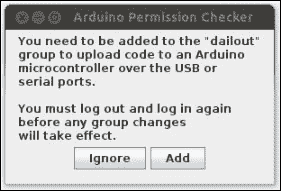
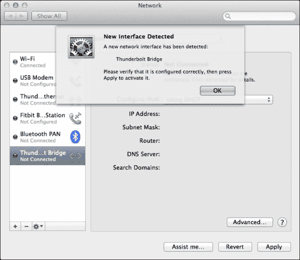
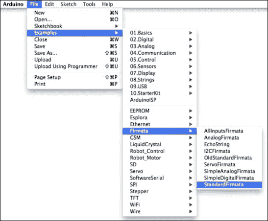
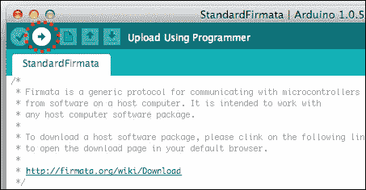
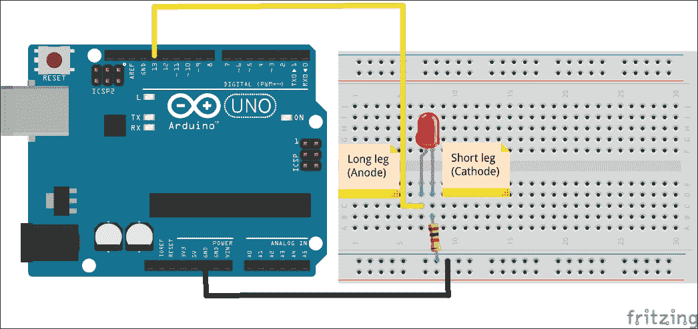
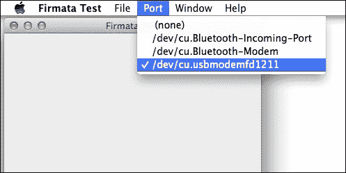
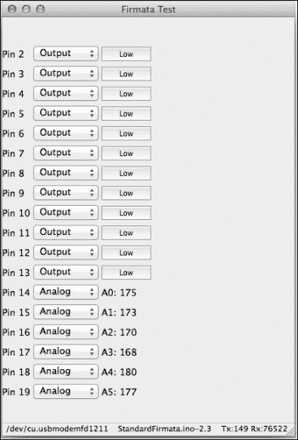
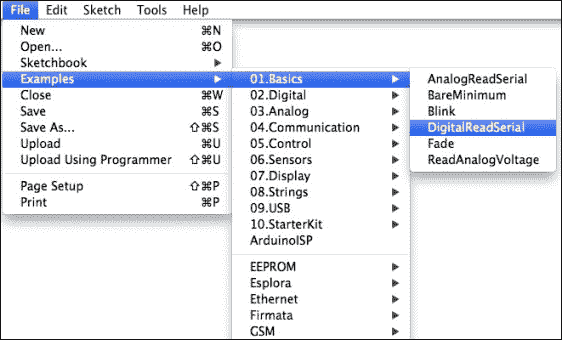

# 第二章：使用 Firmata 协议和 pySerial 库

在前一章中，你学习了 Python 编程语言和 Arduino 硬件平台的基础知识，以便开始使用。如果你直接阅读本章而没有阅读前一章，我们假设你对这些技术有一定的专业知识或工作经验。本章描述了两个将 Arduino 与 Python 连接所需的重要组件：

+   Arduino Firmata 协议

+   Python 的串行库名为`pySerial`

尽管 Firmata 协议对于将 Arduino 与 Python 接口很有用，但它也可以作为一个独立的工具来开发各种应用。

是时候拿出你的 Arduino 硬件并开始动手实践了。在本章的过程中，你需要一个 LED 灯、一个面包板、一个 1 千欧姆电阻以及你已经在上一章中使用过的组件，即 Arduino Uno 和 USB 线。

### 注意

如果你使用的是任何其他版本的 Arduino，你可以从[`arduino.cc/en/Guide/HomePage`](http://arduino.cc/en/Guide/HomePage)或位于[`forum.arduino.cc/`](http://forum.arduino.cc/)的社区支持的 Arduino 论坛中获取更多信息。

# 连接 Arduino 板

如前一章所述，本书支持所有主要操作系统，本节将为你提供连接和配置 Arduino 板的步骤。在前一章中，我们使用了示例代码来开始使用 Arduino IDE。如果你没有按照前一章提供的信息成功与 Arduino 通信，请遵循本节提供的说明，在计算机和 Arduino 之间建立连接。首先，使用 USB 线将 Arduino 板连接到计算机的 USB 端口，并按照你的操作系统步骤进行操作。

## Linux

如果你使用的是最新的 Ubuntu Linux 版本，一旦你连接 Arduino 板并打开 Arduino IDE，系统会要求你将自己的用户名添加到 dailout 组，如下面的截图所示。点击**添加**按钮并从系统中注销。你不需要重启计算机，更改即可生效。使用相同的用户名登录并打开 Arduino IDE。



如果你没有看到这个对话框，请检查是否可以在 Arduino IDE 的**工具**菜单中看到**串行端口**选项。可能是因为安装了其他程序已经将你的用户名添加到了 dailout 组。如果你没有对话框，且在**串行端口**没有选择项，请在终端中执行以下脚本，其中`<username>`是你的 Linux 用户名：

```py
$ sudo usermod -a -G dialout <username>

```

此脚本将把您的用户名添加到拨出组，并且它也应该适用于其他 Linux 版本。在 Linux 中，Arduino 板通常连接为`/dev/ttyACMx`，其中`x`是整数值，取决于您的物理端口地址。如果您使用的是除 Ubuntu 以外的任何其他 Linux 发行版，您可能需要从 Arduino 网站上的 Linux 安装页面（[`playground.arduino.cc/Learning/Linux`](http://playground.arduino.cc/Learning/Linux)）检查与 Arduino 串行端口关联的正确组。

### 注意

对于 Fedora Linux 发行版，将`uucp`和`lock`组与`dialout`组合并，以控制串行端口：

```py
$ sudo usermod -a -G uucp,dialout,lock <username>

```

## Mac OS X

在 Mac OS X 中，当您通过串行端口连接 Arduino 时，操作系统将其配置为网络接口。在 OS X Mavericks 中，一旦 Arduino 板连接，从**系统偏好设置**中打开**网络**。应该会出现一个对话框，表明检测到新的网络接口。点击**Thunderbolt Bridge**的**确定**，然后点击**应用**。以下截图显示了添加新网络接口的对话框：



对于 OS X Lion 或更高版本，连接 Arduino 板时，将出现一个对话框，要求您添加新的网络接口。在这种情况下，您不需要导航到您的网络首选项。如果您看到状态为**未连接**并以红色突出显示的网络接口，请不要担心，因为它应该可以正常工作。

打开 Arduino IDE，从**工具**菜单导航到**串行端口**。您应该能看到类似于以下截图中的选项。Arduino 板连接的串行端口可能会根据您的 OS X 版本和连接的物理端口而有所不同。确保您为 USB 调制解调器选择一个`tty`接口。如以下截图所示，Arduino 板连接到串行端口`/dev/tty.usbmodemfd121`：


## Windows

如果您使用的是 Windows，Arduino 串行端口的配置非常简单。当您第一次连接 Arduino 板时，操作系统将自动安装必要的驱动程序。一旦此过程完成，从菜单栏中的**串行端口**选项中选择一个合适的 COM 端口。从主菜单中，导航到**工具** | **串行端口**并选择 COM 端口。

## 故障排除

即使按照前面提到的步骤操作，如果您仍然看不到以下截图所示的突出显示的**串行端口**选项，那么您可能遇到了问题。这可能有两个主要原因：串行端口被另一个程序使用，或者 Arduino USB 驱动程序没有正确安装。

如果有除 Arduino IDE 之外的其他程序正在使用特定的串行端口，请终止该程序并重新启动 Arduino IDE。有时在 Linux 中，`brltty` 库与 Arduino 串行接口冲突。请删除此库，注销并重新登录：

```py
$ sudo apt-get remove brltty

```

在 Windows 中，重新安装 Arduino IDE 也有效，因为这个过程会重新安装和配置 Arduino USB 驱动程序。


### 小贴士

Arduino 板一次只能由一个程序使用。在尝试使用 Arduino IDE 时，确保任何之前使用的程序或其他服务都没有使用串行端口或 Arduino，这一点非常重要。当我们开始在下节使用多个程序控制 Arduino 时，这个检查将变得非常重要。

假设你现在可以在 Arduino IDE 中选择串行端口，我们可以继续编译并将草图上传到您的 Arduino 板。Arduino IDE 预装了示例草图，您可以尝试使用它们。然而，在我们开始尝试复杂的示例之前，让我们先浏览下一节，该节解释了 Firmata 协议，并指导您逐步编译和上传草图。

# 介绍 Firmata 协议

在 Arduino 之前，基于微控制器的应用程序领域仅限于硬件程序员。Arduino 使来自其他软件领域的开发者和甚至非编码社区的开发者能够轻松地开发基于微控制器的硬件应用程序。Arduino 由一个简单的硬件设计组成，包括微控制器和 I/O 引脚，用于连接外部设备。如果能够编写一个 Arduino 草图，可以将微控制器和这些引脚的控制权转移到外部软件机制，那么这将减少每次修改上传 Arduino 草图的努力。这个过程可以通过开发这样的 Arduino 程序来完成，然后可以通过串行端口对其进行控制。存在一个名为 **Firmata** 的协议，它正是这样做的。

## 什么是 Firmata？

Firmata 是一种通用协议，允许微控制器与在计算机上托管的应用软件之间进行通信。任何能够进行串行通信的计算机主机上的软件都可以使用 Firmata 与微控制器通信。Firmata 使 Arduino 直接对软件提供完全访问权限，并消除了修改和上传 Arduino 草图的流程。

要使用 Firmata 协议，开发者可以一次性将支持该协议的草图上传到 Arduino 客户端。之后，开发者可以在主机计算机上编写自定义软件并执行复杂任务。该软件将通过串行端口向配备 Firmata 的 Arduino 板提供命令。他们可以在不中断 Arduino 硬件的情况下，不断更改主机计算机上的逻辑。

编写自定义 Arduino 草图的做法对于 Arduino 板需要本地执行任务的独立应用程序仍然有效。我们将在接下来的章节中探讨这两种选项。

### 注意

您可以从官方网站[`www.firmata.org`](http://www.firmata.org)了解更多关于 Firmata 协议及其最新版本的信息。

## 将 Firmata 草图上传到 Arduino 板

开始测试 Firmata 协议的最佳方式是将标准 Firmata 程序上传到 Arduino 板，并使用主机上的测试软件。在本节中，我们将演示一种将具有此标准 Firmata 程序的自定义 Arduino 草图上传到板的方法。这将成为将来上传任何草图时的默认方法。

实现 Firmata 协议需要最新的 Firmata 固件版本，您无需担心编写它。最新的 Arduino IDE 自带标准版本的 Firmata 固件，我们建议您使用最新的 IDE 以避免任何冲突。现在，按照以下步骤将程序上传到您的 Arduino 板：

1.  如以下截图所示，通过在 Arduino IDE 中导航到**文件** | **示例** | **Firmata** | **StandardFirmata**来打开**StandardFirmata**草图：

1.  此操作将在新窗口中打开另一个草图簿，并在编辑器中加载**StandardFirmata**草图。不要修改草图中的任何内容，并继续执行下一节中描述的编译过程。重要的是不要修改代码，因为我们将要使用的测试软件与最新的未更改固件兼容。

1.  一旦打开**StandardFirmata**草图，下一步就是为您的 Arduino 板编译它。在上一节中，我们已经将 Arduino 板连接到计算机并选择了正确的串行端口。然而，如果新的草图簿与之前的配置不同，请按照上一节的步骤操作，即选择适当的串行端口和 Arduino 板类型。

1.  要编译当前草图，请点击以下截图所示的**验证**图标。您也可以通过导航到**草图** | **验证/编译**或点击*Ctrl* + *R*（如果您使用的是 Mac OS X，则为*command* + *R*）来编译它：

    编译过程应该没有错误完成，因为我们使用的是 IDE 自带的默认示例代码。现在，是时候将草图上传到板上了。请确保您已经连接了板。

1.  按照以下截图所示，在工具栏中按下上传图标。此操作将上传编译后的代码到您的 Arduino 板：

完成后，你应该在 IDE 中看到**上传完成**的文本，如图下所示：


你的 Arduino 板现在已安装了最新的 Firmata 固件，并等待来自计算机的请求。让我们继续到下一节，开始测试 Firmata 协议。

## 测试 Firmata 协议

在上一章中，我们使用了 13 号引脚上的板载 LED 来测试**闪烁**程序。这次，我们将使用外部 LED，帮助你开始使用 Arduino 板组装硬件组件。由于所有即将到来的练习和项目都将要求你使用面包板将硬件组件如传感器和执行器连接到 Arduino 板上，我们希望你开始获得实际操作这些组件的实践经验。

现在是时候使用我们在本章开头要求你获取的 LED 了。在我们开始接线 LED 之前，让我们首先了解它的物理原理。你获得的 LED 应该有两个引脚：一个短的和一个长的。短的引脚连接到 LED 的阴极，并且需要通过一个电阻连接到地。如图所示，我们使用一个 1 千欧姆的电阻将 LED 的阴极接地。连接到阳极的长引脚需要连接到 Arduino 板上的一个数字引脚。

如下图所示，我们将阳极连接到了数字引脚 13。查看图示并按照显示的接线方式接线。确保你已将 Arduino 板从主机计算机断开，以避免静电造成的任何损坏。



在这个例子中，我们将使用 LED 来测试 Firmata 协议的一些基本功能。我们已将 Firmata 代码上传到 Arduino 板，并准备好从主机计算机控制 LED。

### 注意

上述接线图是使用一个名为**Fritzing**的开源工具创建的。我们将在下一章全面介绍 Fritzing 工具，因为它将成为我们在实际物理接线之前创建接线图的标准软件。

使用 Firmata 与主机计算机通信有多种方式，例如使用支持的库在 Python 中编写自己的程序或使用预构建的测试软件。从下一节开始，我们将编写自己的程序来使用 Firmata，但在这个阶段，让我们使用一个免费工具进行测试。官方 Firmata 网站[`www.firmata.org`](http://www.firmata.org)还提供了测试工具，您可以从主页上的**Firmata 测试程序**部分下载。该网站为不同的操作系统提供了名为`firmata_test`的不同工具变体。按照以下步骤，您可以测试 Firmata 协议的实现：

1.  将`firmata_test`程序的适当版本下载到您的计算机上。

1.  现在，使用 USB 线将带有 LED 的 Arduino 板连接到主机计算机，并运行下载的`firmata_test`程序。您将能够在程序成功执行后看到一个空窗口。

1.  如以下屏幕截图所示，从下拉菜单中选择适当的端口。请确保选择您用于上传 Arduino 草图相同的端口。

    ### 小贴士

    在这一点上，请确保您的 Arduino IDE 没有使用相同的端口号连接到板。如我们之前提到的，串行接口一次只授予一个应用程序独家访问权限。

1.  一旦您选择了 Arduino 串行端口，程序将加载多个带有包含引脚编号标签的下拉框和按钮。您可以在下面的屏幕截图中看到，程序已加载了 12 个数字引脚（从引脚 2 到引脚 13）和 6 个模拟引脚（从引脚 14 到引脚 19）。由于我们使用 Arduino Uno 板进行我们的应用，测试程序只加载 Arduino Uno 板的部分引脚。如果您使用 Arduino Mega 或任何其他板，程序中显示的引脚数量将根据该特定 Arduino 板变体支持的引脚数量而定。

    ### 小贴士

    **在 Linux 上使用 firmata_test 程序**

    在 Linux 平台上，您可能需要修改下载文件的属性并使其可执行。从同一目录中，在终端中运行以下命令使其可执行：

    ```py
    $ chmod +x firmata_test

    ```

    一旦您更改了权限，请使用以下命令从终端运行程序：

    ```py
    $ ./firmata_test

    ```

1.  如你在程序窗口中所见，你还有两列以及其他包含标签的列。程序中的第二列允许你选择适当引脚的角色。你可以指定数字引脚（在 Arduino Uno 的情况下，从 2 到 13）作为输入或输出。如以下截图所示，当你选择 2 号和 3 号引脚作为输入引脚时，你会在第三列看到**低**。这是正确的，因为我们没有将这些引脚连接到任何输入。你可以通过更改多个引脚的角色和值来玩弄程序。

    由于我们已经将 LED 连接到数字引脚 13，所以在你玩弄其他引脚时，我们不会期望在板上出现任何物理变化。

1.  现在，选择引脚 13 作为输出引脚并按下**低**按钮。这将改变按钮的标签为**高**，并且你会看到 LED 灯被点亮。通过执行此操作，我们已经将数字引脚 13 的逻辑更改为 1，即**高**，这在引脚上相当于+5 伏特。这种电压足以点亮 LED。你可以通过再次点击按钮并将它切换到**低**来将引脚 13 的级别改回 0。这将使电压回到 0 伏特。

我们在这里使用的程序非常适合测试基础知识，但不能用来编写使用 Firmata 协议的复杂应用程序。在实际应用中，我们确实需要使用自定义代码来执行 Firmata 方法，这不仅包括切换 LED 状态，还包括实现智能逻辑和算法、与其他组件接口等。从下一节开始，我们将使用 Python 来处理这些应用。

# 开始使用 pySerial

在上一节中，你学习了 Firmata 协议。这是一个简单快捷的开始使用 Arduino 的方法。尽管 Firmata 协议可以帮助你在不修改 Arduino 草图的情况下从电脑上开发复杂的应用程序，但我们还没有准备好开始编写这些应用程序的代码。

编写这些复杂应用程序的第一步是在你的编程环境和 Arduino 之间通过串行端口提供一个接口。在这本书中，你将需要为每个我们开发的项目在 Python 解释器和 Arduino 之间建立连接。

编写自己的库，该库包括实现函数和规范以在串行协议上启用通信，是一个不方便且耗时的过程。我们将通过使用一个开源、维护良好的 Python 库`pySerial`来避免这种情况。

`pySerial` 库通过封装串行端口的访问来启用与 Arduino 的通信。此模块通过 Python 属性提供对串行端口设置的访问，并允许你通过解释器直接配置串行端口。`pySerial` 将成为 Python 和 Arduino 之间未来通信的桥梁。让我们从安装 `pySerial` 开始。

## 安装 pySerial

我们在第一章*Python 和 Arduino 入门*中安装了包管理器 Setuptools。如果你跳过了那一章并且对此不确定，那么请阅读该部分。如果你已经知道如何安装和配置 Python 库包，则可以跳过这些安装步骤。

从这个阶段开始，我们将只使用基于 pip 的安装命令，因为它们在第一章*Python 和 Arduino 入门*中描述的明显优势：

1.  打开终端或命令提示符，并执行以下命令：

    ```py
    > pip install pyserial

    ```

    Windows 操作系统不需要管理员级别的用户访问来执行命令，但在基于 Unix 的操作系统中，你应该有 root 权限来安装 Python 包，如下所示：

    ```py
    $ sudo pip install pyserial

    ```

    如果你想要从源代码安装 `pySerial` 库，请从 [`pypi.python.org/pypi/pyserial`](http://pypi.python.org/pypi/pyserial) 下载存档，解压它，然后从 `pySerial` 目录中运行以下命令：

    ```py
    $ sudo python setup.py install

    ```

1.  如果 Python 和 Setuptools 安装正确，那么在安装完成后，你应在命令行中看到以下输出：

    ```py
    .
    .
    Processing dependencies for pyserial
    Finished processing dependencies for pyserial

    ```

    这意味着你已经成功安装了 `pySerial` 库，并且可以进入下一部分。

1.  现在，为了检查 `pySerial` 是否成功安装，启动你的 Python 解释器，并使用以下命令导入 `pySerial` 库：

    ```py
    >>> import serial

    ```

## 玩转 pySerial 示例

你的 Arduino 板有来自上一个示例的 Firmata 草图 **StandardFirmata**。为了玩转 `pySerial`，我们不再使用 Firmata 协议。相反，我们将使用另一个简单的 Arduino 草图，该草图实现了可以在 Python 解释器上捕获的串行通信。

坚持不进行任何 Arduino 草图编码的承诺，让我们从 Arduino IDE 中选择一个示例草图：

1.  如以下截图所示，导航到**文件** | **示例** | **01\. 基础** | **DigitalReadSerial**。

1.  使用前面描述的方法编译并上传程序到 Arduino 板。选择你的 Arduino 连接的适当串行端口，并记下它。正如你在草图中所见，这段简单的 Arduino 代码以 9600 bps 的波特率通过串行端口传输数字引脚 2 的状态。

1.  在不将 Arduino 板从计算机断开连接的情况下，打开 Python 解释器。然后，在 Python 解释器上执行以下命令。确保将`/dev/ttyACM0`替换为你之前记下的端口名称：

    ```py
    >>> import serial
    >>> s = serial.Serial('/dev/ttyACM0',9600)
    >>> while True:
     print s.readline()

    ```

1.  执行时，你应在 Python 解释器中看到重复的`0`值。按*Ctrl* + *C*来终止此代码。正如你所见，由于草图中的循环函数，Arduino 代码会持续发送消息。我们没有将任何东西连接到引脚 2，因此我们得到了状态`0`，即`低`。

1.  如果你清楚自己在做什么，你可以将任何数字传感器连接到引脚 2，然后再次运行脚本以查看更改后的状态。

在前面的 Python 脚本中，`serial.Serial`方法用于接口和打开指定的串行端口，而`readline()`方法则从该接口读取每行，以`\n`结束，即换行符。

### 注意

换行符是一个特殊字符，表示文本行的结束。它也被称为**行结束**（**EOL**）或**换行+回车**（**LF + CR**）。了解更多关于换行符的信息，请访问[`en.wikipedia.org/wiki/Newline`](http://en.wikipedia.org/wiki/Newline)。

# 连接 pySerial 和 Firmata

在 Firmata 部分，我们已经了解到使用 Firmata 协议而不是不断修改 Arduino 草图并上传它对于简单程序是多么有用。`pySerial`是一个简单的库，它通过串行端口在 Arduino 和 Python 之间提供桥梁，但它不支持 Firmata 协议。如前所述，Python 的最大好处可以用一句话来描述，“有库就能做到。”因此，存在一个名为`pyFirmata`的 Python 库，它是基于`pySerial`构建的，以支持 Firmata 协议。还有一些其他 Python 库也支持 Firmata，但我们将只在本章中关注`pyFirmata`。我们将在即将到来的各种项目中广泛使用这个库：

1.  让我们从像安装其他 Python 包一样安装`pyFirmata`开始，使用 Setuptools：

    ```py
    $ sudo pin install pyfirmata

    ```

    在前面的章节中，当我们测试`pySerial`时，我们将`DigitalSerialRead`草图上传到了 Arduino 板。

1.  要使用 Firmata 协议进行通信，你需要再次上传**StandardFirmata**草图，就像我们在*上传 Firmata 草图到 Arduino 板*部分所做的那样。

1.  一旦上传了这个草图，打开 Python 解释器并执行以下脚本。此脚本将`pyfirmata`库导入到解释器中。它还定义了引脚号和端口。

    ```py
    >>> import pyfirmata
    >>> pin= 13
    >>> port = '/dev/ttyACM0'

    ```

1.  在此之后，我们需要将端口与微控制器板类型关联：

    ```py
    >>> board = pyfirmata.Arduino(port)

    ```

    在执行前面的脚本时，Arduino 上的两个 LED 会闪烁，因为 Python 解释器和板之间的通信链路正在建立。在*测试 Firmata 协议*部分，我们使用了一个预构建的程序来开关 LED。一旦 Arduino 板与 Python 解释器关联，这些功能可以直接从提示符中执行。

1.  现在，您可以开始使用 Arduino 引脚进行实验了。通过执行以下命令来打开 LED：

    ```py
    >>> board.digital[pin].write(1)

    ```

1.  您可以通过执行以下命令来关闭 LED。在这两个命令中，我们通过传递值`1`（**高**）或`0`（**低**）来设置数字引脚 13 的状态：

    ```py
    >>> board.digital[pin].write(0)

    ```

1.  同样，您也可以从提示符中读取引脚的状态：

    ```py
    >>> board.digital[pin].read()

    ```

如果我们将这个脚本与具有`.py`扩展名的可执行文件结合起来，我们就可以拥有一个可以直接运行的 Python 程序来控制 LED，而不是在终端上运行这些单个脚本。稍后，这个程序可以扩展以执行更复杂的功能，而无需编写或更改 Arduino 草图。

### 注意

虽然我们在 Python 提示符中运行单个脚本，但我们将在下一章中介绍创建 Python 可执行文件的过程。

# 摘要

通过引入 Firmata 库，我们避免了在本章中编写任何自定义 Arduino 草图。我们将在本书剩余部分继续这种做法，并且只有在需要时才会使用或创建自定义草图。在本章中，您通过与 Arduino 板交互使 LED 闪烁来与之交互，这是开始硬件项目的最简单方法。现在，是时候开始您的第一个项目了，我们也将使更多的 LED 闪烁。有人可能会问，如果我们已经做到了这一点，那么为什么还需要另一个项目来使 LED 闪烁呢？让我们来看看。
