# 第五章：使用 Python GUI

在前四章中，我们使用了 Python 交互式提示符或 Arduino 串行监视器来观察结果。在提示符上使用基于文本的输出方法可能对基本的快速原型设计有用，但当你进行高级原型设计和展示你的原型或最终产品时，你需要一个看起来不错且用户友好的界面。GUI 可以帮助用户理解你的硬件项目的各个组件，并轻松与之交互。它还可以帮助你验证项目的结果。

Python 拥有多个广泛使用的 GUI 框架，如`Tkinter`、`wxPython`、`PyQt`、`PySide`和`PyGTK`。这些框架几乎都具备创建专业应用程序所需的所有功能。由于涉及到的复杂性，这些框架对于初学者 Python 程序员来说有不同的学习曲线。现在，由于这本书致力于 Arduino 项目中的 Python 编程，我们无法花费大量时间学习特定框架的细节。相反，我们将根据以下标准选择我们的界面库：

+   安装方便，快速上手

+   实现简单，学习成本低

+   资源消耗最小

满足所有这些要求的框架是`Tkinter`([`wiki.python.org/moin/TkInter`](https://wiki.python.org/moin/TkInter))。`Tkinter`也是所有 Python 安装中默认的标准 GUI 库。

### 注意

虽然`Tkinter`是 Python 的事实上的 GUI 包，但你也可以从它们各自的官方网站了解更多关于前面提到的其他 GUI 框架的信息，如下所示：

+   **wxPython**: [`www.wxpython.org/`](http://www.wxpython.org/)

+   **PyGTK**: [`www.pygtk.org/`](http://www.pygtk.org/)

+   **PySide**: [`qt-project.org/wiki/PySide`](http://qt-project.org/wiki/PySide)

+   **PyQt**: [`sourceforge.net/projects/pyqt/`](http://sourceforge.net/projects/pyqt/)

# 学习 Tkinter 进行 GUI 设计

`Tkinter`，即`Tk`界面，是`Tk` GUI 工具包的跨平台 Python 接口。`Tkinter`在 Python 上提供了一个薄层，而`Tk`提供了图形小部件。`Tkinter`是一个跨平台库，作为主要操作系统的 Python 安装包的一部分进行部署。对于 Mac OS X 10.9，`Tkinter`与默认 Python 框架一起安装。对于 Windows，当你从安装文件安装 Python 时，`Tkinter`会与之一起安装。

`Tkinter`旨在以最小的编程努力开发图形应用程序，同时足够强大以支持大多数 GUI 应用程序功能。如果需要，`Tkinter`还可以通过插件进行扩展。自`Tk`版本 8.0 发布以来，`Tkinter`通过`Tk`提供了操作系统自然的视觉和感觉。

要测试你的`Tk`工具包当前版本，请在 Python 提示符中使用以下命令：

```py
>>> import Tkinter
>>> Tkinter._test()
```

你将看到一个类似于以下截图中的图像，其中包含有关你的`Tk`版本的信息：

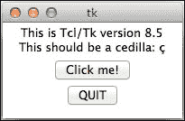

如果你遇到获取此窗口的任何问题，请检查你的 Python 安装并重新安装它，因为没有`Tkinter`库和`Tk`工具包，你将无法在本章中继续前进。

`Tkinter`界面支持各种窗口小部件来开发 GUI。以下表格描述了我们将在本章中使用的一些重要窗口小部件：

| 窗口小部件 | 描述 |
| --- | --- |
| `Tk()` | 这是每个程序所需的根窗口小部件 |
| `Label()` | 这显示文本或图像 |
| `Button()` | 这是一个简单的按钮，可以用来执行动作 |
| `Entry()` | 这是一个文本字段，用于向程序提供输入 |
| `Scale()` | 这通过拖动滑块提供数值 |
| `Checkbox()` | 这允许你通过勾选框在两个值之间切换 |

### 注意

可以从[`docs.python.org/2/library/tk.html`](https://docs.python.org/2/library/tk.html)获取`Tkinter`函数和方法的详细描述，这些函数和方法实现了`Tk`工具包提供的多数功能。

# 你的第一个 Python GUI 程序

正如我们在前面的章节中讨论的，学习任何编程语言的第一程序通常包括打印`Hello World!`。现在，由于我们开始 Python GUI 编程，让我们先在 GUI 窗口中打印相同的字符串，而不是在提示符中。

只为了开始 GUI 编程，我们将执行一个 Python 程序，然后跳入解释代码的结构和细节。让我们使用以下代码行创建一个 Python 可执行文件，命名为`helloGUI.py`，然后运行它。执行过程应该在没有依赖错误的情况下完成：

```py
import Tkinter

# Initialize main windows with title and size
top = Tkinter.Tk()
top.title("Hello GUI")
top.minsize(200,30)

# Label widget
helloLabel = Tkinter.Label(top, text = "Hello World!")
helloLabel.pack()

# Start and open the window
top.mainloop()
```

在成功执行前面的代码片段后，你应该会看到一个以下窗口。如你所见，`Hello World!`字符串已打印在窗口中，窗口标题为**Hello GUI**：

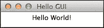

那么，究竟发生了什么？如你所见，我们从代码片段中逐个实例化了各种`Tkinter`窗口小部件以获得这个结果。这些窗口小部件是使用`Tkinter`开发的任何 Python GUI 应用程序的构建块。让我们从第一个也是最重要的窗口小部件`Tk()`开始。

## 根窗口小部件 Tk()和顶级方法

`Tk()` 小部件初始化一个带有标题栏的主空窗口。这是一个根小部件，每个程序只需要一次。主窗口的装饰和样式来自操作系统的环境。因此，当您在不同的操作系统上运行相同的 `Tkinter` 代码时，您将得到相同的窗口和标题栏，但风格不同。

一旦创建了根小部件，您就可以执行一些顶层方法来装饰、描述或调整此窗口的大小。在代码中，我们使用 `title()` 方法设置主窗口的标题。这个 `title()` 方法接受一个字符串作为输入参数：

```py
Top = Tkinter.Tk()
top.title("Hello GUI")
```

接下来，我们在主窗口上调用 `minsize()` 方法，通过 `(width, height)` 参数设置窗口的最小尺寸：

```py
top.minsize(200,30)
```

类似地，您也可以使用 `maxsize()` 方法来指定主窗口应该有的最大尺寸。在 `minsize()` 和 `maxsize()` 方法中，`width` 和 `height` 的值以像素为单位提供。

一旦整个程序实例化完成，就需要 `mainloop()` 函数来启动事件循环：

```py
top.mainloop()
```

如果代码没有进入主事件循环，您将看不到任何其他小部件，包括主窗口。事件循环将一直活跃，直到窗口被手动关闭或调用退出方法。

您可能对更新窗口、程序化关闭它、在网格中排列小部件等问题有各种疑问。肯定有比之前指定的更多顶层方法。

## `Label()` 小部件

除了 `Tk()` 之外，代码中使用的另一个小部件是 `Label()`。`Tkinter` 小部件是部件层次结构的一部分，其中 `Label()` 是根小部件 `Tk()` 的子部件。此小部件不能在没有指定根小部件或标签需要显示的主窗口的情况下调用。此小部件的主要用途是在主窗口中显示文本或图像。在下面的代码行中，我们使用它来显示 `Hello World!` 字符串：

```py
helloLabel = Tkinter.Label(top, text = "Hello World!")
```

在这里，我们创建并初始化了一个名为 `helloLabel` 的标签对象，它有两个输入参数：指定根小部件的 `top` 变量和一个 `text` 字符串。`Label()` 小部件高度可定制，并接受各种配置参数以调整宽度、边框、背景和对齐方式作为选项。涉及这些定制的示例将在接下来的章节中介绍。您可以在[`effbot.org/tkinterbook/label.htm`](http://effbot.org/tkinterbook/label.htm)了解更多关于支持的输入参数。

## `Pack` 几何管理器

`Pack` 几何管理器按行和列组织小部件。要使用它，`Tkinter` 需要为每个小部件调用 `pack()` 方法，以便小部件在主窗口上可见：

```py
helloLabel.pack()
```

Pack 几何管理器可以被所有`Tkinter`控件使用，除了根控件，用于在根窗口中组织控件。在多个控件的情况下，如果未指定控件的位置，Pack 管理器将它们安排在同一个根窗口中。Pack 管理器易于实现，但在自定义程度上有限制。一个有助于创建复杂布局的替代几何管理器称为**Grid**，这将在接下来的章节中解释。

在接下来的编码练习中，我们将介绍更多的控件及其相关方法。在这些练习中，我们将通过实际应用来解释每个单独的控件，以便您更好地理解使用案例。

# Button()小部件 – 将 GUI 与 Arduino 和 LEDs 接口

现在您已经有了创建 Python 图形界面的第一次动手经验，让我们将其与 Arduino 集成。Python 使得将各种异构包相互接口变得容易，这正是您将要做的。在下一个编码练习中，我们将使用`Tkinter`和`pyFirmata`使 GUI 与 Arduino 协同工作。在这个练习中，我们将使用`Button()`控件来控制与 Arduino 板接口的 LED。

在我们开始练习之前，让我们构建我们将需要用于所有后续程序的电路。以下是我们使用的电路的 Fritzing 图，其中我们使用了两种不同颜色的 LED 和上拉电阻。将这些 LED 连接到 Arduino Uno 板上的数字引脚 10 和 11，如图所示：

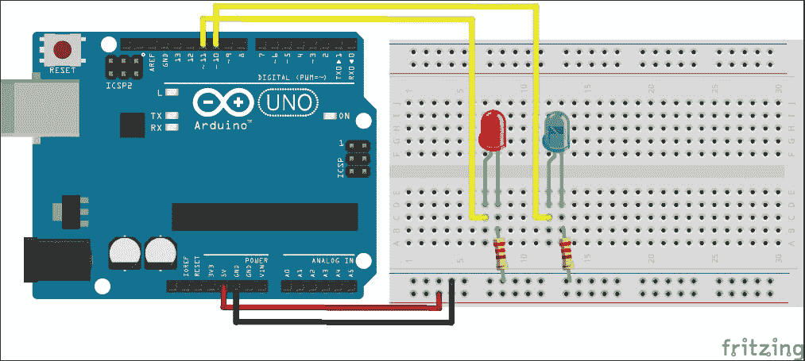

### 注意

在使用本节和后续章节中提供的程序时，您必须根据您的操作系统替换用于定义板变量的 Arduino 端口。要找出您的 Arduino 板连接到哪个端口，请遵循第二章中提供的详细说明，*使用 Firmata 协议和 pySerial 库*。同时，如果您打算使用除 10 和 11 之外的任何引脚，请确保在代码中提供正确的引脚号。对于某些练习，您将需要使用 PWM 引脚，所以请确保您有正确的引脚。

在上一个练习中，我们要求你将整个代码片段作为一个 Python 文件运行。由于程序长度和复杂性的原因，在接下来的练习中可能无法这样做。因此，我们将这些练习组装在程序文件中，可以从 第四章 的代码文件夹中访问，*深入 Python-Arduino 原型设计*，可以从 [`www.packtpub.com/books/content/support/1961`](https://www.packtpub.com/books/content/support/1961) 下载。对于 `Button()` 小部件练习，请从 第四章 的代码文件夹中打开 `exampleButton.py` 文件，*深入 Python-Arduino 原型设计*。代码包含三个主要部分：

+   `pyFirmata` 库和 Arduino 配置

+   按钮的 `Tkinter` 小部件定义

+   当你按下按钮时执行的 LED 闪烁函数

如以下代码片段所示，我们首先使用 `pyFirmata` 方法导入库并初始化 Arduino 板。对于这个练习，我们只将与一个 LED 一起工作，并且只为它初始化了 `ledPin` 变量：

```py
import Tkinter
import pyfirmata
from time import sleep
port = '/dev/cu.usbmodemfa1331'
board = pyfirmata.Arduino(port)
sleep(5)
ledPin = board.get_pin('d:11:o')
```

### 注意

由于我们在这个章节的所有练习中都使用 `pyFirmata` 库，请确保你已经将标准 Firmata 草图的最新版本上传到你的 Arduino 板上。

在代码的第二部分，我们已经将根 `Tkinter` 小部件初始化为 `top` 并提供了一个标题字符串。我们还使用 `minsize()` 方法固定了窗口的大小。为了更熟悉根小部件，你可以尝试调整窗口的最小和最大尺寸：

```py
top = Tkinter.Tk()
top.title("Blink LED using button")
top.minsize(300,30)
```

`Button()` 小部件是一个标准的 `Tkinter` 小部件，主要用于从用户那里获取手动、外部的输入刺激。像 `Label()` 小部件一样，`Button()` 小部件可以用来显示文本或图像。与 `Label()` 小部件不同的是，当它被按下时，可以与之关联动作或方法。当按钮被按下时，`Tkinter` 执行由 `command` 选项指定的方法或命令：

```py
startButton = Tkinter.Button(top,
                             text="Start",
                             command=onStartButtonPress)
startButton.pack()
```

在这个初始化中，与按钮关联的函数是 `onStartButtonPress`，按钮标题显示为 `"Start"` 字符串。同样，`top` 对象指定了父对象或根小部件。一旦按钮实例化，你需要使用 `pack()` 方法使其在主窗口中可用。

在前面的代码行中，`onStartButonPress()`函数包含了闪烁 LED 和更改按钮状态的脚本。按钮状态可以是`NORMAL`、`ACTIVE`或`DISABLED`。如果没有指定，任何按钮的默认状态都是`NORMAL`。`ACTIVE`和`DISABLED`状态在需要避免按钮重复按下的应用程序中非常有用。在用`write(1)`方法打开 LED 后，我们将使用`sleep(5)`函数添加 5 秒的时间延迟，然后再用`write(0)`方法关闭它：

```py
def onStartButtonPress():
  startButton.config(state=Tkinter.DISABLED)
  ledPin.write(1)
  # LED is on for fix amount of time specified below
  sleep(5)
  ledPin.write(0)
  startButton.config(state=Tkinter.ACTIVE)
```

在程序结束时，我们将执行`mainloop()`方法来启动`Tkinter`循环。直到这个函数被执行，主窗口不会出现。

要运行代码，对 Arduino 的`board`变量进行适当的更改并执行程序。以下带有按钮和标题栏的屏幕截图将作为程序的输出。点击**开始**按钮将在指定的时间延迟内打开 Arduino 板上的 LED。同时，当 LED 亮起时，你将无法再次点击**开始**按钮。现在，在这个特定的程序中，我们没有提供足够的代码来安全地断开 Arduino 板，这将在接下来的练习中介绍。

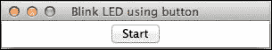

# Entry()小部件 – 提供手动用户输入

在之前的练习中，你使用了一个按钮来在 Arduino 板上闪烁 LED，持续固定的时间。假设你想更改这个固定的时间延迟，并指定一个根据你的应用程序需求的价值。要执行此操作，你需要一个可以接受自定义值并将其转换为延迟的小部件。就像任何其他 GUI 框架一样，`Tkinter`提供了一个名为`Entry()`的类似小部件的接口，我们将在下一个练习中使用它。

保持与之前练习相同的 Arduino 和 LED 配置，并打开`exampleEntry.py`文件。在代码的开头，你会找到与之前练习中使用的相同的 Arduino 板和 LED 引脚配置。进入下一阶段，你将能够看到以下代码片段，它定义了根小部件。在这个代码片段中，我们将主窗口的标题更改，以反映练习的前提。使用独特的字符串作为窗口标题将有助于你在处理一个应用程序中的多个窗口时，根据它们的属性来区分这些窗口：

```py
top = Tkinter.Tk()
top.title("Specify time using Entry")
```

虽然可以通过指定父小部件作为唯一参数轻松初始化`Entry()`小部件，但它也支持大量参数来自定义小部件。例如，在我们的练习中，我们使用`bd`参数来指定小部件边框的宽度，以及`width`来提供小部件的预期宽度。你可以在[`effbot.org/tkinterbook/entry.htm`](http://effbot.org/tkinterbook/entry.htm)了解更多关于可用选项的信息：

```py
timePeriodEntry = Tkinter.Entry(top,
                                bd=5,
                                width=25)
timePeriodEntry.pack()
timePeriodEntry.focus_set()
startButton = Tkinter.Button(top,
                             text="Start",
                             command=onStartButtonPress)
startButton.pack()
```

在前面的代码行中，我们在主窗口中初始化了两个小部件对象：`timePeriodEntry`用于`Entry()`小部件，以及我们在上一个练习中使用的`startButton`，用于`Button()`小部件。Pack 几何管理器始终将图形指针设置为主窗口中最后添加的小部件。我们可以使用`focus_set()`方法手动将图形指针的焦点移到`timePeriodEntry`小部件。

与上一个练习中的`onStartButtonPress()`函数相反，这个函数没有使用时间延迟修复。相反，它从`timePeriodEntry`对象中获取值。你可以使用`get()`方法从`timePeriodEntry`对象中获取输入的值，并使用`float()`函数将其转换为浮点值。正如你可以在以下代码片段中看到的那样，我们使用这个浮点值作为从开启状态切换 LED 关闭的时间延迟：

```py
def onStartButtonPress():
  # Value for delay is obtained from the Entry widget input
  timePeriod = timePeriodEntry.get()
  timePeriod = float(timePeriod)
  startButton.config(state=Tkinter.DISABLED)
  ledPin.write(1)
  sleep(timePeriod)
  ledPin.write(0)
  startButton.config(state=Tkinter.ACTIVE)
```

一旦你理解了初始化`Entry()`小部件的过程以及从中获取自定义值的方法，让我们执行代码。

当你运行这个练习时，你应该能看到一个类似于以下截图所示的窗口。在秒数中输入一个时间延迟值，然后点击**开始**按钮来查看 LED 上的结果。基本上，当按钮被按下时，程序将调用`onStartButtonPress()`函数，并使用这个值来产生时间延迟。

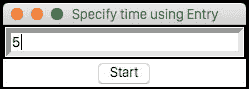

# `Scale()`小部件 – 调整 LED 的亮度

在本节中，我们将编写一些代码来使用 Python GUI 改变 LED 的亮度。之前，我们了解到你可以使用 Arduino 的数字引脚通过 PWM 产生模拟输出。虽然你可以使用`Entry()`小部件为 PWM 信号提供一个一次性值，但有一个可以动态提供这个值的小部件将是有用的。由于亮度可以在 0 到 100 百分比之间变化，因此使用介于 0 和 100 之间的滑块是有意义的。`Tkinter`库通过`Scale()`小部件提供了这种滑动界面。

在我们努力改变 LED 的亮度和提供模拟输入时，我们将使用支持 PWM 的数字引脚。在之前的练习中，我们使用了数字引脚 11，它已经支持 PWM。如果您使用的是与之前提供的不同的自定义电路版本，我们建议您将其更改为支持 PWM 的引脚。现在，是时候打开程序文件`exampleScale.py`进行这个练习了。

程序的第一个阶段涉及导入必要的库并使用`pyFirmata`初始化 Arduino 板，这与之前的练习几乎相同。根据操作系统和您使用的端口更改用于指定端口变量的字符串。我们还将实例化根窗口，并为这个练习提供独特的标题，就像在之前的练习中做的那样。这个程序的部分通常会在大量的练习中重复出现，您可以参考之前的练习以获取更多信息。

在下一阶段，我们将继续构建我们之前开发的代码，为 LED 提供手动时间延迟。我们还将使用相同的`Entry()`小部件来获取时间间隔作为输入：

```py
timePeriodEntry = Tkinter.Entry(top,
                                bd=5,
                                width=25)
timePeriodEntry.pack()
timePeriodEntry.focus_set()
```

`Scale()`小部件提供了一个可以沿着固定刻度移动的滑动旋钮，以提供数值输出。此刻度的起始值和结束值使用`from_`和`to`选项提供。此滑动条的朝向也可以使用`orient`选项进行配置，其中朝向的可接受值为`HORIZONTAL`和`VERTICAL`。然而，在使用这些值之前，您必须从`Tkinter`库中导入`HORIZONTAL`和`VERTICAL`常量。

如果没有提供选项，默认小部件使用从 0 到 100 的刻度以及垂直方向。在我们的程序中，我们使用了水平方向作为`orient`选项的演示。一旦定义了小部件对象`brightnessScale`，您就必须使用`pack()`将其添加到 Pack 几何管理器中：

```py
brightnessScale = Tkinter.Scale(top,
                                from_=0, to=100,
                                orient=Tkinter.HORIZONTAL)
brightnessScale.pack()
```

为了启动过程并重用之前的代码，我们保留了`startButton`小部件的实例化和`onStartButtonPress`函数的原样。然而，函数的属性被更改以适应`Scale()`小部件：

```py
startButton = Tkinter.Button(top,
                             text="Start",
                             command=onStartButtonPress)
startButton.pack()
```

在这个版本的`onStartButtonPress()`函数中，我们将通过在`brightnessScale`小部件对象上使用`get()`方法来获取`ledBrightness`值，其中`get()`方法将返回滑动条当前位置的价值。由于 PWM 输入需要介于 0 和 1 之间的值，而获取的滑动条值介于 0 和 100 之间，我们将通过除以 100 将滑动条值转换为适当的 PWM 输入。然后，这个新值将与`write()`方法一起使用，这将最终根据`timePeriodEntry`值提供的时间周期打开 LED。

```py
def onStartButtonPress():
  timePeriod = timePeriodEntry.get()
  timePeriod = float(timePeriod)
  ledBrightness = brightnessScale.get()
  ledBrightness = float(ledBrightness)
  startButton.config(state=Tkinter.DISABLED)
  ledPin.write(ledBrightness/100.0)
  sleep(timePeriod)
  ledPin.write(0)
  startButton.config(state=Tkinter.ACTIVE)
```

关于 `Scale()` 小部件的信息，您可以参考 [`effbot.org/tkinterbook/scale.htm`](http://effbot.org/tkinterbook/scale.htm)。现在，运行 `exampleScale.py` 文件。您将能够看到以下截图，其中包含 `Entry()` 和 `Scale()` 小部件。输入时间延迟，将滑块拖动到您想要的亮度，然后点击 **开始** 按钮：

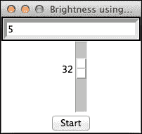

您将能够看到 LED 以 `Scale()` 小部件设置的亮度点亮。一旦经过给定的时间延迟后 LED 关闭，您可以将滑块重置到另一个位置以动态改变亮度值。

# 网格几何管理器

在上一个练习中，我们使用 **Pack** 几何管理器和 `pack()` 方法向根窗口添加了三个不同的小部件。我们没有积极组织这些小部件，但 Pack 管理器自动将它们垂直排列。在设计有意义的界面时，您需要以适当的顺序排列这些小部件。如果您查看先前的输出窗口，很难识别每个小部件的功能或它们与其他小部件的关系。为了设计直观的 GUI，您还需要使用适当的标签描述这些小部件。作为解决方案，`Tkinter` 提供了一种组织小部件的替代方法，称为 **网格几何管理器**。

网格几何管理器提供了一个 **二维**（**2D**）表格界面来排列小部件。2D 表格的每一行和列组合产生的单元格都可以用作小部件的位置。您将在下一个编程练习中学习 `grid()` 类提供的各种选项，以组织小部件。从本章代码文件夹中打开 `exampleGridManager.py` 文件。从功能上讲，此文件包含我们在上一个练习中构建的相同程序。然而，我们添加了更多的 `Label()` 小部件，并使用网格几何管理器对它们进行组织，以简化 GUI 并使其更有用。

如您在代码中所观察到的，`timePeriodEntry` 对象（一个 `Entry()` 小部件）现在使用的是 `grid()` 方法而不是 `pack()` 方法。`grid()` 方法使用列和行选项进行初始化。这些选项提供的值决定了 `timePeriodEntry` 对象将被放置的单元格位置。

另一方面，我们使用 `Label()` 小部件创建了一个标签对象，并将其放置在 `Entry()` 小部件旁边的同一行。标签包含一个使用 `text` 选项指定的描述字符串。在用 `grid()` 方法将其放置在单元格后，小部件在该单元格中居中排列。要更改此对齐方式，您可以使用 `sticky` 选项与 `N`、`E`、`S` 和 `W` 中的一个或多个值，即北、东、南和西：

```py
timePeriodEntry = Tkinter.Entry(top, bd=5)
timePeriodEntry.grid(column=1, row=1)
timePeriodEntry.focus_set()
Tkinter.Label(top, text="Time (seconds)").grid(column=2, row=1)
```

我们已经重复了这种将小部件放置在单元格中并使用`Label()`小部件对其进行描述的实践，用于`Scale()`和`Button()`小部件的对象：

```py
brightnessScale = Tkinter.Scale(top, from_=0, to=100, orient=Tkinter.HORIZONTAL)
brightnessScale.grid(column=1, row=2)
Tkinter.Label(top, text="Brightness (%)").grid(column=2, row=2)

startButton = Tkinter.Button(top, text="Start", command=onStartButtonPress)
startButton.grid(column=1, row=3)
```

如前述代码片段所示，我们在具有相似列值的同时为小部件使用不同的行值。因此，我们的小部件将在同一列中组织，并且它们将在同一行的下一列中拥有它们的描述标签。如果您想检查这种组织模式，可以跳转到输出窗口。

到目前为止，我们一直依赖用户手动关闭主窗口。然而，您可以通过创建另一个`Button()`小部件并通过它调用关闭此窗口的方法。在这个编码练习中，我们有一个比上一个练习多的按钮，称为`exitButton`。与此按钮关联的`command`参数是`quit`，它结束由`Tkinter`方法`top.mainloop()`启动的循环并关闭 GUI：

```py
exitButton = Tkinter.Button(top,
                            text="Exit",
                            command=top.quit)
exitButton.grid(column=2, row=3)
```

在此代码示例中，`quit`方法被初始化为`command`选项，也可以作为方法调用：

```py
top.quit()
```

在我们继续下一步之前，对代码进行适当的更改并运行程序。您将看到一个类似于以下截图所示的窗口：

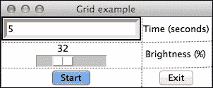

红色虚线是在后来插入的，以帮助您识别网格，它们不会出现在运行程序打开的窗口中。现在，由于旁边有描述标签，您可以清楚地识别每个小部件的作用。在打开的窗口中，使用**开始**和**退出**按钮来执行相关操作的同时，调整时间和亮度值。从下一个练习开始，我们将开始定期使用`grid()`方法来排列小部件。

# Checkbutton()小部件 – 选择 LED

在开发复杂项目时，您会遇到需要依赖用户从给定值集中选择单个或多个选项的情况。例如，当您有多个 LED 与 Arduino 板连接时，您希望用户选择需要打开的 LED 或 LEDs。这种程度的定制使您的界面更具交互性和实用性。`Tkinter`库提供了一个名为`Checkbutton()`的标准小部件的接口，它允许从给定选项中进行手动选择过程。

在这个练习中，我们将处理您在开始时连接到 Arduino 板的绿色和红色 LED。这个练习的整个 Python 程序位于代码文件夹中，文件名为`exampleCheckbutton.py`。使用您一直在使用的相同编辑器打开文件。此程序实现了`Checkbutton()`小部件，以便在点击**开始**按钮时，用户可以选择红色和/或绿色 LED。

为了理解整个程序逻辑，让我们从初始化和导入库开始。如您所见，现在我们有两个数字引脚的分配，分别为 10 号和 11 号引脚，分别命名为`redPin`和`greenPin`。Arduino 板初始化的代码没有变化：

```py
port = '/dev/cu.usbmodemfa1331'
board = pyfirmata.Arduino(port)
sleep(5)
redPin = board.get_pin('d:10:o')
greenPin = board.get_pin('d:11:o')
```

在我们使用`Checkbutton()`小部件的过程中，我们使用了一个非常有用的`Tkinter`变量类，称为`IntVar()`。`Tkinter`变量可以告诉系统变量值何时发生变化。为了更好地理解`Tkinter`变量类及其在我们练习中的具体应用，请查看程序中的以下代码片段：

```py
redVar = Tkinter.IntVar()
redCheckBox = Tkinter.Checkbutton(top,
                                  text="Red LED",
                                  variable=redVar)
redCheckBox.grid(column=1, row=1)
```

`Checkbutton()`小部件允许用户在两个不同的值之间进行选择。这些值通常是`1`（开启）或`0`（关闭），使`Checkbutton()`小部件成为一个开关。为了捕获这个选择，需要在小部件定义中使用`variable`选项。可以使用`Tkinter`变量类之一初始化变量，即`IntVar()`。

如您所见，使用`IntVar()`类实例化的`redVar`变量对象在定义`Checkbutton()`小部件`redCheckButton`时用于`variable`选项。因此，对`redCheckButton`对象的任何操作都将转换为对`redVar`变量对象的操作。由于`IntVar()`是`Tkinter`类，它将自动通过`Checkbutton()`小部件处理变量值的任何变化。因此，建议在`Checkbutton()`小部件中使用`Tkinter`变量类而不是默认的 Python 变量。在为红色 LED 定义`Checkbutton()`小部件之后，我们按照以下代码片段所示，为绿色 LED 重复了此过程：

```py
greenVar = Tkinter.IntVar()
greenCheckBox = Tkinter.Checkbutton(top,
                                    text="Green LED",
                                    variable=greenVar)
greenCheckBox.grid(column=2, row=1)
```

此程序还包含**开始**和**退出**按钮及其与`onStartButtonPress`和`top.quit()`函数的关联，类似于我们在之前的练习中使用它们的方式。当被调用时，`onStartButtonPress`函数将使用`get()`方法获取`IntVar()`变量`redVar`和`greenVar`的值。在这种情况下，当复选框被选中时，复选框小部件的变量值将是`1`，否则是`0`。这将使程序能够通过检查或取消选中小部件，使用`write()`方法将值`1`或`0`发送到 Arduino 引脚，最终打开或关闭 LED：

```py
def onStartButtonPress():
  redPin.write(redVar.get())
  greenPin.write(greenVar.get())
```

如您所见，代码还实现了一个额外的**停止**按钮，用于关闭使用**开始**按钮打开的 LED：

```py
stopButton = Tkinter.Button(top,
                            text="Stop",
                            command=onStopButtonPress)
stopButton.grid(column=2, row=2)
```

与此按钮关联的`onStopButtonPrerss()`函数通过在两个引脚上使用`write(0)`关闭两个 LED：

```py
def onStopButtonPress():
  redPin.write(0)
  greenPin.write(0)
```

由于您现在已经了解了 `Tkinter` 变量和 `Checkbutton()` 小部件，让我们运行 Python 程序 `exampleCheckbutton.py`。如下一截图所示，GUI 有两个 `Checkbutton()` 小部件，分别用于红色和绿色 LED。由于 `Checkbutton()` 小部件有单独的初始化，用户可以同时检查红色和绿色 LED。`Tkinter` 还提供了类似的 `Radiobutton()` 和 `Listbox()` 小部件，用于您只想从给定选项中选择单个值的情况。

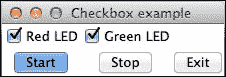

### 注意

您可以从以下网页了解更多关于 `Radiobutton()` 和 `Listbox()` 小部件的信息：

+   [`effbot.org/tkinterbook/radiobutton.htm`](http://effbot.org/tkinterbook/radiobutton.htm)

+   [`effbot.org/tkinterbook/listbox.htm`](http://effbot.org/tkinterbook/listbox.htm)

# Label() 小部件 – 监控 I/O 引脚

Arduino 项目通常涉及实时系统，并需要持续监控数字和模拟引脚的输入值。因此，如果这些值在图形界面上显示，它们需要定期更新或当引脚状态改变时更新。

如果您观察之前的 GUI 练习，您会注意到我们在代码的末尾使用 `mainloop()` 初始化根窗口，这启动了 `Tkinter` 循环并使用更新后的值初始化了所有小部件。一旦初始化了 `mainloop()`，我们就不再使用任何其他 `Tkinter` 类或方法来定期用最新值更新小部件。

在这个练习中，我们将使用电位器为模拟引脚 0 提供可变输入，这将通过 Tkinter 的 `Label()` 小部件反映出来。为了更新标签并显示模拟输入的值，我们将实现一些 Python 和 `Tkinter` 技巧。由于我们使用电位器提供输入，您需要在跳转到 Python 程序之前，按照以下图示更改电路：

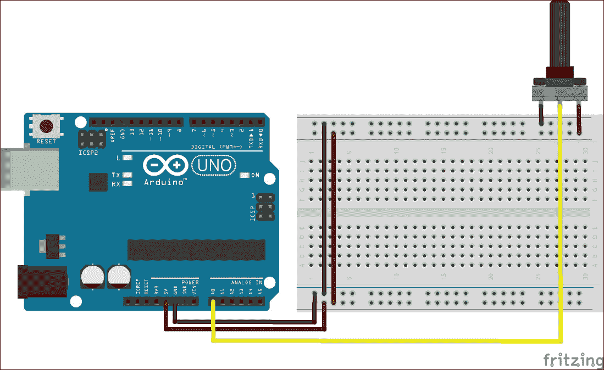

本练习的 Python 文件位于代码文件夹中的 `workingWithLabels.py` 文件。在进行此练习之前，请确保在定义 `port` 变量时已设置适当的 Arduino 板字符串。程序成功执行后，将显示以下截图，您可以通过点击**开始**按钮来启动电位器的输入值连续更新：

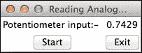

那么，我们是如何做到这一点的呢？这段代码包含比我们迄今为止所做更复杂的逻辑和不同的程序流程。如您从代码中看到的，我们使用一个名为`flag`的变量来跟踪**退出**按钮的状态，同时持续运行监控和更新值的`while`循环。为了正确理解程序，让我们首先熟悉以下新的`Tkinter`类和方法：

+   `BooleanVar()`: 就像我们用来跟踪整数值的`IntVar()`变量类一样，`BooleanVar()`是一个`Tkinter`变量类，用于跟踪布尔值的变化：

    ```py
    flag = Tkinter.BooleanVar(top)
    flag.set(True)
    ```

    在前面的代码片段中，我们使用`BooleanVar()`类创建了一个变量对象`flag`，并将该对象的价值设置为`True`。作为一个布尔对象，`flag`只能有两个值，`True`或`False`。`Tkinter`还提供了`StringVar()`和`DoubleVar()`类，分别用于字符串和双精度类型。

    因此，当点击**开始**按钮时，系统开始更新模拟读取值。**退出**按钮将`flag`变量设置为`false`，中断`while`循环，并停止监控过程。

+   `update_idletasks`: 在使用 Python 中的`Tkinter`库时，您可以将 Python 代码链接到`Tk()`小部件中发生的任何更改。这个链接的 Python 代码被称为**回调**。`update_idletasks`方法调用所有空闲任务而不处理任何回调。此方法还根据需要重新绘制几何小部件：

    ```py
    AnalogReadLabel.update_idletasks()
    ```

    在我们的练习中，这个方法可以用来持续更新标签，显示最新的电位计值。

+   `update`: 这个顶级方法处理所有挂起的事件和回调，并在必要时重新绘制任何小部件：

    ```py
    top.update()
    ```

    我们使用这个方法与根窗口一起，以便它可以执行**开始**按钮的回调。

现在，让我们回到打开的 Python 程序。如您所见，除了通过`get_pin()`方法分配模拟引脚并在 Arduino 板上初始化`Iterator()`类之外，代码还包含我们在其他`Tkinter`小部件练习中使用的类似编程模式。在这个代码中，我们在`onStartButtonPress()`函数内部执行模拟引脚的读取操作。这个函数在执行引脚的`read()`操作时检查`flag`变量的状态，并在`flag`变量的值为`True`的情况下更新`analogReadLabel()`小部件的值。如果发现`flag`变量的值为`False`，函数将在断开 Arduino 板和关闭根窗口后退出。由于使用了`while`语句，这个过程将不断检查`flag`值，直到`onExitButtonPress()`函数通过将`flag`值更改为`False`来中断它：

```py
def onStartButtonPress():
  while True:
    if flag.get():
      analogReadLabel.config(text=str(a0.read()))
      analogReadLabel.update_idletasks()
      top.update()
    else:
      break
  board.exit()
  top.destroy()
```

`onExitButtonPress()`函数是从**退出**按钮调用的，它简单地使用`set()`方法将`flag`变量重置为`False`：

```py
def onExitButtonPress():
  flag.set(False)
```

# 使用 GUI 重制您的第一个 Python-Arduino 项目

为了刷新您的记忆，我想提醒您，我们创建了一个通过闪烁红色 LED 来生成警报的运动检测系统。在处理这个项目时，我们将接近传感器的状态打印到 Python 提示符中。在这个练习中，我们将使用您在之前的练习中学到的概念，并为我们的项目创建一个界面。

作为这个练习的一部分，您必须连接我们在第三章中使用的相同电路，*第一个项目 – 触发 LED 的运动*。在您继续之前，请确保您有与 PIR 传感器和 LED 完全相同的电路。一旦您的硬件准备就绪，请从本章代码文件夹中打开`firstProjectWithGUI.py`文件。在代码中，更改适当的端口值并运行项目的 GUI。

如您在引脚分配中看到的，我们现在有三个数字引脚——其中两个作为输出，一个作为输入。输出引脚分配给了红色和绿色 LED，而输入引脚分配给了 PIR 运动传感器。如果 PIR 传感器处于空闲模式，我们将执行一次`read()`操作来唤醒传感器：

```py
pirPin = board.get_pin('d:8:i')
redPin = board.get_pin('d:10:o')
greenPin = board.get_pin('d:11:o')
pirPin.read()
```

代码实现的一个重要功能是`blinkLED()`函数。此函数更新用于描述运动传感器状态的`Label()`小部件。它还使用`write()`方法和插入的时间延迟闪烁物理 LED。作为输入参数，`blinkLED()`函数接受从函数调用中传递的引脚对象和消息字符串，其中引脚对象，即`redPin`或`greenPin`，应该是 LED 的引脚分配之一：

```py
def blinkLED(pin, message):
  MotionLabel.config(text=message)
  MotionLabel.update_idletasks()
  top.update()
  pin.write(1)
  sleep(1)
  pin.write(0)
  sleep(1)
```

另外两个与`Tkinter`相关的函数，`onStartButtonPress()`和`onExitButtonPress()`，基本上是从之前的练习中派生出来的。在这个版本的`onStartButtonPress()`中，如果`flag`变量为`True`并且使用`pinPir.read()`检测到运动，我们将调用`blinkLED()`函数：

```py
def onStartButtonPress():
  while True:
    if flag.get():
      if pirPin.read() is True:
        blinkLED(redPin, "Motion Detected")
      else:
        blinkLED(greenPin, "No motion Detected")
    else:
      break
  board.exit()
  top.destroy()
```

程序还创建了两个按钮，**开始**和**退出**，以及一个标签，使用与之前练习中类似的方法。

从代码中您可以观察到，运动检测系统的逻辑仍然是相同的。我们只是增加了一层图形界面，使用`Label()`小部件连续显示检测到的运动状态。我们还添加了**开始**和**退出**按钮来控制项目执行周期。一旦运行代码，您将能够看到一个类似于以下截图的窗口。点击**开始**按钮并在运动传感器前挥手。如果传感器检测到运动，标签将从**未检测到运动**变为**检测到运动**。

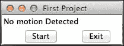

# 摘要

现在你已经拥有了构建基本 GUI 以处理 Arduino 项目的实践经验。通过稍作修改所包含的练习，你可以使用它们为各种 Arduino 原型设计项目创建 GUI。在前两个练习中，我们在标签小部件中显示传感器输出为字符串。如果将这些数值以图表的形式展示并存储以供进一步分析，将会更有意义。这正是你将在下一章中执行的操作。
