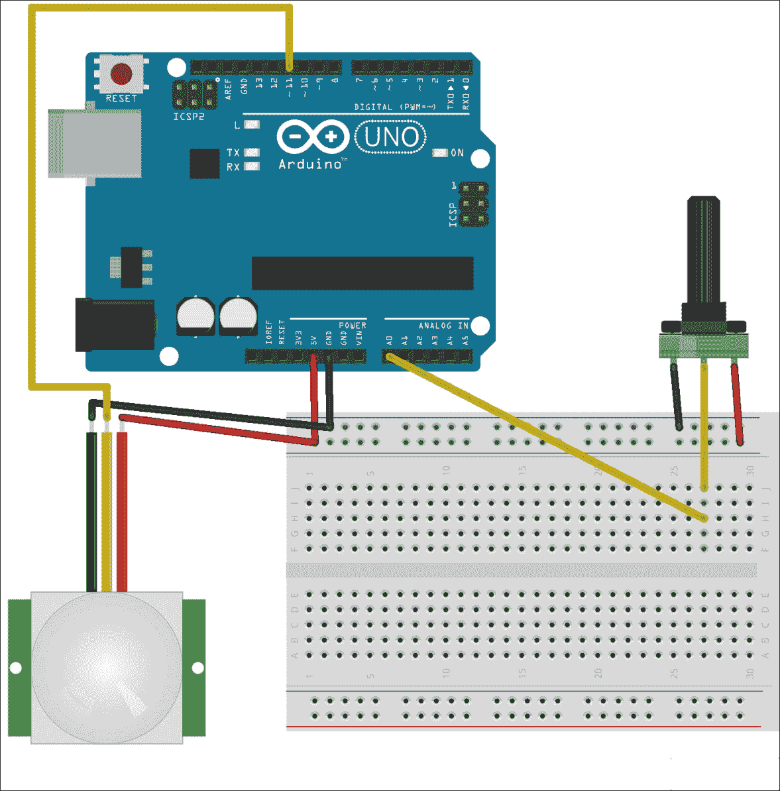
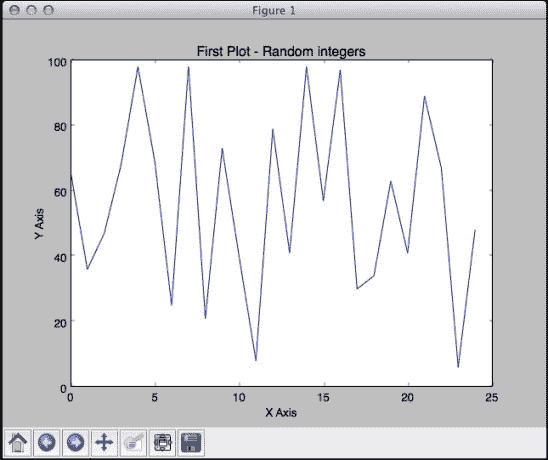
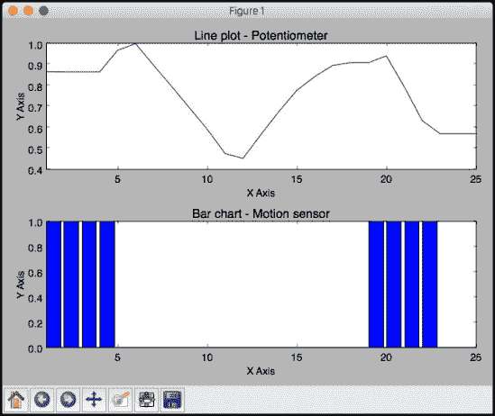
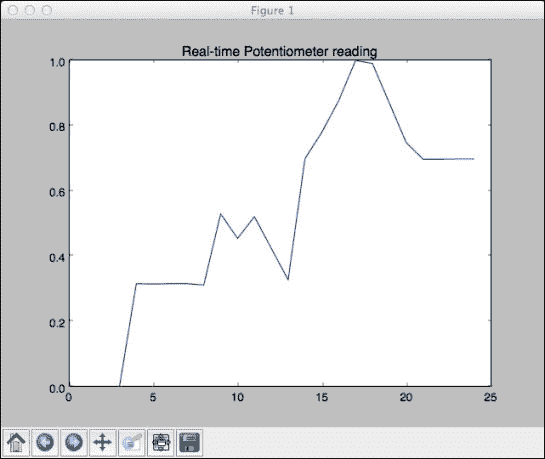
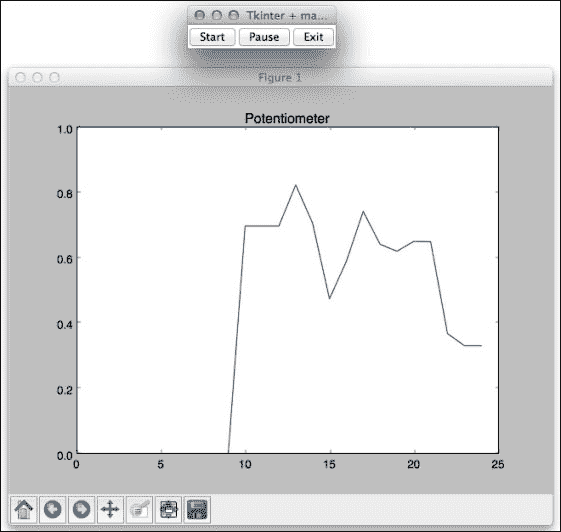

# 第六章：存储和绘制 Arduino 数据

连接到 Arduino 的传感器会产生大量的模拟和数字数据。模拟传感器产生数据点作为数值信息，而数字传感器产生布尔值，即 1（开启）或 0（关闭）。到目前为止，我们已将此数据作为字符串打印到命令提示符或显示在 GUI 中。数据是实时打印的，并未保存以供进一步分析。如果将数据打印为图表或图形，它将为我们提供快速理解并得出结论的有用信息。对于实时应用，图表甚至更有用，因为它们可以提供有关系统行为的信息，从而更好地理解数据。

本章围绕两个主要部分组织：存储 Arduino 传感器数据和绘制这些数据。我们将首先使用 Python 创建和操作文件。之后，我们将处理将 Arduino 数据存储为 CSV 文件格式的存储方法。在第二部分，您将介绍 Python 绘图库 `matplotlib`。然后，我们将处理涉及从保存的文件和实时传感器读取的数据绘图的示例。最后，我们将尝试将 `matplotlib` 绘图与我们在上一章中创建的 `Tkinter` 窗口集成。

在硬件组件方面，我们将使用熟悉的传感器，如电位计和 PIR 运动传感器，这些我们在前面的章节中使用过，因此，您不需要为这一章学习或购买任何额外的传感器。

# 在 Python 中处理文件

Python 提供了创建和修改文件的内置方法。与文件相关的 Python 操作在大量编程练习中非常有用。这些方法由标准 Python 模块提供，不需要安装额外的包。

## open() 方法

`open()` 方法是 Python 中可用的一种默认方法，它是用于操作文件的最广泛使用的函数之一。现在，处理文件的第一步是打开它：

```py
>>> f = open('test.txt', 'w')

```

此命令将在您启动 Python 解释器或执行代码的同一文件夹中创建一个 `test.txt` 文件。前面的命令使用 `w` 模式，该模式以写入方式打开文件或创建一个新文件（如果不存在）。可以与 `open()` 函数一起使用的其他模式如下表所示：

| 模式 | 描述 |
| --- | --- |
| `w` | 以写入方式打开或创建文件。它会覆盖现有文件。 |
| `w+` | 以写入和读取方式打开或创建文件。它会覆盖现有文件。 |
| `r` | 仅以读取方式打开文件。 |
| `r+` | 以读取和写入方式打开文件。 |
| `a` | 以追加方式打开文件。它从文档的末尾开始追加。 |
| `a+` | 这将打开一个用于追加和读取的文件。它从文档的末尾开始追加。 |

### 注意

如果你在一个 Unix 或 Linux 环境中使用这些模式，请确保你有适当的读写权限。

## write()方法

一旦文件以某种写入或追加模式打开，你就可以使用此方法开始向文件对象写入。`write()`方法只接受一个字符串作为输入参数。任何其他数据格式在写入之前都需要转换为字符串：

```py
>>> f.write("Hello World!\n")

```

在这个例子中，我们正在写入以换行符`\n`结尾的`Hello World!`字符串。这个换行符在上一章中已经解释过，你可以在[`en.wikipedia.org/wiki/Newline`](http://en.wikipedia.org/wiki/Newline)上了解更多信息。

如果你想要将一系列字符串写入文件，也可以使用`writelines()`方法：

```py
>>> sq = ["Python programming for Arduino\n", "Bye\n"]
>>> f.writelines(sq)

```

## close()方法

close()方法关闭文件并释放文件所占用系统资源。一旦关闭，你将无法使用文件对象，因为它已经被刷新。完成文件操作后关闭文件是一个好习惯：

```py
>>> f.close()

```

## read()方法

这个`read()`方法从文件开头到结尾读取打开的文件内容。要使用此方法，你需要使用一种读取兼容的模式打开文件，例如`w+`、`r`、`r+`或`a+`：

```py
>>> f = open('test.txt', 'r')
>>> f.read()
'Hello World!\nPython programming for Arduino\nBye\n'
>>> f.close()

```

由于`read()`方法会将整个文件内容加载到内存中，因此你可以使用可选的大小参数来避免在处理大文件时出现内存拥堵。作为替代方法，你可以使用`readlines()`方法逐行读取打开的文件内容：

```py
>>> f = open('test.txt', 'r')
>>> l = f.readlines()
>>> print l
['Hello World!\n', 'Python programming for Arduino\n', 'Bye\n']
>>> f.close()

```

如前例所示，每个字符串都被打印为一个列表的元素，你可以单独访问它们。你可以通过这些方法来熟悉创建和修改文件。这些练习对于即将到来的编码练习将很有帮助。

## with 语句 - Python 上下文管理器

虽然 with 语句可以用来覆盖由上下文管理器定义的代码块的执行，但它被广泛用于 Python 处理文件。假设你已经执行了前面的命令，并且有一个包含一些数据的`test.txt`文件，请在 Python 交互式提示符中执行以下命令：

```py
>>> with open('test.txt', 'r') as f:
 lines = f.readlines()
 for l in lines:
 print l

```

执行后，你将能够在命令提示符上看到文件的每一行。当与`open()`方法一起使用时，with 语句创建一个上下文管理器，它会执行包装的代码，并自动处理关闭文件。这是在 Python 中处理文件推荐的方法，我们将在所有练习中使用它。你可以在以下网站上了解更多关于 Python 上下文管理器的信息：

+   [`docs.python.org/2/reference/compound_stmts.html#with`](https://docs.python.org/2/reference/compound_stmts.html#with)

+   [`preshing.com/20110920/the-python-with-statement-by-example/`](http://preshing.com/20110920/the-python-with-statement-by-example/)

# 使用 CSV 文件存储数据

现在您已经了解了使用 Python 打开、操作和关闭文件的方法。在先前的示例中，我们使用了 Python 解释器和字符串数据来熟悉这些方法。但是，当涉及到从传感器数据中保存大量数值时，**逗号分隔值**（**CSV**）文件格式是除了文本之外最广泛使用的文件格式之一。正如其名所示，值是用逗号或其他分隔符（如空格或制表符）分隔和存储的。Python 有一个内置模块来处理 CSV 文件。

首先，使用以下代码片段创建一个 Python 文件并运行您的第一个 CSV 程序：

```py
import csv
data = [[1, 2, 3], ['a', 'b', 'c'], ['Python', 'Arduino', 'Programming']]

with open('example.csv', 'w') as f:
  w = csv.writer(f)
  for row in data:
    w.writerow(row)
```

您还可以从本章的代码文件夹中打开 `csvWriter.py` 文件，其中包含相同的代码。执行代码后，您将在与该文件相同的目录下找到一个名为 `example.csv` 的文件，其中包含用逗号分隔的数据。

如代码所示，CSV 模块在打开的文件上提供了 `writer()` 函数，该函数初始化一个 `writer` 对象。`writer` 对象接受一个序列或数组的数据（整数、浮点数、字符串等）作为输入，并使用分隔符字符连接该数组的值：

```py
w = csv.writer(f)
```

在前面的示例中，由于我们没有使用分隔符选项，程序将使用默认字符逗号作为分隔符。如果您想使用空格作为分隔符字符，您可以使用以下 `writer()` 选项：

```py
w = csv.writer(f, delimiter=' ')
```

要将列表的每个元素写入 `writer` 对象的新行，我们使用 `writerow()` 方法。

类似地，Python CSV 模块还提供了 `reader()` 函数来读取 CSV 文件。查看以下示例以了解更多关于此函数的信息，或者您可以从下一章的代码文件夹中打开 `csvReader.py` 文件：

```py
import csv
with open('example.csv', 'r') as file:
    r = csv.reader(file)
    for row in r:
        print row
```

`reader()` 函数创建一个 `reader` 对象来遍历打开的 CSV 文件中的行。`reader` 对象通过使用分隔符拆分行来检索每一行的每个元素。您可以通过使用 `for` 循环遍历对象来访问文件的每一行，如前述代码片段所示，或者每次想要访问下一行时使用 `next()` 方法。执行前面的代码后，您将能够看到三个分别打印出三个单独元素的单独数组列表。

### 小贴士

要在外部打开 CSV 文件，您可以使用电子表格程序，如 Microsoft Excel、OpenOffice Calc 或 Apple Numbers。

# 将 Arduino 数据存储在 CSV 文件中

在前面的两个部分中，您学习了将值存储在 CSV 文件中的方法。尽管文件所需的数据已经在代码中初始化，但相同的代码可以被修改以存储 Arduino 输入数据。

首先，让我们创建一个电路来为我们生成这些值以便存储 Arduino 数据。我们在第三章的项目中使用了运动传感器，*第一个项目 – 运动触发 LED*，以及在第四章的练习中使用了电位计，*深入 Python-Arduino 原型设计*。我们将使用这两个传感器分别提供数字和模拟输入值。为了开发这个练习所需的电路，将电位计连接到模拟引脚 0，将 PIR 运动传感器连接到数字引脚 11，如下面的图所示：



连接其他 Arduino 引脚，如 5V 和地，如图中所示的 Fritzing 图。由于我们将使用`pyFirmata`将 Python 与 Arduino 板接口，你将需要使用第三章中描述的方法将**StandardFirmata**草图上传到 Arduino 板。

### 注意

当你进行原型设计时，你实际上不需要大型、强大且计算密集型的数据库来处理信息。在这个阶段，处理传感器数据最简单、最快的方法是使用 CSV 文件。

一旦你的 Arduino 板准备好了适当的连接，使用以下代码片段创建一个 Python 文件并运行它。你也可以从这个章节的代码文件夹中打开`csvArduinoStore.py`文件：

```py
import csv
import pyfirmata
from time import sleep

port = '/dev/cu.usbmodemfa1331'
board = pyfirmata.Arduino(port)

it = pyfirmata.util.Iterator(board)
it.start()

pirPin = board.get_pin('d:11:i')
a0 = board.get_pin('a:0:i')

with open('SensorDataStore.csv', 'w') as f:
    w = csv.writer(f)
    w.writerow(["Number", "Potentiometer", "Motion sensor"])
    i = 0
    pirData = pirPin.read()
    potData = a0.read()
    while i < 25:
        sleep(1)
        if pirData is not None:
            i += 1
            row = [i, potData, pirData]
            w.writerow(row)
    print "Done. CSV file is ready!"

board.exit()
```

当代码运行时，旋转电位计的旋钮，并在运动传感器前挥动手。这个动作将帮助你从这些传感器生成和测量不同的值。同时，程序将把数据记录在`SensorDataStore.csv`文件中。完成后，使用任何文本查看器或电子表格程序打开`SensorDataStore.csv`文件，你将能够看到存储在文件中的这些传感器值。现在，让我们尝试理解这个程序。

如你所见，代码中我们没有使用新的模块来接口 Arduino 板或存储传感器值到文件。相反，我们使用了之前练习中使用的相同方法。代码有两个不同的组件：Python-Arduino 接口和将数据存储到 CSV 文件。跳过对`pyFirmata`接口 Arduino 板方法的解释，让我们专注于与存储传感器数据相关的代码。我们将使用`writerow()`写入 CSV 文件的第一个行是标题行，它解释了列的内容：

```py
w.writerow(["Number", "Potentiometer", "Motion sensor"])
```

然后，我们将从传感器获取读数并将它们写入 CSV 文件，如下面的代码片段所示。我们将重复这个过程 25 次，由变量`i`定义。你可以根据你的需求更改`i`的值。

```py
while i < 25:
    sleep(1)
    if pirData is not None:
        i += 1
        row = [i, potData, pirData]
        w.writerow(row)
```

接下来的问题是您如何将这个编码练习应用到您的自定义项目中？该程序有三个主要部分，可以根据项目需求进行定制，具体如下：

+   **Arduino 引脚**: 您可以更改 Arduino 引脚编号和要使用的引脚数量。您可以通过向行对象添加额外的传感器值来完成此操作。

+   **CSV 文件**: 文件名及其位置可以从`SensorDataStore.csv`更改为适用于您应用程序的特定文件。

+   **数据点的数量**: 在运行`while`循环 25 次时，我们收集了 25 组不同的数据点。您可以更改此值。您还可以更改连续点之间的时间延迟，从程序中使用的 1 秒更改为您需要的值。

# 开始使用 matplotlib

`matplotlib`库是最受欢迎且广泛支持的 Python 绘图库之一。尽管`matplotlib`受到 MATLAB 的启发，但它与 MATLAB 独立。与其他我们使用过的 Python 库类似，它是一个开源的 Python 库。`matplotlib`库通过简单易用的内置函数和方法，从简单的代码行中创建 2D 图表。`matplotlib`库在基于 Python 的应用程序中广泛用于数据可视化和分析。它使用`NumPy`（数值 Python 的简称）和`SciPy`（科学 Python 的简称）包进行数学计算分析。这些包是`matplotlib`的主要依赖项，包括`freetype`和`pyparsing`。如果您使用的是除下一节中提到的安装方法之外的任何其他安装方法，请确保您已预先安装了这些包。您可以从其官方网站（[`matplotlib.org/`](http://matplotlib.org/)）获取有关`matplotlib`库的更多信息。

## 在 Windows 上配置 matplotlib

在我们在 Windows 上安装`matplotlib`之前，请确保您的 Windows 操作系统安装了最新的 Python 2.x 发行版。在第一章“Python 和 Arduino 入门”中，我们安装了 Setuptools 来下载和安装额外的 Python 包。请确保您已正确安装并配置了 Setuptools。在进一步操作之前，我们必须安装`matplotlib`的依赖项。打开命令提示符，并使用以下命令安装`dateutil`和`pyparsing`包：

```py
> easy_install.exe python_dateutil
> easy_install.exe pyparsing

```

一旦成功安装了这些包，请从[`sourceforge.net/projects/numpy/`](http://sourceforge.net/projects/numpy/)下载并安装预编译的`NumPy`包。请确保您选择了适用于 Python 2.7 和您的 Windows 操作系统类型的适当安装文件。

现在，你的计算机应该已经满足了 `matplotlib` 的所有先决条件。从 [`matplotlib.org/downloads.html`](http://matplotlib.org/downloads.html) 下载并安装预编译的 `matplotlib` 包。

在这个安装过程中，我们为了避免与 Windows 操作系统中的 `matplotlib` 相关的一些已知问题，没有使用 Setuptools 来安装 `NumPy` 和 `matplotlib`。如果你能想出使用 Setuptools 安装这些包的方法，那么你可以跳过前面的手动步骤。

## 在 Mac OS X 上配置 matplotlib

根据 Mac OS X 的版本和依赖项的可用性，在 Mac OS X 上安装 `matplotlib` 可能会有困难。确保你已经按照 第一章 中描述的安装了 Setuptools，*Python 和 Arduino 入门*。假设你已经安装了 Setuptools 和 `pip`，请在终端运行以下命令：

```py
$ sudo pip install matplotlib

```

执行此命令将导致以下三种可能性之一：

+   成功安装最新版本的 `matplotlib`

+   通知显示要求已满足，但安装的版本比当前版本旧，目前为 1.3

+   安装 `matplotlib` 包时出错

如果你遇到第一种可能性，那么你可以进入下一节；否则，遵循故障排除说明。你可以使用以下命令在 Python 交互式提示符中检查你的 `matplotlib` 版本：

```py
>>> import matplotlib
>>> matplotlib.__version__

```

### 升级 matplotlib

如果你遇到第二种可能性，即现有的 `matplotlib` 版本比当前版本旧，请使用以下命令升级 `matplotlib` 包：

```py
$ sudo pip install –-upgrade matplotlib

```

如果在升级过程中遇到错误，请继续阅读下一节。

### 故障排除安装错误

如果你通过 `pip` 安装 `matplotlib` 时遇到任何错误，最可能的原因是你缺少一些依赖包。依次遵循以下步骤来排除错误。

### 提示

每完成一步后，使用以下命令之一来检查错误是否已解决：

```py
$ sudo pip install matplotlib
$ sudo pip install –-upgrade matplotlib

```

1.  从 Apple 的 App Store 安装 Xcode。打开 Xcode 并导航到 **首选项…** 中的 **下载** 选项卡。从 **首选项…** 中下载并安装 **命令行工具**。这一步应该解决任何与编译相关的错误。

1.  使用以下命令在终端安装 `homebrew`：

    ```py
    $ ruby -e "$("$(curl -fsSL https://raw.github.com/Homebrew/homebrew/go/install)")"

    ```

1.  使用 `homebrew` 安装以下包：

    ```py
    $ brew install freetype
    $ brew install pkg-config

    ```

    如果你仍然收到 `freetype` 包的错误，尝试使用以下命令为 `freetype` 创建链接：

    ```py
    $ brew link freetype
    $ ln -s /usr/local/opt/freetype/include/freetype2 /usr/local/include/freetype

    ```

    如果在执行前面的步骤后收到任何进一步的错误，请访问 [`matplotlib.1069221.n5.nabble.com/`](http://matplotlib.1069221.n5.nabble.com/) 上的 `matplotlib` 论坛以获取这些特定错误。

    ### 注意

    如果你在 Mac OS X 上使用 `matplotlib`，你需要设置适当的绘图后端，如下面的代码片段所示：

    ```py
    import matplotlib
    matplotlib.use('TkAgg''')
    ```

    您可以在[`matplotlib.org/faq/usage_faq.html#what-is-a-backend`](http://matplotlib.org/faq/usage_faq.html#what-is-a-backend)了解更多关于`matplotlib`绘图后端的信息。

## 在 Ubuntu 上设置 matplotlib

在 Ubuntu 上安装`matplotlib`及其所需依赖项是一个非常简单的过程。我们可以不使用 Setuptools，借助 Ubuntu 包管理器来完成此操作。以下简单的命令应该对您有所帮助：

```py
$ sudo apt-get install python-matplotlib

```

当提示选择依赖项时，点击**是**以安装所有依赖项。您也应该能在其他流行的 Linux 发行版中找到`matplotlib`包。

# 使用 matplotlib 绘制随机数

`matplotlib`库通过`pyplot`框架提供了一系列基本的绘图相关函数和方法。`pyplot`框架包含创建图形、绘制图形、设置标题、设置坐标轴以及许多其他绘图方法。`pyplot`提供的一个重要函数是`figure()`。该函数初始化一个空的图形画布，可以用于您的绘图或一系列绘图：

```py
fig1 = pyplot.figure(1)

```

您可以通过指定一个数字作为参数来创建多个图形，例如`figure(2)`。如果已经存在具有此数字的图形，该方法将激活现有的图形，然后可以进一步用于绘图。

`matplotlib`库提供了`plot()`方法来创建折线图。`plot()`方法接受一个由整数或浮点数组成的列表或数组数据结构作为输入。如果使用两个数组作为输入，`plot()`将它们用作*x*轴和*y*轴的值。如果只提供一个列表或数组，`plot()`假定它是*y*轴的序列值，并使用自动生成的增量值用于*x*轴：

```py
pyplot.plot(x, y)

```

`plot()`方法支持的第三个可选参数是格式字符串。这些参数帮助用户使用不同的颜色更改线条和标记的样式。在我们的例子中，我们使用的是实线样式。因此，我们的绘图`plot()`函数看起来像这样：

```py
pyplot.plot(x, y, '-')

```

`plot()`函数提供了一组大量样式和颜色的选择。要了解更多关于这些参数的信息，请在`matplotlib`的`plot()`函数上使用 Python 的`help()`函数：

```py
>>> import matplotlib
>>> help(matplotlib.pyplot.plot)

```

这个`help()`函数将提供创建具有不同标记、线条样式和颜色的绘图样式的必要信息。您可以在提示符下输入`q`退出帮助菜单。

现在，我们已经充分探索了绘图，让我们使用以下代码片段创建您的第一个 Python 绘图。包含此代码的程序也位于本章代码文件夹中，文件名为`plotBasic.py`：

```py
from matplotlib import pyplot
import random

x = range(0,25)
y = [random.randint(0,100) for r in range(0,25)]

fig1 = pyplot.figure()
pyplot.plot(x, y, '-')
pyplot.title('First Plot - Random integers')
pyplot.xlabel('X Axis')
pyplot.ylabel('Y Axis')

pyplot.show()
```

在前面的练习中，我们使用 `randint()` 方法随机生成了 *y* 轴的数据库。你可以看到在运行程序后打开的窗口中，用实线风格描绘了这些数据的图表。正如你在代码片段中看到的，我们使用了额外的 `pyplot` 方法，如 `title()`、`xlabel()`、`ylabel()` 和 `plot()`。这些方法都是自我解释的，并且它们主要用于使你的图表更加信息丰富和有意义。

在示例的末尾，我们使用了最重要的 `pyplot` 方法之一，即 `show()`。`show()` 方法在图中显示生成的图表。当从 Python 的交互式提示符运行时，此方法不是显示图表的强制要求。以下截图展示了使用 `matplotlib` 生成的随机数值的图表：



# 从 CSV 文件中绘制数据

在本章的开头，我们从 Arduino 数据创建了一个 CSV 文件。我们将使用该 `SensorDataStore.csv` 文件本节。如果你还记得，我们使用了两个不同的传感器来记录数据。因此，我们有两个值数组，一个来自数字传感器，另一个来自模拟传感器。现在，在前面的例子中，我们只是绘制了 *y* 轴的一组值。那么，我们如何分别并以有意义的方式绘制这两个数组呢？

让我们从创建一个新的 Python 程序开始，使用以下代码行或从本章的代码文件夹中打开 `plotCSV.py` 文件：

```py
import csv
from matplotlib import pyplot

i = []
mValues = []
pValues = []

with open('SensorDataStore.csv', 'r') as f:
    reader = csv.reader(f)
    header = next(reader, None)
    for row in reader:
        i.append(int(row[0]))
        pValues.append(float(row[1]))
        if row[2] == 'True':
            mValues.append(1)
        else:
            mValues.append(0)

pyplot.subplot(2, 1, 1)
pyplot.plot(i, pValues, '-')
pyplot.title('Line plot - ' + header[1])
pyplot.xlim([1, 25])
pyplot.xlabel('X Axis')
pyplot.ylabel('Y Axis')

pyplot.subplot(2, 1, 2)
pyplot.bar(i, mValues)
pyplot.title('Bar chart - ' + header[2])
pyplot.xlim([1, 25])
pyplot.xlabel('X Axis')
pyplot.ylabel('Y Axis')

pyplot.tight_layout()

pyplot.show()
```

在这个程序中，我们通过逐行读取 `SensorDataStore.csv` 文件创建了两个传感器值数组——`pValues` 和 `mValues`。在这里，`pValues` 和 `mValues` 分别代表电位计和运动传感器的传感器数据。一旦我们有了这两个列表，我们就使用 `matplotlib` 方法绘制了它们。

`matplotlib` 库提供了多种方式来绘制不同数组的值。你可以使用 `figure()` 方法分别在不同的两个图中绘制它们，即 `figure(1)` 和 `figure(2)`，或者在一个图中绘制它们，使它们相互叠加。`pyplot` 方法还通过 `subplot()` 方法提供了一种第三种有意义的替代方案，允许在单个图中通过 `subplot()` 方法绘制多个图表：

```py
pyplot.subplot(2,1,1)
```

这种方法的结构是 `subplot(nrows, ncols, plot_number)`，它使用行号和列号（即 `nrows` 和 `ncols`）在图像画布上创建网格。此方法将图表放置在由 `plot_number` 参数提供的特定单元格中。例如，通过 `subplot(2, 1, 1)`，我们创建了一个两行一列的表格，并将第一个子图放置在表格的第一个单元格中。同样，下一组值用于第二个子图，并放置在第二个单元格中，即第 2 行第 1 列：

```py
pyplot.subplot(2, 1, 2)
```

在第一个子图中，我们使用了`plot()`方法来创建一个使用电位器的模拟值（即`pValues`）的图表。而在第二个子图中，我们创建了一个柱状图而不是折线图来显示运动传感器的数字值。柱状图功能是由`bar()`方法提供的。

如你在代码片段中看到的，我们使用了额外的`pyplot()`方法，称为`xlim()`。`xlim([x_minimum, x_maximum])`或`ylim([y_minimum, y_maximum])`方法用于将图表限制在特定轴的给定最大值和最小值之间。

在我们使用`show()`方法在图中显示这些子图之前，我们使用了`tight_layout()`函数来组织图中的标题和标签文本。`tight_layout()`函数是一个非常重要的`matplotlib`模块，它很好地将子图参数拟合到一个图中。你可以通过注释掉这一行并再次运行代码来检查这个模块的效果。以下截图显示了这些子图带有标签和标题在一个图对象中：



# 绘制实时 Arduino 数据

在前一章中，当处理 GUI 和 Arduino 数据时，你必须已经注意到代码会随着从 Arduino 传感器获得的新值更新界面。同样，在这个练习中，我们将每次从 Arduino 接收到新值时重绘图表。基本上，我们将绘制和更新一个实时图表，而不是像前一个练习那样绘制整个传感器值集。

我们将使用你在前一个练习中构建的相同的 Arduino 电路。在这里，我们将仅利用电路的电位器部分来获取模拟传感器的值。现在，在我们解释这个练习中使用的新的方法之前，让我们首先打开这个练习的程序文件。你可以从这个章节的文件夹中找到程序文件；它被命名为`plotLive.py`。在代码中，更改 Arduino 板的适当参数并执行代码。当代码运行时，旋转电位器的旋钮以观察图表中的实时变化。

运行程序后，你将看到一个类似于以下截图的屏幕，该截图显示了实时 Arduino 数据的图表。



通过观察图表，可以得出关于电位器旋钮旋转或其他传感器行为的各种结论。这类图表在图形仪表板中广泛应用于实时监控应用。现在，让我们尝试理解以下代码片段中使用的使这一切成为可能的方法。

```py
import sys, csv
from matplotlib import pyplot
import pyfirmata
from time import sleep
import numpy as np

# Associate port and board with pyFirmata
port = '/dev/cu.usbmodemfa1321''
board = pyfirmata.Arduino(port)

# Using iterator thread to avoid buffer overflow
it = pyfirmata.util.Iterator(board)
it.start()

# Assign a role and variable to analog pin 0
a0 = board.get_pin(''a:0:i'')

# Initialize interactive mode
pyplot.ion()

pData = [0] * 25
fig = pyplot.figure()
pyplot.title(''Real-time Potentiometer reading'')
ax1 = pyplot.axes()
l1, = pyplot.plot(pData)
pyplot.ylim([0,1])

# real-time plotting loop
while True:
    try:
        sleep(1)
        pData.append(float(a0.read()))
        pyplot.ylim([0, 1])
        del pData[0]
        l1.set_xdata([i for i in xrange(25)])
        l1.set_ydata(pData)  # update the data
        pyplot.draw()  # update the plot
    except KeyboardInterrupt:
        board.exit()
        break
```

本练习中的实时绘图是通过结合使用 `pyplot` 函数 `ion()`、`draw()`、`set_xdata()` 和 `set_data()` 实现的。`ion()` 方法初始化 `pyplot` 的交互模式。交互模式有助于动态更改图中图形的 *x* 和 *y* 值：

```py
pyplot.ion()
```

一旦将交互模式设置为 `True`，只有在调用 `draw()` 方法时才会绘制图形。

就像之前的 Arduino 接口练习一样，在代码的开始部分，我们使用 `pyFirmata` 初始化 Arduino 板并设置引脚以获取传感器值。正如您在以下代码行中可以看到的，在设置 Arduino 板和 `pyplot` 交互模式后，我们使用一组空白数据，在我们的例子中是 `0`，初始化了图形：

```py
pData = [0] * 25
```

这个用于 *y* 值的数组，`pData`，然后在 `while` 循环中用于追加传感器值。`while` 循环持续追加最新的值到这个数据数组，并使用更新后的 *x* 和 *y* 值重新绘制图形。在这个例子中，我们在数组的末尾追加新的传感器值，同时移除数组的第一个元素以限制数组的大小：

```py
pData.append(float(a0.read()))
del pData[0]
```

`set_xdata()` 和 `set_ydata()` 方法用于从这些数组中更新 *x* 和 *y* 轴的数据。这些更新值在每个 `while` 循环迭代中使用 `draw()` 方法进行绘图：

```py
l1.set_xdata([i for i in xrange(25)])
l1.set_ydata(pData)  # update the data
pyplot.draw()  # update the plot
```

您还会注意到我们正在使用 `xrange()` 函数根据提供的长度生成一系列值，在我们的例子中是 `25`。代码片段 `[i for i in xrange(25)]` 将生成一个包含 25 个整数数字的列表，这些数字从 0 开始递增，到 24 结束。

# 在 Tkinter 窗口中集成图形

由于 Python 强大的集成能力，将 `matplotlib` 库生成的图形与 `Tkinter` 图形界面集成非常方便。在前一章的最后一个练习中，我们将 `Tkinter` 与 `pyFirmata` 集成以实现 第三章 的项目，即 *第一个项目 – 运动触发 LED*，并使用 GUI。在这个练习中，我们将通过利用 `matplotlib` 进一步扩展这种集成。我们将通过利用本章中使用的相同 Arduino 电路和扩展之前练习中使用的代码来完成这个动作。同时，在这个练习中，我们不会引入任何新方法；相反，我们将利用到目前为止所学的内容。打开本章代码文件夹中的 `plotTkinter.py` 文件。

如前所述，程序利用了三个主要的 Python 库，并将它们相互连接以开发一个优秀的 Python-Arduino 应用程序。第一个接口点是在`Tkinter`和`matplotlib`之间。正如你在以下代码行中可以看到的，我们为**开始**、**暂停**和**退出**按钮分别初始化了三个按钮对象，即`startButton`、`pauseButton`和`exitButton`：

```py
startButton = Tkinter.Button(top,
                             text="Start",
                             command=onStartButtonPress)
startButton.grid(column=1, row=2)
pauseButton = Tkinter.Button(top,
                             text="Pause",
                             command=onPauseButtonPress)
pauseButton.grid(column=2, row=2)
exitButton = Tkinter.Button(top,
                            text="Exit",
                            command=onExitButtonPress)
exitButton.grid(column=3, row=2)
```

**开始**和**退出**按钮提供了对`matplotlib`操作的控件点，例如通过各自的`onStartButtonPress()`和`onExitButtonPress()`函数更新图表和关闭图表。`onStartButtonPress()`函数还包含了`matplotlib`和`pyFirmata`库之间的接口点。正如你从下面的代码片段中可以观察到的，我们将使用`draw()`方法开始更新图表，并使用`update()`方法更新`Tkinter`窗口，对于从模拟引脚 a0 获得的每个观察值，该值是通过`read()`方法获得的：

```py
def onStartButtonPress():
    while True:
        if flag.get():
            sleep(1)
            pData.append(float(a0.read()))
            pyplot.ylim([0, 1])
            del pData[0]
            l1.set_xdata([i for i in xrange(25)])
            l1.set_ydata(pData)  # update the data
            pyplot.draw()  # update the plot
            top.update()
        else:
            flag.set(True)
            break
```

`onExitButtonPress()`函数实现了由其名称本身描述的`exit`功能。在断开 Arduino 板与串行端口连接之前，它关闭了`pyplot`图表和`Tkinter`窗口。

现在，在修改 Arduino 端口参数后执行程序。你应该能在屏幕上看到一个窗口，类似于以下截图所示。使用这段代码，你现在可以使用**开始**和**暂停**按钮控制实时图表。点击**开始**按钮并开始旋转电位计旋钮。当你点击**暂停**按钮时，你可以观察到程序已经停止绘制新的值。在**暂停**被按下时，即使旋转旋钮也不会导致图表有任何更新。

一旦你再次点击**开始**按钮，你将再次看到图表使用实时值更新，丢弃了暂停期间生成的值。点击**退出**按钮以安全关闭程序：



# 摘要

在本章中，我们介绍了两种主要的 Python 编程范式：使用 Python 创建、读取和写入文件，同时将这些文件中的数据存储起来，并在实时中绘制传感器值和更新图表。我们还探讨了存储和绘制实时 Arduino 传感器数据的方法。除了帮助你在 Arduino 项目中，这些方法也可以用于你的日常 Python 项目中。在整个章节中，通过简单的练习，我们将新学习的 CSV 和`matplotlib`模块与我们在前几章中学到的`Tkinter`和`pyFirmata`模块进行了接口。在下一章中，你将接触到你的第二个项目——一个便携式单元，它可以测量和显示环境数据，如温度、湿度和环境光线。我们将利用到目前为止学到的概念来构建这个项目。
