# 第九章：Arduino 与物联网

在上一章中，我们学习了如何从远程位置使用以太网访问 Arduino。主要目标是让你开始使用 Python 开发基于 Arduino 的网络应用。我们能够通过使用各种工具如`web.py` Python 库、Mosquitto MQTT 代理和 Arduino 以太网库来实现这一点。通过 Python-like 的可扩展语言远程访问传感器数据可以为基于传感器的 Web 应用打开无限可能。近年来，这些应用的快速增长使得物联网（**IoT**）这一领域的开发成为可能。

在上一章中，我们学习了 Arduino 网络。然而，它仅限于局域网，并且练习的前提条件仅限于你的家庭或办公室。我们甚至没有在练习中涉及互联网来实现全球访问。传统的物联网应用需要通过互联网从世界任何地方远程访问 Arduino。在本章中，我们将通过将 Arduino 与云平台接口来扩展 Arduino 网络概念。我们还将开发 Web 应用程序来访问这些云平台上的传感器数据。在本章的后面部分，我们将介绍设置你的基于云的消息平台的过程，以便提供传感器数据。在本章结束时，你应该能够使用 Arduino、Python 和云来设计和开发全栈物联网应用。

# 开始使用物联网

在互联网出现之前，基于传感器和执行器的电子控制系统就已经存在于高科技自动化系统中。在这些系统中，传感器通过硬连线连接到微控制器。由于可扩展性的限制，这些系统的覆盖范围在地理上受到限制。这些高科技系统的例子包括工厂自动化、卫星系统、武器系统等。在大多数情况下，这些系统中使用的传感器都很大，微控制器也受到其低计算能力的限制。

随着技术的最新进展，尤其是在半导体行业，传感器和微控制器的物理尺寸显著减小。现在，制造低成本、高效电子组件也成为可能，因此今天开发小型高效基于传感器的硬件产品相对便宜。Arduino 和 Raspberry Pi 是这些成就的绝佳例子。这些基于传感器和执行器的硬件系统与我们所生活的物理世界接口。传感器测量物理环境中的各种元素，而执行器则操纵物理环境。这类基于硬件的电子系统也被称为**物理系统**。

在另一个方面，半导体行业的进步也促进了高效计算单元的发展，从而推动了个人电脑和网络行业的发展。这一运动导致了全球互联计算机网络，即所谓的网络世界或互联网的形成。每天，都有数以千兆字节的数据在互联网上生成和传输。

物联网领域位于物理和网络安全进步的十字路口，古老的硬连线传感器系统正准备升级到更强大、更高效的系统，这些系统通过互联网高度互联。由于涉及大量传感器，这些系统产生并发送大量数据。这些传感器生成数据已经超过了人类生成数据。

近年来，随着大量消费级物联网产品开始进入市场，物联网已经开始成为一个重要的领域。这些产品包括家庭自动化、医疗保健、活动跟踪、智能能源等领域。物联网领域快速增长的主要原因之一是这些可见解决方案的引入。在许多情况下，这得益于 Arduino 和其他开源硬件平台提供的快速且低成本的原型制作。

到目前为止，在本书中，我们学习了各种传感器接口方法，然后使用这些连接的传感器开发应用程序。在本章中，我们将学习全栈物联网应用开发的最后一步——通过互联网为您的 Python-Arduino 应用程序提供访问权限。现在，让我们首先了解物联网的架构。

## 物联网 Web 应用架构

在本书的前八章中，我们涵盖了三个主要概念：

+   **物理层**：我们使用 Arduino 板上的各种传感器和执行器来处理物理环境。例如，温度传感器、湿度传感器和运动传感器用于测量物理现象，而 LED 等执行器则用于改变或产生物理元素。

+   **计算层**：我们使用 Arduino 草图和 Python 程序将这些物理元素转换为数值数据。我们还利用这些高级语言执行各种计算，如计算相对湿度、开发用户界面、绘制数据并提供 Web 界面。

+   **接口层**：在我们所涵盖的材料中，我们也使用了各种接口方法来建立 Arduino 和 Python 之间的通信。对于物理层和计算层之间的接口部分，我们使用了串行端口库，通过 REST 和 MQTT 协议建立了基于网络的通信，并开发了 Web 应用。

如您所见，我们已经开发出了具有紧密耦合的物理、计算和接口层的应用。在研究领域，这类应用也被称为网络物理系统。网络物理系统领域广泛使用且流行的术语之一是物联网。尽管与物联网相比，网络物理领域定义得更为详尽，但物联网最近由于涵盖大量子领域（如工业互联网、可穿戴设备、连接设备、智能电网等）而变得更加流行。简单来说，如果一个应用包含处理物理世界的硬件设备，并且具有足够的计算能力以及互联网连接，那么它可以被认定为物联网应用。让我们尝试从我们已经覆盖的材料中理解物联网的架构。

在物理方面，以下图示展示了我们用来处理物理环境的硬件组件。与实际物理世界接口的传感器和执行器可以通过多个低级协议连接到 Arduino。这些组件可以通过 GPIO 引脚以及 I2C 或 SPI 协议进行连接。从这些组件获取的数据会在 Arduino 板上通过用户上传的代码进行处理。尽管 Arduino 代码可以被设计成无需任何外部输入即可执行任务，但在高级应用中，这些来自用户或其他应用的输入是必需的。

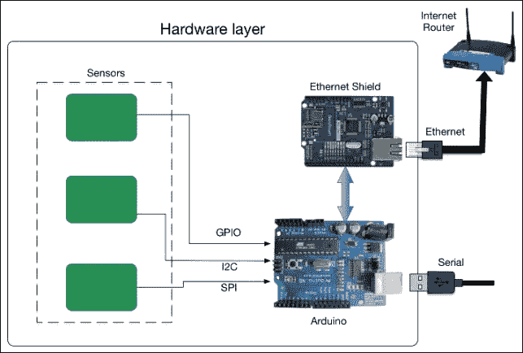

作为通信层的一部分，Arduino 可以通过 USB 本地连接到其他计算机。可以通过使用以太网、Wi-Fi 或任何其他无线电通信方法来扩展覆盖范围。

如下图所示，传感器数据通过用于高级处理的计算单元进行收集。这些计算单元强大到足以运行操作系统和编程平台。在这本书中，我们使用了 Python 在计算层开发各种功能。在这一层，我们执行了高级计算任务，例如使用`Tkinter`库开发图形用户界面，使用`matplotlib`库绘制图表，以及使用`web.py`库开发 Web 应用。


在我们之前进行的所有编码练习中，由于硬连接串行接口或本地以太网网络，项目的物理覆盖范围受到限制，如下图所示：

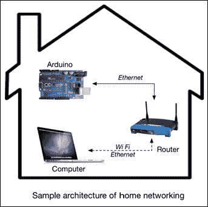

要开发全栈物联网应用程序，我们需要远程访问 Arduino 或将计算层托管在互联网上。在本章中，我们将着手解决这个缺失的环节，并开发各种应用程序，为练习提供互联网连接。为了执行此操作，我们将在第一部分利用商业云平台，并在后面的部分开发我们定制的平台。

由于本章的重点将是云连接，我们不会为每个练习开发硬件电路。我们只会进行一次硬件设计练习，并继续使用相同的硬件进行所有编程练习。同样，我们也将重用上一章中开发的`web.py`程序，以专注于与 Python 库相关的代码片段，用于开发云应用程序。

## 硬件设计

让我们从为所有即将进行的练习开发标准硬件开始。我们将需要连接到以太网盾的 Arduino 板来使用以太网协议进行网络连接。在组件方面，你将使用在之前的编码练习中已经使用过的简单传感器和执行器。我们将使用 PIR 运动传感器和 HIH-4030 湿度传感器来分别提供数字和模拟输出。我们还将有一个 LED 作为硬件设计的一部分，这将在编码练习中用作执行器。有关这些传感器的特性和详细解释，你可以参考前面的章节。

要开始组装硬件组件，首先将以太网盾连接到 Arduino 板顶部。将传感器和执行器连接到适当的引脚，如下图所示。一旦组装好硬件，您可以使用以太网线将以太网盾连接到您的家庭路由器。您需要使用 USB 线为板供电，以便从您的计算机上传 Arduino 代码。如果您想将 Arduino 板部署到远程位置，您需要一个外部 5V 电源来为 Arduino 供电。

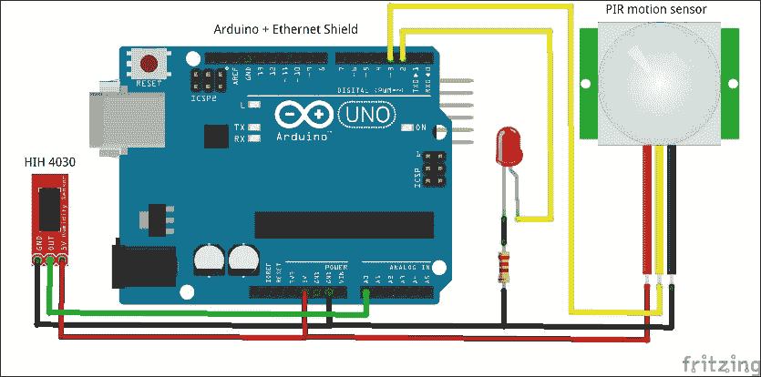

# 物联网云平台

术语**物联网云平台**用于提供非常特定服务、协议支持和基于 Web 的工具的云平台。在更非正式的术语中，这些云物联网平台可以用来上传您的传感器数据，并通过互联网从任何地方访问它们。具有这些基本功能，它们还提供工具，可以在各种平台（如计算机和智能手机）上访问、可视化和处理您的传感器数据。类似的物联网云平台示例包括 Xively ([`www.xively.com`](http://www.xively.com))、2lemetry ([`www.2lemetry.com`](http://www.2lemetry.com))、Carriots ([`www.carriots.com`](http://www.carriots.com))、ThingSpeak ([`thingspeak.com`](http://thingspeak.com))等。

下图显示了具有基于 Arduino 的传感器系统向云平台发送数据，同时计算单元从云中远程访问数据的物联网系统架构：

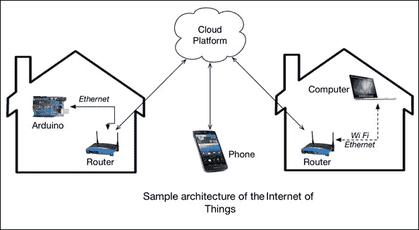

Xively 作为最老和最受欢迎的物联网平台，为初学者提供了大量的基于社区的在线帮助。这也是我们选择 Xively 作为即将进行练习的平台的主要原因之一。最近，Xively 更改了创建免费开发者账户的政策，用户现在必须请求访问这个免费账户，而不是免费获得。如果您想使用除 Xively 之外的另一个平台，我们在此节末简要介绍了一些类似平台。

## Xively – 一个物联网云平台

Xively 是首批物联网专用云平台之一，它于 2007 年作为 Pachube 成立。它经历了多次名称变更，曾经被称为 Cosm，但现在被称为 Xively。Xively 提供了一个物联网云平台，包括工具和服务，用于开发连接设备、产品和解决方案。正如其网站所述，Xively 是专门为物联网构建的公共云。

### 在 Xively 上设置账户

现在，我们可以继续为 Xively 平台设置一个新的用户账户。要设置账户，您需要按照以下顺序执行以下步骤：

1.  要开始[Xively.com](http://Xively.com)的注册过程，请在网页浏览器中打开[`xively.com/signup`](https://xively.com/signup)。

1.  在注册页面上，您将被提示选择用户名和密码，如下截图所示：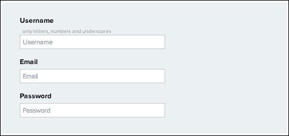

1.  在下一页，您将被要求输入一些附加信息，包括您的全名、组织名称、国家、邮政编码、时区等。适当地填写表格，然后点击**注册**按钮：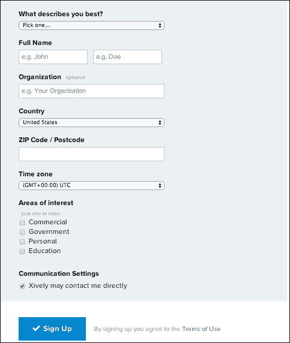

1.  Xively 将向您在表格中指定的电子邮件账户发送激活邮件。打开邮件并点击激活链接。如果您在收件箱中没有看到邮件，请检查垃圾邮件文件夹。

1.  点击激活链接后，您将被重定向到 Xively 网站上的欢迎页面。我们建议您浏览欢迎页面上提供的教程，因为它将帮助您熟悉 Xively 平台。

1.  完成教程后，您可以通过[`xively.com/login`](https://xively.com/login)链接从页面返回主用户屏幕。

    如果您尚未登录，您需要使用电子邮件地址作为用户名和适当的密码登录 Xively 平台。

### 在 Xively 上工作

Xively 平台允许您创建云设备实例，这些实例可以连接到实际的硬件设备、应用程序或服务。按照以下步骤与 Xively 一起工作：

1.  要开始使用 Xively 平台，请从主页添加设备，如图所示：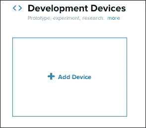

1.  一旦点击**添加设备**按钮，它将提示您进入以下窗口，您将需要提供您要分配的设备名称、描述和隐私状态。在表单中，选择您希望您的开发设备被称作的设备名称，提供简短描述，并将隐私状态选择为**私有设备**：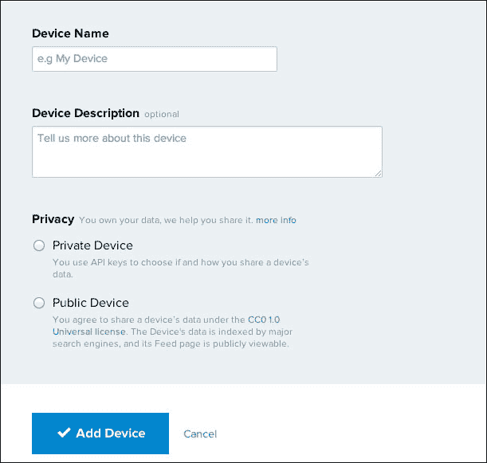

1.  一旦点击**添加设备**按钮，Xively 将创建一个具有自动生成参数的设备实例，并将您带到开发工作台环境。在您刚刚添加的设备页面中，您可以查看各种标识和安全参数，如**产品 ID**、**序列号**、**Feed ID**、**Feed URL**和**API 端点**。在这些参数中，您将经常需要**Feed ID**信息来完成接下来的练习：

1.  新创建设备的唯一且安全的 API 密钥也位于页面右侧的侧边栏中。此 API 密钥非常重要，需要像密码一样进行保护，因为任何拥有 API 密钥的人都可以访问设备。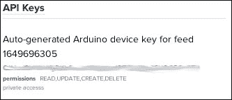

1.  现在，要远程访问此设备，请打开终端并使用 cURL 命令向其发送数据。在以下命令中，将`<Your_Feed_ID>`和`<Your_API_key>`值替换为您设备可用的值：

    ```py
    $ curl --request PUT --data "0,10" --header "X-ApiKey: <Your_API_key" https://api.xively.com/v2/feeds/<Your_Feed_ID>.csv

    ```

1.  如您所见，之前的命令将 10 的值发送到您的设备在 Xively 上的通道 0。执行之前的命令后，您会注意到 Xively 工作台已更新，显示您刚刚使用 cURL 发送的信息：

1.  尝试使用之前的命令在通道 0 上发送多个值。在 Xively 工作台中，您将能够实时看到由这些值生成的图表。通过在工作台中点击通道 0 来访问图表：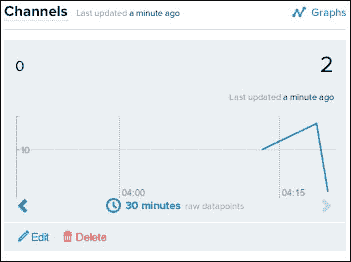

使用我们在本例中使用的方法，我们还可以配置 Arduino 自动将传感器值发送到 Xively 平台。这将使 Arduino 数据在 Xively 上的存储和可视化成为可能。

## 其他物联网平台

在本节中，我们提供了 ThingSpeak 和 Carriots 平台的重要链接。由于我们不会详细覆盖这些平台，这些链接将帮助您找到将 Arduino 和 Python 与 ThingSpeak 和 Carriots 接口的类似示例。

### ThingSpeak

以下链接中的教程将帮助您熟悉 ThingSpeak 平台，如果您选择使用它而不是 Xively：

+   **官方网站**：[`thingspeak.com/`](https://thingspeak.com/)

+   **使用 Arduino 和以太网更新 ThingSpeak 通道**：[`community.thingspeak.com/tutorials/arduino/using-an-arduino-ethernet-shield-to-update-a-thingspeak-channel/`](http://community.thingspeak.com/tutorials/arduino/using-an-arduino-ethernet-shield-to-update-a-thingspeak-channel/)

+   **ThingSpeak 的 Arduino 示例**：[`github.com/iobridge/ThingSpeak-Arduino-Examples`](https://github.com/iobridge/ThingSpeak-Arduino-Examples)

+   **使用 Python 与 ThingSpeak 通信**：[`www.australianrobotics.com.au/news/how-to-talk-to-thingspeak-with-python-a-memory-cpu-monitor`](http://www.australianrobotics.com.au/news/how-to-talk-to-thingspeak-with-python-a-memory-cpu-monitor)

+   **使用 Arduino 和 Python 与 ThingSpeak 通道通信**：[`vimeo.com/19064691`](http://vimeo.com/19064691)

+   **一系列的 ThingSpeak 教程**：[`community.thingspeak.com/tutorials/`](http://community.thingspeak.com/tutorials/)

ThingSpeak 是一个开源平台，您可以使用提供的文件创建自己的定制版 ThingSpeak。您可以从 [`github.com/iobridge/ThingSpeak`](https://github.com/iobridge/ThingSpeak) 获取这些文件和相关指南。

### Carriots

Carriots 也为开发者提供免费的基本账户。如果您想将 Carriots 作为 Xively 的替代品使用，请使用以下链接中的教程开始：

+   **官方网站**：[`www.carriots.com/`](https://www.carriots.com/)

+   **在 Carriots 上设置账户**：[`learn.adafruit.com/wireless-gardening-arduino-cc3000-wifi-modules/setting-up-your-carriots-account`](https://learn.adafruit.com/wireless-gardening-arduino-cc3000-wifi-modules/setting-up-your-carriots-account)

+   **Arduino 的 Carriots 库**：[`github.com/carriots/arduino_library`](http://github.com/carriots/arduino_library)

+   **Arduino 的 Carriots 示例**：[`github.com/carriots/arduino_examples`](https://github.com/carriots/arduino_examples)

+   **将 Carriots 连接到 Python 网络应用**：[`www.instructables.com/id/Connect-your-Carriots-Device-to-Panics-Status-Boa/`](http://www.instructables.com/id/Connect-your-Carriots-Device-to-Panics-Status-Boa/)

# 使用 Python 和 Xively 开发云应用

现在，您已经对可用的商业物联网平台有了基本的了解，您可以根据自己的舒适度和需求选择一个。由于本章的目标是让您熟悉将云平台与 Python 和 Arduino 集成，因此很难全面解释每个云平台及其实际示例。因此，我们将使用 Xively 作为后续集成练习的默认物联网云平台。

现在您已经知道如何在 Xively 上创建账户并使用 Xively 平台，是时候开始将真实硬件与 Xively 平台接口了。在本节中，我们将介绍上传和下载 Xively 数据的方法。我们将结合我们构建的 Arduino 硬件和 Python 程序来向您展示与 Xively 通信的基本方法。

## 将 Arduino 与 Xively 接口

与 Xively 建立通信的第一阶段包括通过独立 Arduino 代码将 Arduino 板与 Xively 平台接口。我们已经使用 Arduino Uno、以太网盾和几个传感器构建了必要的硬件。让我们通过 USB 端口将其连接到您的计算机。您还需要使用以太网线将以太网盾连接到您的家庭路由器。

### 上传 Arduino 数据到 Xively

Arduino IDE 有一个内置的示例，可以用来与 Xively 服务通信。这被称为**PachubeClient**（Pachube 是 Xively 之前的名称）。

### 注意

需要注意的是，使用此默认示例的原因是为了在接口练习中给您一个快速入门。这个特定的草图相当陈旧，可能会在 Arduino IDE 的即将发布的版本中被删除作为默认练习。在这种情况下，您可以直接跳到下一个练习或开发您自己的草图以执行相同的练习。

按照以下步骤上传 Arduino 数据到 Xively：

1.  打开 Arduino IDE，然后通过导航到**文件** | **示例** | **以太网** | **PachubeClient**来打开**PachubeClient**示例。

1.  要与 Xively 建立通信，您需要 Xively 设备的 feed ID 和 API 密钥，这些信息您在上一个部分中已获得。

1.  在打开的 Arduino 草图中进行以下更改，使用获得的 feed ID 和 API 密钥。您可以指定任何项目名称作为`USERAGENT`参数：

    ```py
    #define APIKEY        "<Your-API-key>"
    #define FEEDID         <Your-feed-ID>
    #define USERAGENT      "<Your-project-name>"
    ```

1.  在 Arduino 草图中，您还必须更改以太网盾的 MAC 地址和 IP 地址。您应该熟悉从上一章中执行的活动中获得这些地址。使用这些值并相应地修改以下代码行：

    ```py
    byte mac[] = {0x90, 0xA2, 0xDA, 0x0D, 0x3F, 0x62};
    IPAddress ip(10,0,0,75);
    ```

1.  由于打开的 Arduino 示例是为 Pachube 创建的，因此您需要将服务器地址更新为以下代码片段中指定的`api.xively.com`。注释掉 IP 地址行，因为我们不再需要它，并添加`server[]`参数：

    ```py
    //IPAddress server(216,52,233,122);
    char server[] = "api.xively.com";
    ```

1.  在`sendData()`函数中，将通道名称更改为`HumidityRaw`，因为我们已经将 HIH-4030 湿度传感器连接到模拟端口。我们目前不进行任何相对湿度计算，并将仅上传传感器的原始数据：

    ```py
    // here's the actual content of the PUT request:
    client.print("HumidityRaw,");
    client.println(thisData);
    ```

1.  完成这些更改后，从包含本章代码的文件夹中打开`XivelyClientBasic.ino`文件。将它们与您的当前草图进行比较，并在一切看起来满意的情况下编译/上传草图到 Arduino 板。一旦上传了代码，在 Arduino IDE 中打开**串行监视器**窗口以观察以下输出：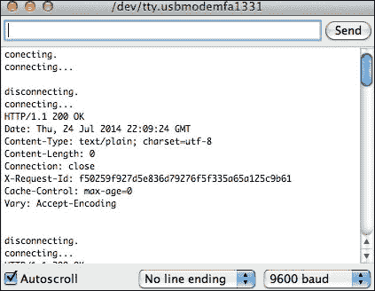

1.  如果您在**串行监视器**窗口中看到与之前截图相似的输出，则表示您的 Arduino 已成功连接到 Xively，并在 HumidityRaw 通道上上传数据。

1.  在 Xively 网站上打开您的设备，您将在网页上看到类似于以下截图的输出。这证实您已成功使用远程位置的 Arduino 将数据上传到物联网云平台：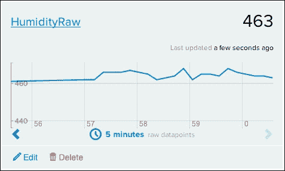

### 从 Xively 下载数据到 Arduino

在之前的编码练习中，我们使用默认的 Arduino 示例与 Xively 通信。然而，Xively 还提供了一个非常高效的 Arduino 库，其中内置了用于快速编程的功能。在下一个练习中，我们将使用`Xively-Arduino`库的替代方法与 Xively 平台通信。虽然您可以使用这两种方法中的任何一种，但我们建议您使用`Xively-Arduino`库，因为它是由 Xively 官方维护的。

在这个练习中，我们将从名为 LED 的通道下载数字值。稍后，我们将使用这些数字值，0 和 1，来切换连接到我们的 Arduino 板上的 LED。作为此通道的输入，我们将在 Xively 平台网站上更改通道的当前值，同时让 Arduino 下载该值并执行适当的任务。

让我们从导入`Xively-Arduino`库及其依赖项开始。如您所知，如何在 Arduino IDE 中导入库，请访问[`github.com/amcewen/HttpClient`](https://github.com/amcewen/HttpClient)下载并导入`HttpClient`库。这是`Xively-Arduino`库运行所必需的依赖项。

在导入`HttpClient`库后，从[`github.com/xively/xively_arduino`](https://github.com/xively/xively_arduino)下载`Xively-Arduino`库并重复导入过程。

`Xively-Arduino`库附带了一些示例，以便您开始使用。我们将使用他们的示例作为下载数据的基础代码。

1.  在 Arduino IDE 中，导航到**文件** | **示例** | **Xively_arduino** | **DatastreamDownload**并打开**DatastreamDownload**示例。将默认 API 密钥更改为从您创建的设备获得的自己的 API 密钥。如以下代码片段所示，您还需要确定您的通道名称，在本例中为 LED：

    ```py
    char xivelyKey[] = "<Your-API-key>";
    char ledId[] = "LED";
    ```

1.  `Xively-Arduino`库要求您将`XivelyDatastream`变量定义为数组。您也可以根据您的应用程序指定多个数据流：

    ```py
    XivelyDatastream datastreams[] = {
      XivelyDatastream(ledId, strlen(ledId), DATASTREAM_FLOAT),
    };
    ```

1.  您还需要使用`XivelyFeed`函数声明一个名为`feed`的变量。如以下代码行所示，将默认的 feed ID 替换为适当的 ID。在`feed`变量的初始化中，值`1`代表`XivelyDatastream`数组中的`datastreams`数量：

    ```py
    XivelyFeed feed(<Your-feed-ID>, datastreams, 1);
    ```

1.  在我们的练习中，我们想要定期检索 LED 通道的值并根据实际情况打开或关闭 LED。在以下代码片段中，我们从`feed[0]`获取浮点值，其中`0`指定位于`datastreams`数组中`0`位置的`data stream`：

    ```py
    Serial.print("LED value is: ");
    Serial.println(feed[0].getFloat());

    if (feed[0].getFloat() >= 1){
       digitalWrite(ledPin, HIGH);
    }
       else{
       digitalWrite(ledPin, LOW);
    }
    ```

1.  如您现在所知，此练习需要更改参数，请从代码文件夹中打开`XivelyLibBasicRetrieveData.ino` Arduino 草图。此草图包含您进行练习所需的精确代码。尽管此草图包括必要的修改，但您仍然需要更改特定于账户的参数值，即 API 密钥、feed ID 等。在您上传此草图之前，请转到 Xively 平台并创建一个名为`LED`的通道，**当前值**为`1`，如以下截图所示：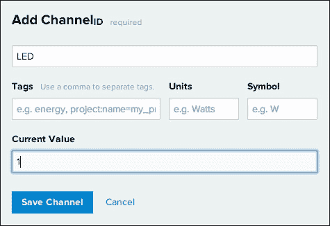

1.  现在，将代码编译并上传到您的 Arduino。

1.  一旦您将编译后的代码上传到 Arduino，打开**串行监视器**窗口并等待一个类似于以下截图的输出。您会注意到 Arduino 硬件上的 LED 灯已点亮：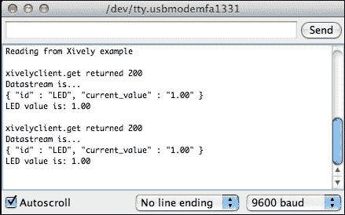

1.  您可以回到 Xively LED 通道并将**当前值**字段更改为`0`。几秒钟后，您会注意到 Arduino 硬件上的 LED 灯已关闭。通过这个练习，您已成功在 Arduino 和 Xively 平台之间建立了双向通信。

### 用于使用 Arduino 上传和下载数据的先进代码

在前两个 Arduino 练习中，我们分别执行了上传和下载任务。在这个练习中，我们想要创建一个 Arduino 程序，我们可以从连接的传感器（PIR 运动传感器和 HIH-4030 湿度传感器）上传数据，同时检索控制 LED 的值。打开 Arduino 草图，`XivelyLibAdvance.ino`，其中包含演示这两种功能的代码。正如你在以下代码片段中可以看到的，我们为每个组件定义了三个独立的通道，同时为上传（`datastreaU[]`）和下载（`datastreamD[]`）创建了独立的`XivelyDatastream`对象。同样，我们也创建了两个不同的 feed，`feedU`和`feedD`。将上传和下载任务委托给不同对象的主要原因是独立更新 LED 通道的值，同时上传`HumidityRaw`和`MotionRaw`通道的数据流：

```py
char ledId[] = "LED";
char humidityId[] = "HumidityRaw";
char pirId[] = "MotionRaw";

int ledPin = 2;
int pirPin = 3;

XivelyDatastream datastreamU[] = {
  XivelyDatastream(humidityId, strlen(humidityId), DATASTREAM_FLOAT),
  XivelyDatastream(pirId, strlen(pirId), DATASTREAM_FLOAT),
};

XivelyDatastream datastreamD[] = {
  XivelyDatastream(ledId, strlen(ledId), DATASTREAM_FLOAT),
};

XivelyFeed feedU(<Your-feed-ID>, datastreamU, 2);
XivelyFeed feedD(<Your-feed-ID>, datastreamD, 1);
```

在 Arduino 代码的`loop()`函数中，我们定期从`feedD`获取 LED 通道的当前值，然后执行 LED 动作：

```py
int retD = xivelyclient.get(feedD, xivelyKey);
Serial.print("xivelyclient.get returned ");
```

在周期函数的第二阶段，我们从 Arduino 板上的模拟和数字引脚获取原始传感器值，然后使用`feedU`上传这些值：

```py
int humidityValue = analogRead(A0);
datastreamU[0].setFloat(humidityValue);
int pirValue = digitalRead(pirPin);
datastreamU[1].setFloat(pirValue);

int retU = xivelyclient.put(feedU, xivelyKey);
Serial.print("xivelyclient.put returned ");
```

对代码进行适当的修改以适应 feed ID 和 API 密钥，然后将草图上传到 Arduino 板。一旦将这个 Arduino 草图上传到你的平台，你应该能在**串行监视器**窗口看到以下输出。现在你可以从 USB 端口断开 Arduino，并连接外部电源。现在，你已经使用以太网线将 Arduino 组件连接到你的本地网络，你可以将 Arduino 组件放置在你工作场所的任何位置。

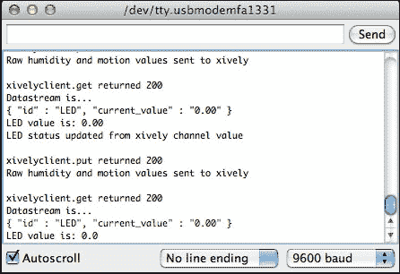

## Python – 将数据上传到 Xively

与我们如何将 Arduino 连接到 Xively 类似，我们现在将探索通过 Python 连接 Xively 平台的方法，从而完成循环。在本节中，我们将关注使用 Python 上传数据到 Xively 的不同方法。我们将从一个与 Xively 通信的基本方法开始，并进一步使用`web.py`来实现通过 Web 应用程序的接口。

首先，让我们使用以下命令在你的计算机上安装 Xively 的 Python 库，`xively-python`：

```py
$ sudo pip install xively-python

```

### 发送数据的基本方法

再次提醒，你需要你的虚拟设备在 Xively 平台上创建的 API 密钥和 feed ID。Python，借助`xively-python`库，提供了非常简单的方法来与 Xively 平台建立通信通道。从你的代码文件夹中，打开`uploadBasicXively.py`文件。根据代码中的说明，将`FEED_ID`和`API_KEY`变量替换为适当的 feed ID 和 API 密钥：

```py
FEED_ID = "<Your-feed-ID>"
API_KEY = "<Your-API-key>"
```

使用`XivelyAPIClient`方法创建一个`api`实例，并通过`api.feeds.get()`方法创建`feed`变量：

```py
api = xively.XivelyAPIClient(API_KEY)
feed = api.feeds.get(FEED_ID)
```

就像我们在 Arduino 练习中所做的那样，您需要从数据源中为每个通道创建数据流。如下代码片段中指定，尝试从数据源中获取指定的通道，或者如果它不在 Xively 虚拟设备上，则创建一个新通道。在创建新通道时，您也可以指定标签和其他变量：

```py
try:
  datastream = feed.datastreams.get("Random")
except HTTPError as e:
  print "HTTPError({0}): {1}".format(e.errno, e.strerror)
  datastream = feed.datastreams.create("Random", tags="python")
  print "Creating 'Random' datastream"
```

一旦您为通道打开了数据流，您可以使用`datastream.current_value`方法指定当前值，并更新该值，这将把此值上传到指定的通道：

```py
datastream.current_value = randomValue
datastream.at = datetime.datetime.utcnow()
datastream.update()
```

一旦您对`uploadBasicXively.py`文件进行了指定的修改，请使用以下命令执行它：

```py
$ python uploadBasicXively.py

```

打开 Xively 网站上的虚拟设备，以找到填充了您上传的数据的`Random`通道。它看起来类似于以下截图：

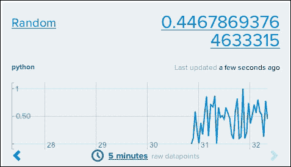

### 基于 web.py 的 Web 界面上传数据

在上一章中，我们在开发模板和 Web 应用时使用了`web.py`库。在本练习中，我们将利用我们在上一练习中创建的`web.py`表单和 Xively 代码中的程序。本练习的目标是使用 Web 应用将数据发送到 LED 通道，同时观察 Arduino 硬件上 LED 的行为。

您可以在本章文件夹中找到本练习的 Python 程序，文件名为`uploadWebpyXively.py`。正如您在代码中看到的，我们正在使用`web.py`表单获取两个输入，`Channel`和`Value`。我们将使用这些输入来修改 LED 通道的当前值：

```py
submit_form = form.Form(
        form.Textbox('Channel', description = 'Channel'),
        form.Textbox('Value', description = 'Value'),
        form.Button('submit', type="submit", description='submit')
        )
```

模板文件`base.html`也被修改以适应本练习所需的微小变化。正如您在打开的 Python 文件中看到的，我们正在使用与上一练习中用于与 Xively 接口相同的代码。唯一的重大修改是对`datastream.update()`方法的修改，现在它被放置在`POST()`函数中。当您提交表单时，将执行此方法。一旦您更改了文件中的 API 密钥和 feed ID，请执行 Python 代码，并在您的 Web 浏览器中打开`http://localhost:8080`。您可以看到正在运行的 Web 应用，如下面的截图所示。输入图中显示的值以在 Arduino 板上打开 LED。您可以将**Value**参数更改为`0`以关闭 LED。

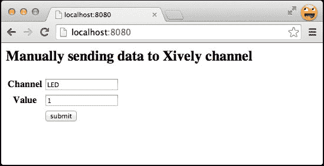

## Python – 从 Xively 下载数据

从 Xively 下载数据的过程包括请求指定通道的**当前值**参数。在下一个练习中，我们将开发一个参考代码，该代码将在下一个下载练习中使用。在那个练习中，我们将开发一个高级 Web 应用程序，用于从特定的 Xively 通道检索数据。

由于我们使用基于 REST 协议的函数与 Xively 进行通信，Xively 不会简单地通知您任何新的、可用的更新，相反，您将不得不请求它。在此阶段，重要的是要注意，我们将不得不定期从 Xively 请求数据。然而，Xively 提供了一个称为**触发器**的替代方法来克服这个问题，这将在本节后面进行解释。

### 从 Xively 获取数据的基本方法

就像上传练习一样，下载练习也需要类似的代码来实例化`XivelyAPIClient()`和`api.feeds.get()`方法。由于我们是检索数据而不是发送它，我们只会使用`feed.datastreams.get()`方法并避免使用`feed.datastreams.create()`方法。下载过程需要通道已经存在，这也是我们为什么只需要使用`get()`方法的主要原因：

```py
try:
  datastream = feed.datastreams.get("Random")
except HTTPError as e:
  print "HTTPError({0}): {1}".format(e.errno, e.strerror)
  print "Requested channel doesn't exist"
```

一旦初始化了`datastream`对象，就可以使用`datastream.current_value`方法获取通道的最新可用值：

```py
latestValue = datastream.current_value
```

要启用完整代码执行此练习，请打开`downloadXivelyBasic.py`代码，并将馈送 ID 和 API 密钥的值更改为适当的值。在这个练习中，我们正在使用在上传练习中创建的`Random`通道。在您执行此 Python 代码之前，您需要执行`uploadXivelyBasic.py`文件，该文件将连续为`Random`通道提供随机数据。现在，您可以执行`downloadXivelyBasic.py`文件，该文件将定期（由`sleep()`函数指定的延迟）获取`Random`通道的当前值。如图所示，我们每 10 秒就会为`Random`通道获取一个新的值：

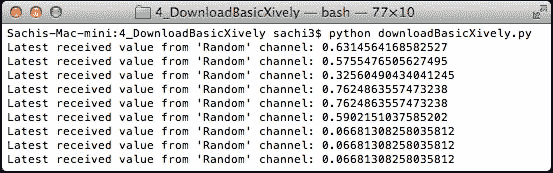

### 从 web.py Web 界面检索数据

这是一个高级练习，我们将从另一个 Xively 通道获取数据后，将其上传到 Xively 的一个通道，并使用通过 Web 表单输入的数据进行处理。正如您所知，连接 HIH-4030 传感器的模拟引脚提供了原始传感器值，而相对湿度取决于当前温度的值。在这个练习中，我们将开发一个 Web 应用程序，以便用户可以手动输入温度值，我们将使用这个值从原始传感器数据中计算相对湿度。

在我们开始详细讲解代码之前，首先打开`uploadWebpyXively.py`文件，更改适当的参数，并执行该文件。现在，在网页浏览器中打开`http://localhost:8080`位置。你将能够看到一个要求你提供当前温度值的网页应用程序。同时，在做出适当更改后，将`XivelyLibAdvance.ino`草图上传到 Arduino 板。使用这个程序，Arduino 将开始向`MotionRaw`和`HumidityRaw`通道发送原始运动和湿度值。在运行的网页应用程序中，提交带有自定义温度值的表单，你将能够看到网页应用程序加载当前相对湿度（以百分比为单位）。在内部，当你提交表单时，网页应用程序从`HumidityRaw`通道检索当前原始湿度值，执行`relativeHumidity(data, temperature)`函数，将计算出的湿度值上传到名为`Humidity`的新通道，然后在网页应用程序中显示该值。

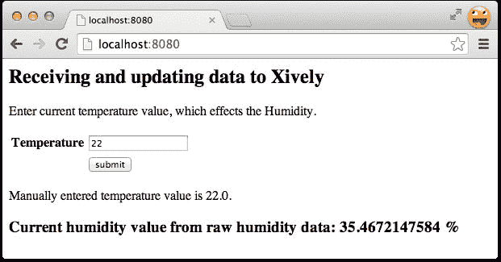

如果你在一个网页浏览器上打开你的 Xively 平台页面，你将能够看到一个新创建的`Humidity`通道，显示当前相对湿度的值。你可以在网页应用程序中提交多个温度值，以查看在`Humidity`通道的图表上反映的结果，如以下截图所示。尽管这个练习演示了一个单一用例，但这个网页应用程序可以通过多种方式扩展，以创建复杂的应用程序。

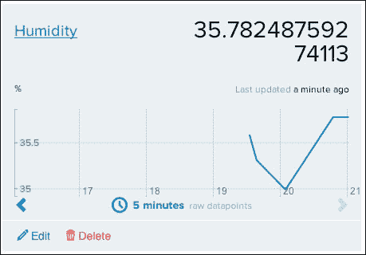

### 触发器 – 来自 Xively 的自定义通知

Xively 平台主要基于 REST 协议部署服务，该协议没有提供在更新为新值时自动发布数据的条款。为了克服这一限制，Xively 实现了触发器的概念，它提供了除发布数据之外的功能。通过这种方式，你可以为任何通道创建一个触发器，当满足该触发器设定的条件时，在指定位置执行`POST`操作。例如，你可以在`Humidity`通道上设置一个触发器，当湿度值变化时（即增加或减少到给定阈值以上或以下）向你发送通知。你只需点击以下截图所示的**添加触发器**按钮，就可以在你的 Xively 平台账户中创建一个触发器：


在创建触发器时，您可以指定要监控的通道以及触发指定 HTTP `POST` URL 通知的条件。如图所示，在保存触发器之前，完成**通道**、**条件**和**HTTP POST URL**的信息。这种方法的重大缺点是 Xively 需要实际的 URL 来发送`POST`通知。如果您的当前计算机没有静态 IP 地址或 DNS 地址，触发器将无法向您发送通知：

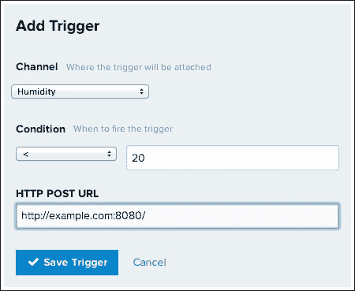

# 您自己的物联网云平台

在上一节中，我们使用了一个同时提供受限免费访问基本功能的商业物联网平台。我们还学习了与基于 REST 协议的 Xively 进行通信的各种方法。对于任何小型项目或原型，Xively 和其他类似的物联网平台提供了一个足够的解决方案，因此我们推荐使用。然而，Xively 提供的有限免费服务可能无法满足您开发全栈物联网产品的所有需求。以下是一些您可能想要配置或开发自己的物联网平台的情况：

+   开发您自己的商业物联网平台

+   开发仅属于您产品的自定义功能

+   在增加更多控制功能和通信协议的同时，也要确保您的数据安全

+   需要一个经济实惠的解决方案来处理大规模项目

本节将指导您逐步创建一个基本的低级别物联网云平台。本节的目标是使您熟悉创建物联网平台的要求和过程。要开发像 Xively 这样的大规模、多样化且功能丰富的平台，您需要在云和分布式计算领域拥有大量的知识和经验。不幸的是，云和分布式计算超出了本书的范围，我们将坚持实现基本功能。

要开发一个可以通过互联网访问的云平台，您至少需要一个具有互联网连接的计算单元和一个静态 IP 或 DNS 地址。如今，大多数面向消费者的**互联网服务提供商**（**ISPs**）在其互联网服务中不提供静态 IP 地址，这使得在家托管服务器变得困难。然而，像亚马逊、谷歌和微软这样的各种公司提供免费或成本效益高的云计算服务，这使得在它们的平台上托管云变得更加容易。这些服务具有高度的扩展性，并配备了大量功能，以满足大多数消费者的需求。在接下来的部分中，您将创建您的第一个云计算实例在**亚马逊网络服务**（**AWS**）上。在本章的后面部分，我们将安装和配置适当的软件工具，如 Python、Mosquitto 代理等，以利用这个亚马逊实例作为物联网云平台。

### 注意

开发或配置个人云平台的主要原因是可以通过互联网访问您的物联网硬件。由于您的家庭网络没有静态 IP 地址，您可能无法从远程位置访问您的原型或项目。云平台可以用作网络项目的事实上的计算单元。

## 熟悉亚马逊 AWS 平台

AWS 是亚马逊提供的一系列各种云服务，共同构成了一个云计算平台。AWS 提供的一种原始且最受欢迎的服务是其**弹性计算云**（**EC2**）服务。EC2 服务允许用户从其庞大的云基础设施中创建具有不同计算能力和操作系统组合的虚拟机实例。这些虚拟实例的计算属性也极其容易在任何时候更改，使其具有高度的扩展性。当您尝试使用 EC2 创建自己的物联网平台时，这种可扩展性功能将极大地帮助您，因为您可以根据需求扩展或压缩实例的大小。如果您不熟悉云计算的概念或 AWS 作为特定产品，您可以从[`aws.amazon.com`](http://aws.amazon.com)了解更多信息。

EC2 云平台与 Xively 不同，因为它提供通用云实例、虚拟机，具有计算能力和存储，可以通过安装和配置特定平台的软件将其转换为任何特定功能的平台。需要注意的是，您真的不需要成为云计算专家才能进一步学习本章内容。接下来的部分提供了一个直观的指南，以执行基本任务，例如设置账户、创建和配置您的虚拟机，以及安装软件工具以创建物联网平台。

### 在 AWS 上设置账户

亚马逊为基于云的虚拟机的基本实例提供一年的免费访问。此实例每月包括 750 小时的免费使用时间，这超过了任何一个月的小时数，因此整个月都是免费的。AWS 账户的数据存储容量和带宽足以满足基本的物联网或 Arduino 项目。要在亚马逊的 AWS 云平台上创建一年的免费账户，请执行以下步骤：

1.  打开[`aws.amazon.com`](http://aws.amazon.com)并点击要求您免费试用 AWS 或类似文本的按钮。

1.  此操作将带您到一个**登录或创建 AWS 账户**页面，如下所示截图。当您选择**我是新用户**选项时，输入您想要用于此账户的电子邮件地址，然后点击**使用我们的安全服务器登录**按钮。如果您已经有 AWS 账户并且知道如何在亚马逊 AWS 上创建账户，您可以使用那些凭据并跳到下一部分：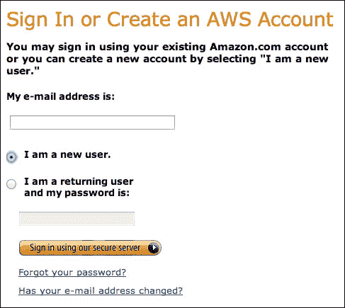

    ### 注意

    亚马逊只为每个账户允许一个免费实例。如果您是现有的 AWS 用户并且您的免费实例已经被另一个应用程序占用，您可以使用相同的实例来容纳 MQTT 代理或购买另一个实例。

1.  在下一页，您将被提示输入您的姓名、电子邮件地址和密码，如下所示截图。填写信息以继续注册过程：

1.  在注册过程中，您将被要求输入您的信用卡信息。但是，您不会因为使用免费账户中包含的服务而被收费。只有在您超出任何限制或购买任何附加服务时，您的信用卡才会被使用。

1.  下一个阶段包括使用您的手机号码验证您的账户。按照以下截图显示的说明完成身份验证过程：

1.  一旦您验证了您的身份，您将被重定向到列出可用亚马逊 AWS 计划的页面。选择您想要订阅的适当计划并继续。如果您不确定，可以选择**基础（免费）**计划选项，我们推荐您为此目的使用该选项。如果您想升级当前计划，**亚马逊管理控制台**页面将允许您选择其他计划。

1.  启动亚马逊管理控制台。

由于您现在有了亚马逊 AWS 账户，让我们在它上面创建您的虚拟实例。

### 在 AWS EC2 服务上创建虚拟实例

为了在亚马逊的 EC2 平台上创建虚拟实例，首先使用您的凭证登录 AWS 并打开管理控制台。接下来，点击**EC2**标签并按以下步骤逐步执行：

1.  在**EC2 控制台**页面，转到**创建实例**并点击**启动实例**按钮。这将打开一个向导，引导您完成设置过程：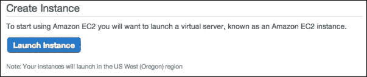

1.  在向导的第一页，您将被提示为您的虚拟实例选择一个操作系统。选择如图所示的**Ubuntu Server 14.04 LTS**，它符合免费层级的资格。为了避免使用高级实例产生任何费用，请确保您选择的选项符合免费层级的资格：

1.  在下一个窗口中，您将看到一个包含不同计算能力配置选项的列表。从**通用型**系列中选择**t2.micro**类型，它符合免费层级的资格。**t2.micro**层提供的计算能力足以完成我们在书中将要进行的练习，以及大多数 DIY 项目。请确保除非您对自己的选择有信心，否则不要选择其他层级。

1.  一旦您选择了指定的层级，请点击**审查和启动**按钮来审查实例的最终配置。

1.  审查配置并确保您已选择了前面提到的适当选项。现在，您可以点击**启动**按钮继续下一步。

1.  这将打开一个弹出窗口，提示您创建一个新的密钥对，该密钥对将在接下来的步骤中进行身份验证：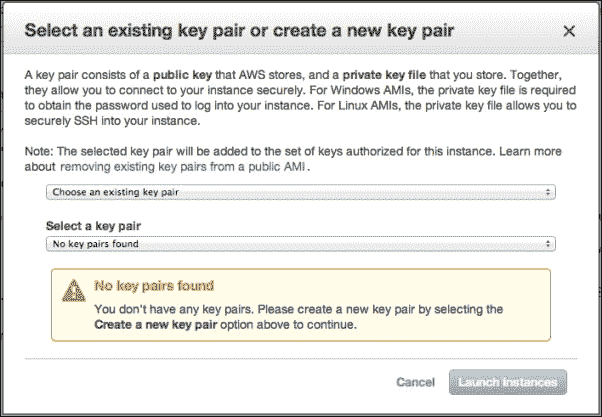

1.  如前一个截图所示，在第一个下拉菜单中选择**创建新的密钥对**，并为密钥对提供一个名称。点击**下载密钥对**按钮下载密钥。下载的密钥将具有您在之前选项中提供的名称，并带有`.pem`扩展名。如果您已经有了现有的密钥，您可以从第一个下拉菜单中选择适当的选项。每次您想要登录到此实例时都需要这个密钥。请将此密钥保存在安全的地方。

1.  再次点击**启动实例**按钮，最终启动实例。您的虚拟实例现在已在 AWS 上启动，并在 EC2 中运行。

1.  现在，点击**查看实例**按钮，这将带您回到 EC2 控制台窗口。您将能够在列表中看到您最近创建的`t2.micro`实例。

1.  要了解更多关于您的虚拟实例的详细信息，从列表中选择它。一旦您选择了您的实例，您将在底部标签中看到更多信息。这些信息包括公共 DNS、私有 DNS、公共 IP 地址等。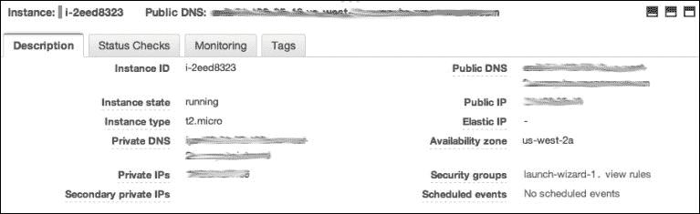

1.  保存此信息，因为您将需要它来登录您的实例。

现在，您已成功创建并开启了使用亚马逊 AWS 的虚拟云实例。然而，此实例正在亚马逊 EC2 上运行，您将需要远程认证进入此实例以访问其资源。

### 登录您的虚拟实例

实际上，您的虚拟实例是在云上的虚拟计算机，具有与您的普通计算机类似的计算资源。您现在需要登录到正在运行的虚拟实例以访问文件、运行脚本和安装额外的包。为了建立安全的认证和访问程序，您需要使用**安全外壳**（**SSH**）协议，并且有多个方法可以从您的计算机使用 SSH。如果您使用 Mac OS X 或 Ubuntu，SSH 客户端程序已包含在您的操作系统中。对于 Windows，您可以从[`www.putty.org/`](http://www.putty.org/)下载 PuTTY SSH 客户端。

从 EC2 管理窗口中检索您实例的公共 IP 地址。要在 Linux 或 Mac 环境中使用默认的 SSH 客户端，请打开终端并导航到您保存具有`.pem`扩展名的密钥文件的文件夹。在终端窗口中，执行以下命令以使您的密钥可访问：

```py
$ chmod 400 test.pem

```

一旦您更改了密钥文件的权限，运行以下命令以登录虚拟实例。在命令中，您必须将`<key-name>`替换为您的密钥文件名，将`<public-IP>`替换为从管理控制台检索的公共 IP：

```py
$ ssh –i <key-name>.pem ubuntu@<public-IP>

```

执行此命令后，如果您是首次认证实例，您将被要求继续连接过程。在提示符下，键入`yes`并按*Enter*键继续。认证成功后，您将在同一终端窗口中看到您的虚拟实例的命令提示符。

如果您正在使用 Windows 操作系统并且不确定 SSH 客户端的状态，请在 EC2 窗口中选择您的实例，然后点击顶部导航栏中的**连接**按钮，如下截图所示：

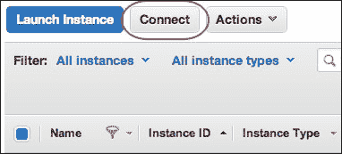

此操作将打开一个弹出窗口，其中包含一个简短的教程，解释连接过程。此教程还链接到 PuTTY 的逐步认证指南。

## 在 EC2 实例上创建物联网平台

由于您已成功设置亚马逊 EC2 实例，您拥有一个在云中运行的虚拟计算机，并具有静态 IP 地址以实现远程访问。然而，此实例不能被归类为物联网平台，因为它只包含一个纯操作系统（在我们的案例中是 Ubuntu Linux）并且缺少必要的软件包和配置。

在您的虚拟实例上设置自定义物联网云平台有两种不同的方法：

+   设置开源物联网平台，如 ThingSpeak

+   单独安装和配置所需的软件工具

在设置开源物联网平台时，请注意以下要点：

+   ThingSpeak 是开源物联网平台之一，它提供支持文件以创建和托管您自己的 ThingSpeak 平台副本。

+   在您的 AWS 实例上设置此平台相当简单，您可以通过[`github.com/iobridge/ThingSpeak`](https://github.com/iobridge/ThingSpeak)获取安装所需的文件和指南。

+   尽管这个个性化的 ThingSpeak 平台将提供足够的工具来开始开发物联网应用程序，但平台的功能将限于提供的功能集。为了完全控制定制，您可能需要使用下一个选项。

如果您想单独安装和配置必要的软件工具，以下是需要记住的：

+   此选项包括提供特定项目所需的软件工具，如 Python 和 Mosquitto 代理，以及所需的 Python 库，如`web.py`和`paho_mqtt`。

+   我们已经与基于 Mosquitto 代理和`web.py`的应用程序实现相关的练习工作。这个定制的物联网云平台版本可以减少安装额外开源平台工具的复杂性，同时仍提供必要的支持以托管应用程序。

+   Arduino 程序可以直接使用 REST 或 MQTT 协议与这个自定义平台进行通信。它还可以作为远程计算单元与 Xively 或其他第三方物联网云平台进行通信。

在下一节中，我们将通过在您的虚拟实例上安装 Mosquitto 代理和必要的软件包来开始平台部署过程。这将随后是配置虚拟实例以支持 MQTT 协议。一旦您的物联网云平台启动并运行，您只需从实例中运行上一章的基于 Python 的 Mosquitto 代码，进行少量或无修改即可。在未来，包含 Mosquitto 代理和 Python 项目的这个物联网平台可以扩展以适应额外的功能、协议和额外的安全性。

### 在 AWS 上安装必要的软件包

使用 SSH 协议和密钥对登录您的虚拟实例。一旦您处于命令提示符，您需要执行的第一项任务是更新 Ubuntu 中所有过时的软件包，这是您的虚拟实例的操作系统。依次执行以下命令：

```py
$ sudo apt-get update
$ sudo apt-get upgrade

```

Ubuntu 已经预装了最新的 Python 版本。但是，您仍然需要安装 Setuptools 来安装额外的 Python 软件包：

```py
$ sudo apt-get install python-setuptools

```

Ubuntu 的软件仓库也托管了 Mosquitto，可以直接使用以下命令安装。使用此命令，我们将一起安装 Mosquitto 代理、Mosquitto 客户端以及所有其他依赖项。在安装过程中，你将被要求确认安装额外的包。在终端输入`Yes`并继续安装：

```py
$ sudo apt-get install mosquitto*

```

现在你已经在你的虚拟实例上安装了 Mosquitto 代理，你可以通过执行 Mosquitto 命令来运行它。为了开发基于 Python 的 Mosquitto 应用，我们需要在我们的实例上安装 Python Mosquitto 库。让我们使用以下命令通过 Setuptools 安装库：

```py
$ sudo easy_install pip
$ sudo pip install paho_mqtt

```

在上一章中，我们开发了一个基于`web.py`的 Web 应用，该应用利用`paho_mqtt`库来支持 MQTT 协议。与第一个项目一样，我们将在基于 EC2 的虚拟实例上部署相同的 Web 应用，以展示你的自定义物联网云平台。作为此项目的依赖项，你首先需要`web.py` Python 库，你可以使用以下命令安装：

```py
$ sudo pip install web.py

```

现在你已经拥有了运行物联网应用所需的所有软件包。为了使你的 Web 应用可以通过互联网访问，你需要配置你的虚拟实例的安全设置。

### 配置虚拟实例的安全设置

首先，我们将配置虚拟实例以安全地托管 Mosquitto 代理。稍后，我们将介绍设置基本安全性的方法，以防止自动化机器人或垃圾邮件尝试滥用你的 Mosquitto 服务器。

要更改你虚拟实例上的任何参数，你将不得不使用**AWS 管理控制台**页面**网络与安全**部分的**安全组**工具。打开**安全组**部分，如下截图所示：

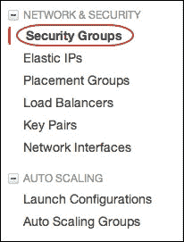

每个虚拟实例都有一个默认的安全组，它是自动生成的，允许通过 SSH 端口 22 访问你的实例。这种安全配置负责让你能够通过计算机上的 SSH 客户端访问你的虚拟实例。Mosquitto 代理使用 TCP 端口号`1883`与发布者和订阅者客户端建立通信。要允许从该 Mosquitto 端口进入访问，你必须编辑当前的入站规则并添加一个端口`1883`的条目：

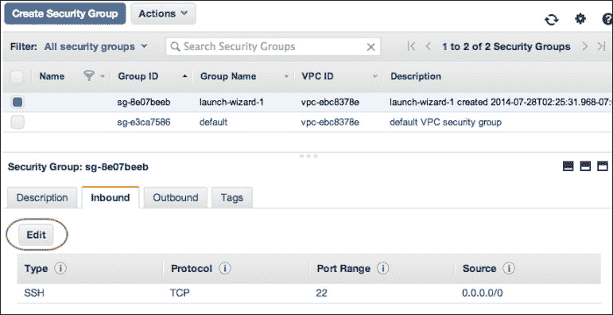

一旦你点击了**编辑**按钮，网站将打开一个弹出窗口以添加新规则和编辑现有规则。点击**添加规则**按钮以创建一个额外的规则来适应 Mosquitto 代理：

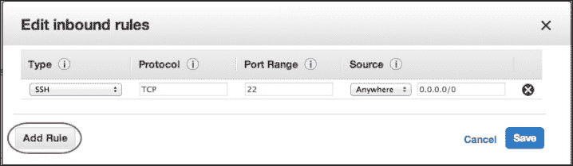

如以下截图所示，将 TCP 端口号输入为`1883`并完成表单中的其他信息。完成表单后，保存规则并退出窗口：

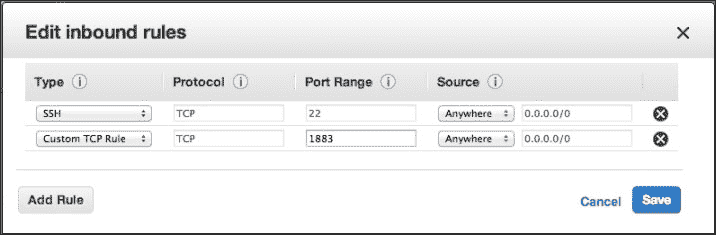

现在，有了这个配置，端口`1883`对其他设备是可访问的，并允许与 Mosquitto 代理进行远程通信。您可以使用相同的方法为端口`8080`添加规则，以允许访问使用`web.py`开发的 Python 网络应用程序。在未来，您可以添加任何其他端口以允许访问各种服务。尽管在您的虚拟实例上更改安全规则非常容易，但请确保您避免打开过多的端口，以避免任何安全风险。

### 测试您的云平台

在本测试部分，我们将首先从您的计算机对 Mosquitto 代理进行测试，然后设置 Mosquitto 代理的认证参数。稍后，我们将使用 SSH 文件传输协议将包含 Python 代码的文件和文件夹上传到我们的虚拟实例。

#### 测试 Mosquitto 服务

我们将在我们的物联网平台上检查的第一件事是 Mosquitto 代理的可访问性。在您的计算机上打开终端，并执行以下命令，在替换`<Public-IP>`时，请使用您的虚拟实例的公共 IP 地址或公共 DNS 地址：

```py
$ mosquitto_pub -h <Public-IP> -t test -m 3

```

此命令将向指定 IP 地址的 Mosquitto 代理的`test`主题发布消息值`3`；在我们的情况下，这是虚拟实例。现在，打开一个单独的终端窗口并执行以下命令来订阅我们的代理上的`test`主题：

```py
$ mosquitto_sub -h <Public-IP> -t test

```

执行此命令后，您将能够看到为此主题发布的最新值。使用`mosquitto_pub`命令发布多条消息，您可以在运行`mosquitto_sub`命令的另一个终端窗口中看到这些消息的输出。

#### 配置和测试基本安全

如您在上一示例中所见，发布和订阅命令仅使用了 IP 地址来发送和接收数据，而没有使用任何认证参数。这是一个重大的安全漏洞，因为任何互联网用户都可以向您的 Mosquitto 代理发送数据。为了避免未经授权访问您的代理，您必须建立认证凭证。您可以通过按照以下步骤的顺序指定这些参数：

1.  如果您尚未通过 SSH 登录到您的实例，请打开一个终端窗口并使用 SSH 登录。登录后，导航到 Mosquitto 目录，并使用以下命令集创建一个名为`passwd`的新文件。我们将使用此文件来存储用户名和密码：

    ```py
    $ cd /etc/mosquitto
    $ sudo nano passwd

    ```

1.  在文件中，使用冒号操作符（`:`）分隔用户名和密码信息。为了测试目的，我们将使用以下凭证，这些凭证可以在您对 Mosquitto 配置更加熟悉后随时更改：

    ```py
    user:password
    ```

1.  按*Ctrl* + *X*从 nano 编辑器保存并退出文件。当您被提示确认保存操作时，选择**Y**并按*Enter*。

1.  在相同的文件夹中，使用 thenano 编辑器打开 Mosquitto 配置文件：

    ```py
    $ sudo nano mosquitto.conf

    ```

1.  在打开的文件中，向下滚动文本内容，直到到达安全部分。在此部分中，找到代码中的`#allow_anonymous true`行，并将其替换为`allow_anonymous false`。确保您已经删除了`#`符号。通过此操作，我们已经禁用了对 Mosquitto 代理的匿名访问，只有具有适当凭证的客户端才能访问它。

1.  在执行了前面的更改之后，在文件中向下滚动，取消注释`#password_file`这一行，并将其替换为以下内容：

    ```py
    password_file /etc/mosquitto/passwd
    ```

1.  现在您已经为您的代理配置了基本的安全参数，您必须重新启动 Mosquitto 服务以使更改生效。在 Ubuntu 中，Mosquitto 作为后台服务的一部分安装，您可以使用以下命令重新启动它：

    ```py
    $ sudo service mosquitto restart

    ```

1.  要测试这些认证配置，在您的计算机上打开另一个终端窗口，并使用以下命令执行实例的公网 IP 地址。如果您能够成功发布消息且没有任何错误，那么您的 Mosquitto 代理现在已经具有了安全配置：

    ```py
    $ mosquitto_pub -u user -P password -h <Public-Ip> -t test -m 3

    ```

1.  此外，使用以下命令检查您的 Mosquitto 订阅者：

    ```py
    $ mosquitto_sub -u user -P password -h <Public-Ip> -t test

    ```

#### 在实例上上传和测试项目

正如我们在前面的章节中讨论的那样，您始终可以使用您的计算机进行开发。一旦您准备部署，您可以使用这个新配置的虚拟实例作为部署单元。您可以使用名为 PuTTY 的实用程序（[`docs.aws.amazon.com/AWSEC2/latest/UserGuide/putty.html`](https://docs.aws.amazon.com/AWSEC2/latest/UserGuide/putty.html)）或使用 SCP（SSH 复制）命令将您的文件从本地计算机复制到虚拟实例。

现在是时候上传上一章最终编码练习的项目文件了，该练习使用了 Python 和 Mosquitto 库实现了 MQTT 协议。作为提醒，最终练习位于上一章代码仓库中名为`Exercise 4 - MQTT gateway`的文件夹中。我们将使用 SCP 实用程序将这些文件上传到您的虚拟实例。在我们使用此实用程序之前，让我们首先在您的虚拟实例上创建一个目录。登录到您的虚拟实例，并使用以下命令进入虚拟实例的用户目录：

```py
$ ssh –i <key-name>.pem ubuntu@<public-ip>
$ cd ~

```

使用字符波浪号（`~`）与`cd`命令一起使用，将当前目录更改为主目录，除非您打算在虚拟实例上的其他位置使用。在此位置，使用以下命令创建一个名为`project`的新空目录：

```py
$ mkdir project

```

现在，在您正在工作的计算机上（Mac OS X 或 Linux），打开另一个终端窗口，并使用以下命令将整个目录复制到远程实例：

```py
$ scp -v -i test.pem -r <project-folder-path> ubuntu@<your-ec2-static-ip>:~/project

```

一旦您已成功将文件复制到该位置，您就可以回到登录到您的虚拟实例的终端，并将目录更改为`project`：

```py
$ cd project

```

在运行任何命令之前，请确保您已更改 Arduino 草图和 Python 程序中的适当 IP 地址。您需要将之前的 IP 地址替换为您的虚拟实例的 IP 地址。现在，您已经做了这些更改，您可以执行包含 Mosquitto 网关和 Web 应用的 Python 代码来启动程序。从`http://<Public-Ip>:8080`位置打开您的 Web 浏览器，以查看在自定义物联网平台上运行的 Web 应用。从现在起，您应该能够通过互联网从任何远程位置访问此应用。

### 小贴士

不要忘记在 Arduino 草图中将 Mosquitto 代理的 IP 地址更改，并再次将草图上传到 Arduino 板。如果没有应用适当的 IP 地址更改，您可能无法获取传感器数据。

# 摘要

在本章末尾，也就是本书上下文部分的结尾，您应该能够开发自己的物联网项目。在本章中，我们使用了一个商业物联网云平台来处理您的传感器数据。我们还部署了一个云实例来托管开源物联网工具，并创建了自定义物联网云平台的版本。当然，您所学的知识不足以开发可扩展的完整商业产品，但它确实有助于您开始这些产品。在大量情况下，这些材料足以开发 DIY 项目和产品原型，最终将引导您到达最终产品。在接下来的两章中，我们将把所学知识付诸实践，并开发两个完整的物联网硬件项目。我们还将学习一种专门针对基于硬件的物联网产品的项目开发方法，该方法可以应用于将您的原型转换为真实产品。
