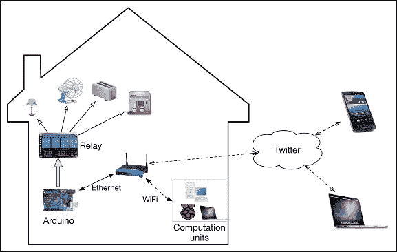
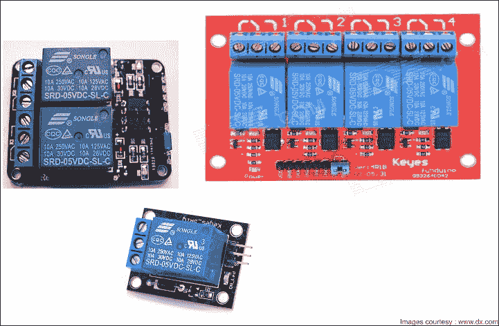
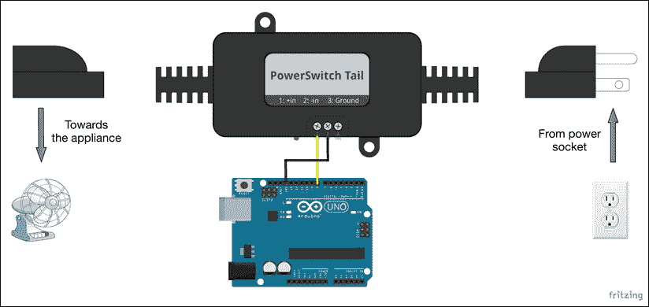
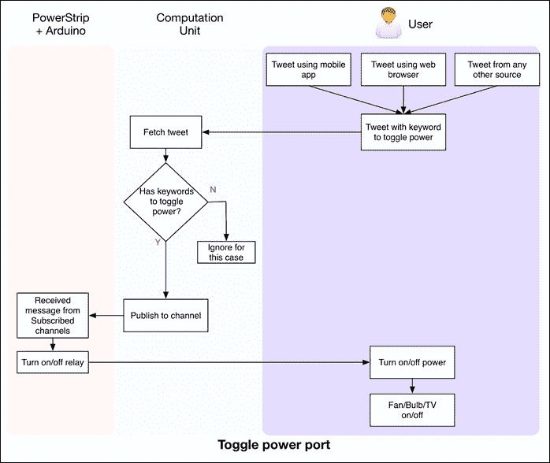
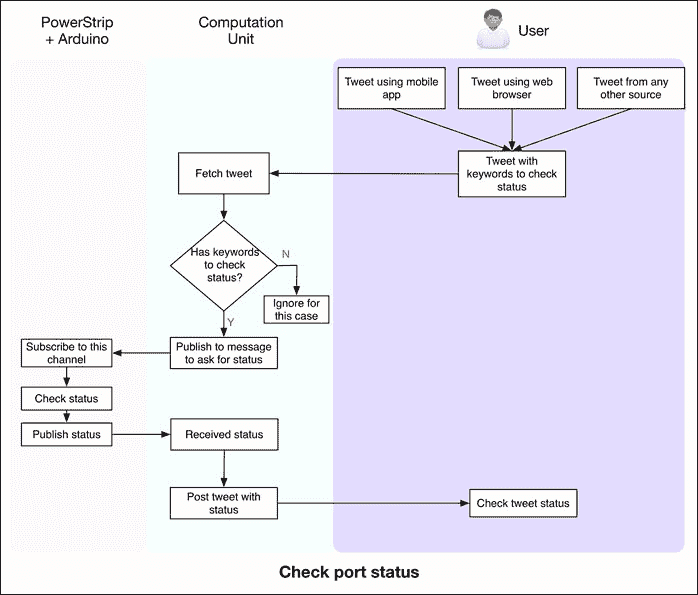
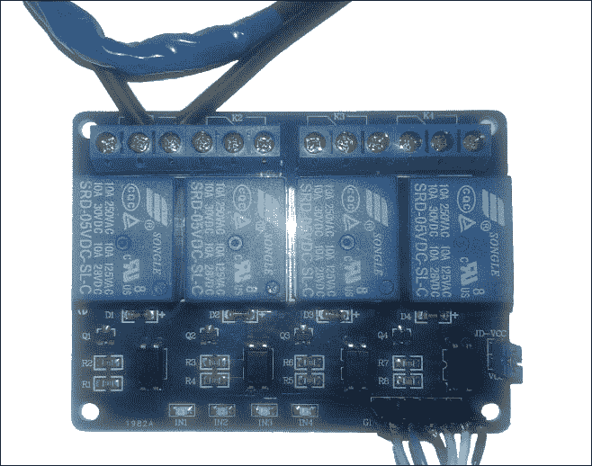
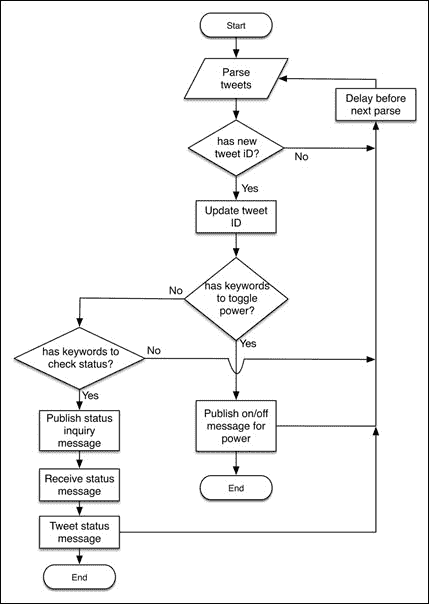
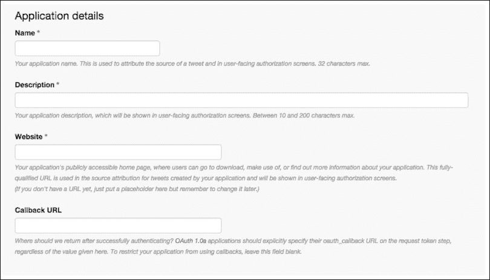
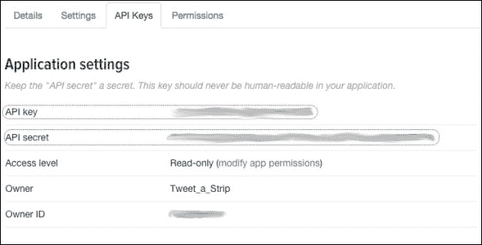
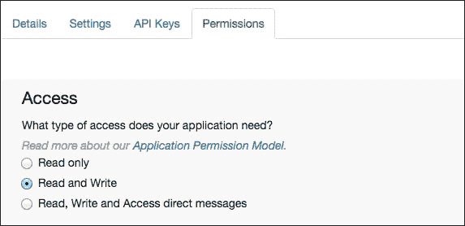

# 第十一章。推文电源条带

智能电源管理单元或条带是某些最受欢迎的物联网子领域的一部分，如智能家居和智能电网。如今，智能电源条带在商业上可用，并提供大量功能，如远程访问、智能电力使用和电力管理。在本项目中，我们将创建一个可以通过在 Twitter 上发布的状态消息远程控制的智能 DIY 电源条带，Twitter 是一个流行的社交媒体网站（[`www.twitter.com`](http://www.twitter.com)）。这些消息也被称为**推文**。基本上，就像您可以使用网页浏览器远程控制传感器一样，您也可以通过发送推文来控制它们。我们在上一个项目中已经与低功耗传感器合作过，所以在这个项目中让我们处理交流电器。我们将实施与上一个项目中使用的相同的项目开发方法。本章避免对过程的额外解释，仅关注与项目相关的细节。

# 项目概述

本项目需要使用 Arduino 和 Python 开发智能电源条带，而条带的控制输入是推文。尽管我们只启用了电源条带的远程访问功能，但未来可以实施大量其他功能，将这个 DIY 项目提升为商业产品。

我们在本项目中想要实现的主要目标是以下这些：

+   用户应能够使用定制的推文开关各个电源端口

+   用户应能够通过 Twitter 检查电源端口的状况

## 项目需求

这里是初始项目需求，来源于目标：

+   系统应具有与继电器接口的 110V（或 220V）交流电源端口。

+   基于 Arduino 的单元应能够控制这些继电器，最终控制通过电源端口连接的电器

+   系统应能够解码用户发送的推文，并将它们转换为 Arduino 的适当控制消息

+   基于 Python 的程序处理推文后，应发布这些消息，以便 Arduino 可以使用继电器完成这些操作。

+   总结来说，应使用用户发送的推文以近乎实时的方式控制继电器。

+   系统还应理解关键词以检查继电器的状态，并自动推文状态。系统应仅处理一次推文，并能够记住最后处理的推文。

    ### 注意

    **110V 与 220V 交流电源**

    根据国家不同，您的交流电源可能具有 110/120V 或 220/240V 的电压等级。尽管本项目使用的电路图提到了 110V 交流电源，但相同的电路也适用于 220V 电源。如果您使用 220V 电源，在继续之前请查看以下注意事项：

    +   确保您要操作的电器，如风扇、灯具等，适用于类似的交流电源

    +   您必须确保项目使用的继电器与您的交流电源兼容

    +   Arduino 使用直流电源供电，不受交流电源任何变化的影响

## 系统架构

从前面的要求来看，让我们绘制 Tweet-a-PowerStrip 系统的架构图。系统架构试图利用您在前面章节中学到的硬件组件和软件工具，同时将继电器组件作为唯一的例外。如您在以下架构图中看到的，我们正在使用继电器来控制各种家用电器。这些电器通常由每个家庭都有的通用 110V 交流电源供电。我们不是控制单个电器，而是实现了一个四通道继电器，以控制至少四个电器，如灯、风扇、烤面包机和咖啡机。



该继电器通过 Arduino Uno 板上的数字引脚进行控制，该板使用以太网盾连接到您的家庭网络。一个可能由计算机、树莓派或服务器组成的计算单元，使用 Python 及其支持库来访问推文。计算单元还部署了一个 Mosquitto 代理。这个代理处理来自 Python 程序和 Arduino 的议题，以控制继电器。用户可以从任何平台（如手机或浏览器）发布包含关键词的推文，最终这些推文会被计算单元捕获。

## 所需硬件组件

在整个开发和部署阶段，该项目将需要以下硬件组件：

| 组件 | 数量 | 网站/备注 |
| --- | --- | --- |
| Arduino Uno | 1 | [`www.sparkfun.com/products/11021`](https://www.sparkfun.com/products/11021) |
| Arduino 以太网盾 | 1 | [`www.sparkfun.com/products/9026`](https://www.sparkfun.com/products/9026) |
| 继电器（四通道，Arduino 兼容） | 1 | [`www.amazon.com/JBtek-Channel-Module-Arduino-Raspberry/dp/B00KTEN3TM/`](http://www.amazon.com/JBtek-Channel-Module-Arduino-Raspberry/dp/B00KTEN3TM/) |
| PowerSwitch Tail | 4 | [`www.powerswitchtail.com/`](http://www.powerswitchtail.com/)继电器的替代品 |
| 电源插座 | 可选 |   |
| 面包板 | 1 | 用于开发阶段 |
| Arduino USB 线 | 1 | 用于开发阶段 |
| Arduino 电源 | 1 | 用于部署阶段 |
| 电胶带 | 根据需求 |   |
| 连接线 | 根据需求 |   |

### 继电器

如您在以下图片中看到的，我们引入了一个新的硬件组件，它在前面的章节中没有被使用——一个继电器：



这是一种电磁设备，通过使用电力作为开关来操作。一个典型的继电器在高压侧有三个触点，**通常连接**（**NC**），**公共**（**C**），和**通常断开**（**NO**）。继电器的另一侧（控制侧）需要激活电压来切换连接从公共-NC 到公共-NO。这个动作展示了高压侧连接的开关功能。我们将使用来自 Keyes 或 SainSmart 等制造商的 Arduino 兼容继电器。这些继电器有单通道、双通道或四通道配置。在高压侧，继电器支持高达 250V，10A 交流电或 30V，10A 直流电。继电器通过低功率侧的 5V 直流电控制，该电压由 Arduino 板上的数字 I/O 引脚提供。

### PowerSwitch Tail

如果你之前没有处理过交流电或者不熟悉必要的预防措施和测量，那么与交流电一起工作可能会有危险。如果你不习惯于处理开启的继电器或将交流电连接到它们，你可以使用另一种设备来替换继电器——PowerSwitch Tail，这是一个安全封装的盒子，包含光隔离固态继电器，并提供了一种方便的方式将你的交流电器与 Arduino 板连接起来。以下是 PowerSwitch Tail 的图片，可以从其官方网站[`www.powerswitchtail.com/`](http://www.powerswitchtail.com/)获取：


### 注意

如果你处理的是 220V/240V 电源，PowerSwitch Tail 网站还提供适用于 200V 至 240V 电源的组装套件，可在[`www.powerswitchtail.com/Pages/PowerSwitchTail240vackit.aspx`](http://www.powerswitchtail.com/Pages/PowerSwitchTail240vackit.aspx)找到。

根据提供的[`www.powerswitchtail.com/Documents/PSSRTK%20Instructions.pdf`](http://www.powerswitchtail.com/Documents/PSSRTK%20Instructions.pdf)指南，组装这套设备非常简单。

对于这个项目，你需要四个这样的设备来替换我们即将使用的四通道继电器。正如以下图所示，Tail 的一端插入常规电源端口，而你需要将你的设备连接到另一个端口。同时，你可以使用三个控制输入来控制继电器。我们正在使用 Arduino 板上的一个数字 I/O 引脚将控制信号发送到 Tail。当使用 Tail 而不是继电器时，请确保对即将到来的硬件设计进行必要的修改。



## 用户体验流程

从我们创建的系统架构来看，在使用 Tweet-a-PowerStrip 时，用户体验（UX）流程应该是什么？我们将 UX 分为两个独立的部分：控制电器电源和检查电源插座的状态。

在第一个 UX 流程设计中，如以下图所示，用户首先发送包含设备名称（#风扇、#灯、#烤面包机或#咖啡）和控制命令（#开或#关）的推文。系统应该能够从解析推文到设备按请求行为处理整个流程。系统还应为用户提供无障碍体验，用户只需发送推文，无需执行任何其他操作。



同样，用户应该能够发布**#状态 #检查**推文，并简单地获取系统发布的状态报告。系统应处理检查电源端口的状态，将其发布到计算单元，并发布带有消息的推文，而无需用户任何额外的输入。

下图显示了检查系统状态的 UX 流程：



## 开发和部署阶段

根据架构，我们需要两个主要开发阶段来完成项目。第一个阶段，通过与继电器交互来与设备交互，使用 Arduino 进行开发。该单元订阅与设备相关的主题，一旦接收到适当的消息，它就会在继电器级别执行动作。在第二个阶段，我们处理单个推文，从 Twitter 账户解析推文，检查重复项，从消息中解码动作，并发布带有状态报告的推文。在这些开发阶段中，我们将使用面包板和跳线来测试 Arduino 和 Python 程序。在这个阶段，项目还没有准备好作为便携式单元用于日常使用。

部署阶段包括创建面包板连接的 PCB 和绝缘电线以避免任何电气危险的任务。你也可以购买或创建一个外壳箱来隔离开放硬件与物理接触。由于开发阶段包含将项目转换为工作状态所需的一切，我们不会深入探讨部署阶段。你可以根据个人需求执行额外的部署任务。

让我们从硬件设计阶段开始，使用 Arduino 开发智能电源插座的物理部分。

# 阶段 1 – 带有 Arduino 和继电器的智能电源插座

Tweet-a-PowerStrip 的硬件包含 Arduino 作为主控制器单元，它通过继电器和以太网盾与计算单元通信。Arduino 代码实现了 MQTT 客户端，使用`PubSubClient`库发布和订阅主题。尽管我们使用了一些示例设备来控制继电器的使用，但你也可以选择你拥有的任何其他设备。你也可以使用商业电源插座而不是单个电源插头。

## 硬件设计

在组装硬件组件时，如以下图所示，确保您在连接电器与交流电源插头时非常精确。交流插头的一根线直接连接到电器，而另一根线连接到继电器的 C 和 NO 端口之间。我们已经将继电器的控制端连接到我们的 Arduino 的数字引脚。由于我们使用的是四通道继电器，我们不得不利用 Arduino 板上的四个数字 IO 引脚。按照此处所示完成剩余的连接：


连接硬件单元相对简单，但需要很高的精度，因为它涉及到高功率的交流连接。

### 小贴士

您应该用绝缘胶带覆盖通往继电器和电器的 110V 交流电源线，以避免任何类型的电气危险。由于这些电线携带大量电流，保持这些电线裸露是非常危险的。在部署阶段，围绕继电器单元的塑料盖或盒子也可以帮助覆盖裸露的电源线。

一旦您完成了连接，请使用 USB 端口将 Arduino 板连接到您的计算机，如图所示：



## Arduino 代码

本节的 Arduino 草图位于包含章节代码的文件夹中，文件名为`Arduino_powerstrip.ino`。您可以在 Arduino IDE 中打开该文件以探索代码。像往常一样，您必须将设备的 IP 地址和 Mosquitto 服务器的 IP 地址更改为适当的 IP 地址，同时更改以太网盾的 MAC 地址。以下代码片段显示了 Arduino 引脚的声明及其在主函数`setup()`中的作用，请确保您使用的是连接继电器时使用的相同引脚编号。或者，您可以将电器名称更改为您使用的电器名称。此外，请确保您对变量名称所做的任何更改都反映在整个代码中，以避免任何编译错误：

```py
  pinMode(FAN, OUTPUT);
  pinMode(LAMP, OUTPUT);
  pinMode(TOASTER, OUTPUT);
  pinMode(COFFEEMAKER, OUTPUT);
  fanStatus = false;
  lampStatus = false;
  toasterStatus = false;
  coffeemakerStatus = false;
  digitalWrite(FAN, LOW);
  digitalWrite(LAMP,LOW);
  digitalWrite(TOASTER, LOW);
  digitalWrite(COFFEEMAKER, LOW);
```

在`setup()`函数中，代码还订阅了适当的 MQTT 通道，以便它可以在消息可用时立即从 Mosquitto 代理接收消息。如您所见，我们还在订阅`PowerStrip/statuscheck`通道以处理状态报告：

```py
  if (client.connect("PowerStrip")) {
    client.subscribe("PowerStrip/fan");
    client.subscribe("PowerStrip/lamp");
    client.subscribe("PowerStrip/toaster");
    client.subscribe("PowerStrip/coffeemaker");
    client.subscribe("PowerStrip/statuscheck");
  }
```

在`callback()`函数中，我们使用`if`语句来匹配主题与适当的`digitalWrite()`动作。如您所见，当程序接收到`on`和`off`消息时（针对该电器），我们正在为数字引脚设置`HIGH`和`LOW`状态。通过这个动作，我们还改变了与电器关联的布尔变量的状态，这将有助于检索端口的状况。然后，对所有的电器重复相同的过程：

```py
  if(topicS == "PowerStrip/fan"){
    if (payloadS.equalsIgnoreCase("on")) {
      digitalWrite(FAN, HIGH);
      fanStatus = true;
    }
    if (payloadS.equalsIgnoreCase("off")){
      digitalWrite(FAN, LOW);
      fanStatus = false;
    }
  }
```

当系统接收到与状态检查相关的`get`消息时，程序使用我们之前切换过的布尔变量创建一条消息。然后程序将状态发布到`PowerStrip/statusreport`通道：

```py
if(topicS.equals("PowerStrip/statuscheck")){
    if (payloadS.equalsIgnoreCase("get")) {
        String report = "";
        if (fanStatus) report += "Fan:on,";
        else report += "Fan:off,";

        if (lampStatus) report += "Lamp:on,";
        else report += "Lamp:off,";

        if (toasterStatus) report += "Toaster:on,";
        else report += "Toaster:off,";

        if (coffeemakerStatus) report += "Coffeemaker:on";
        else report += "Coffeemaker:off";

        report.toCharArray(reportChar, 100);
        client.publish("PowerStrip/statusreport", reportChar);
    }
  }
```

正如我们在上一个项目中做的那样，你可以设置代码定期发送`keep alive`消息以避免与 Mosquitto 代理的连接终止。一旦代码准备就绪，连接以太网电缆，编译代码，然后将它上传到你的 Arduino。现在你的 Arduino 应该处于接收模式，并等待来自订阅通道的消息。正如我们在上一个项目中讨论的那样，你需要确保你的 Mosquitto 代理正在运行在 Arduino 代码中指定的服务器 IP 地址上。

# 第二阶段 – 处理推文的 Python 代码

由于用户是在 Twitter 应用程序的级别与系统交互，我们不需要为这个项目部署可部署的计算或控制单元。因此，我们只需使用任何能够托管 Python 和 Mosquitto 的计算机作为计算单元即可。你仍然需要确保该单元始终开启并连接到互联网，否则系统将无法按预期工作。为了简单起见，你可以将系统部署在你之前项目开发过的基于 Raspberry-Pi 的控制中心上，甚至可以部署在 Amazon AWS 服务器上。对于开发阶段，让我们从你一直使用的普通计算机开始。我们假设这台计算机已经安装并运行了 Mosquitto 代理。记下这个单元的 IP 地址，因为你将在之前章节开发的 Arduino 代码中需要它。

## Python 软件流程

Python 代码在执行过程中处理两个服务，分别是用于获取或发布推文的 Twitter API 和用于将消息中继到硬件单元的 Mosquitto 代理。程序首先解析用户账户的最新推文，并检查它是否在之前的操作中被使用过。这样可以避免任何命令重复，因为新推文的频率远低于程序循环的频率。一旦代码找到包含适当关键词的新推文，可以用来对设备（或设备组）进行操作，它就会将消息发布到 Mosquitto 代理。如果推文包含检查状态的指令，代码会从你的 Arduino 请求状态，并在收到状态后发布一条新的推文。

以下图表显示了计算单元的详细程序流程：



你可以更改程序流程以适应你想要在 Python 级别添加的任何其他功能。识别和切换设备背后的逻辑可以根据更复杂的推文文本进行改进。

## 设置 Twitter 应用程序

我们假设您现在已经有了一个 Twitter 账户。如果没有，您可以只为这个项目创建一个新账户，以避免更改您自己的个人资料。随着最新 API 的引入，Twitter 要求您在访问账户中的任何信息之前使用 OAuth 进行身份验证。为此，您将需要使用您的账户创建一个 Twitter 应用程序。按照以下步骤创建此项目的新的 Twitter 应用程序：

1.  登录您的 Twitter 账户，并在您的网络浏览器中打开[`apps.twitter.com`](https://apps.twitter.com)地址。

1.  在页面上点击**创建新应用程序**图标，您将被引导到一个页面，要求您提供应用程序详细信息，如下面的截图所示：

1.  填写所有必需的详细信息（用红色星号标记），然后继续到下一页。请确保您的应用程序名称是唯一的，因为 Twitter 要求应用程序名称必须是唯一的。

1.  一旦您的应用程序创建完成，您可以在**API 密钥**标签页中点击，找到您应用程序的消费者密钥（**API 密钥**）和消费者密钥（**API 密钥**）。请将此信息保存在安全的地方，因为您将需要它们来通过 Twitter API 进行身份验证。

1.  由于 Tweet-a-PowerStrip 项目的用户体验要求系统自动发送系统状态，我们需要对我们的应用程序有读写访问权限。转到**权限**标签页，选择**读取和写入**选项，并保存更改以生效。

1.  一旦您完成了设置应用程序权限，返回到 API 密钥标签页，并点击**创建访问令牌**图标以生成此应用程序的新访问令牌。一段时间后，您应该能在同一页面上看到访问令牌，如下面的截图所示：

1.  保存**访问令牌**和**访问令牌密钥**信息。您的应用程序现在可以使用了，并且可以帮助您通过 Twitter API 进行身份验证。

现在让我们继续到 Python 代码部分。

## Python 代码

在您开始编写代码之前，您需要安装 Python 的 Twitter 库。使用 Setuptools 或`pip`通过以下命令安装库。我们假设您已经在您的计算机上安装了最新的`paho_mqtt`库：

```py
$ sudo pip install python-twitter

```

本节中的 Python 代码位于代码文件夹中，文件名为`PythonTweetAPowerStrip.py`。在您的 IDE 中打开代码，并开始探索它。该代码包含两个并行线程，分别处理推文和 Mosquitto 库。

如以下代码片段所示，我们正在使用`python-twitter`库中的`Api`类与 Twitter API 建立连接。我们使用`consumer key`、`consumer secret`、`access token key`和`access token secret`值进行此认证。一旦建立认证，就可以使用`Api`类通过`GetHomeTimeline()`函数调用来获取时间线上的最新状态，以及通过`PostUpdate()`函数调用来发布新状态。`GetHomeTimeline()`函数返回用户的状态数组；我们需要获取最新状态，可以使用`statuses[0]`（数组的第一个元素）来获取：

```py
api = twitter.Api(consumer_key='<consumer-key>',
                  consumer_secret='<consumer-secret>',
                  access_token_key='<access-token-key>',
                  access_token_secret='access-token-secret>')
```

一旦我们检索到最新的推文，我们需要确保我们没有使用过那条推文。因此，我们将最新的推文 ID 保存到全局变量中，以及在一个文件中，以防我们需要再次运行代码：

```py
with open('lastTweetID.txt', 'w+') as fh:
  lastTweetId = fh.readline()
  print "Initializing with ID: " + lastTweetId
```

我们从`lastTweetID.txt`文件中检索上一条推文的 ID，以与最新 ID 进行匹配。如果不匹配，我们将最新 ID 更新到`lastTweetID.txt`文件中，以便下一次循环：

```py
if lastTweetId != str(currentStatus.id):
  lastTweetId = str(currentStatus.id)
  print "Updated file with ID: " + lastTweetId
  with open('lastTweetID.txt', 'w+') as fh:
    fh.write(lastTweetId)
    currentStatusText = currentStatus.text
    print currentStatusText
```

一旦我们确定了最新的唯一推文，我们使用 Python 字符串操作来解码设备和控制命令的关键字。如以下代码片段所示，我们在推文文本中寻找的关键字以访问风扇是`#fan`。一旦我们确定消息是针对风扇的，我们检查动作关键字，如`#on`和`#off`，然后执行将消息发布到 Mosquitto 代理的相关动作。我们对所有连接到系统的设备重复此动作。你的 Arduino 使用发布的消息采取行动，并完成控制设备的用户体验流程：

```py
if "#fan" in currentStatusText.lower():
  if "#on" in currentStatusText.lower():
    cli.publish("PowerStrip/fan", "on")
  if "#off" in currentStatusText.lower():
    cli.publish("PowerStrip/fan", "off")
```

同样，当代码从`PowerStrip/statusreport`主题接收到更新时，它从消息有效负载中获取状态，并将其作为新推文发布到该 Twitter 账户的用户时间线。这完成了使用 Twitter 进行状态检查的用户体验流程：

```py
def onMessage(mosq, obj, msg):
    if msg.topic == "PowerStrip/statusreport":
        print msg.payload
        api.PostUpdate(msg.payload)
```

# 测试和故障排除

测试可以通过将`#fan #on`状态发布到本项目使用的 Twitter 账户来简单进行。你应该能够通过以下命令看到风扇开启：


同样，发送`#fan #off`状态来关闭风扇。你可能会发现一些延迟，因为用于检索推文的循环被设置为每分钟延迟。


要访问系统状态，将`#status #get`状态发布到账户，你将能够看到计算单元自动发布的系统状态。


下面的截图显示的推文是使用 Tweet-a-PowerStrip 单元生成的。它显示了所有连接的设备的状态。


在使用系统时，您可能希望避免以下场景或对其进行故障排除：

+   `'Twitter 速率限制超出'错误`：Twitter 对其公共 API 的请求数量有限制。如果您请求 API 过于频繁（这通常发生在您减少连续查询之间的睡眠时间时），您的应用程序将异常退出。为了避免这种情况，在请求 API 之前，在 Python 程序循环中设置更长的睡眠时间。请求频率和电器响应时间之间存在权衡。您可以在[`dev.twitter.com/rest/public/rate-limiting`](http://dev.twitter.com/rest/public/rate-limiting)上了解此限制，并相应地调整请求间隔。一旦收到此错误，您将不得不等待一段时间（大约 10 到 15 分钟）才能再次向 Twitter API 发送请求。

+   `'只读应用程序无法发布'错误`：此错误仅会在您忘记将应用程序的权限从**只读**更改为**读和写**时发生。请确保您已执行此更改。此外，Twitter 需要一些时间来使更改生效。

# 通过添加额外功能扩展项目

当前系统可以扩展以包括多个功能：

+   您可以开始记录特定电器开启或关闭的时间段，并向用户提供详细的分析。您还可以使用这些信息来计算这些电器消耗的能量。

+   您可以利用当前的测量传感器来计算每个端口的电力负载。结合设备开启的时间，您可以计算出非常全面的电力使用情况，以进一步改善电力管理。

+   您可以使用系统时钟和运动传感器在夜间和无活动期间智能地关闭电器。

+   Tweet-a-PowerStrip 项目可以与我们在上一个项目中开发的远程家庭监控系统接口，以便从同一房屋中使用的其他传感器获取有用信息。

+   您可以轻松实现的修改之一是利用 Twitter 的私信而不是其推文来控制电器。这将扩展您系统的访问权限，使其能够访问其他受信任的 Twitter 账户。出于安全原因，您应该提高访问级别，并仅允许经过批准的人向您的账户发布此类消息。

# 摘要

您现在已成功使用仅两种基础技术，Arduino 和 Python，完成了两个不同的物联网项目。随着当前项目，很明显，将任何其他技术、工具或 API 与 Arduino 和 Python 接口非常容易。我们在这些两个项目中使用的项目开发方法也将帮助您进行 DIY 项目和未来的其他产品。祝您原型制作愉快！祝您编码愉快！
