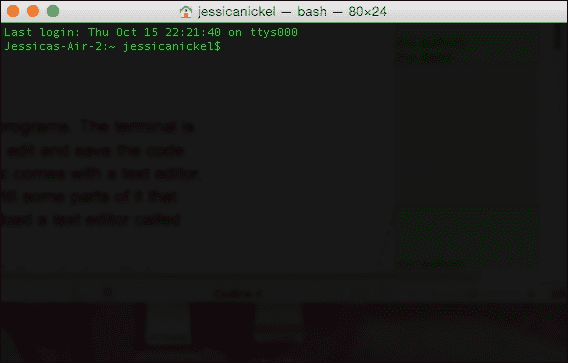
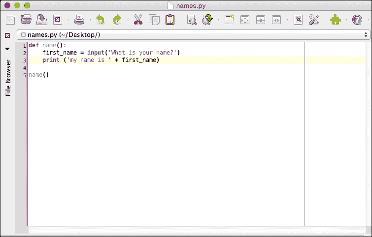
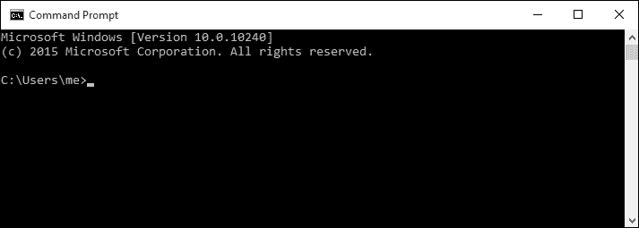
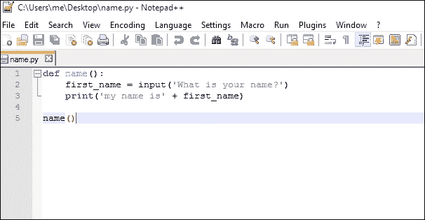
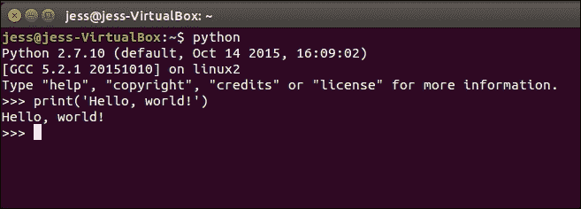
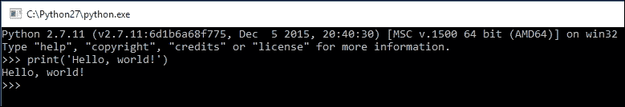

# 第一章。欢迎！让我们开始吧

如果你选择了这本书，那么你正在迈出第一步，使用代码构建令人惊叹的项目。你们中的一些人可能想制作游戏，而其他人可能想更多地了解所有你喜欢的网站和应用程序实际上是如何工作的。如果你跟随本书中的练习，你将能够做到以下事情：

+   创建与家人和朋友一起玩的有趣游戏

+   了解你的应用程序的内部运作

+   学习如何掌控你的电脑

# 为你准备的 Python 项目

在这本书中，你将学习 Python 代码。具体来说，你将学习如何从头开始设计一个计算机程序。如果你以前从未编码过，这无关紧要，因为本书中的每个练习都是为了让你准备好编码。如果你以前编码过，你会发现这本书有一些非常有帮助的练习，可以帮助你的代码变得更好。此外，书中还有一些更高级的项目在书的末尾，你绝对应该看看！

## 你可以用 Python 做什么？

如果你查看网络并搜索 Python 工作，你会发现许多最高薪的工作都是在 Python 领域。为什么？

Python 在以下方面是一个非常灵活和强大的语言：

+   它可以用来浏览数百万行数据

+   Python 可以在不访问网站本身的情况下搜索网站上的信息

+   它甚至被用来托管和设计网站

那么，学习 Python 需要什么？如果你从未编程过，你可能希望按顺序跟随每一课，这样你就可以构建制作游戏或其他类型计算机程序所需的技能。本书的最终项目将是一个游戏。如果你有一些其他编程经验，比如修改你的电脑游戏，使用 Scratch 或 Logo 程序，或者尝试一些互联网上的免费编程课程，那么你可能决定先快速浏览这本书，看看你已经知道了什么。仍然建议你按照书中内容的顺序来学习，因为每个项目都是建立在上一章解释的项目之上的。

## 为什么你应该学习 Python

Python 教授了面向对象编程语言的所有基础知识，并且仍然非常强大。实际上，许多互联网公司，最著名的是 Mozilla Firefox 和 Google，在它们的部分或全部产品中使用 Python！Python 也被用来构建 Django，一个用于制作网站的免费框架。

它也被用来构建许多小型视频游戏，这些游戏是由学习 Python 的人以及更高级的程序员制作的。最后，Python 可以用来快速读取和分析数百万行数据！通过学习 Python，你将准备好构建各种有趣的项目，如果你选择这样做，你将获得学习其他编程语言所需的技能。

# Python 的先决条件

在您开始之前，您需要以下基本材料：

+   一台可以运行 Windows 7 或更高版本、Mac OS X 10.6 或更高版本或 Ubuntu 12.4 或更高版本的计算机。您也可以使用 Raspberry Pi，因为它预装了 Python、pygame 以及完成本书中项目所需的其它软件。

+   互联网连接是必要的，因为您可能需要在计算机上安装的一些软件可能尚未安装。例如，Windows 操作系统没有预装 Python，因此需要互联网连接；pygame 也没有在 Windows、Mac 或 Linux 系统上预装。

+   除了互联网连接外，您还需要一个网络浏览器，例如 Firefox、Safari、Chrome 或 Internet Explorer，这将允许您访问 Python 文档页面。

### 注意

本书中的所有代码示例都可以在 Packt Publishing 网站上下载。

## 设置您的计算机

有许多不同的计算机操作系统，但最常见的操作系统是 Macintosh（Mac）、Windows 和 Linux。您应遵循与您的操作系统相对应的安装步骤。这些系统之间存在一些微妙但重要的差异。

对于本书中的项目，我们将使用 Python 2.7。虽然还有比这更高的版本（3.x），但这些版本在 Windows、Mac 或 Ubuntu Linux 上与 pygame 的兼容性尚未稳定。然而，本书将编写为使用适用于两种 Python 版本的约定，以便在 Raspberry Pi（使用专门配置了 pygame 的 Python 3.x）上只需进行少量修改即可轻松完成项目。这些修改将予以注明。

### 对于 Mac 和 Ubuntu Linux 用户

Mac 和 Linux 系统之间有足够的相似性，使用 Mac 或 Linux 的人可以遵循相同的指令集。这些指令将注明 Mac 和 Ubuntu Linux 之间的任何差异。

### Python 2.7

在撰写本书时，Mac OS X El Capitan 预装了 Python 2.7，因此在此阶段无需做任何额外操作。

Ubuntu Linux 15.10 默认安装了 Python 2.7.10，因此使用这个最新版本（撰写本书时）的 Linux 用户在此阶段也无需做任何额外操作。

#### 终端 – 命令行和 Python 壳

Mac 和 Ubuntu Linux 用户默认拥有 Python，但如果您不知道在哪里查找，找到 Python 会很困难。在 Mac 和 Linux 操作系统中都有一个名为**终端**的程序。这个程序允许您以这种方式对您的计算机进行大量控制：

+   在 Mac 上，转到**查找器** | **应用程序** | **实用工具**，然后点击**终端**。终端应用程序将打开，您应该会在屏幕上看到一个小的白色窗口。

+   Ubuntu 用户可以在桌面上搜索“终端”，程序将在他们的**开始**菜单中显示。当您点击终端时，您将在屏幕上看到一个小的黑色窗口。

+   当给出运行 Python 的命令时，终端也充当 Python 壳。我们将在稍后学习这一点。



#### 文本编辑器

**文本**编辑器是编写和编辑 Python 程序的有用工具。终端是测试 Python 代码片段的好地方，但当我们想要编辑和保存代码以便再次使用时，我们需要一个文本编辑器。尽管 Mac 和 Linux 系统都自带了文本编辑器，但也有一些非常好的免费编辑器，它们具有很好的功能。**jEdit**就是这些编辑器之一。

### 注意

对于 Mac 和 Linux，请访问 [`www.jedit.org/`](http://www.jedit.org/) 并下载 jEdit。按照安装说明进行操作。

要成功完成本书中的所有练习，您通常需要在屏幕上同时打开终端和文本编辑器。

这是在 Mac 和 Linux 中文本编辑器应用 jEdit 的样子：



### 对于 Windows 用户

Windows 用户，这个设置可能需要你父母的帮助。由于 Windows 上默认没有安装 Python，因此需要对系统进行一些调整才能在您的计算机上成功运行 Python。如果您不确定自己执行这些系统更改，请务必寻求帮助：

1.  首先，您需要下载 Python 2.7.11 版本。

    ### 注意

    在 [`www.python.org/downloads/release/python-2711/`](https://www.python.org/downloads/release/python-2711/) 使用官方 Python 网站下载 Windows 的最新版本。

    使用 Windows，您需要确定您正在运行 32 位还是 64 位，以便您可以下载正确的 Python 版本。为了帮助您确定哪个是正确的，请访问

    [`windows.microsoft.com/en-gb/windows/32-bit-and-64-bit-windows#1TC=windows-7`](http://windows.microsoft.com/en-gb/windows/32-bit-and-64-bit-windows#1TC=windows-7)。

    如果您的计算机运行的是 32 位 Windows，请下载*x86only*。大多数用户会下载 x86-64 版本的 Python。

1.  选择可执行安装程序，您将看到下载进度。

1.  下载完成后，您将看到一个运行 Python 的提示。点击**运行**。

1.  当出现安装提示时，请查看窗口底部并点击**添加 Python 2.x 到 Path**旁边的框。然后，选择**现在安装**。

1.  按照安装说明进行操作。每一步可能需要几分钟。安装完成后，您将在 Windows 搜索栏中搜索`Python`时找到 Python 2.7.11 的图标。这将打开一个特殊的 Python 壳，您可以从那里运行和测试 Python 代码。

#### 命令提示符

在 Windows 10 中，您将看到一个称为**命令提示符**的终端。与 Mac 或 Linux 相比，Windows 中的命令提示符有显著的不同。

要在 Windows 10 中找到命令提示符，请执行以下步骤：

1.  前往屏幕底部的搜索栏并搜索 `cmd` 或 `command`。

1.  当你这样做时，你会看到命令提示符桌面应用程序出现。点击此应用程序以打开命令提示符，它看起来像这样：

#### 文本编辑器

在 Windows 中，Notepad 是默认的文本编辑器。然而，**Notepad++** 是一个更好的替代品。

要获取 Notepad++，请执行以下步骤：

1.  前往 [`notepad-plus-plus.org`](https://notepad-plus-plus.org)/ 并下载最新版本。

1.  一旦程序已下载，点击 **运行**。

Notepad++ 看起来像这样：



# 在命令行中编写和运行你的第一个程序

现在你已经设置好了，是时候在 Python 中编写你的第一行代码了！对于第一次编程的人来说，这一行代码几乎是一种传统，它允许我们使用 Python 语言中最基本但最有用的功能之一。

首先，你需要开始运行一个 Python 壳。在 Mac 或 Linux 上，打开你的终端并输入以下内容：

```py
python

```

在 Mac 或 Ubuntu 终端中，你的 Python 壳将看起来像这样：

```py
>>>

```

在 Windows 中，在页面底部的搜索栏中输入 `Python`。然后，从你的应用程序中选择 Python 2.7.11。你还将打开一个 Python 壳：

```py
>>>

```

一旦你看到这个符号，你的电脑现在就可以开始使用 Python 代码工作了。在你的终端或 IDLE 中，输入以下内容：

```py
>>>print("Hello, world!")

```

输入此内容后，请再次检查以确保所有空格都与原文完全一致。在 Python 中，每个空格实际上都很重要。每个标点符号都很重要。检查完你的代码后，按 *Enter*。

你的结果或代码的输出是什么？如果输出看起来像以下图片，那么太好了！你正确地输入了所有代码，所以电脑会理解你想要它做什么。预期的输出将类似于这里所示：



对于 Windows 用户，输出窗口将看起来像这样：



因此，如果你的输出看起来不像前面的代码，你需要找出它的问题所在。以下是一些可能的原因：

+   你犯打字错误了吗？

+   你忘记为 `'Hello, world!'` 使用括号或圆括号 () 吗？

+   你忘记为 `Hello, world!` 使用单引号 `''` 吗？

如果你仍然有问题，将你的代码与示例输入代码进行比较，并修复任何错误。然后，再次尝试运行代码。

### 备注

Python 是一种所谓的 *大小写敏感* 语言。Python 注意大小写、空格。你需要注意你输入的内容。如果你打字错误或语法错误，你的电脑可能会显示一些奇怪的消息。

# 创建一个工作文件夹

在我们开始任何大型项目之前，我们需要创建一个工作文件夹。在下一章中，你将开始编写需要运行的整个代码文件；因此，我们需要一个地方来存放这些文件。既然你现在正在设置，让我们创建一个文件夹。

如果你非常擅长在电脑上操作，你可以把你的文件夹放在你想要的地方。

如果你不太擅长在电脑上操作，你可能想把你的文件夹放在你的桌面上。

在 Mac 和 Windows 机器上，你可以在桌面壁纸的任何位置右键单击，会出现一个带有几个选项的框。其中一个选项会说是 **新建**，当你将鼠标悬停在 **新建** 上时，你会得到几个其他选项。选择 **新建文件夹**，一个新文件夹图标将出现在你的桌面上。它将被命名为 `untitled`，所以你应该给它一个更好的名字。

要在 Mac 或 Linux 终端中找到你的文件夹，分别打开其中一个并执行以下步骤：

1.  运行 `cd ..` 命令，直到你到达根目录，这通常是你的电脑名称。你可能需要运行这个命令三到四次。

1.  现在，你将能够通过输入 `python3.5program.py` 来运行 Python 程序。

要在 Windows 命令行中找到你的文件夹，打开命令提示符并执行以下步骤：

1.  运行 `cd ..` 命令，直到你到达根目录或 `C:\>`。你可能需要运行这个命令三到四次。

1.  现在，你将能够通过输入 `python program.py` 来运行 Python 程序。

# 给你一个快速任务

现在你已经完成了这一章，你能回答这些问题吗？

Q1. 终端（Mac/Linux）或命令提示符（Windows）是什么？

1.  终端用于在不使用桌面图标的情况下将数据放入或从电脑中取出。

1.  终端可以用来编写计算机程序。

1.  终端可以用来进行复杂的工作，例如在 Python 代码上提供提示。

1.  终端可以做所有上述事情。

Q2. 当你第一次打开终端/命令提示符时，你需要做什么才能开始阅读和编写 Python 代码？

1.  开始输入代码。

1.  输入单词 `python`。

1.  等待 Python 启动。

1.  以上都不是；做些不同的事情。

Q3. Python shell 与命令行有何不同？

1.  它们完全一样。

1.  命令行不能运行 Python 命令。

1.  通过在命令行中输入单词 `python` 来启动 Python shell。

1.  Python shell 可以用来测试 Python 代码的行。

### 注意

将你的答案与你在书后面的答案进行比较。

# 摘要

如果你正在阅读这篇文章，那是因为你已经成功完成了学习使用 Python 进行编程项目的一些棘手工作。恭喜你！设置环境总是很艰难。希望你在计算机工具方面学到了更多，比如每个程序员日常工作中都会使用的文本编辑器和终端。此外，你还学习了 Python 的`print()`函数，现在你应该能够在你 Python 的 shell 中打印出信息了。有趣的部分才刚刚开始，因为我们还有更多东西要学习！

在下一章中，你将学习 Python 程序的基础构建块。我们将从变量开始，了解我们可以放入其中的所有不同类型的信息。然后，我们将构建一些函数，将这些变量组合起来，帮助我们创建具有特殊任务的代码块。最后，我们甚至将学习如何让计算机向用户提问并存储他们的答案，这样我们的程序就可以变得交互式了！
