# 第二章：变量、函数和用户

在上一章中，你学习了如何在你的计算机上安装 Python。你还学习了如何在 Python 中使用`print`语句，并使用你的 Python shell 打印了一些消息。我们现在将深入很多细节，以便我们可以一起构建我们的第一个项目。它将包括以下内容：

+   变量

+   变量名

+   字符串、整数和浮点数

+   函数

# 变量

变量是指用一个字母或单词来代表不同的字母、单词、数字或值。一种思考变量的方式是想象你正在编写计算机程序，以便它可以记住东西。例如，我的名字是 Jessica。如果我正在编写一个计算机程序，并且想让这个程序记住我的名字，我会将我的名字分配给一个变量。这看起来像`name = 'Jessica'`。变量是`name`。`Jessica`在内存中。

也许我还想让计算机记住关于我的其他信息。也许我想要计算机程序记住我身高 64 英寸，或者大约 128 厘米。我会说`height_inches = 64`或`height_centimeters = 128`。这里的变量是`height_inches`和`height_centimeters`。这些记忆是我的身高（英寸）和我的身高（厘米）。

你为什么不尝试给计算机一个包含你名字的`name`变量，然后一个包含你身高的`height`变量？

首先，打开你的 Python shell 并输入以下代码：

```py
name = 'yourname'
height = 'your height'

```

现在变量已经存储了，你可以输入`print(name)`或`print(height)`。由于你为计算机创建了一个包含你的名字和身高的记忆，计算机将打印出你给出的记忆。如果你查看我的 Python shell 的截图，你会看到计算机打印出了我分配给它的记忆。注意，我们不需要在变量名周围使用单引号：

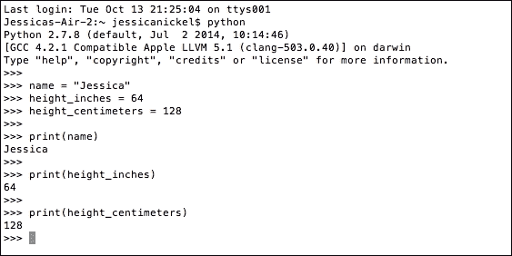

如果你分配给变量的值或记忆在 Python 终端中打印出来，那么就是完美的。如果没有，你可能有一个错误。由于许多原因，可能会发生错误。你可能以违反 Python 约定的方式输入了变量名或信息。一些常见的错误包括使用大写字母。

## 变量命名 - 遵循的约定

在 Python 中命名变量有一些约定。关于命名事物的指南可能看起来很愚蠢，但遵循这些约定非常重要，因为它有助于其他人阅读你的代码。此外，Python shell 被设计为与这些约定一起工作。

为了避免错误，你的变量名应该使用小写字母。如果你的变量由多个单词组成，例如`height_inches`变量，那么它应该使用下划线来连接单词。

如果你用两个单词来命名你的变量并且没有用下划线连接它们，你会得到一个错误。看看下面的截图，看看它说`SyntaxError: invalid syntax`在哪里。注意这个错误发生是因为`height centimeters`变量没有用下划线来连接单词：

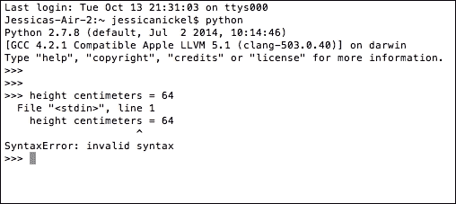

## 变量能记住什么？

Python 变量可以被编程来记住各种信息！你会在我们的原始示例中注意到，我们存储了一个单词然后是一个数字。我们将使用三种不同类型的信息来构建我们的计算器，在第三章，*计算这个*！，字符串、整数和浮点数。每条信息输入和输出的方式都略有不同。

### 字符串

在 Python 中，字符串是任何被两个单引号包围的数据，即这些符号`'` `'`。有时也会使用双引号。例如，我可以有一个看起来像这样的字符串变量：

```py
sentence = 'This is a sentence about Python.'

```

这个字符串变量包含字母和单词。大多数字符串变量都是这样。然而，只要这个数字在单引号中，你也可以把它作为一个字符串存储：

```py
 number_string = '40'

```

如果我们可以将所有信息作为字符串存储，为什么还需要其他数据类型呢？嗯，当我们把数字作为字符串存储时，我们不能对数字进行数学运算！把这个问题输入到你的 Python 壳中，然后你就会看到为什么我们除了字符串之外还需要数据类型：

```py
 first_number = '10'
 second_number = '20'
 print(first_number + second_number)

```

在你的 Python 壳中发生了什么？你可能预计打印的输出会是`30`，因为`10`加`20`等于`30`。然而，Python 把每个数字都看作是一个文本字符串，只是简单地把两个文本字符串并排放置。所以，你的结果可能是`1020`。这就是它在 Python 壳中的样子：

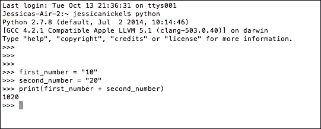

### 整数

计算机在数学方面真的很擅长，数学将使我们能够执行更复杂的程序，例如游戏。Python 将整个数字数据存储为整数。

让我们从整数开始：

+   整数就是一个简单的纯整数。如果我们想让变量存储整数，我们就去掉引号。

+   然后，当我们把两个变量相加并打印输出时，我们会得到一个数学结果。

尝试一下！让我们用这些变量做一些数学运算：

1.  在你的 Python 壳中输入以下两个变量：

    ```py
     first_number = 10
     second_number = 20

    ```

1.  然后，通过输入`print`和变量来打印输出：

    ```py
     print(first_number + second_number)

    ```

完成步骤 2 后，按*Enter*。你的结果应该是`30`。这是因为 Python 将数字读作整数，Python 理解带有数学运算符的整数。事实上，Python 对数学的理解如此之好，以至于你可能会注意到不需要等号来告诉 Python 输出答案。看看这个截图：

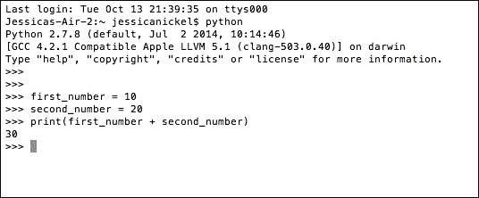

### 浮点数（浮点数）

希望你现在更好地理解了 Python 如何处理整数（整数）。然而，人和计算机通常需要使用分数数。在 Python 中，这些数字被称为**浮点数**，但许多人将其简称为*floats*： 

+   浮点数实际上是一种非常花哨的说法，即使用小数表示的*数字*

+   浮点数之所以被称为这样，是因为小数点可以在数字中的任何位置，允许有不同大小的分数

+   将数字设置为浮点数允许我们使用分数数进行更复杂的数学运算

+   要将变量设置为浮点数，你不需要做任何特殊或不同于设置整数的事情

+   Python 知道带有小数点的数字输入（例如变量）是浮点数，如果问题明确，Python 将输出答案作为浮点数

在你的 Python 壳中，尝试使用浮点数而不是整数来解决这个问题：

```py
 first_number = 10.3
 second_number = 20.3
 print(first_number + second_number)

```

这次，在你的 Python 壳中，你应该注意到 Python 已经识别变量 input 为浮点数，并且能够输出完整且正确的答案，而无需我们使用额外的指令。你的`print`语句的输出应该是`30.6`，正如你在 Python 壳的截图中所见：

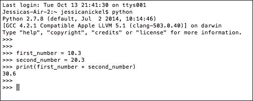

## 组合字符串、整数和浮点数

到目前为止，我们只尝试组合具有相同数据类型的项。我们添加了两个字符串、两个整数或两个浮点数。当你尝试添加不同类型的信息时会发生什么，比如一个字符串和一个整数？在你的 Python 壳中，输入以下代码行并注意输出：

```py
 first_number = '10'
 second_number = 20
 print(first_number + second_number)

```

你可能会注意到你收到的错误。需要关注的重要行是`TypeError: cannot concatenate 'str' and 'int' objects`。Python 告诉我们它不能处理这两种不同的数据类型，这是有道理的。所以，如果你在输入时出错或尝试在两种不同的数据类型中执行操作，你可能会得到这样的错误：

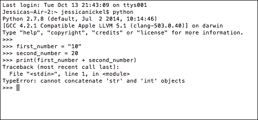

# 函数

一旦我们有了变量，我们就可以使用它们做一些非常有趣的事情。最有趣的事情是构建函数。Python 函数是我们可以构建以执行特定任务的代码块。我们只需构建一次这些函数，然后只需通过输入名称就可以在代码中重复使用它们。这非常有帮助。例如，如果我要编写一个程序来添加两个数字（例如计算器），我不想每次添加两个数字时都不得不编写三行或四行的代码。相反，我想编写一个可以相加两个数字的函数，然后在我需要添加数字时使用这一行。

在我们开始构建自己的函数之前，我们还需要知道 Python 有很多内置的令人惊叹的函数。Python 的一些函数是我们将经常使用的。其他的一些函数在这本书中不会讨论，但随着你成为一名更熟练的程序员，你将了解更多关于 Python 内置函数的知识。

## 内置函数

下面是一些关于内置函数及其作用的内容：

+   `int()`: 这将字符串或浮点数转换为整数

+   `float()`: 这将字符串或整数转换为浮点数

+   `raw_input()`: 这从用户那里获取信息并将其存储在计算机中以供以后使用

+   `str()`: 这将整数、浮点数或其他信息转换为字符串

+   `help()`: 这提供了访问 Python 的帮助

我们将在下一章中用这些函数来帮助我们构建我们的第一个项目。

### 注意

如果你好奇其他内置函数是什么，或者你想了解更多信息，你可以访问 Python 文档在 [`docs.python.org/2.7/library/functions.html?highlight=built%20functions#`](https://docs.python.org/2.7/library/functions.html?highlight=built%20functions#)。

初始时，文档可能看起来令人不知所措，因为它们非常详细。有时细节会使文档难以理解，但文档非常有帮助，并被许多程序员使用。

## 函数的组成部分

当你想构建自己的函数时，有一些基本部分需要考虑。首先，这是添加两个数字的基本函数：

```py
 def addition():
 first_number = 30
 second_number = 60
 print(first_number + second_number)

```

这段代码的第一行是新的，因此我们需要理解它的含义：

+   首先要注意的是单词 `def`。在 Python 中，这是 define 的缩写，用于定义一个新的函数。

+   下一个需要注意的事项是函数的名称。函数的命名规则与变量的命名规则相同。函数需要使用小写字母，并且当它包含多个单词时，每个单词之间需要使用下划线。

+   在 `addition()` 函数的名称之后，你会注意到括号 `()`。在这个函数中它们是空的，但有时它们不是空的。即使它们是空的，括号也必须是您创建的函数的一部分。

+   最后，函数的第一行以冒号结尾。冒号（`:`）标志着函数第一行的结束。

一个函数可以很短，比如这个 `addition()` 函数，总共只有四行，或者它可以非常长。Python 函数中第一行之后的每一行都需要使用空格缩进。在我们本章下一节构建自己的函数时，你将学习如何在 Python 命令行中设置缩进。我们还将讨论文本编辑器中的适当间距。

为了编写函数，有很多新的细节需要记住。如果你忘记了某个细节会怎样？如果你忘记缩进一行，Python 会告诉你并输出错误。你的函数将不会运行，你的代码将不会工作。Python 使用缩进的方式被称为**空白字符**，Python 中关于空白字符的使用有一些规则。

到现在为止，你对在 Python 中进行加法操作已经很熟悉了，所以我们将继续使用加法代码。在 Python shell 中编写函数有一些特殊的注意事项。因为函数是一段代码块，当我们试图在 shell 中执行函数时，想要遵循以下指南：

+   在输入第一行并按下*Enter*键后，确保在输入每一行之前按下*Tab*键。

+   当你完成所有行的输入后，按两次*Enter*键，这样 Python shell 就知道你已经完成了函数的创建。

在你的 Python shell 中，将`addition()`函数输入得与这里显示的完全一致：

```py
 def addition():
 first_number = 30
 second_number = 60
 print(first_number + second_number)

```

注意函数在 Python shell 中的样子：

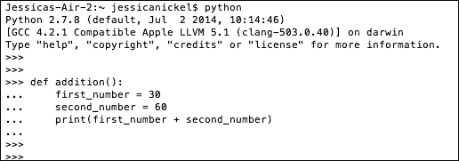

现在你已经输入了函数，你需要学习如何使用这个函数。要在 Python shell 中使用函数，输入函数的名称和括号：

```py
 addition()

```

输入函数也被称为调用函数。当你调用 Python shell 中的`addition()`函数并按下*Enter*键时，你会得到一个输出作为问题的答案。注意这里是如何显示的：

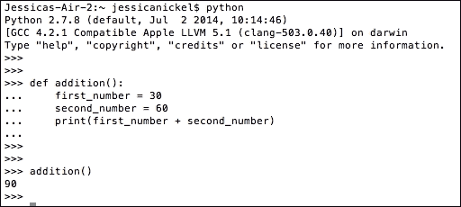

将你的结果与前面截图中的结果进行比较。一旦你知道你的函数按预期运行，你可以通过让他们查看你的代码来向你的父母和朋友展示。一个好的主意是通过用不同的数字重新输入函数来测试你的函数。

# 与你的程序交互的用户

我们刚刚构建了一个将两个数字相加的函数。学习编写执行数学运算的程序很有趣，但我们的函数有限，因为我们的`addition()`函数需要手动更改变量来计算不同数字的结果。

如果有一种方法可以从用户那里获取信息并将*该*信息存储在变量中，以便每次可以使用加法或减法函数来使用它，那会怎么样？任何使用过任何类型的计算器的人都知道这是可能的。Python 有一个名为`raw_input()`的函数，允许我们告诉程序向用户提问。`raw_input()`函数非常有用。我们可以通过这种方式从用户那里获取各种信息，并且可以根据用户输入与计算机进行交互。

我们可以使用 Python shell 来测试`raw_input()`函数的工作方式。尝试将这些两行代码输入到你的 Python shell 中：

```py
 name = raw_input('What is your name?')
 print(name)

```

这里发生了什么？让我们看看：

+   应该发生的事情是，你应该在终端中看到一个提示，询问 `'What is your name?'` 然后，你可以输入你的回答。

+   在你的回答后，按 *Enter*。什么也不会发生（现在不应该发生任何事情！）。

+   你已经给计算机提供了存储在 `name` 变量中的信息（一个内存），但现在你需要从 `name` 变量中获取信息。

+   你可以通过打印 `name` 变量来获取用户输入的内存输出。

在这个屏幕截图中，你可以看到 Python 壳中的整个序列：

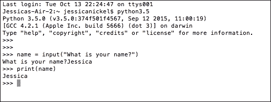

# 使用文本编辑器和命令行

到目前为止，我们使用 Python 壳来编写和测试代码。壳很棒，因为我们输入一行代码或甚至几行代码，然后立即运行它们以查看它们是否工作。然而，你可能已经注意到没有保存我们编写的任何代码的方法。

为了程序能够运行，它需要拥有所有可用的代码。使用文本编辑器就像写报告、电子邮件或论文一样：我们编写代码并保存它；然后，如果我们想修改，就回去编辑它。为了使 Python 使用并理解我们的文件，我们需要使用命令行并告诉 Python 运行该文件。

为了完成本书中的下一个任务以及剩余的任务，我们将同时使用我们的文本编辑器和终端/命令提示符。现在，让我们一起来了解一下文本编辑器和命令行的设置。

你需要做的第一件事如下：

+   创建一个特殊的文件夹，用于存放你的代码文件，并记住如何找到这个文件夹！（查看第一章，*欢迎！让我们开始吧*，获取说明。）

+   这个文件夹，或目录，非常重要，因为这将是你存放本书其余部分所创建工作的地方

+   Python 需要能够访问这个目录来运行所有程序，不久我们将编写使用其他文件的文件；因此，所有文件都需要生活在同一个地方

一旦你确定你有一个特殊的文件夹，你就可以打开我们在第一章中设置的文本编辑器程序，*欢迎！让我们开始吧*。你还会在终端或命令提示符中打开一个新窗口。

# 构建自己的函数 – name()

因此，你已经了解了变量以及它们如何存储信息。你还了解了这些变量如何在函数内部使用。最后，你学习了如何使用特殊的 Python 函数，如 `input()`，来帮助从用户那里获取信息并将其存储在计算机中。你现在可以使用变量和 `input()` 构建自己的函数。

## 设置你的项目文件

我们现在要构建的函数叫做 `name()`。这个函数的目的将是询问用户他们的名字，存储（记住）这个名字，然后向用户打印一条友好的信息。

要启动这个函数，请按照以下步骤操作：

1.  在你的文本编辑器中打开一个新文件。

1.  前往**保存**并命名文件为`name.py`。

    ### 小贴士

    你需要在所有代码文件末尾使用`.py`，这样文件才能在终端/命令提示符中运行。Python 只识别`.py`文件。

1.  将文件保存在你为所有 Python 工作创建的文件夹中。

## 开始你的项目

一旦你设置好了项目文件，你可能想要做的第一件事就是在你的文件中添加一条简短的注释。注释允许人类快速理解代码中正在发生的事情。无论你写的是非代码内容，都应该以井号（#）开始这一行。井号是告诉计算机“忽略这个！”的一种方式，但它允许人类阅读文本。在你的文件中输入以下行：

`# 这是我的第一个名为 name 的函数。它将询问名字并打印一条消息。`

## 编写代码

你接下来输入的行将开始计算机可读代码。首先，确保你写的注释和第一条计算机可读代码之间有一个空格。正如我们之前学到的，你将使用 Python 单词`def`来开始函数。然后，你将输入一个空格和函数名：

```py
 def name

```

接下来，你将在第一行添加括号`()`和冒号`:`：

```py
 def name():

```

现在，是时候进入下一行了。对于下一行，你需要进行缩进。使用空格键插入四个空格。在 Python 中，空格很重要。使用制表符键，或者混合使用制表符和空格，在 Python 中会引发错误。

由于我们正在请求用户输入他们的名字，如果你愿意，可以使用`first_name`作为变量名：

```py
 def name():
 first_name =

```

`first_name`变量将存储问题的答案，“你的名字是什么？”记住，尽管如此，我们必须使用`raw_input()`函数来获取用户回答问题！因此，我们将添加`raw_input()`函数和问题到代码中：

```py
 def name():
 first_name = input('What is your first name?')

```

到目前为止，我们已经编写了一种让计算机询问用户名字的方法，并且我们创建了一个名为`first_name`的变量来记住信息字符串。

尽管我们有一个包含一些代码行的文件，如果我们现在运行我们的代码，什么都不会发生。我们需要一种方法来向用户显示他们的名字，如果我们可以发送一个欢迎消息那就更好了。我们需要编写程序输出的代码。

我们一直在使用`print`从第一章，“欢迎！让我们开始吧”，以及在这一章中输出我们的信息，`print`在这里也很有用。我们可以告诉我们的函数打印`first_name`信息，并且我们可以将这条信息与一条友好的消息结合起来。将以下行添加到你的代码中：

```py
 print('So nice to meet you, ' + first_name)

```

`name()`函数的总代码应该看起来像这样：

```py
def name():
 first_name = input('What is your first name?')
 print('So nice to meet you, ' + first_name)

```

下面是程序在文本编辑器中的样子示例：

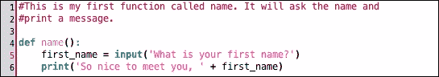

我们只需要添加最后一行代码，即调用 `name()` 函数。如果我们不调用函数，它将不会运行。要调用函数，你应在 `print` 后留一个空行，然后在新的行上缩进并输入 `name()`。看看这个代码示例，并将 `name()` 函数添加到你的代码中：

```py
def name():
 first_name = input('What is your first name?')
 print('So nice to meet you, ' + first_name)

name()

```

现在我们已经创建了此函数，我们可以用它来问候任何人，因为用户每次都会告诉我们 `first_name` 应该是什么。我们已经创建了一个可重用的代码块。

## 运行你的程序

现在你必须保存你的工作：

1.  前往你的文本编辑器的 **保存** 选项，并将 `name.py` 的工作保存。

1.  保存完这项工作后，你应该转到你的终端/命令提示符。

1.  确保你处于正确的文件夹中。

    ### 提示

    如果你不确定，你可以输入 `pwd`（Mac/Linux）或 `echo %cd%`（Windows）来找出你所在的文件夹。

1.  当你在与你的工作相同的文件夹中时，输入：

    ```py
     python name.py

    ```

1.  然后，按 *Enter*。你的程序应该开始运行。

输入名称后，输出应该看起来像这样：

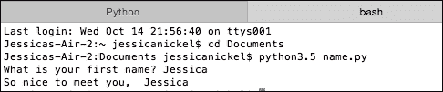

你现在有一个可以与家人和朋友分享的程序，他们会觉得非常神奇，特别是如果他们以前从未编程过的话！

# 走得更远一些

所以，如果你真的想理解所有这些，就走得更远一些！尝试你刚刚创建的代码，看看什么有效，什么无效。如果你遇到奇怪的错误，你总是可以将错误复制并粘贴到互联网搜索引擎中；我们迄今为止看到的大多数错误都发生在其他人身上。以下是一些帮助你实验并获得精通的提示：

+   更改输入问题

+   更改用户的消息

+   更改函数名

+   更改变量名

+   添加第二个变量和第二个输入问题

+   将第二个变量添加到输出问题中

# 一个快速的任务给你

现在你已经完成了这一章，你能回答这些问题吗？

Q1\. 函数必须以什么开始？

1.  def

1.  函数

1.  输入

1.  空白字符

Q2\. 用来命名变量和函数的约定有哪些？

1.  必须使用小写字母

1.  多个单词需要用下划线连接

1.  不能以数字开始命名

1.  所有上述

Q3\. 函数的第一行之后的每一行必须是什么？

1.  使用数字命名

1.  有一个冒号，: 

1.  缩进

1.  使用括号 ()

Q4\. 如果你想让代码文件在 Python 中运行，你需要以什么结束？

1.  .txt

1.  .odt

1.  .pdf

1.  .py

Q5\. 在终端中运行代码文件，你需要做什么？

1.  在终端中输入文件的名称

1.  在运行 Python 时，在终端中输入文件名

1.  在正确的文件夹中，输入 Python 和文件名

1.  所有上述步骤按顺序

# 摘要

在本章中，我们学习了如何将信息存储在变量中，以便计算机可以在以后记住它。我们学习了如何使用变量来创建一个可以将两个预编程数字相加的函数。然后，当我们学习如何让计算机提问并记住用户的答案时，事情变得有趣起来！使用`raw_input()`，我们学习了如何将答案作为变量存储起来，以便在我们一起构建的`name()`函数中使用。我们开始将我们的工作保存在`.py`文件中，这样我们就可以在我们的终端/命令提示符中运行和重新运行我们的文件，而无需每次都重新输入文件。

在下一章中，你将构建一个四功能计算器，在命令行中运行，使用本章所学到的所有技能！
