# 第六章. 处理数据 – 列表和字典

在上一章中，你学习了如何使用详细的逻辑编写循环，以帮助你的程序做出决策。到目前为止，你还没有学习如何处理数据。我们还没有创建或存储数据。然而，我们知道视频游戏会存储数据！视频游戏有时会存储玩家的名字以及玩家所达到的最高分数。一个计算机程序是如何记住所有这些信息的呢？在本章中，你将了解一些 Python 存储和检索数据的方法，例如列表和字典。

对于本章的练习和代码，你的 Python shell 将是最好的工具，这样你可以输入你的列表和字典，然后检查你的编码结果。否则，一旦你的提示符可用，你可以输入列表和字典，你的 shell 将记住你输入的信息，然后你可以测试如何检索、添加和删除信息。

### 注意

如果你在本章的任何时间关闭 Python shell，你所有的工作都将丢失。Python shell 不会在会话之间记住信息，因此列表和字典不会被保存。

# 列表

列表在编码中有许多不同的用途，并且可以对列表执行许多不同的操作，这得益于 Python。在本章中，你将只了解列表的许多用途中的一些。

### 注意

如果你想要了解更多关于列表的信息，Python 文档非常详细，可以在[`docs.python.org/3/tutorial/datastructures.html?highlight=lists#more-on-lists`](https://docs.python.org/3/tutorial/datastructures.html?highlight=lists#more-on-lists)找到。

首先，一些关于 Python 列表的事实：Python 列表是可变的。这意味着列表中的数据可以被更改。可以使用直接作用于列表的函数添加或删除项目。此外，列表中的项目可以混合在一起。数字、浮点数和字符串都可以在同一个列表中。

## 列表的组成部分

列表，像其他类型的数据一样，被分配给一个变量。然后，列表项被放置在`[ ]`中：

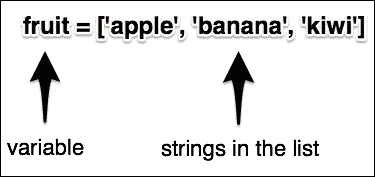

在你的 Python shell 中，输入以下三个列表，每个列表一行：

```py
fruit = ['apple', 'banana', 'kiwi', 'dragonfruit']
years = [2012,  2013,  2014,  2015]
students_in_class = [30,  22,  28,  33]

```

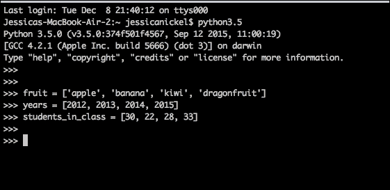

你输入的每个列表内部都包含特定类型的数据。`fruit` 列表包含字符串，`years` 列表包含整数，而 `students_in_class` 列表也包含整数。然而，列表的一个特点是它们可以在同一个列表中混合不同的数据类型。例如，我创建了一个包含字符串和整数的列表：

```py
computer_class = ['Cynthia', 78, 42, 'Raj', 98, 24, 35, 'Kadeem', 'Rachel']

```

## 使用列表

现在我们已经创建了列表，我们可以以多种方式处理列表的内容。实际上，一旦你创建了一个列表，计算机就会记住列表的顺序，并且顺序会保持不变，直到有意地更改。我们检查列表顺序是否保持不变的最简单方法是运行我们已创建的`fruit`、`years`、`students_in_class`和`computer_class`列表的测试。

Python 列表的第一个项目始终被计为**0**（**零**）。因此，对于我们的第一个测试，让我们检查请求项目`0`是否确实给出了我们列表中输入的第一个项目。使用我们的`fruit`列表，我们将在`print`语句中输入列表名称，然后添加方括号`[]`和数字`0`：

```py
 print(fruit[0])

```

你的输出应该是`apple`，因为苹果是我们之前创建的列表中的第一种水果：

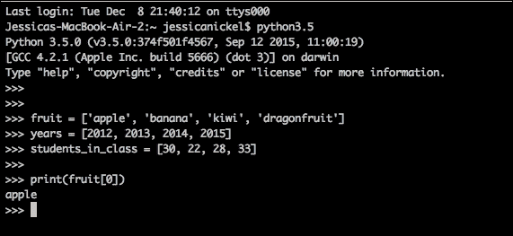

现在，我们有证据表明 Python 中的计数确实从`0`开始，而且我们的列表编写正确。接下来，我们可以尝试打印`fruit`列表中的第四个项目。你会注意到我们在`print`命令中输入的是`3`。这是因为第一个项目从`0`开始。将此代码输入到你的 Python 壳中：

```py
 print(fruit[3])

```

你的结果是什么？你是否预期答案是`dragonfruit`？如果是这样，很好，你正在学习如何计算列表中的项目。如果不是，请记住列表中的第一个项目是项目`0`。通过练习，你将更好地学会在短 Python 列表中计数项目：

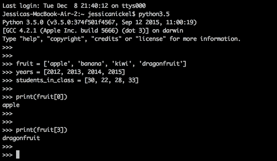

为了额外练习，使用我们之前创建的其他列表，并尝试使用此代码样本从这些列表中打印不同的项目：

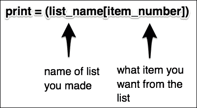

在代码中提到`list_name`的地方，写下你想要使用的列表名称。在代码中提到`item_number`的地方，写下你想要打印的项目编号。记住，列表从`0`开始计数。

## 更改列表 – 添加和删除信息

即使列表保持其顺序，它们也可以被更改。可以向列表中添加项目，从列表中删除它们，或者更改它们。再次强调，与列表交互的方式有很多。我们在这里只会讨论其中的一些，但你总是可以阅读 Python 文档以获取更多信息。

### 向列表中添加项目

例如，要向我们的`fruit`列表中添加一个项目，我们可以使用一个名为`list.append()`的方法。要使用此方法，请输入列表名称，一个点，方法名称`append`，然后输入括号，并在其中放入你想要添加的项目。如果项目是字符串，请记住使用单引号。输入以下代码将`orange`添加到我们已创建的水果列表中：

```py
 fruit.append('orange')

```

然后，打印水果列表以检查`orange`是否已添加到列表中：

```py
 print(fruit)

```

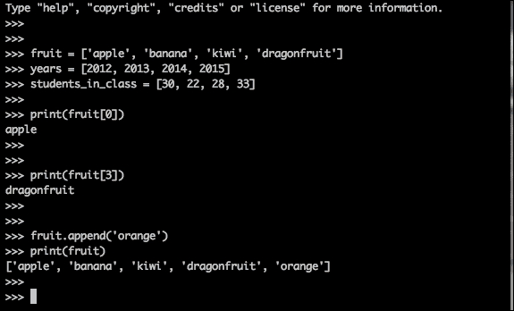

### 从列表中删除项目

现在，假设我们不再希望`dragonfruit`出现在我们的列表中。我们将使用一个名为`list.remove()`的方法。为此，我们将输入我们列表的名称，一个点，`remove`方法名称，以及我们希望移除的项的名称：

```py
 fruit.remove('dragonfruit')

```

然后，打印列表，确认`dragonfruit`已被移除：

```py
 print(fruit)

```

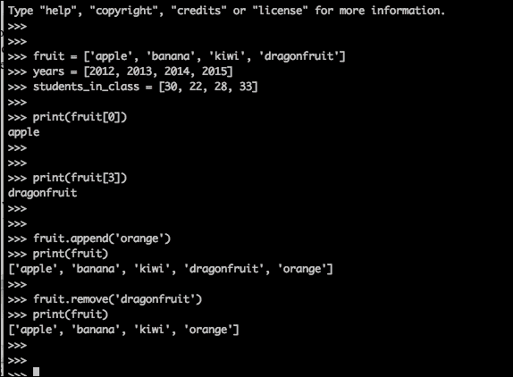

如果你列表中有多个相同的项，`list.remove()`只会移除该项的第一个实例。具有相同名称的其他项需要单独移除。

## 列表和循环

列表和`for`循环配合得非常好。使用列表，我们可以做一种叫做**迭代**的事情。单独来说，这个词的意思是重复一个过程。我们知道`for`循环会有限制和特定次数地重复。因此，我们可以使用`for`循环来遍历项目列表。

在这个示例中，我们的列表中有三种颜色。在你的 Python 壳中创建这个列表：

```py
colors = ['green', 'yellow', 'red']

```

使用我们的列表，我们可能会决定对于列表中的每种颜色，我们想要打印出`I see`这个语句并添加我们列表中的每种颜色。通过使用颜色列表的`for`循环，我们只需输入一次`print`语句，就会返回三个句子。在你的 Python 壳中输入以下`for`循环：

```py
 for color in colors:
 print('I see  ' + color  +  '.')

```

你会注意到，在代码的第二行，我们使用加号运算符（`+`）将字符串相加。第一个字符串`I see`是每个句子的开头。第二个字符串`color`来自我们编写`for`循环时创建的变量。第三个字符串是一个句号（`.`）来结束句子。一旦你输入完打印行并按下两次*Enter*键，你的`for`循环就会开始运行，你应该会在你的 Python 壳中看到以下语句被打印出来：

```py
 I see green.
 I see yellow.
 I see red.

```

注意，打印的句子按照它们在列表中出现的顺序打印颜色。顺序在列表中得到了保留：

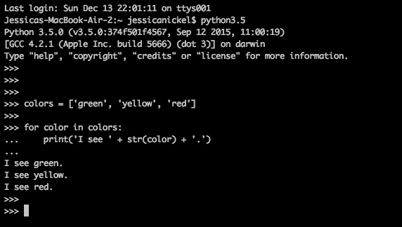

如你所想，列表和`for`循环结合使用时非常强大。我们不需要输入三行代码，每行代码都不同，我们只需输入两行代码。

我们的`for`循环，仅用这两行代码，如果列表中有二十种颜色甚至两百种颜色也能正常工作。我们将在下一章和迷你游戏中进一步探索使用列表的强大功能。

# 字典

**字典**是组织数据的一种不同方式。乍一看，字典可能看起来就像一个列表。然而，字典与列表有不同的任务、规则和语法。

字典的组成部分，就像列表一样，字典也有不同的组成部分需要使用来使它们工作——名称，使用花括号来存储信息。例如，如果我们想创建一个名为`numbers`的字典，我们将把字典条目放在花括号内。以下是一个简单的示例，你可以将其输入到你的 Python 壳中：

```py
numbers = {'one': 1, 'two': 2, 'three': 3}

```

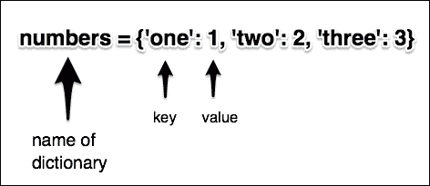

## 字典中的键/值对

如前一个截图所示，字典使用称为**键**和**值**的事物来存储信息。例如，在一个物品字典中，我们可能有键告诉我们每个物品的名称，以及值告诉我们我们在库存中有多少个这样的物品。一旦我们将这些物品存储到我们的字典中，我们就可以添加或删除新物品（键），添加新的数量（值），或者更改现有物品的数量。如果您曾经使用过电子邮件或智能手机中的联系人列表，您可能会发现它与键（人的名字）与值（他们的电子邮件 ID 或电话号码）相匹配。键和值不一定要是字符串和整数的格式，但为了我们下一个示例，我们将使用字典来存储一个游戏英雄在任务中可能拥有的所有物品。

以下是一个可以存储游戏信息的字典示例。假设我们游戏中的英雄有一些生存所需的物品。以下是我们的英雄物品的字典；将此物品字典输入到您的 Python 壳中：

```py
items = {'arrows' : 200, 'rocks' : 25, 'food' : 15, 'lives' : 2}

```

现在我们有一个提供关于我们的英雄拥有的物品信息的字典。与列表不同，字典不会按它们被输入的顺序保留项目。您可以通过多次打印一个小字典并注意结果来看到这一点。要打印字典，我们输入`print`，然后在打印语句中放置字典的名称：

```py
print(items)

```

您会注意到代码的输出结果与您输入的顺序不同。它可能会以相同的顺序打印，但更有可能以不同的顺序打印。请看下面的截图作为示例：

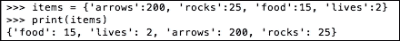

因此，我们的字典有诸如`arrows`、`rocks`、`food`和`lives`这样的键。存储为值的每个数字都告诉我们我们的英雄有多少个物品。要找出键的值，我们使用一个包含`items`字典名称和`arrows`键的`print`语句。注意，`arrows`键放在方括号中。语法很重要。在您的 Python 壳中输入以下代码以返回`arrows`的值：

```py
print(items['arrows'])

```

这个`print`语句的结果应该输出`200`，因为这代表我们的英雄在库存中有 200 支箭：

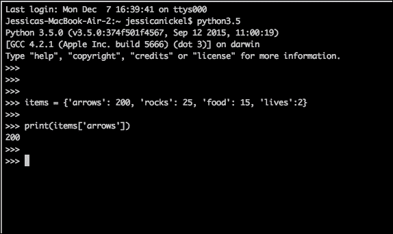

## 修改字典 – 添加和删除信息

Python 有几种与字典数据交互的方式。有许多我们可以使用的函数。现在，我们将专注于那些允许我们从字典中添加和删除东西的函数。

### 注意

要了解所有字典方法，请访问[`www.tutorialspoint.com/python/python_dictionary.htm`](http://www.tutorialspoint.com/python/python_dictionary.htm)。

### 向字典中添加物品

考虑一种情况，在我们的游戏中，我们允许玩家在游戏后期发现和收集火球。要向字典中添加一个项目，我们将使用所谓的**下标**方法向我们的字典添加一个新的键和新的值。

要创建一个下标，我们将使用字典的名称。然后，在方括号中，我们写下我们希望添加的项目（键）的名称。项目是字符串类型，所以它需要用单引号括起来。最后，我们将值设置为我们要放入字典中的项目（键）的数量。要将火球添加到你的字典中，请在你的 Python 命令行中复制以下代码：

```py
 items['fireball'] = 10

```

如果你打印了整个项目字典，你会看到`fireball`已经被添加。在你的 Python 命令行中输入以下代码：

```py
 print(items)

```

你的结果应该包括`fireball`作为其中一项。然而，请记住，你的代码可能不会和这本书中的代码顺序相同，因为字典不记得顺序：

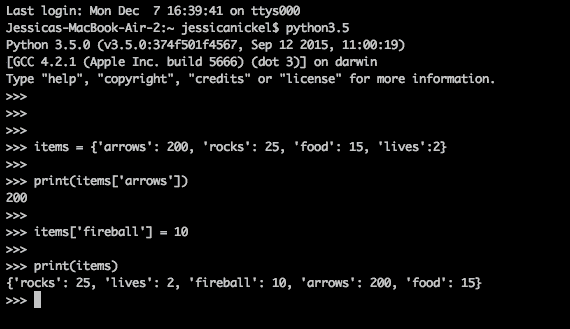

## 更改现有项目的值

我们还可以更改字典中键的值。例如，假设我们的英雄在游戏中收集岩石，然后因为它们用来建造岩石墙而失去了岩石。我们的游戏将如何跟踪游戏中库存中添加或删除的每一块岩石？

`dict.update()`方法允许我们更改字典中键的值。对于我们的字典，我们将更改岩石的值，因为我们的英雄收集或使用岩石。要使用`dict.update()`，我们将`dict`替换为我们的字典名称，即`items`。然后，在括号`()`中，我们使用`{}`来输入我们希望更新其值的项目的名称。

我们使用冒号（`:`）然后写下我们希望在字典中看到的新项目数量。在你的 Python 命令行中试一试：

```py
 items.update({'rocks':10})
 print(items)

```

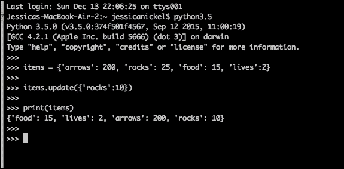

你会注意到，如果你执行了`print(items)`函数，你现在将有`10`块岩石而不是`25`。我们现在已经成功更新了物品的数量。

### 从字典中删除项目

要从字典中删除某个东西，你必须引用键或项目的名称，然后删除该项目。这样做，与项目相关的值也会被删除，因为键和值是配对的。

在 Python 中，`del`语句可以用来从字典中删除键/值对。这意味着使用`del`加上字典的名称和你要删除的项目（键）的名称。

让我们以`items`字典为例。我们将使用`del`语句，`items`字典的名称，以及放在方括号内的`lives`键的名称。因此，我们可以使用`print`语句来测试和检查`lives`键是否与`lives`的值`2`一起被删除：

```py
 del items['lives']
 print(items)

```

如果你的`del`语句起作用了，`lives`键不再在字典中，`lives`的数量也不再是`2`。这就像从印刷的字典中删除一个单词一样。如果你删除了单词，你还需要删除定义。项目列表现在看起来是这样的：

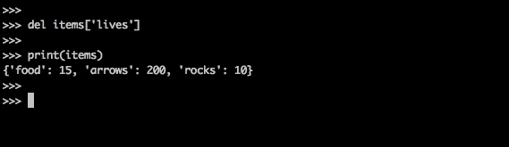

与列表相比，字典在存储和检索信息方面有所不同，但我们仍然可以执行添加和删除信息以及更改信息的相同操作。

# 列表或字典

你已经学习了两个伟大的 Python 数据结构，列表和字典。现在，我们需要知道何时使用这些工具。虽然这两个工具都存储信息，但它们以非常不同的方式存储。让我们比较这两个结构，以便我们更好地理解每个结构如何被使用。

当我们想要跟踪项目并需要记住这些项目的顺序时，列表是很好的选择。我们在日常生活中使用了很多符合这些标准的列表。

以下是一些列表的示例：

+   包含不同食品项目的购物清单

+   MP3 播放器中歌曲标题的列表

+   图书馆中可用的小说书名列表

+   网站上可供购买的项目列表

这些事物都有一定的顺序，这是一个理想的特性，列表中的项目可以添加或删除。如果我们想用 Python 编写一个简短的程序来跟踪我们的小说书名或查找 MP3 播放列表中的歌曲，列表可能是一个好的起点。

列表可以与循环一起使用来完成许多强大的功能。其中一些包括使用循环创建自己（是的，真的）的列表或从大量用户输入中创建列表。由于它们会自动从开始搜索，列表的搜索速度较慢。

当数据不需要顺序但需要与其他事物配对时，字典更有用。例如，也许你拥有小说和非小说书籍，你想编写一个程序来存储标题、作者和类型。使用字典会更好，这样你可以快速根据书名找到作者，或者找到你拥有的所有小说书籍。你还可以与你的字典交互来做出更改。此外，由于它们不需要从头开始搜索，字典可以非常快速地进行搜索。

### 注意

编程中使用的字典示例是*同义词词典*。这是一个列表的字典。

# 一个快速的任务

现在你已经熟悉了列表和字典，这里有一个快速的任务来检验你的知识。

Q1. 创建字典时应该使用什么正确的语法？

1.  ( )

1.  { }

1.  " "

1.  [ ]

Q2. 一个列表中可以包含哪些类型的数据？

1.  只有字符串

1.  只有浮点数

1.  整数和浮点数

1.  所有数据类型都可以包含在列表中

Q3. 创建列表时应该使用什么正确的语法？

1.  ( )

1.  { }

1.  " "

1.  [ ]

# 摘要

在本章中，你学习了如何创建自己的列表和字典。你还尝试了对列表和字典进行一些基本操作，包括如何添加和删除数据。最后，你学习了列表和字典之间的语法差异以及列表和字典的最佳使用方法。

在下一章中，我们将继续前进，制作一个名为 *我的背包里有什么？* 的游戏。这个游戏将是一个简单的两人游戏，要求两个用户将一些物品放入背包中，然后允许每个用户猜测另一个用户背包里的内容。

我们将编写代码向列表中添加项目，跟踪用户名、物品和分数在列表和字典中，然后使用 `for` 循环来跟踪游戏。我们下一款游戏有很多组成部分，制作一个有两名玩家的游戏将会非常有趣！你准备好了吗？让我们开始吧！
