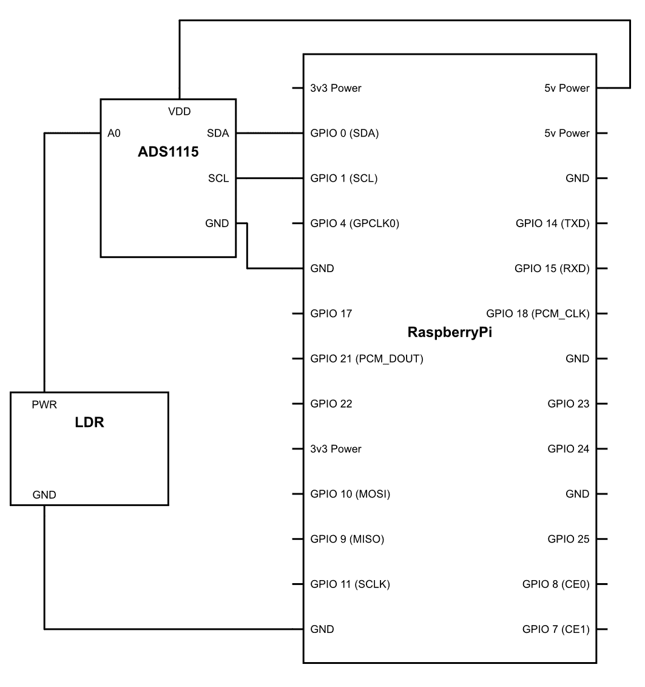

# 第二章：使用 GPIO 作为输入

在上一章中，我们了解了 GPIO 是如何用于输出的。但是，正如其名称所暗示的，GPIO 可以用于输入和输出两种目的。在本章中，我们将看到如何使用这些引脚将数据输入到树莓派。

本章我们将涵盖的主题是：

+   深入了解 GPIO

+   PIR 传感器的接口

+   超声波接近传感器的接口

+   通过 I2C 进行接口

# 深入了解 GPIO

我相信你记得上一章中的这一行代码：

```py
GPIO.setup(18,GPIO.OUT)
```

如前所述，这基本上告诉我们 GPIO 引脚在某个程序中的行为。到现在，你可能已经猜到了，通过更改这一行代码，我们可以改变引脚的行为，将其从输出转换为输入。这就是你应该如何做：

```py
GPIO.setup(18,GPIO.IN)
```

一旦你在程序中写下这一行代码，微控制器就会知道在程序运行期间，引脚号`18`将仅用于输入目的。

为了理解这实际上是如何工作的，让我们回到我们的硬件，看看它是如何实现的。首先，你需要将一个 LED 连接到任何一个引脚上；在这个程序中，我们将使用引脚号`23`。其次，你需要将一个开关连接到引脚号`24`。你可以参考下面的图示来制作连接：


一旦连接好，就可以继续编写这个程序：

```py
import time import RPi.GPIO as GPIO
GPIO.setmode(GPIO.BCM)
GPIO.setup(24,GPIO.IN)
GPIO.setup(23,GPIO.OUT)
while True:
  button_state = GPIO.input(24)
    if button_state == True:
      GPIO.output(23,GPIO.HIGH)
    else:
      GPIO.output(23,GPIO.LOW)
  time.sleep(0.5)
GPIO.cleanup()
```

程序上传后，一旦按下按钮，LED 就会自动点亮。

让我们了解究竟发生了什么。`while True:`基本上是一个无限循环；一旦应用了这个循环，循环内部的代码会一直重复执行，直到某个中断使其停止并退出。现在，理想情况下，我们通过按下*Ctrl* + *C*来退出程序。

```py
button_state = GPIO.input(24)  
```

在上述行中，程序理解了它需要查找的位置；在这个程序中。在这一行中，我们告诉程序我们在寻找 GPIO `24`，它是一个输入：

```py
if button_state == True:
   GPIO.output(23,GPIO.HIGH)  
```

如果按钮处于高电平状态，换句话说，当按钮被按下且电流达到引脚号`24`时，GPIO 引脚号`23`将被设置为高电平：

```py
  else:
   GPIO.output(23,GPIO.LOW)
```

如果引脚号`24`不是真的，它将遵循这一行代码，并将引脚号`23`保持低电平，换句话说，关闭。

因此，这就是你使用 GPIO 进行输入目的的第一个程序。

# PIR 传感器的接口

到目前为止，一切顺利！在本单元中，我们将继续接口我们的第一个传感器，这是一个被动红外传感器，通常称为 PIR 传感器。这个传感器是一个非常特殊的传感器，在自动化项目中非常常用。它低能耗的特性使其成为物联网项目的绝佳候选者。那么，让我们看看它是如何工作的。

你一定注意到了，当我们把金属加热到高温时，它会逐渐变成暗红色，当我们进一步加热时，它会变得更亮，并逐渐从红色变为黄色，如以下所示，该图显示了红热的钢片。现在，随着温度的升高，发出的辐射波长减小；这就是为什么随着温度的升高，颜色从红色变为黄色，因为黄色的波长比红色短。


但有趣的部分是，即使物体没有足够加热，它们也会发出辐射；事实上，任何高于绝对零度的物体都会以某种形式发出辐射。有些我们可以用肉眼看到，而有些则不能。因此，在室温下，物体发出红外辐射，其波长比可见光长。因此，我们用眼睛看不到它。尽管如此，它仍然存在。

这个 PIR 传感器所做的是，它感知周围物体的红外光，每当物体移动时，它都能感知其模式的整体变化，并根据这个变化检测其附近是否发生了任何运动。

我们假设只要房间里有人，就会有一些固有的运动发生，因此这种传感器非常常用作占用传感器。现在，让我们连接这个传感器，看看我们如何使用它：


一旦按照前面的图连接好，就可以上传代码了：

```py
import time import RPi.GPIO as GPIO
GPIO.setmode(GPIO.BCM)
GPIO.setup(23,GPIO.IN) 
GPIO.setup(24,GPIO.OUT)
while True:
 if GPIO.input(23) == 1: 
  GPIO.output(24,GPIO.HIGH)
 else: 
  GPIO.output(24,GPIO.LOW)

 time.sleep(1)
GPIO.cleanup()
```

现在，让我们看看发生了什么。逻辑非常简单。一旦 PIR 传感器检测到运动，它就会将其输出引脚转为高电平。我们只需要监控那个引脚，基本上就是这样。

逻辑与按钮开关完全相同，它将以类似的方式工作。所以不需要太多解释。

# 超声波接近传感器的接口

首先，让我们从基础知识开始。接近传感器是一种能够感知物体与其之间距离的传感器。为了完成这项任务，有一个充满传感器的宇宙可供选择，还有许多技术使我们能够做到这一点。正如其名称所示，超声波接近传感器是基于超声波原理工作的。其工作原理非常容易理解。超声波传感器发送一束超声波；这些波对人类耳朵来说是听不到的，但无论如何，它仍然是一种声波，并且它也像声波一样表现。

现在，正如我们所知，声音会在不同的表面上反弹并形成回波。当你在一个空房间里说话时，你必须已经体验过这种回声。你可以听到自己的声音，但会有轻微的延迟。这种延迟是由声音的属性造成的。声音是一种波，因此它有速度。声波有一个固定的传播速度。因此，为了覆盖特定的距离，它们需要一些时间。通过计算这个时间，我们可以推导出声波在从表面反弹之前走了多远。

类似地，在这个传感器中，我们向特定方向发射超声波，然后感应回波。自然地，接收回波会有延迟；延迟与物体从传感器到距离成正比，基于这个延迟，我们可以轻松计算出距离。

现在，要使用接近传感器，我们需要了解传感器的物理结构，以便正确布线。传感器有四个引脚，它们是：

+   VCC（正）

+   触发

+   回波

+   GND（地）

显然，我没有必要解释 VCC 和地的作用。那么，让我们直接进入触发部分。每当引脚处于高电平 10 微秒时，超声波传感器将向目标发送 8 个周期的 40 kHz 声波。一旦触发周期完成，**ECHO**被设置为高电平。一旦接收到回波信号，**ECHO**引脚被设置回低电平。以下是实际发生过程的示意图：


目前我们只需要知道这些。随后，随着我们的学习深入，我们将了解更多内容。现在，为了使它生效，请按照以下图示进行连接：


一旦建立连接，以下是需要运行的代码：

```py
import RPi.GPIO as GPIO
import time

GPIO.setmode(GPIO.BCM)
GPIO.setup(23,GPIO.OUT) 
GPIO.setup(24,GPIO.IN) 

while True:
     pulse_start = 0
     pulse_stop = 0
     duration = 0
     distance = 0

     GPIO.output(23,GPIO.LOW)
     time.sleep(0.1) 
     GPIO.output(23,GPIO.HIGH)
     time.sleep(0.000010)
     GPIO.output(23,GPIO.LOW)

     while GPIO.input(24)==0:
         pulse_start = time.time()

     while GPIO.input(24)==1:
         pulse_stop = time.time()

     duration = pulse_stop - pulse_start

     distance = duration*17150.0
     distance = round(distance,2)
     print ("distance" + str(distance)) 

     time.sleep(0.2)
}
```

现在，一旦运行此程序，屏幕上的输出将每 0.2 秒显示一次物体的距离。现在，你可能想知道这些读数是如何通信的：

```py
GPIO.setup(23,GPIO.OUT) 
```

我们将引脚`23`分配给传感器，以便在需要时向**TRIGGER**引脚发送脉冲：

```py
GPIO.setup(24,GPIO.IN)
```

我们将引脚`24`分配来接收逻辑，以确认回波信号的接收：

```py
pulse_start = 0
 pulse_stop = 0
 duration = 0
 distance = 0
```

我们将使用前面的变量，并且每次循环开始时，我们都会给它们赋一个值，这个值是`0`；这是为了清除程序执行过程中存储的先前读数：

```py
GPIO.output(23,GPIO.HIGH)
  time.sleep(0.000010)
  GPIO.output(23,GPIO.LOW)
```

我们将触发引脚`23`保持高电平 0.000010 秒，以便超声波传感器可以发送一个短暂的超声波脉冲：

```py
  while GPIO.input(24)==0: 
 pulse_start = time.time()
```

这个 while 语句将记录`pulse_start`变量的时间，直到时间引脚`24`变低。最终的时间读数将存储在`pulse_start`变量中，就像记录脉冲发送的时间一样：

```py
while GPIO.input(24)==1:
 pulse_stop = time.time()
```

在这个循环中的`while`语句将开始记录当引脚`24`上的输入为高电平时的时间，并且它将一直记录时间，直到引脚`24`保持高电平。最终的时间读数将存储在`pulse_stop`变量中，就像记录脉冲接收时的时间一样：

```py
 duration = pulse_stop - pulse_start
```

在这个语句中，我们正在计算脉冲从传感器传到物体并反弹回传感器所需的总时间：

```py
 distance = duration*17150.0
```

这是一个制造商给出的算术公式，用于将超声波传播所需的时间转换为厘米的实际距离。你可能会问我们是如何得到这个方程的？

让我简要介绍一下。用基础物理学，我们会记住这个简单的方程：*Speed* = *Distance* / *Time*。

现在你可能也记得声音的速度是每秒 343 米。现在 1 米有 100 厘米，因此为了将这个速度转换为每秒厘米，我们必须将速度乘以 100，因此速度将是每秒 34,300 厘米。

现在我们知道了方程的一个元素，即速度。所以让我们把速度的值放入方程中。现在方程看起来可能像这样：*34,300* = *Distance* / *Time*。

现在我们知道了一个事实，即声音传播的距离是实际距离的两倍。为什么？因为声音首先从传感器传到物体上。然后它从那个表面反弹回来并到达传感器。所以本质上它覆盖了双倍的距离。因此，为了适应这个方程，我们必须进行一个小小的改动：*34,300* / *2* = *Distance* / *Time*

现在我们从这个方程中想要得到的是距离，所以让我们把其他所有部分移到另一边。现在公式看起来可能像这样：*17,150* * *Time* = *Distance*

所以这里就是我们得到距离的公式。

```py
distance = round(distance,2)
```

由于超声波传播的距离是实际距离的两倍（一次是向物体移动，第二次是反弹回传感器），我们将其除以二以得到实际距离：

```py
print 'Distance = ',distance
```

最后，我们将通过以下语句打印出测量的距离。任何在引号`'...'`中的内容都将按照原样写入。然而，`distance`没有引号，并且`distance`是一个变量。因此，存储在`distance`中的变量将在屏幕上的最终输出中写入：

```py
 time.sleep(0.25)
```

代码将在这一行暂停 0.2 秒。如果我们没有这个暂停，那么值将以难以置信的速度出现，这将很难阅读或理解。如果你在尝试，我建议移除这个语句并运行代码看看会发生什么。

# 通过 I2C 接口

到目前为止，一切顺利。电子电路可以非常有趣，虽然它们看起来非常复杂，但往往我们发现它们的工作可以非常简单。在上一个部分中，我们一次接口一个传感器。我们可以继续接口多个传感器，但我们受限于现有的 GPIO 数量。我们也看到，一些传感器，如超声波传感器，可能需要多个 GPIO 引脚来工作。这进一步减少了我们可以与微控制器接口的传感器数量。一旦我们转向更复杂的电路，我们也会意识到布线可能真的会很混乱，如果出现问题，找到问题所在将是一项繁琐的任务。

现在，我们在设计机器人系统时面临的一个更大的问题是定时问题——系统中的所有工作都必须同步。大多数系统目前都是顺序性的，就像一个单元的输出成为另一个单元的输入：


现在，为了完成任务，**处理单元 1**必须在需要时向**处理单元 2**提供输入，对**处理单元 3**也是如此。如果数据没有完美地定时，那么**处理单元 2**将一直等待来自**处理单元 1**的输入，或者更糟糕的是，**处理单元 1**将在不需要时将数据发送给**处理单元 2**。在这种情况下，数据将丢失，过程将出现一些错误。

因此，为了解决这个问题，早期的计算机科学家发明了一种脉冲系统。时钟脉冲是一个非常简单的占空比为 50%的方波（回忆**脉冲宽度调制**（**PWM**））。电路被设计成在时钟脉冲的上升沿或下降沿执行一个操作。由于这种同步，电路的每个部分都知道何时工作。以下是时钟脉冲的外观：


现在，回到要点，我们有两个问题：

+   机器人可以连接的设备/传感器的数量有一个物理限制

+   如何同步传感器和互联电路以协同工作

为了解决这些问题，我们使用一个非常常用的协议，称为**I2C**，代表**内部集成电路**。当我们需要在相同的 GPIO 组上连接多个设备时，这个协议非常有用，例如当我们只有一组 GPIO 引脚，而多个传感器可以通过这些引脚连接时。这是由于每个硬件都分配了独特的地址而成为可能的。这个地址用于识别传感器，然后相应地与之通信。现在，为了实现 I2C 协议，我们需要两条线；这些线如下所示：

+   数据

+   时钟

如你所猜，时钟线用于向连接到它的设备发送时钟脉冲，而数据则是数据在其中的来回流动的总线。

现在，整个 I2C 架构都是基于主从配置工作的，其中主设备始终为从设备生成时钟信号，而从设备必须不断寻找主设备发送的时钟脉冲和数据包。让我们看看它是如何实现的。

如前所述，有两根线：数据线，被称为**串行数据**（**SDA**），和时钟线，被称为**串行时钟**（**SCL**）。从现在起，我们将使用 SCL 和 SDA 这两个术语：


让我们看看图中显示的主要指针：

+   **启动条件**：为了开始通信，会创建一个启动条件，表示即将发生通信。这个条件是通过主设备在 SCL 之前保持 SDA 线低电平来表示的。这表示所有从设备都准备好通信。

+   **地址帧**：一旦通信开始，主设备会发送需要通信的设备的地址。这是一个 7 位地址。在每一个时钟脉冲中，发送一个比特，因此需要七个时钟脉冲来发送 7 位地址。之后，7 位地址后面是一个读写位。这表示主设备在这个操作中是想写入还是想读取一些数据。因此，整个地址帧是 8 位，需要八个时钟脉冲来发送。在这八个脉冲之后，在第九个时钟脉冲期间，主设备等待设备的确认。这个确认是由被寻址的从设备通过拉低 SDA 线来发送的。通过这种策略，主设备知道它发送的地址已经被接收，从设备现在已准备好通信。如果确认没有发送回来，那么主设备需要决定接下来要做什么。

+   **数据帧**：一旦发送了确认，根据是读操作还是写操作，数据要么由主设备写入从设备，要么在读取操作中，数据由从设备发送到主设备。这个数据帧的长度可以是任意的。

+   **停止帧**：一旦数据传输完成，主设备会设置停止条件来指示通信必须停止。这个条件是在 SCL 线从低电平变为高电平之后，SDA 线也从低电平变为高电平时设置的。

这基本上就是 I2C 通信的工作原理。对于每个设备，我们有一个 7 位地址，因此我们可以在单个总线上连接多达 128 个设备。这有很多设备。物理极限用完的可能性几乎可以忽略不计。现在让我们看看我们如何通过此协议连接传感器。通常，不需要为 I2C 进行核心编程，因为这既长又繁琐。这就是开源的魔力所在。全球有大量的开发者正在研究这些传感器，其中大多数人都足够慷慨，制作库并与他人分享，以便于编程。这些库在网上可用，并且大多数库都处理了通信的复杂过程。

现在是我们连接第一个 I2C 设备的时候了，这是一个模拟到数字转换器。你可能想知道为什么我们首先使用这个转换器。回想一下我们刚开始理解 GPIO 引脚的时候。这些神奇引脚既可以作为输入也可以作为输出；你可能也记得这些引脚可以是开或关——这些都是数字引脚，不仅对于输出，对于输入也是如此。但是，有大量的传感器是通过模拟通信工作的。由于树莓派的数字架构，直接连接这些传感器是困难的。因此，我们使用一个**模拟到数字转换器**（**ADC**），这个转换器将传感器的模拟值转换为树莓派可理解的数字位。

我们将连接一个光敏电阻，电阻的阻值将根据照射到它上的光量而变化。因此，电压将取决于光敏电阻上的光量。

现在我们来看看它是如何实际操作的。拿起你的 Pi，让我们开始吧。首先，我们需要在树莓派上启用 I2C；按照以下步骤操作：

1.  打开终端（*Ctrl* + *Shift* + *T*）

1.  输入`sudo raspi-config`

1.  选择接口选项：


1.  然后转到高级选项：


1.  然后选择 I2C 以启用它。然后选择是：


现在安装`adafruit`库以连接 ADC1115：

1.  打开终端并复制以下命令：

```py
sudo apt-get install build-essential python-dev python-smbus python-pip 
```

此命令将库和依赖项下载到树莓派上

1.  现在输入以下内容：

```py
sudo pip install adafruit-ads1x15
```

此命令将库和依赖项安装到树莓派上。

现在软件已经设置好了，让我们准备好硬件。按照以下图示将树莓派连接到 ADS1115：



一旦准备好，请上传此代码到 Pi：

```py
import time
import Adafruit_ADS1x15
import RPi.GPIO as GPIO
LED =14

GPIO.setmode(GPIO.BCM)
GPIO.setup(LED,GPIO.OUT)

adc = Adafruit_ADS1x15.ADS1115()
GAIN = 1
channel=0
adc.start_adc(channel, gain=GAIN)

while True:
    value = adc.get_last_result()
    print(str(value))
    time.sleep(0.1)
    if value >= 100:
        GPIO.output(LED,1)
    else :
        GPIO.output(LED,0)

adc.stop_adc()
```

注意，有时此代码可能无法正常工作，在这种情况下，请尝试调整阈值值：

```py
if value >= 100:
```

你可能已经注意到，每当光敏电阻（LDR）面向光源时，LED 也会打开，而每当它远离光源时，LED 就会关闭。

所以现在你已经连接了一个 I2C 设备。让我们了解这段代码是如何实际工作的：

```py
import Adafruit_ADS1x15
```

前面的代码行在代码中导入了`Adafruit_ADS1x15`库，这样我们就可以在程序中使用它的所有功能。

```py
adc = Adafruit_ADS1x15.ADS1115()
```

前面的代码行创建了库的实例`Adafruit_ADS1x115`。`.ADS1115()`是创建实例为`adc`的函数。你理解了吗？让我用英语解释一下。

现在，我们不再需要每次都写`Adafruit_ADS1x15`，我们可以简单地写`adc`来调用库函数。此外，你可以用任何词来代替`adc`；它可以是你猫的名字，也可以是你邻居的名字，它仍然会工作：

```py
GAIN = 1
```

这是感应将进行的值。`1`表示感应将在全范围内进行。对于我们的 ADC 来说，这是从 0V 到 +/-4.096V 的电压范围。现在改变增益将导致感应范围的变化。也就是说，如果我们把增益的值改为`2`，那么感应发生的范围将是原始范围的一半，即 0 到 +/- 2.048 伏特。

现在你可能想知道电压范围以及为什么我们要改变增益？

原因很简单。有不同类型的模拟传感器，它们在广泛的电压范围内提供输出。一些传感器可以在 0.5 伏特到 4 伏特的范围内提供输出，而其他传感器可以从 0.1 伏特到 0.98 伏特提供输出。现在如果我们把增益设置为`1`，那么所有这些传感器都可以轻松连接。因为它们都位于 0 到 4.098 伏特的感应范围内。然而，由于它是一个 16 位 ADC，因此 ADC 可以提供的离散值的总数将在 2¹⁶或 65,536 次读取之间。因此，在增益为`1`时，ADC 能够检测到的最小电压变化将是：*4.096 */ *65536* = *0.000062*。

但如果你将增益增加到`4`，那么感应范围将减少到仅仅`0`到 +/- 1.0245。因此，它将能够在 0.1 伏特到 0.98 伏特的输出范围内工作。但现在让我们看看它能够检测到的最小电压变化：*1.0245* / *65536* = *0.00001563*。

现在你可以看到，可以检测到的最小电压非常低，这对于与传感器的兼容性来说是个好事。

现在，选择你想要的增益值取决于你。LDR 在 5V 下工作，因此我们最好使用整个增益读取`1`：

```py
channel=0
```

当你仔细观察 ADC 硬件时，你会注意到有各种引脚，包括**A0**、**A1**、**A2**和**A4**。这是一个四通道 ADC——它可以将四个模拟输入转换为数字数据。由于我们只使用一个单一的数据流，我们将让 Pi 知道它连接在哪个引脚上。通过以下行，我们告诉 Pi 开始转换数据的过程：

```py
adc.start_adc(channel, gain=GAIN)
```

在下一行，我们正在指示 ADC 停止转换，这就是代码的结束之处。

```py
adc.stop_adc()
```

# 摘要

本章主要讲述了如何将传感器与 GPIO 接口连接，以便通过传感器获取数据。向前推进，在下一章中，借助这些已学到的主题，我们将学习如何制作一个宠物喂食机器人。
