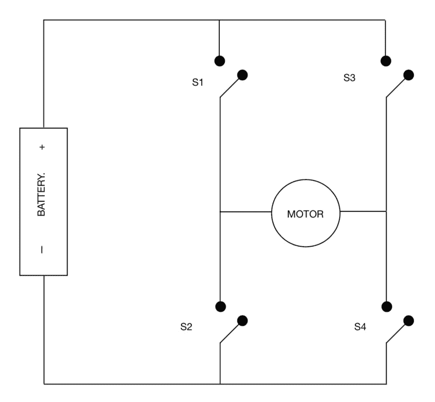
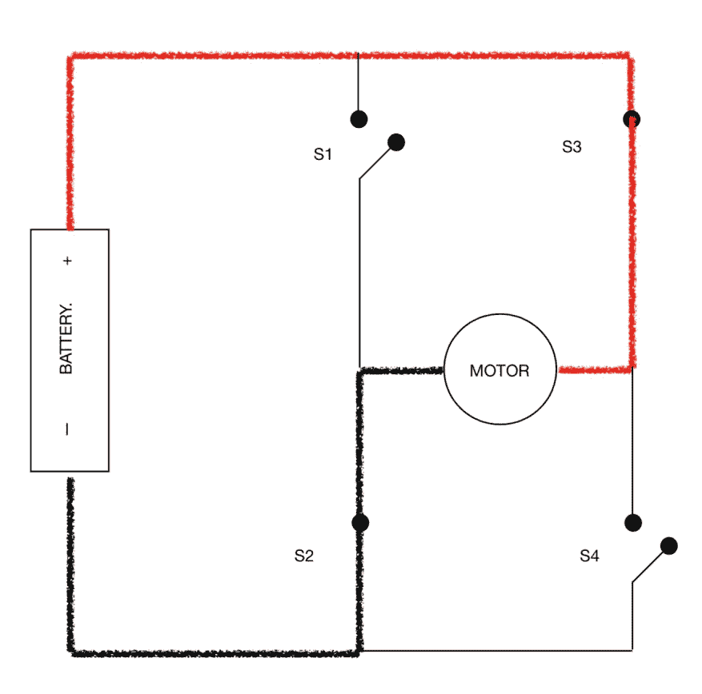
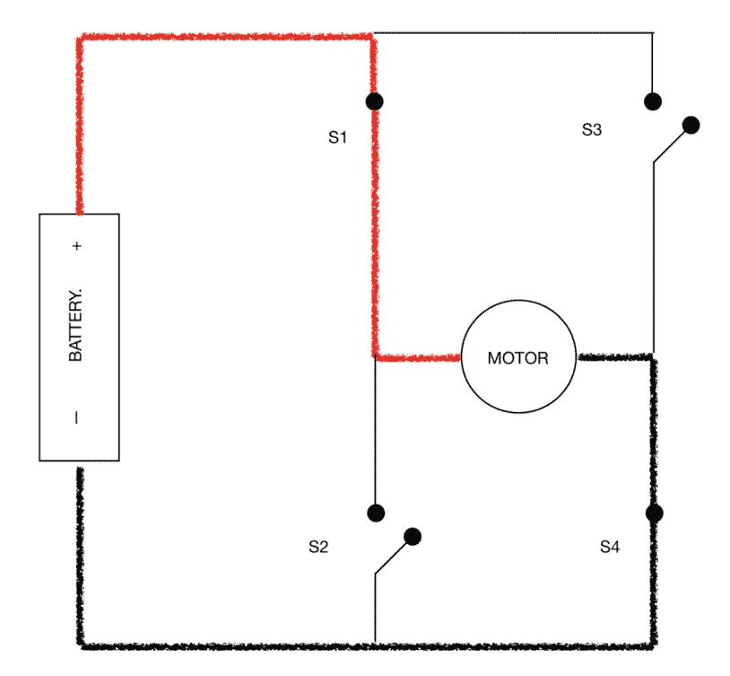
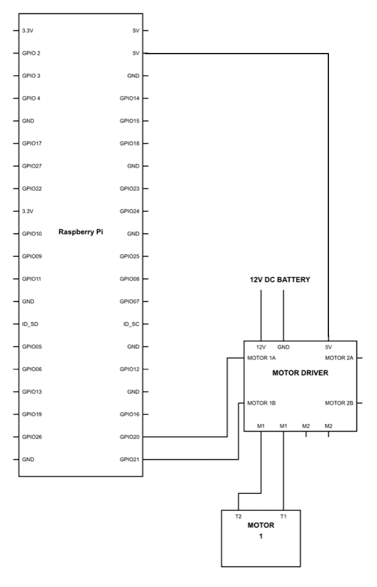

# 第四章：马达基础知识

好吧！我们已经制作了一个照顾你花园的机器人，我希望它运行得很好。现在是时候将事情提升到另一个层次了。

我们一直认为机器人就像 WALL-E 一样，四处移动为我们做事。嗯，我的朋友，现在这个梦想并不遥远。实际上，在本章中，我们将继续前进，制作一个。让我们看看它是如何完成的。

我们将涵盖以下主题：

+   基础知识

+   开始行动

+   改变速度

# 基础知识

每当我们谈论从一个地方移动到另一个地方时，我们会想到轮子，同样地，每当我们想到移动机器人的轮子时，我们会想到马达。存在各种不同类型的马达。所以首先让我们看看最基本的马达类型，它被称为刷式直流马达。正如其名所示，它使用直流电。你可能会发现这样的马达：


相信我，这些事情无处不在，从你为邻居买的圣诞礼物到最强大最糟糕的机器——你都会发现这些马达隐藏在引擎盖下。这些马达之所以常见，是因为它们非常非常简单。简单到只需要一个电池和两根电线就能启动它们。只需将正极连接到一个端子，负极连接到另一个端子，马达就会开始旋转。交换这些连接，旋转的方向就会改变。取两个电池，电压加倍，马达就会转得更快。就这么简单。

现在你可能认为我们只需将这个马达连接到树莓派，然后我们就可以出发了。但不幸的是，情况并非如此。正如你可能从前面的章节中记得的那样，树莓派只能提供大约 50 毫安的电流，但马达的消耗可能要高得多。因此，为了运行它，我们需要一个中间设备。

第一个出现在你脑海中的想法可能是使用继电器，为什么不呢？它们可以引导大量的电流，可以处理高电压。这应该是理想的选择。如果你这样想，你是对的，但只限于某种程度上，这是因为继电器只是一个我们可以用来打开或关闭马达的开关。我们无法控制马达的转速或旋转方向。现在，你可能认为这个问题并不新鲜，我们可以非常容易地通过使用**脉冲宽度调制**（**PWM**）来解决它，对吧？嗯，答案是不了！因为这些继电器是机械装置，由于它们的机械性质，在每秒开关的次数上存在一些最大限制。因此，它无法应对 PWM 的频率。最后，我们仍然面临改变马达方向和速度的问题。那么我们现在该怎么办呢？

正如我经常说的，问题的美在于它总是有解决方案，这里的解决方案被称为电机驱动器。电机驱动器主要是电子继电器——一种可以允许高电流但不是机械的开关。因此，我们可以每秒切换它数百次。这些电子继电器可以是简单的晶体管，或者在高压应用中，甚至可以使用 MOSFET 进行切换。我们可以简单地给这些电子开关 PWM 信号，并确保电路中有足够的电流。此外，正如我之前提到的，电机驱动器由一组这些电子继电器组成。它们最常见的、最实用的排列方式被称为全桥或 H 桥。在我进一步解释之前，让我们看看这究竟是什么：



在全桥电路中，我们连接到电机的有四个开关电路；根据需要，这些电路可以独立地开启或关闭。在关闭状态下，所有这些开关电路都处于开启状态，因此保持电机关闭。现在，无论何时我们想要启动电机，我们都需要以某种方式开启两个开关，使得电路完整，电机开始工作。那么，让我们看看它将是什么样子：



在这里，我们开启了开关电路**S2**和**S3**；这反过来完成了电路，使得电流可以在电机中流动。现在，为了控制速度，这些相同的开关电路可以在非常高的频率下以不同的占空比开启和关闭，以实现特定的平均电压。现在我们可以通过改变这两个开关电路的电压来达到特定的电机速度，那么我们来看看我们是如何改变电机旋转方向的：



在这个电路中，我们关闭了之前连接的**S2**和**S3**，取而代之的是开启了**S1**和**S4**，因此电机的极性被反转。正如我们之前讨论的，每当直流刷式电机的极性改变时，方向也会随之改变。市场上你可以找到各种类型的电机驱动器。我们在这里理解的是刷式直流 H 桥电机驱动器；还有其他类型的电机驱动器用于控制其他类型的电机，但当前我们将仅关注刷式电机。在选择电机驱动器时，你应该非常仔细地检查电机驱动器的规格表。以下是一些将被提到的关键规格：

+   **电压等级**：电机驱动器可以处理和调节的电压将有一个最小和最大限制。确保你的电机位于这个特定的电压范围内。

+   **电流等级**：电机驱动器可以承受的绝对最大电流；超过这个电流将烧毁或损坏电机驱动器。这可能有点误导。让我们看看原因。除了绝对最大值外，还可能有其他许多电流等级可能被指定。这些可能包括：

    +   **重复最大电流**：这是电机驱动器可以承受的最大电流，但不是连续的。这个等级给出是因为有时电机的负载可能会增加，可能会有一个短暂的更高电流需求。电机驱动器将重复提供足够的电流而不会损坏。但是，这种电流需求不应是连续的。

    +   **爆发最大电流**：这是电机驱动器可以承受的绝对最大电流；超过这个电流将损坏电机驱动器。直流电机在从静止状态启动时可能会有非常高的电流需求。因此，电机驱动器被设计来处理这些电流。但是，这种电流的激增不应是重复的，否则可能会发生加热和随后的损坏。通常，爆发最大电流被制造商称为最大电流。

    +   **连续最大电流**：这是真正的关键；连续最大电流是电机驱动器可以连续管理的最大连续电流。

+   **供电电压**：这是电机驱动器的运行电压——必须给电机驱动器提供这个电压以供其内部工作。

+   **逻辑供电电压**：这是给电机驱动器的控制信号，可以是 5V、3.3V 和 12V 等电压。因此，电机驱动器将指定它可以接受的信号线路上的最大逻辑电压。

现在，让我们看看我们有什么。在这本书的过程中，我们将使用 L298N 电机驱动器模块，目前这是市场上最常见的电机驱动器模块之一。它有两个通道——您有两个 H 桥，因此您可以将两个电机连接到它。此外，这个电机驱动器的规格对于价格来说也是相当不错的。以下是规格：

+   **电压等级**：2.5V 至 46V

+   **重复最大电流**：2.5 安培

+   **爆发最大电流**：3 安培

+   **连续最大电流**：2 安培

+   **供电电压**：4.5V 至 7V

+   **逻辑供电电压**：4.5V 至 7V

当您拥有物理电机驱动器时，您会注意到以下引脚：

+   **电机 A**：这是电机驱动器的 1 通道。您可以将第一个电机连接到这个端口。

+   **电机 B**：这是电机驱动器的 2 通道。您可以将第二个电机连接到这个端口。如果您只有一个电机，您可以简单地不连接这个端口。

+   **GND**：这是您将连接到电机的电源的接地。您不仅要连接电源的接地，还要将树莓派的接地连接到这个端口，以确保树莓派和电机驱动器之间的电路完整。

+   **VCC**: 这是电机驱动器的正极端口。这是您电池或电源适配器的正极将连接的地方。

+   **IN 1 和 IN 2**：这是我们为电机 A 需要从微控制器提供的两个逻辑输入。每当 IN 1 接收到信号时，H 桥的一部分被激活——电机开始朝一个方向旋转。每当 IN 2 接收到信号时，H 桥的另一部分被激活，使电机朝相反方向旋转。

+   **IN 3 和 IN 4**：这是电机 B 的逻辑输入，它将按照与 IN 1 和 IN 2 完全相同的方式工作。

+   **EN A 和 EN B**：这是两个通道的使能引脚。如果这些引脚不是高电平，尽管您在输入端口上给出任何信号，相应的通道也不会工作。您可能会注意到 EN 端口上有一个小电容。这被称为分流器。它的作用是在它连接的两个引脚之间建立接触。当这个电容连接到 EN 引脚上时，这意味着只要这个分流器连接，它就会永久保持高电平。

# 开始运行

好的，理论讲得够多了，现在让我们通过树莓派启动一个电机。为此，请按照以下方式连接电机和电机驱动器：



现在，一旦你完成了它，让我们上传代码并看看会发生什么：

```py
import RPi.GPIO as GPIO
from time import sleep
GPIO.setmode(GPIO.BCM)

Motor1R = 20
Motor1L = 21

GPIO.setup(Motor1R,GPIO.OUT)
GPIO.setup(Motor1L,GPIO.OUT)

GPIO.output(Motor1R,GPIO.HIGH)
GPIO.output(Motor1L,GPIO.LOW)

sleep(5)

GPIO.output(Motor1R,GPIO.LOW)
GPIO.output(Motor1L,GPIO.HIGH)

sleep(5)

GPIO.cleanup()
```

现在，让我们稍微了解一下代码：

```py
Motor1R = 20
Motor1L = 21
```

引脚编号`20`连接到电机驱动器的 IN 1。为了方便，我们将电机 1 右侧改为`Motor1R`；实际上，电机可以朝任何方向旋转，但我们只是这样写以方便理解和说明。同样，我们也对`Motor1L`做了这样的处理。它连接到 IN 2，因此这将导致电机朝相反方向旋转：

```py
GPIO.output(Motor1R,GPIO.HIGH)
GPIO.output(Motor1L,GPIO.LOW)
```

在这里，我们将`Motor1R`或引脚编号`20`设置为高电平，这意味着输入电机驱动器接收到的信号是：

| **电机** | **引脚** | **输入** | **状态** |
| --- | --- | --- | --- |
| `电机 1R` | 树莓派引脚编号 20 | IN 1 | `HIGH` |
| `电机 1L` | 树莓派引脚编号 21 | IN 2 | `LOW` |

现在，在延迟 5 秒后，以下代码将运行，它将改变引脚的状态，如下表所示：

```py
GPIO.output(Motor1R,GPIO.LOW)
GPIO.output(Motor1L,GPIO.HIGH)
```

| **电机** | **引脚** | **输入** | **状态** |
| --- | --- | --- | --- |
| `电机 1R` | 树莓派引脚编号 20 | IN 1 | `LOW` |
| `电机 1L` | 树莓派引脚编号 21 | IN 2 | `HIGH` |

现在，让我们看看运行后会发生什么。电机首先会朝一个方向旋转，然后它会转向另一个方向。代码非常直接，我认为没有必要进行解释。我们在这里所做的只是简单地打开或关闭连接到电机驱动器的两个 GPIO 之一。一旦电机驱动器的输入 IN 1 被激活，H 桥的一部分就会接通，导致电机朝一个方向旋转。每当电机驱动器的 IN 2 为高电平时，H 桥的另一部分就会接通，导致电机驱动器输出端的极性改变，因此电机就会朝相反方向旋转。

# 改变速度

现在我们已经了解了如何使用电机驱动器改变电机的方向，是时候更进一步，使用电机驱动器控制电机的速度了。要做到这一点，我们实际上不需要做太多。电机驱动器被设计成能够理解 PWM 信号。一旦向电机驱动器提供了 PWM 信号，电机驱动器就会相应地调整电机的输出电压，从而改变电机驱动器的速度。PWM 必须提供在电机 A 的 IN 1 和 IN 2 输入端口，以及电机 B 的 IN 3 和 IN 4 输入端口。很明显，提供 PWM 信号的引脚将决定电机移动的方向，而 PWM 的占空比将决定电机旋转的速度。

现在我们已经了解了电机驱动器中的速度控制是如何工作的。是时候我们自己动手尝试了。为此，我们不需要对连接进行任何更改；我们只需要上传以下代码：

```py
import RPi.GPIO as GPIO
from time
import sleep
GPIO.setmode(GPIO.BCM)

Motor1R = 20
Motor1L = 21

GPIO.setup(Motor1R, GPIO.OUT)
GPIO.setup(Motor1L, GPIO.OUT)

pwm = GPIO.PWM(Motor1R, 100)
pwm.start(0)

try:
while True:
  GPIO.output(Motor1L, GPIO.LOW)
for i in range(0, 101):
  pwm.ChangeDutyCycle(i)
sleep(0.1)

except KeyboardInterrupt:

  pwm.stop()
GPIO.cleanup()
```

你运行这段代码后发生了什么？我敢肯定电机开始时速度较慢，然后逐渐加速，达到最高速度后最终停止——这正是我们想要它做的。如果你还记得，这段代码看起来非常熟悉。记得第一章中改变 LED 亮度吗？几乎是一样的；尽管有一些不同，所以我们来看看它们是什么：

```py
pwm = GPIO.PWM(Motor1R, 100)
```

在这一行中，我们只是定义了必须提供 PWM 的引脚——即在`Motor1R`上，这对应于引脚号`20`。同时，我们定义了 PWM 的频率为`100`赫兹，即每秒 100 次：

```py
pwm.start(0)
```

如果你记得，前几章中的命令`pwm.start()`主要用于定义信号的占空比。在这里，我们给它一个`0`的占空比，即该引脚将会关闭：

```py
GPIO.output(Motor1L,GPIO.LOW)
```

由于我们正在以一个特定的方向运行电机，即`1R`，因此 H 桥的另一半应该关闭。这可以通过上面的行通过将`1L`设置为低电平来完成。如果我们不这样做，引脚`21`可能处于任意状态，因此它可以是开或关。这可能会与电机的移动方向冲突，硬件将无法正常工作：

```py
 for i in range(0,101):
```

现在来点真的；这一行，`for i in range(0,101):`，将会持续运行它包含的程序，直到`i`的值在`0`到`101`之间。每次这个循环运行时，它也会增加`i`的值。在这里，每次，值将增加一：

```py
            pwm.ChangeDutyCycle(i)
```

现在，这是一个稍微有点新的命令。之前，我们使用`pwm.start(0)`这一行来为 PWM 分配一个占空比。因为我们已经为 PWM 分配了一个占空比值，要改变它，我们会使用之前提到的命令。占空比将与`i`的值相同。

因此，每次代码通过`for`循环时，值或占空比将增加一。很简单，不是吗？

如果你做对了，机器人技术中的所有事情都非常简单。思路是将你的问题分解成小块，逐一解决；相信我，一旦你那样做了，没有什么会看起来很难。

# 概述

在本章中，我们研究了电机的各个方面。接下来，通过使用所有基础知识，我们将研究蓝牙与移动设备的交互，并构建一个蓝牙控制的机器人车。
