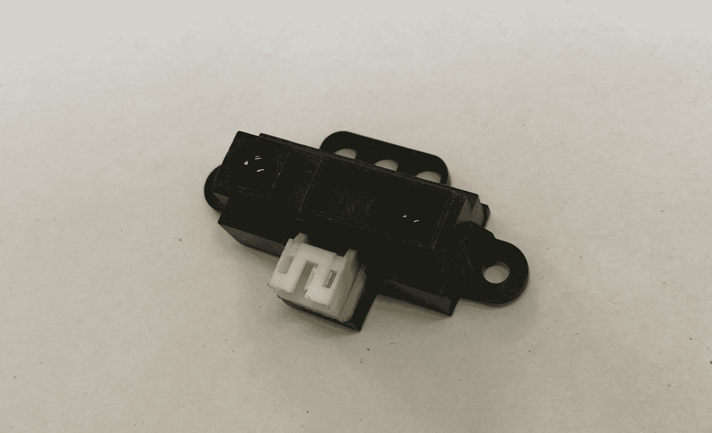
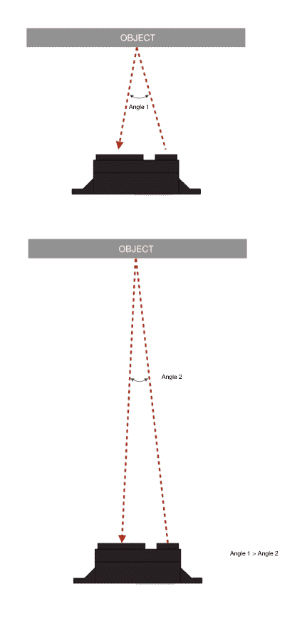
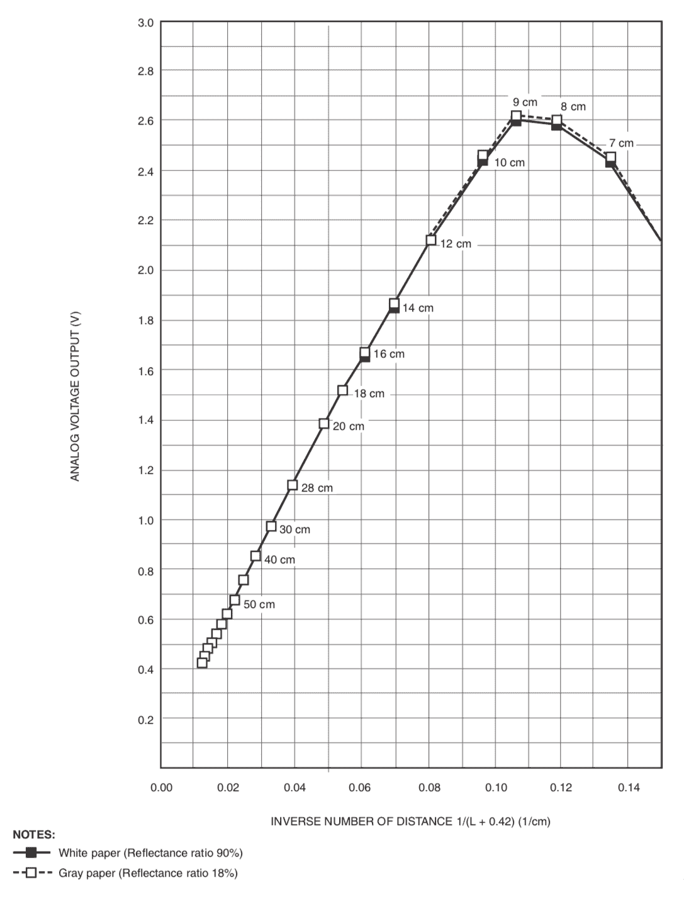
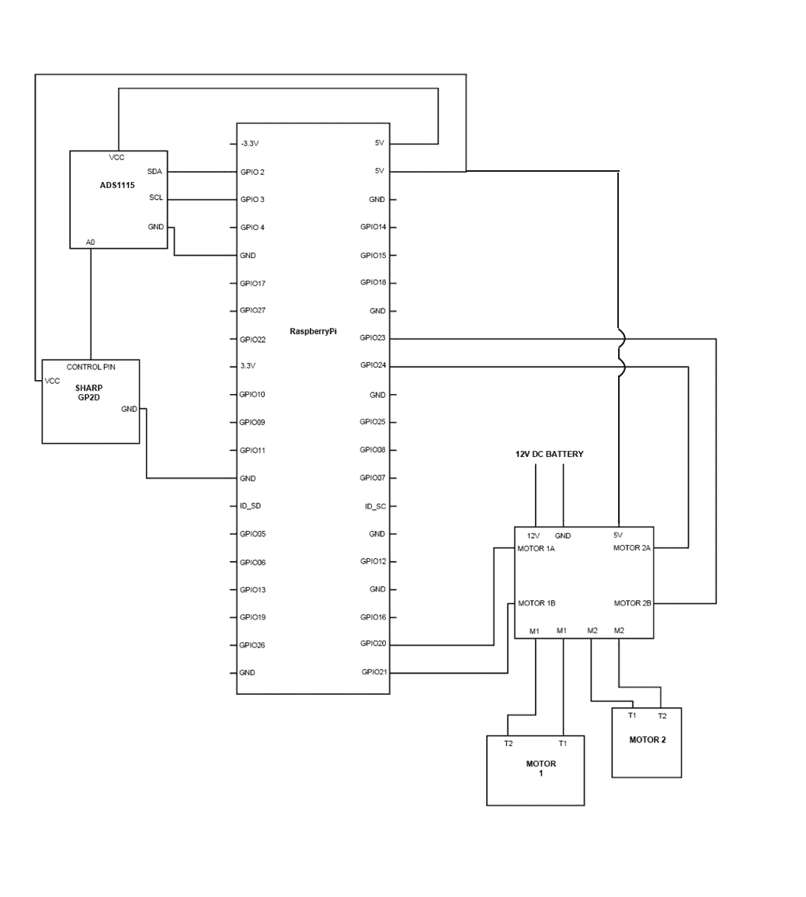

# 第七章：避障传感器接口

制作一个能够自动驾驶的机器人车辆，我们首先需要了解人类是如何驾驶车辆的。当我们开车时，我们不断分析空间和其他物体的距离。然后，我们决定是否可以通过。这种事情是通过我们的脑眼协调不断发生的。同样，机器人也必须做同样的事情。

在我们之前的章节中，你了解到我们可以通过传感器找到我们周围物体的接近距离。这些传感器可以告诉我们物体有多远，基于这个信息，我们可以做出决策。我们主要使用超声波传感器来做这件事，因为它极其便宜。然而，正如你记得的那样，安装超声波传感器和运行其代码稍微有些繁琐。现在是时候我们使用一个更简单的传感器并将其安装到车上。

本章将涵盖以下主题：

+   红外接近传感器

+   自动紧急制动

+   赋予其自动转向能力

+   使其完全自动化

# 红外接近传感器

以下照片展示了红外接近传感器：



它由两个主要部分组成——传感器和发射器。发射器发射红外波；这些**红外**（**IR**）波然后击中物体并返回传感器，如图所示。



现在，正如你可以在前面的图中看到的那样，发射的红外波从距离传感器不同距离的表面反弹回来，然后它们以一个角度接近传感器。现在，因为发射器和传感器之间的距离在所有时间点都是固定的，所以反射的红外波对应的角度将与它反弹前的距离成正比。红外接近传感器中有超精确的传感器，能够感应红外波接近的角度。通过这个角度，它给用户一个与它对应的距离值。这种寻找距离的方法被称为**三角测量法**，并且在工业中得到了广泛的应用。我们还需要记住的是，正如我们在前面的章节中提到的，我们周围充满了红外辐射；任何高于绝对零度的物体都会发出相应的波。此外，我们周围的阳光也含有大量的红外辐射。因此，这些传感器内置电路来补偿这一点；然而，它只能做到这么多。这就是为什么，当处理直射阳光时，这个解决方案可能会有一些麻烦。

现在，理论部分就到这里吧，让我们看看汽车实际上是如何工作的。在这个例子中，我们使用的红外接近传感器是由夏普公司生产的模拟传感器，型号为 GP2D12。它的有效感应范围是 1000-800 毫米。这个范围还取决于所讨论物体表面的反射率。物体越暗，范围越短。这个传感器有三个引脚。正如你可能猜到的，一个用于 VCC，另一个用于地线，最后一个用于信号。这是一个模拟传感器；因此，距离读数将基于电压。通常，对于大多数模拟传感器，你都会得到一个图表，它将描绘出各种感应范围内的各种电压。输出基本上取决于传感器的内部硬件和构造，因此可能会有很大的不同。下面是我们传感器及其输出的图表：



好吧，到目前为止一切顺利。我们知道 Raspberry Pi 不接受模拟输入；因此，我们将继续使用我们之前也使用过的 ADC。我们将使用之前使用的相同 ADC。

# 自动紧急制动

有一种新技术，新车型都配备了。它被称为**自动紧急制动**；无论我们开车有多专注，我们都会分心，比如 Facebook 或 WhatsApp 的通知，这会诱使我们从路上看向手机的屏幕。这可能是交通事故的一个主要原因；因此，汽车制造商正在使用自动制动技术。这通常依赖于长距离和短距离雷达，它检测汽车周围其他物体的接近程度，在即将发生碰撞的情况下，它会自动施加制动，防止汽车与其他车辆或行人相撞。这是一个非常酷的技术，但有趣的是，我们今天将用自己的双手来制作它。

为了制作这个，我们将使用红外接近传感器来感应其周围物体的接近程度。现在，拿起双面胶带，将红外距离传感器贴在汽车的前端。一旦完成，按照以下连接电路：



好了，我们已经准备好编写代码了。以下就是代码，只需将其复制到你的 Pi 上：

```py
import RPi.GPIO as GPIO
import time
GPIO.setmode(GPIO.BCM)

import Adafruit_ADS1x15
adc0 = Adafruit_ADS1x15.ADS1115()

GAIN = 1

adc0.start_adc(0, gain=GAIN)

Motor1a = 20
Motor1b = 21
Motor2b = 23
Motor2a = 24

GPIO.setup(Motor1a,GPIO.OUT)
GPIO.setup(Motor1b,GPIO.OUT)
GPIO.setup(Motor2a,GPIO.OUT)
GPIO.setup(Motor2b,GPIO.OUT)

def forward():
        GPIO.output(Motor1a,0)
        GPIO.output(Motor1b,1)
        GPIO.output(Motor2a,0)
        GPIO.output(Motor2b,1)

def stop():
        GPIO.output(Motor1a,0)
        GPIO.output(Motor1b,0)
        GPIO.output(Motor2a,0)
        GPIO.output(Motor2b,0)

while True:
   F_value = adc0.get_last_result()
   F =    (1.0 / (F_value / 13.15)) - 0.35
   forward()

    min_dist = 20    
    if F < min_dist:
        stop()

```

现在，让我们看看这段代码中实际发生了什么。一切都非常基础；红外接近传感器正在感应其前方物体的接近程度，并以模拟信号的形式提供相应的距离值。然后这些信号被 ADC 读取，并转换为数字值。这些数字值最终通过 I2C 协议传输到 Raspberry Pi。

到目前为止，一切顺利。但你可能想知道这一行代码的作用是什么？

```py
   F =    (1.0 / (F_value / 13.15)) - 0.35
```

在这里我们并没有做太多，我们只是取 ADC 给出的数字值，并使用这个公式，将这个数字值转换为厘米单位的可理解距离值。这个计算由制造商提供，我们真的不需要深入这个。大多数传感器都有这些计算提供。然而，如果你想了解我们为什么以及如何使用这个公式，我建议你阅读传感器的数据表。数据表可以通过以下链接轻松在线获取：[`engineering.purdue.edu/ME588/SpecSheets/sharp_gp2d12.pdf`](https://engineering.purdue.edu/ME588/SpecSheets/sharp_gp2d12.pdf)。

接下来，代码的主要部分如下：

```py
min_dist = 20
If F < min_dist:
    stop()
```

这同样非常简单。我们输入了一个距离值，在这个程序中，我们将其设置为`20`。所以，每当红外接近传感器的距离值`F`小于`20`时，就会调用`stop()`函数。`stop`函数只是让汽车停止，防止其与任何物体相撞。

让我们上传代码，看看它是否真的能工作！确保你在室内运行这辆汽车；否则，如果它没有遇到任何障碍物，你将很难尝试停止这辆汽车。祝您玩得开心！

# 赋予汽车自动转向的能力

我希望你在玩这个小玩意儿时玩得开心。传感器应用得如此简单，以及它能带来多大的差异，这很有趣。既然你已经学会了基础知识，现在是时候继续前进，给汽车赋予更多的能力了。

在之前的代码中，我们只是让机器人停在障碍物前，为什么不让它绕过汽车呢？这将会非常简单而又非常有趣。我们只需要调整`stop()`函数，使其能够转向。显然，我们还将把函数名从`stop()`改为`turn()`，只是为了更清晰。有一点要记住，你不需要重写代码；我们只需要做一些小的调整。所以，让我们看看代码，然后我会告诉你具体有什么变化以及为什么：

```py
import RPi.GPIO as GPIO
import time
GPIO.setmode(GPIO.BCM)

import Adafruit_ADS1x15
adc0 = Adafruit_ADS1x15.ADS1115()

GAIN = 1

adc0.start_adc(0, gain=GAIN)

Motor1a = 20
Motor1b = 21
Motor2a = 23
Motor2b = 24

GPIO.setup(Motor1a,GPIO.OUT)
GPIO.setup(Motor1b,GPIO.OUT)
GPIO.setup(Motor2a,GPIO.OUT)
GPIO.setup(Motor2b,GPIO.OUT)

def forward():
        GPIO.output(Motor1a,0)
        GPIO.output(Motor1b,1)
        GPIO.output(Motor2a,0)
        GPIO.output(Motor2b,1)

def turn():
        GPIO.output(Motor1a,0)
        GPIO.output(Motor1b,1)
        GPIO.output(Motor2a,1)
        GPIO.output(Motor2b,0)
)

while True:
   forward()

   F_value = adc0.get_last_result()
   F =    (1.0 / (F_value / 13.15)) - 0.35

    min_dist = 20

    while F < min_dist:
        turn()   

```

正如你所注意到的，除了以下内容外，一切几乎保持不变：

```py
def turn():
        GPIO.output(Motor1a,0)
        GPIO.output(Motor1b,1)
        GPIO.output(Motor2a,1)
        GPIO.output(Motor2b,0)
```

这部分代码定义了`turn()`函数，其中车辆的对面轮子会向相反方向旋转；因此，使汽车绕其自身轴线转动：

```py
    min_dist = 20

    while F < min_dist:
        turn()
```

现在这是程序的主要部分；在这个部分，我们定义了如果汽车遇到任何前方的障碍物，它会做什么。在我们之前的程序中，我们主要是告诉机器人一旦遇到任何障碍物就立即停止；然而，现在我们将`stop`函数与之前在程序中定义的`turn`函数链接起来。

我们简单地添加了一个如下条件：

```py
min_dist = 20
If F < min_dist:
    turn()
```

然后，它将仅仅转动几秒钟，因为微控制器将解析代码并执行它，然后退出条件。为了做到这一点，我们的 Raspberry Pi 几乎只需要几微秒。所以，我们可能甚至看不到发生了什么。因此，在我们的程序中，我们使用了 `while` 循环。这本质上是在条件满足之前保持循环运行。我们的条件是 `while F < min_dist:`，所以直到机器人检测到前方有物体，它将一直执行其内部的函数，在我们的例子中是 `turn()` 函数。简单来说，直到它没有足够地转向以避开障碍物，车辆将一直转向，然后一旦循环执行完毕，它将再次跳回主程序并继续直线行驶。

简单吗？这就是编程的美丽之处！

# 实现完全自主

现在，你们应该已经理解了使用简单接近传感器进行自动驾驶的基本原理。现在是时候让它完全自主了。为了实现完全自主，我们必须理解和映射我们的周围环境，而不仅仅是将车辆转向直到遇到障碍物。我们基本上需要将整个活动分为以下两个基本部分：

+   扫描环境

+   决定如何处理感知到的数据

现在，让我们先编写代码，然后再看看我们需要做什么：

```py
import RPi.GPIO as GPIO
import time

GPIO.setmode(GPIO.BCM)

import Adafruit_ADS1x15
adc0 = Adafruit_ADS1x15.ADS1115()

GAIN = 1
adc0.start_adc(0, gain=GAIN)

Motor1a = 20
Motor1b = 21
Motor2a = 23
Motor2b = 24

GPIO.setup(Motor1a,GPIO.OUT)
GPIO.setup(Motor1b,GPIO.OUT)
GPIO.setup(Motor2a,GPIO.OUT)
GPIO.setup(Motor2b,GPIO.OUT)

def forward():
        GPIO.output(Motor1a,0)
        GPIO.output(Motor1b,1)
        GPIO.output(Motor2a,0)
        GPIO.output(Motor2b,1)

def right():
        GPIO.output(Motor1a,0)
        GPIO.output(Motor1b,1)
        GPIO.output(Motor2a,1)
        GPIO.output(Motor2b,0)

def left():
        GPIO.output(Motor1a,1)
        GPIO.output(Motor1b,0)
        GPIO.output(Motor2a,0)
        GPIO.output(Motor2b,1)

def stop():
        GPIO.output(Motor1a,0)
        GPIO.output(Motor1b,0)
        GPIO.output(Motor2a,0)
        GPIO.output(Motor2b,0)

while True:

   forward()

   F_value = adc0.get_last_result()
   F =   (1.0 / (F_value / 13.15)) - 0.35

   min_dist = 20
   if F< min_dist:

        stop()

    right()
    time.sleep(1)

    F_value = adc0.get_last_result()
    F =    (1.0 / (F_value / 13.15)) - 0.35
    R = F

    left()
    time.sleep(2)

    F_value = adc0.get_last_result()
    F =    (1.0 / (F_value / 13.15)) - 0.3

    L = F

    if L < R:
        right()
        time.sleep(2)

    else:
        forward()

```

现在程序的大部分内容都像我们之前的程序一样；在这个程序中，我们定义了以下函数：

+   `forward()`

+   `right()`

+   `left()`

+   `stop()`

关于定义函数，我没有什么需要告诉你们的，所以让我们继续看看我们还有哪些内容。

主要动作发生在我们的无限循环 `while True:` 中。让我们看看具体发生了什么：

```py
while True:

   forward()

   F_value = adc0.get_last_result()
   F =   (1.0 / (F_value / 13.15)) - 0.35

   min_dist = 20
   if F< min_dist:

        stop()
```

让我们看看这段代码的这部分在做什么：

+   当我们的程序进入无限循环时，首先执行的是 `forward()` 函数；也就是说，一旦无限循环执行，车辆将开始向前行驶

+   此后，`F_value = adc.get_last_result()` 正在从 ADC 读取数据并将其存储在名为 `F_value` 的变量中

+   `F = (1.0/(F-value/13.15))-0.35` 正在将距离计算成可理解的公制距离值

+   `min_dist = 20`，我们只是简单地定义了稍后将要使用的最小距离

一旦这段代码完成，`if` 语句将检查是否 `F < min_dist:`。如果是这样，那么位于 `if` 语句下的代码将开始执行。这将是第一行，即 `stop()` 函数。所以，当车辆遇到前方任何障碍物时，它首先会做的就是停止。

正如我之前提到的，我们代码的第一部分是理解环境，所以让我们继续看看我们是如何做到这一点的：

```py
right()
    time.sleep(1)

    F_value = adc0.get_last_result()
    F =    (1.0 / (F_value / 13.15)) - 0.35
    R = F

    left()
    time.sleep(2)

    F_value = adc0.get_last_result()
    F =    (1.0 / (F_value / 13.15)) - 0.35

    L = F

```

车辆停止后，它将立即向右转。正如你所看到的，下一行代码是 `time.sleep(1)`，所以另外 `1` 秒内，车辆将继续向右转。我们随机选择了 `1` 秒的时间，你可以稍后调整它。

一旦它向右转，它将再次从接近传感器读取值，并且在使用此代码 `R=F` 时，我们将该值存储在名为 `R` 的变量中。

在完成这些后，汽车将转向另一侧，即使用 `left()` 函数向左转，并且它将像我们 `time.sleep(2)` 一样继续向左转 `2` 秒。这将使汽车转向障碍物的左侧。一旦它向左转，它将再次读取接近传感器的值，并使用代码 `L = F` 将该值存储在变量 `L` 中。

所以本质上我们做的是扫描了我们周围区域。在中心，我们有一个障碍物。它将首先向右转，并获取右侧的距离值；然后，我们将向左转，并获取左侧的距离值。所以本质上我们知道障碍物周围的环境。

现在我们来到了必须做出决定的部分，即我们必须向哪个方向前进。让我们看看我们将如何做到：

```py
  if L < R:
        right()
        time.sleep(2)

    else:
        forward()
```

使用 `if` 语句，我们通过此代码 `if L < R:` 比较障碍物左右两侧接近传感器的值。如果 `L` 小于 `R`，那么车辆将向右转 `2` 秒。如果条件不成立，那么 `else:` 语句将生效，这将使车辆前进。

现在如果我们从更大的角度来看代码，以下事情正在发生：

+   车辆将一直向前行驶，直到遇到障碍物

+   遇到障碍物时，机器人将停止

+   它将首先向右转，并测量它前方物体的距离

+   然后，它将向左转，并测量它前方物体的距离

+   然后，它将比较左右两侧的距离，并选择它必须前往的方向

+   如果它必须向右转，那么它将向右转然后前进

+   如果它必须向左转，那么它已经处于向左转的方向，所以它只需直行即可

让我们上传代码，看看事情是否按照计划进行。记住，尽管每个环境都不同，每辆车也不同，所以你可能需要调整代码以使其顺利运行。

现在我将给你留下一个问题。如果在两种情况下传感器的读数都是无穷大或它能给出的最大可能值？机器人会怎么做？

好吧，进行一些头脑风暴，看看我们能做些什么来解决这个问题！

# 摘要

在本章中，我们利用到目前为止所学的所有基础知识，并引入红外接近传感器，使得我们能够将我们的机器人汽车的开发推进到一个更高级的阶段，以便检测障碍物并相应地改变方向。在下一章中，我们将研究如何制作我们自己的区域扫描仪——那里见！
