# 第八章：制作你自己的区域扫描仪

电机是令人惊叹的东西；它们有各种各样的形状和大小。首先，它们可以被认为是大多数机器人的骨架。然而，在这个世界上，没有什么是不完美的。这些电机也一定有一些缺点。到现在，你可能已经自己发现了一些。在上一章中，当我们让汽车转向时，你可能已经注意到转向的角度从未真正相同。同样，当车辆被下达直行的命令时，它实际上并不会这样做。相反，它会试图轻微地偏向一侧。

问候第一个问题——精度。电机控制起来非常简单，但问题在于当我们只需要将电机旋转到特定角度时。如果你需要只旋转你的机器人车辆的电机 90 度，你将如何做？首先可能出现在你脑海中的事情可能是调整电机的定时。你可能在这里是正确的。但仍然，确保每次都是精确的 90 度是不可能的。

但是当我们谈到机器人时，即使是 1 度的精度可能也不够。现在的机器人学家正在期待达到两位数的精度。所以，我们所说的精度接近 0.01 度。你现在怎么想？我们如何通过电机达到这种精度？

本章将通过以下主题回答所有这些问题：

+   伺服电机

+   列表

+   激光雷达

# 伺服电机

那么，让我来向你介绍*伺服电机*。伺服电机基本上是一种带有一些附加组件的电机。现在，为了了解这些附加组件是什么，让我们先来看一个例子。假设你想要去伦敦。现在，为了了解你如何到达那里以及到达伦敦的路线，你需要知道的第一件事是，你现在确切的位置在哪里。如果你不知道你现在在哪里，就无法计算路线。同样，如果我们想要到达电机的一个特定位置，我们需要知道电机轴现在在哪里。为此，我们使用**电位计**。电位计基本上是一个可变电阻器，它本质上有一个轴，当旋转时，会改变电阻的值。可变电阻器看起来是这样的：

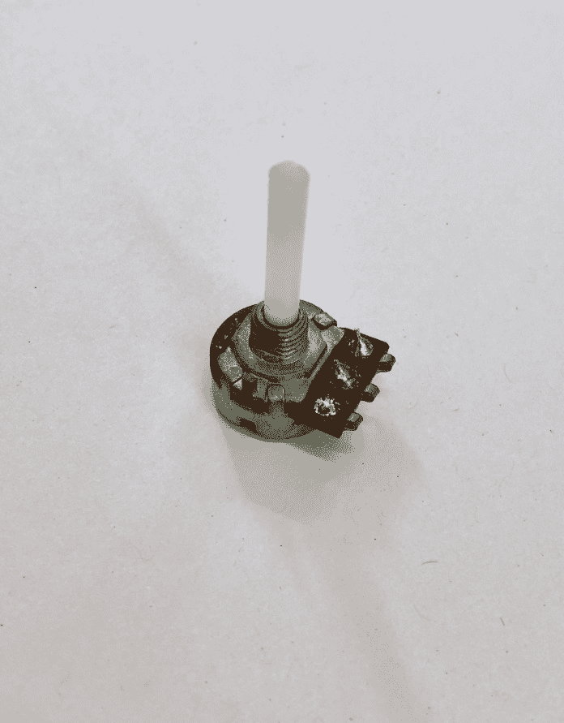

当电阻器的值改变时，电阻器的输出电压也会改变。有趣的是，如果电位器的输入电压是已知的，那么可以从它的输出电压推断出轴的位置。让我们看看如何：

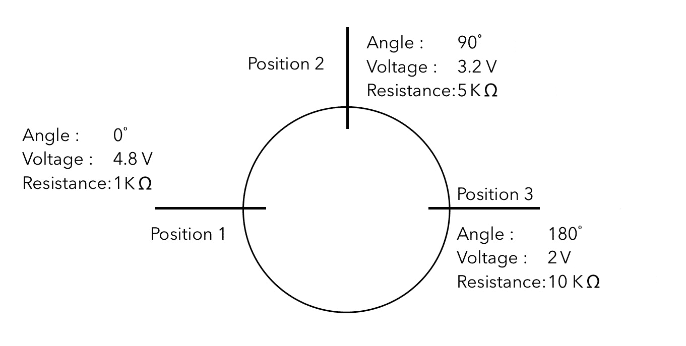

现在，让我们假设在 0 度的位置，电位计的输出电压为 4.8V；当我们将其移动到 90 度时，值变为大约 3.2V，当完全旋转 180 度时，由于电阻的变化，电压降低到仅有 2V。

不必真正查看电位计的轴，我们可以轻松地推导出，如果电阻的电压输出为 4.8V，那么轴必须位于 0 度的位置。同样，如果我们说电压为 3.2V 时它位于 90 度，当电压为 2V 时它位于 180 度。

在这里，我们只画了三个点，但对于电位计上的任何给定点，都会有一个非常特定的电阻与之对应。通过这个我们可以精确地计算出电位计的轴将位于何处。现在，让我们将其放入一个有趣的组合中：

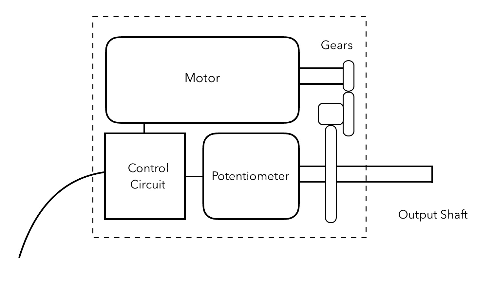

现在我们所拥有的是一个通过多个减速齿轮与电位计耦合的电机，这将降低电机的速度并增加扭矩。进一步地，在最终齿轮上，一个轴向外安装到机身并与电位计耦合。

所以正如你所学的，电位计能够感知输出轴指向的角度。然后电位计连接到一个控制电路，该电路读取电位计的读数并进一步指导电机移动多少以达到目标位置。由于这种闭环安排，控制电路知道轴的位置，它可以计算出需要移动电机多少才能达到目标位置。因此，这种安排能够精确地将输出轴转到任何给定位置。

这种安排通常被称为**伺服电机**。在整个机器人行业中，它是控制精确运动最广泛使用的硬件之一。本质上，有三个电线进入控制电路——VCC、地线和信号线。信号线将接收来自我们的 Raspberry Pi 的数据，并在接收后执行必要的电机运动，使轴达到期望的位置。以下是伺服电机的一张图片：

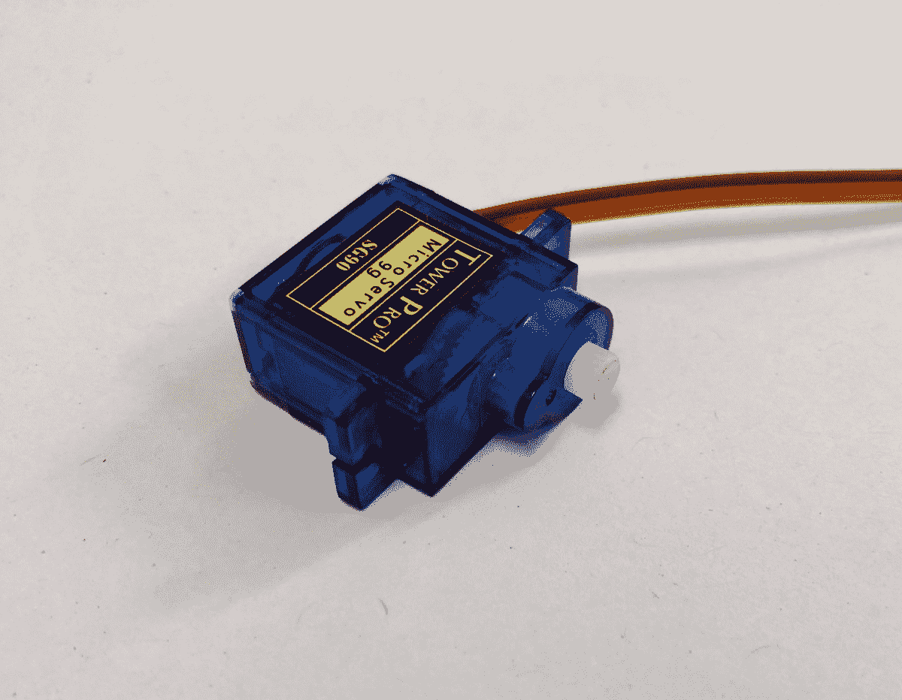

这些可以从极其便宜的价格开始，大约 4 到 5 美元，但它们可以高达数千美元。但真正决定这些伺服电机价格的是什么？在选择伺服电机时，我们需要考虑几个因素，但其中最重要的是**扭矩**。

扭矩基本上是电机通过它来转动输出轴的旋转力。这通常以 kg·cm 或 N·m 来衡量。那么这实际上意味着什么呢？让我们看看以下图示：

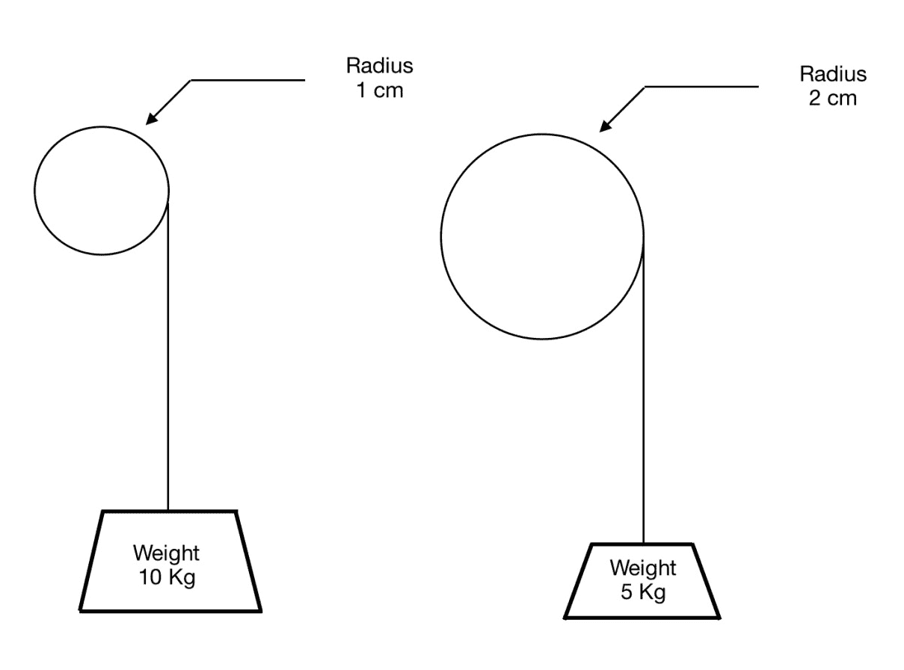

假设在前面的图中，我们有一个扭矩为 10 kg·cm 的电机，与之连接的转子直径为 1 cm。因此，它应该能够垂直地从地面拉起 10 kg 的重物。然而，当我们改变转子的半径到 2 cm 时，可以提升的重物重量减半。同样，如果半径增加到 10 cm，那么可以提升的重物重量将减少到 1 kg。所以基本上，可以提升的重物重量将是扭矩/半径。

但对于我们大多数目的来说，我们不会使用之前展示的机制，所以让我们看看下一张图，看看如何进行计算：

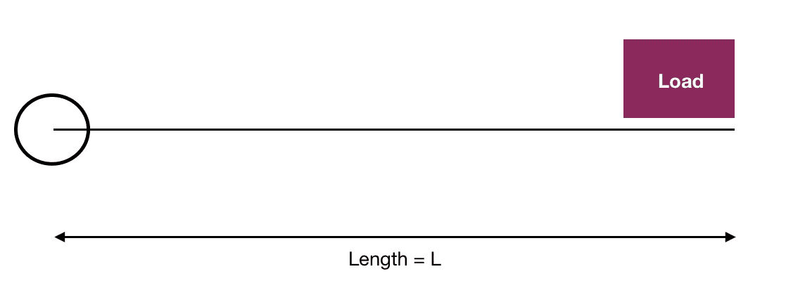

现在，假设我们有一个长度为**L**的轴和一个位于轴端部的载荷。为了便于计算，我们会认为轴的重量可以忽略不计。现在，如果伺服电机的扭矩为 100 kg·cm，轴的长度（**L**）为 10 cm，那么通过简单的计算，我们可以提起的载荷将是 100/10 = 10 kg。同样，如果长度增加到 100 cm，可以提起的载荷将减少到仅仅 1 kg。

好吧，我们已经对伺服电机有了一定的了解。现在的问题是，我们如何控制伺服电机？正如我提到的，有不同类型的伺服电机，可以通过不同的方式来控制。然而，最常用于业余目的的是数字伺服电机。这些伺服电机需要**PWM**，根据 PWM 的占空比，轴的角度会发生变化。那么，让我们看看这是如何发生的。

通常，这些伺服电机大多数的频率为 50 Hz。所以，基本上每个脉冲的长度将是 1/50 = 0.02 秒，换句话说，20 毫秒。此外，可以提供给这些伺服电机的占空比可以是 2.5%到 12.5%，这意味着脉冲宽度为 0.5 毫秒到 2.5 毫秒。现在让我们看看它是如何工作的：

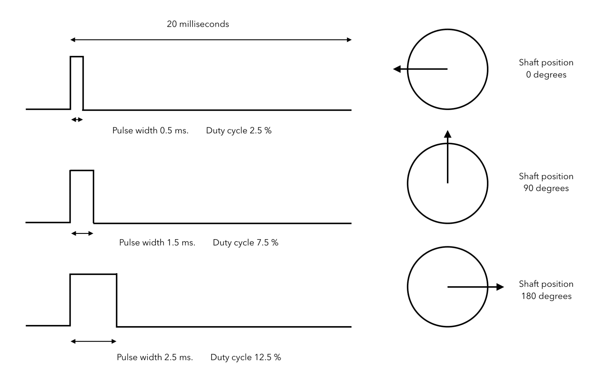

如你所见，当给定 2.5%的占空比时，轴下降到 0 度的最小位置，当占空比增加到 7.5%时，轴移动到中间位置 90 度。最后，当占空比增加到 12.5%时，轴移动到最大位置 180 度。如果你想要任何介于两者之间的位置，那么你可以简单地选择相应的 PWM，它将改变伺服电机的位置到期望的角度。

但你可能想知道，如果我们想将其超过 180 度呢？嗯，这是个好问题，但大多数数字伺服电机只提供 180 度的旋转范围。有些伺服电机可以完全旋转其轴，即 360 度；然而，它们的地址方式略有不同。在本章之后，你可以查看任何数字伺服电机的数据表，并按照你想要的方式控制它。

好了，理论就到这里；是时候做一些有趣的事情了。所以，让我们动手设置硬件，用手直接控制伺服电机！按照以下方式将伺服电机连接到树莓派：

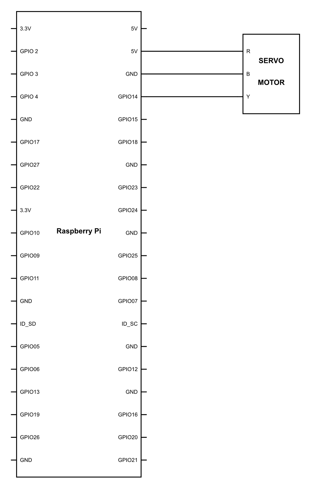

线的颜色编码如下：

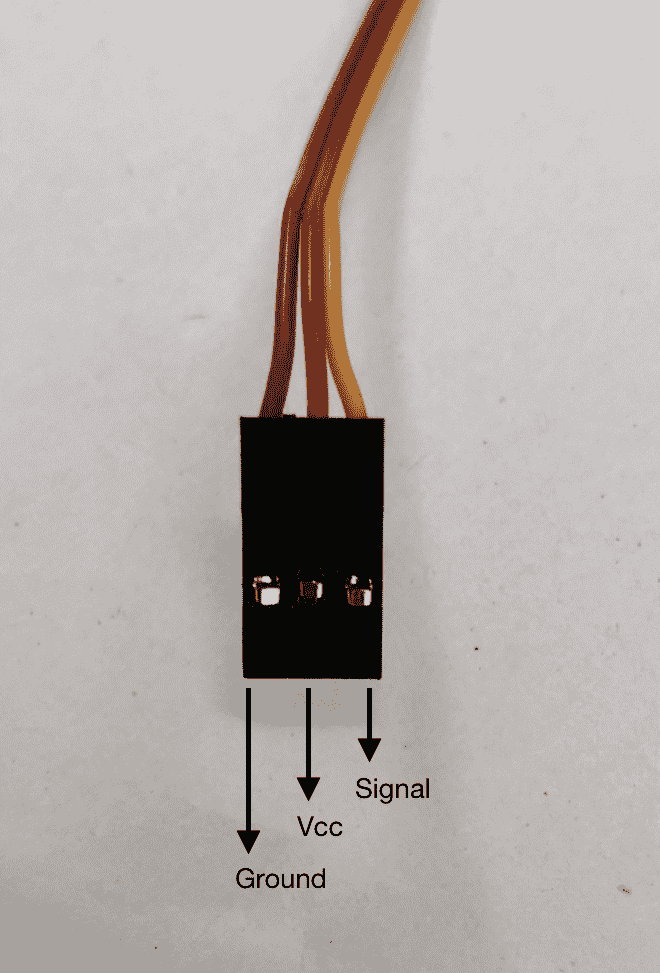

接下来，我们需要上传以下代码并看看会发生什么：

```py
import RPi.GPIO as GPIO
import time

GPIO.setmode(GPIO.BCM)
GPIO.setup(14,GPIO.OUT)

pwm = GPIO.PWM(14, 50)
pwm.start(0)

while 1:

        pwm.ChangeDutyCycle(2.5)
        time.sleep(2)

        pwm.ChangeDutyCycle(5)
        time.sleep(2)

        pwm.ChangeDutyCycle(7.5)
        time.sleep(2)

        pwm.ChangeDutyCycle(10)
        time.sleep(2)

        pwm.ChangeDutyCycle(12.5)
        time.sleep(2)
```

一旦运行这个程序，你会看到伺服电机的轴从左到右移动，以 0 度、45 度、90 度、135 度和最终 180 度的步长进行移动。

让我们看看在程序中我们做了什么来实现这一点：

```py
pwm = GPIO.PWM(14, 50)
pwm.start(0)
```

使用`pwm = GPIO.PWM(14, 50)`这一行，我们定义了 GPIO 引脚号`14`将用于 PWM，PWM 的频率将是`50`。我们也在前面的章节中使用过`pwm.start(0)`这一行。它基本上是将 PWM 引脚设置为`0`，即没有占空比：

```py
        pwm.ChangeDutyCycle(2.5)
        time.sleep(2)

        pwm.ChangeDutyCycle(5)
        time.sleep(2)

        pwm.ChangeDutyCycle(7.5)
        time.sleep(2)

        pwm.ChangeDutyCycle(10)
        time.sleep(2)

        pwm.ChangeDutyCycle(12.5)
        time.sleep(2)
```

不是所有的早期程序都在`while`循环中，也就是说，它将反复执行，直到程序被强制退出。现在，`pwm.ChangeDutyCycle(2.5)`这一行向伺服电机发送了 2.5%的占空比 PWM。这将简单地使伺服电机旋转到 0 度角度。接下来，我们使用大家都很熟悉的`time.sleep(2)`，它会暂停程序，使该行暂停两秒钟。

同样的循环正在使用不同的 PWM 值 5%重复，这将使轴旋转到 45 度，7.5%对应 90 度，10%对应 135 度，12.5%对应 180 度。这是一个非常简单的程序，将帮助我们了解伺服电机的基础知识。

到现在为止，你已经学会了如何控制伺服电机，并使其按照我们想要的方向移动。现在，让我们更进一步，稍微修改一下代码，使伺服电机运行得更平滑：

```py
import RPi.GPIO as GPIO
import time

GPIO.setmode(GPIO.BCM)
GPIO.setup(14,GPIO.OUT)

pwm = GPIO.PWM(14, 50)
pwm.start(0)

i=2.5
j=12.5

while 1:
        while i<=12.5:
                pwm.ChangeDutyCycle(i)
                time.sleep(0.1)
                i = i + 0.1

        while j>=2.5:
                pwm.ChangeDutyCycle(j)
                time.sleep(0.1)
                j = j - 0.1
```

当你在你的 Pi 上上传这段代码时，你会注意到伺服电机从左到右非常平滑地滑动，然后又从右到左。我们做了一个非常简单的技巧；让我们看看它是什么：

```py
        while i<=12.5:
                pwm.ChangeDutyCycle(i)
                time.sleep(0.1)
                i = i + 0.1
```

在这里，我们正在运行一个循环，它将一直运行到`i<=12.5`的值，正如我们在程序中之前定义的那样，`i`的值在程序开始时被设置为默认的`2.5`。之后，每次代码运行时，占空比被设置为`I`的值，程序暂停 0.1 秒，然后`i`的值增加 0.1。这是增加 PWM 的占空比。一旦值达到 12.5，循环就会退出。

我们拥有的整个 PWM 范围是 2.5%到 12.5%，因此我们有 10%的空间可以操作。现在如果我们将其映射到伺服电机的角旋转，那么每个百分比的 PWM 对应于 180/10 = 18 度的变化。同样，每 0.1%的变化将导致 1.8 度的变化。因此，每 0.1 秒，我们通过增加 0.1%的占空比，或者说，我们通过增加 1.8 度来增加角度。因此，我们发现这个动作非常平滑。

我们在程序的下一部分做了类似的事情；然而，我们是在做反向运动。

# 列表

好吧，我们非常确定如何使用伺服电机，并按照我们的需求进行有控制的运动。现在，是时候向前迈进，了解我们将大量使用的另一个概念了。它被称为**数组**。如果你在其他任何语言中编程过，你一定很熟悉它。但我们需要了解它的一些基本概念，这将使我们的生活变得更加容易。所以，让我们开始吧。

首先，最重要的是。在 Python 中，数组并不被称为数组，而是被称为**列表**。列表基本上是一种可以同时存储多个元素的数据结构。唯一的限制是元素必须是相同的数据类型。例如，如果你存储整数，那么所有的值都应该为`int`。同样，如果你存储字符，那么列表中的每个元素都应该为`char`。要定义一个列表，你所需要做的就是命名列表，就像我们通过`myList`所做的那样；列表的名称可以是任何名称，接下来我们需要告诉编译器它实际上是一个列表。要做到这一点，我们需要在方括号内放置值。它看起来会是这样：

```py
myList = [14,35,108,64,9]
```

有一个需要注意的事情是，每个值都应该用逗号分隔。每当我们想要通过调用它们的索引号来引用列表中的任何单个元素时，我们都可以简单地这样做。这是基于元素在列表中的位置。Python 列表中的索引值从 0 开始。所以根据前面的声明，索引 0 的值将是`14`，索引 4 的值将是`9`。现在，当我们需要在程序中打印这些元素时，我们需要编写以下代码：

```py
print myList[2] 
```

一旦我们写下这段代码，程序将打印列表中第二个元素的值。在我们的例子中，它将是`35`。

现在，这是访问列表元素的一种方法；我们也可以按反向顺序访问它。所以，假设你想访问数组的最后一个元素。然后，我们可以编写以下代码：

```py
print myList[-1] 
```

这段代码将返回数组中最后一个元素的值。现在，每当我们使用列表中的负值时，它将按反向顺序开始索引。所以，如果我们输入`print myList[-2]`，这将给出数组中倒数第二个元素的值。在这个整个方案中，有一点需要记住的是，编号将从 0 开始，而当我们从反向开始时，编号将从-1 开始。

如果你了解正确的工具，Python 真的很有趣，也很简单。Python 的开发者包括一些非常有用的函数，这些函数可以用于列表。所以，让我们去探索它们吧。

第一种方法是向数组中添加元素。为此，我们使用一个名为`append()`的函数。`append()`函数的作用是在数组的末尾添加值。所以，写下以下代码：

```py
myList.append(45)
```

这将会在`myList`的末尾添加元素`45`。所以现在列表将如下所示：

```py
myList = [14,35,108,64,9, 45]
```

很简单，不是吗？但是，如果你想在列表中间添加一个元素怎么办？显然，开发者不会让你干瞪眼。他们已经包括了一个用于此目的的函数；它被命名为`insert(index, element)`。现在，每当你使用这个函数时，你需要确保你提到你想放置这个元素的位置的索引，其次，你想放置的元素。所以它看起来像这样：

```py
myList.insert(3,23)
```

当你使用这个函数时，数组将看起来如下：

```py
myList = [14,35,108,23,64,9,45]
```

显然，每当开发者提供了一个添加元素的功能时，他们肯定也提供了一个删除元素的功能。但技巧在于你可以有两种方式来做这件事。首先，是常见的方式。我们简单地选择索引号并删除它。我们现在就要这么做：

```py
del myList[2]
```

现在这将做的是删除数组的第二个元素，所以执行这个操作后，数组将看起来像这样：

```py
myList = [14,35,108,64,9,45]
```

但现在这里有一个真正的技巧；你也可以通过简单地指定元素来删除元素。这就是它的做法：

```py
myList.remove(9)
```

现在你这么做的时候，它会找到列表中元素`9`的位置并将其删除。所以你不必关心元素在哪里；这个函数会说，我会找到你，然后我会消灭你！

# 四处看看

好了，那么就不再引用电影台词了。我们可以谈论许多其他我们可以在列表上使用的函数，但我们现在所做的是足够的。随着需要，我们将看到其余的。但现在让我们在机器人领域更进一步。你可能已经看到许多自动驾驶汽车顶部的旋转物体。量产汽车通常不太可能配备它，主要是因为它的价格高昂，但研究目的的汽车总是装备有它。

那这个设备是什么呢？它被称为**LIDAR**；它是**光探测与测距**的缩写。我知道这是一个糟糕的缩写。LIDAR 之所以非常普遍，是有原因的。它以非常精确的方式为其周围区域提供距离读数。然而，如果我们为项目购买它，可能会有些过度，因为一个好的 LIDAR 可能要花费你接近 500 到 10000 美元。如果你仍然认为它在你的预算范围内，那么你将会非常幸运！但对于那些不想购买的人来说，我有一个好消息要告诉你。今天，我们将要自己制作一个 LIDAR 扫描仪。因此，为了制作一个区域扫描仪，我们需要一个伺服电机，我们将在这个伺服电机制作我们的红外接近传感器。现在为了做到这一点，我们需要一个稍微临时性的安排。你可以拿一张纸板，像我们在图片中展示的那样固定它，或者你也可以使用一个直角铝材并钻孔来固定组件，如果你想做得更专业的话。有一点要记住的是，传感器必须正好平行于地面，不能向上或向下。

一旦完成安装，那么就是连接其余硬件的时候了。所以按照以下图示连接硬件：

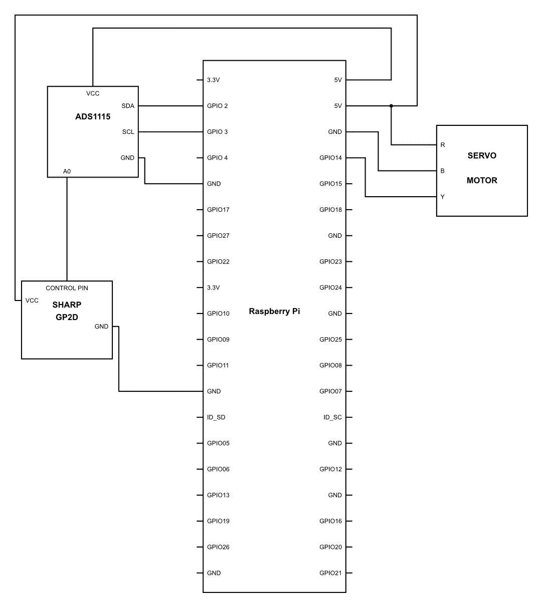

好的，那么让我们看看这个设备能做什么，准备好并上传这段代码：

```py
import RPi.GPIO as GPIO
import time
import Adafruit_ADS1x15

adc = Adafruit_ADS1x15.ADS1115()
GAIN = 1

adc.start_adc(0, gain=GAIN)
GPIO.setmode(GPIO.BCM)
GPIO.setup(14,GPIO.OUT)
GPIO.setwarnings(False)

servo = GPIO.PWM(14, 50)

servo.start(0)

Def Distance():
    D_value = adc0.get_last_result()
    D =    (1.0 / (F_value / 13.15)) - 0.35
    Return D

j=12.5
k=2.5
i=0

distLR=[] 
distRL=[]

while True:
        while k<=12.5:
                servo.ChangeDutyCycle(k)
                time.sleep(.1)
                distLR.insert(i,Distance())
                k = k + 2.5
                i = i + 1
        print distLR

        i=0
        k=0

        del distLR[:]

        while j>=2.5:
                servo.ChangeDutyCycle(j)
                time.sleep(.1)
                j = j - 2.5
                distRL.insert(i,Distance())
                i = i + 1

        print distRL

        i=0
        k=2.5
        j=12.5

       del distRL[:]
```

代码做了什么？如果它运行正常，那么它应该返回整个 180 度的扫描读数，分为 10 个均匀的步骤。试试看，然后回来看看实际上发生了什么。

现在大部分代码都是基础的，你也应该已经对这段代码的实际功能有了了解。然而，让我们更深入地探讨一下，看看具体细节：

```py
Def Distance():
    D_value = adc0.get_last_result()
    D =    (1.0 / (F_value / 13.15)) - 0.35
    Return D
```

在这个程序的部分，我们定义了一个名为`Distance()`的函数。正如你所看到的，它只是从步骤`D_value = adc0.get_last_result()`中获取 ADC 的读数；然后，这是从变量`D`中获取的值，在`D = (1.0/F-value/13.15)) - 0.35`这一行中计算，以从 ADC 读数中获得公制读数。最后，使用`Return D`这一行，我们从函数中返回值`D`：

```py
distLR=[] 
distRL=[]
```

我们声明了两个列表：`distLR`，用于伺服电机的从左到右滑动的距离，以及`distRL`，用于伺服电机的从右到左滑动的距离。你可能想知道为什么这些括号中没有内容。声明一个空数组是完全正常的。它们最初不需要有值：

```py

        while k<=12.5:
                servo.ChangeDutyCycle(k)
                time.sleep(.1)
                distLR.insert(i,Distance())
                k = k + 1
                i = i + 1
        print distLR
```

现在才是真正的动作发生的地方。`while`循环将只执行到`k`的值小于或等于`12.5`为止。在下一行`servo.ChangeDutyCycle(k)`中，占空比的值将是`k`的值。最初，`k`的值将是`2.5`，因为我们已经在程序开始时定义了它。现在我们添加另一行`time.sleep(.1)`，这将使程序暂停`.1`秒。这是必要的；否则，程序会在毫秒内解析这个循环，伺服电机将无法跟上。因此，这是一个短暂的延迟。在下一行，我们有`distLR.insert(I,Distance())`。这一行程序做了很多事情。首先，因为我们在这行中命名了一个`Distance()`函数。根据我们的定义，它将使用 ADC 和红外接近传感器计算距离。然后，它将这个距离值插入到列表`distLR`中的位置`I`。在我们程序的前面，我们已经将值`i = 0`赋值了；因此，距离值将被放置在数组的第一个位置。一旦完成这个过程，然后我们继续前进，并在这一行中将值增加`k = k + 1`；然后我们在`I = I + 1`中也做同样的事情。现在，一旦这个循环执行完毕，我们使用`print distLR`这一行打印列表的值：

```py
        i=0
        k=0
```

在这一行，我们只是简单地重置了`i = 0`和`k = 0`的值，以便下一次循环：

```py
        del distLR[:]
```

这可能对你来说有点新。当我们在一个括号内使用冒号时，这基本上意味着整个数组的所有元素都将被删除：

```py
 while j>=2.5:
                servo.ChangeDutyCycle(j)
                time.sleep(.1)
                j = j - 2.5
                distRL.insert(i,Distance())
                i = i + 1

        print distRL
```

在这段代码中，发生的事情与我们在从左到右滑动时所做的相同；唯一的区别是我们将其保存到一个名为`distRL`的新列表中，滑动从 12.5%占空比开始，到 2.5%结束：

```py
   i=0
        k=2.5
        j=12.5

       del distRL[:]
```

当我们打印完所有值后，我们再次重置`i = 1`、`k = 2.5`和`j = 12.5`的值，这样我们的第一个循环就可以无缝地继续下去。同时，我们也确保`distRL`列表中没有留下任何东西。

所以我们的代码就是这样工作的，简单直接！

# 自动驾驶车辆上的激光雷达

记得我们上次制作的自动驾驶汽车吗？那很酷，而且肯定是你可以向朋友炫耀的东西。然而，我们现在要做的肯定比我们迄今为止所做的一切都要酷。

我们将把这个区域扫描仪安装到我们的机器人车辆上。但是等等，我们之前不是已经用同样的传感器扫描过区域，并将车转向其他方向了吗？我们确实这样做了，而且效果很好，几乎是完美的。我敢打赌，有时候它可能没有你想象的那样准确。但这不是真正的问题。主要问题是它不够流畅。它必须在检查空间时停下来，然后向任意方向移动。我们现在要做的是更进一步的事情。所以在做更多解释之前，让我们先制作这个新的机器人车辆，然后由你来评判它是否更酷。

因此，为了制作它，你需要将区域扫描仪安装到车辆上。建议你在车辆的前端设置它，并确保伺服电机的臂能够旋转 180 度。你可以使用我们之前固定红外传感器的类似方法来固定它。在你做所有这些的时候，尝试使用电缆绑带来确保电缆不会乱糟糟的，并确保为轴和其上的传感器的移动留出一些余量。这些电缆绑带可以让你的生活变得非常简单。一旦我们全部设置好，你应该使用 ADS1115 将红外接近传感器连接到树莓派，然后按照以下图示连接电机驱动器：

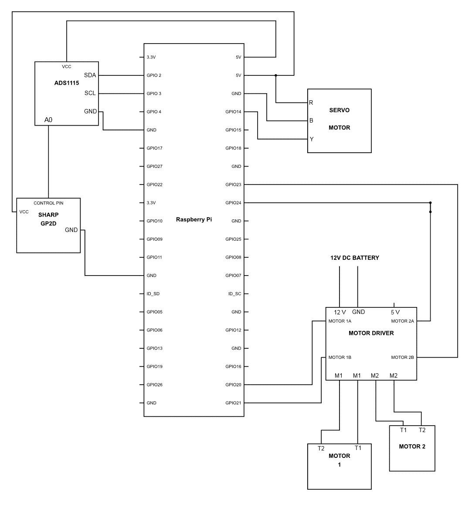

完成后，请上传以下代码：

```py
import RPi.GPIO as GPIO
import time
import Adafruit_ADS1x15

adc0 = Adafruit_ADS1x15.ADS1115()
GAIN = 1
adc0.start_adc(0, gain=GAIN)

GPIO.setmode(GPIO.BCM)
GPIO.setup(14,GPIO.OUT)

servo = GPIO.PWM(14, 50)
servo.start(0)

def Distance():
    D_value = adc0.get_last_result()
    D =    (1.0 / (F_value / 13.15)) - 0.35
    Return D

GPIO.setup(20,GPIO.OUT)
GPIO.setup(21,GPIO.OUT)
GPIO.setup(23,GPIO.OUT)
GPIO.setup(24,GPIO.OUT)

LForward = GPIO.PWM(20, 50)
LReverse = GPIO.PWM(21, 50)
RForward = GPIO.PWM(23,50)
RReverse = GPIO.PWM(24,50)

def stop():
    LForward.changeDutyCycle(0)
    LReverse.changeDutyCycle(0)
    RForward.changeDutyCycle(0)
    RReverse.changeDutyCycle(0)

def direction(index):

 if index == 0 :
    LForward.changeDutyCycle(0)
    LReverse.changeDutyCycle(30)
    RForward.changeDutyCycle(30)
    RReverse.changeDutyCycle(0)

elif index == 1

    LForward.changeDutyCycle(20)
    LReverse.changeDutyCycle(0)
    RForward.changeDutyCycle(50)
    RReverse.changeDutyCycle(0)

 elif index == 2 :

    LForward.changeDutyCycle(50)
    LReverse.changeDutyCycle(0)
    RForward.changeDutyCycle(50)
    RReverse.changeDutyCycle(0)

elif index == 3 :

    LForward.changeDutyCycle(50)
    LReverse.changeDutyCycle(0)
    RForward.changeDutyCycle(20)
    RReverse.changeDutyCycle(0)

 elif index == 4 :

    LForward.changeDutyCycle(20)
    LReverse.changeDutyCycle(0)
    RForward.changeDutyCycle(0)
    RReverse.changeDutyCycle(20)

 else:
 stop()

j=12.5
k=2.5
i=0

dist1=[]
dist2=[]

while True:

    while k<=12.5:
    servo.ChangeDutyCycle(k)
    time.sleep(.2)
    dist1.insert(i,Distance())
    k = k + 2.5
    i = i + 1

 print dist1

 i=0
 k=2

 max_dist1 = max(dist1)
 max_dist1_index = dist1.index(max_dist1)

 direction(max_dist1_index)

 del dist1[:]

 print max_dist1
 print max_dist1_index

 while j>=2.5:
    servo.ChangeDutyCycle(j)
    time.sleep(.2)
     j = j - 2.5
     dist2.insert(i,Distance())
    i = i + 1

print dist2

i=0
j=12

 max_dist2 = max(dist2)
 max_dist2_index = dist2.index(max_dist2)

 direction(max_dist2_index)

 del dist2[:]

 print max_dist2
 print max_dist2_index
```

呼！这可不短啊，不是吗？但请相信我，虽然可能很长，但并不难。那么，让我们看看这段代码在做什么：

```py
LForward = GPIO.PWM(20, 50)
LReverse = GPIO.PWM(21, 50)
RForward = GPIO.PWM(23,50)
RReverse = GPIO.PWM(24,50)
```

这些东西可能对你来说看起来相当新颖。尽管不是。我们正在做的是定义哪个引脚编号将以什么 PWM 频率运行。此外，我们还为所有用于电机控制的 GPIO 引脚命名。那么，既然我们在做所有这些，为什么我们突然开始给电机驱动器提供 PWM 信号呢？我们不是对简单地提供高脉冲感到满意吗？

答案非常直接。通过使用 PWM，我们在前面的章节中能够改变 LED 的亮度。同样，通过改变电机驱动器的控制引脚的 PWM 输出，我们不仅可以定义旋转的方向，还可以定义旋转的速度。这一切都是通过 PWM 完成的。所以，假设引脚编号`20`正在以 50%的占空比接收 PWM 信号。这意味着连接到它的电机将获得电机驱动器接收到的输入电压的一半。因此，现在我们不仅可以控制电机旋转的方向，还可以控制旋转的速度：

```py
def direction(index):

 if index == 0 :
    LForward.changeDutyCycle(0)
    LReverse.changeDutyCycle(30)
    RForward.changeDutyCycle(30)
    RReverse.changeDutyCycle(0)

elif index == 1
    LForward.changeDutyCycle(20)
    LReverse.changeDutyCycle(0)
    RForward.changeDutyCycle(50)
    RReverse.changeDutyCycle(0)
```

在这个语句中，我们定义了一个名为 `direction(index)` 的函数。这个函数的作用是比较索引的值，并根据它来给电机供电。比如说，索引是 0。在这种情况下，左侧的轮子会向相反方向移动，而右侧的轮子也会向相反方向移动，这将使机器人围绕其轴旋转。

在下一个语句中，我们编写了一个 `elif` 语句，所以如果 `else` 语句不成立，它将检查主体中的其余 `else if` 语句。在 `direction(index)` 的整个定义中，有四个 `elif` 语句，这意味着它将检查每一个，并根据参数的值执行相应的活动。在这种情况下，它是索引。此外，还有一个最终的 `else` 语句，如果所有情况都不成立，则会执行。因此，根据该语句，它将调用一个停止函数。这将使车辆停止：

```py
max_dist1 = max(dist1)
```

这一行非常有趣，因为我们使用了列表的另一个有趣的部分。所以，使用 `max()` 方法，我们可以在列表中找到最大的值。因此，在这一行中，我们只是简单地找到最大值并将其放入名为 `max_dist1` 的变量中：

```py
max_dist1_index = dist1.index(max_dist1)
```

列表的美妙之处似乎永远不会结束。在这一行中，我们使用了另一种名为 `index()` 的方法；此方法为我们提供了列表中值的索引。因此，我们可以知道值在列表中的位置。因此，在这一行中，我们证明了 `max_dist1` 的价值。`index()` 方法搜索索引号并将该值存储到名为 `max_dist1_index` 的变量中：

```py
 direction(max_dist1_index)
```

既然我们已经定义了函数 `Direction()`，现在我们所做的就是调用该函数以决定向哪个方向前进。然后，启动你的车辆并看看它们的驾驶表现如何，别忘了拍摄视频并上传到网上。

玩得开心！

# 摘要

专业激光扫描仪非常昂贵，因此，在本章中，我们决定自己构建一个替代品并将其安装到我们的车辆上。在下一章中，我们将涵盖诸如视觉处理、目标检测、目标跟踪等内容，这将使我们能够进行基本的视觉处理，并使汽车朝着特定物体（如球）的方向移动。
