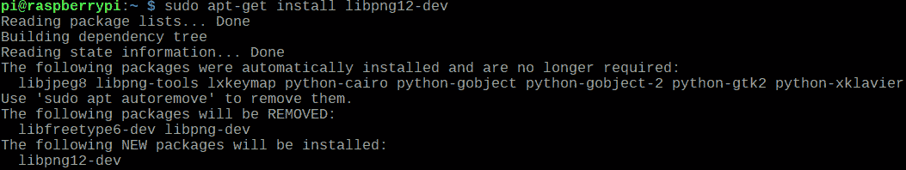

# 第九章：视觉处理

真是令人惊叹，我们能够通过简单的传感器和执行器组合做到的事情。毕竟，这些就是让机器人成为我们所知的样子的事物。如今市场上可供我们使用的传感器数量庞大。我们可以在机器人上安装数百个传感器，但有一件事能够超越所有其他传感器的力量。那就是相机。传感器为我们提供了有关物理环境的数据，而相机则让我们能够看到它。因此，这是一个相当重要的传感器，值得我们考虑。在本章中，我们将继续探讨如何将相机连接到我们的树莓派，并开始使用我们获取到的图像数据进行计算。

本章将涵盖以下主题：

+   图像的基本知识

+   为视觉处理应用准备树莓派

+   安装 OpenCV

+   图像识别

# 图像的基本知识

当我们提到相机时，我们并不一定将其视为传感器，尽管它确实是一种。然而，它与到目前为止我们所研究的所有传感器都略有不同。大多数传感器都由一个感应元件组成，例如接近感应、温度感应或被动红外感应。而使用相机，我们所做的是捕捉光线；现在，我们不再只有一个光传感器，而是有多个，实际上是在单个芯片上组成了一个百万级别的传感器阵列。但故事还没有结束，这些传感器不仅捕捉光线，还能捕捉不同强度的光线；它们可以感知颜色光谱及其相对亮度。执行这种功能的每个感应元件都被称为**像素**。大多数这些像素生成 RGB 值，这不过是红色、绿色和蓝色颜色的强度。为什么是 RGB 呢？这些是原色，以正确的比例混合这些颜色会产生不同的颜色阴影。

因此，如果我们有这些颜色的值，我们可以重新创建我们想要的颜色。正如我们之前所理解的，任何相机中都有数百万个这样的像素，构成了图像感应芯片的长度和宽度。这些图像感应元件的数据构成了图像。到目前为止，一切都很顺利。但我们为什么要谈论这个？原因在于，这就是相机看待世界的方式，而不仅仅是我们的视角。生物视觉完全是另一回事。因此，我们需要了解相机的工作原理以及它提供的原始数据，以便进行视觉处理。

现在，让我们回到像素及其数据。由于有数百万个这样的像素，因此必然有数百万个像素的读取值，这些读取值将以 RGB 值的形式出现。现在，这些数据必须以特定的形式排列，以便理解我们正在处理哪些像素数据。如果它们没有排列好，那么这些数据将没有任何意义。

如你之前所学，数组/列表是存储大量结构化数据的最佳方式，如果你看图像数据，那么它不过是单个结构化像素的 RGB 值。太棒了！所以，现在我们知道我们正在处理什么以及我们如何处理它。或者，我们真的知道吗？

如你所回忆，我们在这里讨论的图像是由数百万个像素组成的。因此，像素数据也将达到数百万级别。这些数据极其庞大，因为我们不仅谈论数百万个像素，还包括每个 RGB 值。换句话说，每个单独的像素都会给我们三个值，即红色、绿色和蓝色的值。换句话说，这是一大批数据。普通的列表无法处理这么多数据；因此，我们必须安装一个名为**NumPy**的特殊库来处理这些庞大的数组。在本章中，我们将需要安装和更新多个依赖项，以便 Raspberry Pi 能够进行视觉处理。我们将看到如何安装它。

现在继续前进，我们以非常结构化的方式拥有每个单个像素的数据，但我们究竟要做什么呢？好吧，正如你在前面的章节中学到的，当我们有结构化的数据时，我们可以进行多项操作，就像我们在上一章的列表中做的那样。我们正在处理的数据在某种程度上属于特定领域。也就是说，我们知道我们将接收到的数据将是图像数据。因此，有一些非常特定的库被制作出来以轻松完成这些任务。最常用的视觉处理算法之一是 OpenCV。它被广泛使用，并且这个库中有多个非常具体的功能，专门用于处理图像数据本身。所以，通过一个命令，你应该能够捕捉图像，通过另一个命令，我们将能够在图像上应用过滤器。不是 Instagram 的过滤器，而是将图像中的特定类型对象从其他对象中分离出来的过滤器。

最后，我们还将能够以所需的图像格式输出数据。因此，OpenCV 能做什么确实非常有趣。但请记住，这只是一个入门课程。OpenCV 本身可以是一个整本书的主题，但在这里，我试图给你们所有人一个关于视觉处理的预览。你们将学习基本命令以及如何使用它来制作项目。

现在是时候停止谈论并开始动手了。那么，让我们看看我们都需要做什么。

# 为视觉处理应用准备 Raspberry Pi

你首先需要确保你有足够的时间，也许还需要一些爆米花来打发时间。因为我们即将开始的过程可能会稍微长一些，可能需要几个小时。如果你有慢速的互联网连接，你甚至可能需要一整天。还有一点需要注意，随着时间的推移，软件和硬件两端可能会有各种新的更新。这可能会意味着一些命令可能无法工作或者可能需要一些修改。在这种情况下，搜索一下 Google 可能会有所帮助。所以，如果第一次尝试没有成功，不要担心。说了这么多，让我们开始准备你的 Raspberry Pi，确保我们为视觉处理准备好了所有先决条件。首先，我们需要为视觉处理应用准备我们的 Raspberry Pi。为了开始，确保你始终连接到互联网，一旦这个选项被勾选，然后继续在你的 Raspberry Pi 上打开终端。一旦你打开了终端，你需要输入以下命令：

```py
sudo apt-get update
sudo apt-get upgrade
```


因此，第一条命令会下载你的 Raspberry Pi 操作系统的更新，而第二条命令将会继续下载你的 Raspberry Pi 操作系统的升级。你明白我的意思了吗？不明白？让我再详细解释一下。

你的 Raspberry Pi 操作系统有多个用于执行不同活动的软件包。随着时间的推移，这些软件包会添加新的功能，所以当你更新操作系统时，你实际上是在更新你操作系统上软件包的功能。这是其中之一，有时也会向你的 Raspberry Pi 操作系统添加新的软件包。它们可能是为了各种附加功能。所以升级会在你的操作系统上添加新的软件包。

你可能想知道为什么这一切都是必要的？好问题。我们将使用多个库来使我们的代码工作。现在，制作这些库的开发者希望他的库比以往任何时候都要好，为了做到这一点，他使用了 Raspberry Pi 的最新软件包。所以现在当你尝试使用开发者的库时，有很大可能会需要最新的软件包和更新才能运行。因此，每隔几周更新和升级你的操作系统总是一个好主意。

到目前为止，我们只下载了那些更新和升级。我们实际上并没有安装它们。所以为了安装它们，我们需要输入以下命令：

```py
sudo rpi-update
```

完成这些后，你可能想重启你的 Raspberry Pi，以确保一切都能顺畅运行。为此，你可以手动重启它，或者你可以通过以下命令来采取专业的方法：

```py
sudo reboot
```


完美，所以现在我们的系统已经是最新的。现在我们需要安装一些特定于图像处理的包。没有这些包，进行任何视觉处理都会非常困难。这些单独的命令可能需要一些时间来执行，但请耐心等待，下载它们，然后我会解释这些都在做什么。所以，不要耽搁，让我们继续一个接一个地安装这些包：

```py
sudo apt-get install build-essential git cmake pkg-config
```


```py
sudo apt-get install libavcodec-dev libavformat-dev libswscale-dev libv4l-dev
sudo apt-get install libxvidcore-dev libx264-dev
```


```py
sudo apt-get install libjpeg8-dev 
```


```py
sudo apt-get install libtiff5-dev 
```


```py
sudo apt-get install libjasper-dev
```


```py
sudo apt-get install libpng12-dev
```



```py
sudo apt-get install libgtk2.0-dev
```


```py
sudo apt-get install libatlas-base-dev gfortran
```


```py
sudo apt-get install python2.7-dev python3-dev
```


完成后，你的系统将准备好所有由操作系统要求的进行视觉处理的前置条件。现在，让我们了解每个工具的作用：

+   `sudo apt-get install build-essential git cmake pkg-config`：这一行正在安装你可能需要的所有开发工具。

+   `sudo apt-get install libavcodec-dev libavformat-dev libswscale-dev libv4l-dev` 和 `sudo apt-get install libxvidcore-dev libx264-dev`：在这一行中，我们正在安装视频包和编解码器。这将确保系统准备好 I/O，以便我们可能稍后向其投递的视频。

+   `sudo apt-get install libjpeg8-dev libtiff5-dev libjasper-dev libpng12-dev`：正如我们为视频安装了包，我们也为图像做了同样的事情。

+   `sudo apt-get install libgtk2.0-dev`：我们正在安装一个名为`gkt`的开发库子包。很明显，当我们处理一些图像时，我们也可能希望将其输出，可能是以图像和简单 GUI 的形式，这个库告诉我们如何做到这一点。

+   `sudo apt-get install libatlas-base-dev gfortran`：视觉处理是一个 CPU 密集型任务，当我们处理的东西不像超级计算机那么强大时，我们必须确保我们没有浪费任何 CPU 性能。为了做到这一点，我们需要优化整个过程，而这个库帮助我们做到这一点。

+   `sudo apt-get install python2.7-dev python3-dev`：现在，在这一行中，我们正在安装 Python 2.7 和 Python 3 头文件。这是必要的，因为没有它们，我们就无法编译我们的代码。

现在，在所有前面的命令中，我们已经安装了视觉处理或换句话说，我们将要使用的 OpenCV 的依赖项。现在，我们需要准备 Python 的环境，以便我们可以运行 OpenCV。继续，打开终端，并输入以下命令：

```py
cd ~
wget -O opencv.zip https://github.com/Itseez/opencv/archive/3.4.0.zip
```


```py
unzip opencv.zip
```


```py
wget -O opencv_contrib.zip https://github.com/Itseez/opencv_contrib/archive/3.4.0.zip
```


```py
unzip opencv_contrib.zip
```


现在，让我们看看我们做了什么：

+   `cd~`: **cd** 代表 **更改目录**，而 `~` 符号代表主目录。所以基本上，我们正在切换到主目录，并且从现在开始要做的事情将在主目录本身完成。

+   `wget -O opencv.zip https://github.com/Itseez/opencv/archive/3.4.0.zip`: 这非常直接；我们正在从 GitHub 下载 OpenCV 文件。

+   `unzip opencv.zip`: 一旦我们下载了所有文件，我们需要解压这些文件以便使用。

+   `wget -O opencv_contrib.zip https://github.com/Itseez/opencv_contrib/archive/3.4.0`: 现在我们正在下载 `contrib` 文件。也就是说，这些是针对 OpenCV 开发的额外功能，这些功能是在 OpenCV 已有的功能之上增加的。

+   `unzip opencv_contrib.zip`: 现在这是一个显而易见的事情。我们正在解压我们刚刚下载的 `contrib` 文件。

完美！我知道这需要很长时间，这确实是一项任务。但这是不可否认的必要事情，没有它，我们就无法继续在我们的系统上进行视觉处理。所以现在我们已经完成了所有前面的任务，我们需要设置 Python。让我们继续做，然后我们会看到为什么这是必要的：

```py
wget https://bootstrap.pypa.io/get-pip.py
```


```py
sudo python get-pip.py
sudo pip install virtualenv virtualenvwrapper
```


```py
sudo rm -rf ~/.cache/pip
```


现在，让我们看看这是关于什么的：

+   `wget https://bootstrap.pypa.io/get-pip.py`: 现在我们正在获取 `pip` 包。PIP 的基本功能是管理 Python 系统中的包。

+   `sudo python get-pip.py`: 现在我们已经获取了包，是时候运行它了，为了做到这一点，我们只需要写下命令。

+   `sudo pip install virtualenv virtualenvwrapper`: 这个命令非常有趣。这个命令正在安装一个名为 `virtualenvwrapper` 的东西。现在，这是一个扩展，允许我们在虚拟环境中使用程序。为什么这是必要的？好吧，当我们谈论运行具有各种先决条件的各种程序时，这是一个救命稻草。所以，这通过在已经准备好所有先决条件的虚拟环境中运行所有程序，帮助我们让所有程序运行得很好。

+   `sudo rm -rf ~/.cache/pip`: 我们只是使用这个命令来清除缓存。

现在，在我们完成这些之后。我们不得不打开 `.profile` 文件。为了做到这一点，我们需要输入 `sudo nano ~/.profile` 命令。这个命令将打开配置文件，然后一旦打开，就在文件的末尾复制以下命令：

```py
export WORKON_HOME=$HOME/.virtualenvs
source /usr/local/bin/virtualenvwrapper.sh
```


为什么我们要这样做？基本上，终端需要知道虚拟环境在哪里，通过这样做，终端就会知道它。现在，再次启动终端；我们还需要加载一些其他的东西。所以，这就是我们需要做的：

```py
source ~/.profile
mkvirtualenv cv
source ~/.profile
workon cv
pip install numpy
```

现在你完成了所有这些命令后，让我们看看它们意味着什么：

+   `source ~/.profile`：这是为了确保一切设置就绪。

+   `mkvirtualenv cv`：这是创建一个名为`cv`的新环境，所有程序都将在这里运行。

+   `source ~/.profile`：现在，因为我们创建了一个新的虚拟环境，我们需要再次确保一切设置就绪，为此，我们需要再次输入这一行。

+   `workon cv`：这个命令将告诉系统我们正在使用我们刚刚通过名称`cv`创建的虚拟环境。

+   `pip install numpy`：这是一个非常重要的步骤；`numpy`是一个帮助我们管理大型多维数组的库。

在执行了所有前面的命令后，安装 OpenCV 的时刻终于到来了，我们需要使用以下命令：

```py
workon cv
cd ~/opencv-3.4.0/
mkdir build
cd build
cmake -D CMAKE_BUILD_TYPE=RELEASE \
    -D CMAKE_INSTALL_PREFIX=/usr/local \
    -D INSTALL_C_EXAMPLES=ON \
    -D INSTALL_PYTHON_EXAMPLES=ON \
    -D OPENCV_EXTRA_MODULES_PATH=~/opencv_contrib-3.4i.0/modules \
    -D BUILD_EXAMPLES=ON ..
```

好的，那么我们在这里做了什么？让我们看看：

+   `workon cv`命令很简单；我们告诉 Python 我们必须在一个名为`cv`的虚拟环境中工作。

+   使用`cd ~/opencv-3.4.0/`命令，我们更改目录并移动到已安装的 OpenCV 文件夹中。

+   在`mkdir build`命令中，我们创建了一个名为`build`的新文件夹。

+   在`cd build`命令中，我们再次使用了基本的`cd`命令。这是将目录更改为我们刚刚通过名称`build`创建的目录。

+   下一个命令是`cmake`。它所做的就是编译它被告诉编译的内容。所以，在接下来的整个命令中，我们正在将各种设置安装到我们的 Python 中。

我们已经开始编译各种设置，现在下一个命令相当重要。让我们看看它是什么：

```py
make -j4
```

现在，这个命令告诉树莓派在视觉处理时需要使用多少核心。本质上，树莓派总共有四个核心，所以通过输入命令`-j4`，我们告诉 Pi 我们将使用所有四个核心。显然，你可能会想，总是使用我们所有的马力是个好主意。但那绝对不是事实。因为如果我们使用所有核心，那么它可能无法执行任何其他任务。甚至无法接收用户的命令。所以，如果你想做一些同时任务，比如说将视觉处理数据应用到其他事情上，那么可能就不可能，因为你已经在处理过程中耗尽了所有的 CPU 计算能力。然而，现在并不是这种情况。因此，为了节省时间，我们将使用所有核心。

现在终于到了安装 OpenCV 的时候了。那么让我们看看我们该如何做：

```py
sudo make install
sudo ldconfig
```

如你所猜，`sudo make install`正在编译 OpenCV，而`sudo ldconfig`创建缓存并链接到重要的和最近共享的库。

好吧，你认为我们已经完成了。不，我们需要完成安装过程，但还有一些额外的步骤。这是最后一步，所以请再耐心一点，我们应该没有问题。以下是你需要执行的步骤：

```py
ls -l /usr/local/lib/python2.7/site-packages/
```

由于你已经安装了所有前面的步骤，现在 OpenCV 应该安装在这个目录部分。我们使用`ls`命令，该命令用于列出特定位置的目录。一旦完成，系统将返回以下截图所示的输出：


最后，一旦完成这一步，我们需要验证到目前为止我们所做的一切是否都已完成成功。为此，我们只需运行以下命令：

```py
workon cv
python
```

每次我们需要在 OpenCV 上工作时，都会使用`workon cv`命令，所以一旦这个命令执行完毕，然后`python`命令将打开 Python 库。如果在任何情况下 Python 库没有正确安装，它将返回一些错误，这意味着步骤没有成功，在这种情况下，您将需要重新安装 OpenCV。如果一切正常，它将返回以下截图所示的详细信息：


哇哦！最后，我们完成了安装。现在我们一切准备就绪，可以开始在树莓派上进行视觉处理。

# 图像识别

现在，为了继续进行视觉处理，让我们将摄像头连接到树莓派。一旦完成，你需要编写以下代码：

```py
import cv2
import numpy as np
cap = cv2.VideoCapture(0)

while True:
        _, image = cap.read()
        cv2.imshow("Frame", image)
        hsv = cv2.cvtColor(image, cv2.COLOR_BGR2HSV)

        lowerGreen = np.array([80,50,50])
        upperGreen = np.array([130,255,255])

        mask = cv2.inRange(hsv, lowerGreen, upperGreen)
        res = cv2.bitwise_and(image, image, mask=mask)
        cv2.imshow('mask',mask)
        cv2.imshow('result',res)
        key = cv2.waitKey(1) & 0xFF

        if key == ord('q'):
                break
cv2.destroyAllWindows()
cap.release()
```

在你实际编译此代码之前，让我告诉你我们到底在做什么：

```py
import numpy as np
```

在上一行中，我们导入库`numpy`为`np`，换句话说，我们已经导入了库，每次需要调用时我们只需写`np`：

```py
cap = cv2.VideoCapture(0)
```

在上一行中，我们告诉树莓派从特定端口捕获视频。现在你可能想知道我们如何知道它连接到哪个端口？

关于端口，与 GPIO 不同，它们不是硬件依赖的，而是软件分配的。所以如果你的摄像头是第一个连接到 USB 端口的设备，那么它很可能连接到端口`0`。

在这个例子中，我们只添加了一个 USB 摄像头作为硬件；因此，我们可以非常确信它只会在端口`0`。

现在命令不仅用于端口选择。它的主要工作是捕获摄像头视频。现在，每次我们需要通过我们给定的名称`cap`而不是整个函数本身来调用它：

```py
_, image = cap.read()
```

在上一行，我们使用名为 `cap` 的函数 `cv.VideoCapture(0)`。我们还使用了一个名为 `read()` 的函数。现在，这将返回两件事。首先，它将返回一个布尔值，或者说，是或否。也就是说，图像是否已经成功捕获。第二个读取，我们更关心的是，是从图像中读取的整个帧。所有这些数据将以数组的形式存储：

```py
        cv2.imshow("Frame", image)
```

在这一行，我们使用库 `cv2` 和该库的一个名为 `imshow()` 的函数。这样做的作用是显示由相机捕获的图像。现在继续前进，我们有两个参数正在传递，那就是，“帧”和 `image`。帧是显示捕获图像的窗口的名称。进一步来说，我们有第二个参数 `image`。现在，正如我们记得的，我们已经将图像存储在名为 `image` 的变量中。所以，它将直接显示我们在上一行中已经存储的内容：

```py
hsv = cv2.cvtColor(image, cv2.COLOR_BGR2HSV)
```

在这一行，我们正在做一件令人惊叹的事情。`cvtColour()` 函数是一个转换器。它转换什么？众所周知，图像是由二维像素数组组成的。这个函数所做的就是将我们的相机给出的值转换成用户期望的值。

让我更详细地解释一下。我们使用的相机给我们提供 RGB 图像。所以我们可以看到的是三种颜色的亮度混合。现在，为了我们的检测，我们希望将其转换为色调、饱和度和亮度。你可能会问，为什么我们要这样做，首先，这使我们的任务变得非常简单。所以为了理解这一点，让我们看看色调、饱和度和亮度是什么。

色调基本上代表我们正在谈论的颜色。每个色调值代表一种特定的颜色，饱和度是颜色的强度。所以饱和度越高，颜色越深，饱和度越低，颜色越淡。最后，亮度——这个术语可能会让人困惑；这基本上意味着图像中有多少黑色。所以让我给你一个粗略的例子：


现在第一张图像显示了色调：`100`，饱和度：`100`，和亮度：`100`。因此，黑色是零，颜色是绿色，饱和度是 `100`%。在随后的图片中，你可以看到当饱和度保持在较低百分比时，颜色已经变淡。最后，在下一张图像中，当亮度降低时，颜色变得非常暗。

所以现在回到要点，为什么要使用色调、饱和度和亮度？现在为了检测任何颜色，我们只需要一个单位，而不是形成该颜色的三个不同单位，这使得工作变得更简单。还有其他各种原因要做这件事，但在这个时候，这并不是我们关心的。

现在继续前进，我们已经传递了两个参数——`image`，这是转换算法将从其中获取原始数据的地方，第二个是`cv.Colour_BGR2HSV`，它基本上告诉我们转换过程中要使用的算法。所以正如我们之前讨论的，我们必须将 RGB 值转换为**色调饱和度值**（**HSV**）。最后，这些值将返回到名为`hsv`的变量中：

```py
        lowerGreen = np.array([40,50,50])
        upperGreen = np.array([80,255,255])
```

在这一行，我们正在提供需要检测的上限和下限值。如您所见，我们正在检测绿色；因此，我们将为两端提供上限和下限值。如果您想更改要检测的颜色，那么您只需更改此值，工作就会完成：

```py
mask = cv2.inRange(hsv, lowerGreen, upperGreen)
```

现在，我们正在将落在该颜色范围内的对象分离出来，并将值赋予一个数组。这是通过一个名为`inRange()`的函数部分完成的。因此，我们需要传递三个参数。首先，它需要处理哪张图像，它需要检测的下限值是什么，以及我们提供的上限值`hsv`、`lowerGreen`、`upperGreen`。这个结果将是一个数组，它将具有所有颜色变为黑色的值，而特定颜色范围内的颜色将以纯白色显示：

```py
res = cv2.bitwise_and(image, image, mask=mask)
```

`bitwise_and`是`cv2`库中的一个函数；它所做的只是对数组中的两个值进行逻辑与操作。我们传递的参数是`image`和带有`mask`的图像，或者换句话说，我们传递了两个图像——一个是原始图像，另一个是`mask`。使用这个函数，我们结束了这两张图像。这个结果将是一个背景全黑的图像，而位于特定颜色范围内的对象将以适当的颜色显示在一张彩色图像中：

```py
cv2.imshow('mask',mask)
```

我们之前使用了一个名为`cv2.inRange`的函数，它所做的就是过滤掉我们定义的特定颜色范围。现在，这个函数通过名为`mask`的新数组给我们。它有一个数组，除了那些落在特定颜色范围内的值之外，所有值都是 null。范围内的图像将是这里唯一要显示的图像。这将导致一个周围全黑的图像，除了颜色在指定范围内，结果是一个白色图像。在我们的程序中，我们使用`cv2.inRange`并将值存储在一个名为`mask`的变量中。

`cv2.imshow()`函数是我们之前也使用过的一个函数。这个函数简单地显示了数组的最终图像。因此，我们给出了`cv2.imshow('mask',mask)`的命令；因此，它将打开一个名为`'mask'`的窗口，然后在该窗口中，它将显示存储在`mask`变量中的结果图像：

```py
        cv2.imshow('result',res)
```

我们在这里做的是类似的事情。在上面的行中，我们使用了名为 `cv2.bitwise_and()` 的函数。这个函数用于执行两个图像数组（即 `image` 和 `mask`）的逻辑与操作，其结果是 `res`；因此，它会显示与之对应的图像。现在我们已经完成了 `image` 和 `mask` 的逻辑部分，输出将是一个周围都是黑色的图像，但属于我们选择的类别的那部分将以原始颜色显示：

```py
        key = cv2.waitKey(1) & 0xFF
```

这很有趣。`cv2.waitKey()` 函数给出了按下的键的值。但是问题在于它返回一个 32 位整数值。然而，当我们谈论 ASCII 时，它只返回 8 位数据。因此，我们只需要从`waitKey()`函数返回的 32 位整数值中查找这 8 位。现在为了做到这一点，我们正在对`waitKey()`接收到的值和十六进制数`0xFF`进行逻辑与操作。这个十六进制数在十进制中是`11111111`。所以当我们把 32 位整数加到十六进制数上时，我们只剩下最后 8 位值，这也是我们唯一相关的部分。因此，键的值将是一个 8 位的 ASCII 值：

```py
        if key == ord('q'):
                break
```

现在我们正在使用一个简单的`if`语句将键的值与`ord('q')`进行比较。`ord`函数的作用是接收参数并将其转换为 ASCII 值。所以，在这个函数中，如果按下*q*键，那么循环就会中断，程序就会退出：

```py
cv2.destroyAllWindows()
```

这是一个非常简单的命令。它将关闭我们使用`cv2.imshow()`打开的所有窗口。

```py
cap.release()
```

使用这个函数，我们正在释放相机。因此，使这个资源空闲并准备好被其他程序使用。

# 摘要

在本章中，你学习了如何计算从将图像与树莓派耦合中获取的图像数据。在下一章中，你将学习如何制作一个可以进行面部识别的守护机器人。
