# 第十二章：使用 Jarvis 识别人类

到目前为止，我们在上一章中已经了解到如何将多个条件层叠在一起以获得所需的功能。我们刚刚完成了让 Jarvis 为你工作的第一步。现在，是时候让它变得更加强大。

在本章中，我们将让它控制你家里的更多电子设备，这些设备可以在不告诉你任何信息的情况下自主控制。所以，不要拖延，让我们直接进入主题，看看我们的桶里有什么。

# 打开 Jarvis 的灯光

智能家居的一个基本功能是在你周围时为你打开灯光。这是任何系统可以为你做的最基本的事情之一。我们将从一进入房间就打开灯光开始，然后我们将使系统变得越来越智能。

所以，我们首先需要做的是识别你是否在房间里。有多种方法可以做到这一点。生命的一个重要特征是运动的存。你可能会说植物不动，但它们确实会动；它们会生长，不是吗？所以检测运动可以是检测是否有人在场的关键步骤！

这一步对你来说不会太难，因为我们之前已经接口了这个传感器。我们说的是那个古老的 PIR 传感器。所以，传感器会检测到该区域内的任何运动。如果有任何运动，Jarvis 将会打开灯光。我相信你现在可以自己完成这个任务。你仍然可以参考这里的代码和电路图：

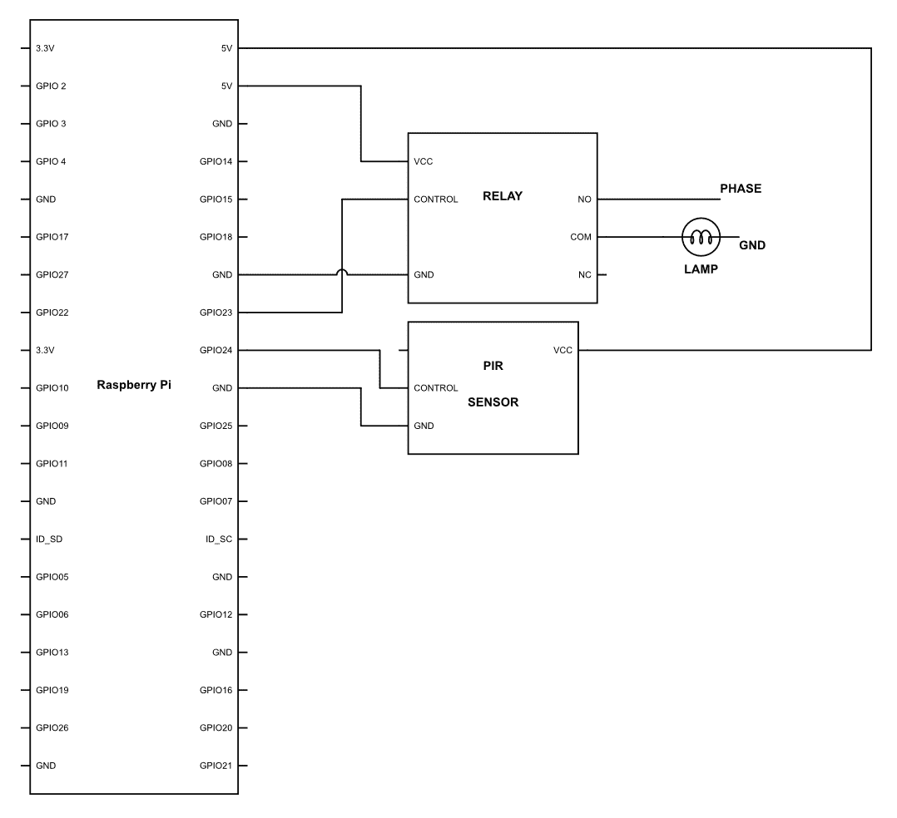

现在请上传以下代码：

```py
import RPi.GPIO as GPIO
import time
GPIO.setmode(GPIO.BCM)
GPIO.setwarnings(False)
PIR = 24
LIGHT = 23
GPIO.setup(DOPPLER,GPIO.IN)
GPIO.setup(BUZZER,GPIO.OUT)
While True:
   if GPIO.input(PIR) == 1:
       GPIO.output(LIGHT,GPIO.HIGH)
   if GPIO.input(PIR) == 0:
       GPIO.output(LIGHT,GPIO.LOW)
```

在前面的代码中，我们只是在检测到运动时立即打开灯光，但问题是它只会打开灯光，直到运动停止。这意味着什么？简单来说，只要有运动，就会保持灯光开启，一旦运动停止，就会关闭灯光。

这可能是一个想要减肥的人的好代码，但对于我们大多数人来说，这会让人烦恼。所以，让我们加入一个小循环，这是我们之前章节中使用过的，让这个功能变得更好：

```py
import RPi.GPIO as GPIO
import time

GPIO.setmode(GPIO.BCM)
GPIO.setwarnings(False)

PIR = 24
LIGHT = 23
TIME = 5

GPIO.setup(PIR,GPIO.IN)
GPIO.setup(BUZZER,GPIO.OUT)

While True:

   If GPIO.input(PIR) == 1:

       M = datetime.datetime.now().strftime('%M')
       M_final= M + TIME

       for M < M_final:

         GPIO.output(LIGHT,GPIO.HIGH)
         M = datetime.datetime.now().strftime('%M')

         if GPIO.input(PIR) == 1:
            M_final = M_final + 1 

    if GPIO.input(PIR) = 0:

        GPIO.output(LIGHT, GPIO.LOW)}

```

因此，在这个程序中，我们所做的一切就是添加了一个 `for` 循环，它会打开灯光一段时间。这个时间可以通过改变变量 `TIME` 的值来切换。

在那个循环中还有一个更有趣的部分，如下所示：

```py
         if GPIO.input(PIR) == 1
            M_final = M_final + 1 
```

你可能会想知道我们为什么要这样做？每当灯光打开时，它会持续 5 分钟。然后，它会关闭并等待运动发生。所以，本质上，这个代码的问题在于如果你在房间里，灯光打开后，它会持续 5 分钟检查是否有运动检测到。有可能你在 5 分钟后搜索运动时正在移动。但大多数时间，情况并非如此。因此，我们使用 PIR 传感器来检测运动。一旦检测到运动，`M_final`的值就会通过`M_final = M_final + 1`这一行增加，从而增加灯光开启的时间。

# 理解运动

到现在为止，你必须已经意识到 PIR 传感器并不是我们用来开关灯的最理想的传感器。主要是因为，尽管运动是存在的一个最好的指标，但有时你可能根本不会移动，例如，在休息、读书、看电影等等。

我们现在该做什么呢？嗯，我们可以玩一个小技巧。记得在上一个章节中，我们使用我们的接近传感器来检测一个人是否穿过了特定的区域吗？我们在这里将植入类似的逻辑；但不是简单地复制粘贴代码，我们将改进它，让它变得更好。

因此，我们不会使用单个红外接近传感器，而是将使用两个这样的设备。安装方式如下所示：

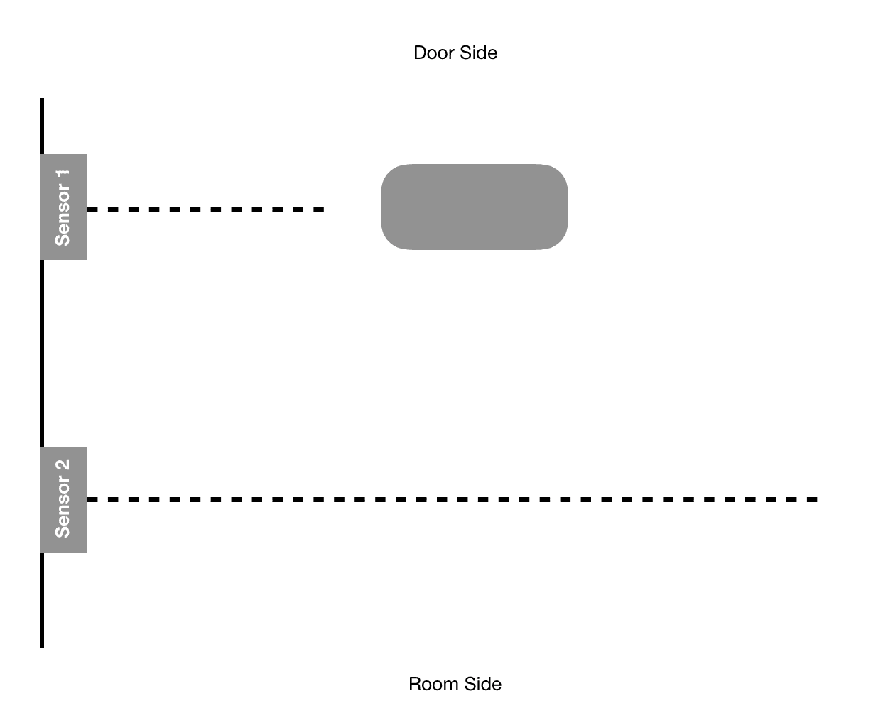

现在很明显，当一个人从门口走到房间那边时，**传感器 1**在检测到人体时会显示较低的读数。然后，当他朝房间方向走时，**传感器 2**将显示类似的读数。

如果首先**传感器 1**被触发，然后**传感器 2**被触发，那么我们可以安全地假设这个人是从门口走到房间那边。同样，如果情况相反，那么可以理解这个人是从房间里走出来的。

现在这一点相当简单。但如何在现实生活中实现它呢？首先，我们需要按照以下方式连接电路：

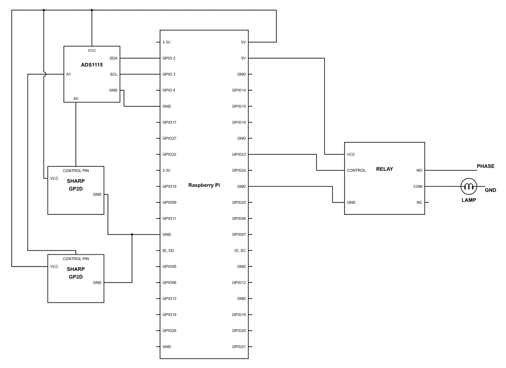

完成这些后，上传以下代码：

```py
import GPIO library
import RPi.GPIO as GPIO
import time

import Adafruit_ADS1x15
adc0 = Adafruit_ADS1x15.ADS1115()

GAIN = 1
LIGHT = 23

adc0.start_adc(0, gain=GAIN)
adc1.start_adc(1, gain=GAIN)

GPIO.setmode(GPIO.BCM)
GPIO.setwarnings(False)

while True:

   F_value = adc0.get_last_result()
   F1 =    (1.0 / (F_value / 13.15)) - 0.35

   time.sleep(0.1)

   F_value = adc0.get_last_result()
   F2 =    (1.0 / (F_value / 13.15)) - 0.35

   F0_final = F1-F2

   if F0 > 10 :

        Time0 =  time.time()

   F_value = adc1.get_last_result()
   F1 =    (1.0 / (F_value / 13.15)) - 0.35

   time.sleep(0.1)

   F_value = adc1.get_last_result()
   F2 =    (1.0 / (F_value / 13.15)) - 0.35

   F1_final = F1-F2

   if F1 > 10: 

        Time1 =  time.time()

    if Time1 > Time0:

        GPIO.output(LIGHT, GPIO.HIGH)

    if Time1 < Time0:

        GPIO.output(LIGHT, GPIO.LOW)      }
```

现在，让我们看看我们在做什么。像往常一样，大多数语法都非常简单直接。最重要的是逻辑。所以，让我们按照适当的步骤来理解我们在做什么。

```py
   F_value = adc0.get_last_result()
   F1 =    (1.0 / (F_value / 13.15)) - 0.35

   time.sleep(0.1)

   F_value = adc0.get_last_result()
   F2 =    (1.0 / (F_value / 13.15)) - 0.35
```

在代码的前几行中，我们正在读取红外接近传感器的值，并计算相应的距离，然后将该值存储在一个名为`F1`的变量中。一旦完成，我们使用`time.sleep(0.1)`函数暂停短暂的`0.1`秒。之后，我们再次从同一传感器读取值，并将该值存储在名为`F2`的变量中。我们为什么要这样做？我们已经在之前的章节中理解了这一点。

```py
  F0_final = F1-F2
```

一旦获得了`F1`和`F0`的值，我们将计算差值以确定是否有人通过它。如果没有人在通过，那么读数几乎会相同，差异不会很大。然而，如果有人通过，那么读数将相当明显，并且该值将存储在一个名为`F0_final`的变量中。

```py
   if F0 > 10 :

        Time0 =  time.time()
```

如果`F0`的值或第一次和第二次读数之间的距离超过 10 厘米，那么`if`条件将为真。一旦为真，它将设置`Time0`变量的值为当前时间。`time.time()`函数将记录确切的时间。

```py
   F_value = adc1.get_last_result()
   F1 =    (1.0 / (F_value / 13.15)) - 0.35

   time.sleep(0.1)

   F_value = adc1.get_last_result()
   F2 =    (1.0 / (F_value / 13.15)) - 0.35

   F1_final = F1-F2

   if F1 > 10: 

        Time1 =  time.time()
```

现在，我们将对**传感器 2**执行完全相同的步骤。这里没有什么新的内容要说明；一切都是不言自明的。

```py
    if Time1 > Time0:

        GPIO.output(LIGHT, GPIO.HIGH)
```

一切都完成后，我们比较`if Time1 > Time0`。我们为什么要比较它？因为`Time0`是**传感器 1**记录的时间。如果有人进入房间，那么**传感器 1**将是第一个被触发的，然后是**传感器 2**。因此，记录的时间对于**传感器 2**会更大，而对于**传感器 1**则相对较早。如果发生这种情况，那么我们可以假设有人正在进入房间。嗯，如果有人进入房间，那么我们只需要打开灯光，这正是我们在这里所做的事情。

```py
    if Time1 < Time0:

        GPIO.output(LIGHT, GPIO.LOW)
```

同样，当有人离开时，首先被触发的传感器将是**传感器 2**，然后**传感器 1**将被触发。这使得记录的`Time1`早于`Time2`；因此，每当这个条件为真时，我们就知道有人正在离开房间，可以关闭灯光。

好吧，把它安装在门附近，看看它的反应。我相信这会比我们通过 PIR 所做的好得多。享受这个过程，并尝试找出它可能存在的任何缺陷。

# 完善运动

你是否在之前的代码中发现了任何缺陷？它们并不难找；当房间里只有一个人时，代码工作得非常出色。如果这个系统安装在一个有很多人进出的地方，那么可能会有些挑战。这是因为每当有人离开房间时，灯光就会熄灭。

既然问题已经很明显，是时候让代码变得更加完美了。为此，硬件将保持完全不变；我们只需要让代码更智能。让我们看看我们如何做到这一点：

```py
import GPIO library
   import RPi.GPIO as GPIO
   import time
   import time
   import Adafruit_ADS1x15
   adc0 = Adafruit_ADS1x15.ADS1115()
GAIN = 1
 adc0.start_adc(0, gain=GAIN)
adc1.start_adc(1, gain=GAIN)
GPIO.setmode(GPIO.BCM)
GPIO.setwarnings(False)
PCount = 0
while True:
   F_value = adc0.get_last_result()
   F1 = (1.0 / (F_value / 13.15)) - 0.35
   time.sleep(0.1)
   F_value = adc0.get_last_result()
   F2 = (1.0 / (F_value / 13.15)) - 0.35
   F0_final = F1-F2
   if F0 > 10 :
        Time0 = time.time()
   F_value = adc1.get_last_result()
   F1 = (1.0 / (F_value / 13.15)) - 0.35
   time.sleep(0.1)
   F_value = adc1.get_last_result()
   F2 = (1.0 / (F_value / 13.15)) - 0.35
   F1_final = F1-F2
   if F1 > 10:
        Time1 = time.time()
    if Time1 > Time0:
        PCount = PCount + 1
    if Time1 < Time0:
        PCount = PCount - 1

if PCount > 0:

           GPIO.output(LIGHT, GPIO.HIGH)
       else if PCount = 0:
          GPIO.output(LIGHT, GPIO.LOW)        
```

我们所做的是一些非常基础的事情。我们声明了一个名为 `PCount` 的变量。这个变量是用来计算在一个房间或家中的人数。正如您可以在代码的前几行中看到的那样，我们已将 `PCount` 的值声明为 `0`。我们假设一旦开始这个操作，室内的人数将是 `0`。

```py
    if Time1 > Time0:

        PCount = PCount + 1
```

每当满足条件 `if Time1 > Time0:` 时，`PCount` 值会增加 `1`。众所周知，只有当有人在室内行走时，这个条件才会为真。

```py
    if Time1 < Time0:

        PCount = PCount - 1
```

同样，当一个人在室外行走时，条件 `if Time1 < Time0:` 为真；每当这种情况发生时，`PCount` 的值会减少 `1`。

```py
    if PCount > 0:

       GPIO.output(LIGHT, GPIO.HIGH)
```

现在我们已经开始计算房间内的人数，我们现在应用的条件是，如果 `PCount` 的值大于 `0`，则该条件会被触发。因此，当室内的人数大于 `0` 时，灯光将会亮起。

```py
    else if PCount = 0:

       GPIO.output(LIGHT, GPIO.LOW)
```

以非常相似的方式，如果 `PCount` 的值或室内的人数达到 `0`，灯光将会关闭。

因此，大功告成！

# 控制强度

我们已经控制了很多灯光。现在是时候控制我们的风扇和其他空气循环系统了。当我们谈论风扇或任何其他空气循环设备时，本质上我们是在谈论电机。正如我们之前所学，电机是简单的设备，可以很容易地使用电机驱动器来控制。但是，正如您所知，当时我们是在控制直流电机。直流电机是极其简单的设备。但是当我们谈论我们的家用电器时，那么这些设备中的大多数都将使用交流电或交流电流。我假设您必须知道这是什么以及它与直流电的不同之处。

现在您知道了我们家庭中使用的电机是使用交流电工作的，您也必须考虑这样一个事实，它们的控制机制将与直流电机大不相同。您想得没错。然而，电子学的好处是，没有什么真的是困难的或复杂的。基础原理基本上是相同的。那么，让我们看看我们如何控制交流电源中电机的速度。

如我们之前所见，我们可以简单地给直流电机一个 PWM 信号，电机就会以 PWM 信号的平均电压速度运行。现在，您可能正在想这也可以应用于交流电。事实上，如果想要控制灯光或类似设备，这是可以做到的，因为这些设备在波形失真时没有太大的特性变化。然而，当我们谈论其他任何组件时，我们就会遇到一个大问题。交流波形看起来是这样的：

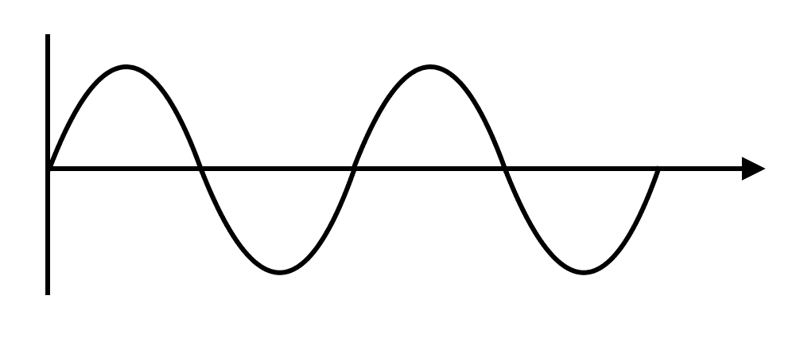

这基本上意味着电位在周期性地变化。在大多数家庭中，这是每秒 50 次。现在，想象一下，如果我们有一个 PWM 控制的设备，它只允许在特定间隔内让电源通过电路。那么，正弦波的不同部分就会被传输到最终的输出。

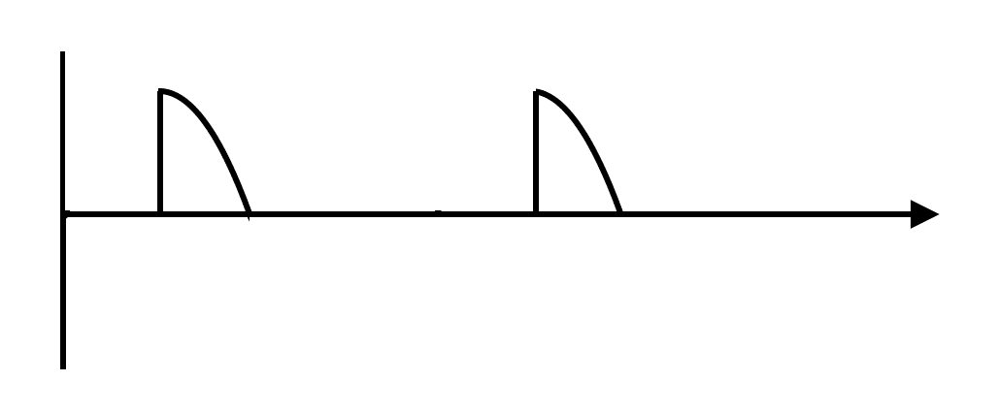

正如你在前面的 PWM 中看到的，幸运的是，PWM 信号与交流电的相位匹配；然而，由于这个原因，只有相位的正端被传输到最终的输出，而负端没有。这将给我们的负载带来严重问题，而且有很大可能性连接的设备将无法工作。

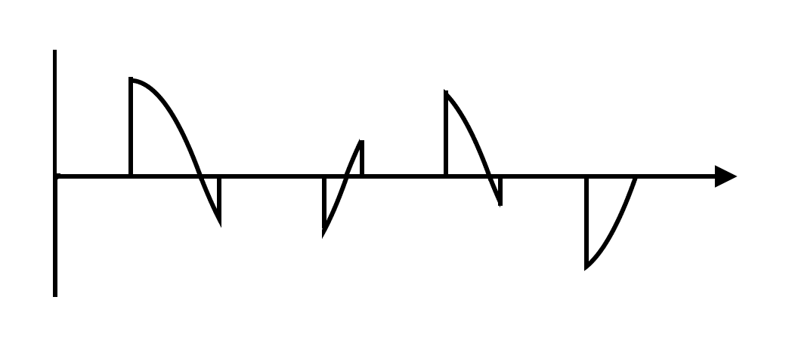

我们还有一个例子，其中 PWM 是随机的，它让波的随机部分通过。在这个例子中，我们可以清楚地看到波的任何部分都在被传输，正负端电压没有同步，这又是一个大问题。因此，我们不是使用 PWM，而是使用一些真正有趣的东西。

最常用的方法是称为**相位触发控制**。有时它也被称为相位角控制或相位斩波。它本质上是在相位的某些部分进行斩波，让其余的波通过。困惑吗？让我在这里展示给你：

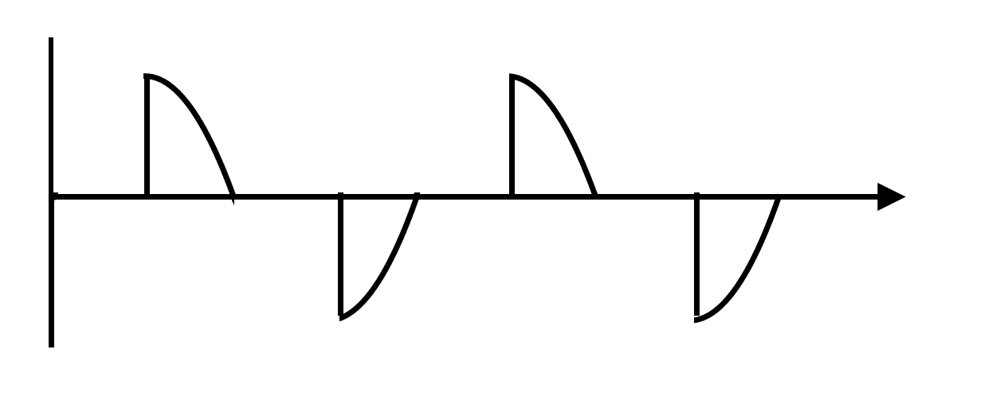

现在，正如你所见，交流波后半部分的相位正在被斩波，并且没有通过到最终的输出中。这使得最终的输出只有整体输入的 50%。这种技术的作用是，在保持电源的交流特性的同时，还能降低整体输出电压。同样，正如你在下一张图中可以看到的，波在 75%已经通过后开始斩波。这导致输出相对较低：

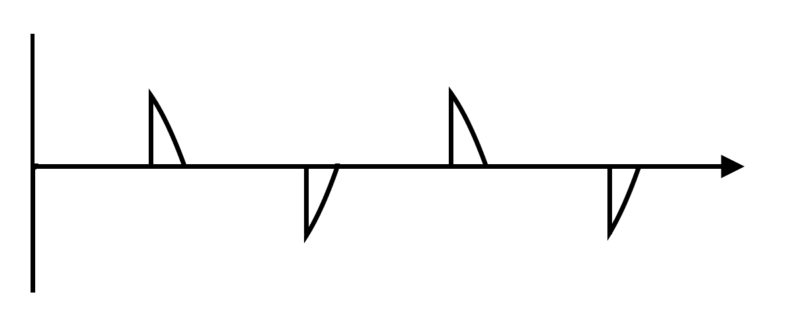

现在你可能想知道，我们是如何实际进行这一操作的？这是通过一个相对复杂的电路来完成的，该电路检测波的相位角，然后打开或控制一个晶闸管，这是一个高功率的双向半导体。这导致电源在特定相位通过或停止。我们将具体电路的工作原理留到下次讨论，因为它相当复杂，并且与这本书的内容不太相关。

现在回到基本点，我们知道什么是相位斩波，我们也知道晶闸管是我们做这件事的基本设备。但问题是，我们如何使用 Raspberry Pi 来实现它。

首先，我们需要一个交流调光模块。这个模块已经包含了相位检测和斩波的所有组件。所以我们只需要简单地通过简单的 PWM 来控制它。

虽然我可能不需要演示如何连接电路或代码应该是什么，但为了理解，让我们使用这个模块将灯泡连接到我们的 Arduino 上，然后控制灯泡。现在，首先要记住的是，负载应该是灯泡，而不是其他任何东西，比如 LED 灯。所以，按照以下图示连接电路：

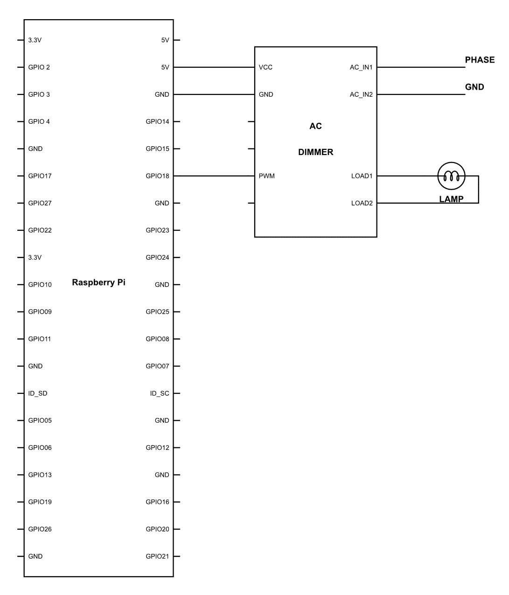

完成这些后，继续上传以下代码：

```py
import RPi.GPIO as GPIO
import time                             
GPIO.setmode(GPIO.BCM)       
GPIO.setup(18,GPIO.OUT)         
I = 0
pwm= GPIO.PWM(18,50)

for I < 100:

    I = I+1
    pwm.start(I)
    time.sleep(0.1)

GPIO.cleanup()}
```

如预期的那样，附带的灯光将首先开始微弱地发光，并逐渐增加强度，直到达到 100%。这就是控制如此复杂过程如此简单的原因。

# 智能温度控制

现在基础知识已经完成，让我们继续使用这个系统构建一些有意义的东西。调整空调到完美的温度是不是很难？无论你做什么，你最终都会感到不舒服。这是由于一天中体温的生理变化所导致的。

当你醒来时，你的体温相对较低。它低至 1°F，低于正常体温。随着一天的发展，体温升高，直到你上床睡觉的时间。一旦你入睡，你的体温又开始下降，在早上 4:00-6:00 达到最低点。这就是为什么当你上床睡觉时可能感觉温暖，但醒来时可能会非常冷的原因。现代空调有一种叫做睡眠模式的功能。这样做就是，它简单地通过整夜提高温度。这样你就不在任何时候感到冷。但话又说回来，它工作得有多好也是一个问题。

因此，既然我们已经非常了解机器人技术，我们将继续前进，制作我们自己的系统，该系统将负责一切。

在这部分，我们将空调和你的风扇连接在一起，这样它们就可以协同工作，让你睡得更好。现在，在我们直接进入之前，我想让你看看继电器上提到的评级。正如你所见，继电器只能处理 250 伏和 5 安培。现在，如果你查看你的空调手册，你很容易理解为什么我要向你展示所有这些。空调的功耗将远高于继电器可以处理的功耗。所以，如果你尝试使用普通继电器来运行你的空调，你肯定会烧毁继电器。可能你的电器电流额定值低于你的继电器。但是，对于任何内部有电机的设备，请记住，该设备的初始功耗远高于标称功耗。因此，如果你的空调标称需要 10 安培，那么启动负载可能高达 15 安培。你可能正在想，这不是问题，我们为什么不去购买一个更高额定值的继电器呢？好吧，正确！这正是我们将要做的。但是，电子设备的命名有时可能会很棘手。处理高功率、高电压机电开关的设备通常被称为接触器，而不是继电器。技术上，它们有相同的工作原理；然而，在这一点上，这不会是我们的关注点。因此，我们将使用接触器来切换空调，使用调光器来控制风扇速度。现在，这个问题已经澄清，让我们继续按照以下图示安装硬件：

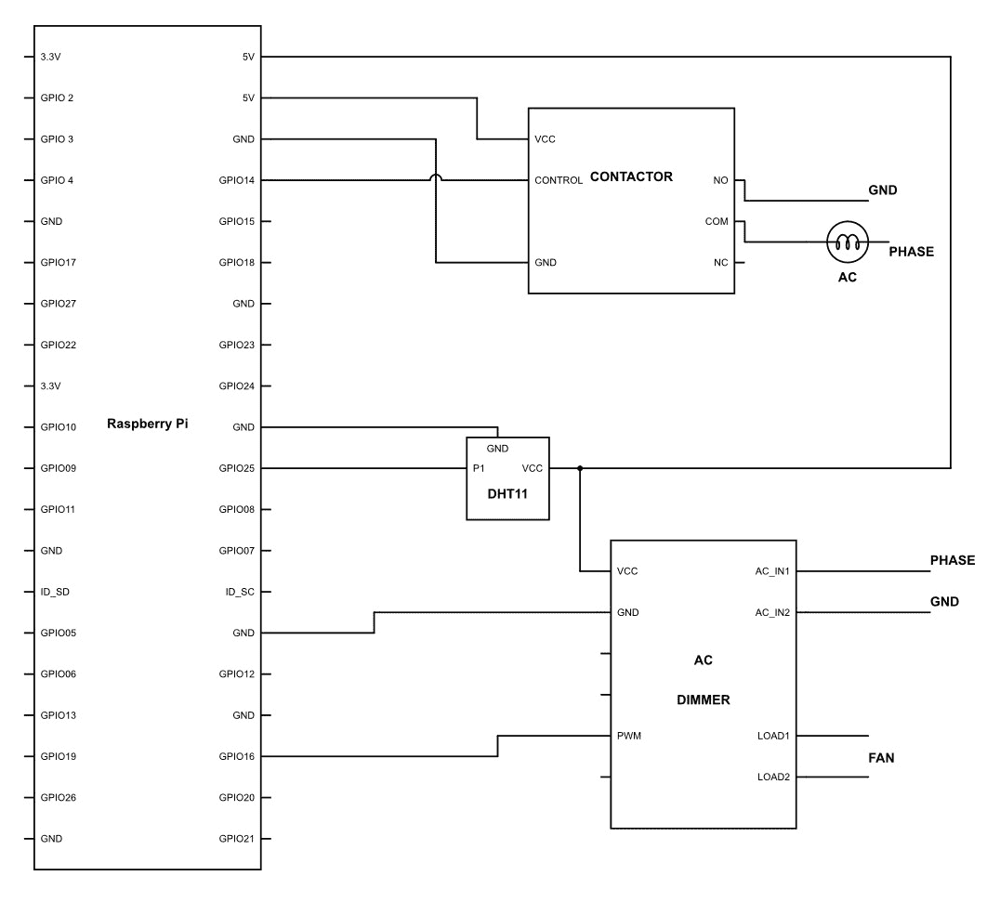

```py
import RPi.GPIO as GPIO
import time 
import Adafruit_DHT

GPIO.setmode(GPIO.BCM)

FAN = 18
AC = 17

pwm= GPIO.PWM(18,50)
GPIO.setup(FAN,GPIO.OUT)
GPIO.setup(AC, GPIO.OUT)

while True:

    humidity, temperature = Adafruit_DHT.read_retry(sensor, pin)

    if temperature =>20 && temperature <=30:

        Duty = 50 + ((temperature-25)*10)
        pwm.start(Duty)

    if temperature <22 :

         GPIO.output(AC, GPIO.LOW)

    if temperature >= 24

         GPIO.output(AC, GPIO.HIGH)}

```

这里使用的逻辑相当基础。让我们看看它在做什么：

```py
    humidity, temperature = Adafruit_DHT.read_retry(sensor, pin)

    if temperature =>20 && temperature <=30:

        Duty = 50 + ((temperature-25)*10)
        pwm.start(Duty)
```

在这里，我们正在获取`湿度`和`温度`的值。到目前为止，一切顺利，但我们能否更进一步，让它变得更加智能？之前的逻辑可能已经帮助你睡得更好，但我们能否让它对你来说更加完美？

我们的身体中有多个指标，可以让我们了解身体的状况。例如，如果你感到疲倦，你可能不会走得很快或说话很大声。相反，你可能会做相反的事情！同样，也有多个因素可以指示我们的睡眠周期如何进行。

其中一些因素包括：体温、呼吸速率、REM 睡眠和身体运动。精确测量体温或呼吸速率以及 REM 睡眠是一项挑战。但是当我们谈到身体运动时，我认为我们已经做得很好了。因此，基于身体运动，我们将感知我们睡眠得如何以及需要什么样的温度调整。

如果你注意的话，当有人睡觉并开始感到冷时，身体会采取胎儿姿势，并且动作会减少很多。这是自动发生的。然而，当一个人感到舒适时，会有一些不可避免的动作，比如翻身和手臂或腿部的移动。当一个人感到冷时，这种情况不会发生。所以通过这些动作，我们可以判断一个人是否感到冷。既然我们已经了解了身体的生理变化，那么让我们尝试围绕它构建一个程序，看看我们能实现什么。

要做到这一点，首先，我们需要按照以下方式连接电路：

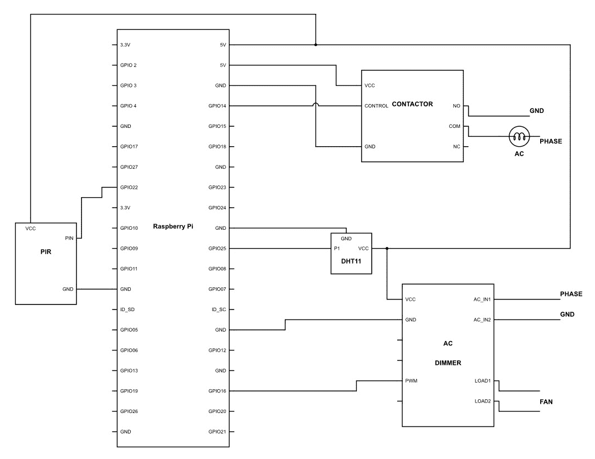

一旦完成这些，就继续编写以下代码：

```py
import RPi.GPIO as GPIO
import time 
import Adafruit_DHT

GPIO.setmode(GPIO.BCM)

FAN = 18
AC = 17
PIR = 22
PIN = 11
Sensor = 4

pwm= GPIO.PWM(18,50)
GPIO.setup(FAN,GPIO.OUT)
GPIO.setup(AC, GPIO.OUT)

while True:

    humidity, temperature = Adafruit_DHT.read_retry(sensor, pin)
    H = datetime.datetime.now().strftime('%H') 
    M = datetime.datetime.now().strftime('%M')

    if H <= 6 && H <= 22:

        if M <=58 :

           M = datetime.datetime.now().strftime('%M')
           humidity, temperature = Adafruit_DHT.read_retry(sensor, pin)

           if GPIO.input(PIR) == 0 :

                Movement = Movement + 1
                time.sleep(10)

           if temperature < 28:

                if Movement > 5 :

                    Duty = Duty + 10
                    pwm.start(Duty)
                    Movement = 0     

        if M = 59 : 

            if Movement = 0 :

                Duty = Duty -10
                pwm.start(Duty)

            Movement = 0

        if temperature <22 :

           GPIO.output(AC, GPIO.LOW)

       if temperature >= 24 && H <= 6 && H >= 22:

           GPIO.output(AC, GPIO.HIGH)

        if temperature > 27

            pwm.start(100)

    for H > 7 && H < 20 

        GPIO.output(AC, GPIO.LOW)

    if H = 20 

        GPIO.output(AC,GPIO.HIGH)

}
```

让我们来看看内部发生了什么：

```py
    if H <= 6 && H <= 22:

        if M <=58 :

           M = datetime.datetime.now().strftime('%M')
           humidity, temperature = Adafruit_DHT.read_retry(sensor, pin)
```

你首先会看到我们有一个条件：`if H,= 6 && H<= 22:`。这个条件只有在时间在上午 10 点和晚上 6 点之间时才会为真。这是因为这是我们通常睡觉的时间。因此，这个标题下的逻辑只有在睡觉时间才会起作用。

第二个条件是`if M <= 58`，只有当时间在`0`到`58`分钟之间时，这个条件才会为真。所以当时间是`M = 59`时，这个条件将不起作用。我们将看到这个逻辑的原因。

此后，我们计算时间并将值存储在名为`M`的变量中。我们还计算湿度和温度值，并将它们存储在名为`temperature`和`humidity`的变量中：

```py
           if GPIO.input(PIR) == 0 :

                Movement = Movement + 1
                time.sleep(10)

```

现在，在这一行中，我们实现了一个条件，如果 PIR 的读数高，这个条件将是真实的。也就是说，会检测到一些运动。每当这种情况发生时，`Movement`变量将增加`1`。最后，我们使用`time.sleep(10)`函数等待`10`秒。这样做是因为 PIR 可能在一小段时间内读数高。在这种情况下，条件会反复为真，从而多次增加`Movement`的值。

我们增加`Movement`值的目的是为了计算一个人移动的次数。因此，在短时间内多次增加它将违背我们的目标。

```py
           if temperature < 28:

                if Movement > 5 :

                    Duty = Duty + 10
                    pwm.start(Duty)
                    Movement = 0
```

现在我们有另一个条件，即`if temperature < 28`。当条件为真时不需要太多解释。所以每当条件为真，并且计数的`Movement`数量超过`5`时，`Duty`的值将增加`10`。因此，我们将 PWM 发送到 AC 调光器，这反过来会增加风扇的速度。最后，我们将`Movement`的值重置为`0`。

所以本质上，我们只是在计算动作的数量。只有当温度低于 28° C 时，这个动作才会被计算。如果动作超过`5`次，那么我们将风扇的速度提高 10%。

```py
        if M = 59 : 

            if Movement = 0 :

                Duty = Duty -10
                pwm.start(Duty)

            Movement = 0
```

在上一节中，逻辑只有在时间在`0`到`58`之间时才会起作用，即计数发生的时间。当`M`的值为`59`时，将检查条件`if Movement = 0`，如果为真，则`Duty`的值将减少`10`。这反过来又会将风扇速度降低 10%。此外，一旦执行了这个条件，`Movement`的值将被重置为`0`。因此，新的周期可以开始，为下一个小时做准备。

现在它基本上意味着计数将按小时进行。如果`Movement`超过`5`，那么`Duty`的值将立即增加。然而，如果不是这种情况，程序将等待直到分钟接近`59`的值，每当这种情况发生时，它将检查是否有任何移动，在这种情况下，风扇速度将降低。

```py
        if temperature <22 :

           GPIO.output(AC, GPIO.LOW)

        if temperature >= 24 && H <= 6 && H >= 22: 

           GPIO.output(AC, GPIO.HIGH)

        if temperature > 27

            pwm.start(100)
```

所有这些代码都非常简单易懂。如果温度低于`22`，那么空调将被关闭。此外，如果温度等于或高于`24`，并且时间在晚上 10:00 到早上 6:00 之间，那么空调将被打开。最后，如果温度高于`27`，那么风扇将切换到 100%的速度。

```py
    for H > 7 && H < 20 

        GPIO.output(AC, GPIO.LOW)

    if H = 20 

        GPIO.output(AC,GPIO.HIGH)
```

最后，我们通过使用条件`for H > 7 && H <20`确保在这个时间段内空调始终关闭。此外，如果`H = 20`，那么空调应该打开，以便在你准备睡觉之前房间冷却下来。

# 添加更多

如你现在所理解的，我们可以根据我们的需求控制任何交流电器。我们已经理解了开关，并且也完善了我们可以调节灯光强度和风扇速度的方法。但是你注意到一件事了吗？迟早，随着我们的系统变得越来越复杂，所需的 GPIO 数量将会增加。会有这样一个时刻，你希望有越来越多的设备连接到你的 Raspberry Pi；然而，由于物理端口不足，你将无法做到这一点。

这在电子学中是一个非常常见的情况。就像往常一样，这个问题也有解决方案。这个解决方案被称为多路复用器。多路复用器的基本任务是增加任何计算机系统的端口数量。现在你可能想知道，它是如何做到这一点的？

这个概念极其简单。让我们首先看看多路复用器的图示：

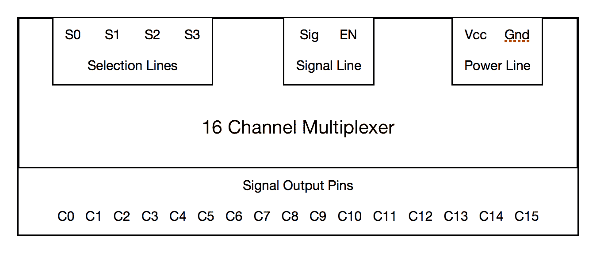

在前面的图中，你可以看到多路复用器有两个端点——一个是有信号输出线，另一个与之相对。我们需要首先理解的是，多路复用器是一个双向设备，即它从多路复用器向连接的设备发送数据，同时也相反。

现在，首先，我们有电源线，这相当基础。它的作用是为多路复用器本身供电。然后，我们有**信号线**，它有两个端口，即**Sig**和**EN**。**EN**代表启用，这意味着在**EN**不是高电平之前，数据通信不会发生。然后我们有称为**Sig**的东西。这是连接到树莓派 GPIO 进行数据通信的端口。接下来是选择线。正如你所见，我们有四个端口，分别是**S0**、**S1**、**S2**和**S3**。选择线的目的是选择需要选择的特定端口。以下是一个表格，将阐明究竟发生了什么：

| **S0** | **S1** | **S3** | **S4** | **选择输出** |
| --- | --- | --- | --- | --- |
| 0 | 0 | 0 | 0 | C0 |
| 1 | 0 | 0 | 0 | C1 |
| 0 | 1 | 0 | 0 | C2 |
| 1 | 1 | 0 | 0 | C3 |
| 0 | 0 | 1 | 0 | C4 |
| 1 | 0 | 1 | 0 | C5 |
| 0 | 1 | 1 | 0 | C6 |
| 1 | 1 | 1 | 0 | C7 |
| 0 | 0 | 0 | 1 | C8 |
| 1 | 0 | 0 | 1 | C9 |
| 0 | 1 | 0 | 1 | C10 |
| 1 | 1 | 0 | 1 | C11 |
| 0 | 0 | 1 | 1 | C12 |
| 1 | 0 | 1 | 1 | C13 |
| 0 | 1 | 1 | 1 | C14 |
| 1 | 1 | 1 | 1 | C15 |

在前面的表格中，你可以看到通过在选择线上使用各种逻辑组合，可以寻址不同的线路。比如说，如果我们有如下选择引脚上的序列——S0 = 1，S1 = 0，S2 = 1，S3 = 1。如果这是从树莓派选择引脚上的输入，那么将选择 C13 引脚。这基本上意味着现在 C13 可以与多路复用器的**Sig**端口进行数据通信。此外，我们必须记住，为了数据传输发生，启用引脚必须是高电平。

以类似的方式，我们可以继续寻址多路复用器的所有 16 个引脚。因此，如果我们从逻辑上看待它，那么通过使用树莓派的六个引脚，我们可以利用 16 个 GPIO。现在我们已经了解了多路复用的基础知识，让我们继续尝试使用其中之一。

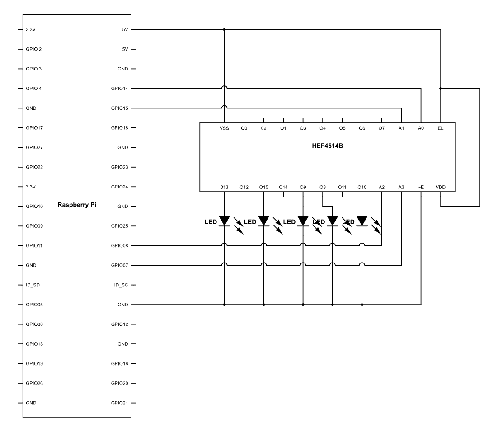

一旦硬件连接好，让我们上传以下代码：

```py
import RPi.GPIO as GPIO
import time

GPIO.setmode(GPIO.BCM)
GPIO.setwarnings(False)

S0 = 21
S1 = 22
S2 = 23
S3 = 24

GPIO.setup(S0,GPIO.OUT)
GPIO.setup(S1,GPIO.OUT) 
GPIO.setup(S2,GPIO.OUT)

While True:

    GPIO.output(S0,1)
    GPIO.output(S1,0)
    GPIO.output(S2,1)
    GPIO.output(S4,1)

    time.sleep(1)

    GPIO.output(S0,1)
    GPIO.output(S1,1)
    GPIO.output(S2,1)
    GPIO.output(S4,1)

    time.sleep(1)

    GPIO.output(S0,1)
    GPIO.output(S1,0)
    GPIO.output(S2,0)
    GPIO.output(S4,1)

    time.sleep(1)

    'GPIO.output(S0,0)
    GPIO.output(S1,0)
    GPIO.output(S2,0)
    GPIO.output(S4,1)

    time.sleep(1)

    GPIO.output(S0,0)
    GPIO.output(S1,1)
    GPIO.output(S2,0)
    GPIO.output(S4,1)

    time.sleep(1) }
```

在这里，我们实际上正在逐个触发选择线，以寻址连接 LED 的每个端口。每当发生这种情况时，相应的 LED 就会发光。此外，它发光的原因是信号端口`Sig`连接到树莓派的 3.3V。因此，向它连接的任何端口发送逻辑高电平。

这是一种多路复用器工作的基本方式之一。当我们需要使用多个设备和传感器时，这可以非常有用。

# 摘要

在本章中，我们使 Jarvis 能够在不同条件下自动化你的家用电器，并给系统应用各种属性。所以继续尝试许多其他场景，在这些场景下你可以增强你的智能家居系统。

在下一章中，我们将启用 Jarvis 物联网功能，从而可以通过 Wi-Fi 和互联网使用您的手机控制家电。
