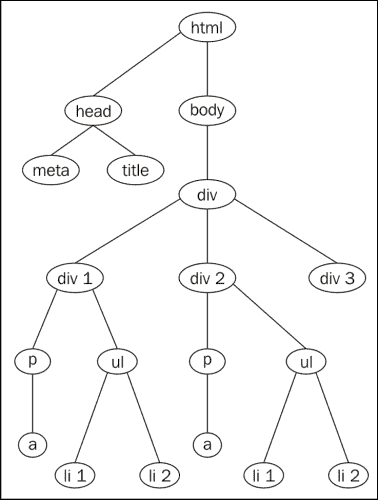
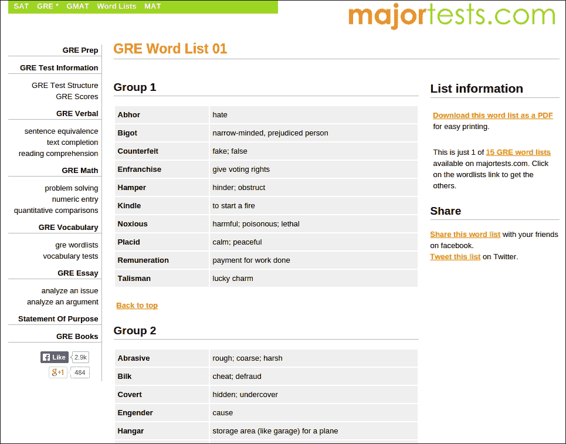
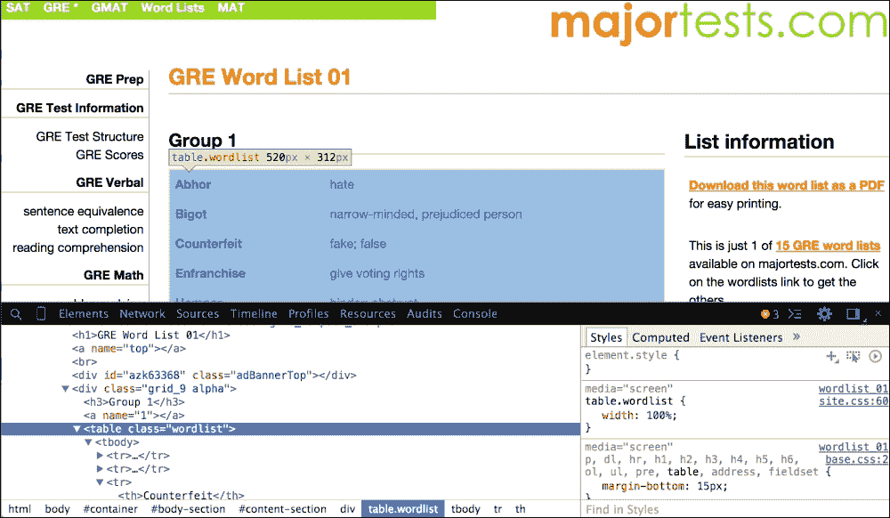

# 第六章. 使用 Python Requests 和 BeautifulSoup 进行网页抓取

我们已经成为了如何通过 `Requests` 与网络进行通信的专家。在与 API 一起工作时，一切进展得非常热烈。然而，有些情况下我们需要注意 API 传说。

我们首先关注的问题是并非所有网络服务都为第三方客户构建了 API。此外，也没有法律规定 API 必须得到完美的维护。即使是像谷歌、Facebook 和 Twitter 这样的技术巨头，也倾向于在没有事先通知的情况下突然更改他们的 API。因此，我们最好理解，当我们从网络资源中寻找一些关键信息时，并不总是 API 会及时伸出援手。

**网络爬虫**这一概念在我们迫切需要从没有提供 API 的网页资源中获取信息时，就像一位救星。在本章中，我们将讨论如何遵循网络爬虫的所有原则，从网页资源中提取信息的技巧。

在我们开始之前，让我们了解一些重要的概念，这些概念将帮助我们实现目标。看看请求的响应内容格式，这将向我们介绍一种特定的数据类型：

```py
>>> import requests
>>> r = requests.get("http://en.wikipedia.org/wiki/List_of_algorithms")
>>> r
<Response [200]>
>>> r.text
u'<!DOCTYPE html>\n<html lang="en" dir="ltr" class="client-nojs">\n<head>\n<meta charset="UTF-8" />\n<title>List of algorithms - Wikipedia, the free encyclopedia</title>\n...

```

在前面的例子中，响应内容以半结构化数据的形式呈现，使用 HTML 标签进行表示；这反过来又帮助我们分别访问网页不同部分的信息。

现在，让我们了解网络通常处理的不同类型的数据。

# 数据类型

在处理网络资源时，我们通常会遇到三种类型的数据。具体如下：

+   结构化数据

+   非结构化数据

+   半结构化数据

## 结构化数据

结构化数据是一种以组织形式存在的数据类型。通常，结构化数据具有预定义的格式，并且是机器可读的。结构化数据中的每一份数据都与其它数据以特定格式相关联。这使得访问数据的不同部分更加容易和快捷。处理大量数据时，结构化数据类型有助于减少冗余数据。

数据库总是包含结构化数据，可以使用 SQL 技术来访问这些数据。我们可以将人口普查记录视为结构化数据的例子。它们包含关于一个国家人民出生日期、性别、地点、收入等信息。

## 非结构化数据

与结构化数据相比，非结构化数据要么缺少标准格式，要么即使施加了特定格式也保持无序。由于这个原因，处理数据的各个部分变得困难。此外，它变成了一项繁琐的任务。为了处理非结构化数据，使用了不同的技术，如文本分析、自然语言处理（NLP）和数据挖掘。图像、科学数据、内容繁多的文本（如报纸、健康记录等）都属于非结构化数据类型。

## 半结构化数据

半结构化数据是一种遵循不规则趋势或具有快速变化结构的数据类型。这种数据可以是自我描述的，它使用标签和其他标记来建立数据元素之间的语义关系。半结构化数据可能包含来自不同来源的信息。"抓取"是用于从这类数据中提取信息的技巧。网络上的信息是半结构化数据的完美例子。

# 什么是网络爬取？

简而言之，网络爬虫是从网络资源中提取所需数据的过程。这种方法涉及不同的步骤，如与网络资源交互、选择合适的数据、从数据中获取信息，以及将数据转换为所需格式。在考虑了所有之前的方法之后，主要关注点将集中在从半结构化数据中提取所需数据的过程。

## 网络爬取的注意事项与禁忌

爬取网络资源并不总是受到所有者的欢迎。一些公司会对使用针对他们的机器人进行限制。在爬取时遵循某些规则是一种礼仪。以下是一些关于网络爬取的应该做和不应该做的事情：

+   **请务必查阅条款和条件**：在我们开始抓取数据之前，应该首先想到的是条款和条件。请访问网站的条款和条件页面，了解他们是否禁止从其网站抓取数据。如果是这样，最好是退而求其次。

+   **不要向服务器发送大量请求**：每个网站都运行在只能处理特定工作量负载的服务器上。如果在特定时间段内向服务器发送大量请求，这相当于是一种无礼行为，可能会导致服务器崩溃。请等待一段时间后再发送请求，而不是一次性向服务器发送过多请求。

    ### 注意事项

    一些网站对每分钟处理的最大请求数量有限制，如果不遵守这一规定，将会禁止请求发送者的 IP 地址。

+   **定期跟踪网络资源**：一个网站并不总是保持不变。根据其可用性和用户需求，它们往往会不时地进行更改。如果网站有任何变动，我们用于抓取的代码可能会失效。请务必跟踪网站所做的更改，修改抓取脚本，并相应地进行抓取。

## 执行网络爬取的主要步骤

通常，网络爬取的过程需要使用以下不同的工具和库：

+   **Chrome DevTools 或 FireBug 插件**：这可以用来定位 HTML/XML 页面中的信息片段。

+   **HTTP 库**：这些库可以用来与服务器交互并获取响应文档。一个例子是`python-requests`。

+   **网页抓取工具**：这些工具用于从半结构化文档中提取数据。例如包括 `BeautifulSoup` 或 `Scrappy`。

网络爬取的整体流程可以观察以下步骤：

1.  确定执行网络爬取任务的网页资源的 URL（s）。

1.  使用您喜欢的 HTTP 客户端/库来提取半结构化文档。

1.  在提取所需数据之前，发现那些处于半结构化格式的数据片段。

1.  使用网络爬虫工具将获取的半结构化文档解析成更结构化的形式。

1.  绘制我们希望使用的所需数据。这就完成了！

# 关键网络爬取任务

在从半结构化文档中提取所需数据时，我们执行各种任务。以下是我们采用的抓取的基本任务：

+   **搜索半结构化文档：** 在文档中访问特定元素或特定类型的元素可以通过使用其`标签`名称和`标签`属性，例如`id`、`class`等来实现。

+   **在半结构化文档中导航**：我们可以通过四种方式在网页文档中导航以获取不同类型的数据，这包括向下导航、横向导航、向上导航以及来回导航。我们将在本章后面详细了解这些内容。

+   **修改半结构化文档：** 通过修改文档的`标签`名称或`标签`属性，我们可以使文档更加简洁并提取所需的数据。

# 什么是 BeautifulSoup？

`BeautifulSoup` 库是一个简单而强大的网页抓取库。它能够在提供 HTML 或 XML 文档时提取所需数据。它配备了一些出色的方法，这些方法帮助我们轻松地执行网页抓取任务。

## 文档解析器

文档解析器帮助我们解析和序列化使用 HTML5、lxml 或其他任何标记语言编写的半结构化文档。默认情况下，`BeautifulSoup`拥有 Python 的标准的`HTMLParser`对象。如果我们处理的是不同类型的文档，例如 HTML5 和 lxml，我们需要明确地安装它们。

在本章中，我们的主要关注点将仅放在图书馆的特定部分，这些部分帮助我们理解开发将在本章末尾构建的实用爬虫的技术。

## 安装

安装 `BeautifulSoup` 非常简单。我们可以使用 `pip` 轻松地安装它：

```py
$ pip install beautifulsoup4

```

每当我们打算使用 `BeautifulSoup` 抓取网页资源时，我们需要为它创建一个 `BeautifulSoup` 对象。以下是为此执行的命令：

```py
>>> from bs4 import BeautifulSoup
>>> soup = BeautifulSoup(<HTML_DOCUMENT_STRING>)

```

## BeautifulSoup 中的对象

`BeautifulSoup` 对象解析给定的 HTML/XML 文档，并将其转换为以下章节中讨论的 Python 对象树。

### 标签

单词`tag`代表在提供的文档中的 HTML/XML 标签。每个`tag`对象都有一个名称以及许多属性和方法。以下示例展示了处理`tag`对象的方式：

```py
>>> from bs4 import BeautifulSoup
>>> soup = BeautifulSoup("<h1 id='message'>Hello, Requests!</h1>")

```

为了访问我们在前一个示例中创建的`BeautifulSoup`对象`soup`的类型、名称和属性，请使用以下命令：

+   对于访问`标签类型`：

    ```py
    >>> tag = soup.h1
    >>> type(tag)
    <class 'bs4.element.Tag'>

    ```

+   要访问`标签名`：

    ```py
    >>> tag.name
    'h1'

    ```

+   为了访问`tag`属性（在给定的 HTML 字符串中为`'id'`）

    ```py
    >>> tag['id']
    'message'

    ```

### BeautifulSoup

当我们打算抓取网络资源时创建的对象被称为`BeautifulSoup`对象。简单来说，这是我们计划抓取的完整文档。这可以通过以下命令完成：

```py
>>> from bs4 import BeautifulSoup
>>> soup = BeautifulSoup("<h1 id='message'>Hello, Requests!</h1>") >>> type(soup)
<class 'bs4.BeautifulSoup'>

```

### 可导航字符串

一个 `NavigableString` 对象表示 `tag` 的内容。我们使用 `tag` 对象的 `.string` 属性来访问它：

```py
>>> tag.string
u'Hello, Requests!'

```

### 评论

`comment` 对象说明了网页文档的注释部分。以下代码行展示了 `comment` 对象：

```py
>>> soup = BeautifulSoup("<p><!-- This is comment --></p>")
>>> comment = soup.p.string
>>> type(comment)
<class 'bs4.element.Comment'>

```

## 与 BeautifulSoup 相关的网页抓取任务

如前文 *关键网络爬取任务* 部分所述，`BeautifulSoup` 在网络爬取过程中始终遵循那些基本任务。我们可以通过一个实际例子，使用 HTML 文档来详细了解这些任务。在本章中，我们将使用以下 HTML 文档 `scraping_example.html` 作为示例：

```py
<!DOCTYPE html>
<html lang="en">
  <head>
    <meta charset="UTF-8" />
    <title>
      Chapter 6 - Web Scrapping with Python Requests and BeatuifulSoup
    </title>
  </head>
  <body>
    <div class="surveys">
      <div class="survey" id="1">
        <p class="question">
          <a href="/surveys/1">Are you from India?</a>
        </p>
        <ul class="responses">
          <li class="response">Yes - <span class="score">21</span>
          </li>
          <li class="response">No - <span class="score">19</span>
          </li>
        </ul>
      </div>
      <div class="survey" id="2">
        <p class="question">
          <a href="/surveys/2">Have you ever seen the rain?</a>
        </p>
        <ul class="responses">
          <li class="response">Yes - <span class="score">40</span>
          </li>
          <li class="response">No - <span class="score">0</span>
          </li>
        </ul>
      </div>
      <div class="survey" id="3">
        <p class="question">
          <a href="/surveys/1">Do you like grapes?</a>
        </p>
        <ul class="responses">
          <li class="response">Yes - <span class="score">34</span>
          </li>
          <li class="response">No - <span class="score">6</span>
          </li>
        </ul>
      </div>
    </div>
  </body>
</html>
```

为了对前面的网页文档有一个清晰明确的理解，我们将其展示为一个文档树。以下图表代表了前面的 HTML 文档：



当我们为之前展示的网页文档创建`BeautifulSoup`对象时，它将生成一个 Python 对象的树形结构。

要使用之前的文档`scraping_example.html`执行不同的任务，我们需要创建一个`BeautifulSoup`对象。为了创建它，打开 Python 交互式命令行并运行以下命令：

```py
>>> from bs4 import BeautifulSoup
>>> soup = BeautifulSoup(open("scraping_example.html"))

```

从现在开始，我们将使用前面的 `BeautifulSoup` 对象来执行不同的任务。让我们对 `scraping_example.html` 文档进行网络爬取操作，并对所有任务有一个整体的了解。

## 搜索树

要识别 HTML/XML 文档中的不同标签，我们需要搜索整个文档。在类似情况下，我们可以使用 `BeautifulSoup` 的方法，如 `find`、`find_all` 等等。

这里是搜索整个文档以识别标签的语法：

+   `find(name, attributes, recursive, text, **kwargs)`

    +   `name`: 这是发现过程中首次出现的标签名称。它可以是字符串、正则表达式、列表、函数或值 `True`。

+   `find_all(name, attributes, recursive, text, limit, **kwargs)`

    +   `name`: 这用于通过名称访问特定类型的标签。它可以是字符串、正则表达式、列表、函数或值 `True`。

    +   `limit`: 这是输出结果中的最大结果数。

前两种方法的共同属性如下：

+   `attributes`: 这些是 HTML/XML 标签的属性。

+   `recursive`: 这接受一个布尔值。如果设置为 `True`，`BeautifulSoup` 库会检查特定标签的所有子标签。反之，如果设置为 `false`，`BeautifulSoup` 库只会检查下一级的子标签。

+   `text`: 此参数用于标识由字符串内容组成的标签。

### 在树结构中导航

使用`Beautifulsoup4`模块在文档树中进行导航涉及不同的任务；它们将在下一节中进行讨论。

#### 导航向下

我们可以通过在文档中向下移动来访问特定元素的数据。如果我们考虑前一个图中的文档树，我们可以通过从顶级元素——`html`向下移动来访问不同的元素。

每个元素都可以通过其`标签`名称进行访问。以下是通过`html`属性访问内容的方法：

```py
>>> soup.html
<html lang="en">
...
...
</html>
```

这里介绍了我们通过向下导航访问前一个文档树元素的方法。为了访问`title`元素，我们应该从上到下进行，即从`html`到`head`，再从`head`到`title`，如下面的命令所示：

```py
>>> soup.html.head.title
<title>Chapter 6 - Web Scraping with Python Requests and BeatuifulSoup</title>

```

同样，你可以访问`meta`元素，如下命令所示：

```py
>>> soup.html.head.meta
<meta charset="utf-8"/>

```

#### 横向导航

要访问文档树中的兄弟节点，我们应该横向导航。`BeautifulSoup`库提供了各种`tag`对象属性，例如`.next_sibling`、`.previous_sibling`、`.next_siblings`和`.previous_siblings`。

如果你查看包含文档树的上一张图，树中不同层级的不同兄弟节点，在横向导航时如下所示：

+   `头部` 和 `主体`

+   `div1`、`div2` 和 `div3`

在文档树中，`head` 标签是 `html` 的第一个子元素，而 `body` 是 `html` 的下一个子元素。为了访问 `html` 标签的子元素，我们可以使用它的 `children` 属性：

```py
>>> for child in soup.html.children:
...     print child.name
...
head
body

```

要访问`head`元素的下一个兄弟元素，我们可以使用`.find_next_sibling`：

```py
>>> soup.head.find_next_sibling()
<body>
 <div class="surveys">
 .
 .
 .
 </div>
</body>

```

要访问`body`的上一级兄弟元素，我们可以使用`.find_previous_sibling`方法：

```py
>>> soup.body.find_previous_sibling
<head><meta charset="utf-8"/><title>... </title></head>

```

#### 向上导航

我们可以通过向文档树顶部移动来访问特定元素的父亲元素。`BeautifulSoup` 库提供了两个属性——`.parent` 和 `.parents`——分别用于访问 `tag` 元素的第一级父元素及其所有祖先元素。

这里有一个例子：

```py
>>> soup.div.parent.name
'body'

>>> for parent in soup.div.parents:
...     print parent.name
...
body
html
[document]

```

#### 在导航中来回切换

要访问之前解析的元素，我们需要在树的节点中回溯，而要访问下一个即将解析的元素，我们需要在树的节点中前进。为了处理这种情况，`tag`对象提供了`.find_previous_element`和`.find_next_element`属性，如下例所示：

```py
>>> soup.head.find_previous().name
'html'
>>> soup.head.find_next().name
'meta'

```

## 修改树结构

BeautifulSoup 库还使我们能够根据我们的需求对网页文档进行修改。我们可以通过其属性来更改标签的属性，例如 `.name`、`.string` 和 `.append()` 方法。我们还可以借助 `.new_string()` 和 `.new_tag()` 方法向现有标签添加新的标签和字符串。此外，还有一些其他方法，如 `.insert()`、`.insert_before()`、`.insert_after()` 等，用于对文档树进行各种修改。

这里是一个更改`title`标签的`.string`属性的示例：

+   在修改`title`标签之前，标题内容如下：

    ```py
    >>> soup.title.string
    u'Chapter 6 - Web Scrapping with Python Requests and BeatuifulSoup'

    ```

+   这是修改`标题`标签内容的方法：

    ```py
    >>> soup.title.string = 'Web Scrapping with Python Requests and BeatuifulSoup by Balu and Rakhi'

    ```

+   修改后，`tilte` 标签的内容看起来是这样的：

    ```py
    >>> soup.title.string
    u'Web Scrapping with Python Requests and BeatuifulSoup by Balu and Rakhi'

    ```

# 构建一个网络爬虫机器人——一个实用示例

在这个时间点，我们的思维被各种线索启发，以刮取网络信息。收集了所有信息后，让我们来看一个实际例子。现在，我们将创建一个网络爬虫，它将从网络资源中提取单词列表并将它们存储在一个 JSON 文件中。

让我们开启抓取模式！

## 网络爬虫机器人

在这里，网络爬虫是一个自动脚本来提取名为 majortests.com 的网站上的单词。这个网站包含各种测试和**研究生入学考试**（GRE）单词列表。使用这个网络爬虫，我们将爬取之前提到的网站，并在 JSON 文件中创建一个 GRE 单词及其含义的列表。

以下图片是我们将要抓取的网站样本页面：



在我们开始爬取过程之前，让我们回顾一下章节开头提到的网络爬取的注意事项和禁忌。信不信由你，它们肯定会让我们安心的：

+   **请务必查阅条款和条件**：是的，在抓取 majortests.com 之前，请查阅该网站的条款和条件，并获取抓取所需的必要法律许可。

+   **不要向服务器发送大量请求**：牢记这一点，对于我们将要发送到网站的每一个请求，我们都使用了 Python 的 `time.sleep` 函数来引入延迟。

+   **定期跟踪网络资源**：我们确保代码与服务器上运行的网站完美兼容。在开始抓取之前，请检查网站一次，以免破坏代码。这可以通过运行一些符合我们预期结构的单元测试来实现。

现在，让我们按照之前讨论的步骤开始实施抓取操作。

### 识别 URL 或 URLs

网络爬取的第一步是确定要获取所需资源的 URL 或 URL 列表。在这种情况下，我们的目的是找到所有导致预期 GRE 单词列表的 URL。以下是我们将要爬取的网站的 URL 列表：

[`www.majortests.com/gre/wordlist_01`](http://www.majortests.com/gre/wordlist_01)

[`www.majortests.com/gre/wordlist_02`](http://www.majortests.com/gre/wordlist_02)

[`www.majortests.com/gre/wordlist_03`](http://www.majortests.com/gre/wordlist_03)，等等

我们的目标是从九个这样的 URL 中抓取单词，我们发现了一个共同的模式。这将帮助我们爬取所有这些 URL。所有这些 URL 的共同 URL 模式是用 Python 的`string`对象编写的，如下所示：

`http://www.majortests.com/gre/wordlist_0%d`

在我们的实现中，我们定义了一个名为 `generate_urls` 的方法，该方法将使用前面的 URL 字符串生成所需的 URL 列表。以下代码片段展示了在 Python 命令行中执行此过程的方法：

```py
>>> START_PAGE, END_PAGE = 1, 10
>>> URL = "http://www.majortests.com/gre/wordlist_0%d"
>>> def generate_urls(url, start_page, end_page):
...     urls = []
...     for page in range(start_page, end_page):
...         urls.append(url % page)
...     return urls
...
>>> generate_urls(URL, START_PAGE, END_PAGE)
['http://www.majortests.com/gre/wordlist_01', 'http://www.majortests.com/gre/wordlist_02', 'http://www.majortests.com/gre/wordlist_03', 'http://www.majortests.com/gre/wordlist_04', 'http://www.majortests.com/gre/wordlist_05', 'http://www.majortests.com/gre/wordlist_06', 'http://www.majortests.com/gre/wordlist_07', 'http://www.majortests.com/gre/wordlist_08', 'http://www.majortests.com/gre/wordlist_09']

```

### 使用 HTTP 客户端

我们将使用`requests`模块作为 HTTP 客户端来获取网络资源：

```py
>>> import requests
>>> def get_resource(url):
...     return requests.get(url)
...
>>> get_resource("http://www.majortests.com/gre/wordlist_01")
<Response [200]>

```

在前面的代码中，`get_resource` 函数接受 `url` 作为参数，并使用 `requests` 模块获取资源。

### 发现需要抓取的数据片段

现在，是时候分析和分类网页的内容了。在这个上下文中，内容是一系列带有定义的单词列表。为了识别单词及其定义的元素，我们使用了 Chrome DevTools。元素的感知信息（HTML 元素）可以帮助我们识别单词及其定义，这些信息可以在抓取过程中使用。

要执行此操作，请在 Chrome 浏览器中打开 URL ([`www.majortests.com/gre/wordlist_01`](http://www.majortests.com/gre/wordlist_01))，并通过右键点击网页来访问**检查元素**选项：



从前面的图像中，我们可以识别出单词列表的结构，它以以下方式呈现：

```py
<div class="grid_9 alpha">
  <h3>Group 1</h3>
  <a name="1"></a>
  <table class="wordlist">
    <tbody>
      <tr>
        <th>Abhor</th>
        <td>hate</td>
      </tr>
      <tr>
        <th>Bigot</th>
        <td>narrow-minded, prejudiced person</td>
      </tr>
      ...
      ...
    </tbody>
  </table>
</div>
```

通过查看之前提到的网页部分，我们可以解读如下：

+   每个网页都包含一个单词列表

+   每个单词列表都包含许多在相同`div`标签中定义的单词组

+   一个词组中的所有单词都描述在一个具有类属性—`wordlist`的表中

+   表格中的每一行(`tr`)都分别使用`th`和`td`标签代表一个单词及其定义

### 使用网络爬虫工具

让我们使用`BeautifulSoup4`作为网络爬虫工具来解析我们在前一步骤中使用`requests`模块获取到的网页内容。通过遵循前面的解释，我们可以指导`BeautifulSoup`访问网页所需的内容，并将其作为对象提供：

```py
def make_soup(html_string):
    return BeautifulSoup(html_string)
```

在前面的代码行中，`make_soup` 方法接收以字符串形式的 `html` 内容，并返回一个 `BeautifulSoup` 对象。

### 绘制所需数据

在上一步中我们获得的 `BeautifulSoup` 对象用于从中提取所需的单词及其定义。现在，利用 `BeautifulSoup` 对象中可用的方法，我们可以遍历获取到的 HTML 响应，然后我们可以提取单词列表及其定义：

```py
def get_words_from_soup(soup):
    words = {}

    for count, wordlist_table in enumerate(
    soup.find_all(class_='wordlist')):

        title = "Group %d" % (count + 1)

        new_words = {}
        for word_entry in wordlist_table.find_all('tr'):
            new_words[word_entry.th.text] = word_entry.td.text

        words[title] = new_words

    return words
```

在前面的代码行中，`get_words_from_soup` 函数接收一个 `BeautifulSoup` 对象，然后使用实例的 `find_all()` 方法查找 `wordlists` 类中包含的所有单词，并返回一个单词的字典。

之前获得的单词字典将使用以下`helper`方法保存到 JSON 文件中：

```py
def save_as_json(data, output_file):
    """ Writes the given data into the specified output file"""
    with open(output_file, 'w') as outfile:
        json.dump(data, outfile)
```

总体来说，这个过程可以用以下程序来描述：

```py
import json
import time

import requests

from bs4 import BeautifulSoup

START_PAGE, END_PAGE, OUTPUT_FILE = 1, 10, 'words.json'

# Identify the URL
URL = "http://www.majortests.com/gre/wordlist_0%d"

def generate_urls(url, start_page, end_page):
    """
    This method takes a 'url' and returns a generated list of url strings

        params: a 'url', 'start_page' number and 'end_page' number
        return value: a list of generated url strings
    """
    urls = []
    for page in range(start_page, end_page):
        urls.append(url % page)
    return urls

def get_resource(url):
    """
    This method takes a 'url' and returns a 'requests.Response' object

        params: a 'url'
        return value: a 'requests.Response' object
    """
    return requests.get(url)

def make_soup(html_string):
    """
    This method takes a 'html string' and returns a 'BeautifulSoup' object

        params: html page contents as a string
        return value: a 'BeautifulSoup' object
    """
    return BeautifulSoup(html_string)

def get_words_from_soup(soup):

    """
    This method extracts word groups from a given 'BeautifulSoup' object

        params: a BeautifulSoup object to extract data
        return value: a dictionary of extracted word groups
    """

    words = {}
    count = 0

    for wordlist_table in soup.find_all(class_='wordlist'):

        count += 1
        title = "Group %d" % count

        new_words = {}
        for word_entry in wordlist_table.find_all('tr'):
            new_words[word_entry.th.text] = word_entry.td.text

        words[title] = new_words
        print " - - Extracted words from %s" % title

    return words

def save_as_json(data, output_file):
    """ Writes the given data into the specified output file"""
            json.dump(data, open(output_file, 'w'))

def scrapper_bot(urls):
    """
    Scrapper bot:
        params: takes a list of urls

        return value: a dictionary of word lists containing
                      different word groups
    """

    gre_words = {}
    for url in urls:

        print "Scrapping %s" % url.split('/')[-1]

        # step 1

        # get a 'url'

        # step 2
        html = requets.get(url)

        # step 3
        # identify the desired pieces of data in the url using Browser tools

        #step 4
        soup = make_soup(html.text)

        # step 5
        words = get_words_from_soup(soup)

        gre_words[url.split('/')[-1]] = words

        print "sleeping for 5 seconds now"
        time.sleep(5)

    return gre_words

if __name__ == '__main__':

    urls = generate_urls(URL, START_PAGE, END_PAGE+1)

    gre_words = scrapper_bot(urls)

    save_as_json(gre_words, OUTPUT_FILE)
```

这里是`words.json`文件的内容：

```py
{"wordlist_04":
    {"Group 10":
        {"Devoured": "greedily eaten/consumed",
         "Magnate": "powerful businessman",
         "Cavalcade": "procession of vehicles",
         "Extradite": "deport from one country back to the home...
    .
    .
    .
}
```

# 摘要

在本章中，你了解了我们在网络资源中遇到的不同类型的数据，并对一些想法进行了调整。我们认识到了网络爬取的必要性、法律问题以及它所提供的便利。然后，我们深入探讨了网络爬取任务及其潜力。你学习了一个名为 `BeautifulSoup` 的新库，以及它的功能和细节，并伴随着示例。

我们深入了解了`BeautifulSoup`的功能，并通过对一些示例进行操作，对其有了清晰的认识。最后，我们通过应用从前面章节中获得的知识，创建了一个实用的抓取机器人，这个经验让我们明白了如何实时抓取网站。

在下一章中，你将学习关于 Flask 微型框架的内容，我们将遵循最佳实践来构建一个使用该框架的应用程序。
