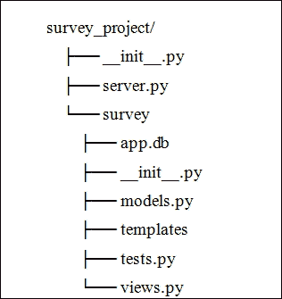

# 第七章. 使用 Flask 用 Python 实现 Web 应用程序

为了在学习 Requests 模块的过程中确保繁荣，似乎没有什么比应用你至今所获得的所有技能和知识更重要。因此，我们在这里铺平道路，通过使用 Flask 框架创建一个网络应用程序来应用你至今所获得的专长。这将使你对开发实际网络应用程序及其测试用例的编写有深入的了解。我们在这一过程中倾向于遵循最佳实践和动手操作的方法。让我们深入其中，学习这些知识。

# 什么是 Flask？

Flask 是一个轻量级但功能强大的 Python 用于创建 Web 应用的框架。它可以被称作一个 **微框架**。它如此小巧，以至于如果你能与之建立良好的关系，你就能理解它的所有源代码。它之所以强大，是因为它拥有被称为 **扩展** 的优点，以及它作为一个整体提供所有基本服务的能力。扩展可以根据应用的需求进行添加。Flask 框架背后的开发者是 Armin Ronacher，他于 2010 年 4 月 1 日发布了它。

Flask 的优点如下：

+   Flask 自带了一个内置的开发服务器，它可以帮助你在开发过程中以及测试程序时。

+   在 Flask 中，错误日志记录变得简单，因为它拥有交互式的基于网页的调试器。当执行你的代码时，如果以某种方式出现了错误，错误堆栈跟踪将会显示在网页上，这使得处理错误变得容易。这可以通过将 `app.debug` 的标志设置为 `True` 来实现。

+   由于其轻量级特性，Flask 是一个构建 RESTful 网络服务的完美框架。该路由装饰器可以帮助将一个函数绑定到一个 URL，它可以接受 HTTP 方法作为参数，从而为以理想方式构建 API 铺平道路。此外，使用 Flask 处理 JSON 数据非常简单。

+   Flask 的模板支持由一个名为**Jinja2**的灵活模板引擎提供。这使得渲染模板的过程变得更加顺畅。

+   Session 对象是另一个好东西，它保存了用户的会话。它存储用户的请求，以便应用程序能够记住用户的不同请求。

+   Flask 在处理来自客户端的请求时使用**Web Server Gateway Interface**（**WSGI**）协议，并且完全符合 100 % WSGI 规范。

# Flask 入门

我们可以通过一个简单的示例来启动我们的应用程序开发，这个示例能让你了解我们如何使用 Flask 框架在 Python 中编程。为了编写这个程序，我们需要执行以下步骤：

1.  创建一个 WSGI 应用程序实例，因为 Flask 中的每个应用程序都需要一个来处理来自客户端的请求。

1.  定义一个`route`方法，它将一个 URL 与其处理的函数关联起来。

1.  激活应用程序的服务器。

这里是一个按照前面步骤制作简单应用的示例：

```py
from flask import Flask
app = Flask(__name__)

@app.route("/")
def home():
 return "Hello Guest!"

if __name__ == "__main__":
 app.run()

```

在前面的代码行中，我们使用 Flask 的 `Flask` 类创建了一个 WSGI 应用实例，然后我们定义了一个路由，将路径 "`/`" 和视图函数 `home` 映射到使用 Flask 的装饰器函数 `Flask.route()` 处理请求。接下来，我们使用了 `app.run()`，这告诉服务器运行代码。在那一端，当代码执行时，它将显示一个包含 `"Hello Guest!"` 的网页。

# 安装 Flask

在开始编程过程之前，您需要安装所需的依赖项。让我们通过使用**虚拟环境包装器**来创建虚拟环境来启动安装过程。在创建应用程序时使用虚拟环境是一种最佳实践。虚拟环境包装器是一个工具，它将项目的所有依赖项放在一个地方。

这种实践将减轻你在系统中处理不同项目时遇到的大量复杂性。在我们的教程中，安装和应用开发使用的是 Python 2.7 版本。

以下是为设置环境所需的步骤：

1.  使用 `pip` 安装虚拟环境包装器。你可能需要使用 `sudo` 以获得管理员权限：

    ```py
    $ pip install virtualenvwrapper

    ```

1.  为了方便起见，所有与虚拟环境相关的安装包都放置在一个文件夹中。**Virtualenvwrapper**通过环境变量`WORKON_HOME`来识别该目录。因此，请将环境变量设置为`~/Envs`或您选择的任何名称。

    ```py
    $ export WORKON_HOME=~/Envs

    ```

1.  如果在您的本地机器上不存在`WORKON_HOME`目录，请使用以下命令创建：

    ```py
    $ mkdir -p $WORKON_HOME

    ```

1.  为了使用`virtualenvwrapper`提供的工具，我们需要激活如下所示的`virtualenvwrapper.sh`壳脚本。在 Ubuntu 机器上，我们可以在`/usr/local/bin`位置找到此脚本：

    ```py
    $ source /usr/local/bin/virtualenvwrapper.sh

    ```

1.  为了方便起见，将步骤 2 和 4 中的命令添加到您的 shell 启动文件中，以便在终端启动时初始化和激活`virtualenvwrapper`工具。

1.  现在，使用 `mkvirtualenv` 命令为您的项目创建一个名为 `survey` 的新虚拟环境。一旦 `survey` 环境被激活，它就会在 shell 提示符前的闭合括号中显示环境名称。

    ```py
    $ mkvirtualenv survey
    New python executable in survey/bin/python
    Installing setuptools, pip...done.
    (survey) $

    ```

## 使用 pip 安装所需软件包

我们将在本项目中使用 **Flask-SQLAlchemy**，这是一个作为 **对象关系映射器**（**ORM**）的 Flask 扩展模块，用于与数据库交互。我们还将使用 `requests`、`httpretty`、`beautifulsoup` 等模块来开发我们的 `survey` 应用程序，该应用程序将在本教程中构建。

现在请确保你的虚拟环境已激活，然后安装以下包：

```py
(survey)~ $ pip install flask flask-sqlalchemy requests httpretty beautifulsoup4

```

# 调查 - 使用 Flask 的简单投票应用程序

要创建`调查`应用程序，我们将采用一种方法，这种方法将使你轻松理解应用程序的方方面面，同时也会让开发过程变得愉快。

我们的开发流程将引导您逐步了解项目所涉及的所有功能。然后，我们将逐步实现每一个功能。在开发过程中，我们将遵循**模型-视图-控制器**（**MVC**）设计模式，这种模式在开发 Web 应用中非常流行。

`调查`应用的主要目的是记录创建的调查问题的回答数量——“是”、“否”和“可能”。

## 基本文件结构

为了开发 Flask 应用程序，我们遵循特定的结构来组织应用程序的内容。以下是我们要开发的应用程序的文件结构：



这里是关于我们应用程序文件结构中所有文件和文件夹的描述：

| 文件/文件夹名称 | 描述 |
| --- | --- |
| `__init__.py` | 初始化我们的项目并将其添加到 `PYTHONPATH` |
| `server.py` | 调用应用程序开发服务器以启动。 |
| `survey/__init__.py` | 初始化我们的应用程序并将各种组件集中在一起。 |
| `survey/app.db` | 一个用于存储数据的 `sqlite3` 文件 |
| `survey/models.py` | 定义了我们应用程序的模型。 |
| `survey/templates` | 一个存放所有 `Jinja2` 模板的地方。 |
| `survey/tests.py` | 一个包含与该应用相关的各种测试用例的文件。 |
| `survey/views.py` | 定义了您应用程序的路由。 |

在我们的调查应用中，`survey_project` 是项目根目录。现在，让我们根据上述文件结构创建所有文件和文件夹，并将以下内容放置在 `survey_project/__init__.py` 文件中。

```py
import os
import sys
current_dir = os.path.abspath(os.path.dirname(os.path.dirname(__file__)))
parent_dir = os.path.abspath(os.path.join(current_dir, os.pardir))
sys.path.insert(0, parent_dir)
```

## 构建应用程序

现在，我们将向您介绍`调查`应用的所有功能。以下是我们应用必须执行的一系列详细任务：

+   创建调查问题

+   查看所有问题列表

+   查看特定问题

+   修改问题

+   删除一个问题

+   投票支持一个问题

每个问题都存储与特定调查相关的信息。`问题`模型（关于数据的单一确定信息来源）包含的字段如下：

+   `id`: 用于唯一标识每个问题的主键

+   `question_text`: 描述调查

+   `number_of_yes_votes`: 存储投票中 `'yes'` 的数量

+   `number_of_no_votes`: 存储被投票的 `'no'` 票数

+   `number_of_maybe_votes`: 存储了被调查的 `'maybe'` 票数

现在，让我们开始设计资源持有者，也就是我们所说的 URL，用于之前提到的任务。这些 URL 需要特定的 HTTP 方法来与服务器进行通信。

以下表格突出了我们将如何设计 URL：

| 任务 | HTTP 方法 | URL |
| --- | --- | --- |
| 所有问题的列表 | `GET` | `http://[主机名:端口]/` |
| 创建调查问题 | `POST` | `http://[hostname:port]/questions` |
| 查看特定问题 | `GET` | `http://[hostname:port]/questions/[question_id]` |
| 修改一个问题 | `PUT` | `http://[hostname:port]/questions/[question_id]` |
| 删除一个问题 | `DELETE` | `http://[hostname:port]/questions/[question_id]` |
| 投票支持一个问题 | `POST` | `http://[hostname:port]/questions/[question_id]/vote` |
| 投票支持一个问题 | `GET` | `http://[hostname:port]/questions/[question_id]/vote` |
| 新问题表单 | `GET` | `http://[hostname:port]/questions/new` |

## 使用 Flask-SQLAlchemy 编写模型

SQLAlchemy 是一个 Python 对象关系映射器 (ORM) 以及一个用于与各种数据库交互的查询工具包。它提供了一套实用工具，包括一个基类来表示模型，以及一组辅助类和函数来表示数据库。

### 注意

模型是关系数据库中表格的逻辑表示，其中包含有关数据的信息。

Flask-SQLAlchemy 是 Flask 框架的一个扩展，它增加了对 SQLAlchemy 的支持。

## 定义一个模型

在使用 Flask-SQLAlchemy 定义模型时，我们需要牢记以下三个步骤：

1.  创建数据库实例。

1.  使用之前创建的数据库实例定义一个模型。

1.  在数据库实例中调用一个方法来创建数据库中的表。

## 创建数据库实例

在我们的应用程序中，我们确实需要创建一个数据库实例来存储数据。为此，我们需要在 WSGI 应用程序实例中配置`'SQLALCHEMY_DATABASE_URI'`属性，如下面的代码所示。此代码应保存在`survey/__init__.py`文件中。

**__init__.py**

```py
import os

from flask import Flask
from flask.ext.sqlalchemy import SQLAlchemy

BASE_DIR = os.path.abspath(os.path.dirname(__file__))

app = Flask(__name__)
app.config['SQLALCHEMY_DATABASE_URI'] = \
    'sqlite:///' + os.path.join(BASE_DIR, 'app.db')
db = SQLAlchemy(app)
```

在前面的代码行中，我们使用 Flask 的 `Flask` 类创建了一个 WSGI 应用程序实例，并配置了 `'SQLALCHEMY_DATABASE_URI'` 变量。接下来，我们创建了一个名为 `db` 的数据库实例，该实例用于定义模型和执行各种查询。

### 创建调查模型

为了在数据库中存储与`调查`应用相关的数据，我们应该定义一个名为`Question`的模型。这段代码位于`survey/models.py`文件中。

**models.py**

```py
class Question(db.Model):
    id = db.Column(db.Integer, primary_key=True)
    question_text = db.Column(db.String(200))
    number_of_yes_votes = db.Column(db.Integer, default=0)
    number_of_no_votes = db.Column(db.Integer, default=0)
    number_of_maybe_votes = db.Column(db.Integer, default=0)
```

在前面的代码中，我们定义了`Question`模型，它继承自`db.Model`。它包含五个字段来存储与特定调查相关的数据：

+   `id`

+   `question_text`

+   `number_of_yes_votes`

+   `number_of_no_votes`

+   `number_of_maybe_votes`

现在，让我们继续添加一个构造方法，这样我们就可以为之前代码行中创建的`Question`对象设置实例变量：

```py
class Question(db.Model):
    ...
    ...

    def __init__(self,
                 question_text,
                 number_of_yes_votes=0,
                 number_of_no_votes=0,
                 number_of_maybe_votes=0):

        self.question_text = question_text

        self.number_of_yes_votes = number_of_yes_votes
        self.number_of_maybe_votes = number_of_maybe_votes
        self.number_of_no_votes = number_of_no_votes
```

之前的 `__init__()` 方法接收 `Question` 对象及其值作为参数。然后，它将设置我们传递的对象的实例变量。

现在，我们将创建一个名为 `vote()` 的方法，该方法将增加 `'yes'`、`'no'` 和 `'maybe'` 投票的计数器变量。

```py
class Question(db.Model):
    ...
    ...

    def vote(self, vote_type):
        if vote_type == 'yes':
            self.number_of_yes_votes += 1
        elif vote_type == 'no':
            self.number_of_no_votes += 1
        elif vote_type == 'maybe':
            self.number_of_maybe_votes += 1
        else:
            raise Exception("Invalid vote type")
```

在前面的代码行中，我们定义了一个`vote()`方法，它接受`Question`对象作为其第一个参数，并将`vote_type`作为其第二个参数。根据`vote_type`（`'yes'`、`'no'`或`'maybe'`），我们传递的`Question`对象的相应`number_of_<vote_type>_votes`值会增加。

### 在数据库中创建表格

现在我们已经使用名为 `db` 的数据库实例对象定义了与我们的应用程序相关的模型，接下来我们需要在数据库中创建相应的表。为此，我们需要调用存在于数据库实例——`db` 中的 `create_all()` 方法。

在我们的应用中，我们通常在调用`runserver.py`文件中定义的服务器之前调用这个函数。

### 查询数据库模型

现在，我们已经准备好了数据库模型。让我们使用 SQLAlchemy 的 ORM 从数据库中查询数据。我们将在我们的数据库实例 `db` 上执行基本的创建、检索、更新和删除（CRUD）操作。

在进行查询之前，让我们先切换到我们的项目根目录，并启动 Python 控制台以执行以下命令：

```py
>>> from survey import app, db
>>> from survey.models import Question

```

现在，让我们在数据库中创建一个`问题`对象。使用 SQLAlchemy 的 ORM 创建对象涉及三个基本步骤，如下面的代码所示：

```py
>>> question = Question("Are you an American?")
>>> db.session.add(question)
>>> db.session.commit()

```

我们可以看到：

+   第一步为模型创建一个 Python 对象。

+   下一步是将创建的 Python 对象添加到数据库的会话中。

+   最后一步是将对象提交到数据库中。

使用 ORM 从数据库中检索对象非常简单。以下查询从数据库中检索所有对象：

```py
>>> Question.query.all()
[<Question 1 - u'Are you an American?'>]

```

我们也可以使用主键从数据库中检索模型对象。如果我们查看`Question`模型，我们有一个名为`id`的列作为主键。现在，让我们继续访问它。

```py
>>> Question.query.get(1)
<Question 1 - u'Are you an American?'>

```

是时候投票进行调查了。获取`id`值为`1`的对象，并使用其`vote()`方法来增加该选项的投票数。

```py
>>> question = Question.query.get(1)
>>> question.number_of_yes_votes
0
>>> question.vote('yes')
>>> db.session.add(question)
>>> db.session.commit()

```

让我们学习如何使用`db.session.delete()`方法从数据库中删除记录，如下面的代码所示：

```py
>>> question = Question.query.get(1)
>>> db.session.delete(question)
>>> db.session.commit()

```

如果你尝试访问相同的对象，它将导致`None`值。

```py
>>> print Question.query.get(1)
None

```

# 视图

视图是一个 Python 函数，它接收一个网络请求并返回一个网络响应。视图的响应可以是一个简单的字符串、网页、文件内容，或者任何东西。每当 Flask 应用程序从客户端接收到请求时，它都会寻找一个`视图`函数来处理它。视图包含处理请求所必需的业务逻辑。

在前面的章节中，我们已经创建了必要的数据库模型。现在，在本节中，我们将编写`视图`函数。让我们为前面表格中提到的每个资源创建视图，这将突出我们如何设计 URL。所有视图都应该在文件`survey/views.py`中创建。

## 所有问题的列表

此视图显示了数据库中我们创建的所有调查。每当客户端请求应用程序的根目录时，Flask 应用程序将调用此视图。请将以下代码添加到`survey/views.py`文件中：

```py
from flask import render_template
from survey import app
from survey.models import Question

@app.route('/', methods=['GET'])
def home():
    questions = Question.query.all()
    context = {'questions': questions, 'number_of_questions': len(questions)}
    return render_template('index.html',**context)
```

`@app.route()` 装饰器将路径 `'/'` 和视图函数 `home()` 进行映射。`home` 视图使用 SQLAlchemy ORM 从数据库中检索所有问题，并通过 `render_template` 方法渲染名为 `'index.html'` 的模板。`render_template` 方法接受模板名称和一系列参数，以返回一个网页。

## 新调查

此视图返回一个 HTML 网页表单以创建新的调查问题。当用户访问路径`/questions/new`时调用此视图。将以下代码添加到`survey/views.py`文件中：

```py
. . .
. . .
@app.route('/questions/new', methods=['GET'])
def new_questions():
    return render_template('new.html')
```

## 创建一个新的调查

此视图在数据库中创建一个新的调查，并显示可用的问题列表作为响应。这是由 Flask 应用程序调用的，当用户提交一个包含 `/questions` 的 URL 的请求，并使用 `POST` 方法时。可以通过 `request.form` 字典在视图中访问创建新问题的数据。

```py
@app.route('/questions', methods=['POST'])
def create_questions():
    if request.form["question_text"].strip() != "":
        new_question = Question(question_text=request.form["question_text"])
        db.session.add(new_question)
        db.session.commit()
        message = "Succefully added a new poll!"
    else:
        message = "Poll question should not be an empty string!"

    context = {'questions': Question.query.all(),'message': message}
    return render_template('index.html',**context)
```

## 展示调查

此视图通过在 URL 中传递`question_id`参数来显示请求的调查。当用户使用 HTTP 的`'GET'`动词请求路径`'/questions/<question_id>'`时，此视图会被触发：

```py
@app.route('/questions/<int:question_id>', methods=['GET'])
def show_questions(question_id):
    context = {'question': Question.query.get(question_id)}
    return render_template('show.html', **context)
```

## 更新调查

此视图用于用户想要修改现有问题时。当用户提交数据以修改`Question`时，会调用此视图。我们可以通过 HTTP 的`'PUT'`方法在`'/questions/<question_id>'`上连接到这个资源：

```py
@app.route('/questions/<int:question_id>', methods=['PUT'])
def update_questions(question_id):
    question = Question.query.get(question_id)
    if request.form["question_text"].strip() != "":
        question.question_text = request.form["question_text"]
        db.session.add(question)
        db.session.commit()
        message = "Successfully updated a poll!"
    else:

        message = "Question cannot be empty!"

    context = {'question': question,
               'message': message}

    return render_template('show.html', **context)
```

## 删除一个调查

此视图用于从数据库中删除特定的调查。特定的调查是根据 URL 中传递的`question_id`值来识别的。用户可以使用`'DELETE'` HTTP 动词在`'/questions/<question_id>'`访问此网页。一旦问题从数据库中删除，用户将收到一条消息和可用问题的列表。

```py
@app.route('/questions/<int:question_id>', methods=['DELETE'])
def delete_questions(question_id):
    question = Question.query.get(question_id)
    db.session.delete(question)
    db.session.commit()
    context = {'questions': Question.query.all(),
               'message': 'Successfully deleted'}
    return render_template('index.html', **context)
```

## 新投票表用于在调查中投票

此视图返回一个包含 HTML 表单的网页，用于在调查中对特定选项进行投票。它可以通过 `'/questions/<question_id>/vote'` 访问。

```py
@app.route('/questions/<int:question_id>/vote', methods=['GET'])
def new_vote_questions(question_id):
    question = Question.query.get(question_id)
    context = {'question': question}
    return render_template('vote.html', **context)
```

## 在调查中对某个特定选项进行投票

此视图用于在调查中对特定选项投新票。用户必须使用 `'POST'` 方法将特定选项提交到资源 `'/questions/<question_id>/vote'`。在成功投票后，用户将被重定向到调查详情页面。

```py
@app.route('/questions/<int:question_id>/vote', methods=['POST'])
def create_vote_questions(question_id):
    question = Question.query.get(question_id)

    if request.form["vote"] in ["yes", "no", "maybe"]:
        question.vote(request.form["vote"])

    db.session.add(question)
    db.session.commit()
    return redirect("/questions/%d" % question.id)
```

# 模板

模板是一个包含块标签或变量的简单文本文档。**Flask 微框架**使用`Jinja2`模板引擎来渲染 HTML 页面。

在我们的应用中，我们使用了五种不同的模板，其中包括一个`base`模板——`base.html`。这个`base`模板是一个由所有模板共同元素组成的布局。其他四个模板（`index.html`、`show.html`、`vote.html`和`new.html`）利用了`Jinja2`模板引擎提供的一个称为**模板继承**的概念。它用于使这些共同功能能够在每个模板中显示出来，而无需在每个模板中编写冗余的代码。

## 基础模板

此模板是所有其他模板的骨架。它包含一个通用的导航菜单部分，以及一个占位符，用于存放本应用中每个页面的主要内容块。`survey/templates/base.html`模板将包含以下代码：

```py
<html>
  <head>
    <title>Welcome to Survey Application</title>
  </head>
  <body>
    
        <p style="text-align: center;">{{ message }}</p>
    
    <div>
      <a href="/">Home</a> |
      <a href="/questions">All Questions</a> |
      <a href="/questions/new">Create a new Question</a>
    </div>
    <hr>
    
  </body>
</html>
```

## 问题列表模板

由于我们需要在网页上展示问题列表，我们使用`for`循环标签遍历`questions`变量，并显示特定调查的所有投票数。请将以下内容添加到`survey/templates/index.html`文件中：

```py



    <p>Number of Questions - <span id="number_of_questions">{{ number_of_questions }}</span></p>
    
    <div>
        <p>
            <p><a href="/questions/{{ question.id }}">{{ question.question_text }}</a></p>
            <ul>
                <li>Yes - {{ question.number_of_yes_votes }} </li>
                <li>No - {{ question.number_of_no_votes }} </li>
                <li>Maybe - {{ question.number_of_maybe_votes }}
</li>
            </ul>
        </p>
    </div>
    
    <hr />

```

## 创建一个新的调查模板

为了展示包含一个新调查问题的 HTML 表单，我们定义了一个名为 `survey/templates/new.html` 的模板：

**new.html**

```py



    <h1>Create a new Survey</h1>
    <form method="POST" action="/questions">
        <p>Question: <input type="text" name="question_text"></p>
        <p><input type="submit" value="Create a new Survey"></p>
    </form>

```

## 展示调查模板的详细信息

要显示调查的所有详细信息，请按照以下方式创建模板。此模板还包括一个指向`投票`页面的链接。将以下代码添加到`survey/templates/show.html`文件中：

```py



    <div>
        <p>
        
            <p>{{ question.question_text }}</p>
            <ul>
                <li>Yes - {{ question.number_of_yes_votes }}</li>
                <li>No - {{ question.number_of_no_votes }}
</li>
                <li>Maybe - {{ question.number_of_maybe_votes}}</li>
            </ul>
            <p><a href="/questions/{{ question.id }}/vote">Cast your vote now</a></p>
        
            Not match found!
        
        </p>
    </div>
    <hr />

```

## 投票模板

要投票，我们需要显示一个包含带有调查及其选项的 HTML 表单的网页。将以下代码添加到`survey/templates/vote.html`文件中：

```py



    <div>
        <p>
        
            <p>{{ question.question_text }}</p>

            <form action="/questions/{{ question.id }}/vote" method="POST">
                <input type="radio" name="vote" value="yes">Yes<br>
                <input type="radio" name="vote" value="no">No<br>
                <input type="radio" name="vote" value="maybe">Maybe<br>

                <input type="submit" value="Submit" /><br>
            </form>
            <p><a href="/questions/{{ question.id }}">Back to Question</a></p>
        
            Not match found!
        
        </p>
    </div>
    <hr />

```

# 运行调查应用程序

欢呼！我们成功创建了一个应用程序，该应用程序将允许用户创建调查、检索调查、更新调查、删除调查，并为调查投出选择票。运行服务器请执行以下步骤：

1.  在运行服务器之前，让我们先给`server.py`文件填充以下代码：

    ```py
    import sys

    from survey import app, db
    from survey import views

    def main():
        db.create_all()
        app.run(debug=True)
        return 0

    if __name__ == '__main__':
        sys.exit(main())
    ```

1.  现在，让我们使用`runserver.py`脚本运行应用程序，如下所示：

    ```py
    $ python runserver.py
    * Running on http://127.0.0.1:5000/
    * Restarting with reloader

    ```

1.  现在，服务器已启动并运行。要在网页浏览器中访问应用程序，请访问以下网址—`http://127.0.0.1:5000/`.

我们完成了！

# 编写单元测试以调查应用程序

创建一个没有测试用例的应用程序就相当于完成了一半。即使你在开发应用程序时非常小心，也可能会在某些时候遇到错误。编写测试用例总能让我们处于一个安全的位置。

在本节中，我们将为我们的调查应用中的某些任务编写单元测试用例。将以下测试用例代码添加到`survey/tests.py`文件中：

```py
import unittest
import requests

from bs4 import BeautifulSoup
from survey import db
from survey.models import Question

class TestSurveyApp(unittest.TestCase):

    def setUp(self):
        db.drop_all()
        db.create_all()

    def test_defaults(self):
        question = Question('Are you from India?')
        db.session.add(question)
        db.session.commit()

        self.assertEqual(question.number_of_yes_votes, 0)
        self.assertEqual(question.number_of_no_votes, 0)
        self.assertEqual(question.number_of_maybe_votes, 0)

    def test_votes(self):
        question = Question('Are you from India?')
        question.vote('yes')
        db.session.add(question)
        db.session.commit()

        self.assertEqual(question.number_of_yes_votes, 1)
        self.assertEqual(question.number_of_no_votes, 0)
        self.assertEqual(question.number_of_maybe_votes, 0)

    def test_title(self):
        title = "Welcome to Survey Application"
        response = requests.get("http://127.0.0.1:5000/")
        soup = BeautifulSoup(response.text)
        self.assertEqual(soup.title.get_text(), title)
```

我们可以从前面的代码块中看到以下内容：

+   代码的初始行将所有必要的模块导入到内存中。

+   `TestSurveyApp` 中的 `setUp()` 方法会删除所有现有的表，并为每个测试用例创建它们。

+   `test_defaults` 测试用例将测试创建的 `Question` 对象的默认值。如果默认值与预期输入不匹配，则测试用例失败。

+   `test_votes()` 函数会对调查中的某个特定选项进行点赞，并测试被点赞的选项是否增加，其他选项是否保持不变。

+   `test_title()` 函数将测试响应标题是否与预期标题匹配。它使用 `BeautifulSoup` 库从响应内容中访问标题。

# 摘要

在本章中，我们学习了 Flask 微型框架并了解了 Flask 的不同特性。我们还使用 virtualenvwrapper 设置了虚拟环境，并使用 Flask、Flask-SQLAlchemy 和 Jinja2 创建了一个网络应用程序。最后，我们为开发的应用程序编写了单元测试。
