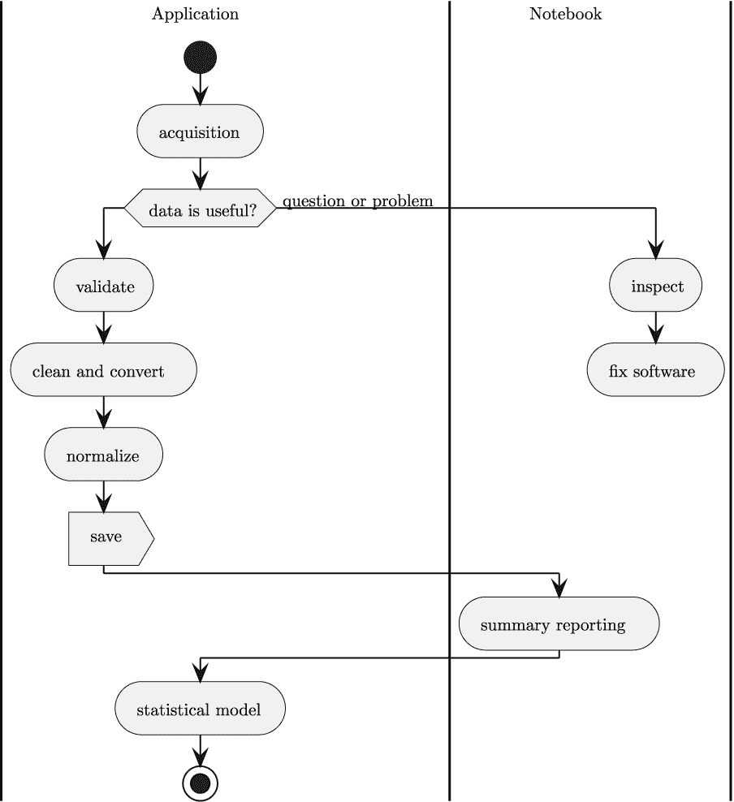

# 第二章

项目概述

我们的一般计划是构建分析、决策支持模块和应用。这些应用通过向利益相关者提供可用数据的摘要来支持决策。决策的范围从揭示变量之间新的关系到确认数据变化在狭窄范围内是随机的噪声。处理将从获取数据并通过几个阶段移动开始，直到可以展示统计摘要。

处理将被分解为几个阶段。每个阶段将作为一个核心概念应用来构建。将会有后续项目来增加核心应用的功能。在某些情况下，一些功能将被添加到几个项目中，所有这些项目都合并到一个章节中。

阶段设计灵感来源于**提取-转换-加载**（**ETL**）架构模式。本书中的设计在 ETL 设计的基础上增加了多个额外步骤。由于旧术语可能具有误导性，因此对这些词进行了更改。这些特性——通常对于现实世界的实用应用是必需的——将作为管道中的额外阶段插入。

一旦数据被清理和标准化，本书将描述一些简单的统计模型。分析将在这里停止。建议您转向更高级的书籍，这些书籍涵盖了人工智能和机器学习。

有 22 个不同的项目，其中许多基于先前结果。不需要按顺序完成所有项目。但是，在跳过一个项目时，阅读该项目描述和交付成果非常重要。这有助于更全面地理解后续项目的背景。

本章将介绍我们创建完整数据分析程序序列的整体架构方法。我们将采用以下多阶段方法：

+   数据采集

+   数据检查

+   清洗数据；这包括验证、转换、标准化和保存中间结果

+   总结和建模数据

+   创建更复杂的统计模型

阶段组合方式如图*图 2.1*所示。

图 2.1：数据分析管道

这背后的一个核心思想是*关注点的分离*。每个阶段都是一个独立的操作，每个阶段可以独立于其他阶段发展。例如，可能有多个数据来源，导致几个不同的数据采集实现，每个实现都创建一个共同的内部表示，以便使用单个、统一的检查工具。

同样，数据清洗问题似乎在组织中几乎随机出现，导致需要添加独特的验证和标准化操作。这个想法是在管道的这个阶段分配对语义特殊情况和异常的责任。

建筑理念之一是将自动化应用程序和几个手动 JupyterLab 笔记本混合成一个整体。笔记本对于解决故障问题或问题至关重要。对于优雅的报告和演示，笔记本也非常有用。虽然 Python 应用程序可以生成整洁的 PDF 文件和完善的报告，但似乎发布带有分析和发现内容的笔记本要容易一些。

我们将从处理阶段的获取阶段开始。

## 2.1 通用数据获取

所有数据分析处理都始于从源获取数据的必要步骤。

上述声明似乎有些荒谬，但在此方面的失败往往会导致后续复杂的返工。认识到数据存在这两种基本形式至关重要：

+   可用于分析程序的 Python 对象。虽然明显的候选者是数字和字符串，但这包括使用**Pillow**等包以 Python 对象的形式操作图像。像**librosa**这样的包可以创建表示音频数据的对象。

+   Python 对象的序列化。这里有很多选择：

    +   文本。某种字符串。有无数的语法变体，包括 CSV、JSON、TOML、YAML、HTML、XML 等。

    +   Pickled Python 对象。这些是由`pickle`模块创建的。

    +   二进制格式。像 Protobuf 这样的工具可以将原生 Python 对象序列化为字节流。类似地，一些 YAML 扩展可以将对象序列化为非文本的二进制格式。图像和音频样本通常以压缩的二进制格式存储。

源数据的格式——几乎普遍地——不是由任何规则或惯例固定。基于假设源数据**总是**是 CSV 格式文件的假设编写应用程序，当需要新的格式时可能会导致问题。

最好将所有输入格式视为可能发生变化。一旦获取数据，就可以将其保存为分析管道使用的通用格式，并且独立于源格式（我们将在*清洁、验证、标准化和持久化*中讨论持久化）。

我们将从项目 1.1：“获取数据”开始。这将构建数据获取基础应用程序。它将获取 CSV 格式数据，并作为在后续项目中添加格式的依据。

数据获取的方法有很多种。在接下来的几章中，我们将探讨一些替代的数据提取方法。

## 2.2 通过提取获取

由于数据格式处于不断变化的状态，了解如何添加和修改数据格式很有帮助。这些项目都将基于项目 1.1，通过向基础应用程序添加功能来构建。以下项目围绕数据的不同来源设计：

+   项目 1.2：“从 API 获取 Web 数据”。此项目将使用 JSON 格式从网络服务获取数据。

+   项目 1.3：“从 HTML 获取 Web 数据”。此项目将通过抓取 HTML 从网页获取数据。

+   两个独立的项目是收集来自 SQL 数据库的数据的一部分：

    +   项目 1.4：“构建本地数据库”。这是一个必要的辅助项目，用于构建本地 SQL 数据库。这是必要的，因为公众可访问的 SQL 数据库是罕见的。构建我们自己的演示数据库更安全。

    +   项目 1.5：“从本地数据库获取数据”。一旦数据库可用，我们就可以从 SQL 提取中获取数据。

这些项目将专注于以文本形式表示的数据。对于 CSV 文件，数据是文本；应用程序必须将其转换为更有用的 Python 类型。HTML 页面也是纯文本。有时，还提供了额外的属性，表明文本应被视为数字。SQL 数据库通常填充了非文本数据。为了保持一致，SQL 数据应序列化为文本。获取应用程序都采用处理文本的共同方法。

这些应用还将最小化对源数据应用的转换。为了一致地处理数据，转向一个通用格式是有帮助的。正如我们将在*第三章*中看到的，*项目 1.1：数据获取基础应用*，NDJSON 格式提供了一个有用的结构，这通常可以映射回源文件。

在获取新数据后，进行手动检查是谨慎的做法。这通常在应用开发初期进行几次。之后，检查仅用于诊断源数据的问题。接下来的几章将涵盖检查数据的项目。

## 2.3 检查

数据检查需要在开发初期进行。确保新数据确实是解决用户问题的必要条件至关重要。常见的挫折是不完整或不一致的数据，这些问题需要尽快揭露，以避免浪费时间和精力创建处理不存在数据的软件。

此外，数据还通过手动检查来揭露问题。重要的是要认识到数据源处于不断变化的状态。随着应用的演变和成熟，用于分析的数据将发生变化。在许多情况下，数据分析应用通过无效数据在事后发现其他企业变化。了解通过良好的数据检查工具的演变是很重要的。

检查是一个本质上手动的过程。因此，我们将使用 JupyterLab 创建笔记本来查看数据并确定一些基本特征。

在隐私至关重要的罕见情况下，开发者可能不允许进行数据检查。更有特权的人——拥有查看支付卡或医疗细节的权限——可能参与数据检查。这意味着检查笔记本可能是由开发者创建的，供利益相关者使用。

在许多情况下，数据检查笔记本可以是完全自动化数据清洗应用程序的开始。开发者可以将笔记本单元提取为函数，构建一个既可以从笔记本也可以从应用程序中使用的模块。单元结果可以用来创建单元测试用例。

管道中的这一阶段需要多个检查项目：

+   项目 2.1：“检查数据”。这将构建一个核心数据检查笔记本，具有足够的特性来确认一些获取的数据可能是有效的。

+   项目 2.2：“检查数据：基数域”。此项目将为测量、日期和时间添加分析功能。这些是反映测量和计数的基数域。

+   项目 2.3：“检查数据：名义和普通域”。此项目将为文本或编码数值数据添加分析功能。这包括名义数据和有序数值域。重要的是要认识到美国邮政编码是数字字符串，而不是数字。

+   项目 2.4：“检查数据：参考数据”。此笔记本将包括在处理已标准化并分解为具有编码“键”值子集的数据时查找参考域的功能。

+   项目 2.5：“定义可重用架构”。作为最后一步，它可以帮助使用 JSON Schema 标准定义正式架构和相关元数据。

虽然这些项目似乎是一次性的努力，但它们通常需要谨慎编写。在许多情况下，当出现问题时，需要重复使用笔记本。提供充分的解释和测试用例有助于刷新人们对数据细节和已知问题区域的记忆。此外，笔记本可以作为测试用例和自动化清洗、验证或标准化数据的 Python 类或函数设计的示例。

经过详细检查后，我们就可以构建应用程序来自动化清洗、验证和标准化值。下一批项目将解决这个管道阶段的问题。

## 2.4 清洗、验证、标准化和持久化

一旦从一般意义上理解了数据，编写应用程序来清理任何序列化问题，并执行更正式的测试以确保数据确实有效是有意义的。一个令人沮丧的常见问题是收到重复的数据文件；这可能会发生在企业中的某个地方预定处理被打断，并且之前时期的数据被重新用于分析。

验证测试有时是清理的一部分。如果数据包含任何意外的无效值，可能需要拒绝它。在其他情况下，已知问题可以作为分析的一部分通过用有效数据替换无效数据来解决。一个例子是美国邮政编码，它们（有时）被转换为数字，并且前导零丢失。

这些数据分析管道阶段由多个项目描述：

+   项目 3.1：“清洗数据”。这构建了数据清洗基础应用程序。设计细节可以来自数据检查笔记本。

+   项目 3.2：“清洗和验证”。这些功能将验证并转换数值字段。

+   项目 3.3：“清洗和验证文本和代码”。验证文本字段和数值编码字段需要更复杂的设计。

+   项目 3.4：“清洗和验证引用”。当数据从不同的来源到达时，验证这些来源之间的引用是至关重要的。

+   项目 3.5：“标准化数据”。某些数据源需要标准化以创建通用的代码和范围。

+   项目 3.6：“获取和清洗管道”。将获取、清洗、验证和标准化集成到单个管道中通常很有帮助。

+   项目 3.7：“获取、清洗和保存”。此管道的一个关键架构特性是将中间文件保存为通用格式，与数据源不同。

+   项目 3.8：“数据提供者 Web 服务”。在许多企业中，内部 Web 服务和 API 被视为分析数据的来源。此项目将数据获取管道封装为 RESTful Web 服务。

在这些项目中，我们将从获取应用程序中转换文本值到更有用的 Python 对象，如整数、浮点值、十进制值和日期时间值。

数据清洗和验证完成后，探索可以继续。第一步是总结数据，再次使用 Jupyter 笔记本创建可读的、可发布的报告和演示文稿。下一章将探讨总结数据的工作。

## 2.5 总结和分析

以有用的形式总结数据更多的是艺术而非技术。可能很难知道如何最好地向人们展示信息以帮助他们做出更有价值或更有帮助的决策。

有几个项目用于捕捉总结和初步分析的核心：

+   项目 4.1：“数据仪表板”。这个笔记本将展示多种可视化分析技术。

+   项目 4.2：“已发布的报告”。可以将笔记本保存为 PDF 文件，创建一个易于分享的报告。

总结和创建共享、发布的报告的初步工作为更正式、自动化的报告奠定了基础。下一组项目将构建提供更深入和更复杂统计模型的模块。

## 2.6 统计建模

数据分析的目的在于消化原始数据，向人们展示信息以支持他们的决策。管道的先前阶段准备了两个重要的事情：

+   原始数据已经过清洗和标准化，以提供相对容易分析的数据。

+   检查和总结数据的过程帮助分析师、开发人员和最终用户理解信息的意义。

数据与更深层次含义的结合为企业创造了显著的价值。分析过程可以继续作为更正式的统计建模。这反过来又可能导致人工智能（AI）和机器学习（ML）应用。

处理管道包括这些项目，以收集单个变量以及变量组合的摘要：

+   项目 5.1：“统计模型：核心处理”。此项目构建了应用统计模型和保存数据参数的基础应用程序。这将侧重于如均值、中位数、众数和方差这样的摘要。

+   项目 5.2：“统计模型：关系”。通常想知道变量之间的关系。这包括变量之间的相关度等度量。

这个阶段的序列产生高质量的数据，并提供诊断和调试数据源问题的方法。项目的序列将说明如何使用自动化解决方案和交互式检查来创建有用、及时、有洞察力的报告和分析。

## 2.7 数据合同

在这个管道的各个阶段，我们将涉及数据合同。例如，这个应用程序的数据获取可能与数据提供商有一个正式的合同。也可能只有非正式的数据合同，如模式定义或 API。

在*第八章*，*项目 2.5：模式与元数据*中，我们将考虑一些模式发布的相关问题。在第*第十一章*，*项目 3.7：临时数据持久化*中，我们将考虑提供给下游应用的模式。这两个主题与正式数据合同相关，但本书不会深入探讨数据合同、它们的创建方式或可能的使用方式。

## 2.8 摘要

这个数据分析管道将数据从源通过一系列阶段移动，以创建干净、有效、标准化的数据。一般的流程支持各种需求，并允许大量的定制和扩展。

对于对数据科学或机器学习感兴趣的开发者，这些项目涵盖了数据科学或机器学习有时所说的“数据整理”部分。当数据被理解，数据源之间的差异得到解决和探索时，这可能会成为一个重大的复杂性。这些是在构建可用于 AI 决策制定的模型之前——有时是困难的——准备步骤。

对于对网络感兴趣的读者来说，这种数据处理和提取是通过网络应用程序 API 或网站展示数据的一部分。项目 3.7 创建了一个网络服务器，这将特别引起人们的兴趣。因为网络服务需要干净的数据，所以前面的项目有助于创建可以发布的数据。

对于对自动化或物联网感兴趣的人，**第二部分**解释了如何使用 Jupyter Notebooks 收集和检查数据。这是一个常见需求，当处理受温度和电压变化影响的现实世界设备时，清理、验证和标准化数据的各个步骤变得更加重要。

我们已经研究了以下多阶段方法来进行数据分析：

+   数据采集

+   数据检查

+   清理、验证、标准化和持久化

+   概括和分析

+   创建统计模型

此管道遵循提取-转换-加载（ETL）概念。术语已经改变，因为旧术语有时会误导。我们的采集阶段与通常所说的“提取”操作重叠。对于一些开发者来说，“提取”仅限于数据库提取；我们希望超越这一点，包括其他数据源转换。我们的清理、验证和标准化阶段通常合并为“转换”操作。保存干净数据通常是“加载”的目标；我们不是强调数据库加载，而是将使用文件。

在整本书中，我们将描述每个项目的目标，并提供一个可靠的技术方法的基础。实施细节由你决定。我们将列出可交付成果；这可能会重复一些来自*第一章*、*项目零：其他项目的模板*的信息。本书提供了大量关于验收测试用例和单元测试用例的信息——完成的标准。通过涵盖这种方法，我们为你留下了设计和实现所需应用程序软件的空间。

在下一章中，我们将构建第一个数据采集项目。这将使用 CSV 格式的文件。后续的项目将使用数据库提取和 Web 服务。
