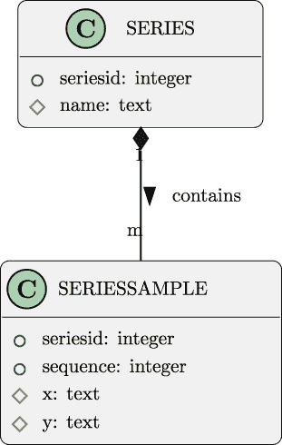
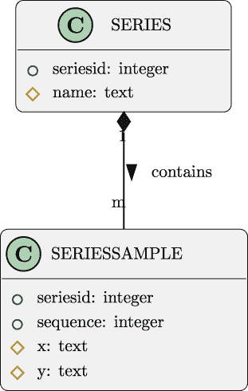
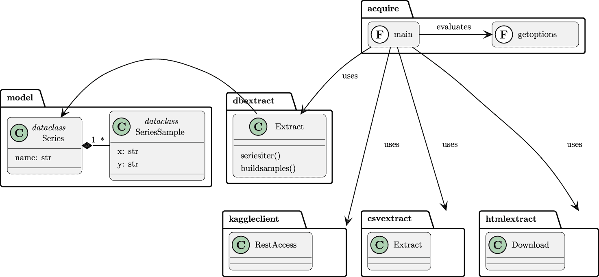

# 第五章

数据获取功能：SQL 数据库

在本章中，您将指导完成两个项目，展示如何将 SQL 数据库作为分析数据源进行操作。这将建立在前面两章中构建的基础应用之上。

本章将重点介绍 SQL 提取。由于企业 SQL 数据库通常非常私密，我们将指导读者首先创建一个 SQLite 数据库。这个数据库将作为私有企业数据库的替代品。一旦有了数据库，我们将研究如何从数据库中提取数据。

本章的项目涵盖了以下基本技能：

+   构建 SQL 数据库。

+   从 SQL 数据库中提取数据。

第一个项目将为第二个项目构建一个 SQL 数据库。

在企业环境中，源数据库已经存在。

在我们自己的个人电脑上，这些数据库并不存在。因此，我们将在第一个项目中构建一个数据库，并在第二个项目中从数据库中提取数据。

我们将首先查看如何将数据放入 SQL 数据库。这将是一个非常小且简单的数据库；项目将避免 SQL 数据的众多复杂设计问题。

第二个项目将使用 SQL 查询从数据库中提取数据。目标是生成与上一章项目一致的数据。

## 5.1 项目 1.4：本地 SQL 数据库

我们经常需要存储在数据库中的数据，这些数据通过 SQL 查询语言访问。使用搜索字符串“SQL 是通用语言”来找到提供更多关于 SQL 通用性的文章。这似乎是获取企业数据以进行进一步分析的主要方法之一。

在上一章*第四章*，*数据获取功能：Web API 和爬取*中，项目从公开可用的 API 和网页中获取数据。公开可用的 SQL 数据源并不多。在许多情况下，可以使用 SQLite 数据库的转储（或导出）来构建数据库的本地副本。直接访问远程 SQL 数据库并不常见。与其试图找到访问远程 SQL 数据库的方法，不如创建一个本地 SQL 数据库简单。SQLite 数据库作为 Python 标准库的一部分提供，使其成为容易选择。

您可能想检查其他数据库，并将它们的特性与 SQLite 进行比较。虽然一些数据库提供了许多功能，但进行 SQL 提取很少似乎需要比基本的 `SELECT` 语句更复杂的东西。使用另一个数据库可能需要一些更改，以反映该数据库的连接和 SQL 语句执行。在大多数情况下，Python 中的 DB-API 接口被广泛使用；对于 SQLite 之外的数据库，可能有一些独特功能。

我们将从填充数据库的项目开始。一旦数据库可用，你就可以继续进行更有趣的项目，使用 SQL 语句提取数据。

### 5.1.1 描述

本章的第一个项目将为分析准备一个包含数据的 SQL 数据库。这是读者在具有可访问 SQL 数据库的企业环境外工作的必要准备步骤。

最有趣的小数据集之一就是安斯康姆四重奏。

[`www.kaggle.com/datasets/carlmcbrideellis/data-anscombes-quartet`](https://www.kaggle.com/datasets/carlmcbrideellis/data-anscombes-quartet)

上面的 URL 提供了一个包含 CSV 格式文件信息的页面。点击**下载**按钮将数据小文件下载到您的本地计算机。

数据也存放在本书 GitHub 仓库的`data`文件夹中。

为了加载数据库，第一步是设计数据库。我们将从查看一些表定义开始。

#### 数据库设计

SQL 数据库以数据表的形式组织。每个表都有一个固定的列集，这些列作为整体数据库模式的一部分进行定义。一个表可以有无限数量的数据行。

关于 SQL 数据库的更多信息，请参阅[`www.packtpub.com/product/learn-sql-database-programming/9781838984762`](https://www.packtpub.com/product/learn-sql-database-programming/9781838984762)和[`courses.packtpub.com/courses/sql`](https://courses.packtpub.com/courses/sql)。

安斯康姆四重奏由四组(*x,y*)对组成。在一个常用的源文件中，三个系列共享共同的*x*值，而第四个系列具有不同的*x*值。

关系型数据库通常将复杂的实体分解为一系列更简单的实体。目标是最大限度地减少关联类型的重复。安斯康姆四重奏信息有四个不同的数据值系列，可以表示为以下两种类型的实体：

+   系列由多个单独的值组成。一个名为`series_value`的表可以存储属于系列的单个值。

+   一个单独的实体为整个系列提供标识信息。一个名为`sources`的表可以存储标识信息。

这种设计需要引入关键值来唯一标识系列，并将每个系列的值与系列的总结信息连接起来。

对于安斯康姆四重奏数据，一个系列的总结信息仅略多于一个名称。

这种整体总结和支持细节的设计模式如此常见，对于本项目来说，反映这种常见模式是至关重要的。

见*图 5.1*以查看显示实现这些实体及其关系的 ERD。



图 5.1：数据库模式

此项目将创建一个小应用程序来构建这两个表的架构。然后，该应用程序可以加载数据到这些表中。

#### 数据加载

加载数据的过程涉及三个独立的操作：

+   从 CSV（或其他格式）文件中读取源数据。

+   执行 SQL `INSERT` 语句以在表中创建行。

+   执行 `COMMIT` 以最终化事务并将数据写入底层数据库文件。

在这些步骤之前，必须使用 `CREATE TABLE` 语句定义模式。

在实际应用中，也常见提供组合操作以删除表、重新创建模式，然后加载数据。重建通常发生在探索或实验数据库设计时。很多时候，最初的设计可能无法令人满意，需要做出改变。此外，构建（和重建）小型数据库的想法也将是任何数据采集应用程序验收测试的一部分。

在下一节中，我们将探讨如何创建一个 SQL 数据库，它可以作为大型企业生产数据库的替代品。

### 5.1.2 方法

对于此类测试或演示应用程序，处理 SQL 数据库有两种一般方法：

+   创建一个小应用程序来构建和填充数据库。

+   通过文本格式创建一个 SQL 脚本，并通过数据库的 CLI 应用程序运行它。请参阅 [`sqlite.org/cli.html`](https://sqlite.org/cli.html)。

该小应用程序将利用数据库客户端连接来执行 SQL 语句。在这种情况下，可以使用一个具有占位符的单个通用 `INSERT` 语句模板。客户端连接可以提供占位符的值。虽然应用程序并不复杂，但它将需要单元和验收测试用例。

SQL 脚本替代方案使用一个小应用程序将数据行转换为有效的 `INSERT` 语句。在许多情况下，文本编辑器的搜索和替换功能可以将数据文本转换为 `INSERT` 语句。对于更复杂的情况，可以使用 Python f-strings。f-string 可能看起来像以下这样：

```py
print(
    f"INSERT INTO SSAMPLES(SERIES, SEQUENCE, X, Y)"
    f"VALUES({series}, {sequence}, ’{x}’, ’{y}’)"
)
```

这通常很成功，但存在一个潜在的严重问题：*SQL* 注入攻击。

SQL 注入攻击通过在数据值中包含一个字符串字面量结尾的单引号 `’` 来工作。这可能导致无效的 SQL 语句。在极端情况下，它允许注入额外的 SQL 语句，将 `INSERT` 语句转换为脚本。更多信息，请参阅 [`owasp.org/www-community/attacks/SQL_Injection`](https://owasp.org/www-community/attacks/SQL_Injection)。还可以参阅 [`xkcd.com/327/`](https://xkcd.com/327/) 以了解 SQL 注入攻击的另一个示例。

虽然 SQL 注入可能被恶意使用，但它也可能是一个令人沮丧的常见事故。如果文本数据值中恰好有 `’`，那么这可能会在 SQL 脚本文件中创建一个具有无效语法的语句。SQL 清洗只是将问题推迟到可能复杂的 SQL 清洗函数。

首先避免构建 SQL 文本会更简单。一个小型应用程序可以摆脱构建 SQL 文本的复杂性。

我们将首先查看这个小模式的数据定义。然后我们将查看数据操作语句。这将为设计构建模式和加载数据的小型应用程序奠定基础。

#### SQL 数据定义

SQL 中的基本数据定义是一个具有多个列（也称为 *属性*）的表。这是通过一个 `CREATE TABLE` 语句定义的。列的列表由该语句提供。除了列之外，该语言还允许表约束进一步细化表的使用方式。就我们的目的而言，两个表可以定义为如下：

-

```py
CREATE TABLE IF NOT EXISTS series(
  series_id INTEGER,
  name TEXT,

  PRIMARY KEY (series_id)
);

CREATE TABLE IF NOT EXISTS series_sample(
  series_id INTEGER,
  sequence INTEGER,
  x TEXT,
  y TEXT,

  PRIMARY KEY (series_id, sequence),
  FOREIGN KEY (series_id) REFERENCES series(series_id)
);
```

要删除模式，使用 `DROP TABLE IF EXISTS series_sample` 和 `DROP TABLE IF EXISTS series` 语句即可完成所需操作。由于外键引用，某些数据库在删除 `series` 行之前，需要先删除所有相关的 `series_sample` 行。

在调试时，`IF EXISTS` 和 `IF NOT EXISTS` 子句非常有用。例如，我们可能会更改 SQL 并在某个 `CREATE TABLE` 语句中引入语法错误。这可能会导致一个不完整的模式。在解决问题后，只需重新运行整个 `CREATE TABLE` 语句序列，就会只创建缺失的表。

本例 SQL 数据模型的一个基本特征是简化了涉及的数据类型。`series_sample` 表中的两列数据都被定义为 `TEXT`。这是一个罕见的情况；大多数 SQL 数据库都会使用可用的某种数值类型。

虽然 SQL 数据有多种有用的类型，但来自其他应用程序的原始数据却不是数值型的。CSV 文件和 HTML 页面只提供文本。因此，这个应用程序的结果也需要是文本的。一旦定义了表，应用程序就可以插入行。

#### SQL 数据操作

使用 `INSERT` 语句创建新行。虽然 SQLite 允许省略一些细节，但我们将坚持使用稍微冗长但更明确的语句。以下是在两个表中创建行的方式：

```py
INSERT INTO series(series_id, name) VALUES(:series_id, :name)

INSERT INTO series_sample(series_id, sequence, x, y)
  VALUES(:series_id, :sequence, :x, :y)
```

前缀为冒号的标识符，如 `:x`、`:y`、`:series_id` 等，是将在执行语句时被替换的参数。由于这些替换不依赖于 SQL 文本规则——例如使用引号来结束字符串——可以使用任何值。

从这些表中删除行的情况很少见。在替换数据时，删除并重新创建表通常更简单（有时也更快）。

#### SQL 执行

Python 的 SQLite 接口是 `sqlite3` 模块。这符合数据库访问的 PEP-249 标准（[`peps.python.org/pep-0249/`](https://peps.python.org/pep-0249/））。应用程序通常会在创建数据库连接。它将使用连接来创建一个 *游标*，可以查询或更新数据库。

连接是通过连接字符串完成的。对于许多数据库，连接字符串将包括托管数据库的服务器以及数据库名称；它还可能包括安全凭证或其他选项。对于 SQLite，连接字符串可以是一个完整的 URI，形式为 `file:filename.db`。这有一个方案，`file:` 和数据库文件的路径。

这对该应用程序不是必需的，但将 SQL 语句隔离到配置文件中是一种常见的做法。使用 TOML 格式可以是一种方便的方法，将处理与实现处理的 SQL 语句分开。这种分离允许在不更改源文件的情况下进行小的 SQL 变更。对于编译型语言，这是必需的。对于 Python，这是一种在更改数据库时使 SQL 更容易找到的有帮助的方法。

创建模式的函数可能看起来像这样：

```py
CREATE_SERIES = """
CREATE TABLE IF NOT EXISTS series(
-- rest of the SQL shown above...
"""

CREATE_VALUES = """
CREATE TABLE IF NOT EXISTS series_sample(
-- rest of the SQL shown above...
"""

CREATE_SCHEMA = [
    CREATE_SERIES,
    CREATE_VALUES
]

def execute_statements(
        connection: sqlite3.Connection,
        statements: list[str]
) -> None:
    for statement in statements:
        connection.execute(statement)
    connection.commit()
```

`CREATE_SCHEMA` 是构建模式所需的语句序列。可以定义类似的语句序列来删除模式。这两个序列可以组合起来，作为普通数据库设计和实验的一部分来删除和重新创建模式。

主程序可以使用类似以下代码创建数据库：

```py
with sqlite3.connect("file:example.db", uri=True) as connection:
    schema_build_load(connection, config, data_path)
```

这需要一个名为 `schema_build_load()` 的函数，用于删除并重新创建模式，然后加载单个数据行。

我们将转向下一步，即加载数据。这从加载系列定义开始，然后继续填充每个系列的数值。

#### 加载 SERIES 表

`SERIES` 表中的值基本上是固定的。有四行来定义四个系列。

执行 SQL 数据操作语句需要两个东西：语句和用于语句中占位符的值的字典。

在下面的代码示例中，我们将定义语句，以及四个带有占位符值的字典：

```py
INSERT_SERIES = """
    INSERT INTO series(series_id, name)
        VALUES(:series_id, :name)
"""

SERIES_ROWS = [
    {"series_id": 1, "name": "Series I"},
    {"series_id": 2, "name": "Series II"},
    {"series_id": 3, "name": "Series III"},
    {"series_id": 4, "name": "Series IV"},
]

def load_series(connection: sqlite3.Connection) -> None:
    for series in SERIES_ROWS:
        connection.execute(INSERT_SERIES, series)
    connection.commit()
```

连接对象的 `execute()` 方法被赋予带有占位符的 SQL 语句和一个用于占位符的值的字典。SQL 模板和值被提供给数据库以插入行到表中。

然而，对于单个数据值，还需要更多。在下一节中，我们将查看从源 CSV 数据到用于 SQL 语句的参数值字典的转换。

#### 加载 SERIES_VALUE 表

可以参考 *第三章* 和 *项目 1.1：数据获取基础应用* 中的项目来帮助理解。在这一章中，我们定义了一个 (*x,y*) 对的数据类，并称之为 `XYPair`。我们还定义了一个 `PairBuilder` 类层次结构，用于从 CSV 行对象创建 `XYPair` 对象。

使用与应用软件提取数据软件可疑相似的应用软件加载数据可能会令人困惑。

这种困惑通常出现在我们被迫构建演示数据库的情况下。

这也可能出现在需要测试数据库以用于复杂分析应用程序的情况下。

在大多数企业环境中，数据库已经存在并且已经充满了数据。测试数据库仍然需要来确认分析应用程序是否工作。

上面的 `INSERT` 语句（在 *SQL 数据操作* 中显示）有四个占位符。这意味着连接的 `execute()` 方法需要一个包含四个参数的字典。

`dataclasses` 模块包含一个函数 `asdict()`，用于将 `XYPair` 对象转换为字典。这包含了所需的两个参数，`:x` 和 `:y`。

我们可以使用 `|` 操作符将两个字典合并在一起。一个字典包含对象的基本属性，由 `asdict()` 创建，另一个字典是 SQL 负载，包括 `:series_id` 的值和 `:sequence` 的值。

下面是一个代码片段，展示了这可能的工作方式：

```py
for sequence, row in enumerate(reader):
    for series_id, extractor in SERIES_BUILDERS:
        param_values = (
            asdict(extractor(row)) |
            {"series_id": series_id, "sequence": sequence}
        )
        connection.execute(insert_values_SQL, param_values)
```

`reader` 对象是源 CSV 数据的 `csv.DictReader`。`SERIES_BUILDERS` 对象是一个包含系列编号和函数（或可调用对象）的序列，用于提取适当的列并构建 `XYPair` 实例。

为了完整性，以下是 `SERIES_BUILDERS` 对象的值：

```py
    SERIES_BUILDERS = [
    (1, series_1),
    (2, series_2),
    (3, series_3),
    (4, series_4)
]
```

在这种情况下，已经定义了单独的函数来从 CSV 源字典中提取所需的列并构建一个 `XYPair` 实例。

上述代码片段需要构建为适当的函数，并由整体的 `main()` 函数使用，以删除模式、构建模式、插入 `SERIES` 表的值，然后插入 `SERIES_VALUE` 行。

一个有用的最终步骤是查询以确认数据已加载。考虑以下内容：

```py
SELECT s.name, COUNT(*)
  FROM series s JOIN series_sample sv
    ON s.series_id = sv.series_id
  GROUP BY s.series_id
```

这应该报告四个系列的名字和 11 行数据的存在。

### 5.1.3 交付成果

这个迷你项目有两个交付成果：

+   为下一个项目使用的数据库。主要目标是创建一个数据库，作为企业使用的生产数据库的替代品。

+   一个可以构建（并重建）此数据库的应用程序。这个次要目标是实现主要目标的方法。

当然，单元测试也强烈推荐。当应用程序设计为可测试时，这效果很好。这意味着两个特性是必不可少的：

+   数据库连接对象是在 `main()` 函数中创建的。

+   连接对象作为参数值传递给所有与数据库交互的其他函数。

将连接作为参数值提供，使得可以独立于数据库连接的开销测试各种函数。对于与数据库交互的每个应用程序函数，都提供了一个模拟连接对象。大多数模拟连接对象都有一个模拟的 `execute()` 方法，它返回一个没有行的模拟游标。对于查询，模拟的 `execute()` 方法可以返回模拟的数据行，通常是一些简单的`哨兵`对象。

在执行一个函数之后，可以检查模拟的 `execute()` 方法，以确保应用程序向数据库提供了语句和参数。

对于这种一次性使用的应用程序，进行正式的验收测试似乎过于繁琐。似乎更容易运行应用程序，并用 SQL `SELECT` 查询查看结果。由于应用程序删除并重新创建模式，可以在结果可接受之前重复运行。

## 5.2 项目 1.5：从 SQL 提取获取数据

到目前为止，你现在有一个有用的 SQL 数据库，其中包含模式和数据。下一步是编写应用程序，将数据从该数据库提取到有用的格式中。

### 5.2.1 描述

使用运行中的数据库进行分析处理可能会很困难。在正常操作期间，锁定用于确保数据库更改不会相互冲突或覆盖。这种锁定可能会干扰从数据库中收集数据用于分析。

从运行中的数据库中提取数据有多种策略。一种技术是备份运行中的数据库，并将其恢复到一个临时的克隆数据库中，用于分析目的。另一种技术是使用任何复制功能，并在复制的数据库中进行分析工作。

我们将采取的策略是“表扫描”方法。通常可以在不取出任何数据库锁的情况下进行快速查询。由于查询运行时正在进行的进程事务，数据可能不一致。在大多数情况下，不一致实体数量是可用数据的极小部分。

如果需要在特定时间点获得一个*完整且一致*的快照，应用程序就需要考虑到这一点进行设计。在由设计不良的应用程序执行更新的情况下，确定繁忙数据库的状态可能非常困难。在某些情况下，*完整*和*一致*的定义可能难以表述，因为状态变化的领域在细节上了解不够充分。

与设计不良的数据库一起工作可能会令人沮丧。

教育潜在的分析软件用户了解获取数据的复杂性通常很重要。这种教育需要将数据库复杂性转化为对决策的影响以及支持这些决策的数据。

**用户体验**（**UX**）将是一个命令行应用程序。我们期望的命令行可能看起来像以下这样：

```py
% python src/acquire.py -o quartet --schema extract.toml \
  --db_uri file:example.db -u username

Enter your password:
```

`-o` `quartet`参数指定一个目录，四个结果将被写入其中。这些文件名可能像`quartet/series_1.json`。

`--schema` `extract.toml`参数是包含构成数据库查询基础的 SQL 语句的文件名。这些语句与应用程序分开，以便在无需重写应用程序程序的情况下更容易地应对数据库结构的变化。

`--db_uri` `file:example.db`参数提供数据库的 URI。对于 SQLite，URI 方案为`file:`，指向数据库文件的路径。对于其他数据库引擎，URI 可能更复杂。

`-u`参数提供用于连接数据库的用户名。密码将通过交互式提示请求。这可以隐藏密码。

上面的 UX 包括用户名和密码。

虽然 SQLite 实际上不需要它，但它对于其他数据库将是必需的。

### 5.2.2 对象关系映射（ORM）问题

关系型数据库设计将复杂的数据结构分解为多个简单的实体类型，这些类型以表格的形式表示。将数据结构分解为实体的过程称为*规范化*。许多数据库设计符合称为*第三范式*的模式；但还有其他规范化形式。此外，还有充分的理由打破一些规范化规则以提高性能。

关系规范化通过简单的表格和列来保证数据的一致表示。每一列都将有一个不可再分解的原子值。任意复杂度的数据都可以通过相关集合的平坦、规范化表格来表示。

有关数据库设计活动的更多信息，请参阅[`www.packtpub.com/product/basic-relational-database-design-video/9781838557201`](https://www.packtpub.com/product/basic-relational-database-design-video/9781838557201)。

获取复杂结构的过程是通过关系*连接*操作完成的。来自不同表的行被连接到一个结果集中，从中可以构建原始 Python 对象。这个连接操作是`SELECT`语句的一部分。它出现在`FROM`子句中，作为一条规则，说明如何将一个表中的行与另一个表中的行匹配。

这种关系设计和对象设计之间的区别有时被称为*对象关系阻抗不匹配*。有关更多背景信息，请参阅[`wiki.c2.com/?ObjectRelationalImpedanceMismatch`](https://wiki.c2.com/?ObjectRelationalImpedanceMismatch)。

从关系型数据库中读取复杂数据的一种通用方法是创建一个 ORM 层。这个层使用 SQL SELECT 语句从多个表中提取数据，以构建一个有用的对象实例。ORM 层可能使用一个单独的包，或者它可能是应用程序的一部分。虽然 ORM 设计可能会设计得不好——即 ORM 相关的操作可能会随意散布——但这个层在任何应用程序中都始终存在。

**Python 包索引**(**PyPI**)中有许多包提供优雅的通用 ORM 解决方案。**SQLAlchemy** ( [`www.sqlalchemy.org`](https://www.sqlalchemy.org))包非常受欢迎。它提供了一个全面的解决方案，用于整个**创建、检索、更新和删除**(**CRUD**)操作套件。

有两种条件表明需要手动创建 ORM 层：

+   对数据库的只读访问。完整的 ORM 将包括不会使用的操作功能。

+   一个设计奇特的模式。有时很难为设计不符合 ORM 内置假设的现有模式制定 ORM 定义。

在糟糕的数据库设计和令人困惑的数据库设计之间有一条很细的界限。糟糕的设计具有 ORM 内置假设无法成功描述的奇特特性。令人困惑的设计可以描述，但它可能需要使用 ORM 包的“高级”功能。在许多情况下，构建 ORM 映射需要了解足够的 ORM 功能，以便区分糟糕的和令人困惑的。

在许多情况下，关系模式可能涉及大量相互关联的表，有时来自广泛的学科领域。例如，可能有产品和产品目录、产品的销售记录以及关于产品的库存信息。一个“产品”类的适当边界是什么？它应该包括数据库中与产品相关的所有内容吗？或者它应该由某个有界上下文或问题域限制？

对现有数据库的考虑应导致与用户就问题域和上下文进行广泛的对话。它还导致与创建数据的应用程序的所有者进行进一步的对话。所有对话的目的是理解用户的观念如何与现有数据源重叠。

从关系型数据库中获取数据可能是一个挑战。

关系型规范化会导致复杂性。重叠上下文的存在可能导致进一步的复杂性。

好像有帮助的是，提供从数据库的技术世界到用户想要做出信息和决策的信息的清晰翻译。

### 5.2.3 关于源数据

见*图 5.2*以查看提供所需实体的两个表的 ERD：



图 5.2：数据库模式

在上述设计中，两个表格分解了`Series`类的实例。以下是 Python 类定义：

```py
from dataclasses import dataclass

@dataclass
class SeriesSample:
    x: str
    y: str

@dataclass
class Series:
    name: str
    samples: list[SeriesSample]
```

这里的想法是一组`SeriesSample`对象是单个复合`Series`对象的一部分。从包含的`Series`中分离出来的`SeriesSample`对象在孤立状态下没有用处。许多`SeriesSample`实例依赖于一个`Series`对象。

从一个规范化的表集合中检索信息有三种一般方法：

+   单个 SQL 查询。这迫使数据库服务器将多个表中的行**连接**起来，提供一个单一的结果集。

+   一系列查询从单独的表中提取数据，然后使用 Python 字典进行查找。

+   嵌套 SQL 查询。这些使用更简单的 SQL，但可能导致大量的数据库请求。

在所有情况下，这两种选择都不是完美的解决方案。许多数据库设计者会坚持认为数据库连接操作是神奇的最快方式。一些实际的计时信息表明，Python 字典查找可以更快。许多因素影响查询性能，谨慎的设计是实施替代方案并比较性能。

影响性能的因素数量庞大。不存在简单的“最佳实践”。只有实际测量才能帮助做出设计决策。

用于检索数据的连接查询可能看起来是这样的：

```py
SELECT s.name, sv.x, sv.y
  FROM series s JOIN series_sample sv ON s.series_id = sv.series_id
```

`s.name`的每个不同值将导致创建一个不同的`Series`对象。`sv.x`和`sv.y`值的每一行都成为`Series`对象内的`SeriesSample`实例。

使用两个单独的`SELECT`语句构建对象涉及两个更简单的查询。以下是获取单个系列的“外循环”查询：

```py
SELECT s.name, s.series_id
  FROM series s
```

这是获取特定系列行的“内循环”查询：

```py
SELECT sv.x, sv.y
  FROM series_sample sv
  WHERE sv.series_id = :series_id
  ORDER BY sv.sequence
```

第二个`SELECT`语句有一个依赖于第一个查询结果的占位符。当应用程序对`series_sample`表中的特定系列子集进行嵌套请求时，必须提供此参数。

还要注意，输出预期是纯文本，将保存在 ND JSON 文件中。这意味着 SQL 数据库的复杂结构将被删除。

这也将使中间结果与 CSV 文件和 HTML 页面保持一致，在这些文件和页面上，数据仅是文本。输出应类似于第三章中 CSV 提取的输出，项目 1.1：数据获取基础应用：一个小型 JSON 文档的文件，具有`"x"`和`"y"`键。目标是去除可能由数据持久化机制（本项目为 SQL 数据库）强加的结构。数据被简化为共同的文本基础。

在下一节中，我们将更仔细地研究从 SQL 数据库获取数据的技术方法。

### 5.2.4 方法

当我们审视我们的方法时，我们将从 C4 模型（[`c4model.com`](https://c4model.com)）中获取一些指导。

+   **上下文**：对于这个项目，上下文图将显示用户从源提取数据。读者可能会发现绘制此图很有帮助。

+   **容器**：一个容器是用户的个人电脑。另一个容器是运行在同一台电脑上的数据库服务器。

+   **组件**：我们将在下面讨论组件。

+   **代码**：我们将简要提及以提供一些建议方向。

此项目添加了一个新的`db_client`模块来从数据库中提取数据。`acquire`模块中的整体应用将改变以使用此新模块。其他模块——大部分——将保持不变。

*图 5.3*中的组件图显示了此项目的处理方法。



图 5.3：组件图

此图显示了底层`model`的修订。此图扩展了`model`模块，以区分复合系列对象和整体系列中的单个样本。它还将旧的`XYPair`类重命名为更具信息量的`SeriesSample`类。

这种系列之间的区别是前几章项目中隐含的一部分。在此阶段，区分样本集合和单个样本可能是有帮助的。

一些读者可能反对在一系列紧密相关的项目中中途更改类名。这种改变——根据作者的经验——非常常见。我们开始时有一个理解，随着我们对问题领域、用户和技术的深入了解，这个理解会不断发展和完善。为概念挑选一个很好的名字非常困难。在我们学习的过程中逐步确定名字更为谨慎。

新模块将使用两个 SQL 查询来执行提取。我们将在下一节中查看这些嵌套请求。

#### 从 SQL 数据库中提取

从数据库的提取构建了两个部分的系列。第一部分是获取`Series`类的属性。第二部分是获取每个单独的`SeriesSample`实例。

下面是潜在类设计的概述：

```py
import model
import sqlite3
from typing import Any
from collections.abc import Iterator

class Extract:
    def build_samples(
            self,
            connection: sqlite3.Connection,
            config: dict[str, Any],
            name: str
    ) -> model.Series:
        ...

    def series_iter(
            self,
            connection: sqlite3.Connection,
            config: dict[str, Any]
    ) -> Iterator[model.Series]:
        ...
```

`series_iter()`方法遍历可以从数据库创建的`Series`实例。`build_samples()`方法创建属于系列的各个样本。

下面是`build_samples()`方法的初稿实现：

```py
def build_samples(
        self,
        connection: sqlite3.Connection,
        config: dict[str, Any],
        name: str
) -> list[model.SeriesSample]:
    samples_cursor = connection.execute(
        config[’query’][’samples’],
        {"name": name}
    )
    samples = [
        model.SeriesSample(
            x=row[0],
            y=row[1])
        for row in samples_cursor
    ]
    return samples
```

此方法将根据名称提取系列中的样本集合。它依赖于`config`对象中的 SQL 查询。使用列表推导从查询结果构建样本列表。

这个初稿实现依赖于`SeriesSample`类名。这是另一个 SOLID 设计问题，类似于第三章*类设计*中提到的*项目 1.1：数据采集基础应用*的问题。

一个更好的实现将用可以在运行时注入的依赖项替换这个直接依赖项，从而允许更好的单元测试隔离。

这里是`series_iter()`方法的实现：

```py
def series_iter(
        self,
        connection: sqlite3.Connection,
        config: dict[str, Any]
) -> Iterator[model.Series]:
    print(config[’query’][’names’])
    names_cursor = connection.execute(config[’query’][’names’])
    for row in names_cursor:
        name=row[0]
        yield model.Series(
            name=name,
            samples=self.build_samples(connection, config, name)
        )
```

此方法将从数据库中提取每个序列。它同样从配置对象`config`中获取 SQL 语句。配置对象是一个字典的字典。这种结构在 TOML 文件中很常见。

想法是有一个 TOML 符号的配置文件，看起来像这样：

```py
[query]
summary =  """
SELECT s.name, COUNT(*)
  FROM series s JOIN series_sample sv ON s.series_id = sv.series_id
  GROUP BY s.series_id
"""

detail =  """
SELECT s.name, s.series_id, sv.sequence, sv.x, sv.y
  FROM series s JOIN series_value sv ON s.series_id = sv.series_id
"""

names = """
SELECT s.name FROM series s
"""

samples = """
SELECT sv.x, sv.y
  FROM series_sample sv JOIN series s ON s.series_id = sv.series_id
  WHERE s.name = :name
  ORDER BY sv.sequence
"""
```

此配置有一个`[query]`部分，包含几个用于查询数据库的单独 SQL 语句。由于 SQL 语句通常相当长，因此使用三引号来界定它们。

在 SQL 语句非常长的情况下，将它们放入单独的文件中可能看起来很有帮助。这会导致一个更复杂的配置，包含多个文件，每个文件包含一个单独的 SQL 语句。

在我们查看可交付成果之前，我们将简要讨论为什么这个数据采集应用程序与以前的项目不同。

#### 与 CSV 处理不同的 SQL 相关处理

注意一些重要的区别，这些区别在于处理 CSV 数据和处理 SQL 数据。

首先，CSV 数据始终是文本。当与 SQL 数据库一起工作时，底层数据通常具有与原生 Python 类型愉快映射的数据类型。SQL 数据库通常有一些数值类型，包括整数和浮点数。一些数据库将处理映射到 Python 的`decimal.Decimal`类的十进制值；这不是一个通用功能，一些数据库强制应用程序在`decimal.Decimal`和文本之间进行转换，以避免浮点值固有的截断问题。

第二个重要的区别是变化的节奏。SQL 数据库模式通常变化缓慢，变化通常涉及对变化影响的审查。在某些情况下，CSV 文件是由交互式电子表格软件构建的，并且使用手动操作来创建和保存数据。不出所料，电子表格的交互式使用会导致在短时间内出现小的变化和不一致性。虽然一些 CSV 文件是由高度自动化的工具生成的，但可能对列的顺序或名称的审查较少。

第三个重要的区别与电子表格的设计与数据库的设计相关。关系数据库通常高度规范化；这是一个避免冗余的尝试。而不是重复一组相关值，实体被分配到一个单独的表中，并具有主键。通过主键引用该值组以避免值的重复。将规范化规则应用于电子表格的情况较少见。

由于电子表格数据可能没有完全规范化，从电子表格中提取有意义的数据通常成为一个相当复杂的问题。当电子表格被手动调整或设计突然改变时，这种情况可能会加剧。为了反映这一点，本书中的设计建议使用类层次结构——或相关函数集合——从电子表格行构建一个有用的 Python 对象。在历史分析中，通常需要保持一个大量的构建者池，以处理变体电子表格数据。

之前显示的设计有一个 `PairBuilder` 子类来创建单个样本对象。这些设计使用 `Extract` 类来管理从源文件构建样本的整体构建。这为处理电子表格数据提供了灵活性。

数据库提取不太可能需要灵活的对象层次结构来创建有用的 Python 对象。相反，所需的灵活性通常通过更改 SQL 语句以反映模式更改或对可用数据的更深入理解来实现。因此，我们鼓励使用 TOML 格式文件来保存 SQL 语句，允许在不添加更多子类到 Python 应用程序的情况下进行一些更改。TOML 格式的配置文件可以在文件名（和注释）中包含版本号，以清楚地说明它们是为哪个数据库模式设计的。

现在我们有了设计方法，确保我们有一个可交付成果列表，作为“完成”的定义是很重要的。

### 5.2.5 可交付成果

本项目有以下可交付成果：

+   `docs` 文件夹中的文档。

+   `tests/features` 和 `tests/steps` 文件夹中的验收测试。

+   验收测试将涉及创建和销毁示例数据库作为测试固定装置。

+   `tests` 文件夹中的应用程序模块的单元测试。

+   数据库连接的模拟对象将是单元测试的一部分。

+   应用程序用于从 SQL 数据库获取数据。

我们将更详细地探讨这些可交付成果中的几个。

#### 测试的模拟数据库连接和游标对象

对于数据获取应用程序，提供模拟连接对象以暴露提供给数据库的 SQL 和参数是至关重要的。此模拟对象还可以提供一个模拟游标作为查询结果。

如前所述，在 *可交付成果* 中，这意味着连接对象只应在 `main()` 函数中创建。这也意味着连接对象应该是任何执行数据库操作的其他函数或方法的参数。如果连接对象被一致引用，通过提供模拟连接对象进行测试就会变得更容易。

我们将分两部分来探讨这个问题：首先，是概念性的“给定”和“当”步骤；之后，我们将探讨“然后”步骤。这有时被称为“安排-行动-断言”。以下是 **PyTest** 测试用例的开始部分：

```py
import sqlite3
from typing import Any, cast
from unittest.mock import Mock, call, sentinel
from pytest import fixture
import db_extract
import model

def test_build_sample(
        mock_connection: sqlite3.Connection,
        mock_config: dict[str, Any]
):
    extract = db_extract.Extract()
    results = list(
        extract.series_iter(mock_connection, mock_config)
    )
```

断言确认结果直接来自模拟对象，没有被转换、删除或因测试代码中的某些错误而损坏。断言看起来像这个例子：

```py
    assert results == [
        model.Series(
            name=sentinel.Name,
            samples=[
               model.SeriesSample(sentinel.X, sentinel.Y)
            ]
        )
    ]
    assert cast(Mock, mock_connection).execute.mock_calls == [
        call(sentinel.Names_Query),
        call(sentinel.Samples_Query, {’name’: sentinel.Name})
    ]
```

模拟连接对象必须提供具有适当结构的哨兵对象的结果，使其看起来像 SQLite3 执行数据库查询时返回的 `Cursor` 可迭代对象。

模拟连接似乎相当复杂，因为它涉及两个独立的模拟游标和一个模拟连接。以下是一个模拟连接的典型代码示例：

```py
@fixture
def mock_connection() -> sqlite3.Connection:
    names_cursor: list[tuple[Any, ...]] = [
        (sentinel.Name,)
    ]
    samples_cursor: list[tuple[Any, ...]]  = [
        (sentinel.X, sentinel.Y)
    ]
    query_to_cursor: dict[sentinel, list[tuple[Any, ...]]] = {
        sentinel.Names_Query: names_cursor,
        sentinel.Samples_Query: samples_cursor
    }

    connection = Mock(
        execute=Mock(
            side_effect=lambda query, param=None: query_to_cursor[query]
        )
    )
    return cast(sqlite3.Connection, connection)
```

模拟游标以简单的列表形式提供。如果测试代码使用了游标的其他功能，则需要一个更复杂的 `Mock` 对象。`query_to_cursor` 映射将结果与特定的查询关联起来。这里的想法是查询将是哨兵对象，而不是长的 SQL 字符串。

`connection` 对象使用了 `Mock` 对象的副作用特性。当 `execute()` 方法被评估时，调用会被记录，结果来自副作用函数。在这种情况下，它是一个使用 `query_to_cursor` 映射来定位适当游标结果的自定义对象。

这种使用副作用特性的做法避免了在测试单元的内部工作方式上做出过多的假设。SQL 将是一个哨兵对象，结果将包含哨兵对象。

在这种情况下，我们坚持认为，正在测试的单元不对从数据库检索的值进行任何额外的处理。在其他应用程序中，如果正在进行额外的处理，可能需要更复杂的模拟对象或测试字面量。

使用类似 `(11,`` 13)` 而不是 `(sentinel.X,`` sentinel.Y)` 来检查计算是否正确执行的情况并不罕见。然而，将 SQL 结果上的计算隔离到单独的函数中会更好。这允许将这些函数作为独立的单元进行测试。可以使用模拟函数对这些额外的计算进行测试。

此外，请注意使用 `typing` 模块中的 `cast()` 函数来告诉像 **mypy** 这样的工具，此对象可以像 `Connection` 对象一样使用。

#### 新采集模块的单元测试

在这一系列章节中，整体 `acquisition` 模块变得更加灵活。目的是允许分析项目使用广泛的数据源。

实际上，修改应用程序以支持多种不同的 CSV 格式或多种不同的数据库模式更为常见。当 RESTful API 发生变化时，引入新的类作为现有类的替代方案，通常是一个好的策略。简单地修改或替换旧的定义——从某种意义上说——会抹去关于 API 为什么以及如何工作的有用历史。这是 SOLID 设计原则中的开放/封闭原则：设计对扩展是开放的，但对修改是封闭的。

从各种不同的数据源获取数据——如这些项目所示——比单一数据源的变化可能性要小。随着企业从电子表格迁移到中心数据库和 API，分析工具应跟随数据源。

对灵活数据获取的需求推动了为获取模块编写单元测试的需要，以覆盖预期的案例，并覆盖使用中可能出现的潜在错误和错误域。

#### 使用 SQLite 数据库进行验收测试

验收测试需要创建（并销毁）一个测试数据库。测试通常需要在测试数据库中创建、检索、更新和删除数据，以安排给定步骤的数据或断言 Then 步骤的结果。

在本书的背景下，我们从*项目 1.4：本地 SQL 数据库*项目开始构建测试数据库。可轻松访问的、公开的关系数据库中可提取的数据不多。在大多数情况下，这些数据库被 RESTful API 所包装。

之前项目中构建的数据库有两个相反的使用案例：

+   它是用于测试目的的，可以自由删除和重建。

+   这个数据库必须被视为珍贵的商业数据，不应被删除或更新。

当我们将*项目 1.4：本地 SQL 数据库*中创建的数据库视为生产数据时，我们需要保护它免受意外变化的影响。

这意味着我们的验收测试必须构建一个独立的、小的测试数据库，与之前项目创建的“生产”数据库分开。

测试数据库不得与珍贵的商业数据冲突。

避免测试数据库与企业数据库冲突有两种常见策略：

1.  在文件系统中使用 OS 级别的安全性来使损坏构成共享数据库的文件变得困难。此外，使用严格的命名约定可以将测试数据库放入一个不会与生产数据库冲突的单独命名空间中。

1.  在**Docker 容器**中运行测试，以创建一个无法接触生产数据的虚拟环境。

正如我们在*方法*中提到的，数据库背后的想法涉及两个容器：

+   为提取数据的应用程序组件创建一个容器。

+   为提供数据的数据库组件创建一个容器。验收测试可以创建一个短暂的数据库服务。

然而，使用 SQLite，没有明确的数据库服务容器。数据库组件成为应用程序组件的一部分，并在应用程序的容器中运行。没有单独的服务容器意味着 SQLite 打破了适用于大型企业数据库的概念性双容器模型。我们无法为测试目的创建一个临时的、模拟的数据库**服务**。

由于 SQLite 数据库不过是一个文件，我们必须关注操作系统级别的权限、文件系统路径和命名约定，以确保我们的测试数据库与早期项目中创建的生产数据库分开。我们强调这一点，因为与更复杂的数据库引擎（如 MySQL 或 PostgreSQL）一起工作也将涉及相同的权限、文件路径和命名约定考虑。更大的数据库将增加更多的考虑因素，但基础将是相似的。

在创建数据分析应用程序时，避免干扰生产操作是至关重要的。

构建和销毁临时 SQLite 数据库文件暗示了使用`@fixture`来创建数据库并填充所需的表、视图、索引等模式。单个场景的给定步骤可以提供测试所需的数据排列的摘要。

我们将探讨如何将其定义为特征。然后，我们可以查看实现配置文件所需的步骤以及步骤定义。

#### 特征文件

下面是一种似乎能够捕捉 SQL 提取应用程序本质的场景：

```py
@fixture.sqlite
Scenario: Extract data from the enterprise database

  Given a series named "test1"
  And sample values "[(11, 13), (17, 19)]"
  When we run the database extract command with the test fixture database
  Then log has INFO line with "series: test1"
  And log has INFO line with "count: 2"
  And output directory has file named "quartet/test1.csv"
```

`@fixture.`标签遵循将特定、可重用配置文件与场景关联的常见命名约定。除了指定要使用的配置文件之外，还有许多其他目的可以用于标记场景。在这种情况下，配置文件信息用于构建一个具有空模式的 SQLite 数据库。

给定步骤提供一些数据以加载到数据库中。对于这个验收测试，使用了一个只有几个样本的单个系列。

标签信息可以被**behave**工具使用。我们将探讨如何编写`before_tag()`函数来为任何需要它的场景创建（并销毁）临时数据库。

#### sqlite 配置文件

配置文件通常定义在**behave**工具使用的`environment.py`模块中。`before_tag()`函数用于处理特征或特征内的场景的标签。这个函数让我们可以将特定的特征函数与场景关联起来：

```py
from behave import fixture, use_fixture
from behave.runner import Context

def before_tag(context: Context, tag: str) -> None:
    if tag == "fixture.sqlite":
        use_fixture(sqlite_database, context)
```

`use_fixture()`函数告诉**behave**运行器使用给定的参数值调用给定的函数`sqlite_database()`，在这种情况下，是`context`对象。`sqlite_database()`函数应该是一个生成器：它可以准备数据库，执行`yield`语句，然后销毁数据库。**behave**运行器将消费生成的值作为设置测试的一部分，并在需要清理测试时再消费一个值。

创建（并销毁）数据库的函数具有以下轮廓：

```py
from collections.abc import Iterator
from pathlib import Path
import shutil
import sqlite3
from tempfile import mkdtemp
import tomllib

from behave import fixture, use_fixture
from behave.runner import Context

@fixture
def sqlite_database(context: Context) -> Iterator[str]:
    # Setup: Build the database files (shown later).

    yield context.db_uri

    # Teardown: Delete the database files (shown later).
```

我们已经将这个函数分解为三个部分：设置、允许测试场景继续的`yield`，以及清理。我们将分别查看`设置：构建数据库文件`和`清理：删除数据库文件`这两个部分。

`sqlite_database()`函数的设置处理过程如下所示：

```py
    # Get Config with SQL to build schema.
    config_path = Path.cwd() / "schema.toml"
    with config_path.open() as config_file:
        config = tomllib.load(config_file)
        create_sql = config[’definition’][’create’]
        context.manipulation_sql = config[’manipulation’]
    # Build database file.
    context.working_path = Path(mkdtemp())
    context.db_path =  context.working_path / "test_example.db"
    context.db_uri = f"file:{context.db_path}"
    context.connection = sqlite3.connect(context.db_uri, uri=True)
    for stmt in create_sql:
        context.connection.execute(stmt)
    context.connection.commit()
```

配置文件是从当前工作目录读取的。创建数据库和执行数据操作的 SQL 语句是从模式中提取的。数据库创建的 SQL 将在标签发现期间执行。操作 SQL 将放入上下文中，供稍后执行的 Given 步骤使用。

此外，上下文还加载了一个工作路径，该路径将用于数据库文件以及输出文件。上下文将有一个`db_uri`字符串，数据提取应用程序可以使用该字符串定位测试数据库。

一旦上下文已填充，可以执行单个 SQL 语句来构建空数据库。

在`yield`语句之后，以下片段显示了`sqlite_database()`函数的清理处理：

```py
    context.connection.close()
    shutil.rmtree(context.working_path)
```

在删除文件之前，必须关闭 SQLite3 数据库。`shutil`包包含在文件和目录上工作的高级函数。`rmtree()`函数会删除整个目录树以及树中的所有文件。

此固定装置创建了一个工作数据库。我们现在可以编写依赖于此装置的步骤定义。

#### 步骤定义

我们将展示两个步骤定义来将系列和样本插入数据库。以下示例显示了`Given`步骤之一的实现：

```py
@given(u’a series named "{name}"’)
def step_impl(context, name):
    insert_series = context.manipulation_sql[’insert_series’]
    cursor = context.connection.execute(
        insert_series,
        {’series_id’: 99, ’name’: name}
    )
    context.connection.commit()
```

上面的步骤定义使用 SQL 在`series`表中创建一个新行。它使用上下文中的连接；这是由`sqlite_database()`函数创建的，该函数是通过`before_tag()`函数成为测试序列的一部分。

以下示例显示了另一个`Given`步骤的实现：

```py
@given(u’sample values "{list_of_pairs}"’)
def step_impl(context, list_of_pairs):
    pairs = literal_eval(list_of_pairs)
    insert_values = context.manipulation_sql[’insert_values’]
    for seq, row in enumerate(pairs):
        cursor = context.connection.execute(
            insert_values,
            {’series_id’: 99, ’sequence’: seq, ’x’: row[0], ’y’: row[1]}
        )
    context.connection.commit()
```

上面的步骤定义使用 SQL 在`series_sample`表中创建一个新行。它还使用来自上下文的关系。

一旦系列和样本已插入数据库，`When`步骤可以使用上下文中的数据库 URI 信息运行数据采集应用程序。

`Then`步骤可以确认应用程序运行的结果与由固定装置种子的数据库和`Given`步骤匹配。

在此测试框架到位后，您可以运行验收测试套件。在做出任何编程更改之前运行验收测试是常见的；这揭示了`acquire`应用程序未能通过所有测试。

在下一节中，我们将查看数据库提取模块并重写主应用程序。

#### 数据库提取模块和重构

此项目建议对先前项目编写的代码进行三种类型的更改：

+   修改`model`模块以扩展“系列”的含义：它是一个具有名称和子对象列表的父对象。

+   将`db_extract`模块添加到从 SQL 数据库中抓取数据的任务中。

+   更新`acquire`模块以从任何可用的来源收集数据并创建 CSV 文件。

重构`model`模块会对其他项目产生连锁反应，需要更改这些模块以更改数据结构名称。

正如我们在*方法*中提到的，通常项目开始时对理解的认识是逐步发展和演变的。对问题领域、用户和技术的更多了解会改变我们的理解。这个项目反映了理解的转变，并导致需要改变之前完成的项目实现。

这其中的一个后果是暴露了系列的名称。在之前章节的项目中，四个系列具有由应用程序程序任意指定的名称。可能文件名会是`"series_1.csv"`或类似的东西。

与 SQL 数据一起工作暴露了一个新的属性，即系列名称。这导致在处理这个新属性时有两个深刻的抉择：

1.  忽略这个新属性。

1.  修改之前的工程以引入系列名称。

系列名称应该是文件名吗？这似乎是个糟糕的想法，因为系列名称可能包含空格或其他不规则的标点符号。

似乎还需要一些额外的元数据来保留系列名称并将系列名称与文件名关联起来。这可能是一个额外的文件，可能是作为提取操作的一部分创建的 JSON 或 TOML 格式的文件。

## 5.3 摘要

本章的项目涵盖了以下两个基本技能：

+   构建 SQL 数据库。这包括构建生产数据库的代表性以及构建测试数据库。

+   从 SQL 数据库中提取数据。

这当然需要学习一些 SQL。SQL 有时被称为数据处理领域的*通用语言*。许多组织都有 SQL 数据库，并且必须提取数据进行分析。

另一个重要的是学会在珍贵生产数据的存在下工作。考虑命名约定、文件系统路径以及与数据库服务器和正在使用的文件相关的权限非常重要。试图提取分析数据并不是与生产操作冲突的好理由。

编写使用临时数据库的验收测试所需的工作量是一项重要的额外技能。能够为测试目的创建数据库允许通过识别有问题的数据，围绕它创建测试用例，然后在隔离的开发环境中进行调试。此外，拥有临时数据库允许检查可能有助于分析或解决生产数据不确定性的生产数据库的更改。

在下一章中，我们将从大量获取数据过渡到理解数据的相对完整性和有用性。我们将构建一些工具来检查我们获取的原始数据。

## 5.4 补充内容

这里有一些想法供读者添加到这个项目中。

### 5.4.1 考虑使用另一个数据库

例如，MySQL 或 PostgreSQL 是不错的选择。这些可以在个人计算机上下载并安装，用于非商业目的。管理开销并不算过分。

认识到这些工具相当庞大且复杂是至关重要的。对于 SQL 新手来说，在尝试安装、配置和使用这些数据库时，有很多东西要学习。

请参阅[`dev.mysql.com/doc/mysql-getting-started/en/`](https://dev.mysql.com/doc/mysql-getting-started/en/)获取有关安装和使用 MySQL 的一些建议。

请参阅[`www.postgresql.org/docs/current/tutorial-start.html`](https://www.postgresql.org/docs/current/tutorial-start.html)获取有关安装和使用 PostgreSQL 的建议。

在某些情况下，探索在虚拟机上使用 Docker 容器运行数据库服务器是有意义的。请参阅[`www.packtpub.com/product/docker-for-developers/9781789536058`](https://www.packtpub.com/product/docker-for-developers/9781789536058)了解更多关于使用 Docker 作为在隔离环境中运行复杂服务的方法。

请参阅[`dev.mysql.com/doc/refman/8.0/en/docker-mysql-getting-started.html`](https://dev.mysql.com/doc/refman/8.0/en/docker-mysql-getting-started.html)获取在 Docker 容器中使用 MySQL 的方法。

请参阅[`www.docker.com/blog/how-to-use-the-postgres-docker-official-image/`](https://www.docker.com/blog/how-to-use-the-postgres-docker-official-image/)获取有关在 Docker 容器中运行 PostgreSQL 的信息。

### 5.4.2 考虑使用 NoSQL 数据库

NoSQL 数据库提供了许多数据库功能——包括可靠持久的数据和共享访问——但避免（或扩展）了关系数据模型，并取代了 SQL 语言。

这导致的数据获取应用程序与本章中的示例有些相似。有一个连接到服务器，并从服务器提取数据的请求。这些请求不是 SQL `SELECT`语句。结果也不一定是完全规范化的数据结构中的数据行。

例如，MongoDB。数据结构不是行和表，而是 JSON 文档。请参阅[`www.packtpub.com/product/mastering-mongodb-4x-second-edition/9781789617870`](https://www.packtpub.com/product/mastering-mongodb-4x-second-edition/9781789617870)了解更多信息。

使用 MongoDB 将数据获取转变为定位 JSON 文档，然后从数据库中的源数据构建所需的文档。

这将导致两个项目，类似于本章中描述的两个项目，用于向“生产”Mongo 数据库中填充一些要提取的数据，然后编写获取程序从数据库中提取数据。

另一个选择是使用带有 JSON 对象的数据列值的 PostgreSQL 数据库。这提供了类似于 MongoDB 的功能，使用 PostgreSQL 引擎。请参阅[`www.postgresql.org/docs/9.3/functions-json.html`](https://www.postgresql.org/docs/9.3/functions-json.html)获取有关此方法的更多信息。

这里是一些常见的 NoSQL 数据库类别：

+   文档数据库

+   键值存储

+   列式数据库

+   图数据库

鼓励读者在这些类别中搜索代表性产品，并考虑本章的两部分内容：加载数据库和从数据库获取数据。

### 5.4.3 考虑使用 SQLAlchemy 定义一个 ORM 层

在*对象关系映射（ORM）问题*中，我们讨论了 ORM 问题。在那个部分，我们提出了使用工具为现有数据库配置 ORM 包有时可能会出现问题的观点。

然而，这个数据库非常小。它是学习简单 ORM 配置的理想候选者。

我们建议从 SQLAlchemy ORM 层开始。请参阅[`docs.sqlalchemy.org/en/20/orm/quickstart.html`](https://docs.sqlalchemy.org/en/20/orm/quickstart.html)以获取有关配置可映射到表的类定义的建议。这将消除从数据库进行提取时编写 SQL 的需求。

对于 Python，也有其他 ORM 包可用。读者可以自由地定位一个 ORM 包，并使用 ORM 数据模型在本章中构建提取项目。
