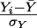
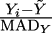
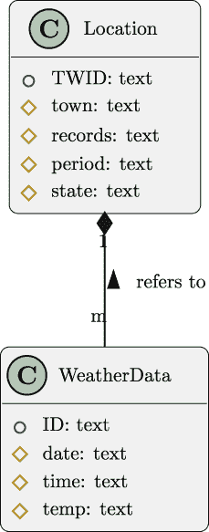

# 第七章

数据检查功能

数据域大致分为三种类型：基数、顺序和名义。本章的第一个项目将指导您检查基数数据；这些数据值如重量、测量和持续时间是连续的，以及计数数据是离散的。第二个项目将指导推理者检查涉及日期等内容的顺序数据，其中顺序很重要，但数据不是正确的测量；它更像是一个代码或标识符。名义数据是一个使用数字的代码，但不代表数值。第三个项目将涵盖在单独的数据源之间匹配键的更复杂情况。

在查看新数据时需要一份检查笔记本。这是一个记录笔记和所学知识的好地方。在诊断更成熟的分析流程中出现的问题时，它非常有帮助。

本章将涵盖与数据检查技术相关的一系列技能：

+   使用 Python 表达式进行的基本笔记本数据检查功能，这些功能是从上一章扩展而来的。

+   用于检查基数数据的`statistics`模块。

+   用于检查顺序和名义数据的`collections.Counter`类。

+   一些额外的`collections.Counter`用于匹配主键和外键。

对于在*第三章*、*第四章*和*第五章*中使用的 Ancombe 的四重奏示例数据集，两个属性值都是基数数据。这是一个对某些检查有帮助的数据集，但我们需要查看本章后面项目中的其他数据集。我们将首先查看一些用于基数数据的检查技术。专注于其他数据集的读者需要辨别哪些属性代表基数数据。

### 7.1 项目 2.2：验证基数域——测量、计数和持续时间

大量的数据在本质上都是基数。基数用于计数，例如集合的元素。这个概念可以推广到包括表示重量或测量的实数。

在这里可以找到一个非常有趣的数据集：[`www.kaggle.com/datasets/rtatman/iris-dataset-json-version`](https://www.kaggle.com/datasets/rtatman/iris-dataset-json-version)。这个数据集包含了不同物种的花瓣和雄蕊的多次测量样本。由于提供了单位 mm，这些测量是可以识别的。

另一个有趣的数据集在这里可以找到：[`datahub.io/core/co2-ppm`](https://datahub.io/core/co2-ppm)。这个数据集包含了以 ppm（百万分之一）为单位测量的二氧化碳水平数据。

我们需要区分计数和度量与仅用于对事物进行排序或排列的数字，这些数字被称为序数。此外，类似数字的数据有时只是一个代码。例如，美国邮政编码只是一串数字；它们不是正确的数值。我们将在*项目 2.3：验证文本和代码——名义数据和序数*中查看这些数值。

由于这是一个检查笔记本，主要目的是仅了解基数数据的值范围。更深入的分析将在以后进行。目前，我们想要一个笔记本来证明数据是完整和一致的，并且可以用于进一步处理。

如果一个企业正在使用数据合同，这个笔记本将演示符合数据合同的情况。使用数据合同时，重点可能略微从显示“一些不可用的数据”转移到显示“发现不符合合同的数据。”在合同对于分析消费者来说不足够的情况下，笔记本可能进一步转向显示“有用但符合的数据。”

我们将从描述要添加到检查笔记本中的单元格类型开始。然后，我们将讨论架构方法，并以详细的交付成果列表结束。

### 7.1.1 描述

本项目的目的是检查原始数据，以了解它是否实际上是基数数据。在某些情况下，可能使用了浮点值来表示名义数据；数据看起来像是一种度量，但实际上是一个代码。

电子表格软件倾向于将所有数据转换为浮点数；许多数据项可能看起来像基数数据。

一个例子是美国邮政编码，它们是一串数字，但可以通过电子表格转换为数值。

另一个例子是银行账户号码，虽然非常长，但可以转换为浮点数。浮点值使用 8 个字节的存储空间，但可以舒适地表示大约 15 位十进制数字。虽然这节省了存储空间，但可能会混淆数据类型，并且存在（小的）账户号码被浮点截断规则更改的可能性。

用户体验是一个 Jupyter Lab 笔记本，可以用来检查数据，展示原始数据值的一些基本特征，并确认数据确实看起来是基数数据。

基数数据有几种常见的子类型：

+   计数；由整数值表示。

+   货币和其他与金钱相关的值。这些通常是十进制值，而`float`类型可能不是一个好主意。

+   持续时间值。这些通常以天、小时和分钟来衡量，但代表一个时间间隔或对时间点应用的“增量”。这些可以归一化为秒或天，并以浮点值表示。

+   更通用的度量标准不属于之前的任何类别。这些通常用浮点数表示。

对于这个项目来说，重要的是要有一个数据的概览。后续的项目将查看清理和转换数据以供进一步使用。这个笔记本仅设计用于预览和检查数据。

我们首先查看一般度量，因为原则适用于计数和持续时间。货币以及持续时间值要复杂一些，我们将单独查看它们。日期时间戳将在下一个项目中查看，因为它们通常被认为是序数数据，而不是基数数据。

### 7.1.2 方法

这个项目基于初始检查笔记本，来自*第六章*，*项目 2.1：数据检查笔记本*。笔记本中的一些基本单元格内容将被重用。我们将向早期章节中显示的组件添加组件——特别是，`samples_iter()` 函数，用于遍历打开文件中的样本。这个特性将是处理原始数据的核心。

在上一章中，我们建议避免使用转换函数。在开始检查数据的过程中，最好是先不预设任何假设，先查看文本值。

源数据值中存在一些常见模式：

+   值看起来都是数值。`int()` 或 `float()` 函数适用于所有值。这里有两个子情况：

    +   所有值似乎都是一些预期的范围内的适当计数或度量。这是理想的。

    +   存在一些“异常”值。这些值似乎超出了预期值范围。

+   一些值不是有效数字。它们可能是空字符串，或者是一条代码行“NULL”，“None”，或“N/A”。

数值异常值可能是测量错误，也可能是数据中隐藏的有趣现象。异常值也可能是表示样本已知缺失或不可用值的数值代码。在二氧化碳数据的例子中，存在异常值 -99.*.*99 百分之一，这些值编码了特定种类的缺失数据情况。

许多数据集将伴随元数据来解释值域，包括非数值值，以及正在使用的数值代码。一些企业数据源可能没有完整或详细解释的元数据。这意味着分析师需要提问以找到非数值值或特殊代码在基数数据中出现的根本原因。

第一个问题——*所有值都是数值吗？*——可以用以下代码处理：

```py
from collections import defaultdict
from collections.abc import Iterable, Callable
from typing import TypeAlias

Conversion: TypeAlias = Callable[[str], int | float]

def non_numeric(test: Conversion, samples: Iterable[str]) -> dict[str, int]:
        bad_data = defaultdict(int)
        for s in samples:
                try:
                        test(s)
                except ValueError:
                        bad_data[s] += 1
        return bad_data
```

策略是应用转换函数，通常是 `int()` 或 `float()`，但对于货币数据或其他具有固定小数位数的其他数据，`decimal.Decimal()` 可能很有用。如果转换函数失败，异常数据将保存在显示计数的映射中。

鼓励您尝试以下字符串序列：

```py
data = ["2", "3.14", "42", "Nope", None, ""]
non_numeroc(int, data)
```

这种测试用例将让您看到该函数如何与良好（和不良）的数据一起工作。它可以帮助将测试用例转换为文档字符串，并将其包含在函数定义中。

如果 `non_numeric()` 函数的结果是一个空字典，那么非数值数据的缺失意味着所有数据都是数值的。

测试函数首先提供，以遵循像 `map()` 和 `filter()` 这样的高阶函数的模式。

此函数的变体可以用作数值过滤器，以通过数值值并拒绝非数值值。这看起来如下：

```py
from collections.abc import Iterable, Iterator, Callable
from typing import TypeVar

Num = TypeVar(’Num’)

def numeric_filter(
    conversion: Callable[[str], Num],
    samples: Iterable[str]
) -> Iterator[Num]:
        for s in samples:
                try:
                        yield conversion(s)
                except ValueError:
                        pass
```

此函数将静默拒绝无法转换的值。省略数据的效果是创建一个不参与进一步计算的 NULL。另一种选择是将无效值替换为默认值。更复杂的选择是使用相邻值插值替换值。省略样本可能对后续处理阶段使用的统计度量有重大影响。此 `numeric_filter()` 函数允许使用其他统计函数来定位异常值。

对于有良好文档或数据合同的数据，像-99.*99 这样的异常值很容易被发现。对于没有良好文档的数据，可能更适合进行统计测试。有关定位异常值的方法的详细信息，请参阅 [`www.itl.nist.gov/div898/handbook/eda/section3/eda35h.htm`](https://www.itl.nist.gov/div898/handbook/eda/section3/eda35h.htm)。

对于小数据集，一种合适的方法是使用基于中值的 Z 分数。我们将深入研究一个基于许多常见统计测量的算法。这将涉及使用内置 `statistics` 包中的函数计算中位数。

关于数据分析的基本统计信息，请参阅 *Statistics for Data *Science*。

[`www.packtpub.com/product/statistics-for-data-science/9781788290678`](https://www.packtpub.com/product/statistics-for-data-science/9781788290678)。

样本的常规 Z 分数，*Z*[i]，基于均值，*Ȳ*，和标准差，*σ*[Y]。它被计算为 *Z*[i] = 。它衡量一个值与均值的距离有多少个标准差。与此并行的是基于中值的 Z 分数的概念，*M*[i]。基于中值的 Z 分数使用中值，*Ỹ*，和中值绝对偏差，MAD[Y]。

这被计算为 *M*[i] = 。这衡量一个值与样本中位数的距离有多少个“MAD”单位。

MAD 是中位数与中位数偏差的绝对值的均值。它需要计算一个整体中位数，*Ỹ*，然后计算所有与整体中位数，*Y* [i] −*Ỹ*的偏差。从这个中位数偏差的序列中，选择中值值以确定所有中值绝对偏差的中心值。这被计算为 MAD[Y] = median(|*Y* [i] −*Ỹ*|)。

基于乘数**M**[i]的过滤器寻找任何从 MAD[Y]的偏差绝对值大于 3.*5 的样本，|*M*[i]| *>* 3.*5\. 这些样本可能是异常值，因为它们与中位数之间的绝对偏差异常大。

为了完整，这里有一个读取源数据的单元格：

```py
with series_4_path.open() as source_file:
    series_4_data = list(samples_iter(source_file))
```

这可以接着是一个计算中位数和中位数绝对偏差的单元格。中位数计算可以使用`statistics`模块完成。然后可以使用生成器计算偏差，从中计算中位数绝对偏差。单元格看起来如下：

```py
from statistics import median

y_text = (s[’y’] for s in series_4_data)
y = list(numeric_filter(float, y_text))
m_y = median(y)
mad_y = median(abs(y_i - m_y) for y_i in y)
outliers_y = list(
    filter(lambda m_i: m_i > 3.5, ((y_i - m_y)/mad_y for y_i in y))
)
```

`y_text`的值是一个生成器，它将从 NDJSON 文件中每个原始数据样本中映射到`’y’`键的值中提取值。从这些文本值中，通过应用`numeric_filter()`函数计算`y`的值。

有时显示`len(y)`` ==`` len(y_text)`有助于证明所有值都是数值的。在某些数据集中，非数值数据的存在可能是一个警告，表明存在更深层次的问题。

`m_y`的值是`y`值的中位数。这用于计算 MAD 值，即从中位数到绝对偏差的中位数。这个中位数绝对偏差提供了一个围绕中位数的预期范围。

`outliers_y`的计算使用生成器表达式来计算基于中位数的 Z 分数，然后只保留那些与中位数超过 3.5 个 MAD 的分数。

安斯康姆四重奏的第四系列数据似乎遭受了一个更复杂的异常值问题。虽然“x”属性有一个潜在的异常值，但“y”属性的 MAD 为零。这意味着超过一半的“y”属性值是相同的。这个单一值就是中位数，对于大多数样本，与中位数之间的差异将为零。

这个异常将成为笔记本中一个有趣的部分。

#### 处理货币和相关值

世界上的大多数货币都使用固定的小数位数。例如，美国货币精确到两位小数。这些是十进制值；对于这些值，`float`类型几乎总是错误的数据类型。

Python 有一个`decimal`模块，其中包含`Decimal`类型，必须用于货币。

不要使用`float`来处理货币或任何与货币相关的计算。

税率、折扣率、利率和其他与金钱相关的字段也是十进制值。它们通常与货币值一起使用，计算必须使用十进制算术规则进行。

当我们将`Decimal`值相乘时，结果可能在小数点右边有额外的数字。这需要应用舍入规则来确定如何舍入或截断额外的数字。这些规则对于获得正确的结果至关重要。`float`类型的`round()`函数可能无法正确执行此操作。`decimal`模块包含各种舍入和截断算法。

考虑一个价格为$12.99 的商品，在一个对每次购买征收 6.25%销售税的地区。这并不是$0.811875 的税款金额。税款金额必须四舍五入；会计师们普遍使用许多四舍五入规则。了解需要哪种规则来计算正确的结果是至关重要的。

由于货币背后的基本假设是十进制计算，因此`float`不应用于货币金额。

当涉及电子表格数据时，这可能会成为一个问题。电子表格软件通常使用具有复杂格式规则的`float`值来生成看起来正确的答案。这可能导致 CSV 提取中看起来奇怪的值，例如，对于应该有货币值的属性，值为 12*.*999999997。

此外，货币可能带有货币符号，如$、£或€。根据地区，还可能有分隔符字符。对于美国地区，这可能意味着在大数字中可能存在多余的”,”字符。

货币值可能有的文本装饰表明，`non_numeric()`或`numeric_filter()`函数使用的转换函数将必须比简单使用`Decimal`类更为复杂。

由于这些异常，数据检查是数据获取和分析中的关键步骤。

#### 处理区间或持续时间

一些日期将包括以`"12:34"`形式表示的持续时间数据，这意味着 12 小时和 34 分钟。这看起来就像一天中的某个时间点。在某些情况下，它可能具有`12h 34m`的形式，这更容易解析。如果没有元数据来解释属性是持续时间还是一天中的某个时间点，这可能是无法理解的。

对于持续时间，将值表示为单个、通用的时间单位很有帮助。秒是一个流行的选择。天也是一个常见的选择。

我们可以创建一个带有给定字符串的单元格，例如：

```py
time_text = "12:34"
```

给定这个字符串，我们可以创建一个单元格来计算秒数，如下所示：

```py
import re

m = re.match(r"(\d+):(\d+)", time_text)
h, m = map(int, m.groups())
sec = (h*60 + m) * 60
sec
```

这将从源文本`time_text`计算出一个持续时间为 45,240 秒的`sec`。Jupyter 笔记本单元格中的最终表达式`sec`将显示此变量的值，以确认计算工作正常。这种基数值计算非常优雅。

对于格式化目的，逆计算可能很有帮助。一个浮点值如 45,240 可以转换回一个整数序列，如(12, 34, 0)，这可以格式化为”12:34”或”12h 34m 0s”。

它可能看起来像这样：

```py
h_m, s = divmod(sec, 60)
h, m = divmod(h_m, 60)
text = f"{h:02d}:{m:02d}"
text
```

这将从`sec`变量给出的秒数生成字符串`12:34`。单元格中的最终表达式`text`将显示计算值，以帮助确认单元格工作正常。

将持续时间字符串和看起来复杂的时态归一化到单个浮点值是很重要的。

现在我们已经查看了一些棘手的基数数据字段，我们可以从整体上查看笔记本。在下一节中，我们将查看重构笔记本以创建一个有用的模块。

#### 提取笔记本函数

普通 Z 分数和基于中位数的 Z 分数的计算在几个方面是相似的。以下是一些我们可能想要提取的常见特征：

+   提取中心和方差。这可能是指使用`statistics`模块的均值和标准差，或者可能是中位数和 MAD。

+   创建一个函数，从平均值或中位数计算 Z 分数。

+   应用`filter()`函数定位异常值。

当查看具有大量属性的数据或查看大量相关数据集时，首先在笔记本中编写这些函数是有帮助的。一旦调试完成，它们可以从笔记本中剪切出来并收集到一个单独的模块中。然后可以修改笔记本以导入这些函数，使其更容易重用这些函数。

由于源数据被推入一个具有字符串键的字典中，因此可以考虑在一系列键值上工作的函数。我们可能有如下示例的单元格：

```py
for column in (’x’, ’y’):
    values = list(
        numeric_filter(float, (s[column] for s in series_4_data))
    )
    m = median(values)
    print(column, len(series_4_data), len(values), m)
```

这将分析周围`for`语句中命名的所有列。在这个例子中，x 和 y 列名被提供为要分析的列的集合。结果是包含列名、原始数据大小、过滤数据大小和过滤数据中位数的值的小表。

描述性统计集合的想法暗示了一个类来保存这些。我们可能添加以下数据类：

```py
from dataclasses import dataclass

@dataclass
class AttrSummary:
    name: str
    raw_count: int
    valid_count: int
    median: float

    @classmethod
    def from_raw(
            cls: Type["AttrSummary"],
            column: str,
            text_values: list[str]
    ) -> "AttrSummary":
        values = list(numeric_filter(float, text_values))
        return cls(
            name=column,
            raw_count=len(text_values),
            valid_count=len(values),
            median=median(values)
        )
```

类定义包括一个类方法，用于从一组原始值构建该类的实例。将实例构建器放入类定义中使得添加额外的检查属性及其计算这些属性所需的函数稍微容易一些。一个构建`AttrSummary`实例的函数可以用来总结数据集的属性。此函数可能看起来如下：

```py
from collections.abc import Iterator
from typing import TypeAlias

Samples: TypeAlias = list[dict[str, str]]

def summary_iter(
        samples: Samples,
        columns: list[str]
) -> Iterator[AttrSummary]:
    for column in columns:
        text = [s[column] for s in samples]
        yield AttrSummary.from_raw(column, text)
```

这种类型的函数使得在复杂数据集中重用多个属性的检查代码成为可能。在查看建议的技术方法后，我们将转向本项目的交付成果。

### 7.1.3 交付成果

本项目有以下交付成果：

+   一个`requirements-dev.txt`文件，用于标识使用的工具，通常是`jupyterlab==3.5.3`。

+   `docs`文件夹中的文档。

+   对使用中的模块的任何新更改进行单元测试。

+   任何新的应用模块，其中包含用于检查笔记本的代码。

+   一个用于检查似乎具有基数数据的属性的笔记本。

本项目需要一个`notebooks`目录。参见*交付成果列表*以获取有关此结构的更多信息。

我们将更详细地查看其中的一些交付成果。

#### 检查模块

鼓励将 `samples_iter()`、`non_numeric()` 和 `numeric_filter()` 等函数重构为单独的模块。此外，`AttrSummary` 类和与之密切相关的 `summary_iter()` 函数也是移动到包含有用的检查类和函数的单独模块的好候选。

笔记本可以被重构以从单独的模块导入这些类和函数。

将此模块放入 `notebooks` 文件夹中以便更容易访问是最简单的方法。另一种选择是将 `src` 目录包含在 `PYTHONPATH` 环境变量中，使其在 Jupyter Lab 会话中可用。

另一个选择是在终端提示符下使用 `ipython profile create` 命令创建一个 IPython 配置文件。这将创建一个包含默认配置文件的 `~/.ipython/profile_default` 目录。添加一个 `startup` 文件夹允许包括将 `src` 目录添加到 `sys.path` 列表中的脚本，以便查找模块。

请参阅 [`ipython.readthedocs.io/en/stable/interactive/tutorial.html#startup-files`](https://ipython.readthedocs.io/en/stable/interactive/tutorial.html#startup-files)。

#### 模块的单元测试用例

将各种函数从笔记本重构为单独的模块需要单元测试。在许多情况下，函数将包含 doctest 示例；整个笔记本将有一个 doctest 单元。

在这种情况下，**pytest** 命令的额外选项将执行这些测试。

```py
% pytest --doctest-modules notebooks/*.py
```

`--doctest-modules` 选项将查找 doctest 示例并执行它们。

另一个选择是直接使用 Python 的 `doctest` 命令。

```py
% python -m doctest notebooks/*.py
```

当然，测试从笔记本提取的代码以确保其正常工作并且可以信赖是至关重要的。

这个修订和扩展的检查笔记本允许分析师检查未知的数据源，以确认值可能是基数数，例如，度量或计数。使用过滤器函数可以帮助定位无效或其他异常文本。一些统计技术可以帮助定位异常值。

在下一个项目中，我们将探讨非基数数据。这包括名义数据（即，不是数字的数字字符串），以及表示排名或排序位置的序数值。

### 7.2 项目 2.3：验证文本和代码 - 名义数据和序数

### 7.2.1 描述

在上一个项目（*项目 2.2：验证基数域 - 度量、计数和持续时间*）中，我们研究了包含基数数据的属性 - 度量和计数。我们还需要查看序数和名义数据。序数数据通常用于提供排名和排序。名义数据最好理解为由数字字符串组成的代码。如美国邮政编码和银行账户号码这样的值属于名义数据。

当我们查看[`datahub.io/core/co2-ppm`](https://datahub.io/core/co2-ppm)提供的**CO****2** **PPM——大气二氧化碳趋势**数据集时，它提供了两种形式的日期：作为`year-month-day`字符串和作为十进制数字。这个十进制数字将月份的第一天定位在整年中的位置。

使用序数日期来计算每个日期的唯一值并与提供的“十进制日期”值进行比较是有教育意义的。整数日期可能比十进制日期值更有用，因为它避免了截断到三位小数。

类似地，从[`berkeleyearth.org/data/`](https://berkeleyearth.org/data/)提供的许多数据集中，包含复杂的日期和时间值。查看源数据，[`berkeleyearth.org/archive/source-files/`](https://berkeleyearth.org/archive/source-files/)中的数据集包含用于编码降水类型或其他历史天气细节的名义值。更多数据，请参阅[`www.ncdc.noaa.gov/cdo-web/`](https://www.ncdc.noaa.gov/cdo-web/)。所有这些数据集的日期格式各不相同。

对于这个项目来说，重要的是要了解涉及日期和名义代码值的数据概览。未来的项目将查看清理和转换数据以供进一步使用。这个笔记本仅用于预览和检查数据。它用于证明数据是完整和一致的，并且可以用于进一步处理。

#### 日期和时间

日期、时间和组合的日期时间值代表一个特定的时间点，有时称为时间戳。通常，这些是通过 Python 的`datetime`对象来建模的。

单独的日期通常可以被视为午夜时间的`datetime`对象。单独的时间通常是在数据中其他地方声明的日期的一部分，或者从上下文中推断出来的。理想情况下，日期时间值被拆分为单独的数据列，没有很好的理由，并且可以组合。在其他情况下，数据可能更难追踪。例如，整个日志文件可能隐含一个日期——因为每个日志文件都是从 UTC 午夜开始的——并且时间值必须与（隐含的）日志的日期结合。

日期时间值非常复杂且充满奇怪的特性。为了使格里高利历与星星和月亮的位置保持一致，会定期添加闰日。Python 中的`datetime`库是处理日历的最佳方式。

通常，在`datetime`包之外进行任何日期时间计算都不是一个好主意。

自行编写的日期计算很难正确实现。

`datetime.datetime`对象的`toordinal()`函数提供了日期和序数之间的明确关系，可以使用它来对日期进行排序。

由于月份不规则，存在几种常见的日期计算方法：

+   日期加上或减去以月为单位给出的持续时间。月份的天数通常会被保留，除非在 2 月 29 日、30 日或 31 日这种不寻常的情况下，将适用临时规则。

+   日期加上或减去以天或周为单位给出的持续时间。

这类计算可能会导致出现在不同年份的日期。对于基于月的计算，需要从日期计算序数月份值。给定一个日期*d*，其年份为*d.y*，月份为*d.m*，序数月份*m*[o]是*d.y* × 12 + *d.m* − 1。计算后，`divmod()`函数将恢复结果的年份和月份。请注意，月份通常从 1 开始编号，但序数月份计算从 0 开始编号。这导致从日期创建序数月份时为-1，从序数月份创建日期时为+1。如上所述，当结果月份是二月时，需要做一些处理来处理试图构建一个可能无效的日期的异常情况，该日期的日期数在给定年份的二月中是无效的。

对于基于天或周的运算，`toordinal()`函数和`fromordinal()`函数将正确地排序和计算日期之间的差异。

所有日历计算都必须使用序数值。

这里有三步：

1.  可以使用`datetime`对象的内置`toordinal()`方法，或者计算序数月份。

1.  将持续时间偏移应用于序数值。

1.  可以使用`datetime`类的内置`fromordinal()`类方法，或者使用`divmod()`函数来计算序数月份的年份和月份。

对于一些开发者来说，使用序数词表示日期可能会感觉复杂。使用`if`语句来判断日期的偏移量是否属于不同的年份不太可靠，并且需要更广泛的边缘情况测试。使用类似`year, month = divmod(date, 12)`的表达式要容易测试得多。

在下一节中，我们将探讨时间和本地时间的问题。

#### 时间值、本地时间和 UTC 时间

本地时间受到许多看似复杂的规则的影响，尤其是在美国。一些国家只有一个时区，简化了本地时间的构成。然而，在美国，每个县都决定它属于哪个时区，导致出现非常复杂的情况，这些情况不一定遵循美国州界。

一些国家（包括美国和欧洲，以及一些其他地方）在一年中的部分时间会调整时间（通常但并非普遍为一个小时）。这些规则并不一定是全国性的；加拿大、墨西哥、澳大利亚和智利的部分地区没有夏令时调整。纳瓦霍部落——位于美国亚利桑那州境内——不调整时钟。

规则在这里：[`data.iana.org/time-zones/tz-link.html`](https://data.iana.org/time-zones/tz-link.html)。这是 Python `datetime`库的一部分，并且已经在 Python 中可用。

这种复杂性使得使用**通用协调时间**（**UTC**）变得至关重要。

为了分析目的，应将本地时间转换为协调世界时（UTC）。

请参阅[`www.rfc-editor.org/rfc/rfc3339`](https://www.rfc-editor.org/rfc/rfc3339)，了解可以包含本地时间偏移的时间格式。

UTC 可以转换回本地时间以供用户显示。

### 7.2.2 方法

日期和时间通常有令人困惑的格式。这在美国尤其如此，那里的日期通常以月/日/年的数字格式书写。使用年/月/日将值按重要性顺序排列。使用日/月/年是重要性顺序的反向。美国的顺序只是奇怪。

这使得在没有元数据解释序列化格式的情况下对完全未知的数据进行检查变得困难。像 01/02/03 这样的日期可能意味着几乎任何事情。

在某些情况下，对许多类似日期的值的调查将揭示一个范围在 1-12 之间的字段，另一个范围在 1-31 之间的字段，允许分析师区分月份和日期。剩余的字段可以被视为截断的年份。

在没有足够的数据来确认月份或日期的情况下，需要其他线索。理想情况下，有元数据来定义日期格式。

`datetime.strptime()`函数可以在格式已知时用于解析日期。直到日期格式已知，数据必须谨慎使用。

这里有两个可以帮助解析日期的 Python 模块：

+   [`pypi.org/project/dateparser/`](https://pypi.org/project/dateparser/)

+   [`pypi.org/project/python-dateutil/`](https://pypi.org/project/python-dateutil/)

仔细检查日期解析的结果，以确保结果是合理的非常重要。有一些混淆因素。

例如，年份可以提供两位或四位数字。例如，处理旧数据时，注意使用两位数编码方案非常重要。在 2000 年之前几年，日期的年份可能被给出为一个复杂的两位数转换。在一个方案中，从 0 到 29 的值代表 2000 年到 2029 年的年份。从 30 到 99 的值代表 1930 年到 1999 年的年份。这些规则通常是临时的，不同的企业可能使用了不同的年份编码。

此外，为了保持时钟与行星运动保持一致，日历上已经几次添加了跳秒。与闰年不同，这些是天文学家持续研究的结果，并不是按照闰年的定义来确定的。

请参阅[`www.timeanddate.com/time/leapseconds.html`](https://www.timeanddate.com/time/leapseconds.html)获取更多信息。

跳秒的存在意味着像`1972-06-30T23:59:60`这样的时间戳是有效的。秒的 60 值代表额外的跳秒。截至本书首次出版时，共有 26 个跳秒，所有这些都在给定年份的 6 月 30 日或 12 月 31 日添加。这些值很少见但有效。

#### 名义数据

名义数据不是数值，可能由数字字符串组成，这可能导致混淆的来源，在某些情况下 — 无用的数据转换。虽然名义数据应被视为文本，但电子表格可能将美国邮政 ZIP 码视为数字并截断前导零。例如，North Adams，MA 的 ZIP 码为 01247。电子表格可能会丢失前导零，使代码变为 1247。

虽然通常最好将名义数据视为文本，但在某些情况下可能需要重新格式化 ZIP 码、账户号码或零件号码以恢复前导零。这可以通过多种方式完成；也许最好的方法是使用 f-string 在左侧填充前导 "0" 字符。像 `f"{zip:0>5s}"` 这样的表达式使用 `zip` 值创建一个字符串，格式为 `0>5s`。此格式具有填充字符 `0`，填充规则 `>`，以及目标大小 `5`。最后的字符 `s` 是预期的数据类型；在这种情况下，是一个字符串。

另一个选择是将给定的 `zip` 值填充到 5 个位置，例如 `(5*"0" + zip)[-5:]`。它会先添加零，然后取最右边的五个字符。这看起来不如 f-string 那么优雅，但可能更加灵活。

#### 扩展数据检查模块

在上一个项目 *项目 2.2：验证基数域 — 度量、计数和持续时间* 中，我们考虑添加一个包含一些有用函数的模块来检查基数数据。我们也可以添加用于序数和名义数据的函数。

对于给定的问题域，日期解析可以定义为单独的、小型的函数。这有助于避免看起来复杂的 `strptime()` 函数。在许多情况下，只有少数日期格式，解析函数可以尝试不同的选项。它可能看起来像这样：

```py
import datetime

def parse_date(source: str) -> datetime.datetime:
    formats = "%Y-%m-%d", "%y-%m-%d", "%Y-%b-%d"
    for fmt in formats:
        try:
            return datetime.datetime.strptime(source, fmt)
        except ValueError:
            pass
    raise ValueError(f"datetime data {source!r} not in any of {formats}
      format")
```

此函数尝试使用三种日期格式来转换数据。如果没有任何格式与数据匹配，将引发 `ValueError` 异常。

对于排名顺序数据和代码，笔记本中的一个单元格可以依赖于一个 `collections.Counter` 实例来获取值的域。对于简单的数字和名义代码，不需要更复杂的处理。

### 7.2.3 可交付成果

此项目有以下可交付成果：

+   一个 `requirements-dev.txt` 文件，用于标识使用的工具，通常是 `jupyterlab==3.5.3`。

+   `docs` 文件夹中的文档。

+   对使用中的模块任何新更改的单元测试。

+   任何新的应用程序模块，其中包含用于检查笔记本的代码。

+   一个用于检查似乎具有序数或名义数据的属性的笔记本。

在 *第一章*，*项目零：其他项目的模板* 中建议的项目目录结构中提到了一个 `notebooks` 目录。参见 *可交付成果列表* 获取更多信息。对于这个项目，需要笔记本目录。

我们将更详细地查看这些可交付成果中的几个。

#### 修订后的检查模块

日期转换和清理名义数据的函数可以编写在一个单独的模块中。或者它们可以在笔记本中开发，然后移动到检查模块。正如我们在*描述*部分所指出的，这个项目的目标是支持数据的检查和特殊案例、数据异常和异常值的识别。

之后，我们可以将这些函数重构为一个更正式和完整的数据清洗模块。这个项目的目标是检查数据并编写一些用于检查过程的实用函数。这将创建一个更完整解决方案的种子。

#### 单元测试用例

日期解析可能是——也许——更复杂的问题之一。虽然我们常常认为我们已经看到了所有的源数据格式，但上游应用程序的一些微小变化可能导致数据分析目的上的意外变化。

每当出现新的日期格式时，就有必要通过不良数据扩展单元测试，然后调整解析器以处理不良数据。这可能导致大量日期时间示例的意外增加。

当面对许多非常相似的案例时，`pytest`参数化固定装置非常方便。这些固定装置提供了一系列测试用例的示例。

固定装置可能看起来像以下这样：

```py
import pytest

EXAMPLES = [
    (’2021-01-18’, datetime.datetime(2021, 1, 18, 0, 0)),
    (’21-01-18’, datetime.datetime(2021, 1, 18, 0, 0)),
    (’2021-jan-18’, datetime.datetime(2021, 1, 18, 0, 0)),
]

@pytest.fixture(params=EXAMPLES)
def date_example(request):
    return request.param
```

每个示例值都是一个包含输入文本和预期`datetime`对象的二元组。这对值可以通过测试用例进行分解。

使用这个充满示例的固定装置进行的测试可能看起来像以下这样：

```py
def test_date(date_example):
    text, expected = date_example
    assert parse_date(text) == expected
```

这种测试结构允许我们随着新格式的发现而添加新的格式。`EXAMPLES`变量中的测试用例很容易通过额外的格式和特殊情况进行扩展。

现在我们已经检查了检查基数、序数和名义数据，我们可以转向一种更专门的名义数据形式：用于在单独的数据集之间跟踪引用的关键值。

## 7.3 项目 2.4：寻找参考域

在许多情况下，数据被分解以避免重复。在*第五章*，*数据获取特性：SQL 数据库*中，我们提到了将数据分解为规范化的想法。

例如，考虑这个目录中的数据集：[`www.ncei.noaa.gov/pub/data/paleo/historical/northamerica/usa/new-england/`](https://www.ncei.noaa.gov/pub/data/paleo/historical/northamerica/usa/new-england/)

有三个单独的文件。当我们访问网页时，我们看到的是以下内容。

这里是`/pub/data/paleo/historical/northamerica/usa/new-england`文件的索引：

|

* * *

|

* * *

|

* * *

|

* * *

|

| **名称** | **最后修改** | **大小** | **描述** |
| --- | --- | --- | --- |

|

* * *

|

* * *

|

* * *

|

* * *

|

| 父目录 |  | - |  |
| --- | --- | --- | --- |
| new-england-oldweather-data.txt | 2014-01-30 13:02 | 21M |  |
| readme-new-england-oldweather.txt | 2014-01-29 19:22 | 9.6K |  |
| town-summary.txt | 2014-01-29 18:51 | 34K |  |

|

* * *

|

* * *

|

* * *

|

* * *

|

|  |  |  |  |
| --- | --- | --- | --- |

`readme-new-england-oldweather.txt`文件描述了主数据集中使用的许多代码及其含义。该“readme”文件提供了一系列从键到值的映射。键用于庞大的“oldweather-data”文件中，以减少数据的重复。

这些映射包括以下内容：

+   温度代码键

+   降水量类型键

+   降水量关键值

+   雪量关键值

+   相似值代码键

+   压力代码键

+   天空覆盖键

+   天空分类键

+   位置代码键

这是对主数据到编码值的一种相当复杂的分解。

### 7.3.1 描述

在数据分解或规范化的情况下，我们需要确认项目之间的引用是否有效。关系通常是单向的——一个样本将引用另一个数据集中的一项。例如，气候记录可能有一个引用“Town Id”（TWID）的值，如`NY26`。第二个包含“位置代码键”的数据集提供了关于`NY26`城镇 ID 定义的详细信息。没有从位置代码数据集到该位置所有气候记录的反向引用。

我们通常将这种关系表示为 ERD。例如，*图 7.1**.*。



图 7.1：一个规范化的关系

许多天气数据记录引用单个位置定义。

数据库设计者会将位置的“TWID”属性称为**主键**。WeatherData 的 ID 属性被称为**外键**；它是不同类别的实体的主键。这些通常缩写为 PK 和 FK。

关于实体之间关系的问题有两个密切相关：

+   关系的基数是多少？这必须从两个方向来考虑。有多少主键实体与外键实体有关联？有多少外键实体与主键实体有关联？

+   关系的**可选性**是什么？同样，我们必须从两个方向来询问这个问题。主实体是否必须有任何外键引用？外键项是否必须有主键引用？

虽然可能的组合很多，但有一些常见的模式。

+   强制多对一关系。这以历史天气数据为例。许多天气数据记录必须引用单个位置定义。有两种常见的变体。在一种情况下，一个位置**必须**有一个或多个天气记录。另一种常见变体可能没有与位置相关的任何天气数据。

+   可选的一对一关系。这在天气数据示例中不存在，但我们可能有带有付款的发票和没有付款的发票。这种关系是一对一的，但付款可能尚未存在。

+   多对多关系。一个多对多关系的例子是一个产品实体具有多个特性。特性在产品之间被重复使用。这需要一个单独的多对多关联表来跟踪关系链接。

这导致以下两个详细的检查：

1.  主键值的域。例如，每个位置上的“TWID”属性。

1.  外键值的域。例如，每个天气数据记录的 ID 属性。

如果这两个集合相同，我们可以确信外键都有匹配的主键。我们可以计算共享外键的行数，以确定关系的基数（和可选性）。

如果这两个集合不相同，我们必须确定哪个集合有额外的行。让我们称这两个集合为*P*和*F*。进一步，我们知道*P**≠**F*。存在多种情况：

+   *P* ⊃ *F*：这意味着有一些主键没有任何外键。如果关系是可选的，那么就没有问题。*P*∖*F*是未使用实体的集合。

+   *F* ⊂ *P*：这意味着有一些外键没有关联的主键。这种情况可能是对键属性的理解错误，或者这可能意味着数据缺失。

对于这个项目来说，重要的是要有一个键值及其关系的概述。这个笔记本仅设计用于预览和检查数据。它用于证明数据是完整和一致的，并且可用于进一步处理。

在下一节中，我们将探讨如何在笔记本中构建单元格来比较键并确定关系的基数。

### 7.3.2 方法

要处理像[`www.ncei.noaa.gov/pub/data/paleo/historical/northamerica/usa/new-england/`](https://www.ncei.noaa.gov/pub/data/paleo/historical/northamerica/usa/new-england/)这样的数据集，我们需要比较键。

这将在检查笔记本中导致两种类型的数据摘要单元格：

+   在`Counter`对象中总结主键。

+   总结外键对这些主键的引用，也使用`Counter`。

一旦有了`Counter`摘要，那么`.keys()`方法将具有不同的主键或外键值。这可以转换成 Python `set`对象，允许优雅的比较、子集检查和集合减法操作。

我们首先将查看收集键值和键引用的编程。然后，我们将查看有用的摘要。

#### 收集和比较键

核心检查工具是`collections.Counter`类。让我们假设我们已经完成了两个独立的数据获取步骤。第一个从`readme-new-england-oldweather.txt`文件中提取了位置定义。第二个将所有`new-england-oldweather-data.txt`天气数据记录转换成了单独的文件。

检查笔记本可以加载位置定义并收集`TWID`属性值。

用于加载键定义的一个单元格可能如下所示：

```py
from pathlib import Path
from inspection import samples_iter

location_path = Path("/path/to/location.ndjson")
with location_path.open() as data_file:
    locations = list(samples_iter(data_file))
```

用于检查城镇键定义的单元格可能如下所示：

```py
import collections

town_id_count = collections.Counter(
    row[’TWID’] for row in locations
)
town_id_set = set(town_id_count.keys())
```

这创建了包含使用的 ID 集合的 `town_id_set` 变量。`town_id_counts` 变量的值是每个 ID 的位置定义数量。由于这是一个主键，它应该只有每个值的单个实例。

引用城镇键的数据可能比键的定义大得多。在某些情况下，将所有数据加载到内存中并不实际，因此检查需要与所选列的摘要一起工作。

对于这个例子，这意味着不会创建一个包含天气数据的 `list` 对象。相反，使用生成器表达式提取相关列，然后使用这个生成器构建最终的 `Counter` 对象摘要。

引用外键的数据行可能看起来像这样：

```py
weather_data_path = Path("/path/to/weather-data.ndjson")
with weather_data_path.open() as data_file:
    weather_reports = samples_iter(data_file)
    weather_id_count = collections.Counter(
        row[’ID’] for row in weather_reports
    )
```

一旦创建了 `weather_id_count` 摘要，以下单元格可以计算键引用的域，如下所示：

```py
weather_id_set = set(weather_id_count.keys())
```

需要注意的是，这个例子明确**不**创建单个天气报告样本的列表。那样会将大量数据一次性加载到内存中。相反，这个例子使用生成器表达式从每一行中提取 `‘ID’` 属性。这些值用于填充 `weather_id_count` 变量。这用于提取天气报告中使用的 ID 集合。

由于我们有两个集合，我们可以使用 Python 的集合操作来比较这两个集合。理想情况下，一个单元格可以断言 `weather_id_set` `==` `town_id_set`。如果这两个集合不相等，则可以使用集合减法操作来定位异常数据。

#### 汇总键的数量

第一个摘要是比较主键和外键。如果这两个集合不匹配，缺失的外键列表可能有助于定位问题的根本原因。

此外，外键计数的范围提供了一些关于其基数和可选性的线索。当一个主键没有外键值引用它时，这种关系看起来是可选的。这应该通过阅读元数据描述来确认。外键计数的上下限提供了基数范围。这个范围有意义吗？元数据中是否有关于基数的提示？

这个项目的数据源示例包括一个包含摘要计数的文件。`town-summary.txt` 文件有四列：“STID”，“TWID”，“YEAR”和“Records”。“STID”来自位置定义；它是美国州。 “TWID”是城镇 ID。“YEAR”来自天气数据；它是报告的年份。最后，“Records”属性是给定位置和年份的天气报告数量。

城市 ID 和年份形成一组逻辑值，可以用来构建一个`collections.Counter`对象。然而，要完全复制此表，需要位置定义来将城市 ID，“TWID”，映射到相关的州，“STID”。

虽然也可以将“TWID”键分解以从前两个字符中提取州信息，但这不是一个好的设计选择。这种复合键是一种不常见的键设计。主键通常是原子性的，没有内部信息可用。良好的设计将键视为不透明的标识符，并从`readme`文件中的相关位置定义表中查找状态信息。

### 7.3.3 交付物

本项目有以下交付物：

+   一个`requirements-dev.txt`文件，用于标识使用的工具，通常是`jupyterlab==3.5.3`。

+   `docs`文件夹中的文档。

+   对任何新更改的模块进行的单元测试。

+   任何新的应用程序模块，其中包含用于检查笔记本的代码。

+   一个用于检查似乎具有外键或主键的属性的笔记本。

在*第一章*，*项目零：其他项目的模板*中建议的项目目录结构中提到一个`notebooks`目录。参见*交付物清单*以获取更多信息。对于这个项目，需要笔记本目录。

我们将更详细地查看一些这些交付物。

#### 修订后的检查模块

检查主键和外键的函数可以编写在一个单独的模块中。通常，首先在笔记本中开发这些函数是最容易的。由于误解可能会出现一些奇怪的不一致。一旦键检查工作正常，就可以将其移动到检查模块。正如我们在*描述*中提到的，本项目的目标是支持数据检查和特殊案例、数据异常和异常值的识别。

#### 单元测试用例

创建针对最常见的键问题（没有外键的主键和没有主键的外键）的测试用例通常很有帮助。这些复杂情况在现成的、精心整理的数据集中不常出现；它们通常出现在文档不完整的企业数据中。

这可能导致相当长的固定装置，其中包含两个源对象集合。不需要很多行数据就能揭示缺失的键；两行数据就足以显示一个存在的键和一个缺失的键。

同样，将这些测试用例与基数数据处理和序数数据转换的测试用例分开也是至关重要的。由于键是一种名义数据，键基数检查可能依赖于一个单独的函数来清理损坏的键值。

例如，真实数据可能需要在检查交易列表以找到账户交易之前，先给账户号码添加前导零。这两个操作需要独立构建和测试账户号码键。数据清理应用程序可以结合这两个函数。目前，它们是两个独立的问题，有独立的测试用例。

#### 修订后的笔记本，使用重构的检查模型

在数据获取应用中，未能解决外键是一个长期存在的问题。这通常是由于各种情况，并且没有单一的数据检查过程。这意味着笔记本中可能包含一系列信息。我们可能会看到以下任何一种类型的单元格：

+   一个单元格解释了键集匹配，数据可能可用。

+   一个单元格解释了一些没有外键数据的主键。这可能包括对这部分样本的总结，与有外键引用的样本分开。

+   一个单元格解释了一些没有主键的外键。这些可能反映了数据中的错误。它可能反映了键之间更复杂的关系。它可能反映了更复杂的数据模型。它可能反映了数据缺失。

在所有情况下，都需要额外的一个单元格，用一些 Markdown 解释结果。将来你会感到庆幸，因为在过去，你已经在你的笔记本中留下了对异常的解释。

## 7.4 摘要

本章扩展了检查笔记本的核心功能。我们探讨了处理基数数据（度量值和计数）、序数数据（日期和排名）以及名义数据（如账户号码之类的代码）。

我们的主要目标是获得数据的完整视图，在我们正式化分析流程之前。次要目标是为我们自己留下关于异常值、异常、数据格式问题和其他复杂情况的笔记。这项工作的一个愉快的结果是能够编写一些函数，这些函数可以用于下游的清洁和标准化我们找到的数据。

从*第九章*，*项目 3.1：数据清理基础应用*开始，我们将探讨重构这些检查函数，以创建一个完整且自动化的数据清理和标准化应用。该应用将基于创建检查笔记本时学到的经验教训。

在下一章中，我们将探讨从初步检查中经常学到的一个额外课程。我们经常发现多个、多样化的数据源背后的潜在模式。我们将探讨通过 JSONSchema 形式化模式定义，并使用模式来验证数据。

## 7.5 额外内容

这里有一些想法，你可以添加到本章的项目中。

### 7.5.1 带有日期和数据源信息的 Markdown 单元格

检查笔记本的一个小特点是识别数据的日期、时间和来源。有时从上下文中可以清楚地知道数据源；例如，可能有一个明显的数据路径。

然而，在许多情况下，并不完全清楚正在检查哪个文件或它是如何获得的。作为一个一般性的解决方案，任何处理应用程序都应该生成一个日志。在某些情况下，元数据文件可以包括处理步骤的详细信息。

在审查数据检查笔记本或与他人分享数据初步检查时，关于源数据和处理步骤的附加元数据可能很有帮助。在许多情况下，这些额外数据被粘贴到普通的 Markdown 单元格中。在其他情况下，这些数据可能是扫描日志文件以查找总结处理的键`INFO`行的结果。

### 7.5.2 演示材料

一个常见的请求是为用户或同行定制演示文稿，以解释新的数据源或解释现有数据源中发现的异常。这些演示文稿通常涉及在线会议或面对面会议，并有一些强调演讲者观点的“幻灯片”。

Keynote 或 PowerPoint 等专有工具常用于这些幻灯片。

更好的选择是仔细组织笔记本，并将其导出为`reveal.js`幻灯片。

Jupyter 的 RISE 扩展在此方面很受欢迎。见[`rise.readthedocs.io/en/stable/`](https://rise.readthedocs.io/en/stable/)。

如果笔记本也是业务所有者和用户的幻灯片演示，这将提供很大的灵活性。我们不需要复制粘贴来将数据从检查笔记本移动到 PowerPoint（或 Keynote），我们只需要确保每个幻灯片有关于数据的几个关键点。如果幻灯片有数据样本，它只有几行，这为演讲者的评论提供了支持证据。

在许多企业中，这些演示文稿被广泛共享。确保演示文稿中的数据直接来自源数据，并且不受复制粘贴错误和遗漏的影响是有益的。

### 7.5.3 使用 JupyterBook 或 Quarto 进行更复杂的输出

在某些情况下，数据初步检查可能需要学习大量关于数据源、编码方案、缺失数据和数据集之间关系的内容。这些信息通常需要组织并发布。

有许多方式可以传播关于数据学到的经验教训：

+   分享笔记本。对于某些用户社区，笔记本的交互性邀请进一步探索。

+   导出笔记本以供发布。一个选择是创建一个可以共享的 PDF。另一个选择是创建 RST、Markdown 或 LaTeX，并使用发布管道构建一个最终可共享的文档。

+   使用像 Jupyter{Book}这样的工具来正式化可共享文档的发布。

+   使用 Quarto 发布一个最终可共享的文档。

关于 Jupyter{Book}，请参阅[`jupyterbook.org/en/stable/intro.html`](https://jupyterbook.org/en/stable/intro.html)。更大的“Executable{Books}”项目（[`executablebooks.org/en/latest/tools.html`](https://executablebooks.org/en/latest/tools.html)）描述了包括 Myst-NB、Sphinx 以及一些相关 Sphinx 主题在内的 Python 相关工具集合。关键成分是使用 Sphinx 来控制最终的发布。

关于 Quarto，请参阅[`quarto.org`](https://quarto.org)。它与 Quarto CLI 的集成更为紧密：只需下载一次 Quarto CLI。Quarto 工具利用 Pandoc 生成最终的、优雅的、可直接发布的文件。

我们鼓励您探索将共享笔记本提升为优雅报告的方法，以便广泛分享。
