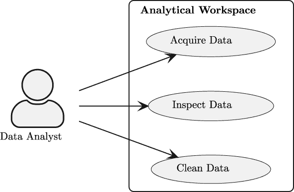
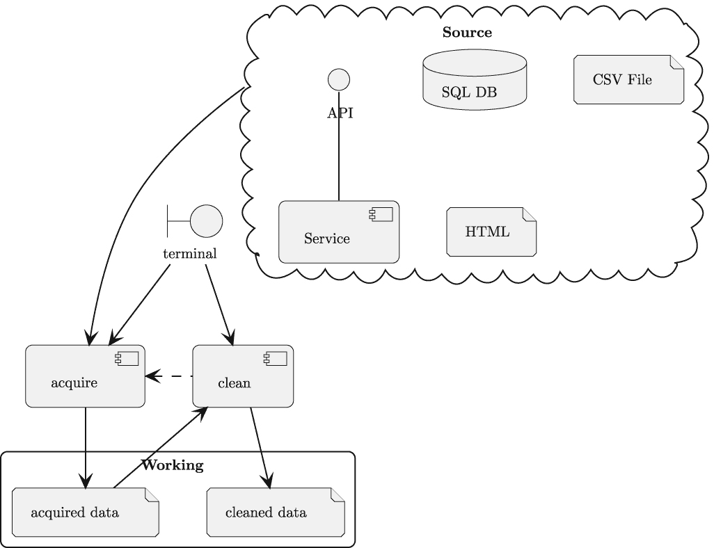

# 第九章

项目 3.1：数据清理基础应用程序

数据验证、清理、转换和标准化是将从源应用程序获取的原始数据转换为可用于分析目的所需的步骤。由于我们开始使用一个非常干净的小数据集，我们可能需要稍作改进以创建一些“脏”原始数据。一个好的替代方案是寻找更复杂、更原始的数据。

本章将指导您设计一个数据清理应用程序，与原始数据获取分开。许多清理、转换和标准化的细节将留给后续项目。这个初始项目通过添加功能来扩展基础。目标是准备一个完整的数据管道的目标，从获取开始，并通过一个单独的清理阶段传递数据。我们希望利用 Linux 原则，即通过共享缓冲区连接应用程序，通常称为 shell 管道。

本章将涵盖与数据验证和清理应用程序设计相关的多个技能：

+   CLI 架构以及如何设计流程管道

+   验证、清理、转换和标准化原始数据的核心概念

本章不会涉及转换和标准化数据的所有方面。第十章*数据清理功能*的项目将扩展许多转换主题。第十二章*项目 3.8：集成数据* *获取 Web 服务*的项目将解决集成管道的概念。目前，我们希望构建一个可扩展的基础应用程序，可以添加功能。

我们将从对理想化数据清理应用程序的描述开始。

## 9.1 描述

我们需要构建一个数据验证、清理和标准化的应用程序。数据检查笔记本是进行此设计工作的便捷起点。目标是创建一个完全自动化的应用程序，以反映从检查数据中学到的经验教训。

数据准备管道具有以下概念任务：

+   验证获取的源文本以确保其可用性，并标记无效数据以进行修复。

+   在必要时清理任何无效的原始数据；这扩大了在可以定义合理清理的情况下可用的数据。

+   将验证和清理后的源数据从文本（或字节）转换为可用的 Python 对象。

+   在必要时，标准化源数据的代码或范围。这里的要求因问题域而异。

目标是创建干净、标准化的数据，以便进行后续分析。意外情况时常发生。有几个来源：

+   上游软件文件格式的问题。获取程序的目标是隔离物理格式问题。

+   源数据的数据表示问题。本项目的目的是隔离值的验证和标准化。

一旦清理完毕，数据本身可能仍然包含令人惊讶的关系、趋势或分布。这是通过后续项目创建分析笔记本和报告来发现的。有时，惊喜来自于发现**零假设**是正确的，而数据只显示出不显著的随机变化。

在许多实际情况下，前三个步骤——验证、清理和转换——通常被合并成一个单独的函数调用。例如，当处理数值时，`int()` 或 `float()` 函数将验证并转换一个值，对于无效的数字将引发异常。

在一些边缘情况下，需要单独考虑这些步骤——通常是因为验证和清理之间存在复杂的交互。例如，某些数据受到美国邮政编码前导零丢失的困扰。这可能是一个复杂的问题，数据表面上无效，但在尝试验证之前可以可靠地清理。在这种情况下，验证邮政编码是否与官方代码列表一致是在清理之后而不是之前。由于数据将保持为文本格式，在清理和验证组合步骤之后没有实际的转换步骤。

### 9.1.1 用户体验

整体 **用户体验** （**UX**） 将是两个命令行应用程序。第一个应用程序将采集原始数据，第二个将清理数据。每个应用程序都有选项来微调 `acquire` 和 `cleanse` 步骤。

在前面的章节中展示了 `acquire` 命令的几种变体。最值得注意的是，**第三章**，**项目 1.1：数据采集基础应用程序**，**第四章**，**数据采集功能：Web API 和抓取**，以及 **第五章**，**数据采集功能：SQL 数据库**。

对于 **clean** 应用程序，预期的命令行应该类似于以下内容：

```py
% python src/clean.py -o analysis -i quartet/Series_1.ndjson
```

`-o` `analysis` 指定了一个目录，结果清理后的数据将被写入该目录。

`-i` `quartet/Series_1.ndjson` 指定了源数据文件的路径。这是一个由采集应用程序编写的文件。

注意，我们不是使用位置参数来命名输入文件。对于文件名使用位置参数是许多——但不是所有——Linux 命令的常见规定。避免使用位置参数的原因是为了使它更容易适应成为处理阶段的一部分的管道。

具体来说，我们希望以下内容也能正常工作：

```py
% python src/acquire.py -s Series_1Pair --csv source.csv | \
    python src/clean.py -o analysis/Series_1.ndjson
```

这条 shell 行包含两个命令，一个用于原始数据获取，另一个用于验证和清理。获取命令使用`-s``Series_1Pair`参数来命名一个特定的系列提取类。这个类将被用来创建单个系列作为输出。`--csv``source.csv`参数命名了要处理的输入文件。其他选项可以命名 RESTful API 或提供数据库连接字符串。

第二个命令读取第一个命令的输出并将其写入文件。文件名由第二个命令中的`-o`参数值命名。

这个管道概念，通过 shell 的`|`操作符提供，意味着这两个进程将并发运行。这意味着数据在可用时从一个进程传递到另一个进程。对于非常大的源文件，在获取数据时清理数据可以显著减少处理时间。

在*项目 3.6：创建获取管道的集成*中，我们将扩展这个设计，包括一些并发处理的想法。

现在我们已经看到了应用程序目的的概述，让我们来看看源数据。

### 9.1.2 源数据

早期项目以大约一致的形式产生了源数据。这些项目专注于获取文本数据。单个样本被转换成小型的 JSON 友好字典，使用 NDJSON 格式。这可以简化验证和清理操作。

NDJSON 文件格式在[`ndjson.org`](http://ndjson.org)和[`jsonlines.org`](https://jsonlines.org)中描述。

**acquire**应用程序背后有两个设计原则：

+   尽可能保留原始源数据。

+   在获取过程中进行最少的文本转换。

保留源数据在源应用程序出现意外变化时稍微容易一些找到问题。同样，最小化文本转换，使数据更接近源。从多种表示形式到单一表示形式简化了数据清理和转换步骤。

所有数据获取项目都涉及从源表示形式到 ND JSON 的某种文本转换。

|

* * *

|

* * *

|

* * *

|

* * *

|

| **章节** | **节** | **来源** |  |
| --- | --- | --- | --- |

|

* * *

|

* * *

|

* * *

|

* * *

|

| 3 | *章节 3*，*项目 1.1：数据获取基础应用程序* | CSV 解析 |  |
| --- | --- | --- | --- |
| 4 | *项目 1.2：从网络服务获取数据* | 压缩 CSV 或 JSON |  |
| 4 | *项目 1.3：从网页抓取数据* | HTML |  |
| 5 | *项目 1.5：从 SQL 提取获取数据* | SQL 提取 |  |

|

* * *

|

* * *

|

* * *

|

* * *

|

|  |  |  |  |
| --- | --- | --- | --- |

在某些情况下——例如，提取 HTML——从数据中剥离标记的文本更改是深刻的。SQL 数据库提取涉及撤销数据库对数字或日期的内部表示，并将值作为文本写入。在某些情况下，文本转换是微小的。

### 9.1.3 结果数据

清洗后的输出文件将是 ND JSON；类似于原始输入文件。我们将在**第十一章****项目 3.7：临时数据持久化**中详细讨论这种输出文件格式。对于这个项目，最简单的方法是坚持编写 Pydantic 数据类的 JSON 表示。

对于 Python 的本地`dataclasses`，`dataclasses.asdict()`函数将从数据类实例生成字典。`json.dumps()`函数将此转换为 JSON 语法的文本。

然而，对于 Pydantic 数据类，`asdict()`函数不能使用。没有内置的方法来生成`pydantic`数据类实例的 JSON 表示。

对于**Pydantic**的版本 1，需要稍作修改来写入 ND JSON。以下表达式将生成`pydantic`数据类的 JSON 序列化：

```py
import json
from pydantic.json import pydantic_encoder
from typing import TextIO, Iterable

import analysis_model

def persist_samples(
        target_file: TextIO,
        analysis_samples: Iterable[analysis_model.SeriesSample | None]
) -> int:
    count = 0
    for result in filter(None, analysis_samples):
        target_file.write(json.dumps(result, default=pydantic_encoder))
        target_file.write("\n")
        count += 1
    return count
```

这个核心功能是`json.dumps()`函数的`default=pydantic_encoder`参数值。这将处理将数据类结构正确解码为 JSON 记法。

对于**pydantic**的版本 2，将采用略有不同的方法。这使用`RootModelclassname`结构从对象中提取给定类的根模型。在这种情况下，`RootModelSeriesSample.model_dump()`将创建一个可以生成嵌套字典结构的根模型。对于版本 2，不需要特殊的`pydantic_encoder`。

现在我们已经了解了输入和输出，我们可以调查处理概念。额外的处理细节将留待后续项目。

### 9.1.4 转换和处理

对于这个项目，我们正在尝试最小化处理复杂性。在下一章**第十章****数据清洗功能**中，我们将探讨一些额外的处理需求，这些需求将增加复杂性。作为下一章项目的预告，我们将描述一些可能需要的字段级验证、清理和转换的类型。

我们关注的一个例子，Anscombe 的四重奏数据，需要转换为一系列浮点值。虽然这很明显，但我们推迟了从文本到 Python `float`对象的转换，以说明将获取数据的复杂性从分析数据的复杂性中分离出来的更普遍原则。此应用程序的输出将具有每个结果 ND JSON 文档，其中包含`float`值而不是`string`值。

JSON 文档中的区别将非常小：对于原始数据字符串使用`"`。对于`float`值，这将被省略。

这个小小的细节很重要，因为每个数据集都会有独特的转换要求。数据检查笔记本将揭示数据域，如文本、整数、日期时间戳、持续时间以及更多专业领域的混合。在信任任何关于数据的模式定义或文档之前，检查数据是至关重要的。

我们将探讨三种常见的复杂情况：

+   必须分解的字段。

+   必须组合的字段。

+   单一集合中样本类型的并集。

+   用于替换特别敏感信息的“不透明”代码。

一种复杂情况是当多个源值合并到一个单一字段时。这个单一源值需要分解成多个值以进行分析。在 Kaggle 提供的非常干净的数据集中，分解的需求是不常见的。另一方面，企业数据集通常会有字段没有正确分解成原子值，这反映了优化或遗留处理需求。例如，产品 ID 代码可能包括业务线和引入年份作为代码的一部分。例如，一艘船的船体 ID 号码可能包括“421880182”，这意味着它是一艘 42 英尺的船体，序列号 188，1982 年 1 月完成。三个不同的项目都被编码为数字。出于分析目的，可能需要将构成编码值的项分开。在其他情况下，需要将几个源字段组合在一起。当查看潮汐数据时，可以找到一个将时间戳分解为三个单独字段的数据集示例。

查看美国潮汐预测的[`tidesandcurrents.noaa.gov/tide_predictions.html`](https://tidesandcurrents.noaa.gov/tide_predictions.html)。此网站支持多种格式的下载，以及针对潮汐预测的 RESTful API 请求。

年度潮汐表中每个潮汐事件都有一个时间戳。时间戳被分解为三个单独的字段：日期、星期几和当地时间。星期几是有帮助的，但它完全来自日期。日期和时间需要组合成一个单一的日期时间值，以便使这些数据有用。通常使用`datetime.combine(date, time)`将单独的日期和时间值合并成一个值。

有时一个数据集将会有多种子类型记录合并到一个单一集合中。这些不同类型通常通过字段的值来区分。一个财务应用程序可能包括发票和付款的混合；许多字段重叠，但这两类交易类型的意义却截然不同。一个字段具有“ I”或“ P”代码值的记录可能是区分表示的业务记录类型的唯一方式。

当存在多个子类型时，该集合可以称为子类型的**区分** **联合**；有时简单地称为**联合**。区分器和子类型表明需要一个类层次结构来描述样本类型的多样性。需要一个公共基类来描述包括区分器在内的公共字段。每个子类都有对子类独特字段的特定定义。

另一个额外的复杂性来自“不透明”的数据源。这些是可以用于相等比较的字符串字段，但不能用于其他目的。这些值通常是数据分析方法**掩码**、**去标识化**或**匿名化**的结果。有时这也被称为“标记化”，因为不透明的标记已经替换了敏感数据。例如，在银行业务中，分析数据将账户号码或支付卡号码转换为不透明值是常见的。这些可以用于汇总行为，但不能用于识别个人账户持有人或支付卡。这些字段必须被视为字符串，不能进行其他处理。

目前，我们将推迟这些复杂性的实现细节到后面的章节。这些想法应该为初始、基础应用程序的设计决策提供信息。

除了干净的有效数据外，应用程序还需要产生关于无效数据的信息。接下来，我们将查看日志和错误报告。

### 9.1.5 错误报告

该应用程序的核心功能是输出用于分析目的的有效、有用的数据文件。我们已经省略了一些关于获取的文档实际上不可用时会发生什么细节。

这里有一些与无效数据可观察性相关的选择：

+   抛出一个总体异常并停止。这在处理像 Anscombe 四重奏这样的精心策划的数据集时是合适的。

+   使所有坏数据可观察，无论是通过日志还是将坏数据写入单独的拒绝样本文件。

+   悄悄拒绝坏数据。这通常用于没有对源数据进行策划或质量控制的大型数据源。

在所有情况下，获取的数据、可用的分析数据和清理以及拒绝的数据的总结计数都是必不可少的。确保读取的原始记录数被计入，并且清理和拒绝的数据的来源清晰。在许多情况下，总结计数是观察数据源变化的主要方式。非零错误计数可能非常重要，以至于它被用作清理应用程序的最终退出状态代码。

除了坏数据可观察性之外，我们可能能够清理源数据。这里也有几个选择：

+   记录每个对象在清理过程中所做的详细情况。这通常用于来自电子表格的数据，其中意外的数据可能是需要手动纠正的行。

+   计算没有支持细节的已清洗项目数量。这通常用于数据源变化频繁的大型数据源。

+   将不良数据作为预期、正常的操作步骤进行静默清理。这通常用于原始数据直接来自不可靠环境中的测量设备时，例如在太空或海底。

此外，每个字段可能都有不同的规则，以确定清洗不良数据是否是一个重要的问题或一个常见、预期的操作。可观察性和自动化清洗的交集有许多替代方案。

数据清洗和标准化的解决方案通常需要与用户进行深入、持续的对话。每个数据采集管道在错误报告和数据清洗方面都是独特的。

有时需要命令行选项来选择记录每个错误或简单地总结错误数量。此外，当发现任何不良记录时，应用程序可能会返回非零退出代码；这允许父应用程序（例如，shell 脚本）在出现错误时停止处理。

我们已经探讨了整体处理、源文件、结果文件以及可能使用的某些错误报告替代方案。在下一节中，我们将探讨我们可以用来实现此应用的一些设计方法。

## 9.2 方法

当我们审视我们的方法时，我们将从 C4 模型（[`c4model.com`](https://c4model.com)）中汲取一些指导。

+   **上下文**：对于本项目，上下文图已扩展到三个用例：获取、检查和清洗。

+   **容器**：有一个容器用于各种应用：用户的个人电脑。

+   **组件**：有两个显著不同的软件组件集合：采集程序和清洗程序。

+   **代码**：我们将简要提及，以提供一些建议的方向。

该应用的上下文图如图*图 9.1*所示。



图 9.1：上下文图

转换应用的组件图不会像采集应用的组件图那样复杂。一个原因是读取、提取或下载原始数据文件没有选择。源文件是由采集应用创建的 ND JSON 文件。

转换程序通常更简单的原因是它们通常依赖于内置的 Python 类型定义，以及像`pydantic`这样的包来提供所需的转换处理。解析 HTML 或 XML 源的复杂性被隔离在采集层，允许此应用专注于问题域数据类型和关系。

该应用的组件如图*图 9.2*所示。



图 9.2：组件图

注意，我们使用了点划线的“依赖于”箭头。这并不显示从获取到清洗的数据流。它显示了清洗应用如何依赖于获取应用的输出。

**清洗**应用的设计通常涉及几乎完全功能性的设计。当然，可以使用类定义。当应用处理涉及无状态、不可变对象时，类似乎没有帮助。

在罕见情况下，清洗应用可能需要进行数据的大规模重组。可能需要从各种交易中积累细节，更新复合对象的状态。例如，可能存在多个付款项需要合并以进行对账。在这种应用中，关联付款和发票可能需要通过复杂的匹配规则进行操作。

注意，**清洗**应用和**获取**应用将共享一组共同的数据类。这些类代表源数据，**获取**应用的输出。它们还定义了**清洗**应用的输入。另一组数据类代表用于后续分析应用的作业值。

我们的目标是创建三个模块：

+   `clean.py`：主要应用。

+   `analytical_model.py`：一个包含用于纯 Python 对象的 dataclass 定义的模块。这些类通常将由具有字符串值的 JSON 友好字典创建。

+   `conversions.py`：一个包含任何专用验证、清洗和转换函数的模块。

如果需要，可能需要任何特定应用转换函数来将源值转换为“清洗”的、可用的 Python 对象。如果无法完成此操作，函数可以改为抛出`ValueError`异常，以遵循 Python 内置`float()`函数等函数的既定模式。此外，当整个对象无效时，`TypeError`异常可能很有帮助。在某些情况下，使用`assert`语句，并可能抛出`AssertionError`来指示无效数据。

对于这个基线应用，我们将坚持使用更简单、更常见的模式。我们将查看结合验证和清洗的单独函数。

### 9.2.1 模型模块重构

我们似乎有两个不同的模型：带有文本字段的“获取”模型和带有适当 Python 类型（如`float`和`int`）的“待分析”模型。模型存在多个变体意味着我们需要很多不同的类名，或者需要两个不同的模块作为命名空间来组织类。

清洗应用是唯一一个同时使用获取和分析模型的应用。其他应用要么获取原始数据，要么处理清洗后的分析数据。

之前的例子中有一个单独的 `model.py` 模块，用于存储获取的数据的 dataclasses。此时，已经更加明确，这并不是一个长期的好决定。因为数据模型有两种不同的变体，所以通用的 `model` 模块名称需要重构。为了区分获取的数据模型和分析数据模型，前缀应该足够：模块名称可以是 `acquire_model` 和 `analysis_model`。

（英语的词性不完全匹配。我们宁愿不用输入 “acquisition_model”。略短的名称似乎更容易处理，并且足够清晰。）

在这两个模型文件中，类名可以是相同的。我们可能有 `acquire_model.SeriesSample` 和 `analysis_model.SeriesSample` 这样的不同类名。

在一定程度上，我们有时可以复制获取的模型模块来创建分析模型模块。我们需要将 `from dataclasses import dataclass` 改为 **Pydantic** 版本的 `from pydantic import dataclass`。这是一个非常小的改动，使得开始变得容易。在某些较旧的 **Pydantic** 和 **mypy** 版本中，**Pydantic** 版本的 `dataclass` 没有以对 **mypy** 工具透明的方式暴露属性类型。

在许多情况下，导入 `BaseModel` 并将其用作分析模型的父类通常可以更好地与 **mypy** 工具共存。当从 dataclasses 升级到利用 **pydantic** 包时，这需要较大的改动。由于它在使用 **mypy** 工具时很有益，所以我们推荐遵循此路径。

此 **Pydantic** 版本的 `dataclass` 引入了一个单独的验证器方法，该方法将（自动）用于处理字段。对于从获取类到分析类的映射相对清晰的简单类定义，需要修改类定义。

对于这个新的分析模型类，以下是一个 **Pydantic** 版本 1 的常见设计模式示例：

```py
from pydantic import validator, BaseModel, Field

class SeriesSample(BaseModel):
    """
    An individual sample value.
    """
    x: float = Field(title="The x attribute", ge=0.0)
    y: float = Field(title="The y attribute", ge=0.0)

    @validator(’x’, ’y’, pre=True)
    def clean_value(cls, value: str | float) -> str:
        match value:
            case str():
                for char in "\N{ZERO WIDTH SPACE}":
                    value = value.replace(char, "")
                return value
            case float():
                return value
```

此设计定义了一个类级别的方法 `clean_value()`，用于处理当数据是字符串时的数据清洗。验证器使用 `@validator()` 装饰器提供该函数应用的属性名称，以及操作序列中的特定阶段。在这种情况下，`pre=True` 表示此验证在各个字段被验证并转换为有用类型之前进行。

这将在 **Pydantic** 版本 2 中被许多更加灵活的替代方案所取代。新版本将放弃用于确保在内置处理程序访问字段之前完成此操作的 `pre=True` 语法。

Pydantic 2 版本的发布将引入一种使用注解来指定验证规则的根本性新方法。它还将保留一个与旧版本 1 验证非常相似的装饰器。

一种迁移路径是将 `validator` 替换为 `field_validator`。这将需要将 `pre=True` 或 `post=True` 更改为更通用的 `mode=’before’` 或 `mode=’after’`。这种新方法允许编写在前后处理中“包装”转换处理器的字段验证器。

要使用 **Pydantic** 第二版，使用 `@field_validator(‘x’，‘y’，mode=‘before’)` 来替换示例中的 `@validator` 装饰器。`import` 也必须更改以反映装饰器的新名称。

这个验证器函数处理源数据的字符串版本可能包含 Unicode `U+200B` 的情况，这是一个称为零宽度的特殊字符。在 Python 中，我们可以使用 `"\N{ZERO WIDTH SPACE}"` 来使这个字符可见。虽然名称很长，但似乎比神秘的 `"\u200b"` 好一些。

（有关此字符的详细信息，请参阅 [`www.fileformat.info/info/unicode/char/200b/index.htm`](https://www.fileformat.info/info/unicode/char/200b/index.htm)。）

当一个函数在 `pre=True` 或 `mode=’before’` 阶段工作时，那么 **pydantic** 将自动应用最终的转换函数来完成验证和转换的基本工作。因此，可以设计这个额外的验证器函数，仅专注于清洗原始数据。

验证器函数的想法必须反映这个类两个不同的用例：

1.  清洗和转换获取的数据，通常是字符串，到更有用的分析数据类型。

1.  加载已经清洗的分析数据，其中不需要类型转换。

我们目前的主要兴趣在于第一个用例，即清洗和转换。稍后，从第 *第十三章* 开始，我们将切换到第二个用例，即加载清洗数据。

这两个用例反映在验证器函数的类型提示中。参数定义为 `value: str | float`。第一个用例，转换，期望值为 `str` 类型。第二个用例，加载清洗数据，期望值为 `float` 类型的清洗值。这种类型的联合对验证器函数很有帮助。

分析模型的实例将从 `acquire_model` 对象构建。因为获取的模型使用 `dataclasses`，我们可以利用 `dataclasses.asdict()` 函数将源对象转换为字典。这可以用于执行 Pydantic 验证和转换以创建分析模型对象。

我们可以在数据类定义中添加以下方法：

```py
    @classmethod
    def from_acquire_dataclass(
            cls,
            acquired: acquire_model.SeriesSample
    ) -> "SeriesSample":
        return SeriesSample(**asdict(acquired))
```

此方法从获取数据模型版本的 `SeriesSample` 类中提取字典，并使用它来创建分析模型变体类的实例。此方法将所有验证和转换工作推送到 **Pydantic** 声明。此方法还需要 `from dataclasses import asdict` 来引入所需的 `asdict()` 函数。

在字段名称不匹配或需要其他转换的情况下，可以使用更复杂的字典构建器来替换`asdict(acquired)`处理。我们将在*第十章*、*数据清理功能*中看到这些示例，其中获取的字段需要在转换之前进行组合。

我们将在*第十一章*、*项目 3.7：中间数据持久化*中重新审视这个设计决策的一些方面。然而，首先，我们将查看**pydantic**版本 2 的验证，它为验证函数提供了一条更为明确的路径。

### 9.2.2 Pydantic V2 验证

虽然**pydantic**版本 2 将提供一个与遗留的`@validator`装饰器非常相似的`@field_validator`装饰器，但这种方法存在一个令人烦恼的问题。列出应用验证规则的字段可能会令人困惑。由于字段定义和验证字段值的函数之间的分离，可能会产生一些混淆。在我们的示例类中，验证器应用于`x`和`y`字段，这是一个在首次查看类时可能难以注意到的细节。

以下示例展示了 Pydantic 版本 2 的分析模型类的新设计模式：

```py
from pydantic import BaseModel
from pydantic.functional_validators import field_validator, BeforeValidator

from typing import Annotated

def clean_value(value: str | float) -> str | float:
    match value:
        case str():
            for char in "\N{ZERO WIDTH SPACE}":
                value = value.replace(char, "")
            return value
        case float():
            return value

class SeriesSample(BaseModel):
    x: Annotated[float, BeforeValidator(clean_value)]
    y: Annotated[float, BeforeValidator(clean_value)]
```

我们省略了`from_acquire_dataclass()`方法定义，因为它没有变化。

清理函数是在类外部定义的，这使得它在复杂的应用程序中更容易重用，在这些应用程序中，许多规则可能在多个模型中被广泛重用。`Annotated[]`类型提示将基本类型与一系列验证器对象结合起来。在这个例子中，基本类型是`float`，验证器对象是包含要应用函数的`BeforeValidator`对象。

为了减少明显的重复，可以使用`TypeAlias`。例如，

```py
from typing import Annotated, TypeAlias

CleanFloat: TypeAlias = Annotated[float, BeforeValidator(clean_value)]
```

使用别名允许模型使用类型提示`CleanFloat`。例如`x: CleanFloat`。

此外，`Annotated`提示是可组合的。一个注解可以给之前定义的注解添加功能。在基础注解之上构建更复杂的注解的能力，为以简洁和表达的方式定义类提供了巨大的潜力。

现在我们已经看到了如何实现单个验证，我们需要考虑替代方案，以及一个应用程序可能需要多少种不同的验证函数。

### 9.2.3 验证函数设计

`pydantic`包提供了基于注解的大量内置转换。虽然这些可以覆盖大量常见情况，但仍有一些情况需要特殊的验证器，甚至可能需要特殊的类型定义。

在*转换和处理*中，我们考虑了一些可能需要的处理类型。这些包括以下类型的转换：

+   将源字段分解为其原子组件。

+   将分离的源字段合并以创建适当的值。例如，日期和时间通常是这样做的。

+   样本流中可能存在多个子实体。这可以称为区分联合：整个流是不同类型的唯一组合，而区分值（或值）区分各种子类型。

+   字段可能是一个“令牌”，用于去除原始源信息。例如，用于替换驾照号码的替换令牌可以替换真实政府颁发的号码，以使个人匿名。

此外，我们可能需要考虑可观察性，这会引导我们编写自己的独特验证器，以便写入所需的日志条目或更新计数器，显示特定验证发现问题的次数。这种增强的可视性有助于确定数据中经常不规则或质量控制不佳的问题。

我们将在第十章*数据清洗功能*中更深入地探讨这些概念。在第十章*数据清洗功能*中，我们还将探讨处理主键和外键的功能。目前，我们将专注于 Python 内置函数和标准库中的内置类型转换函数。但我们需要认识到，可能会有扩展和例外。

我们将在下一节中探讨整体设计方法。

### 9.2.4 增量设计

没有对源数据的详细了解，很难最终确定清洗应用程序的设计。这意味着清洗应用程序依赖于通过制作数据检查笔记本学到的经验教训。一个理想化的工作流程从“理解需求”开始，然后进行“编写代码”，将这两个活动视为独立的、隔离的步骤。这个概念工作流程有点谬误。通常，没有对实际源数据进行详细审查以揭示存在的怪癖和异常，很难理解需求。数据审查通常会导致数据验证函数的第一稿。在这种情况下，需求将以代码草案的形式出现，而不是一份精心制作的文档。

这导致了一种在*临时*检查和正式数据清洗应用程序之间的来回。这种迭代工作通常会导致一个函数模块来处理问题域的数据。这个模块可以被检查笔记本以及自动化应用程序共享。适当的工程遵循**DRY**（**不要重复自己**）原则：代码不应在模块之间复制和粘贴。它应该放入共享模块中，以便可以正确地重用。

在某些情况下，两个数据清理函数可能相似。发现这一点表明，某种分解是合适的，以将公共部分与独特部分分开。通过有一套单元测试来确认在将函数转换为删除重复代码时没有破坏旧功能，可以简化重构和重构。

创建清理应用程序的工作是迭代和逐步的。罕见特殊情况很少见，而且通常在处理管道似乎完成很久之后才会出现。意外出现的特殊情况数据类似于观鸟者在其预期栖息地外看到的鸟。将数据检查笔记本想象成观鸟者的大号望远镜，用来仔细观察一只意外、罕见的鸟，通常是在一群具有相似觅食和栖息偏好的鸟群中。罕见鸟的存在成为鸟类学家（和业余爱好者）的新数据点。在意外数据的情况下，检查笔记本的教训成为转换模块的新代码。

数据清理应用程序的整体主模块将实现**命令行界面**（**CLI**）。我们将在下一节中探讨这一点。

### 9.2.5 CLI 应用程序

该应用程序的用户体验表明，它操作在以下不同的上下文中：

+   作为独立应用程序。用户运行`src/acquire.py`程序。然后，用户运行`src/clean.py`程序。

+   作为处理管道的一个阶段。用户运行一个 shell 命令，将`src/acquire.py`程序输出的内容管道到`src/clean.py`程序。这是*项目 3.6：集成* *创建获取管道*的主题。

这导致以下两个运行时上下文：

+   当应用程序提供输入路径时，它被用作独立应用程序。

+   当没有提供输入路径时，应用程序从`sys.stdin`读取。

类似的分析可以应用于**获取**应用程序。如果提供了输出路径，应用程序将创建并写入命名的文件。如果没有提供输出路径，应用程序将写入`sys.stdout`。

这的一个基本后果是所有日志**必须**写入`sys.stderr`。

仅使用**stdin**和**stdout**作为应用程序数据，不使用其他任何内容。

使用一致、易于解析的文本格式，如 ND JSON，用于应用程序数据。

将所有控制和错误消息的输出目的地设置为**stderr**。

这意味着`print()`可能需要`file=sys.stderr`来将调试输出定向到**stderr**。或者，避免使用简单的`print()`，而使用`logger.debug()`代替。

对于这个项目，独立选项就足够了。然而，了解将在后续项目中添加的替代方案很重要。参见*项目 3.6：集成创建获取管道*以了解这种更紧密集成的替代方案。

#### 重定向标准输出

Python 提供了一个方便的工具来管理“写入打开文件”和“写入 **stdout**”之间的选择。它涉及以下基本设计原则。

总是为处理数据的函数和方法提供类似文件的对象。

这表明需要一个类似以下的数据清理函数：

```py
from typing import TextIO

def clean_all(acquire_file: TextIO, analysis_file: TextIO) -> None:
    ...
```

此函数可以使用 `json.loads()` 解析来自 `acquire_file` 的每个文档。它使用 `json.dumps()` 将每个文档保存到 `analysis_file` 以供后续分析使用。

整个应用可以选择以下四种可能的方式来使用此 `clean_all()` 函数：

+   **独立**：这意味着 `with` 语句管理从作为参数值提供的 `Path` 名称创建的打开文件。

+   **管道** **头部**：一个 `with` 语句可以管理传递给 `acquire_file` 的打开文件。`analysis_file` 的值是 `sys.stdout`。

+   **管道** **尾部**：获取的输入文件是 `sys.stdin`。一个 `with` 语句管理用于 `analysis_file` 的打开文件（写入模式）。

+   **管道** **中间**：`acquire_file` 是 `sys.stdin`；`analysis_file` 是 `sys.stdout`。

现在我们已经探讨了多种技术方法，接下来将在下一节中转向本项目的可交付成果列表。

## 9.3 可交付成果

此项目有以下可交付成果：

+   `docs` 文件夹中的文档。

+   `tests/features` 和 `tests/steps` 文件夹中的接收测试。

+   `tests` 文件夹中的应用模块的单元测试。

+   应用到清理一些获取的数据，并对几个字段进行简单的转换。后续项目将添加更复杂的验证规则。

我们将更详细地查看其中一些可交付成果。

当开始一种新的应用时，通常从接收测试开始是有意义的。后来，当添加功能时，新的接收测试可能不如新的单元测试重要。我们将首先查看这种新应用的新场景。

### 9.3.1 接收测试

正如我们在*第四章*、*数据获取功能：Web API 和抓取*中提到的，我们可以将一大块文本作为 Gherkin 场景的一部分提供。这可以是输入文件的内容。我们可以考虑以下场景。

```py
Scenario: Valid file is recognized.
    Given a file "example_1.ndjson" with the following content
        """
        {"x": "1.2", "y": "3.4"}
        {"x": "five", "z": null}
        """
    When the clean tool is run
    Then the output shows 1 good records
    And the output shows 1 faulty records
```

这种场景让我们能够定义具有有效数据的源文档。我们还可以定义具有无效数据的源文档。

我们可以使用 `Then` 步骤来确认输出的一些额外细节。例如，如果我们决定使所有清理操作都可见，测试场景可以确认输出包含所有已应用的清理操作。

坏数据示例的多样性和好坏数据组合的数量表明，这种应用可能有多种场景。每次出现新的获取数据，但无法清理时，新的示例将被添加到这些接收测试用例中。

在某些情况下，广泛发布场景可能非常有帮助，以便所有利益相关者都能理解数据清理操作。Gherkin 语言被设计成让技术技能有限的人能够为测试用例做出贡献。

我们还需要场景来从命令行运行应用程序。这些场景的`When`步骤定义将是`subprocess.run()`来调用**清理**应用程序，或者调用包含**清理**应用程序的 shell 命令。

### 9.3.2 模型特征的单元测试

对于模型定义类，拥有自动化的单元测试是很重要的。

同样重要的是**不要**测试`pydantic`组件。例如，我们不需要测试`pydantic`模块已经完成的普通字符串到浮点数的转换；我们可以信任这会完美工作。

我们**必须**测试我们编写的验证器函数。这意味着提供测试用例来测试验证器的各种功能。此外，任何整体的`from_acquire_dataclass()`方法都需要有测试用例。

每个这些测试场景都与一个给定的获取文档和原始数据一起工作。当`from_acquire_dataclass()`方法被评估时，可能会有异常，或者会创建一个分析模型文档。

异常测试可以利用`pytest.raises()`上下文管理器。测试是用`with`语句编写的，用于捕获异常。

请参阅[`docs.pytest.org/en/7.2.x/how-to/assert.html#assertions-about-expected-exceptions`](https://docs.pytest.org/en/7.2.x/how-to/assert.html#assertions-about-expected-exceptions)以获取示例。

当然，我们还需要测试正在进行的处理。按照设计，这类应用中涉及的处理并不多。大部分处理可能只有几行代码来消费原始模型对象并生成分析对象。大部分工作将委托给`json`和`pydantic`等模块。

### 9.3.3 应用以清理数据并创建 NDJSON 临时文件

现在我们有了验收和单元测试套件，我们需要创建`clean`应用程序。最初，我们可以创建一个占位符应用程序，只是为了看到测试套件失败。然后我们可以填充各个部分，直到应用程序作为一个整体工作。

在这个应用程序中，灵活性至关重要。在下一章（*第十章*，*数据清理功能*）中，我们将介绍大量数据验证场景。在第十一章（*项目 3.7：临时数据持久化*）中，我们将重新审视保存清理数据的想法。现在，创建干净的数据是至关重要的；稍后，我们可以考虑哪种格式可能最好。

## 9.4 总结

本章已经涵盖了数据验证和清理应用的一些方面：

+   CLI 架构以及如何设计简单的流程管道。

+   核心概念包括验证、清理、转换和标准化原始数据。

在下一章中，我们将更深入地探讨一些数据清理和标准化的功能。这些项目都将基于这个基础应用程序框架。在这些项目之后，接下来的两章将更仔细地研究分析数据持久性选择，并为提供清洗数据给其他利益相关者提供一个集成网络服务。

## 9.5 额外内容

这里有一些想法供您添加到这个项目中。

### 9.5.1 创建一个包含拒绝样本的输出文件

在*错误报告*中，我们建议有时创建一个拒绝样本的文件是合适的。对于本书中的例子——其中许多是从精心整理、仔细管理的数据集中抽取的——设计一个会拒绝数据的程序可能会感觉有点奇怪。

对于企业应用来说，数据拒绝是一个常见需求。

可以看看这样的数据集：[`datahub.io/core/co2-ppm`](https://datahub.io/core/co2-ppm)。这个数据集包含与使用 ppm（百万分之一）单位测量的 CO2 水平相同的测量数据。

这里有部分样本在月份的天数上无效。还有一些样本没有记录月度 CO2 水平。

使用拒绝文件将这个数据集划分为清晰可用的记录和不太清晰可用的记录可能会有所启发。

输出将**不会**反映分析模型。这些对象将反映获取模型；它们是从获取结构到所需分析结构无法正确转换的项目。
