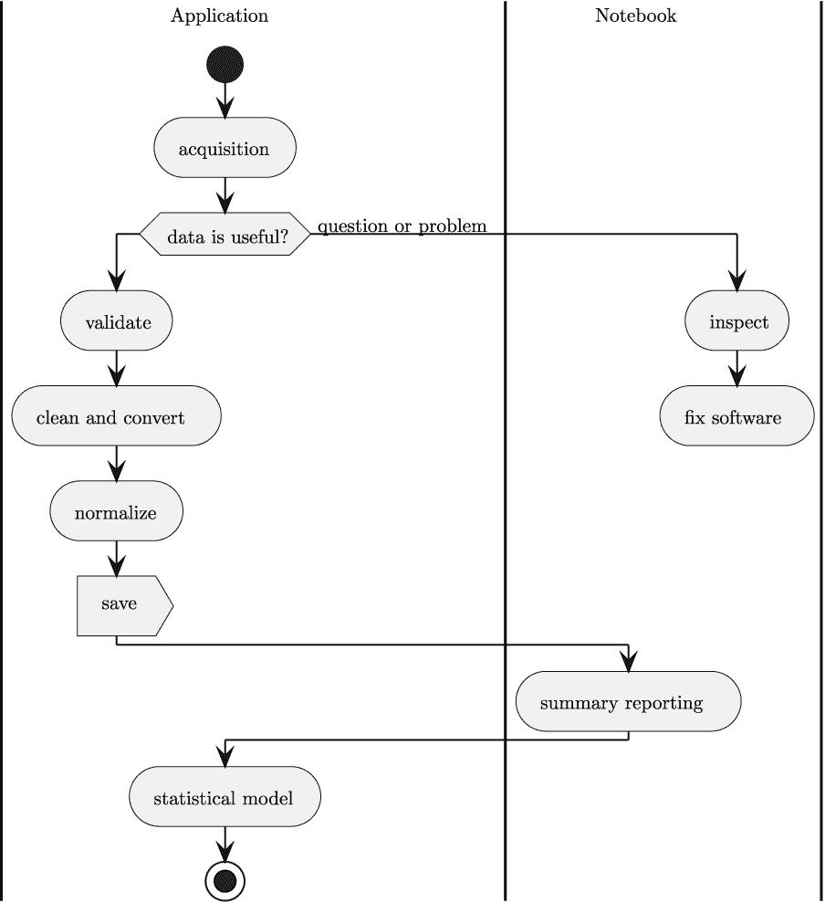

# 第十七章

下一步

从原始数据到有用信息的旅程才刚刚开始。通常还有更多步骤需要完成，才能获得可用于支持企业决策的见解。从这里开始，读者需要主动扩展这些项目，或者考虑其他项目。一些读者可能想要展示他们对 Python 的掌握，而另一些读者则可能更深入地研究探索性数据分析领域。

Python 被用于如此多的不同事物，以至于甚至很难建议一个深入理解语言、库以及 Python 各种使用方式的途径。

在本章中，我们将涉及一些与探索性数据分析相关的更多主题。本书中的项目只是日常需要解决的各种问题的一小部分。

每个分析师都需要在理解正在处理的企业数据、寻找更好的数据建模方法以及有效展示结果的方式之间平衡时间。这些领域都是知识技能的大领域。

我们将从回顾本书项目序列背后的架构开始。

## 17.1 整体数据处理

应用程序和笔记本的设计基于以下多阶段架构：

+   数据采集

+   数据检查

+   数据清洗；这包括验证、转换、标准化和保存中间结果

+   总结，以及数据建模的开始

+   创建更深入的分析和更复杂的统计模型

阶段如*图 17.1*所示相互配合。



图 17.1：数据分析流程

在这个流程中的最后一步当然不是最终的。在许多情况下，项目会从探索发展到监控和维护。模型将继续被确认，这将有一个漫长的尾巴。一些企业管理工作是这一持续确认的必要部分。

在某些情况下，长尾部分会被变化所中断。这可能会反映在模型的不准确性上。可能无法通过基本的统计测试。揭示变化及其原因正是企业管理工作对数据分析至关重要的原因。

这种分析长尾可能持续很长时间。责任可能会从分析师传递给分析师。利益相关者可能会来来去去。分析师通常需要花费宝贵的时间来证明一项正在进行的研究，以确认企业仍在正确的轨道上。

企业处理或软件的其他变化将导致分析处理工具的彻底失败。最显著的变化是对“上游”应用的变化。有时这些变化是软件的新版本。在其他时候，上游变化是组织性的，企业的一些基本假设需要改变。随着数据源的变化，此管道的数据采集部分也必须改变。在某些情况下，清洗、验证和标准化也必须改变。

由于支持工具——Python、JupyterLab、Matplotlib 等——的快速变化，定期重建和重新测试这些分析应用变得至关重要。`requirements.txt`文件中的版本号必须与 Anaconda 发行版、conda-forge 和 PyPI 索引进行核对。变化的节奏和性质使得这项维护任务成为任何良好工程解决方案的必要部分。

企业监督和管理参与的想法有时被称为“决策支持”。我们将简要地看看数据分析和建模是如何作为决策者的服务的。

## 17.2 “决策支持”的概念

所有数据处理背后的核心概念，包括分析和建模，是帮助某个人做出决策。理想情况下，一个好的决策将基于可靠的数据。

在许多情况下，决策是由软件做出的。有时决策是简单的规则，用于识别不良数据、不完整的过程或无效的操作。在其他情况下，决策更为微妙，我们将“人工智能”这个术语应用于做出决策的软件。

虽然许多类型的软件应用做出了许多自动化决策，但最终——一个人仍然——对这些决策的正确性和一致性负责。这种责任可能表现为一个人审查决策的定期总结。

这个负责任的利益相关者需要了解应用程序软件所做的决策的数量和类型。他们需要确认自动化的决策反映了良好的数据以及所声明的政策、企业的治理原则以及企业运营中的任何法律框架。

这表明需要对元分析和更高层次的决策支持进行需求。操作数据被用来创建一个可以做出决策的模型。决策的结果成为关于决策过程的数据库；这需要分析和建模来确认操作模型的正确行为。

在所有情况下，最终消费者是需要数据来决定一个过程是否运行正确或是否存在需要纠正的缺陷的人。

多级数据处理的想法导致了对仔细跟踪数据源以了解数据的含义及其所应用的任何转换的想法。我们将探讨元数据主题，接下来。

## 17.3 元数据和来源的概念

数据集的描述包括三个重要方面：

+   数据的语法或物理格式和逻辑布局

+   数据的语义，或意义

+   数据来源，或数据的起源及其应用到的转换

数据集的物理格式通常使用知名文件格式的名称来总结。例如，数据可能以 CSV 格式存在。CSV 文件中列的顺序可能会改变，这导致需要具有标题或某些元数据来描述 CSV 文件中列的逻辑布局。

大部分这些信息都可以在 JSON 模式定义中进行枚举。

在某些情况下，元数据可能是一个具有列号、首选数据类型和列名的另一个 CSV 文件。我们可能有一个看起来像以下示例的二级 CSV 文件：

```py
1,height,height in inches
2,weight,weight in pounds
3,price,price in dollars
```

这条元数据信息描述了一个包含相关数据的单独 CSV 文件的内容。这可以转换成 JSON 模式，以提供统一的元数据表示。

数据来源元数据有一系列更复杂的关系。PROV 模型（见[`www.w3.org/TR/prov-overview/`](https://www.w3.org/TR/prov-overview/））描述了一个包括**实体**、**代理**和**活动**的模型，这些模型创建或影响了数据。在 PROV 模型中，存在许多关系，包括**生成**和**派生**，这些关系直接影响到正在分析的数据。

有几种方法可以序列化信息。PROV-N 标准提供了一个相对容易阅读的文本表示。PROV-O 标准定义了一个 OWL 本体，可以用来描述数据的来源。本体工具可以查询关系图，以帮助分析师更好地理解正在分析的数据。

鼓励读者查看[https://pypi.org/project/prov/](https://pypi.org/project/prov/)，了解描述数据来源的 PROV 标准的 Python 实现。

在下一节中，我们将探讨额外的数据建模和机器学习应用。

## 17.4 机器学习的下一步

我们可以在统计建模和机器学习之间划出一个大致的界限。这是一个热门的辩论话题，因为——从适当的距离来看——所有统计建模都可以描述为机器学习。

在本书中，我们划出了一个界限，以区分基于算法的方法，这些算法是有限的、确定的和有效的。例如，使用线性最小二乘法找到一个与数据匹配的函数的过程，通常可以精确地以封闭形式给出答案，不需要调整超参数，因此是可复制的。

即使在我们狭窄的“统计建模”领域内，我们也会遇到线性最小二乘法表现不佳的数据集。例如，最小二乘估计的一个显著假设是，所有自变量都完全已知。如果 *x* 值受到观测误差的影响，就需要更复杂的方法。

“统计建模”和“机器学习”之间的边界不是一个清晰、简单的区分。

我们将注意机器学习的一个特征：调整超参数。超参数的探索可能成为构建有用模型的一个复杂副主题。这个特性之所以重要，是因为统计模型和需要调整超参数的机器学习模型之间的计算成本跳跃。

这里是计算成本粗略范围上的两个点：

+   统计模型可能通过有限算法创建，将数据简化为几个参数，包括拟合数据的函数的系数。

+   机器学习模型可能涉及搜索不同的超参数值，以找到产生通过某些统计测试的模型组合。

超参数值的搜索通常涉及进行大量计算以创建模型的每个变体。然后进行额外的计算来衡量模型的准确性和通用效用。这两个步骤针对不同的超参数值迭代进行，以寻找最佳模型。这种迭代搜索可能会使某些机器学习方法的计算量变得很大。

这种开销和超参数搜索并不是机器学习的普遍特征。对于本书的目的来说，这是作者划定的界限，以限制项目的范围、复杂性和成本。

我们强烈建议您通过学习 scikit-learn 中可用的各种线性模型来继续您的研究项目。请参阅[`scikit-learn.org/stable/modules/linear_model.html`](https://scikit-learn.org/stable/modules/linear_model.html)。

本书中的项目序列是创建从原始数据中获取有用理解的第一步。
