# 第二章：Python 实体和 API

Blender 通过使其**应用程序编程接口**（**API**）的**模块**在应用程序内部可用来扩展 Python。

这些模块提供了**包装器**，将 Blender 的内部数据转换为 Python 对象。完整的文档和 API 参考可在网上找到，并可以从应用程序内部访问。此外，还有一些额外的功能可以帮助程序员在他们的旅程中。

就像我们在*第一章*中遇到的语法高亮一样，一些针对开发者的特性在编程世界中很常见。其他特性，如属性工具提示和变量显示，是 Blender 特有的。

在本章中，我们将查看一些**代码片段**，即代码块，这将帮助您对 Blender 的 API 架构有信心。

通常，API 的设计对已经熟悉 Python 的程序员非常友好，仅在少数情况下偏离标准。

到本章结束时，您将能够从 Python 控制台检查 Blender 对象并更改其属性，使用和扩展 Blender 收藏夹，并检查用户交互的当前状态。

在本章中，我们将熟悉以下主题：

+   Python 的特性

+   Blender 模块及其结构

+   数据和上下文访问

# 技术要求

只需要 Blender 就可以跟随本章的内容。

# Python 的有用特性

我们在*第一章*中已经遇到了**脚本**工作区的*Python*元素。现在我们将探讨一些有用的特性，这些特性可以帮助我们充分利用它们。在编程方面，自动化可以加快搜索属性和术语的速度。这可以在控制台通过传统方法如**自动完成**实现，或者在界面中通过显示图形元素 Python 地址的快捷键实现。其中一些功能在 Blender 启动时就已经可用，而其他功能则留给用户启用。

## 开发者选项

开发者功能默认禁用。它们可以在 Blender 顶部栏的**编辑**菜单中的**首选项**对话框中启用。我们需要选择左侧的**界面**选项卡并查看第一个面板：**显示**。程序员通常启用**开发者额外功能**和**Python** **工具提示**选项。

### 开发者额外功能

**开发者额外功能**添加了一个右键菜单项，可以在*文本编辑器*中显示 UI 的 Python 源代码。当用户切换到**编辑模式**时，它还会显示网格组件的几何索引。此外，它还允许**搜索栏**执行无法通过 UI 访问的操作员。

### Python 工具提示

将鼠标光标悬停在属性上会显示一个包含简要描述的工具提示。如果启用了 Python 工具提示，还会显示如何在脚本中调用该属性的信息。

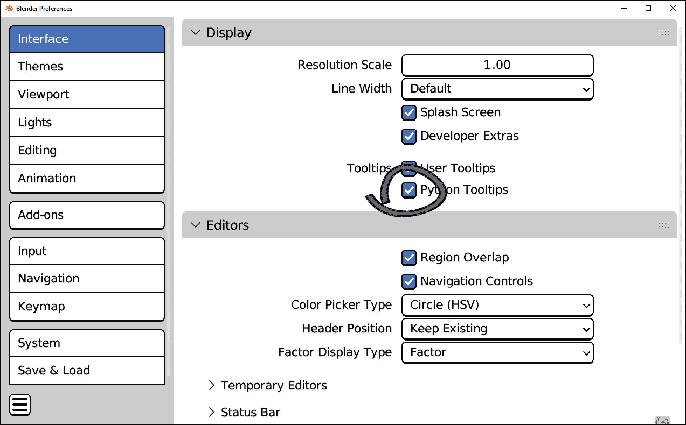

图 2.1：Blender 的显示首选项

例如，在 3D 视图中，我们可以按*N*键来显示屏幕右侧的**变换通道**。将鼠标指针停留在坐标上，例如**位置：** **X**，一段时间将显示描述中的两条附加行：

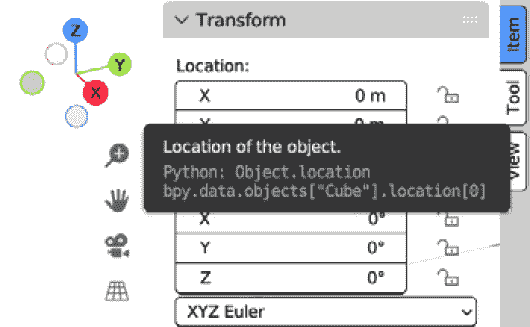

图 2.2：对象位置的 Python 提示

Python 提示包含两行：

```py
Python: Object.location
bpy.data.objects['Cube'].location[0]
```

第一行提供了属性的 Python 名称；在这种情况下，`location`是空间中的`Object`位置。

第二行更具体：可以通过在控制台中输入该行来访问此对象（`'Cube'`）的位置。这通常被称为属性的**完整数据路径**，在某些情况下，也称为**RNA**路径。后者来自一个有趣的类比于遗传学：如果 Blender 的内部代码是其*DNA*，那么其*Python*访问可以看作是应用的*RNA*。

一个对象的定位是一个简单的情况，其他属性可能更复杂。无论如何，我们可以按照下一小节中的步骤将数据路径复制到剪贴板。

### 复制数据路径

在属性上右键单击将打开一个*上下文*菜单。一些条目，例如**插入关键帧**和**重置为默认值**，对动画很有用。在本节中，我们将重点关注编程条目，**复制数据路径**和**复制完整** **数据路径**：

1.  在 3D 视图中选择一个对象。

1.  如果右侧没有显示变换属性，请按*N*键召唤**变换**侧边栏。

1.  从**项目**选项卡，右键单击第一个位置通道（**X**），然后点击**复制完整** **数据路径**。

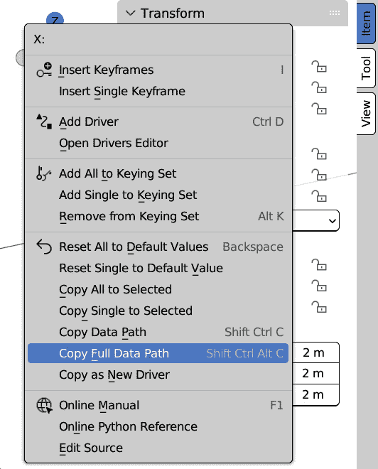

图 2.3：位置 X 的右键菜单

1.  前往 Python 控制台，按*Ctrl* + *V*粘贴，然后按*Enter*。

控制台将显示*X*坐标的位置值：

```py
>>> bpy.data.objects['Cube'].location[0]
0.0
```

完整数据路径允许访问一个属性，除非它是只读属性，否则可以更改其值。我们可以看到复制的行以一个索引结束，这是由于`location`是一个三维属性——每个索引都指空间的一个轴：

```py
bpy.data.objects['Cube'].location[0]  # X axis
bpy.data.objects['Cube'].location[1]  # Y axis
bpy.data.objects['Cube'].location[2]  # Z axis
```

数据路径有时可能很复杂，但在下一节中，我们将查看一些控制台工具，这些工具在寻找正确的属性时非常有帮助。

## Python 控制台的实用工具

*Python 控制台*提供了一些有用的工具。其中一些，如文本补全和历史记录，在程序员工具中很常见。其他一些，如变量的 3D 表示，是 Blender 特有的。本节概述了 Python 控制台在日常编程中的应用。

### 自动补全

在控制台中输入时按下*Tab*按钮会建议几种完成该行的可能方式。除此之外，如果当前语句与内部文档相关联（例如`print()`：

1.  在 Blender 中，在屏幕顶部的选项卡中选择**脚本工作区**，正如我们在*脚本工作区*部分、*Python 的第一步*、*第一章*中学到的。

1.  在 Python 控制台中，只输入`prin`，然后按*Tab*。

控制台填写缺失的字母，并显示`print(`，一个开括号及其文档。然后，它让程序员完成该行。

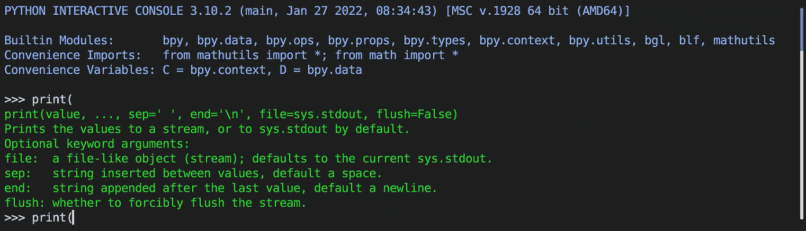

图 2.4：Python 控制台中的自动完成

### 历史

可以使用上下箭头键检索 Blender Python 控制台中之前执行的命令。这可以通过任何代码进行测试。以下是在 Python 控制台中运行的示例：

1.  输入`print('Line One')`，然后按*Enter*。

1.  按下*↑*键。当前文本将更改为以下内容：

    ```py
    >>> print("Line One")
    ```

1.  删除最后几个字母，将行更改为`print('Line Two')`，然后按*Enter*。

1.  按两次*↑*键以再次显示`>>> print('Line` `One')`。

1.  在*↓*和*↑*之间交替按动以在两个命令之间切换。

### 多行输入

由两行或更多行组成的代码片段可以粘贴到控制台，并通过按两次*Enter*键执行。

由于空白行标记了代码片段的结束，它们可能会使存在于缩进块内的有效代码失败。让我们看看一个简单的例子：一个包含两个`print`语句的条件，这两个语句由一行分隔：

```py
if True:
    print('Line One')
    print('Line Two')
```

此代码在*文本编辑器*中有效，但在*Python 控制台*中失败。以下是输出：

```py
>>> if True:
...     print('Line One')
...
Line One
>>>     print('Line Two')
  File "<blender_console>", line 1
    print("Line Two")
IndentationError: unexpected indent
```

执行前两行后，第二行`print()`的缩进被认为是错误的。

每个针对控制台设计的代码片段中的空白行都应该用注释（`#`）替换。以下代码将有效：

```py
if True:
    print('Line One')
    #
    print('Line Two')
```

### 在 3D 视图中显示 3D 变量

表示 3D 点或变换的变量可以在三维空间中显示。这是通过**Math Vis (Console)**插件实现的。**插件**是 Python 扩展，可以在需要时启用。本书中我们将编写自己的插件。目前，我们将看看如何启用随 Blender 一起提供的插件。

#### 启用 Math Vis (Console)插件

插件可以在首选项中启用：

1.  从顶栏菜单中选择**编辑 |** **首选项**。

1.  在左侧列中选择**插件**选项卡。

1.  在带有放大镜图标标记的搜索过滤器中输入`Math Vis`。

1.  点击插件名称左侧的复选框。

#### 创建 3D 变量

Blender 为 3D 实体提供了额外的 Python 类型。例如，可以使用`Vector`类型存储坐标。我们可以通过输入以下内容将向量存储在变量中：

```py
my_vector = Vector([1.0, 2.0, 3.0])
```

由于我们已经启用了*Math Vis (Console)*插件，3D 视图中将出现一个粉红色的点，后面跟着变量名。

![图 2.5：向量坐标 [1.0, 2.0, 3.0]，如图 3D 视口所示](img/Figure_2._05_B18375.jpg)

图 2.5：向量坐标 [1.0, 2.0, 3.0]，如图 3D 视口所示

变量只有在控制台可见时才会可视化，只要它们存在。一旦它们被删除，绘图就会停止，如下所示：

```py
del my_vector
```

`del` 语句是标准的 Python 命令。我们应该记住，它删除的是 Python 变量，而不是 Blender 对象。

如果我们想在 Blender 中删除对象，我们可以使用 Blender 的 `delete()` 命令：

```py
bpy.ops.object.delete()
```

前一个命令中的 `ops` 代表 `bpy.ops.object.delete()`，这意味着按 *X* 键或从 **对象** 菜单中选择 **删除** 操作。

具有几何意义的类型，如 `Vector`、`Matrix` 和 `Euler`，是数学构造，属于 `mathutils` 模块。此模块会自动导入到 *控制台* 中。在控制台中不需要再次导入它。如果我们想在脚本中使用它，我们必须从模块中导入：

```py
from mathutils import Vector
my_vector = Vector([1.0, 2.0, 3.0])
```

我们将在下一章中探索 `mathutils`，当处理 3D 对象和元素时。在下一节中，我们将熟悉 Blender 对象如何转换为 Python。

# 访问 Blender 模块

Blender 的附加模块在整个应用程序中可用，可以通过标准 `import` 语句使用。它们在 Python 控制台、文本编辑器和通常在 Blender 系统和用户路径中安装的脚本中可用。

一些模块非常特定；例如，`freestyle` 模块处理自由风格渲染的设置，不能用于其他目的。其他模块，如 `mathutils`，在涉及数字时都会发挥作用。

最后，`bpy` 模块及其子模块在 Blender 脚本中扮演着更重要的角色，因为它们提供了访问对象和数据的能力。

在本节中，我们将更详细地了解 `bpy`，它在控制台中已经存在，以及我们如何在脚本中使用它。我们还将学习如何找到有关 API 及其元素更多信息。

## bpy 模块

在 *第一章* 中，我们使用 Python 控制台编辑器的 **控制台**->**复制** 从控制台复制了行，并将它们粘贴到一个文本块中。在这个过程中，我们在开头发现了一些额外的行：

```py
import bpy
from bpy import data as D
from bpy import context as C
...
```

第一行导入 `bpy`，这是编程接口的主模块。第二行和第三行导入 `data` 和 `context`，并将它们分别分配给 `D` 和 `C` 字母作为便利快捷方式。这最初在屏幕上指出：

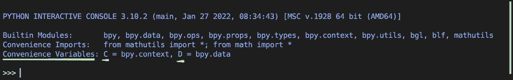

图 2.6：Python 控制台的便利变量

`data` 表示 Blender 对象的存储，而 `context` 则是用户交互的当前状态，例如选择或当前模式（**对象**、**编辑**、**姿态**等）。

由于其本质，`context` 和 `data` 总是存在于 Blender 脚本中。自动补全显示了其他模块的概览。如果我们输入 `bpy.` 并按 *Tab* 键，我们将获得它们的列表。

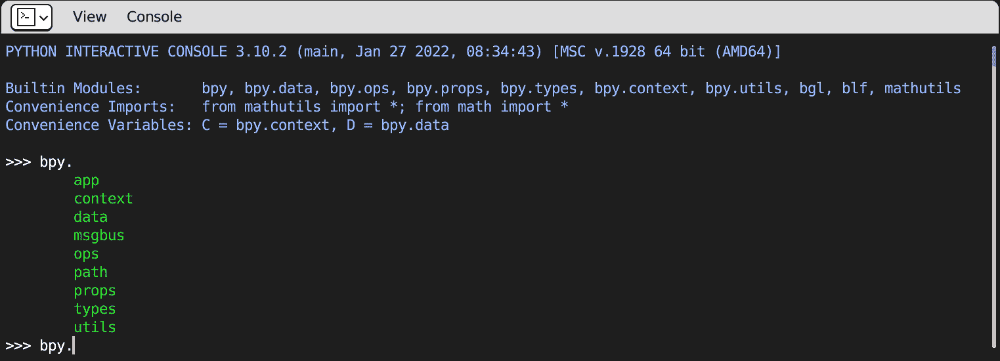

图 2.7：bpy 的子模块

`bpy` 的每个属性都涵盖了 Blender 的一个特定方面。例如，`bpy.app` 包含软件的属性（可执行文件和版本），而 `bpy.ops` 包含操作员，即可以在界面中调用的函数。

`bpy` 和其他 Blender 模块包含大量的类、方法和实用工具。这些实体在 *Python API 参考文档* 中进行了文档化，该文档可在网上找到，如有需要可以下载。

## API 文档

可以通过 **帮助** | **Python API 参考文档** 从顶部菜单栏访问参考网站。

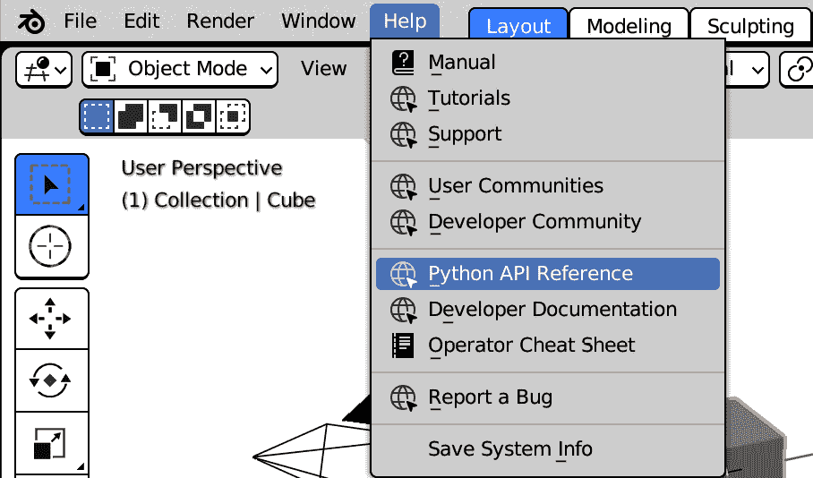

图 2.8：Python API 参考链接

当前版本的 *Python 帮助* 将在网页浏览器中打开。该文档是通过使用名为 `help()` 函数的软件从 docstrings 生成的。

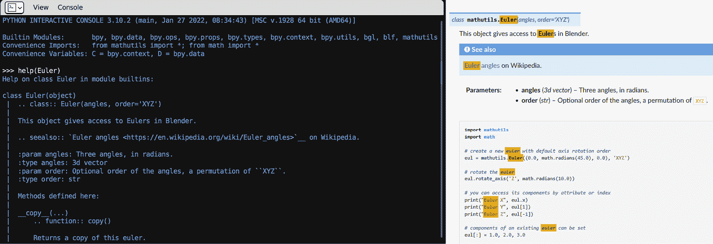

图 2.9：help() 函数与 Euler 类在线帮助的比较

在线帮助具有搜索栏的优势，并且不会占用我们的 Blender 会话空间。它包含可用模块及其内容的索引。

API 参考非常有助于导航各种模块和 `bpy` 的属性。

在本章中，我们将重点关注 `bpy.data` 和 `bpy.context`，将其他模块的具体功能留到下一章介绍。

# 访问 Blender 数据

当前会话中创建的所有实体都作为 `bpy.data` 的一部分可用。它们被分组在遵循 `bpy.data.armatures`、`bpy.data.curves` 等的类别中。每个类别都是一个 `bpy_collection`，它是 Blender 类型，包含更多元素。它们的内容可以通过索引（如 Python `list` 中的索引）或通过关键字（如字典中的关键字）访问。

### 对象访问

我们可以使用 Python 访问场景中的对象。例如，我们可以查询 Blender 默认场景的内容，该场景包含一个 **立方体**、一个 **相机** 和一个 **灯光**：

1.  打开或重启 Blender，然后在屏幕顶部的标签页中选择 **脚本工作区**。

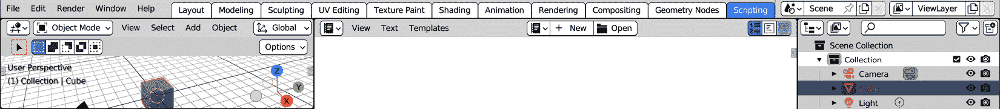

图 2.10：工作区标签页

1.  输入 `len(bpy.data.objects)` 并按 *Enter* 键：

    ```py
    >>> len(bpy.data.objects)
    ```

    ```py
    3
    ```

1.  在 Python 控制台中，输入 `bpy.data.objects`，然后按 *Tab* 键。

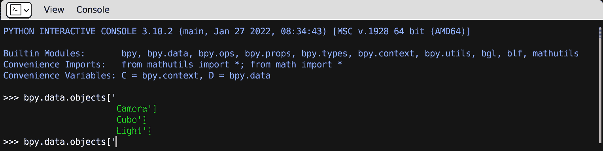

图 2.11：Blender 的默认对象

初始时可能会感到困惑，因为不同类型的对象都属于 `bpy.data.objects`，而不是 `bpy.data.cameras`、`bpy.data.meshes` 和 `bpy.data.lights`。

实际上，在 3D 视图中可以放置和显示的任何内容都是`bpy.data.objects`类型。**对象**是一个通用的容器，可以存储任何类型的数据，或**数据块**。*对象*/*数据块*系统是 Blender 的一个原则。我们将在下一章中更好地了解它。现在，我们将专注于对象级别的访问。

#### 列表式访问

与 Python 列表一样，`bpy_collection`的各个元素可以通过在括号中添加索引数字来访问，如下例所示：

```py
>>> bpy.data.objects[0]
bpy.data.objects['Camera']
>>> bpy.data.objects[1]
bpy.data.objects['Cube']
>>> bpy.data.objects[2]
bpy.data.objects['Light']
```

如果我们知道我们正在寻找的对象的名称，我们可以通过字符串关键字而不是索引来获取它。

#### 字典式访问

除了使用它们的序号索引外，我们还可以使用它们的名称作为关键字来访问`bpy.data.objects`的元素，就像我们在 Python 字典中做的那样：

```py
>>> bpy.data.objects['Camera']
bpy.data.objects['Camera']
>>> bpy.data.objects['Cube']
bpy.data.objects['Cube']
>>> bpy.data.objects['Light']
bpy.data.objects['Light']
```

### 遍历集合

要对一个聚合类型中的所有对象执行表达式，我们需要遍历这个集合。**遍历**描述了滚动元素的动作。通过使用循环语句遍历，我们可以在许多对象上执行相同的操作。

#### 列表式循环

典型的`for element in list`循环与`bpy_collection`一起工作。以下片段打印出现有对象列表：

```py
import bpy
for ob in bpy.data.objects:
    print(ob.name, ob.type)
```

或者，如果我们还需要它们的集合索引，我们可以使用以下方法：

```py
import bpy
for i, ob in enumerate(bpy.data.objects):
    print(i, ob.name, ob.type)
```

查看输出结果，我们可以看到`bpy.data.objects`的元素是按字母顺序排序的：

```py
0 Camera CAMERA
1 Cube MESH
2 Light LIGHT
```

这意味着重命名对象会改变它们在列表中的顺序。如果我们迭代集合时重命名元素，这可能会成为一个问题。

例如，这个片段在第一个对象（**相机**）的名称前添加了字母`'z'`。这改变了它在*大纲视图*中的位置，从第一个显示的对象变为最后一个显示的对象：

```py
import bpy
bpy.data.objects[0].name ='z' + bpy.data.objects[0].name
```

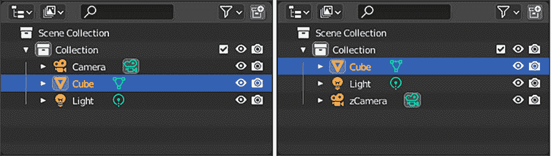

图 2.12：重命名前后的对比 – 对象的顺序已改变

如果我们在循环内部执行相同的操作，我们将遇到重新排序的问题：

```py
import bpy
for ob in bpy.data.objects:
    ob.name ='z' + ob.name
```

如果`'z'`重复一段很长时间，这是合理的。

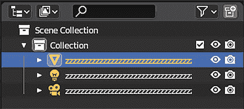

图 2.13：重命名添加了过多的“z”

这是一个错误，我们的代码和应用程序本身并没有做任何本质上的错误。

要理解为什么会这样，我们需要将其分解成单个步骤。Blender 重命名了第一个、第二个和第三个对象，然后它应该停止。但由于它们已经被重命名，"Light"被重命名并放在最后，所以之后，Blender 继续将"zCamera"重命名为"zzCamera"，这个过程一直持续下去。

这会持续到名称变得过长而无法重命名为止。

这种类型的错误可能导致软件停止运行，并且很难找到。每次我们的脚本重命名集合的内容时，我们必须确保重新排序不会成为问题。我们将探讨一些可能的解决方案。

#### 通过列表转换避免重新排序

避免重复迭代的第一个也是最简单的方法是将`bpy_collection`转换为 Python 列表。按*Ctrl* + *Z*撤销重命名。

现在，我们将使用一条略微不同的命令，通过`list()`方法将集合转换为纯 Python 列表：

```py
import bpy
for ob in list(bpy.data.objects):
    ob.name = 'z' + ob.name
```

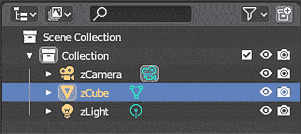

图 2.14：对象已被正确重命名

在下一小节中，我们将看到字典方法也得到了支持。它们在许多方面都是不可重新排序的。

#### 类似字典的循环

就像 Python 字典一样，`keys()`方法返回集合中所有存在的名称：

```py
for name in bpy.data.objects.keys():
    print(name)
```

或者，我们可以使用`values()`方法获取对象的列表：

```py
for ob in bpy.data.objects.values():
    print(ob.name, ob.type)
```

最后，我们可以使用`items()`迭代：

```py
for name, ob in bpy.data.objects.items():
    print(name, ob.type)
```

## 创建新对象

Blender 类故意缺少`bpy_collection`的`new()`方法。例如，3D 对象是通过`bpy.data.objects.new()`创建的。

### new()方法

使用 Blender 界面将对象添加到场景中只需一步。在 Python 中完成此操作需要一些额外的工作：`new()`命令将新对象存储在内存中，但然后我们需要显式地将它添加到我们的场景中。

在 Python 控制台中输入`bpy.data.objects.new`并按*Tab*键将显示其文档：

```py
>>> bpy.data.objects.new(
new()
BlendDataObjects.new(name, object_data)
Add a new object to the main database
```

新函数需要两个参数：我们想要给对象起的名字以及它将要包含的*datablock*。如果我们还没有任何*datablocks*，我们可以为`object_data`参数创建一个`None`类型：

```py
import bpy
my_empty = bpy.data.objects.new('My Empty', None)
print('New Empty created:', my_empty)
```

`print()`行将确认对象已被创建。它不会在 3D 视图中显示，但我们可以检查`bpy.data.objects`。

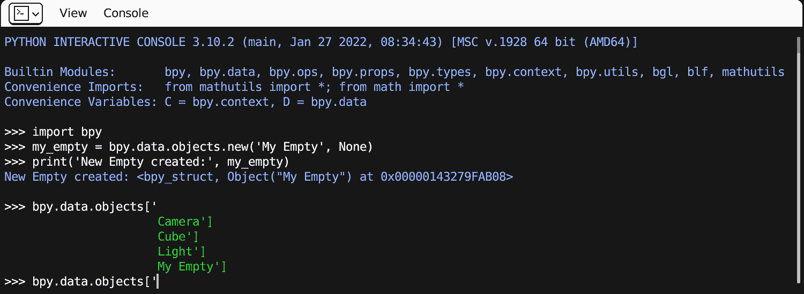

图 2.15：新的空对象出现在 Python 集合中

此对象还不是 3D 场景的一部分。为了成为场景的一部分，对象必须属于一个**集合**。

### 对象集合

术语*集合*有些含糊不清，因为我们把`bpy_collection`称为数据访问的一部分。`bpy_collection`类型，如`bpy.data.objects`，是两个不同的概念：

+   **场景集合**是作为文件夹显示在**大纲视图中**的对象组。它们用于在场景中组织 3D 对象。

+   `bpy_collection`不是场景的一部分。

所有场景集合都可以使用`bpy.data.collections`在 Python 中访问。

我们现在只需一步就可以将我们的对象添加到场景中：我们需要将`my_empty`添加到场景集合中，使用集合方法`link`。

### 将对象链接到场景

默认场景中只有一个集合，因此如果我们输入`bpy.data.collections`并按*Tab*键，我们可以通过自动完成获取它：

```py
>>> bpy.data.collections['Collection']
```

默认集合命名为`Collection.objects`属性。将`my_empty`链接的 Python 行是：

```py
bpy.data.collections['Collection'].objects.link(my_empty)
```

**我的空对象**现在已成为场景的一部分，并在大纲视图中显示出来。

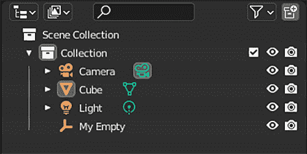

图 2.16：我们的空对象与其他对象一起

## 删除元素

就像我们可以使用 `new()` 创建新元素一样，我们可以使用 `bpy.data.objects` 的 `remove()` 方法来删除它们。这一行将 `my_empty` 从 Blender 中移除：

```py
bpy.data.objects.remove(my_empty)
```

通过 `link()` 链接现有对象的集合，如 `Collection.objects`，有一个 `unlink()` 方法用于删除：

```py
collection = bpy.data.collections['Collection']
collection.objects.unlink(bpy.data.objects['Cube'])
```

在那种情况下，`bpy.data.objects`。

在本节中，我们通过 Python 使用 `bpy.data` 访问了 Blender 对象。

如果有多个场景，或者当前对象和活动选择，我们如何获取当前场景？

我们将看到如何在 `bpy.context` 模块中跟踪用户交互的状态。

# 理解用户上下文

当前交互状态、当前场景和选择都可以通过 `bpy.context` 获取。由于它依赖于用户操作，`bpy.context` 是只读的；也就是说，不能直接更改。无论如何，我们可以通过 *Python* 影响当前活动的状态。而不是更改 `bpy.context` 的属性，我们必须查找 Blender 对象、图层和场景的选择和活动属性。

### 活动场景

一个 `.blend` 文件，或者说是未保存的会话，可以包含多个**场景**。这与 3D 软件包的标准不同，其中保存的文件相当于一个场景。如果有更多场景可用，它们可以从 Blender 头部右上角的列表菜单中选择。

每个场景都可以包含 `bpy.data.objects` 中的任何对象，一个对象可以属于多个场景。对一个场景中的对象所做的更改将保留在其他场景中。

我们已经看到了如何使用 `bpy.data.objects.new()` 创建新对象。我们可以用相同的方式创建新场景，使用 `bpy.data.scenes.new()`：

```py
import bpy
new_scene = bpy.data.scenes.new('My Scene')
print('New scene created:', new_scene.name)
```

新场景将在右上角的控件中可用。

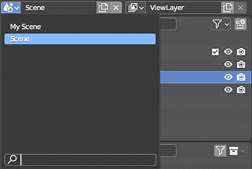

图 2.17：Blender 场景菜单

当前显示的场景包含在 `bpy.context.window` 中。

如果我们想创建一个新场景并使其成为活动场景，我们可以将其分配给 `window.scene` 属性：

```py
import bpy
new_scene = bpy.data.scenes.new('Another Scene')
bpy.context.window.scene = new_scene
```

执行此代码片段后，3D 视口将切换到一个新的空场景。当前场景本身是 `bpy.context` 的一部分，可以通过 Python 使用 `bpy.context.scene` 来检索：

```py
print('The current scene is', bpy.context.scene.name)
```

### 视图层

**视图层**用于分别渲染场景中的对象，并通过**合成**将它们重新组合。这样做是为了加快渲染过程，例如，只渲染一次背景，或者出于艺术需求。在 UI 中，视图层与场景以相同的方式创建，使用顶部栏上的控件。

在 Python 中创建它们时，我们必须记住它们始终属于它们的场景，而不是 `bpy.data`。尽管如此，如果我们想设置活动图层，我们仍然必须使用 `bpy.context.window` 的一个属性：

```py
import bpy
new_layer = bpy.context.scene.view_layers.new('My Layer')
print('New layer created:', new_layer.name)
bpy.context.window.view_layer = new_layer
print('Current layer:', bpy.context.view_layer.name)
```

活动层必须属于活动场景。尝试将来自不同场景的层分配给当前窗口的语句将被忽略。以下是一个示例：

```py
import bpy
new_layer = bpy.context.scene.view_layers.new('Another Layer')
print('New layer created:', new_layer.name)
new_scene = bpy.data.scenes.new('Another Scene')
bpy.context.window.scene = new_scene
# NOTE: the following line will not work
bpy.context.window.view_layer = new_layer
print('Current layer:', bpy.context.view_layer.name)
```

图层可以存储渲染和通道属性，但也可以存储它们的可见性、活动状态和选择状态。在下一节中，我们将看到图层是如何存储**活动对象**的。

### 活动对象

当用户选择一个对象时，它将成为当前层的**活动对象**。其属性将在界面中显示，并且将成为用户操作的主要目标。

当 Blender 打开时，默认的活动对象是一个立方体。我们可以从左上角的**Text Info**中看到这一点。

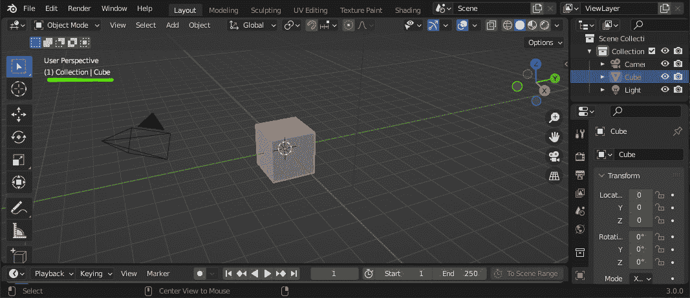

图 2.18：Blender 的默认活动对象

在 API 中可以在多个地方检索活动对象，最直接的是`bpy.context.object`：

```py
bpy.context.object  # read only
bpy.context.active_object  # read only, same as above
bpy.context.view_layer.objects.active  # can be set
```

所有三个属性都指向同一个对象，但由于`bpy.context`是只读的，因此只能通过程序更改`view_layer`属性。如果有更多图层，切换图层可以更改活动对象。或者我们可以通过以下步骤使用 Python 来更改它。

#### 更改活动对象

活动对象是活动视图层的属性。考虑到这一点，我们只需将`view_layer.active`属性设置为不同的对象即可。例如，以下是如何选择相机的示例：

1.  打开 Blender 或通过**文件**->**新建**->**通用**恢复到默认场景。

1.  前往脚本工作区。

1.  在 Python 控制台中输入以下行并按*Enter*键：

```py
import bpy
view_layer = bpy.context.view_layer
view_layer.objects.active = bpy.data.objects['Camera']
```

我们可以看到，活动对象已经从 3D 视图、属性和状态信息中改变。

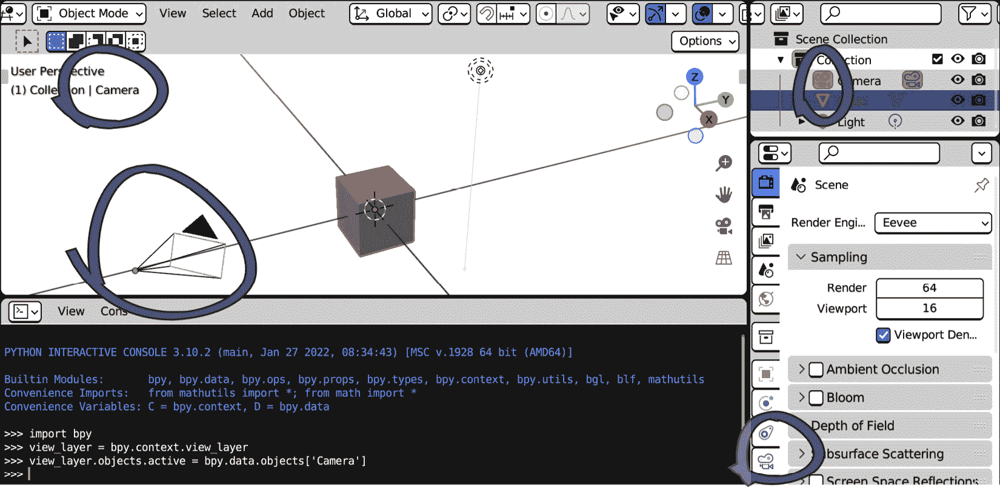

图 2.19：相机现在是活动对象

我们还可以看到立方体仍然被选中，而相机尽管是活动对象，却没有被选中。这是因为活动状态和选中状态是两个不同的概念。在下一节中，我们将看到它们之间的区别，以及如何查询和更改当前选择。

保持专注

Blender 的焦点策略一开始可能会让人困惑。鼠标光标下的区域接收键盘输入。

对于艺术家来说，这并不是一个大问题，因为他们的任务通常涉及保持光标在操作区域。但对于程序员来说则不同；我们可能会认为只为控制台输入代码行，却发现我们在 3D 视图中触发了快捷键，或者反过来。

### 已选对象

通过在 3D 视图中按*A*键（从菜单栏选择**Select | All**）来选择场景中的所有对象。然后，在控制台中，我们输入以下内容：

```py
>>> bpy.context.selected_objects
[bpy.data.objects['Cube'], bpy.data.objects['Light'], bpy.data.objects['Camera']]
```

`selected_objects`是一个 Python 列表。与`bpy.data.objects`不同，它按创建时间排序，而不是按字母顺序排序。对象*从不*按选择时间排序；Blender 根本不保留这些信息。如果我们的工具需要以特定顺序选择对象，我们必须在其他地方存储顺序。

选择一个对象通常使其成为当前层的活动对象。我们可以使用与`bpy.context.object`的比较来打印出哪个对象是活动的：

```py
import bpy
for ob in bpy.context.selected_objects:
    if ob is bpy.context.object:
        print(ob.name, 'is active, skipping')
        continue
    print(ob.name, 'is selected')
```

在所有默认对象被选中的情况下运行此代码片段将产生以下输出：

```py
Cube is active, skipping
Light is selected
Camera is selected
```

当我们想要从活动对象传播属性到选择集时，这种模式非常有用。我们已经看到，我们不应该假设活动对象总是被选中。反转选择将取消选中活动对象，但它将保持活动状态。或者可能根本就没有活动对象；它可以通过以下行删除或设置为`None`：

```py
bpy.context.view_layer.objects.active = None
```

使用`in`运算符可以检查活动对象是否属于选择集：

```py
is_sel = bpy.context.object in bpy.context.selected_objects
```

更好的是，我们可以使用`select_get()`和`select_set()`对象属性：

```py
is_sel = bpy.context.object.select_get()
```

与活动对象一样，每个对象的选择状态都是按视图层存储的。在下一节中，我们将学习如何影响当前选择以及它的存储位置。

#### 更改选中的对象

使用`object.select_get()`和`object.select_set()`查询和设置对象的选择状态，因为`select_set`函数的工作方式，我们可以在 Python 控制台中开始输入它，直到括号处：

```py
>>> bpy.context.object.select_set(
```

按下*Tab*键将显示函数及其参数的描述：

```py
select_set()
Object.select_set(state, view_layer=None)
Select or deselect the object. The selection state is per view layer
```

如果没有指定视图层，则使用当前层的选择集。例如，此代码片段将取消选择当前层中的所有对象：

```py
import bpy
for ob in bpy.context.selected_objects:
ob.select_set(False)
```

我们可以动态创建层并将不同的选择分配给它们。以下是一个创建视图层并选择网格对象和另一个选择相机的代码片段：

```py
import bpy
m_layer = bpy.context.scene.view_layers.new('Sel_Mesh')
c_layer = bpy.context.scene.view_layers.new('Sel_Cam')
for ob in bpy.data.objects:
    ob.select_set(ob.type == 'MESH', view_layer=m_layer)
    ob.select_set(ob.type == 'CAMERA', view_layer=c_layer)
```

选择是用户从场景中挑选对象的最直接方式。因此，`bpy.context`在脚本中起着关键作用，通常可用，甚至作为 Python 对象传递。

# 摘要

在本章中，我们看到了 Python 如何通过`bpy.data`访问 Blender 的内容，并介绍了空间实体，如向量。我们还看到了如何通过`bpy.context`与用户活动交互，以及如何通过影响对象和层的状态来改变上下文的只读属性。

在*第三章*中，我们将看到如何将我们的例程插入到自己的插件中，并使其准备好在 Blender 中安装和使用。

# 问题

1.  哪些辅助实用工具是 Blender 典型的？

1.  我们如何存储和显示空间坐标？

1.  `bpy`的哪个属性可以访问所有 Blender 实体？

1.  Blender 对象的 Python 类有构造函数吗？

1.  我们如何创建新的 Blender 对象？

1.  对象活动意味着什么？

1.  Blender 场景中的活动对象是一个属性吗？

1.  我们能否使用`bpy.context`来影响选择？

1.  我们能否使用`bpy.context.view_layer`来影响选择？
