# 第四章：探索对象变换

在空间中改变对象的位置、旋转和尺寸是任何动画软件的基本原则。

艺术家用于更改变换通道的值以执行这些操作。更技术性的用户了解此类动作的几何含义。

在本章中，我们将学习对象变换的工作原理以及如何在我们的脚本中实现它们。我们还将学习如何以编程方式添加对象约束，以及 Blender 如何为我们执行更复杂的操作。

最后，我们将实现一个新的命令，该命令可以一次影响更多对象的变换，并接受用户输入。

本章将涵盖以下关键主题：

+   使用坐标表示变换对象，并避免陷阱

+   应用对象约束和层次结构

+   使用矩阵表示

+   向我们的插件添加交互式操作员

# 技术要求

我们将使用 Blender 和**Visual Studio Code**（**VS Code**）。

本章创建的示例可以在以下网址找到：[`github.com/PacktPublishing/Python-Scripting-in-Blender/tree/main/ch4`](https://github.com/PacktPublishing/Python-Scripting-in-Blender/tree/main/ch4).

# 在空间中移动对象

三维对象可以移动、旋转和缩放。由于它们不改变对象的几何形状，位置和旋转被认为是**刚性变换**。技术上，使用缩放值改变对象的大小应用非刚性变换，但由于顶点几何形状没有改变，缩放被认为是对象级别的变换，并显示在位置和旋转旁边。

在本节中，我们将使用 Python 在 Blender 中变换对象。

## 变换对象

对象通过改变其位置、旋转和缩放通道的值进行变换。位置和缩放坐标立即与笛卡尔空间的 X、Y 和 Z 相关联；旋转有更多选项，因为它们带来一些含义。

### 影响对象的定位

我们已经在*第一章*和*第二章*中遇到了`location`属性。如果我们有一个活动对象，例如 Blender 默认场景中的立方体，以下行将把它移动到具有*x*、*y*、*z*坐标`1.0`、`2.0`和`3.0`的位置。这些行使用**元组赋值**一次设置所有三个坐标：

```py
import bpy
bpy.context.object.location = 1.0, 2.0, 3.0
```

由于 Blender 坐标也可以通过字母赋值，该表达式等同于以下内容：

```py
import bpy
bpy.context.object.location.xyz = 1.0, 2.0, 3.0
```

坐标存储在**向量**中。向量分量可以单独访问：

```py
import bpy
bpy.context.object.location[0] = 1.0
bpy.context.object.location[1] = 2.0
bpy.context.object.location[2] = 3.0
```

或者，它们可以通过以下方式访问：

```py
import bpy
bpy.context.object.location.x = 1.0
bpy.context.object.location.y = 2.0
bpy.context.object.location.z = 3.0
```

位置和缩放都存储为向量。

### 影响对象缩放

与位置一样，缩放的三维维度通过`Vector`坐标访问：

```py
>>> bpy.context.object.scale
Vector((1.0, 1.0, 1.0))
```

我们可以为对象分配非均匀缩放，例如每个轴有不同的值：

```py
import bpy
bpy.context.object.scale.xyz = 3.0, 2.0, 1.0
```

物体的缩放通常是均匀的，这意味着它在每个轴上都是相同的。Blender 矢量提供了一个方便的方式来分配均匀值：

```py
import bpy
bpy.context.object.scale.xyz = 3.0
```

与`位置`一样，`缩放`坐标可以单独设置或一起设置。顺便说一下，静止时的缩放值是`[1.0, 1.0, 1.0]`而不是`[0.0, 0.0, 0.0]`。这反映了缩放是一种乘法操作，而位置是加法操作。

旋转的组合不如立即。我们将看到有不同方式来表示旋转。

### 影响物体旋转

使用旋转，我们可以围绕*x*、*y*和*z*轴对物体进行定位。这样做会给物体赋予自己的方向，并拥有自己的*x*、*y*和*z*局部轴。

我们将这些与物体对齐的新轴称为**局部方向**。Blender 允许用户在变换物体时选择不同的轴。与视口网格对齐的轴是**全局方向**或**世界轴**：

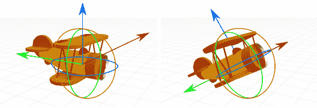

图 4.1：静止和旋转后的物体旋转环和轴

即使物体已经旋转，我们仍然可以在视口顶栏中更改**旋转模式**并使用*全局方向*：

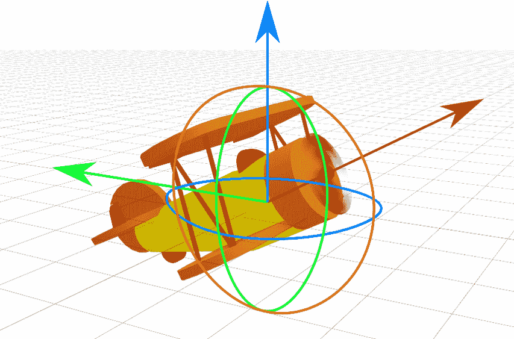

图 4.2：仍然使用全局方向的旋转飞机

旋转比平移和缩放更复杂：根据定义，旋转涉及一个支点和恒定的距离。因此，旋转会受到一些需要额外考虑的次要问题的影响。

#### 与旋转相关的问题

由于它们的复合性质，围绕一个轴的旋转可能会改变另一个轴的旋转值。总结一下，旋转被描述为只有两个**自由度**的三维属性，因为不超过两个通道有机会自由改变。

此外，旋转叠加的顺序会改变结果。为了正确可视化旋转后的物体，我们需要知道哪个轴首先被旋转，即**旋转顺序**。

我们可以坚持使用一种旋转顺序，比如*x*，然后*y*，然后*z*，但这将限制我们对抗另一个潜在缺陷的选择：重叠一个轴的另一个轴的三维旋转最终会使一个坐标变得无用，这是一个众所周知的问题，称为**万向节锁**。

由于不同的旋转顺序会在不同的角度上锁定，改变顺序有助于应对这个问题。

这些问题并不仅限于 Blender 或其他动画软件；它们是三维空间固有的属性，包括我们所在的空间。

为了解决这些问题，旋转提供了更广泛的选择。除了三个角度的不同组合顺序外，还有如四元数这样的抽象表示。这种术语一开始可能听起来很吓人，但随着我们继续本章的学习，它将变得更加熟悉。

#### 更改旋转模式

**变换属性**中的**旋转模式**框显示了可用于旋转对象的可用选项：

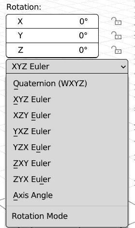

图 4.3：旋转模式

我们在这里不需要全面覆盖这个主题，但基本上以下提供了一个简要的介绍：

+   **四元数**：这些是使用四个系数的数学符号：在 Blender 中，**W**、**X**、**Y** 和 **Z**。四元数不受万向节锁的影响。

+   **欧拉角**：这些列出三个旋转轴上的角度。这是旋转的普遍接受方式，但有两个注意事项：结果取决于轴的顺序，一个轴可能最终与另一个轴重叠。为了减轻丢失通道到万向节锁的危险，允许更多的 **X**、**Y** 和 **Z** 组合。

+   **轴角**：这使用 **X**、**Y**、**Z** 来定义一个点作为旋转轴。**W** 属性是该方向上的扭转角。

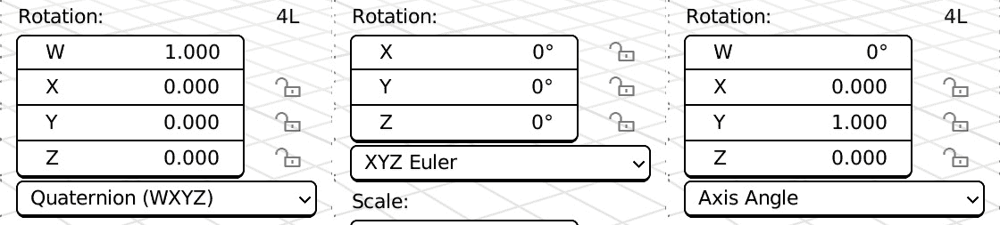

图 4.4：四元数、欧拉和轴角模式的旋转属性

在界面中更改此属性会更改显示的通道。在 Python 中，我们需要根据当前模式使用不同的属性。

#### 在 Python 中访问旋转

`rotation_mode` 属性指定正在使用哪个系统来旋转对象。它是一个 `TypeError`。错误信息打印出允许的关键词：

```py
>>> import bpy
>>> bpy.context.object.rotation_mode = "this won't work"
TypeError: bpy_struct: item.attr = val: enum "this won't work" not found in ('QUATERNION', 'XYZ', 'XZY', 'YXZ', 'YZX', 'ZXY', 'ZYX', 'AXIS_ANGLE')
```

每种模式都提供其设置旋转的属性：

+   `QUATERNION`：要影响四元数的系数 *W*、*X*、*Y* 和 *Z*，我们分别使用以下内容：

    +   `rotation_quaternion.w` 或 `rotation_quaternion[0]`

    +   `rotation_quaternion.x` 或 `rotation_quaternion[1]`

    +   `rotation_quaternion.y` 或 `rotation_quaternion[2]`

    +   `rotation_quaternion.z` 或 `rotation_quaternion[3]`

+   `XYZ`、`XZY`、`YXZ`、`YZX`、`ZXY` 和 `ZYX` 是按不同顺序评估的欧拉角。无论我们选择哪一个，这些欧拉属性如下：

    +   `rotation_euler.x` 或 `rotation_euler[0]`

    +   `rotation_euler.y` 或 `rotation_euler[1]`

    +   `rotation_euler.z` 或 `rotation_euler[2]`

我们应该将这些值设置为弧度。

+   `AXIS_ANGLE`：*轴角 – 轴角 (W+XYZ)*，定义围绕由 3D-向量定义的某个轴的旋转。我们可以通过以下方式设置扭转角（以弧度为单位）：

    +   `rotation_axis_angle[0]`

我们可以使用以下方式设置轴向量的 x、y、z 坐标：

+   `rotation_axis_angle[1]`

+   `rotation_axis_angle[2]`

+   `rotation_axis_angle[3]`

`math` 模块在以弧度作为角度单位的使用上提供了一些帮助。

#### 使用弧度和度

Blender 的 API 使用弧度而不是度来描述旋转角度。度数使用介于 0 到 360 之间的值来表示一个角度，而弧度介于 0 到 2π之间。希腊字母π（pi）指的是圆与其直径的比例。2π（约等于 6.28）测量半径为 1.0 的完整圆的弧长。

在 Python 中，我们可以使用`math`模块的函数在两个系统之间进行转换，即`radians()`和`degrees()`，以及`pi`变量以快速访问π的值。

以下是一个示例：

```py
>>> from math import radians, degrees, pi
>>> degrees(2 * pi)
360.0
>>> radians(360)
6.283185307179586
```

考虑到这一点，当我们设置旋转时，我们可以即时转换角度单位。

#### 设置旋转属性

在脚本中设置旋转之前，我们必须确保我们使用正确的旋转系统。在以下片段中，我们事先设置了旋转模式：

```py
import bpy
ob = bpy.context.object
# apply a 90 degrees on X axis rotation using Quaternions
ob.rotation_mode = 'QUATERNION'
ob.rotation_quaternion.w = 0.707107
ob.rotation_quaternion.x = 0.707107
ob.rotation_quaternion.y = 0.0
ob.rotation_quaternion.z = 0.0
# apply a 90 degrees on X axis rotation using Eulers
ob.rotation_mode = 'XYZ'
ob.rotation_euler.x = radians(90)
ob.rotation_euler.y = 0.0
ob.rotation_euler.z = 0.0
# apply a 90 degrees on X axis rotation using Axis Angle
ob.rotation_mode = 'AXIS_ANGLE'
ob.rotation_axis_angle[0] = radians(90)
ob.rotation_axis_angle[1] = 1
ob.rotation_axis_angle[1] = 0
ob.rotation_axis_angle[1] = 0
```

当我们更改`rotation_mode`时，Blender 会将当前状态转换为所选系统。这防止了对象突然在空间中改变其方向，并且适用于大多数情况，但也有一些例外。例如，动画为每个关键帧设置了值，因此切换动画控制的旋转类型会导致在播放时改变视觉旋转。在这种情况下，我们可以在脚本中使用转换方法，就像我们将在下一个 Python 片段中看到的那样。

#### 在旋转系统之间转换

在以下片段中，我们从一个`Euler`旋转开始，并使用转换方法来更改旋转模式：

```py
from mathutils import Euler
# create a 90 degrees rotation Euler
rot_90x_eu = Euler((radians(90), 0, 0))
# convert to quaternion
rot_90x_quat = rot_90x_eu.to_quaternion()
# convert to axis angle
rot_90x_aa = rot_90x_quat.to_axis_angle()
```

在撰写本文时，欧拉表示法还没有`to_axis_angle()`方法，因此我们首先将其转换为四元数。使用四元数作为交叉点是常见的，因为它们是表达旋转的最通用系统。

旋转也可以写成**矩阵**的形式。矩阵形式是所有变换在内部存储的方式。在我们学习了更多关于间接变换（即在不改变其通道的情况下移动对象）之后，我们将了解这一点。

# 间接变换对象

我们已经看到了如何通过直接改变通道来变换对象。还有两种其他方式可以影响对象的位置、旋转和缩放。**对象约束**是特殊的工具，通过限制某些值或从另一个对象复制它们来影响变换。

然后还有通过**父子关系**安排更多对象层次结构的可能性，即通过使一个对象属于另一个对象。

我们将看到这些操作如何在 Python 中体现。

## 使用对象约束

约束可以移动、旋转或缩放一个对象，而不会改变其变换属性。其中一些，例如**复制变换**，完全覆盖了对象的变换；而另一些，例如**限制距离**，则在其之上操作。

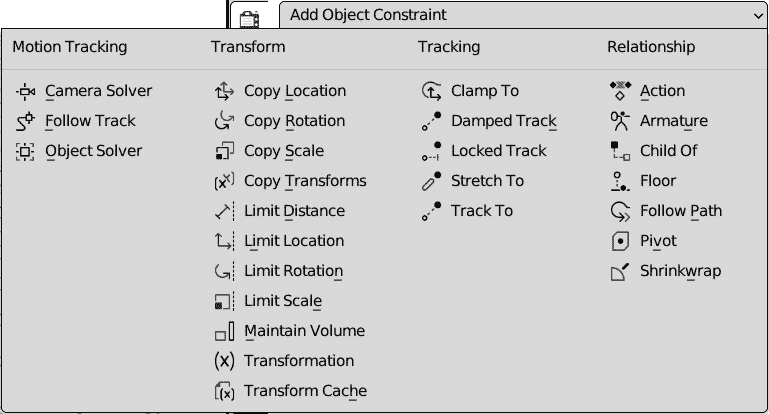

图 4.5：Blender 约束菜单

大多数约束将更多对象的变换绑定在一起，例如**复制位置**，而另一些，例如**限制位置**，有自己的变换属性。

一个对象可以有未指定的约束数量。在 Python 中添加它们的步骤与在图形界面中的工作方式非常相似。

### 在 Python 中添加约束

约束作为对象的一个集合属性公开。可以通过向`new(type)`方法提供约束类型来添加它们。

与旋转模式类似，提供错误的关键字将提示错误并列出可用选项：

```py
>>> import bpy
>>> bpy.context.object.constraints.new("this won't work")
TypeError: ObjectConstraints.new(): error with keyword argument "type" -  enum " this won't work " not found in ('CAMERA_SOLVER', 'FOLLOW_TRACK', 'OBJECT_SOLVER', 'COPY_LOCATION', 'COPY_ROTATION', 'COPY_SCALE', 'COPY_TRANSFORMS', 'LIMIT_DISTANCE', 'LIMIT_LOCATION', ...
```

`new`方法返回创建的约束，因此我们可以轻松访问其属性。

### 设置约束属性

不同的约束类型有不同的属性，但存在一些共同的模式。大多数约束将包含以下属性：

**布尔**开关：

+   `.enabled`: 这启用/禁用约束

+   `.use_x`, `.use_y`, `.use_z`: 当可用时，仅启用/禁用一个轴

+   `.use_offset`: 当可用时，将约束效果累加到变换通道

+   对象：如果可用，使用`.target`来设置约束的绑定目标

+   字符串：如果可用，使用`.subtarget`来仅使用目标的一部分（例如，顶点组）进行实际计算

+   **枚举**开关：

    +   `.target_space`: 这使约束在`.owner_space`上起作用：这更改约束源数据为**本地**、**世界**或**自定义****对象**级别

浮点数：使用`.influence`来传达只有部分效果

一些属性是特定于每种类型的，例如**距离约束**的`distance`属性。在这种情况下，它们的路径可以通过在图形界面中悬停或右键单击来追踪（见*第二章*中的*复制数据路径部分*)或从 API 文档中（见*第二章*中的*访问 Blender 数据部分*)。 

### 限制对象缩放

以下代码片段添加了一个**限制缩放**约束，该约束限制了活动对象的最高高度：

```py
import bpy
ob = bpy.context.object
limit = ob.constraints.new(type='LIMIT_SCALE')
limit.use_max_z = True  # limit the height only
limit.max_z = 0.5
```

如果应用于默认立方体，它将将其高度减半，就像应用了 `[1.0, 1.0, 0.5]` 的缩放一样，尽管其缩放值仍然是 `[1.0,` `1.0, 1.0]`。

对象可以是层次结构的一部分。在这种情况下，它们遵循其层次树中级别更高的对象。我们将在下一节中探讨这个概念。

## 使用对象层次结构

视口中的对象可以作为其他对象的**子对象**进行排列。在这种情况下，它们将受到其**父对象**的平移、旋转和缩放的影响。

我们可以通过 Python 中的`parent`、`children`和`children_recursive`属性来访问层次关系。只有`parent`属性是可写的；其他两个仅用于列出。

`children`和`children_recursive`之间的区别在于后者列出了层次结构中受影响的每个对象，包括子对象的子对象以及所有**后代**。

此代码片段将所有现有对象依次作为父对象，然后打印一份报告：

```py
import bpy
previous = bpy.data.objects[0]
for ob in bpy.data.objects[1:]:
    # parent each object under its predecessor
    ob.parent = previous
    previous = ob
for ob in bpy.data.objects:
    # now print out the children of each object
    print(ob.name)
    child_names = (c.name for c in ob.children)
    print("\tchildren:", ", ".join(child_names))
    child_names = (c.name for c in ob.children_recursive)
    print("\tchildren recursive:", ", ".join(child_names))
    print("")
```

在默认场景中运行该代码将产生以下结果：

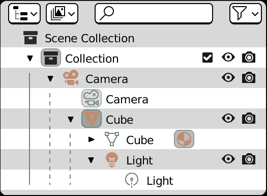

图 4.6：在一个层次结构中默认重置的父级对象

这在打印输出中得到了反映：第一个对象列出了所有其他对象作为*孙辈*，而`children_recursive`和`children`对于最后两个没有其他后代的对象，包含相同的结果：

```py
Camera
        children: Cube
        children recursive: Cube, Light
Cube
        children: Light
        children recursive: Light
Light
        children:
        children recursive:
```

如果我们查看视口，我们可以看到对象位置已经改变：在 Python 中设置对象的父级会立即应用一个新的参考系。为了复制这种行为，我们需要理解变换矩阵。

# 理解变换矩阵

位置、旋转和缩放的三维变换存储在一个**矩阵**中。矩阵在广义上是由行和列排列的数字表。变换矩阵通过**线性代数**组合。我们不会深入细节；我们只是快速看一下矩阵的含义以及我们如何在脚本中使用它。

就像其他表示一样，Blender 在`mathutils`模块中提供了一个`Matrix`类：

```py
>>> from mathutils import Matrix
>>> Matrix()
Matrix(((1.0, 0.0, 0.0, 0.0),
        (0.0, 1.0, 0.0, 0.0),
        (0.0, 0.0, 1.0, 0.0),
        (0.0, 0.0, 0.0, 1.0)))
```

包含这些默认值，其对角线条目为`1.0`，其他地方为`0.0`的矩阵代表了*静止*状态。换句话说，与这个矩阵关联的对象没有被移动、旋转或缩放。它被称为**单位矩阵**，因为它使对象保持*相同*的状态。

每当对象移动、旋转或缩放时，其矩阵的条目都会改变为不同的值。

## 访问矩阵

对象包含多个矩阵。尝试通过自动完成来访问对象矩阵会显示四个不同的属性：

```py
>>> bpy.context.object.matrix_
                              basis
                              local
                              parent_inverse
                              world
```

每个条目都涵盖了一个特定的方面：

+   `matrix_basis`：这个矩阵包含了对象在由对象约束变换之前的本地位置、旋转和缩放。这个矩阵反映了在对象属性中显示的通道。

+   `matrix_local`：这个矩阵包含了一个对象的位置、旋转和缩放，省略了从父级对象继承的变换，但不包括由约束产生的变换。

+   `matrix_parent_inverse`：每当我们不希望一个静止的对象与其父级完全匹配时，我们会在该矩阵内添加一个偏移量。

+   `matrix_world`：这个矩阵包含了在全局坐标系中的最终位置、旋转和缩放，反映了对象所受的所有变换。

考虑到这一点，我们可以改进上一节中的*父级片段*，并保持对象位置不变。

## 存储对象矩阵

通过 Python 设置父级关系之前，曾经使每个对象都瞬间移动到其父级位置。

我们希望它们在层次结构改变后保持其视觉变换。用矩阵术语来说，我们想要保持它们的世界矩阵不变。为了做到这一点，我们将学习如何正确地存储矩阵。

## 复制矩阵

包含单个值的 Python 变量存储它们自己的数据。具有聚合值（如列表、字典和 Blender `mathutils` 类型）的变量指向它们值的共享引用。

让我们看看以下示例。`b` 变量的值与 `a` 相同。在将 `a` 更改为 `5` 之后，`b` 仍然是 `4`：

```py
>>> a = 4
>>> b = a
>>> a += 1
>>> print(b)
4
```

这同样不适用于列表，即使它们只包含一个元素：

```py
>>> a = [4]
>>> b = a
>>> a[0] += 1
>>> print(b)
[5]
```

尽管是不同的变量，`b` 列表指向与 `a` 列表相同的数据。为了使其不更新原始数据，我们必须明确声明它是一个副本。

熟练的 Python 用户非常清楚如何使用 Python 的 `copy` 模块来避免这种情况。Blender 聚合类型提供了一个 `.copy()` 方法以方便使用。

在下面的代码片段中，对 `matrix_a` 的更改也会影响 `matrix_b`：

```py
# two variables pointing to the same matrix
matrix_b = matrix_a  # matrix_b ALWAYS equals matrix_a
```

下面的代码创建了一个 `matrix_a`，即它的所有值都是复制的：

```py
# deep copy of a matrix
matrix_b = matrix_a.copy()  # matrix_b stores its values
```

我们现在可以保持对象的世界变换，并在层次结构改变后恢复它们。

## 使用世界矩阵恢复变换

由于 `matrix_world` 是可写的，它可以在设置父级后存储并重新应用。

要恢复矩阵到其原始状态，我们需要存储其值的副本，如下面的代码片段所示：

```py
import bpy
previous = bpy.data.objects[0]
for ob in bpy.data.objects[1:]:
    # store a copy of the world mat
    w_mat = ob.matrix_world.copy()  # .copy() is important!
    # parent each object under its predecessor
    ob.parent = previous
    # restore world position
    ob.matrix_world = w_mat
    # set current object as parent of the next
    previous = ob
```

我们可以看到对象保持其位置。如果我们查看变换通道，我们会发现它们已经改变。

设置世界矩阵会影响位置/旋转/缩放值。在它们的原始位置，对象仍然回到其父级中心。

如果这不是我们想要实现的目标，我们可以使用 `matrix_parent_inverse` 属性来偏移原始位置。

## 使用父级逆矩阵创建原始偏移

`parent_matrix_inverse` 属性包含一个从界面中隐藏的变换。它用于设置远离父级原点的原始位置。

策略是抵消继承的变换，将它的逆变换添加到变换中。例如，将对象移动到 `[5.0, 5.0, 5.0]` 坐标的逆变换是将它移动到 `[-5.0, -5.0, -5.0]`。

逆转旋转稍微复杂一些，但在 Blender 中，我们可以使用其矩阵的 `.inverted()` 方法找到任何变换的逆变换。

这就是以下代码片段如何将 `bpy.data` 中的对象设置为父级，同时保持它们的变换和视觉坐标：

```py
import bpy
previous = bpy.data.objects[0]
for ob in bpy.data.objects[1:]:
    # parent each object under its predecessor
    ob.parent = previous
    # set parent inverse offset
    offset_matrix = previous.matrix_world.inverted()
    ob.matrix_parent_inverse = offset_matrix
    # set current object as parent of the next
    previous = ob
```

矩阵系统可能令人畏惧，因为许多人通常不会以这种形式考虑变换。但即使是对它的基本理解也为我们提供了脚本工具箱中的非常强大的工具。

在下一节中，我们将本章学到的技能应用于单个插件。此插件可以一次性更改许多对象的位置，并且可以选择通过约束进行工作。

# 编写 Elevator 插件

现在我们知道了如何在 Python 中变换对象，我们可以编写一个新的插件，其中包含变换操作符。

此插件允许我们将所有选定的对象移动到一定的高度以上。当我们想要为场景设置最小高度，即*地板*时，这可能很有用。正如我们在*第三章*中所做的那样，我们从一个基本的实现开始，然后我们将继续对其进行完善。像往常一样，我们首先为章节的代码设置一个文件夹。

## 设置环境

正如我们在*第三章*开头所做的那样，我们在`ch4`文件夹中为*第四章*创建一个文件夹作为**脚本**文件夹：


图 4.7：第四章的系统文件夹

现在是时候向我们的项目中添加一个新文件了：

1.  在 VS Code 中选择 `PythonScriptingBlender/ch4/addons`。

1.  点击**新建** **文件**图标创建一个新文件。

1.  将新文件命名为`object_elevator.py`。

1.  双击文件打开它。

我们现在可以开始编写我们的插件了。

## 编写第一个草稿

正如我们在*第三章*的*插件要求*部分所看到的，我们的插件需要以下内容：

+   插件*信息* `bl_info` 字典

+   执行所需操作的*操作员*

+   `register`/`unregister`函数用于`enable`/`disable`操作

让我们开始编写第一个草稿，通过填写要求；我们可以在第二步中完善插件：

1.  我们在`bl_info`头部写下附加信息。这也有助于阐明工具的目的和功能：

object_elevator.py

```py
bl_info = {
    "name": "Elevator",
    "author": "John Doe",
    "version": (1, 0),
    "blender": (3, 00, 0),
    "description": "Move objects up to a minimum height",
    "category": "Object",
}
```

1.  现在，让我们确定主要功能：插件包含一个操作员，可以将所有对象移动到给定的高度。我们将这个高度存储在静态变量`floor`中，目前它是硬编码的，设置为`5.0`：

    ```py
    class OBJECT_OT_elevator(bpy.types.Operator):
    ```

    ```py
        """Move Objects up to a given height"""
    ```

    ```py
        bl_idname = "object.pckt_floor_transform"
    ```

    ```py
        bl_label = "Elevate Objects"
    ```

    ```py
        floor = 5.0
    ```

1.  由于它会影响选定的对象，`poll()`方法中要检查的条件是选择不为空：

    ```py
        @classmethod
    ```

    ```py
        def poll(cls, context):
    ```

    ```py
            return len(bpy.context.selected_objects) > 0
    ```

1.  这里是代码的主体部分：`execute`函数检查每个对象的`Z`位置是否不小于`self.floor`（目前，`self.floor`等于`5.0`）。当所有对象都处理完毕后，它返回一个`'FINISHED'`状态：

    ```py
        def execute(self, context):
    ```

    ```py
            for ob in context.selected_objects:
    ```

    ```py
                if ob.location.z > self.floor:
    ```

    ```py
                    continue
    ```

    ```py
                ob.location.z = self.floor
    ```

    ```py
            return {'FINISHED'}
    ```

1.  现在，我们可以将我们的操作员添加到对象的右键菜单中；为此，我们需要一个`drawmenu`函数：

    ```py
    def draw_elevator_item(self, context):
    ```

    ```py
        # Menu draw function
    ```

    ```py
        row = self.layout.row()
    ```

    ```py
        row.operator(OBJECT_OT_elevator.bl_idname)
    ```

1.  我们插件的全部元素都已准备就绪；剩下的只是将它们添加到注册函数中。这就是我们这样做的方式：

    ```py
    def register():
    ```

    ```py
        # add operator and menu item
    ```

    ```py
        bpy.utils.register_class(OBJECT_OT_elevator)
    ```

    ```py
        object_menu = bpy.types.VIEW3D_MT_object_context_menu
    ```

    ```py
        object_menu.append(draw_elevator_item)
    ```

    ```py
    def unregister():
    ```

    ```py
        # remove operator and menu item
    ```

    ```py
        bpy.utils.unregister_class(OBJECT_OT_elevator)
    ```

    ```py
        object_menu = bpy.types.VIEW3D_MT_object_context_menu
    ```

    ```py
        object_menu.remove(draw_elevator_item)
    ```

我们的插件已经准备好进行测试。我们可以在**插件**首选项中找到它：

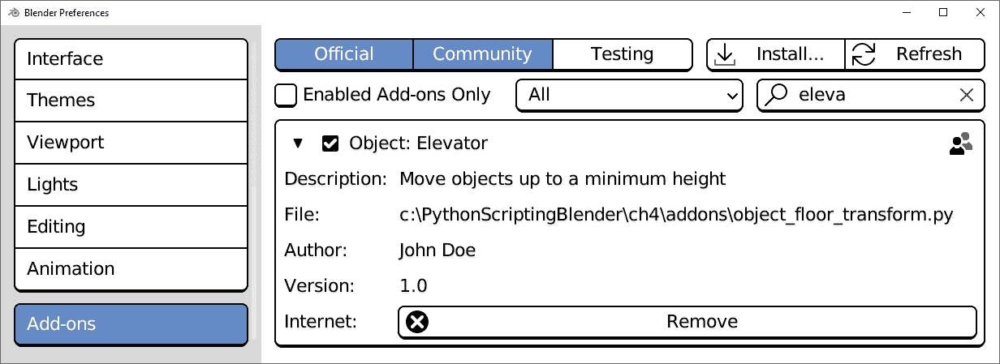

图 4.8：在插件首选项中启用的对象：电梯

当插件启用时，对象右键菜单中会添加一个新条目：

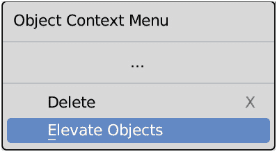

图 4.9：在视图中右键单击显示我们的新菜单项

如果我们选择一些对象并通过右键单击它们打开上下文菜单，我们将找到 `location.z` 到 `5.0`，除非它已经有一个更高的值。

为场景设置最小高度在它包含地面层并且我们想要确保没有对象最终低于它时很有用。然而，`OBJECT_OT_elevator.floor` 的静态值在这里没有帮助，因为它只适用于地面层等于 `5.0` 的情况。

幸运的是，这只是为了测试：脚本的最终版本使用了一个输入参数。

## 使用输入属性

将我们操作符中的静态 `floor` 成员替换为可编辑值需要 Blender 将用户输入通道到我们的 Python 脚本中。

为了这个目的，Blender 的 API 提供了特殊的属性，它们在界面中作为图形元素出现，并可以在 Python 脚本中用作变量。这些属性是 `bpy.props` 模块的一部分。

要使 `floor` 成为我们的操作符的可编辑属性：

1.  由于 `OBJECT_OT_elevator.floor` 是一个浮点数，所以我们需要使用 `FloatProperty`：

    ```py
    import bpy
    ```

    ```py
    from bpy.props import FloatProperty
    ```

1.  由于我们正在强制指定一个特定类型，我们将使用 Python 的 `floor = 5.0` 到 `floor:FloatProperty(name="Floor", default=0)`。

注意

使用替代确定类型的变量注释是 Python 中的最佳实践，但在 Blender 中是必需的：否则输入属性将不会出现。

1.  然后，我们必须记住，由于 Blender 的工作方式，接受输入值的操作符必须了解撤销系统。因此，我们添加了 `bl_options = {'REGISTER', 'UNDO'}` 属性。

现在我们操作符的标题看起来是这样的：

```py
class OBJECT_OT_elevator(bpy.types.Operator):
    """Move Objects up or down by given offset"""
    bl_idname = "object.pckt_type_collector"
    bl_label = "Create Type Collections"
    bl_options = {'REGISTER', 'UNDO'}
    floor: FloatProperty(name="Floor", default=0)
```

1.  通过按 *F3* + **重新加载脚本** 并再次执行 **提升对象** 来刷新操作符，将在屏幕左下角显示一个展开的弹出窗口中的输入属性：

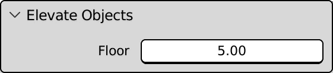

图 4.10：我们的可编辑地板属性

更改此属性会影响所有选中对象的最小高度。

到目前为止，我们一直在操作 `location.z` 属性。如果我们的对象有一个具有不同方向或缩放的父对象，这可能不起作用。我们可以通过使用对象世界矩阵来克服这个问题。

## 在世界矩阵中设置高度

Blender 将对象平移存储在矩阵的最后一列中，如 *图 4**.11* 所示：

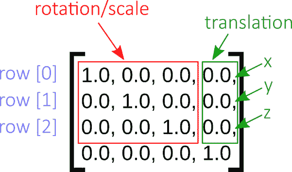

图 4.11：变换矩阵的项

`Matrix` 的索引指向其行；因此，要访问位置 z，我们需要获取第三行并查找其第四个元素。由于枚举从 `0` 开始，我们正在寻找的索引分别是 `[2]` 和 `[3]`。

我们的 `execute` 函数现在使用 `matrix_world[2][3]` 而不是 `location.z`。由于矩阵值在脚本执行期间不会自动更新，我们将在值设置后调用 `context.view_layer.update()`：

```py
    def execute(self, context):
        selected_objects = context.selected_objects
        for ob in selected_objects:
            matrix_world = ob.matrix_world
            if matrix_world[2][3] > self.floor:
                continue
            matrix_world[2][3] = self.floor
            # make sure next object matrix will be updated
            context.view_layer.update()
        return {'FINISHED'}
```

这个版本的脚本可以处理继承父变换的对象，但如果父对象也被选中怎么办？

在处理完子对象之后移动父对象将改变两者的位置，从而将子对象带到错误的高度。

我们需要确保父对象总是首先移动。

## 避免重复变换

我们需要重新排序我们的对象列表，但由于`context.selected_objects`是只读的，我们无法直接对其进行排序；我们需要将其内容复制到一个列表中。

### 将选定的对象复制到可编辑列表中

我们可以使用`copy`模块创建该列表的**浅拷贝**。它将引用相同的数据，但允许我们随意对其进行排序：

```py
from copy import copy
```

然后，在`execute`方法中，定位以下代码：

```py
selected_objects = context.selected_objects
```

用以下代码替换它：

```py
selected_objects = copy(context.selected_objects)
```

现在我们可以以这种方式对列表进行排序，这样就不会导致同一对象被移动两次。

### 按层次排序

要对一个列表进行排序，我们需要一个函数，该函数返回每个元素在新顺序中的位置。

我们希望在处理完父对象之后才处理子对象。通过重新排序列表，使具有更多祖先的对象稍后处理，以满足这个条件。

我们需要一个函数来返回祖先的数量：从一个对象开始，检查它是否有父对象，然后检查那个父对象是否有父对象，直到没有找到为止。`ancestors_count`函数使用`while`循环实现这一点：

```py
def ancestors_count(ob):
    """Return number of objects up in the hierarchy"""
    ancestors = 0
    while ob.parent:
        ancestors += 1
        ob = ob.parent
    return ancestors
```

我们将这个函数添加到我们的脚本中，并将其用作`sort`方法的`key`参数：

```py
    def execute(self, context):
        # sort parent objects first
        selected_objects = copy(context.selected_objects)
        selected_objects.sort(key=ancestors_count)
        for ob in selected_objects:
            world_mat = ob.matrix_world
            if world_mat[2][3] > self.floor:
                continue
            # ensure update of next object's matrix
            world_mat[2][3] = self.floor
        return {'FINISHED'}
```

我们现在可以将所有选定的对象提升到最小高度，并避免在层次结构中累加变换。

我们可以认为它已经完成，但既然我们知道如何添加约束，我们可以将其用于相同的目的。

## 添加约束开关

我们可以允许用户使用约束，同时不影响变换通道。我们可以这样做到：

1.  由于我们想要显示一个用于使用约束的复选框，我们需要在我们的操作符中添加一个布尔属性。我们需要像之前导入`FloatProperty`一样导入`BoolProperty`：

    ```py
    from bpy.props import BoolProperty
    ```

1.  然后，我们在我们的操作符中添加一个`BoolProperty`注解：

    ```py
    class OBJECT_OT_elevator(bpy.types.Operator):
    ```

    ```py
        """Move Objects up or down by given offset"""
    ```

    ```py
        bl_idname = "object.pckt_type_collector"
    ```

    ```py
        bl_label = "Create Type Collections"
    ```

    ```py
        bl_options = {'REGISTER', 'UNDO'}
    ```

    ```py
        floor: FloatProperty(name="Floor", default=0)
    ```

    ```py
        constr: BoolProperty(name="Constraints", default=False)
    ```

1.  当`constr`属性设置为`True`时，我们将使用约束。默认情况下，我们将其设置为`False`，这样新的选项就不会改变附加组件的行为。

1.  使用约束使我们的工作变得更简单；我们不需要对对象进行排序并设置它们的矩阵。我们的`execute`函数现在开始如下：

    ```py
    def execute(self, context):
    ```

    ```py
        if self.constr:
    ```

    ```py
            for ob in context.selected_objects:
    ```

    ```py
                limit = ob.constraints.new('LIMIT_LOCATION')
    ```

    ```py
                limit.use_min_z = True
    ```

    ```py
                limit.min_z = self.floor
    ```

    ```py
            return {'FINISHED'}
    ```

    ```py
        # affect coordinates directly
    ```

    ```py
        # sort parent objects first
    ```

    ```py
        …
    ```

如果我们使用约束，我们只需退出函数，在设置完约束后立即返回一个`{'FINISHED'}`集合。如果不这样做，`execute`函数将继续执行之前的代码。

视觉结果等效，但开启**约束**不会影响变换通道。有一个最后的注意事项：如果操作符在相同的对象上多次运行，将添加一个新的约束。

当找到现有约束时，我们将使**提升对象**重用该约束。这避免了为相同目的创建过多的约束。它还防止了先前约束的效果相互干扰。当一个对象有多个位置限制时，只有最严格的那个是有效的。

## 避免重复约束

如果对象上存在**限制位置**，我们的操作符会使用它。我们将其行为设置为可选，以防用户无论如何都想创建新的约束：

1.  为了做到这一点，我们首先为我们的操作符添加另一个布尔属性：

    ```py
    reuse: BoolProperty(name="Reuse Constraints", default=True)
    ```

1.  然后，在我们的循环内部，我们检查是否存在我们可以使用的现有约束。如果没有找到，我们的脚本将创建它。

这种行为可以通过一个函数实现：

```py
def get_constraint(ob, constr_type, reuse=True):
    """Return first constraint of given type.
    If not found, a new one is created"""
    if reuse:
        for constr in ob.constraints:
            if constr.type == constr_type:
                return constr
    return ob.constraints.new(constr_type)
```

1.  这使得我们的`execute`方法变得更加简洁：

    ```py
    def execute(self, context):
    ```

    ```py
        if self.constr:
    ```

    ```py
            for ob in context.selected_objects:
    ```

    ```py
                limit = get_constraint(ob,
    ```

    ```py
                                      'LIMIT_LOCATION',
    ```

    ```py
                                       self.reuse)
    ```

    ```py
                limit.use_min_z = True
    ```

    ```py
                limit.min_z = self.floor
    ```

    ```py
            return {'FINISHED'}
    ```

    ```py
        …
    ```

如果我们重新加载脚本并运行操作符，我们将在执行面板中看到所有其属性：

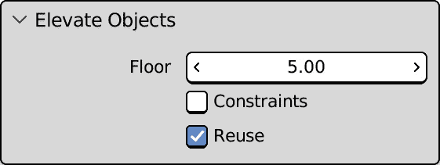

图 4.12：所有提升对象选项

理想情况下，**重用**属性应该仅在**约束**启用时显示，因为否则它没有效果。

如果我们注意绘制我们工具的用户界面，这是在下一章中将要介绍的，这是可能的。

目前，我们为从非常简单的工具开始的脚本添加了大量灵活性。这使我们到达了本章的结尾，因为我们已经涵盖了关于编写自定义工具的大部分主题。

# 摘要

在本章中，我们学习了如何利用`Vector`、`Quaternion`和`Matrix`实体，以及不同的*旋转模式*来为我们自身谋利。这为我们理解并掌握空间中的变换以及移动场景中的对象提供了元素。

我们还学习了如何在 Python 中创建约束，这在所有设置脚本中都非常重要。

最后，我们学习了我们的操作符如何在执行期间从用户那里获取输入并在 Blender 用户界面中显示它们的参数。

在*第五章*中，我们将学习如何为我们自己的图形界面编写面板代码，并使其选项能够感知上下文。

# 问题

1.  什么是刚体变换？

1.  我们能否在不同旋转系统之间转换坐标？

1.  我们能否在不同旋转顺序之间转换坐标？

1.  为什么四元数在转换中很有用？

1.  变换是以何种形式存储在内部？

1.  对象是否只与一个变换矩阵相关联？
